<!-- Carátula UPC -->

<p align="center" class="cover-logo">
  
</p>

<h2 align="center" class="cover-university">UNIVERSIDAD PERUANA DE CIENCIAS APLICADAS</h2>

<h3 align="center" class="cover-degree">
INGENIERÍA DE SOFTWARE
</h3>

<p align="center" class="cover-cycle"><strong>Ciclo académico:</strong> 2026-20 </p>

<p align="center" class="cover-course">
  1ASI0572 – Desarrollo de Soluciones IoT<br>
  <strong>NRC:</strong> 16518<br>
  <strong>Docente:</strong> Jimmy Enrique Sánchez Portugal
</p>


<h1 align="center" class="cover-title">Informe de Trabajo Final</h1>

<p align="center" class="cover-product">
  <strong>Startup:</strong> SecurityBear<br>
  <strong>Producto:</strong> ResQ
</p>

<h3 align="center" class="cover-members-heading">Integrantes</h3>

<table
  class="cover-members-table"
  align="center"
  style="margin-left: auto; margin-right: auto;"
>
  <thead>
    <tr>
      <th>Código UPC</th>
      <th>Apellidos y Nombres</th>
    </tr>
  </thead>

  <tbody>
    <tr><td>U202222001</td><td>Aliaga Urbina, Wilder Gonzalo</td></tr>
    <tr><td>U202324129</td><td>Chacaliaza Minaya, Eduardo Fabian</td></tr>
    <tr><td>U202116246</td><td>Guerrero Vasquez, Jhon Danny</td></tr>
    <tr><td>U202215462</td><td>Nanfuñay Liza, Pedro Jesús</td></tr>
    <tr><td>U202320442</td><td>Quispe Barzola, Fabricio Fabian</td></tr>
    <tr><td>U202218181</td><td>Sánchez Guevara, Iván Fernando</td></tr>
  </tbody>
</table>

<br>

<p align="center" class="cover-date" style="font-weight: bold;">Septiembre 2026</p>


<div style="page-break-after: always; break-after: page;"></div>


# Registro de Versiones del Informe

| Versión | Fecha | Autor | Descripción de modificación |
|---|---|---|---|
| 1.0 | 13/09/2026 | Sánchez Guevara, Iván Fernando | Elaboración de las secciones 1.1 Startup Profile, 1.1.1 Descripción de la Startup, 1.1.2 Perfiles de integrantes del equipo, 1.2 Solution Profile, 1.2.1 Antecedentes y problemática, 4.1.2 Context Mapping, 4.1.3.2 Software Architecture Context Level Diagrams, 4.1.3.3 Software Architecture Container Level Diagrams, 4.1.3.4 Software Architecture Deployment Diagrams y 4.2.9 Bounded Context: Connectivity Management, incluyendo sus capas y diagramas técnicos. |
| 1.1 | 14/09/2026 | Nanfuñay Liza, Pedro Jesús | Elaboración de las secciones 1.2.2 Lean UX Process, 1.2.2.1 Lean UX Problem Statements, 1.2.2.2 Lean UX Assumptions, 1.2.2.3 Lean UX Hypothesis Statements, 1.2.2.4 Lean UX Canvas, 4.1.1 Design-Level EventStorming, 4.1.1.1 Candidate Context Discovery, 4.1.1.2 Domain Message Flows Modeling, 4.1.1.3 Bounded Context Canvases y 4.2.6 Bounded Context: Monitoring, incluyendo sus capas y diagramas técnicos. |
| 1.2 | 15/09/2026 | Chacaliaza Minaya, Eduardo Fabian | Elaboración de las secciones 1.3 Segmentos objetivo, 2.1 Competidores, 2.1.1 Análisis competitivo, 2.1.2 Estrategias y tácticas frente a competidores, 3.3 Product Backlog, 4.1 Strategic-Level Domain-Driven Design, 4.1.3 Software Architecture, 4.1.3.1 Software Architecture System Landscape Diagram, 4.2 Tactical-Level Domain-Driven Design y 4.2.3 Bounded Context: Alert & Response Management, incluyendo sus capas y diagramas técnicos. |
| 1.3 | 16/09/2026 | Quispe Barzola, Fabricio Fabian | Elaboración de las secciones 2.2 Entrevistas, 2.2.1 Diseño de entrevistas, 2.2.2 Registro de entrevistas, 2.2.3 Análisis de entrevistas, 3.1 User Stories, 3.2 Impact Mapping, 4.2.1 Bounded Context: Identity and Access Management (IAM) y 4.2.2 Bounded Context: Risk Detection, incluyendo Domain, Interface, Application e Infrastructure Layers, Component Level Diagrams, Domain Layer Class Diagrams y Database Design Diagrams. |
| 1.4 | 17/09/2026 | Aliaga Urbina, Wilder Gonzalo | Elaboración de las secciones 2.3.1 User Personas, 2.3.2 User Task Matrix, 2.3.3 User Journey Mapping, 2.3.4 Empathy Mapping, 4.2.4 Bounded Context: Building Management y 4.2.5 Bounded Context: Device Management, incluyendo sus capas y diagramas técnicos correspondientes. |
| 1.5 | 17/09/2026 | Guerrero Vasquez, Jhon Danny | Elaboración de las secciones 2.3 Needfinding, 2.4 Big Picture EventStorming, 2.5 Ubiquitous Language, 4.2.7 Bounded Context: User y 4.2.8 Bounded Context: Incident, incluyendo sus capas, componentes, diagramas de clases y diseño de persistencia correspondientes. |

<!-- PENDIENTE: Validar la fecha y el autor de la versión inicial y completar las siguientes versiones con base en el historial real de GitHub. Cada fila debe tener un solo autor y representar una modificación real del documento. -->

# Project Report Collaboration Insights

## AV1 — Sprint Review

Durante AV1, el equipo distribuyó la elaboración de los Capítulos I, II, III y IV entre sus integrantes, cubriendo Lean UX, UX Research / Needfinding, Requirements Specification, Strategic-Level DDD, Tactical-Level DDD y Software Architecture para ResQ, solución IoT orientada al monitoreo y respuesta coordinada ante emergencias en edificios. La asignación individual y los aportes realizados quedan pendientes de sustento mediante evidencias de Jira y GitHub.

**URL del repositorio público de GitHub:** [resq-project-report](https://github.com/UPC-1ASI0572-202620-16518-ResQ/resq-project-report.git)

### Organización y distribución del trabajo

Para la entrega AV1, el equipo organizó las actividades del Project Report mediante Jira, distribuyendo responsabilidades de acuerdo con los capítulos y artefactos establecidos para esta entrega. La planificación consideró las dependencias existentes entre la investigación, la especificación de requisitos y el diseño de la solución, permitiendo que los aportes individuales pudieran integrarse progresivamente dentro de los Capítulos I, II, III y IV.

La distribución contempló actividades relacionadas con Lean UX, UX Research, Requirements Specification, Strategic-Level Domain-Driven Design, Software Architecture y Tactical-Level Domain-Driven Design.

<p align="center">
  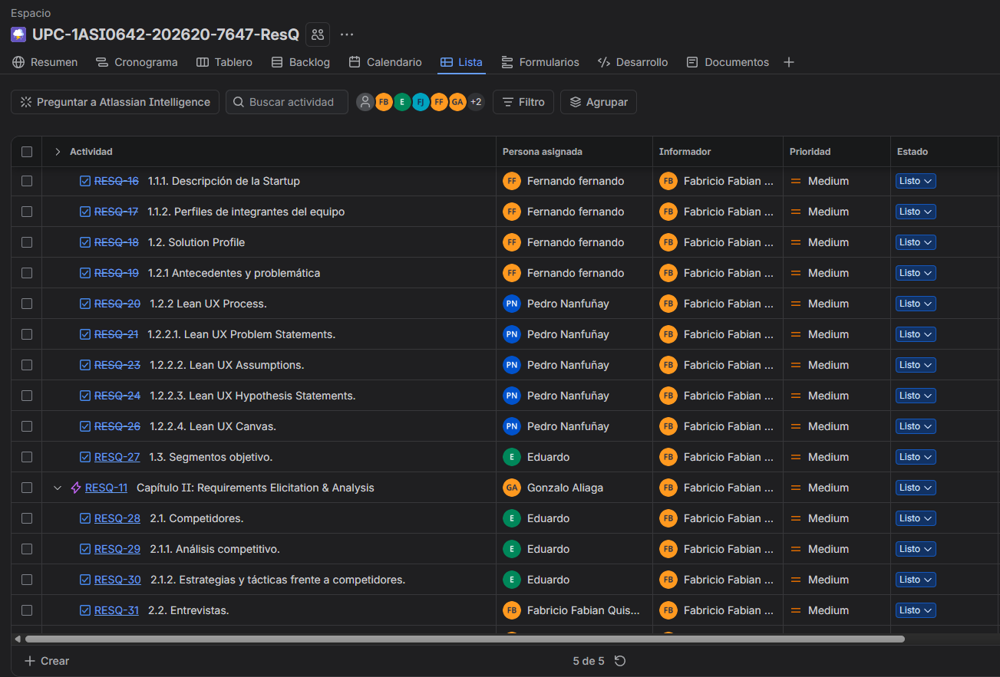
</p>

<p align="center">
  <strong>Figura 1. Distribución de actividades del equipo para la entrega AV1.</strong>
</p>

<p align="center">
  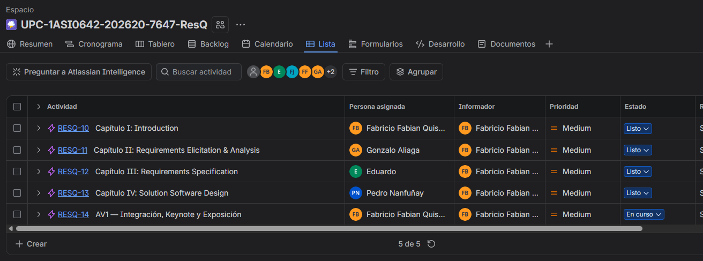
</p>

<p align="center">
  <strong>Figura 2. Distribución de actividades del equipo para la entrega AV1.</strong>
</p>

La planificación registrada en Jira permitió identificar las responsabilidades asumidas por cada integrante y verificar la cobertura del alcance correspondiente a AV1. Para el Tactical-Level Domain-Driven Design se distribuyeron los Bounded Contexts **Identity and Access Management (IAM), Risk Detection, Alert & Response Management, Building, Device, Monitoring, User, Incident y Connectivity**, junto con sus respectivos elementos de diseño.

### Colaboración en el Project Report

Además de la planificación registrada en Jira, la participación efectiva en la elaboración y evolución del Project Report se evidencia mediante los analíticos de colaboración y el historial de commits del repositorio de GitHub.

<p align="center">
  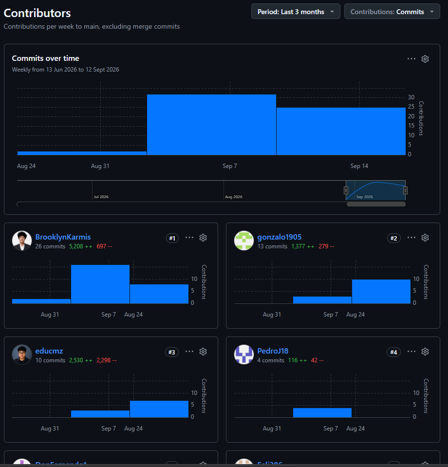
</p>

<p align="center">
  <strong>Figura 3. Analíticos de colaboración del repositorio del Project Report durante AV1.</strong>
</p>

Los analíticos del repositorio permiten observar la participación de los integrantes en la evolución del Project Report durante la entrega AV1. Esta evidencia complementa la planificación realizada en Jira y permite contrastar las responsabilidades asignadas con las contribuciones registradas en el repositorio.

<p align="center">
  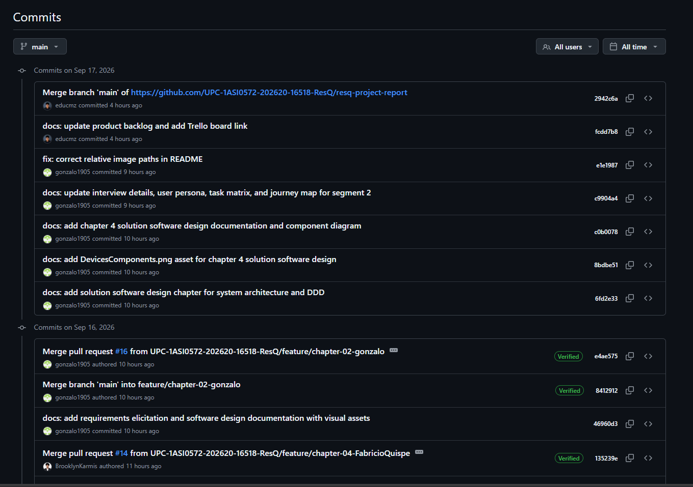
</p>

<p align="center">
  <strong>Figura 4. Historial de commits realizados durante la elaboración de AV1.</strong>
</p>

El historial de commits permite relacionar las modificaciones realizadas sobre el Project Report con sus respectivos autores y fechas. Estas contribuciones deben mantener coherencia con las modificaciones relevantes registradas en la sección **Registro de Versiones del Informe**.

<div style="page-break-before: always; break-before: page;"></div>

# Contenido

- [Student Outcome](#student-outcome)

- [Capítulo I: Introducción](#capítulo-i-introducción)
  - [1.1. Startup Profile](#11-startup-profile)
    - [1.1.1. Descripción de la Startup](#111-descripción-de-la-startup)
    - [1.1.2. Perfiles de integrantes del equipo](#112-perfiles-de-integrantes-del-equipo)
  - [1.2. Solution Profile](#12-solution-profile)
    - [1.2.1. Antecedentes y problemática](#121-antecedentes-y-problemática)
    - [1.2.2. Lean UX Process](#122-lean-ux-process)
      - [1.2.2.1. Lean UX Problem Statements](#1221-lean-ux-problem-statements)
      - [1.2.2.2. Lean UX Assumptions](#1222-lean-ux-assumptions)
      - [1.2.2.3. Lean UX Hypothesis Statements](#1223-lean-ux-hypothesis-statements)
      - [1.2.2.4. Lean UX Canvas](#1224-lean-ux-canvas)
  - [1.3. Segmentos objetivo](#13-segmentos-objetivo)

- [Capítulo II: Requirements Elicitation & Analysis](#capítulo-ii-requirements-elicitation--analysis)
  - [2.1. Competidores](#21-competidores)
    - [2.1.1. Análisis competitivo](#211-análisis-competitivo)
    - [2.1.2. Estrategias y tácticas frente a competidores](#212-estrategias-y-tácticas-frente-a-competidores)
  - [2.2. Entrevistas](#22-entrevistas)
    - [2.2.1. Diseño de entrevistas](#221-diseño-de-entrevistas)
    - [2.2.2. Registro de entrevistas](#222-registro-de-entrevistas)
    - [2.2.3. Análisis de entrevistas](#223-análisis-de-entrevistas)
  - [2.3. Needfinding](#23-needfinding)
    - [2.3.1. User Personas](#231-user-personas)
    - [2.3.2. User Task Matrix](#232-user-task-matrix)
    - [2.3.3. User Journey Mapping](#233-user-journey-mapping)
    - [2.3.4. Empathy Mapping](#234-empathy-mapping)
  - [2.4. Big Picture EventStorming](#24-big-picture-eventstorming)
  - [2.5. Ubiquitous Language](#25-ubiquitous-language)

- [Capítulo III: Requirements Specification](#capítulo-iii-requirements-specification)
  - [3.1. User Stories](#31-user-stories)
  - [3.2. Impact Mapping](#32-impact-mapping)
  - [3.3. Product Backlog](#33-product-backlog)

- [Capítulo IV: Solution Software Design](#capítulo-iv-solution-software-design)
  - [4.1. Strategic-Level Domain-Driven Design](#41-strategic-level-domain-driven-design)
    - [4.1.1. Design-Level EventStorming](#411-design-level-eventstorming)
      - [4.1.1.1. Candidate Context Discovery](#4111-candidate-context-discovery)
      - [4.1.1.2. Domain Message Flows Modeling](#4112-domain-message-flows-modeling)
      - [4.1.1.3. Bounded Context Canvases](#4113-bounded-context-canvases)
    - [4.1.2. Context Mapping](#412-context-mapping)
    - [4.1.3. Software Architecture](#413-software-architecture)
      - [4.1.3.1. Software Architecture System Landscape Diagram](#4131-software-architecture-system-landscape-diagram)
      - [4.1.3.2. Software Architecture Context Level Diagrams](#4132-software-architecture-context-level-diagrams)
      - [4.1.3.3. Software Architecture Container Level Diagrams](#4133-software-architecture-container-level-diagrams)
      - [4.1.3.4. Software Architecture Deployment Diagrams](#4134-software-architecture-deployment-diagrams)
  - [4.2. Tactical-Level Domain-Driven Design](#42-tactical-level-domain-driven-design)
    - [4.2.1. Bounded Context: Identity and Access Management (IAM)](#421-bounded-context-identity-and-access-management-iam)
      - [4.2.1.1. Domain Layer](#4211-domain-layer)
      - [4.2.1.2. Interface Layer](#4212-interface-layer)
      - [4.2.1.3. Application Layer](#4213-application-layer)
      - [4.2.1.4. Infrastructure Layer](#4214-infrastructure-layer)
      - [4.2.1.5. Bounded Context Software Architecture Component Level Diagrams](#4215-bounded-context-software-architecture-component-level-diagrams)
      - [4.2.1.6. Bounded Context Software Architecture Code Level Diagrams](#4216-bounded-context-software-architecture-code-level-diagrams)
        - [4.2.1.6.1. Bounded Context Domain Layer Class Diagrams](#42161-bounded-context-domain-layer-class-diagrams)
        - [4.2.1.6.2. Bounded Context Database Design Diagram](#42162-bounded-context-database-design-diagram)
    - [4.2.2. Bounded Context: Risk Detection](#422-bounded-context-risk-detection)
      - [4.2.2.1. Domain Layer](#4221-domain-layer)
      - [4.2.2.2. Interface Layer](#4222-interface-layer)
      - [4.2.2.3. Application Layer](#4223-application-layer)
      - [4.2.2.4. Infrastructure Layer](#4224-infrastructure-layer)
      - [4.2.2.5. Bounded Context Software Architecture Component Level Diagrams](#4225-bounded-context-software-architecture-component-level-diagrams)
      - [4.2.2.6. Bounded Context Software Architecture Code Level Diagrams](#4226-bounded-context-software-architecture-code-level-diagrams)
        - [4.2.2.6.1. Bounded Context Domain Layer Class Diagrams](#42261-bounded-context-domain-layer-class-diagrams)
        - [4.2.2.6.2. Bounded Context Database Design Diagram](#42262-bounded-context-database-design-diagram)
    - [4.2.3. Bounded Context: Alert & Response Management](#423-bounded-context-alert--response-management)
      - [4.2.3.1. Domain Layer](#4231-domain-layer)
      - [4.2.3.2. Interface Layer](#4232-interface-layer)
      - [4.2.3.3. Application Layer](#4233-application-layer)
      - [4.2.3.4. Infrastructure Layer](#4234-infrastructure-layer)
      - [4.2.3.5. Bounded Context Software Architecture Component Level Diagrams](#4235-bounded-context-software-architecture-component-level-diagrams)
      - [4.2.3.6. Bounded Context Software Architecture Code Level Diagrams](#4236-bounded-context-software-architecture-code-level-diagrams)
        - [4.2.3.6.1. Bounded Context Domain Layer Class Diagrams](#42361-bounded-context-domain-layer-class-diagrams)
        - [4.2.3.6.2. Bounded Context Database Design Diagram](#42362-bounded-context-database-design-diagram)
    - [4.2.4. Bounded Context: Building Management](#424-bounded-context-building-management)
      - [4.2.4.1. Domain Layer](#4241-domain-layer)
      - [4.2.4.2. Interface Layer](#4242-interface-layer)
      - [4.2.4.3. Application Layer](#4243-application-layer)
      - [4.2.4.4. Infrastructure Layer](#4244-infrastructure-layer)
      - [4.2.4.5. Bounded Context Software Architecture Component Level Diagrams](#4245-bounded-context-software-architecture-component-level-diagrams)
      - [4.2.4.6. Bounded Context Software Architecture Code Level Diagrams](#4246-bounded-context-software-architecture-code-level-diagrams)
        - [4.2.4.6.1. Bounded Context Domain Layer Class Diagrams](#42461-bounded-context-domain-layer-class-diagrams)
        - [4.2.4.6.2. Bounded Context Database Design Diagram](#42462-bounded-context-database-design-diagram)
    - [4.2.5. Bounded Context: Device Management](#425-bounded-context-device-management)
      - [4.2.5.1. Domain Layer](#4251-domain-layer)
      - [4.2.5.2. Interface Layer](#4252-interface-layer)
      - [4.2.5.3. Application Layer](#4253-application-layer)
      - [4.2.5.4. Infrastructure Layer](#4254-infrastructure-layer)
      - [4.2.5.5. Bounded Context Software Architecture Component Level Diagrams](#4255-bounded-context-software-architecture-component-level-diagrams)
      - [4.2.5.6. Bounded Context Software Architecture Code Level Diagrams](#4256-bounded-context-software-architecture-code-level-diagrams)
        - [4.2.5.6.1. Bounded Context Domain Layer Class Diagrams](#42561-bounded-context-domain-layer-class-diagrams)
        - [4.2.5.6.2. Bounded Context Database Design Diagram](#42562-bounded-context-database-design-diagram)
    - [4.2.6. Bounded Context: Monitoring](#426-bounded-context-monitoring)
      - [4.2.6.1. Domain Layer](#4261-domain-layer)
      - [4.2.6.2. Interface Layer](#4262-interface-layer)
      - [4.2.6.3. Application Layer](#4263-application-layer)
      - [4.2.6.4. Infrastructure Layer](#4264-infrastructure-layer)
      - [4.2.6.5. Bounded Context Software Architecture Component Level Diagrams](#4265-bounded-context-software-architecture-component-level-diagrams)
      - [4.2.6.6. Bounded Context Software Architecture Code Level Diagrams](#4266-bounded-context-software-architecture-code-level-diagrams)
        - [4.2.6.6.1. Bounded Context Domain Layer Class Diagrams](#42661-bounded-context-domain-layer-class-diagrams)
        - [4.2.6.6.2. Bounded Context Database Design Diagram](#42662-bounded-context-database-design-diagram)
    - [4.2.7. Bounded Context: User](#427-bounded-context-user)
      - [4.2.7.1. Domain Layer](#4271-domain-layer)
      - [4.2.7.2. Interface Layer](#4272-interface-layer)
      - [4.2.7.3. Application Layer](#4273-application-layer)
      - [4.2.7.4. Infrastructure Layer](#4274-infrastructure-layer)
      - [4.2.7.5. Bounded Context Software Architecture Component Level Diagrams](#4275-bounded-context-software-architecture-component-level-diagrams)
      - [4.2.7.6. Bounded Context Software Architecture Code Level Diagrams](#4276-bounded-context-software-architecture-code-level-diagrams)
        - [4.2.7.6.1. Bounded Context Domain Layer Class Diagrams](#42761-bounded-context-domain-layer-class-diagrams)
        - [4.2.7.6.2. Bounded Context Database Design Diagram](#42762-bounded-context-database-design-diagram)
    - [4.2.8. Bounded Context: Incident](#428-bounded-context-incident)
      - [4.2.8.1. Domain Layer](#4281-domain-layer)
      - [4.2.8.2. Interface Layer](#4282-interface-layer)
      - [4.2.8.3. Application Layer](#4283-application-layer)
      - [4.2.8.4. Infrastructure Layer](#4284-infrastructure-layer)
      - [4.2.8.5. Bounded Context Software Architecture Component Level Diagrams](#4285-bounded-context-software-architecture-component-level-diagrams)
      - [4.2.8.6. Bounded Context Software Architecture Code Level Diagrams](#4286-bounded-context-software-architecture-code-level-diagrams)
        - [4.2.8.6.1. Bounded Context Domain Layer Class Diagrams](#42861-bounded-context-domain-layer-class-diagrams)
        - [4.2.8.6.2. Bounded Context Database Design Diagram](#42862-bounded-context-database-design-diagram)
    - [4.2.9. Bounded Context: Connectivity Management](#429-bounded-context-connectivity-management)
      - [4.2.9.1. Domain Layer](#4291-domain-layer)
      - [4.2.9.2. Interface Layer](#4292-interface-layer)
      - [4.2.9.3. Application Layer](#4293-application-layer)
      - [4.2.9.4. Infrastructure Layer](#4294-infrastructure-layer)
      - [4.2.9.5. Bounded Context Software Architecture Component Level Diagrams](#4295-bounded-context-software-architecture-component-level-diagrams)
      - [4.2.9.6. Bounded Context Software Architecture Code Level Diagrams](#4296-bounded-context-software-architecture-code-level-diagrams)
        - [4.2.9.6.1. Bounded Context Domain Layer Class Diagrams](#42961-bounded-context-domain-layer-class-diagrams)
        - [4.2.9.6.2. Bounded Context Database Design Diagram](#42962-bounded-context-database-design-diagram)

- [Capítulo V: Solution UI/UX Design](#capítulo-v-solution-uiux-design)
  - [5.1. Style Guidelines](#51-style-guidelines)
    - [5.1.1. General Style Guidelines](#511-general-style-guidelines)
    - [5.1.2. Web, Mobile and IoT Style Guidelines](#512-web-mobile-and-iot-style-guidelines)
  - [5.2. Information Architecture](#52-information-architecture)
    - [5.2.1. Organization Systems](#521-organization-systems)
    - [5.2.2. Labeling Systems](#522-labeling-systems)
    - [5.2.3. SEO Tags and Meta Tags](#523-seo-tags-and-meta-tags)
    - [5.2.4. Searching Systems](#524-searching-systems)
    - [5.2.5. Navigation Systems](#525-navigation-systems)
  - [5.3. Landing Page UI Design](#53-landing-page-ui-design)
    - [5.3.1. Landing Page Wireframe](#531-landing-page-wireframe)
    - [5.3.2. Landing Page Mock-up](#532-landing-page-mock-up)
  - [5.4. Applications UX/UI Design](#54-applications-uxui-design)
    - [5.4.1. Applications Wireframes](#541-applications-wireframes)
    - [5.4.2. Applications Wireflow Diagrams](#542-applications-wireflow-diagrams)
    - [5.4.3. Applications Mock-ups](#543-applications-mock-ups)
    - [5.4.4. Applications User Flow Diagrams](#544-applications-user-flow-diagrams)
  - [5.5. Applications Prototyping](#55-applications-prototyping)
  - [5.6. IoT Device Design](#56-iot-device-design)

- [Capítulo VI: Product Implementation, Validation & Deployment](#capítulo-vi-product-implementation-validation--deployment)
  - [6.1. Software Configuration Management](#61-software-configuration-management)
    - [6.1.1. Software Development Environment Configuration](#611-software-development-environment-configuration)

- [Conclusiones](#conclusiones)
  - [Conclusiones y recomendaciones](#conclusiones-y-recomendaciones)

- [Bibliografía](#bibliografía)

- [Anexos](#anexos)
  - [Anexo A. Videos de Exposiciones](#anexo-a-videos-de-exposiciones)
    - [Anexo A — AV1 — Sprint Review](#anexo-a--av1--sprint-review)

<div style="page-break-before: always; break-before: page;"></div>

# Student Outcome

El curso contribuye al cumplimiento del Student Outcome ABET:

**ABET – EAC - Student Outcome 5**

**Criterio:** La capacidad de funcionar efectivamente en un equipo cuyos miembros juntos proporcionan liderazgo, crean un entorno de colaboración e inclusivo, establecen objetivos, planifican tareas y cumplen objetivos.

En el siguiente cuadro se describe las acciones realizadas y enunciados de conclusiones por parte del grupo, que permiten sustentar el haber alcanzado el logro del ABET – EAC - Student Outcome 5.
| Criterio específico | Acciones realizadas | Conclusiones |
|---|---|---|
| Trabaja en equipo para proporcionar liderazgo en forma conjunta | **Sánchez Guevara, Iván Fernando**<br><br>**AV1**<br>• Tuvo a su cargo el Startup Profile y parte del Solution Profile, desarrollando la descripción de la startup, los perfiles de los integrantes, así como los antecedentes y la problemática de ResQ.<br>• Asumió el desarrollo del Context Mapping y de los diagramas de arquitectura a nivel Context, Container y Deployment, integrando en una representación arquitectónica las responsabilidades e interacciones definidas para los distintos Bounded Contexts.<br>• Desarrolló el Bounded Context Connectivity, incluyendo Domain Layer, Interface Layer, Application Layer, Infrastructure Layer y sus diagramas de diseño correspondientes.<br><br>**Nanfuñay Liza, Pedro Jesus**<br><br>**AV1**<br>• Tuvo a su cargo el proceso de Lean UX, desarrollando Lean UX Problem Statements, Assumptions, Hypothesis Statements y Lean UX Canvas como base para orientar las decisiones iniciales del equipo.<br>• Asumió el Design-Level EventStorming, incluyendo Candidate Context Discovery, Domain Message Flows Modeling y Bounded Context Canvases, contribuyendo a identificar y delimitar las responsabilidades posteriormente distribuidas entre los Bounded Contexts del sistema.<br>• Desarrolló el Bounded Context Monitoring, incluyendo sus capas y diagramas de diseño táctico.<br><br>**Chacaliaza Minaya, Eduardo Fabian**<br><br>**AV1**<br>• Tuvo a su cargo la definición de los segmentos objetivo, el análisis de competidores y las estrategias y tácticas de ResQ frente a la competencia.<br>• Desarrolló el Product Backlog, organizando y priorizando los requisitos funcionales identificados para la solución.<br>• Participó en el Strategic-Level Domain-Driven Design y asumió el desarrollo del System Landscape de la arquitectura.<br>• Desarrolló el Bounded Context Alert & Response Management, especificando sus capas y diagramas técnicos correspondientes.<br><br>**Quispe Barzola, Fabricio Fabian**<br><br>**AV1**<br>• Tuvo a su cargo el proceso de entrevistas, incluyendo su diseño, registro y análisis, proporcionando al equipo información proveniente de representantes de los segmentos objetivo.<br>• Desarrolló las User Stories y el Impact Mapping, trasladando los resultados obtenidos durante la investigación hacia la especificación de requisitos de ResQ.<br>• Desarrolló los Bounded Contexts Identity and Access Management (IAM) y Risk Detection, incluyendo Domain, Interface, Application e Infrastructure Layers, así como los diagramas de componentes, clases y base de datos correspondientes.<br><br>**Aliaga Urbina, Wilder Gonzalo**<br><br>**AV1**<br>• Tuvo a su cargo la elaboración de User Personas, User Task Matrix, User Journey Mapping y Empathy Mapping, estructurando los hallazgos obtenidos durante la investigación de usuarios.<br>• Utilizó estos artefactos para representar necesidades, tareas, frustraciones y recorridos de los segmentos objetivo, aportando información utilizada posteriormente por el equipo en la definición de la solución.<br>• Desarrolló los Bounded Contexts Building y Device, incluyendo sus capas y diagramas de diseño táctico correspondientes.<br><br>**Guerrero Vasquez, Jhon Danny**<br><br>**AV1**<br>• Participó en el proceso de Needfinding y tuvo a su cargo el Big Picture EventStorming y el Ubiquitous Language, contribuyendo a establecer una comprensión común del dominio de ResQ y de sus principales conceptos.<br>• El Big Picture EventStorming desarrollado permitió representar los eventos relevantes del dominio y apoyar posteriormente su descomposición en Bounded Contexts.<br>• Desarrolló los Bounded Contexts User e Incident, incluyendo sus capas, componentes, clases y diseño de persistencia. | Durante AV1, el equipo distribuyó responsabilidades entre sus integrantes en distintas etapas del proceso de ingeniería, abarcando Lean UX, UX Research, Requirements Specification, Strategic-Level Domain-Driven Design, Tactical-Level Domain-Driven Design y Software Architecture. Cada integrante asumió la responsabilidad de artefactos concretos cuyos resultados se relacionan con el trabajo realizado por los demás miembros. Esta organización permitió desarrollar en paralelo los Capítulos I, II, III y IV y posteriormente integrar sus resultados en una propuesta común para ResQ. |
| **Crea un entorno colaborativo e inclusivo, establece metas, planifica tareas y cumple objetivos** | **Sánchez Guevara, Iván Fernando**<br><br>**AV1**<br>• Dentro de la planificación de AV1 asumió responsabilidades relacionadas con la definición inicial de la solución, Context Mapping, Software Architecture y el Bounded Context Connectivity.<br>• Su trabajo en Context Mapping y arquitectura permitió integrar visualmente las relaciones y dependencias existentes entre elementos desarrollados por diferentes miembros del equipo.<br><br>**Nanfuñay Liza, Pedro Jesus**<br><br>**AV1**<br>• Dentro de la planificación de AV1 asumió la elaboración de los artefactos de Lean UX y Design-Level EventStorming.<br>• Los artefactos de Candidate Context Discovery, Domain Message Flows Modeling y Bounded Context Canvases proporcionaron una base común para organizar y distribuir posteriormente el diseño táctico entre los integrantes del equipo.<br>• Complementó este trabajo desarrollando el Bounded Context Monitoring dentro de la distribución acordada para el Capítulo IV.<br><br>**Chacaliaza Minaya, Eduardo Fabian**<br><br>**AV1**<br>• Dentro de la planificación de AV1 asumió responsabilidades relacionadas con segmentos objetivo, análisis competitivo, Product Backlog, Strategic-Level Domain-Driven Design y Software Architecture.<br>• La organización del Product Backlog contribuyó a estructurar y priorizar el alcance funcional identificado por el equipo.<br>• Complementó el diseño estratégico con el desarrollo del Bounded Context Alert & Response Management, manteniendo relación entre el alcance funcional y el diseño de la solución.<br><br>**Quispe Barzola, Fabricio Fabian**<br><br>**AV1**<br>• Dentro de la planificación de AV1 asumió las actividades relacionadas con entrevistas, User Stories, Impact Mapping, IAM y Risk Detection.<br>• Los resultados obtenidos en entrevistas fueron utilizados como insumo para la especificación de requisitos, permitiendo mantener trazabilidad entre investigación, necesidades identificadas y funcionalidades propuestas.<br>• El desarrollo de IAM y Risk Detection permitió continuar dicha trazabilidad desde los requisitos hasta el diseño táctico de la solución.<br><br>**Aliaga Urbina, Wilder Gonzalo**<br><br>**AV1**<br>• Dentro de la planificación de AV1 asumió los principales artefactos de Needfinding y el diseño táctico de Building y Device.<br>• Organizó los resultados de investigación en User Personas, User Task Matrix, User Journey Maps y Empathy Maps, facilitando que el equipo dispusiera de una representación compartida de los usuarios y sus necesidades.<br>• Relacionó posteriormente estos hallazgos con elementos del dominio físico e IoT mediante el desarrollo de Building y Device.<br><br>**Guerrero Vasquez, Jhon Danny**<br><br>**AV1**<br>• Dentro de la planificación de AV1 asumió actividades relacionadas con Needfinding, Big Picture EventStorming, Ubiquitous Language y los Bounded Contexts User e Incident.<br>• La elaboración del Ubiquitous Language contribuyó a establecer términos y definiciones compartidas para reducir ambigüedades durante el trabajo de los distintos integrantes.<br>• Complementó el modelado general del dominio desarrollando User e Incident dentro de la distribución establecida para el Tactical-Level Domain-Driven Design. | La planificación de AV1 permitió distribuir el alcance del entregable entre los seis integrantes, estableciendo responsabilidades relacionadas entre sí y cubriendo progresivamente la comprensión del problema, investigación de usuarios, especificación de requisitos y diseño de la solución. Los artefactos desarrollados mantienen dependencias entre distintas responsabilidades: las entrevistas alimentan el Needfinding, estos resultados contribuyen a los requisitos, y los requisitos y eventos del dominio orientan la identificación y diseño de los Bounded Contexts y la arquitectura. Esta organización permitió integrar los aportes individuales dentro de una estructura común del Project Report y avanzar hacia los objetivos establecidos para AV1. |

<div style="page-break-before: always; break-before: page;"></div>

# Capítulo I: Introducción

## 1.1. Startup Profile

### 1.1.1. Descripción de la Startup
En una ciudad como Lima, caracterizada por su alta densidad de edificios y su constante vulnerabilidad ante emergencias como fugas de gas o movimientos sísmicos, la seguridad preventiva es un desafío crítico. Actualmente, la gestión de estos riesgos presenta grandes deficiencias: un simple error en la detección o el uso de múltiples alarmas desconectadas (que en el mejor de los casos solo emiten un aviso sonoro y dependen por completo de la rápida intervención humana) puede poner vidas en riesgo. Frente a esta realidad surge SecurityBear, una startup creada por estudiantes de la Facultad de Ingeniería de la Universidad Peruana de Ciencias Aplicadas (UPC). Reconocemos que, muchas veces, cuando las familias, trabajadores o empresas buscan estar verdaderamente preparados para cualquier eventualidad, se enfrentan a un mercado confuso y fragmentado. Surgen constantes dudas sobre cuántos dispositivos distintos se deben adquirir, su nivel de integración tecnológica y, sobre todo, si serán capaces de reportar un siniestro de manera automática y sin demoras.

Con nuestro sistema inteligente e integrado, centralizamos la detección de múltiples amenazas en un solo dispositivo automatizada. Utilizamos tecnología de sensores avanzados para identificar riesgos al instante, notificando a los usuarios en tiempo real y eliminando los retrasos propios de la intervención manual. Nuestro enfoque se centra en brindar tranquilidad y eficiencia, transformando la prevención de emergencias en algo accesible, seguro y capaz de actuar cuando cada segundo cuenta.

### 1.1.2. Perfiles de integrantes del equipo

| Nombres y Apellidos | Código | Descripción | Foto |
|---|---|---|---|
| Ivan Fernando Sanchez Guevara | U202218181 | Mi nombre es Fernando Sanchez Guevara, tengo 22 años y actualmente estudio la carrera de Ingeniería de Software. Me considero una persona disciplinada, responsable y puntual al momento de desarrollar las asignaciones de trabajo. Además, me preocupo por mantener una buena coordinación con mi equipo, procurando apoyar a mis compañeros cuando presentan alguna dificultad. Gracias a mi compromiso y disposición para colaborar, he contribuido al desarrollo adecuado de diferentes proyectos grupales, buscando cumplir los objetivos establecidos y resolver los inconvenientes que puedan surgir durante el proceso. |  |
| Eduardo Fabian Chacaliza Minaya | U202324129 | Mi nombre es Eduardo Fabian Chacaliza Minaya y actualmente estudio la carrera de Ingeniería de Software. Me considero una persona responsable, organizada y comprometida con el cumplimiento de los objetivos del equipo. Tengo interés en el desarrollo de soluciones tecnológicas y en la integración de los diferentes componentes de un proyecto. Durante los trabajos grupales procuro mantener una comunicación constante con mis compañeros, colaborar en la resolución de problemas y apoyar en la integración y validación de las distintas partes del proyecto para obtener un resultado consistente y funcional. |  |
| Fabricio Fabian Quispe Barzola | U202320442 | Mi nombre es Fabricio Fabian Quispe Barzola y actualmente estudio la carrera de Ingeniería de Software. Me considero una persona responsable, organizada y comprometida con el cumplimiento de los objetivos que asumo tanto de manera individual como en equipo. Tengo interés en el desarrollo de software, el análisis de problemas y la construcción de soluciones tecnológicas que permitan responder a necesidades reales. Durante los trabajos grupales procuro mantener una comunicación constante con mis compañeros, aportar ideas, escuchar diferentes puntos de vista y colaborar en la resolución de dificultades que puedan presentarse. Asimismo, busco organizar adecuadamente mis actividades, cumplir con los plazos establecidos y contribuir a que el equipo mantenga una visión común del trabajo. Me interesa seguir fortaleciendo mis conocimientos técnicos y mis habilidades de coordinación, análisis y trabajo colaborativo a lo largo de mi formación profesional. |  |
| Pedro Jesús Nanfuñay Liza | U202215462 | Mi nombre es Pedro Jesús Nanfuñay Liza, tengo 21 años y actualmente estudio la carrera de Ingeniería de Software. Me considero una persona creativa, responsable, perseverante y siempre dispuesto a trabajar en equipo. Espero aportar de manera positiva al equipo y cumplir con los objetivos establecidos en el proyecto. |  |
| Wilder Gonzalo Aliaga Urbina | U202222001 | Mi nombre es Gonzalo Aliaga Urbina y actualmente estudio la carrera de Ingeniería de Software. Me considero una persona responsable, organizada y comprometida con el cumplimiento de los objetivos establecidos en cada proyecto. Tengo especial interés en el desarrollo de soluciones tecnológicas, la programación y la aplicación de nuevas tecnologías para resolver problemas de manera eficiente. Durante los trabajos grupales procuro mantener una comunicación constante con mis compañeros, aportar ideas, apoyar en la resolución de dificultades y colaborar en la integración de las diferentes partes del proyecto. Asimismo, busco cumplir con las tareas asignadas dentro de los plazos establecidos y contribuir de manera activa para que el equipo mantenga una buena organización y logre resultados consistentes y funcionales. |  |

## 1.2. Solution Profile

### 1.2.1. Antecedentes y problemática
#### What (¿Qué?)
- **¿Cuál es el problema?** <br>
La dificultad de gestionar múltiples alarmas durante emergencias, lo que ocasiona que las personas no cuenten con información clara ni oportuna sobre los protocolos y rutas de evacuación a seguir. Esto resulta en desorientación y pánico, aumentando el riesgo de que los usuarios sufran lesiones o queden atrapados al no saber cómo actuar ni adónde dirigirse durante un desastre.
- **¿Cuál es la relación con la persona en cuestión?** <br>
La relación con los usuarios se basa en ofrecerles una herramienta centralizada que simplifica la gestión de sensores y alertas en un solo ecosistema. Esto reduce la complejidad y proporciona información detallada, automatizada y fácil de comprender para actuar correctamente en casos de emergencia.

#### When (¿Cuándo?)
- **¿Cuándo sucede el problema?** <br>
El problema ocurre de imprevisto antes y durante la emergencia. Principalmente al momento de intentar identificar la amenaza y seguir un protocolo de evacuación, donde la confusión y falta de indicaciones claras pueden ocasionar accidentes, obstrucción de vías de escape o el riesgo de quedar atrapado bajo los escombros.
- **¿Cuándo utiliza el cliente el producto?** <br>
El usuario utilizaría el sistema (SecurityBear / ResQ) en dos momentos clave: 1) En el instante crítico, para recibir una alerta temprana que identifique qué tipo de emergencia está ocurriendo (sismo, fuga de gas, incendio), y 2) Durante la evacuación, para recibir instrucciones y protocolos específicos que debe aplicar para ese caso en particular.

#### Where (¿Dónde?)
- **¿Dónde está el cliente cuando utiliza el producto?** <br>
Desde cualquier lugar dentro de una infraestructura monitoreada, ya sea su hogar, su centro de trabajo, un centro comercial o un local.
- **¿A dónde se dirige?** <br>
El usuario se dirige hacia las zonas de seguridad establecidas, ya sean áreas de evacuación externas (zonas amplias y despejadas) o zonas de seguridad internas (como columnas o pilares estructurales antisísmicos).
- **¿Dónde surge el problema?** <br>
El problema se origina en el entorno físico afectado justo en el momento de la emergencia, agravado por la falta de un sistema unificado que guíe las decisiones en tiempo real. Surge en la brecha entre la activación de una alarma tradicional (que a lo mucho solo emite ruido) y la necesidad vital de conocer las acciones y rutas exactas que se deben tomar.

#### Who (¿Quiénes?)
- **¿Quiénes están involucrados?** <br>
Los principales involucrados son todas las personas que se encuentren dentro de una estructura o edificio (residentes, trabajadores, visitantes), los administradores del recinto y los equipos de seguridad o brigadistas encargados de gestionar la emergencia.
- **¿A quiénes les sucede el problema?** <br>
El problema afecta principalmente a las personas que ocupan la edificación en el momento del siniestro, quienes sufren desorientación y exposición al peligro. También impacta a los responsables de seguridad y administradores de edificios, quienes enfrentan la dificultad de coordinar evacuaciones sin herramientas tecnológicas automatizadas.
- **¿Quién lo utiliza?** <br>
El sistema será utilizado por familias en edificios residenciales, trabajadores en oficinas y corporativos, así como administradores de instalaciones. Principalmente, está dirigido a personas e instituciones que valoran la prevención de riesgos y buscan una respuesta rápida, segura y guiada ante desastres.

#### Why (¿Por qué?)
- **¿Cuál es la causa del problema?** <br>
La falta de un sistema centralizado, automatizado e inteligente para la gestión de riesgos. Actualmente, los edificios dependen de alarmas independientes y no interconectadas que solo generan ruido, dejando a los usuarios sin instrucciones claras, dependientes de la memoria humana y propensos a cometer errores fatales debido al estrés y el pánico del momento.

#### How (¿Cómo?)
- **¿En qué condiciones nuestros clientes usan el producto?** <br>
Los clientes utilizan el sistema en condiciones de alto estrés, urgencia y posible pánico, con un tiempo de reacción muy limitado. Por ello, el producto funciona de manera automática, emitiendo alertas claras, directas y visuales/auditivas que no requieren interpretación compleja por parte del usuario.
- **¿Cómo nos conocieron nuestros compradores?** <br>
A través de alianzas estratégicas con constructoras y juntas de propietarios, ferias de seguridad y prevención de riesgos (Defensa Civil), marketing digital enfocado en la protección familiar y empresarial, y recomendaciones de consultores de seguridad laboral e infraestructura.
- **¿Cómo prefieren nuestros consumidores acceder a nuestro producto?** <br>
Mediante un sistema de hardware instalado en puntos clave del edificio (sensores inteligentes) que se sincroniza directamente con una aplicación móvil (ResQ) o un panel de control, permitiendo a los usuarios recibir notificaciones en tiempo real, conocer el estado de su entorno y revisar los protocolos preventivos desde sus smartphones.
- **¿Qué llevó a la persona a esa situación?** <br>
La vulnerabilidad inherente de vivir o trabajar en una ciudad con alto riesgo sísmico y fallas en infraestructuras (como fugas de gas o incendios). El profundo deseo de proteger su vida, la de su familia o la de sus empleados, sumado a la frustración de saber que los sistemas tradicionales son insuficientes para guiar a las personas cuando realmente importa.

#### How much (¿Cuánto?)
El Perú se encuentra en el Cinturón de Fuego del Pacífico, lo que hace que ciudades como Lima sean altamente vulnerables a sismos de gran magnitud. Según proyecciones de Defensa Civil (INDECI), un terremoto severo en la capital podría dejar cientos de miles de damnificados debido a la alta densidad poblacional y la falta de preparación. Sumado a esto, el Cuerpo General de Bomberos atiende anualmente miles de emergencias por fugas de gas e incendios urbanos, donde una detección tardía suele escalar a tragedias irreparables. La desorientación durante los primeros minutos de un siniestro incrementa exponencialmente el riesgo de mortalidad y lesiones. SecurityBear busca reducir este impacto crítico al centralizar la detección de amenazas y eliminar la dependencia exclusiva del factor humano para dar aviso. Al optimizar los tiempos de respuesta y brindar directrices claras de evacuación a través de la tecnología, nuestra plataforma contribuye directamente a salvar vidas, mitigar daños personales y reducir las pérdidas materiales ocasionadas por la falta de una alerta temprana y coordinada.

### 1.2.2. Lean UX Process

#### 1.2.2.1. Lean UX Problem Statements
El estado actual de la seguridad y gestión de emergencias en edificios se ha enfocado principalmente en el uso de sistemas independientes y de propósito único; como detectores de humo, alarmas de gas o protocolos de evacuación manuales. Estos mecanismos son utilizados por administradores y responsables de seguridad de los edificios para identificar situaciones de riesgo; sin embargo, en muchos casos requieren de la intervención humana para coordinar una respuesta adecuada y reducir los posibles daños sobre las personas y la infraestructura.

Lo que las soluciones existentes no suelen resolver de manera integrada es la coordinación de la información entre la detección de una emergencia y la ejecución de una respuesta física ante ella. Esto dificulta centralizar la información obtenida, emitir alertas precisas, identificar el tipo de emergencia, ubicar la zona afectada y activar respuestas diferenciadas de acuerdo con las caracterísiticas y el nivel de gravedad del evento. Asimismo, muchos sistemas dependen de mecanismos de monitoreo o comunicación centralizados, lo que puede limitar su capacidad de respuesta cuando se pierde temporalmente la conectividad a Internet durante una emergencia.

Nuestra solución abordará esta brecha mediante una plataforma IoT capaz de monitorear variables ambientales y fisicas del edificio, procesar localmente la información obtenida de los sensores mediante Edge Computing, clasificar el tipo y grado de la emergencia y ejecutar acciones automáticas a través de actuadores (alarmas, luces de evacuación, ventilación, cierre de válvula) mientras reporta el evento y el estado del edificio en tiempo real.

Nuestro enfoque inicial estará dirigido a los propietarios y administradores de edificaciones que requieren supervisar las condiciones de seguridad de sus instalaciones para responder oportunamente ante situaciones de riesgo. La propuesta también estará orientada a responsables de seguridad, operaciones e infraestructura de empresas e instituciones que necesitan centralizar el monitoreo y coordinar respuestas en instalaciones con diferentes zonas y niveles de concurrencia.

Sabremos que hemos tenido éxito cuando los representantes de ambos segmentos utilicen la aplicación para monitorear el estado del edificio, reconocer el tipo y nivel de riesgo, ubicar la zona afectada, verificar la activación automática de respuestas adecuadas de los actuadores y consultar posteriormente los eventos registrados. Asimismo, consideraremos el interés de estos responsables por incorporar nuestra solución como complemento de sus mecanismos actuales de seguridad.

#### 1.2.2.2. Lean UX Assumptions

**Business Assumptions:**

1. Creemos que existe una demanda insatisfecha en el mercado de administración de edificios por soluciones que centralicen monitoreo y respuesta ante emergencias, actualmente cubierta parcialmente por sistemas aislados.
2. Creemos que existe una oportunidad para integrar en una única solución IoT la detección, clasificación, localización y respuesta automática ante situaciones de riesgo dentro de edificios.
3. Creemos que los propietarios y administradores de edificaciones, así como las empresas e instituciones con infraestructura propia, estarán dispuestas a adoptar una solución que complemente sus mecanismos actuales de seguridad mediante monitoreo y automatización.
4. Creemos que la capacidad de ejecutar respuestas críticas localmente, sin depender permanentemente de la conectividad a Internet, constituirá un elemento diferenciador de la propuesta frente a sistemas que requieren comunicación constante con servicios externos.
5. Creemos que un modelo de servicio orientado a edificios permitirá escalar progresivamente la solución mediante la incorporación de nuevos sensores, actuadores, zonas y dispositivos IoT según las necesidades de cada organización.
6. Creemos que los clientes estarán dispuestos a asumir un costo por una solución que contribuya al monitoreo continuo, la trazabilidad de eventos y la automatización de determinadas respuestas de seguridad.

**Business Outcome Assumptions:**

1. Creemos que demostrar una solución integrada de monitoreo y respuesta ante emergencias incrementará el interés de potenciales clientes en adoptar la plataforma frente al uso exclusivo de mecanismos independientes o manuales.
2. Creemos que al garantizar que las respuestas automáticas y del monitoreo sean las adecuadas, estas incrementarán la confiabilidad y por consecuencia; la intención de permanencia y renovación de nuestro servicio por parte de las organizaciones, reduciendo potencialmente la tasa de cancelación.
3. Creemos que reducir el esfuerzo requerido para supervisar manualmente las condiciones de seguridad del edificio incrementará el valor percibido de la plataforma y la disposición de las organizaciones a pagar por el servicio.
4. Creemos que la disponibilidad de registros históricos sobre eventos detectados, mediciones y respuestas ejecutadas incrementará el uso recurrente de la plataforma para actividades de supervisión y seguimiento.
5. Creemos que la posibilidad de incorporar progresivamente nuevas zonas, sensores y actuadores permitirá incrementar el alcance del servicio, expandiendo nuestra solución a nuevas necesidades.
6. Creemos que una implementación satisfactoria del MVP permitirá validar el interés de potenciales clientes y justificar la evolución de la solución hacia una mayor cantidad de dispositivos, tipos de emergencia y capacidades de respuesta.

**User Assumptions:**

1. Creemos que los propietarios y administradores de edificaciones necesitan supervisar continuamente las condiciones de seguridad de las instalaciones bajo su responsabilidad.
2. Creemos que los responsables de seguridad, operaciones e infraestructura de empresas e instituciones necesitan centralizar la información proveniente de diferentes zonas de sus instalaciones.
3. Creemos que ambos segmentos necesitan identificar rápidamente qué tipo de emergencia está ocurriendo, cuál es su nivel de riesgo y dónde se ha producido.
4. Creemos que ambos segmentos necesitan conocer qué respuestas automáticas fueron ejecutadas por el sistema durante una situación de riesgo.
5. Creemos que los administradores y responsables institucionales necesitan consultar posteriormente información sobre los eventos ocurridos para realizar actividades de seguimiento y análisis.
6. Creemos que los usuarios de ambos segmentos cuentan habitualmente con acceso a dispositivos digitales y están familiarizados con aplicaciones utilizadas para tareas de supervisión o gestión.
7. Creemos que los responsables de empresas e instituciones necesitan supervisar múltiples zonas desde una visión centralizada para coordinar adecuadamente una respuesta.
8. Creemos que los responsables de ambos segmentos valorarán una solución que pueda incorporarse progresivamente a la infraestructura existente sin requerir una sustitución completa de sus mecanismos actuales de seguridad.

**User Outcome and Benefit Assumptions:**

1. Creemos que los propietarios, administradores y responsables institucionales podrán comprender con mayor rapidez el estado de sus edificaciones al contar con información de sensores y alertas centralizada en una misma plataforma.
2. Creemos que podrán tomar decisiones con mayor rapidez al conocer el tipo de emergencia, el nivel de riesgo y la zona afectada.
3. Creemos que tendrán mayor visibilidad sobre la respuesta del sistema al poder verificar qué acciones automáticas fueron ejecutadas durante cada evento.
4. Creemos que podrán realizar un mejor seguimiento de las emergencias mediante el acceso al historial de eventos, mediciones y acciones ejecutadas.
5. Creemos que los responsables de empresas e instituciones podrán coordinar mejor la respuesta ante una emergencia al disponer de información centralizada sobre las diferentes zonas de sus instalaciones.
6. Creemos que ambos segmentos podrán reducir su dependencia de la supervisión y coordinación completamente manual durante los primeros momentos de una emergencia.
7. Creemos que tendrán mayor confianza en la continuidad de la respuesta del sistema al mantenerse las acciones críticas locales aun cuando se pierda temporalmente la conexión a Internet.

**Feature Assumptions:**

1. Creemos que una funcionalidad de **monitoreo del estado del edificio y sus zonas** permitirá a los usuarios de ambos segmentos conocer las condiciones actuales y detectar rápidamente la existencia de una situación de riesgo.
2. Creemos que una funcionalidad de **detección y clasificación local de emergencias mediante sensores y Edge Computing** permitirá identificar el tipo y nivel de riesgo sin depender permanentemente de servicios externos.
3. Creemos que una funcionalidad de **respuesta automática mediante actuadores** permitirá ejecutar acciones de seguridad apropiadas según el tipo y nivel de riesgo detectado.
4. Creemos que una funcionalidad de **alertas y señalización diferenciadas** permitirá a los responsables reconocer oportunamente la existencia y gravedad de una emergencia, y facilitar la comunicación de la respuesta.
5. Creemos que una funcionalidad de **identificación de la zona afectada** permitirá a los responsables de seguridad localizar con mayor rapidez el origen del evento y orientar adecuadamente la respuesta.
6. Creemos que una funcionalidad de **registro e historial de eventos** permitirá consultar posteriormente las emergencias detectadas, las mediciones registradas y las respuestas ejecutadas por el sistema.

#### 1.2.2.3. Lean UX Hypothesis Statements

1. Creemos que lograremos incrementar el valor percibido de la plataforma y la disposición a pagar por el servicio si los propietarios, administradores y responsables institucionales logran comprender con mayor rapidez el estado de sus edificaciones y zonas mediante una funcionalidad de monitoreo centralizado.
2. Creemos que lograremos incrementar la confiabilidad percibida de la plataforma y la intención de permanencia y renovación del servicio si los usuarios de ambos segmentos pueden identificar oportunamente el tipo y nivel de riesgo y mantener la capacidad de respuesta ante una pérdida temporal de conectividad mediante una funcionalidad de detección y clasificación local basada en sensores y Edge Computing.
3. Creemos que lograremos incrementar el valor percibido de la plataforma y la disposición a pagar por el servicio si los propietarios, administradores y responsables institucionales obtienen mayor confianza y visibilidad sobre la respuesta ante una emergencia mediante la ejecución automática de acciones de seguridad apropiadas según el tipo y nivel de riesgo detectado.
4. Creemos que lograremos incrementar el interés y valor percibido de la plataforma si los responsables de ambos segmentos pueden reconocer oportunamente la existencia y naturaleza de una emergencia y coordinar una respuesta más clara mediante alertas y señalización diferenciadas.
5. Creemos que lograremos incrementar el valor percibido de la plataforma para las actividades de supervisión y respuesta si los propietarios, administradores y responsables institucionales pueden tomar decisiones con mayor rapidez al conocer la ubicación del riesgo mediante una funcionalidad de identificación de la zona afectada.
6. Creemos que lograremos incrementar el uso recurrente de la plataforma para actividades de supervisión y seguimiento si los usuarios pueden analizar posteriormente las emergencias ocurridas mediante una funcionalidad de registro e historial de eventos, mediciones y respuestas ejecutadas.

#### 1.2.2.4. Lean UX Canvas

El Lean UX Canvas sintetiza los principales elementos identificados durante el Lean UX Process, relacionando el problema de negocio, los resultados esperados, los usuarios, los beneficios, las posibles soluciones y las hipótesis planteadas.


**Link del Canvas:** https://miro.com/app/board/uXjVHqdK0Tc=/?share_link_id=104899432918

En **Business Problem** se identificó que los sistemas de seguridad en edificios suelen funcionar de manera aislada y requieren intervención humana para coordinar la respuesta ante una emergencia. En **Business Outcomes** se definieron comportamientos esperados como el interés por adoptar la plataforma, la renovación del servicio, el uso recurrente y la disposición a pagar por sus funcionalidades.

En **Users and Customers** se consideró como usuarios principales a los administradores y responsables de seguridad, mientras que los ocupantes del edificio representan el segmento beneficiado por las alertas y mecanismos de evacuación. Los **User Benefits** se enfocan en comprender rápidamente el estado del edificio, identificar el tipo y ubicación del riesgo, conocer las respuestas ejecutadas y mantener acciones críticas aun sin conexión a Internet.

Las **Solution Ideas** incluyen el monitoreo por zonas, detección y clasificación local mediante Edge Computing, activación automática de actuadores, alertas diferenciadas, identificación de la zona afectada e historial de eventos. A partir de estas soluciones se formularon las hipótesis que deberán ser validadas durante el desarrollo del proyecto.

Finalmente, se identificó como principales aspectos a validar; la confianza de los usuarios en la automatización, la capacidad del sistema para clasificar correctamente los riesgos y la comprensión de las alertas por parte de los ocupantes. Para ello se llevarán a cabo entrevistas, pruebas de prototipo y pruebas de concepto con el dispositivo IoT.

## 1.3. Segmentos objetivo

Para garantizar que la solución IoT responda de manera adecuada a las necesidades de seguridad y gestión de emergencias en edificaciones, se han identificado dos segmentos principales vinculados directamente con el problema.

A continuación, se presentan sus principales características demográficas, geográficas y psicográficas, así como las necesidades que justifican su relevancia para la propuesta.

### Segmento objetivo #1: Propietarios y administradores de edificaciones

Este segmento está conformado por propietarios, administradores, facility managers y responsables de la gestión de edificios residenciales, comerciales o de uso mixto que buscan mejorar la capacidad de detección y respuesta ante situaciones de emergencia. Según el INDECI, entre 2012 y 2023 se registraron 3,005 incendios urbanos en el departamento de Lima, lo que evidencia la necesidad de contar con mecanismos de monitoreo y respuesta oportuna ante eventos críticos en edificaciones.

#### Aspectos demográficos

- **Sexo:** Masculino y femenino.
- **Rango de edad:** 30 años a más.
- **Nivel socioeconómico:** Principalmente clases A, B y C.
- **Ocupación:** Propietarios de inmuebles, administradores de edificios y responsables de mantenimiento, seguridad o gestión de instalaciones.

#### Aspectos geográficos

- **Nacionalidad:** Peruana.
- **Zona geográfica:** Principalmente zonas urbanas de Lima Metropolitana y otras ciudades con alta concentración de edificios residenciales, comerciales y empresariales.

#### Aspectos psicográficos

- **Dolor principal:** Dependencia de sistemas que se limitan a generar alertas y que requieren intervención humana para ejecutar acciones posteriores ante una emergencia.
- **Intereses:** Seguridad de los ocupantes, automatización de edificios, monitoreo remoto, prevención de riesgos y modernización de infraestructura.
- **Actitudes:** Valoran soluciones que permitan actuar rápidamente ante eventos críticos y que puedan integrarse progresivamente con la infraestructura existente.
- **Necesidades clave:** Monitoreo en tiempo real, identificación de la zona afectada, activación automática de alarmas y actuadores, registro de eventos y reducción del tiempo de respuesta ante emergencias.

### Segmento objetivo #2: Empresas integradoras de automatización y gestión de edificios inteligentes

Este segmento incluye empresas especializadas en automatización de edificios, integración IoT, Building Management Systems (BMS) y gestión técnica de infraestructura. Estas organizaciones desarrollan soluciones de automatización y gestión de edificios para sus clientes y enfrentan la necesidad de incorporar capacidades de detección, monitoreo y respuesta ante emergencias dentro de infraestructuras que utilizan distintos dispositivos y sistemas. Según la Encuesta de Transformación Digital 2022 de PAD-RTM, realizada a 404 organizaciones peruanas, el 29 % indicó utilizar tecnologías de Internet of Things (IoT), lo que evidencia la presencia de este tipo de tecnologías en el entorno empresarial y la necesidad de soluciones que puedan integrarse con ellas.

#### Aspectos demográficos y organizacionales

- **Tipo de organización:** Empresas B2B dedicadas a automatización de edificios, integración IoT, sistemas BMS y gestión técnica de infraestructura.

- **Tamaño:** Principalmente pequeñas, medianas y grandes empresas que desarrollan proyectos de automatización e integración tecnológica para organizaciones con infraestructura propia.

- **Responsables de decisión:** Gerentes de proyectos, ingenieros de automatización, responsables de integración, gerentes comerciales, responsables de innovación y directores técnicos.

- **Rango de edad de los responsables:** Aproximadamente entre 28 y 60 años.

#### Aspectos geográficos

- **Ubicación:** Principalmente Lima Metropolitana y principales ciudades del Perú donde se desarrollan proyectos de automatización, modernización e implementación de edificios inteligentes.

- **Ámbito de operación:** Edificios corporativos, campus educativos, centros de salud, instalaciones comerciales, hoteles, complejos industriales y otras infraestructuras que requieren automatización y monitoreo técnico.

#### Aspectos psicográficos

- **Dolor principal:** Dificultad para integrar funciones de detección y respuesta ante emergencias en edificios que utilizan distintos sensores, dispositivos y sistemas de automatización.

- **Intereses:** Automatización de edificios, IoT, interoperabilidad, sistemas BMS, digitalización de infraestructura, integración de sensores, escalabilidad y desarrollo de edificios inteligentes.

- **Actitudes:** Buscan soluciones modulares, confiables, escalables y fáciles de integrar con la infraestructura tecnológica que ya implementan para sus clientes.

- **Necesidades clave:** Una solución fácil de integrar con diferentes sensores y sistemas de automatización, que pueda configurarse según cada edificio, adaptarse a distintos proyectos y escalar conforme aumenten las zonas o dispositivos conectados.

<div style="page-break-before: always; break-before: page;"></div>

# Capítulo II: Requirements Elicitation & Analysis


## 2.1. Competidores

### 2.1.1. Análisis competitivo
Para poder conocer y analizar mejor a nuestros posibles competidores, realizamos el siguiente Landscape:

<div style="page-break-before: always; break-before: page;"></div>

<table style="background-color:transparent; border-collapse:collapse; width:100%; max-width:100%; margin:0 auto; table-layout:fixed; font-family:Arial,sans-serif; font-size:12px; line-height:16px; color:inherit; border:1px solid currentColor;">
  <colgroup>
    <col style="width:12%;">
    <col style="width:10%;">
    <col style="width:10%;">
    <col style="width:18%;">
    <col style="width:17%;">
    <col style="width:16%;">
    <col style="width:17%;">
  </colgroup>

  <tr style="page-break-inside: avoid; break-inside: avoid; background-color:transparent; ">
    <th colspan="7" style="background-color:transparent; color:inherit; border:1px solid currentColor; padding:0 7px; text-align:left; height:17px;">
      Competitive Analysis Landscape
    </th>
  </tr>
  <tr style="page-break-inside: avoid; break-inside: avoid; background-color:transparent; height:49px;">
    <td colspan="2" style="background-color:transparent; color:inherit; border:1px solid currentColor; padding:0 7px; vertical-align:top;">
      ¿Por qué llevar a cabo este análisis?
    </td>
    <td colspan="5" style="background-color:transparent; color:inherit; border:1px solid currentColor; padding:0 7px; vertical-align:top;">Analizar las características y propuestas de valor de competidores indirectos relacionados con el monitoreo, automatización y gestión de edificios, con el fin de identificar oportunidades de diferenciación para ResQ mediante tecnologías IoT, procesamiento Edge y automatización de respuestas ante situaciones de riesgo.  </td>
  </tr>

  <tr style="page-break-inside: avoid; break-inside: avoid; background-color:transparent; height:50px;">
    <td colspan="3" style="background-color:transparent; color:inherit; border:1px solid currentColor; padding:0 7px; vertical-align:top;">
      &nbsp;
    </td>
    <td style="background-color:transparent; color:inherit; border:1px solid currentColor; padding:0 7px; vertical-align:top;">ResQ<br></td>
    <td style="background-color:transparent; color:inherit; border:1px solid currentColor; padding:0 7px; vertical-align:top;">ProSentry<br></td>
    <td style="background-color:transparent; color:inherit; border:1px solid currentColor; padding:0 7px; vertical-align:top;">Siemens Building X<br></td>
    <td style="background-color:transparent; color:inherit; border:1px solid currentColor; padding:0 7px; vertical-align:top;">Honeywell EBI<br></td>
  </tr>

  <tr style="page-break-inside: avoid; break-inside: avoid; background-color:transparent; height:65px;">
    <td rowspan="2" style="background-color:transparent; color:inherit; border:1px solid currentColor; text-align:center; vertical-align:middle;">
      <span style="display:inline-block; writing-mode:vertical-rl; transform:rotate(180deg);">Perfil</span>
    </td>
    <td colspan="2" style="background-color:transparent; color:inherit; border:1px solid currentColor; padding:0 7px; vertical-align:top;">Overview</td>
    <td style="background-color:transparent; color:inherit; border:1px solid currentColor; padding:0 7px; vertical-align:top;">Plataforma IoT orientada al monitoreo, detección y respuesta ante riesgos en edificaciones. Integra sensores, monitoreo digital, procesamiento Edge y actuadores.</td>
    <td style="background-color:transparent; color:inherit; border:1px solid currentColor; padding:0 7px; vertical-align:top;">Plataforma IoT de monitoreo preventivo de propiedades. Detecta fugas, temperatura, humedad, fallas y otras condiciones que pueden causar daños.</td>
    <td style="background-color:transparent; color:inherit; border:1px solid currentColor; padding:0 7px; vertical-align:top;">Plataforma digital para la gestión inteligente de edificios. Centraliza operaciones, mantenimiento, energía, seguridad y protección.</td>
    <td style="background-color:transparent; color:inherit; border:1px solid currentColor; padding:0 7px; vertical-align:top;">Plataforma empresarial que integra gestión del edificio, seguridad, control de accesos, videovigilancia y protección contra incendios.</td>
  </tr>
  <tr style="page-break-inside: avoid; break-inside: avoid; background-color:transparent; height:82px;">
    <td colspan="2" style="background-color:transparent; color:inherit; border:1px solid currentColor; padding:0 7px; vertical-align:top;">
      Ventaja competitiva<br>¿Qué valor ofrece a los clientes?
    </td>
    <td style="background-color:transparent; color:inherit; border:1px solid currentColor; padding:0 7px; vertical-align:top;">Arquitectura IoT modular que integra distintos riesgos y ejecuta respuestas automáticas según sensores, zona, horario y contexto.</td>
    <td style="background-color:transparent; color:inherit; border:1px solid currentColor; padding:0 7px; vertical-align:top;">Detección temprana de riesgos de la propiedad, monitoreo continuo y control de ciertos dispositivos, como válvulas.</td>
    <td style="background-color:transparent; color:inherit; border:1px solid currentColor; padding:0 7px; vertical-align:top;">Ecosistema amplio y escalable para administrar múltiples funciones e instalaciones desde una sola plataforma.</td>
    <td style="background-color:transparent; color:inherit; border:1px solid currentColor; padding:0 7px; vertical-align:top;">Integra sistemas críticos del edificio y permite automatizar procedimientos y flujos de trabajo ante eventos.</td>
  </tr>

  <tr style="page-break-inside: avoid; break-inside: avoid; background-color:transparent; height:66px;">
    <td rowspan="2" style="background-color:transparent; color:inherit; border:1px solid currentColor; text-align:center; vertical-align:middle;">
      <span style="display:inline-block; writing-mode:vertical-rl; transform:rotate(180deg);">Perfil de Marketing</span>
    </td>
    <td colspan="2" style="background-color:transparent; color:inherit; border:1px solid currentColor; padding:0 7px; vertical-align:top;">Mercado objetivo</td>
    <td style="background-color:transparent; color:inherit; border:1px solid currentColor; padding:0 7px; vertical-align:top;">Propietarios y administradores de edificaciones, así como empresas integradoras de automatización y gestión de edificios inteligentes.</td>
    <td style="background-color:transparent; color:inherit; border:1px solid currentColor; padding:0 7px; vertical-align:top;">Propietarios, administradores y operadores de edificios residenciales y comerciales.</td>
    <td style="background-color:transparent; color:inherit; border:1px solid currentColor; padding:0 7px; vertical-align:top;">Propietarios, operadores y administradores de edificios, campus y organizaciones de diversos sectores.</td>
    <td style="background-color:transparent; color:inherit; border:1px solid currentColor; padding:0 7px; vertical-align:top;">Medianas y grandes organizaciones con edificios, campus e infraestructuras complejas.</td>
  </tr>
  <tr style="page-break-inside: avoid; break-inside: avoid; background-color:transparent; height:66px;">
    <td colspan="2" style="background-color:transparent; color:inherit; border:1px solid currentColor; padding:0 7px; vertical-align:top;">Estrategias de marketing</td>
    <td style="background-color:transparent; color:inherit; border:1px solid currentColor; padding:0 7px; vertical-align:top;">Estrategia B2B basada en demostraciones de la solución, contacto directo con administradores y organizaciones y alianzas con empresas vinculadas a automatización de edificios.</td>
    <td style="background-color:transparent; color:inherit; border:1px solid currentColor; padding:0 7px; vertical-align:top;">Estrategia B2B enfocada en reducción de daños, demostraciones, evaluaciones y casos de uso.</td>
    <td style="background-color:transparent; color:inherit; border:1px solid currentColor; padding:0 7px; vertical-align:top;">Venta consultiva B2B, contenido especializado, casos por industria y socios tecnológicos.</td>
    <td style="background-color:transparent; color:inherit; border:1px solid currentColor; padding:0 7px; vertical-align:top;">Venta empresarial mediante especialistas e integradores, demostraciones y soluciones personalizadas.</td>
  </tr>

  <tr style="page-break-inside: avoid; break-inside: avoid; background-color:transparent; height:66px;">
    <td rowspan="3" style="background-color:transparent; color:inherit; border:1px solid currentColor; text-align:center; vertical-align:middle;">
      <span style="display:inline-block; writing-mode:vertical-rl; transform:rotate(180deg);">Perfil de Producto</span>
    </td>
    <td colspan="2" style="background-color:transparent; color:inherit; border:1px solid currentColor; padding:0 7px; vertical-align:top;">Productos &amp; Servicios</td>
    <td style="background-color:transparent; color:inherit; border:1px solid currentColor; padding:0 7px; vertical-align:top;">Solución IoT compuesta por dispositivos de monitoreo, procesamiento local y actuadores, integrada con una plataforma centralizada para supervisar riesgos, generar alertas y ejecutar respuestas automáticas ante diferentes eventos en edificaciones.</td>
    <td style="background-color:transparent; color:inherit; border:1px solid currentColor; padding:0 7px; vertical-align:top;">Sensores inalámbricos para fugas de agua y gas, temperatura, humedad, puertas y otros riesgos, con plataforma de monitoreo.</td>
    <td style="background-color:transparent; color:inherit; border:1px solid currentColor; padding:0 7px; vertical-align:top;">Building X incluye aplicaciones para operaciones, seguridad, incendios, energía, análisis e integración de equipos.</td>
    <td style="background-color:transparent; color:inherit; border:1px solid currentColor; padding:0 7px; vertical-align:top;">EBI integra gestión del edificio, seguridad, videovigilancia, control de accesos, incendios y sistemas de terceros.</td>
  </tr>
  <tr style="page-break-inside: avoid; break-inside: avoid; background-color:transparent; height:49px;">
    <td colspan="2" style="background-color:transparent; color:inherit; border:1px solid currentColor; padding:0 7px; vertical-align:top;">Precios &amp; Costos</td>
    <td style="background-color:transparent; color:inherit; border:1px solid currentColor; padding:0 7px; vertical-align:top;">Modelo basado en una implementación inicial de sensores y dispositivos IoT, complementada con una suscripción recurrente para el acceso a la plataforma de monitoreo, alertas, historial e integraciones. El costo dependerá de la cantidad de dispositivos, tamaño de la propiedad y funcionalidades contratadas.</td>
    <td style="background-color:transparent; color:inherit; border:1px solid currentColor; padding:0 7px; vertical-align:top;">Sensores con un costo aproximado de US$60 a US$80 por unidad y una tarifa mensual generalmente entre US$4 y US$9 por inquilino, que incluye monitoreo, dashboard, alertas y soporte.</td>
    <td style="background-color:transparent; color:inherit; border:1px solid currentColor; padding:0 7px; vertical-align:top;">Modelo basado en suscripciones anuales a aplicaciones y APIs, con costos adicionales asociados a conectividad, dispositivos e implementación según las necesidades del proyecto.</td>
    <td style="background-color:transparent; color:inherit; border:1px solid currentColor; padding:0 7px; vertical-align:top;">Modelo empresarial basado en licencias y suscripciones según la solución contratada. Los costos dependen de la infraestructura, integraciones, implementación y servicios requeridos.</td>
  </tr>
  <tr style="page-break-inside: avoid; break-inside: avoid; background-color:transparent; height:66px;">
    <td colspan="2" style="background-color:transparent; color:inherit; border:1px solid currentColor; padding:0 7px; vertical-align:top;">
      Canales de distribución<br>(Web y/o Móvil)
    </td>
    <td style="background-color:transparent; color:inherit; border:1px solid currentColor; padding:0 7px; vertical-align:top;">Plataforma web de monitoreo con alertas y acceso móvil para responsables y administradores.</td>
    <td style="background-color:transparent; color:inherit; border:1px solid currentColor; padding:0 7px; vertical-align:top;">Plataforma accesible por web y dispositivos móviles, con notificaciones ante eventos.</td>
    <td style="background-color:transparent; color:inherit; border:1px solid currentColor; padding:0 7px; vertical-align:top;">Plataforma cloud con acceso web y herramientas móviles según la aplicación utilizada.</td>
    <td style="background-color:transparent; color:inherit; border:1px solid currentColor; padding:0 7px; vertical-align:top;">Interfaces web y acceso remoto, además de opciones de uso desde móviles y tablets.</td>
  </tr>

  <tr style="page-break-inside: avoid; break-inside: avoid; background-color:transparent; height:66px;">
    <td rowspan="4" style="background-color:transparent; color:inherit; border:1px solid currentColor; text-align:center; vertical-align:middle;">
      <span style="display:inline-block; writing-mode:vertical-rl; transform:rotate(180deg);">Análisis SWOT</span>
    </td>
    <td colspan="2" style="background-color:transparent; color:inherit; border:1px solid currentColor; padding:0 7px; vertical-align:top;">Fortalezas</td>
    <td style="background-color:transparent; color:inherit; border:1px solid currentColor; padding:0 7px; vertical-align:top;">Arquitectura modular; integración de diferentes riesgos; procesamiento Edge; respuestas automáticas locales; capacidad de integración con diferentes dispositivos IoT.</td>
    <td style="background-color:transparent; color:inherit; border:1px solid currentColor; padding:0 7px; vertical-align:top;">Solución especializada; variedad de sensores; monitoreo continuo; alertas automáticas; integraciones.</td>
    <td style="background-color:transparent; color:inherit; border:1px solid currentColor; padding:0 7px; vertical-align:top;">Marca consolidada; amplia experiencia; alta escalabilidad; gran capacidad de integración.</td>
    <td style="background-color:transparent; color:inherit; border:1px solid currentColor; padding:0 7px; vertical-align:top;">Experiencia en automatización; integración de sistemas críticos; arquitectura escalable.</td>
  </tr>
  <tr style="page-break-inside: avoid; break-inside: avoid; background-color:transparent; height:50px;">
    <td colspan="2" style="background-color:transparent; color:inherit; border:1px solid currentColor; padding:0 7px; vertical-align:top;">Debilidades</td>
    <td style="background-color:transparent; color:inherit; border:1px solid currentColor; padding:0 7px; vertical-align:top;">Necesidad de fortalecer la validación en entornos reales, demostrar escalabilidad y consolidar su posicionamiento frente a soluciones ya establecidas en el mercado.</td>
    <td style="background-color:transparent; color:inherit; border:1px solid currentColor; padding:0 7px; vertical-align:top;">Enfoque principal en mitigación de daños a la propiedad, con menor énfasis en coordinación integral de emergencias.</td>
    <td style="background-color:transparent; color:inherit; border:1px solid currentColor; padding:0 7px; vertical-align:top;">Puede implicar mayor complejidad y costo para organizaciones con necesidades específicas.</td>
    <td style="background-color:transparent; color:inherit; border:1px solid currentColor; padding:0 7px; vertical-align:top;">Requiere integración especializada e infraestructura, lo que aumenta la complejidad.</td>
  </tr>
  <tr style="page-break-inside: avoid; break-inside: avoid; background-color:transparent; height:49px;">
    <td colspan="2" style="background-color:transparent; color:inherit; border:1px solid currentColor; padding:0 7px; vertical-align:top;">Oportunidades</td>
    <td style="background-color:transparent; color:inherit; border:1px solid currentColor; padding:0 7px; vertical-align:top;">Creciente adopción de IoT y automatización en edificios; modernización de infraestructura; mayor demanda de monitoreo y respuesta ante riesgos; oportunidades de alianza con empresas integradoras.</td>
    <td style="background-color:transparent; color:inherit; border:1px solid currentColor; padding:0 7px; vertical-align:top;">Creciente demanda de monitoreo preventivo en edificaciones, adopción de sensores IoT y expansión del mercado de automatización de propiedades.</td>
    <td style="background-color:transparent; color:inherit; border:1px solid currentColor; padding:0 7px; vertical-align:top;">Mayor digitalización de edificios, IA, automatización y gestión centralizada.</td>
    <td style="background-color:transparent; color:inherit; border:1px solid currentColor; padding:0 7px; vertical-align:top;">Modernización de edificios existentes y crecimiento de IoT e integración tecnológica.</td>
  </tr>
  <tr style="page-break-inside: avoid; break-inside: avoid; background-color:transparent; height:49px;">
    <td colspan="2" style="background-color:transparent; color:inherit; border:1px solid currentColor; padding:0 7px; vertical-align:top;">Amenazas</td>
    <td style="background-color:transparent; color:inherit; border:1px solid currentColor; padding:0 7px; vertical-align:top;">Presencia de soluciones consolidadas; exigencias normativas; riesgos de ciberseguridad y rápida evolución tecnológica.</td>
    <td style="background-color:transparent; color:inherit; border:1px solid currentColor; padding:0 7px; vertical-align:top;">Aparición de soluciones IoT de menor costo y expansión de grandes plataformas.</td>
    <td style="background-color:transparent; color:inherit; border:1px solid currentColor; padding:0 7px; vertical-align:top;">Competidores especializados más ágiles y económicos, y evolución tecnológica acelerada.</td>
    <td style="background-color:transparent; color:inherit; border:1px solid currentColor; padding:0 7px; vertical-align:top;">Plataformas cloud más flexibles, soluciones de menor costo y necesidad de modernización continua.</td>
  </tr>
</table>

### 2.1.2. Estrategias y tácticas frente a competidores

Para afrontar las fortalezas de competidores indirectos como ProSentry, Siemens Building X y Honeywell EBI, ResQ buscará diferenciarse mediante una propuesta IoT modular y especializada en la detección y respuesta ante riesgos en edificaciones. Frente a plataformas consolidadas y de amplio alcance como Siemens Building X y Honeywell EBI, ResQ priorizará una solución más enfocada y adaptable, permitiendo implementar únicamente los dispositivos y funcionalidades necesarios y ampliar el sistema progresivamente según las características y riesgos de cada edificación.

Para aprovechar las debilidades identificadas en la competencia, ResQ aplicará una estrategia de respuesta contextual automatizada. Mientras que algunas soluciones se concentran principalmente en el monitoreo, mitigación de daños o gestión integral del edificio, ResQ buscará relacionar información proveniente de distintos dispositivos con factores como la zona, el horario y el tipo de evento para determinar la situación detectada y ejecutar una respuesta específica. Como táctica, se implementarán reglas configurables que permitan generar diferentes alertas y acciones automáticas según el contexto del riesgo.

Como estrategia frente a las oportunidades del mercado, ResQ aprovechará la creciente adopción de tecnologías IoT y automatización en edificaciones, así como la necesidad de mejorar la detección y respuesta ante situaciones de riesgo. La startup utilizará un modelo basado en una implementación inicial de dispositivos IoT y una suscripción recurrente para acceder a funcionalidades como monitoreo, alertas, historial e integraciones. Como tácticas comerciales, se realizarán demostraciones, pruebas piloto e implementaciones iniciales en espacios controlados, además de establecer alianzas con empresas integradoras de automatización y gestión de edificios inteligentes.

Finalmente, para afrontar amenazas como la presencia de empresas consolidadas, los riesgos de ciberseguridad, la evolución tecnológica y la dependencia de conectividad, ResQ priorizará el procesamiento Edge de eventos críticos. Esto permitirá que determinadas acciones puedan ejecutarse localmente sin depender exclusivamente de servicios en la nube, manteniendo funciones esenciales ante interrupciones temporales de conexión. Asimismo, se buscará mantener una arquitectura modular, escalable e interoperable que permita incorporar nuevos dispositivos, tecnologías y mecanismos de respuesta conforme evolucionen las necesidades de los clientes y del mercado.

## 2.2. Entrevistas

### 2.2.1. Diseño de entrevistas

Para la investigación se diseñaron entrevistas semiestructuradas diferenciadas para cada segmento objetivo. Se establecieron preguntas principales que permiten mantener una estructura común entre los entrevistados de un mismo segmento y preguntas complementarias destinadas a profundizar en sus respuestas, experiencias y comportamientos.

El diseño prioriza preguntas abiertas orientadas a conocer experiencias reales y procesos actuales, evitando inducir respuestas o presentar anticipadamente las características de la solución propuesta. De esta manera, se busca obtener información objetiva y subjetiva sobre los entrevistados, incluyendo características demográficas, background, personalidad, habilidades, objetivos, frustraciones, marcas e influencias, dispositivos de preferencia, navegadores, tecnologías y canales digitales de interacción. Asimismo, las preguntas permiten conocer las tareas, procesos y dificultades actuales relacionadas con la prevención, detección y respuesta ante emergencias.

#### Segmento objetivo #1: Propietarios y administradores de edificaciones

Las entrevistas dirigidas a este segmento buscan comprender el perfil del propietario, administrador o responsable de la edificación, las características de la infraestructura bajo su responsabilidad, las actividades que realiza actualmente, los sistemas de seguridad que utiliza y su experiencia frente a incidentes o emergencias.

**Pregunta principal 1: ¿Podría presentarse y contarnos brevemente sobre usted?**

Preguntas complementarias:

- ¿Cuál es su nombre y apellido?
- ¿Qué edad tiene?
- ¿Con qué género se identifica?
- ¿En qué distrito reside actualmente?
- ¿Cuál es su estado civil?
- ¿Cómo está conformada su familia?

**Pregunta principal 2: ¿A qué se dedica actualmente y qué responsabilidades tiene dentro de la edificación que gestiona?**

Preguntas complementarias:

- ¿Cuál es su profesión o formación?
- ¿Cuál es su cargo o función actual?
- ¿Cuánto tiempo lleva realizando estas funciones?
- ¿Cuántos años de experiencia tiene en administración, mantenimiento, operaciones o seguridad de edificaciones?
- ¿Cuáles son sus principales responsabilidades?

**Pregunta principal 3: ¿Cómo describiría su forma de trabajar y de tomar decisiones?**

Preguntas complementarias:

- ¿Cómo suele actuar cuando aparece un problema inesperado?
- ¿Prefiere prevenir los problemas o actuar cuando estos ocurren?
- ¿Qué tan importante es para usted contar con información antes de tomar una decisión?
- ¿Qué habilidades considera más importantes para desarrollar su trabajo?
- ¿Qué tan cómodo se siente utilizando nuevas herramientas tecnológicas?

**Pregunta principal 4: ¿Podría describir la edificación que administra o gestiona?**

Preguntas complementarias:

- ¿Qué tipo de edificación es?
- ¿Dónde está ubicada?
- ¿Cuántos pisos o niveles posee?
- ¿Cuántas personas aproximadamente pueden encontrarse en ella?
- ¿Qué zonas o ambientes principales contiene?
- ¿Cuáles considera que son las zonas de mayor riesgo?
- ¿Existen horarios de mayor ocupación?
- ¿Cuenta con personal de seguridad y mantenimiento?

**Pregunta principal 5: ¿Qué actividades realiza actualmente relacionadas con la seguridad de la edificación?**

Preguntas complementarias:

- ¿Realiza inspecciones o revisiones?
- ¿Revisa reportes de incidencias?
- ¿Coordina mantenimientos?
- ¿Participa en simulacros?
- ¿Supervisa equipos o sistemas de seguridad?
- ¿Atiende alertas o emergencias?
- ¿Con qué frecuencia realiza cada actividad?
- ¿Cuáles considera más importantes?
- ¿Quiénes más participan en estas actividades?

**Pregunta principal 6: ¿Qué sistemas o mecanismos de seguridad utiliza actualmente la edificación?**

Preguntas complementarias:

- ¿Qué sistemas utilizan para detectar situaciones de riesgo?
- ¿Utilizan cámaras, alarmas, detectores, sensores u otros equipos?
- ¿Cómo supervisan estos sistemas?
- ¿Se encuentran integrados entre sí o funcionan de manera independiente?
- ¿Existe algún sistema que requiera supervisión constante de una persona?

**Pregunta principal 7: Cuando se genera una alerta o se reporta una situación de riesgo, ¿qué ocurre desde ese momento hasta que el incidente queda controlado?**

Preguntas complementarias:

- ¿Cómo se detecta normalmente la situación?
- ¿Quién recibe primero la alerta?
- ¿Cómo identifican la zona afectada?
- ¿Quién verifica lo ocurrido?
- ¿Qué acciones se realizan después?
- ¿Quién toma las decisiones?
- ¿Quién tiene autorización para activar una alarma o evacuación?
- ¿Cómo se comunica la situación a las demás personas?
- ¿Cómo determinan que el incidente ha terminado?
- ¿Qué actividades realizan posteriormente?

**Pregunta principal 8: ¿Podría contarnos sobre una alerta, incidente o emergencia real que haya tenido que gestionar?**

Preguntas complementarias:

- ¿Qué ocurrió?
- ¿Cómo se enteró?
- ¿Qué hizo primero?
- ¿Quiénes intervinieron?
- ¿Qué ocurrió después?
- ¿Cuánto tiempo tardaron en identificar el problema?
- ¿Cuánto tiempo tardaron en controlarlo?
- ¿Qué salió bien?
- ¿Qué dificultades aparecieron?
- ¿Qué información le hizo falta?
- ¿Cómo terminó la situación?

**Pregunta principal 9: ¿Qué fue lo más difícil o frustrante durante esa situación?**

Preguntas complementarias:

- ¿Qué fue lo que más le preocupó?
- ¿En qué momento tuvo mayor incertidumbre?
- ¿Dependió de otras personas para obtener información?
- ¿Hubo alguna demora?
- ¿Qué considera que hubiera facilitado su trabajo?

**Pregunta principal 10: Cuando los sistemas actuales no le permiten realizar una tarea u obtener información, ¿qué hace normalmente?**

Preguntas complementarias:

- ¿Realiza llamadas telefónicas?
- ¿Utiliza WhatsApp u otra aplicación de mensajería?
- ¿Envía a una persona a verificar físicamente?
- ¿Consulta cámaras u otros sistemas?
- ¿Utiliza documentos, hojas de cálculo o registros manuales?

**Pregunta principal 11: ¿Qué información necesita conocer cuando ocurre una emergencia para poder tomar una decisión?**

Preguntas complementarias:

- ¿Necesita conocer la ubicación o zona exacta?
- ¿El tipo de riesgo?
- ¿El nivel de gravedad?
- ¿La evolución de la situación?
- ¿El estado de los sensores o equipos?
- ¿Las personas o áreas afectadas?
- ¿Quién está atendiendo el incidente?

**Pregunta principal 12: ¿Cómo recibe actualmente las alertas o comunicaciones relacionadas con la seguridad del edificio?**

Preguntas complementarias:

- ¿Utiliza llamadas telefónicas?
- ¿WhatsApp?
- ¿Correo electrónico?
- ¿SMS?
- ¿Aplicaciones móviles?
- ¿Alarmas o paneles físicos?
- ¿Qué canal considera más rápido?
- ¿Cuál considera más confiable?
- ¿Qué canal prefiere para una situación crítica?

**Pregunta principal 13: ¿Qué dispositivos y herramientas tecnológicas utiliza normalmente para realizar su trabajo?**

Preguntas complementarias:

- ¿Utiliza computadora de escritorio, laptop, smartphone o tablet?
- ¿Cuál utiliza con mayor frecuencia?
- ¿Qué dispositivo utiliza cuando se encuentra fuera del edificio?
- ¿Qué sistema operativo utiliza en su computadora?
- ¿Qué sistema operativo utiliza en su smartphone?
- ¿Qué aplicaciones o plataformas utiliza habitualmente?

**Pregunta principal 14: ¿Qué navegador web utiliza normalmente?**

Preguntas complementarias:

- ¿Cuál utiliza en su computadora?
- ¿Cuál utiliza en su smartphone?
- ¿Utiliza más de un navegador?
- ¿Alguna plataforma de trabajo requiere un navegador específico?

**Pregunta principal 15: ¿Cómo registran y consultan actualmente los incidentes ocurridos en el edificio?**

Preguntas complementarias:

- ¿Dónde se almacena la información?
- ¿Quién realiza el registro?
- ¿Qué información se registra?
- ¿Quién puede consultarla?
- ¿Cómo busca un incidente anterior?
- ¿Qué criterios utiliza para buscarlo?
- ¿Encuentra dificultades al consultar información histórica?

**Pregunta principal 16: ¿Qué reportes o indicadores relacionados con seguridad utiliza actualmente?**

Preguntas complementarias:

- ¿Revisa cantidad de incidentes?
- ¿Tiempos de respuesta?
- ¿Fallas de equipos?
- ¿Mantenimientos?
- ¿Falsas alarmas?
- ¿Incidentes por zona?
- ¿Existe algún indicador que le gustaría conocer y actualmente no tenga disponible?

**Pregunta principal 17: ¿Qué ocurre con los sistemas de seguridad cuando se pierde la conexión a Internet o el suministro eléctrico?**

Preguntas complementarias:

- ¿Los sistemas continúan funcionando localmente?
- ¿Qué funcionalidades dejan de estar disponibles?
- ¿Existe algún sistema de respaldo?
- ¿Qué funciones considera que nunca deberían depender exclusivamente de Internet?

**Pregunta principal 18: ¿Qué opinión tiene sobre la automatización de determinadas acciones frente a una emergencia?**

Preguntas complementarias:

- ¿Qué acciones considera que podrían ejecutarse automáticamente?
- ¿Qué acciones deberían requerir confirmación humana?
- ¿Qué necesitaría para confiar en una acción automática?
- ¿Considera necesario mantener mecanismos manuales de respaldo?

**Pregunta principal 19: ¿Quiénes deberían tener acceso a la información y funciones relacionadas con la seguridad del edificio?**

Preguntas complementarias:

- ¿Qué información debería poder consultar el personal de seguridad?
- ¿Qué información debería poder consultar administración?
- ¿Quién debería modificar configuraciones?
- ¿Qué información considera sensible?
- ¿Considera necesario manejar distintos niveles de acceso?

**Pregunta principal 20: Cuando se evalúa adquirir una nueva tecnología de seguridad, ¿cómo se toma la decisión?**

Preguntas complementarias:

- ¿Quién identifica la necesidad?
- ¿Quién busca y evalúa alternativas?
- ¿Quién aprueba la adquisición?
- ¿Qué importancia tienen el precio, soporte, mantenimiento, garantía e integración?
- ¿Qué dificultades existen para implementar nuevas tecnologías en el edificio?

**Pregunta principal 21: ¿Qué marcas, proveedores o soluciones relacionadas con seguridad conoce o utiliza actualmente?**

Preguntas complementarias:

- ¿Hay alguna marca o proveedor que le genere mayor confianza?
- ¿Por qué?
- ¿Quiénes influyen en sus decisiones sobre seguridad?
- ¿Considera recomendaciones de especialistas, proveedores, otros administradores o propietarios?
- ¿Las normas o regulaciones influyen en sus decisiones?

**Pregunta principal 22: ¿Qué tipos de personas considera que requieren especial atención durante una emergencia?**

Preguntas complementarias:

- ¿Existen adultos mayores, niños o visitantes?
- ¿Existen personas con movilidad reducida?
- ¿Existen personas con discapacidad visual o auditiva?
- ¿Qué dificultades podrían enfrentar durante una evacuación?
- ¿Cómo se les comunica y orienta actualmente?

**Pregunta principal 23: ¿En qué idioma prefiere utilizar los sistemas relacionados con su trabajo?**

Preguntas complementarias:

- ¿Utiliza actualmente sistemas en español o inglés?
- ¿El idioma representa alguna dificultad para el personal?

**Pregunta principal 24: ¿Qué términos utilizan habitualmente cuando gestionan alertas, incidentes o emergencias?**

Preguntas complementarias:

- ¿Qué nombre utilizan para una situación detectada?
- ¿Cómo denominan los distintos niveles o tipos de emergencia?
- ¿Qué términos utilizan para las personas, áreas y acciones involucradas?

**Pregunta principal 25: ¿Cuáles considera que son actualmente los principales problemas relacionados con la gestión de emergencias en la edificación?**

Preguntas complementarias:

- ¿Cuáles son los tres problemas más importantes?
- ¿Cuál considera que debería resolverse primero?
- ¿Cuál genera mayor impacto en las personas?
- ¿Qué resultado espera obtener al gestionar correctamente una emergencia?
- ¿Qué le generaría mayor tranquilidad?

**Pregunta principal 26: Si tuviera que resumir en una frase su principal preocupación o expectativa respecto a la gestión de emergencias, ¿cómo la expresaría?**

---

#### Segmento objetivo #2: Empresas integradoras de automatización y gestión de edificios inteligentes

Las entrevistas dirigidas a este segmento buscan comprender cómo las empresas especializadas en automatización de edificios, integración IoT y Building Management Systems (BMS) evalúan, integran y mantienen nuevas soluciones tecnológicas dentro de los proyectos que desarrollan para sus clientes.

La investigación considera distintos perfiles que participan en este proceso, como gerentes técnicos, ingenieros de proyectos e integración, responsables de innovación y responsables comerciales. De esta manera, se busca comprender tanto los criterios técnicos de interoperabilidad e implementación como los factores comerciales y organizacionales que influyen en la incorporación de una nueva tecnología al portafolio de una empresa integradora.

Las preguntas se plantean de forma abierta y semiestructurada. Las preguntas principales permiten mantener una estructura comparable entre los participantes, mientras que las preguntas complementarias se utilizan para profundizar en experiencias, comportamientos, criterios de decisión y situaciones reales mencionadas por cada entrevistado.

La entrevista prioriza conocer procesos y experiencias actuales antes de presentar la propuesta de ResQ, con el propósito de evitar inducir respuestas y obtener evidencia sobre necesidades reales del segmento.

**Pregunta principal 1: ¿Podría presentarse y contarnos brevemente sobre usted y su trayectoria profesional?**

Preguntas complementarias:

- ¿Cuál es su nombre y apellido?
- ¿Qué edad tiene?
- ¿Con qué género se identifica?
- ¿En qué distrito reside actualmente?
- ¿Cuál es su estado civil?
- ¿Cómo está conformada su familia?
- ¿Cuál es su formación profesional?
- ¿Cuántos años de experiencia tiene en automatización, IoT, BMS o integración tecnológica?
- ¿Cómo llegó a desempeñarse en este sector?

**Pregunta principal 2: ¿Cuál es su cargo actual y qué responsabilidades tiene dentro de la empresa integradora?**

Preguntas complementarias:

- ¿En qué área trabaja?
- ¿Qué decisiones dependen directamente de usted?
- ¿Participa en diseño, integración, implementación, gestión de proyectos, evaluación de proveedores o actividades comerciales?
- ¿Con qué otros perfiles o áreas trabaja habitualmente?
- ¿En qué etapas de un proyecto suele participar?

**Pregunta principal 3: ¿Cómo describiría su forma de trabajar y de tomar decisiones cuando aparece un problema técnico o comercial?**

Preguntas complementarias:

- ¿Se considera una persona analítica, práctica, preventiva u orientada a procedimientos?
- ¿Cómo actúa cuando aparece una situación que no había previsto?
- ¿Qué tan importante es disponer de información antes de tomar una decisión?
- ¿Cómo maneja situaciones donde existe presión por parte del cliente?
- ¿Qué habilidades considera fundamentales para realizar correctamente su trabajo?
- ¿Qué tan cómodo se siente evaluando o utilizando nuevas tecnologías?

**Pregunta principal 4: ¿Qué tipo de proyectos desarrolla normalmente la empresa y qué tecnologías suelen integrar?**

Preguntas complementarias:

- ¿Trabajan con edificios corporativos, hoteles, clínicas, instituciones educativas, centros comerciales, industria u otros sectores?
- ¿Implementan sistemas BMS?
- ¿Trabajan con HVAC, iluminación, energía, bombas, seguridad u otros subsistemas?
- ¿Integran sensores y dispositivos IoT?
- ¿Trabajan con sistemas existentes de diferentes fabricantes?
- ¿Los proyectos suelen involucrar un edificio o múltiples edificios y sedes?

**Pregunta principal 5: ¿Qué actividades realiza usted con mayor frecuencia dentro de estos proyectos?**

Preguntas complementarias:

- ¿Realiza levantamientos técnicos?
- ¿Diseña o revisa arquitecturas?
- ¿Configura dispositivos o plataformas?
- ¿Realiza programación o integración?
- ¿Participa en pruebas y puesta en marcha?
- ¿Realiza reuniones con clientes o proveedores?
- ¿Participa en propuestas comerciales?
- ¿Realiza documentación o capacitación?
- ¿Con qué frecuencia realiza cada una de estas actividades?
- ¿Cuáles considera más importantes para que un proyecto sea exitoso?

**Pregunta principal 6: Pensando en un proyecto reciente, ¿podría describir el proceso completo que siguieron para incorporar una tecnología nueva desde que apareció la necesidad hasta su puesta en funcionamiento?**

Preguntas complementarias:

- ¿Cómo apareció la necesidad?
- ¿Qué hicieron primero?
- ¿Realizaron un levantamiento de la infraestructura existente?
- ¿Qué información necesitaron recopilar?
- ¿Cómo evaluaron las posibles alternativas?
- ¿Quiénes participaron en la decisión?
- ¿Realizaron pruebas o pilotos antes de implementar?
- ¿Cómo fue la instalación y configuración?
- ¿Qué criterios utilizaron para aceptar finalmente la integración?
- ¿Qué ocurrió después de entregar el proyecto?
- ¿Existe una etapa posterior de soporte o ajustes?

**Pregunta principal 7: ¿En qué etapas de ese proceso suelen aparecer las mayores dificultades o incertidumbres?**

Preguntas complementarias:

- ¿Los problemas aparecen durante el levantamiento, diseño, selección de equipos, integración, pruebas o puesta en marcha?
- ¿Ha ocurrido que una tecnología se comporte de manera diferente a lo indicado por el fabricante?
- ¿Han aparecido incompatibilidades que no habían sido previstas?
- ¿Qué consecuencias generan estos problemas sobre el proyecto?
- ¿Generan horas adicionales de ingeniería?
- ¿Pueden afectar el presupuesto o el cronograma?
- ¿Cómo suele sentirse cuando estos problemas aparecen durante una implementación?
- ¿Qué situación le genera mayor preocupación?

**Pregunta principal 8: ¿Con qué tecnologías, protocolos o mecanismos de integración trabajan con mayor frecuencia?**

Preguntas complementarias:

- ¿Utilizan BACnet?
- ¿Modbus?
- ¿MQTT?
- ¿HTTP?
- ¿APIs REST?
- ¿Otros protocolos o tecnologías?
- ¿En qué situaciones utilizan cada uno?
- ¿Qué ocurre cuando un equipo utiliza un protocolo diferente?
- ¿Utilizan gateways o capas intermedias de integración?

**Pregunta principal 9: ¿Qué dificultades encuentran al integrar equipos o plataformas de diferentes fabricantes?**

Preguntas complementarias:

- ¿Los sistemas suelen ser realmente abiertos?
- ¿Han encontrado restricciones de licenciamiento?
- ¿Existen variables o funciones que no puedan accederse?
- ¿Qué ocurre cuando un sistema no cuenta con una API o protocolo utilizable?
- ¿Han tenido que desarrollar adaptadores o capas intermedias?
- ¿Qué tan frecuente es encontrar documentación incompleta?
- ¿Qué problemas generan los ecosistemas cerrados?

**Pregunta principal 10: Cuando evalúa técnicamente una nueva solución, ¿qué información y capacidades necesita encontrar para poder integrarla?**

Preguntas complementarias:

- ¿Qué importancia tiene la documentación técnica?
- ¿Necesita APIs o protocolos abiertos?
- ¿Qué espera encontrar en la documentación de una API?
- ¿Necesita ejemplos de solicitudes y respuestas?
- ¿Es importante conocer la autenticación y los posibles errores?
- ¿Necesita información sobre eventos o notificaciones?
- ¿Qué importancia tiene poder realizar pruebas antes de una implementación?
- ¿Qué importancia tienen los logs y herramientas de diagnóstico?
- ¿Qué características le hacen confiar técnicamente en una solución?
- ¿Qué características provocarían que la descarte?

**Pregunta principal 11: ¿Qué tan importante es identificar claramente de qué dispositivo, zona o edificio proviene cada medición, alerta o evento?**

Preguntas complementarias:

- ¿Ha trabajado en proyectos donde la información no estuviera correctamente asociada con una zona o dispositivo?
- ¿Qué problemas generó?
- ¿Cómo organizan normalmente dispositivos y puntos de monitoreo?
- ¿Cómo diferencian instalaciones, edificios, pisos o ambientes?
- ¿Qué información debería acompañar una alerta para que resulte útil para un operador o integrador?

**Pregunta principal 12: En proyectos de automatización y seguridad, ¿qué nivel de integración observa actualmente entre los distintos sistemas de un edificio?**

Preguntas complementarias:

- ¿El BMS, los sistemas contra incendios, CCTV, control de acceso y otros sistemas suelen funcionar de manera integrada o independiente?
- ¿Los clientes solicitan cada vez mayor centralización?
- ¿Ha participado en algún proyecto donde la separación entre sistemas generara dificultades?
- ¿Qué consecuencias tiene para los operadores utilizar diferentes plataformas?
- ¿Qué tipos de información suelen intentar centralizar?

**Pregunta principal 13: ¿Qué ocurre con las soluciones que implementan cuando se pierde temporalmente la conexión a Internet?**

Preguntas complementarias:

- ¿Qué funcionalidades deben continuar funcionando localmente?
- ¿La lectura de sensores debería continuar disponible?
- ¿Qué acciones críticas no deberían depender de Internet?
- ¿Qué ocurre con alarmas, ventilación, bombas u otros actuadores?
- ¿Qué información puede almacenarse temporalmente?
- ¿Cómo manejan la sincronización cuando se restablece la conexión?
- ¿Qué funcionalidades considera aceptable mantener únicamente en la nube?

**Pregunta principal 14: Cuando un cliente necesita una funcionalidad que su empresa no desarrolla directamente, ¿cómo deciden entre desarrollarla internamente o integrar una solución de terceros?**

Preguntas complementarias:

- ¿Qué criterios utilizan para tomar esa decisión?
- ¿Evalúan si la funcionalidad pertenece al core del negocio?
- ¿Qué ventajas encuentran en trabajar con una solución especializada?
- ¿Qué responsabilidades adicionales implica desarrollar una solución internamente?
- ¿Qué características debe tener una solución externa para que consideren integrarla?
- ¿Qué factores harían que la descarten?

**Pregunta principal 15: ¿Cómo evalúan y seleccionan nuevos fabricantes, proveedores o socios tecnológicos?**

Preguntas complementarias:

- ¿Quién identifica inicialmente una posible solución?
- ¿Quién realiza la evaluación técnica?
- ¿Quién participa en la evaluación comercial?
- ¿Realizan demostraciones, pruebas de concepto o pilotos?
- ¿Qué importancia tienen las referencias de otros proyectos?
- ¿Qué importancia tienen el precio y el modelo comercial?
- ¿Qué importancia tienen el soporte y la capacitación?
- ¿Qué importancia tiene la experiencia previa con el fabricante?
- ¿Qué importancia tiene la disponibilidad del producto y de repuestos?
- ¿Quién toma finalmente la decisión?

**Pregunta principal 16: ¿Qué factores generan confianza o desconfianza cuando trabajan con un proveedor tecnológico nuevo?**

Preguntas complementarias:

- ¿Una marca reconocida influye en la decisión?
- ¿Qué importancia tienen los casos reales de implementación?
- ¿Qué importancia tiene un piloto funcionando?
- ¿Qué tan importante es la velocidad de respuesta del soporte?
- ¿Qué sucede si un proveedor deja de brindar soporte después de la implementación?
- ¿Qué espera de la relación con un proveedor a largo plazo?
- ¿Prefieren proveedores puntuales o socios tecnológicos?
- ¿Qué riesgos asume la integradora frente a su propio cliente cuando incorpora un producto externo?

**Pregunta principal 17: ¿Qué dispositivos, herramientas y canales digitales utiliza habitualmente para realizar su trabajo?**

Preguntas complementarias:

- ¿Utiliza principalmente laptop, computadora de escritorio, smartphone o tablet?
- ¿Cuál utiliza con mayor frecuencia para actividades técnicas?
- ¿Cuál utiliza para coordinación?
- ¿Qué sistema operativo utiliza?
- ¿Qué navegador web utiliza habitualmente?
- ¿Utiliza Microsoft Teams?
- ¿WhatsApp?
- ¿Correo electrónico?
- ¿LinkedIn?
- ¿Qué herramientas técnicas utiliza, como Postman, Visual Studio Code, herramientas MQTT, software BMS o herramientas de fabricantes?

**Pregunta principal 18: Cuando necesita investigar una tecnología nueva, ¿qué fuentes, marcas o personas influyen en su decisión?**

Preguntas complementarias:

- ¿Consulta primero documentación oficial?
- ¿Utiliza GitHub, Stack Overflow, YouTube o foros especializados?
- ¿Consulta a otros ingenieros o integradores?
- ¿Influyen distribuidores o fabricantes con los que ya trabajan?
- ¿Participa en ferias o eventos del sector?
- ¿Utiliza LinkedIn para conocer nuevas tecnologías?
- ¿Qué fabricantes conoce o utiliza habitualmente?
- ¿Qué pesa más en su evaluación: la reputación de la marca, la documentación, el soporte, una demostración o una recomendación?

**Pregunta principal 19: ¿Cuáles son sus principales objetivos profesionales cuando incorpora una nueva tecnología dentro de un proyecto?**

Preguntas complementarias:

- ¿Busca principalmente confiabilidad?
- ¿Facilidad de integración?
- ¿Reducir tiempos de implementación?
- ¿Facilidad de operación para el cliente?
- ¿Facilidad de mantenimiento?
- ¿Escalabilidad?
- ¿Poder reutilizar la solución en futuros proyectos?
- ¿Qué resultado considera una implementación exitosa?

**Pregunta principal 20: ¿Cuáles son las principales frustraciones o preocupaciones que experimenta al evaluar e integrar nuevas soluciones?**

Preguntas complementarias:

- ¿Documentación incompleta?
- ¿Incompatibilidades?
- ¿Sistemas cerrados?
- ¿Problemas que aparecen únicamente durante la instalación en campo?
- ¿Dependencia excesiva del proveedor?
- ¿Falta de soporte?
- ¿Dificultad para mantener la solución después de algunos años?
- ¿Qué situación le genera mayor presión?
- ¿Qué aspecto le produce mayor satisfacción cuando una integración funciona correctamente?

**Pregunta principal 21: ¿Qué importancia tienen el mantenimiento y la evolución de una solución después de que el proyecto ya fue entregado?**

Preguntas complementarias:

- ¿Quién suele encargarse de mantener las integraciones?
- ¿Qué ocurre cuando cambian versiones de plataformas o dispositivos?
- ¿Cómo manejan actualizaciones?
- ¿Qué tan importante es mantener compatibilidad con sistemas existentes?
- ¿Qué problemas aparecen después de uno, dos o más años?
- ¿Qué espera de un proveedor durante el ciclo de vida de la solución?

**Pregunta principal 22: ¿Qué importancia tiene la escalabilidad cuando evalúan una tecnología que podría incorporarse a su portafolio?**

Preguntas complementarias:

- ¿Debe funcionar tanto en instalaciones pequeñas como grandes?
- ¿Debe soportar múltiples edificios?
- ¿Debe poder utilizarse para diferentes clientes?
- ¿Qué características técnicas evalúan para determinar si una solución puede escalar?
- ¿Qué limitaciones impedirían incorporarla en proyectos de mayor tamaño?

**Pregunta principal 23: Desde su experiencia, ¿qué cambios o necesidades observa actualmente en el mercado de automatización y edificios inteligentes?**

Preguntas complementarias:

- ¿Existe mayor interés por centralizar información?
- ¿Ha aumentado la necesidad de monitoreo remoto?
- ¿Existe mayor interés en IoT?
- ¿Qué importancia está adquiriendo la analítica?
- ¿Qué solicitan actualmente los clientes respecto a interoperabilidad?
- ¿Qué oportunidades observa para nuevas soluciones especializadas?

**Pregunta principal 24: Si pudiera mejorar un solo aspecto de las tecnologías o soluciones que actualmente integra, ¿qué cambiaría y por qué?**

Preguntas complementarias:

- ¿Mejoraría la interoperabilidad?
- ¿La documentación?
- ¿La estandarización?
- ¿El soporte?
- ¿La facilidad de configuración?
- ¿El mantenimiento?
- ¿La escalabilidad?
- ¿Qué impacto tendría esa mejora sobre su trabajo y sobre los proyectos que realizan?

**Pregunta principal 25: ¿Hay algún aspecto importante sobre automatización, IoT, integración de sistemas o relación con proveedores que considere relevante y que no hayamos abordado?**

Preguntas complementarias:

- ¿Existe algún problema recurrente que no hayamos mencionado?
- ¿Hay alguna necesidad que actualmente no esté siendo atendida?
- ¿Qué recomendaría considerar al desarrollar una solución que deba integrarse con sistemas existentes?

### 2.2.2. Registro de entrevistas

#### Segmento objetivo #1: Propietarios y administradores de edificaciones

##### Entrevista 1 — Juan Jose Meza Huanacune

| Información | Detalle |
|---|---|
| Nombres | Juan Jose |
| Apellidos | Meza Huanacune |
| Edad | 37 años |
| Género | Masculino |
| Distrito de residencia | Santiago de Surco |
| Ocupación / Cargo | Administrador de edificio residencial |
| Segmento objetivo | Propietarios y administradores de edificaciones |
| Fecha de entrevista | 08/09/26 |
| Inicio en el video | 00:00 |
| Duración | 12:47 |
| URL del video | [Entrevista a Juan Jose Meza Huanacune](https://upcedupe-my.sharepoint.com/:v:/g/personal/u202320442_upc_edu_pe/IQDFyv3V8lzPQbp3k7bGe3aBAdY0-3KDcBEdEi1Ho2acls0?nav=eyJyZWZlcnJhbEluZm8iOnsicmVmZXJyYWxBcHAiOiJPbmVEcml2ZUZvckJ1c2luZXNzIiwicmVmZXJyYWxBcHBQbGF0Zm9ybSI6IldlYiIsInJlZmVycmFsTW9kZSI6InZpZXciLCJyZWZlcnJhbFZpZXciOiJNeUZpbGVzTGlua0NvcHkifX0&e=tfOQ92) |


**Resumen de la entrevista**

Juan Jose Meza Huanacune es un administrador de edificios residenciales de 37 años que reside en Santiago de Surco. Es casado y tiene dos hijos. Estudió Administración de Empresas y cuenta con aproximadamente nueve años de experiencia relacionada con la administración de condominios y edificaciones. Además de administrar un edificio residencial, brinda asesoría independiente a juntas de propietarios en asuntos administrativos y de mantenimiento.

Se describe como una persona organizada y preventiva, que prefiere anticiparse a los problemas y contar con evidencia antes de tomar decisiones importantes. Entre las habilidades que considera fundamentales se encuentran la organización, comunicación, coordinación de personal, capacidad de reacción bajo presión y conocimiento básico de herramientas tecnológicas.

Actualmente administra un edificio residencial de doce pisos ubicado en Miraflores, con 84 departamentos, dos sótanos de estacionamiento y una ocupación aproximada de entre 190 y 220 personas en momentos de mayor concurrencia. Considera como zonas críticas los sótanos, tableros eléctricos, cuarto de bombas, área de gas, ascensores y escaleras de evacuación.

Entre sus principales actividades relacionadas con seguridad se encuentran la revisión diaria de novedades e informes, coordinación de mantenimientos preventivos, simulacros, revisión de incidencias, contacto con proveedores y actualización de protocolos. Considera especialmente importantes la atención oportuna de alertas y la verificación del correcto funcionamiento de los equipos de seguridad.

El edificio utiliza CCTV, detectores de humo, central de alarma contra incendios, extintores, luces de emergencia, alarmas sonoras, control de acceso y otros sensores. Sin embargo, señala que estos sistemas no se encuentran completamente integrados, debido a que cámaras, alarmas y control de acceso operan mediante interfaces independientes.

Como experiencia relevante, relató un incidente en el que se detectó humo en uno de los sótanos. La alerta fue recibida por seguridad y posteriormente comunicada mediante llamada telefónica. Debido a que inicialmente no se conocía la ubicación exacta, el personal tuvo que realizar una verificación física mientras otro vigilante consultaba las cámaras. La identificación del origen tomó aproximadamente cinco o seis minutos. Durante ese periodo manifestó preocupación por disponer de información incompleta y por desconocer si existían personas en peligro.

Entre sus principales frustraciones se encuentra la dificultad para conocer rápidamente la ubicación exacta de una emergencia y la dependencia de llamadas y verificaciones manuales. Como alternativa ante la falta de integración, utiliza llamadas telefónicas, WhatsApp y CCTV para coordinar con el personal.

En cuanto a tecnología, utiliza principalmente una laptop Lenovo con Windows y un smartphone Samsung Galaxy con Android. Su navegador principal es Google Chrome, aunque también utiliza Microsoft Edge en algunas plataformas administrativas. Entre sus servicios y aplicaciones habituales se encuentran WhatsApp, Gmail, Google Drive, Excel, sistemas de cámaras y la plataforma del proveedor del control de acceso.

Para situaciones críticas considera conveniente recibir una notificación inmediata acompañada de una llamada cuando la gravedad lo amerite. La información que considera indispensable ante una alerta incluye el tipo de emergencia, ubicación exacta, piso o zona, hora, gravedad, evolución de la situación y responsable que se encuentra atendiendo el evento.

Los incidentes son registrados actualmente mediante un cuaderno de ocurrencias, archivos de Excel y correos electrónicos. Señala que consultar información histórica puede resultar difícil debido a la dispersión de los registros. Entre las métricas que considera útiles se encuentran la cantidad de incidentes por zona, tiempo de respuesta, falsas alarmas y equipos con mayor frecuencia de fallas.

Considera indispensable que las funciones críticas continúen operando localmente ante una pérdida de Internet. Respecto a la automatización, acepta acciones como alarmas o señalización automática cuando la detección sea confiable, pero considera que las acciones de mayor impacto deben contar con reglas claras o algún nivel de confirmación humana.

En la toma de decisiones de compra participan la administración y la junta de propietarios. Los criterios más importantes son confiabilidad, soporte técnico, garantía, mantenimiento, integración con la infraestructura existente y precio. Reconoce marcas como Hikvision y Dahua, y sus decisiones también son influenciadas por personal técnico, proveedores especializados, miembros de la junta y experiencias de otros administradores.

Finalmente, identifica como prioridades la localización rápida del problema, la reducción de verificaciones manuales y la centralización de información. Resume su principal preocupación con la siguiente frase: **“Durante una emergencia, cada minuto que pasamos buscando información es un minuto que podríamos estar usando para proteger a las personas.”**

---

##### Entrevista 2 — Camila Torres Vega

| Información | Detalle |
|---|---|
| Nombres | Camila |
| Apellidos | Torres Vega |
| Edad | 32 años |
| Género | Femenino |
| Distrito de residencia | San Borja |
| Ocupación / Cargo | Copropietaria y administradora de edificio de uso mixto |
| Segmento objetivo | Propietarios y administradores de edificaciones |
| Fecha de entrevista | 09/09/2026 |
| Inicio en el video | 00:00 |
| Duración | 10:23 |
| URL del video | [Camila Torres Vega](https://upcedupe-my.sharepoint.com/:v:/g/personal/u202320442_upc_edu_pe/IQAPP8zr8hl9SJxRu5hGW4HTAYU1RbWhVcaLcvTYusyyp0g?nav=eyJyZWZlcnJhbEluZm8iOnsicmVmZXJyYWxBcHAiOiJTdHJlYW1XZWJBcHAiLCJyZWZlcnJhbFZpZXciOiJTaGFyZURpYWxvZy1MaW5rIiwicmVmZXJyYWxBcHBQbGF0Zm9ybSI6IldlYiIsInJlZmVycmFsTW9kZSI6InZpZXcifX0%3D&e=LCM4my) |


**Resumen de la entrevista**

Camila Torres Vega tiene 32 años, reside en San Borja, es soltera y vive con su madre. Es arquitecta y se desempeña como copropietaria y administradora de un edificio de uso mixto, actividad que realiza desde hace aproximadamente seis años.

Se considera una persona práctica y analítica, con disposición para utilizar nuevas tecnologías siempre que estas simplifiquen las actividades existentes. Entre sus principales habilidades se encuentran la coordinación de proveedores, lectura de planos, planificación de mantenimiento, gestión presupuestal y utilización de herramientas digitales.

La edificación que administra se encuentra en Surquillo y posee ocho pisos. Los tres primeros corresponden a oficinas y pequeños negocios, mientras que los niveles superiores son residenciales. Aproximadamente 150 personas circulan diariamente por la infraestructura. Identifica como áreas de mayor riesgo el estacionamiento, los tableros eléctricos, la zona de gas y los locales que mantienen equipos eléctricos funcionando durante largos periodos.

Sus principales actividades relacionadas con seguridad son la coordinación de mantenimientos, revisión de reportes, supervisión de inspecciones, gestión de proveedores y recepción de información cuando ocurre un incidente. Los reportes son revisados varias veces por semana, mientras que los mantenimientos siguen calendarios mensuales o trimestrales.

Actualmente utilizan cámaras, detectores de humo, alarmas, extintores, luces de emergencia y control de acceso. Sin embargo, cada sistema utiliza interfaces diferentes, obligando al personal a consultar distintas plataformas.

Como experiencia relevante, relató una fuga de gas que fue detectada inicialmente por una residente debido al olor. El vigilante verificó físicamente la zona, posteriormente se contactó al responsable de mantenimiento, se cerró la llave correspondiente y se ventiló el área antes de la intervención de un técnico. El origen fue confirmado aproximadamente diez minutos después del primer reporte.

Durante el incidente manifestó preocupación e incertidumbre. Su principal frustración fue que la detección dependiera de que una persona percibiera el olor, considerando que el problema podría haber permanecido sin identificar durante más tiempo. La información que hubiera considerado más útil era la ubicación exacta, nivel de concentración de gas y evolución de dicha concentración.

Utiliza principalmente una MacBook Air con macOS y un iPhone con iOS. Safari es su navegador principal, aunque utiliza Google Chrome cuando alguna plataforma presenta mayor compatibilidad. Entre sus herramientas habituales se encuentran WhatsApp, Gmail, Google Drive, Notion, Excel y aplicaciones de proveedores.

Su canal preferido para emergencias sería una notificación push inmediata, acompañada por una llamada o alarma cuando la situación sea crítica. Actualmente consulta información histórica mediante correos electrónicos, documentos almacenados en Google Drive y conversaciones de WhatsApp, proceso que considera poco práctico. Para localizar incidentes considera útiles filtros por fecha, tipo, piso o zona y estado.

La edificación no mantiene actualmente indicadores automatizados, pero considera relevantes métricas como incidentes por mes, tiempos de respuesta, zonas con mayor cantidad de problemas, dispositivos con fallas y mantenimientos pendientes.

Respecto a conectividad, considera indispensable que las funciones críticas continúen operando localmente cuando no exista conexión a Internet. Se muestra favorable a automatizar alarmas, notificaciones, señalización y determinadas acciones preventivas, aunque considera necesaria la intervención humana para acciones que pudieran generar riesgos adicionales.

Los accesos a información deberían diferenciarse según los roles de administración y seguridad. En cuanto a nuevas adquisiciones, ella identifica alternativas y solicita cotizaciones antes de presentarlas a los demás propietarios. Sus criterios de decisión incluyen costo total, mantenimiento, facilidad de instalación, soporte, compatibilidad e impacto de la instalación sobre la infraestructura existente.

Reconoce marcas como Hikvision y Yale, aunque afirma valorar principalmente la calidad del soporte. Sus decisiones son influenciadas por arquitectos, ingenieros, proveedores, otros administradores y recomendaciones vinculadas con Defensa Civil.

Entre sus principales preocupaciones se encuentran la detección tardía, la fragmentación de información y la necesidad de supervisar las instalaciones cuando no se encuentra físicamente en ellas. Resume su expectativa mediante la frase: **“No quiero enterarme de un problema cuando ya se convirtió en una emergencia.”**

---

##### Entrevista 3 — Sebastián Abel Cosquillo Yglesias

| Información | Detalle |
|---|---|
| Nombres | Sebastián Abel |
| Apellidos | Cosquillo Yglesias |
| Edad | 28 años |
| Género | Masculino |
| Distrito de residencia | San Borja |
| Ocupación / Cargo | Facility Manager de edificio corporativo |
| Segmento objetivo | Propietarios y administradores de edificaciones |
| Fecha de entrevista | 09/09/2026 |
| Inicio en el video | 00:00 |
| Duración | 10:53 |
| URL del video | [https://upcedupe-my.sharepoint.com/:v:/g/personal/u202320442_upc_edu_pe/IQCHFYEzIcVHRr60BDIm7Ov8AXJMY7yKqx4e_W7qxFo1niI?e=SFTAed&nav=eyJyZWZlcnJhbEluZm8iOnsicmVmZXJyYWxBcHAiOiJTdHJlYW1XZWJBcHAiLCJyZWZlcnJhbFZpZXciOiJTaGFyZURpYWxvZy1MaW5rIiwicmVmZXJyYWxBcHBQbGF0Zm9ybSI6IldlYiIsInJlZmVycmFsTW9kZSI6InZpZXcifX0%3D](https://upcedupe-my.sharepoint.com/:v:/g/personal/u202320442_upc_edu_pe/IQCHFYEzIcVHRr60BDIm7Ov8AXJMY7yKqx4e_W7qxFo1niI?e=SFTAed&nav=eyJyZWZlcnJhbEluZm8iOnsicmVmZXJyYWxBcHAiOiJTdHJlYW1XZWJBcHAiLCJyZWZlcnJhbFZpZXciOiJTaGFyZURpYWxvZy1MaW5rIiwicmVmZXJyYWxBcHBQbGF0Zm9ybSI6IldlYiIsInJlZmVycmFsTW9kZSI6InZpZXcifX0%3D) |


**Resumen de la entrevista**

Sebastián Abel Cosquillo Yglesias reside en San Borja y trabaja como Facility Manager de un edificio corporativo. Es ingeniero industrial y desarrolla actividades relacionadas con operaciones, mantenimiento, infraestructura y gestión de seguridad.

Se describe como una persona metódica y orientada al cumplimiento de procedimientos. Considera necesario que las responsabilidades estén claramente establecidas y mantiene una postura cuidadosa frente a la incorporación de tecnologías nuevas, debido a que prioriza confiabilidad, soporte y continuidad operativa.

Entre sus principales habilidades identifica gestión operativa, evaluación de riesgos, planificación de mantenimiento, coordinación con proveedores y gestión de personal.

La infraestructura que gestiona corresponde a un edificio corporativo de quince pisos ubicado en San Isidro, en el cual trabajan aproximadamente 700 personas. Dispone de sistema contra incendios, CCTV, control de acceso, detectores, alarmas, rociadores, luces de emergencia y generación eléctrica de respaldo.

Entre sus actividades habituales se encuentran inspecciones, coordinación de mantenimientos, revisión de incidencias, reuniones con seguridad, simulacros y seguimiento de proveedores. Considera especialmente importante que los protocolos puedan ejecutarse correctamente incluso cuando una persona específica no se encuentre disponible.

Cuando ocurre una emergencia, la alerta llega al centro de control. Seguridad identifica inicialmente la zona mediante cámaras o verificación presencial y posteriormente se activa el protocolo y escalamiento correspondiente. Entre los actores involucrados se encuentran el centro de control, seguridad, mantenimiento, brigadistas, Facility Management y servicios externos en incidentes de mayor gravedad.

Como experiencia significativa describió una falsa alarma provocada por el funcionamiento incorrecto de un detector. La alerta generó una verificación física y posteriormente se identificó la falla del dispositivo. Considera que las falsas alarmas generan pérdida de tiempo y pueden disminuir progresivamente la confianza de los ocupantes y operadores en el sistema.

La información que considera más importante durante una situación crítica incluye ubicación, sensor que produjo el evento, tipo de riesgo, estado del dispositivo, cámaras cercanas y confirmación del personal.

Utiliza una laptop HP con Windows y un iPhone. Su navegador principal en la oficina es Microsoft Edge y utiliza Safari en su teléfono. Entre sus herramientas digitales se encuentran Outlook, Microsoft Teams, Excel, plataformas de mantenimiento, CCTV y sistemas de control de acceso.

Para emergencias considera adecuado que el centro de control reciba las alertas directamente, mientras que los responsables externos deberían recibir notificaciones móviles y llamadas según la severidad.

Identifica como uno de los principales problemas la existencia de distintos proveedores y plataformas no integradas. Actualmente esta fragmentación se resuelve mediante procedimientos y operadores que consultan diferentes pantallas.

Los incidentes son registrados mediante sistemas de gestión de mantenimiento y reportes formales. Entre sus indicadores habituales se encuentran cantidad de incidencias, disponibilidad de equipos, mantenimientos pendientes y tiempos de atención. Considera útil añadir indicadores de falsas alarmas por sensor y tendencias por zona.

Los sistemas críticos mantienen funcionamiento local ante una pérdida de Internet y disponen de UPS, baterías y generación eléctrica de respaldo. Considera viable la automatización de alertas, registro de eventos y señalización, pero exige validación adicional para acciones que puedan afectar significativamente a las personas o la infraestructura.

Los accesos se gestionan mediante roles diferenciados entre operadores, administradores y proveedores. Para una adquisición tecnológica, Facility Management realiza la propuesta, mientras que seguridad y tecnologías de información participan en la evaluación y operaciones o finanzas realizan la aprobación. Los criterios principales son confiabilidad, certificaciones, integración, soporte, disponibilidad de repuestos y costo total de propiedad.

Reconoce marcas como Honeywell, Bosch, Siemens e Hikvision. Sus decisiones son influenciadas por normativa, consultores especializados, experiencia de proveedores y casos de otras instalaciones.

Sus principales dificultades son los sistemas separados, las falsas alarmas y la dependencia de los operadores para correlacionar información. Resume su perspectiva mediante la frase: **“En seguridad, automatizar es útil solamente cuando también puedes confiar en lo que estás automatizando.”**

---

#### Segmento objetivo #2: Empresas e instituciones con infraestructura propia

##### Entrevista 4 — Luis Herrera Campos

| Información | Detalle |
|---|---|
| Nombres | Luis |
| Apellidos | Herrera Campos |
| Edad | 42 años |
| Género | Masculino |
| Distrito de residencia | San Borja |
| Ocupación / Cargo | Gerente técnico |
| Tipo de organización | Integradora B2B mediana especializada en automatización y Building Management Systems |
| Segmento objetivo | Empresas que integran tecnologías de automatización y gestión de edificios |
| Fecha de entrevista | 15/09/2026 |
| Inicio en el video | 00:01 |
| Duración | 17:06 |
| URL del video | [Luis Herrera Campos](https://upcedupe-my.sharepoint.com/:v:/g/personal/u202222001_upc_edu_pe/IQCNoLaQg5cCQqe-sn_Nu9KNAZiQmSfcgE85DpNm-rRCaeo?nav=eyJyZWZlcnJhbEluZm8iOnsicmVmZXJyYWxBcHAiOiJPbmVEcml2ZUZvckJ1c2luZXNzIiwicmVmZXJyYWxBcHBQbGF0Zm9ybSI6IldlYiIsInJlZmVycmFsTW9kZSI6InZpZXciLCJyZWZlcnJhbFZpZXciOiJNeUZpbGVzTGlua0NvcHkifX0&e=Pocrij) |


**Resumen de la entrevista**

Luis Herrera Campos tiene 42 años, reside en San Borja, es casado y vive con su esposa y sus dos hijos. Es ingeniero electrónico, cuenta con especializaciones en automatización y control y posee aproximadamente quince años de experiencia en el sector. Inició su trayectoria como ingeniero de automatización, posteriormente asumió funciones relacionadas con gestión de proyectos y actualmente se desempeña como gerente técnico de una empresa integradora B2B especializada en automatización y Building Management Systems.

Dentro de la organización supervisa el diseño de las soluciones implementadas, las arquitecturas de integración, la selección de equipos y las actividades de puesta en marcha. También brinda soporte al equipo comercial cuando una propuesta requiere sustento técnico especializado. Considera fundamentales las habilidades relacionadas con integración de sistemas, resolución de problemas, gestión de proyectos y comunicación con perfiles técnicos, comerciales y representantes del cliente.

Se describe como una persona analítica frente a problemas técnicos. Prefiere comprender primero la causa de una falla antes de realizar modificaciones, aunque reconoce que durante una puesta en marcha también debe tomar decisiones rápidamente debido a la presión de los clientes y los plazos establecidos.

La empresa desarrolla principalmente proyectos de automatización de edificios e integra sistemas relacionados con HVAC, iluminación, energía, bombas, seguridad y plataformas BMS. Entre sus actividades más frecuentes se encuentran la coordinación y revisión técnica, que realiza prácticamente todos los días; las reuniones con clientes, varias veces por semana; y la selección de equipos durante las etapas de diseño. La puesta en marcha se realiza con menor frecuencia debido a que corresponde a una etapa específica de cada proyecto.

Considera que las actividades más importantes para asegurar el éxito de un proyecto son definir correctamente la arquitectura desde las primeras etapas y ejecutar pruebas adecuadas. Señala que un error de diseño inicial puede mantenerse durante el resto del proyecto y generar mayores dificultades posteriormente.

Como experiencia reciente describió un proyecto de modernización del sistema de gestión de un hotel que contaba con equipos pertenecientes a diferentes generaciones y necesitaba centralizar su información. El proceso comenzó mediante un levantamiento de equipos, tableros, planos, comunicaciones y protocolos existentes. Posteriormente se elaboró una arquitectura preliminar y se determinó qué dispositivos podían conservarse, cuáles requerían gateways y cuáles debían reemplazarse.

Los principales criterios utilizados para seleccionar tecnologías fueron compatibilidad, costo, disponibilidad, soporte y experiencia previa con el fabricante. Antes de realizar la implementación definitiva, el equipo ejecutó pruebas en oficina y posteriormente realizó la instalación, configuración y pruebas de campo.

Luis identifica la integración de equipos de terceros como una de las etapas con mayor incertidumbre. Señala que algunos fabricantes declaran utilizar protocolos abiertos como BACnet, pero pueden existir variables no disponibles, restricciones específicas o licencias adicionales. Estas incompatibilidades generan horas de ingeniería no consideradas inicialmente y pueden afectar el cronograma del proyecto.

Respecto a los sistemas relacionados con seguridad y emergencias, observa que el BMS, los sistemas contra incendios, CCTV y control de acceso suelen operar mediante plataformas independientes. Los clientes buscan progresivamente una mayor centralización, pero las restricciones de algunos sistemas pueden impedir una integración completa.

Considera que las funciones críticas deben seguir operando incluso ante una pérdida temporal de Internet. Alarmas, control local, ventilación, bombas y otros mecanismos esenciales deberían mantenerse localmente, mientras que reportes remotos, históricos en la nube y acceso externo pueden depender de la conectividad.

Para sus actividades utiliza principalmente una laptop y complementa la coordinación mediante smartphone. Su navegador habitual es Google Chrome. Utiliza Microsoft Teams, correo electrónico y WhatsApp, además de herramientas BMS, Postman y utilidades relacionadas con BACnet y Modbus.

Al evaluar nuevas tecnologías consulta a otros ingenieros, integradores, distribuidores y documentación de fabricantes. Reconoce marcas como Schneider Electric, Siemens, Honeywell y Johnson Controls, aunque considera que una marca conocida no determina por sí sola una decisión.

Para integrar una solución externa espera encontrar buena documentación, APIs o protocolos abiertos, soporte y evidencia real de funcionamiento. Evita soluciones cerradas que generen dependencia excesiva del proveedor.

Su principal objetivo profesional es implementar sistemas confiables que posteriormente puedan ser operados por el cliente sin depender completamente de la empresa integradora. Su mayor frustración consiste en resolver incompatibilidades que no fueron indicadas previamente en la documentación. También destaca como necesidad fundamental el mantenimiento y la interoperabilidad a largo plazo.

---

##### Entrevista 5 — Andrea Paredes Salazar

| Información | Detalle |
|---|---|
| Nombres | Andrea |
| Apellidos | Paredes Salazar |
| Edad | 33 años |
| Género | Femenino |
| Distrito de residencia | Jesús María |
| Ocupación / Cargo | Ingeniera de proyectos e integración IoT |
| Tipo de organización | Empresa integradora pequeña especializada en IoT, sensores, dashboards y modernización de infraestructura |
| Segmento objetivo | Empresas integradoras de automatización y gestión de edificios inteligentes |
| Fecha de entrevista | [COMPLETAR] |
| Inicio en el video | [COMPLETAR - hh:mm:ss] |
| Duración | [COMPLETAR - mm:ss] |
| URL del video | [COMPLETAR] |


**Resumen de la entrevista**

Andrea Paredes Salazar tiene 33 años, reside en Jesús María, es soltera y vive con su hermana. Es ingeniera electrónica y cuenta con aproximadamente seis años de experiencia profesional. Actualmente trabaja como ingeniera de proyectos e integración IoT dentro de una empresa integradora pequeña especializada en IoT, sensores, dashboards y modernización de infraestructura.

Participa en distintas etapas de los proyectos, desde el levantamiento inicial hasta la instalación, programación, integración y pruebas. Considera fundamentales las habilidades de investigación y resolución de problemas, además de conocimientos de redes, programación básica, electrónica y comunicación con personas que no necesariamente poseen formación técnica.

Se describe como una persona persistente al enfrentar problemas desconocidos. Procura reproducir el problema, revisar logs, realizar pruebas y descartar posibles causas hasta encontrar el origen.

Dentro de una semana habitual desarrolla levantamientos, configuración de dispositivos, programación, integración, pruebas y documentación. Considera particularmente importantes las pruebas y el levantamiento inicial, ya que información incorrecta obtenida al comienzo puede generar dificultades durante toda la implementación.

Como experiencia reciente describió un proyecto de monitoreo de diferentes áreas de un almacén mediante temperatura, humedad y estados de equipos. El proceso comenzó con un levantamiento destinado a determinar puntos de instalación, disponibilidad de alimentación, cobertura de red y variables necesarias.

Posteriormente evaluaron dispositivos de una marca con la cual no habían trabajado anteriormente. Durante las pruebas analizaron comunicación, estabilidad, frecuencia de transmisión, documentación y capacidad de integración con su broker y dashboard.

Aunque el fabricante declaraba soporte para MQTT, la estructura de los mensajes resultó limitada, por lo que fue necesario implementar una capa intermedia de transformación. Esta situación generó frustración porque añadió trabajo técnico que no había sido contemplado inicialmente.

Andrea trabaja habitualmente con MQTT, Modbus, HTTP, APIs REST y algunas integraciones BACnet. Cuando un sistema no cuenta con una API o protocolo adecuado, puede ser necesario utilizar un gateway o incluso descartar la integración si el esfuerzo requerido resulta demasiado elevado.

Al revisar una API espera encontrar autenticación, endpoints, ejemplos de solicitudes y respuestas, estructura de datos, errores y eventos disponibles. También considera fundamental identificar correctamente el dispositivo y la zona desde la cual se origina cada evento.

Cuando una necesidad no es cubierta directamente por la empresa, primero buscan soluciones existentes. Si una alternativa puede integrarse y resulta económicamente conveniente, prefieren utilizarla antes que desarrollar completamente la funcionalidad desde cero.

Para confiar técnicamente en una solución considera fundamental realizar pruebas reales. Una documentación deficiente, comportamiento inestable o restricciones que obliguen a trabajar exclusivamente con dispositivos de una misma marca pueden provocar que descarte una tecnología.

Respecto a conectividad, considera que la lectura de sensores y las acciones críticas deben seguir operando localmente cuando se pierde Internet. También valora que la información pueda almacenarse temporalmente y sincronizarse posteriormente. Los reportes o históricos pueden depender de la recuperación de conectividad.

Utiliza principalmente una laptop para actividades técnicas y un smartphone para coordinación e instalaciones. Su navegador habitual es Google Chrome. Entre sus herramientas se encuentran Visual Studio Code, Postman, herramientas MQTT, dashboards, Excel y herramientas proporcionadas por fabricantes.

Para comunicarse utiliza Microsoft Teams, WhatsApp y correo electrónico. Cuando necesita aprender una nueva tecnología consulta primero documentación oficial y después utiliza recursos como YouTube, Stack Overflow, GitHub y foros técnicos. También utiliza LinkedIn para seguir empresas relacionadas con IoT.

Ha trabajado con marcas como Schneider Electric y Siemens, aunque considera que una buena documentación puede resultar más importante que el reconocimiento de la marca cuando debe realizar personalmente la integración.

Su principal objetivo consiste en lograr una integración estable y posteriormente sencilla de mantener. Su mayor frustración es encontrar documentación incompleta. Antes de una instalación le preocupa especialmente que una solución que funcionó correctamente en laboratorio presente problemas de red, interferencias, distancias o infraestructura cuando se instala en un entorno real.

Finalmente, considera que el ecosistema actual debería utilizar estándares realmente interoperables y depender menos de plataformas cerradas.

---

##### Entrevista 6 — Ricardo Núñez Valdivia

| Información | Detalle |
|---|---|
| Nombres | Ricardo |
| Apellidos | Núñez Valdivia |
| Edad | 49 años |
| Género | Masculino |
| Distrito de residencia | La Molina |
| Ocupación / Cargo | Gerente comercial e innovación |
| Tipo de organización | Empresa integradora B2B de edificios inteligentes |
| Segmento objetivo | Empresas integradoras de automatización y gestión de edificios inteligentes |
| Fecha de entrevista | [COMPLETAR] |
| Inicio en el video | [COMPLETAR - hh:mm:ss] |
| Duración | [COMPLETAR - mm:ss] |
| URL del video | [COMPLETAR] |


**Resumen de la entrevista**

Ricardo Núñez Valdivia tiene 49 años, reside en La Molina, es casado y vive con su esposa y una hija. Es ingeniero electrónico y posteriormente realizó estudios relacionados con gestión comercial. Cuenta con cerca de veinte años de experiencia en el sector.

Actualmente se desempeña como gerente comercial e innovación dentro de una empresa integradora B2B de edificios inteligentes que desarrolla proyectos para empresas corporativas, clínicas, hoteles, industria y educación. Su función consiste en identificar tecnologías que puedan incorporarse al portafolio, evaluar oportunidades comerciales y trabajar conjuntamente con el equipo técnico para validar nuevas soluciones.

Considera fundamentales las habilidades de comprensión tecnológica, negociación, comunicación y conocimiento de las necesidades del cliente. Se describe como una persona pragmática al tomar decisiones. Valora la opinión del equipo técnico, pero también analiza si una solución genera valor real y puede sostenerse comercialmente.

Entre sus actividades habituales se encuentran reuniones con clientes, evaluación de oportunidades, reuniones con fabricantes, elaboración de propuestas comerciales y búsqueda de nuevas soluciones. Mantiene conversaciones con clientes diariamente y evalúa nuevos proveedores algunas veces al mes.

Considera particularmente importante comprender correctamente el problema del cliente y seleccionar la tecnología adecuada, debido a que una mala elección puede trasladar dificultades hacia la implementación.

Como experiencia reciente describió la evaluación de una tecnología para mejorar el monitoreo energético de varias sedes. Debido a que la empresa no contaba con una solución específica, buscaron diferentes fabricantes y realizaron reuniones con tres alternativas.

Las opciones fueron filtradas primero mediante requisitos técnicos y posteriormente mediante precio, soporte, referencias y modelo comercial. Los finalistas pasaron por una prueba técnica destinada a verificar su estabilidad y capacidad de integración.

En la decisión participaron Ricardo, el gerente técnico y un ingeniero de proyectos. Después del piloto negociaron las condiciones comerciales y la tecnología fue incorporada dentro de la propuesta presentada al cliente.

Considera que el proceso no termina después de la venta, ya que posteriormente aparecen implementación, capacitación y soporte. Para Ricardo, es durante esas etapas cuando realmente puede determinarse si un proveedor puede convertirse en un socio tecnológico.

Según su experiencia, los clientes normalmente presentan un problema antes que solicitar una marca determinada. Entre las necesidades habituales menciona centralización de edificios, ahorro energético y mejora del mantenimiento. El valor de la empresa integradora consiste en seleccionar y conectar distintas tecnologías para resolver esas necesidades.

Identifica la falta de referencias como una barrera relevante para empresas tecnológicas nuevas. Los clientes suelen preguntar dónde ha sido implementado el producto, quién lo utiliza y quién responderá ante posibles fallas. Sin embargo, una empresa pequeña puede generar confianza mediante un producto adecuado, un piloto exitoso y el respaldo de una empresa integradora.

Cuando una funcionalidad no forma parte del portafolio, evalúan si realmente resulta estratégico desarrollarla internamente. En muchos casos consideran más conveniente integrar una solución especializada ya existente.

Para que una solución externa sea atractiva debe cumplir tanto condiciones técnicas como comerciales. El equipo técnico presta especial atención a APIs, protocolos, documentación y soporte, mientras que desde la perspectiva comercial debe existir un modelo viable para ambas organizaciones.

Ricardo observa un incremento en la demanda de centralización, analítica y monitoreo remoto. Los clientes buscan evitar depender de numerosas plataformas independientes dentro de una misma edificación.

Utiliza laptop y smartphone. Para comunicación utiliza principalmente el teléfono, mientras que para propuestas y evaluaciones prefiere la laptop. Utiliza Microsoft Edge en computadora y Google Chrome en smartphone. Sus principales canales digitales son Outlook, Microsoft Teams, WhatsApp y LinkedIn.

Conoce nuevas tecnologías y proveedores mediante ferias, fabricantes, distribuidores, contactos del sector y LinkedIn. Reconoce marcas como Siemens, Honeywell, Schneider Electric y Johnson Controls. Considera que las marcas conocidas facilitan la conversación con el cliente, pero también valora recomendaciones, demostraciones y casos reales de implementación.

De un proveedor espera capacitación, soporte, documentación, precios claros y reglas comerciales bien definidas. Su principal preocupación consiste en que un proveedor no tenga capacidad para continuar brindando soporte después del primer proyecto. Un piloto exitoso y una respuesta rápida ante consultas técnicas aumentan considerablemente su confianza.

Su principal objetivo al incorporar una tecnología nueva consiste en resolver una necesidad real del cliente y, al mismo tiempo, ampliar las capacidades del portafolio. Su mayor frustración aparece cuando una solución presenta una demostración atractiva, pero carece de respuestas claras sobre integración, mantenimiento o soporte.

Finalmente, considera que la relación con un proveedor debe mantenerse a largo plazo. Cuando una empresa integradora utiliza una tecnología dentro de un proyecto también compromete su reputación frente al cliente, por lo que busca socios tecnológicos y no únicamente productos. También considera fundamental la escalabilidad: una solución debe poder extenderse desde un edificio pequeño hacia múltiples edificios y clientes sin perder estabilidad ni generar dificultades excesivas.

### 2.2.3. Análisis de entrevistas

A partir de las entrevistas realizadas se analizaron de manera independiente los resultados correspondientes a cada segmento objetivo. Para cada segmento se consideraron tres participantes, por lo que cada entrevistado representa aproximadamente el 33.3 % de la muestra correspondiente.

El análisis considera características objetivas, como edad, género, ubicación, formación profesional, rol, experiencia, dispositivos, navegadores y canales digitales; así como características subjetivas relacionadas con personalidad, comportamiento, objetivos, necesidades, frustraciones, criterios de decisión y actitudes frente a la tecnología.

Los porcentajes presentados corresponden exclusivamente a los participantes entrevistados y tienen un propósito descriptivo dentro de la muestra estudiada. Estos resultados no buscan generalizar estadísticamente a toda la población, sino identificar los patrones predominantes que servirán como sustento para la construcción de los User Personas y los demás artefactos de Needfinding.

---

#### Segmento objetivo #1: Propietarios y administradores de edificaciones

##### Características objetivas

El análisis de las características objetivas permite identificar el perfil demográfico, profesional y tecnológico predominante entre los propietarios y administradores entrevistados.

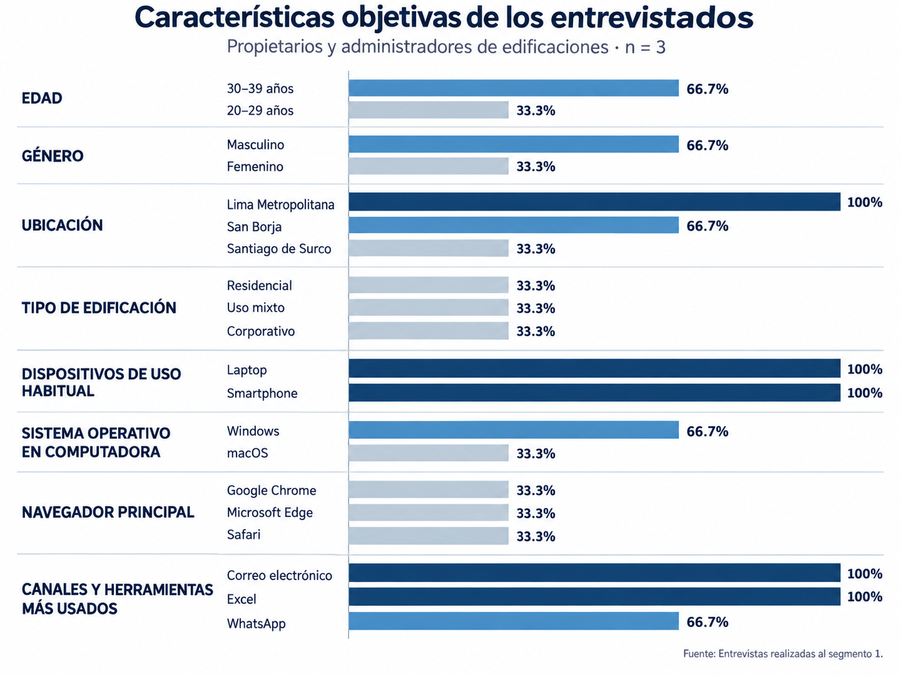

En relación con la edad, el 66.7 % de los entrevistados se encuentra entre los 30 y 39 años, mientras que el 33.3 % se encuentra entre los 20 y 29 años. Respecto al género, el 66.7 % corresponde al género masculino y el 33.3 % al femenino.

El 100 % reside en Lima Metropolitana. Específicamente, el 66.7 % reside en San Borja y el 33.3 % en Santiago de Surco. Asimismo, el 100 % cuenta con formación profesional y desarrolla actividades directamente vinculadas con la administración, operación, mantenimiento o gestión de infraestructura de edificaciones.

Las edificaciones representadas en la muestra corresponden a tres contextos distintos: residencial, uso mixto y corporativo, lo que permite observar necesidades compartidas en diferentes tipos de infraestructura.

Desde la perspectiva tecnológica, el 100 % utiliza una laptop y un smartphone como herramientas habituales de trabajo. En computadoras, el 66.7 % utiliza Windows y el 33.3 % macOS. Respecto al navegador principal, existe una distribución equivalente: 33.3 % utiliza Google Chrome, 33.3 % Microsoft Edge y 33.3 % Safari.

El 100 % utiliza correo electrónico y Excel dentro de sus actividades laborales, mientras que el 66.7 % utiliza WhatsApp como mecanismo frecuente de comunicación y coordinación.

##### Características subjetivas

El análisis subjetivo permite identificar comportamientos, necesidades, frustraciones, objetivos y criterios de decisión compartidos por los representantes del segmento.

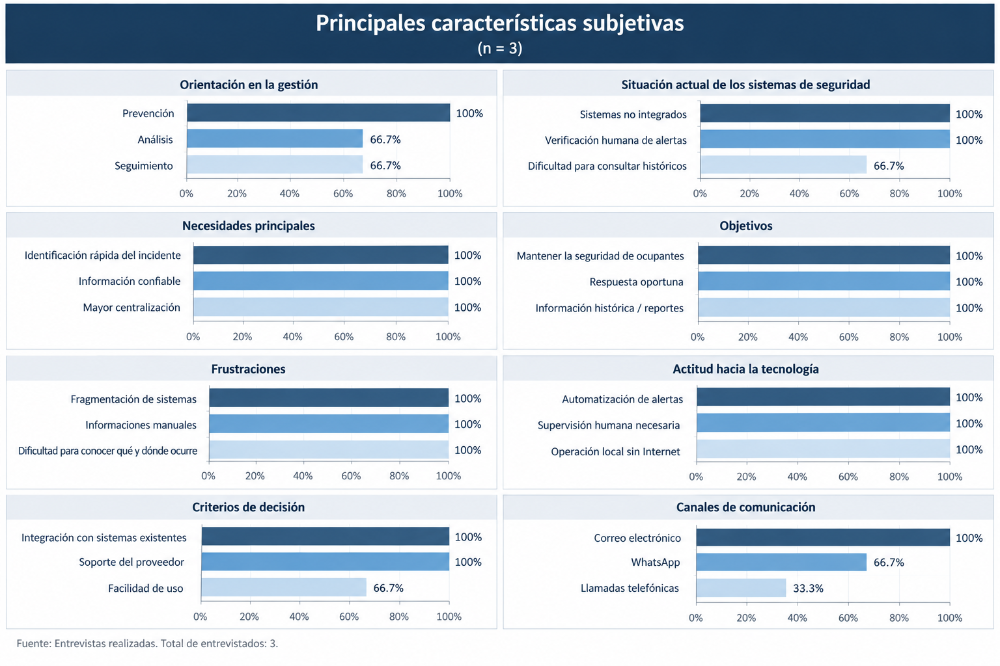

El 100 % de los entrevistados presenta una forma de trabajo orientada a la prevención, el análisis o el seguimiento estructurado de sus responsabilidades. Aunque existen diferencias individuales, los tres participantes consideran fundamental disponer de información confiable antes de tomar decisiones relacionadas con la seguridad.

El 100 % trabaja actualmente con diferentes sistemas o fuentes de información relacionadas con seguridad que no se encuentran completamente integrados. Esta fragmentación obliga a consultar diferentes plataformas, comunicarse con otras personas o realizar verificaciones adicionales para comprender una situación.

La necesidad de identificar rápidamente la ubicación del incidente aparece en el 100 % de los entrevistados. Asimismo, el 100 % manifestó que durante determinadas alertas existe algún nivel de verificación humana antes de confirmar el evento o ejecutar acciones de mayor impacto.

El 100 % considera que las funciones críticas deberían continuar operando localmente cuando se pierde la conexión a Internet. También el 100 % mantiene una actitud favorable hacia la automatización de alertas, notificaciones, señalización o registro de eventos, pero considera necesaria la supervisión o validación humana cuando una acción pueda generar consecuencias importantes sobre personas o infraestructura.

La integración y el soporte aparecen como criterios relevantes para la adopción de nuevas tecnologías en el 100 % de los casos. Además, el 100 % manifestó interés en contar con información histórica o indicadores que permitan realizar seguimiento de los incidentes.

En el 66.7 % de los casos existen dificultades para consultar información histórica debido a que los registros se encuentran distribuidos entre documentos, correos, hojas de cálculo o conversaciones. De forma relacionada, el 66.7 % utiliza WhatsApp como mecanismo complementario de coordinación.

##### Perfil predominante del segmento

Los resultados permiten identificar como perfil predominante a un profesional responsable de administrar u operar una edificación, acostumbrado a coordinar con personal de seguridad, mantenimiento, propietarios y proveedores.

Utiliza habitualmente una computadora y un smartphone, consulta diferentes sistemas y necesita disponer de información confiable antes de tomar decisiones. Su principal objetivo es mantener la seguridad de los ocupantes y reaccionar oportunamente ante situaciones de riesgo.

Sus principales frustraciones se relacionan con la fragmentación de los sistemas, la necesidad de realizar verificaciones manuales y la dificultad para conocer inmediatamente qué ocurre y dónde ocurre. El segmento presenta una actitud favorable hacia la automatización, siempre que esta sea confiable y mantenga mecanismos adecuados de control humano.

---

#### Segmento objetivo #2: Empresas integradoras de automatización y gestión de edificios inteligentes

##### Características objetivas

El análisis de las características objetivas permite identificar el perfil demográfico, profesional y tecnológico de los representantes de empresas dedicadas a automatización de edificios, integración IoT y Building Management Systems.

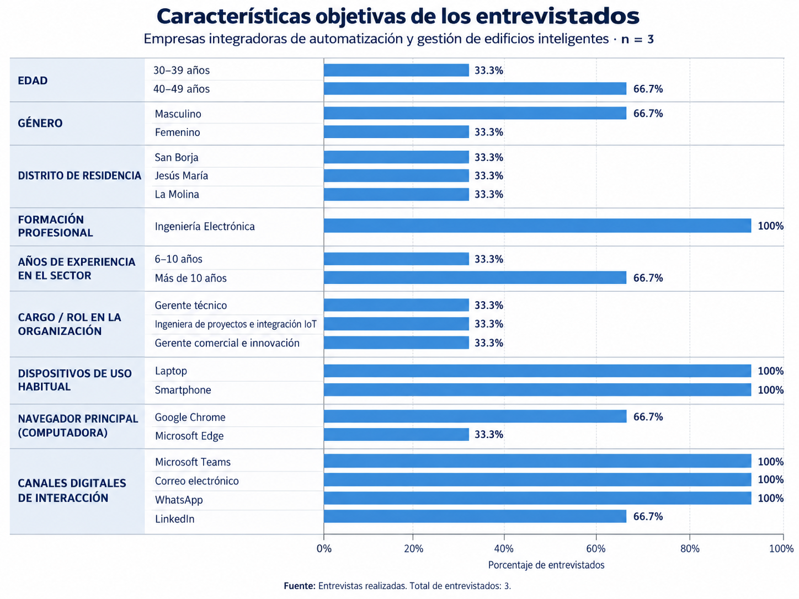

En relación con la edad, el 33.3 % de los entrevistados se encuentra entre los 30 y 39 años, mientras que el 66.7 % se encuentra entre los 40 y 49 años. Respecto al género, el 66.7 % corresponde al género masculino y el 33.3 % al femenino.

El 100 % reside en Lima Metropolitana, con participantes ubicados en San Borja, Jesús María y La Molina. Cada distrito representa el 33.3 % de la muestra.

El 100 % cuenta con formación en Ingeniería Electrónica y posee experiencia profesional directamente relacionada con tecnología, automatización o integración. El 100 % posee seis o más años de experiencia en el sector, mientras que el 66.7 % cuenta con más de diez años de trayectoria profesional.

Los perfiles profesionales representan distintas etapas del proceso de integración: el 33.3 % corresponde a dirección técnica, el 33.3 % a ingeniería de proyectos e integración IoT y el 33.3 % a gestión comercial e innovación. De esta manera, la muestra incorpora perspectivas técnicas, operativas y comerciales.

El 100 % utiliza una laptop y un smartphone como herramientas habituales. Respecto al navegador utilizado principalmente desde la computadora, el 66.7 % utiliza Google Chrome y el 33.3 % Microsoft Edge.

Microsoft Teams, WhatsApp y correo electrónico son utilizados por el 100 % de los entrevistados como canales de comunicación profesional. Además, el 66.7 % mencionó LinkedIn como una fuente utilizada para conocer empresas, tecnologías o proveedores.

##### Características subjetivas

El análisis subjetivo del segmento permite identificar los criterios mediante los cuales las empresas integradoras evalúan tecnologías, afrontan problemas de interoperabilidad y deciden incorporar soluciones externas dentro de los proyectos que desarrollan para sus clientes.

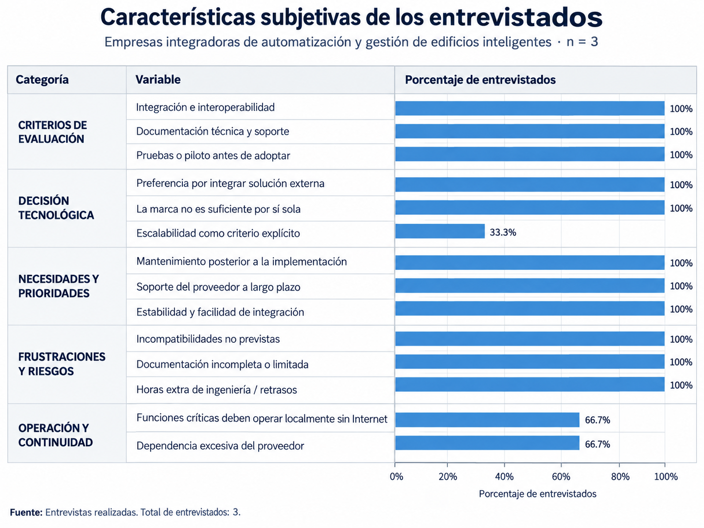

El 100 % de los entrevistados considera la capacidad de integración e interoperabilidad como un factor fundamental al evaluar una nueva tecnología. Los tres participantes mencionaron dificultades relacionadas con compatibilidad, protocolos, APIs, documentación o integración entre productos de diferentes fabricantes.

El 100 % considera necesario disponer de documentación técnica, soporte y mecanismos adecuados de integración antes de incorporar una solución externa. APIs, protocolos abiertos, documentación comprensible y capacidad de soporte aparecen como factores recurrentes en la evaluación.

Asimismo, el 100 % considera importante realizar una prueba, demostración técnica o piloto antes de confiar plenamente en una tecnología nueva. Esto evidencia que la adopción no depende solamente de una presentación comercial, sino de comprobar que la solución puede integrarse y funcionar en condiciones reales.

El 100 % indicó que, cuando existe una solución especializada adecuada, puede resultar preferible integrarla antes que desarrollar internamente toda la funcionalidad. Esta decisión busca evitar asumir innecesariamente actividades adicionales de desarrollo, mantenimiento, pruebas y soporte.

En los tres participantes aparece también una preocupación relacionada con el mantenimiento posterior a la implementación. El 100 % considera importante que una tecnología continúe siendo estable, mantenible y respaldada por el proveedor después de su instalación inicial.

El 100 % manifestó frustraciones relacionadas con soluciones cuya compatibilidad, documentación o facilidad de integración no corresponde con lo esperado inicialmente. Estas situaciones pueden generar horas adicionales de ingeniería, retrasos, modificaciones de arquitectura o dificultades para mantener posteriormente la solución.

La reputación de una marca puede influir en el proceso, pero el 100 % considera que esta no es suficiente por sí sola para determinar una decisión. La documentación, las pruebas, el soporte, las recomendaciones y los casos reales también influyen en la confianza hacia una tecnología.

Respecto a la continuidad ante pérdida de conectividad, el 66.7 % mencionó explícitamente que las funciones críticas deberían continuar operando localmente sin depender permanentemente de Internet.

La escalabilidad fue mencionada explícitamente por el 33.3 % como un criterio necesario para determinar si una tecnología puede utilizarse no solamente en un edificio, sino también en múltiples edificios y clientes.

##### Perfil predominante del segmento

Los resultados permiten identificar como perfil predominante a un profesional con formación técnica y experiencia en automatización, IoT o integración de sistemas, que participa en la evaluación, implementación o incorporación comercial de nuevas tecnologías.

Su trabajo exige conectar soluciones pertenecientes a distintos fabricantes y adaptarlas a la infraestructura disponible en los proyectos de sus clientes. Por esta razón, valora especialmente la interoperabilidad, documentación, estabilidad, soporte, pruebas y facilidad de mantenimiento.

Su principal objetivo es incorporar tecnologías confiables que puedan integrarse con sistemas existentes sin generar un esfuerzo desproporcionado de implementación o mantenimiento. Sus principales frustraciones aparecen cuando una solución presenta incompatibilidades no documentadas, ecosistemas cerrados o requerimientos técnicos que solo se descubren durante las etapas de prueba o puesta en marcha.

Este segmento no evalúa únicamente el producto. También evalúa la capacidad del proveedor para actuar como un socio tecnológico, responder ante problemas y sostener la solución durante su ciclo de vida.

---

#### Síntesis de los resultados

Los resultados muestran diferencias claras entre ambos segmentos.

Los propietarios y administradores de edificaciones se concentran principalmente en la operación cotidiana de una infraestructura y en la necesidad de comprender y responder rápidamente ante situaciones de riesgo. Para este segmento, la fragmentación de sistemas genera dificultades al momento de localizar un incidente, reunir información y coordinar la respuesta.

Las empresas integradoras, en cambio, analizan el problema desde la implementación tecnológica. Su principal preocupación se relaciona con la capacidad de incorporar una nueva solución dentro de infraestructuras que ya poseen dispositivos, plataformas y sistemas pertenecientes a diferentes fabricantes.

En ambos segmentos la integración constituye un aspecto relevante, aunque desde perspectivas diferentes. Para los administradores significa disponer de una visión más clara y centralizada de la infraestructura; para los integradores significa contar con protocolos, APIs, documentación y mecanismos que permitan incorporar nuevas capacidades dentro de proyectos existentes.

Los resultados del análisis servirán como base para actualizar los User Personas y los demás artefactos de Needfinding, manteniendo trazabilidad entre las características representadas y la evidencia recopilada durante las entrevistas.

## 2.3. Needfinding

### 2.3.1. User Personas

Los User Personas representan los dos segmentos objetivo de ResQ: propietarios y administradores de edificaciones, y empresas integradoras de automatización y gestión de edificios inteligentes. Permiten relacionar las responsabilidades de cada perfil con sus objetivos, dificultades y condiciones de uso de una solución IoT.

**Segmento objetivo #1: Propietarios y administradores de edificaciones — Carlos Mendoza**

Carlos Mendoza, de 37 años, representa al administrador de un edificio residencial que coordina seguridad y mantenimiento tanto desde la oficina como fuera de la instalación. Es organizado y preventivo, pero depende de llamadas, mensajes y sistemas separados para comprender una alerta. Su necesidad principal consiste en conocer el tipo de riesgo, su ubicación y evolución, y quién está atendiendo el evento. Para ResQ, este perfil orienta el monitoreo remoto por zonas, las alertas comprensibles y la consulta de las respuestas ejecutadas por el sistema.


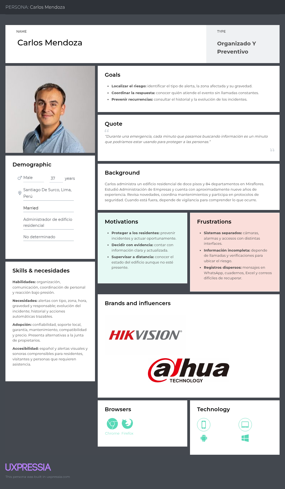

**Segmento objetivo #2: Empresas integradoras de automatización y gestión de edificios inteligentes — Alex Rivera**

Alex Rivera es un profesional que evalúa e integra tecnologías de automatización, IoT y BMS en proyectos de clientes. 


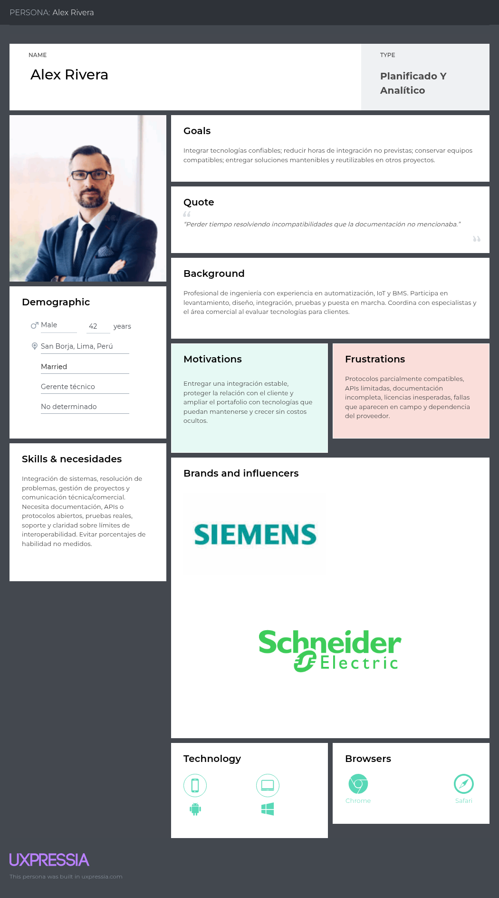


### 2.3.2. User Task Matrix

La User Task Matrix organiza tareas que cada User Persona realiza independientemente de que ResQ exista. La frecuencia indica qué tan seguido se realiza una actividad y la importancia expresa su relevancia para cumplir las responsabilidades del perfil. Ambas dimensiones se clasifican como alta, media o baja. Las valoraciones son una interpretación cualitativa de los relatos; no representan frecuencias medidas ni porcentajes de la población.

**Segmento objetivo #1: Carlos Mendoza — Propietarios y administradores de edificaciones**

| Tarea | Frecuencia | Importancia |
|---|---|---|
| Revisar novedades y condiciones de seguridad del edificio | Alta | Alta |
| Identificar el tipo de alerta, su ubicación y gravedad | Media | Alta |
| Coordinar la verificación y respuesta con vigilancia y mantenimiento | Media | Alta |
| Dar seguimiento a incidentes cuando se encuentra fuera del edificio | Media | Alta |
| Verificar el funcionamiento de los equipos de seguridad | Alta | Alta |
| Coordinar el mantenimiento preventivo de los equipos | Media | Alta |
| Registrar los incidentes y las acciones ejecutadas | Media | Alta |
| Consultar antecedentes de incidentes por fecha, tipo o zona | Media | Media |
| Evaluar nuevas alternativas de seguridad y presentarlas a la junta | Baja | Media |

**Segmento objetivo #2: Alex Rivera — Empresas integradoras de automatización y gestión de edificios inteligentes**

| Tarea | Frecuencia | Importancia |
|---|---|---|
| Comprender las necesidades del cliente y definir el alcance del proyecto | Alta | Alta |
| Levantar equipos, zonas, planos y condiciones de conectividad | Media | Alta |
| Revisar documentación, protocolos y compatibilidad de los sistemas | Alta | Alta |
| Diseñar y revisar la arquitectura de integración | Alta | Alta |
| Evaluar proveedores y realizar pruebas de concepto o pilotos | Media | Alta |
| Configurar dispositivos e integrar sistemas de distintos fabricantes | Alta | Alta |
| Validar en campo mediciones, comandos y funcionamiento sin Internet | Media | Alta |
| Documentar la solución, capacitar al cliente y coordinar la entrega | Media | Alta |
| Dar soporte, mantener la compatibilidad y evaluar ampliaciones | Alta | Alta |


### 2.3.3. User Journey Mapping

Los User Journey Maps describen experiencias actuales planteadas en los guiones. El recorrido del primer segmento sigue la atención de una alerta; el del segundo sigue la evaluación e integración de tecnología en un proyecto de automatización. Ambos son recorridos As-Is que distinguen los canales y problemas actuales de las oportunidades propuestas para ResQ. Las emociones son interpretaciones cualitativas, no mediciones de satisfacción ni mejoras comprobadas.

**Segmento objetivo #1: Carlos Mendoza — Atención de una alerta de humo en el sótano**

El recorrido presenta a Carlos fuera del edificio cuando recibe una llamada por una alerta de humo. Su objetivo es comprender la ubicación y gravedad del problema, coordinar con el personal y seguir la atención. El punto de mayor incertidumbre aparece mientras vigilancia revisa el sótano y las cámaras sin una vista unificada.

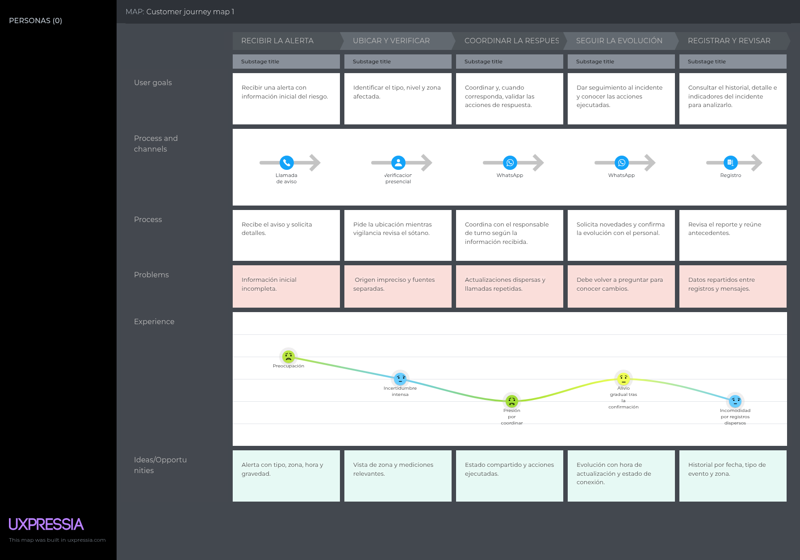

**Segmento objetivo #2: Alex Rivera — Evaluación e integración de una solución de automatización**

El Journey combina el levantamiento y modernización relatados por Luis, las pruebas de comunicación y problemas de campo descritos por Andrea, y la evaluación de proveedores y soporte explicados por Ricardo. Sus cinco etapas agrupan el recorrido completo: comprender, levantar, proponer un diseño, evaluar y probar, ajustar el diseño, implementar, poner en marcha, entregar y mantener. El diseño inicial es preliminar y se revisa a partir de los resultados del piloto.

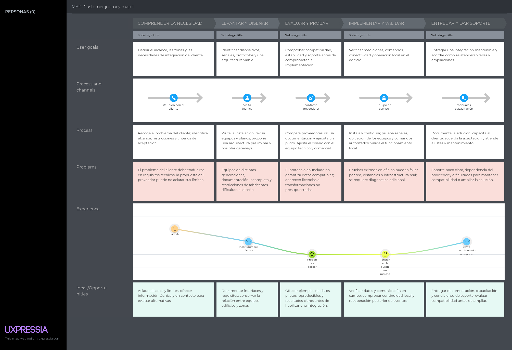


### 2.3.4. Empathy Mapping

Los mapas de empatía complementan los perfiles y recorridos al relacionar lo que cada persona necesita hacer con lo que ve, escucha, dice, piensa y siente. Su contenido sintetiza los guiones y explicita interpretaciones de diseño; no representa observaciones de campo realizadas por el equipo. Los bloques de dificultades y beneficios esperados permiten traducir esas perspectivas en necesidades que deberán validarse.

**Segmento objetivo #1: Carlos Mendoza — Propietarios y administradores de edificaciones**

El mapa de Carlos refleja la tensión entre su intención de prevenir incidentes y la dependencia de otras personas para reunir información durante una alerta. Aunque dispone de cámaras y alarmas, necesita comprender lo que ocurre cuando no está presente. La oportunidad para ResQ consiste en ofrecer información contextualizada y trazable que le permita coordinar con mayor claridad y conocer qué respuesta ha ejecutado el sistema.

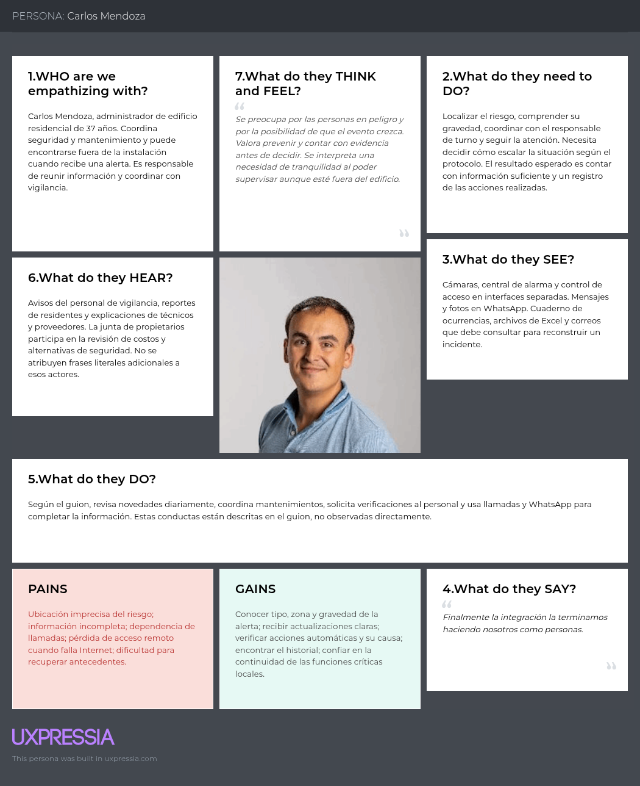

**Segmento objetivo #2: Alex Rivera — Empresas integradoras de automatización y gestión de edificios inteligentes**

El mapa sintetiza la necesidad de comprobar la interoperabilidad antes de comprometer el proyecto, reducir trabajo adicional y mantener el respaldo del proveedor después de la entrega. Integra las perspectivas técnica, de implementación y comercial presentes en los relatos de los entrevistados.

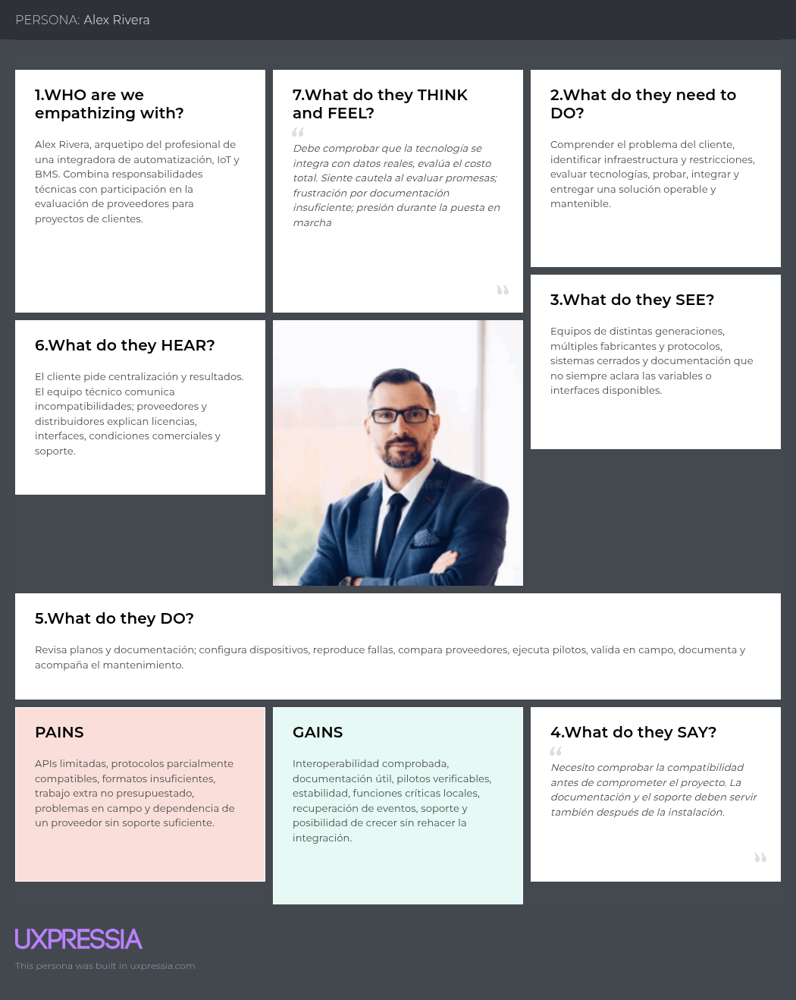


Ambos mapas muestran que la interoperabilidad importa por motivos diferentes. Carlos necesita comprender el riesgo y la respuesta en su edificio; Alex necesita evaluar si la tecnología puede integrarse y mantenerse en proyectos de clientes. Por ello, la evidencia de pruebas, la operación local de funciones críticas y la claridad sobre los límites de integración son esenciales para que una empresa integradora considere incorporar ResQ.

## 2.4. Big Picture EventStorming
El Big Picture de ResQ ilustra visualmente cómo la plataforma entrega valor en situaciones críticas, mapeando el ciclo de vida completo de una emergencia. A nivel empresarial, muestra cómo un incidente físico desencadena automáticamente acciones de protección inmediatas, alerta a los responsables sin demoras y registra cada paso para su gestión y auditoría posterior. De esta forma, este esquema demuestra cómo la solución elimina los cuellos de botella manuales, reduce drásticamente los tiempos de respuesta y garantiza la seguridad y continuidad operativa del edificio de principio a fin.


En la arquitectura de ResQ, el flujo se construye como una cadena continua de causa y efecto: un Actor (como un sensor o administrador) o una Política automática ejecuta un Comando (la acción en azul) sobre un Agregado (el componente del sistema), el cual procesa la lógica y emite un Evento de Dominio (el hecho consumado en naranja). A su vez, este evento cumple un doble propósito: actualiza una Vista (interfaz en verde) para informar al usuario y dispara nuevas Políticas (reglas en morado) que pueden interactuar con Sistemas Externos (rosa) o lanzar automáticamente el siguiente comando, conectando sin interrupciones la detección local con la gestión en la nube.
## 2.5. Ubiquitous Language
El Lenguaje Ubicuo (Ubiquitous Language) es un pilar fundamental en el Diseño Guiado por el Dominio (DDD). Su objetivo es establecer un glosario estricto y compartido entre los desarrolladores, los administradores y los expertos del negocio, garantizando que no existan ambigüedades técnicas ni operativas.

| Término | Definición |
|---|---|
| Building | Infraestructura física (residencial, comercial o institucional) que se encuentra bajo el monitoreo y gestión de la plataforma ResQ. |
| Zone | Subdivisión lógica y física dentro de una Edificación (ej. pasillo, sótano, comedor) que permite localizar el origen exacto de las mediciones y los riesgos. |
| IoT Device | Hardware instalado en las Zonas. Se divide en dos tipos: Sensores (capturan variables ambientales/físicas) y Actuadores (ejecutan respuestas físicas, como alarmas o válvulas). |
| Anomalous Condition | Lectura o estado reportado por un Sensor que supera los umbrales seguros predefinidos, pero que aún requiere clasificación. |
| Risk | Amenaza confirmada y clasificada (ej. fuga de gas, sismo, incendio) que desencadena los protocolos de seguridad. Tiene asociado un Nivel (gravedad) y un Tipo. |
| Automatic Response | Acción de seguridad ejecutada de forma inmediata por los actuadores (ej. luces de evacuación, sirenas) sin necesidad de intervención humana. |
| High-Impact Action | Respuesta física que, por su potencial de generar un riesgo adicional o interrumpir operaciones, requiere obligatoriamente la Confirmación manual de un usuario humano antes de ejecutarse. |
| Incident | Registro formal e histórico de un Riesgo detectado. Agrupa toda la información relacionada: fecha, Zona afectada, respuestas ejecutadas y el estado actual de atención. |
| Authorized Manager | Usuario de la plataforma (administrador, facility manager o jefe de seguridad) con los permisos necesarios para gestionar Zonas, confirmar Acciones de Alto Impacto y cerrar Incidentes. |
| Edge Computing | Capacidad de la infraestructura local para procesar datos de los sensores y ejecutar Respuestas Automáticas de manera autónoma, garantizando la Continuidad Operativa ante la pérdida de conexión a Internet. |
| Detection/Response Rule | Configuración lógica que determina qué condiciones disparan una alerta y qué acciones específicas deben ejecutarse según el contexto, horario y tipo de Riesgo. |

<div style="page-break-before: always; break-before: page;"></div>

# Capítulo III: Requirements Specification


## 3.1. User Stories

A partir de los hallazgos obtenidos durante el proceso de Requirements Elicitation & Analysis, se identificaron las principales necesidades de los dos segmentos objetivo de ResQ: **propietarios y administradores de edificaciones** y **empresas integradoras de automatización y gestión de edificios inteligentes**.

Las **Epics** representan capacidades amplias del producto asociadas con resultados que los usuarios necesitan alcanzar y que, debido a su alcance, requieren ser descompuestas en múltiples User Stories. Por esta razón, las Epics no representan módulos técnicos ni equivalen directamente a los Bounded Contexts definidos para la arquitectura.

Las **User Stories** expresan objetivos concretos de los usuarios mediante la estructura **“Como [rol], deseo [objetivo], para [beneficio]”**, priorizando el valor que el usuario espera obtener y evitando describir directamente pantallas, componentes tecnológicos o decisiones de implementación.

Las funcionalidades necesarias para soportar la arquitectura distribuida IoT de ResQ que no representan una interacción directa con usuarios finales se especifican mediante **Technical Stories**, utilizando el rol **Developer**.

La definición considera los Bounded Contexts previamente establecidos para ResQ: **IAM, User, Building, Device, Monitoring, Risk Detection, Alert & Response Management, Incident y Connectividad**. Estos Bounded Contexts no se utilizan como criterio para definir las Epics. Una Epic o User Story puede requerir la colaboración de uno o varios Bounded Contexts para satisfacer el objetivo del usuario.

Los criterios de aceptación se plantean mediante escenarios verificables utilizando la estructura **Given-When-Then**. Estos describen el comportamiento esperado del producto sin establecer detalles específicos de interfaz de usuario.

| Epic / Story ID | Título                                                   | Descripción                                                                                                                                                                                                                       | Criterios de Aceptación                                                                                                                                                                                                                                                                                                                                                                                                                                                                                             | Relacionado con (Epic ID) |
| --------------- | -------------------------------------------------------- | --------------------------------------------------------------------------------------------------------------------------------------------------------------------------------------------------------------------------------- | ------------------------------------------------------------------------------------------------------------------------------------------------------------------------------------------------------------------------------------------------------------------------------------------------------------------------------------------------------------------------------------------------------------------------------------------------------------------------------------------------------------------- | ------------------------- |
| **EP01**        | **Visibilidad operativa de la edificación**              | Agrupa las capacidades necesarias para que los responsables comprendan el estado actual de una edificación, sus zonas y dispositivos sin depender de múltiples fuentes de información.                                            | —                                                                                                                                                                                                                                                                                                                                                                                                                                                                                                                   | —                         |
| **US01**        | Consultar el estado general de una edificación           | Como responsable de una edificación, deseo conocer el estado general de la infraestructura, para identificar oportunamente si existe alguna condición que requiera atención.                                                      | **AC1:** Given el usuario está autorizado para consultar una edificación, When consulta su estado actual, Then el sistema proporciona el estado vigente de la edificación e informa si existe algún riesgo activo.<br><br>**AC2:** Given no existen riesgos activos en la edificación, When se consulta su estado, Then el sistema informa que no existen condiciones de riesgo activas y proporciona la última actualización disponible.                                                                           | EP01                      |
| **US02**        | Consultar el estado de una zona                          | Como responsable de una edificación, deseo conocer el estado de cada zona monitoreada, para identificar rápidamente dónde existe una condición anómala.                                                                           | **AC1:** Given una edificación posee zonas monitoreadas, When el usuario consulta el estado de una zona, Then el sistema proporciona su condición actual utilizando la información disponible.<br><br>**AC2:** Given una zona presenta una condición de riesgo activa, When se consulta su estado, Then el sistema identifica dicha condición y la relaciona con la zona correspondiente.                                                                                                                           | EP01                      |
| **US03**        | Consultar mediciones actuales                            | Como responsable de una edificación, deseo consultar las mediciones actuales de los dispositivos, para comprender las condiciones de las zonas supervisadas.                                                                      | **AC1:** Given un dispositivo registra una medición válida, When el responsable consulta la información disponible, Then el sistema proporciona el valor más reciente junto con su tipo de variable y momento de registro.<br><br>**AC2:** Given no existe una medición vigente para un dispositivo, When se consulta su información, Then el sistema identifica que no dispone de un valor actualizado sin presentar datos antiguos como actuales.                                                                 | EP01                      |
| **US04**        | Conocer el estado operativo de un dispositivo            | Como responsable de una edificación, deseo conocer si un dispositivo se encuentra operativo, para distinguir una condición real de una posible falla del equipo.                                                                  | **AC1:** Given un dispositivo registrado mantiene comunicación dentro del periodo esperado, When se consulta su estado, Then el sistema lo identifica como disponible.<br><br>**AC2:** Given un dispositivo deja de comunicar información durante el periodo establecido, When se evalúa su estado, Then el sistema identifica su falta de disponibilidad.                                                                                                                                                          | EP01                      |
| **US05**        | Supervisar remotamente una edificación                   | Como administrador o facility manager, deseo supervisar remotamente la infraestructura, para mantener visibilidad aun cuando no me encuentre físicamente en el edificio.                                                          | **AC1:** Given el responsable posee autorización sobre una edificación, When consulta remotamente su información, Then puede conocer sus zonas, riesgos activos y estado general.<br><br>**AC2:** Given ocurre un cambio relevante en la edificación, When la información actualizada se encuentra disponible, Then el estado consultable refleja el cambio registrado.                                                                                                                                             | EP01                      |
| **EP02**        | **Comprensión y contextualización del riesgo**           | Agrupa las capacidades destinadas a determinar qué situación de riesgo existe, dónde ocurre, qué nivel presenta y qué evidencia originó su detección.                                                                             | —                                                                                                                                                                                                                                                                                                                                                                                                                                                                                                                   | —                         |
| **US06**        | Conocer el tipo de riesgo detectado                      | Como responsable de seguridad, deseo conocer el tipo de riesgo detectado, para comprender qué situación está ocurriendo.                                                                                                          | **AC1:** Given las mediciones cumplen las condiciones correspondientes a un tipo de riesgo definido, When se identifica el riesgo, Then el sistema lo clasifica utilizando el tipo correspondiente.<br><br>**AC2:** Given las mediciones no satisfacen ninguna condición definida, When son evaluadas, Then el sistema no registra un tipo de riesgo sin evidencia suficiente.                                                                                                                                      | EP02                      |
| **US07**        | Conocer el nivel de riesgo                               | Como responsable de seguridad, deseo conocer el nivel del riesgo detectado, para determinar la urgencia con la que debe atenderse.                                                                                                | **AC1:** Given se detecta un riesgo, When las condiciones permiten determinar su severidad, Then el sistema asigna el nivel correspondiente.<br><br>**AC2:** Given la condición del riesgo cambia, When la nueva información modifica su nivel, Then el sistema actualiza la severidad conservando trazabilidad del cambio.                                                                                                                                                                                         | EP02                      |
| **US08**        | Conocer la ubicación del riesgo                          | Como responsable de seguridad, deseo conocer la zona donde se originó el riesgo, para dirigir la respuesta hacia el lugar correcto.                                                                                               | **AC1:** Given un dispositivo asociado con una zona origina una detección, When el riesgo es registrado, Then el sistema lo relaciona con la edificación y zona correspondientes.<br><br>**AC2:** Given el dispositivo no posee una ubicación válida, When genera información asociada con un posible riesgo, Then el sistema identifica que la localización no puede determinarse correctamente.                                                                                                                   | EP02                      |
| **US09**        | Consultar el contexto de una detección                   | Como responsable de seguridad, deseo conocer qué dispositivo y mediciones originaron la detección, para contar con contexto antes de tomar una decisión.                                                                          | **AC1:** Given existe un riesgo detectado, When el responsable consulta su información, Then puede conocer los dispositivos y valores relevantes utilizados para determinarlo.<br><br>**AC2:** Given distintas mediciones intervienen en la detección, When se consulta el contexto, Then el sistema conserva su relación con el mismo evento de riesgo.                                                                                                                                                            | EP02                      |
| **EP03**        | **Coordinación de alertas y respuesta**                  | Agrupa las capacidades destinadas a comunicar situaciones de riesgo y coordinar o ejecutar las respuestas correspondientes de acuerdo con las políticas establecidas.                                                             | —                                                                                                                                                                                                                                                                                                                                                                                                                                                                                                                   | —                         |
| **US10**        | Recibir una alerta de riesgo                             | Como responsable de una edificación, deseo recibir una alerta cuando se detecte una situación de riesgo, para conocer oportunamente lo ocurrido.                                                                                  | **AC1:** Given se detecta un riesgo que requiere comunicación, When se genera la alerta, Then esta contiene como mínimo el tipo de riesgo, nivel, zona y momento del evento.<br><br>**AC2:** Given existen responsables autorizados para recibir la alerta, When esta es generada, Then el sistema inicia su comunicación a los responsables correspondientes.                                                                                                                                                      | EP03                      |
| **US11**        | Ejecutar una respuesta automática autorizada             | Como responsable de una edificación, deseo que determinadas respuestas se ejecuten automáticamente cuando se cumplan condiciones previamente autorizadas, para reducir el tiempo de reacción.                                     | **AC1:** Given existe una política de respuesta automática habilitada, When ocurre el riesgo asociado y se cumplen sus condiciones, Then el sistema ejecuta la respuesta definida.<br><br>**AC2:** Given una política no autoriza ejecución automática para una condición, When se detecta dicha condición, Then el sistema no ejecuta la acción automáticamente.                                                                                                                                                   | EP03                      |
| **US12**        | Confirmar una acción de alto impacto                     | Como responsable autorizado, deseo confirmar las respuestas que puedan generar un impacto significativo, para mantener control humano sobre acciones sensibles.                                                                   | **AC1:** Given una respuesta requiere autorización humana, When se solicita su ejecución, Then la acción permanece pendiente hasta recibir una decisión de un usuario autorizado.<br><br>**AC2:** Given el usuario autorizado rechaza la acción, When la decisión es registrada, Then la respuesta no se ejecuta y la decisión queda asociada con el incidente.                                                                                                                                                     | EP03                      |
| **US13**        | Conocer las respuestas ejecutadas                        | Como responsable de seguridad, deseo conocer qué respuestas fueron ejecutadas, para verificar cómo actuó el sistema durante el evento.                                                                                            | **AC1:** Given una respuesta se ejecuta durante un incidente, When su resultado es registrado, Then el sistema conserva el tipo de acción, momento y resultado obtenido.<br><br>**AC2:** Given una respuesta solicitada no puede completarse, When se registra el resultado, Then el sistema diferencia la acción fallida de una ejecución satisfactoria.                                                                                                                                                           | EP03                      |
| **EP04**        | **Trazabilidad y seguimiento de incidentes**             | Agrupa las capacidades necesarias para conocer el ciclo de vida de una situación de riesgo, las decisiones adoptadas, las respuestas ejecutadas y la información histórica resultante.                                            | —                                                                                                                                                                                                                                                                                                                                                                                                                                                                                                                   | —                         |
| **US14**        | Consultar el estado de un incidente                      | Como responsable de seguridad, deseo conocer el estado actual de un incidente, para saber si todavía requiere atención.                                                                                                           | **AC1:** Given existe un incidente activo, When el responsable consulta su estado, Then el sistema proporciona su estado vigente y la última actualización registrada.<br><br>**AC2:** Given el incidente cambia de estado, When el cambio es registrado, Then el nuevo estado queda disponible sin eliminar la trazabilidad de estados anteriores.                                                                                                                                                                 | EP04                      |
| **US15**        | Asignar un responsable de atención                       | Como responsable de seguridad, deseo identificar quién se encuentra atendiendo un incidente, para coordinar las acciones y evitar responsabilidades ambiguas.                                                                     | **AC1:** Given existe un incidente que requiere atención, When un usuario autorizado asigna un responsable, Then el incidente queda asociado con dicho responsable.<br><br>**AC2:** Given cambia la persona responsable del incidente, When se registra la nueva asignación, Then el sistema conserva evidencia de la modificación realizada.                                                                                                                                                                       | EP04                      |
| **US16**        | Registrar la resolución de un incidente                  | Como responsable de seguridad, deseo registrar la resolución y cierre de un incidente, para conservar evidencia de cómo terminó la situación.                                                                                     | **AC1:** Given un incidente ha sido atendido, When un usuario autorizado registra su resolución, Then el sistema conserva el resultado y momento de resolución.<br><br>**AC2:** Given el incidente no cumple las condiciones necesarias para su cierre, When se intenta cerrarlo, Then el sistema mantiene su estado sin registrarlo como finalizado.                                                                                                                                                               | EP04                      |
| **US17**        | Consultar incidentes anteriores                          | Como responsable de una edificación, deseo consultar incidentes anteriores, para revisar situaciones ocurridas en la infraestructura.                                                                                             | **AC1:** Given existen incidentes registrados, When el responsable consulta el historial autorizado, Then el sistema proporciona los incidentes correspondientes a su ámbito de acceso.<br><br>**AC2:** Given no existen incidentes para el periodo consultado, When se realiza la consulta, Then el sistema informa que no existen resultados correspondientes.                                                                                                                                                    | EP04                      |
| **US18**        | Buscar incidentes históricos                             | Como responsable de una edificación, deseo localizar incidentes mediante fecha, zona, tipo o estado, para encontrar rápidamente información histórica relevante.                                                                  | **AC1:** Given existen incidentes con diferentes características, When el responsable aplica criterios de búsqueda válidos, Then el sistema devuelve únicamente los incidentes que cumplen dichos criterios.<br><br>**AC2:** Given se utilizan varios criterios simultáneamente, When se realiza la búsqueda, Then los resultados satisfacen conjuntamente las condiciones proporcionadas.                                                                                                                          | EP04                      |
| **US19**        | Consultar la secuencia de un incidente                   | Como responsable de una edificación, deseo consultar la secuencia de mediciones, alertas y respuestas asociadas con un incidente, para comprender cómo evolucionó.                                                                | **AC1:** Given existe información trazable asociada con un incidente, When se consulta su evolución, Then el sistema proporciona los eventos relevantes en orden temporal.<br><br>**AC2:** Given una acción o cambio se encuentra relacionado con el incidente, When se consulta su trazabilidad, Then la información conserva el momento y relación correspondientes.                                                                                                                                              | EP04                      |
| **US20**        | Consultar indicadores de incidentes                      | Como facility manager, deseo consultar indicadores como frecuencia de incidentes, falsas alarmas y tiempos de atención, para identificar tendencias que requieran acciones preventivas.                                           | **AC1:** Given existen incidentes con información suficiente, When se calculan indicadores para un periodo determinado, Then el sistema utiliza únicamente datos correspondientes al periodo seleccionado.<br><br>**AC2:** Given no existe información suficiente para calcular un indicador, When se solicita dicho indicador, Then el sistema no presenta un resultado cuantitativo sin sustento.                                                                                                                 | EP04                      |
| **EP05**        | **Preparación y gobierno del entorno monitoreado**       | Agrupa las capacidades necesarias para preparar las edificaciones, zonas, dispositivos, reglas, usuarios y responsabilidades requeridas antes y durante la operación de ResQ.                                                     | —                                                                                                                                                                                                                                                                                                                                                                                                                                                                                                                   | —                         |
| **US21**        | Registrar una edificación                                | Como administrador, deseo registrar una edificación que será monitoreada, para organizar la infraestructura gestionada por ResQ.                                                                                                  | **AC1:** Given el administrador proporciona los datos obligatorios de una nueva edificación, When confirma su registro, Then la edificación queda disponible dentro de la organización correspondiente.<br><br>**AC2:** Given faltan datos obligatorios o estos son inválidos, When se solicita el registro, Then el sistema no crea una edificación incompleta.                                                                                                                                                    | EP05                      |
| **US22**        | Definir zonas de una edificación                         | Como administrador, deseo definir las zonas de una edificación, para localizar correctamente dispositivos y eventos.                                                                                                              | **AC1:** Given existe una edificación registrada, When el administrador registra una zona válida, Then esta queda asociada con la edificación correspondiente.<br><br>**AC2:** Given una zona posee dispositivos o incidentes relacionados, When se modifica su información, Then sus relaciones se mantienen consistentes.                                                                                                                                                                                         | EP05                      |
| **US23**        | Asociar un dispositivo con una zona                      | Como administrador, deseo asociar cada dispositivo con su zona correspondiente, para identificar el origen de mediciones y alertas.                                                                                               | **AC1:** Given existe un dispositivo registrado y una zona válida, When el administrador realiza la asociación, Then las nuevas mediciones del dispositivo pueden relacionarse con dicha zona.<br><br>**AC2:** Given el dispositivo cambia de ubicación, When su asociación es actualizada, Then las nuevas mediciones utilizan la nueva ubicación sin alterar la trazabilidad histórica previa.                                                                                                                    | EP05                      |
| **US24**        | Configurar una condición de detección                    | Como responsable autorizado, deseo configurar condiciones de detección, para adaptar la identificación de riesgos a las características de la instalación.                                                                        | **AC1:** Given existe una variable monitoreada compatible, When el responsable registra una condición válida, Then esta puede utilizarse para evaluar mediciones posteriores.<br><br>**AC2:** Given una condición posee parámetros inválidos, When se intenta habilitarla, Then el sistema impide utilizarla para clasificar riesgos.                                                                                                                                                                               | EP05                      |
| **US25**        | Configurar una política de respuesta                     | Como responsable autorizado, deseo configurar las respuestas permitidas para cada tipo de riesgo, para establecer previamente cómo deberá actuar el sistema.                                                                      | **AC1:** Given existe un tipo de riesgo configurado, When el responsable define una política válida, Then esta establece las respuestas permitidas para dicho riesgo.<br><br>**AC2:** Given una respuesta requiere autorización humana, When se configura la política, Then dicha condición se conserva antes de permitir su ejecución.                                                                                                                                                                             | EP05                      |
| **US26**        | Asignar roles y responsabilidades                        | Como administrador, deseo asignar roles y responsabilidades a los usuarios, para limitar el acceso a información y acciones sensibles.                                                                                            | **AC1:** Given existe un usuario perteneciente a la organización, When el administrador le asigna un rol válido, Then sus operaciones permitidas corresponden a los permisos del rol.<br><br>**AC2:** Given un usuario carece del permiso requerido, When intenta ejecutar una operación protegida, Then el sistema rechaza la operación.                                                                                                                                                                           | EP05                      |
| **US27**        | Acceder de forma autenticada                             | Como usuario autorizado, deseo autenticarme antes de acceder a ResQ, para utilizar únicamente las funciones correspondientes a mis responsabilidades.                                                                             | **AC1:** Given el usuario proporciona credenciales válidas, When solicita autenticarse, Then el sistema establece una identidad autenticada correspondiente al usuario.<br><br>**AC2:** Given las credenciales proporcionadas son inválidas, When se solicita autenticación, Then el sistema rechaza el acceso sin establecer una sesión autorizada.                                                                                                                                                                | EP05                      |
| **EP06**        | **Continuidad operativa ante pérdida de conectividad**   | Agrupa las capacidades necesarias para mantener las funciones críticas de ResQ durante interrupciones de conectividad y conservar posteriormente la trazabilidad de los eventos producidos.                                       | —                                                                                                                                                                                                                                                                                                                                                                                                                                                                                                                   | —                         |
| **US28**        | Mantener funciones críticas sin Internet                 | Como responsable de una edificación, deseo que la detección y las respuestas críticas continúen funcionando cuando se pierde Internet, para mantener la capacidad de reacción ante una emergencia.                                | **AC1:** Given la edificación se encuentra siendo monitoreada y se pierde temporalmente la conexión a Internet, When ocurre una condición que cumple una regla de detección crítica, Then el sistema continúa detectando localmente la situación de riesgo.<br><br>**AC2:** Given existe una respuesta crítica previamente autorizada y no existe conexión a Internet, When se detecta la condición asociada con dicha respuesta, Then el sistema ejecuta la respuesta sin depender de la recuperación de Internet. | EP06                      |
| **US29**        | Recuperar eventos producidos durante una interrupción    | Como responsable de una edificación, deseo que los eventos producidos durante una interrupción de conectividad estén disponibles posteriormente, para conservar la trazabilidad de lo ocurrido.                                   | **AC1:** Given se producen eventos durante una interrupción de conectividad, When el sistema recupera la comunicación necesaria, Then los eventos ocurridos durante la interrupción pueden incorporarse al historial correspondiente.<br><br>**AC2:** Given un evento ocurrió durante la interrupción, When posteriormente se encuentra disponible para consulta, Then conserva el momento original en el que se produjo.                                                                                           | EP06                      |
| **EP07**        | **Integración de ResQ con infraestructuras existentes**  | Agrupa las capacidades necesarias para que una empresa integradora pueda evaluar, probar e incorporar ResQ en proyectos que utilizan dispositivos o sistemas existentes mediante mecanismos oficialmente soportados.              | —                                                                                                                                                                                                                                                                                                                                                                                                                                                                                                                   | —                         |
| **US30**        | Conocer los mecanismos de integración compatibles        | Como ingeniero de integración, deseo conocer qué mecanismos de integración soporta ResQ, para determinar si puede incorporarse a la infraestructura de mi cliente.                                                                | **AC1:** Given el integrador consulta las capacidades técnicas de ResQ, When revisa los mecanismos oficialmente soportados, Then puede identificar los protocolos o interfaces disponibles.<br><br>**AC2:** Given una tecnología no se encuentra soportada, When se consulta su compatibilidad, Then esta no se presenta como un mecanismo disponible.                                                                                                                                                              | EP07                      |
| **US31**        | Integrar una fuente externa compatible                   | Como ingeniero de integración, deseo conectar a ResQ un dispositivo o sistema externo mediante un mecanismo de integración soportado, para incorporar sus mediciones sin sustituir innecesariamente la infraestructura instalada. | **AC1:** Given una fuente externa utiliza un mecanismo oficialmente soportado, When proporciona datos válidos de acuerdo con el contrato definido, Then ResQ puede recibirlos para su procesamiento.<br><br>**AC2:** Given la fuente proporciona información incompatible con el contrato definido, When ResQ la recibe, Then los datos inválidos no se consideran mediciones válidas.                                                                                                                              | EP07                      |
| **US32**        | Validar una integración antes de activarla               | Como ingeniero de integración, deseo comprobar que una fuente externa entrega información compatible antes de utilizarla operativamente, para detectar incompatibilidades antes de su implementación definitiva.                  | **AC1:** Given una integración se encuentra configurada pero todavía no está habilitada para operación, When el integrador realiza una prueba con información válida, Then el sistema permite determinar si los datos pueden interpretarse correctamente.<br><br>**AC2:** Given la prueba detecta datos incompatibles o un problema de comunicación, When se obtiene el resultado, Then la integración permanece sin habilitarse para operación normal.                                                             | EP07                      |
| **US33**        | Asociar dispositivos externos con su contexto            | Como ingeniero de integración, deseo relacionar los dispositivos externos con el edificio y zona correspondientes, para conservar el contexto de las mediciones y eventos integrados.                                             | **AC1:** Given existe un dispositivo externo reconocido, When el integrador lo relaciona con una zona válida, Then sus nuevas mediciones pueden vincularse con dicha ubicación.<br><br>**AC2:** Given un dispositivo externo no posee una asociación válida, When genera información, Then el sistema evita atribuirle una ubicación no confirmada.                                                                                                                                                                 | EP07                      |
| **EP08**        | **Evaluación y adopción de ResQ**                        | Agrupa las capacidades del Landing Page y de la experiencia inicial destinadas a comunicar la propuesta de valor de ResQ a los segmentos objetivo y facilitar el inicio de una relación con la solución.                          | —                                                                                                                                                                                                                                                                                                                                                                                                                                                                                                                   | —                         |
| **US34**        | Comprender la propuesta de ResQ                          | Como visitante, deseo comprender el problema que aborda ResQ y su propuesta de solución, para determinar si resulta relevante para mis necesidades.                                                                               | **AC1:** Given un visitante accede al contenido informativo de ResQ, When consulta la propuesta, Then dispone de información sobre el problema abordado, las capacidades principales y la forma general de funcionamiento.<br><br>**AC2:** Given el visitante todavía no conoce ResQ, When revisa la propuesta, Then puede distinguir el propósito de la solución frente a una alarma o sensor aislado.                                                                                                             | EP08                      |
| **US35**        | Conocer los beneficios para administradores              | Como propietario o administrador de una edificación, deseo conocer los beneficios de ResQ aplicables a una edificación, para evaluar su utilidad dentro de mi infraestructura.                                                    | **AC1:** Given un visitante pertenece al segmento de propietarios o administradores, When consulta la información dirigida a dicho segmento, Then encuentra beneficios relacionados con monitoreo, detección, respuesta y trazabilidad.<br><br>**AC2:** Given el visitante evalúa la aplicación de ResQ, When revisa la información disponible, Then puede identificar las principales capacidades relevantes para la gestión de una edificación.                                                                   | EP08                      |
| **US36**        | Conocer los beneficios para empresas integradoras        | Como representante de una empresa integradora, deseo conocer cómo puede incorporarse ResQ a sistemas existentes, para evaluar si puede formar parte de nuestros proyectos.                                                        | **AC1:** Given el visitante pertenece a una empresa integradora, When consulta la propuesta orientada a su segmento, Then dispone de información sobre interoperabilidad, integración y aplicación de ResQ en proyectos existentes.<br><br>**AC2:** Given el integrador evalúa una posible incorporación, When revisa la propuesta, Then puede identificar a ResQ como una solución complementaria que no exige sustituir toda la infraestructura existente.                                                        | EP08                      |
| **US37**        | Acceder a documentación técnica de integración           | Como representante técnico de una empresa integradora, deseo acceder desde el sitio web a la documentación técnica disponible, para realizar una evaluación preliminar antes de iniciar un proyecto.                              | **AC1:** Given existe documentación técnica publicada para integradores, When el representante accede a ella desde los recursos disponibles, Then puede consultar información sobre mecanismos soportados y requisitos principales.<br><br>**AC2:** Given una capacidad se encuentra fuera del alcance soportado, When se consulta la documentación, Then esta no se presenta como característica disponible.                                                                                                       | EP08                      |
| **US38**        | Solicitar una demostración o contacto                    | Como representante de una empresa integradora, deseo solicitar una demostración, piloto o contacto con ResQ, para evaluar una posible colaboración.                                                                               | **AC1:** Given el representante proporciona la información obligatoria de contacto, When registra una solicitud válida, Then la solicitud queda registrada para su posterior atención.<br><br>**AC2:** Given faltan datos indispensables para atender la solicitud, When se intenta registrarla, Then el sistema identifica que la información requerida se encuentra incompleta.                                                                                                                                   | EP08                      |
| **US39**        | Acceder a los productos digitales de ResQ                | Como visitante, deseo acceder desde el Landing Page a los productos digitales disponibles, para continuar mi experiencia con la solución.                                                                                         | **AC1:** Given existe un producto digital público disponible, When el visitante selecciona su acceso desde el Landing Page, Then es dirigido al producto correspondiente.<br><br>**AC2:** Given un producto todavía no se encuentra disponible públicamente, When el visitante consulta las opciones existentes, Then no se presenta como un acceso funcional disponible.                                                                                                                                           | EP08                      |
| **TS01**        | Capturar mediciones desde los Embedded Systems           | Como Developer, deseo que la Embedded Application capture las mediciones de los sensores conectados, para proporcionar al procesamiento local la información necesaria para monitoreo y detección.                                | **AC1:** Given un sensor compatible produce una lectura válida, When la Embedded Application la captura, Then genera una medición con identificación del dispositivo, tipo de variable, valor y momento correspondiente.<br><br>**AC2:** Given la lectura obtenida es inválida, When la aplicación la procesa, Then no la comunica como una medición válida.                                                                                                                                                        | EP01                      |
| **TS02**        | Recibir mediciones mediante un Edge API                  | Como Developer, deseo disponer de un Edge API para recibir mediciones provenientes de los dispositivos, para desacoplar la captura física del procesamiento local.                                                                | **AC1:** Given un dispositivo autorizado envía una solicitud válida, When el Edge API recibe la medición, Then responde satisfactoriamente y entrega la información al procesamiento local.<br><br>**AC2:** Given la solicitud contiene información inválida, When el Edge API la recibe, Then responde con un resultado de error y no procesa la información como medición válida.                                                                                                                                 | EP01                      |
| **TS03**        | Procesar reglas de detección localmente                  | Como Developer, deseo evaluar las condiciones de riesgo en el Edge, para que la detección crítica no dependa permanentemente de servicios Cloud.                                                                                  | **AC1:** Given existe una regla activa y una nueva medición válida, When la medición es procesada localmente, Then la condición correspondiente es evaluada sin requerir comunicación Cloud.<br><br>**AC2:** Given la condición de riesgo se cumple, When finaliza la evaluación, Then se genera el evento local necesario para continuar el flujo de detección.                                                                                                                                                    | EP02                      |
| **TS04**        | Ejecutar comandos de actuadores localmente               | Como Developer, deseo que el Edge pueda coordinar comandos con los actuadores conectados, para ejecutar respuestas críticas sin depender permanentemente de Cloud.                                                                | **AC1:** Given una respuesta local autorizada requiere un actuador disponible, When el Edge solicita la acción, Then el comando correspondiente es enviado al dispositivo.<br><br>**AC2:** Given el actuador no confirma la ejecución esperada, When finaliza el intento, Then el resultado fallido queda disponible para la trazabilidad del evento.                                                                                                                                                               | EP03                      |
| **TS05**        | Integrar un servicio externo de notificaciones           | Como Developer, deseo disponer de un mecanismo para entregar notificaciones externas, para complementar la comunicación de alertas generadas por ResQ.                                                                            | **AC1:** Given existe una alerta y un destinatario válido, When el servicio recibe la solicitud de notificación, Then intenta entregar el mensaje utilizando el canal configurado.<br><br>**AC2:** Given el proveedor externo rechaza o no puede entregar la solicitud, When se recibe el resultado, Then el sistema registra el fallo sin considerar la notificación como entregada.                                                                                                                               | EP03                      |
| **TS06**        | Proveer servicios mediante RESTful API                   | Como Developer, deseo disponer de una RESTful API para los recursos Cloud de ResQ, para permitir que las aplicaciones digitales consuman los servicios de la plataforma.                                                          | **AC1:** Given un cliente autorizado envía una solicitud válida a un recurso disponible, When la API la procesa, Then responde utilizando el código HTTP y representación correspondientes al resultado.<br><br>**AC2:** Given una solicitud no está autorizada o contiene información inválida, When la API la procesa, Then responde mediante el resultado de error correspondiente sin ejecutar una operación no permitida.                                                                                      | EP01                      |
| **TS07**        | Conservar y sincronizar eventos durante una interrupción | Como Developer, deseo conservar temporalmente los eventos que no pueden enviarse a los servicios remotos, para sincronizarlos cuando la comunicación sea restablecida.                                                            | **AC1:** Given no existe comunicación disponible con los servicios remotos, When se genera un evento que requiere sincronización, Then este queda almacenado temporalmente como pendiente.<br><br>**AC2:** Given vuelve a existir conectividad, When inicia la sincronización, Then los eventos pendientes se transmiten conservando su momento original y evitando duplicar los ya confirmados.                                                                                                                    | EP06                      |
| **TS08**        | Proveer un mecanismo de integración externa              | Como Developer, deseo exponer un mecanismo de integración basado en tecnologías soportadas, para permitir el intercambio de información con dispositivos o plataformas externas.                                                  | **AC1:** Given una fuente externa autorizada utiliza un contrato soportado, When transmite información válida, Then ResQ puede interpretarla y procesarla.<br><br>**AC2:** Given una fuente transmite información que no satisface el contrato, When el mecanismo la recibe, Then registra o devuelve el error correspondiente sin incorporar información inconsistente.                                                                                                                                            | EP07                      |
| **TS09**        | Procesar información cuantitativa para indicadores       | Como Developer, deseo calcular indicadores a partir de los incidentes registrados, para proporcionar información cuantitativa sustentada a las aplicaciones de ResQ.                                                              | **AC1:** Given existen datos válidos para un periodo determinado, When se solicita el cálculo de un indicador soportado, Then el resultado se obtiene utilizando únicamente la información aplicable.<br><br>**AC2:** Given no existen datos suficientes para realizar el cálculo, When se solicita el indicador, Then el servicio informa la ausencia de información suficiente y no genera un valor ficticio.                                                                                                     | EP04                      |


## 3.2. Impact Mapping

El Impact Mapping de ResQ permite relacionar los objetivos de negocio definidos para la solución con los comportamientos que se espera promover en los representantes de los segmentos objetivo y con las funcionalidades necesarias para conseguir dichos resultados.

Para su elaboración se consideraron dos User Personas: el **Administrador de edificaciones (UP01)**, representante del segmento de propietarios y administradores de edificaciones, y el **Responsable institucional de seguridad y operaciones (UP02)**, representante de empresas e instituciones con infraestructura propia.

A partir de los resultados obtenidos durante el proceso de investigación y de las hipótesis planteadas durante el Lean UX Process, se establecieron tres Business Goals medibles relacionados con la validación de la utilidad operativa de ResQ, el uso recurrente de la plataforma y la validación de su valor comercial.

### Business Goals

**BG01 — Validar la utilidad operativa del MVP**

Lograr que al menos el **80 % de los usuarios participantes del piloto** pueda identificar correctamente el tipo, nivel y zona de un riesgo, así como verificar la respuesta ejecutada por ResQ en escenarios de prueba, durante las **primeras 6 semanas del piloto**.

**BG02 — Promover el uso recurrente de ResQ**

Lograr que al menos el **70 % de los usuarios participantes del piloto** utilice ResQ al menos **dos veces por semana** para actividades de monitoreo o consulta de incidentes durante un periodo continuo de **8 semanas**.

**BG03 — Validar el valor comercial de la solución**

Lograr que al menos el **60 % de las administraciones u organizaciones participantes del piloto** manifieste una intención de continuar utilizando y pagar por el servicio, con una valoración mínima de **4 sobre 5**, al finalizar las **primeras 12 semanas del piloto**.

### Estructura del Impact Mapping

#### BG01 — Validar la utilidad operativa del MVP

| Actor / Persona | Impact | Deliverable | User Stories |
|---|---|---|---|
| **UP01 — Administrador de edificaciones** | Consulta el estado de la edificación y sus zonas para reconocer rápidamente una condición anómala sin depender de diferentes fuentes de información. | Monitoreo centralizado del estado de la edificación, zonas y dispositivos IoT. | **US01:** Como propietario, administrador o responsable institucional, quiero conocer el estado general de la edificación, para identificar oportunamente si existe alguna situación que requiera atención.<br><br>**US02:** Como responsable de una edificación, quiero conocer el estado individual de cada zona monitoreada, para identificar rápidamente dónde existe una condición anómala.<br><br>**US03:** Como responsable de una edificación, quiero conocer las mediciones obtenidas y el estado de los dispositivos IoT, para verificar las condiciones monitoreadas y detectar posibles fallas de los equipos. |
| **UP01 — Administrador de edificaciones** | Identifica el tipo, nivel y ubicación del riesgo antes de tomar decisiones relacionadas con la emergencia. | Detección, clasificación y localización de riesgos. | **US04:** Como responsable de seguridad o administración, quiero conocer el tipo y nivel de riesgo detectado, para evaluar la situación y tomar decisiones con mayor rapidez.<br><br>**US05:** Como responsable de una edificación, quiero conocer la ubicación del riesgo detectado, para dirigir la respuesta hacia la zona correcta sin perder tiempo en localizar el incidente. |
| **UP01 — Administrador de edificaciones** | Comprueba qué acciones fueron realizadas por el sistema durante la emergencia y mantiene visibilidad sobre su resultado. | Seguimiento de respuestas ejecutadas mediante actuadores. | **US09:** Como responsable de una edificación, quiero que determinadas acciones de seguridad se ejecuten automáticamente según el riesgo detectado, para reducir el tiempo de respuesta durante los primeros momentos de una emergencia.<br><br>**US10:** Como responsable de una edificación, quiero conocer qué acciones se ejecutaron durante una emergencia, para tener visibilidad sobre la respuesta realizada por el sistema. |
| **UP02 — Responsable institucional de seguridad y operaciones** | Supervisa diferentes zonas utilizando información centralizada para comprender con rapidez el alcance de una emergencia. | Monitoreo por zonas y detección localizada de incidentes. | **US02:** Como responsable de una edificación, quiero conocer el estado individual de cada zona monitoreada, para identificar rápidamente dónde existe una condición anómala.<br><br>**US04:** Como responsable de seguridad o administración, quiero conocer el tipo y nivel de riesgo detectado, para evaluar la situación y tomar decisiones con mayor rapidez.<br><br>**US05:** Como responsable de una edificación, quiero conocer la ubicación del riesgo detectado, para dirigir la respuesta hacia la zona correcta sin perder tiempo en localizar el incidente. |
| **UP02 — Responsable institucional de seguridad y operaciones** | Recibe información oportuna sobre los incidentes y coordina su atención hasta el cierre. | Alertas de emergencia y seguimiento del estado del incidente. | **US07:** Como responsable de una edificación, quiero recibir alertas cuando se detecte una situación de riesgo, para conocer oportunamente qué ocurre y poder realizar el seguimiento correspondiente.<br><br>**US12:** Como responsable de seguridad u operaciones, quiero conocer el estado actual y el responsable de atención de un incidente, para coordinar las acciones hasta su cierre. |
| **UP02 — Responsable institucional de seguridad y operaciones** | Mantiene control humano sobre las acciones que pueden producir un impacto significativo sobre personas u operaciones. | Confirmación de acciones de alto impacto. | **US11:** Como responsable autorizado, quiero confirmar determinadas acciones antes de su ejecución cuando requieran intervención humana, para evitar respuestas automáticas que puedan generar un riesgo adicional. |

#### BG02 — Promover el uso recurrente de ResQ

| Actor / Persona | Impact | Deliverable | User Stories |
|---|---|---|---|
| **UP01 — Administrador de edificaciones** | Supervisa periódicamente sus instalaciones incluso cuando no se encuentra físicamente en el edificio. | Supervisión remota de la edificación. | **US06:** Como propietario, administrador o responsable institucional, quiero consultar remotamente el estado de las zonas y eventos de la edificación, para mantener la supervisión aunque no me encuentre físicamente en las instalaciones. |
| **UP01 — Administrador de edificaciones** | Consulta eventos anteriores para revisar lo ocurrido y realizar seguimiento de la seguridad de la edificación. | Historial y detalle de incidentes. | **US13:** Como propietario, administrador o responsable institucional, quiero consultar los incidentes registrados anteriormente, para realizar seguimiento y analizar situaciones ocurridas en la edificación.<br><br>**US15:** Como responsable de una edificación, quiero revisar las mediciones y acciones asociadas con un incidente, para comprender cómo evolucionó y cómo respondió el sistema. |
| **UP01 — Administrador de edificaciones** | Localiza información histórica sin tener que revisar manualmente correos, documentos o registros separados. | Búsqueda y filtrado de incidentes históricos. | **US14:** Como responsable de una edificación, quiero localizar incidentes utilizando diferentes criterios, para encontrar información histórica sin revisar manualmente múltiples registros. |
| **UP02 — Responsable institucional de seguridad y operaciones** | Utiliza información histórica y cuantitativa para realizar seguimiento de incidentes y detectar patrones entre zonas. | Indicadores y análisis de información de seguridad. | **US16:** Como propietario, administrador o responsable institucional, quiero consultar indicadores obtenidos de los eventos registrados, para identificar tendencias y evaluar la gestión de seguridad de las instalaciones.<br><br>**US13:** Como propietario, administrador o responsable institucional, quiero consultar los incidentes registrados anteriormente, para realizar seguimiento y analizar situaciones ocurridas en la edificación. |
| **UP02 — Responsable institucional de seguridad y operaciones** | Integra ResQ a sus actividades habituales de seguimiento manteniendo responsabilidades diferenciadas entre las áreas participantes. | Acceso y permisos de acuerdo con responsabilidades. | **US17:** Como responsable autorizado, quiero acceder a la plataforma mediante una identidad válida, para consultar únicamente la información asociada con mis responsabilidades.<br><br>**US18:** Como responsable de una organización, quiero que las capacidades de acceso estén diferenciadas según el rol del usuario, para proteger información y acciones sensibles. |
| **UP02 — Responsable institucional de seguridad y operaciones** | Continúa confiando en el sistema durante interrupciones de conectividad al mantenerse disponibles las funciones críticas locales. | Continuidad de detección y respuesta sin dependencia permanente de Internet. | **US19:** Como responsable de una edificación, quiero que las funciones críticas de detección y respuesta continúen localmente cuando se pierde Internet, para mantener la capacidad de reacción durante una emergencia. |

#### BG03 — Validar el valor comercial de la solución

| Actor / Persona | Impact | Deliverable | User Stories |
|---|---|---|---|
| **UP01 — Administrador de edificaciones** | Reconoce que ResQ disminuye la necesidad de consultar diferentes sistemas y coordinar manualmente las primeras acciones ante una emergencia. | Monitoreo centralizado, alertas y respuestas automáticas. | **US01:** Como propietario, administrador o responsable institucional, quiero conocer el estado general de la edificación, para identificar oportunamente si existe alguna situación que requiera atención.<br><br>**US07:** Como responsable de una edificación, quiero recibir alertas cuando se detecte una situación de riesgo, para conocer oportunamente qué ocurre y poder realizar el seguimiento correspondiente.<br><br>**US09:** Como responsable de una edificación, quiero que determinadas acciones de seguridad se ejecuten automáticamente según el riesgo detectado, para reducir el tiempo de respuesta durante los primeros momentos de una emergencia. |
| **UP01 — Administrador de edificaciones** | Comprende la propuesta de valor de ResQ y reconoce su aplicación en la administración de edificaciones. | Landing Page orientado a propietarios y administradores. | **US20:** Como visitante, quiero comprender qué problema aborda ResQ y cómo funciona la propuesta, para determinar si resulta relevante para mis necesidades de seguridad y gestión de emergencias.<br><br>**US21:** Como visitante del segmento de propietarios y administradores de edificaciones, quiero conocer los beneficios de ResQ aplicables a la gestión de un edificio, para evaluar si la solución responde a mis necesidades.<br><br>**US23:** Como visitante, quiero acceder desde el Landing Page al producto digital correspondiente, para continuar mi experiencia con ResQ según mi segmento y dispositivo. |
| **UP01 — Administrador de edificaciones** | Percibe confianza en la continuidad del servicio al comprobar que la respuesta crítica no depende permanentemente de Internet. | Procesamiento y respuesta local ante pérdida de conectividad. | **US19:** Como responsable de una edificación, quiero que las funciones críticas de detección y respuesta continúen localmente cuando se pierde Internet, para mantener la capacidad de reacción durante una emergencia. |
| **UP02 — Responsable institucional de seguridad y operaciones** | Reconoce valor en una plataforma capaz de centralizar información y coordinar el seguimiento de incidentes entre distintas áreas. | Monitoreo, alertas y seguimiento centralizado de incidentes. | **US02:** Como responsable de una edificación, quiero conocer el estado individual de cada zona monitoreada, para identificar rápidamente dónde existe una condición anómala.<br><br>**US07:** Como responsable de una edificación, quiero recibir alertas cuando se detecte una situación de riesgo, para conocer oportunamente qué ocurre y poder realizar el seguimiento correspondiente.<br><br>**US12:** Como responsable de seguridad u operaciones, quiero conocer el estado actual y el responsable de atención de un incidente, para coordinar las acciones hasta su cierre. |
| **UP02 — Responsable institucional de seguridad y operaciones** | Percibe que la plataforma puede adaptarse a una organización con diferentes responsabilidades y necesidades de seguimiento. | Gestión de roles, historial e indicadores de seguridad. | **US18:** Como responsable de una organización, quiero que las capacidades de acceso estén diferenciadas según el rol del usuario, para proteger información y acciones sensibles.<br><br>**US13:** Como propietario, administrador o responsable institucional, quiero consultar los incidentes registrados anteriormente, para realizar seguimiento y analizar situaciones ocurridas en la edificación.<br><br>**US16:** Como propietario, administrador o responsable institucional, quiero consultar indicadores obtenidos de los eventos registrados, para identificar tendencias y evaluar la gestión de seguridad de las instalaciones. |
| **UP02 — Responsable institucional de seguridad y operaciones** | Comprende los beneficios de ResQ para instalaciones con múltiples zonas y evalúa la solución como una alternativa aplicable a su organización. | Landing Page orientado a empresas e instituciones. | **US20:** Como visitante, quiero comprender qué problema aborda ResQ y cómo funciona la propuesta, para determinar si resulta relevante para mis necesidades de seguridad y gestión de emergencias.<br><br>**US22:** Como visitante del segmento de empresas e instituciones con infraestructura propia, quiero conocer los beneficios de ResQ para instalaciones con múltiples zonas, para evaluar su aporte a la seguridad y coordinación operativa.<br><br>**US23:** Como visitante, quiero acceder desde el Landing Page al producto digital correspondiente, para continuar mi experiencia con ResQ según mi segmento y dispositivo. |

### Impact Mapping de ResQ

El siguiente artefacto representa visualmente la relación entre los Business Goals, los User Personas, los cambios de comportamiento esperados, los Deliverables y las User Stories identificadas para ResQ.

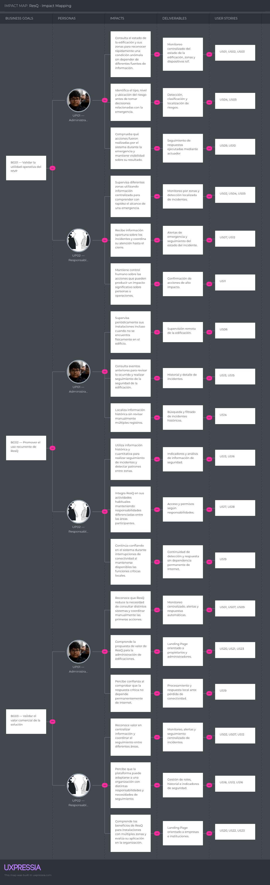

### Análisis del Impact Mapping

El primer Business Goal se encuentra orientado a comprobar que las principales capacidades operativas de ResQ aportan valor durante una situación de riesgo. Para ambos User Personas resulta fundamental poder reconocer el estado de la infraestructura, identificar la zona afectada, conocer el tipo y nivel del riesgo y disponer de visibilidad sobre las acciones ejecutadas. Por ello, sus principales Deliverables se concentran en el monitoreo, la detección, la localización, las alertas y el seguimiento de las respuestas.

El segundo Business Goal busca incorporar ResQ en las actividades habituales de supervisión y seguimiento. Para el Administrador de edificaciones, esto implica poder revisar remotamente el estado de sus instalaciones y consultar fácilmente incidentes anteriores. Para el Responsable institucional, implica además utilizar indicadores, gestionar responsabilidades diferenciadas y mantener continuidad operativa cuando existe una pérdida temporal de conectividad.

El tercer Business Goal permite relacionar las capacidades funcionales de ResQ con la validación de su propuesta de valor. En el caso de los propietarios y administradores, el valor se concentra en reducir la fragmentación de información y la dependencia de coordinación manual. Para las empresas e instituciones, se complementa con la necesidad de coordinar diferentes áreas, administrar accesos, analizar información histórica y mantener funciones críticas disponibles. El Landing Page participa en este objetivo comunicando de forma diferenciada los beneficios de la solución a cada segmento y facilitando el acceso al producto digital correspondiente.

En conjunto, el Impact Mapping mantiene trazabilidad desde los objetivos de negocio hasta las User Stories definidas en la sección anterior. De esta manera, cada funcionalidad considerada para ResQ se encuentra relacionada con un cambio de comportamiento esperado en alguno de los User Personas y con un resultado que contribuye a los objetivos establecidos para el modelo de negocio.

## 3.3. Product Backlog

El Product Backlog de ResQ organiza y prioriza las User Stories y Technical Stories definidas para la solución. La priorización considera principalmente el valor que cada historia aporta a los segmentos objetivo y al funcionamiento de las capacidades principales de monitoreo, detección, contextualización, respuesta, continuidad operativa e integración.

Las historias relacionadas con la detección y contextualización de riesgos, la generación de alertas, la ejecución de respuestas y la continuidad de las funciones críticas se encuentran entre los elementos de mayor prioridad debido a que representan parte central de la propuesta de valor de ResQ. Asimismo, las User Stories correspondientes al Landing Page se consideran dentro del primer bloque del backlog para permitir su desarrollo desde los primeros Sprints y apoyar la comunicación temprana de la propuesta de valor hacia los segmentos objetivo.

Para complementar la priorización se utiliza la columna Business Value, definida en una escala de 1 a 10, donde un valor mayor representa una mayor contribución al valor de negocio, al MVP y a las necesidades de los segmentos objetivo. Esta valoración es definida desde la perspectiva del Product Owner.

Las estimaciones de esfuerzo se expresan mediante Story Points, utilizando los valores 1, 2, 3, 5 y 8. Los Story Points son estimados por el equipo de desarrollo y representan el esfuerzo relativo necesario para implementar cada historia considerando su complejidad, incertidumbre e integración con los diferentes componentes de la solución.

El orden del Product Backlog se establece principalmente según el valor aportado al negocio. Cuando dos o más historias poseen un Business Value similar, se consideran también sus dependencias y la necesidad de habilitar capacidades posteriores del producto.

| Order | User Story ID | Title | Description | Business Value | Story Points |
|---:|---|---|---|---:|---:|
| 1 | US01 | Consultar el estado general de una edificación | Como responsable de una edificación, deseo conocer el estado general de la infraestructura, para identificar oportunamente si existe alguna condición que requiera atención. | 10 | 5 |
| 2 | US06 | Conocer el tipo de riesgo detectado | Como responsable de seguridad, deseo conocer el tipo de riesgo detectado, para comprender qué situación está ocurriendo. | 10 | 3 |
| 3 | US08 | Conocer la ubicación del riesgo | Como responsable de seguridad, deseo conocer la zona donde se originó el riesgo, para dirigir la respuesta hacia el lugar correcto. | 10 | 3 |
| 4 | US10 | Recibir una alerta de riesgo | Como responsable de una edificación, deseo recibir una alerta cuando se detecte una situación de riesgo, para conocer oportunamente lo ocurrido. | 10 | 5 |
| 5 | US11 | Ejecutar una respuesta automática autorizada | Como responsable de una edificación, deseo que determinadas respuestas se ejecuten automáticamente cuando se cumplan condiciones previamente autorizadas, para reducir el tiempo de reacción. | 10 | 8 |
| 6 | US28 | Mantener funciones críticas sin Internet | Como responsable de una edificación, deseo que la detección y las respuestas críticas continúen funcionando cuando se pierde Internet, para mantener la capacidad de reacción ante una emergencia. | 10 | 8 |
| 7 | US34 | Comprender la propuesta de ResQ | Como visitante, deseo comprender el problema que aborda ResQ y su propuesta de solución, para determinar si resulta relevante para mis necesidades. | 9 | 2 |
| 8 | US35 | Conocer los beneficios para administradores | Como propietario o administrador de una edificación, deseo conocer los beneficios de ResQ aplicables a una edificación, para evaluar su utilidad dentro de mi infraestructura. | 9 | 2 |
| 9 | US36 | Conocer los beneficios para empresas integradoras | Como representante de una empresa integradora, deseo conocer cómo puede incorporarse ResQ a sistemas existentes, para evaluar si puede formar parte de nuestros proyectos. | 9 | 2 |
| 10 | US39 | Acceder a los productos digitales de ResQ | Como visitante, deseo acceder desde el Landing Page a los productos digitales disponibles, para continuar mi experiencia con la solución. | 9 | 2 |
| 11 | US21 | Registrar una edificación | Como administrador, deseo registrar una edificación que será monitoreada, para organizar la infraestructura gestionada por ResQ. | 9 | 3 |
| 12 | US22 | Definir zonas de una edificación | Como administrador, deseo definir las zonas de una edificación, para localizar correctamente dispositivos y eventos. | 9 | 3 |
| 13 | US23 | Asociar un dispositivo con una zona | Como administrador, deseo asociar cada dispositivo con su zona correspondiente, para identificar el origen de mediciones y alertas. | 9 | 5 |
| 14 | US24 | Configurar una condición de detección | Como responsable autorizado, deseo configurar condiciones de detección, para adaptar la identificación de riesgos a las características de la instalación. | 9 | 5 |
| 15 | US25 | Configurar una política de respuesta | Como responsable autorizado, deseo configurar las respuestas permitidas para cada tipo de riesgo, para establecer previamente cómo deberá actuar el sistema. | 9 | 8 |
| 16 | US07 | Conocer el nivel de riesgo | Como responsable de seguridad, deseo conocer el nivel del riesgo detectado, para determinar la urgencia con la que debe atenderse. | 9 | 3 |
| 17 | US02 | Consultar el estado de una zona | Como responsable de una edificación, deseo conocer el estado de cada zona monitoreada, para identificar rápidamente dónde existe una condición anómala. | 9 | 3 |
| 18 | US03 | Consultar mediciones actuales | Como responsable de una edificación, deseo consultar las mediciones actuales de los dispositivos, para comprender las condiciones de las zonas supervisadas. | 9 | 3 |
| 19 | TS01 | Capturar mediciones desde los Embedded Systems | Como Developer, deseo que la Embedded Application capture las mediciones de los sensores conectados, para proporcionar al procesamiento local la información necesaria para monitoreo y detección. | 9 | 5 |
| 20 | TS03 | Procesar reglas de detección localmente | Como Developer, deseo evaluar las condiciones de riesgo en el Edge, para que la detección crítica no dependa permanentemente de servicios Cloud. | 9 | 8 |
| 21 | TS04 | Ejecutar comandos de actuadores localmente | Como Developer, deseo que el Edge pueda coordinar comandos con los actuadores conectados, para ejecutar respuestas críticas sin depender permanentemente de Cloud. | 9 | 8 |
| 22 | US04 | Conocer el estado operativo de un dispositivo | Como responsable de una edificación, deseo conocer si un dispositivo se encuentra operativo, para distinguir una condición real de una posible falla del equipo. | 8 | 3 |
| 23 | US05 | Supervisar remotamente una edificación | Como administrador o facility manager, deseo supervisar remotamente la infraestructura, para mantener visibilidad aun cuando no me encuentre físicamente en el edificio. | 8 | 3 |
| 24 | US09 | Consultar el contexto de una detección | Como responsable de seguridad, deseo conocer qué dispositivo y mediciones originaron la detección, para contar con contexto antes de tomar una decisión. | 8 | 5 |
| 25 | US12 | Confirmar una acción de alto impacto | Como responsable autorizado, deseo confirmar las respuestas que puedan generar un impacto significativo, para mantener control humano sobre acciones sensibles. | 8 | 5 |
| 26 | US13 | Conocer las respuestas ejecutadas | Como responsable de seguridad, deseo conocer qué respuestas fueron ejecutadas, para verificar cómo actuó el sistema durante el evento. | 8 | 3 |
| 27 | US26 | Asignar roles y responsabilidades | Como administrador, deseo asignar roles y responsabilidades a los usuarios, para limitar el acceso a información y acciones sensibles. | 8 | 5 |
| 28 | US27 | Acceder de forma autenticada | Como usuario autorizado, deseo autenticarme antes de acceder a ResQ, para utilizar únicamente las funciones correspondientes a mis responsabilidades. | 8 | 3 |
| 29 | US29 | Recuperar eventos producidos durante una interrupción | Como responsable de una edificación, deseo que los eventos producidos durante una interrupción de conectividad estén disponibles posteriormente, para conservar la trazabilidad de lo ocurrido. | 8 | 8 |
| 30 | US30 | Conocer los mecanismos de integración compatibles | Como ingeniero de integración, deseo conocer qué mecanismos de integración soporta ResQ, para determinar si puede incorporarse a la infraestructura de mi cliente. | 8 | 3 |
| 31 | US31 | Integrar una fuente externa compatible | Como ingeniero de integración, deseo conectar a ResQ un dispositivo o sistema externo mediante un mecanismo de integración soportado, para incorporar sus mediciones sin sustituir innecesariamente la infraestructura instalada. | 8 | 8 |
| 32 | US32 | Validar una integración antes de activarla | Como ingeniero de integración, deseo comprobar que una fuente externa entrega información compatible antes de utilizarla operativamente, para detectar incompatibilidades antes de su implementación definitiva. | 8 | 5 |
| 33 | US33 | Asociar dispositivos externos con su contexto | Como ingeniero de integración, deseo relacionar los dispositivos externos con el edificio y zona correspondientes, para conservar el contexto de las mediciones y eventos integrados. | 8 | 5 |
| 34 | US37 | Acceder a documentación técnica de integración | Como representante técnico de una empresa integradora, deseo acceder desde el sitio web a la documentación técnica disponible, para realizar una evaluación preliminar antes de iniciar un proyecto. | 8 | 3 |
| 35 | US38 | Solicitar una demostración o contacto | Como representante de una empresa integradora, deseo solicitar una demostración, piloto o contacto con ResQ, para evaluar una posible colaboración. | 8 | 3 |
| 36 | TS02 | Recibir mediciones mediante un Edge API | Como Developer, deseo disponer de un Edge API para recibir mediciones provenientes de los dispositivos, para desacoplar la captura física del procesamiento local. | 8 | 8 |
| 37 | TS05 | Integrar un servicio externo de notificaciones | Como Developer, deseo disponer de un mecanismo para entregar notificaciones externas, para complementar la comunicación de alertas generadas por ResQ. | 8 | 5 |
| 38 | TS06 | Proveer servicios mediante RESTful API | Como Developer, deseo disponer de una RESTful API para los recursos Cloud de ResQ, para permitir que las aplicaciones digitales consuman los servicios de la plataforma. | 8 | 8 |
| 39 | TS07 | Conservar y sincronizar eventos durante una interrupción | Como Developer, deseo conservar temporalmente los eventos que no pueden enviarse a los servicios remotos, para sincronizarlos cuando la comunicación sea restablecida. | 8 | 8 |
| 40 | TS08 | Proveer un mecanismo de integración externa | Como Developer, deseo exponer un mecanismo de integración basado en tecnologías soportadas, para permitir el intercambio de información con dispositivos o plataformas externas. | 8 | 8 |
| 41 | US14 | Consultar el estado de un incidente | Como responsable de seguridad, deseo conocer el estado actual de un incidente, para saber si todavía requiere atención. | 7 | 3 |
| 42 | US15 | Asignar un responsable de atención | Como responsable de seguridad, deseo identificar quién se encuentra atendiendo un incidente, para coordinar las acciones y evitar responsabilidades ambiguas. | 7 | 3 |
| 43 | US16 | Registrar la resolución de un incidente | Como responsable de seguridad, deseo registrar la resolución y cierre de un incidente, para conservar evidencia de cómo terminó la situación. | 7 | 3 |
| 44 | US17 | Consultar incidentes anteriores | Como responsable de una edificación, deseo consultar incidentes anteriores, para revisar situaciones ocurridas en la infraestructura. | 7 | 3 |
| 45 | US18 | Buscar incidentes históricos | Como responsable de una edificación, deseo localizar incidentes mediante fecha, zona, tipo o estado, para encontrar rápidamente información histórica relevante. | 6 | 5 |
| 46 | US19 | Consultar la secuencia de un incidente | Como responsable de una edificación, deseo consultar la secuencia de mediciones, alertas y respuestas asociadas con un incidente, para comprender cómo evolucionó. | 6 | 5 |
| 47 | US20 | Consultar indicadores de incidentes | Como facility manager, deseo consultar indicadores como frecuencia de incidentes, falsas alarmas y tiempos de atención, para identificar tendencias que requieran acciones preventivas. | 5 | 8 |
| 48 | TS09 | Procesar información cuantitativa para indicadores | Como Developer, deseo calcular indicadores a partir de los incidentes registrados, para proporcionar información cuantitativa sustentada a las aplicaciones de ResQ. | 5 | 8 |

### Product Backlog en Trello

El Product Backlog de ResQ se mantiene también en Trello, donde las User Stories y Technical Stories se encuentran organizadas y ordenadas de acuerdo con la prioridad definida para la solución. El tablero permite visualizar y gestionar los elementos del backlog, seleccionar posteriormente las historias correspondientes a cada Sprint y realizar el seguimiento de su avance durante el proceso de desarrollo.

La priorización registrada en Trello mantiene coherencia con el Business Value definido por el Product Owner y las estimaciones de Story Points realizadas por el equipo de desarrollo. El Business Value representa la importancia relativa de cada historia para los objetivos del producto y las necesidades de los segmentos objetivo, mientras que los Story Points representan el esfuerzo relativo requerido para su implementación.

Cada tarjeta del tablero contiene el identificador y título de la User Story o Technical Story, la Epic relacionada, su tipo de historia, Business Value, Story Points y sus respectivos Acceptance Criteria. Asimismo, las tarjetas se encuentran agrupadas visualmente mediante etiquetas correspondientes a las Epics definidas para ResQ.

La siguiente imagen muestra el Product Backlog de ResQ registrado en Trello:


**Link del Product Backlog:** [ResQ - Product Backlog](https://trello.com/invite/b/6aab49b781accd44e61a7276/ATTI008620e96295fff92c9f73aa53404faf8E74AD19/resq-product-backlog)

<div style="page-break-before: always; break-before: page;"></div>

# Capítulo IV: Solution Software Design

## 4.1. Strategic-Level Domain-Driven Design

El proceso de **Strategic-Level Domain-Driven Design** se utilizó para definir los principales límites del dominio de ResQ y organizar la solución de acuerdo con las capacidades identificadas durante las actividades de Needfinding y Requirements.

A partir del análisis del problema, los principales escenarios operativos, las User Stories y las Technical Stories, el equipo identificó grupos de conceptos, reglas y responsabilidades relacionadas entre sí. Estas responsabilidades fueron separadas considerando su significado dentro del dominio, la propiedad de la información y de las reglas de negocio, y la necesidad de reducir el acoplamiento entre diferentes partes de la solución.

Como resultado de este proceso, el dominio de ResQ fue organizado en distintos Bounded Contexts, cada uno con responsabilidades claramente delimitadas sobre su modelo de dominio y sus reglas de negocio.

### 4.1.1. Design-Level EventStorming

Con el objetivo de profundizar el modelado del dominio de ResQ, el equipo realizó una sesión de **Design-Level EventStorming** tomando como referencia el Big Picture EventStorming elaborado previamente. La finalidad fue identificar con mayor detalle los actores, acciones, eventos, reglas y responsabilidades que intervienen en el funcionamiento de la solución.

Durante la sesión se utilizaron los principales elementos de EventStorming: **Actors, Commands, Domain Events, Aggregates, Policies, Read Models y External Systems**. Para mantener coherencia con el Ubiquitous Language previamente definido, se emplearon conceptos como `Building`, `Zone`, `IoT Device`, `Risk`, `Automatic Response`, `High-Impact Action`, `Incident` y `Authorized Manager`.

Durante la reunión se siguieron las siguientes actividades:

- **Exploración del dominio general:** Se revisó el Big Picture EventStorming y se discutieron los principales procesos que intervienen desde la preparación de la plataforma hasta la atención y cierre de una emergencia.
- **Identificación de actores y usuarios:** Se reconocieron los participantes que interactúan con el sistema, como administradores, responsables autorizados, usuarios de la plataforma y dispositivos IoT.
- **Identificación de Domain Events:** Se registraron los hechos relevantes que ocurren dentro del dominio, como `Usuario autenticado`, `Medición del sensor registrada`, `Condición anómala detectada`, `Riesgo clasificado y localizado`, `Alerta generada`, `Respuesta automática ejecutada` e `Incidente cerrado`.
- **Identificación de Commands:** Para cada evento se analizaron las acciones que lo originan, como autenticar usuarios, registrar mediciones, clasificar riesgos, generar alertas, ejecutar respuestas y gestionar incidentes.
- **Identificación de Policies y reglas del dominio:** Se incorporaron las reglas que reaccionan ante determinados eventos, especialmente las relacionadas con detección de riesgos, respuestas automáticas y acciones de alto impacto.
- **Identificación de Aggregates, Read Models y External Systems:** Se organizaron los elementos responsables de procesar los comandos, las vistas necesarias para consultar el estado del sistema y los servicios externos que participan en determinados flujos.
- **Asignación de responsabilidades:** Finalmente, se revisó qué actores y elementos del dominio participan en cada proceso, permitiendo reconocer agrupaciones de responsabilidades que posteriormente servirían para el Candidate Context Discovery.

Como resultado de la sesión se identificaron cuatro procesos principales dentro de ResQ: **Acceso y Configuración**, **Monitoreo y Detección**, **Alerta y Respuesta Automática** y **Gestión y Seguimiento**.

El flujo principal del dominio puede resumirse de la siguiente manera:

**Configuración → Medición registrada → Condición anómala detectada → Riesgo clasificado y localizado → Alerta o respuesta ejecutada → Incidente registrado → Seguimiento → Incidente cerrado**

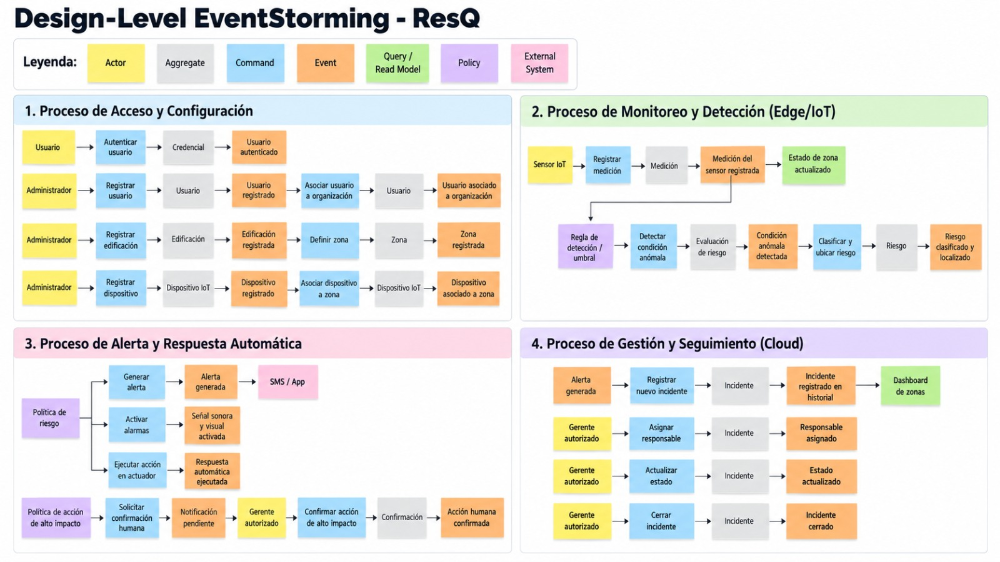

El Design-Level EventStorming permitió obtener una visión más detallada del comportamiento del dominio y reconocer con mayor claridad las responsabilidades existentes. Este resultado fue utilizado posteriormente como base para el **Candidate Context Discovery**, donde los elementos del EventStorm fueron agrupados para identificar los Bounded Contexts candidatos de ResQ.

#### 4.1.1.1. Candidate Context Discovery

A partir del modelo obtenido en el Design-Level EventStorming, se realizó el **Candidate Context Discovery** con el objetivo de identificar los límites naturales de responsabilidad dentro del dominio de ResQ y proponer los Bounded Contexts que organizarán posteriormente el diseño estratégico de la solución.

Para identificar los contextos candidatos se aplicaron principalmente las técnicas **start-with-value** y **look-for-pivotal-events**. La primera permitió reconocer las capacidades que concentran el principal valor de negocio de ResQ, mientras que la segunda permitió identificar eventos relevantes que representan cambios de responsabilidad dentro del flujo del dominio.

Mediante **start-with-value**, se identificaron **Risk Detection** y **Alert & Response Management** como las capacidades centrales de la solución. `Risk Detection` concentra la lógica encargada de interpretar las mediciones y determinar el tipo, nivel y ubicación de una situación de riesgo, mientras que `Alert & Response Management` determina las alertas y acciones que deben ejecutarse como consecuencia del riesgo identificado.

Posteriormente, mediante **look-for-pivotal-events**, se analizaron eventos relevantes como:

- `Sensor measurement recorded`
- `Anomalous condition detected`
- `Risk classified and located`
- `Alert generated`
- `Automatic response executed`
- `Incident registered in history`
- `Incident closed`

Estos eventos permitieron reconocer transiciones entre las responsabilidades de monitoreo, detección, respuesta y seguimiento. En particular, `Risk classified and located` representa el cambio entre la interpretación de las condiciones monitoreadas y el inicio de las acciones de respuesta, mientras que `Incident registered in history` marca el comienzo del seguimiento formal de la situación.

Como resultado del análisis se identificaron los siguientes Candidate Bounded Contexts:

| Candidate Bounded Context | Descripción |
|---|---|
| **IAM** | Gestiona la autenticación y autorización de los usuarios de ResQ, incluyendo validación de identidad, asignación de roles y control de permisos sobre las funcionalidades protegidas. |
| **User Management** | Gestiona la información, estado y responsabilidades de los usuarios pertenecientes a una organización. |
| **Building Management** | Gestiona la información de las edificaciones y sus zonas, permitiendo mantener la estructura física que será monitoreada por ResQ. |
| **Device Management** | Gestiona los dispositivos IoT registrados en la plataforma y su asociación con una edificación o zona determinada. |
| **Monitoring** | Gestiona las mediciones y estados actuales de las zonas y dispositivos IoT para proporcionar visibilidad sobre las condiciones monitoreadas. |
| **Risk Detection** | Analiza las mediciones y aplica reglas de detección para identificar condiciones de riesgo y determinar su tipo, nivel y ubicación. |
| **Alert & Response Management** | Gestiona las alertas y respuestas derivadas de un riesgo, incluyendo señalización, acciones automáticas mediante actuadores y acciones que requieren confirmación humana. |
| **Incident Management** | Gestiona el ciclo de vida de los incidentes, incluyendo su registro, responsable, estado, evolución y cierre. |

La técnica **start-with-value** permitió reconocer que `Risk Detection` y `Alert & Response Management` concentran el mayor valor de negocio de ResQ, debido a que representan la interpretación de una situación de riesgo y la coordinación de la respuesta correspondiente.

Por otro lado, los demás contextos fueron delimitados al identificar responsabilidades específicas dentro del dominio. `Monitoring` mantiene el estado observado de la infraestructura, `Incident Management` gestiona el seguimiento posterior de una situación, mientras que `IAM`, `User Management`, `Building Management` y `Device Management` proporcionan las capacidades necesarias para preparar y administrar el entorno en el que opera la solución.

Como parte del proceso se realizaron cambios progresivos sobre el EventStorm, comenzando con el modelo sin límites definidos, continuando con la identificación de las capacidades de mayor valor y los eventos pivotales, y finalizando con la delimitación de los ocho Candidate Bounded Contexts.

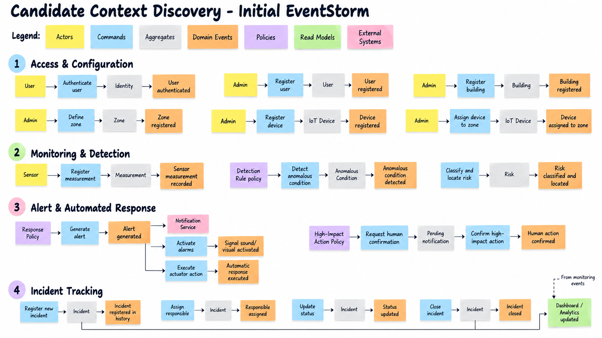

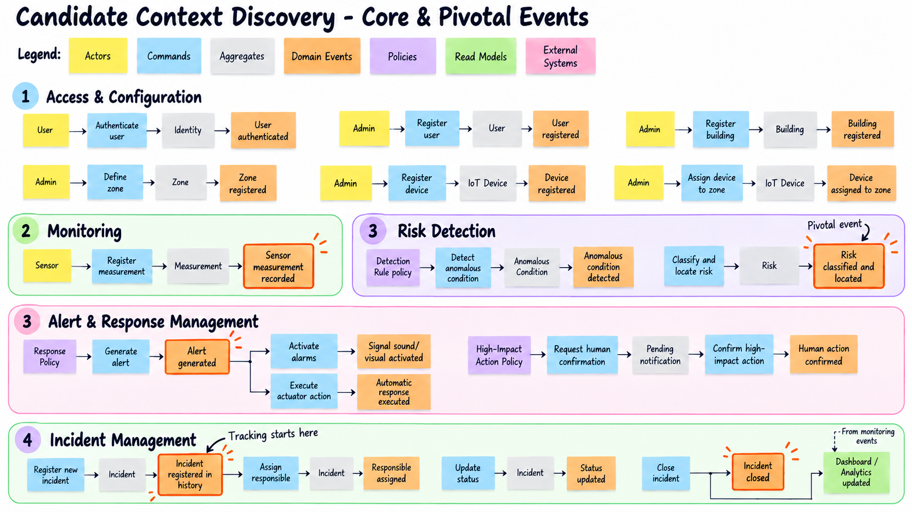

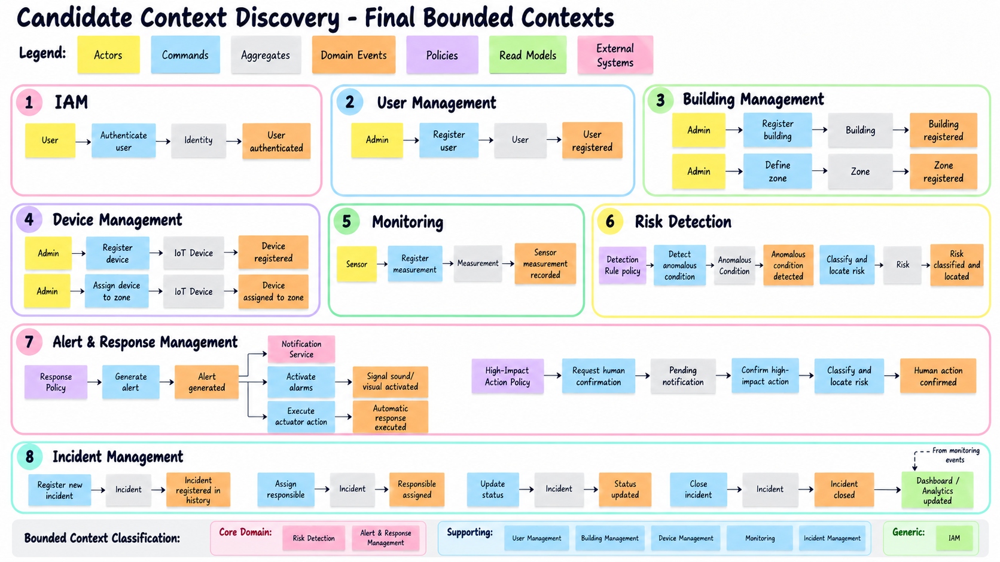

El resultado permitió obtener una primera descomposición del dominio en ocho contextos candidatos. Estos límites serán refinados posteriormente mediante los **Bounded Context Canvases** y el **Context Mapping**, donde se analizarán con mayor detalle sus responsabilidades, reglas de negocio y relaciones.

#### 4.1.1.2. Domain Message Flows Modeling

Luego de identificar los Candidate Bounded Contexts de ResQ, se utilizó la técnica de **Domain Storytelling** para representar cómo estos contextos deben colaborar frente a diferentes situaciones del negocio.

Para cada escenario se identificaron los actores involucrados, los Bounded Contexts que participan y los principales mensajes intercambiados entre ellos. Estos mensajes se representan como **Commands, Events y Queries**, permitiendo visualizar qué contexto solicita una acción, cuál procesa la información y qué resultado comunica posteriormente.

Se seleccionaron cuatro escenarios representativos del funcionamiento de ResQ: la configuración inicial de una edificación, la detección y respuesta automática ante un riesgo, la confirmación de una acción de alto impacto y el seguimiento de un incidente. Estos escenarios permiten observar tanto los procesos administrativos como el flujo principal de monitoreo y respuesta ante emergencias.

**Escenario 1: Configuración de una edificación monitoreada**

El primer escenario representa la preparación de la infraestructura antes de iniciar el monitoreo. Un administrador se autentica mediante **IAM** y la información correspondiente al usuario y su organización es gestionada por **User Management**.

Posteriormente, el administrador registra la edificación y define las zonas que serán monitoreadas mediante **Building Management**. Finalmente, los dispositivos IoT son registrados y asociados con las zonas correspondientes a través de **Device Management**.

Como resultado, la infraestructura queda configurada para que las mediciones futuras puedan relacionarse correctamente con un dispositivo, una zona y una edificación.

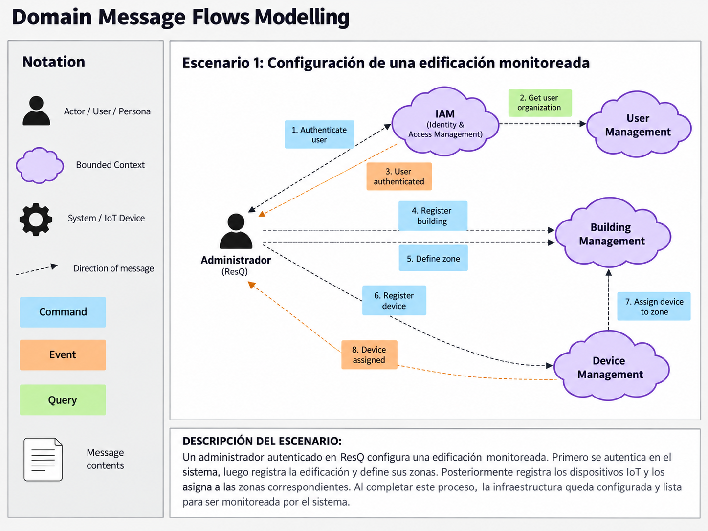

**Escenario 2: Detección y respuesta automática ante un riesgo**

Este escenario representa el flujo principal de valor de ResQ. El proceso comienza cuando un dispositivo IoT genera una nueva medición y la envía a **Monitoring**, donde se registra y actualiza el estado observado de la zona.

La información es posteriormente evaluada por **Risk Detection**, que determina si existe una condición de riesgo y establece su tipo, nivel y ubicación. Cuando se confirma un riesgo, esta información es enviada a **Alert & Response Management**, que aplica las políticas correspondientes para generar una alerta y, cuando está permitido, ejecutar una respuesta automática.

Finalmente, los datos del riesgo y de la respuesta realizada son comunicados a **Incident Management**, donde se registra el incidente para permitir su posterior seguimiento.

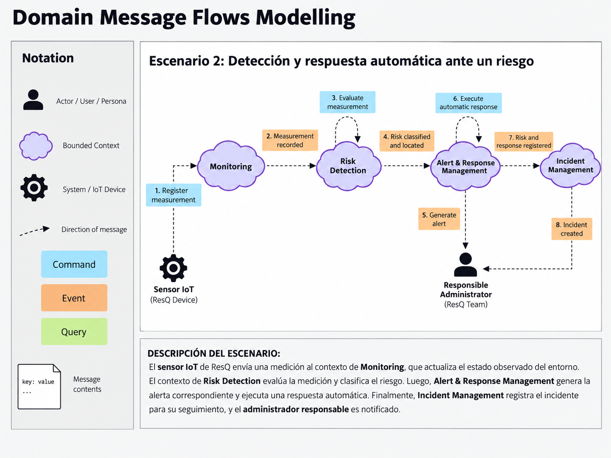

**Escenario 3: Confirmación de una acción de alto impacto**

Algunas acciones de seguridad pueden requerir intervención humana debido a su posible impacto. Cuando **Risk Detection** identifica una situación que requiere este tipo de respuesta, **Alert & Response Management** solicita la confirmación de un responsable autorizado.

Antes de permitir la operación, **IAM** valida que el usuario posea los permisos necesarios. Una vez autorizado, el responsable puede confirmar la acción y Alert & Response Management procede con su ejecución.

La decisión tomada y la respuesta realizada son posteriormente comunicadas a **Incident Management**, permitiendo conservar la trazabilidad de la intervención humana. En caso de que el responsable rechace la acción, esta no se ejecuta y la decisión también puede quedar registrada.

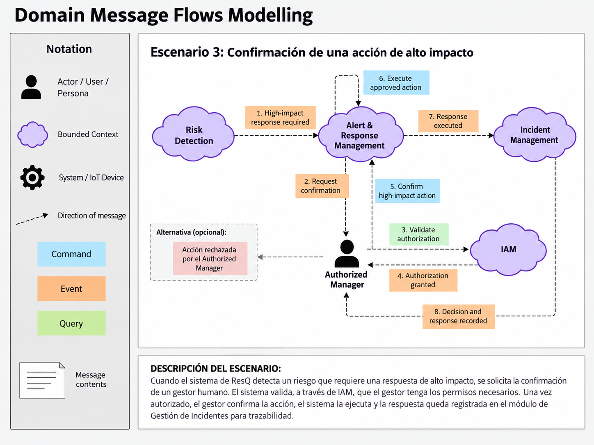

**Escenario 4: Seguimiento y cierre de un incidente**

Una vez registrado un incidente, un responsable de seguridad puede consultar su información mediante **Incident Management**. Desde este contexto se puede conocer el riesgo asociado, las acciones realizadas y el responsable asignado.

Cuando se requiere información actualizada sobre la zona afectada, Incident Management consulta a **Monitoring** para obtener las condiciones actuales. A medida que evoluciona la situación, el responsable puede actualizar el estado del incidente y, cuando la emergencia ha sido controlada, solicitar su cierre.

De esta manera, Incident Management conserva la trazabilidad de los responsables, cambios de estado y acciones realizadas durante todo el ciclo de vida del incidente.

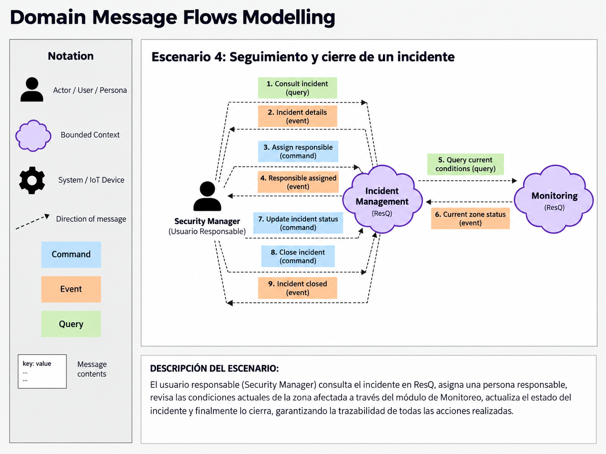

#### 4.1.1.3. Bounded Context Canvases
##### *Connectivity Management.*

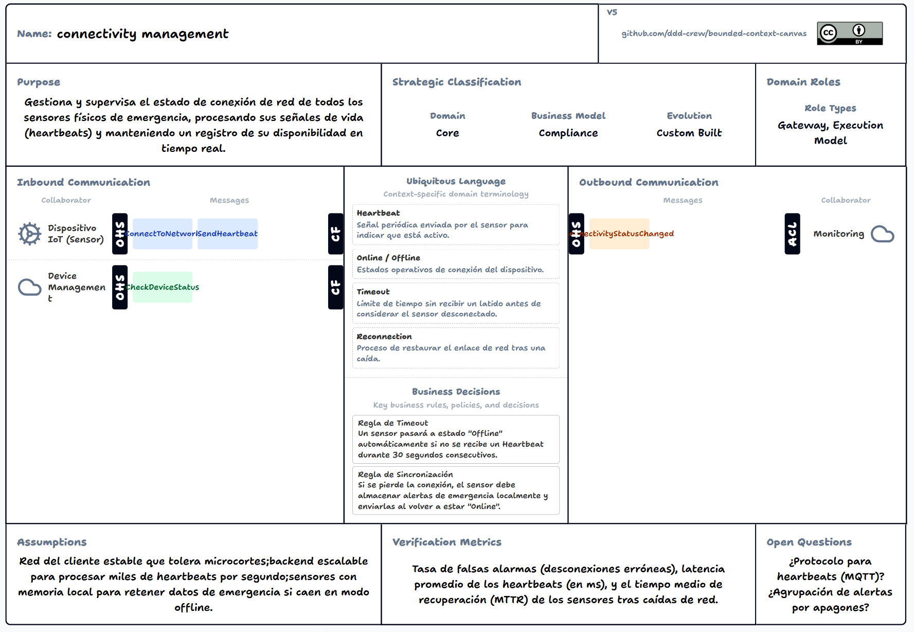
Luego de identificar los Candidate Bounded Contexts de ResQ, se elaboraron sus respectivos **Bounded Context Canvases** para detallar responsabilidades, lenguaje ubicuo, reglas de negocio, capacidades y relaciones con otros contextos.

El proceso siguió un enfoque iterativo basado en **Context Overview Definition**, **Business Rules Distillation & Ubiquitous Language Capture**, **Capability Analysis**, **Capability Layering**, **Dependencies Capture** y **Design Critique**.

Los Bounded Contexts fueron trabajados en orden de importancia, priorizando primero aquellos que concentran el mayor valor del negocio y que participan directamente en el flujo principal de ResQ.

A continuación, se presentan los Bounded Context Canvases definidos:

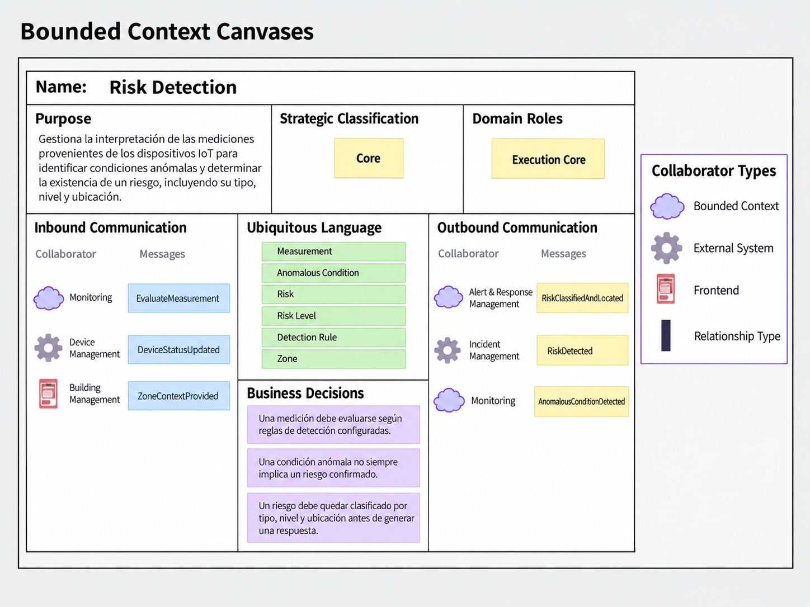
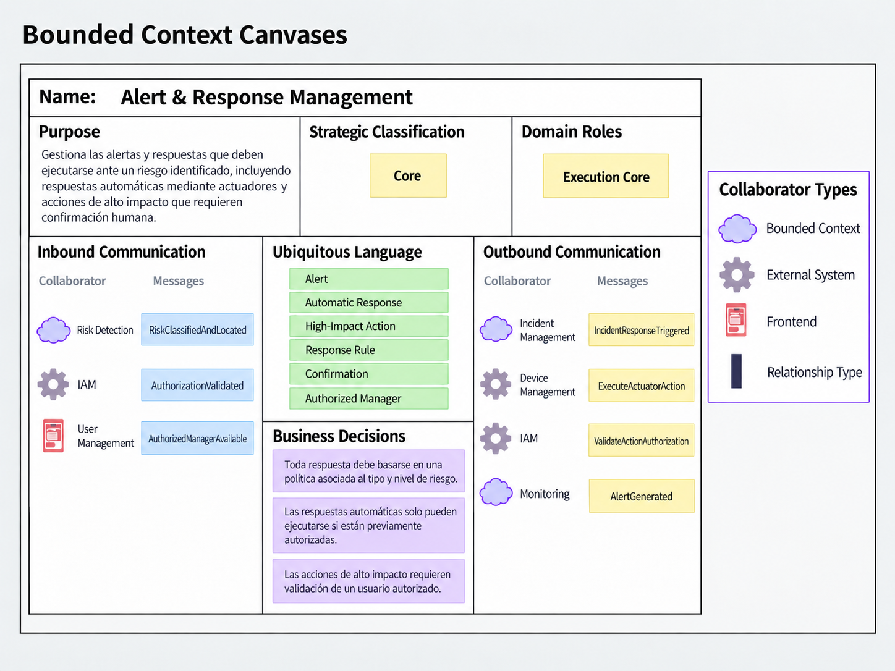
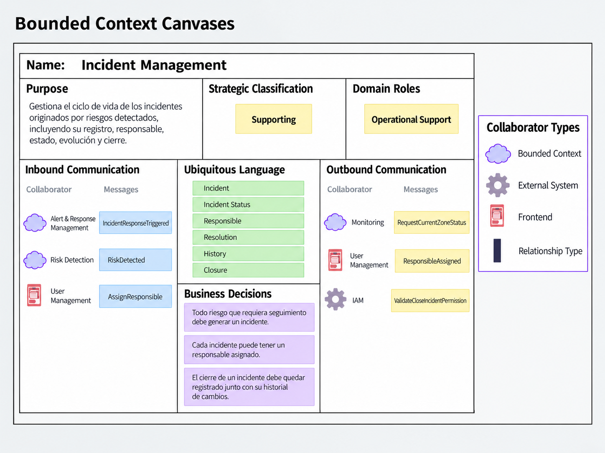
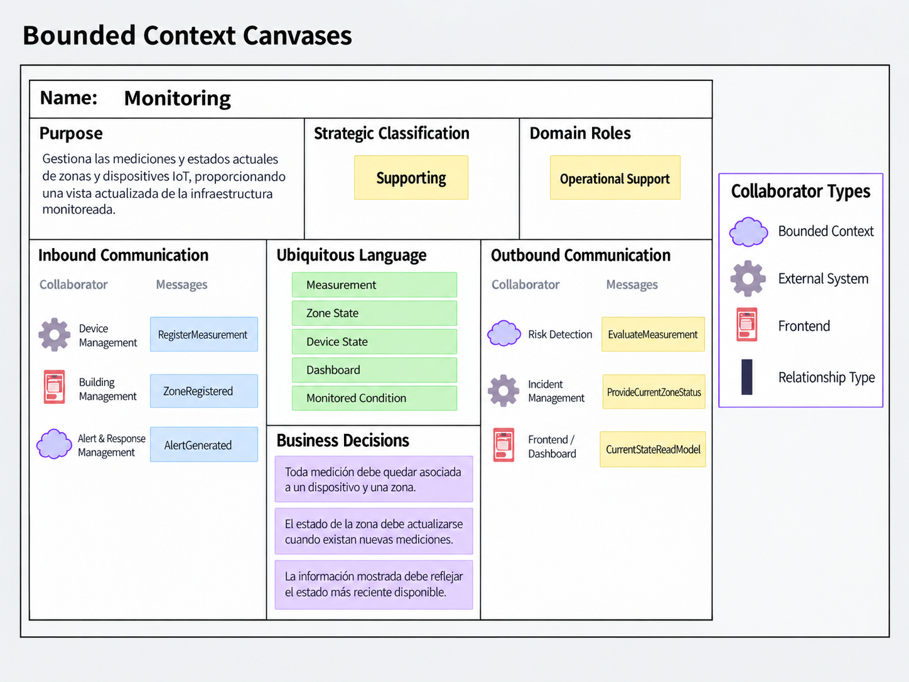
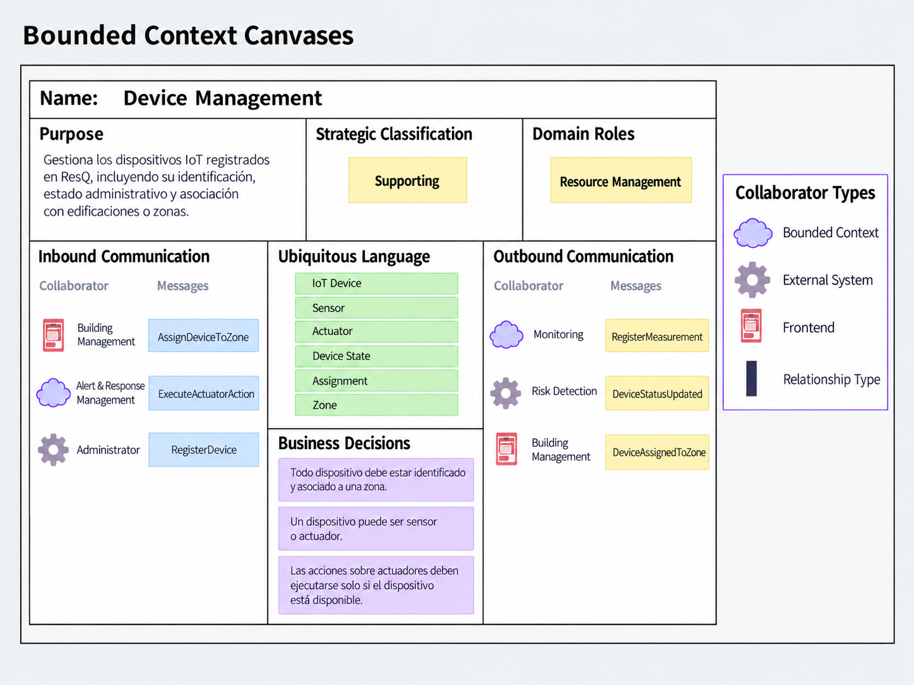
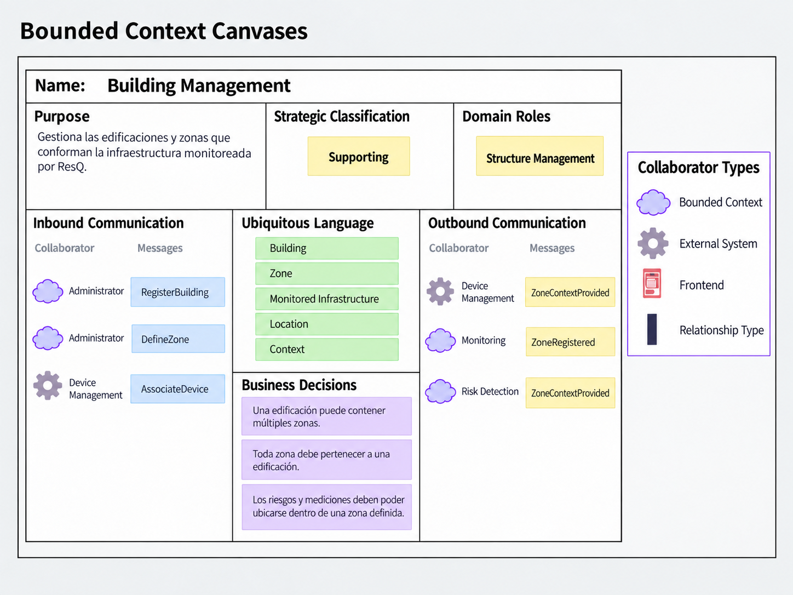
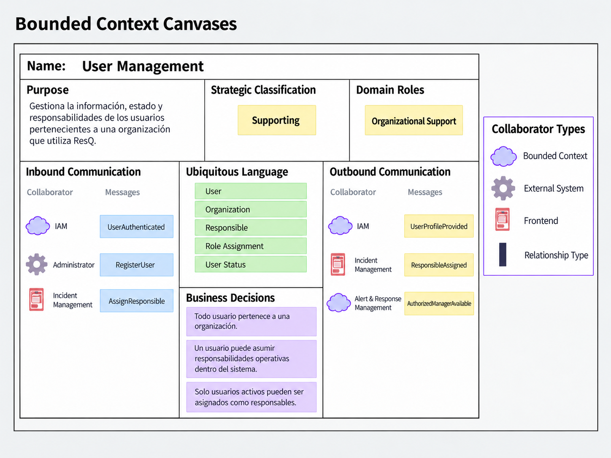
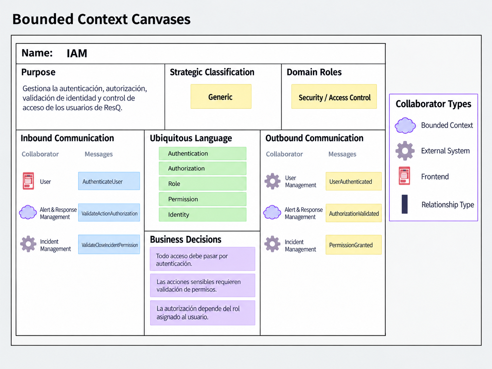

### 4.1.2. Context Mapping
En esta sección desarrollamos un conjunto de context maps para visualizar las relaciones entre los bounded contexts del sistema de sensores de emergencia. A partir de la información recolectada, exploramos distintas alternativas de diseño, cuestionando cómo cambiaría la estructura si reubicamos, dividimos o agrupamos capabilities. Finalmente, evaluamos cada propuesta considerando patrones como Anti-corruption Layer, Conformist, Customer/Supplier y Shared Kernel, con el fin de definir la mejor aproximación para la arquitectura del dominio. A continuación presentaremos las opciones que contemplamos y la estructura final.

**opcion 1**

En esta estructura mantenemos los cinco bounded contexts separados con relaciones claramente definidas. Las ventajas de este tipo de contexto son por un lado la clara separación de responsabilidades y por otro lado, se especifica que cada contexto se enfoca en una funcionalidad específica. Una de las principales desventajas es que hay una mayor complejidad en la sincronización entre contextos, especialmente con el alto volumen de datos de conectividad.

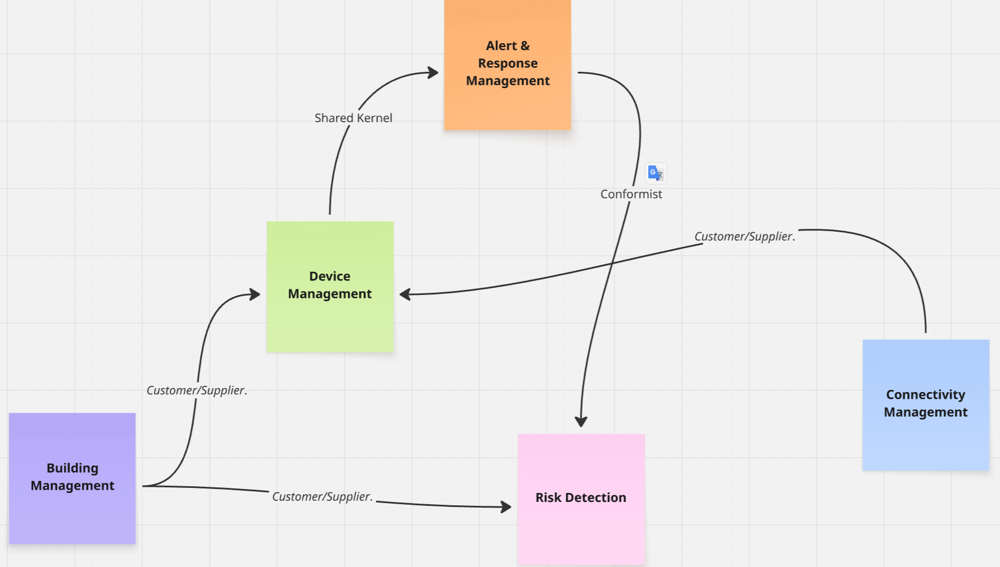


**opcion 2**

Esta alternativa propone unir los contextos de Connectivity Management y Device Management en un solo bounded context. Al hacerlo, se elimina la necesidad de sincronización externa entre el inventario físico de sensores y su estado de red, manteniendo relaciones similares con los demás contextos del sistema.

Esta combinación presenta ventajas como la simplificación de la arquitectura al disminuir la cantidad de bounded contexts, permitiendo una comunicación más directa entre el alta de un dispositivo y su monitoreo de latidos.

No obstante, una desventaja es la combinación de responsabilidades distintas, ya que una parte se enfoca en transacciones de alto rendimiento (recibir miles de heartbeats por segundo) y la otra en procesos administrativos (registrar MAC addresses y zonas). Esto podría generar cuellos de botella en el servidor y el riesgo de que un solo contexto asuma demasiadas funciones.


**opcion 3**

Esta alternativa propone una arquitectura compuesta por cinco bounded contexts bien definidos, con relaciones claras entre ellos. La estructura busca equilibrar la separación de responsabilidades, para permitir que el sistema escale (vital para el procesamiento de redes IoT) y se mantenga con facilidad. Además, asegura tiempos de respuesta críticos ante emergencias.

* Building Management se comunica con Risk Detection y Device Management, proporcionando la información de la ubicación y zonas físicas (edificios, pisos). En ambos casos, la relación es del tipo Customer/Supplier, donde Building es el proveedor.  

* Device Management y Alert & Response Management comparten el modelo del "Sensor" y su criticidad. Por eso, tienen una relación de tipo Shared Kernel, lo que asegura que ambos usen los mismos conceptos al reportar qué aparato falló.  

* Alert & Response Management también se relaciona con Risk Detection, pero en este caso la relación es Conformist. El sistema de alertas utiliza la información del riesgo (sismo, gas), adaptándose a su estructura sin modificarla.

* Connectivity Management se conecta con Device Management mediante una Anti-corruption Layer (ACL). Esta capa traduce los miles de datos técnicos de red y latidos a un formato simple de estados operativos que Device Management pueda entender. Así, se protege el sistema central de la inmensa carga de datos técnicos de IoT.


**Elección**
Elegimos la opción 3, ya que proporciona el mejor equilibrio entre la separación de responsabilidades, la capacidad de procesamiento de alto rendimiento y el cumplimiento de los requisitos críticos de un sistema de emergencias.

Al definir cinco bounded contexts con relaciones claras, se facilita la evolución independiente de cada parte del sistema. Al separar la gestión de tráfico de red (Connectivity Management) mediante una Anti-corruption Layer, se aísla la carga técnica de los heartbeats constantes, evitando saturar la base de datos de los dispositivos. Asimismo, esta estructura garantiza tiempos de respuesta rápidos al procesar alertas reales de sismos o gas, brindando una plataforma robusta y confiable para la seguridad de los usuarios.


### 4.1.3. Software Architecture
La arquitectura de software de ResQ se representa mediante el modelo C4, con el propósito de describir la solución desde distintos niveles de abstracción y mostrar cómo se distribuyen sus principales responsabilidades.

Estas vistas permiten representar la relación de ResQ con sus usuarios y sistemas externos, así como los principales componentes desplegables que conforman la solución y la forma en que se comunican entre sí.

La arquitectura considera la naturaleza distribuida de ResQ, integrando aplicaciones cliente, servicios Cloud, servicios Edge y componentes IoT que colaboran para soportar las capacidades definidas para la solución.

#### 4.1.3.1. Software Architecture System Landscape Diagram

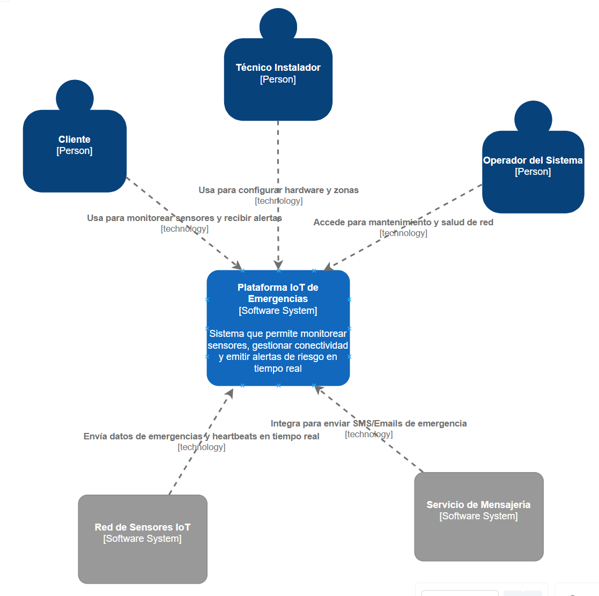


El System Landscape Diagram presenta una vista general del ecosistema de software en el que participa ResQ, mostrando las principales personas, sistemas involucrados y las relaciones existentes entre ellos.


Este diagrama permite identificar el alcance de la solución y comprender cómo los diferentes elementos del ecosistema de ResQ interactúan entre sí.

**DIAGRAM — ResQ Software Architecture System Landscape Diagram**

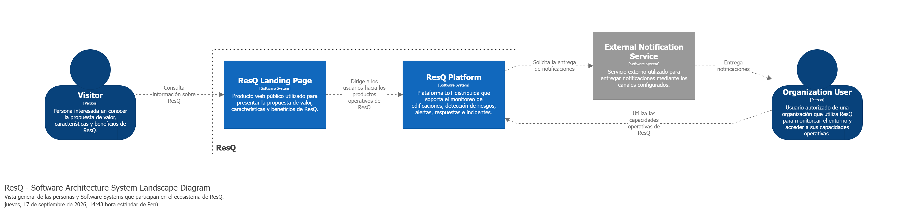

#### 4.1.3.2. Software Architecture Context Level Diagrams
[INSERTAR DIAGRAMAS + EXPLICACIÓN]

#### 4.1.3.3. Software Architecture Container Level Diagrams

Este diagrama muestra que la Plataforma IoT de Emergencias está compuesta por cinco contenedores principales: una **Aplicación Web (SPA)** accesible desde navegadores para la gestión administrativa; una **Aplicación Móvil** para que clientes y técnicos reciban alertas y configuren equipos; una **Cloud API** que gestiona toda la lógica de negocio (usuarios, zonas, reportes); y una **Edge/IoT API** respaldada por un **Broker MQTT** encargado exclusivamente de procesar el alto volumen de datos (telemetría y *heartbeats*) provenientes de los sensores. Finalmente, el sistema utiliza bases de datos separadas: una base de datos relacional en la nube para almacenar la información estructural del sistema y una base de datos optimizada (ej. Time-Series) para el registro histórico de latidos y conectividad.

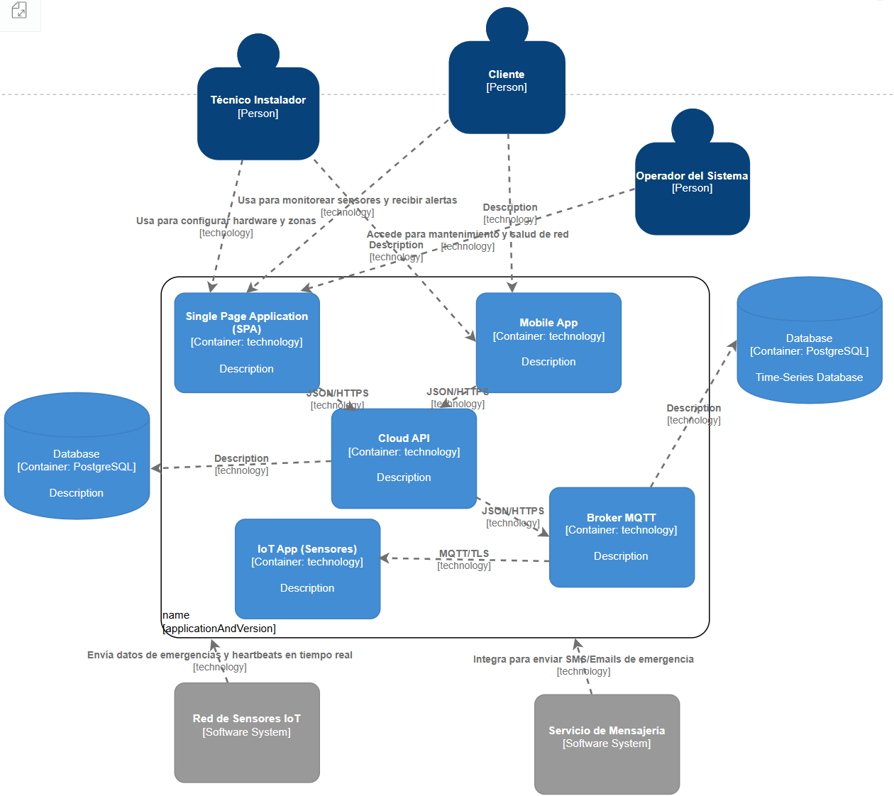

[INSERTAR DIAGRAMAS + EXPLICACIÓN]

#### 4.1.3.4. Software Architecture Deployment Diagrams

Este diagrama muestra que el sistema se despliega en tres entornos principales: **Microsoft Azure Cloud**, **Dispositivos Cliente** y **Edificios/Zonas Físicas**. En Azure, el sistema utiliza *App Service* para alojar las aplicaciones web y la Cloud API (Spring Boot/Java o Node.js), *Azure Database for PostgreSQL* para los datos relacionales, y *Azure IoT Hub* para gestionar las comunicaciones MQTT de alto rendimiento con los dispositivos físicos. Los usuarios acceden al sistema a través de navegadores web o dispositivos Android/iOS. En cada edificio del cliente, se instalan **Sensores de Emergencia** (ej. detectores de gas/sismo basados en ESP32/Arduino) que envían datos de estado a un **Gateway IoT** local vía WiFi o Serial, el cual transmite esta información al IoT Hub en Azure. Todas las comunicaciones entre componentes utilizan protocolos seguros como HTTPS, MQTT sobre TLS y conexiones cifradas a la base de datos.

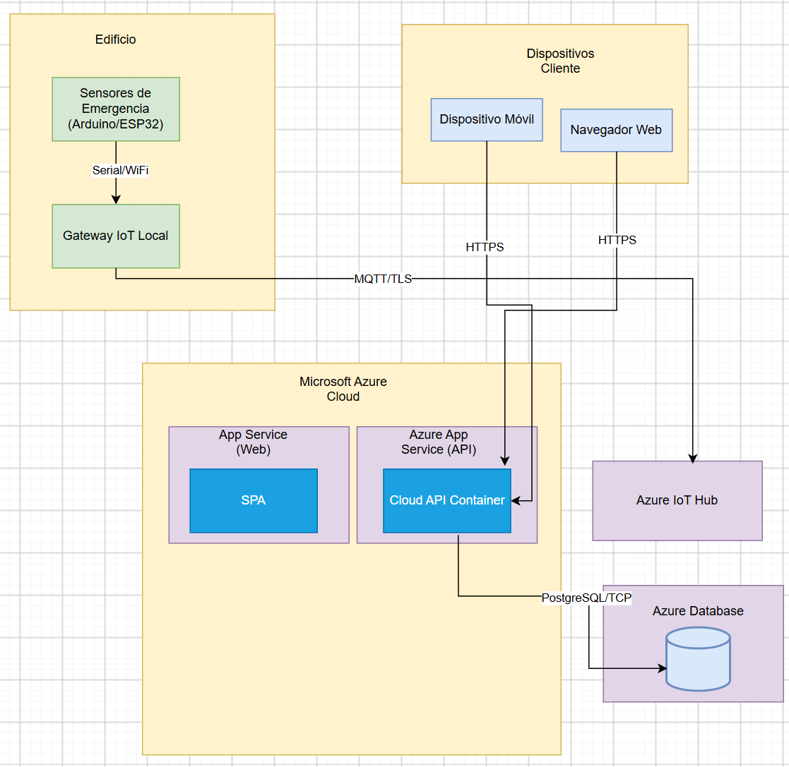
[INSERTAR DIAGRAMA + EXPLICACIÓN]

## 4.2. Tactical-Level Domain-Driven Design

El Tactical-Level Domain-Driven Design se utilizó para definir con mayor detalle la estructura interna de los Bounded Contexts identificados durante el diseño estratégico.

Para cada Bounded Context se modelaron los principales elementos del dominio, sus reglas de negocio, las responsabilidades de las capas de aplicación, interfaz e infraestructura, así como las abstracciones necesarias para persistencia e integración.

Este nivel de diseño permite representar de manera más precisa cómo se implementan las responsabilidades de cada contexto, manteniendo sus límites y evitando que conceptos pertenecientes a otros Bounded Contexts sean incorporados como parte de su propio modelo.

La estructura de cada Bounded Context se documenta mediante sus capas de Domain, Interface, Application e Infrastructure, complementadas con diagramas de componentes, diagramas de clases del dominio y diagramas de diseño de base de datos.

### 4.2.1. Bounded Context: Identity and Access Management (IAM)

El Bounded Context **Identity and Access Management (IAM)** es responsable de gestionar la identidad, la autenticación, la asignación de roles, los permisos y los mecanismos de autorización necesarios para proteger la información y las operaciones disponibles en ResQ.

Este Bounded Context atiende las necesidades de control de acceso de la plataforma, asegurando que solo las identidades autenticadas puedan interactuar con recursos protegidos y que cada operación se ejecute de acuerdo con los permisos asociados a los roles asignados al usuario.

Sus responsabilidades se derivan principalmente de los requisitos relacionados con el acceso autenticado y la autorización basada en roles. En particular, ResQ exige que los usuarios se autentiquen antes de acceder a capacidades protegidas y que las operaciones se restrinjan según los roles y permisos asignados a cada identidad.

El Bounded Context Identity and Access Management soporta principalmente **US26 — Asignar roles y responsabilidades**, **US27 — Acceso autenticado** y la restricción de autorización definida por **TS06 — Proporcionar servicios mediante la API RESTful**.

El Bounded Context IAM no gestiona información del perfil personal, como nombres, números de teléfono, preferencias u otra información específica del usuario. Estas responsabilidades pertenecen al **Bounded Context User**. IAM solo mantiene la información necesaria para identificar, autenticar y autorizar a un usuario.

Asimismo, IAM no gestiona edificios, zonas, dispositivos, mediciones, incidentes, alertas ni reglas de detección de riesgos. Solo proporciona los mecanismos de autenticación y autorización que otros Bounded Contexts pueden utilizar cuando sus operaciones requieren control de acceso.

Las principales responsabilidades de este Bounded Context son:

- Autenticar una identidad utilizando credenciales válidas.
- Rechazar los intentos de autenticación cuando las credenciales sean inválidas.
- Mantener el estado de una identidad relacionado con la autenticación.
- Asociar identidades con roles dentro de un ámbito organizacional.
- Determinar los permisos otorgados por cada rol.
- Evitar asignaciones de roles duplicadas dentro de la misma organización.
- Verificar si una identidad autenticada está autorizada para realizar una operación protegida.
- Rechazar las operaciones protegidas cuando la identidad autenticada no tenga el permiso requerido.
- Mantener el modelo de dominio de IAM independiente de la información personal gestionada por el Bounded Context User.

Los principales conceptos identificados para el Bounded Context Identity and Access Management son **Identity**, **Role**, **Role Assignment**, **Permission**, **Login Identifier**, **Credential Hash** e **Identity Status**.

#### Diccionario de clases

La siguiente tabla resume las principales clases e interfaces que conforman el Bounded Context Identity and Access Management.

| Clase / Interfaz | Capa | Propósito | Atributos principales | Operaciones principales | Relaciones principales |
|---|---|---|---|---|---|
| `Identity` | Domain | Representa la identidad de autenticación y autorización asociada con un usuario de ResQ. Es el Aggregate Root responsable de mantener el estado de autenticación y las asignaciones de roles. | `identityId: UUID`, `userId: UUID`, `loginIdentifier: LoginIdentifier`, `credentialHash: CredentialHash`, `status: IdentityStatus`, `roleAssignments: Set<RoleAssignment>` | `assignRole(roleId, organizationId)`, `hasRole(roleId, organizationId)`, `roleIdsFor(organizationId)`, `isActive()` | Posee `RoleAssignment`; compone `LoginIdentifier` y `CredentialHash`; utiliza `IdentityStatus`. |
| `Role` | Domain | Representa un rol de autorización con nombre y los permisos otorgados por ese rol. | `roleId: UUID`, `name: String`, `permissions: Set<Permission>` | `grants(permissionCode)`, `getPermissions()` | Compone valores `Permission`. |
| `RoleAssignment` | Domain | Representa la asignación de un rol a una identidad dentro de una organización específica. | `assignmentId: UUID`, `roleId: UUID`, `organizationId: UUID` | `matches(roleId, organizationId)` | Pertenece a `Identity`; referencia `Role` mediante `roleId`; utiliza `organizationId` como referencia externa al ámbito de autorización. |
| `LoginIdentifier` | Domain | Value Object que representa el identificador utilizado por una identidad durante la autenticación. El formato exacto se mantiene independiente del perfil personal gestionado por el Bounded Context User. | `value: String` | `value()` | Compuesto por `Identity`. |
| `CredentialHash` | Domain | Value Object que representa la forma protegida del secreto de autenticación. Las credenciales en texto plano nunca se almacenan en el modelo de dominio. | `value: String` | `value()` | Compuesto por `Identity`. |
| `Permission` | Domain | Value Object que identifica una capacidad requerida para ejecutar una operación protegida. | `code: String` | `code()`, `equals()` | Compuesto por `Role`. |
| `IdentityStatus` | Domain | Enumeración que representa si una identidad puede utilizarse actualmente para la autenticación. | `ACTIVE`, `DISABLED` | — | Utilizada por `Identity`. |
| `IdentityRepository` | Domain | Abstracción de Repository utilizada para recuperar y persistir agregados Identity sin acoplar la Domain Layer a una tecnología de persistencia. | — | `findById(identityId)`, `findByLoginIdentifier(loginIdentifier)`, `save(identity)` | Persiste y recupera agregados `Identity`. |
| `RoleRepository` | Domain | Abstracción de Repository utilizada para recuperar roles y sus permisos asociados. | — | `findById(roleId)`, `findAllByIds(roleIds)` | Recupera agregados `Role`. |
| `AuthorizationService` | Domain | Domain Service responsable de evaluar si los roles asignados a una identidad otorgan un permiso requerido dentro de un ámbito organizacional. | — | `isAuthorized(identity, roles, permissionCode, organizationId)` | Evalúa los datos de `Identity` y `Role` utilizando `permissionCode` y `organizationId`. |
| `AuthenticateCommand` | Application | Representa una solicitud para autenticar una identidad. | `loginIdentifier: String`, `credentialSecret: String` | — | Gestionado por `AuthenticateCommandHandler`. |
| `AuthenticateCommandHandler` | Application | Coordina el caso de uso de autenticación utilizando el modelo de dominio y las abstracciones de infraestructura requeridas. | Dependencias de `IdentityRepository`, `CredentialVerifier`, `AuthenticationSessionProvider` | `handle(command)` | Utiliza `IdentityRepository`, `CredentialVerifier` y `AuthenticationSessionProvider`. |
| `AssignRoleCommand` | Application | Representa una solicitud para asignar un rol válido a una identidad dentro de una organización. | `identityId: UUID`, `roleId: UUID`, `organizationId: UUID` | — | Gestionado por `AssignRoleCommandHandler`. |
| `AssignRoleCommandHandler` | Application | Coordina la asignación de roles y valida las condiciones requeridas antes de modificar el agregado Identity. | Dependencias de `IdentityRepository`, `RoleRepository`, `OrganizationMembershipValidator` | `handle(command)` | Utiliza `IdentityRepository`, `RoleRepository` y `OrganizationMembershipValidator`. |
| `CheckPermissionQuery` | Application | Representa una solicitud de autorización para una identidad, un permiso y una organización. | `identityId: UUID`, `permissionCode: String`, `organizationId: UUID` | — | Gestionada por `CheckPermissionQueryHandler`. |
| `CheckPermissionQueryHandler` | Application | Recupera la identidad y sus roles y delega la decisión de autorización a la Domain Layer. | Dependencias de `IdentityRepository`, `RoleRepository`, `AuthorizationService` | `handle(query)` | Utiliza `IdentityRepository`, `RoleRepository` y `AuthorizationService`. |
| `AuthenticationResult` | Application | Representa el resultado satisfactorio de un proceso de autenticación sin exponer información de las credenciales. | `identityId: UUID`, `sessionToken: String` | — | Devuelto por `AuthenticateCommandHandler`. |
| `CredentialVerifier` | Application | Abstracción utilizada para comparar una credencial recibida durante la autenticación con la representación protegida de la credencial almacenada. | — | `matches(rawCredential, credentialHash)` | Utilizada por `AuthenticateCommandHandler`; implementada por `CredentialHashVerifier`. |
| `AuthenticationSessionProvider` | Application | Abstracción responsable de generar la representación necesaria para mantener una sesión autenticada. | — | `createSession(identityId)` | Utilizada por `AuthenticateCommandHandler`; implementada por `AuthenticationSessionProviderAdapter`. |
| `OrganizationMembershipValidator` | Application | Abstracción utilizada para validar que el usuario objetivo pertenece a la organización en la que se asigna un rol. | — | `belongsToOrganization(userId, organizationId)` | Utilizada por `AssignRoleCommandHandler`; implementada por `OrganizationMembershipAdapter`. |
| `AuthenticationController` | Interface | Recibe solicitudes de autenticación y las delega al Command Handler correspondiente de la Application Layer. | Dependencia de `AuthenticateCommandHandler` | `authenticate(request)` | Delega a `AuthenticateCommandHandler`. |
| `RoleAssignmentController` | Interface | Recibe solicitudes autorizadas de asignación de roles y delega la operación a la Application Layer. | Dependencia de `AssignRoleCommandHandler` | `assignRole(identityId, request)` | Delega a `AssignRoleCommandHandler`. |
| `AuthorizationFilter` | Interface | Intercepta solicitudes protegidas y verifica que la identidad autenticada tenga el permiso requerido por la operación solicitada. | Dependencia de `CheckPermissionQueryHandler` | `authorize(requestContext)` | Delega las verificaciones de autorización a `CheckPermissionQueryHandler`. |
| `IdentityRepositoryAdapter` | Infrastructure | Implementa `IdentityRepository` utilizando el mecanismo de persistencia seleccionado para ResQ Cloud RESTful API. | Dependencia de persistencia | `findById()`, `findByLoginIdentifier()`, `save()` | Implementa `IdentityRepository`. |
| `RoleRepositoryAdapter` | Infrastructure | Implementa `RoleRepository` y reconstruye los roles junto con sus permisos a partir del almacenamiento persistente. | Dependencia de persistencia | `findById()`, `findAllByIds()` | Implementa `RoleRepository`. |
| `CredentialHashVerifier` | Infrastructure | Implementa la verificación de credenciales utilizando el mecanismo de seguridad adoptado por la implementación del backend. | Dependencia de biblioteca de seguridad | `matches()` | Implementa `CredentialVerifier`. |
| `AuthenticationSessionProviderAdapter` | Infrastructure | Implementa la creación de la representación de la sesión autenticada consumida por las aplicaciones cliente. | Dependencia de seguridad/sesión | `createSession()` | Implementa `AuthenticationSessionProvider`. |
| `OrganizationMembershipAdapter` | Infrastructure | Proporciona el mecanismo necesario para verificar la pertenencia a una organización sin transferir a IAM la propiedad de la información del usuario o de la organización. | Dependencia de la fuente responsable de la información sobre pertenencia a una organización | `belongsToOrganization()` | Implementa `OrganizationMembershipValidator`. |

Las relaciones entre estas clases preservan los límites del Bounded Context. `Identity` mantiene únicamente el `userId` que referencia al usuario asociado con la identidad de autenticación. El perfil de User no se duplica dentro de IAM.

Del mismo modo, `RoleAssignment` utiliza un `organizationId` para indicar el ámbito de autorización de la asignación, pero IAM no modela ni administra la organización en sí.

---

#### 4.2.1.1. Domain Layer

La **Domain Layer** contiene los conceptos, reglas y abstracciones de negocio que definen la gestión de identidad y acceso dentro de ResQ. Esta capa no depende de HTTP, motores de bases de datos, bibliotecas de seguridad ni frameworks de aplicación.

El principal Aggregate Root es `Identity`.

Una `Identity` representa la identidad de seguridad asociada con un usuario de ResQ. Contiene la información mínima necesaria para autenticar al usuario y determinar los roles asignados a esa identidad.

El atributo `userId` actúa únicamente como referencia externa al usuario representado en el Bounded Context User. La información personal se excluye deliberadamente del modelo de dominio de IAM.

`Identity` posee su colección de objetos `RoleAssignment`. Una asignación de rol establece que la identidad tiene un rol específico dentro de una organización.

El Aggregate Root `Identity` es responsable de proteger la consistencia de estas asignaciones. En particular, no debe asignarse el mismo rol más de una vez a la misma identidad dentro de la misma organización.

##### Identity

**Categoría:** Aggregate Root / Entity.

**Propósito:** Representar la identidad de seguridad utilizada para autenticar a un usuario de ResQ y mantener las asignaciones de roles asociadas con esa identidad.

**Atributos:**

- `identityId: UUID` — Identificador único de la identidad.
- `userId: UUID` — Referencia externa al usuario correspondiente.
- `loginIdentifier: LoginIdentifier` — Identificador utilizado durante la autenticación.
- `credentialHash: CredentialHash` — Representación protegida de la credencial de autenticación.
- `status: IdentityStatus` — Estado actual de autenticación de la identidad.
- `roleAssignments: Set<RoleAssignment>` — Roles asignados a la identidad en diferentes organizaciones.

**Operaciones:**

- `assignRole(roleId, organizationId)` — Añade una asignación de rol válida evitando duplicaciones.
- `hasRole(roleId, organizationId)` — Indica si la identidad ya tiene el rol especificado dentro de la organización.
- `roleIdsFor(organizationId)` — Obtiene los identificadores de los roles que se aplican a un ámbito organizacional.
- `isActive()` — Indica si la identidad está habilitada para la autenticación.

##### Role

**Categoría:** Aggregate Root / Entity.

**Propósito:** Representar un rol de autorización que contiene los permisos que habilitan operaciones protegidas específicas.

**Atributos:**

- `roleId: UUID`
- `name: String`
- `permissions: Set<Permission>`

**Operaciones:**

- `grants(permissionCode)` — Indica si el rol contiene el permiso solicitado.
- `getPermissions()` — Devuelve los permisos asociados con el rol.

El alcance actual requiere la asignación y evaluación de roles válidos. La creación o modificación administrativa de roles no se incluye como caso de uso porque ninguna User Story actual requiere esa capacidad.

##### RoleAssignment

**Categoría:** Entity perteneciente a `Identity`.

**Propósito:** Representar la asociación entre una identidad, un rol y la organización en la que se aplica el rol.

**Atributos:**

- `assignmentId: UUID`
- `roleId: UUID`
- `organizationId: UUID`

**Operaciones:**

- `matches(roleId, organizationId)` — Determina si la asignación corresponde a un rol y una organización específicos.

`organizationId` se trata como referencia externa. IAM no posee el ciclo de vida de la organización.

##### LoginIdentifier

**Categoría:** Value Object.

**Propósito:** Encapsular el identificador presentado durante la autenticación.

**Atributo:**

- `value: String`

El valor se mantiene independiente del perfil de User porque la identidad de autenticación y la información del perfil personal corresponden a responsabilidades diferentes.

##### CredentialHash

**Categoría:** Value Object.

**Propósito:** Representar la forma protegida de una credencial de autenticación.

**Atributo:**

- `value: String`

Las credenciales en texto plano nunca deben persistirse como parte del estado del dominio.

##### Permission

**Categoría:** Value Object.

**Propósito:** Representar una capacidad de autorización requerida para ejecutar una operación protegida.

**Atributo:**

- `code: String`

Los permisos se asocian con los roles. Por lo tanto, la autorización se determina a partir de los permisos otorgados por los roles asignados a la identidad.

##### IdentityStatus

**Categoría:** Enumeración.

**Valores:**

- `ACTIVE`
- `DISABLED`

Solo una identidad activa puede completar satisfactoriamente el proceso de autenticación.

##### IdentityRepository

**Categoría:** Repository Interface.

**Propósito:** Definir las operaciones de persistencia requeridas por la Domain Layer y la Application Layer sin depender de una tecnología específica de base de datos.

**Operaciones:**

- `findById(identityId)`
- `findByLoginIdentifier(loginIdentifier)`
- `save(identity)`

##### RoleRepository

**Categoría:** Repository Interface.

**Propósito:** Recuperar los roles y permisos requeridos durante la asignación de roles y la autorización.

**Operaciones:**

- `findById(roleId)`
- `findAllByIds(roleIds)`

##### AuthorizationService

**Categoría:** Domain Service.

**Propósito:** Evaluar la autorización cuando la decisión requiere información de la identidad y de uno o más roles.

**Operación:**

- `isAuthorized(identity, roles, permissionCode, organizationId)`

El servicio considera únicamente los roles asignados a la identidad dentro de la organización asociada con la operación protegida.

##### Reglas de negocio

El dominio de Identity and Access Management aplica las siguientes reglas de negocio:

1. Una identidad debe existir antes de poder autenticarse.

2. Solo una identidad con estado `ACTIVE` puede completar satisfactoriamente la autenticación.

3. La autenticación tiene éxito únicamente cuando la credencial proporcionada por el usuario corresponde a la representación protegida de la credencial almacenada para la identidad.

4. Las credenciales inválidas no deben establecer una sesión autenticada.

5. Solo puede asignarse un rol cuando tanto la identidad como el rol son válidos.

6. Antes de asignar un rol en una organización, el usuario asociado debe pertenecer a esa organización.

7. No puede asignarse el mismo rol más de una vez a la misma identidad dentro de la misma organización.

8. Una asignación de rol es válida únicamente para el ámbito organizacional asociado con la asignación.

9. Una operación protegida se autoriza únicamente cuando al menos un rol asignado a la identidad en la organización correspondiente otorga el permiso requerido.

10. Cuando no se dispone del permiso requerido, debe rechazarse la operación protegida.

Estas reglas permiten que el Bounded Context IAM implemente el acceso autenticado y basado en roles, manteniendo la información sobre perfiles de usuario, edificios, dispositivos, monitoreo, incidentes y gestión de riesgos fuera de los límites de su dominio.

---

#### 4.2.1.2. Interface Layer

La **Interface Layer** expone las capacidades del Bounded Context Identity and Access Management a los clientes y a otras partes de la plataforma ResQ.

Su responsabilidad es recibir solicitudes, validar su representación básica, convertirlas en Commands o Queries de la Application Layer y convertir las respuestas resultantes en la representación esperada por el cliente.

Las reglas de negocio no se implementan en esta capa.

Los principales componentes son `AuthenticationController`, `RoleAssignmentController` y `AuthorizationFilter`.

##### AuthenticationController

`AuthenticationController` recibe solicitudes de autenticación de las aplicaciones cliente de ResQ.

Su principal responsabilidad es construir un `AuthenticateCommand` utilizando los datos de autenticación recibidos del cliente y delegar su ejecución a `AuthenticateCommandHandler`.

El controlador no compara directamente las credenciales ni consulta la base de datos.

Conceptualmente, la interacción RESTful representa la creación de una sesión autenticada.

Recurso de ejemplo:

```text
POST /api/v1/auth/sessions
```

La solicitud contiene el identificador de inicio de sesión y la credencial de autenticación.

Una respuesta satisfactoria representa la identidad autenticada y la información de sesión generada por la plataforma.

Las credenciales inválidas se devuelven como un fallo de autenticación sin revelar si una credencial específica o un registro interno causó el fallo.

##### RoleAssignmentController

`RoleAssignmentController` recibe solicitudes para asociar un rol válido con una identidad dentro de una organización.

Conceptualmente, la operación se representa como la creación de un recurso de asignación de rol.

Recurso de ejemplo:

```text
POST /api/v1/iam/identities/{identityId}/role-assignments
```

La solicitud identifica:

- el rol que se debe asignar;
- la organización en la que debe aplicarse el rol.

El controlador delega la operación a `AssignRoleCommandHandler`.

El propio endpoint es una operación protegida y, por lo tanto, solo puede ejecutarse cuando quien realiza la solicitud está autenticado y tiene el permiso requerido para asignar roles.

##### AuthorizationFilter

`AuthorizationFilter` protege las operaciones de la API RESTful que requieren una identidad autenticada y autorizada.

Antes de que una solicitud protegida llegue a su controlador correspondiente, el filtro identifica:

- la identidad autenticada;
- la organización asociada con la solicitud;
- el permiso requerido por la operación protegida.

Luego crea una `CheckPermissionQuery` y delega la decisión de autorización a `CheckPermissionQueryHandler`.

Si el resultado indica que no se dispone del permiso requerido, la solicitud se rechaza antes de ejecutar la operación protegida.

Este comportamiento atiende el requisito de que las solicitudes no autorizadas no deben ejecutar operaciones protegidas.

#### 4.2.1.3. Application Layer

La Application Layer coordina los casos de uso soportados por IAM.

Esta capa orquesta objetos de dominio, repositorios y abstracciones externas, pero no contiene detalles de implementación de persistencia o criptografía específicos de la infraestructura.

Se consideran tres flujos principales de aplicación:

- Autenticación.
- Asignación de roles.
- Verificación de autorización.

##### AuthenticateCommand

`AuthenticateCommand` representa un intento de autenticación.

**Atributos:**

- `loginIdentifier: String`
- `credentialSecret: String`

La credencial en texto plano existe únicamente durante la solicitud de autenticación y nunca se almacena como parte del estado del dominio.

##### AuthenticateCommandHandler

`AuthenticateCommandHandler` coordina el proceso de autenticación.

El manejador realiza la siguiente secuencia:

1. Recibe un `AuthenticateCommand`.
2. Construye o valida el `LoginIdentifier` correspondiente.
3. Utiliza `IdentityRepository` para localizar la identidad asociada con el identificador de inicio de sesión.
4. Verifica que la identidad exista.
5. Verifica que la identidad esté activa.
6. Delega la comparación de credenciales a `CredentialVerifier`.
7. Rechaza la operación si la credencial es inválida.
8. Solicita la creación de una sesión autenticada mediante `AuthenticationSessionProvider`.
9. Devuelve un `AuthenticationResult`.

El manejador no conoce qué algoritmo de hash, formato de sesión o biblioteca de seguridad del backend se utiliza.

##### AuthenticationResult

`AuthenticationResult` representa el resultado de un proceso de autenticación satisfactorio.

**Atributos:**

- `identityId: UUID`
- `sessionToken: String`

`sessionToken` representa una credencial de sesión opaca desde el punto de vista de la Application Layer. Su implementación concreta depende del mecanismo de seguridad seleccionado para el backend.

##### AssignRoleCommand

`AssignRoleCommand` representa la asignación de un rol a una identidad en una organización específica.

**Atributos:**

- `identityId: UUID`
- `roleId: UUID`
- `organizationId: UUID`

##### AssignRoleCommandHandler

`AssignRoleCommandHandler` coordina el caso de uso de asignación de roles.

Su flujo de ejecución es:

1. Recibir el `AssignRoleCommand`.
2. Recuperar la `Identity` objetivo desde `IdentityRepository`.
3. Recuperar el `Role` solicitado desde `RoleRepository`.
4. Verificar mediante `OrganizationMembershipValidator` que el usuario referenciado por la identidad pertenezca a la organización especificada.
5. Verificar mediante el Aggregate Root `Identity` que la misma asignación de rol no exista previamente.
6. Invocar `Identity.assignRole(roleId, organizationId)`.
7. Persistir el agregado modificado mediante `IdentityRepository`.

La autorización del usuario que solicita esta operación se realiza antes de ejecutar la operación protegida mediante el mecanismo de autorización de IAM.

##### CheckPermissionQuery

`CheckPermissionQuery` representa una solicitud para determinar si una identidad puede ejecutar una operación protegida.

**Atributos:**

- `identityId: UUID`
- `permissionCode: String`
- `organizationId: UUID`

##### CheckPermissionQueryHandler

`CheckPermissionQueryHandler` coordina la verificación de autorización.

Su flujo de ejecución es:

1. Recuperar la `Identity`.
2. Rechazar la autorización cuando la identidad no exista o esté inactiva.
3. Obtener los identificadores de los roles asignados a la identidad dentro de la organización solicitada.
4. Recuperar los agregados `Role` correspondientes.
5. Delegar la evaluación a `AuthorizationService`.
6. Devolver si se otorga el permiso requerido.

Este diseño centraliza la evaluación de autorización e impide que cada Bounded Context protegido vuelva a implementar las reglas de IAM de manera independiente.

##### CredentialVerifier

`CredentialVerifier` es una abstracción de la Application Layer que evita que los casos de uso de autenticación dependan directamente de un framework criptográfico o de seguridad.

**Operación:**

- `matches(rawCredential, credentialHash)`

##### AuthenticationSessionProvider

`AuthenticationSessionProvider` es responsable de abstraer la creación de sesiones.

**Operación:**

- `createSession(identityId)`

La representación exacta de la sesión es un aspecto de implementación de la Infrastructure Layer.

##### OrganizationMembershipValidator

`OrganizationMembershipValidator` representa la dependencia requerida para verificar el criterio de aceptación según el cual solo puede asignarse un rol a un usuario que pertenezca a la organización correspondiente.

**Operación:**

- `belongsToOrganization(userId, organizationId)`

Esta validación no convierte al Bounded Context IAM en responsable de gestionar organizaciones o perfiles de usuario. Solo consume la información mínima necesaria para proteger la invariante de asignación de roles.

#### 4.2.1.4. Infrastructure Layer

La Infrastructure Layer contiene las implementaciones técnicas requeridas por el Bounded Context Identity and Access Management.

Implementa las abstracciones de repositorios y servicios definidas por la Domain Layer y la Application Layer y encapsula los detalles de persistencia, seguridad de credenciales, generación de sesiones autenticadas e integración.

Los principales componentes de infraestructura son IdentityRepositoryAdapter, RoleRepositoryAdapter, CredentialHashVerifier, AuthenticationSessionProviderAdapter y OrganizationMembershipAdapter.

##### IdentityRepositoryAdapter

`IdentityRepositoryAdapter` implementa la interfaz `IdentityRepository`.

Sus responsabilidades son:

- recuperar una `Identity` utilizando su identificador;
- recuperar una `Identity` utilizando su identificador de inicio de sesión;
- reconstruir el Aggregate `Identity` a partir de los datos persistidos;
- persistir las modificaciones de `Identity` y sus Role Assignments.

Por lo tanto, la Domain Layer es independiente de la tecnología de base de datos seleccionada para el backend de ResQ.

##### RoleRepositoryAdapter

`RoleRepositoryAdapter` implementa `RoleRepository`.

Recupera:

- la información de los roles;
- los permisos asociados con un rol;
- los múltiples roles requeridos durante la evaluación de autorización.

El adaptador reconstruye la representación de dominio de Role antes de devolverla a la Application Layer.

##### CredentialHashVerifier

`CredentialHashVerifier` implementa `CredentialVerifier`.

Su responsabilidad es comparar la credencial recibida durante la autenticación con la representación protegida de la credencial asociada con la identidad.

La comparación debe implementarse mediante el mecanismo de seguridad seleccionado para el backend.

Las credenciales de autenticación en texto plano no se persisten.

##### AuthenticationSessionProviderAdapter

`AuthenticationSessionProviderAdapter` implementa `AuthenticationSessionProvider`.

Su responsabilidad es generar la representación de sesión que permitirá que las solicitudes posteriores identifiquen una identidad autenticada.

La tecnología concreta de token o sesión permanece encapsulada en la Infrastructure Layer y no se expone como dependencia de la Domain Layer.

##### OrganizationMembershipAdapter

`OrganizationMembershipAdapter` implementa `OrganizationMembershipValidator`.

Obtiene la información mínima necesaria para determinar si el usuario asociado con una identidad pertenece a la organización en la que se solicita una asignación de rol.

IAM no persiste ni modifica el perfil completo del usuario ni el modelo de la organización.

El mecanismo final de comunicación utilizado por este adaptador debe mantener la consistencia con el Context Mapping definido para ResQ.

##### Consideraciones de persistencia

El modelo de persistencia de IAM debe mantener la integridad referencial entre los objetos que pertenecen a IAM, evitando la propiedad directa de objetos pertenecientes a otros Bounded Contexts.

Por esa razón:

- `user_id` se almacena como identificador externo y no se utiliza para reproducir el agregado User dentro de IAM.
- `organization_id` se almacena como identificador externo del ámbito de autorización.
- las relaciones entre identidades, roles, permisos y asignaciones de roles se gestionan internamente en IAM.
- las credenciales se almacenan únicamente en su representación protegida.
- las asignaciones de roles duplicadas para la misma identidad, rol y organización deben evitarse mediante una invariante de dominio y una restricción de unicidad en la persistencia.

#### 4.2.1.5. Bounded Context Software Architecture Component Level Diagrams

El Component Level Diagram del Bounded Context Identity and Access Management presenta los componentes internos que colaboran dentro del contenedor ResQ Cloud RESTful API para proporcionar capacidades de autenticación y autorización.

El diagrama debe representar los siguientes componentes principales:

- Authentication Interface Component, responsable de recibir solicitudes de autenticación.
- Role Assignment Interface Component, responsable de recibir solicitudes de asignación de roles.
- Authorization Interface Component, responsable de proteger las operaciones que requieren autorización.
- IAM Application Component, que contiene los casos de uso de autenticación, asignación de roles y autorización.
- IAM Domain Component, que contiene Identity, Role, Permission, Role Assignment y las reglas de negocio de autorización.
- IAM Persistence Component, que implementa repositorios para identidades, roles, permisos y asignaciones de roles.
- Credential Security Component, responsable de verificar las credenciales.
- Authentication Session Component, responsable de generar la representación de la sesión autenticada.
- Organization Membership Integration Component, responsable de obtener la información externa mínima necesaria para validar la pertenencia a una organización.

El flujo principal de interacción representado en el diagrama es:

```text
Client Application
        |
        v
IAM Interface Components
        |
        v
IAM Application Component
        |
        v
IAM Domain Component
        |
        +----------------------+
        |                      |
        v                      v
Persistence Component   Infrastructure Security/
                        Integration Components
        |
        v
IAM Persistence Storage
```

Las solicitudes de autenticación ingresan mediante Authentication Interface Component y son coordinadas por la Application Layer. La verificación de credenciales se delega a la Infrastructure Layer, mientras que el Aggregate Identity sigue siendo responsable de su estado de autenticación.

Las operaciones protegidas pasan por Authorization Interface Component. La Application Layer recupera la identidad y los roles involucrados, mientras que la Domain Layer evalúa si se otorga el permiso correspondiente.

Las solicitudes de asignación de roles también se procesan mediante la Application Layer y deben satisfacer tanto las reglas de autorización como la restricción de pertenencia a una organización antes de modificar el Aggregate Identity.

**DIAGRAMA — IAM Component Level Diagram**

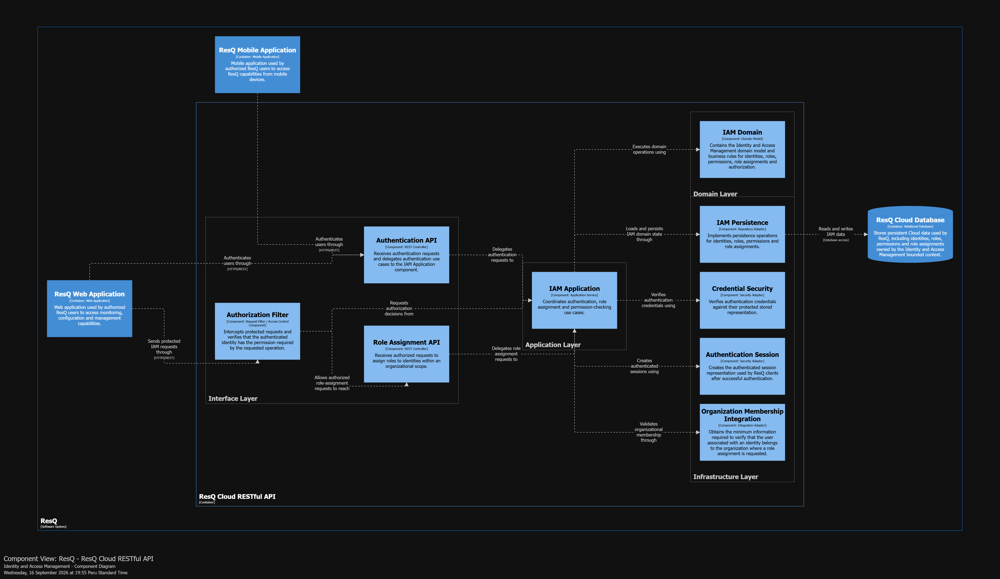

#### 4.2.1.6. Bounded Context Software Architecture Code Level Diagrams

Los Code Level Diagrams proporcionan una representación detallada de la estructura orientada a la implementación del Bounded Context Identity and Access Management.

Para IAM, este nivel se representa mediante dos diagramas complementarios:

- Domain Layer Class Diagram, que representa las clases, interfaces, enumeraciones, métodos, atributos, relaciones, direcciones y multiplicidades que conforman el modelo de dominio.
- Database Design Diagram, que representa las estructuras de persistencia requeridas para almacenar identidades, roles, permisos y asignaciones de roles.

Los dos diagramas representan perspectivas diferentes del mismo Bounded Context. El diagrama de clases describe el modelo de dominio orientado a objetos, mientras que el diagrama de base de datos describe cómo se almacena el estado persistente requerido por ese modelo.

##### 4.2.1.6.1. Bounded Context Domain Layer Class Diagrams

El Domain Layer Class Diagram representa la estructura orientada a la implementación del modelo de dominio de IAM.

El diagrama debe incluir los siguientes elementos:

**Aggregate Roots y Entities**

- `Identity`
- `Role`
- `RoleAssignment`

**Value Objects**

- `LoginIdentifier`
- `CredentialHash`
- `Permission`

**Enumeración**

- `IdentityStatus`

**Repository Interfaces**

- `IdentityRepository`
- `RoleRepository`

**Domain Service**

- `AuthorizationService`

Las principales relaciones que deben representarse son:

- `Identity` se asocia con exactamente un `LoginIdentifier`.
- `Identity` se asocia con exactamente un `CredentialHash`.
- `Identity` tiene exactamente un `IdentityStatus`.
- `Identity` contiene cero o más entidades `RoleAssignment`.
- Cada `RoleAssignment` referencia un `Role` mediante `roleId`.
- Cada `RoleAssignment` se aplica a una organización mediante `organizationId`.
- `Role` contiene cero o más Value Objects `Permission`.
- `IdentityRepository` gestiona la persistencia de `Identity`.
- `RoleRepository` recupera agregados `Role`.
- `AuthorizationService` evalúa los datos de `Identity` y `Role` utilizando `permissionCode` y `organizationId`; no depende directamente de `Permission`.

El diagrama de clases debe mostrar la visibilidad de los atributos y operaciones utilizando las convenciones UML:

- `+` para público.
- `-` para privado.
- `#` para protegido.

También debe indicar la dirección y multiplicidad de las relaciones cuando corresponda.

Una referencia conceptual de multiplicidad para el diagrama final es:

```text
Identity "1" *-- "0..*" RoleAssignment
Identity "1" *-- "1" LoginIdentifier
Identity "1" *-- "1" CredentialHash
Identity "1" --> "1" IdentityStatus

Role "1" *-- "0..*" Permission

RoleAssignment ..> Role : references by roleId
```

organizationId y userId se representan como identificadores externos en lugar de relaciones entre objetos con agregados pertenecientes a otros Bounded Contexts.

**DIAGRAMA — IAM Domain Layer Class Diagram**

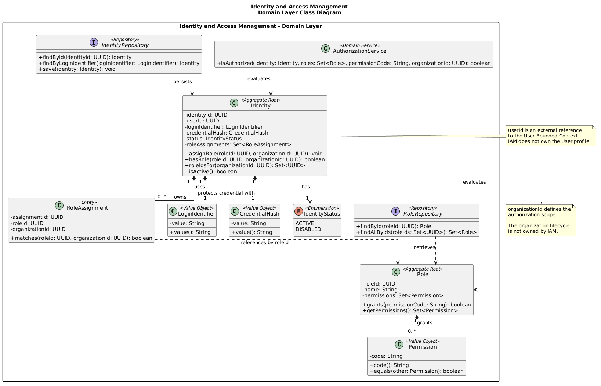

##### 4.2.1.6.2. Bounded Context Database Design Diagram

El Database Design de Identity and Access Management persiste únicamente la información que pertenece a IAM.

El modelo lógico de persistencia propuesto contiene las siguientes tablas:

###### `iam_identities`

Almacena la identidad de autenticación asociada con un usuario de ResQ.

| Columna | Tipo | Restricción | Descripción |
|---|---|---|---|
| `identity_id` | UUID | PRIMARY KEY | Identificador único de la identidad de IAM. |
| `user_id` | UUID | NOT NULL, UNIQUE | Referencia externa al usuario correspondiente. |
| `login_identifier` | VARCHAR | NOT NULL, UNIQUE | Identificador utilizado durante la autenticación. |
| `credential_hash` | VARCHAR | NOT NULL | Representación protegida de la credencial de autenticación. |
| `status` | VARCHAR | NOT NULL | Estado actual de la identidad. |

La tabla no almacena nombres, números de teléfono, preferencias ni otra información del perfil de User.

###### `iam_roles`

Almacena los roles disponibles para la autorización de IAM.

| Columna | Tipo | Restricción | Descripción |
|---|---|---|---|
| `role_id` | UUID | PRIMARY KEY | Identificador único del rol. |
| `name` | VARCHAR | NOT NULL, UNIQUE | Nombre del rol. |

El diseño actual requiere que los roles existan y puedan asignarse, pero no define una User Story para la creación o administración de roles.

###### `iam_permissions`

Almacena los permisos de autorización utilizados para proteger las operaciones de ResQ.

| Columna | Tipo | Restricción | Descripción |
|---|---|---|---|
| `code` | VARCHAR(150) | PRIMARY KEY | Código estable de permiso utilizado por las reglas de autorización y que constituye la identidad del valor Permission persistido. |

###### `iam_role_permissions`

Representa la relación de muchos a muchos entre roles y permisos.

| Columna | Tipo | Restricción | Descripción |
|---|---|---|---|
| `role_id` | UUID | PRIMARY KEY, FOREIGN KEY | Referencia `iam_roles.role_id`. |
| `permission_code` | VARCHAR(150) | PRIMARY KEY, FOREIGN KEY | Referencia `iam_permissions.code`. |

La clave primaria compuesta `(role_id, permission_code)` impide que el mismo permiso se asocie con el mismo rol más de una vez. Las claves foráneas conectan `role_id` con `iam_roles.role_id` y `permission_code` con `iam_permissions.code`.

###### `iam_role_assignments`

Almacena las asignaciones de roles realizadas a identidades dentro de una organización.

| Columna | Tipo | Restricción | Descripción |
|---|---|---|---|
| `assignment_id` | UUID | PRIMARY KEY | Identificador único de la asignación. |
| `identity_id` | UUID | NOT NULL, FOREIGN KEY | Referencia `iam_identities.identity_id`. |
| `role_id` | UUID | NOT NULL, FOREIGN KEY | Referencia `iam_roles.role_id`. |
| `organization_id` | UUID | NOT NULL | Identificador externo de la organización en la que se aplica el rol. |

Debe definirse una restricción de unicidad sobre:

`(identity_id, role_id, organization_id)`

Esta restricción complementa la invariante de dominio que impide asignaciones de roles duplicadas para la misma identidad dentro de la misma organización.

Las relaciones internas de la base de datos son:

```text
iam_identities
      |
      | 1
      |
      | 0..*
      v
iam_role_assignments
      |
      | *               *
      +-------> iam_roles --------+
                    |              |
                    | *            | *
                    |              |
                    v              |
             iam_role_permissions |
             (role_id,             |
              permission_code)     |
                    |              |
                    | *            |
                    v              |
             iam_permissions <-----+
             (code PK)
```

user_id y organization_id se tratan intencionalmente como referencias externas en lugar de claves foráneas a tablas pertenecientes a otros Bounded Contexts. Esto evita acoplar el modelo de persistencia de IAM directamente con la representación interna de la base de datos de otros contextos de dominio.

El Database Design Diagram final debe identificar:

- las tablas;
- las columnas;
- las claves primarias;
- las claves foráneas;
- las restricciones de unicidad;
- las cardinalidades;
- las relaciones entre las tablas de IAM.

**DIAGRAMA — IAM Database Design Diagram**

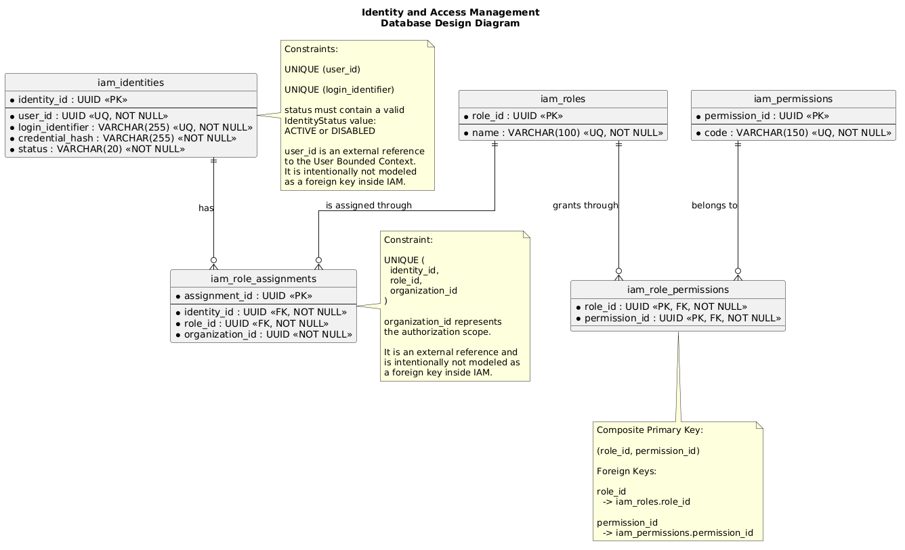

### 4.2.2. Bounded Context: Risk Detection

El Bounded Context **Risk Detection** es responsable de evaluar la información monitoreada mediante las reglas de detección configuradas para identificar situaciones de riesgo, determinar su tipo y severidad, preservar la evidencia que originó cada detección y mantener el contexto de ubicación necesario para comprender dónde ocurrió la condición detectada.

Este Bounded Context representa el conocimiento de dominio involucrado en transformar mediciones monitoreadas válidas en detecciones de riesgo significativas. No posee los sensores físicos que producen las mediciones, los dispositivos asociados con esos sensores, los edificios y zonas en los que se instalan los dispositivos ni las alertas y respuestas ejecutadas después de detectar un riesgo.

El Bounded Context Risk Detection soporta principalmente **US06 — Conocer el tipo de riesgo detectado**, **US07 — Conocer el nivel de riesgo**, **US08 — Conocer la ubicación del riesgo**, **US09 — Consultar el contexto de detección**, **US24 — Configurar una condición de detección**, **US28 — Mantener funciones críticas sin Internet** y **TS03 — Procesar reglas de detección localmente**.

Risk Detection consume mediciones válidas producidas por el flujo de monitoreo y las evalúa utilizando reglas de detección activas. Cuando se satisface una condición, el Bounded Context crea o actualiza una detección de riesgo y genera la información necesaria para que el resto de la plataforma ResQ continúe el flujo de gestión de emergencias.

Un requisito arquitectónico central de este Bounded Context es que la detección crítica debe permanecer disponible incluso cuando se interrumpe la conectividad a Internet con los servicios Cloud. Por esa razón, las reglas de detección activas requeridas para la operación crítica también deben estar disponibles en el entorno Edge, donde las mediciones pueden evaluarse localmente.

Por lo tanto, el Bounded Context participa en dos entornos principales de ejecución:

- **ResQ Cloud RESTful API**, donde los usuarios autorizados configuran reglas de detección y consultan detecciones de riesgo persistidas y sus evidencias.
- **ResQ Edge Service**, donde las reglas de detección activas están disponibles localmente y las mediciones entrantes pueden evaluarse sin depender permanentemente de la conectividad con Cloud.

Risk Detection no genera notificaciones para los usuarios, no ejecuta comandos de actuadores, no gestiona el ciclo de vida de los incidentes ni posee las colas de recuperación de conectividad. Estas responsabilidades pertenecen a otros Bounded Contexts, como Alert & Response Management, Incident y Connectivity.

Asimismo, Risk Detection no reproduce los modelos completos de Measurement, Device, Building o Zone. Solo mantiene las referencias externas y la evidencia necesarias para justificar una decisión de detección de riesgo.

Los principales conceptos identificados para el Bounded Context Risk Detection son **Detection Rule**, **Detection Condition**, **Risk Detection**, **Detection Evidence**, **Risk Location**, **Risk Type**, **Severity Level** y **Severity Change**.

#### Diccionario de clases

La siguiente tabla resume las principales clases e interfaces identificadas para el Bounded Context Risk Detection.

| Clase / Interfaz | Capa | Entorno de ejecución | Propósito | Atributos principales | Operaciones principales | Relaciones principales |
|---|---|---|---|---|---|---|
| `DetectionRule` | Domain | Cloud / Edge | Aggregate Root que representa una regla activa o inactiva utilizada para determinar si un valor monitoreado representa una condición de riesgo. | `ruleId: UUID`, `riskType: RiskType`, `severityLevel: SeverityLevel`, `condition: DetectionCondition`, `status: DetectionRuleStatus` | `updateCondition(condition)`, `activate()`, `deactivate()`, `isActive()`, `supports(variableType)` | Compone un `DetectionCondition`, un `RiskType`, un `SeverityLevel` y un `DetectionRuleStatus`. |
| `DetectionCondition` | Domain | Cloud / Edge | Value Object que define la comparación que debe realizarse sobre una variable monitoreada. | `variableType: String`, `operator: ComparisonOperator`, `threshold: Decimal` | `isValid()`, `matches(variableType, value)` | Pertenece a `DetectionRule`; utiliza `ComparisonOperator`. |
| `RiskDetection` | Domain | Cloud / Edge | Aggregate Root que representa un riesgo detectado junto con su severidad actual, ubicación, evidencia y trazabilidad de los cambios de severidad. | `riskDetectionId: UUID`, `ruleId: UUID`, `riskType: RiskType`, `currentSeverity: SeverityLevel`, `location: RiskLocation`, `detectedAt: Instant`, `evidence: List<DetectionEvidence>`, `severityChanges: List<SeverityChange>` | `addEvidence(evidence)`, `updateSeverity(newSeverity, changedAt)`, `hasSeverity(severity)` | Compone `RiskLocation`, `DetectionEvidence`, `SeverityChange`, `RiskType` y `SeverityLevel`; referencia una `DetectionRule` mediante `ruleId`. |
| `DetectionEvidence` | Domain | Cloud / Edge | Value Object que contiene la información monitoreada utilizada como evidencia para una decisión de detección de riesgo. | `measurementId: UUID`, `deviceId: UUID`, `variableType: String`, `value: Decimal`, `measuredAt: Instant` | `matchesVariable(variableType)` | Pertenece a `RiskDetection`; referencia Measurement y Device mediante identificadores externos. |
| `RiskLocation` | Domain | Cloud / Edge | Value Object que representa el contexto de ubicación conocido de una detección sin reproducir el modelo de dominio de Building. | `buildingId: UUID?`, `zoneId: UUID?`, `resolutionStatus: LocationResolutionStatus` | `isResolved()` | Pertenece a `RiskDetection`; utiliza identificadores externos de Building/Zone. |
| `SeverityChange` | Domain | Cloud | Entity perteneciente a `RiskDetection` que preserva una transición entre niveles de severidad. | `severityChangeId: UUID`, `previousSeverity: SeverityLevel`, `newSeverity: SeverityLevel`, `changedAt: Instant` | — | Pertenece a `RiskDetection`; utiliza valores `SeverityLevel`. |
| `RiskType` | Domain | Cloud / Edge | Value Object que representa el tipo de riesgo identificado por una regla de detección. | `code: String` | `code()`, `equals(other)` | Utilizado por `DetectionRule` y `RiskDetection`. |
| `SeverityLevel` | Domain | Cloud / Edge | Value Object que representa la severidad asignada a un riesgo sin imponer un catálogo fijo de severidad que no está definido por los requisitos actuales. | `code: String` | `code()`, `equals(other)` | Utilizado por `DetectionRule`, `RiskDetection` y `SeverityChange`. |
| `DetectionRuleStatus` | Domain | Cloud / Edge | Enumeración que representa si una regla de detección puede participar en la evaluación. | `ACTIVE`, `INACTIVE` | — | Utilizada por `DetectionRule`. |
| `ComparisonOperator` | Domain | Cloud / Edge | Enumeración que representa la operación de comparación realizada por una condición de detección. | `GREATER_THAN`, `GREATER_THAN_OR_EQUAL`, `LESS_THAN`, `LESS_THAN_OR_EQUAL`, `EQUAL` | — | Utilizada por `DetectionCondition`. |
| `LocationResolutionStatus` | Domain | Cloud / Edge | Enumeración que indica si la ubicación de un riesgo detectado pudo resolverse a partir del contexto disponible del dispositivo. | `RESOLVED`, `UNRESOLVED` | — | Utilizada por `RiskLocation`. |
| `DetectionRuleRepository` | Domain | Cloud / Edge | Abstracción de Repository para recuperar y persistir reglas de detección. | — | `findById(ruleId)`, `findActiveByVariableType(variableType)`, `save(rule)` | Persiste y recupera agregados `DetectionRule`. |
| `RiskDetectionRepository` | Domain | Cloud | Abstracción de Repository para detecciones de riesgo persistidas. | — | `findById(riskDetectionId)`, `save(riskDetection)` | Persiste y recupera agregados `RiskDetection`. |
| `RiskEvaluationService` | Domain | Edge | Domain Service responsable de determinar si una regla de detección activa se satisface mediante evidencia válida de detección. | — | `matches(rule, evidence)` | Evalúa `DetectionRule` utilizando `DetectionEvidence`. |
| `RiskDetectedEvent` | Domain | Edge | Domain Event producido cuando se satisface una regla de detección y una detección de riesgo debe continuar por el flujo distribuido de ResQ. | `riskDetectionId: UUID`, `ruleId: UUID`, `riskType: String`, `severity: String`, `buildingId: UUID?`, `zoneId: UUID?`, `occurredAt: Instant` | — | Generado a partir de `RiskDetection` y publicado mediante una abstracción de aplicación. |
| `ConfigureDetectionRuleCommand` | Application | Cloud | Representa la solicitud para configurar una regla de detección. | `riskTypeCode: String`, `severityCode: String`, `variableType: String`, `operator: String`, `threshold: Decimal` | — | Gestionado por `ConfigureDetectionRuleCommandHandler`. |
| `ConfigureDetectionRuleCommandHandler` | Application | Cloud | Coordina la creación o configuración de reglas de detección. | Dependencias de `DetectionRuleRepository` y `DetectionRuleDistributor` | `handle(command)` | Crea/actualiza `DetectionRule` y solicita su distribución hacia Edge. |
| `ChangeDetectionRuleStatusCommand` | Application | Cloud | Representa una solicitud para activar o desactivar una regla de detección existente. | `ruleId: UUID`, `active: boolean` | — | Gestionado por `ChangeDetectionRuleStatusCommandHandler`. |
| `ChangeDetectionRuleStatusCommandHandler` | Application | Cloud | Coordina la activación/desactivación de reglas preservando su validez. | Dependencias de `DetectionRuleRepository` y `DetectionRuleDistributor` | `handle(command)` | Modifica `DetectionRule` y distribuye el estado resultante. |
| `MeasurementReceivedEventHandler` | Application | Edge | Gestiona una medición monitoreada válida entregada a Risk Detection y coordina su evaluación local. | Dependencias de `DetectionRuleRepository`, `RiskLocationResolver`, `RiskEvaluationService`, `RiskDetectionEventPublisher` | `handle(event)` | Evalúa la evidencia de medición utilizando agregados locales activos `DetectionRule`. |
| `UpdateLocalDetectionRuleEventHandler` | Application | Edge | Aplica una actualización de regla de detección recibida desde Cloud a la réplica de la regla en Edge. | Dependencia de `DetectionRuleRepository` | `handle(event)` | Persiste la representación de `DetectionRule` en Edge. |
| `RiskDetectionReceivedEventHandler` | Application | Cloud | Procesa la información sincronizada de detección de riesgos recibida desde el flujo Edge y persiste el estado de detección correspondiente. | Dependencia de `RiskDetectionRepository` | `handle(event)` | Reconstruye o actualiza `RiskDetection`. |
| `GetRiskDetectionQuery` | Application | Cloud | Representa una solicitud de la información actual de una detección de riesgo persistida. | `riskDetectionId: UUID` | — | Gestionada por `GetRiskDetectionQueryHandler`. |
| `GetRiskDetectionQueryHandler` | Application | Cloud | Recupera una detección de riesgo persistida para los clientes de la aplicación. | Dependencia de `RiskDetectionRepository` | `handle(query)` | Lee `RiskDetection`. |
| `GetRiskDetectionEvidenceQuery` | Application | Cloud | Representa una solicitud de la evidencia asociada con una detección. | `riskDetectionId: UUID` | — | Gestionada por `GetRiskDetectionEvidenceQueryHandler`. |
| `GetRiskDetectionEvidenceQueryHandler` | Application | Cloud | Recupera la evidencia y la trazabilidad de severidad asociadas con una detección. | Dependencia de `RiskDetectionRepository` | `handle(query)` | Lee `RiskDetection`, `DetectionEvidence` y `SeverityChange`. |
| `DetectionRuleDistributor` | Application | Cloud | Abstracción utilizada para distribuir el estado de las reglas requerido por el entorno de ejecución Edge. | — | `distribute(rule)` | Implementada por `DetectionRuleDistributionAdapter`. |
| `RiskLocationResolver` | Application | Edge | Abstracción utilizada para resolver identificadores de Building y Zone a partir del dispositivo asociado con una medición. | — | `resolve(deviceId)` | Implementada por `RiskLocationIntegrationAdapter`. |
| `RiskDetectionEventPublisher` | Application | Edge | Abstracción utilizada para publicar un evento de detección de riesgo generado localmente sin acoplar la Application Layer a un intermediario de mensajes ni a un mecanismo de conectividad. | — | `publish(event)` | Implementada por `RiskDetectionEventPublisherAdapter`. |
| `DetectionRuleController` | Interface | Cloud | Recibe solicitudes REST autorizadas para configurar y activar/desactivar reglas de detección. | Dependencias de los Command Handlers de reglas de detección | `configure(request)`, `changeStatus(ruleId, request)` | Delega a los Command Handlers de la Application Layer. |
| `RiskDetectionController` | Interface | Cloud | Expone la información persistida de detección de riesgos y su evidencia a los clientes autorizados. | Dependencias de los Query Handlers de detección de riesgos | `getById(id)`, `getEvidence(id)` | Delega a los Query Handlers de la Application Layer. |
| `RiskDetectionEventConsumer` | Interface | Cloud | Recibe eventos sincronizados de detección de riesgos producidos por el flujo distribuido de Edge. | Dependencia de `RiskDetectionReceivedEventHandler` | `consume(event)` | Delega los eventos entrantes de detección a la Application Layer. |
| `MeasurementConsumer` | Interface | Edge | Recibe mediciones válidas del flujo local de monitoreo y las remite para la evaluación de reglas. | Dependencia de `MeasurementReceivedEventHandler` | `consume(measurement)` | Delega los eventos entrantes de medición a la Application Layer de Edge. |
| `DetectionRuleReplicaConsumer` | Interface | Edge | Recibe actualizaciones de reglas distribuidas desde Cloud. | Dependencia de `UpdateLocalDetectionRuleEventHandler` | `consume(ruleUpdate)` | Delega las actualizaciones de reglas a la Application Layer de Edge. |
| `DetectionRuleRepositoryAdapter` | Infrastructure | Cloud | Implementa `DetectionRuleRepository` utilizando la tecnología de persistencia Cloud seleccionada por el equipo. | Dependencia de persistencia | `findById()`, `findActiveByVariableType()`, `save()` | Implementa `DetectionRuleRepository`. |
| `RiskDetectionRepositoryAdapter` | Infrastructure | Cloud | Implementa `RiskDetectionRepository` para detecciones de riesgo, evidencias y cambios de severidad. | Dependencia de persistencia | `findById()`, `save()` | Implementa `RiskDetectionRepository`. |
| `DetectionRuleDistributionAdapter` | Infrastructure | Cloud | Implementa la distribución de reglas de detección hacia el entorno de ejecución Edge. | Dependencia de mensajería/integración | `distribute(rule)` | Implementa `DetectionRuleDistributor`. |
| `EdgeDetectionRuleRepositoryAdapter` | Infrastructure | Edge | Implementa la persistencia local de reglas de detección utilizando la pila de persistencia Edge. | Dependencia de Peewee / SQLite | `findById()`, `findActiveByVariableType()`, `save()` | Implementación Edge de `DetectionRuleRepository`. |
| `RiskLocationIntegrationAdapter` | Infrastructure | Edge | Obtiene las referencias de Building y Zone asociadas con el dispositivo sin convertir a Risk Detection en propietario de esos dominios. | Dependencia de integración | `resolve(deviceId)` | Implementa `RiskLocationResolver`. |
| `RiskDetectionEventPublisherAdapter` | Infrastructure | Edge | Publica eventos de riesgo detectados localmente hacia las etapas posteriores del flujo distribuido. | Dependencia de mensajería/conectividad | `publish(event)` | Implementa `RiskDetectionEventPublisher`. |

El diseño separa deliberadamente la propiedad de los conceptos de detección de riesgos de la información perteneciente a otros Bounded Contexts.

`DetectionEvidence` contiene `measurementId` y `deviceId` como referencias externas y como instantáneas de evidencia, pero Risk Detection no gestiona los agregados completos Measurement o Device.

`RiskLocation` mantiene `buildingId` y `zoneId` únicamente como referencias externas de ubicación. El ciclo de vida de los edificios y zonas permanece fuera de Risk Detection.

Del mismo modo, `RiskDetectedEvent` comunica que se ha detectado un riesgo, pero Risk Detection no crea alertas, no envía notificaciones, no ejecuta actuadores ni gestiona el ciclo de vida de un incidente.

---

#### 4.2.2.1. Domain Layer

La **Domain Layer** representa las reglas y conceptos requeridos para transformar información cuantitativa monitoreada en una detección de riesgo significativa.

La Domain Layer permanece independiente de HTTP, Flask, frameworks Cloud, SQLite, tecnologías de mensajería y servicios externos.

Los principales Aggregate Roots son `DetectionRule` y `RiskDetection`.

##### DetectionRule

**Categoría:** Aggregate Root.

**Propósito:** Representar una regla configurable que determina si una variable monitoreada satisface una condición asociada con un tipo y una severidad específicos de riesgo.

**Atributos:**

- `ruleId: UUID` — Identificador único de la regla de detección.
- `riskType: RiskType` — Tipo de riesgo representado por la regla.
- `severityLevel: SeverityLevel` — Severidad producida cuando se satisface la regla.
- `condition: DetectionCondition` — Condición cuantitativa evaluada sobre la información monitoreada.
- `status: DetectionRuleStatus` — Indica si la regla participa en la evaluación.

**Operaciones:**

- `updateCondition(condition)` — Reemplaza la condición de detección actual por una condición válida.
- `activate()` — Activa la regla únicamente cuando su configuración es válida.
- `deactivate()` — Impide que la regla participe en evaluaciones futuras.
- `isActive()` — Indica si la regla puede evaluarse actualmente.
- `supports(variableType)` — Indica si la regla se aplica a la variable monitoreada especificada.

Una regla que contiene una condición inválida no debe activarse.

##### DetectionCondition

**Categoría:** Value Object.

**Propósito:** Representar la comparación realizada sobre un valor monitoreado.

**Atributos:**

- `variableType: String`
- `operator: ComparisonOperator`
- `threshold: Decimal`

**Operaciones:**

- `isValid()` — Valida que la condición contenga la información requerida para la evaluación.
- `matches(variableType, value)` — Determina si el valor monitoreado proporcionado satisface la condición.

La condición no contiene información sobre un modelo de sensor físico. Opera utilizando la variable y el valor monitoreados para que el dominio de detección permanezca independiente de hardware específico.

##### RiskDetection

**Categoría:** Aggregate Root.

**Propósito:** Representar un riesgo detectado y preservar la información contextual requerida para explicar la detección.

**Atributos:**

- `riskDetectionId: UUID`
- `ruleId: UUID`
- `riskType: RiskType`
- `currentSeverity: SeverityLevel`
- `location: RiskLocation`
- `detectedAt: Instant`
- `evidence: List<DetectionEvidence>`
- `severityChanges: List<SeverityChange>`

**Operaciones:**

- `addEvidence(evidence)` — Añade evidencia monitoreada asociada con la misma detección.
- `updateSeverity(newSeverity, changedAt)` — Actualiza la severidad actual y preserva el valor anterior como parte del historial de cambios de severidad.
- `hasSeverity(severity)` — Indica si la detección tiene actualmente la severidad especificada.

Una Risk Detection no se convierte en un Incident. El ciclo de vida y el seguimiento operativo de Incident pertenecen al Bounded Context Incident.

##### DetectionEvidence

**Categoría:** Value Object.

**Propósito:** Preservar la información monitoreada relevante utilizada para justificar el resultado del proceso de detección.

**Atributos:**

- `measurementId: UUID`
- `deviceId: UUID`
- `variableType: String`
- `value: Decimal`
- `measuredAt: Instant`

**Operación:**

- `matchesVariable(variableType)`

El objeto mantiene los identificadores de medición y dispositivo como referencias externas. Risk Detection no modifica la Measurement o el Device de origen.

##### RiskLocation

**Categoría:** Value Object.

**Propósito:** Representar la ubicación asociada con una detección de riesgo.

**Atributos:**

- `buildingId: UUID?`
- `zoneId: UUID?`
- `resolutionStatus: LocationResolutionStatus`

**Operación:**

- `isResolved()`

Cuando el contexto disponible del dispositivo permite determinar la ubicación, el estado es `RESOLVED`.

Cuando no puede determinarse una ubicación válida, Risk Detection debe representar ese hecho explícitamente mediante `UNRESOLVED` en lugar de inventar una ubicación.

##### SeverityChange

**Categoría:** Entity perteneciente a `RiskDetection`.

**Propósito:** Preservar la trazabilidad cuando cambia la severidad asociada con una detección existente.

**Atributos:**

- `severityChangeId: UUID`
- `previousSeverity: SeverityLevel`
- `newSeverity: SeverityLevel`
- `changedAt: Instant`

Esta entidad atiende directamente el requisito de que una actualización de severidad debe preservar la trazabilidad del estado anterior.

##### RiskType

**Categoría:** Value Object.

**Propósito:** Identificar el tipo de riesgo representado por una regla y una detección.

**Atributo:**

- `code: String`

No se impone intencionalmente una enumeración cerrada de riesgos de incendio, gas, sismos u otros, porque los requisitos actuales no definen un catálogo fijo exhaustivo.

##### SeverityLevel

**Categoría:** Value Object.

**Propósito:** Representar la severidad asociada con un riesgo.

**Atributo:**

- `code: String`

El dominio no impone una enumeración fija `LOW/MEDIUM/HIGH` porque los requisitos actuales establecen la existencia de un nivel de riesgo, pero no definen una escala obligatoria de severidad.

##### DetectionRuleStatus

**Categoría:** Enumeración.

**Valores:**

- `ACTIVE`
- `INACTIVE`

Solo las reglas activas participan en la evaluación de mediciones.

##### ComparisonOperator

**Categoría:** Enumeración.

**Valores:**

- `GREATER_THAN`
- `GREATER_THAN_OR_EQUAL`
- `LESS_THAN`
- `LESS_THAN_OR_EQUAL`
- `EQUAL`

Estos operadores permiten comparar un valor cuantitativo monitoreado con un umbral configurado sin acoplar el dominio a un sensor particular.

##### LocationResolutionStatus

**Categoría:** Enumeración.

**Valores:**

- `RESOLVED`
- `UNRESOLVED`

##### DetectionRuleRepository

**Categoría:** Repository Interface.

**Propósito:** Proporcionar operaciones de persistencia para `DetectionRule`, manteniendo la Domain Layer independiente de las tecnologías de persistencia Cloud o Edge.

**Operaciones:**

- `findById(ruleId)`
- `findActiveByVariableType(variableType)`
- `save(rule)`

La misma abstracción puede tener diferentes implementaciones de Infrastructure para la persistencia Cloud y la persistencia SQLite de Edge.

##### RiskDetectionRepository

**Categoría:** Repository Interface.

**Propósito:** Persistir y recuperar agregados `RiskDetection` en el entorno de persistencia Cloud.

**Operaciones:**

- `findById(riskDetectionId)`
- `save(riskDetection)`

##### RiskEvaluationService

**Categoría:** Domain Service.

**Propósito:** Evaluar si un elemento válido de evidencia monitoreada satisface una regla de detección activa.

**Operación:**

- `matches(rule, evidence)`

El servicio coordina la comparación de dominio cuando la evaluación requiere tanto una `DetectionRule` como `DetectionEvidence`.

##### RiskDetectedEvent

**Categoría:** Domain Event.

**Propósito:** Representar el hecho de que se detectó localmente una condición de riesgo configurada y que debe continuar por el flujo distribuido de ResQ.

**Atributos:**

- `riskDetectionId: UUID`
- `ruleId: UUID`
- `riskType: String`
- `severity: String`
- `buildingId: UUID?`
- `zoneId: UUID?`
- `occurredAt: Instant`

El evento comunica el resultado de detección, pero no define la alerta, notificación, comando de actuador o incidente que otros Bounded Contexts pueden crear posteriormente.

##### Reglas de negocio

El dominio de Risk Detection aplica las siguientes reglas de negocio:

1. Una regla de detección debe contener una condición de detección válida antes de poder activarse.

2. Una regla de detección inactiva no debe participar en la evaluación de mediciones.

3. Una regla de detección solo puede evaluar información monitoreada correspondiente al tipo de variable definido en su condición.

4. Solo la información monitoreada válida entregada a Risk Detection puede participar en la evaluación.

5. Cuando un valor monitoreado no satisface la condición configurada, Risk Detection no debe crear una detección positiva de riesgo a partir de esa regla.

6. Cuando se satisface una regla de detección activa, la detección resultante utiliza el `RiskType` y el `SeverityLevel` definidos por esa regla.

7. Toda detección positiva de riesgo debe preservar la evidencia monitoreada relevante que originó la decisión.

8. La evidencia debe conservar el identificador de medición, el identificador de dispositivo, la variable monitoreada, el valor y el momento original de la medición.

9. Cuando múltiples mediciones relevantes participan en la evolución de la misma detección, la evidencia correspondiente debe permanecer asociada con esa detección.

10. Risk Detection debe intentar resolver el Building y la Zone asociados con el dispositivo de origen.

11. Cuando la ubicación no puede resolverse utilizando información válida, la detección debe marcarse con una ubicación no resuelta en lugar de asignarle una ubicación no verificada.

12. Cuando cambia la severidad de una detección existente, la severidad anterior, la nueva severidad y el momento del cambio deben permanecer trazables.

13. Las reglas de detección críticas requeridas para la operación local deben permanecer disponibles en el entorno Edge para que la evaluación de mediciones no dependa permanentemente de la conectividad con Cloud.

14. Una evaluación local satisfactoria de riesgo genera la información de dominio requerida para continuar el flujo distribuido de procesamiento de emergencias.

15. Risk Detection no crea Alerts, Notifications, Actuator Commands ni Incidents directamente.

16. El almacenamiento temporal y la sincronización posterior de eventos remotos durante una interrupción de Internet no pertenecen a Risk Detection; esas responsabilidades pertenecen al flujo de Connectivity.

---

#### 4.2.2.2. Interface Layer

La **Interface Layer** expone las capacidades de Risk Detection a clientes externos y recibe información de otras partes de la arquitectura distribuida de ResQ.

Como Risk Detection participa en la ejecución tanto en Cloud como en Edge, la Interface Layer contiene diferentes puntos de entrada según el entorno de ejecución.

La Interface Layer de Cloud expone operaciones autorizadas de configuración y consulta.

La Interface Layer de Edge recibe mediciones monitoreadas y réplicas de reglas de detección activas requeridas para la evaluación local.

Las reglas de negocio no se implementan en la Interface Layer.

##### DetectionRuleController

**Entorno de ejecución:** Cloud.

`DetectionRuleController` recibe solicitudes REST autorizadas relacionadas con la configuración de reglas de detección.

Sus responsabilidades incluyen:

- recibir la información requerida para configurar una regla de detección;
- validar la representación básica de la solicitud;
- crear un `ConfigureDetectionRuleCommand`;
- crear un `ChangeDetectionRuleStatusCommand`;
- delegar las operaciones a los manejadores correspondientes de la Application Layer.

Recursos conceptuales de ejemplo:

```text
POST /api/v1/risk-detection/rules
PATCH /api/v1/risk-detection/rules/{ruleId}/status
```

El controlador no determina directamente si una condición es válida ni persiste reglas directamente.

##### RiskDetectionController

**Entorno de ejecución:** Cloud.

`RiskDetectionController` proporciona acceso autorizado a las detecciones de riesgo persistidas y sus evidencias.

Recursos conceptuales de ejemplo:

```text
GET /api/v1/risk-detections/{riskDetectionId}
GET /api/v1/risk-detections/{riskDetectionId}/evidence
```

El controlador delega la ejecución de consultas a `GetRiskDetectionQueryHandler` y `GetRiskDetectionEvidenceQueryHandler`.

No accede directamente a la base de datos.

##### RiskDetectionEventConsumer

**Entorno de ejecución:** Cloud.

`RiskDetectionEventConsumer` recibe información sincronizada de detección de riesgos producida por el flujo distribuido de Edge.

Su responsabilidad es convertir una representación entrante de integración en la representación de aplicación esperada por `RiskDetectionReceivedEventHandler`.

El consumidor no implementa lógica de reintentos de sincronización porque la preservación temporal de eventos y el comportamiento de reconexión corresponden a la responsabilidad de Connectivity.

##### MeasurementConsumer

**Entorno de ejecución:** Edge.

`MeasurementConsumer` recibe información monitoreada válida del flujo local de procesamiento de mediciones.

Transforma la representación entrante en la información esperada por `MeasurementReceivedEventHandler`.

El consumidor no evalúa reglas de detección directamente.

##### DetectionRuleReplicaConsumer

**Entorno de ejecución:** Edge.

`DetectionRuleReplicaConsumer` recibe actualizaciones de reglas de detección distribuidas desde Cloud.

Delega la actualización a `UpdateLocalDetectionRuleEventHandler`, permitiendo que el entorno de ejecución Edge mantenga la información local de reglas requerida para la detección autónoma.

La Interface Layer permanece independiente de la implementación interna de persistencia utilizada para esas reglas.

#### 4.2.2.3. Application Layer

La Application Layer coordina los casos de uso de Risk Detection en los entornos de ejecución Cloud y Edge.

Utiliza objetos de la Domain Layer y abstracciones de repositorios, manteniéndose independiente de motores de bases de datos, intermediarios de mensajes, frameworks Cloud y detalles de implementación de persistencia Edge.

Las principales capacidades de aplicación son:

- configuración de reglas de detección;
- activación y desactivación de reglas de detección;
- distribución de reglas de detección hacia Edge;
- evaluación local de mediciones;
- resolución de ubicación;
- publicación de riesgos detectados localmente;
- persistencia en Cloud de detecciones sincronizadas;
- consulta de detecciones y sus evidencias.

##### ConfigureDetectionRuleCommand

**Entorno de ejecución:** Cloud.

Representa una solicitud para configurar una regla de detección.

**Atributos:**

- `riskTypeCode: String`
- `severityCode: String`
- `variableType: String`
- `operator: String`
- `threshold: Decimal`

##### ConfigureDetectionRuleCommandHandler

**Entorno de ejecución:** Cloud.

Coordina la configuración de reglas de detección.

Su flujo de ejecución es:

1. Recibir un `ConfigureDetectionRuleCommand`.
2. Construir el `RiskType` correspondiente.
3. Construir el `SeverityLevel` correspondiente.
4. Construir una `DetectionCondition`.
5. Validar la condición de detección.
6. Crear o actualizar la `DetectionRule`.
7. Persistir el agregado mediante `DetectionRuleRepository`.
8. Solicitar la distribución de la regla mediante `DetectionRuleDistributor`.

Las condiciones inválidas no deben producir una regla de detección activa.

##### ChangeDetectionRuleStatusCommand

**Entorno de ejecución:** Cloud.

Representa una solicitud para activar o desactivar una regla de detección.

**Atributos:**

- `ruleId: UUID`
- `active: boolean`

##### ChangeDetectionRuleStatusCommandHandler

**Entorno de ejecución:** Cloud.

Coordina los cambios en el estado operativo de una regla de detección.

El manejador:

1. Recupera la `DetectionRule`.
2. Cuando se solicita la activación, delega al agregado la aplicación de las condiciones de validez.
3. Activa o desactiva la regla.
4. Persiste el estado resultante de la regla.
5. Solicita la distribución del nuevo estado hacia el entorno de ejecución Edge.

El manejador no duplica la invariante de validez de la regla fuera de la Domain Layer.

##### MeasurementReceivedEventHandler

**Entorno de ejecución:** Edge.

Coordina la evaluación local de una medición monitoreada entrante.

Su flujo de ejecución es:

1. Recibir la representación de la medición válida desde `MeasurementConsumer`.
2. Construir la `DetectionEvidence` correspondiente.
3. Recuperar las reglas de detección activas compatibles con la variable de medición utilizando `DetectionRuleRepository`.
4. Solicitar la ubicación asociada con el `deviceId` de origen mediante `RiskLocationResolver`.
5. Evaluar cada regla aplicable mediante `RiskEvaluationService`.
6. Ignorar las reglas cuyas condiciones no se satisfagan.
7. Cuando se satisface una regla, crear o actualizar la información de dominio `RiskDetection` correspondiente.
8. Asociar la evidencia de medición con la detección.
9. Preservar los cambios de severidad cuando la severidad actual difiera de la nueva severidad.
10. Crear un `RiskDetectedEvent`.
11. Publicar el evento mediante `RiskDetectionEventPublisher`.

Este flujo está diseñado para ejecutarse localmente y, por lo tanto, no requiere una solicitud a Cloud para realizar la evaluación crítica de reglas.

##### UpdateLocalDetectionRuleEventHandler

**Entorno de ejecución:** Edge.

Coordina la aplicación local de una actualización de regla de detección distribuida desde Cloud.

Su flujo de ejecución es:

1. Recibir la representación distribuida de la regla de detección.
2. Reconstruir la `DetectionRule` correspondiente.
3. Persistir el estado actual de la regla mediante la implementación Edge de `DetectionRuleRepository`.

Esto permite que el entorno de ejecución Edge continúe evaluando reglas críticas incluso durante una pérdida temporal de conectividad con Cloud.

##### RiskDetectionReceivedEventHandler

**Entorno de ejecución:** Cloud.

Coordina la persistencia de un evento de detección de riesgo recibido desde el flujo Edge.

Sus responsabilidades son:

- Recibir la información sincronizada de detección.
- Reconstruir o actualizar la `RiskDetection` correspondiente.
- Preservar la evidencia de detección incluida en el flujo de eventos.
- Preservar la información de cambios de severidad cuando corresponda.
- Persistir el agregado resultante mediante `RiskDetectionRepository`.

El manejador no implementa colas de eventos sin conexión ni políticas de retransmisión.

##### GetRiskDetectionQuery

**Entorno de ejecución:** Cloud.

**Atributo:**

- `riskDetectionId: UUID`

Representa una solicitud para obtener la información actual persistida asociada con una detección de riesgo.

##### GetRiskDetectionQueryHandler

**Entorno de ejecución:** Cloud.

Recupera la `RiskDetection` correspondiente mediante `RiskDetectionRepository` y proporciona su representación actual de dominio a la Interface Layer.

##### GetRiskDetectionEvidenceQuery

**Entorno de ejecución:** Cloud.

**Atributo:**

- `riskDetectionId: UUID`

Representa una solicitud para obtener la evidencia y la trazabilidad asociadas con una detección.

##### GetRiskDetectionEvidenceQueryHandler

**Entorno de ejecución:** Cloud.

Recupera la `RiskDetection` correspondiente y expone:

- evidencia de medición;
- referencias al dispositivo de origen;
- tipo de riesgo actual;
- severidad actual;
- ubicación resuelta o no resuelta;
- cambios de severidad.

##### DetectionRuleDistributor

**Entorno de ejecución:** Cloud.

Abstracción de aplicación responsable de solicitar la distribución de la información de reglas requerida por Edge.

**Operación:**

- `distribute(rule)`

La Application Layer no depende del mecanismo de transporte utilizado para la distribución.

##### RiskLocationResolver

**Entorno de ejecución:** Edge.

Abstracción de aplicación utilizada para resolver la ubicación asociada con el dispositivo de origen.

**Operación:**

- `resolve(deviceId)`

Devuelve una `RiskLocation` sin transferir la propiedad de Device, Building o Zone al Bounded Context Risk Detection.

##### RiskDetectionEventPublisher

**Entorno de ejecución:** Edge.

Abstracción de aplicación responsable de publicar un `RiskDetectedEvent`.

**Operación:**

- `publish(event)`

La interfaz aísla la Application Layer de las tecnologías de mensajería y conectividad.

#### 4.2.2.4. Infrastructure Layer

La Infrastructure Layer contiene las implementaciones técnicas requeridas para la persistencia, la propagación distribuida de reglas, la integración de ubicación y la publicación de eventos de detección de riesgos.

Cloud y Edge utilizan diferentes implementaciones de infraestructura, manteniendo los mismos conceptos de dominio.

##### DetectionRuleRepositoryAdapter

**Entorno de ejecución:** Cloud.

`DetectionRuleRepositoryAdapter` implementa `DetectionRuleRepository` utilizando la tecnología de persistencia seleccionada para ResQ Cloud RESTful API.

Sus responsabilidades son:

- recuperar reglas de detección por identificador;
- recuperar reglas activas según su variable monitoreada;
- reconstruir agregados `DetectionRule`;
- persistir la configuración y el estado de las reglas de detección.

El framework de persistencia Cloud debe mantener la consistencia con la tecnología de Web Services seleccionada por el equipo.

##### RiskDetectionRepositoryAdapter

**Entorno de ejecución:** Cloud.

`RiskDetectionRepositoryAdapter` implementa `RiskDetectionRepository`.

Sus responsabilidades incluyen la persistencia y reconstrucción de:

- `RiskDetection`;
- `DetectionEvidence`;
- `SeverityChange`;
- severidad actual;
- referencias de ubicación resueltas o no resueltas.

##### DetectionRuleDistributionAdapter

**Entorno de ejecución:** Cloud.

`DetectionRuleDistributionAdapter` implementa `DetectionRuleDistributor`.

Comunica los cambios de reglas de detección hacia el entorno de ejecución Edge utilizando el mecanismo de integración seleccionado por la arquitectura general de ResQ.

Su responsabilidad se limita a entregar la representación de las reglas requerida por Edge.

El transporte exacto debe permanecer alineado con el Context Mapping final y la arquitectura de Container.

##### EdgeDetectionRuleRepositoryAdapter

**Entorno de ejecución:** Edge.

`EdgeDetectionRuleRepositoryAdapter` implementa `DetectionRuleRepository` utilizando la pila de persistencia Edge requerida para el proyecto.

Para la implementación de Edge Services, el enunciado del proyecto establece:

- Python como lenguaje de programación;
- Flask para Edge Services;
- Peewee ORM;
- SQLite.

Por lo tanto, el adaptador proporciona la persistencia local de las reglas de detección requeridas para la operación autónoma.

Sus responsabilidades incluyen:

- almacenar el último estado distribuido de las reglas;
- recuperar reglas locales activas por variable monitoreada;
- preservar la disponibilidad de las reglas durante una pérdida temporal de conectividad con Cloud.

##### RiskLocationIntegrationAdapter

**Entorno de ejecución:** Edge.

`RiskLocationIntegrationAdapter` implementa `RiskLocationResolver`.

Obtiene el contexto mínimo de ubicación del dispositivo requerido para identificar:

- `buildingId`;
- `zoneId`;
- si pudo resolverse la ubicación.

El adaptador no reproduce ni modifica los agregados Building, Zone o Device.

Su mecanismo final de integración debe mantener la consistencia con el Context Mapping definido por el equipo.

##### RiskDetectionEventPublisherAdapter

**Entorno de ejecución:** Edge.

`RiskDetectionEventPublisherAdapter` implementa `RiskDetectionEventPublisher`.

Publica objetos `RiskDetectedEvent` generados localmente hacia el flujo distribuido de ResQ.

El adaptador no posee:

- las políticas de reintentos de eventos;
- las colas de eventos pendientes durante una interrupción de red;
- el ciclo de vida de sincronización.

Estas responsabilidades pertenecen al mecanismo de conectividad utilizado por ResQ.

##### Consideraciones de persistencia

Risk Detection requiere diferentes responsabilidades de persistencia en Cloud y Edge.

La persistencia Cloud almacena la configuración autoritativa de reglas de detección y el historial de detección de riesgos requerido por las aplicaciones destinadas a los usuarios.

Persiste:

- reglas de detección;
- estado actual de detección;
- evidencia asociada con las detecciones;
- trazabilidad de cambios de severidad.

La persistencia Edge almacena la representación local de las reglas requerida para evaluar condiciones críticas sin conectividad permanente con Cloud.

No necesita duplicar el historial completo de detección de riesgos de Cloud.

Esta separación permite que el Bounded Context soporte la evaluación crítica local sin asignar responsabilidades de sincronización de conectividad a Risk Detection.

#### 4.2.2.5. Bounded Context Software Architecture Component Level Diagrams

El Bounded Context Risk Detection participa en más de un Container desplegable. Por esa razón, su arquitectura de Component Level se representa mediante C4 Component Diagrams separados para los entornos Cloud y Edge.

Los diagramas deben preservar los mismos límites de dominio, representando las responsabilidades desplegadas en cada Container.

##### Risk Detection — ResQ Cloud RESTful API Component Diagram

El Cloud Component Diagram representa los componentes dentro de ResQ Cloud RESTful API que participan en Risk Detection.

Los principales componentes son:

- Detection Rule API, responsable de recibir operaciones autorizadas de configuración de reglas de detección.
- Risk Detection Query API, responsable de exponer la información persistida de detección y su evidencia.
- Risk Detection Event Consumer, responsable de recibir eventos sincronizados de detección producidos por Edge.
- Risk Detection Application, responsable de coordinar los casos de uso de Cloud.
- Risk Detection Domain, que contiene el modelo de dominio utilizado por las capacidades de Cloud.
- Cloud Risk Detection Persistence, que implementa la persistencia de reglas y detecciones.
- Detection Rule Distribution, responsable de propagar los cambios de reglas hacia Edge.

Conceptualmente, el flujo principal de Cloud es:

```text
Web / Mobile Application
          |
          v
Detection Rule API / Risk Detection Query API
          |
          v
Risk Detection Application
          |
          v
Risk Detection Domain
          |
          +------------------------+
          |                        |
          v                        v
Cloud Persistence       Detection Rule Distribution
          |                        |
          v                        v
ResQ Cloud Database          Edge Runtime
```

Los eventos de detección de riesgos sincronizados desde Edge ingresan mediante Risk Detection Event Consumer, son procesados por la Application Layer y se persisten utilizando la Domain Layer y la Infrastructure Layer.

El diagrama C4 final debe mostrar la tecnología Cloud concreta una vez que el equipo seleccione oficialmente la pila de Web Services.

**DIAGRAMA — Risk Detection Cloud Component Level Diagram**

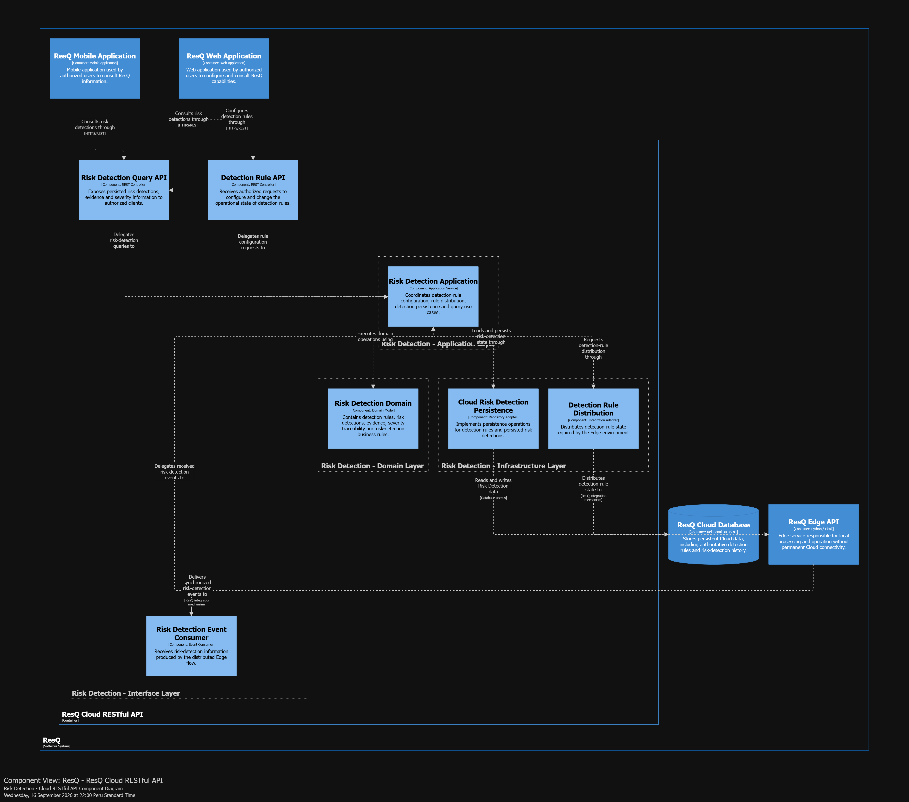

##### Risk Detection — ResQ Edge Service Component Diagram

El Edge Component Diagram representa los componentes responsables de la evaluación local de riesgos dentro de ResQ Edge Service.

Los principales componentes son:

- Measurement Consumer, responsable de recibir mediciones válidas disponibles localmente.
- Detection Rule Replica Consumer, responsable de recibir los estados actuales de las reglas de detección desde Cloud.
- Edge Risk Detection Application, responsable de coordinar la evaluación local.
- Risk Evaluation Domain, que contiene la lógica de dominio de reglas de detección y evaluación de riesgos.
- Local Detection Rule Persistence, responsable de almacenar réplicas locales de reglas utilizando Peewee y SQLite.
- Risk Location Integration, responsable de obtener las referencias de ubicación asociadas con un dispositivo de origen.
- Risk Detection Event Publisher, responsable de publicar el resultado de una detección local satisfactoria.

El flujo principal de ejecución local es:

```text
Local Measurement Flow
          |
          v
Measurement Consumer
          |
          v
Edge Risk Detection Application
          |
          v
Risk Evaluation Domain
      /            \
     v              v
Local Rule      Risk Location
Persistence     Integration
     |
     v
Risk Detection Event
     |
     v
Risk Detection Event Publisher
     |
     v
Distributed ResQ Flow
```

El flujo de actualización de reglas en Edge es:

```text
Cloud Rule Distribution
          |
          v
Detection Rule Replica Consumer
          |
          v
Edge Risk Detection Application
          |
          v
Local Detection Rule Persistence
```

La implementación Edge debe utilizar la tecnología establecida por el enunciado del proyecto para Edge Services: Python, Flask, Peewee ORM y SQLite.

**DIAGRAMA Risk Detection Edge Component Level Diagram**

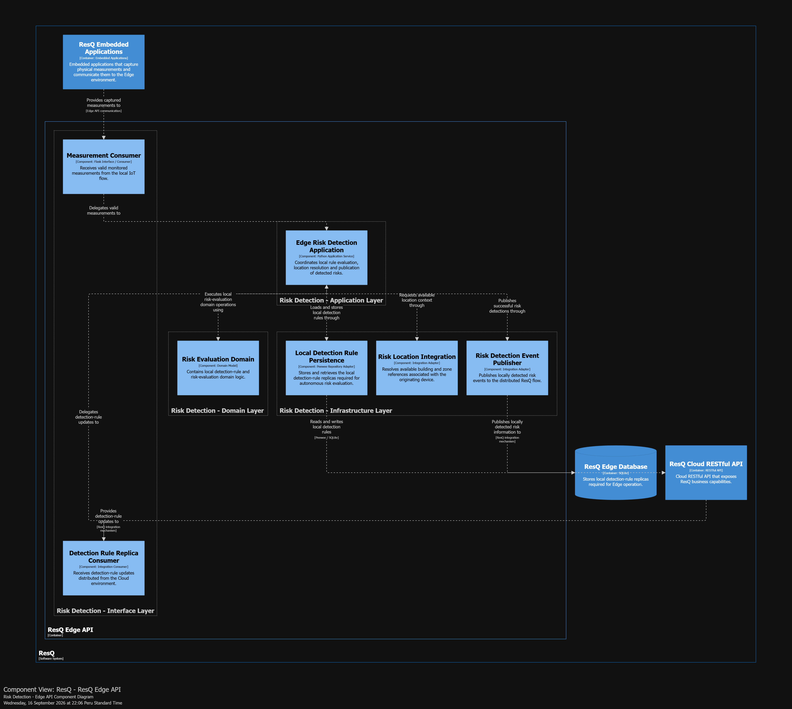

#### 4.2.2.6. Bounded Context Software Architecture Code Level Diagrams

Los Code Level Diagrams proporcionan una representación más detallada de la estructura orientada a la implementación del Bounded Context Risk Detection.

Para Risk Detection, el Code Level se representa mediante:

- Domain Layer Class Diagram, que describe el modelo de dominio orientado a objetos, incluidos Aggregate Roots, Entities, Value Objects, enumeraciones, Domain Services, interfaces de Repository, atributos, métodos, visibilidad, relaciones y multiplicidades.
- Database Design Diagram, que describe las estructuras de persistencia relacional requeridas por las partes Cloud y Edge del Bounded Context.

Los diagramas deben mantener la consistencia con el diseño de cuatro capas descrito anteriormente.

##### 4.2.2.6.1. Bounded Context Domain Layer Class Diagrams

El Domain Layer Class Diagram representa la estructura orientada a la implementación del modelo de dominio de Risk Detection.

El diagrama debe incluir los siguientes elementos.

**Aggregate Roots**

- `DetectionRule`
- `RiskDetection`

**Entity**

- `SeverityChange`

**Value Objects**

- `DetectionCondition`
- `DetectionEvidence`
- `RiskLocation`
- `RiskType`
- `SeverityLevel`

**Enumeraciones**

- `DetectionRuleStatus`
- `ComparisonOperator`
- `LocationResolutionStatus`

**Repository Interfaces**

- `DetectionRuleRepository`
- `RiskDetectionRepository`

**Domain Service**

- `RiskEvaluationService`

**Domain Event**

- `RiskDetectedEvent`

Las principales relaciones que deben representarse son:

- `DetectionRule` compone exactamente un `DetectionCondition`.
- `DetectionRule` compone exactamente un `RiskType`.
- `DetectionRule` compone exactamente un `SeverityLevel`.
- `DetectionRule` utiliza exactamente un `DetectionRuleStatus`.
- `DetectionCondition` utiliza exactamente un `ComparisonOperator`.
- `RiskDetection` compone exactamente un `RiskType`.
- `RiskDetection` compone exactamente un `SeverityLevel` actual.
- `RiskDetection` compone exactamente un `RiskLocation`.
- `RiskDetection` posee uno o más valores `DetectionEvidence`.
- `RiskDetection` posee cero o más entidades `SeverityChange`.
- `RiskLocation` utiliza exactamente un `LocationResolutionStatus`.
- `SeverityChange` referencia un `SeverityLevel` anterior y uno nuevo.
- `RiskDetection` referencia su `DetectionRule` de origen mediante `ruleId`.
- `DetectionRuleRepository` persiste y recupera `DetectionRule`.
- `RiskDetectionRepository` persiste y recupera `RiskDetection`.
- `RiskEvaluationService` evalúa `DetectionRule` y `DetectionEvidence`.
- `RiskDetectedEvent` se produce a partir de una evaluación satisfactoria de Risk Detection.

El diagrama debe mostrar las convenciones de visibilidad UML:

- `+` para miembros públicos;
- `-` para miembros privados;
- `#` para miembros protegidos cuando corresponda.

Una referencia conceptual de multiplicidad es:

```text
DetectionRule "1" *-- "1" DetectionCondition
DetectionRule "1" *-- "1" RiskType
DetectionRule "1" *-- "1" SeverityLevel
DetectionRule "1" --> "1" DetectionRuleStatus

DetectionCondition "1" --> "1" ComparisonOperator

RiskDetection "1" *-- "1" RiskType
RiskDetection "1" *-- "1" SeverityLevel
RiskDetection "1" *-- "1" RiskLocation
RiskDetection "1" *-- "1..*" DetectionEvidence
RiskDetection "1" *-- "0..*" SeverityChange

RiskLocation "1" --> "1" LocationResolutionStatus

SeverityChange --> SeverityLevel : previous/new

RiskDetection ..> DetectionRule : references by ruleId

DetectionRuleRepository ..> DetectionRule : persists
RiskDetectionRepository ..> RiskDetection : persists

RiskEvaluationService ..> DetectionRule : evaluates
RiskEvaluationService ..> DetectionEvidence : evaluates
```

Los siguientes conceptos no deben aparecer como clases de dominio propias dentro de Risk Detection:

- Measurement
- Device
- Building
- Zone
- Alert
- Incident
- Actuator

Sus identificadores pueden aparecer como referencias externas cuando el proceso de detección los requiera.

**DIAGRAMA — Risk Detection Domain Layer Class Diagram**

 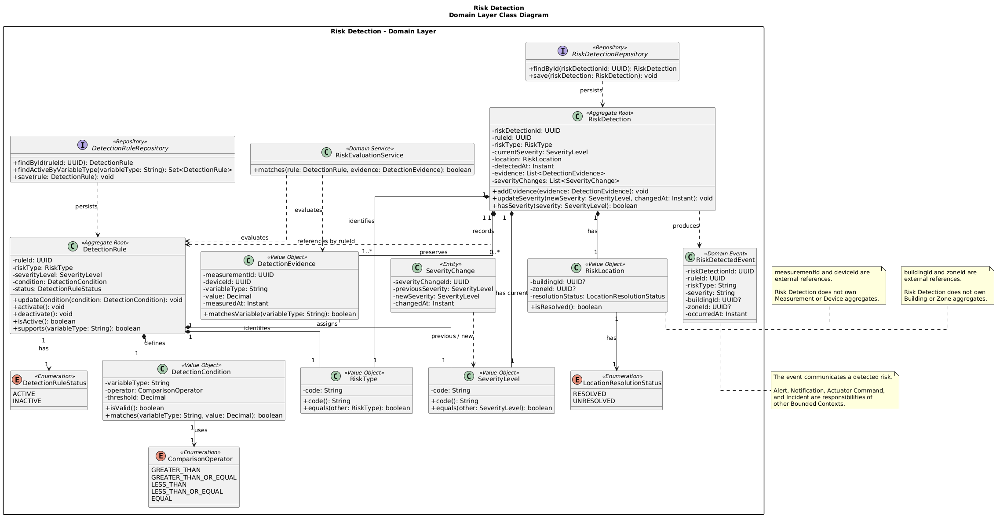

##### 4.2.2.6.2. Bounded Context Database Design Diagram

El Database Design de Risk Detection representa la persistencia requerida por el Bounded Context en los entornos de ejecución Cloud y Edge.

La persistencia Cloud almacena las definiciones autoritativas de reglas de detección y el historial de detección persistido.

La persistencia Edge almacena las réplicas locales de reglas de detección requeridas para la evaluación autónoma.

El modelo de persistencia evita deliberadamente crear dependencias de claves foráneas hacia tablas pertenecientes a otros Bounded Contexts.

###### Persistencia Cloud

###### `risk_detection_rules`

Almacena la configuración autoritativa de reglas de detección.

| Columna | Tipo | Restricción | Descripción |
|---|---|---|---|
| `rule_id` | UUID | PRIMARY KEY | Identificador único de la regla de detección. |
| `risk_type_code` | VARCHAR(100) | NOT NULL | Tipo de riesgo producido cuando se satisface la condición. |
| `severity_code` | VARCHAR(50) | NOT NULL | Severidad asociada con la regla. |
| `variable_type` | VARCHAR(100) | NOT NULL | Variable monitoreada evaluada por la regla. |
| `comparison_operator` | VARCHAR(40) | NOT NULL | Operador de comparación aplicado al valor monitoreado. |
| `threshold` | DECIMAL(12,4) | NOT NULL | Umbral cuantitativo utilizado por la condición. |
| `status` | VARCHAR(20) | NOT NULL | Estado actual de la regla (ACTIVE o INACTIVE). |

DetectionCondition, RiskType y SeverityLevel son Value Objects y, por lo tanto, sus valores persistentes se integran en el registro de la regla de detección en lugar de modelarse como tablas de agregados independientes.

###### `risk_detections`

Almacena las detecciones de riesgo persistidas recibidas desde el flujo distribuido de Edge.

| Columna | Tipo | Restricción | Descripción |
|---|---|---|---|
| `risk_detection_id` | UUID | PRIMARY KEY | Identificador único del riesgo detectado. |
| `rule_id` | UUID | NOT NULL, FOREIGN KEY | Referencia `risk_detection_rules.rule_id`. |
| `risk_type_code` | VARCHAR(100) | NOT NULL | Tipo de riesgo identificado en el momento de la detección. |
| `current_severity_code` | VARCHAR(50) | NOT NULL | Severidad actual de la detección. |
| `building_id` | UUID | NULL | Referencia externa a Building cuando puede resolverse la ubicación. |
| `zone_id` | UUID | NULL | Referencia externa a Zone cuando puede resolverse la ubicación. |
| `location_status` | VARCHAR(20) | NOT NULL | Indica si se resolvió la ubicación de la detección. |
| `detected_at` | TIMESTAMP | NOT NULL | Momento original de detección. |

building_id y zone_id se mantienen intencionalmente sin claves foráneas hacia tablas pertenecientes a otros Bounded Contexts.

###### `risk_detection_evidence`

Almacena la evidencia monitoreada asociada con cada detección de riesgo persistida.

| Columna | Tipo | Restricción | Descripción |
|---|---|---|---|
| `risk_detection_id` | UUID | PRIMARY KEY, FOREIGN KEY | Referencia `risk_detections.risk_detection_id`. |
| `measurement_id` | UUID | PRIMARY KEY | Identificador externo de la medición monitoreada. |
| `device_id` | UUID | NOT NULL | Identificador externo del dispositivo de origen. |
| `variable_type` | VARCHAR(100) | NOT NULL | Variable monitoreada representada por la evidencia. |
| `measured_value` | DECIMAL(12,4) | NOT NULL | Valor utilizado durante la evaluación. |
| `measured_at` | TIMESTAMP | NOT NULL | Momento original de medición. |

La clave primaria compuesta:

`(risk_detection_id, measurement_id)`

impide que la misma evidencia monitoreada se asocie más de una vez con la misma detección de riesgo.

measurement_id y device_id son referencias externas y, por lo tanto, no crean relaciones directas de propiedad en la base de datos con la persistencia de Monitoring o Device.

###### `risk_severity_changes`

Almacena las transiciones de severidad asociadas con las detecciones de riesgo persistidas.

| Columna | Tipo | Restricción | Descripción |
|---|---|---|---|
| `severity_change_id` | UUID | PRIMARY KEY | Identificador único de la entidad de cambio de severidad. |
| `risk_detection_id` | UUID | NOT NULL, FOREIGN KEY | Referencia `risk_detections.risk_detection_id`. |
| `previous_severity_code` | VARCHAR(50) | NOT NULL | Severidad anterior al cambio. |
| `new_severity_code` | VARCHAR(50) | NOT NULL | Severidad posterior al cambio. |
| `changed_at` | TIMESTAMP | NOT NULL | Momento en el que ocurrió el cambio de severidad. |

Esta tabla preserva la trazabilidad requerida cuando cambia la severidad de un riesgo.

###### Persistencia Edge

###### `edge_detection_rules`

Almacena la representación de reglas de detección requerida para la evaluación local en la base de datos SQLite de Edge.

| Columna | Tipo | Restricción | Descripción |
|---|---|---|---|
| `rule_id` | UUID | PRIMARY KEY | Identificador de la regla de detección de Cloud representada localmente. |
| `risk_type_code` | VARCHAR(100) | NOT NULL | Tipo de riesgo producido por la regla. |
| `severity_code` | VARCHAR(50) | NOT NULL | Severidad asociada con la regla. |
| `variable_type` | VARCHAR(100) | NOT NULL | Variable monitoreada evaluada localmente. |
| `comparison_operator` | VARCHAR(40) | NOT NULL | Operador de comparación utilizado por la condición local. |
| `threshold` | DECIMAL(12,4) | NOT NULL | Umbral cuantitativo utilizado para la evaluación. |
| `status` | VARCHAR(20) | NOT NULL | Estado actual de la regla local. |

Esta tabla no es una fuente independiente de propiedad de las reglas. Es la representación local de Edge requerida para que las reglas críticas puedan seguir evaluándose sin conectividad permanente con Cloud.

La implementación de persistencia Edge debe utilizar SQLite con Peewee ORM, de acuerdo con la tecnología de Edge Services requerida por el enunciado del proyecto.

Conceptualmente, las relaciones internas de Cloud son:

```text
risk_detection_rules
        |
        | 1
        |
        | 0..*
        v
risk_detections
        |
        +------------------------+
        |                        |
        | 1                      | 1
        |                        |
        | 1..*                   | 0..*
        v                        v
risk_detection_evidence    risk_severity_changes
```

El Database Design Diagram final debe distinguir claramente:

- Persistencia Cloud
  - `risk_detection_rules`
  - `risk_detections`
  - `risk_detection_evidence`
  - `risk_severity_changes`

- Edge SQLite
  - `edge_detection_rules`

El diagrama debe identificar:

- todas las tablas;
- todas las columnas;
- las claves primarias;
- las claves foráneas;
- las claves compuestas;
- las referencias externas que admiten valores nulos;
- las cardinalidades;
- los límites de persistencia de Cloud y Edge.

No debe introducirse ninguna tabla de base de datos para Alert, Incident, Device, Measurement, Building, Zone, Actuator o eventos pendientes de Connectivity dentro de los límites de persistencia de Risk Detection.

**DIAGRAMA — Risk Detection Database Design Diagram**

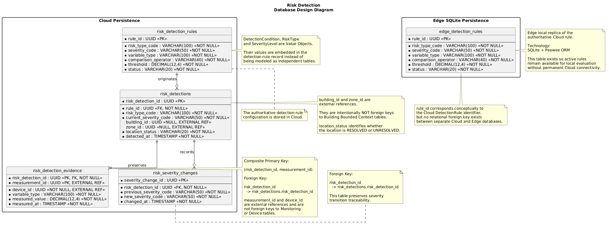

### 4.2.3. Bounded Context: Alert & Response Management

El Bounded Context **Alert & Response Management** es responsable de gestionar la generación y comunicación de alertas, la configuración de políticas de respuesta, la autorización de acciones sensibles y la coordinación de las acciones que deben ejecutarse cuando ResQ recibe información sobre un riesgo detectado.

Este Bounded Context atiende las necesidades de comunicación y respuesta de la plataforma, asegurando que una situación de riesgo pueda ser informada a los responsables correspondientes y que las acciones asociadas se ejecuten de acuerdo con las políticas previamente configuradas. Algunas respuestas pueden estar autorizadas para ejecutarse automáticamente, mientras que otras requieren una decisión explícita de un usuario autorizado antes de continuar.

Sus responsabilidades se derivan principalmente de los requisitos relacionados con la generación de alertas, la ejecución de respuestas automáticas, la autorización humana de acciones de alto impacto, la trazabilidad de las respuestas realizadas y la continuidad de determinadas funciones críticas cuando no existe conexión con los servicios Cloud.

El Bounded Context Alert & Response Management soporta principalmente **US10 — Recibir una alerta de riesgo**, **US11 — Ejecutar una respuesta automática autorizada**, **US12 — Confirmar una acción de alto impacto**, **US13 — Conocer las respuestas ejecutadas**, **US25 — Configurar una política de respuesta**, **US28 — Mantener funciones críticas sin Internet**, **TS04 — Ejecutar comandos de actuadores localmente** y **TS05 — Integrar un servicio externo de notificaciones**.

Alert & Response Management no determina si existe un riesgo ni realiza su clasificación. Esa responsabilidad pertenece al Bounded Context **Risk Detection**, que proporciona la información necesaria para iniciar el flujo de alerta y respuesta.

Asimismo, este Bounded Context no administra el catálogo ni el ciclo de vida de los dispositivos y sus capacidades, no gestiona edificios o zonas, no mantiene las identidades y permisos de los usuarios, no controla el ciclo de vida completo de los incidentes y no administra las colas, reintentos o mecanismos de sincronización utilizados durante una pérdida de conectividad. Estas responsabilidades pertenecen respectivamente a otros Bounded Contexts como **Device Management**, **Building Management**, **IAM**, **User**, **Incident** y **Connectivity**.

Alert & Response Management utiliza únicamente las referencias externas necesarias para realizar sus funciones. Por ejemplo, puede conservar identificadores como `riskDetectionId`, `targetDeviceId`, `buildingId`, `zoneId`, `recipientUserId` o `decidedByUserId`, pero no reproduce dentro de su modelo los agregados completos pertenecientes a otros Bounded Contexts.

Las principales responsabilidades de este Bounded Context son:

- Generar una alerta a partir de una situación de riesgo previamente detectada.
- Conservar el contexto necesario para comunicar el tipo, severidad y ubicación del riesgo.
- Identificar a los responsables que deben recibir una alerta.
- Solicitar la entrega de notificaciones mediante los canales externos disponibles.
- Registrar el resultado de los intentos de entrega de una notificación.
- Configurar políticas que definan las respuestas asociadas con determinados riesgos.
- Determinar qué acciones configuradas son aplicables ante un riesgo detectado.
- Distinguir entre acciones autorizadas para ejecución automática y acciones que requieren autorización humana.
- Mantener pendiente una acción sensible hasta que un usuario autorizado tome una decisión.
- Impedir la ejecución de una acción cuando esta ha sido rechazada.
- Coordinar la ejecución local de acciones sobre capacidades de actuación de los dispositivos.
- Registrar si una respuesta fue ejecutada correctamente o si terminó con un error.
- Mantener la trazabilidad entre el riesgo detectado, la política aplicada, la autorización realizada y el resultado de la respuesta.
- Mantener disponibles en el entorno Edge las políticas necesarias para ejecutar respuestas críticas automáticas durante una interrupción temporal de Internet.
- Mantener el modelo de alertas y respuestas independiente de los modelos administrados por Risk Detection, Device Management, IAM, User, Building Management, Incident y Connectivity.

Los principales conceptos identificados para el Bounded Context Alert & Response Management son `Alert`, `AlertContext`, `ResponsePolicy`, `ResponseAction`, `ResponseExecution`, `ResponseAuthorization`, `NotificationDelivery` y `ExecutionResult`.

#### Diccionario de clases

La siguiente tabla resume las principales clases e interfaces que conforman el Bounded Context Alert & Response Management.

| Clase / Interfaz | Capa | Propósito | Atributos principales | Operaciones principales | Relaciones principales |
|---|---|---|---|---|---|
| `Alert` | Domain | Representa una alerta generada a partir de un riesgo detectado. Es el Aggregate Root responsable de conservar el contexto comunicado y los intentos de notificación asociados. | `alertId: UUID`, `organizationId: UUID`, `context: AlertContext`, `generatedAt: Instant`, `deliveries: List<NotificationDelivery>` | `addDelivery(delivery)`, `registerDeliveryResult(deliveryId, result)` | Compone `AlertContext`; posee `NotificationDelivery`. |
| `AlertContext` | Domain | Value Object que conserva la información mínima del riesgo necesaria para comunicar una alerta sin reproducir el modelo de Risk Detection. | `riskDetectionId: UUID`, `riskTypeCode: String`, `severityCode: String`, `buildingId: UUID?`, `zoneId: UUID?`, `detectedAt: Instant` | — | Compuesto por `Alert`; utiliza referencias externas de Risk Detection y Building Management. |
| `NotificationDelivery` | Domain | Representa un intento de entregar una alerta a un usuario responsable mediante un canal de notificación. | `deliveryId: UUID`, `recipientUserId: UUID`, `channel: String`, `destination: String`, `status: NotificationDeliveryStatus`, `requestedAt: Instant`, `completedAt: Instant?`, `failureReason: String?` | `markDelivered(at)`, `markFailed(reason, at)` | Pertenece a `Alert`; utiliza `NotificationDeliveryStatus` y referencia externamente a un usuario. |
| `ResponsePolicy` | Domain | Aggregate Root que representa una política configurada para determinar qué acciones pueden realizarse ante un tipo de riesgo. | `policyId: UUID`, `organizationId: UUID`, `riskTypeCode: String`, `status: ResponsePolicyStatus`, `actions: List<ResponseAction>`, `version: long` | `addAction(action)`, `replaceActions(actions)`, `activate()`, `deactivate()`, `isActive()` | Posee `0..*` `ResponseAction`; para activarse debe contener al menos una acción válida; utiliza `ResponsePolicyStatus`. La versión permite ordenar las actualizaciones distribuidas hacia Edge y evitar aplicar réplicas antiguas. |
| `ResponseAction` | Domain | Representa una acción configurada dentro de una política de respuesta y el dispositivo o capacidad sobre la cual debe ejecutarse. | `actionId: UUID`, `actionCode: String`, `targetDeviceId: UUID`, `targetCapabilityCode: String`, `authorizationMode: AuthorizationMode`, `critical: boolean` | `requiresAuthorization()`, `canExecuteAutomatically()` | Pertenece a `ResponsePolicy`; utiliza `AuthorizationMode`; referencia externamente un Device. |
| `ResponseExecution` | Domain | Aggregate Root que representa un intento concreto de ejecutar una acción de respuesta asociada con un riesgo detectado. | `responseExecutionId: UUID`, `organizationId: UUID`, `riskDetectionId: UUID`, `policyId: UUID`, `action: ResponseActionSnapshot`, `status: ResponseExecutionStatus`, `requestedAt: Instant`, `authorization: ResponseAuthorization?`, `result: ExecutionResult?` | `requestAuthorization()`, `authorize(userId, decidedAt)`, `reject(userId, decidedAt)`, `markExecutionRequested()`, `complete(result)` | Compone `ResponseActionSnapshot` y `ExecutionResult`; puede poseer `ResponseAuthorization`; utiliza `ResponseExecutionStatus`. |
| `ResponseActionSnapshot` | Domain | Value Object que conserva la definición de la acción utilizada al crear una ejecución para evitar que cambios posteriores en la política modifiquen su historial. | `actionId: UUID`, `actionCode: String`, `targetDeviceId: UUID`, `targetCapabilityCode: String`, `authorizationMode: AuthorizationMode`, `critical: boolean` | `requiresAuthorization()` | Compuesto por `ResponseExecution`; utiliza `AuthorizationMode`. |
| `ResponseAuthorization` | Domain | Representa la decisión realizada por un usuario autorizado cuando una acción requiere confirmación humana. | `authorizationId: UUID`, `decision: AuthorizationDecision`, `decidedByUserId: UUID`, `decidedAt: Instant` | — | Pertenece a `ResponseExecution`; utiliza `AuthorizationDecision`; referencia externamente un User. |
| `ExecutionResult` | Domain | Value Object que representa el resultado final de un intento de ejecutar una acción. | `successful: boolean`, `resultCode: String`, `message: String?`, `completedAt: Instant` | `isSuccessful()` | Compuesto por `ResponseExecution`. |
| `ResponsePolicyStatus` | Domain | Enumeración que indica si una política puede participar en la evaluación de respuestas. | `ACTIVE`, `INACTIVE` | — | Utilizada por `ResponsePolicy`. |
| `AuthorizationMode` | Domain | Enumeración que determina si una acción puede ejecutarse automáticamente o requiere confirmación humana. | `AUTOMATIC`, `HUMAN_REQUIRED` | — | Utilizada por `ResponseAction` y `ResponseActionSnapshot`. |
| `AuthorizationDecision` | Domain | Enumeración que representa la decisión realizada sobre una acción pendiente de autorización. | `APPROVED`, `REJECTED` | — | Utilizada por `ResponseAuthorization`. |
| `ResponseExecutionStatus` | Domain | Enumeración que representa el estado actual de una ejecución de respuesta. | `PENDING`, `PENDING_AUTHORIZATION`, `AUTHORIZED`, `EXECUTION_REQUESTED`, `SUCCEEDED`, `FAILED`, `REJECTED` | — | Utilizada por `ResponseExecution`. |
| `NotificationDeliveryStatus` | Domain | Enumeración que representa el estado de un intento de entrega de una notificación. | `PENDING`, `DELIVERED`, `FAILED` | — | Utilizada por `NotificationDelivery`. |
| `AlertRepository` | Domain | Abstracción de repositorio utilizada para recuperar y persistir agregados `Alert` sin depender de una tecnología específica. | — | `findById(alertId)`, `findByRiskDetectionId(riskDetectionId)`, `findByOrganizationId(organizationId, criteria)`, `save(alert)` | Persiste y recupera agregados `Alert`. |
| `ResponsePolicyRepository` | Domain | Abstracción de repositorio utilizada para recuperar y persistir políticas de respuesta. | — | `findById(policyId)`, `findActiveByOrganizationAndRiskType(organizationId, riskTypeCode)`, `save(policy)` | Persiste y recupera agregados `ResponsePolicy`; dispone de implementaciones diferentes para Cloud y Edge. |
| `ResponseExecutionRepository` | Domain | Abstracción de repositorio utilizada para conservar la trazabilidad y el estado de las ejecuciones de respuesta. | — | `findById(responseExecutionId)`, `findByRiskDetectionId(riskDetectionId)`, `findByOrganizationId(organizationId, criteria)`, `save(execution)` | Persiste y recupera agregados `ResponseExecution`; dispone de implementaciones Cloud y Edge. |
| `ResponsePolicySelectionService` | Domain | Domain Service responsable de determinar las políticas y acciones activas aplicables a un riesgo detectado. | — | `selectApplicableActions(policies, riskTypeCode)` | Evalúa `ResponsePolicy` y sus acciones según el tipo de riesgo. |
| `ResponseActionData` | Application | Representa los datos necesarios para configurar una acción dentro de una política. | `actionCode: String`, `targetDeviceId: UUID`, `targetCapabilityCode: String`, `authorizationMode: AuthorizationMode`, `critical: boolean` | — | Utilizada por `ConfigureResponsePolicyCommand` y `UpdateResponsePolicyCommand`. |
| `ConfigureResponsePolicyCommand` | Application | Representa una solicitud para crear una nueva política de respuesta. | `organizationId: UUID`, `riskTypeCode: String`, `actions: List<ResponseActionData>` | — | Gestionado por `ConfigureResponsePolicyCommandHandler`. |
| `ConfigureResponsePolicyCommandHandler` | Application | Coordina la creación de una política y valida las capacidades de actuación utilizadas por sus acciones. | Dependencias de `ResponsePolicyRepository`, `DeviceCapabilityGateway`, `ResponsePolicyDistributor` | `handle(command)` | Crea `ResponsePolicy`, valida sus acciones y solicita su distribución. |
| `UpdateResponsePolicyCommand` | Application | Representa una solicitud para modificar la configuración de una política existente. | `policyId: UUID`, `organizationId: UUID`, `riskTypeCode: String`, `actions: List<ResponseActionData>` | — | Gestionado por `UpdateResponsePolicyCommandHandler`. |
| `UpdateResponsePolicyCommandHandler` | Application | Coordina la modificación de una política existente y la distribución de su nueva versión. | Dependencias de `ResponsePolicyRepository`, `DeviceCapabilityGateway`, `ResponsePolicyDistributor` | `handle(command)` | Modifica `ResponsePolicy`, incrementa su versión y solicita su distribución hacia Edge. |
| `ChangeResponsePolicyStatusCommand` | Application | Representa una solicitud para activar o desactivar una política existente. | `policyId: UUID`, `organizationId: UUID`, `active: boolean` | — | Gestionado por `ChangeResponsePolicyStatusCommandHandler`. |
| `ChangeResponsePolicyStatusCommandHandler` | Application | Coordina la activación o desactivación de una política y propaga el nuevo estado hacia Edge. | Dependencias de `ResponsePolicyRepository`, `DeviceCapabilityGateway`, `ResponsePolicyDistributor` | `handle(command)` | Modifica `ResponsePolicy` y solicita su distribución. |
| `GetResponsePolicyQuery` | Application | Representa una solicitud para consultar una política determinada dentro de una organización. | `policyId: UUID`, `organizationId: UUID` | — | Gestionada por `GetResponsePolicyQueryHandler`. |
| `GetResponsePolicyQueryHandler` | Application | Recupera una política y verifica que corresponda al ámbito organizacional solicitado. | Dependencia de `ResponsePolicyRepository` | `handle(query)` | Consulta `ResponsePolicy`. |
| `GetAlertQuery` | Application | Representa una solicitud para consultar una alerta determinada dentro de una organización. | `alertId: UUID`, `organizationId: UUID` | — | Gestionada por `GetAlertQueryHandler`. |
| `GetAlertQueryHandler` | Application | Recupera una alerta junto con la información de sus intentos de notificación. | Dependencia de `AlertRepository` | `handle(query)` | Consulta `Alert`. |
| `GetAlertsQuery` | Application | Representa una solicitud para consultar alertas pertenecientes a una organización utilizando filtros opcionales. | `organizationId: UUID`, `buildingId: UUID?`, `zoneId: UUID?`, `riskTypeCode: String?`, `from: Instant?`, `to: Instant?` | — | Gestionada por `GetAlertsQueryHandler`. |
| `GetAlertsQueryHandler` | Application | Coordina la consulta de múltiples alertas dentro del ámbito de una organización. | Dependencia de `AlertRepository` | `handle(query)` | Consulta agregados `Alert` según los criterios solicitados. |
| `GetResponseExecutionQuery` | Application | Representa una solicitud para consultar una ejecución de respuesta determinada dentro de una organización. | `responseExecutionId: UUID`, `organizationId: UUID` | — | Gestionada por `GetResponseExecutionQueryHandler`. |
| `GetResponseExecutionQueryHandler` | Application | Recupera una ejecución junto con su autorización y resultado cuando existan. | Dependencia de `ResponseExecutionRepository` | `handle(query)` | Consulta `ResponseExecution`. |
| `GetResponseExecutionsQuery` | Application | Representa una solicitud para consultar la trazabilidad de múltiples ejecuciones dentro de una organización. | `organizationId: UUID`, `riskDetectionId: UUID?`, `status: ResponseExecutionStatus?`, `from: Instant?`, `to: Instant?` | — | Gestionada por `GetResponseExecutionsQueryHandler`. |
| `GetResponseExecutionsQueryHandler` | Application | Coordina la consulta de ejecuciones de respuesta utilizando criterios de búsqueda. | Dependencia de `ResponseExecutionRepository` | `handle(query)` | Consulta múltiples `ResponseExecution`. |
| `RiskDetectedEventHandler` | Application | Procesa la información sincronizada desde Risk Detection y coordina la creación y comunicación de la alerta correspondiente en Cloud. | Dependencias de `AlertRepository`, `AlertRecipientResolver`, `NotificationGateway` | `handle(event)` | Crea `Alert`, identifica destinatarios y solicita notificaciones. |
| `LocalRiskDetectedEventHandler` | Application | Procesa localmente un riesgo detectado y coordina las respuestas configuradas en Edge. | Dependencias de `ResponsePolicyRepository`, `ResponseExecutionRepository`, `ResponsePolicySelectionService`, `ActuatorCommandGateway`, `AlertResponseEventPublisher` | `handle(event)` | Evalúa políticas locales, crea `ResponseExecution` y ejecuta o solicita autorización para cada acción aplicable. |
| `UpdateLocalResponsePolicyEventHandler` | Application | Coordina la actualización de una réplica local de `ResponsePolicy` en Edge. | Dependencia de `ResponsePolicyRepository` | `handle(event)` | Aplica una actualización únicamente cuando su versión es posterior a la almacenada localmente. |
| `ResponseAuthorizationRequestReceivedEventHandler` | Application | Registra en Cloud una `ResponseExecution` originada en Edge que requiere autorización humana. | Dependencia de `ResponseExecutionRepository` | `handle(event)` | Reconstruye y persiste la ejecución con estado `PENDING_AUTHORIZATION`. |
| `DecideResponseAuthorizationCommand` | Application | Representa la decisión de un usuario autorizado sobre una ejecución pendiente. | `responseExecutionId: UUID`, `organizationId: UUID`, `decision: AuthorizationDecision` | — | Gestionado por `DecideResponseAuthorizationCommandHandler`. |
| `DecideResponseAuthorizationCommandHandler` | Application | Coordina la aprobación o rechazo de una respuesta que requiere intervención humana. | Dependencias de `ResponseExecutionRepository` y `ResponseAuthorizationDistributor` | `handle(command)` | Registra la decisión y solicita su distribución hacia Edge. |
| `ResponseAuthorizationDecisionEventHandler` | Application | Procesa en Edge una decisión de autorización recibida desde Cloud. | Dependencias de `ResponseExecutionRepository`, `ActuatorCommandGateway`, `AlertResponseEventPublisher` | `handle(event)` | Ejecuta la acción cuando la decisión es `APPROVED` o finaliza la ejecución sin actuar cuando es `REJECTED`. |
| `ResponseExecutionResultReceivedEventHandler` | Application | Registra en Cloud el resultado de una ejecución realizada en Edge. | Dependencia de `ResponseExecutionRepository` | `handle(event)` | Registra o actualiza la `ResponseExecution` y conserva su resultado final. |
| `NotificationTarget` | Application | Representa la información mínima necesaria para intentar entregar una alerta a un destinatario mediante un canal determinado. | `recipientUserId: UUID`, `channel: String`, `destination: String` | — | Devuelto por `AlertRecipientResolver` y utilizado por `NotificationGateway`. |
| `NotificationSendResult` | Application | Representa el resultado obtenido al intentar entregar una notificación mediante un proveedor externo. | `successful: boolean`, `completedAt: Instant`, `failureReason: String?` | — | Devuelto por `NotificationGateway` y utilizado para actualizar `NotificationDelivery`. |
| `NotificationGateway` | Application | Abstracción utilizada para solicitar la entrega de notificaciones mediante un proveedor externo. | — | `send(alert, target): NotificationSendResult` | Utilizada por `RiskDetectedEventHandler`; implementada por `NotificationServiceAdapter`. |
| `AlertRecipientResolver` | Application | Abstracción utilizada para identificar los destinatarios y canales correspondientes para una alerta. | — | `resolve(alertContext): List<NotificationTarget>` | Implementada mediante integración con User/IAM. |
| `DeviceCapabilityGateway` | Application | Abstracción utilizada para validar que el dispositivo objetivo posee la capacidad de actuación requerida por una política. | — | `validateActuationCapability(deviceId, capabilityCode)` | Implementada mediante integración con Device Management. |
| `ResponsePolicyDistributor` | Application | Abstracción utilizada para distribuir hacia Edge las políticas necesarias para la operación local. | — | `distribute(policy)` | Implementada por `ResponsePolicyDistributionAdapter`. |
| `ResponseAuthorizationDistributor` | Application | Abstracción utilizada para distribuir hacia Edge una decisión humana sobre una respuesta pendiente. | — | `distributeDecision(execution)` | Implementada por `ResponseAuthorizationDistributionAdapter`. |
| `ActuatorCommandGateway` | Application | Abstracción utilizada en Edge para solicitar la ejecución física de una acción. | — | `execute(action): ExecutionResult` | Implementada por `ActuatorCommandAdapter`. |
| `AlertResponseEventPublisher` | Application | Abstracción utilizada para publicar solicitudes de autorización y resultados de ejecución producidos en Edge. | — | `publish(event)` | Implementada por `AlertResponseEventPublisherAdapter`. |
| `ResponsePolicyController` | Interface | Recibe solicitudes autorizadas para crear, modificar, consultar y cambiar el estado de políticas de respuesta. | Dependencia de manejadores de comandos y consultas | `configure(request)`, `update(policyId, request)`, `changeStatus(policyId, request)`, `getById(policyId)` | Delega las operaciones a la Application Layer. |
| `AlertController` | Interface | Expone las alertas registradas a los clientes autorizados de ResQ. | Dependencia de manejadores de consulta | `getById(alertId)`, `getAlerts(request)` | Delega consultas a `GetAlertQueryHandler` y `GetAlertsQueryHandler`. |
| `ResponseExecutionController` | Interface | Expone la trazabilidad de respuestas y recibe decisiones de autorización humana. | Dependencias de manejadores de consulta y autorización | `getById(responseExecutionId)`, `getExecutions(request)`, `decideAuthorization(responseExecutionId, request)` | Delega las operaciones a la Application Layer. |
| `RiskDetectedEventConsumer` | Interface | Recibe en Cloud información de riesgos detectados proveniente del flujo distribuido de Risk Detection. | Dependencia de `RiskDetectedEventHandler` | `consume(event)` | Delega el evento a `RiskDetectedEventHandler`. |
| `LocalRiskDetectedConsumer` | Interface | Recibe en Edge eventos de riesgo generados localmente para iniciar el flujo de respuesta sin depender de Cloud. | Dependencia de `LocalRiskDetectedEventHandler` | `consume(event)` | Delega el evento al Application Layer de Edge. |
| `ResponsePolicyReplicaConsumer` | Interface | Recibe en Edge actualizaciones de políticas distribuidas desde Cloud. | Dependencia de `UpdateLocalResponsePolicyEventHandler` | `consume(policyUpdate)` | Delega la actualización de la réplica local. |
| `ResponseAuthorizationRequestConsumer` | Interface | Recibe en Cloud solicitudes de autorización originadas por una ejecución local en Edge. | Dependencia de `ResponseAuthorizationRequestReceivedEventHandler` | `consume(event)` | Permite registrar en Cloud la ejecución pendiente de autorización. |
| `ResponseAuthorizationDecisionConsumer` | Interface | Recibe en Edge una decisión `APPROVED` o `REJECTED` previamente registrada en Cloud. | Dependencia de `ResponseAuthorizationDecisionEventHandler` | `consume(event)` | Continúa o finaliza la ejecución local según la decisión recibida. |
| `ResponseExecutionResultConsumer` | Interface | Recibe en Cloud resultados de acciones ejecutadas en Edge. | Dependencia de `ResponseExecutionResultReceivedEventHandler` | `consume(event)` | Delega el registro de la trazabilidad final de la ejecución. |
| `AlertRepositoryAdapter` | Infrastructure | Implementa `AlertRepository` utilizando la persistencia seleccionada para los servicios Cloud de ResQ. | Dependencia de persistencia | `findById()`, `findByRiskDetectionId()`, `findByOrganizationId()`, `save()` | Implementa `AlertRepository`. |
| `ResponsePolicyRepositoryAdapter` | Infrastructure | Implementa la persistencia Cloud de las políticas y sus acciones. | Dependencia de persistencia | `findById()`, `findActiveByOrganizationAndRiskType()`, `save()` | Implementa `ResponsePolicyRepository`. |
| `ResponseExecutionRepositoryAdapter` | Infrastructure | Implementa en Cloud la persistencia de ejecuciones, autorizaciones y resultados. | Dependencia de persistencia | `findById()`, `findByRiskDetectionId()`, `findByOrganizationId()`, `save()` | Implementa `ResponseExecutionRepository`. |
| `NotificationServiceAdapter` | Infrastructure | Implementa la entrega de notificaciones utilizando el servicio externo seleccionado por ResQ. | Dependencia de servicio externo | `send()` | Implementa `NotificationGateway`. |
| `AlertRecipientIntegrationAdapter` | Infrastructure | Obtiene la información mínima necesaria para identificar destinatarios y canales sin transferir la propiedad de User o IAM al Bounded Context. | Dependencia de integración | `resolve()` | Implementa `AlertRecipientResolver`. |
| `DeviceCapabilityIntegrationAdapter` | Infrastructure | Consulta Device Management para validar la capacidad de actuación utilizada por una política. | Dependencia de integración | `validateActuationCapability()` | Implementa `DeviceCapabilityGateway`. |
| `ResponsePolicyDistributionAdapter` | Infrastructure | Distribuye las políticas de respuesta necesarias hacia el entorno Edge. | Dependencia de mensajería/integración | `distribute()` | Implementa `ResponsePolicyDistributor`. |
| `ResponseAuthorizationDistributionAdapter` | Infrastructure | Distribuye hacia Edge las decisiones `APPROVED` o `REJECTED` correspondientes a respuestas pendientes. | Dependencia de mensajería/integración | `distributeDecision()` | Implementa `ResponseAuthorizationDistributor`. |
| `EdgeResponsePolicyRepositoryAdapter` | Infrastructure | Implementa la persistencia local de políticas en Edge para permitir respuestas críticas sin conexión permanente a Cloud. | Peewee / SQLite | `findById()`, `findActiveByOrganizationAndRiskType()`, `save()` | Implementación Edge de `ResponsePolicyRepository`. |
| `EdgeResponseExecutionRepositoryAdapter` | Infrastructure | Implementa la persistencia local de ejecuciones de respuesta, autorizaciones y resultados necesarios para conservar su estado durante la operación Edge. | Peewee / SQLite | `findById()`, `findByRiskDetectionId()`, `findByOrganizationId()`, `save()` | Implementación Edge de `ResponseExecutionRepository`. |
| `ActuatorCommandAdapter` | Infrastructure | Traduce una acción de respuesta a la representación requerida por el flujo local encargado de controlar el actuador. | Dependencia de integración local | `execute()` | Implementa `ActuatorCommandGateway`. |
| `AlertResponseEventPublisherAdapter` | Infrastructure | Publica solicitudes de autorización y resultados de acciones desde Edge hacia el flujo distribuido de ResQ. | Dependencia de mensajería/conectividad | `publish()` | Implementa `AlertResponseEventPublisher`. |

Las relaciones entre estas clases mantienen los límites del Bounded Context. `AlertContext` conserva únicamente la información necesaria de un riesgo detectado, como `riskDetectionId`, tipo, severidad y referencias de ubicación. El agregado completo `RiskDetection` no se reproduce dentro de Alert & Response Management.

Del mismo modo, `ResponseAction` y `ResponseActionSnapshot` utilizan `targetDeviceId` y `targetCapabilityCode` para identificar el equipo y la capacidad sobre los que se debe actuar, pero la administración del dispositivo y sus capacidades continúa perteneciendo a **Device Management**.

`NotificationDelivery` y `ResponseAuthorization` utilizan identificadores de usuario únicamente como referencias externas. Los perfiles de usuario, la autenticación, los roles y los permisos continúan siendo responsabilidad de **User** e **IAM**.

Las políticas configuradas en Cloud pueden disponer de réplicas operativas en Edge mediante `EdgeResponsePolicyRepositoryAdapter`. Asimismo, las `ResponseExecution` originadas localmente pueden conservarse mediante `EdgeResponseExecutionRepositoryAdapter` para mantener su estado mientras esperan una autorización o completan una acción.

Esta persistencia local no convierte al entorno Edge en una segunda fuente de propiedad de las políticas ni le asigna la responsabilidad de sincronización. Las colas de mensajes, reintentos y mecanismos de sincronización utilizados durante una pérdida de conectividad continúan perteneciendo a **Connectivity**.

Finalmente, Alert & Response Management coordina la respuesta ante un riesgo, pero no administra el ciclo de vida completo del incidente. Esa responsabilidad permanece en el Bounded Context **Incident**.

---

#### 4.2.3.1. Domain Layer

La **Domain Layer** contiene los conceptos, reglas y abstracciones de negocio que definen la gestión de alertas y respuestas dentro de ResQ. Esta capa no depende de HTTP, bases de datos, servicios externos de notificación, protocolos de comunicación con dispositivos ni frameworks de aplicación.

Los principales Aggregate Roots son `Alert`, `ResponsePolicy` y `ResponseExecution`.

Un `Alert` representa la comunicación generada a partir de un riesgo previamente detectado. Conserva el contexto necesario para informar qué ocurrió, dónde ocurrió y cuál era la severidad del riesgo en el momento en que se generó la alerta.

Un `ResponsePolicy` representa la configuración que determina qué acciones pueden realizarse ante un determinado tipo de riesgo dentro de una organización. Durante su configuración, una política puede contener cero o más acciones de respuesta. Para encontrarse activa y participar en la evaluación de respuestas debe contener al menos una acción válida. Cada acción establece si puede ejecutarse automáticamente o si requiere autorización humana.

Un `ResponseExecution` representa un intento concreto de ejecutar una de esas acciones. Conserva la acción utilizada, su estado, una posible decisión de autorización y el resultado final obtenido.

Los identificadores `riskDetectionId`, `targetDeviceId`, `buildingId`, `zoneId`, `recipientUserId` y `decidedByUserId` actúan únicamente como referencias externas hacia otros Bounded Contexts. Alert & Response Management no administra los agregados correspondientes a riesgos, dispositivos, ubicaciones o usuarios.

##### Alert

**Categoría:** Aggregate Root.

**Propósito:** Representar una alerta generada como consecuencia de un riesgo detectado y conservar la información necesaria para su comunicación a los responsables correspondientes.

**Atributos:**

- `alertId: UUID` — Identificador único de la alerta.
- `organizationId: UUID` — Organización dentro de la cual se produjo la alerta.
- `context: AlertContext` — Información del riesgo que originó la alerta.
- `generatedAt: Instant` — Momento en el que se generó la alerta.
- `deliveries: List<NotificationDelivery>` — Intentos de notificación asociados con la alerta.

**Operaciones:**

- `addDelivery(delivery)` — Registra un nuevo intento de entrega de la alerta.
- `registerDeliveryResult(deliveryId, result)` — Registra el resultado obtenido por un intento de notificación.

Una alerta puede tener varios intentos de entrega debido a que puede ser comunicada a distintos responsables o mediante diferentes canales.

La generación de una alerta no implica que una notificación externa haya sido entregada correctamente. El estado de cada intento se conserva mediante `NotificationDelivery`.

##### AlertContext

**Categoría:** Value Object.

**Propósito:** Conservar una instantánea de la información mínima necesaria para comprender el riesgo que originó una alerta.

**Atributos:**

- `riskDetectionId: UUID` — Referencia externa a la detección que originó la alerta.
- `riskTypeCode: String` — Tipo de riesgo identificado.
- `severityCode: String` — Severidad del riesgo al momento de generar la alerta.
- `buildingId: UUID?` — Referencia a la edificación cuando la ubicación se encuentra disponible.
- `zoneId: UUID?` — Referencia a la zona cuando la ubicación se encuentra disponible.
- `detectedAt: Instant` — Momento original en el que el riesgo fue detectado.

`AlertContext` no contiene un objeto `RiskDetection`, `Building` o `Zone`. Mantiene únicamente los valores y referencias necesarios para comunicar el evento y preservar su contexto histórico.

Los cambios posteriores realizados en los modelos de Risk Detection o Building Management no modifican los valores almacenados previamente en un `AlertContext`.

##### NotificationDelivery

**Categoría:** Entity perteneciente a `Alert`.

**Propósito:** Representar un intento de entrega de una alerta a un usuario responsable mediante un canal de notificación.

**Atributos:**

- `deliveryId: UUID` — Identificador del intento de entrega.
- `recipientUserId: UUID` — Referencia externa al usuario destinatario.
- `destination: String` — Identificador requerido por el canal seleccionado para intentar la entrega de la notificación.
- `status: NotificationDeliveryStatus` — Estado actual del intento.
- `requestedAt: Instant` — Momento en que se solicitó la entrega.
- `completedAt: Instant?` — Momento en que finalizó el intento.
- `failureReason: String?` — Información del error cuando la entrega falla.

**Operaciones:**

- `markDelivered(at)` — Registra que la notificación fue entregada correctamente.
- `markFailed(reason, at)` — Registra que el intento de entrega finalizó con error.

`recipientUserId` es únicamente una referencia externa. La información personal, roles y permisos del destinatario pertenecen a los Bounded Contexts User e IAM.

Mientras el mecanismo externo no haya confirmado el resultado, la entrega puede permanecer en estado `PENDING`. Una notificación que haya fallado no debe registrarse como `DELIVERED`.

##### ResponsePolicy

**Categoría:** Aggregate Root.

**Propósito:** Representar una política que define las acciones permitidas cuando se detecta un determinado tipo de riesgo dentro de una organización.

**Atributos:**

- `policyId: UUID` — Identificador único de la política.
- `organizationId: UUID` — Organización en la que se aplica la política.
- `riskTypeCode: String` — Tipo de riesgo al que responde la política.
- `status: ResponsePolicyStatus` — Estado actual de la política.
- `actions: List<ResponseAction>` — Acciones configuradas dentro de la política.
- `version: long` — Versión de la política utilizada para identificar actualizaciones y evitar aplicar en Edge una réplica anterior a la disponible localmente.

**Operaciones:**

- `addAction(action)` — Incorpora una acción válida a la política.
- `replaceActions(actions)` — Sustituye las acciones configuradas por una nueva colección válida.
- `activate()` — Activa la política cuando su configuración es válida.
- `deactivate()` — Evita que la política participe en nuevas evaluaciones.
- `isActive()` — Indica si la política puede ser utilizada actualmente.

Una política activa debe contener al menos una acción válida.

Las acciones configuradas pueden ser automáticas o requerir autorización humana.

Las políticas necesarias para las funciones críticas pueden disponer de una réplica local en Edge para permitir su evaluación durante una interrupción temporal de Internet.

Una versión de política recibida en Edge no debe reemplazar una versión local más reciente.

##### ResponseAction

**Categoría:** Entity perteneciente a `ResponsePolicy`.

**Propósito:** Representar una acción configurada que puede realizarse cuando la política a la que pertenece resulta aplicable.

**Atributos:**

- `actionId: UUID` — Identificador de la acción dentro de la política.
- `actionCode: String` — Código que identifica el tipo de acción.
- `targetDeviceId: UUID` — Referencia externa al dispositivo que debe recibir la acción.
- `targetCapabilityCode: String` — Capacidad de actuación requerida en el dispositivo.
- `authorizationMode: AuthorizationMode` — Determina si la acción es automática o requiere autorización humana.
- `critical: boolean` — Indica si la acción debe permanecer disponible para operación crítica local.

**Operaciones:**

- `requiresAuthorization()` — Indica si la acción necesita una decisión humana antes de ejecutarse.
- `canExecuteAutomatically()` — Indica si la acción puede ejecutarse automáticamente cuando su política es aplicable.

`targetDeviceId` y `targetCapabilityCode` no convierten al dispositivo en parte de este agregado. La existencia del equipo y sus capacidades pertenece a Device Management.

##### ResponseExecution

**Categoría:** Aggregate Root.

**Propósito:** Representar un intento concreto de ejecutar una acción de respuesta como consecuencia de un riesgo detectado.

**Atributos:**

- `responseExecutionId: UUID` — Identificador único de la ejecución.
- `organizationId: UUID` — Organización asociada con la ejecución.
- `riskDetectionId: UUID` — Referencia externa a la detección que originó la respuesta.
- `policyId: UUID` — Identificador de la política que determinó la respuesta.
- `action: ResponseActionSnapshot` — Instantánea de la acción que debe ejecutarse.
- `status: ResponseExecutionStatus` — Estado actual de la ejecución.
- `requestedAt: Instant` — Momento en que se creó la ejecución.
- `authorization: ResponseAuthorization?` — Decisión humana cuando la acción la requiere.
- `result: ExecutionResult?` — Resultado final cuando la acción fue ejecutada.

**Operaciones:**

- `requestAuthorization()` — Coloca la ejecución en espera de una decisión humana.
- `authorize(userId, decidedAt)` — Registra la autorización de la acción por un usuario autorizado.
- `reject(userId, decidedAt)` — Registra el rechazo de la acción.
- `markExecutionRequested()` — Registra que la ejecución física de la acción fue solicitada.
- `complete(result)` — Registra el resultado final de la acción.

Una nueva `ResponseExecution` comienza en estado `PENDING`.

Cuando la acción utiliza `AuthorizationMode.AUTOMATIC`, puede avanzar desde `PENDING` hacia `EXECUTION_REQUESTED` sin una autorización humana adicional.

Cuando utiliza `AuthorizationMode.HUMAN_REQUIRED`, debe pasar de `PENDING` a `PENDING_AUTHORIZATION` antes de recibir una decisión.

Una acción configurada con autorización humana no puede pasar a ejecución sin una decisión `APPROVED`.

Una acción rechazada no puede ejecutarse posteriormente como parte de la misma `ResponseExecution`.

##### ResponseActionSnapshot

**Categoría:** Value Object.

**Propósito:** Conservar la definición exacta de la acción utilizada al crear una ejecución de respuesta.

**Atributos:**

- `actionId: UUID`
- `actionCode: String`
- `targetDeviceId: UUID`
- `targetCapabilityCode: String`
- `authorizationMode: AuthorizationMode`
- `critical: boolean`

**Operación:**

- `requiresAuthorization()` — Indica si la acción almacenada requiere aprobación humana.

La instantánea evita que una modificación posterior de `ResponsePolicy` altere el significado histórico de una respuesta ya solicitada o ejecutada.

##### ResponseAuthorization

**Categoría:** Entity perteneciente a `ResponseExecution`.

**Propósito:** Representar la decisión tomada por un usuario autorizado cuando una acción requiere intervención humana.

**Atributos:**

- `authorizationId: UUID` — Identificador de la decisión.
- `decision: AuthorizationDecision` — Resultado de la decisión.
- `decidedByUserId: UUID` — Referencia externa al usuario que tomó la decisión.
- `decidedAt: Instant` — Momento en el que se registró la decisión.

Una autorización está asociada con una única `ResponseExecution` y no puede reutilizarse para autorizar otra ejecución.

`decidedByUserId` se mantiene únicamente como referencia. La autenticación y validación de permisos del usuario pertenecen a IAM.

##### ExecutionResult

**Categoría:** Value Object.

**Propósito:** Representar el resultado obtenido después de intentar ejecutar físicamente una acción de respuesta.

**Atributos:**

- `successful: boolean` — Indica si la acción terminó correctamente.
- `resultCode: String` — Código que identifica el resultado obtenido.
- `message: String?` — Información adicional sobre el resultado.
- `completedAt: Instant` — Momento en que finalizó el intento.

**Operación:**

- `isSuccessful()` — Indica si la respuesta fue ejecutada satisfactoriamente.

El dominio distingue explícitamente entre una respuesta ejecutada correctamente y una respuesta cuyo intento terminó con error.

##### ResponsePolicyStatus

**Categoría:** Enumeración.

**Valores:**

- `ACTIVE`
- `INACTIVE`

Solo las políticas activas pueden participar en la selección de respuestas.

##### AuthorizationMode

**Categoría:** Enumeración.

**Valores:**

- `AUTOMATIC`
- `HUMAN_REQUIRED`

`AUTOMATIC` indica que la acción puede ejecutarse sin solicitar una decisión adicional cuando la política correspondiente resulta aplicable.

`HUMAN_REQUIRED` indica que la acción debe permanecer pendiente hasta que un usuario autorizado la apruebe o rechace.

##### AuthorizationDecision

**Categoría:** Enumeración.

**Valores:**

- `APPROVED`
- `REJECTED`

Una decisión `APPROVED` permite continuar con la ejecución correspondiente.

Una decisión `REJECTED` finaliza la solicitud sin ejecutar la acción.

##### ResponseExecutionStatus

**Categoría:** Enumeración.

**Valores:**

- `PENDING`
- `PENDING_AUTHORIZATION`
- `AUTHORIZED`
- `EXECUTION_REQUESTED`
- `SUCCEEDED`
- `FAILED`
- `REJECTED`

`PENDING` representa una ejecución recién creada cuya siguiente transición todavía no ha sido procesada.

Para una acción automática, el flujo principal es:

`PENDING` → `EXECUTION_REQUESTED` → `SUCCEEDED` o `FAILED`.

Para una acción que requiere intervención humana, el flujo principal es:

`PENDING` → `PENDING_AUTHORIZATION` → `AUTHORIZED` → `EXECUTION_REQUESTED` → `SUCCEEDED` o `FAILED`.

Cuando la decisión humana es negativa, el flujo finaliza en:

`PENDING_AUTHORIZATION` → `REJECTED`.

Estos estados permiten conservar la trazabilidad de una respuesta desde su creación hasta su resultado final.

##### NotificationDeliveryStatus

**Categoría:** Enumeración.

**Valores:**

- `PENDING`
- `DELIVERED`
- `FAILED`

`PENDING` representa una entrega solicitada cuyo resultado todavía no ha sido confirmado.

`DELIVERED` representa una entrega confirmada satisfactoriamente.

`FAILED` representa un intento cuyo mecanismo de entrega confirmó que no pudo completarse correctamente.

##### AlertRepository

**Categoría:** Repository Interface.

**Propósito:** Definir las operaciones necesarias para persistir y recuperar agregados `Alert` sin depender de una tecnología específica de almacenamiento.

**Operaciones:**

- `findById(alertId)`
- `findByRiskDetectionId(riskDetectionId)`
- `findByOrganizationId(organizationId, criteria)`
- `save(alert)`

Las consultas de múltiples alertas deben respetar el ámbito de la organización correspondiente.

##### ResponsePolicyRepository

**Categoría:** Repository Interface.

**Propósito:** Definir las operaciones de persistencia necesarias para administrar políticas de respuesta tanto en Cloud como en su representación local en Edge.

**Operaciones:**

- `findById(policyId)`
- `findActiveByOrganizationAndRiskType(organizationId, riskTypeCode)`
- `save(policy)`

El uso de `organizationId` evita que una política perteneciente a una organización sea aplicada a un riesgo correspondiente a otra.

La misma abstracción puede disponer de diferentes implementaciones de Infrastructure para Cloud y Edge.

##### ResponseExecutionRepository

**Categoría:** Repository Interface.

**Propósito:** Conservar y recuperar el estado y la trazabilidad de las ejecuciones de respuesta.

**Operaciones:**

- `findById(responseExecutionId)`
- `findByRiskDetectionId(riskDetectionId)`
- `findByOrganizationId(organizationId, criteria)`
- `save(execution)`

La persistencia incluye la acción utilizada, el estado de la ejecución, la autorización cuando corresponda y su resultado final.

Esta abstracción puede disponer de implementaciones diferentes en Cloud y Edge. La implementación Edge permite conservar el estado de las ejecuciones locales, especialmente cuando una respuesta debe esperar una decisión humana.

##### ResponsePolicySelectionService

**Categoría:** Domain Service.

**Propósito:** Determinar qué acciones de las políticas activas son aplicables al tipo de riesgo recibido.

**Operación:**

- `selectApplicableActions(policies, riskTypeCode)`

El servicio únicamente considera las políticas activas previamente recuperadas para la organización y el tipo de riesgo correspondientes.

La ejecución física de la acción no pertenece a este Domain Service. Esa coordinación se realiza desde la Application Layer mediante las abstracciones correspondientes.

##### Reglas de negocio

El dominio Alert & Response Management aplica las siguientes reglas de negocio:

1. Una alerta solo puede generarse a partir de información válida correspondiente a un riesgo previamente detectado.

2. Toda alerta debe conservar el identificador de la detección, el tipo de riesgo, la severidad, el momento original de detección y, cuando se encuentre disponible, la ubicación asociada. El sistema no debe inventar una ubicación cuando esta no pueda determinarse.

3. Cada intento de notificación debe estar asociado con una alerta y con un destinatario identificado.

4. Una notificación solo puede registrarse como `DELIVERED` cuando el mecanismo de entrega confirma un resultado satisfactorio. Mientras no exista un resultado confirmado puede permanecer en `PENDING`, y cuando el mecanismo de entrega confirme un fallo debe registrarse como `FAILED`.

5. Una política de respuesta debe contener al menos una acción válida antes de poder activarse.

6. Una política con estado `INACTIVE` no debe participar en la selección de respuestas.

7. Una política de respuesta solo puede aplicarse al tipo de riesgo y a la organización para los cuales fue configurada.

8. Toda acción configurada debe referenciar una capacidad de actuación válida del dispositivo objetivo antes de que la política pueda utilizarse operativamente.

9. Una acción configurada con `AUTOMATIC` puede ejecutarse sin una autorización humana adicional cuando la política correspondiente resulta aplicable.

10. Una acción configurada con `HUMAN_REQUIRED` debe permanecer en estado `PENDING_AUTHORIZATION` hasta que un usuario autorizado tome una decisión.

11. Una respuesta pendiente de autorización solo puede continuar hacia su ejecución cuando recibe una decisión `APPROVED`. Una decisión `REJECTED` impide la ejecución de la acción.

12. Una autorización solo es válida para la `ResponseExecution` específica para la cual fue registrada.

13. Toda ejecución debe conservar la acción utilizada, el dispositivo objetivo, el momento de solicitud, su estado y, cuando finalice, el resultado obtenido.

14. Una modificación posterior de `ResponsePolicy` no debe alterar la información histórica almacenada en un `ResponseActionSnapshot`.

15. Una actualización de `ResponsePolicy` recibida en Edge solo debe reemplazar la réplica almacenada cuando corresponda a una versión posterior.

16. Las políticas necesarias para respuestas críticas automáticas deben mantenerse disponibles en el entorno Edge para permitir su ejecución durante una interrupción temporal de Internet. La pérdida de conectividad no debe convertir una acción `HUMAN_REQUIRED` en una acción `AUTOMATIC`.

Estas reglas permiten que Alert & Response Management mantenga la consistencia de las alertas, notificaciones, políticas, autorizaciones y ejecuciones de respuesta dentro de ResQ.

---

#### 4.2.3.2. Interface Layer

La **Interface Layer** expone las capacidades del Bounded Context **Alert & Response Management** a las aplicaciones cliente y recibe información proveniente de otros componentes de la plataforma ResQ.

Su responsabilidad es recibir solicitudes o eventos, validar su representación básica, transformarlos en Commands, Queries o mensajes de aplicación según corresponda, delegar su procesamiento a la Application Layer y convertir los resultados obtenidos en la representación esperada por el cliente o por el flujo distribuido.

Las reglas de negocio no se implementan en esta capa.

Debido a que Alert & Response Management participa tanto en Cloud como en Edge, la Interface Layer contiene diferentes componentes de entrada según el flujo que se esté procesando.

Los principales componentes son `ResponsePolicyController`, `AlertController`, `ResponseExecutionController`, `RiskDetectedEventConsumer`, `LocalRiskDetectedConsumer`, `ResponsePolicyReplicaConsumer`, `ResponseAuthorizationRequestConsumer`, `ResponseAuthorizationDecisionConsumer` y `ResponseExecutionResultConsumer`.

##### ResponsePolicyController

`ResponsePolicyController` recibe en los servicios Cloud solicitudes autorizadas relacionadas con la configuración y administración de políticas de respuesta.

Su principal responsabilidad es construir los Commands o Queries correspondientes a partir de la información recibida y delegar su ejecución a la Application Layer.

Ejemplos conceptuales de recursos REST:

- `POST /api/v1/response-policies`
- `GET /api/v1/response-policies/{policyId}`
- `PUT /api/v1/response-policies/{policyId}`
- `PATCH /api/v1/response-policies/{policyId}/status`

La información necesaria para crear o modificar una política puede incluir:

- el tipo de riesgo asociado;
- las acciones de respuesta;
- el dispositivo objetivo de cada acción;
- la capacidad de actuación requerida;
- el modo de autorización de cada acción;
- la indicación de si la acción es crítica.

La creación de una política se delega a `ConfigureResponsePolicyCommandHandler`, mientras que su modificación se delega a `UpdateResponsePolicyCommandHandler`.

El cambio de estado se delega a `ChangeResponsePolicyStatusCommandHandler` y la consulta de una política se procesa mediante `GetResponsePolicyQueryHandler`.

El ámbito organizacional utilizado por estas operaciones debe obtenerse del contexto autorizado de la solicitud y no debe permitir que el cliente opere libremente sobre políticas pertenecientes a otra organización.

El controlador no valida directamente las capacidades de los dispositivos, no aplica reglas de activación y no persiste políticas por cuenta propia.

##### AlertController

`AlertController` proporciona en Cloud acceso autorizado a las alertas generadas por ResQ.

Ejemplos conceptuales de recursos REST:

- `GET /api/v1/alerts`
- `GET /api/v1/alerts/{alertId}`

La consulta de múltiples alertas puede considerar criterios como:

- edificación;
- zona;
- tipo de riesgo;
- periodo de generación.

La consulta de una alerta individual se delega a `GetAlertQueryHandler`, mientras que la consulta de múltiples alertas se delega a `GetAlertsQueryHandler`.

El ámbito organizacional se obtiene del contexto autorizado de la solicitud para evitar que una consulta permita acceder a alertas pertenecientes a otra organización.

El controlador no accede directamente a la base de datos ni modifica el estado de las alertas.

##### ResponseExecutionController

`ResponseExecutionController` permite consultar en Cloud la trazabilidad de las respuestas generadas por el sistema y registrar decisiones humanas sobre aquellas acciones que requieren autorización.

Ejemplos conceptuales de recursos REST:

- `GET /api/v1/response-executions`
- `GET /api/v1/response-executions/{responseExecutionId}`
- `PATCH /api/v1/response-executions/{responseExecutionId}/authorization`

La consulta de múltiples ejecuciones puede considerar criterios como:

- riesgo detectado;
- estado de la ejecución;
- periodo de ejecución.

La consulta individual se delega a `GetResponseExecutionQueryHandler`, mientras que la consulta de múltiples ejecuciones se delega a `GetResponseExecutionsQueryHandler`.

La operación de autorización permite registrar una decisión:

- `APPROVED`;
- `REJECTED`.

La identidad del usuario que toma la decisión se obtiene del contexto autenticado de la solicitud y no debe ser proporcionada libremente por el cliente.

Del mismo modo, el ámbito organizacional utilizado para la operación debe corresponder al contexto autorizado del usuario.

El controlador construye un `DecideResponseAuthorizationCommand` y delega su procesamiento a `DecideResponseAuthorizationCommandHandler`.

La operación debe encontrarse protegida mediante los mecanismos de autenticación y autorización proporcionados por IAM.

##### RiskDetectedEventConsumer

`RiskDetectedEventConsumer` recibe en Cloud información de riesgos detectados que ha sido sincronizada desde el flujo distribuido de Risk Detection.

Su responsabilidad es validar la representación básica del mensaje recibido y delegarlo a `RiskDetectedEventHandler`.

La información recibida debe permitir identificar, como mínimo, la organización, la detección de riesgo, el tipo de riesgo, la severidad, el momento de detección y las referencias de ubicación disponibles.

Este componente permite iniciar el flujo de generación de alertas y notificaciones.

El consumidor no vuelve a determinar si existe un riesgo, no modifica su severidad y no ejecuta reglas propias de Risk Detection.

##### LocalRiskDetectedConsumer

`LocalRiskDetectedConsumer` recibe en Edge los eventos de riesgo producidos localmente por Risk Detection.

Su responsabilidad es validar la representación básica del evento y delegarlo a `LocalRiskDetectedEventHandler`.

La información recibida debe permitir identificar la organización, la detección correspondiente y el tipo de riesgo necesario para seleccionar las políticas locales aplicables.

Este flujo permite iniciar localmente la evaluación de respuestas sin realizar primero una solicitud a Cloud.

El consumidor no decide qué política debe aplicarse ni ejecuta directamente los actuadores.

##### ResponsePolicyReplicaConsumer

`ResponsePolicyReplicaConsumer` recibe en Edge las actualizaciones de políticas de respuesta distribuidas desde Cloud.

Cada actualización es delegada a `UpdateLocalResponsePolicyEventHandler`.

La información recibida contiene la representación necesaria para reconstruir la política y sus acciones, incluyendo su identificador, organización, tipo de riesgo, estado y versión.

El consumidor no decide si una versión debe reemplazar la información almacenada localmente. Esa decisión corresponde al flujo de aplicación y a las reglas definidas para las versiones de `ResponsePolicy`.

El consumidor tampoco implementa directamente la persistencia local.

##### ResponseAuthorizationRequestConsumer

`ResponseAuthorizationRequestConsumer` recibe en Cloud las solicitudes de autorización originadas por una `ResponseExecution` creada localmente en Edge.

Su responsabilidad es transformar el mensaje recibido y delegarlo a `ResponseAuthorizationRequestReceivedEventHandler`.

El mensaje debe contener la información necesaria para reconstruir la ejecución pendiente, incluyendo:

- `responseExecutionId`;
- `organizationId`;
- `riskDetectionId`;
- `policyId`;
- la instantánea de la acción;
- el momento en que la ejecución fue solicitada.

Este flujo permite que una ejecución originada en Edge quede disponible en Cloud para que un usuario autorizado pueda aprobarla o rechazarla.

El consumidor no toma la decisión de autorización ni modifica por sí mismo el estado del agregado.

##### ResponseAuthorizationDecisionConsumer

`ResponseAuthorizationDecisionConsumer` recibe en Edge una decisión humana registrada previamente en Cloud para una `ResponseExecution` pendiente de autorización.

La decisión recibida puede ser:

- `APPROVED`;
- `REJECTED`.

El consumidor delega la información a `ResponseAuthorizationDecisionEventHandler`.

Cuando la decisión es `APPROVED`, el flujo de aplicación puede continuar hacia la ejecución de la acción correspondiente.

Cuando la decisión es `REJECTED`, la ejecución local debe finalizar sin solicitar la acción física al dispositivo.

El consumidor no determina si el usuario tenía permiso para tomar la decisión y no ejecuta directamente el actuador.

##### ResponseExecutionResultConsumer

`ResponseExecutionResultConsumer` recibe en Cloud los resultados correspondientes a acciones ejecutadas en Edge.

Su responsabilidad es validar la representación básica del resultado recibido y delegarlo a `ResponseExecutionResultReceivedEventHandler`.

La información recibida debe permitir identificar la `ResponseExecution` correspondiente y conocer el resultado final de la acción.

El consumidor no vuelve a ejecutar una acción cuando recibe un resultado fallido y no altera el significado del resultado comunicado por Edge.

Su función es permitir que Cloud conserve la trazabilidad final de las respuestas realizadas localmente.

#### 4.2.3.3. Application Layer

La **Application Layer** coordina los casos de uso soportados por Alert & Response Management.

Esta capa orquesta objetos del Domain Layer, repositorios y abstracciones externas, pero no contiene detalles específicos de persistencia, proveedores de notificaciones, protocolos de comunicación con dispositivos ni mecanismos concretos de mensajería.

Los principales flujos de aplicación considerados son:

- Creación y modificación de políticas de respuesta.
- Activación y desactivación de políticas.
- Consulta de políticas de respuesta.
- Generación y comunicación de alertas.
- Evaluación local de respuestas.
- Solicitud y registro de autorizaciones humanas.
- Procesamiento de decisiones de autorización.
- Ejecución local de acciones.
- Registro de resultados de ejecución.
- Consulta de alertas y respuestas.

##### ResponseActionData

`ResponseActionData` representa los datos necesarios para configurar una acción dentro de una política de respuesta.

**Atributos:**

- `actionCode: String`
- `targetDeviceId: UUID`
- `targetCapabilityCode: String`
- `authorizationMode: AuthorizationMode`
- `critical: boolean`

Este objeto se utiliza como representación de entrada para crear o modificar las acciones pertenecientes a una `ResponsePolicy`.

##### ConfigureResponsePolicyCommand

`ConfigureResponsePolicyCommand` representa una solicitud para crear una nueva política de respuesta asociada con un determinado tipo de riesgo.

**Atributos:**

- `organizationId: UUID`
- `riskTypeCode: String`
- `actions: List<ResponseActionData>`

##### ConfigureResponsePolicyCommandHandler

`ConfigureResponsePolicyCommandHandler` coordina la creación de una política de respuesta.

El manejador realiza la siguiente secuencia:

1. Recibe un `ConfigureResponsePolicyCommand`.
2. Valida la estructura de las acciones proporcionadas, cuando existan.
3. Valida mediante `DeviceCapabilityGateway` que los dispositivos posean las capacidades de actuación requeridas por las acciones proporcionadas.
4. Construye las entidades `ResponseAction`.
5. Crea el agregado `ResponsePolicy` en estado `INACTIVE`.
6. Persiste la política mediante `ResponsePolicyRepository`.
7. Solicita su distribución hacia Edge mediante `ResponsePolicyDistributor`.

El manejador no consulta directamente las tablas pertenecientes a Device Management ni conoce el mecanismo utilizado para distribuir las políticas.

##### UpdateResponsePolicyCommand

`UpdateResponsePolicyCommand` representa una solicitud para modificar la configuración de una política existente.

**Atributos:**

- `policyId: UUID`
- `organizationId: UUID`
- `riskTypeCode: String`
- `actions: List<ResponseActionData>`

##### UpdateResponsePolicyCommandHandler

`UpdateResponsePolicyCommandHandler` coordina la modificación de una política existente.

Su flujo de ejecución es:

1. Recibe un `UpdateResponsePolicyCommand`.
2. Recupera la `ResponsePolicy` mediante `ResponsePolicyRepository`.
3. Verifica que la política pertenezca a la organización indicada.
4. Valida las capacidades de actuación requeridas mediante `DeviceCapabilityGateway`.
5. Construye la nueva colección de `ResponseAction`.
6. Invoca `replaceActions(actions)` sobre la política.
7. Si la política permanece activa, verifica que conserve al menos una acción válida.
8. Actualiza el tipo de riesgo cuando la operación lo permite.
9. Incrementa la versión de la política.
10. Persiste la política modificada.
11. Solicita la distribución de la nueva versión mediante `ResponsePolicyDistributor`.

La modificación de una política no altera las `ResponseExecution` creadas previamente, ya que estas conservan su propia `ResponseActionSnapshot`.

##### ChangeResponsePolicyStatusCommand

`ChangeResponsePolicyStatusCommand` representa la solicitud de activar o desactivar una política de respuesta existente.

**Atributos:**

- `policyId: UUID`
- `organizationId: UUID`
- `active: boolean`

##### ChangeResponsePolicyStatusCommandHandler

`ChangeResponsePolicyStatusCommandHandler` coordina el cambio de estado de una política de respuesta.

Su flujo de ejecución es:

1. Recupera la `ResponsePolicy` mediante `ResponsePolicyRepository`.
2. Verifica que la política exista y pertenezca a la organización indicada.
3. Cuando se solicita activación, comprueba que la política posea acciones válidas.
4. Valida las capacidades de actuación requeridas cuando corresponda.
5. Invoca `activate()` o `deactivate()` sobre el agregado.
6. Actualiza la versión de la política.
7. Persiste el nuevo estado.
8. Solicita la distribución de la nueva versión mediante `ResponsePolicyDistributor`.

Las reglas que determinan si una política puede activarse permanecen en el Domain Layer.

##### GetResponsePolicyQuery

`GetResponsePolicyQuery` representa una solicitud para consultar una política de respuesta determinada.

**Atributos:**

- `policyId: UUID`
- `organizationId: UUID`

##### GetResponsePolicyQueryHandler

`GetResponsePolicyQueryHandler` coordina la consulta de una política.

Su flujo de ejecución es:

1. Recibe `GetResponsePolicyQuery`.
2. Recupera la `ResponsePolicy` mediante `ResponsePolicyRepository`.
3. Verifica que la política exista.
4. Verifica que pertenezca a la organización indicada.
5. Retorna la información requerida por la Interface Layer.

##### RiskDetectedEventHandler

`RiskDetectedEventHandler` coordina en Cloud la generación y comunicación de una alerta cuando el flujo distribuido proporciona información correspondiente a un riesgo detectado.

El manejador realiza la siguiente secuencia:

1. Recibe la información del riesgo detectado.
2. Construye el `AlertContext`.
3. Crea un nuevo `Alert`.
4. Identifica los destinatarios y canales correspondientes mediante `AlertRecipientResolver`.
5. Crea los `NotificationDelivery` necesarios a partir de los `NotificationTarget`, conservando el destinatario, canal y destino de cada intento.
6. Persiste inicialmente el `Alert` mediante `AlertRepository`.
7. Solicita cada entrega mediante `NotificationGateway`.
8. Obtiene un `NotificationSendResult` por cada intento.
9. Actualiza el `NotificationDelivery` correspondiente como `DELIVERED` o `FAILED` cuando existe un resultado confirmado.
10. Persiste el estado actualizado del `Alert`.

El manejador no vuelve a determinar si el riesgo existe ni modifica su tipo o severidad. Esa información proviene de Risk Detection.

##### LocalRiskDetectedEventHandler

`LocalRiskDetectedEventHandler` coordina la evaluación de respuestas cuando un riesgo es detectado localmente en Edge.

Su flujo de ejecución es:

1. Recibe la información del riesgo detectado.
2. Recupera mediante `ResponsePolicyRepository` las políticas activas correspondientes al `organizationId` y `riskTypeCode` recibidos.
3. Solicita a `ResponsePolicySelectionService` las acciones aplicables.
4. Crea una `ResponseExecution` en estado `PENDING` para cada acción seleccionada.
5. Persiste inicialmente cada ejecución mediante `ResponseExecutionRepository`.
6. Cuando una acción utiliza `AuthorizationMode.AUTOMATIC`, invoca `markExecutionRequested()`.
7. Solicita la acción mediante `ActuatorCommandGateway`.
8. Obtiene el `ExecutionResult`.
9. Invoca `complete(result)` y persiste la ejecución actualizada.
10. Publica el resultado mediante `AlertResponseEventPublisher`.
11. Cuando una acción utiliza `AuthorizationMode.HUMAN_REQUIRED`, invoca `requestAuthorization()`.
12. Persiste la ejecución con estado `PENDING_AUTHORIZATION`.
13. Publica una solicitud de autorización mediante `AlertResponseEventPublisher`.
14. Mantiene la acción sin ejecutar hasta recibir una decisión válida.

Este flujo permite que las acciones automáticas configuradas puedan ejecutarse localmente sin depender permanentemente de los servicios Cloud.

##### UpdateLocalResponsePolicyEventHandler

`UpdateLocalResponsePolicyEventHandler` coordina la actualización de las políticas de respuesta disponibles localmente en Edge.

Su flujo de ejecución es:

1. Recibe la representación distribuida de una `ResponsePolicy`.
2. Recupera la versión almacenada localmente cuando existe.
3. Compara la versión recibida con la versión local.
4. Descarta la actualización cuando la versión recibida es igual o anterior a la almacenada.
5. Reconstruye la política y sus acciones cuando la versión recibida es posterior.
6. Persiste la nueva representación mediante la implementación Edge de `ResponsePolicyRepository`.

Esta operación evita que una réplica antigua reemplace una versión más reciente almacenada en Edge.

##### ResponseAuthorizationRequestReceivedEventHandler

`ResponseAuthorizationRequestReceivedEventHandler` coordina en Cloud el registro de una ejecución originada en Edge que requiere autorización humana.

Su flujo de ejecución es:

1. Recibe la solicitud de autorización proveniente de Edge.
2. Obtiene la información necesaria para reconstruir la `ResponseExecution`.
3. Verifica si la ejecución ya se encuentra registrada.
4. Cuando no existe, reconstruye la ejecución con estado `PENDING_AUTHORIZATION`.
5. Persiste la ejecución mediante `ResponseExecutionRepository`.
6. Cuando la ejecución ya existe, evita crear un registro duplicado.

Este flujo permite que las acciones pendientes originadas localmente estén disponibles en Cloud para que un usuario autorizado pueda tomar una decisión.

##### DecideResponseAuthorizationCommand

`DecideResponseAuthorizationCommand` representa una decisión humana sobre una respuesta pendiente de autorización.

**Atributos:**

- `responseExecutionId: UUID`
- `organizationId: UUID`
- `decision: AuthorizationDecision`

La identidad del usuario que toma la decisión se obtiene del contexto autenticado y no se recibe como un identificador arbitrario proporcionado por el cliente.

##### DecideResponseAuthorizationCommandHandler

`DecideResponseAuthorizationCommandHandler` coordina el registro de una decisión sobre una respuesta pendiente.

Su flujo de ejecución es:

1. Recibe `DecideResponseAuthorizationCommand`.
2. Recupera la `ResponseExecution` mediante `ResponseExecutionRepository`.
3. Verifica que la ejecución pertenezca a la organización correspondiente.
4. Verifica que se encuentre en `PENDING_AUTHORIZATION`.
5. Obtiene la identidad del usuario autenticado.
6. Cuando la decisión es `APPROVED`, invoca `authorize(userId, decidedAt)`.
7. Cuando la decisión es `REJECTED`, invoca `reject(userId, decidedAt)`.
8. Persiste la ejecución actualizada.
9. Solicita mediante `ResponseAuthorizationDistributor` la distribución de la decisión hacia Edge.

La autorización del usuario para realizar esta operación debe haberse validado mediante los mecanismos de IAM antes de ejecutar el caso de uso.

Una decisión ya registrada no debe ser reemplazada silenciosamente por una nueva decisión.

##### ResponseAuthorizationDecisionEventHandler

`ResponseAuthorizationDecisionEventHandler` coordina en Edge el procesamiento de una decisión humana recibida desde Cloud.

Su flujo de ejecución es:

1. Recibe la decisión correspondiente a una `ResponseExecution`.
2. Recupera la ejecución mediante la implementación Edge de `ResponseExecutionRepository`.
3. Verifica que la ejecución se encuentre en `PENDING_AUTHORIZATION`.
4. Verifica que la decisión corresponda a la ejecución esperada.
5. Cuando la decisión es `REJECTED`, registra el rechazo y persiste el estado `REJECTED`.
6. Cuando la decisión es `APPROVED`, registra la autorización.
7. Persiste el estado `AUTHORIZED`.
8. Invoca `markExecutionRequested()`.
9. Solicita la ejecución mediante `ActuatorCommandGateway`.
10. Obtiene el `ExecutionResult`.
11. Invoca `complete(result)`.
12. Persiste el resultado de la ejecución.
13. Publica el resultado mediante `AlertResponseEventPublisher`.

Una decisión `REJECTED` finaliza la ejecución sin enviar ningún comando físico al dispositivo.

##### ResponseExecutionResultReceivedEventHandler

`ResponseExecutionResultReceivedEventHandler` coordina en Cloud el registro de los resultados producidos por acciones ejecutadas en Edge.

Su flujo de ejecución es:

1. Recibe la información correspondiente a la ejecución y su resultado.
2. Busca la `ResponseExecution` mediante `ResponseExecutionRepository`.
3. Cuando la ejecución ya existe, actualiza su resultado y estado final.
4. Cuando la ejecución automática todavía no existe en Cloud, reconstruye la información necesaria a partir del evento recibido.
5. Conserva la `ResponseActionSnapshot` utilizada durante la ejecución.
6. Registra el `ExecutionResult`.
7. Persiste la ejecución con estado `SUCCEEDED` o `FAILED`.

Este manejador no vuelve a ejecutar una acción cuando recibe un resultado fallido.

##### GetAlertQuery

`GetAlertQuery` representa una solicitud para consultar una alerta registrada.

**Atributos:**

- `alertId: UUID`
- `organizationId: UUID`

##### GetAlertQueryHandler

`GetAlertQueryHandler` coordina la consulta de una alerta.

Su flujo de ejecución es:

1. Recibe `GetAlertQuery`.
2. Recupera el `Alert` mediante `AlertRepository`.
3. Verifica que la alerta exista.
4. Verifica que pertenezca a la organización solicitada.
5. Retorna la información requerida por la Interface Layer.

La información obtenida puede incluir:

- contexto del riesgo;
- momento de generación;
- destinatarios;
- canales de notificación;
- estado de los intentos de entrega.

##### GetAlertsQuery

`GetAlertsQuery` representa una solicitud para consultar múltiples alertas dentro de una organización.

**Atributos:**

- `organizationId: UUID`
- `buildingId: UUID?`
- `zoneId: UUID?`
- `riskTypeCode: String?`
- `from: Instant?`
- `to: Instant?`

##### GetAlertsQueryHandler

`GetAlertsQueryHandler` coordina la consulta de múltiples alertas.

Su flujo de ejecución es:

1. Recibe `GetAlertsQuery`.
2. Construye los criterios de consulta recibidos.
3. Recupera mediante `AlertRepository` únicamente las alertas pertenecientes a la organización indicada.
4. Aplica los filtros solicitados.
5. Retorna la información requerida por la Interface Layer.

##### GetResponseExecutionQuery

`GetResponseExecutionQuery` representa una solicitud para consultar una ejecución de respuesta.

**Atributos:**

- `responseExecutionId: UUID`
- `organizationId: UUID`

##### GetResponseExecutionQueryHandler

`GetResponseExecutionQueryHandler` coordina la consulta de una respuesta ejecutada o pendiente.

Su flujo de ejecución es:

1. Recibe `GetResponseExecutionQuery`.
2. Recupera la `ResponseExecution` mediante `ResponseExecutionRepository`.
3. Verifica que la ejecución exista.
4. Verifica que pertenezca a la organización indicada.
5. Retorna la información requerida por la Interface Layer.

La consulta puede proporcionar:

- referencia al riesgo detectado;
- política utilizada;
- acción aplicada;
- dispositivo objetivo;
- modo de autorización;
- estado actual;
- decisión de autorización, cuando corresponda;
- resultado de ejecución, cuando esté disponible.

##### GetResponseExecutionsQuery

`GetResponseExecutionsQuery` representa una solicitud para consultar múltiples ejecuciones de respuesta dentro de una organización.

**Atributos:**

- `organizationId: UUID`
- `riskDetectionId: UUID?`
- `status: ResponseExecutionStatus?`
- `from: Instant?`
- `to: Instant?`

##### GetResponseExecutionsQueryHandler

`GetResponseExecutionsQueryHandler` coordina la consulta de múltiples ejecuciones de respuesta.

Su flujo de ejecución es:

1. Recibe `GetResponseExecutionsQuery`.
2. Construye los criterios correspondientes.
3. Recupera mediante `ResponseExecutionRepository` las ejecuciones pertenecientes a la organización indicada.
4. Aplica los filtros solicitados.
5. Retorna la información requerida por la Interface Layer.

##### NotificationTarget

`NotificationTarget` representa la información mínima necesaria para intentar entregar una alerta a un destinatario mediante un determinado canal.

**Atributos:**

- `recipientUserId: UUID`
- `channel: String`
- `destination: String`

`destination` representa el identificador requerido por el canal seleccionado, como una dirección o identificador externo de entrega.

##### NotificationSendResult

`NotificationSendResult` representa el resultado obtenido después de solicitar una entrega a un proveedor externo.

**Atributos:**

- `successful: boolean`
- `completedAt: Instant`
- `failureReason: String?`

Este resultado permite actualizar el `NotificationDelivery` correspondiente sin exponer detalles específicos del proveedor al Domain Layer.

##### NotificationGateway

`NotificationGateway` es una abstracción de Application Layer utilizada para solicitar la entrega de una alerta mediante un servicio externo.

**Operación:**

- `send(alert, target): NotificationSendResult`

La Application Layer no conoce el proveedor concreto utilizado para realizar la entrega.

##### AlertRecipientResolver

`AlertRecipientResolver` representa la dependencia utilizada para determinar qué responsables y canales deben utilizarse para comunicar una alerta.

**Operación:**

- `resolve(alertContext): List<NotificationTarget>`

La implementación puede utilizar información proveniente de User, IAM y otros contextos necesarios, sin transferir la propiedad de esos modelos a Alert & Response Management.

##### DeviceCapabilityGateway

`DeviceCapabilityGateway` representa la dependencia utilizada para comprobar que un dispositivo posee la capacidad de actuación necesaria para una acción configurada.

**Operación:**

- `validateActuationCapability(deviceId, capabilityCode)`

Alert & Response Management utiliza únicamente el resultado de esta validación y no administra el catálogo de dispositivos.

##### ResponsePolicyDistributor

`ResponsePolicyDistributor` abstrae la distribución de las políticas de respuesta necesarias desde Cloud hacia Edge.

**Operación:**

- `distribute(policy)`

La Application Layer no depende del mecanismo de transporte utilizado para realizar esta distribución.

##### ResponseAuthorizationDistributor

`ResponseAuthorizationDistributor` abstrae la distribución hacia Edge de una decisión humana registrada sobre una `ResponseExecution`.

**Operación:**

- `distributeDecision(execution)`

La decisión distribuida puede ser `APPROVED` o `REJECTED`.

La implementación concreta del mecanismo de entrega corresponde a Infrastructure Layer.

##### ActuatorCommandGateway

`ActuatorCommandGateway` abstrae la solicitud de ejecución de una acción física sobre un dispositivo.

**Operación:**

- `execute(action): ExecutionResult`

La Application Layer no conoce el hardware, protocolo o mecanismo específico utilizado para controlar el actuador.

##### AlertResponseEventPublisher

`AlertResponseEventPublisher` abstrae la publicación de información producida por el flujo local de respuesta.

**Operación:**

- `publish(event)`

Esta abstracción permite comunicar principalmente:

- solicitudes de autorización;
- resultados de ejecución.

La conservación temporal, los reintentos y la sincronización posterior de estos eventos durante una interrupción de conectividad pertenecen al Bounded Context Connectivity.

---

#### 4.2.3.4. Infrastructure Layer

La **Infrastructure Layer** contiene las implementaciones técnicas requeridas por el Bounded Context Alert & Response Management.

Esta capa implementa las abstracciones definidas por las capas Domain y Application y encapsula los detalles relacionados con persistencia, servicios externos de notificación, integración con Device Management, distribución de políticas hacia Edge, comunicación de decisiones de autorización y ejecución local de acciones.

Los principales componentes de infraestructura son `AlertRepositoryAdapter`, `ResponsePolicyRepositoryAdapter`, `ResponseExecutionRepositoryAdapter`, `NotificationServiceAdapter`, `AlertRecipientIntegrationAdapter`, `DeviceCapabilityIntegrationAdapter`, `ResponsePolicyDistributionAdapter`, `ResponseAuthorizationDistributionAdapter`, `EdgeResponsePolicyRepositoryAdapter`, `EdgeResponseExecutionRepositoryAdapter`, `ActuatorCommandAdapter` y `AlertResponseEventPublisherAdapter`.

##### AlertRepositoryAdapter

`AlertRepositoryAdapter` implementa la interfaz `AlertRepository`.

Sus responsabilidades son:

- recuperar un `Alert` mediante su identificador;
- recuperar alertas asociadas con una determinada detección de riesgo;
- recuperar alertas pertenecientes a una organización aplicando los criterios solicitados;
- reconstruir el agregado `Alert` a partir de la información persistida;
- persistir el `Alert` junto con su `AlertContext`;
- persistir y actualizar los `NotificationDelivery` asociados.

Las referencias como `riskDetectionId`, `buildingId`, `zoneId` y `recipientUserId` se almacenan como identificadores externos y no convierten los modelos de otros Bounded Contexts en parte del agregado `Alert`.

##### ResponsePolicyRepositoryAdapter

`ResponsePolicyRepositoryAdapter` implementa `ResponsePolicyRepository` para la persistencia Cloud de las políticas de respuesta.

Sus responsabilidades son:

- recuperar una `ResponsePolicy` mediante su identificador;
- recuperar políticas activas correspondientes a una organización y un tipo de riesgo;
- reconstruir la política junto con sus `ResponseAction`;
- persistir la configuración y estado de la política;
- conservar la versión de la política.

Las acciones forman parte de `ResponsePolicy` y no disponen de un repositorio independiente.

La información de `targetDeviceId` y `targetCapabilityCode` se almacena como referencia hacia Device Management y no genera propiedad sobre el dispositivo.

##### ResponseExecutionRepositoryAdapter

`ResponseExecutionRepositoryAdapter` implementa `ResponseExecutionRepository` en Cloud.

Sus responsabilidades son:

- recuperar una `ResponseExecution` mediante su identificador;
- consultar ejecuciones asociadas con una detección de riesgo;
- recuperar ejecuciones pertenecientes a una organización utilizando criterios de búsqueda;
- reconstruir la acción utilizada mediante `ResponseActionSnapshot`;
- persistir el estado actual de la ejecución;
- persistir una `ResponseAuthorization` cuando corresponda;
- persistir el `ExecutionResult` cuando la ejecución finaliza.

La persistencia debe conservar la información histórica de la acción utilizada aunque posteriormente se modifique la `ResponsePolicy` que originó la respuesta.

##### NotificationServiceAdapter

`NotificationServiceAdapter` implementa `NotificationGateway`.

Su responsabilidad es comunicarse con el servicio externo de notificaciones seleccionado por ResQ para intentar entregar una alerta a un `NotificationTarget`.

El adaptador:

- recibe la información de la alerta y del destinatario;
- construye la solicitud requerida por el proveedor externo;
- solicita la entrega de la notificación;
- interpreta la respuesta del proveedor;
- construye un `NotificationSendResult`.

Los detalles específicos del proveedor, credenciales, SDK, protocolo o formato de comunicación permanecen encapsulados en Infrastructure Layer.

Un fallo confirmado por el proveedor externo no debe interpretarse como una notificación entregada correctamente.

##### AlertRecipientIntegrationAdapter

`AlertRecipientIntegrationAdapter` implementa `AlertRecipientResolver`.

Su responsabilidad es obtener la información mínima necesaria para determinar los destinatarios y canales mediante los cuales debe comunicarse una alerta.

Para ello puede utilizar información proporcionada por User, IAM y los contextos relacionados con la organización y ubicación del riesgo.

El adaptador devuelve una colección de `NotificationTarget` y no persiste perfiles de usuario ni reproduce sus roles o permisos dentro de Alert & Response Management.

##### DeviceCapabilityIntegrationAdapter

`DeviceCapabilityIntegrationAdapter` implementa `DeviceCapabilityGateway`.

Su responsabilidad es comprobar que el dispositivo referenciado por una `ResponseAction` posee la capacidad de actuación indicada.

La validación considera como mínimo:

- la existencia del dispositivo;
- la existencia de la capacidad indicada;
- que la capacidad corresponda a una operación de actuación válida.

La información obtenida desde Device Management se utiliza únicamente para validar la configuración de la política.

Alert & Response Management no modifica el dispositivo ni mantiene una copia completa de su agregado.

##### ResponsePolicyDistributionAdapter

`ResponsePolicyDistributionAdapter` implementa `ResponsePolicyDistributor`.

Su responsabilidad es distribuir hacia Edge la representación de las políticas necesarias para ejecutar respuestas locales.

La información principal de una política distribuida incluye:

- `policyId`;
- `organizationId`;
- `riskTypeCode`;
- `status`;
- `version`;
- `actions`.

Cada elemento de `actions` contiene:

- `actionId`;
- `actionCode`;
- `targetDeviceId`;
- `targetCapabilityCode`;
- `authorizationMode`;
- `critical`.

El mecanismo concreto utilizado para transportar esta información permanece encapsulado en Infrastructure Layer.

##### ResponseAuthorizationDistributionAdapter

`ResponseAuthorizationDistributionAdapter` implementa `ResponseAuthorizationDistributor`.

Su responsabilidad es comunicar hacia Edge una decisión registrada sobre una `ResponseExecution` pendiente.

La decisión distribuida puede ser:

- `APPROVED`;
- `REJECTED`.

La información distribuida debe permitir identificar de forma inequívoca:

- la ejecución correspondiente;
- la acción asociada;
- la decisión registrada;
- el usuario que tomó la decisión;
- el momento de la decisión.

Este adaptador no determina si la decisión es válida. La decisión debe haber sido procesada previamente por la Application Layer.

##### EdgeResponsePolicyRepositoryAdapter

`EdgeResponsePolicyRepositoryAdapter` implementa `ResponsePolicyRepository` en Edge.

Su responsabilidad es mantener localmente las políticas necesarias para la operación local de Alert & Response Management, incluyendo acciones automáticas y acciones que requieren autorización humana.

Sus operaciones incluyen:

- recuperar una política mediante su identificador;
- recuperar políticas activas mediante `organizationId` y `riskTypeCode`;
- almacenar una política recibida desde Cloud;
- reemplazar una réplica cuando la versión recibida es posterior;
- reconstruir sus `ResponseAction`.

La persistencia local permite que las políticas necesarias continúen disponibles durante una interrupción temporal de conectividad con Cloud.

La representación almacenada en Edge es una réplica operativa de la configuración administrada desde Cloud.

##### EdgeResponseExecutionRepositoryAdapter

`EdgeResponseExecutionRepositoryAdapter` implementa `ResponseExecutionRepository` en Edge.

Su responsabilidad es conservar localmente el estado de las ejecuciones originadas en el entorno Edge.

Sus operaciones incluyen:

- almacenar una nueva `ResponseExecution`;
- recuperar una ejecución mediante su identificador;
- recuperar ejecuciones relacionadas con una detección de riesgo;
- conservar ejecuciones en `PENDING_AUTHORIZATION` mientras esperan una decisión proveniente de Cloud;
- persistir la `ResponseAuthorization` asociada cuando se recibe una decisión humana válida desde Cloud;
- actualizar el estado de la ejecución de acuerdo con la decisión recibida;
- persistir el `ExecutionResult` cuando la acción finaliza.

Esta persistencia permite conservar el estado propio del Bounded Context mientras Connectivity administra de forma independiente las colas, reintentos y sincronización de mensajes.

##### ActuatorCommandAdapter

`ActuatorCommandAdapter` implementa `ActuatorCommandGateway`.

Su responsabilidad es traducir una `ResponseActionSnapshot` a la representación requerida por el mecanismo local encargado de ejecutar una acción sobre un dispositivo.

El adaptador:

- identifica el dispositivo objetivo;
- identifica la capacidad de actuación solicitada;
- construye el comando requerido por el flujo local;
- solicita la ejecución de la acción;
- interpreta la respuesta obtenida;
- construye el `ExecutionResult` correspondiente.

El Domain Layer no depende de protocolos específicos, librerías de hardware, GPIO, MQTT u otros mecanismos concretos utilizados para controlar actuadores.

##### AlertResponseEventPublisherAdapter

`AlertResponseEventPublisherAdapter` implementa `AlertResponseEventPublisher`.

Su responsabilidad es publicar hacia el flujo distribuido de ResQ la información producida por las respuestas procesadas en Edge.

Entre los eventos que puede comunicar se encuentran:

- solicitudes de autorización para acciones `HUMAN_REQUIRED`;
- resultados de acciones ejecutadas;
- información necesaria para registrar en Cloud la trazabilidad de una `ResponseExecution`.

El adaptador no administra directamente las colas utilizadas para conservar eventos durante una pérdida de conectividad.

La retención temporal, los reintentos y la posterior sincronización de esos mensajes pertenecen al mecanismo proporcionado por Connectivity.

##### Consideraciones de persistencia

El modelo de persistencia de Alert & Response Management debe mantener la integridad de los objetos que pertenecen al Bounded Context y evitar dependencias directas con las tablas internas de otros contextos.

La persistencia Cloud conserva la información principal relacionada con:

- políticas de respuesta;
- acciones pertenecientes a cada política;
- alertas generadas;
- intentos de notificación;
- ejecuciones de respuesta;
- decisiones de autorización;
- resultados de ejecución.

En la persistencia Cloud:

- `riskDetectionId` se almacena como referencia externa y no genera una relación directa con las tablas internas de Risk Detection;
- `targetDeviceId` se almacena como referencia externa hacia Device Management;
- `buildingId` y `zoneId` se conservan como referencias externas de ubicación;
- `recipientUserId` y `decidedByUserId` se almacenan como referencias externas hacia User e IAM;
- las relaciones entre `Alert` y `NotificationDelivery` son administradas internamente por este Bounded Context;
- las relaciones entre `ResponsePolicy` y sus `ResponseAction` son administradas internamente por este Bounded Context;
- las relaciones entre `ResponseExecution`, `ResponseAuthorization` y `ExecutionResult` son administradas internamente por este Bounded Context;
- el `ResponseActionSnapshot` se conserva independientemente de modificaciones posteriores realizadas sobre la política.

La persistencia Edge conserva la información necesaria para soportar la operación local de Alert & Response Management.

En la persistencia Edge:

- se conservan réplicas de las `ResponsePolicy` necesarias para la operación local;
- se conservan las `ResponseAction` pertenecientes a dichas políticas;
- se conserva el `version` de cada política para evitar reemplazar una réplica local por una versión anterior;
- se conservan las `ResponseExecution` originadas localmente mientras se encuentran pendientes o hasta que su resultado pueda ser registrado;
- las ejecuciones que requieren intervención humana pueden permanecer en `PENDING_AUTHORIZATION` hasta recibir una decisión válida desde Cloud;
- se conserva la `ResponseAuthorization` asociada cuando una ejecución recibe una decisión humana válida;
- se conserva el `ExecutionResult` cuando una acción alcanza un resultado final;
- las políticas almacenadas localmente son réplicas operativas y no una fuente de verdad independiente de la configuración administrada desde Cloud.

Esta persistencia local no asigna a Alert & Response Management la responsabilidad de gestionar la sincronización de mensajes. Las colas de eventos pendientes, los reintentos y los mecanismos de sincronización utilizados durante una pérdida de conectividad continúan siendo responsabilidad de Connectivity.

#### 4.2.3.5. Bounded Context Software Architecture Component Level Diagrams

El Bounded Context Alert & Response Management participa en más de un Container desplegable. Por esa razón, su arquitectura de Component Level se representa mediante C4 Component Diagrams separados para los entornos Cloud y Edge.

Los diagramas preservan los mismos límites de dominio, representando las responsabilidades desplegadas en cada Container.

##### Alert & Response Management — ResQ Cloud RESTful API Component Diagram

El Cloud Component Diagram representa los componentes dentro de ResQ Cloud RESTful API que participan en Alert & Response Management.

Los principales componentes son:

- Response Policy API, responsable de recibir operaciones autorizadas de configuración y gestión del estado de políticas de respuesta.

- Alert API, responsable de exponer las alertas generadas y la información de entrega de notificaciones a los clientes autorizados.

- Response Execution API, responsable de exponer las ejecuciones de respuesta y recibir decisiones de autorización humana.

- Risk Detected Event Consumer, responsable de recibir eventos sincronizados de detección de riesgos producidos por el flujo distribuido de Edge.

- Response Authorization Request Consumer, responsable de recibir solicitudes de autorización generadas por ejecuciones de respuesta en Edge.

- Response Execution Result Consumer, responsable de recibir los resultados de las acciones de respuesta ejecutadas localmente en Edge.

- Alert & Response Application, responsable de coordinar los casos de uso de Cloud relacionados con políticas, alertas, notificaciones, decisiones de autorización y trazabilidad de ejecución.

- Alert & Response Domain, que contiene el modelo de dominio y las reglas de negocio utilizados por las capacidades de Cloud.

- Cloud Alert & Response Persistence, que implementa operaciones de persistencia para alertas, políticas de respuesta y ejecuciones de respuesta.

- Notification Integration, responsable de comunicarse con el proveedor externo de notificaciones.

- Alert Recipient Integration, responsable de resolver los destinatarios de alertas y los canales de notificación.

- Device Capability Integration, responsable de validar las capacidades de actuación requeridas por las acciones de respuesta configuradas.

- Response Policy Distribution, responsable de propagar las réplicas de políticas de respuesta hacia Edge.

- Response Authorization Distribution, responsable de propagar las decisiones de autorización hacia Edge.

Conceptualmente, el flujo principal de Cloud es:

```text
Web / Mobile Application
          |
          v
Cloud Interface Components
          |
          v
Alert & Response Application
          |
          v
Alert & Response Domain
          |
          +-----------------------------+
          |              |              |
          v              v              v
Cloud Persistence   External        Distribution
                    Integrations     Components
          |              |              |
          v              v              v
ResQ Cloud DB       External Service     Edge
```

Los eventos de detección de riesgos sincronizados desde Edge ingresan mediante Risk Detected Event Consumer y son procesados por la Application Layer.

Cuando se recibe un evento de detección de riesgo, la Application Layer crea la `Alert` correspondiente, resuelve sus destinatarios y solicita la entrega de notificaciones mediante la integración externa configurada.

Las políticas de respuesta se configuran en Cloud y se distribuyen hacia Edge como réplicas operativas.

Las solicitudes de autorización generadas por acciones `HUMAN_REQUIRED` se reciben desde Edge y se registran en Cloud para que un usuario autorizado pueda aprobar o rechazar la ejecución correspondiente.

La decisión de autorización resultante se distribuye luego hacia Edge.

Los resultados de ejecución producidos localmente se reciben mediante Response Execution Result Consumer y se persisten para mantener la trazabilidad de las respuestas.

**DIAGRAMA — Alert & Response Management Cloud Component Level Diagram**

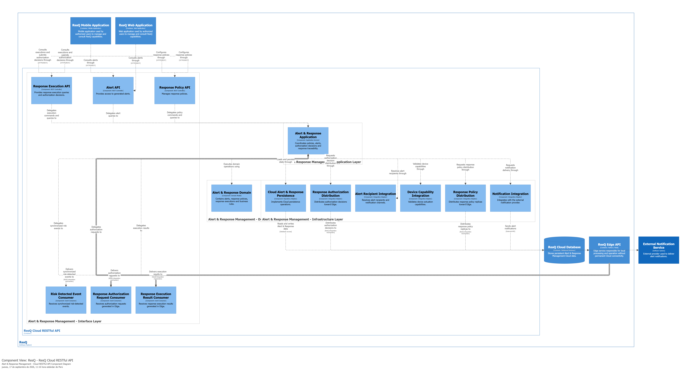

##### Alert & Response Management — ResQ Edge Service Component Diagram

El Edge Component Diagram representa los componentes responsables de la evaluación y ejecución local de respuestas dentro de ResQ Edge Service.

Los principales componentes son:

- Local Risk Detected Consumer, responsable de recibir detecciones de riesgo generadas por el flujo local de Risk Detection.

- Response Policy Replica Consumer, responsable de recibir las réplicas actuales de políticas de respuesta distribuidas desde Cloud.

- Response Authorization Decision Consumer, responsable de recibir las decisiones de autorización humana distribuidas desde Cloud.

- Edge Alert & Response Application, responsable de coordinar la evaluación, autorización y ejecución local de respuestas.

- Alert & Response Domain, que contiene las reglas de negocio de políticas de respuesta y ejecuciones de respuesta requeridas localmente.

- Edge Response Policy Persistence, responsable de almacenar réplicas locales de políticas de respuesta utilizando Peewee y SQLite.

- Edge Response Execution Persistence, responsable de almacenar las ejecuciones de respuesta originadas localmente y su estado.

- Actuator Integration, responsable de solicitar operaciones locales autorizadas de actuadores.

- Alert & Response Event Publisher, responsable de publicar solicitudes de autorización y resultados de ejecución hacia el flujo distribuido de ResQ.

El flujo principal de ejecución local es:

```text
Local Risk Detection
          |
          v
Local Risk Detected Consumer
          |
          v
Edge Alert & Response Application
          |
          v
Alert & Response Domain
      /             \
     v               v
Edge Persistence   Actuator Integration
     |
     v
Alert & Response Event Publisher
     |
     v
Distributed ResQ Flow
```

El flujo de actualización de políticas en Edge es:

```text
Cloud Policy Distribution
          |
          v
Response Policy Replica Consumer
          |
          v
Edge Alert & Response Application
          |
          v
Edge Response Policy Persistence
```

El flujo de decisiones de autorización es:

```text
Cloud Authorization Decision
          |
          v
Response Authorization Decision Consumer
          |
          v
Edge Alert & Response Application
          |
          v
Response Execution
      /           \
     v             v
 APPROVED       REJECTED
     |             |
     v             v
Actuator        Final State
Execution
```

Cuando Local Risk Detected Consumer recibe un riesgo detectado localmente, la Application Layer recupera las políticas de respuesta activas correspondientes a la organización y al tipo de riesgo.

Para las acciones configuradas con `AUTOMATIC`, Edge puede continuar con la ejecución local del actuador sin una autorización humana adicional.

Para las acciones configuradas con `HUMAN_REQUIRED`, la `ResponseExecution` correspondiente permanece en `PENDING_AUTHORIZATION` y se publica una solicitud de autorización hacia Cloud.

Cuando se recibe una decisión `APPROVED`, la ejecución continúa localmente. Una decisión `REJECTED` finaliza la ejecución sin emitir un comando al actuador.

Las réplicas de políticas de respuesta y el estado de ejecución local se persisten utilizando Peewee y SQLite para mantener el estado requerido para la operación local.

Los mecanismos de transporte, reintentos y sincronización utilizados entre Cloud y Edge siguen siendo responsabilidad del Bounded Context Connectivity.

**DIAGRAMA — Alert & Response Management Edge Component Level Diagram**

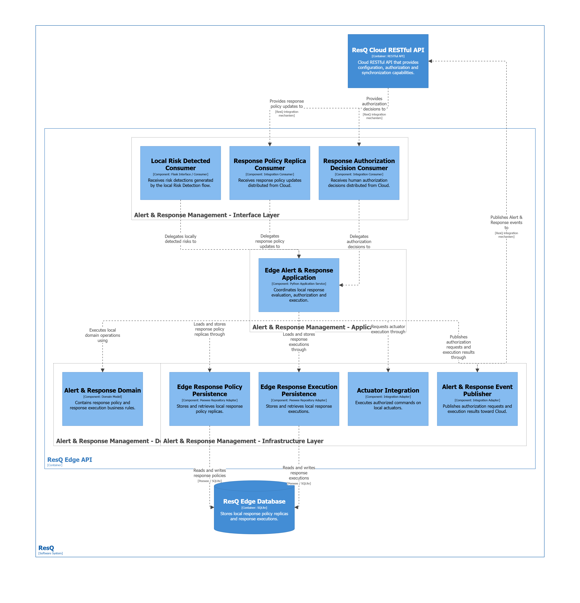

#### 4.2.3.6. Bounded Context Software Architecture Code Level Diagrams

Los Code Level Diagrams proporcionan una representación más detallada de la estructura orientada a la implementación del Bounded Context Alert & Response Management.

Para Alert & Response Management, el Code Level se representa mediante:

- Domain Layer Class Diagram, que describe el modelo de dominio orientado a objetos, incluidos Aggregate Roots, Entities, Value Objects, enumeraciones, Domain Services, interfaces de Repository, atributos, métodos, visibilidad, relaciones y multiplicidades.

- Database Design Diagram, que describe las estructuras de persistencia relacional requeridas por las partes Cloud y Edge del Bounded Context.

Los diagramas deben mantener la consistencia con el diseño de cuatro capas descrito anteriormente.

##### 4.2.3.6.1. Bounded Context Domain Layer Class Diagrams

El Domain Layer Class Diagram representa la estructura orientada a la implementación del modelo de dominio de Alert & Response Management.

El diagrama debe incluir los siguientes elementos.

**Aggregate Roots**

- `Alert`
- `ResponsePolicy`
- `ResponseExecution`

**Entities**

- `NotificationDelivery`
- `ResponseAction`
- `ResponseAuthorization`

**Value Objects**

- `AlertContext`
- `ResponseActionSnapshot`
- `ExecutionResult`

**Enumeraciones**

- `ResponsePolicyStatus`
- `AuthorizationMode`
- `AuthorizationDecision`
- `ResponseExecutionStatus`
- `NotificationDeliveryStatus`

**Repository Interfaces**

- `AlertRepository`
- `ResponsePolicyRepository`
- `ResponseExecutionRepository`

**Domain Service**

- `ResponsePolicySelectionService`

Las principales relaciones que deben representarse son:

- `Alert` compone exactamente un `AlertContext`.

- `Alert` posee cero o más entidades `NotificationDelivery`.

- `NotificationDelivery` utiliza exactamente un `NotificationDeliveryStatus`.

- `ResponsePolicy` posee cero o más entidades `ResponseAction` mientras se encuentra en configuración.

- `ResponsePolicy` utiliza exactamente un `ResponsePolicyStatus`.

- `ResponseAction` utiliza exactamente un `AuthorizationMode`.

- `ResponseExecution` compone exactamente un `ResponseActionSnapshot`.

- `ResponseExecution` puede poseer cero o una `ResponseAuthorization`.

- `ResponseExecution` puede componer cero o un `ExecutionResult`.

- `ResponseExecution` utiliza exactamente un `ResponseExecutionStatus`.

- `ResponseActionSnapshot` utiliza exactamente un `AuthorizationMode`.

- `ResponseAuthorization` utiliza exactamente una `AuthorizationDecision`.

- `AlertRepository` persiste y recupera `Alert`.

- `ResponsePolicyRepository` persiste y recupera `ResponsePolicy`.

- `ResponseExecutionRepository` persiste y recupera `ResponseExecution`.

- `ResponsePolicySelectionService` evalúa `ResponsePolicy` y sus elementos `ResponseAction`.

El diagrama debe mostrar las convenciones de visibilidad UML:

- `+` para miembros públicos;

- `-` para miembros privados;

- `#` para miembros protegidos cuando corresponda.

Una referencia conceptual de multiplicidad es:

```text
Alert "1" *-- "1" AlertContext

Alert "1" *-- "0..*" NotificationDelivery

NotificationDelivery --> NotificationDeliveryStatus


ResponsePolicy "1" *-- "0..*" ResponseAction

ResponsePolicy --> ResponsePolicyStatus

ResponseAction --> AuthorizationMode


ResponseExecution "1" *-- "1" ResponseActionSnapshot

ResponseExecution "1" *-- "0..1" ResponseAuthorization

ResponseExecution "1" *-- "0..1" ExecutionResult

ResponseExecution --> ResponseExecutionStatus

ResponseActionSnapshot --> AuthorizationMode

ResponseAuthorization --> AuthorizationDecision


AlertRepository ..> Alert : persists

ResponsePolicyRepository ..> ResponsePolicy : persists

ResponseExecutionRepository ..> ResponseExecution : persists


ResponsePolicySelectionService ..> ResponsePolicy : evaluates

ResponsePolicySelectionService ..> ResponseAction : selects
```

Una `ResponsePolicy` puede contener cero o más entidades `ResponseAction` mientras se encuentra en configuración. Sin embargo, debe contener al menos una acción válida antes de poder activarse.

`ResponseActionSnapshot` preserva la acción exacta utilizada al crear una `ResponseExecution` para que las modificaciones posteriores de la `ResponsePolicy` correspondiente no alteren la información histórica de ejecución.

Los siguientes conceptos no deben aparecer como clases de dominio propias dentro de Alert & Response Management:

- `RiskDetection`
- `Device`
- `Building`
- `Zone`
- `User`
- `Incident`
- `Actuator`
- Colas o estructuras de sincronización de Connectivity

Sus identificadores pueden aparecer como referencias externas cuando el proceso de alerta y respuesta los requiera.

Las principales referencias externas incluyen:

- `riskDetectionId`
- `targetDeviceId`
- `buildingId`
- `zoneId`
- `recipientUserId`
- `decidedByUserId`

Estos identificadores no transfieren la propiedad de los agregados referenciados a Alert & Response Management.

**DIAGRAMA — Alert & Response Management Domain Layer Class Diagram**

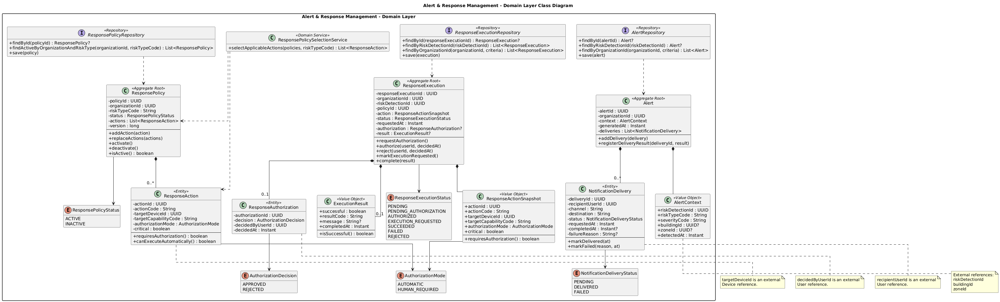

##### 4.2.3.6.2. Bounded Context Database Design Diagram

El Database Design de Alert & Response Management representa la persistencia requerida por el Bounded Context en los entornos de ejecución Cloud y Edge.

La persistencia Cloud almacena las definiciones autoritativas de políticas de respuesta, las alertas generadas, el historial de entrega de notificaciones, las ejecuciones de respuesta, las decisiones de autorización humana y los resultados de ejecución.

La persistencia Edge almacena las réplicas locales de políticas de respuesta y el estado de ejecución de respuestas requerido para la operación local.

El modelo de persistencia evita deliberadamente crear dependencias de claves foráneas hacia tablas pertenecientes a otros Bounded Contexts.

###### Persistencia Cloud

###### `response_policies`

Almacena la configuración autoritativa de políticas de respuesta.

| Columna | Tipo | Restricción | Descripción |
|---|---|---|---|
| `policy_id` | UUID | PRIMARY KEY | Identificador único de la política de respuesta. |
| `organization_id` | UUID | NOT NULL | Organización a la que pertenece la política. |
| `risk_type_code` | VARCHAR(100) | NOT NULL | Tipo de riesgo al que se aplica la política. |
| `status` | VARCHAR(20) | NOT NULL | Estado actual de la política (`ACTIVE` o `INACTIVE`). |
| `version` | BIGINT | NOT NULL | Versión utilizada para ordenar las actualizaciones distribuidas hacia Edge. |
| `created_at` | TIMESTAMP | NOT NULL | Momento en el que se creó la política. |
| `updated_at` | TIMESTAMP | NOT NULL | Momento en el que se modificó la política por última vez. |

Una política de respuesta puede contener cero o más acciones mientras se encuentra en configuración, pero debe contener al menos una acción válida antes de activarse.

###### `response_actions`

Almacena las acciones de respuesta pertenecientes a cada política.

| Columna | Tipo | Restricción | Descripción |
|---|---|---|---|
| `action_id` | UUID | PRIMARY KEY | Identificador único de la acción de respuesta. |
| `policy_id` | UUID | NOT NULL, FOREIGN KEY | Referencia `response_policies.policy_id`. |
| `action_code` | VARCHAR(100) | NOT NULL | Código que identifica la acción. |
| `target_device_id` | UUID | NOT NULL | Identificador externo del dispositivo objetivo. |
| `target_capability_code` | VARCHAR(100) | NOT NULL | Capacidad de actuación del dispositivo requerida por la acción. |
| `authorization_mode` | VARCHAR(30) | NOT NULL | Indica si la acción es `AUTOMATIC` o `HUMAN_REQUIRED`. |
| `critical` | BOOLEAN | NOT NULL | Indica si la acción participa en la operación crítica local. |

`target_device_id` es una referencia externa y, por lo tanto, no crea una relación directa de base de datos con la persistencia de Device Management.

###### `alerts`

Almacena las alertas generadas a partir de la información de detección de riesgos recibida por Alert & Response Management.

| Columna | Tipo | Restricción | Descripción |
|---|---|---|---|
| `alert_id` | UUID | PRIMARY KEY | Identificador único de la alerta. |
| `organization_id` | UUID | NOT NULL | Organización asociada con la alerta. |
| `risk_detection_id` | UUID | NOT NULL | Identificador externo de la detección de riesgo que originó la alerta. |
| `risk_type_code` | VARCHAR(100) | NOT NULL | Tipo de riesgo capturado cuando se generó la alerta. |
| `severity_code` | VARCHAR(50) | NOT NULL | Severidad capturada cuando se generó la alerta. |
| `detected_at` | TIMESTAMP | NOT NULL | Momento original de detección del riesgo. |
| `building_id` | UUID | NULL | Referencia externa a Building cuando está disponible. |
| `zone_id` | UUID | NULL | Referencia externa a Zone cuando está disponible. |
| `generated_at` | TIMESTAMP | NOT NULL | Momento en el que se generó la alerta. |

`AlertContext` es un Value Object y, por lo tanto, sus valores se integran en el registro de `alerts` en lugar de almacenarse en una tabla separada.

`risk_detection_id`, `building_id` y `zone_id` son referencias externas e intencionalmente no crean claves foráneas hacia la persistencia de Risk Detection o Building Management.

###### `notification_deliveries`

Almacena los intentos de entrega de notificaciones asociados con las alertas generadas.

| Columna | Tipo | Restricción | Descripción |
|---|---|---|---|
| `delivery_id` | UUID | PRIMARY KEY | Identificador único del intento de entrega. |
| `alert_id` | UUID | NOT NULL, FOREIGN KEY | Referencia `alerts.alert_id`. |
| `recipient_user_id` | UUID | NOT NULL | Identificador externo del usuario destinatario. |
| `channel` | VARCHAR(50) | NOT NULL | Canal de notificación utilizado para el intento. |
| `destination` | VARCHAR(255) | NOT NULL | Identificador de destino requerido por el canal seleccionado. |
| `status` | VARCHAR(20) | NOT NULL | Estado de entrega (`PENDING`, `DELIVERED` o `FAILED`). |
| `requested_at` | TIMESTAMP | NOT NULL | Momento en el que se solicitó la entrega. |
| `completed_at` | TIMESTAMP | NULL | Momento en el que finalizó el intento de entrega. |
| `failure_reason` | VARCHAR(255) | NULL | Información del fallo cuando no pudo completarse la entrega. |

`recipient_user_id` es una referencia externa y, por lo tanto, no crea una relación directa con la persistencia de User o IAM.

###### `response_executions`

Almacena las ejecuciones de respuesta producidas por el sistema y preserva la instantánea de la acción utilizada para cada ejecución.

| Columna | Tipo | Restricción | Descripción |
|---|---|---|---|
| `response_execution_id` | UUID | PRIMARY KEY | Identificador único de la ejecución de respuesta. |
| `organization_id` | UUID | NOT NULL | Organización asociada con la ejecución. |
| `risk_detection_id` | UUID | NOT NULL | Identificador externo de la detección de riesgo de origen. |
| `policy_id` | UUID | NOT NULL | Identificador de la política de respuesta utilizada cuando se creó la ejecución. |
| `action_id` | UUID | NOT NULL | Identificador de la acción representada por la instantánea. |
| `action_code` | VARCHAR(100) | NOT NULL | Código de acción preservado en la instantánea de ejecución. |
| `target_device_id` | UUID | NOT NULL | Identificador externo del dispositivo objetivo. |
| `target_capability_code` | VARCHAR(100) | NOT NULL | Capacidad utilizada durante la ejecución. |
| `authorization_mode` | VARCHAR(30) | NOT NULL | Modo de autorización capturado cuando se creó la ejecución. |
| `critical` | BOOLEAN | NOT NULL | Indicador de operación crítica capturado en la instantánea de la acción. |
| `status` | VARCHAR(40) | NOT NULL | Estado actual de la ejecución de respuesta. |
| `requested_at` | TIMESTAMP | NOT NULL | Momento en el que se creó la ejecución. |
| `successful` | BOOLEAN | NULL | Indica si la ejecución finalizó satisfactoriamente. |
| `result_code` | VARCHAR(100) | NULL | Código que identifica el resultado final de ejecución. |
| `result_message` | VARCHAR(255) | NULL | Información adicional sobre el resultado. |
| `completed_at` | TIMESTAMP | NULL | Momento en el que la ejecución alcanzó un resultado final. |

Los campos relacionados con la acción almacenados en esta tabla representan el `ResponseActionSnapshot`.

`ExecutionResult` es un Value Object y, por lo tanto, sus valores se integran en el registro de `response_executions` en lugar de almacenarse en una tabla independiente.

Los campos `successful`, `result_code`, `result_message` y `completed_at` admiten valores nulos mientras la ejecución no haya alcanzado un resultado final.

`risk_detection_id` y `target_device_id` son referencias externas.

###### `response_authorizations`

Almacena las decisiones de autorización humana asociadas con las ejecuciones de respuesta.

| Columna | Tipo | Restricción | Descripción |
|---|---|---|---|
| `authorization_id` | UUID | PRIMARY KEY | Identificador único de la decisión de autorización. |
| `response_execution_id` | UUID | NOT NULL, FOREIGN KEY | Referencia `response_executions.response_execution_id`. |
| `decision` | VARCHAR(20) | NOT NULL | Decisión de autorización (`APPROVED` o `REJECTED`). |
| `decided_by_user_id` | UUID | NOT NULL | Identificador externo del usuario que tomó la decisión. |
| `decided_at` | TIMESTAMP | NOT NULL | Momento en el que se registró la decisión. |

Una `ResponseExecution` puede tener cero o una `ResponseAuthorization` asociada.

`decided_by_user_id` es una referencia externa y, por lo tanto, no crea una relación directa de base de datos con la persistencia de User o IAM.

###### Persistencia Edge

###### `edge_response_policies`

Almacena las réplicas de políticas de respuesta requeridas para la evaluación local en la base de datos SQLite de Edge.

| Columna | Tipo | Restricción | Descripción |
|---|---|---|---|
| `policy_id` | UUID | PRIMARY KEY | Identificador de la política de respuesta de Cloud representada localmente. |
| `organization_id` | UUID | NOT NULL | Organización a la que pertenece la política. |
| `risk_type_code` | VARCHAR(100) | NOT NULL | Tipo de riesgo al que se aplica la política. |
| `status` | VARCHAR(20) | NOT NULL | Estado actual de la política replicada. |
| `version` | BIGINT | NOT NULL | Versión utilizada para impedir que réplicas antiguas reemplacen a las más recientes. |
| `updated_at` | TIMESTAMP | NOT NULL | Momento en el que se actualizó la réplica local por última vez. |

Esta tabla no es una fuente independiente de propiedad de las políticas. Es la representación local de Edge de la configuración de políticas administrada en Cloud.

###### `edge_response_actions`

Almacena las acciones pertenecientes a las políticas de respuesta replicadas localmente.

| Columna | Tipo | Restricción | Descripción |
|---|---|---|---|
| `action_id` | UUID | PRIMARY KEY | Identificador de la acción de respuesta replicada. |
| `policy_id` | UUID | NOT NULL, FOREIGN KEY | Referencia `edge_response_policies.policy_id`. |
| `action_code` | VARCHAR(100) | NOT NULL | Código que identifica la acción. |
| `target_device_id` | UUID | NOT NULL | Identificador externo del dispositivo objetivo. |
| `target_capability_code` | VARCHAR(100) | NOT NULL | Capacidad de actuación requerida por la acción. |
| `authorization_mode` | VARCHAR(30) | NOT NULL | Indica si la acción es `AUTOMATIC` o `HUMAN_REQUIRED`. |
| `critical` | BOOLEAN | NOT NULL | Indica si la acción participa en la operación crítica local. |

###### `edge_response_executions`

Almacena las ejecuciones de respuesta creadas y procesadas localmente en Edge.

| Columna | Tipo | Restricción | Descripción |
|---|---|---|---|
| `response_execution_id` | UUID | PRIMARY KEY | Identificador único de la ejecución local de respuesta. |
| `organization_id` | UUID | NOT NULL | Organización asociada con la ejecución. |
| `risk_detection_id` | UUID | NOT NULL | Identificador externo de la detección de riesgo de origen. |
| `policy_id` | UUID | NOT NULL | Identificador de la política de respuesta utilizada para la ejecución. |
| `action_id` | UUID | NOT NULL | Identificador de la acción representada por la instantánea. |
| `action_code` | VARCHAR(100) | NOT NULL | Código de acción preservado en la instantánea. |
| `target_device_id` | UUID | NOT NULL | Identificador externo del dispositivo objetivo. |
| `target_capability_code` | VARCHAR(100) | NOT NULL | Capacidad utilizada por la respuesta. |
| `authorization_mode` | VARCHAR(30) | NOT NULL | Modo de autorización capturado para la ejecución. |
| `critical` | BOOLEAN | NOT NULL | Indicador de operación crítica. |
| `status` | VARCHAR(40) | NOT NULL | Estado actual de la ejecución local de respuesta. |
| `requested_at` | TIMESTAMP | NOT NULL | Momento en el que se creó la ejecución. |
| `successful` | BOOLEAN | NULL | Indica si la ejecución finalizó satisfactoriamente. |
| `result_code` | VARCHAR(100) | NULL | Código de resultado final cuando está disponible. |
| `result_message` | VARCHAR(255) | NULL | Información adicional del resultado. |
| `completed_at` | TIMESTAMP | NULL | Momento en el que la ejecución alcanzó un resultado final. |

Una ejecución creada localmente puede permanecer en `PENDING_AUTHORIZATION` mientras espera una decisión de autorización desde Cloud.

###### `edge_response_authorizations`

Almacena las decisiones de autorización recibidas desde Cloud para las ejecuciones de respuesta originadas localmente.

| Columna | Tipo | Restricción | Descripción |
|---|---|---|---|
| `authorization_id` | UUID | PRIMARY KEY | Identificador de la decisión de autorización. |
| `response_execution_id` | UUID | NOT NULL, FOREIGN KEY | Referencia `edge_response_executions.response_execution_id`. |
| `decision` | VARCHAR(20) | NOT NULL | Decisión de autorización (`APPROVED` o `REJECTED`). |
| `decided_by_user_id` | UUID | NOT NULL | Identificador externo del usuario que tomó la decisión. |
| `decided_at` | TIMESTAMP | NOT NULL | Momento en el que se registró la decisión. |

La implementación de persistencia Edge debe utilizar SQLite con Peewee ORM, de acuerdo con la tecnología de Edge Services requerida por el enunciado del proyecto.

Conceptualmente, las principales relaciones de persistencia son:

```text
Cloud Persistence

response_policies
        |
        | 1
        |
        | 0..*
        v
response_actions


alerts
        |
        | 1
        |
        | 0..*
        v
notification_deliveries


response_executions
        |
        | 1
        |
        | 0..1
        v
response_authorizations


Edge SQLite

edge_response_policies
        |
        | 1
        |
        | 0..*
        v
edge_response_actions


edge_response_executions
        |
        | 1
        |
        | 0..1
        v
edge_response_authorizations
```

El Database Design Diagram final debe distinguir claramente:

- Persistencia Cloud
  - `response_policies`
  - `response_actions`
  - `alerts`
  - `notification_deliveries`
  - `response_executions`
  - `response_authorizations`

- Edge SQLite
  - `edge_response_policies`
  - `edge_response_actions`
  - `edge_response_executions`
  - `edge_response_authorizations`

El diagrama debe identificar:

- todas las tablas;

- todas las columnas;

- las claves primarias;

- las claves foráneas internas del Bounded Context;

- los campos que admiten valores nulos;

- las cardinalidades;

- los límites de persistencia de Cloud y Edge;

- las referencias externas que intencionalmente no crean claves foráneas hacia otros Bounded Contexts.

No debe introducirse ninguna tabla de base de datos para `RiskDetection`, `Device`, `Building`, `Zone`, `User`, `Incident`, `Actuator` o eventos pendientes de Connectivity dentro de los límites de persistencia de Alert & Response Management.

Las colas de mensajes, los reintentos, el almacenamiento de eventos pendientes y los mecanismos de sincronización permanecen fuera de este modelo de persistencia porque pertenecen al Bounded Context Connectivity.

**DIAGRAMA — Alert & Response Management Database Design Diagram**

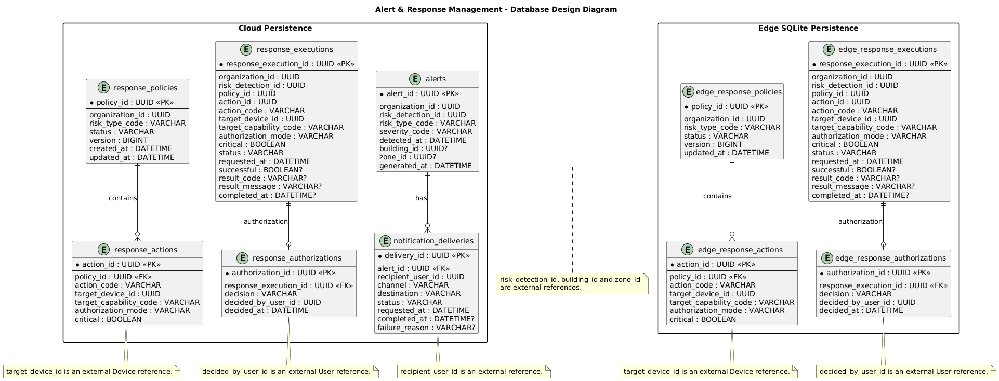

### 4.2.4. Bounded Context: Building Management

#### 4.2.4.1. Domain Layer

**Aggregates**

`Building`

Raíz del aggregate que representa una edificación de una organización. Mantiene su identificación, dirección, estado administrativo y zonas. Todas las modificaciones de una zona se realizan a través de Building.

| Atributo | Tipo de dato | Visibilidad | Descripción |
|---|---|---|---|
| id | Guid | Private | Identificador interno e inmutable de la edificación. |
| organizationId | Guid | Private | Organización a la que pertenece la edificación. |
| buildingCode | BuildingCode | Private | Código único dentro de la organización. |
| name | string | Private | Nombre de la edificación, entre 1 y 120 caracteres. |
| description | string? | Private | Descripción opcional de hasta 500 caracteres. |
| address | BuildingAddress | Private | Dirección física de la edificación. |
| administrativeStatus | LocationAdministrativeStatus | Private | Estado administrativo ACTIVE o INACTIVE. |
| zones | List\<Zone\> | Private | Zonas de la edificación; puede estar vacía al registrarse. |
| createdAt | DateTimeOffset | Private | Fecha y hora UTC de registro. |
| updatedAt | DateTimeOffset | Private | Fecha y hora UTC de la última modificación del agregado. |
| version | long | Private | Versión del agregado, incluidos los cambios en sus zonas. |

| Método | Tipo de retorno | Descripción |
|---|---|---|
| Register(...) | Building | Registra una edificación activa, inicialmente sin zonas. |
| UpdateDetails(name, description, address) | void | Actualiza los datos descriptivos y la dirección. |
| ChangeAdministrativeStatus(status) | void | Activa o desactiva administrativamente la edificación. |
| AddZone(zoneCode, name, description, floorLabel) | Zone | Agrega una zona activa a una edificación activa y verifica que su código no se repita. |
| UpdateZone(zoneId, name, description, floorLabel) | void | Modifica los datos de una zona perteneciente a la edificación. |
| ChangeZoneAdministrativeStatus(zoneId, status) | void | Cambia el estado de una zona; su activación exige una edificación activa. |
| IsAvailableForAssignment(zoneId?) | bool | Comprueba si la edificación y, cuando se indica, la zona están disponibles para asignar dispositivos. |

**Entities**

`Zone`

**Descripción:** Área física de una edificación, como una cocina, un almacén o una sala técnica. Tiene identidad propia y pertenece a un único Building. No contiene dispositivos, mediciones ni reglas de detección.

| Atributo | Tipo de dato | Visibilidad | Descripción |
|---|---|---|---|
| id | Guid | Private | Identificador interno e inmutable de la zona. |
| zoneCode | ZoneCode | Private | Código único dentro de la edificación. |
| name | string | Private | Nombre de la zona, entre 1 y 120 caracteres. |
| description | string? | Private | Descripción opcional de hasta 500 caracteres. |
| floorLabel | string? | Private | Referencia opcional del nivel, hasta 50 caracteres; por ejemplo, Piso 2 o Sótano 1. |
| administrativeStatus | LocationAdministrativeStatus | Private | Estado administrativo propio de la zona. |
| createdAt | DateTimeOffset | Private | Fecha y hora UTC de creación. |
| updatedAt | DateTimeOffset | Private | Fecha y hora UTC de su última modificación. |

El nivel es un dato descriptivo; esta propuesta no incorpora un agregado Floor ni una jerarquía de zonas. Zone no tiene repositorio independiente ni cambia de edificación. Si el área física se reemplaza, se registra otra zona y se desactiva la anterior para conservar sus referencias.

**Value Objects**

| Value Object (`record`) | Atributos | Validación y significado |
|---|---|---|
| BuildingCode | value: string | Entre 1 y 64 caracteres; letras ASCII, números, guion y guion bajo. Se eliminan espacios exteriores y se convierte a mayúsculas. |
| ZoneCode | value: string | Aplica la misma normalización que BuildingCode; su unicidad se limita a la edificación. |
| BuildingAddress | streetAddress: string, district: string, city: string, countryCode: string | Dirección de hasta 200 caracteres; distrito y ciudad de hasta 100; código de país de dos letras mayúsculas, por ejemplo PE. Todos los campos son obligatorios. |

Los identificadores rechazan `Guid.Empty`. Los códigos, la organización y la pertenencia de una zona son inmutables. Las propiedades públicas de records en C# utilizan PascalCase; los campos de los contratos JSON se presentan en camelCase.

**Enumerations**

| Enumeración | Valores | Significado |
|---|---|---|
| LocationAdministrativeStatus | ACTIVE, INACTIVE | Ubicación habilitada o deshabilitada administrativamente para nuevas asignaciones. |

Desactivar una edificación impide nuevas asignaciones tanto a ella como a sus zonas, pero conserva el estado propio de cada zona. Al reactivarla, solo quedan disponibles las zonas que conservan ACTIVE. No se eliminan asociaciones existentes ni se confirma ninguna acción sobre equipos físicos. Estos estados y las reglas de normalización son decisiones de diseño propuestas para desarrollar US21 y US22; no se presentan como requisitos explícitos de sus criterios de aceptación.

**Commands**

`organizationId` procede del contexto autorizado. `expectedVersion` corresponde siempre a la versión de Building, incluso al modificar una zona.

| Command (`record`) | Datos |
|---|---|
| RegisterBuildingCommand | organizationId, buildingCode, name, description?, address |
| UpdateBuildingDetailsCommand | organizationId, buildingId, name, description?, address, expectedVersion |
| ChangeBuildingAdministrativeStatusCommand | organizationId, buildingId, administrativeStatus, expectedVersion |
| AddZoneToBuildingCommand | organizationId, buildingId, zoneCode, name, description?, floorLabel?, expectedVersion |
| UpdateZoneCommand | organizationId, buildingId, zoneId, name, description?, floorLabel?, expectedVersion |
| ChangeZoneAdministrativeStatusCommand | organizationId, buildingId, zoneId, administrativeStatus, expectedVersion |

**Queries**

| Query (`record`) | Datos | Resultado |
|---|---|---|
| GetBuildingByIdQuery | organizationId, buildingId | Building? |
| GetBuildingsQuery | organizationId, administrativeStatus?, page, size | PagedResult\<Building\> |
| GetZonesByBuildingIdQuery | organizationId, buildingId, administrativeStatus?, page, size | PagedResult\<Zone\> |
| GetZoneByIdQuery | organizationId, buildingId, zoneId | Zone? |

**Services**

| Interfaz | Método | Tipo de retorno |
|---|---|---|
| IBuildingCommandService | Handle(RegisterBuildingCommand) | Building |
| IBuildingCommandService | Handle(UpdateBuildingDetailsCommand) | Building |
| IBuildingCommandService | Handle(ChangeBuildingAdministrativeStatusCommand) | Building |
| IBuildingCommandService | Handle(AddZoneToBuildingCommand) | Building |
| IBuildingCommandService | Handle(UpdateZoneCommand) | Building |
| IBuildingCommandService | Handle(ChangeZoneAdministrativeStatusCommand) | Building |
| IBuildingQueryService | Handle(GetBuildingByIdQuery) | Building? |
| IBuildingQueryService | Handle(GetBuildingsQuery) | PagedResult\<Building\> |
| IBuildingQueryService | Handle(GetZonesByBuildingIdQuery) | PagedResult\<Zone\> |
| IBuildingQueryService | Handle(GetZoneByIdQuery) | Zone? |

`IBuildingRepository` declara el contrato de persistencia del agregado. `BuildingReadScope` representa las edificaciones y zonas visibles para el solicitante; `BuildingFilters` y `ZoneFilters` contienen los filtros de consulta. Estos contratos no dependen del framework web ni de clases internas de IAM. `PagedResult<T>` contiene Items, Page, Size, TotalElements y TotalPages.

**Domain Events**

| Evento | Se produce cuando |
|---|---|
| BuildingRegistered | Se registra una edificación. |
| BuildingDetailsUpdated | Cambian sus datos descriptivos o dirección. |
| BuildingAdministrativeStatusChanged | Cambia el estado administrativo de la edificación. |
| ZoneAddedToBuilding | Se agrega una zona. |
| ZoneDetailsUpdated | Cambian los datos descriptivos de una zona. |
| ZoneAdministrativeStatusChanged | Cambia el estado administrativo de una zona. |

Cada cambio efectivo incrementa una vez la versión de Building y genera un evento. Repetir valores existentes no produce un cambio adicional. El mensaje de integración contiene eventId, eventType, schemaVersion, organizationId, buildingId, aggregateVersion, occurredAt y una instantánea de la edificación con sus zonas. Los cambios de zona incluyen además affectedZoneId. La aplicación conserva el mensaje mediante una outbox para informar a los consumidores sin compartir tablas.

#### 4.2.4.2. Interface Layer

**REST Controllers**

`BuildingsController`

**Descripción:** Expone el registro y consulta de edificaciones y zonas. Construye comandos y consultas, aplica el contrato HTTP y transforma los resultados en recursos. Las rutas anidadas expresan que cada zona pertenece a una edificación.

| Método | Ruta | Descripción | Respuesta exitosa |
|---|---|---|---|
| RegisterBuilding() | POST /api/v1/buildings | Registra una edificación. | 201, BuildingResource, Location y ETag |
| GetBuildings() | GET /api/v1/buildings | Lista edificaciones; admite administrativeStatus, page y size. | 200, BuildingPageResource |
| GetBuildingById() | GET /api/v1/buildings/{buildingId} | Consulta una edificación y sus zonas visibles. | 200, BuildingResource y ETag |
| UpdateBuildingDetails() | PUT /api/v1/buildings/{buildingId}/details | Actualiza nombre, descripción y dirección. | 200, BuildingResource y ETag |
| ChangeBuildingAdministrativeStatus() | PUT /api/v1/buildings/{buildingId}/administrative-status | Activa o desactiva la edificación. | 200, BuildingResource y ETag |
| AddZoneToBuilding() | POST /api/v1/buildings/{buildingId}/zones | Agrega una zona a la edificación. | 201, BuildingResource, Location de la zona y ETag |
| GetZonesByBuildingId() | GET /api/v1/buildings/{buildingId}/zones | Lista zonas; admite administrativeStatus, page y size. | 200, ZonePageResource |
| GetZoneById() | GET /api/v1/buildings/{buildingId}/zones/{zoneId} | Consulta una zona de la edificación indicada. | 200, ZoneResource |
| UpdateZone() | PUT /api/v1/buildings/{buildingId}/zones/{zoneId}/details | Actualiza los datos de una zona. | 200, BuildingResource y ETag |
| ChangeZoneAdministrativeStatus() | PUT /api/v1/buildings/{buildingId}/zones/{zoneId}/administrative-status | Activa o desactiva una zona. | 200, BuildingResource y ETag |

Los PUT y el POST de creación de una zona requieren `If-Match` con el ETag de Building, obtenido en GET /buildings/{buildingId}. Los comandos devuelven el agregado actualizado y su nuevo ETag; una zona no tiene versión independiente. La paginación comienza en cero, con tamaño predeterminado 20 y máximo 100, y utiliza un orden estable por createdAt e id. No se exponen operaciones DELETE.

**Resources**

| Resource (`record`) | Contenido |
|---|---|
| RegisterBuildingResource | buildingCode, name, description?, address |
| UpdateBuildingDetailsResource | name, description?, address |
| ChangeBuildingAdministrativeStatusResource | administrativeStatus |
| AddZoneToBuildingResource | zoneCode, name, description?, floorLabel? |
| UpdateZoneResource | name, description?, floorLabel? |
| ChangeZoneAdministrativeStatusResource | administrativeStatus |
| BuildingAddressResource | streetAddress, district, city, countryCode |
| BuildingResource | id, organizationId, buildingCode, name, description?, address, administrativeStatus, zones, createdAt, updatedAt, version |
| ZoneResource | id, buildingId, zoneCode, name, description?, floorLabel?, administrativeStatus, availableForAssignment, createdAt, updatedAt |
| BuildingPageResource | items: List\<BuildingResource\>, page, size, totalElements, totalPages |
| ZonePageResource | items: List\<ZoneResource\>, page, size, totalElements, totalPages |
| ErrorResource | code, message, fieldErrors?, traceId |

`availableForAssignment` se calcula con el estado de Building y Zone; no se almacena como columna. Los filtros de estado de zonas se refieren a su estado propio. Los recursos de entrada no aceptan organizationId, IDs generados, fechas ni versión como campos editables. Todas las salidas, incluidas las zonas anidadas y los totales, respetan el alcance autorizado.

**Assemblers**

| Assembler | Responsabilidad |
|---|---|
| RegisterBuildingCommandFromResourceAssembler | Construye RegisterBuildingCommand con el recurso y la organización autorizada. |
| UpdateBuildingDetailsCommandFromResourceAssembler | Construye UpdateBuildingDetailsCommand con el recurso, buildingId y versión esperada. |
| ChangeBuildingAdministrativeStatusCommandFromResourceAssembler | Construye ChangeBuildingAdministrativeStatusCommand. |
| AddZoneToBuildingCommandFromResourceAssembler | Construye AddZoneToBuildingCommand usando la versión de Building. |
| UpdateZoneCommandFromResourceAssembler | Construye UpdateZoneCommand con buildingId, zoneId y versión esperada. |
| ChangeZoneAdministrativeStatusCommandFromResourceAssembler | Construye ChangeZoneAdministrativeStatusCommand. |
| BuildingQueriesFromRequestAssembler | Convierte parámetros de ruta y consulta en las cuatro consultas del dominio. |
| BuildingResourceFromEntityAssembler | Convierte Building y las zonas visibles en BuildingResource. |
| ZoneResourceFromEntityAssembler | Convierte Zone y el estado de su Building en ZoneResource. |
| BuildingPageResourceFromPageAssembler | Construye BuildingPageResource. |
| ZonePageResourceFromPageAssembler | Construye ZonePageResource. |

**Contrato de errores**

| Código HTTP | Situación |
|---|---|
| 400 | Identificadores vacíos, campos, estados o paginación inválidos. |
| 401 | Identidad ausente o inválida. |
| 403 | Falta permiso para registrar o modificar la ubicación. |
| 404 | Edificación o zona no encontrada dentro del ámbito visible, incluida una zona que no pertenece a la edificación indicada. |
| 409 | Código duplicado; creación o activación de una zona en una edificación inactiva. |
| 412 | La versión de Building ya cambió. |
| 428 | Falta If-Match al modificar un agregado existente. |
| 503 | No puede completarse una validación de autorización obligatoria. |


**Fachada de integración**

`BuildingsContextFacade` expone `ValidateAssignment(organizationId, buildingId, zoneId?)` a contextos autorizados. Utiliza `IBuildingQueryService` para comprobar organización, existencia, pertenencia de la zona y disponibilidad administrativa. Devuelve `BuildingAssignmentValidation` con organizationId, buildingId, zoneId, buildingVersion y availableForAssignment; no entrega entidades persistentes. Una ubicación inexistente o no visible responde como no encontrada y una ubicación inactiva no se considera disponible. Device traduce la respuesta a su contrato local `ValidatedAssignment`. Esta fachada completa el componente ya representado en el diagrama.

#### 4.2.4.3. Application Layer

`BuildingCommandServiceImpl`

**Descripción:** Implementa IBuildingCommandService. Verifica permisos, carga el agregado, aplica sus reglas y persiste Building, sus zonas y el mensaje outbox en una transacción local.

| Método | Descripción |
|---|---|
| Handle(RegisterBuildingCommand) | Comprueba permiso de creación en la organización y código disponible; registra la edificación activa con versión 1. |
| Handle(UpdateBuildingDetailsCommand) | Verifica acceso y versión; actualiza nombre, descripción y dirección. |
| Handle(ChangeBuildingAdministrativeStatusCommand) | Cambia el estado de Building sin eliminar zonas ni modificar sus estados propios. |
| Handle(AddZoneToBuildingCommand) | Verifica acceso, versión y edificación activa; agrega una zona con código único dentro del agregado. |
| Handle(UpdateZoneCommand) | Comprueba que la zona pertenece al Building y es editable por el solicitante; actualiza sus datos descriptivos. |
| Handle(ChangeZoneAdministrativeStatusCommand) | Cambia el estado propio de la zona; exige Building activo para activarla. |

Toda modificación de Zone incrementa la versión de Building. Una escritura compara expectedVersion con la versión almacenada y revierte la transacción completa ante conflicto. Las restricciones únicas de MySQL también protegen frente a registros simultáneos. Una edificación o zona inactiva puede conservar y corregir sus datos descriptivos.

`BuildingQueryServiceImpl`

**Descripción:** Implementa IBuildingQueryService sin modificar datos. Aplica los filtros y el alcance de IAM antes de paginar o calcular los totales.

| Método | Descripción |
|---|---|
| Handle(GetBuildingByIdQuery) | Obtiene una edificación dentro de la organización y el alcance del solicitante. |
| Handle(GetBuildingsQuery) | Lista las edificaciones visibles por estado administrativo. |
| Handle(GetZonesByBuildingIdQuery) | Lista las zonas visibles de la edificación indicada. |
| Handle(GetZoneByIdQuery) | Obtiene una zona comprobando su edificación, organización y alcance autorizado. |

**Puertos de aplicación e integración**

| Puerto | Métodos principales | Responsabilidad |
|---|---|---|
| IBuildingAccessGateway | RequirePermission(action, organizationId, buildingId?, zoneId?); GetReadScope(organizationId): BuildingReadScope | Valida permisos de IAM para la organización y ubicación. La creación de una edificación exige permiso a nivel de organización. |
| IBuildingOutboxRepository | Append(message); FindPending(batchSize); MarkPublished(eventId); RecordFailure(eventId, nextAttemptAt) | Conserva los mensajes de integración y su estado de publicación. |
| IBuildingEventPublisher | Publish(message) | Entrega mensajes a los consumidores mediante el transporte configurado. |

`BuildingIntegrationEventMapper` construye el mensaje con la instantánea del agregado. `BuildingOutboxDispatcher` publica mensajes pendientes y reintenta los fallidos. Los consumidores deduplican por eventId y aplican únicamente versiones superiores a la conocida. Un fallo de publicación posterior al commit conserva el mensaje pendiente.

**Coordinación con Device Management**

Buildings conserva los identificadores de edificaciones y zonas, incluso cuando están inactivas. Esta entrega utiliza desactivación reversible; no incorpora retiro definitivo ni eliminación física. Devices consulta la fachada al registrar, reasignar o activar un equipo. Desactivar una ubicación bloquea futuras validaciones, pero no borra dispositivos ni altera mediciones o incidentes anteriores.

La validación describe la disponibilidad en el momento de la consulta. Si una asignación y una desactivación se ejecutan simultáneamente en servicios separados, la consulta por sí sola no garantiza atomicidad entre contextos. La integración deberá revalidar o reconciliar esa asignación ante cambios concurrentes; no se interpreta una respuesta válida como una reserva permanente. Las instantáneas históricas conservadas por Monitoring e Incident Management no se reescriben al renombrar una ubicación.

#### 4.2.4.4. Infrastructure Layer

**Persistencia del agregado**

`IBuildingRepository` / `RelationalBuildingRepository`

**Descripción:** IBuildingRepository define el contrato del dominio. RelationalBuildingRepository guarda el agregado y consulta sus zonas en MySQL. No se publica un repositorio de escritura independiente para Zone.

| Método del puerto | Tipo de retorno | Descripción |
|---|---|---|
| FindByIdAndOrganizationId(buildingId, organizationId) | Building? | Recupera Building con sus zonas dentro de una organización; la aplicación verifica además el alcance de acceso. |
| FindPage(organizationId, filters, readScope, page, size) | PagedResult\<Building\> | Consulta edificaciones visibles y aplica el filtro de estado. |
| FindZonesPage(organizationId, buildingId, filters, readScope, page, size) | PagedResult\<Zone\> | Consulta zonas mediante su relación con Building y aplica el alcance antes de paginar. |
| FindZoneById(organizationId, buildingId, zoneId) | Zone? | Busca una zona que pertenezca a la edificación y organización indicadas. |
| ExistsByOrganizationIdAndBuildingCode(organizationId, buildingCode) | bool | Detecta códigos de edificación repetidos. |
| Save(building, expectedVersion?) | Building | Inserta o actualiza Building y sus zonas de forma atómica, con control de versión. |

La unicidad del código de zona se verifica dentro del agregado y mediante UNIQUE(building_id, zone_code). Las consultas de zonas siempre se restringen por la organización del Building; no se acepta zoneId como prueba suficiente de acceso.

**Adaptadores**

| Componente | Puerto implementado | Descripción |
|---|---|---|
| IamBuildingAccessAdapter | IBuildingAccessGateway | Adapta los permisos y el alcance de IAM. |
| RelationalBuildingOutboxRepository | IBuildingOutboxRepository | Persiste mensajes en la misma transacción y base de datos del agregado. |
| BuildingEventPublisherAdapter | IBuildingEventPublisher | Publica mensajes mediante el transporte de integración elegido. |
| BuildingPersistenceMapper | No aplica | Convierte Building, Zone y sus value objects hacia y desde registros relacionales. |


#### 4.2.4.5. Bounded Context Software Architecture Component Level Diagrams

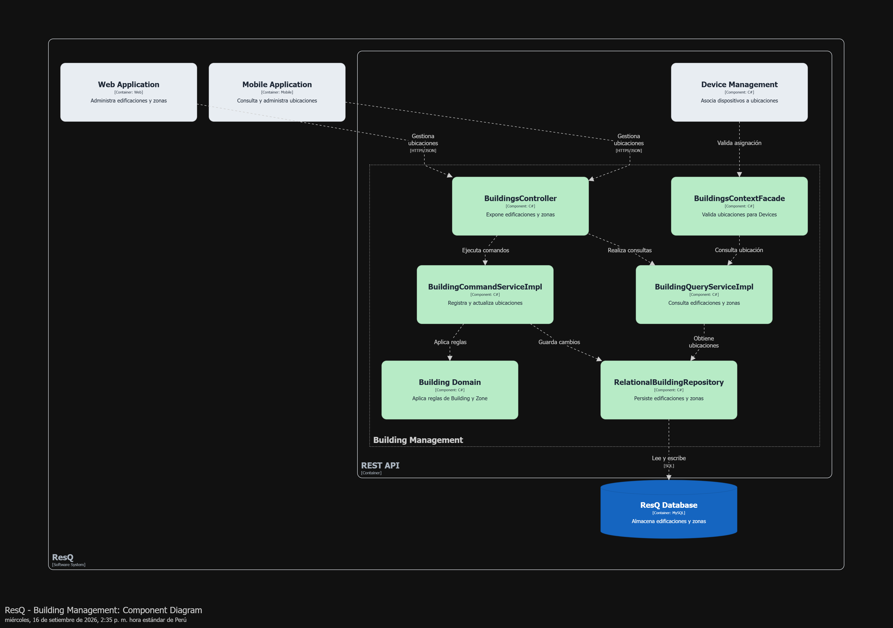

Web y Mobile son contenedores separados y consumen BuildingsController. Los servicios de aplicación coordinan reglas de Building y Zone y persistencia en MySQL. Device valida ubicaciones mediante BuildingsContextFacade. La vista muestra el flujo principal; los adaptadores de IAM y publicación outbox se detallan en las capas anteriores para mantener el diagrama simple.

#### 4.2.4.6. Bounded Context Software Architecture Code Level Diagrams

##### 4.2.4.6.1. Bounded Context Domain Layer Class Diagrams

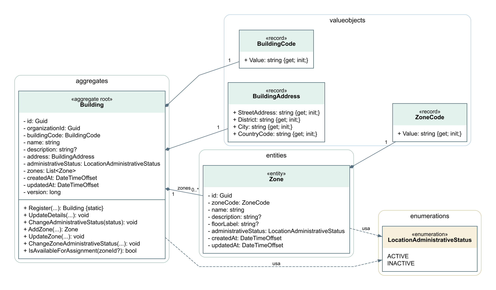
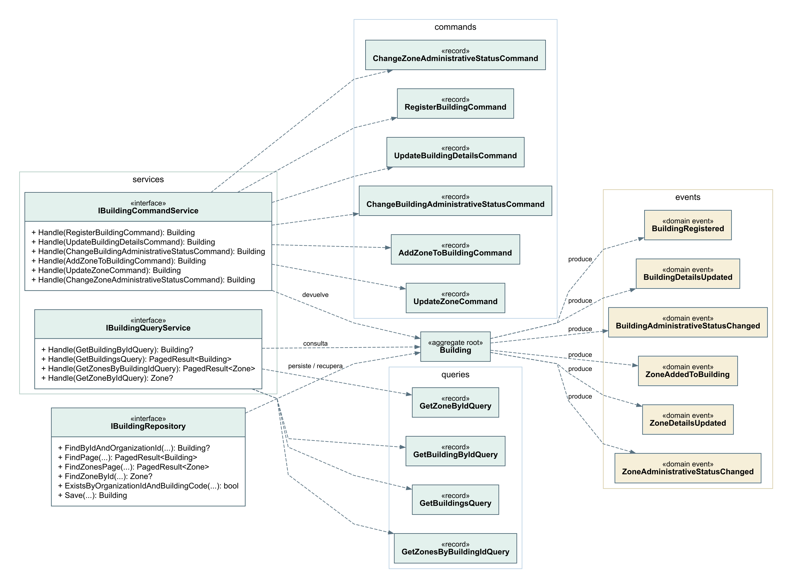

Building es la raíz y contiene cero o más zonas, cada una perteneciente a una única edificación. Los value objects encapsulan códigos y dirección; los contratos de comandos, consultas y repositorio operan sobre esa estructura. Renombrar una zona mantiene su identidad y referencias, en correspondencia con US22, AC2.

##### 4.2.4.6.2. Bounded Context Database Design Diagram

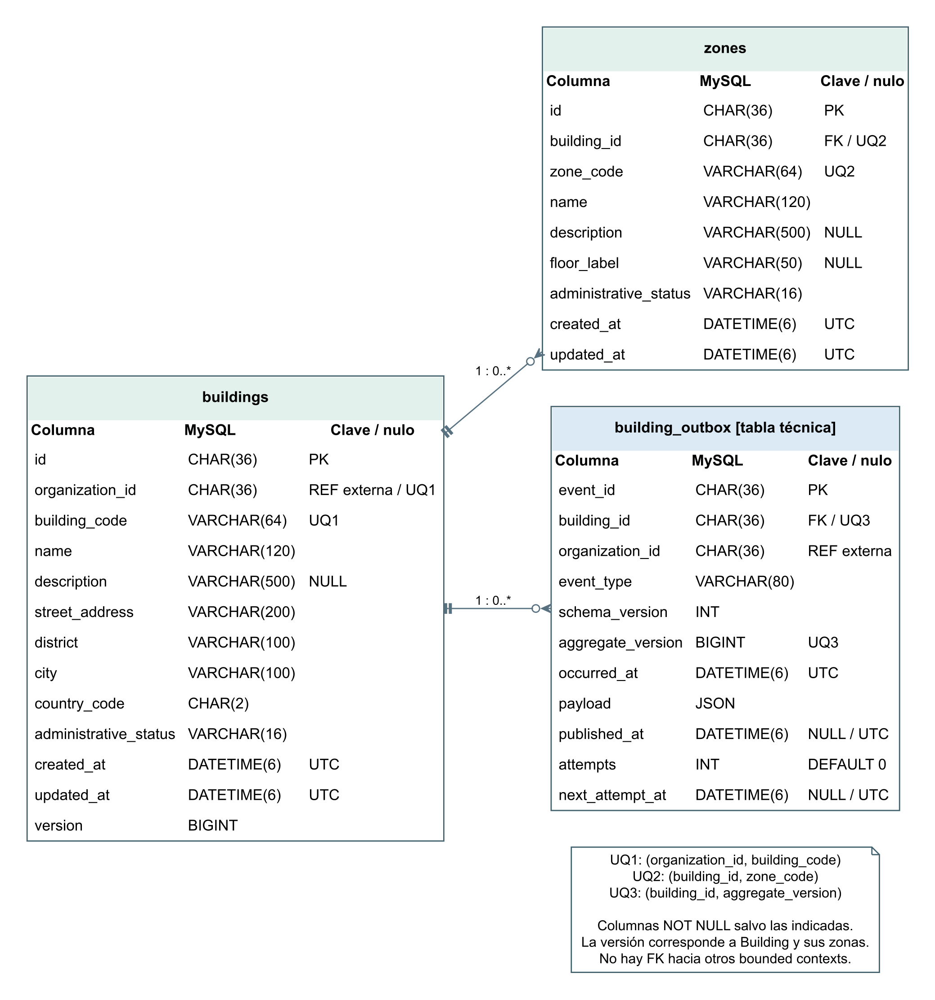

`zones.building_id` referencia a `buildings.id`. Los códigos son únicos por organización o edificación, respectivamente. `building_outbox` conserva los mensajes de integración en la misma transacción que el agregado; es una tabla técnica. `organization_id` es una referencia externa, sin FK hacia otro bounded context. La versión de Building también controla los cambios en sus zonas.

### 4.2.5. Bounded Context: Device Management

#### 4.2.5.1. Domain Layer

**Aggregates**

`Device`

Raíz del aggregate que representa un equipo IoT registrado en una organización. Controla sus características, capacidades y asignación física. Un mismo equipo puede medir varias variables y ejecutar acciones; por ello se utiliza una colección de capacidades en lugar de exigir que sea exclusivamente sensor o actuador.

| Atributo | Tipo de dato | Visibilidad | Descripción |
|---|---|---|---|
| id | Guid | Private | Identificador interno e inmutable del dispositivo. |
| organizationId | Guid | Private | Identificador de la organización propietaria del registro; no representa al usuario que lo creó. |
| deviceCode | DeviceCode | Private | Código estable y único dentro de la organización. |
| name | string | Private | Nombre visible del equipo; obligatorio, de 1 a 120 caracteres. |
| description | string? | Private | Descripción administrativa opcional, hasta 500 caracteres. |
| specifications | DeviceSpecifications | Private | Fabricante, modelo y número de serie, cuando se conocen. |
| assignment | DeviceAssignment | Private | Edificación obligatoria y zona opcional donde está instalado. |
| externalReference | ExternalDeviceReference? | Private | Correspondencia opcional con un equipo de un sistema externo. |
| administrativeStatus | DeviceAdministrativeStatus | Private | Estado administrativo del registro. |
| capabilities | List\<DeviceCapability\> | Private | Capacidades de medición y actuación que pertenecen al agregado. |
| createdAt | DateTimeOffset | Private | Fecha y hora UTC del registro. |
| updatedAt | DateTimeOffset | Private | Fecha y hora UTC de la última modificación. |
| version | long | Private | Versión para controlar modificaciones concurrentes y ordenar eventos. |

| Método | Tipo de retorno | Descripción |
|---|---|---|
| Register(...) | Device | Crea el agregado en estado `INACTIVE` con al menos una capacidad válida. |
| UpdateDetails(name, description, specifications) | void | Modifica datos descriptivos sin alterar la identidad del equipo. |
| ReplaceCapabilities(capabilityDefinitions) | void | Sustituye las capacidades de un dispositivo inactivo; conserva el ID de las capacidades cuyo código no cambia. |
| AssignTo(assignment) | void | Cambia la edificación o zona de un dispositivo inactivo, previa validación externa de la ubicación. |
| ChangeAdministrativeStatus(status) | void | Aplica una transición válida del ciclo de vida administrativo. |

**Entities**

`DeviceCapability`

**Descripción:** Capacidad individual de un dispositivo. Tiene identidad propia dentro del agregado y solo se modifica a través de `Device`; no tiene repositorio ni controlador independiente.

| Atributo | Tipo de dato | Visibilidad | Descripción |
|---|---|---|---|
| id | Guid | Private | Identificador de la capacidad. |
| code | string | Private | Código estable, de 1 a 80 caracteres, único dentro del dispositivo; por ejemplo, `ambient_temperature` o `close_valve`. |
| kind | CapabilityKind | Private | `MEASUREMENT` o `ACTUATION`. |
| unit | string? | Private | Unidad de una medición, hasta 30 caracteres; no aplica a capacidades de actuación. |

Las capacidades describen lo que el equipo puede hacer. No contienen valores medidos, reglas, parámetros de ejecución, resultados de acciones ni datos de conexión. Los ejemplos de códigos son ilustrativos; no constituyen un catálogo de hardware ya seleccionado.

**Value Objects**

| Value Object (`record`) | Atributos | Validación y significado |
|---|---|---|
| DeviceCode | value: string | Entre 1 y 64 caracteres; espacios exteriores eliminados y conversión a mayúsculas. Se propone admitir letras ASCII, números, guion y guion bajo. |
| DeviceSpecifications | manufacturer: string?, model: string?, serialNumber: string? | Metadatos opcionales de hasta 100 caracteres cada uno. El número de serie no sustituye al identificador interno ni se presume único entre fabricantes. |
| DeviceAssignment | buildingId: Guid, zoneId: Guid? | Siempre exige una edificación. Si existe zona, esta debe pertenecer a esa edificación y a la misma organización. La comprobación de existencia se coordina desde Application Layer. |
| ExternalDeviceReference | sourceSystem: string, externalDeviceId: string | Ambos valores son obligatorios si se proporciona la referencia, de hasta 80 y 120 caracteres. Identifican al equipo en una instancia de integración dentro de la organización. |
| CapabilityDefinition | code: string, kind: CapabilityKind, unit: string? | Entrada inmutable para crear o reemplazar capacidades; aplica las mismas reglas que `DeviceCapability`, sin aceptar su ID desde el cliente. |

`sourceSystem` identifica una **instancia** de integración, por ejemplo `bms-campus-norte`, y no solo el nombre del fabricante. Se normaliza a minúsculas y admite letras ASCII, números, guion y guion bajo; `externalDeviceId` conserva mayúsculas y minúsculas y se compara exactamente tras quitar espacios exteriores. La referencia externa y `deviceCode` son inmutables en esta propuesta; sustituir físicamente el equipo requiere registrar otro `Device` y retirar el anterior.

**Enumerations**

| Enumeración | Valores | Significado |
|---|---|---|
| DeviceAdministrativeStatus | INACTIVE, ACTIVE, RETIRED | Registrado y deshabilitado administrativamente; habilitado administrativamente; retirado de manera definitiva. |
| CapabilityKind | MEASUREMENT, ACTUATION | Capacidad para producir una medición o para recibir una acción. |

El ciclo administrativo propuesto admite INACTIVE → ACTIVE, ACTIVE → INACTIVE e INACTIVE → RETIRED. RETIRED es terminal; retirar un equipo activo exige desactivarlo primero. Estos estados no equivalen a conectado/desconectado ni al resultado de una prueba de integración. Las modificaciones de ubicación o capacidades solo se permiten en INACTIVE; un equipo retirado permanece consultable y no editable.

**Commands**

Los comandos representan intenciones de modificación. `organizationId` se obtiene del contexto autorizado del solicitante. `expectedVersion` se obtiene de `If-Match` para impedir que una edición sobrescriba cambios más recientes.

| Command (`record`) | Datos |
|---|---|
| RegisterDeviceCommand | organizationId, deviceCode, name, description?, specifications, assignment, externalReference?, capabilities: List\<CapabilityDefinition\> |
| UpdateDeviceDetailsCommand | organizationId, deviceId, name, description?, specifications, expectedVersion |
| ReplaceDeviceCapabilitiesCommand | organizationId, deviceId, capabilities: List\<CapabilityDefinition\>, expectedVersion |
| AssignDeviceToLocationCommand | organizationId, deviceId, buildingId, zoneId?, expectedVersion |
| ChangeDeviceAdministrativeStatusCommand | organizationId, deviceId, administrativeStatus, expectedVersion |

**Queries**

| Query (`record`) | Datos | Resultado |
|---|---|---|
| GetDeviceByIdQuery | organizationId, deviceId | Device? |
| GetDevicesQuery | organizationId, buildingId?, zoneId?, administrativeStatus?, page, size | PagedResult\<Device\> |
| GetDeviceByExternalReferenceQuery | organizationId, sourceSystem, externalDeviceId | Device? |

**Services**

| Interfaz | Métodos | Tipo de retorno |
|---|---|---|
| IDeviceCommandService | Handle(RegisterDeviceCommand) | Device |
| IDeviceCommandService | Handle(UpdateDeviceDetailsCommand) | Device |
| IDeviceCommandService | Handle(ReplaceDeviceCapabilitiesCommand) | Device |
| IDeviceCommandService | Handle(AssignDeviceToLocationCommand) | Device |
| IDeviceCommandService | Handle(ChangeDeviceAdministrativeStatusCommand) | Device |
| IDeviceQueryService | Handle(GetDeviceByIdQuery) | Device? |
| IDeviceQueryService | Handle(GetDevicesQuery) | PagedResult\<Device\> |
| IDeviceQueryService | Handle(GetDeviceByExternalReferenceQuery) | Device? |

`IDeviceRepository` es el puerto de persistencia del agregado, declarado en el dominio. Su implementación se describe en Infrastructure Layer. Los servicios anteriores son contratos; `DeviceCommandServiceImpl` y `DeviceQueryServiceImpl` son sus implementaciones de aplicación. La separación de comandos y consultas no exige bases de datos diferentes.

Los contratos auxiliares `DeviceReadScope` y `DeviceFilters` contienen identificadores de ubicaciones autorizadas y filtros de consulta, respectivamente; no dependen de clases de IAM, del framework web ni de la infraestructura. `PagedResult<T>` contiene `Items`, `Page`, `Size`, `TotalElements` y `TotalPages`. Las propiedades públicas de records en C# siguen PascalCase; los nombres camelCase de las tablas de entrada y salida corresponden a su representación JSON. Los identificadores obligatorios rechazan `Guid.Empty`.

**Domain Events**

| Evento | Se produce cuando |
|---|---|
| DeviceRegistered | Se registra un dispositivo. |
| DeviceDetailsUpdated | Cambian sus datos descriptivos. |
| DeviceCapabilitiesReplaced | Cambia su conjunto de capacidades. |
| DeviceAssignedToLocation | Cambia su asignación física. |
| DeviceAdministrativeStatusChanged | Se aplica una transición administrativa. |

Los eventos se producen únicamente ante cambios efectivos. La aplicación los convierte en mensajes de integración con `eventId`, `eventType`, `schemaVersion`, `organizationId`, `deviceId`, `aggregateVersion`, `occurredAt` y una instantánea del catálogo del dispositivo. El evento de asignación incluye también la asignación anterior. La instantánea contiene metadatos, capacidades, estado y asignación; no contiene mediciones ni credenciales. Permite que Monitoring y Alert & Response Management actualicen su referencia del equipo sin acceder a las tablas de Devices.

#### 4.2.5.2. Interface Layer

**REST Controllers**

`DevicesController`

**Descripción:** Recibe solicitudes autenticadas, valida su forma, construye comandos o consultas y transforma los resultados en recursos REST. Las reglas del agregado permanecen en Domain Layer y la coordinación de permisos, ubicación y persistencia se ejecuta en Application Layer.

| Método | Ruta | Descripción | Respuesta exitosa |
|---|---|---|---|
| RegisterDevice() | POST /api/v1/devices | Registra el equipo con sus capacidades y ubicación inicial. | 201, DeviceResource, Location y ETag |
| GetDevices() | GET /api/v1/devices | Lista los dispositivos visibles para el solicitante; admite buildingId, zoneId, administrativeStatus, page y size. | 200, DevicePageResource |
| GetDeviceById() | GET /api/v1/devices/{deviceId} | Consulta un dispositivo de la organización autorizada. | 200, DeviceResource y ETag |
| GetDeviceByExternalReference() | GET /api/v1/devices/by-external-reference?sourceSystem=...&externalDeviceId=... | Resuelve un identificador de una integración. | 200, DeviceResource y ETag |
| UpdateDeviceDetails() | PUT /api/v1/devices/{deviceId}/details | Sustituye sus datos descriptivos. | 200, DeviceResource y ETag |
| ReplaceDeviceCapabilities() | PUT /api/v1/devices/{deviceId}/capabilities | Sustituye el conjunto de capacidades de un equipo inactivo. | 200, DeviceResource y ETag |
| AssignDeviceToLocation() | PUT /api/v1/devices/{deviceId}/assignment | Asigna o reasigna un equipo inactivo a una edificación y, opcionalmente, una zona. | 200, DeviceResource y ETag |
| ChangeDeviceAdministrativeStatus() | PUT /api/v1/devices/{deviceId}/administrative-status | Habilita, deshabilita o retira administrativamente el equipo. | 200, DeviceResource y ETag |

Las modificaciones con `PUT` requieren `If-Match` con el ETag obtenido al consultar el recurso, derivado de `version`. Se propone paginación desde cero, tamaño predeterminado 20, máximo 100 y orden estable por `createdAt` e `id`. Las consultas sin filtros tampoco devuelven dispositivos fuera del ámbito autorizado. Los dispositivos retirados siguen siendo consultables; el filtro administrativo permite excluirlos. No se expone eliminación física.

**Resources**

| Resource (`record`) | Contenido |
|---|---|
| RegisterDeviceResource | deviceCode, name, description?, specifications, assignment, externalReference?, capabilities |
| UpdateDeviceDetailsResource | name, description?, specifications |
| ReplaceDeviceCapabilitiesResource | capabilities: List\<CapabilityDefinitionResource\> |
| AssignDeviceToLocationResource | buildingId, zoneId? |
| ChangeDeviceAdministrativeStatusResource | administrativeStatus |
| DeviceSpecificationsResource | manufacturer?, model?, serialNumber? |
| DeviceAssignmentResource | buildingId, zoneId? |
| ExternalDeviceReferenceResource | sourceSystem, externalDeviceId |
| CapabilityDefinitionResource | code, kind, unit? |
| DeviceCapabilityResource | id, code, kind, unit? |
| DeviceResource | id, organizationId, deviceCode, name, description?, specifications, assignment, externalReference?, administrativeStatus, capabilities, createdAt, updatedAt, version |
| DevicePageResource | items: List\<DeviceResource\>, page, size, totalElements, totalPages |
| ErrorResource | code, message, fieldErrors?, traceId |

Los recursos de entrada no aceptan `organizationId`, IDs internos de capacidades, fechas ni versión como campos editables. La organización activa se obtiene de un contexto de acceso validado; en usuarios con varias organizaciones, IAM verifica la selección. No se exponen credenciales de equipos o integraciones.

**Assemblers**

| Assembler | Responsabilidad |
|---|---|
| RegisterDeviceCommandFromResourceAssembler | Construye RegisterDeviceCommand con el recurso y la organización autorizada. |
| UpdateDeviceDetailsCommandFromResourceAssembler | Construye UpdateDeviceDetailsCommand con el recurso, deviceId, organización y versión esperada. |
| ReplaceDeviceCapabilitiesCommandFromResourceAssembler | Construye ReplaceDeviceCapabilitiesCommand. |
| AssignDeviceToLocationCommandFromResourceAssembler | Construye AssignDeviceToLocationCommand. |
| ChangeDeviceAdministrativeStatusCommandFromResourceAssembler | Construye ChangeDeviceAdministrativeStatusCommand. |
| DeviceQueriesFromRequestAssembler | Convierte parámetros de ruta y consulta en las tres consultas del dominio. |
| DeviceResourceFromEntityAssembler | Convierte Device y sus objetos anidados en DeviceResource. |
| DevicePageResourceFromPageAssembler | Convierte una página de agregados en DevicePageResource. |

**Contrato de errores**

| Código HTTP | Situación |
|---|---|
| 400 | Campos, tipos, enumeraciones, capacidades o parámetros de paginación inválidos; falta una parte de la referencia externa. |
| 401 | Identidad ausente o inválida. |
| 403 | Solicitante autenticado sin permiso para la operación o la ubicación seleccionada. |
| 404 | Dispositivo no encontrado dentro del ámbito visible, o ubicación inexistente dentro del ámbito autorizado. |
| 409 | Código o referencia externa duplicados; transición prohibida; edición de un equipo retirado o cambio de ubicación/capacidades de un equipo activo; zona incompatible con la edificación. |
| 412 | If-Match no coincide con la versión vigente. |
| 428 | Falta If-Match en una modificación que lo requiere. |
| 503 | No puede completarse una validación obligatoria contra IAM o Buildings; no se registra el cambio. |

Las lecturas de IDs ajenos al ámbito visible responden 404 sin revelar metadatos de otras organizaciones. Los errores de infraestructura no se convierten en permisos concedidos ni en ubicaciones válidas.

**Fachada de integración**

`DevicesContextFacade` expone `GetDeviceCatalogEntry(organizationId, deviceId)` para consultas entre contextos autorizados. Devuelve `DeviceCatalogEntry` con identidad, ubicación, capacidades, estado y versión, sin entidades persistentes ni tablas compartidas. Utiliza `IDeviceQueryService`; las identidades de servicio también tienen permisos limitados. Esta fachada permite consultar el catálogo inicial o recuperar información, mientras los eventos comunican cambios posteriores.

#### 4.2.5.3. Application Layer

`DeviceCommandServiceImpl`

**Descripción:** Implementa IDeviceCommandService y coordina los casos de uso. Comprueba autorización y alcance, consulta Buildings cuando corresponde, carga el agregado, invoca sus métodos y guarda el resultado junto con los mensajes pendientes de integración en una misma transacción local.

| Método | Descripción |
|---|---|
| Handle(RegisterDeviceCommand) | Valida permiso sobre la edificación y zona, comprueba duplicados, verifica la ubicación, crea Device inactivo y persiste DeviceRegistered. |
| Handle(UpdateDeviceDetailsCommand) | Carga el dispositivo dentro del ámbito autorizado, verifica la versión y modifica sus datos descriptivos. |
| Handle(ReplaceDeviceCapabilitiesCommand) | Comprueba versión y estado inactivo; valida la colección completa, conserva IDs para códigos existentes y reemplaza las capacidades mediante el agregado. |
| Handle(AssignDeviceToLocationCommand) | Exige permisos tanto sobre la ubicación actual como sobre la de destino; valida la nueva relación organización–edificación–zona y cambia la asignación del equipo inactivo. |
| Handle(ChangeDeviceAdministrativeStatusCommand) | Comprueba versión y transición. Al activar, revalida la ubicación; al desactivar o retirar, conserva identidad y referencias históricas. |

La comprobación previa de duplicados mejora el mensaje al usuario, pero las restricciones únicas de la base de datos resuelven también los registros simultáneos. Una escritura usa comparación de versión; si otro proceso modificó el agregado, se revierte toda la transacción y se responde 412. La versión inicial es 1 y aumenta una vez por cambio efectivo. El estado guardado y la instantánea del evento corresponden a la misma versión.

`DeviceQueryServiceImpl`

**Descripción:** Implementa IDeviceQueryService sin modificar el agregado.

| Método | Descripción |
|---|---|
| Handle(GetDeviceByIdQuery) | Recupera un equipo filtrando por organización y alcance de acceso del solicitante. |
| Handle(GetDevicesQuery) | Aplica los filtros solicitados y el alcance autorizado antes de paginar y contar los resultados. |
| Handle(GetDeviceByExternalReferenceQuery) | Resuelve una referencia externa únicamente dentro de la organización y ubicaciones visibles. |

**Puertos de aplicación e integración**

| Puerto | Métodos principales | Responsabilidad |
|---|---|---|
| IBuildingContextGateway | ValidateAssignment(organizationId, buildingId, zoneId?): ValidatedAssignment | Consulta el contrato de Buildings y comprueba existencia, pertenencia y disponibilidad administrativa para la asignación. |
| IDeviceAccessGateway | RequirePermission(action, organizationId, buildingId, zoneId?); GetReadScope(organizationId): DeviceReadScope | Obtiene de IAM el permiso de operación y las restricciones de visibilidad del solicitante. |
| IOutboxRepository | Append(message); FindPending(batchSize); MarkPublished(eventId); RecordFailure(eventId, nextAttemptAt) | Almacena y gestiona mensajes de integración pendientes. |
| IIntegrationEventPublisher | Publish(message) | Entrega un mensaje al transporte de integración elegido. |

#### 4.2.5.4. Infrastructure Layer

**Persistencia del agregado**

`IDeviceRepository` / `RelationalDeviceRepository`

**Descripción:** IDeviceRepository define el contrato del dominio y RelationalDeviceRepository lo implementa mediante el mecanismo de persistencia relacional elegido. La infraestructura mapea los value objects a columnas, carga las capacidades y aplica transacciones, restricciones de unicidad y control de versión.

| Método del puerto | Tipo de retorno | Descripción |
|---|---|---|
| FindByIdAndOrganizationId(deviceId, organizationId) | Device? | Carga un agregado dentro de una organización; la aplicación verifica además el alcance sobre su ubicación. |
| FindByExternalReference(organizationId, sourceSystem, externalDeviceId) | Device? | Busca por referencia externa y organización. |
| FindPage(organizationId, filters, readScope, page, size) | PagedResult\<Device\> | Filtra por organización, ubicación, estado y alcance de acceso antes de paginar. |
| ExistsByOrganizationIdAndDeviceCode(organizationId, deviceCode) | bool | Detecta un código administrativo ya registrado. |
| ExistsByExternalReference(organizationId, sourceSystem, externalDeviceId) | bool | Detecta una referencia externa ya registrada. |
| Save(device, expectedVersion?) | Device | Inserta un nuevo agregado o actualiza uno existente comparando su versión; guarda sus capacidades en la misma transacción. |

El repositorio no publica un método de eliminación física del agregado. Las capacidades no tienen repositorio público: se insertan, conservan o eliminan como parte de la actualización de Device. La eliminación de una capacidad del catálogo actual no borra los datos históricos que otros contextos ya registraron con su identidad y significado.

**Adaptadores**

| Componente | Puerto implementado | Descripción |
|---|---|---|
| BuildingContextAdapter | IBuildingContextGateway | Consume la fachada o API de Buildings y traduce su respuesta a ValidatedAssignment. |
| IamDeviceAccessAdapter | IDeviceAccessGateway | Adapta el contexto de identidad y las decisiones de autorización de IAM. |
| RelationalOutboxRepository | IOutboxRepository | Persiste mensajes pendientes en la misma base de datos y transacción del agregado. |
| IntegrationEventPublisherAdapter | IIntegrationEventPublisher | Publica mensajes mediante el transporte configurado. El diseño no presupone un producto de mensajería. |
| DevicePersistenceMapper | No aplica | Convierte Device, DeviceCapability y sus value objects hacia y desde los registros relacionales. |


#### 4.2.5.5. Bounded Context Software Architecture Component Level Diagrams

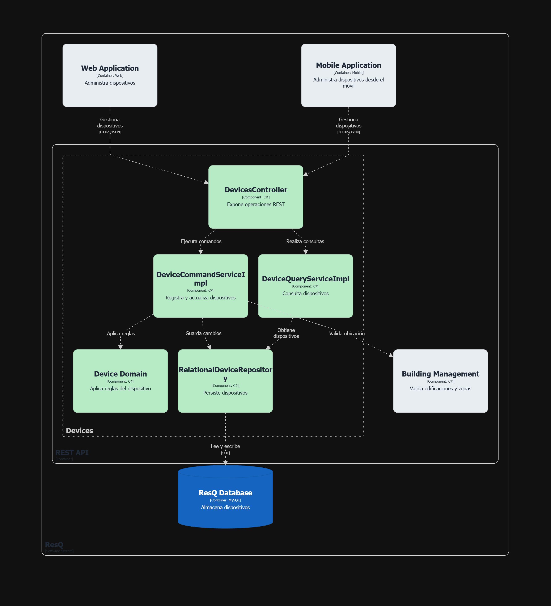

#### 4.2.5.6. Bounded Context Software Architecture Code Level Diagrams

##### 4.2.5.6.1. Bounded Context Domain Layer Class Diagrams

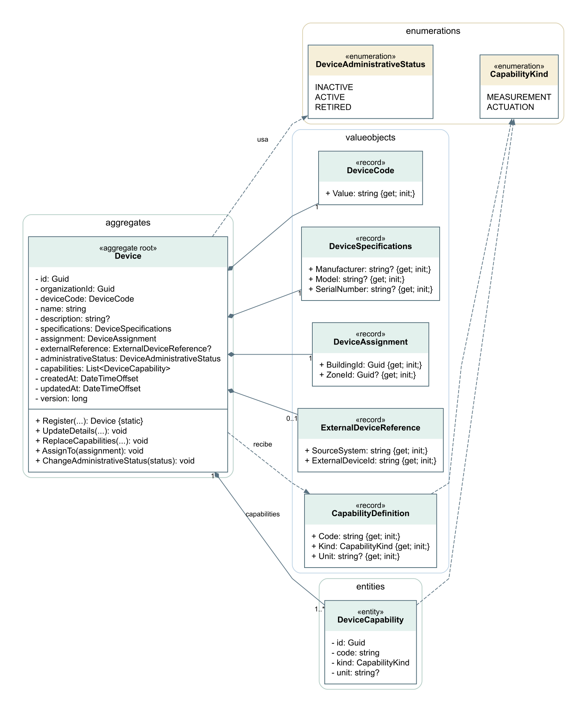


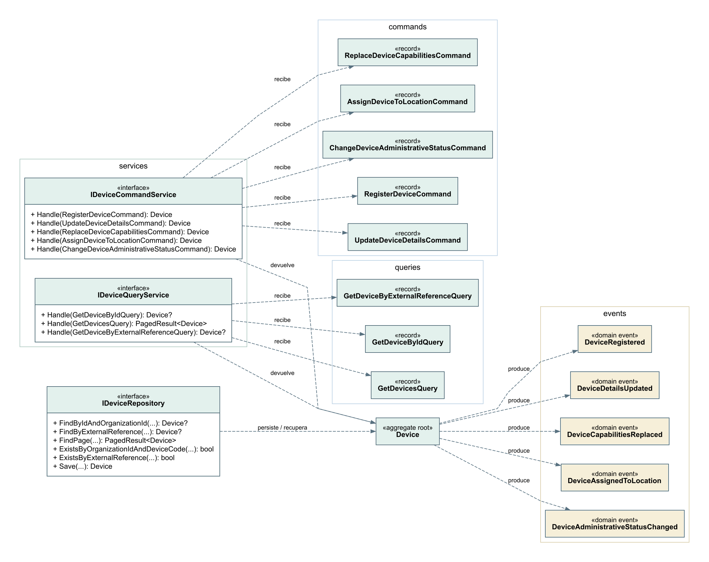

##### 4.2.5.6.2. Bounded Context Database Design Diagram

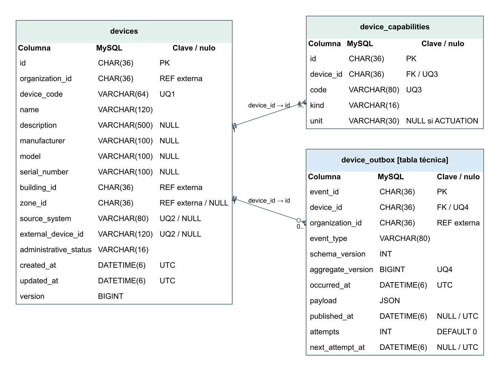

<div style="page-break-before: always; break-before: page;"></div>

### 4.2.6. Bounded Context: Monitoring

El Bounded Context **Monitoring** es responsable de gestionar las mediciones obtenidas desde los dispositivos IoT y mantener una representación actualizada del estado observado de las edificaciones, zonas y dispositivos monitoreados por ResQ.

Su principal propósito es proporcionar visibilidad operacional sobre la infraestructura sin asumir responsabilidades que corresponden a otros Bounded Contexts. Monitoring registra y consulta las condiciones observadas, mientras que **Risk Detection** interpreta estas mediciones para determinar si representan una situación de riesgo.

Este Bounded Context soporta principalmente:

- **US01 — Consultar el estado general de una edificación.**
- **US02 — Consultar el estado de una zona.**
- **US03 — Consultar mediciones actuales.**
- **US04 — Conocer el estado operativo de un dispositivo.**
- **US05 — Supervisar remotamente una edificación.**

Monitoring participa tanto en el entorno **Edge** como en **Cloud**: en Edge recibe y conserva temporalmente las mediciones provenientes de los dispositivos IoT, mientras que en Cloud almacena la información histórica, mantiene los estados operacionales y expone la información requerida por las aplicaciones Web y Mobile.

Monitoring no administra la configuración de los dispositivos, la estructura de las edificaciones, las reglas de detección, las políticas de respuesta ni el ciclo de vida de los incidentes. Para ello colabora respectivamente con **Device Management**, **Building Management**, **Risk Detection**, **Alert & Response Management** e **Incident Management**.

Los principales conceptos identificados para este Bounded Context son **Measurement**, **Measurement Value**, **Device Monitoring State**, **Zone Monitoring State**, **Device Availability**, **Freshness Policy** y **Monitored Condition**.

Las principales responsabilidades del Bounded Context **Monitoring** son:

- Recibir y registrar las mediciones generadas por los dispositivos IoT.
- Mantener actualizado el estado operativo de los dispositivos monitoreados.
- Mantener actualizado el estado operativo de las zonas monitoreadas.
- Asociar cada medición con el dispositivo, zona y edificación correspondientes.
- Conservar la fecha y hora original en la que se generó cada medición.
- Determinar si una medición continúa siendo vigente de acuerdo con la política de actualidad definida.
- Proporcionar el estado actual de edificaciones, zonas y dispositivos a las aplicaciones de ResQ.
- Proporcionar mediciones válidas al Bounded Context **Risk Detection** para su posterior evaluación.
- Proporcionar a **Incident Management** información actualizada sobre las condiciones de una zona cuando sea requerida para el seguimiento de un incidente.
- Actualizar las representaciones de monitoreo cuando se reciben cambios relevantes relacionados con el estado de un riesgo.
- Mantener el historial de mediciones de los sensores para su posterior consulta y análisis.
- Conservar temporalmente las mediciones en el entorno Edge cuando la comunicación con Cloud no se encuentre disponible.
- Permitir la sincronización posterior de las mediciones pendientes sin modificar el momento original en que fueron obtenidas.
- Mantener las responsabilidades de Monitoring separadas de la clasificación de riesgos, ejecución de respuestas, gestión de incidentes y administración de dispositivos o edificaciones.

#### Class Dictionary

| Class / Interface | Layer | Runtime | Purpose | Main attributes | Main operations |
|---|---|---|---|---|---|
| `Measurement` | Domain | Edge / Cloud | Representa una medición obtenida desde un dispositivo IoT. | `measurementId`, `deviceId`, `buildingId`, `zoneId`, `variableType`, `value`, `unit`, `measuredAt` | `isCurrent(referenceTime, freshnessPolicy)` |
| `MeasurementValue` | Domain | Edge / Cloud | Value Object que representa el valor cuantitativo y su unidad. | `value`, `unit` | `value()`, `unit()` |
| `DeviceMonitoringState` | Domain | Cloud | Representa el estado operacional observado de un dispositivo. | `deviceId`, `zoneId`, `availability`, `lastMeasurementAt`, `updatedAt` | `recordCommunication()`, `markUnavailable()`, `isAvailable()` |
| `ZoneMonitoringState` | Domain | Cloud | Representa el estado operacional observado de una zona. | `zoneId`, `buildingId`, `lastUpdatedAt`, `activeRiskId`, `conditionCode` | `updateObservation()`, `markRiskActive()`, `clearRisk()` |
| `DeviceAvailability` | Domain | Cloud | Enumeración del estado de disponibilidad observado. | `AVAILABLE`, `UNAVAILABLE`, `UNKNOWN` | — |
| `FreshnessPolicy` | Domain | Cloud | Value Object que determina cuándo una medición puede considerarse vigente. | `maximumAge` | `isCurrent(measuredAt, referenceTime)` |
| `MeasurementRepository` | Domain | Cloud / Edge | Abstracción para almacenar y consultar mediciones. | — | `save()`, `findLatestByDevice()`, `findLatestByZone()` |
| `DeviceMonitoringStateRepository` | Domain | Cloud | Abstracción de persistencia de estados operacionales de dispositivos. | — | `findByDeviceId()`, `save()` |
| `ZoneMonitoringStateRepository` | Domain | Cloud | Abstracción de persistencia de estados observados de zonas. | — | `findByZoneId()`, `findByBuildingId()`, `save()` |
| `MonitoringStateService` | Domain | Cloud | Coordina la actualización de estados a partir de nuevas observaciones. | — | `updateDeviceState()`, `updateZoneState()` |
| `RecordMeasurementCommand` | Application | Edge | Representa el ingreso de una nueva medición. | `deviceId`, `variableType`, `value`, `unit`, `measuredAt` | — |
| `RecordMeasurementCommandHandler` | Application | Edge | Coordina el registro local y publicación de una medición. | Dependencies | `handle()` |
| `MeasurementRecordedEvent` | Domain | Edge / Cloud | Representa el hecho de que una medición válida fue registrada. | Measurement data | — |
| `MeasurementReceivedEventHandler` | Application | Cloud | Procesa una medición proveniente del flujo Edge. | Dependencies | `handle()` |
| `RiskStateChangedEventHandler` | Application | Cloud | Actualiza la proyección de estado de una zona cuando cambia un riesgo. | Dependencies | `handle()` |
| `GetBuildingStatusQuery` | Application | Cloud | Solicita el estado actual de una edificación. | `buildingId` | — |
| `GetBuildingStatusQueryHandler` | Application | Cloud | Construye la vista operacional de una edificación. | Dependencies | `handle()` |
| `GetZoneStatusQuery` | Application | Cloud | Solicita el estado actual de una zona. | `zoneId` | — |
| `GetZoneStatusQueryHandler` | Application | Cloud | Recupera el estado observado de una zona. | Dependencies | `handle()` |
| `GetCurrentMeasurementsQuery` | Application | Cloud | Solicita las mediciones vigentes de un dispositivo o zona. | `deviceId` / `zoneId` | — |
| `GetCurrentMeasurementsQueryHandler` | Application | Cloud | Recupera mediciones y aplica la política de vigencia. | Dependencies | `handle()` |
| `GetDeviceStatusQuery` | Application | Cloud | Solicita el estado operacional de un dispositivo. | `deviceId` | — |
| `GetDeviceStatusQueryHandler` | Application | Cloud | Determina la disponibilidad observada del dispositivo. | Dependencies | `handle()` |
| `MeasurementEventPublisher` | Application | Edge | Abstracción para publicar mediciones hacia Cloud. | — | `publish()` |
| `DeviceContextResolver` | Application | Edge / Cloud | Obtiene el contexto mínimo de un dispositivo desde Device Management. | — | `resolve(deviceId)` |
| `MeasurementIngestionController` | Interface | Edge | Recibe mediciones provenientes del Embedded System. | Handler dependency | `recordMeasurement()` |
| `MonitoringQueryController` | Interface | Cloud | Expone consultas de monitoreo mediante REST. | Query handlers | `getBuildingStatus()`, `getZoneStatus()`, `getMeasurements()`, `getDeviceStatus()` |
| `MeasurementEventConsumer` | Interface | Cloud | Consume mediciones publicadas desde Edge. | Handler dependency | `consume()` |
| `RiskStateEventConsumer` | Interface | Cloud | Consume cambios relevantes provenientes de Risk Detection. | Handler dependency | `consume()` |
| `EdgeMeasurementRepositoryAdapter` | Infrastructure | Edge | Implementa almacenamiento local temporal mediante SQLite/Peewee. | SQLite / Peewee | `save()`, `findPending()` |
| `MeasurementEventPublisherAdapter` | Infrastructure | Edge | Publica mediciones hacia el flujo distribuido. | Communication dependency | `publish()` |
| `MeasurementTimeSeriesRepositoryAdapter` | Infrastructure | Cloud | Persiste mediciones longitudinales en InfluxDB. | InfluxDB | `save()`, `findLatestByDevice()`, `findLatestByZone()` |
| `MonitoringStateRepositoryAdapter` | Infrastructure | Cloud | Persiste estados operacionales en PostgreSQL. | PostgreSQL | `find()`, `save()` |
| `DeviceContextIntegrationAdapter` | Infrastructure | Edge / Cloud | Traduce información proveniente de Device Management. | Integration dependency | `resolve()` |
| `BuildingContextIntegrationAdapter` | Infrastructure | Cloud | Obtiene el contexto mínimo de edificaciones y zonas. | Integration dependency | `resolveZone()`, `resolveBuilding()` |

Monitoring conserva únicamente las referencias externas necesarias para asociar una medición con el dispositivo, zona y edificación correspondientes.

El ciclo de vida de `IoT Device`, `Building` y `Zone` continúa perteneciendo a sus respectivos Bounded Contexts.

---

#### 4.2.6.1. Domain Layer

La **Domain Layer** contiene los conceptos y reglas que permiten representar las mediciones y el estado operacional observado de la infraestructura.

Esta capa es independiente de HTTP, Flask, bases de datos, frameworks Cloud y mecanismos de comunicación.

Los principales Aggregate Roots son `Measurement`, `DeviceMonitoringState` y `ZoneMonitoringState`.

##### Measurement

**Categoría:** Aggregate Root / Entity.

**Propósito:** Representar una observación cuantitativa producida por un dispositivo IoT en un momento determinado.

**Atributos:**

- `measurementId: UUID`
- `deviceId: UUID`
- `buildingId: UUID`
- `zoneId: UUID`
- `variableType: String`
- `measurementValue: MeasurementValue`
- `measuredAt: Instant`
- `recordedAt: Instant`

`deviceId`, `buildingId` y `zoneId` representan referencias externas hacia otros Bounded Contexts.

**Operaciones:**

- `isCurrent(referenceTime, freshnessPolicy)`
- `belongsToDevice(deviceId)`
- `belongsToZone(zoneId)`

Una medición representa un hecho ocurrido y, por lo tanto, no debe ser modificada posteriormente para reflejar nuevos valores.

##### MeasurementValue

**Categoría:** Value Object.

**Propósito:** Representar el valor cuantitativo de una medición junto con su unidad.

**Atributos:**

- `value: Decimal`
- `unit: String`

##### DeviceMonitoringState

**Categoría:** Aggregate Root.

**Propósito:** Mantener la representación operacional de un dispositivo sin apropiarse de su configuración administrativa.

**Atributos:**

- `deviceId: UUID`
- `zoneId: UUID`
- `availability: DeviceAvailability`
- `lastMeasurementAt: Instant?`
- `updatedAt: Instant`

**Operaciones:**

- `recordCommunication(measuredAt)`
- `markUnavailable()`
- `markAvailable()`
- `isAvailable()`

##### ZoneMonitoringState

**Categoría:** Aggregate Root.

**Propósito:** Mantener una representación resumida de las condiciones observadas en una zona.

**Atributos:**

- `zoneId: UUID`
- `buildingId: UUID`
- `lastUpdatedAt: Instant`
- `activeRiskId: UUID?`
- `conditionCode: String`

**Operaciones:**

- `updateObservation(at)`
- `markRiskActive(riskDetectionId, conditionCode)`
- `clearRisk()`

`activeRiskId` constituye una referencia externa hacia Risk Detection. Monitoring no administra el riesgo.

##### DeviceAvailability

**Categoría:** Enumeration.

**Valores:**

- `AVAILABLE`
- `UNAVAILABLE`
- `UNKNOWN`

La disponibilidad representa el estado observado del dispositivo y no su estado administrativo dentro de Device Management.

##### FreshnessPolicy

**Categoría:** Value Object.

**Propósito:** Determinar si una medición puede presentarse como información actual.

**Atributo:**

- `maximumAge: Duration`

**Operación:**

- `isCurrent(measuredAt, referenceTime)`

Esto permite satisfacer el requerimiento de no presentar una medición antigua como si fuera vigente.

##### MeasurementRepository

**Categoría:** Repository Interface.

**Operaciones:**

- `save(measurement)`
- `findLatestByDevice(deviceId)`
- `findLatestByZone(zoneId)`
- `findByTimeRange(deviceId, from, to)`

##### DeviceMonitoringStateRepository

**Categoría:** Repository Interface.

**Operaciones:**

- `findByDeviceId(deviceId)`
- `save(deviceMonitoringState)`

##### ZoneMonitoringStateRepository

**Categoría:** Repository Interface.

**Operaciones:**

- `findByZoneId(zoneId)`
- `findByBuildingId(buildingId)`
- `save(zoneMonitoringState)`

##### MonitoringStateService

**Categoría:** Domain Service.

**Propósito:** Coordinar actualizaciones del estado operacional cuando estas requieren combinar una nueva observación con el estado previamente conocido.

**Operaciones:**

- `updateDeviceState(state, measurement)`
- `updateZoneState(state, measurement)`
- `evaluateAvailability(state, referenceTime, expectedCommunicationPeriod)`

##### Business Rules

El dominio Monitoring aplica las siguientes reglas:

1. Toda medición registrada debe mantener un identificador único.

2. Toda medición debe estar asociada con el dispositivo que la originó.

3. Cuando el contexto de ubicación se encuentra disponible, la medición debe conservar las referencias de la zona y edificación correspondientes.

4. Una medición conserva permanentemente el momento original en el que fue obtenida.

5. Las mediciones históricas no deben modificarse cuando un dispositivo sea posteriormente trasladado a otra zona.

6. Una medición solo puede presentarse como vigente cuando cumple la política de frescura configurada.

7. Cuando no exista una medición vigente, ResQ debe indicar que no dispone de información actual en lugar de presentar información histórica como si fuera reciente.

8. Un dispositivo se considera disponible cuando mantiene comunicación dentro del periodo esperado.

9. Cuando un dispositivo deja de comunicar información durante el periodo establecido, su estado observado debe reflejar indisponibilidad.

10. Monitoring no determina si una medición representa un riesgo.

11. La clasificación del tipo y nivel del riesgo pertenece a Risk Detection.

12. Monitoring puede conservar una referencia a un riesgo activo para construir sus vistas operacionales, pero no administra su ciclo de vida.

13. El estado de una zona debe actualizarse cuando exista nueva información operacional relevante.

14. El estado general de una edificación debe construirse a partir de la información disponible de sus zonas sin apropiarse del modelo de Building Management.

15. Solo mediciones consideradas válidas por el flujo de ingreso pueden ser incorporadas al estado operacional.

---

#### 4.2.6.2. Interface Layer

La **Interface Layer** permite que las aplicaciones, dispositivos y otros Bounded Contexts interactúen con las capacidades de Monitoring. Su responsabilidad es recibir solicitudes o eventos externos, transformar la información recibida al formato requerido por la Application Layer y devolver las respuestas correspondientes.

Monitoring cuenta con interfaces tanto en el entorno **Edge** como en **Cloud**, debido a que las mediciones son recibidas inicialmente cerca del dispositivo y posteriormente son almacenadas y consultadas desde los servicios centrales de ResQ.

##### MeasurementIngestionController

**Runtime:** Edge.

`MeasurementIngestionController` recibe las mediciones enviadas por los dispositivos IoT hacia el Edge Service.

Ejemplo conceptual:

```text
POST /edge/v1/measurements
```

La solicitud contiene información como:

- Identificador del dispositivo.
- Tipo de variable medida.
- Valor obtenido.
- Unidad de medida.
- Fecha y hora original de la medición.

El controlador transforma la información recibida en un `RecordMeasurementCommand` y delega su procesamiento a `RecordMeasurementCommandHandler`.

Este componente no determina si una medición representa una situación de riesgo, ya que dicha responsabilidad corresponde a **Risk Detection**.

##### MonitoringQueryController

**Runtime:** Cloud.

`MonitoringQueryController` expone las operaciones que permiten a las aplicaciones Web y Mobile consultar el estado actual de la infraestructura monitoreada.

Ejemplos conceptuales:

```text
GET /api/v1/monitoring/buildings/{buildingId}/status
GET /api/v1/monitoring/zones/{zoneId}/status
GET /api/v1/monitoring/devices/{deviceId}/status
GET /api/v1/monitoring/devices/{deviceId}/measurements/current
```

Estas operaciones permiten consultar:

- Estado general de una edificación.
- Estado actual de una zona.
- Disponibilidad de un dispositivo.
- Mediciones actuales.

Cada solicitud es delegada al Query Handler correspondiente dentro de la Application Layer.

##### MeasurementEventConsumer

**Runtime:** Cloud.

`MeasurementEventConsumer` recibe las mediciones publicadas desde el entorno Edge y las entrega a `MeasurementReceivedEventHandler`.

Su función consiste en adaptar el mensaje recibido al modelo utilizado por la Application Layer, sin implementar reglas del dominio.

##### RiskStateEventConsumer

**Runtime:** Cloud.

`RiskStateEventConsumer` recibe eventos relevantes provenientes de **Risk Detection**, como la detección o finalización de una situación de riesgo.

Estos eventos permiten actualizar la representación operacional de las zonas mostradas por Monitoring.

Monitoring únicamente conserva la información necesaria para representar el estado actual; la lógica utilizada para determinar el riesgo continúa perteneciendo a Risk Detection.

---

#### 4.2.6.3. Application Layer

La **Application Layer** coordina los casos de uso del Bounded Context Monitoring y conecta las interfaces externas con las reglas definidas en la Domain Layer.

Esta capa organiza principalmente los procesos de:

- Registro de mediciones.
- Publicación de mediciones desde Edge.
- Almacenamiento de mediciones en Cloud.
- Actualización del estado de dispositivos y zonas.
- Consulta del estado de edificaciones.
- Consulta del estado de zonas.
- Consulta de mediciones actuales.
- Consulta de disponibilidad de dispositivos.

##### RecordMeasurementCommand

**Runtime:** Edge.

Representa la solicitud de registrar una nueva medición obtenida desde un dispositivo IoT.

**Atributos:**

- `deviceId: UUID`
- `variableType: String`
- `value: Decimal`
- `unit: String`
- `measuredAt: Instant`

##### RecordMeasurementCommandHandler

**Runtime:** Edge.

Coordina el ingreso de una nueva medición al sistema.

El flujo principal es:

1. Recibir el `RecordMeasurementCommand`.
2. Obtener el contexto mínimo del dispositivo mediante `DeviceContextResolver`.
3. Construir el objeto `Measurement`.
4. Conservar temporalmente la medición en el entorno Edge cuando sea necesario.
5. Crear un `MeasurementRecordedEvent`.
6. Publicar el evento mediante `MeasurementEventPublisher`.

La fecha y hora original de la medición se conserva durante todo el proceso.

##### MeasurementReceivedEventHandler

**Runtime:** Cloud.

Procesa las mediciones provenientes del entorno Edge.

Su flujo principal es:

1. Recibir un `MeasurementRecordedEvent`.
2. Reconstruir la medición.
3. Almacenar la medición en la base de datos longitudinal.
4. Recuperar el estado operacional del dispositivo.
5. Actualizar la última comunicación del dispositivo.
6. Recuperar el estado operacional de la zona.
7. Actualizar la última observación de la zona.
8. Persistir los estados actualizados.

Una vez registrada, la medición puede ser utilizada por **Risk Detection** para evaluar posibles situaciones de riesgo.

##### RiskStateChangedEventHandler

**Runtime:** Cloud.

Procesa eventos provenientes de Risk Detection cuando cambia el estado de riesgo asociado a una zona.

Permite:

- Asociar un riesgo activo con una zona.
- Actualizar la condición mostrada en Monitoring.
- Eliminar la referencia cuando el riesgo deja de estar activo.

Este handler no determina la existencia ni severidad del riesgo.

##### GetBuildingStatusQuery

Representa una solicitud para consultar el estado actual de una edificación.

**Atributo:**

- `buildingId: UUID`

##### GetBuildingStatusQueryHandler

Construye la vista actual de una edificación utilizando los estados disponibles de sus diferentes zonas.

La respuesta puede contener:

- Última actualización.
- Zonas monitoreadas.
- Estado operacional de cada zona.
- Disponibilidad de dispositivos.
- Referencia a riesgos activos, cuando corresponda.

##### GetZoneStatusQuery

Representa una solicitud para consultar el estado de una zona.

**Atributo:**

- `zoneId: UUID`

##### GetZoneStatusQueryHandler

Recupera la información operacional disponible para la zona indicada, incluyendo su condición actual y la fecha de última actualización.

##### GetCurrentMeasurementsQuery

Permite solicitar las mediciones actuales asociadas con un dispositivo o zona.

Puede contener:

- `deviceId: UUID`, o
- `zoneId: UUID`.

##### GetCurrentMeasurementsQueryHandler

Obtiene las mediciones más recientes y utiliza `FreshnessPolicy` para determinar si pueden considerarse actuales.

Cuando la última medición supera el periodo permitido, el sistema debe indicar que no existe información vigente en lugar de presentar una medición antigua como actual.

##### GetDeviceStatusQuery

Representa una solicitud para consultar el estado operacional de un dispositivo.

**Atributo:**

- `deviceId: UUID`

##### GetDeviceStatusQueryHandler

Obtiene `DeviceMonitoringState` y devuelve información como:

- Disponibilidad.
- Última comunicación.
- Zona asociada.
- Fecha de última actualización.

##### MeasurementEventPublisher

**Runtime:** Edge.

Abstracción utilizada para publicar las nuevas mediciones hacia el flujo distribuido de ResQ.

**Operación:**

```text
publish(event)
```

La Application Layer no depende directamente del mecanismo de comunicación utilizado.

##### DeviceContextResolver

Permite obtener el contexto mínimo necesario del dispositivo que originó una medición.

**Operación:**

```text
resolve(deviceId)
```

La información obtenida puede incluir:

- `deviceId`.
- `buildingId`.
- `zoneId`.

Monitoring no copia ni administra el modelo completo de Device Management.

---

#### 4.2.6.4. Infrastructure Layer

La **Infrastructure Layer** implementa los mecanismos técnicos necesarios para almacenar, transmitir y recuperar la información utilizada por Monitoring.

Debido a que el Bounded Context maneja distintos tipos de información, se utiliza una estrategia de persistencia diferenciada:

- **InfluxDB** para las mediciones longitudinales o series temporales.
- **PostgreSQL** para los estados operacionales actuales.
- **SQLite**, mediante **Peewee ORM**, para el almacenamiento temporal utilizado por el Edge Service.

##### EdgeMeasurementRepositoryAdapter

**Runtime:** Edge.

Implementa el almacenamiento temporal de mediciones mediante **SQLite y Peewee ORM**.

Sus principales responsabilidades son:

- Almacenar mediciones pendientes.
- Conservar el timestamp original.
- Recuperar registros pendientes.
- Actualizar el estado de sincronización cuando la información haya sido enviada correctamente.

Este almacenamiento soporta el patrón **store-and-forward** utilizado cuando existe una interrupción temporal de la conectividad.

##### MeasurementEventPublisherAdapter

**Runtime:** Edge.

Implementa `MeasurementEventPublisher`.

Se encarga de transmitir las mediciones registradas hacia los servicios Cloud mediante el mecanismo de comunicación definido por la arquitectura general de ResQ.

##### MeasurementTimeSeriesRepositoryAdapter

**Runtime:** Cloud.

Implementa la persistencia de mediciones utilizando **InfluxDB**.

InfluxDB resulta apropiado para esta información debido a que las mediciones se generan continuamente y se encuentran asociadas a un instante de tiempo.

Permite realizar operaciones como:

- Registrar una medición.
- Obtener la medición más reciente de un dispositivo.
- Consultar mediciones de una zona.
- Recuperar series de mediciones dentro de un intervalo temporal.

##### MonitoringStateRepositoryAdapter

**Runtime:** Cloud.

Implementa la persistencia de `DeviceMonitoringState` y `ZoneMonitoringState` utilizando **PostgreSQL**.

PostgreSQL almacena los estados operacionales actuales que requieren consistencia y consultas frecuentes desde la aplicación.

##### DeviceContextIntegrationAdapter

Permite obtener la información necesaria desde **Device Management**.

Este adapter traduce el contrato externo hacia la representación que Monitoring necesita, evitando depender directamente del modelo interno de Device Management.

##### BuildingContextIntegrationAdapter

Permite obtener el contexto mínimo necesario desde **Building Management**, principalmente la relación entre edificaciones y zonas.

Monitoring utiliza esta información como referencia, pero no modifica ni administra estos elementos.

##### Consideraciones de persistencia

Monitoring utiliza una estrategia de persistencia políglota:

- Las **mediciones históricas** se almacenan en InfluxDB debido a su naturaleza temporal.
- Los **estados actuales de dispositivos y zonas** se almacenan en PostgreSQL.
- Las **mediciones pendientes del Edge Service** se conservan temporalmente en SQLite.

Esta separación permite utilizar el almacenamiento más adecuado según las características de cada tipo de dato.

---

#### 4.2.6.5. Bounded Context Software Architecture Component Level Diagrams

Monitoring participa tanto en el **ResQ Edge Service** como en el **ResQ Cloud RESTful API**. Por esta razón, se representan dos Component Level Diagrams.

##### Monitoring — ResQ Edge Service Component Diagram

Los principales componentes del entorno Edge son:

- **Measurement Ingestion Interface**, encargado de recibir mediciones del Embedded Application.
- **Edge Monitoring Application**, responsable de coordinar el registro y publicación de las mediciones.
- **Monitoring Domain**, que contiene los conceptos y reglas relacionados con las mediciones.
- **Local Measurement Buffer**, encargado de conservar temporalmente las mediciones utilizando SQLite y Peewee.
- **Device Context Integration**, utilizado para obtener información mínima sobre el dispositivo y su ubicación.
- **Measurement Event Publisher**, encargado de transmitir las mediciones hacia Cloud.

El flujo principal puede representarse de la siguiente manera:

```text
ESP32 / Embedded Application
            |
            v
Measurement Ingestion Interface
            |
            v
Edge Monitoring Application
            |
            v
Monitoring Domain
       /           \
      v             v
Device Context   Local SQLite Buffer
 Integration
      \             /
       \           /
            v
Measurement Event Publisher
            |
            v
ResQ Cloud
```

**DIAGRAM — Monitoring Edge Component Level Diagram**

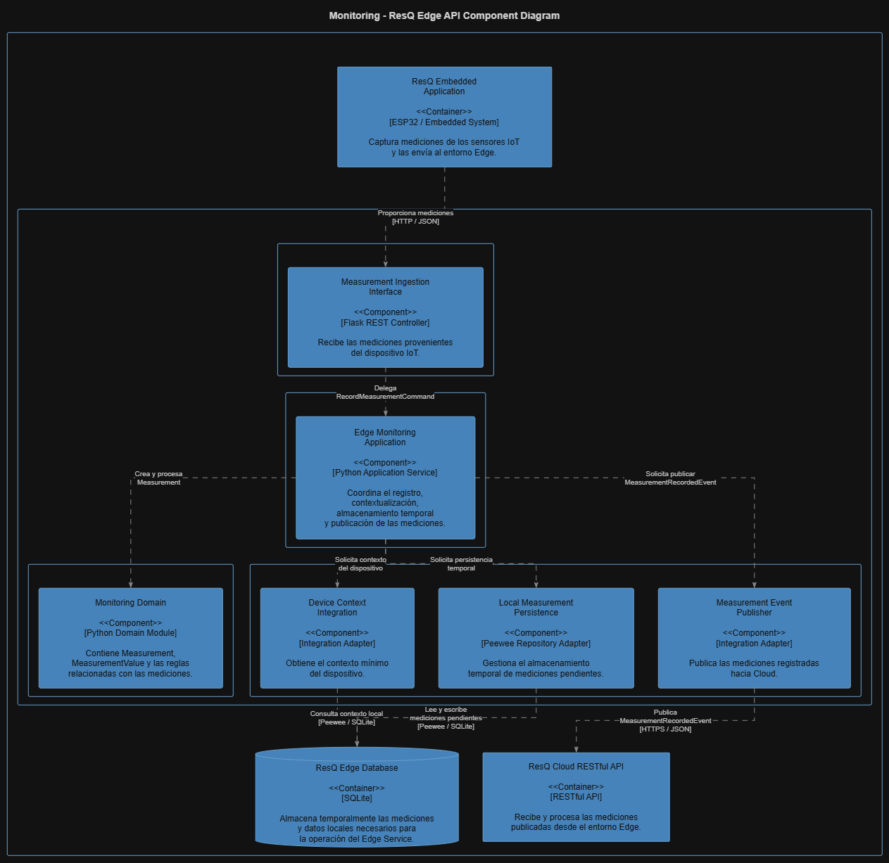

##### Monitoring — ResQ Cloud RESTful API Component Diagram

Los principales componentes del entorno Cloud son:

- **Monitoring Query API**
- **Measurement Event Consumer**
- **Risk State Event Consumer**
- **Monitoring Application**
- **Monitoring Domain**
- **Time-Series Persistence**
- **Operational State Persistence**
- **Device Management Integration**
- **Building Management Integration**

El flujo principal puede representarse como:

```text
                   Web / Mobile Applications
                             |
                             v
                    Monitoring Query API
                             |
                             v
                   Monitoring Application
                             |
                             v
                     Monitoring Domain
                      /             \
                     v               v
         Operational State       Time-Series
           Persistence           Persistence
           PostgreSQL             InfluxDB


Edge Measurement Flow
        |
        v
Measurement Event Consumer
        |
        v
Monitoring Application
```

Los eventos relevantes provenientes de Risk Detection ingresan mediante `Risk State Event Consumer` para actualizar las representaciones operacionales utilizadas por Monitoring.

**DIAGRAM — Monitoring Cloud Component Level Diagram**

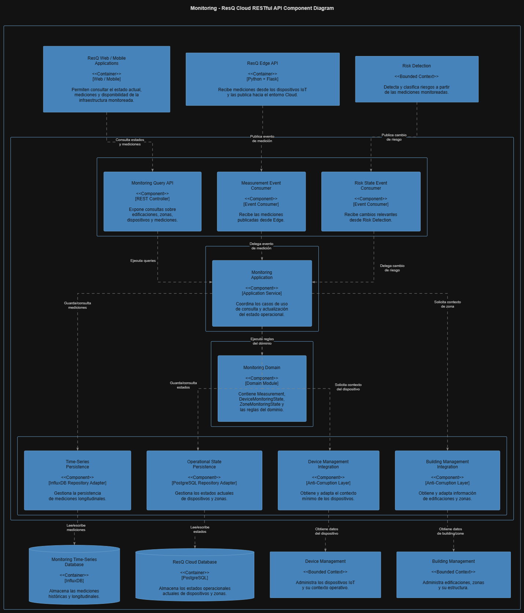

---

#### 4.2.6.6. Bounded Context Software Architecture Code Level Diagrams

Los **Code Level Diagrams** representan la estructura interna del Bounded Context Monitoring con un mayor nivel de detalle.

Para Monitoring se elaboran dos diagramas principales:

- **Domain Layer Class Diagram**, que representa las clases, Value Objects, enumeraciones, repositorios y servicios del dominio.
- **Database Design Diagram**, que representa las estructuras de persistencia utilizadas en Cloud y Edge.

---

##### 4.2.6.6.1. Bounded Context Domain Layer Class Diagrams

El Domain Layer Class Diagram debe representar los siguientes elementos.

**Aggregate Roots / Entities**

- `Measurement`
- `DeviceMonitoringState`
- `ZoneMonitoringState`

**Value Objects**

- `MeasurementValue`
- `FreshnessPolicy`

**Enumeration**

- `DeviceAvailability`

**Repository Interfaces**

- `MeasurementRepository`
- `DeviceMonitoringStateRepository`
- `ZoneMonitoringStateRepository`

**Domain Service**

- `MonitoringStateService`

Las principales relaciones son:

```text
Measurement "1" *-- "1" MeasurementValue

DeviceMonitoringState "1" --> "1" DeviceAvailability

ZoneMonitoringState "1" ..> Measurement : updated from

MeasurementRepository ..> Measurement : persists

DeviceMonitoringStateRepository ..> DeviceMonitoringState : persists

ZoneMonitoringStateRepository ..> ZoneMonitoringState : persists

MonitoringStateService ..> Measurement
MonitoringStateService ..> DeviceMonitoringState
MonitoringStateService ..> ZoneMonitoringState

FreshnessPolicy ..> Measurement : evaluates freshness
```

`Measurement` conserva como referencias externas:

```text
deviceId
buildingId
zoneId
```

Por esta razón, los siguientes conceptos no deben modelarse como Aggregates pertenecientes a Monitoring:

- `IoT Device`
- `Building`
- `Zone`
- `Risk`
- `Incident`
- `Alert`

Estos conceptos pertenecen a otros Bounded Contexts.

El diagrama debe mostrar:

- Atributos.
- Métodos.
- Visibilidad UML.
- Relaciones.
- Multiplicidades.
- Composiciones.
- Dependencias.

**DIAGRAM — Monitoring Domain Layer Class Diagram**

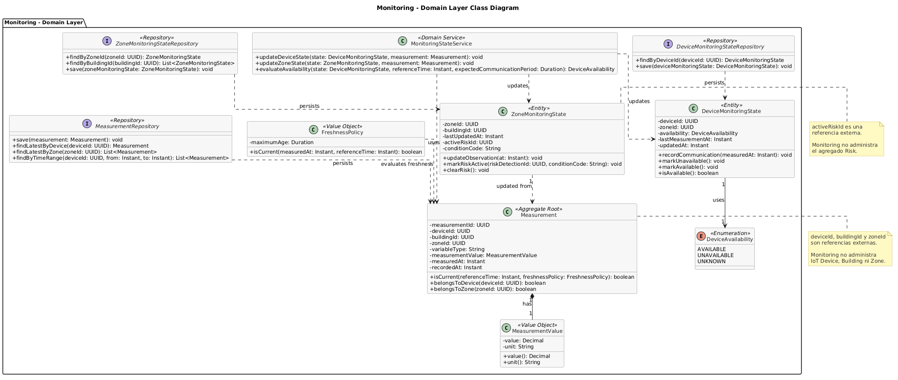

---

##### 4.2.6.6.2. Bounded Context Database Design Diagram

El diseño de persistencia de Monitoring se divide en tres componentes:

1. **InfluxDB**, para almacenar las mediciones longitudinales.
2. **PostgreSQL**, para almacenar los estados operacionales actuales.
3. **SQLite**, para mantener el buffer temporal utilizado en Edge.

###### Cloud — InfluxDB

Las mediciones se almacenan conceptualmente en:

`monitoring_measurements`

| Elemento | Tipo | Descripción |
|---|---|---|
| `time` | Timestamp | Momento original de la medición. |
| `measurement_id` | UUID | Identificador único de la medición. |
| `device_id` | UUID | Referencia al dispositivo de origen. |
| `building_id` | UUID | Referencia externa a la edificación. |
| `zone_id` | UUID | Referencia externa a la zona. |
| `variable_type` | String | Variable observada. |
| `value` | Decimal | Valor medido. |
| `unit` | String | Unidad de medida. |

Los identificadores de dispositivo, edificación y zona se utilizan como referencias y no implican que Monitoring sea propietario de estos conceptos.

###### Cloud — PostgreSQL

###### `monitoring_device_states`

Almacena el estado operacional actual de cada dispositivo.

| Column | Type | Constraint | Description |
|---|---|---|---|
| `device_id` | UUID | PRIMARY KEY | Referencia externa al dispositivo. |
| `zone_id` | UUID | NOT NULL | Zona asociada. |
| `availability_status` | VARCHAR(20) | NOT NULL | Disponibilidad observada. |
| `last_measurement_at` | TIMESTAMP | NULL | Última medición recibida. |
| `updated_at` | TIMESTAMP | NOT NULL | Última actualización del estado. |

###### `monitoring_zone_states`

Almacena el estado operacional actual de cada zona.

| Column | Type | Constraint | Description |
|---|---|---|---|
| `zone_id` | UUID | PRIMARY KEY | Referencia externa a la zona. |
| `building_id` | UUID | NOT NULL | Referencia externa a la edificación. |
| `active_risk_id` | UUID | NULL | Referencia externa al riesgo activo. |
| `condition_code` | VARCHAR(50) | NOT NULL | Condición operacional actual. |
| `last_updated_at` | TIMESTAMP | NOT NULL | Última actualización disponible. |

`active_risk_id` no constituye una clave foránea hacia la persistencia interna de Risk Detection, evitando acoplamiento directo entre bases de datos pertenecientes a distintos Bounded Contexts.

###### Edge — SQLite

###### `edge_measurement_buffer`

Mantiene temporalmente las mediciones pendientes de envío hacia Cloud.

| Column | Type | Constraint | Description |
|---|---|---|---|
| `measurement_id` | UUID | PRIMARY KEY | Identificador de la medición. |
| `device_id` | UUID | NOT NULL | Dispositivo de origen. |
| `building_id` | UUID | NULL | Edificación asociada. |
| `zone_id` | UUID | NULL | Zona asociada. |
| `variable_type` | VARCHAR(100) | NOT NULL | Variable observada. |
| `measured_value` | DECIMAL | NOT NULL | Valor registrado. |
| `unit` | VARCHAR(50) | NOT NULL | Unidad de medida. |
| `measured_at` | DATETIME | NOT NULL | Fecha y hora original. |
| `sync_status` | VARCHAR(20) | NOT NULL | Estado de sincronización. |
| `retry_count` | INTEGER | NOT NULL | Número de intentos realizados. |

Esta tabla permite soportar el patrón **store-and-forward**, conservando la información cuando la comunicación con Cloud se encuentra temporalmente interrumpida.

Conceptualmente, la persistencia queda organizada de la siguiente manera:

```text
                    MONITORING

          ┌──────────── CLOUD ────────────┐
          │                               │
          │          InfluxDB             │
          │  monitoring_measurements      │
          │                               │
          │         PostgreSQL            │
          │ ┌───────────────────────────┐ │
          │ │ monitoring_device_states │ │
          │ │ monitoring_zone_states   │ │
          │ └───────────────────────────┘ │
          └───────────────────────────────┘
                          ▲
                          │
                    sincronización
                          │
          ┌──────────── EDGE ─────────────┐
          │                               │
          │       SQLite + Peewee         │
          │ edge_measurement_buffer       │
          │                               │
          └───────────────────────────────┘
```

Monitoring no debe crear tablas propias para:

- Devices.
- Buildings.
- Zones.
- Risks.
- Alerts.
- Incidents.

Estos conceptos continúan perteneciendo a sus respectivos Bounded Contexts.

**DIAGRAM — Monitoring Database Design Diagram**

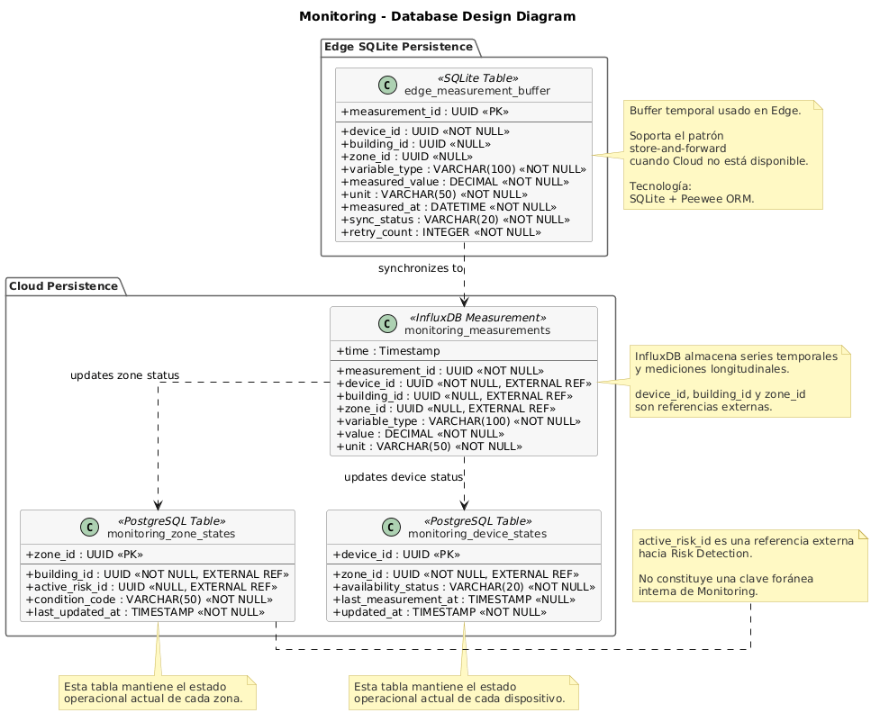


### 4.2.7. Bounded Context: User

#### 4.2.7.1. Domain Layer

#### 4.2.7.2. Interface Layer

#### 4.2.7.3. Application Layer

#### 4.2.7.4. Infrastructure Layer

#### 4.2.7.5. Bounded Context Software Architecture Component Level Diagrams

#### 4.2.7.6. Bounded Context Software Architecture Code Level Diagrams

##### 4.2.7.6.1. Bounded Context Domain Layer Class Diagrams

##### 4.2.7.6.2. Bounded Context Database Design Diagram

### 4.2.8. Bounded Context: Incident

#### 4.2.8.1. Domain Layer

#### 4.2.8.2. Interface Layer

#### 4.2.8.3. Application Layer

#### 4.2.8.4. Infrastructure Layer

#### 4.2.8.5. Bounded Context Software Architecture Component Level Diagrams

#### 4.2.8.6. Bounded Context Software Architecture Code Level Diagrams

##### 4.2.8.6.1. Bounded Context Domain Layer Class Diagrams

##### 4.2.8.6.2. Bounded Context Database Design Diagram

### 4.2.9. Bounded Context: Connectivity Management

El Connectivity Management Bounded Context es responsable de gestionar y supervisar el estado de conexión de red de todos los sensores físicos de emergencia (sismos, fugas de gas, temperatura, etc.) en el sistema. Este contexto asegura que los dispositivos mantengan una comunicación constante mediante señales de vida (heartbeats), detectando caídas de red, gestionando reconexiones y garantizando que el sistema central sepa en tiempo real si un área está desprotegida por falta de conectividad.

#### 4.2.9.1. Domain Layer

La **Domain Layer** del Connectivity Management Bounded Context encapsula la lógica de negocio relacionada con la supervisión de red. En esta capa, se definen los elementos principales del dominio, como agregados, entidades, objetos de valor, comandos, consultas y eventos, que representan los conceptos clave del sistema.

**Aggregates**

1. `SensorConnection`
   * **Propósito:** Representa el estado de red y la sesión de conectividad actual de un sensor físico específico.
   * **Atributos:**
      * `sensorId`: Identificador del dispositivo IoT, representado como un objeto de valor `SensorId`.
      * `macAddress`: Dirección física del sensor en la red, representado como un objeto de valor `MacAddress`.
      * `status`: Estado operativo actual de la conexión (`ONLINE`, `OFFLINE`, `TIMEOUT`), representado como un objeto de valor `ConnectionStatus`.
      * `lastHeartbeat`: Fecha y hora del último latido recibido exitosamente.
   * **Características:**
      * Extiende `AuditableAbstractAggregateRoot`, lo que permite auditar el historial de caídas de red.
      * Gestiona la lógica para determinar si el tiempo transcurrido desde el `lastHeartbeat` excede el límite permitido, cambiando el estado a `TIMEOUT`.

**Entities**

1. `HeartbeatRecord`
   * **Propósito:** Representa un latido individual enviado por el sensor para notificar que sigue vivo.
   * **Atributos:**
      * `timestamp`: Fecha y hora exacta en la que se recibió la señal.
      * `signalStrength`: Nivel de intensidad de la red, representado como un objeto de valor `SignalStrength`.

**Value Objects**

1. `SensorId`
   * **Propósito:** Representa el identificador único de un sensor.
   * **Validaciones:** El identificador no puede ser nulo ni negativo.
2. `ConnectionStatus`
   * **Propósito:** Enumera los estados posibles de conectividad (`ONLINE`, `OFFLINE`, `TIMEOUT`).
3. `SignalStrength`
   * **Propósito:** Representa la calidad de la conexión inalámbrica.
   * **Validaciones:** Debe estar dentro de rangos realistas (ej. entre -100 dBm y 0 dBm).

**Commands**

1. `RegisterHeartbeatCommand`
   * **Propósito:** Representa la solicitud para registrar un nuevo latido.
   * **Atributos:** `sensorId`, `timestamp`, `signalStrength`.
2. `MarkSensorOfflineCommand`
   * **Propósito:** Solicitud interna para forzar el estado de un sensor a desconectado tras superar el tiempo de espera.
   * **Atributos:** `sensorId`.

**Queries**

1. `GetSensorConnectionStatusQuery`
   * **Propósito:** Recupera el estado actual de red de un sensor específico.
2. `GetAllOfflineSensorsQuery`
   * **Propósito:** Recupera una lista de todos los sensores que actualmente han perdido conexión.

**Events**

1. `ConnectionLostEvent`
   * **Propósito:** Evento crítico que se dispara cuando un sensor pasa a estado `OFFLINE` o `TIMEOUT`.
   * **Atributos:** `sensorId`, `lastHeartbeat`.
2. `HeartbeatReceivedEvent`
   * **Propósito:** Evento que se dispara cada vez que se registra un latido exitoso.

---

#### 4.2.9.2. Interface Layer

La **Interface Layer** del Connectivity Management Bounded Context expone los puntos de entrada al sistema a través de controladores REST. Esta capa permite la interacción con los dispositivos IoT y facilita la comunicación entre los clientes y el sistema.

**Controllers**

1. `ConnectivityController`
   * **Propósito:** Gestiona las operaciones de red de los sensores.
   * **Endpoints:**
      * `POST /api/v1/connectivity/heartbeats`: Registra un nuevo latido proveniente del dispositivo IoT.
      * `GET /api/v1/connectivity/sensors/{sensorId}/status`: Obtiene el estado actual de red de un sensor.
      * `GET /api/v1/connectivity/sensors/offline`: Lista todos los sensores sin conexión.
   * **Dependencias:**
      * `ConnectivityCommandService`: Servicio encargado de manejar los comandos relacionados con la conectividad.
      * `ConnectivityQueryService`: Servicio encargado de manejar las consultas de conectividad.

**Resources**

1. `SensorConnectionResource`
   * **Propósito:** Representa el estado de conexión expuesto a través de la API REST.
   * **Atributos:** `sensorId`, `status`, `lastHeartbeatTime`.
2. `RegisterHeartbeatResource`
   * **Propósito:** Representa los datos necesarios enviados por el dispositivo IoT para reportar su estado.
   * **Atributos:** `sensorId`, `signalStrength`.

**Transformers**

1. `SensorConnectionResourceFromEntityAssembler`
   * **Propósito:** Convierte una entidad `SensorConnection` en un recurso `SensorConnectionResource`.
   * **Método principal:** `toResourceFromEntity(SensorConnection entity)`.

---
#### 4.2.9.3. Application Layer

La **Application Layer** coordina las operaciones de negocio, manejando comandos y consultas, orquestando la lógica de la aplicación y garantizando que las reglas del dominio se cumplan.

**Command Services**

1. `ConnectivityCommandServiceImpl`
   * **Propósito:** Gestiona las operaciones relacionadas con el procesamiento de señales de vida y actualización de estados.
   * **Métodos principales:**
      * `handle(RegisterHeartbeatCommand command)`: Actualiza el `lastHeartbeat` del sensor. Si estaba `OFFLINE`, lo devuelve a `ONLINE`.
      * `handle(MarkSensorOfflineCommand command)`: Cambia el estado a `TIMEOUT` tras validar los tiempos de espera.
   * **Dependencias:**
      * `SensorConnectionRepository`: Persistencia de las conexiones.
      * `ExternalDeviceService`: Verifica la existencia del sensor.

**Query Services**

1. `ConnectivityQueryServiceImpl`
   * **Propósito:** Gestiona las consultas relacionadas con los estados de red.
   * **Métodos principales:**
      * `handle(GetSensorConnectionStatusQuery query)`: Recupera el estado de un sensor por su ID.

**Event Handlers**

1. `SensorTimeoutEventHandler`
   * **Propósito:** Maneja el evento de evaluación de tiempos de espera para sensores que no han reportado actividad.
   * **Método principal:** `on(EvaluateSensorTimeoutsEvent event)`: Identifica sensores desconectados y dispara el `MarkSensorOfflineCommand`.

**Outbound Services (ACL)**

1. `ExternalAlertService`
   * **Propósito:** Interactúa con el Alert & Response Management Bounded Context para disparar alarmas de desconexión.
   * **Método principal:** `triggerDisconnectionAlert(Long sensorId)`.

---

#### 4.2.9.4. Infrastructure Layer

La **Infrastructure Layer** proporciona las implementaciones técnicas necesarias para soportar las operaciones del sistema, incluyendo los repositorios para la persistencia de datos en la base de datos.

**Persistencia (JPA Repositories)**

1. `SensorConnectionRepository`
   * **Propósito:** Proporciona métodos para interactuar con la base de datos de conectividad.
   * **Métodos principales:**
      * `findSensorsWithLastHeartbeatBefore(LocalDateTime time)`: Recupera todos los sensores cuyo último latido fue anterior a una fecha límite, útil para detectar caídas de red.
   * **Características:**
      * Extiende `JpaRepository`, permitiendo realizar operaciones CRUD sobre la entidad `SensorConnection`.

**Relaciones entre componentes**

*   **Persistencia:** El repositorio `SensorConnectionRepository` proporciona acceso a los datos almacenados, permitiendo a las capas superiores interactuar con las entidades del dominio.
*   **Validación:** Los servicios externos (ACL) son utilizados para validar la existencia de los sensores comunicándose con el contexto correspondiente.

---

#### 4.2.9.5. Bounded Context Software Architecture Component Level Diagrams

En esta sección se presenta el diagrama de componentes del **Connectivity Management Bounded Context**, el cual detalla los principales módulos y sus interacciones dentro del contexto delimitado. Este diagrama sigue el enfoque del C4 Model para representar los componentes clave, como servicios de aplicación, controladores, repositorios y servicios externos, junto con sus relaciones.

El propósito de este diagrama es proporcionar una visión clara y estructurada de cómo se organizan los componentes dentro del contexto, facilitando la comprensión de su arquitectura y permitiendo identificar puntos de integración y responsabilidades.

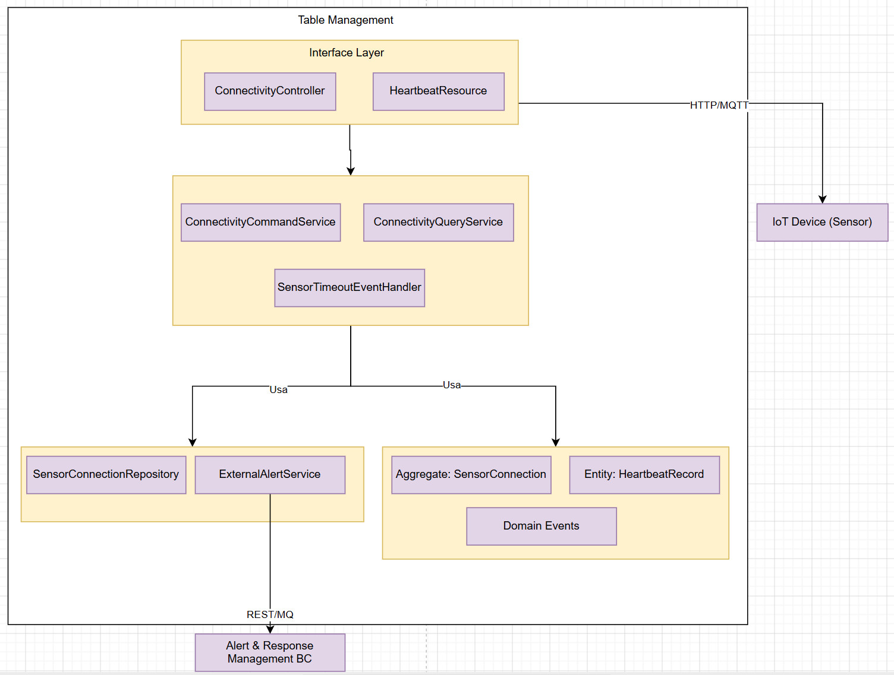
El **Connectivity Management Bounded Context** está compuesto por los siguientes módulos principales:

1. **Application Layer:**
   * Coordina las operaciones de negocio relacionadas con el monitoreo de conectividad y latidos (*heartbeats*).
   * Incluye servicios de comandos y consultas que interactúan con la **Domain Layer** y la **Infrastructure Layer**.
   * Maneja eventos críticos relacionados con la desconexión de sensores y evaluaciones de *timeout*.

2. **Interface Layer:**
   * Expone los puntos de entrada al sistema a través de controladores REST (ej. webhooks para los dispositivos IoT).
   * Incluye recursos y transformadores que aseguran una representación adecuada de los datos de red y su conversión entre las capas de la aplicación.

3. **Domain Layer:**
   * Encapsula la lógica de negocio relacionada con la supervisión de red.
   * Define los agregados, entidades y objetos de valor que representan los conceptos clave del dominio (como el estado de conexión y la intensidad de la señal).

4. **Infrastructure Layer:**
   * Proporciona las implementaciones técnicas necesarias para soportar las operaciones del sistema.
   * Incluye repositorios para la persistencia del estado de los sensores y componentes (ACL) que conectan la lógica de negocio con otros servicios externos de alertas.

#### 4.2.9.6. Bounded Context Software Architecture Code Level Diagrams

En este apartado se presentan los diagramas que ofrecen un mayor nivel de detalle sobre la implementación de los componentes del **Connectivity Management Bounded Context**. Estos diagramas están diseñados para ilustrar cómo se estructuran las clases, interfaces y relaciones dentro de las capas del contexto, proporcionando una visión técnica que facilita el desarrollo, mantenimiento y evolución del sistema.

##### 4.2.9.6.1. Bounded Context Domain Layer Class Diagrams

El diagrama de clases correspondiente a la **Domain Layer** del **Connectivity Management Bounded Context** incluye las clases principales, como agregados, entidades y objetos de valor, así como las interfaces y enumeraciones que definen el comportamiento del dominio. También se destacan las relaciones entre estos elementos, como asociaciones, composiciones y dependencias.

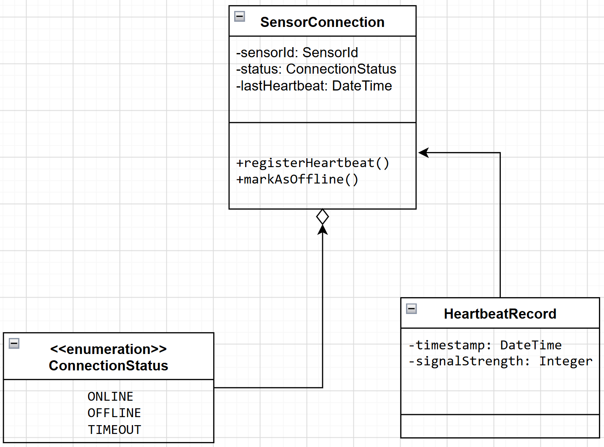

**Elementos principales del diagrama:**

1. **Aggregates:**
   * `SensorConnection`: Agregado principal que encapsula la lógica de negocio relacionada con la sesión de red del dispositivo.
     * **Atributos:** `sensorId`, `macAddress`, `status`, `lastHeartbeat`.
     * **Métodos:** `registerHeartbeat()`, `markAsOffline()`, `isTimeoutExceeded()`.

2. **Entities:**
   * `HeartbeatRecord`: Entidad que representa cada señal de vida individual enviada por el sensor.
     * **Atributos:** `timestamp`, `signalStrength`.

3. **Value Objects:**
   * `SensorId`: Representa el identificador único del hardware.
   * `MacAddress`: Representa la dirección de red física del sensor.
   * `ConnectionStatus`: Enumera los estados posibles de conectividad (`ONLINE`, `OFFLINE`, `TIMEOUT`).
   * `SignalStrength`: Representa la intensidad de la red (en dBm).

**Relaciones destacadas:**
* El agregado `SensorConnection` gestiona las relaciones y el registro transaccional con la entidad `HeartbeatRecord` (relación 1 a muchos).
* Los objetos de valor encapsulan datos inmutables y validaciones específicas de red, asegurando la consistencia en el dominio.

##### 4.2.9.6.2. Bounded Context Database Design Diagram

El diseño de la base de datos para el **Connectivity Management Bounded Context** refleja la estructura del dominio, asegurando que las entidades y relaciones definidas en la **Domain Layer** se representen de manera eficiente en el modelo relacional.

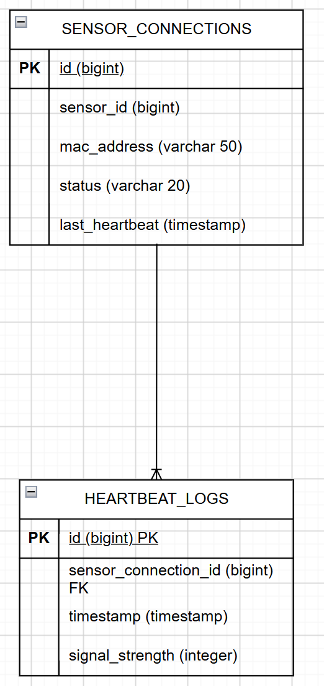

**Este diseño incluye las siguientes tablas principales:**

1. **SENSOR_CONNECTIONS:**
   * Representa la sesión operativa y el estado actual de conexión en el sistema.
   * **Atributos principales:**
     * `id`: Identificador único de la conexión (PK).
     * `sensor_id`: Identificador físico del dispositivo asociado (FK).
     * `mac_address`: Dirección de red del dispositivo.
     * `status`: Estado actual (`ONLINE`, `OFFLINE`, `TIMEOUT`).
     * `last_heartbeat`: Fecha y hora del último latido recibido.

2. **HEARTBEAT_LOGS:**
   * Representa el historial de latidos enviados por los dispositivos.
   * **Atributos principales:**
     * `id`: Identificador único del registro (PK).
     * `sensor_connection_id`: Identificador de la conexión asociada (FK).
     * `timestamp`: Fecha y hora exacta en la que se recibió la señal.
     * `signal_strength`: Intensidad de la señal de red reportada.


# Conclusiones

## Conclusiones y recomendaciones

A partir del trabajo realizado durante AV1, se logró profundizar en la problemática asociada con la gestión de riesgos y emergencias en edificaciones y establecer una primera definición sustentada de la propuesta de ResQ. El desarrollo de los artefactos correspondientes a los Capítulos I, II, III y IV permitió mantener una relación progresiva entre la comprensión del problema, la investigación de los segmentos objetivo, la especificación de requisitos y las principales decisiones de diseño y arquitectura de la solución.

En relación con el **Problem Statement** definido durante el Lean UX Process, los resultados obtenidos durante las entrevistas proporcionaron evidencia sobre varios de los problemas inicialmente identificados. En el segmento de propietarios y administradores de edificaciones se observó que los sistemas relacionados con seguridad suelen encontrarse distribuidos entre diferentes plataformas, dispositivos y mecanismos de comunicación. Los tres participantes de este segmento indicaron que trabajan con diferentes sistemas o fuentes de información que no se encuentran completamente integrados, lo que puede requerir verificaciones físicas, llamadas, mensajes o la consulta de distintas interfaces antes de comprender completamente una situación de riesgo.

Asimismo, los participantes de este primer segmento destacaron la importancia de conocer rápidamente qué está ocurriendo y dónde está ocurriendo. La necesidad de identificar la ubicación del incidente estuvo presente en los tres entrevistados, junto con la necesidad de disponer de información confiable antes de tomar decisiones relacionadas con la seguridad. Estos resultados son consistentes con el problema identificado inicialmente por ResQ respecto a la fragmentación de la información y la dependencia de actividades manuales para coordinar la respuesta ante una emergencia.

La investigación también mostró que la automatización no debe entenderse como la eliminación total de la intervención humana. Los propietarios y administradores entrevistados presentaron una actitud favorable hacia la automatización de alertas, notificaciones, señalización y determinadas respuestas, pero también señalaron la necesidad de conservar mecanismos de supervisión o confirmación humana cuando una acción pueda generar consecuencias significativas sobre las personas o la infraestructura. Este hallazgo permitió reforzar la decisión de diferenciar dentro de ResQ entre respuestas automáticas previamente autorizadas y acciones de alto impacto que requieren la confirmación de un responsable autorizado.

Respecto al segundo segmento, conformado por **empresas integradoras de automatización y gestión de edificios inteligentes**, las entrevistas permitieron identificar necesidades diferentes pero relacionadas con la propuesta de ResQ. Los tres representantes entrevistados señalaron la integración e interoperabilidad como factores fundamentales al evaluar nuevas tecnologías. Entre los aspectos mencionados se encuentran la compatibilidad entre fabricantes, disponibilidad de APIs y protocolos, calidad de la documentación técnica, soporte del proveedor y posibilidad de realizar pruebas antes de incorporar una tecnología dentro de un proyecto.

Los participantes de este segmento también señalaron dificultades asociadas con tecnologías que presentan restricciones no identificadas inicialmente, documentación incompleta o comportamientos diferentes a los esperados durante la integración. Estas situaciones pueden generar horas adicionales de ingeniería, modificaciones de arquitectura, retrasos o mayor dependencia del proveedor. Como consecuencia, ResQ no debe plantearse únicamente como un producto funcional, sino también como una solución que pueda ser comprendida, evaluada, integrada y mantenida por empresas especializadas que trabajan con infraestructura perteneciente a diferentes fabricantes.

Los resultados obtenidos permiten contrastar varios de los **assumptions** definidos durante el Lean UX Process con el comportamiento y las necesidades expresadas por los representantes de los segmentos objetivo. En el primer segmento se encontró evidencia favorable a los assumptions relacionados con monitoreo centralizado, identificación del tipo y ubicación del riesgo, consulta de información histórica y continuidad de las funciones críticas. Los tres entrevistados manifestaron que las funciones esenciales de seguridad deberían continuar operando localmente cuando se pierde temporalmente la conexión a Internet.

En el segundo segmento también se encontró evidencia favorable a los assumptions relacionados con interoperabilidad, integración progresiva y evaluación técnica antes de adoptar una solución. Los tres representantes indicaron que la capacidad de integración constituye un factor fundamental y que una solución especializada puede resultar preferible frente al desarrollo interno cuando dispone de mecanismos de integración adecuados, documentación, soporte y evidencia de funcionamiento. Asimismo, parte de los entrevistados manifestó explícitamente la importancia de mantener funciones críticas localmente ante interrupciones de conectividad.

Estos hallazgos proporcionan sustento inicial para mantener **Edge Computing** como una de las decisiones centrales de ResQ. El procesamiento local permite plantear que la detección de determinadas condiciones de riesgo y la ejecución de respuestas críticas no dependan permanentemente de los servicios Cloud. Al mismo tiempo, la arquitectura debe permitir conservar los eventos producidos durante una interrupción y sincronizarlos posteriormente cuando se recupere la conectividad, manteniendo la trazabilidad de lo ocurrido.

Los resultados de investigación también permitieron transformar las necesidades identificadas en requisitos verificables. Las User Stories y Technical Stories definidas durante AV1 abarcan capacidades relacionadas con el monitoreo de edificaciones y zonas, consulta de mediciones, detección y contextualización de riesgos, generación de alertas, ejecución de respuestas, seguimiento de incidentes, administración de usuarios y permisos, continuidad operativa e integración con infraestructura existente. El Product Backlog permitió posteriormente priorizar estas capacidades de acuerdo con su aporte al MVP y al valor esperado para los segmentos objetivo.

De manera complementaria, el **Strategic-Level Domain-Driven Design** permitió identificar y organizar las responsabilidades principales del dominio, mientras que el **Tactical-Level Domain-Driven Design** permitió profundizar en la estructura interna de los Bounded Contexts. Como resultado de este proceso se establecieron los contextos **Identity and Access Management (IAM), Risk Detection, Alert & Response Management, Building Management, Device Management, Monitoring, User, Incident y Connectivity Management**, separando responsabilidades relacionadas con usuarios, dispositivos, edificaciones, monitoreo, detección, respuesta, incidentes y comunicación.

Esta separación permite plantear una arquitectura en la que la detección de riesgos, la respuesta ante emergencias y la administración de la infraestructura no dependan de un único componente monolítico. Asimismo, facilita que las capacidades relacionadas con dispositivos IoT, procesamiento Edge, servicios Cloud y aplicaciones digitales puedan evolucionar progresivamente manteniendo responsabilidades delimitadas entre los distintos elementos de la solución.

En relación con los **Hypothesis Statements** definidos durante Lean UX, los resultados obtenidos en AV1 todavía no permiten considerarlos completamente validados. Las entrevistas realizadas hasta este punto corresponden principalmente a actividades de investigación orientadas a comprender problemas, necesidades, comportamientos y criterios de decisión de los segmentos objetivo. Por esta razón, si bien los hallazgos proporcionan evidencia inicial favorable para determinados assumptions, todavía será necesario comprobar mediante prototipos, implementación y sesiones de validación si las funcionalidades propuestas generan los beneficios y resultados de negocio esperados.

Entre los aspectos que deberán validarse posteriormente se encuentran la capacidad de los usuarios para comprender rápidamente el estado de una edificación, identificar correctamente el tipo, nivel y ubicación de un riesgo, interpretar las alertas generadas, comprender las respuestas ejecutadas por el sistema y confiar en la automatización propuesta. Para el segmento de empresas integradoras también será necesario validar si los mecanismos de integración, la documentación técnica y el proceso de incorporación de ResQ resultan suficientemente claros y utilizables dentro de escenarios similares a los que enfrentan en proyectos reales.

Respecto a los **criterios de éxito**, durante AV1 se definieron métricas iniciales que deberán ser contrastadas en futuras etapas de validación. El primer Business Goal establece como referencia que al menos el **80 % de los participantes del piloto** pueda identificar correctamente el tipo, nivel y zona de un riesgo, además de verificar la respuesta ejecutada por ResQ durante las primeras seis semanas del piloto. El segundo Business Goal plantea que al menos el **70 % de los participantes** utilice ResQ al menos dos veces por semana para actividades de monitoreo o consulta de incidentes durante un periodo continuo de ocho semanas. Finalmente, el tercer Business Goal establece como referencia que al menos el **60 % de las administraciones u organizaciones participantes** manifieste intención de continuar utilizando y pagar por el servicio, con una valoración mínima de cuatro sobre cinco al finalizar las primeras doce semanas del piloto.

Estos porcentajes deben considerarse actualmente como **criterios de éxito definidos para futuras validaciones y no como resultados alcanzados**. Durante AV1 todavía no se han desarrollado las Validation Interviews asociadas con los productos digitales ni existe evidencia suficiente para afirmar el cumplimiento de estas métricas. Las siguientes iteraciones deberán recopilar resultados reales y compararlos con estos valores para determinar si las hipótesis planteadas se mantienen, requieren ajustes o deben ser descartadas.

Como recomendación para las siguientes etapas, se debe mantener la trazabilidad entre los hallazgos obtenidos durante la investigación, las User Stories, las Technical Stories, el Product Backlog y las decisiones arquitectónicas. Cada funcionalidad que avance hacia implementación debería poder relacionarse con una necesidad previamente identificada y posteriormente con evidencia obtenida durante las pruebas y validaciones.

También será necesario comprobar técnicamente las decisiones relacionadas con la arquitectura IoT de ResQ. Entre las prioridades se encuentra validar la captura de información desde los sensores, el procesamiento local mediante Edge Computing, la clasificación de situaciones de riesgo, la ejecución de respuestas mediante actuadores, la conservación de eventos durante interrupciones de conectividad y la posterior sincronización con los servicios Cloud. Estas pruebas permitirán determinar si las decisiones planteadas durante el diseño pueden mantenerse bajo condiciones cercanas al funcionamiento esperado del producto.

Para las acciones que puedan producir un impacto significativo sobre personas o infraestructura, se recomienda mantener una estrategia de control humano acorde con los resultados obtenidos durante la investigación. Las respuestas automáticas deberían limitarse a acciones previamente autorizadas y técnicamente validadas, mientras que aquellas consideradas de alto impacto deberían conservar mecanismos de confirmación por parte de responsables con permisos adecuados.

En el caso del segmento de empresas integradoras, las siguientes iteraciones deben considerar no solamente el funcionamiento interno de ResQ, sino también su capacidad de integración. Será necesario validar los mecanismos y contratos de comunicación soportados, documentar adecuadamente APIs, protocolos, autenticación, estructura de datos y manejo de errores, y realizar pruebas que permitan demostrar que una fuente externa puede incorporarse sin exigir una sustitución completa de la infraestructura existente.

En relación con el **Roadmap de los productos digitales**, los siguientes pasos deberán concentrarse en transformar los requisitos y decisiones arquitectónicas definidos durante AV1 en experiencias e implementaciones que puedan ser evaluadas. Esto implica avanzar progresivamente en el diseño UI/UX del Landing Page y de las aplicaciones, desarrollar las capacidades priorizadas dentro del Product Backlog e implementar la comunicación entre Embedded Systems, Edge Computing, servicios Cloud y productos digitales.

A medida que se disponga de prototipos y primeras versiones funcionales, estos productos deberán presentarse a representantes de los segmentos objetivo mediante sesiones de validación. Los resultados obtenidos deberán utilizarse para revisar los Hypothesis Statements, contrastar los criterios de éxito, identificar problemas de usabilidad o comprensión, repriorizar el Product Backlog y actualizar el Roadmap según la evidencia recopilada.

Asimismo, la estrategia de evolución del producto debe considerar que el alcance de ResQ podrá ajustarse conforme se obtenga nueva información. Las funcionalidades que no demuestren aportar el beneficio esperado deberán ser revisadas, mientras que aquellas que presenten mayor valor para los segmentos podrán recibir una mayor prioridad dentro de las siguientes iteraciones. De esta manera, el Roadmap no debe considerarse una planificación inmutable, sino una guía evolutiva sustentada en evidencia obtenida durante el desarrollo y la validación.

Finalmente, el trabajo realizado durante AV1 permitió transformar una problemática inicialmente planteada a nivel conceptual en una propuesta progresivamente sustentada mediante investigación, requisitos y decisiones de diseño. Las entrevistas permitieron comprender con mayor precisión las dificultades de los propietarios y administradores de edificaciones y las condiciones bajo las cuales una empresa integradora evaluaría una solución como ResQ. A partir de estos hallazgos se establecieron requisitos, prioridades, Bounded Contexts y una arquitectura inicial que servirán como base para las siguientes etapas del proyecto.

Por tanto, AV1 no representa la validación definitiva de ResQ, sino el establecimiento de una base de conocimiento y diseño que deberá ser puesta a prueba durante las siguientes iteraciones. La implementación del MVP, las pruebas técnicas y las posteriores Validation Interviews permitirán determinar en qué medida las decisiones tomadas responden efectivamente a las necesidades identificadas y proporcionarán la evidencia necesaria para continuar, modificar o replantear las hipótesis y prioridades del producto.

<div style="page-break-before: always; break-before: page;"></div>

# Bibliografía

Registrar **todas** las referencias utilizadas en formato **APA 7.ª edición**.

Ejemplo:

- Autor, A. A. (Año). *Título de la obra*. Editorial / Sitio. URL

<div style="page-break-before: always; break-before: page;"></div>

# Anexos

## Anexo A. Videos de Exposiciones

### Anexo A — AV1 — Sprint Review

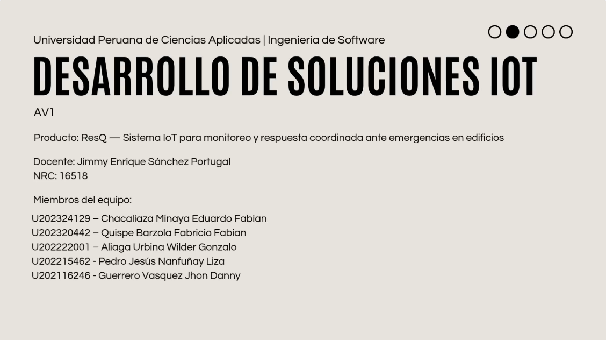

**Figura 10. Video de exposición correspondiente a la entrega AV1.**

**URL:** [URL PENDIENTE]

**Duración:** [HH:MM:SS PENDIENTE]
