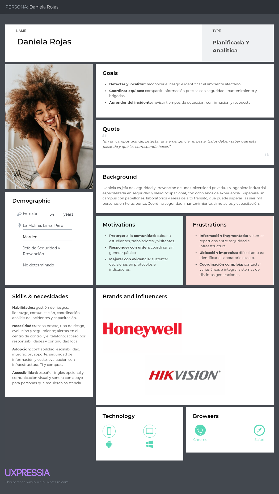
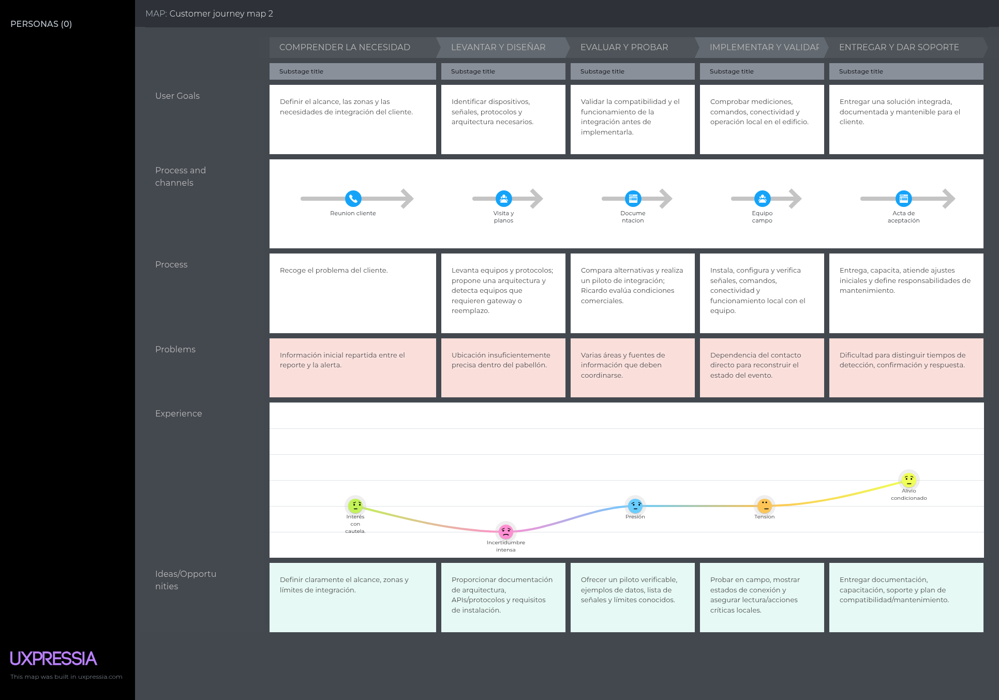
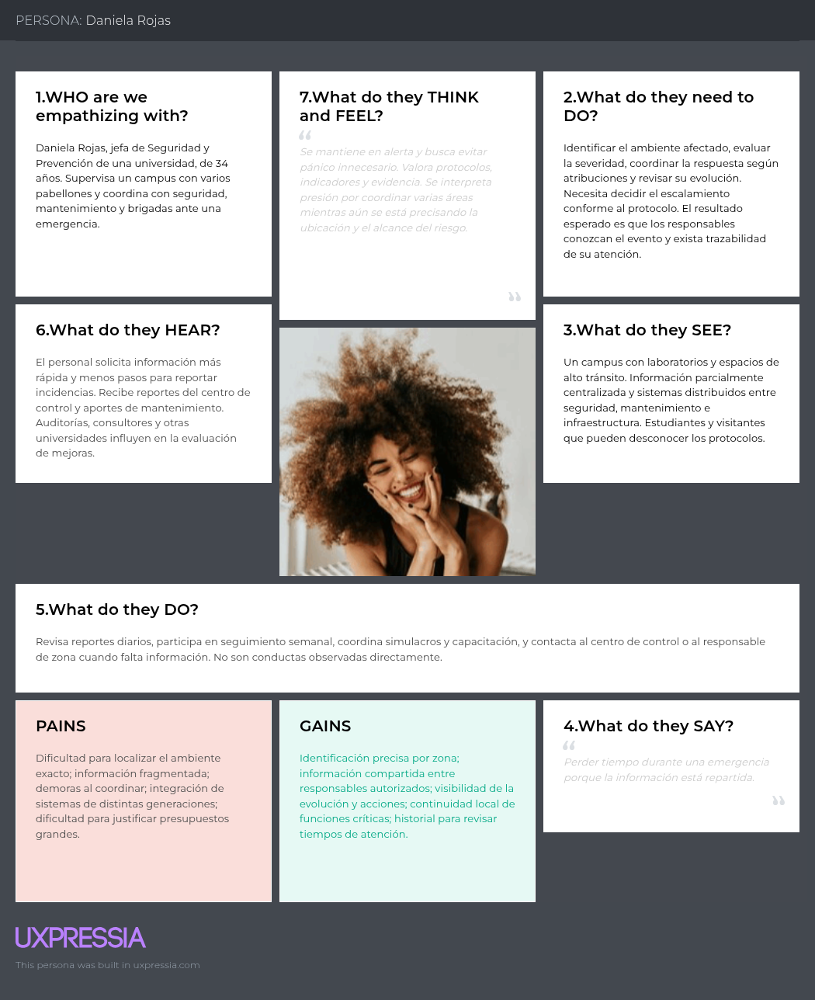

<!-- Carátula UPC -->

  

<h2 align="center">UNIVERSIDAD PERUANA DE CIENCIAS APLICADAS</h2>

<h3 align="center">
INGENIERÍA DE SOFTWARE
</h3>

<strong>PERIODO:</strong> 202620 

  1ACC0238 - Desarrollo de Soluciones IOT 
  <strong>NRC:</strong> 16518 
  <strong>Docente:</strong> Jimmy Enrique Sanchez Portugal

<h1 align="center">Informe de Trabajo Final</h1>

  <strong>Startup:</strong> ResQ 
  <strong>Producto:</strong> ResQ

<h3 align="center">Integrantes</h3>

  
U202320442 — Quispe Barzola, Fabricio Fabian

  
U202324129 — Chacaliaza Minaya, Eduardo Fabian

  
U202116246 - Guerrero Vasquez, Jhon Danny

  
Uasdasd

  
Usdasda

  

 

202620

<!--Registro de versiones-->
<h1 align="left">Registro de versiones del Informe</h1>
 
<table border="1" cellpadding="10" cellspacing="0" style="border-collapse: collapse; width: 100%;">
  <tr>
    <td align="center" style="border: 1px solid #ddd; padding: 8px;">Versión</td>
    <td align="center" style="border: 1px solid #ddd; padding: 8px;">Fecha</td>
    <td align="center" style="border: 1px solid #ddd; padding: 8px;">Autores</td>
    <td align="center" style="border: 1px solid #ddd; padding: 8px;">Descripción</td>
  </tr>
  <tr>
    <td style="border: 1px solid #ddd; padding: 8px;">AV1</td>
    <td style="border: 1px solid #ddd; padding: 8px;">fecha</td>
    <td style="border: 1px solid #ddd; padding: 8px;">
      <ul>
        <li>Nombre de integrante</li>
      </ul>
    </td>
    <td style="border: 1px solid #ddd; padding: 8px;">            
      <ul>
        <li>El punto que hizo</li>
        <li>El punto que hizo</li>
        <li>El punto que hizo</li>
        <li>El punto que hizo</li>
        </ul>
    </td>
  </tr>
  <tr>
  <td style="border: 1px solid #ddd; padding: 8px;">AV1</td>
  <td style="border: 1px solid #ddd; padding: 8px;">fecha</td>
  <td style="border: 1px solid #ddd; padding: 8px;">
    <ul>
      <li>Nombre de integrante</li>
    </ul>
  </td>
  <td style="border: 1px solid #ddd; padding: 8px;">            
    <ul>
      <li>El punto que hizo</li>
      <li>El punto que hizo</li>
      <li>El punto que hizo</li>
      <li>El punto que hizo</li>
      <li>El punto que hizo</li>
    </ul>
  </td>
</tr>
</table> 

<h1>Project Report Collaboration Insights</h1>

<h2>AV1</h2>

Para el desarrollo del informe perteneciente a la entrega AV1, se dividió la implementación de secciones del Capítulo I y II en bloques de trabajo, asignando cada conjunto de secciones a un integrante del equipo.

  

  

<table align="center" border="1" cellpadding="10" cellspacing="0" style="border-collapse: collapse; width: 100%;">
  <tr>
    <td align="center"><strong>Integrante</strong></td>
    <td align="center"><strong>Tareas Asignadas</strong></td>
  </tr>

  <!-- BLOQUE 1 -->
  <tr>
    <td>Integrante</td>
    <td>
      <ul>
        <li><strong>Capítulo I – Presentación</strong></li>
        <li>1.1 Startup Profile</li>
        <li>1.1.1 Descripción de la Startup</li>
        <li>1.1.2 Perfiles de integrantes del equipo</li>
        <li>1.2 Solution Profile</li>
        <li>1.2.1 Antecedentes y problemática</li>
        <li>1.2.2 Lean UX Process</li>
        <li>1.2.2.1 Lean UX Problem Statements</li>
        <li>1.2.2.2 Lean UX Assumptions</li>
        <li>1.2.2.3 Lean UX Hypothesis Statements</li>
        <li>1.2.2.4 Lean UX Canvas</li>
        <li>1.3 Segmentos objetivo</li>
      </ul>
    </td>
  </tr>
  <tr>
    <td>Integrante</td>
    <td>
      <ul>
        <li><strong>Capítulo II</strong></li>
        <li>2.1 Competidores</li>
        <li>2.1.1 Análisis competitivo</li>
        <li>2.1.2 Estrategias y tácticas frente a competidores</li>
        <li>2.2 Entrevistas</li>
        <li>2.2.1 Diseño de entrevistas</li>
        <li>2.2.2 Registro de entrevistas</li>
        <li>2.2.3 Análisis de entrevistas</li>
      </ul>
    </td>
  </tr>

  <!-- BLOQUE 2 -->
  <tr>
    <td>Jhon Guerrero V.</td>
    <td>
      <ul>
        <li>2.3 Needfinding</li>
        <li>2.3.1 User Personas</li>
        <li>2.3.2 User Task Matrix</li>
        <li>2.3.3 User Journey Mapping</li>
        <li>2.3.4 Empathy Mapping</li>
        <li>2.3.5 Big Picture EventStorming</li>
        <li>2.3.6 Ubiquitous Language</li>
      </ul>
    </td>
  </tr>

  <!-- BLOQUE 3 -->
  <tr>
    <td>Integrante</td>
    <td>
      <ul>
        <li>2.4 Requirements Specification</li>
        <li>2.4.1 User Stories</li>
        <li>2.4.2 Impact Mapping</li>
        <li>2.4.3 Product Backlog</li>
      </ul>
    </td>
  </tr>

  <!-- BLOQUE 4 -->
  <tr>
    <td>Integrante</td>
    <td>
      <ul>
        <li>2.5.1 EventStorming</li>
        <li>2.5.1.1 Candidate Context Discovery</li>
        <li>2.5.1.2 Domain Message Flows Modeling</li>
        <li>2.5.1.3 Bounded Context Canvases</li>
      </ul>
    </td>
  </tr>

  <!-- BLOQUE 5 -->
  <tr>
    <td>Integrante</td>
    <td>
      <ul>
        <li>2.5.2 Context Mapping</li>
      </ul>
    </td>
  </tr>

  <!-- BLOQUE 6 -->
  <tr>
    <td>Integrante</td>
    <td>
      <ul>
        <li>2.5.3 Software Architecture</li>
        <li>2.5.3.1 Context Level Diagrams</li>
        <li>2.5.3.2 Container Level Diagrams</li>
        <li>2.5.3.3 Deployment Diagrams</li>
      </ul>
    </td>
  </tr>

  <!-- BLOQUE 7 -->
  <tr>
    <td>Integrante</td>
    <td>
      <ul>
        <li><strong>2.6.1 Bounded Context: Bookings</strong></li>
        <li>2.6.1.1 Domain Layer</li>
        <li>2.6.1.2 Interface Layer</li>
        <li>2.6.1.3 Application Layer</li>
        <li>2.6.1.4 Infrastructure Layer</li>
        <li>2.6.1.5 Component Level Diagrams</li>
        <li>2.6.1.6 Code Level Diagrams</li>
        <li>2.6.1.6.1 Class Diagram</li>
        <li>2.6.1.6.2 Database Diagram</li>
</ul>
    </td>
  </tr>
<tr>
    <td>Integrante</td>
    <td>
      <ul>
        <li><strong>2.6.2 Bounded Context: Payments</strong></li>
        <li>2.6.2.1 Domain Layer</li>
        <li>2.6.2.2 Interface Layer</li>
        <li>2.6.2.3 Application Layer</li>
        <li>2.6.2.4 Infrastructure Layer</li>
        <li>2.6.2.5 Component Level Diagrams</li>
        <li>2.6.2.6 Code Level Diagrams</li>
        <li>2.6.2.6.1 Class Diagram</li>
        <li>2.6.2.6.2 Database Diagram</li>
</ul>
    </td>
  </tr>
  <tr>
    <td>Integrante</td>
    <td>
      <ul>
        <li><strong>2.6.3 Bounded Context: Users</strong></li>
        <li>2.6.3.1 Domain Layer</li>
        <li>2.6.3.2 Interface Layer</li>
        <li>2.6.3.3 Application Layer</li>
        <li>2.6.3.4 Infrastructure Layer</li>
        <li>2.6.3.5 Component Level Diagrams</li>
        <li>2.6.3.6 Code Level Diagrams</li>
        <li>2.6.3.6.1 Class Diagram</li>
        <li>2.6.3.6.2 Database Diagram</li>
      </ul>
    </td>
  </tr>

  <!-- BLOQUE 8 -->
  <tr>
    <td>Integrante</td>
    <td>
      <ul>
        <li><strong>2.6.4 Bounded Context: Coaches</strong></li>
        <li>2.6.4.1 Domain Layer</li>
        <li>2.6.4.2 Interface Layer</li>
        <li>2.6.4.3 Application Layer</li>
        <li>2.6.4.4 Infrastructure Layer</li>
        <li>2.6.4.5 Component Level Diagrams</li>
        <li>2.6.4.6 Code Level Diagrams</li>
        <li>2.6.4.6.1 Class Diagram</li>
        <li>2.6.4.6.2 Database Diagram</li>
        </ul>
    </td>
  </tr>
<tr>
    <td>Integrante</td>
    <td>
      <ul>
        <li><strong>2.6.5 Bounded Context: Courts</strong></li>
        <li>2.6.5.1 Domain Layer</li>
        <li>2.6.5.2 Interface Layer</li>
        <li>2.6.5.3 Application Layer</li>
        <li>2.6.5.4 Infrastructure Layer</li>
        <li>2.6.5.5 Component Level Diagrams</li>
        <li>2.6.5.6 Code Level Diagrams</li>
        <li>2.6.5.6.1 Class Diagram</li>
        <li>2.6.5.6.2 Database Diagram</li>
        </ul>
    </td>
  </tr>
<tr>
    <td>Integrante</td>
    <td>
      <ul>
        <li><strong>2.6.6 Bounded Context: Availabilities</strong></li>
        <li>2.6.6.1 Domain Layer</li>
        <li>2.6.6.2 Interface Layer</li>
        <li>2.6.6.3 Application Layer</li>
        <li>2.6.6.4 Infrastructure Layer</li>
        <li>2.6.6.5 Component Level Diagrams</li>
        <li>2.6.6.6 Code Level Diagrams</li>
        <li>2.6.6.6.1 Class Diagram</li>
        <li>2.6.6.6.2 Database Diagram</li>
        </ul>
    </td>
  </tr>
  <tr>
    <td>Integrante</td>
    <td>
      <ul>
        <li><strong>2.6.7 Bounded Context: Reviews</strong></li>
        <li>2.6.7.1 Domain Layer</li>
        <li>2.6.7.2 Interface Layer</li>
        <li>2.6.7.3 Application Layer</li>
        <li>2.6.7.4 Infrastructure Layer</li>
        <li>2.6.7.5 Component Level Diagrams</li>
        <li>2.6.7.6 Code Level Diagrams</li>
        <li>2.6.7.6.1 Class Diagram</li>
        <li>2.6.7.6.2 Database Diagram</li>
      </ul>
    </td>
  </tr>

</table>

# Contenido

- [Student Outcome](#student-outcome)

- [Capítulo I: Introducción](#capítulo-i-introducción)
  - [1.1. Startup Profile](#11-startup-profile)
    - [1.1.1. Descripción de la Startup](#111-descripción-de-la-startup)
    - [1.1.2. Perfiles de integrantes del equipo](#112-perfiles-de-integrantes-del-equipo)
  - [1.2. Solution Profile](#12-solution-profile)
    - [1.2.1. Antecedentes y problemática](#121-antecedentes-y-problemática)
    - [1.2.2. Lean UX Process](#122-lean-ux-process)
      - [1.2.2.1. Lean UX Problem Statements](#1221-lean-ux-problem-statements)
      - [1.2.2.2. Lean UX Assumptions](#1222-lean-ux-assumptions)
      - [1.2.2.3. Lean UX Hypothesis Statements](#1223-lean-ux-hypothesis-statements)
      - [1.2.2.4. Lean UX Canvas](#1224-lean-ux-canvas)
  - [1.3. Segmentos objetivo](#13-segmentos-objetivo)

- [Capítulo II: Requirements Elicitation & Analysis](#capítulo-ii-requirements-elicitation--analysis)
  - [2.1. Competidores](#21-competidores)
    - [2.1.1. Análisis competitivo](#211-análisis-competitivo)
    - [2.1.2. Estrategias y tácticas frente a competidores](#212-estrategias-y-tácticas-frente-a-competidores)
  - [2.2. Entrevistas](#22-entrevistas)
    - [2.2.1. Diseño de entrevistas](#221-diseño-de-entrevistas)
    - [2.2.2. Registro de entrevistas](#222-registro-de-entrevistas)
    - [2.2.3. Análisis de entrevistas](#223-análisis-de-entrevistas)
  - [2.3. Needfinding](#23-needfinding)
    - [2.3.1. User Personas](#231-user-personas)
    - [2.3.2. User Task Matrix](#232-user-task-matrix)
    - [2.3.3. User Journey Mapping](#233-user-journey-mapping)
    - [2.3.4. Empathy Mapping](#234-empathy-mapping)
  - [2.4. Big Picture EventStorming](#24-big-picture-eventstorming)
  - [2.5. Ubiquitous Language](#25-ubiquitous-language)

- [Capítulo III: Requirements Specification](#capítulo-iii-requirements-specification)
  - [3.1. User Stories](#31-user-stories)
  - [3.2. Impact Mapping](#32-impact-mapping)
  - [3.3. Product Backlog](#33-product-backlog)

- [Capítulo IV: Solution Software Design](#capítulo-iv-solution-software-design)
  - [4.1. Strategic-Level Domain-Driven Design](#41-strategic-level-domain-driven-design)
    - [4.1.1. Design-Level EventStorming](#411-design-level-eventstorming)
      - [4.1.1.1. Candidate Context Discovery](#4111-candidate-context-discovery)
      - [4.1.1.2. Domain Message Flows Modeling](#4112-domain-message-flows-modeling)
      - [4.1.1.3. Bounded Context Canvases](#4113-bounded-context-canvases)
    - [4.1.2. Context Mapping](#412-context-mapping)
    - [4.1.3. Software Architecture](#413-software-architecture)
      - [4.1.3.1. Software Architecture System Landscape Diagram](#4131-software-architecture-system-landscape-diagram)
      - [4.1.3.2. Software Architecture Context Level Diagrams](#4132-software-architecture-context-level-diagrams)
      - [4.1.3.2. Software Architecture Container Level Diagrams](#4132-software-architecture-container-level-diagrams)
      - [4.1.3.3. Software Architecture Deployment Diagrams](#4133-software-architecture-deployment-diagrams)
  - [4.2. Tactical-Level Domain-Driven Design](#42-tactical-level-domain-driven-design)
    - [4.2.X. Bounded Context: \<Bounded Context Name\>](#42x-bounded-context-)
      - [4.2.X.1. Domain Layer](#42x1-domain-layer)
      - [4.2.X.2. Interface Layer](#42x2-interface-layer)
      - [4.2.X.3. Application Layer](#42x3-application-layer)
      - [4.2.X.4. Infrastructure Layer](#42x4-infrastructure-layer)
      - [4.2.X.5. Bounded Context Software Architecture Component Level Diagrams](#42x5-bounded-context-software-architecture-component-level-diagrams)
      - [4.2.X.6. Bounded Context Software Architecture Code Level Diagrams](#42x6-bounded-context-software-architecture-code-level-diagrams)
      - [4.2.X.6.1. Bounded Context Domain Layer Class Diagrams](#42x61-bounded-context-domain-layer-class-diagrams)
      - [4.2.X.6.2. Bounded Context Database Design Diagram](#42x62-bounded-context-database-design-diagram)

- [Capítulo V: Solution UI/UX Design](#capítulo-v-solution-uiux-design)
  - [5.1. Style Guidelines](#51-style-guidelines)
    - [5.1.1. General Style Guidelines](#511-general-style-guidelines)
    - [5.1.2. Web, Mobile and IoT Style Guidelines](#512-web-mobile-and-iot-style-guidelines)
  - [5.2. Information Architecture](#52-information-architecture)
    - [5.2.1. Organization Systems](#521-organization-systems)
    - [5.2.2. Labeling Systems](#522-labeling-systems)
    - [5.2.3. SEO Tags and Meta Tags](#523-seo-tags-and-meta-tags)
    - [5.2.4. Searching Systems](#524-searching-systems)
    - [5.2.5. Navigation Systems](#525-navigation-systems)
  - [5.3. Landing Page UI Design](#53-landing-page-ui-design)
    - [5.3.1. Landing Page Wireframe](#531-landing-page-wireframe)
    - [5.3.2. Landing Page Mock-up](#532-landing-page-mock-up)
  - [5.4. Applications UX/UI Design](#54-applications-uxui-design)
    - [5.4.1. Applications Wireframes](#541-applications-wireframes)
    - [5.4.2. Applications Wireflow Diagrams](#542-applications-wireflow-diagrams)
    - [5.4.2. Applications Mock-ups](#542-applications-mock-ups)
    - [5.4.3. Applications User Flow Diagrams](#543-applications-user-flow-diagrams)
  - [5.5. Applications Prototyping](#55-applications-prototyping)
  - [5.6. IoT Device Design](#56-iot-device-design)

- [Capítulo VI: Product Implementation, Validation & Deployment](#capítulo-vi-product-implementation-validation--deployment)
  - [6.1. Software Configuration Management](#61-software-configuration-management)
    - [6.1.1. Software Development Environment Configuration](#611-software-development-environment-configuration)
    - [6.1.2. Source Code Management](#612-source-code-management)
    - [6.1.3. Source Code Style Guide & Conventions](#613-source-code-style-guide--conventions)
    - [6.1.4. Software Deployment Configuration](#614-software-deployment-configuration)
  - [6.2. Landing Page, Services & Applications Implementation](#62-landing-page-services--applications-implementation)
    - [6.2.X. Sprint n](#621-sprint-1)
      - [6.2.X.1. Sprint Planning n](#6211-sprint-planning-1)
      - [6.2.X.2. Aspect Leaders and Collaborators](#6212-aspect-leaders-and-collaborators)
      - [6.2.X.3. Sprint Backlog n](#6213-sprint-backlog-1)
      - [6.2.X.4. Development Evidence for Sprint Review](#6214-development-evidence-for-sprint-review)
      - [6.2.X.5. Testing Suite Evidence for Sprint Review](#6215-testing-suite-evidence-for-sprint-review)
      - [6.2.X.6. Execution Evidence for Sprint Review](#6216-execution-evidence-for-sprint-review)
      - [6.2.X.7. Services Documentation Evidence for Sprint Review](#6217-services-documentation-evidence-for-sprint-review)
      - [6.2.X.8. Software Deployment Evidence for Sprint Review](#6218-software-deployment-evidence-for-sprint-review)
      - [6.2.X.9. Team Collaboration Insights during Sprint](#6219-team-collaboration-insights-during-sprint)
  - [6.3. Validation Interviews](#63-validation-interviews)
    - [6.3.1. Diseño de Entrevistas](#631-diseño-de-entrevistas)
    - [6.3.2. Registro de Entrevistas](#632-registro-de-entrevistas)
    - [6.3.3. Evaluaciones según heurísticas](#633-evaluaciones-según-heurísticas)
  - [6.4. Video About-the-Product](#64-video-about-the-product)

- [Conclusiones](#conclusiones)
  - [Conclusiones y recomendaciones](#conclusiones-y-recomendaciones)
  - [Video About-the-Team](#video-about-the-team)

- [Bibliografía](#bibliografía)

- [Anexos](#anexos)

## Registro de Versiones del Informe 

| Versión | Fecha | Autor | Descripción de modificación |
|---|---|---|---|
| 0.1 | [dd/mm/aaaa] | [Integrante] | Creación inicial de la estructura del Project Report. |

**Regla del Project Statement:** cada fila debe tener un solo autor y reflejar adiciones,
eliminaciones, correcciones o mejoras relevantes del informe.

---

## Project Report Collaboration Insights

**URL del repositorio público de GitHub:** [COMPLETAR]

Esta sección debe crecer en cada entrega (AV1, TB1, AV2 y TB2) e incluir:

- explicación de cómo se elaboró colaborativamente el informe;
- capturas de analíticos de colaboración;
- capturas/evidencias de commits;
- interpretación de la participación del equipo;
- coherencia con el Registro de Versiones del Informe.

Guardar imágenes generales de colaboración en:
`assets/images/general/collaboration/`

### AV1 — Sprint Review
[COMPLETAR]

### TB1 — Stage Review
[COMPLETAR]

### AV2 — Sprint Review
[COMPLETAR]

### TB2 — Release Review
[COMPLETAR]

---

# Student Outcome

El curso contribuye al **ABET Student Outcome 5**.

## Evidencias por entrega

### AV1

| Criterio específico | Integrante | Acciones realizadas | Conclusiones |
|---|---|---|---|
| Trabaja en equipo para proporcionar liderazgo en forma conjunta | [Nombre] | [COMPLETAR] | [COMPLETAR] |
| Crea un entorno colaborativo e inclusivo, establece metas, planifica tareas y cumple objetivos | [Nombre] | [COMPLETAR] | [COMPLETAR] |

### TB1
[Actualizar]

### AV2
[Actualizar]

### TB2
[Actualizar]

Guardar capturas/evidencias generales relacionadas en:
`assets/images/general/student-outcome/`

# Capítulo I: Introducción

> Imágenes del capítulo:
> `assets/images/chapter-01-introduction/`

## 1.1. Startup Profile

### 1.1.1. Descripción de la Startup
En una ciudad como Lima, caracterizada por su alta densidad de edificios y su constante vulnerabilidad ante emergencias como fugas de gas o movimientos sísmicos, la seguridad preventiva es un desafío crítico. Actualmente, la gestión de estos riesgos presenta grandes deficiencias: un simple error en la detección o el uso de múltiples alarmas desconectadas (que en el mejor de los casos solo emiten un aviso sonoro y dependen por completo de la rápida intervención humana) puede poner vidas en riesgo. Frente a esta realidad surge SecurityBear, una startup creada por estudiantes de la Facultad de Ingeniería de la Universidad Peruana de Ciencias Aplicadas (UPC). Reconocemos que, muchas veces, cuando las familias, trabajadores o empresas buscan estar verdaderamente preparados para cualquier eventualidad, se enfrentan a un mercado confuso y fragmentado. Surgen constantes dudas sobre cuántos dispositivos distintos se deben adquirir, su nivel de integración tecnológica y, sobre todo, si serán capaces de reportar un siniestro de manera automática y sin demoras.

Con nuestro sistema inteligente e integrado, centralizamos la detección de múltiples amenazas en un solo dispositivo automatizada. Utilizamos tecnología de sensores avanzados para identificar riesgos al instante, notificando a los usuarios en tiempo real y eliminando los retrasos propios de la intervención manual. Nuestro enfoque se centra en brindar tranquilidad y eficiencia, transformando la prevención de emergencias en algo accesible, seguro y capaz de actuar cuando cada segundo cuenta.

### 1.1.2. Perfiles de integrantes del equipo

| Nombres y Apellidos | Código | Descripción | Foto |
|---|---|---|---|
| Ivan Fernando Sanchez Guevara | U202218181 | Mi nombre es Fernando Sanchez Guevara, tengo 22 años y actualmente estudio la carrera de Ingeniería de Software. Me considero una persona disciplinada, responsable y puntual al momento de desarrollar las asignaciones de trabajo. Además, me preocupo por mantener una buena coordinación con mi equipo, procurando apoyar a mis compañeros cuando presentan alguna dificultad. Gracias a mi compromiso y disposición para colaborar, he contribuido al desarrollo adecuado de diferentes proyectos grupales, buscando cumplir los objetivos establecidos y resolver los inconvenientes que puedan surgir durante el proceso. |  |
| Eduardo Fabian Chacaliza Minaya | U202324129 | Mi nombre es Eduardo Fabian Chacaliza Minaya y actualmente estudio la carrera de Ingeniería de Software. Me considero una persona responsable, organizada y comprometida con el cumplimiento de los objetivos del equipo. Tengo interés en el desarrollo de soluciones tecnológicas y en la integración de los diferentes componentes de un proyecto. Durante los trabajos grupales procuro mantener una comunicación constante con mis compañeros, colaborar en la resolución de problemas y apoyar en la integración y validación de las distintas partes del proyecto para obtener un resultado consistente y funcional. |  |

## 1.2. Solution Profile

### 1.2.1. Antecedentes y problemática
### What (¿Qué?)
- **¿Cuál es el problema?**  
La dificultad de gestionar múltiples alarmas durante emergencias, lo que ocasiona que las personas no cuenten con información clara ni oportuna sobre los protocolos y rutas de evacuación a seguir. Esto resulta en desorientación y pánico, aumentando el riesgo de que los usuarios sufran lesiones o queden atrapados al no saber cómo actuar ni adónde dirigirse durante un desastre.
- **¿Cuál es la relación con la persona en cuestión?**  
La relación con los usuarios se basa en ofrecerles una herramienta centralizada que simplifica la gestión de sensores y alertas en un solo ecosistema. Esto reduce la complejidad y proporciona información detallada, automatizada y fácil de comprender para actuar correctamente en casos de emergencia.

### When (¿Cuándo?)
- **¿Cuándo sucede el problema?**  
El problema ocurre de imprevisto antes y durante la emergencia. Principalmente al momento de intentar identificar la amenaza y seguir un protocolo de evacuación, donde la confusión y falta de indicaciones claras pueden ocasionar accidentes, obstrucción de vías de escape o el riesgo de quedar atrapado bajo los escombros.
- **¿Cuándo utiliza el cliente el producto?**  
El usuario utilizaría el sistema (SecurityBear / ResQ) en dos momentos clave: 1) En el instante crítico, para recibir una alerta temprana que identifique qué tipo de emergencia está ocurriendo (sismo, fuga de gas, incendio), y 2) Durante la evacuación, para recibir instrucciones y protocolos específicos que debe aplicar para ese caso en particular.

### Where (¿Dónde?)
- **¿Dónde está el cliente cuando utiliza el producto?**  
Desde cualquier lugar dentro de una infraestructura monitoreada, ya sea su hogar, su centro de trabajo, un centro comercial o un local.
- **¿A dónde se dirige?**  
El usuario se dirige hacia las zonas de seguridad establecidas, ya sean áreas de evacuación externas (zonas amplias y despejadas) o zonas de seguridad internas (como columnas o pilares estructurales antisísmicos).
- **¿Dónde surge el problema?**  
El problema se origina en el entorno físico afectado justo en el momento de la emergencia, agravado por la falta de un sistema unificado que guíe las decisiones en tiempo real. Surge en la brecha entre la activación de una alarma tradicional (que a lo mucho solo emite ruido) y la necesidad vital de conocer las acciones y rutas exactas que se deben tomar.

### Who (¿Quiénes?)
- **¿Quiénes están involucrados?**  
Los principales involucrados son todas las personas que se encuentren dentro de una estructura o edificio (residentes, trabajadores, visitantes), los administradores del recinto y los equipos de seguridad o brigadistas encargados de gestionar la emergencia.
- **¿A quiénes les sucede el problema?**  
El problema afecta principalmente a las personas que ocupan la edificación en el momento del siniestro, quienes sufren desorientación y exposición al peligro. También impacta a los responsables de seguridad y administradores de edificios, quienes enfrentan la dificultad de coordinar evacuaciones sin herramientas tecnológicas automatizadas.
- **¿Quién lo utiliza?**  
El sistema será utilizado por familias en edificios residenciales, trabajadores en oficinas y corporativos, así como administradores de instalaciones. Principalmente, está dirigido a personas e instituciones que valoran la prevención de riesgos y buscan una respuesta rápida, segura y guiada ante desastres.

### Why (¿Por qué?)
- **¿Cuál es la causa del problema?**  
La falta de un sistema centralizado, automatizado e inteligente para la gestión de riesgos. Actualmente, los edificios dependen de alarmas independientes y no interconectadas que solo generan ruido, dejando a los usuarios sin instrucciones claras, dependientes de la memoria humana y propensos a cometer errores fatales debido al estrés y el pánico del momento.

### How (¿Cómo?)
- **¿En qué condiciones nuestros clientes usan el producto?**  
Los clientes utilizan el sistema en condiciones de alto estrés, urgencia y posible pánico, con un tiempo de reacción muy limitado. Por ello, el producto funciona de manera automática, emitiendo alertas claras, directas y visuales/auditivas que no requieren interpretación compleja por parte del usuario.
- **¿Cómo nos conocieron nuestros compradores?**  
A través de alianzas estratégicas con constructoras y juntas de propietarios, ferias de seguridad y prevención de riesgos (Defensa Civil), marketing digital enfocado en la protección familiar y empresarial, y recomendaciones de consultores de seguridad laboral e infraestructura.
- **¿Cómo prefieren nuestros consumidores acceder a nuestro producto?**  
Mediante un sistema de hardware instalado en puntos clave del edificio (sensores inteligentes) que se sincroniza directamente con una aplicación móvil (ResQ) o un panel de control, permitiendo a los usuarios recibir notificaciones en tiempo real, conocer el estado de su entorno y revisar los protocolos preventivos desde sus smartphones.
- **¿Qué llevó a la persona a esa situación?**  
La vulnerabilidad inherente de vivir o trabajar en una ciudad con alto riesgo sísmico y fallas en infraestructuras (como fugas de gas o incendios). El profundo deseo de proteger su vida, la de su familia o la de sus empleados, sumado a la frustración de saber que los sistemas tradicionales son insuficientes para guiar a las personas cuando realmente importa.

### How much (¿Cuánto?)
El Perú se encuentra en el Cinturón de Fuego del Pacífico, lo que hace que ciudades como Lima sean altamente vulnerables a sismos de gran magnitud. Según proyecciones de Defensa Civil (INDECI), un terremoto severo en la capital podría dejar cientos de miles de damnificados debido a la alta densidad poblacional y la falta de preparación. Sumado a esto, el Cuerpo General de Bomberos atiende anualmente miles de emergencias por fugas de gas e incendios urbanos, donde una detección tardía suele escalar a tragedias irreparables. La desorientación durante los primeros minutos de un siniestro incrementa exponencialmente el riesgo de mortalidad y lesiones. SecurityBear busca reducir este impacto crítico al centralizar la detección de amenazas y eliminar la dependencia exclusiva del factor humano para dar aviso. Al optimizar los tiempos de respuesta y brindar directrices claras de evacuación a través de la tecnología, nuestra plataforma contribuye directamente a salvar vidas, mitigar daños personales y reducir las pérdidas materiales ocasionadas por la falta de una alerta temprana y coordinada.

### 1.2.2. Lean UX Process

#### 1.2.2.1. Lean UX Problem Statements
El estado actual de la seguridad y gestión de emergencias en edificios se ha enfocado principalmente en el uso de sistemas independientes y de propósito único; como detectores de humo, alarmas de gas o protocolos de evacuación manuales. Estos mecanismos son utilizados por administradores y responsables de seguridad de los edificios para identificar situaciones de riesgo; sin embargo, en muchos casos requieren de la intervención humana para coordinar una respuesta adecuada y reducir los posibles daños sobre las personas y la infraestructura.

Lo que las soluciones existentes no suelen resolver de manera integrada es la coordinación de la información entre la detección de una emergencia y la ejecución de una respuesta física ante ella. Esto dificulta centralizar la información obtenida, emitir alertas precisas, identificar el tipo de emergencia, ubicar la zona afectada y activar respuestas diferenciadas de acuerdo con las caracterísiticas y el nivel de gravedad del evento. Asimismo, muchos sistemas dependen de mecanismos de monitoreo o comunicación centralizados, lo que puede limitar su capacidad de respuesta cuando se pierde temporalmente la conectividad a Internet durante una emergencia.

Nuestra solución abordará esta brecha mediante una plataforma IoT capaz de monitorear variables ambientales y fisicas del edificio, procesar localmente la información obtenida de los sensores mediante Edge Computing, clasificar el tipo y grado de la emergencia y ejecutar acciones automáticas a través de actuadores (alarmas, luces de evacuación, ventilación, cierre de válvula) mientras reporta el evento y el estado del edificio en tiempo real.

Nuestro enfoque inicial estará dirigido a los propietarios y administradores de edificaciones que requieren supervisar las condiciones de seguridad de sus instalaciones para responder oportunamente ante situaciones de riesgo. La propuesta también estará orientada a responsables de seguridad, operaciones e infraestructura de empresas e instituciones que necesitan centralizar el monitoreo y coordinar respuestas en instalaciones con diferentes zonas y niveles de concurrencia.

Sabremos que hemos tenido éxito cuando los representantes de ambos segmentos utilicen la aplicación para monitorear el estado del edificio, reconocer el tipo y nivel de riesgo, ubicar la zona afectada, verificar la activación automática de respuestas adecuadas de los actuadores y consultar posteriormente los eventos registrados. Asimismo, consideraremos el interés de estos responsables por incorporar nuestra solución como complemento de sus mecanismos actuales de seguridad.

#### 1.2.2.2. Lean UX Assumptions

**Business Assumptions:**

1. Creemos que existe una demanda insatisfecha en el mercado de administración de edificios por soluciones que centralicen monitoreo y respuesta ante emergencias, actualmente cubierta parcialmente por sistemas aislados.
2. Creemos que existe una oportunidad para integrar en una única solución IoT la detección, clasificación, localización y respuesta automática ante situaciones de riesgo dentro de edificios.
3. Creemos que los propietarios y administradores de edificaciones, así como las empresas e instituciones con infraestructura propia, estarán dispuestas a adoptar una solución que complemente sus mecanismos actuales de seguridad mediante monitoreo y automatización.
4. Creemos que la capacidad de ejecutar respuestas críticas localmente, sin depender permanentemente de la conectividad a Internet, constituirá un elemento diferenciador de la propuesta frente a sistemas que requieren comunicación constante con servicios externos.
5. Creemos que un modelo de servicio orientado a edificios permitirá escalar progresivamente la solución mediante la incorporación de nuevos sensores, actuadores, zonas y dispositivos IoT según las necesidades de cada organización.
6. Creemos que los clientes estarán dispuestos a asumir un costo por una solución que contribuya al monitoreo continuo, la trazabilidad de eventos y la automatización de determinadas respuestas de seguridad.

**Business Outcome Assumptions:**

1. Creemos que demostrar una solución integrada de monitoreo y respuesta ante emergencias incrementará el interés de potenciales clientes en adoptar la plataforma frente al uso exclusivo de mecanismos independientes o manuales.
2. Creemos que al garantizar que las respuestas automáticas y del monitoreo sean las adecuadas, estas incrementarán la confiabilidad y por consecuencia; la intención de permanencia y renovación de nuestro servicio por parte de las organizaciones, reduciendo potencialmente la tasa de cancelación.
3. Creemos que reducir el esfuerzo requerido para supervisar manualmente las condiciones de seguridad del edificio incrementará el valor percibido de la plataforma y la disposición de las organizaciones a pagar por el servicio.
4. Creemos que la disponibilidad de registros históricos sobre eventos detectados, mediciones y respuestas ejecutadas incrementará el uso recurrente de la plataforma para actividades de supervisión y seguimiento.
5. Creemos que la posibilidad de incorporar progresivamente nuevas zonas, sensores y actuadores permitirá incrementar el alcance del servicio, expandiendo nuestra solución a nuevas necesidades.
6. Creemos que una implementación satisfactoria del MVP permitirá validar el interés de potenciales clientes y justificar la evolución de la solución hacia una mayor cantidad de dispositivos, tipos de emergencia y capacidades de respuesta.

**User Assumptions:**

1. Creemos que los propietarios y administradores de edificaciones necesitan supervisar continuamente las condiciones de seguridad de las instalaciones bajo su responsabilidad.
2. Creemos que los responsables de seguridad, operaciones e infraestructura de empresas e instituciones necesitan centralizar la información proveniente de diferentes zonas de sus instalaciones.
3. Creemos que ambos segmentos necesitan identificar rápidamente qué tipo de emergencia está ocurriendo, cuál es su nivel de riesgo y dónde se ha producido.
4. Creemos que ambos segmentos necesitan conocer qué respuestas automáticas fueron ejecutadas por el sistema durante una situación de riesgo.
5. Creemos que los administradores y responsables institucionales necesitan consultar posteriormente información sobre los eventos ocurridos para realizar actividades de seguimiento y análisis.
6. Creemos que los usuarios de ambos segmentos cuentan habitualmente con acceso a dispositivos digitales y están familiarizados con aplicaciones utilizadas para tareas de supervisión o gestión.
7. Creemos que los responsables de empresas e instituciones necesitan supervisar múltiples zonas desde una visión centralizada para coordinar adecuadamente una respuesta.
8. Creemos que los responsables de ambos segmentos valorarán una solución que pueda incorporarse progresivamente a la infraestructura existente sin requerir una sustitución completa de sus mecanismos actuales de seguridad.

**User Outcome and Benefit Assumptions:**

1. Creemos que los propietarios, administradores y responsables institucionales podrán comprender con mayor rapidez el estado de sus edificaciones al contar con información de sensores y alertas centralizada en una misma plataforma.
2. Creemos que podrán tomar decisiones con mayor rapidez al conocer el tipo de emergencia, el nivel de riesgo y la zona afectada.
3. Creemos que tendrán mayor visibilidad sobre la respuesta del sistema al poder verificar qué acciones automáticas fueron ejecutadas durante cada evento.
4. Creemos que podrán realizar un mejor seguimiento de las emergencias mediante el acceso al historial de eventos, mediciones y acciones ejecutadas.
5. Creemos que los responsables de empresas e instituciones podrán coordinar mejor la respuesta ante una emergencia al disponer de información centralizada sobre las diferentes zonas de sus instalaciones.
6. Creemos que ambos segmentos podrán reducir su dependencia de la supervisión y coordinación completamente manual durante los primeros momentos de una emergencia.
7. Creemos que tendrán mayor confianza en la continuidad de la respuesta del sistema al mantenerse las acciones críticas locales aun cuando se pierda temporalmente la conexión a Internet.

**Feature Assumptions:**

1. Creemos que una funcionalidad de **monitoreo del estado del edificio y sus zonas** permitirá a los usuarios de ambos segmentos conocer las condiciones actuales y detectar rápidamente la existencia de una situación de riesgo.
2. Creemos que una funcionalidad de **detección y clasificación local de emergencias mediante sensores y Edge Computing** permitirá identificar el tipo y nivel de riesgo sin depender permanentemente de servicios externos.
3. Creemos que una funcionalidad de **respuesta automática mediante actuadores** permitirá ejecutar acciones de seguridad apropiadas según el tipo y nivel de riesgo detectado.
4. Creemos que una funcionalidad de **alertas y señalización diferenciadas** permitirá a los responsables reconocer oportunamente la existencia y gravedad de una emergencia, y facilitar la comunicación de la respuesta.
5. Creemos que una funcionalidad de **identificación de la zona afectada** permitirá a los responsables de seguridad localizar con mayor rapidez el origen del evento y orientar adecuadamente la respuesta.
6. Creemos que una funcionalidad de **registro e historial de eventos** permitirá consultar posteriormente las emergencias detectadas, las mediciones registradas y las respuestas ejecutadas por el sistema.

#### 1.2.2.3. Lean UX Hypothesis Statements

1. Creemos que lograremos incrementar el valor percibido de la plataforma y la disposición a pagar por el servicio si los propietarios, administradores y responsables institucionales logran comprender con mayor rapidez el estado de sus edificaciones y zonas mediante una funcionalidad de monitoreo centralizado.
2. Creemos que lograremos incrementar la confiabilidad percibida de la plataforma y la intención de permanencia y renovación del servicio si los usuarios de ambos segmentos pueden identificar oportunamente el tipo y nivel de riesgo y mantener la capacidad de respuesta ante una pérdida temporal de conectividad mediante una funcionalidad de detección y clasificación local basada en sensores y Edge Computing.
3. Creemos que lograremos incrementar el valor percibido de la plataforma y la disposición a pagar por el servicio si los propietarios, administradores y responsables institucionales obtienen mayor confianza y visibilidad sobre la respuesta ante una emergencia mediante la ejecución automática de acciones de seguridad apropiadas según el tipo y nivel de riesgo detectado.
4. Creemos que lograremos incrementar el interés y valor percibido de la plataforma si los responsables de ambos segmentos pueden reconocer oportunamente la existencia y naturaleza de una emergencia y coordinar una respuesta más clara mediante alertas y señalización diferenciadas.
5. Creemos que lograremos incrementar el valor percibido de la plataforma para las actividades de supervisión y respuesta si los propietarios, administradores y responsables institucionales pueden tomar decisiones con mayor rapidez al conocer la ubicación del riesgo mediante una funcionalidad de identificación de la zona afectada.
6. Creemos que lograremos incrementar el uso recurrente de la plataforma para actividades de supervisión y seguimiento si los usuarios pueden analizar posteriormente las emergencias ocurridas mediante una funcionalidad de registro e historial de eventos, mediciones y respuestas ejecutadas.

#### 1.2.2.4. Lean UX Canvas

El Lean UX Canvas sintetiza los principales elementos identificados durante el Lean UX Process, relacionando el problema de negocio, los resultados esperados, los usuarios, los beneficios, las posibles soluciones y las hipótesis planteadas.

**Link del Canvas:** https://miro.com/app/board/uXjVHqdK0Tc=/?share_link_id=104899432918

En **Business Problem** se identificó que los sistemas de seguridad en edificios suelen funcionar de manera aislada y requieren intervención humana para coordinar la respuesta ante una emergencia. En **Business Outcomes** se definieron comportamientos esperados como el interés por adoptar la plataforma, la renovación del servicio, el uso recurrente y la disposición a pagar por sus funcionalidades.

En **Users and Customers** se consideró como usuarios principales a los administradores y responsables de seguridad, mientras que los ocupantes del edificio representan el segmento beneficiado por las alertas y mecanismos de evacuación. Los **User Benefits** se enfocan en comprender rápidamente el estado del edificio, identificar el tipo y ubicación del riesgo, conocer las respuestas ejecutadas y mantener acciones críticas aun sin conexión a Internet.

Las **Solution Ideas** incluyen el monitoreo por zonas, detección y clasificación local mediante Edge Computing, activación automática de actuadores, alertas diferenciadas, identificación de la zona afectada e historial de eventos. A partir de estas soluciones se formularon las hipótesis que deberán ser validadas durante el desarrollo del proyecto.

Finalmente, se identificó como principales aspectos a validar; la confianza de los usuarios en la automatización, la capacidad del sistema para clasificar correctamente los riesgos y la comprensión de las alertas por parte de los ocupantes. Para ello se llevarán a cabo entrevistas, pruebas de prototipo y pruebas de concepto con el dispositivo IoT.

## 1.3. Segmentos objetivo

Para garantizar que la solución IoT responda de manera adecuada a las necesidades de seguridad y gestión de emergencias en edificaciones, se han identificado dos segmentos principales vinculados directamente con el problema.

A continuación, se presentan sus principales características demográficas, geográficas y psicográficas, así como las necesidades que justifican su relevancia para la propuesta.

### Segmento objetivo #1: Propietarios y administradores de edificaciones

Este segmento está conformado por propietarios, administradores, facility managers y responsables de la gestión de edificios residenciales, comerciales o de uso mixto que buscan mejorar la capacidad de detección y respuesta ante situaciones de emergencia. Según el INDECI, entre 2012 y 2023 se registraron 3,005 incendios urbanos en el departamento de Lima, lo que evidencia la necesidad de contar con mecanismos de monitoreo y respuesta oportuna ante eventos críticos en edificaciones.

#### Aspectos demográficos

- **Sexo:** Masculino y femenino.
- **Rango de edad:** 30 años a más.
- **Nivel socioeconómico:** Principalmente clases A, B y C.
- **Ocupación:** Propietarios de inmuebles, administradores de edificios y responsables de mantenimiento, seguridad o gestión de instalaciones.

#### Aspectos geográficos

- **Nacionalidad:** Peruana.
- **Zona geográfica:** Principalmente zonas urbanas de Lima Metropolitana y otras ciudades con alta concentración de edificios residenciales, comerciales y empresariales.

#### Aspectos psicográficos

- **Dolor principal:** Dependencia de sistemas que se limitan a generar alertas y que requieren intervención humana para ejecutar acciones posteriores ante una emergencia.
- **Intereses:** Seguridad de los ocupantes, automatización de edificios, monitoreo remoto, prevención de riesgos y modernización de infraestructura.
- **Actitudes:** Valoran soluciones que permitan actuar rápidamente ante eventos críticos y que puedan integrarse progresivamente con la infraestructura existente.
- **Necesidades clave:** Monitoreo en tiempo real, identificación de la zona afectada, activación automática de alarmas y actuadores, registro de eventos y reducción del tiempo de respuesta ante emergencias.

### Segmento objetivo #2: Empresas integradoras de automatización y gestión de edificios inteligentes

Este segmento incluye empresas especializadas en automatización de edificios, integración IoT, Building Management Systems (BMS) y gestión técnica de infraestructura. Estas organizaciones desarrollan soluciones de automatización y gestión de edificios para sus clientes y enfrentan la necesidad de incorporar capacidades de detección, monitoreo y respuesta ante emergencias dentro de infraestructuras que utilizan distintos dispositivos y sistemas. Según la Encuesta de Transformación Digital 2022 de PAD-RTM, realizada a 404 organizaciones peruanas, el 29 % indicó utilizar tecnologías de Internet of Things (IoT), lo que evidencia la presencia de este tipo de tecnologías en el entorno empresarial y la necesidad de soluciones que puedan integrarse con ellas.

#### Aspectos demográficos y organizacionales

- **Tipo de organización:** Empresas B2B dedicadas a automatización de edificios, integración IoT, sistemas BMS y gestión técnica de infraestructura.

- **Tamaño:** Principalmente pequeñas, medianas y grandes empresas que desarrollan proyectos de automatización e integración tecnológica para organizaciones con infraestructura propia.

- **Responsables de decisión:** Gerentes de proyectos, ingenieros de automatización, responsables de integración, gerentes comerciales, responsables de innovación y directores técnicos.

- **Rango de edad de los responsables:** Aproximadamente entre 28 y 60 años.

#### Aspectos geográficos

- **Ubicación:** Principalmente Lima Metropolitana y principales ciudades del Perú donde se desarrollan proyectos de automatización, modernización e implementación de edificios inteligentes.

- **Ámbito de operación:** Edificios corporativos, campus educativos, centros de salud, instalaciones comerciales, hoteles, complejos industriales y otras infraestructuras que requieren automatización y monitoreo técnico.

#### Aspectos psicográficos

- **Dolor principal:** Dificultad para integrar funciones de detección y respuesta ante emergencias en edificios que utilizan distintos sensores, dispositivos y sistemas de automatización.

- **Intereses:** Automatización de edificios, IoT, interoperabilidad, sistemas BMS, digitalización de infraestructura, integración de sensores, escalabilidad y desarrollo de edificios inteligentes.

- **Actitudes:** Buscan soluciones modulares, confiables, escalables y fáciles de integrar con la infraestructura tecnológica que ya implementan para sus clientes.

- **Necesidades clave:** Una solución fácil de integrar con diferentes sensores y sistemas de automatización, que pueda configurarse según cada edificio, adaptarse a distintos proyectos y escalar conforme aumenten las zonas o dispositivos conectados.

# Capítulo II: Requirements Elicitation & Analysis

> Imágenes del capítulo:
> `assets/images/chapter-02-requirements-elicitation-analysis/`
>
> Fuentes editables de diagramas:
> `assets/diagram-sources/chapter-02-requirements-elicitation-analysis/`

## 2.1. Competidores

### 2.1.1. Análisis competitivo
Para poder conocer y analizar mejor a nuestros posibles competidores, realizamos el siguiente Landscape:

<table style="background-color:transparent; border-collapse:collapse; width:548px; table-layout:fixed; font-family:Arial,sans-serif; font-size:12px; line-height:16px; color:inherit; border:1px solid currentColor;">
  <colgroup>
    <col style="width:66px;">
    <col style="width:54px;">
    <col style="width:57px;">
    <col style="width:98px;">
    <col style="width:91px;">
    <col style="width:90px;">
    <col style="width:92px;">
  </colgroup>

  <tr style="background-color:transparent; ">
    <th colspan="7" style="background-color:transparent; color:inherit; border:1px solid currentColor; padding:0 7px; text-align:left; height:17px;">
      Competitive Analysis Landscape
    </th>
  </tr>
  <tr style="background-color:transparent; height:49px;">
    <td colspan="2" style="background-color:transparent; color:inherit; border:1px solid currentColor; padding:0 7px; vertical-align:top;">
      ¿Por qué llevar a cabo este análisis?
    </td>
    <td colspan="5" style="background-color:transparent; color:inherit; border:1px solid currentColor; padding:0 7px; vertical-align:top;">Analizar las características y propuestas de valor de competidores indirectos relacionados con el monitoreo, automatización y gestión de edificios, con el fin de identificar oportunidades de diferenciación para ResQ mediante tecnologías IoT, procesamiento Edge y automatización de respuestas ante situaciones de riesgo.  </td>
  </tr>

  <tr style="background-color:transparent; height:50px;">
    <td colspan="3" style="background-color:transparent; color:inherit; border:1px solid currentColor; padding:0 7px; vertical-align:top;">
      &nbsp;
    </td>
    <td style="background-color:transparent; color:inherit; border:1px solid currentColor; padding:0 7px; vertical-align:top;">ResQ </td>
    <td style="background-color:transparent; color:inherit; border:1px solid currentColor; padding:0 7px; vertical-align:top;">ProSentry </td>
    <td style="background-color:transparent; color:inherit; border:1px solid currentColor; padding:0 7px; vertical-align:top;">Siemens Building X </td>
    <td style="background-color:transparent; color:inherit; border:1px solid currentColor; padding:0 7px; vertical-align:top;">Honeywell EBI </td>
  </tr>

  <tr style="background-color:transparent; height:65px;">
    <td rowspan="2" style="background-color:transparent; color:inherit; border:1px solid currentColor; text-align:center; vertical-align:middle;">
      Perfil
    </td>
    <td colspan="2" style="background-color:transparent; color:inherit; border:1px solid currentColor; padding:0 7px; vertical-align:top;">Overview</td>
    <td style="background-color:transparent; color:inherit; border:1px solid currentColor; padding:0 7px; vertical-align:top;">Plataforma IoT orientada al monitoreo, detección y respuesta ante riesgos en edificaciones. Integra sensores, monitoreo digital, procesamiento Edge y actuadores.</td>
    <td style="background-color:transparent; color:inherit; border:1px solid currentColor; padding:0 7px; vertical-align:top;">Plataforma IoT de monitoreo preventivo de propiedades. Detecta fugas, temperatura, humedad, fallas y otras condiciones que pueden causar daños.</td>
    <td style="background-color:transparent; color:inherit; border:1px solid currentColor; padding:0 7px; vertical-align:top;">Plataforma digital para la gestión inteligente de edificios. Centraliza operaciones, mantenimiento, energía, seguridad y protección.</td>
    <td style="background-color:transparent; color:inherit; border:1px solid currentColor; padding:0 7px; vertical-align:top;">Plataforma empresarial que integra gestión del edificio, seguridad, control de accesos, videovigilancia y protección contra incendios.</td>
  </tr>
  <tr style="background-color:transparent; height:82px;">
    <td colspan="2" style="background-color:transparent; color:inherit; border:1px solid currentColor; padding:0 7px; vertical-align:top;">
      Ventaja competitiva ¿Qué valor ofrece a los clientes?
    </td>
    <td style="background-color:transparent; color:inherit; border:1px solid currentColor; padding:0 7px; vertical-align:top;">Arquitectura IoT modular que integra distintos riesgos y ejecuta respuestas automáticas según sensores, zona, horario y contexto.</td>
    <td style="background-color:transparent; color:inherit; border:1px solid currentColor; padding:0 7px; vertical-align:top;">Detección temprana de riesgos de la propiedad, monitoreo continuo y control de ciertos dispositivos, como válvulas.</td>
    <td style="background-color:transparent; color:inherit; border:1px solid currentColor; padding:0 7px; vertical-align:top;">Ecosistema amplio y escalable para administrar múltiples funciones e instalaciones desde una sola plataforma.</td>
    <td style="background-color:transparent; color:inherit; border:1px solid currentColor; padding:0 7px; vertical-align:top;">Integra sistemas críticos del edificio y permite automatizar procedimientos y flujos de trabajo ante eventos.</td>
  </tr>

  <tr style="background-color:transparent; height:66px;">
    <td rowspan="2" style="background-color:transparent; color:inherit; border:1px solid currentColor; text-align:center; vertical-align:middle;">
      Perfil de Marketing
    </td>
    <td colspan="2" style="background-color:transparent; color:inherit; border:1px solid currentColor; padding:0 7px; vertical-align:top;">Mercado objetivo</td>
    <td style="background-color:transparent; color:inherit; border:1px solid currentColor; padding:0 7px; vertical-align:top;">Propietarios y administradores de edificaciones, así como empresas integradoras de automatización y gestión de edificios inteligentes.</td>
    <td style="background-color:transparent; color:inherit; border:1px solid currentColor; padding:0 7px; vertical-align:top;">Propietarios, administradores y operadores de edificios residenciales y comerciales.</td>
    <td style="background-color:transparent; color:inherit; border:1px solid currentColor; padding:0 7px; vertical-align:top;">Propietarios, operadores y administradores de edificios, campus y organizaciones de diversos sectores.</td>
    <td style="background-color:transparent; color:inherit; border:1px solid currentColor; padding:0 7px; vertical-align:top;">Medianas y grandes organizaciones con edificios, campus e infraestructuras complejas.</td>
  </tr>
  <tr style="background-color:transparent; height:66px;">
    <td colspan="2" style="background-color:transparent; color:inherit; border:1px solid currentColor; padding:0 7px; vertical-align:top;">Estrategias de marketing</td>
    <td style="background-color:transparent; color:inherit; border:1px solid currentColor; padding:0 7px; vertical-align:top;">Estrategia B2B basada en demostraciones de la solución, contacto directo con administradores y organizaciones y alianzas con empresas vinculadas a automatización de edificios.</td>
    <td style="background-color:transparent; color:inherit; border:1px solid currentColor; padding:0 7px; vertical-align:top;">Estrategia B2B enfocada en reducción de daños, demostraciones, evaluaciones y casos de uso.</td>
    <td style="background-color:transparent; color:inherit; border:1px solid currentColor; padding:0 7px; vertical-align:top;">Venta consultiva B2B, contenido especializado, casos por industria y socios tecnológicos.</td>
    <td style="background-color:transparent; color:inherit; border:1px solid currentColor; padding:0 7px; vertical-align:top;">Venta empresarial mediante especialistas e integradores, demostraciones y soluciones personalizadas.</td>
  </tr>

  <tr style="background-color:transparent; height:66px;">
    <td rowspan="3" style="background-color:transparent; color:inherit; border:1px solid currentColor; text-align:center; vertical-align:middle;">
      Perfil de Producto
    </td>
    <td colspan="2" style="background-color:transparent; color:inherit; border:1px solid currentColor; padding:0 7px; vertical-align:top;">Productos &amp; Servicios</td>
    <td style="background-color:transparent; color:inherit; border:1px solid currentColor; padding:0 7px; vertical-align:top;">Solución IoT compuesta por dispositivos de monitoreo, procesamiento local y actuadores, integrada con una plataforma centralizada para supervisar riesgos, generar alertas y ejecutar respuestas automáticas ante diferentes eventos en edificaciones.</td>
    <td style="background-color:transparent; color:inherit; border:1px solid currentColor; padding:0 7px; vertical-align:top;">Sensores inalámbricos para fugas de agua y gas, temperatura, humedad, puertas y otros riesgos, con plataforma de monitoreo.</td>
    <td style="background-color:transparent; color:inherit; border:1px solid currentColor; padding:0 7px; vertical-align:top;">Building X incluye aplicaciones para operaciones, seguridad, incendios, energía, análisis e integración de equipos.</td>
    <td style="background-color:transparent; color:inherit; border:1px solid currentColor; padding:0 7px; vertical-align:top;">EBI integra gestión del edificio, seguridad, videovigilancia, control de accesos, incendios y sistemas de terceros.</td>
  </tr>
  <tr style="background-color:transparent; height:49px;">
    <td colspan="2" style="background-color:transparent; color:inherit; border:1px solid currentColor; padding:0 7px; vertical-align:top;">Precios &amp; Costos</td>
    <td style="background-color:transparent; color:inherit; border:1px solid currentColor; padding:0 7px; vertical-align:top;">Modelo basado en una implementación inicial de sensores y dispositivos IoT, complementada con una suscripción recurrente para el acceso a la plataforma de monitoreo, alertas, historial e integraciones. El costo dependerá de la cantidad de dispositivos, tamaño de la propiedad y funcionalidades contratadas.</td>
    <td style="background-color:transparent; color:inherit; border:1px solid currentColor; padding:0 7px; vertical-align:top;">Sensores con un costo aproximado de US$60 a US$80 por unidad y una tarifa mensual generalmente entre US$4 y US$9 por inquilino, que incluye monitoreo, dashboard, alertas y soporte.</td>
    <td style="background-color:transparent; color:inherit; border:1px solid currentColor; padding:0 7px; vertical-align:top;">Modelo basado en suscripciones anuales a aplicaciones y APIs, con costos adicionales asociados a conectividad, dispositivos e implementación según las necesidades del proyecto.</td>
    <td style="background-color:transparent; color:inherit; border:1px solid currentColor; padding:0 7px; vertical-align:top;">Modelo empresarial basado en licencias y suscripciones según la solución contratada. Los costos dependen de la infraestructura, integraciones, implementación y servicios requeridos.</td>
  </tr>
  <tr style="background-color:transparent; height:66px;">
    <td colspan="2" style="background-color:transparent; color:inherit; border:1px solid currentColor; padding:0 7px; vertical-align:top;">
      Canales de distribución (Web y/o Móvil)
    </td>
    <td style="background-color:transparent; color:inherit; border:1px solid currentColor; padding:0 7px; vertical-align:top;">Plataforma web de monitoreo con alertas y acceso móvil para responsables y administradores.</td>
    <td style="background-color:transparent; color:inherit; border:1px solid currentColor; padding:0 7px; vertical-align:top;">Plataforma accesible por web y dispositivos móviles, con notificaciones ante eventos.</td>
    <td style="background-color:transparent; color:inherit; border:1px solid currentColor; padding:0 7px; vertical-align:top;">Plataforma cloud con acceso web y herramientas móviles según la aplicación utilizada.</td>
    <td style="background-color:transparent; color:inherit; border:1px solid currentColor; padding:0 7px; vertical-align:top;">Interfaces web y acceso remoto, además de opciones de uso desde móviles y tablets.</td>
  </tr>

  <tr style="background-color:transparent; height:66px;">
    <td rowspan="4" style="background-color:transparent; color:inherit; border:1px solid currentColor; text-align:center; vertical-align:middle;">
      Análisis SWOT
    </td>
    <td colspan="2" style="background-color:transparent; color:inherit; border:1px solid currentColor; padding:0 7px; vertical-align:top;">Fortalezas</td>
    <td style="background-color:transparent; color:inherit; border:1px solid currentColor; padding:0 7px; vertical-align:top;">Arquitectura modular; integración de diferentes riesgos; procesamiento Edge; respuestas automáticas locales; capacidad de integración con diferentes dispositivos IoT.</td>
    <td style="background-color:transparent; color:inherit; border:1px solid currentColor; padding:0 7px; vertical-align:top;">Solución especializada; variedad de sensores; monitoreo continuo; alertas automáticas; integraciones.</td>
    <td style="background-color:transparent; color:inherit; border:1px solid currentColor; padding:0 7px; vertical-align:top;">Marca consolidada; amplia experiencia; alta escalabilidad; gran capacidad de integración.</td>
    <td style="background-color:transparent; color:inherit; border:1px solid currentColor; padding:0 7px; vertical-align:top;">Experiencia en automatización; integración de sistemas críticos; arquitectura escalable.</td>
  </tr>
  <tr style="background-color:transparent; height:50px;">
    <td colspan="2" style="background-color:transparent; color:inherit; border:1px solid currentColor; padding:0 7px; vertical-align:top;">Debilidades</td>
    <td style="background-color:transparent; color:inherit; border:1px solid currentColor; padding:0 7px; vertical-align:top;">Necesidad de fortalecer la validación en entornos reales, demostrar escalabilidad y consolidar su posicionamiento frente a soluciones ya establecidas en el mercado.</td>
    <td style="background-color:transparent; color:inherit; border:1px solid currentColor; padding:0 7px; vertical-align:top;">Enfoque principal en mitigación de daños a la propiedad, con menor énfasis en coordinación integral de emergencias.</td>
    <td style="background-color:transparent; color:inherit; border:1px solid currentColor; padding:0 7px; vertical-align:top;">Puede implicar mayor complejidad y costo para organizaciones con necesidades específicas.</td>
    <td style="background-color:transparent; color:inherit; border:1px solid currentColor; padding:0 7px; vertical-align:top;">Requiere integración especializada e infraestructura, lo que aumenta la complejidad.</td>
  </tr>
  <tr style="background-color:transparent; height:49px;">
    <td colspan="2" style="background-color:transparent; color:inherit; border:1px solid currentColor; padding:0 7px; vertical-align:top;">Oportunidades</td>
    <td style="background-color:transparent; color:inherit; border:1px solid currentColor; padding:0 7px; vertical-align:top;">Creciente adopción de IoT y automatización en edificios; modernización de infraestructura; mayor demanda de monitoreo y respuesta ante riesgos; oportunidades de alianza con empresas integradoras.</td>
    <td style="background-color:transparent; color:inherit; border:1px solid currentColor; padding:0 7px; vertical-align:top;">Creciente demanda de monitoreo preventivo en edificaciones, adopción de sensores IoT y expansión del mercado de automatización de propiedades.</td>
    <td style="background-color:transparent; color:inherit; border:1px solid currentColor; padding:0 7px; vertical-align:top;">Mayor digitalización de edificios, IA, automatización y gestión centralizada.</td>
    <td style="background-color:transparent; color:inherit; border:1px solid currentColor; padding:0 7px; vertical-align:top;">Modernización de edificios existentes y crecimiento de IoT e integración tecnológica.</td>
  </tr>
  <tr style="background-color:transparent; height:49px;">
    <td colspan="2" style="background-color:transparent; color:inherit; border:1px solid currentColor; padding:0 7px; vertical-align:top;">Amenazas</td>
    <td style="background-color:transparent; color:inherit; border:1px solid currentColor; padding:0 7px; vertical-align:top;">Presencia de soluciones consolidadas; exigencias normativas; riesgos de ciberseguridad y rápida evolución tecnológica.</td>
    <td style="background-color:transparent; color:inherit; border:1px solid currentColor; padding:0 7px; vertical-align:top;">Aparición de soluciones IoT de menor costo y expansión de grandes plataformas.</td>
    <td style="background-color:transparent; color:inherit; border:1px solid currentColor; padding:0 7px; vertical-align:top;">Competidores especializados más ágiles y económicos, y evolución tecnológica acelerada.</td>
    <td style="background-color:transparent; color:inherit; border:1px solid currentColor; padding:0 7px; vertical-align:top;">Plataformas cloud más flexibles, soluciones de menor costo y necesidad de modernización continua.</td>
  </tr>
</table>

### 2.1.2. Estrategias y tácticas frente a competidores

Para afrontar las fortalezas de competidores indirectos como ProSentry, Siemens Building X y Honeywell EBI, ResQ buscará diferenciarse mediante una propuesta IoT modular y especializada en la detección y respuesta ante riesgos en edificaciones. Frente a plataformas consolidadas y de amplio alcance como Siemens Building X y Honeywell EBI, ResQ priorizará una solución más enfocada y adaptable, permitiendo implementar únicamente los dispositivos y funcionalidades necesarios y ampliar el sistema progresivamente según las características y riesgos de cada edificación.

Para aprovechar las debilidades identificadas en la competencia, ResQ aplicará una estrategia de respuesta contextual automatizada. Mientras que algunas soluciones se concentran principalmente en el monitoreo, mitigación de daños o gestión integral del edificio, ResQ buscará relacionar información proveniente de distintos dispositivos con factores como la zona, el horario y el tipo de evento para determinar la situación detectada y ejecutar una respuesta específica. Como táctica, se implementarán reglas configurables que permitan generar diferentes alertas y acciones automáticas según el contexto del riesgo.

Como estrategia frente a las oportunidades del mercado, ResQ aprovechará la creciente adopción de tecnologías IoT y automatización en edificaciones, así como la necesidad de mejorar la detección y respuesta ante situaciones de riesgo. La startup utilizará un modelo basado en una implementación inicial de dispositivos IoT y una suscripción recurrente para acceder a funcionalidades como monitoreo, alertas, historial e integraciones. Como tácticas comerciales, se realizarán demostraciones, pruebas piloto e implementaciones iniciales en espacios controlados, además de establecer alianzas con empresas integradoras de automatización y gestión de edificios inteligentes.

Finalmente, para afrontar amenazas como la presencia de empresas consolidadas, los riesgos de ciberseguridad, la evolución tecnológica y la dependencia de conectividad, ResQ priorizará el procesamiento Edge de eventos críticos. Esto permitirá que determinadas acciones puedan ejecutarse localmente sin depender exclusivamente de servicios en la nube, manteniendo funciones esenciales ante interrupciones temporales de conexión. Asimismo, se buscará mantener una arquitectura modular, escalable e interoperable que permita incorporar nuevos dispositivos, tecnologías y mecanismos de respuesta conforme evolucionen las necesidades de los clientes y del mercado.

## 2.2. Entrevistas

### 2.2.1. Diseño de entrevistas

Para la investigación se diseñaron entrevistas semiestructuradas diferenciadas para cada segmento objetivo. Se establecieron preguntas principales que permiten mantener una estructura común entre los entrevistados de un mismo segmento y preguntas complementarias destinadas a profundizar en sus respuestas, experiencias y comportamientos.

El diseño prioriza preguntas abiertas orientadas a conocer experiencias reales y procesos actuales, evitando inducir respuestas o presentar anticipadamente las características de la solución propuesta. De esta manera, se busca obtener información objetiva y subjetiva sobre los entrevistados, incluyendo características demográficas, background, personalidad, habilidades, objetivos, frustraciones, marcas e influencias, dispositivos de preferencia, navegadores, tecnologías y canales digitales de interacción. Asimismo, las preguntas permiten conocer las tareas, procesos y dificultades actuales relacionadas con la prevención, detección y respuesta ante emergencias.

#### Segmento objetivo #1: Propietarios y administradores de edificaciones

Las entrevistas dirigidas a este segmento buscan comprender el perfil del propietario, administrador o responsable de la edificación, las características de la infraestructura bajo su responsabilidad, las actividades que realiza actualmente, los sistemas de seguridad que utiliza y su experiencia frente a incidentes o emergencias.

**Pregunta principal 1: ¿Podría presentarse y contarnos brevemente sobre usted?**

Preguntas complementarias:

- ¿Cuál es su nombre y apellido?
- ¿Qué edad tiene?
- ¿Con qué género se identifica?
- ¿En qué distrito reside actualmente?
- ¿Cuál es su estado civil?
- ¿Cómo está conformada su familia?

**Pregunta principal 2: ¿A qué se dedica actualmente y qué responsabilidades tiene dentro de la edificación que gestiona?**

Preguntas complementarias:

- ¿Cuál es su profesión o formación?
- ¿Cuál es su cargo o función actual?
- ¿Cuánto tiempo lleva realizando estas funciones?
- ¿Cuántos años de experiencia tiene en administración, mantenimiento, operaciones o seguridad de edificaciones?
- ¿Cuáles son sus principales responsabilidades?

**Pregunta principal 3: ¿Cómo describiría su forma de trabajar y de tomar decisiones?**

Preguntas complementarias:

- ¿Cómo suele actuar cuando aparece un problema inesperado?
- ¿Prefiere prevenir los problemas o actuar cuando estos ocurren?
- ¿Qué tan importante es para usted contar con información antes de tomar una decisión?
- ¿Qué habilidades considera más importantes para desarrollar su trabajo?
- ¿Qué tan cómodo se siente utilizando nuevas herramientas tecnológicas?

**Pregunta principal 4: ¿Podría describir la edificación que administra o gestiona?**

Preguntas complementarias:

- ¿Qué tipo de edificación es?
- ¿Dónde está ubicada?
- ¿Cuántos pisos o niveles posee?
- ¿Cuántas personas aproximadamente pueden encontrarse en ella?
- ¿Qué zonas o ambientes principales contiene?
- ¿Cuáles considera que son las zonas de mayor riesgo?
- ¿Existen horarios de mayor ocupación?
- ¿Cuenta con personal de seguridad y mantenimiento?

**Pregunta principal 5: ¿Qué actividades realiza actualmente relacionadas con la seguridad de la edificación?**

Preguntas complementarias:

- ¿Realiza inspecciones o revisiones?
- ¿Revisa reportes de incidencias?
- ¿Coordina mantenimientos?
- ¿Participa en simulacros?
- ¿Supervisa equipos o sistemas de seguridad?
- ¿Atiende alertas o emergencias?
- ¿Con qué frecuencia realiza cada actividad?
- ¿Cuáles considera más importantes?
- ¿Quiénes más participan en estas actividades?

**Pregunta principal 6: ¿Qué sistemas o mecanismos de seguridad utiliza actualmente la edificación?**

Preguntas complementarias:

- ¿Qué sistemas utilizan para detectar situaciones de riesgo?
- ¿Utilizan cámaras, alarmas, detectores, sensores u otros equipos?
- ¿Cómo supervisan estos sistemas?
- ¿Se encuentran integrados entre sí o funcionan de manera independiente?
- ¿Existe algún sistema que requiera supervisión constante de una persona?

**Pregunta principal 7: Cuando se genera una alerta o se reporta una situación de riesgo, ¿qué ocurre desde ese momento hasta que el incidente queda controlado?**

Preguntas complementarias:

- ¿Cómo se detecta normalmente la situación?
- ¿Quién recibe primero la alerta?
- ¿Cómo identifican la zona afectada?
- ¿Quién verifica lo ocurrido?
- ¿Qué acciones se realizan después?
- ¿Quién toma las decisiones?
- ¿Quién tiene autorización para activar una alarma o evacuación?
- ¿Cómo se comunica la situación a las demás personas?
- ¿Cómo determinan que el incidente ha terminado?
- ¿Qué actividades realizan posteriormente?

**Pregunta principal 8: ¿Podría contarnos sobre una alerta, incidente o emergencia real que haya tenido que gestionar?**

Preguntas complementarias:

- ¿Qué ocurrió?
- ¿Cómo se enteró?
- ¿Qué hizo primero?
- ¿Quiénes intervinieron?
- ¿Qué ocurrió después?
- ¿Cuánto tiempo tardaron en identificar el problema?
- ¿Cuánto tiempo tardaron en controlarlo?
- ¿Qué salió bien?
- ¿Qué dificultades aparecieron?
- ¿Qué información le hizo falta?
- ¿Cómo terminó la situación?

**Pregunta principal 9: ¿Qué fue lo más difícil o frustrante durante esa situación?**

Preguntas complementarias:

- ¿Qué fue lo que más le preocupó?
- ¿En qué momento tuvo mayor incertidumbre?
- ¿Dependió de otras personas para obtener información?
- ¿Hubo alguna demora?
- ¿Qué considera que hubiera facilitado su trabajo?

**Pregunta principal 10: Cuando los sistemas actuales no le permiten realizar una tarea u obtener información, ¿qué hace normalmente?**

Preguntas complementarias:

- ¿Realiza llamadas telefónicas?
- ¿Utiliza WhatsApp u otra aplicación de mensajería?
- ¿Envía a una persona a verificar físicamente?
- ¿Consulta cámaras u otros sistemas?
- ¿Utiliza documentos, hojas de cálculo o registros manuales?

**Pregunta principal 11: ¿Qué información necesita conocer cuando ocurre una emergencia para poder tomar una decisión?**

Preguntas complementarias:

- ¿Necesita conocer la ubicación o zona exacta?
- ¿El tipo de riesgo?
- ¿El nivel de gravedad?
- ¿La evolución de la situación?
- ¿El estado de los sensores o equipos?
- ¿Las personas o áreas afectadas?
- ¿Quién está atendiendo el incidente?

**Pregunta principal 12: ¿Cómo recibe actualmente las alertas o comunicaciones relacionadas con la seguridad del edificio?**

Preguntas complementarias:

- ¿Utiliza llamadas telefónicas?
- ¿WhatsApp?
- ¿Correo electrónico?
- ¿SMS?
- ¿Aplicaciones móviles?
- ¿Alarmas o paneles físicos?
- ¿Qué canal considera más rápido?
- ¿Cuál considera más confiable?
- ¿Qué canal prefiere para una situación crítica?

**Pregunta principal 13: ¿Qué dispositivos y herramientas tecnológicas utiliza normalmente para realizar su trabajo?**

Preguntas complementarias:

- ¿Utiliza computadora de escritorio, laptop, smartphone o tablet?
- ¿Cuál utiliza con mayor frecuencia?
- ¿Qué dispositivo utiliza cuando se encuentra fuera del edificio?
- ¿Qué sistema operativo utiliza en su computadora?
- ¿Qué sistema operativo utiliza en su smartphone?
- ¿Qué aplicaciones o plataformas utiliza habitualmente?

**Pregunta principal 14: ¿Qué navegador web utiliza normalmente?**

Preguntas complementarias:

- ¿Cuál utiliza en su computadora?
- ¿Cuál utiliza en su smartphone?
- ¿Utiliza más de un navegador?
- ¿Alguna plataforma de trabajo requiere un navegador específico?

**Pregunta principal 15: ¿Cómo registran y consultan actualmente los incidentes ocurridos en el edificio?**

Preguntas complementarias:

- ¿Dónde se almacena la información?
- ¿Quién realiza el registro?
- ¿Qué información se registra?
- ¿Quién puede consultarla?
- ¿Cómo busca un incidente anterior?
- ¿Qué criterios utiliza para buscarlo?
- ¿Encuentra dificultades al consultar información histórica?

**Pregunta principal 16: ¿Qué reportes o indicadores relacionados con seguridad utiliza actualmente?**

Preguntas complementarias:

- ¿Revisa cantidad de incidentes?
- ¿Tiempos de respuesta?
- ¿Fallas de equipos?
- ¿Mantenimientos?
- ¿Falsas alarmas?
- ¿Incidentes por zona?
- ¿Existe algún indicador que le gustaría conocer y actualmente no tenga disponible?

**Pregunta principal 17: ¿Qué ocurre con los sistemas de seguridad cuando se pierde la conexión a Internet o el suministro eléctrico?**

Preguntas complementarias:

- ¿Los sistemas continúan funcionando localmente?
- ¿Qué funcionalidades dejan de estar disponibles?
- ¿Existe algún sistema de respaldo?
- ¿Qué funciones considera que nunca deberían depender exclusivamente de Internet?

**Pregunta principal 18: ¿Qué opinión tiene sobre la automatización de determinadas acciones frente a una emergencia?**

Preguntas complementarias:

- ¿Qué acciones considera que podrían ejecutarse automáticamente?
- ¿Qué acciones deberían requerir confirmación humana?
- ¿Qué necesitaría para confiar en una acción automática?
- ¿Considera necesario mantener mecanismos manuales de respaldo?

**Pregunta principal 19: ¿Quiénes deberían tener acceso a la información y funciones relacionadas con la seguridad del edificio?**

Preguntas complementarias:

- ¿Qué información debería poder consultar el personal de seguridad?
- ¿Qué información debería poder consultar administración?
- ¿Quién debería modificar configuraciones?
- ¿Qué información considera sensible?
- ¿Considera necesario manejar distintos niveles de acceso?

**Pregunta principal 20: Cuando se evalúa adquirir una nueva tecnología de seguridad, ¿cómo se toma la decisión?**

Preguntas complementarias:

- ¿Quién identifica la necesidad?
- ¿Quién busca y evalúa alternativas?
- ¿Quién aprueba la adquisición?
- ¿Qué importancia tienen el precio, soporte, mantenimiento, garantía e integración?
- ¿Qué dificultades existen para implementar nuevas tecnologías en el edificio?

**Pregunta principal 21: ¿Qué marcas, proveedores o soluciones relacionadas con seguridad conoce o utiliza actualmente?**

Preguntas complementarias:

- ¿Hay alguna marca o proveedor que le genere mayor confianza?
- ¿Por qué?
- ¿Quiénes influyen en sus decisiones sobre seguridad?
- ¿Considera recomendaciones de especialistas, proveedores, otros administradores o propietarios?
- ¿Las normas o regulaciones influyen en sus decisiones?

**Pregunta principal 22: ¿Qué tipos de personas considera que requieren especial atención durante una emergencia?**

Preguntas complementarias:

- ¿Existen adultos mayores, niños o visitantes?
- ¿Existen personas con movilidad reducida?
- ¿Existen personas con discapacidad visual o auditiva?
- ¿Qué dificultades podrían enfrentar durante una evacuación?
- ¿Cómo se les comunica y orienta actualmente?

**Pregunta principal 23: ¿En qué idioma prefiere utilizar los sistemas relacionados con su trabajo?**

Preguntas complementarias:

- ¿Utiliza actualmente sistemas en español o inglés?
- ¿El idioma representa alguna dificultad para el personal?

**Pregunta principal 24: ¿Qué términos utilizan habitualmente cuando gestionan alertas, incidentes o emergencias?**

Preguntas complementarias:

- ¿Qué nombre utilizan para una situación detectada?
- ¿Cómo denominan los distintos niveles o tipos de emergencia?
- ¿Qué términos utilizan para las personas, áreas y acciones involucradas?

**Pregunta principal 25: ¿Cuáles considera que son actualmente los principales problemas relacionados con la gestión de emergencias en la edificación?**

Preguntas complementarias:

- ¿Cuáles son los tres problemas más importantes?
- ¿Cuál considera que debería resolverse primero?
- ¿Cuál genera mayor impacto en las personas?
- ¿Qué resultado espera obtener al gestionar correctamente una emergencia?
- ¿Qué le generaría mayor tranquilidad?

**Pregunta principal 26: Si tuviera que resumir en una frase su principal preocupación o expectativa respecto a la gestión de emergencias, ¿cómo la expresaría?**

---

#### Segmento objetivo #2: Empresas integradoras de automatización y gestión de edificios inteligentes

Las entrevistas dirigidas a este segmento buscan comprender cómo las empresas especializadas en automatización de edificios, integración IoT y Building Management Systems (BMS) evalúan, integran y mantienen nuevas soluciones tecnológicas dentro de los proyectos que desarrollan para sus clientes.

La investigación considera distintos perfiles que participan en este proceso, como gerentes técnicos, ingenieros de proyectos e integración, responsables de innovación y responsables comerciales. De esta manera, se busca comprender tanto los criterios técnicos de interoperabilidad e implementación como los factores comerciales y organizacionales que influyen en la incorporación de una nueva tecnología al portafolio de una empresa integradora.

Las preguntas se plantean de forma abierta y semiestructurada. Las preguntas principales permiten mantener una estructura comparable entre los participantes, mientras que las preguntas complementarias se utilizan para profundizar en experiencias, comportamientos, criterios de decisión y situaciones reales mencionadas por cada entrevistado.

La entrevista prioriza conocer procesos y experiencias actuales antes de presentar la propuesta de ResQ, con el propósito de evitar inducir respuestas y obtener evidencia sobre necesidades reales del segmento.

**Pregunta principal 1: ¿Podría presentarse y contarnos brevemente sobre usted y su trayectoria profesional?**

Preguntas complementarias:

- ¿Cuál es su nombre y apellido?
- ¿Qué edad tiene?
- ¿Con qué género se identifica?
- ¿En qué distrito reside actualmente?
- ¿Cuál es su estado civil?
- ¿Cómo está conformada su familia?
- ¿Cuál es su formación profesional?
- ¿Cuántos años de experiencia tiene en automatización, IoT, BMS o integración tecnológica?
- ¿Cómo llegó a desempeñarse en este sector?

**Pregunta principal 2: ¿Cuál es su cargo actual y qué responsabilidades tiene dentro de la empresa integradora?**

Preguntas complementarias:

- ¿En qué área trabaja?
- ¿Qué decisiones dependen directamente de usted?
- ¿Participa en diseño, integración, implementación, gestión de proyectos, evaluación de proveedores o actividades comerciales?
- ¿Con qué otros perfiles o áreas trabaja habitualmente?
- ¿En qué etapas de un proyecto suele participar?

**Pregunta principal 3: ¿Cómo describiría su forma de trabajar y de tomar decisiones cuando aparece un problema técnico o comercial?**

Preguntas complementarias:

- ¿Se considera una persona analítica, práctica, preventiva u orientada a procedimientos?
- ¿Cómo actúa cuando aparece una situación que no había previsto?
- ¿Qué tan importante es disponer de información antes de tomar una decisión?
- ¿Cómo maneja situaciones donde existe presión por parte del cliente?
- ¿Qué habilidades considera fundamentales para realizar correctamente su trabajo?
- ¿Qué tan cómodo se siente evaluando o utilizando nuevas tecnologías?

**Pregunta principal 4: ¿Qué tipo de proyectos desarrolla normalmente la empresa y qué tecnologías suelen integrar?**

Preguntas complementarias:

- ¿Trabajan con edificios corporativos, hoteles, clínicas, instituciones educativas, centros comerciales, industria u otros sectores?
- ¿Implementan sistemas BMS?
- ¿Trabajan con HVAC, iluminación, energía, bombas, seguridad u otros subsistemas?
- ¿Integran sensores y dispositivos IoT?
- ¿Trabajan con sistemas existentes de diferentes fabricantes?
- ¿Los proyectos suelen involucrar un edificio o múltiples edificios y sedes?

**Pregunta principal 5: ¿Qué actividades realiza usted con mayor frecuencia dentro de estos proyectos?**

Preguntas complementarias:

- ¿Realiza levantamientos técnicos?
- ¿Diseña o revisa arquitecturas?
- ¿Configura dispositivos o plataformas?
- ¿Realiza programación o integración?
- ¿Participa en pruebas y puesta en marcha?
- ¿Realiza reuniones con clientes o proveedores?
- ¿Participa en propuestas comerciales?
- ¿Realiza documentación o capacitación?
- ¿Con qué frecuencia realiza cada una de estas actividades?
- ¿Cuáles considera más importantes para que un proyecto sea exitoso?

**Pregunta principal 6: Pensando en un proyecto reciente, ¿podría describir el proceso completo que siguieron para incorporar una tecnología nueva desde que apareció la necesidad hasta su puesta en funcionamiento?**

Preguntas complementarias:

- ¿Cómo apareció la necesidad?
- ¿Qué hicieron primero?
- ¿Realizaron un levantamiento de la infraestructura existente?
- ¿Qué información necesitaron recopilar?
- ¿Cómo evaluaron las posibles alternativas?
- ¿Quiénes participaron en la decisión?
- ¿Realizaron pruebas o pilotos antes de implementar?
- ¿Cómo fue la instalación y configuración?
- ¿Qué criterios utilizaron para aceptar finalmente la integración?
- ¿Qué ocurrió después de entregar el proyecto?
- ¿Existe una etapa posterior de soporte o ajustes?

**Pregunta principal 7: ¿En qué etapas de ese proceso suelen aparecer las mayores dificultades o incertidumbres?**

Preguntas complementarias:

- ¿Los problemas aparecen durante el levantamiento, diseño, selección de equipos, integración, pruebas o puesta en marcha?
- ¿Ha ocurrido que una tecnología se comporte de manera diferente a lo indicado por el fabricante?
- ¿Han aparecido incompatibilidades que no habían sido previstas?
- ¿Qué consecuencias generan estos problemas sobre el proyecto?
- ¿Generan horas adicionales de ingeniería?
- ¿Pueden afectar el presupuesto o el cronograma?
- ¿Cómo suele sentirse cuando estos problemas aparecen durante una implementación?
- ¿Qué situación le genera mayor preocupación?

**Pregunta principal 8: ¿Con qué tecnologías, protocolos o mecanismos de integración trabajan con mayor frecuencia?**

Preguntas complementarias:

- ¿Utilizan BACnet?
- ¿Modbus?
- ¿MQTT?
- ¿HTTP?
- ¿APIs REST?
- ¿Otros protocolos o tecnologías?
- ¿En qué situaciones utilizan cada uno?
- ¿Qué ocurre cuando un equipo utiliza un protocolo diferente?
- ¿Utilizan gateways o capas intermedias de integración?

**Pregunta principal 9: ¿Qué dificultades encuentran al integrar equipos o plataformas de diferentes fabricantes?**

Preguntas complementarias:

- ¿Los sistemas suelen ser realmente abiertos?
- ¿Han encontrado restricciones de licenciamiento?
- ¿Existen variables o funciones que no puedan accederse?
- ¿Qué ocurre cuando un sistema no cuenta con una API o protocolo utilizable?
- ¿Han tenido que desarrollar adaptadores o capas intermedias?
- ¿Qué tan frecuente es encontrar documentación incompleta?
- ¿Qué problemas generan los ecosistemas cerrados?

**Pregunta principal 10: Cuando evalúa técnicamente una nueva solución, ¿qué información y capacidades necesita encontrar para poder integrarla?**

Preguntas complementarias:

- ¿Qué importancia tiene la documentación técnica?
- ¿Necesita APIs o protocolos abiertos?
- ¿Qué espera encontrar en la documentación de una API?
- ¿Necesita ejemplos de solicitudes y respuestas?
- ¿Es importante conocer la autenticación y los posibles errores?
- ¿Necesita información sobre eventos o notificaciones?
- ¿Qué importancia tiene poder realizar pruebas antes de una implementación?
- ¿Qué importancia tienen los logs y herramientas de diagnóstico?
- ¿Qué características le hacen confiar técnicamente en una solución?
- ¿Qué características provocarían que la descarte?

**Pregunta principal 11: ¿Qué tan importante es identificar claramente de qué dispositivo, zona o edificio proviene cada medición, alerta o evento?**

Preguntas complementarias:

- ¿Ha trabajado en proyectos donde la información no estuviera correctamente asociada con una zona o dispositivo?
- ¿Qué problemas generó?
- ¿Cómo organizan normalmente dispositivos y puntos de monitoreo?
- ¿Cómo diferencian instalaciones, edificios, pisos o ambientes?
- ¿Qué información debería acompañar una alerta para que resulte útil para un operador o integrador?

**Pregunta principal 12: En proyectos de automatización y seguridad, ¿qué nivel de integración observa actualmente entre los distintos sistemas de un edificio?**

Preguntas complementarias:

- ¿El BMS, los sistemas contra incendios, CCTV, control de acceso y otros sistemas suelen funcionar de manera integrada o independiente?
- ¿Los clientes solicitan cada vez mayor centralización?
- ¿Ha participado en algún proyecto donde la separación entre sistemas generara dificultades?
- ¿Qué consecuencias tiene para los operadores utilizar diferentes plataformas?
- ¿Qué tipos de información suelen intentar centralizar?

**Pregunta principal 13: ¿Qué ocurre con las soluciones que implementan cuando se pierde temporalmente la conexión a Internet?**

Preguntas complementarias:

- ¿Qué funcionalidades deben continuar funcionando localmente?
- ¿La lectura de sensores debería continuar disponible?
- ¿Qué acciones críticas no deberían depender de Internet?
- ¿Qué ocurre con alarmas, ventilación, bombas u otros actuadores?
- ¿Qué información puede almacenarse temporalmente?
- ¿Cómo manejan la sincronización cuando se restablece la conexión?
- ¿Qué funcionalidades considera aceptable mantener únicamente en la nube?

**Pregunta principal 14: Cuando un cliente necesita una funcionalidad que su empresa no desarrolla directamente, ¿cómo deciden entre desarrollarla internamente o integrar una solución de terceros?**

Preguntas complementarias:

- ¿Qué criterios utilizan para tomar esa decisión?
- ¿Evalúan si la funcionalidad pertenece al core del negocio?
- ¿Qué ventajas encuentran en trabajar con una solución especializada?
- ¿Qué responsabilidades adicionales implica desarrollar una solución internamente?
- ¿Qué características debe tener una solución externa para que consideren integrarla?
- ¿Qué factores harían que la descarten?

**Pregunta principal 15: ¿Cómo evalúan y seleccionan nuevos fabricantes, proveedores o socios tecnológicos?**

Preguntas complementarias:

- ¿Quién identifica inicialmente una posible solución?
- ¿Quién realiza la evaluación técnica?
- ¿Quién participa en la evaluación comercial?
- ¿Realizan demostraciones, pruebas de concepto o pilotos?
- ¿Qué importancia tienen las referencias de otros proyectos?
- ¿Qué importancia tienen el precio y el modelo comercial?
- ¿Qué importancia tienen el soporte y la capacitación?
- ¿Qué importancia tiene la experiencia previa con el fabricante?
- ¿Qué importancia tiene la disponibilidad del producto y de repuestos?
- ¿Quién toma finalmente la decisión?

**Pregunta principal 16: ¿Qué factores generan confianza o desconfianza cuando trabajan con un proveedor tecnológico nuevo?**

Preguntas complementarias:

- ¿Una marca reconocida influye en la decisión?
- ¿Qué importancia tienen los casos reales de implementación?
- ¿Qué importancia tiene un piloto funcionando?
- ¿Qué tan importante es la velocidad de respuesta del soporte?
- ¿Qué sucede si un proveedor deja de brindar soporte después de la implementación?
- ¿Qué espera de la relación con un proveedor a largo plazo?
- ¿Prefieren proveedores puntuales o socios tecnológicos?
- ¿Qué riesgos asume la integradora frente a su propio cliente cuando incorpora un producto externo?

**Pregunta principal 17: ¿Qué dispositivos, herramientas y canales digitales utiliza habitualmente para realizar su trabajo?**

Preguntas complementarias:

- ¿Utiliza principalmente laptop, computadora de escritorio, smartphone o tablet?
- ¿Cuál utiliza con mayor frecuencia para actividades técnicas?
- ¿Cuál utiliza para coordinación?
- ¿Qué sistema operativo utiliza?
- ¿Qué navegador web utiliza habitualmente?
- ¿Utiliza Microsoft Teams?
- ¿WhatsApp?
- ¿Correo electrónico?
- ¿LinkedIn?
- ¿Qué herramientas técnicas utiliza, como Postman, Visual Studio Code, herramientas MQTT, software BMS o herramientas de fabricantes?

**Pregunta principal 18: Cuando necesita investigar una tecnología nueva, ¿qué fuentes, marcas o personas influyen en su decisión?**

Preguntas complementarias:

- ¿Consulta primero documentación oficial?
- ¿Utiliza GitHub, Stack Overflow, YouTube o foros especializados?
- ¿Consulta a otros ingenieros o integradores?
- ¿Influyen distribuidores o fabricantes con los que ya trabajan?
- ¿Participa en ferias o eventos del sector?
- ¿Utiliza LinkedIn para conocer nuevas tecnologías?
- ¿Qué fabricantes conoce o utiliza habitualmente?
- ¿Qué pesa más en su evaluación: la reputación de la marca, la documentación, el soporte, una demostración o una recomendación?

**Pregunta principal 19: ¿Cuáles son sus principales objetivos profesionales cuando incorpora una nueva tecnología dentro de un proyecto?**

Preguntas complementarias:

- ¿Busca principalmente confiabilidad?
- ¿Facilidad de integración?
- ¿Reducir tiempos de implementación?
- ¿Facilidad de operación para el cliente?
- ¿Facilidad de mantenimiento?
- ¿Escalabilidad?
- ¿Poder reutilizar la solución en futuros proyectos?
- ¿Qué resultado considera una implementación exitosa?

**Pregunta principal 20: ¿Cuáles son las principales frustraciones o preocupaciones que experimenta al evaluar e integrar nuevas soluciones?**

Preguntas complementarias:

- ¿Documentación incompleta?
- ¿Incompatibilidades?
- ¿Sistemas cerrados?
- ¿Problemas que aparecen únicamente durante la instalación en campo?
- ¿Dependencia excesiva del proveedor?
- ¿Falta de soporte?
- ¿Dificultad para mantener la solución después de algunos años?
- ¿Qué situación le genera mayor presión?
- ¿Qué aspecto le produce mayor satisfacción cuando una integración funciona correctamente?

**Pregunta principal 21: ¿Qué importancia tienen el mantenimiento y la evolución de una solución después de que el proyecto ya fue entregado?**

Preguntas complementarias:

- ¿Quién suele encargarse de mantener las integraciones?
- ¿Qué ocurre cuando cambian versiones de plataformas o dispositivos?
- ¿Cómo manejan actualizaciones?
- ¿Qué tan importante es mantener compatibilidad con sistemas existentes?
- ¿Qué problemas aparecen después de uno, dos o más años?
- ¿Qué espera de un proveedor durante el ciclo de vida de la solución?

**Pregunta principal 22: ¿Qué importancia tiene la escalabilidad cuando evalúan una tecnología que podría incorporarse a su portafolio?**

Preguntas complementarias:

- ¿Debe funcionar tanto en instalaciones pequeñas como grandes?
- ¿Debe soportar múltiples edificios?
- ¿Debe poder utilizarse para diferentes clientes?
- ¿Qué características técnicas evalúan para determinar si una solución puede escalar?
- ¿Qué limitaciones impedirían incorporarla en proyectos de mayor tamaño?

**Pregunta principal 23: Desde su experiencia, ¿qué cambios o necesidades observa actualmente en el mercado de automatización y edificios inteligentes?**

Preguntas complementarias:

- ¿Existe mayor interés por centralizar información?
- ¿Ha aumentado la necesidad de monitoreo remoto?
- ¿Existe mayor interés en IoT?
- ¿Qué importancia está adquiriendo la analítica?
- ¿Qué solicitan actualmente los clientes respecto a interoperabilidad?
- ¿Qué oportunidades observa para nuevas soluciones especializadas?

**Pregunta principal 24: Si pudiera mejorar un solo aspecto de las tecnologías o soluciones que actualmente integra, ¿qué cambiaría y por qué?**

Preguntas complementarias:

- ¿Mejoraría la interoperabilidad?
- ¿La documentación?
- ¿La estandarización?
- ¿El soporte?
- ¿La facilidad de configuración?
- ¿El mantenimiento?
- ¿La escalabilidad?
- ¿Qué impacto tendría esa mejora sobre su trabajo y sobre los proyectos que realizan?

**Pregunta principal 25: ¿Hay algún aspecto importante sobre automatización, IoT, integración de sistemas o relación con proveedores que considere relevante y que no hayamos abordado?**

Preguntas complementarias:

- ¿Existe algún problema recurrente que no hayamos mencionado?
- ¿Hay alguna necesidad que actualmente no esté siendo atendida?
- ¿Qué recomendaría considerar al desarrollar una solución que deba integrarse con sistemas existentes?

### 2.2.2. Registro de entrevistas

#### Segmento objetivo #1: Propietarios y administradores de edificaciones

##### Entrevista 1 — Juan Jose Meza Huanacune

| Información | Detalle |
|---|---|
| Nombres | Juan Jose |
| Apellidos | Meza Huanacune |
| Edad | 37 años |
| Género | Masculino |
| Distrito de residencia | Santiago de Surco |
| Ocupación / Cargo | Administrador de edificio residencial |
| Segmento objetivo | Propietarios y administradores de edificaciones |
| Fecha de entrevista | 08/09/26 |
| Inicio en el video | 00:00 |
| Duración | 12:47 |
| URL del video | [Entrevista a Juan Jose Meza Huanacune](https://upcedupe-my.sharepoint.com/:v:/g/personal/u202320442_upc_edu_pe/IQDFyv3V8lzPQbp3k7bGe3aBAdY0-3KDcBEdEi1Ho2acls0?nav=eyJyZWZlcnJhbEluZm8iOnsicmVmZXJyYWxBcHAiOiJPbmVEcml2ZUZvckJ1c2luZXNzIiwicmVmZXJyYWxBcHBQbGF0Zm9ybSI6IldlYiIsInJlZmVycmFsTW9kZSI6InZpZXciLCJyZWZlcnJhbFZpZXciOiJNeUZpbGVzTGlua0NvcHkifX0&e=tfOQ92) |

**Resumen de la entrevista**

Juan Jose Meza Huanacune es un administrador de edificios residenciales de 37 años que reside en Santiago de Surco. Es casado y tiene dos hijos. Estudió Administración de Empresas y cuenta con aproximadamente nueve años de experiencia relacionada con la administración de condominios y edificaciones. Además de administrar un edificio residencial, brinda asesoría independiente a juntas de propietarios en asuntos administrativos y de mantenimiento.

Se describe como una persona organizada y preventiva, que prefiere anticiparse a los problemas y contar con evidencia antes de tomar decisiones importantes. Entre las habilidades que considera fundamentales se encuentran la organización, comunicación, coordinación de personal, capacidad de reacción bajo presión y conocimiento básico de herramientas tecnológicas.

Actualmente administra un edificio residencial de doce pisos ubicado en Miraflores, con 84 departamentos, dos sótanos de estacionamiento y una ocupación aproximada de entre 190 y 220 personas en momentos de mayor concurrencia. Considera como zonas críticas los sótanos, tableros eléctricos, cuarto de bombas, área de gas, ascensores y escaleras de evacuación.

Entre sus principales actividades relacionadas con seguridad se encuentran la revisión diaria de novedades e informes, coordinación de mantenimientos preventivos, simulacros, revisión de incidencias, contacto con proveedores y actualización de protocolos. Considera especialmente importantes la atención oportuna de alertas y la verificación del correcto funcionamiento de los equipos de seguridad.

El edificio utiliza CCTV, detectores de humo, central de alarma contra incendios, extintores, luces de emergencia, alarmas sonoras, control de acceso y otros sensores. Sin embargo, señala que estos sistemas no se encuentran completamente integrados, debido a que cámaras, alarmas y control de acceso operan mediante interfaces independientes.

Como experiencia relevante, relató un incidente en el que se detectó humo en uno de los sótanos. La alerta fue recibida por seguridad y posteriormente comunicada mediante llamada telefónica. Debido a que inicialmente no se conocía la ubicación exacta, el personal tuvo que realizar una verificación física mientras otro vigilante consultaba las cámaras. La identificación del origen tomó aproximadamente cinco o seis minutos. Durante ese periodo manifestó preocupación por disponer de información incompleta y por desconocer si existían personas en peligro.

Entre sus principales frustraciones se encuentra la dificultad para conocer rápidamente la ubicación exacta de una emergencia y la dependencia de llamadas y verificaciones manuales. Como alternativa ante la falta de integración, utiliza llamadas telefónicas, WhatsApp y CCTV para coordinar con el personal.

En cuanto a tecnología, utiliza principalmente una laptop Lenovo con Windows y un smartphone Samsung Galaxy con Android. Su navegador principal es Google Chrome, aunque también utiliza Microsoft Edge en algunas plataformas administrativas. Entre sus servicios y aplicaciones habituales se encuentran WhatsApp, Gmail, Google Drive, Excel, sistemas de cámaras y la plataforma del proveedor del control de acceso.

Para situaciones críticas considera conveniente recibir una notificación inmediata acompañada de una llamada cuando la gravedad lo amerite. La información que considera indispensable ante una alerta incluye el tipo de emergencia, ubicación exacta, piso o zona, hora, gravedad, evolución de la situación y responsable que se encuentra atendiendo el evento.

Los incidentes son registrados actualmente mediante un cuaderno de ocurrencias, archivos de Excel y correos electrónicos. Señala que consultar información histórica puede resultar difícil debido a la dispersión de los registros. Entre las métricas que considera útiles se encuentran la cantidad de incidentes por zona, tiempo de respuesta, falsas alarmas y equipos con mayor frecuencia de fallas.

Considera indispensable que las funciones críticas continúen operando localmente ante una pérdida de Internet. Respecto a la automatización, acepta acciones como alarmas o señalización automática cuando la detección sea confiable, pero considera que las acciones de mayor impacto deben contar con reglas claras o algún nivel de confirmación humana.

En la toma de decisiones de compra participan la administración y la junta de propietarios. Los criterios más importantes son confiabilidad, soporte técnico, garantía, mantenimiento, integración con la infraestructura existente y precio. Reconoce marcas como Hikvision y Dahua, y sus decisiones también son influenciadas por personal técnico, proveedores especializados, miembros de la junta y experiencias de otros administradores.

Finalmente, identifica como prioridades la localización rápida del problema, la reducción de verificaciones manuales y la centralización de información. Resume su principal preocupación con la siguiente frase: **“Durante una emergencia, cada minuto que pasamos buscando información es un minuto que podríamos estar usando para proteger a las personas.”**

---

##### Entrevista 2 — Camila Torres Vega

| Información | Detalle |
|---|---|
| Nombres | Camila |
| Apellidos | Torres Vega |
| Edad | 32 años |
| Género | Femenino |
| Distrito de residencia | San Borja |
| Ocupación / Cargo | Copropietaria y administradora de edificio de uso mixto |
| Segmento objetivo | Propietarios y administradores de edificaciones |
| Fecha de entrevista | 09/09/2026 |
| Inicio en el video | 00:00 |
| Duración | 10:23 |
| URL del video | [Camila Torres Vega](https://upcedupe-my.sharepoint.com/:v:/g/personal/u202320442_upc_edu_pe/IQAPP8zr8hl9SJxRu5hGW4HTAYU1RbWhVcaLcvTYusyyp0g?nav=eyJyZWZlcnJhbEluZm8iOnsicmVmZXJyYWxBcHAiOiJTdHJlYW1XZWJBcHAiLCJyZWZlcnJhbFZpZXciOiJTaGFyZURpYWxvZy1MaW5rIiwicmVmZXJyYWxBcHBQbGF0Zm9ybSI6IldlYiIsInJlZmVycmFsTW9kZSI6InZpZXcifX0%3D&e=LCM4my) |

**Resumen de la entrevista**

Camila Torres Vega tiene 32 años, reside en San Borja, es soltera y vive con su madre. Es arquitecta y se desempeña como copropietaria y administradora de un edificio de uso mixto, actividad que realiza desde hace aproximadamente seis años.

Se considera una persona práctica y analítica, con disposición para utilizar nuevas tecnologías siempre que estas simplifiquen las actividades existentes. Entre sus principales habilidades se encuentran la coordinación de proveedores, lectura de planos, planificación de mantenimiento, gestión presupuestal y utilización de herramientas digitales.

La edificación que administra se encuentra en Surquillo y posee ocho pisos. Los tres primeros corresponden a oficinas y pequeños negocios, mientras que los niveles superiores son residenciales. Aproximadamente 150 personas circulan diariamente por la infraestructura. Identifica como áreas de mayor riesgo el estacionamiento, los tableros eléctricos, la zona de gas y los locales que mantienen equipos eléctricos funcionando durante largos periodos.

Sus principales actividades relacionadas con seguridad son la coordinación de mantenimientos, revisión de reportes, supervisión de inspecciones, gestión de proveedores y recepción de información cuando ocurre un incidente. Los reportes son revisados varias veces por semana, mientras que los mantenimientos siguen calendarios mensuales o trimestrales.

Actualmente utilizan cámaras, detectores de humo, alarmas, extintores, luces de emergencia y control de acceso. Sin embargo, cada sistema utiliza interfaces diferentes, obligando al personal a consultar distintas plataformas.

Como experiencia relevante, relató una fuga de gas que fue detectada inicialmente por una residente debido al olor. El vigilante verificó físicamente la zona, posteriormente se contactó al responsable de mantenimiento, se cerró la llave correspondiente y se ventiló el área antes de la intervención de un técnico. El origen fue confirmado aproximadamente diez minutos después del primer reporte.

Durante el incidente manifestó preocupación e incertidumbre. Su principal frustración fue que la detección dependiera de que una persona percibiera el olor, considerando que el problema podría haber permanecido sin identificar durante más tiempo. La información que hubiera considerado más útil era la ubicación exacta, nivel de concentración de gas y evolución de dicha concentración.

Utiliza principalmente una MacBook Air con macOS y un iPhone con iOS. Safari es su navegador principal, aunque utiliza Google Chrome cuando alguna plataforma presenta mayor compatibilidad. Entre sus herramientas habituales se encuentran WhatsApp, Gmail, Google Drive, Notion, Excel y aplicaciones de proveedores.

Su canal preferido para emergencias sería una notificación push inmediata, acompañada por una llamada o alarma cuando la situación sea crítica. Actualmente consulta información histórica mediante correos electrónicos, documentos almacenados en Google Drive y conversaciones de WhatsApp, proceso que considera poco práctico. Para localizar incidentes considera útiles filtros por fecha, tipo, piso o zona y estado.

La edificación no mantiene actualmente indicadores automatizados, pero considera relevantes métricas como incidentes por mes, tiempos de respuesta, zonas con mayor cantidad de problemas, dispositivos con fallas y mantenimientos pendientes.

Respecto a conectividad, considera indispensable que las funciones críticas continúen operando localmente cuando no exista conexión a Internet. Se muestra favorable a automatizar alarmas, notificaciones, señalización y determinadas acciones preventivas, aunque considera necesaria la intervención humana para acciones que pudieran generar riesgos adicionales.

Los accesos a información deberían diferenciarse según los roles de administración y seguridad. En cuanto a nuevas adquisiciones, ella identifica alternativas y solicita cotizaciones antes de presentarlas a los demás propietarios. Sus criterios de decisión incluyen costo total, mantenimiento, facilidad de instalación, soporte, compatibilidad e impacto de la instalación sobre la infraestructura existente.

Reconoce marcas como Hikvision y Yale, aunque afirma valorar principalmente la calidad del soporte. Sus decisiones son influenciadas por arquitectos, ingenieros, proveedores, otros administradores y recomendaciones vinculadas con Defensa Civil.

Entre sus principales preocupaciones se encuentran la detección tardía, la fragmentación de información y la necesidad de supervisar las instalaciones cuando no se encuentra físicamente en ellas. Resume su expectativa mediante la frase: **“No quiero enterarme de un problema cuando ya se convirtió en una emergencia.”**

---

##### Entrevista 3 — Sebastián Abel Cosquillo Yglesias

| Información | Detalle |
|---|---|
| Nombres | Sebastián Abel |
| Apellidos | Cosquillo Yglesias |
| Edad | 28 años |
| Género | Masculino |
| Distrito de residencia | San Borja |
| Ocupación / Cargo | Facility Manager de edificio corporativo |
| Segmento objetivo | Propietarios y administradores de edificaciones |
| Fecha de entrevista | 09/09/2026 |
| Inicio en el video | 00:00 |
| Duración | 10:53 |
| URL del video | [https://upcedupe-my.sharepoint.com/:v:/g/personal/u202320442_upc_edu_pe/IQCHFYEzIcVHRr60BDIm7Ov8AXJMY7yKqx4e_W7qxFo1niI?e=SFTAed&nav=eyJyZWZlcnJhbEluZm8iOnsicmVmZXJyYWxBcHAiOiJTdHJlYW1XZWJBcHAiLCJyZWZlcnJhbFZpZXciOiJTaGFyZURpYWxvZy1MaW5rIiwicmVmZXJyYWxBcHBQbGF0Zm9ybSI6IldlYiIsInJlZmVycmFsTW9kZSI6InZpZXcifX0%3D](https://upcedupe-my.sharepoint.com/:v:/g/personal/u202320442_upc_edu_pe/IQCHFYEzIcVHRr60BDIm7Ov8AXJMY7yKqx4e_W7qxFo1niI?e=SFTAed&nav=eyJyZWZlcnJhbEluZm8iOnsicmVmZXJyYWxBcHAiOiJTdHJlYW1XZWJBcHAiLCJyZWZlcnJhbFZpZXciOiJTaGFyZURpYWxvZy1MaW5rIiwicmVmZXJyYWxBcHBQbGF0Zm9ybSI6IldlYiIsInJlZmVycmFsTW9kZSI6InZpZXcifX0%3D) |

**Resumen de la entrevista**

Sebastián Abel Cosquillo Yglesias reside en San Borja y trabaja como Facility Manager de un edificio corporativo. Es ingeniero industrial y desarrolla actividades relacionadas con operaciones, mantenimiento, infraestructura y gestión de seguridad.

Se describe como una persona metódica y orientada al cumplimiento de procedimientos. Considera necesario que las responsabilidades estén claramente establecidas y mantiene una postura cuidadosa frente a la incorporación de tecnologías nuevas, debido a que prioriza confiabilidad, soporte y continuidad operativa.

Entre sus principales habilidades identifica gestión operativa, evaluación de riesgos, planificación de mantenimiento, coordinación con proveedores y gestión de personal.

La infraestructura que gestiona corresponde a un edificio corporativo de quince pisos ubicado en San Isidro, en el cual trabajan aproximadamente 700 personas. Dispone de sistema contra incendios, CCTV, control de acceso, detectores, alarmas, rociadores, luces de emergencia y generación eléctrica de respaldo.

Entre sus actividades habituales se encuentran inspecciones, coordinación de mantenimientos, revisión de incidencias, reuniones con seguridad, simulacros y seguimiento de proveedores. Considera especialmente importante que los protocolos puedan ejecutarse correctamente incluso cuando una persona específica no se encuentre disponible.

Cuando ocurre una emergencia, la alerta llega al centro de control. Seguridad identifica inicialmente la zona mediante cámaras o verificación presencial y posteriormente se activa el protocolo y escalamiento correspondiente. Entre los actores involucrados se encuentran el centro de control, seguridad, mantenimiento, brigadistas, Facility Management y servicios externos en incidentes de mayor gravedad.

Como experiencia significativa describió una falsa alarma provocada por el funcionamiento incorrecto de un detector. La alerta generó una verificación física y posteriormente se identificó la falla del dispositivo. Considera que las falsas alarmas generan pérdida de tiempo y pueden disminuir progresivamente la confianza de los ocupantes y operadores en el sistema.

La información que considera más importante durante una situación crítica incluye ubicación, sensor que produjo el evento, tipo de riesgo, estado del dispositivo, cámaras cercanas y confirmación del personal.

Utiliza una laptop HP con Windows y un iPhone. Su navegador principal en la oficina es Microsoft Edge y utiliza Safari en su teléfono. Entre sus herramientas digitales se encuentran Outlook, Microsoft Teams, Excel, plataformas de mantenimiento, CCTV y sistemas de control de acceso.

Para emergencias considera adecuado que el centro de control reciba las alertas directamente, mientras que los responsables externos deberían recibir notificaciones móviles y llamadas según la severidad.

Identifica como uno de los principales problemas la existencia de distintos proveedores y plataformas no integradas. Actualmente esta fragmentación se resuelve mediante procedimientos y operadores que consultan diferentes pantallas.

Los incidentes son registrados mediante sistemas de gestión de mantenimiento y reportes formales. Entre sus indicadores habituales se encuentran cantidad de incidencias, disponibilidad de equipos, mantenimientos pendientes y tiempos de atención. Considera útil añadir indicadores de falsas alarmas por sensor y tendencias por zona.

Los sistemas críticos mantienen funcionamiento local ante una pérdida de Internet y disponen de UPS, baterías y generación eléctrica de respaldo. Considera viable la automatización de alertas, registro de eventos y señalización, pero exige validación adicional para acciones que puedan afectar significativamente a las personas o la infraestructura.

Los accesos se gestionan mediante roles diferenciados entre operadores, administradores y proveedores. Para una adquisición tecnológica, Facility Management realiza la propuesta, mientras que seguridad y tecnologías de información participan en la evaluación y operaciones o finanzas realizan la aprobación. Los criterios principales son confiabilidad, certificaciones, integración, soporte, disponibilidad de repuestos y costo total de propiedad.

Reconoce marcas como Honeywell, Bosch, Siemens e Hikvision. Sus decisiones son influenciadas por normativa, consultores especializados, experiencia de proveedores y casos de otras instalaciones.

Sus principales dificultades son los sistemas separados, las falsas alarmas y la dependencia de los operadores para correlacionar información. Resume su perspectiva mediante la frase: **“En seguridad, automatizar es útil solamente cuando también puedes confiar en lo que estás automatizando.”**

---

#### Segmento objetivo #2: Empresas e instituciones con infraestructura propia

##### Entrevista 4 — Luis Herrera Campos

| Información | Detalle |
|---|---|
| Nombres | Luis |
| Apellidos | Herrera Campos |
| Edad | 42 años |
| Género | Masculino |
| Distrito de residencia | San Borja |
| Ocupación / Cargo | Gerente técnico |
| Tipo de organización | Empresa integradora B2B mediana especializada en automatización y Building Management Systems (BMS) |
| Segmento objetivo | Empresas integradoras de automatización y gestión de edificios inteligentes |
| Fecha de entrevista | [COMPLETAR] |
| Inicio en el video | [COMPLETAR - hh:mm:ss] |
| Duración | [COMPLETAR - mm:ss] |
| URL del video | [COMPLETAR] |

**Resumen de la entrevista**

Luis Herrera Campos tiene 42 años, reside en San Borja, es casado y vive con su esposa y sus dos hijos. Es ingeniero electrónico, cuenta con especializaciones en automatización y control y posee aproximadamente quince años de experiencia en el sector. Inició su trayectoria como ingeniero de automatización, posteriormente asumió funciones relacionadas con gestión de proyectos y actualmente se desempeña como gerente técnico de una empresa integradora B2B especializada en automatización y Building Management Systems.

Dentro de la organización supervisa el diseño de las soluciones implementadas, las arquitecturas de integración, la selección de equipos y las actividades de puesta en marcha. También brinda soporte al equipo comercial cuando una propuesta requiere sustento técnico especializado. Considera fundamentales las habilidades relacionadas con integración de sistemas, resolución de problemas, gestión de proyectos y comunicación con perfiles técnicos, comerciales y representantes del cliente.

Se describe como una persona analítica frente a problemas técnicos. Prefiere comprender primero la causa de una falla antes de realizar modificaciones, aunque reconoce que durante una puesta en marcha también debe tomar decisiones rápidamente debido a la presión de los clientes y los plazos establecidos.

La empresa desarrolla principalmente proyectos de automatización de edificios e integra sistemas relacionados con HVAC, iluminación, energía, bombas, seguridad y plataformas BMS. Entre sus actividades más frecuentes se encuentran la coordinación y revisión técnica, que realiza prácticamente todos los días; las reuniones con clientes, varias veces por semana; y la selección de equipos durante las etapas de diseño. La puesta en marcha se realiza con menor frecuencia debido a que corresponde a una etapa específica de cada proyecto.

Considera que las actividades más importantes para asegurar el éxito de un proyecto son definir correctamente la arquitectura desde las primeras etapas y ejecutar pruebas adecuadas. Señala que un error de diseño inicial puede mantenerse durante el resto del proyecto y generar mayores dificultades posteriormente.

Como experiencia reciente describió un proyecto de modernización del sistema de gestión de un hotel que contaba con equipos pertenecientes a diferentes generaciones y necesitaba centralizar su información. El proceso comenzó mediante un levantamiento de equipos, tableros, planos, comunicaciones y protocolos existentes. Posteriormente se elaboró una arquitectura preliminar y se determinó qué dispositivos podían conservarse, cuáles requerían gateways y cuáles debían reemplazarse.

Los principales criterios utilizados para seleccionar tecnologías fueron compatibilidad, costo, disponibilidad, soporte y experiencia previa con el fabricante. Antes de realizar la implementación definitiva, el equipo ejecutó pruebas en oficina y posteriormente realizó la instalación, configuración y pruebas de campo.

Luis identifica la integración de equipos de terceros como una de las etapas con mayor incertidumbre. Señala que algunos fabricantes declaran utilizar protocolos abiertos como BACnet, pero pueden existir variables no disponibles, restricciones específicas o licencias adicionales. Estas incompatibilidades generan horas de ingeniería no consideradas inicialmente y pueden afectar el cronograma del proyecto.

Respecto a los sistemas relacionados con seguridad y emergencias, observa que el BMS, los sistemas contra incendios, CCTV y control de acceso suelen operar mediante plataformas independientes. Los clientes buscan progresivamente una mayor centralización, pero las restricciones de algunos sistemas pueden impedir una integración completa.

Considera que las funciones críticas deben seguir operando incluso ante una pérdida temporal de Internet. Alarmas, control local, ventilación, bombas y otros mecanismos esenciales deberían mantenerse localmente, mientras que reportes remotos, históricos en la nube y acceso externo pueden depender de la conectividad.

Para sus actividades utiliza principalmente una laptop y complementa la coordinación mediante smartphone. Su navegador habitual es Google Chrome. Utiliza Microsoft Teams, correo electrónico y WhatsApp, además de herramientas BMS, Postman y utilidades relacionadas con BACnet y Modbus.

Al evaluar nuevas tecnologías consulta a otros ingenieros, integradores, distribuidores y documentación de fabricantes. Reconoce marcas como Schneider Electric, Siemens, Honeywell y Johnson Controls, aunque considera que una marca conocida no determina por sí sola una decisión.

Para integrar una solución externa espera encontrar buena documentación, APIs o protocolos abiertos, soporte y evidencia real de funcionamiento. Evita soluciones cerradas que generen dependencia excesiva del proveedor.

Su principal objetivo profesional es implementar sistemas confiables que posteriormente puedan ser operados por el cliente sin depender completamente de la empresa integradora. Su mayor frustración consiste en resolver incompatibilidades que no fueron indicadas previamente en la documentación. También destaca como necesidad fundamental el mantenimiento y la interoperabilidad a largo plazo.

---

##### Entrevista 5 — Andrea Paredes Salazar

| Información | Detalle |
|---|---|
| Nombres | Andrea |
| Apellidos | Paredes Salazar |
| Edad | 33 años |
| Género | Femenino |
| Distrito de residencia | Jesús María |
| Ocupación / Cargo | Ingeniera de proyectos e integración IoT |
| Tipo de organización | Empresa integradora pequeña especializada en IoT, sensores, dashboards y modernización de infraestructura |
| Segmento objetivo | Empresas integradoras de automatización y gestión de edificios inteligentes |
| Fecha de entrevista | [COMPLETAR] |
| Inicio en el video | [COMPLETAR - hh:mm:ss] |
| Duración | [COMPLETAR - mm:ss] |
| URL del video | [COMPLETAR] |

**Resumen de la entrevista**

Andrea Paredes Salazar tiene 33 años, reside en Jesús María, es soltera y vive con su hermana. Es ingeniera electrónica y cuenta con aproximadamente seis años de experiencia profesional. Actualmente trabaja como ingeniera de proyectos e integración IoT dentro de una empresa integradora pequeña especializada en IoT, sensores, dashboards y modernización de infraestructura.

Participa en distintas etapas de los proyectos, desde el levantamiento inicial hasta la instalación, programación, integración y pruebas. Considera fundamentales las habilidades de investigación y resolución de problemas, además de conocimientos de redes, programación básica, electrónica y comunicación con personas que no necesariamente poseen formación técnica.

Se describe como una persona persistente al enfrentar problemas desconocidos. Procura reproducir el problema, revisar logs, realizar pruebas y descartar posibles causas hasta encontrar el origen.

Dentro de una semana habitual desarrolla levantamientos, configuración de dispositivos, programación, integración, pruebas y documentación. Considera particularmente importantes las pruebas y el levantamiento inicial, ya que información incorrecta obtenida al comienzo puede generar dificultades durante toda la implementación.

Como experiencia reciente describió un proyecto de monitoreo de diferentes áreas de un almacén mediante temperatura, humedad y estados de equipos. El proceso comenzó con un levantamiento destinado a determinar puntos de instalación, disponibilidad de alimentación, cobertura de red y variables necesarias.

Posteriormente evaluaron dispositivos de una marca con la cual no habían trabajado anteriormente. Durante las pruebas analizaron comunicación, estabilidad, frecuencia de transmisión, documentación y capacidad de integración con su broker y dashboard.

Aunque el fabricante declaraba soporte para MQTT, la estructura de los mensajes resultó limitada, por lo que fue necesario implementar una capa intermedia de transformación. Esta situación generó frustración porque añadió trabajo técnico que no había sido contemplado inicialmente.

Andrea trabaja habitualmente con MQTT, Modbus, HTTP, APIs REST y algunas integraciones BACnet. Cuando un sistema no cuenta con una API o protocolo adecuado, puede ser necesario utilizar un gateway o incluso descartar la integración si el esfuerzo requerido resulta demasiado elevado.

Al revisar una API espera encontrar autenticación, endpoints, ejemplos de solicitudes y respuestas, estructura de datos, errores y eventos disponibles. También considera fundamental identificar correctamente el dispositivo y la zona desde la cual se origina cada evento.

Cuando una necesidad no es cubierta directamente por la empresa, primero buscan soluciones existentes. Si una alternativa puede integrarse y resulta económicamente conveniente, prefieren utilizarla antes que desarrollar completamente la funcionalidad desde cero.

Para confiar técnicamente en una solución considera fundamental realizar pruebas reales. Una documentación deficiente, comportamiento inestable o restricciones que obliguen a trabajar exclusivamente con dispositivos de una misma marca pueden provocar que descarte una tecnología.

Respecto a conectividad, considera que la lectura de sensores y las acciones críticas deben seguir operando localmente cuando se pierde Internet. También valora que la información pueda almacenarse temporalmente y sincronizarse posteriormente. Los reportes o históricos pueden depender de la recuperación de conectividad.

Utiliza principalmente una laptop para actividades técnicas y un smartphone para coordinación e instalaciones. Su navegador habitual es Google Chrome. Entre sus herramientas se encuentran Visual Studio Code, Postman, herramientas MQTT, dashboards, Excel y herramientas proporcionadas por fabricantes.

Para comunicarse utiliza Microsoft Teams, WhatsApp y correo electrónico. Cuando necesita aprender una nueva tecnología consulta primero documentación oficial y después utiliza recursos como YouTube, Stack Overflow, GitHub y foros técnicos. También utiliza LinkedIn para seguir empresas relacionadas con IoT.

Ha trabajado con marcas como Schneider Electric y Siemens, aunque considera que una buena documentación puede resultar más importante que el reconocimiento de la marca cuando debe realizar personalmente la integración.

Su principal objetivo consiste en lograr una integración estable y posteriormente sencilla de mantener. Su mayor frustración es encontrar documentación incompleta. Antes de una instalación le preocupa especialmente que una solución que funcionó correctamente en laboratorio presente problemas de red, interferencias, distancias o infraestructura cuando se instala en un entorno real.

Finalmente, considera que el ecosistema actual debería utilizar estándares realmente interoperables y depender menos de plataformas cerradas.

---

##### Entrevista 6 — Ricardo Núñez Valdivia

| Información | Detalle |
|---|---|
| Nombres | Ricardo |
| Apellidos | Núñez Valdivia |
| Edad | 49 años |
| Género | Masculino |
| Distrito de residencia | La Molina |
| Ocupación / Cargo | Gerente comercial e innovación |
| Tipo de organización | Empresa integradora B2B de edificios inteligentes |
| Segmento objetivo | Empresas integradoras de automatización y gestión de edificios inteligentes |
| Fecha de entrevista | [COMPLETAR] |
| Inicio en el video | [COMPLETAR - hh:mm:ss] |
| Duración | [COMPLETAR - mm:ss] |
| URL del video | [COMPLETAR] |

**Resumen de la entrevista**

Ricardo Núñez Valdivia tiene 49 años, reside en La Molina, es casado y vive con su esposa y una hija. Es ingeniero electrónico y posteriormente realizó estudios relacionados con gestión comercial. Cuenta con cerca de veinte años de experiencia en el sector.

Actualmente se desempeña como gerente comercial e innovación dentro de una empresa integradora B2B de edificios inteligentes que desarrolla proyectos para empresas corporativas, clínicas, hoteles, industria y educación. Su función consiste en identificar tecnologías que puedan incorporarse al portafolio, evaluar oportunidades comerciales y trabajar conjuntamente con el equipo técnico para validar nuevas soluciones.

Considera fundamentales las habilidades de comprensión tecnológica, negociación, comunicación y conocimiento de las necesidades del cliente. Se describe como una persona pragmática al tomar decisiones. Valora la opinión del equipo técnico, pero también analiza si una solución genera valor real y puede sostenerse comercialmente.

Entre sus actividades habituales se encuentran reuniones con clientes, evaluación de oportunidades, reuniones con fabricantes, elaboración de propuestas comerciales y búsqueda de nuevas soluciones. Mantiene conversaciones con clientes diariamente y evalúa nuevos proveedores algunas veces al mes.

Considera particularmente importante comprender correctamente el problema del cliente y seleccionar la tecnología adecuada, debido a que una mala elección puede trasladar dificultades hacia la implementación.

Como experiencia reciente describió la evaluación de una tecnología para mejorar el monitoreo energético de varias sedes. Debido a que la empresa no contaba con una solución específica, buscaron diferentes fabricantes y realizaron reuniones con tres alternativas.

Las opciones fueron filtradas primero mediante requisitos técnicos y posteriormente mediante precio, soporte, referencias y modelo comercial. Los finalistas pasaron por una prueba técnica destinada a verificar su estabilidad y capacidad de integración.

En la decisión participaron Ricardo, el gerente técnico y un ingeniero de proyectos. Después del piloto negociaron las condiciones comerciales y la tecnología fue incorporada dentro de la propuesta presentada al cliente.

Considera que el proceso no termina después de la venta, ya que posteriormente aparecen implementación, capacitación y soporte. Para Ricardo, es durante esas etapas cuando realmente puede determinarse si un proveedor puede convertirse en un socio tecnológico.

Según su experiencia, los clientes normalmente presentan un problema antes que solicitar una marca determinada. Entre las necesidades habituales menciona centralización de edificios, ahorro energético y mejora del mantenimiento. El valor de la empresa integradora consiste en seleccionar y conectar distintas tecnologías para resolver esas necesidades.

Identifica la falta de referencias como una barrera relevante para empresas tecnológicas nuevas. Los clientes suelen preguntar dónde ha sido implementado el producto, quién lo utiliza y quién responderá ante posibles fallas. Sin embargo, una empresa pequeña puede generar confianza mediante un producto adecuado, un piloto exitoso y el respaldo de una empresa integradora.

Cuando una funcionalidad no forma parte del portafolio, evalúan si realmente resulta estratégico desarrollarla internamente. En muchos casos consideran más conveniente integrar una solución especializada ya existente.

Para que una solución externa sea atractiva debe cumplir tanto condiciones técnicas como comerciales. El equipo técnico presta especial atención a APIs, protocolos, documentación y soporte, mientras que desde la perspectiva comercial debe existir un modelo viable para ambas organizaciones.

Ricardo observa un incremento en la demanda de centralización, analítica y monitoreo remoto. Los clientes buscan evitar depender de numerosas plataformas independientes dentro de una misma edificación.

Utiliza laptop y smartphone. Para comunicación utiliza principalmente el teléfono, mientras que para propuestas y evaluaciones prefiere la laptop. Utiliza Microsoft Edge en computadora y Google Chrome en smartphone. Sus principales canales digitales son Outlook, Microsoft Teams, WhatsApp y LinkedIn.

Conoce nuevas tecnologías y proveedores mediante ferias, fabricantes, distribuidores, contactos del sector y LinkedIn. Reconoce marcas como Siemens, Honeywell, Schneider Electric y Johnson Controls. Considera que las marcas conocidas facilitan la conversación con el cliente, pero también valora recomendaciones, demostraciones y casos reales de implementación.

De un proveedor espera capacitación, soporte, documentación, precios claros y reglas comerciales bien definidas. Su principal preocupación consiste en que un proveedor no tenga capacidad para continuar brindando soporte después del primer proyecto. Un piloto exitoso y una respuesta rápida ante consultas técnicas aumentan considerablemente su confianza.

Su principal objetivo al incorporar una tecnología nueva consiste en resolver una necesidad real del cliente y, al mismo tiempo, ampliar las capacidades del portafolio. Su mayor frustración aparece cuando una solución presenta una demostración atractiva, pero carece de respuestas claras sobre integración, mantenimiento o soporte.

Finalmente, considera que la relación con un proveedor debe mantenerse a largo plazo. Cuando una empresa integradora utiliza una tecnología dentro de un proyecto también compromete su reputación frente al cliente, por lo que busca socios tecnológicos y no únicamente productos. También considera fundamental la escalabilidad: una solución debe poder extenderse desde un edificio pequeño hacia múltiples edificios y clientes sin perder estabilidad ni generar dificultades excesivas.

### 2.2.3. Análisis de entrevistas

A partir de las entrevistas realizadas se analizaron de manera independiente los resultados correspondientes a cada segmento objetivo. Para cada segmento se consideraron tres participantes, por lo que cada entrevistado representa aproximadamente el 33.3 % de la muestra correspondiente.

El análisis considera características objetivas, como edad, género, ubicación, formación profesional, rol, experiencia, dispositivos, navegadores y canales digitales; así como características subjetivas relacionadas con personalidad, comportamiento, objetivos, necesidades, frustraciones, criterios de decisión y actitudes frente a la tecnología.

Los porcentajes presentados corresponden exclusivamente a los participantes entrevistados y tienen un propósito descriptivo dentro de la muestra estudiada. Estos resultados no buscan generalizar estadísticamente a toda la población, sino identificar los patrones predominantes que servirán como sustento para la construcción de los User Personas y los demás artefactos de Needfinding.

---

#### Segmento objetivo #1: Propietarios y administradores de edificaciones

##### Características objetivas

El análisis de las características objetivas permite identificar el perfil demográfico, profesional y tecnológico predominante entre los propietarios y administradores entrevistados.

En relación con la edad, el 66.7 % de los entrevistados se encuentra entre los 30 y 39 años, mientras que el 33.3 % se encuentra entre los 20 y 29 años. Respecto al género, el 66.7 % corresponde al género masculino y el 33.3 % al femenino.

El 100 % reside en Lima Metropolitana. Específicamente, el 66.7 % reside en San Borja y el 33.3 % en Santiago de Surco. Asimismo, el 100 % cuenta con formación profesional y desarrolla actividades directamente vinculadas con la administración, operación, mantenimiento o gestión de infraestructura de edificaciones.

Las edificaciones representadas en la muestra corresponden a tres contextos distintos: residencial, uso mixto y corporativo, lo que permite observar necesidades compartidas en diferentes tipos de infraestructura.

Desde la perspectiva tecnológica, el 100 % utiliza una laptop y un smartphone como herramientas habituales de trabajo. En computadoras, el 66.7 % utiliza Windows y el 33.3 % macOS. Respecto al navegador principal, existe una distribución equivalente: 33.3 % utiliza Google Chrome, 33.3 % Microsoft Edge y 33.3 % Safari.

El 100 % utiliza correo electrónico y Excel dentro de sus actividades laborales, mientras que el 66.7 % utiliza WhatsApp como mecanismo frecuente de comunicación y coordinación.

##### Características subjetivas

El análisis subjetivo permite identificar comportamientos, necesidades, frustraciones, objetivos y criterios de decisión compartidos por los representantes del segmento.

El 100 % de los entrevistados presenta una forma de trabajo orientada a la prevención, el análisis o el seguimiento estructurado de sus responsabilidades. Aunque existen diferencias individuales, los tres participantes consideran fundamental disponer de información confiable antes de tomar decisiones relacionadas con la seguridad.

El 100 % trabaja actualmente con diferentes sistemas o fuentes de información relacionadas con seguridad que no se encuentran completamente integrados. Esta fragmentación obliga a consultar diferentes plataformas, comunicarse con otras personas o realizar verificaciones adicionales para comprender una situación.

La necesidad de identificar rápidamente la ubicación del incidente aparece en el 100 % de los entrevistados. Asimismo, el 100 % manifestó que durante determinadas alertas existe algún nivel de verificación humana antes de confirmar el evento o ejecutar acciones de mayor impacto.

El 100 % considera que las funciones críticas deberían continuar operando localmente cuando se pierde la conexión a Internet. También el 100 % mantiene una actitud favorable hacia la automatización de alertas, notificaciones, señalización o registro de eventos, pero considera necesaria la supervisión o validación humana cuando una acción pueda generar consecuencias importantes sobre personas o infraestructura.

La integración y el soporte aparecen como criterios relevantes para la adopción de nuevas tecnologías en el 100 % de los casos. Además, el 100 % manifestó interés en contar con información histórica o indicadores que permitan realizar seguimiento de los incidentes.

En el 66.7 % de los casos existen dificultades para consultar información histórica debido a que los registros se encuentran distribuidos entre documentos, correos, hojas de cálculo o conversaciones. De forma relacionada, el 66.7 % utiliza WhatsApp como mecanismo complementario de coordinación.

##### Perfil predominante del segmento

Los resultados permiten identificar como perfil predominante a un profesional responsable de administrar u operar una edificación, acostumbrado a coordinar con personal de seguridad, mantenimiento, propietarios y proveedores.

Utiliza habitualmente una computadora y un smartphone, consulta diferentes sistemas y necesita disponer de información confiable antes de tomar decisiones. Su principal objetivo es mantener la seguridad de los ocupantes y reaccionar oportunamente ante situaciones de riesgo.

Sus principales frustraciones se relacionan con la fragmentación de los sistemas, la necesidad de realizar verificaciones manuales y la dificultad para conocer inmediatamente qué ocurre y dónde ocurre. El segmento presenta una actitud favorable hacia la automatización, siempre que esta sea confiable y mantenga mecanismos adecuados de control humano.

---

#### Segmento objetivo #2: Empresas integradoras de automatización y gestión de edificios inteligentes

##### Características objetivas

El análisis de las características objetivas permite identificar el perfil demográfico, profesional y tecnológico de los representantes de empresas dedicadas a automatización de edificios, integración IoT y Building Management Systems.

En relación con la edad, el 33.3 % de los entrevistados se encuentra entre los 30 y 39 años, mientras que el 66.7 % se encuentra entre los 40 y 49 años. Respecto al género, el 66.7 % corresponde al género masculino y el 33.3 % al femenino.

El 100 % reside en Lima Metropolitana, con participantes ubicados en San Borja, Jesús María y La Molina. Cada distrito representa el 33.3 % de la muestra.

El 100 % cuenta con formación en Ingeniería Electrónica y posee experiencia profesional directamente relacionada con tecnología, automatización o integración. El 100 % posee seis o más años de experiencia en el sector, mientras que el 66.7 % cuenta con más de diez años de trayectoria profesional.

Los perfiles profesionales representan distintas etapas del proceso de integración: el 33.3 % corresponde a dirección técnica, el 33.3 % a ingeniería de proyectos e integración IoT y el 33.3 % a gestión comercial e innovación. De esta manera, la muestra incorpora perspectivas técnicas, operativas y comerciales.

El 100 % utiliza una laptop y un smartphone como herramientas habituales. Respecto al navegador utilizado principalmente desde la computadora, el 66.7 % utiliza Google Chrome y el 33.3 % Microsoft Edge.

Microsoft Teams, WhatsApp y correo electrónico son utilizados por el 100 % de los entrevistados como canales de comunicación profesional. Además, el 66.7 % mencionó LinkedIn como una fuente utilizada para conocer empresas, tecnologías o proveedores.

##### Características subjetivas

El análisis subjetivo del segmento permite identificar los criterios mediante los cuales las empresas integradoras evalúan tecnologías, afrontan problemas de interoperabilidad y deciden incorporar soluciones externas dentro de los proyectos que desarrollan para sus clientes.

El 100 % de los entrevistados considera la capacidad de integración e interoperabilidad como un factor fundamental al evaluar una nueva tecnología. Los tres participantes mencionaron dificultades relacionadas con compatibilidad, protocolos, APIs, documentación o integración entre productos de diferentes fabricantes.

El 100 % considera necesario disponer de documentación técnica, soporte y mecanismos adecuados de integración antes de incorporar una solución externa. APIs, protocolos abiertos, documentación comprensible y capacidad de soporte aparecen como factores recurrentes en la evaluación.

Asimismo, el 100 % considera importante realizar una prueba, demostración técnica o piloto antes de confiar plenamente en una tecnología nueva. Esto evidencia que la adopción no depende solamente de una presentación comercial, sino de comprobar que la solución puede integrarse y funcionar en condiciones reales.

El 100 % indicó que, cuando existe una solución especializada adecuada, puede resultar preferible integrarla antes que desarrollar internamente toda la funcionalidad. Esta decisión busca evitar asumir innecesariamente actividades adicionales de desarrollo, mantenimiento, pruebas y soporte.

En los tres participantes aparece también una preocupación relacionada con el mantenimiento posterior a la implementación. El 100 % considera importante que una tecnología continúe siendo estable, mantenible y respaldada por el proveedor después de su instalación inicial.

El 100 % manifestó frustraciones relacionadas con soluciones cuya compatibilidad, documentación o facilidad de integración no corresponde con lo esperado inicialmente. Estas situaciones pueden generar horas adicionales de ingeniería, retrasos, modificaciones de arquitectura o dificultades para mantener posteriormente la solución.

La reputación de una marca puede influir en el proceso, pero el 100 % considera que esta no es suficiente por sí sola para determinar una decisión. La documentación, las pruebas, el soporte, las recomendaciones y los casos reales también influyen en la confianza hacia una tecnología.

Respecto a la continuidad ante pérdida de conectividad, el 66.7 % mencionó explícitamente que las funciones críticas deberían continuar operando localmente sin depender permanentemente de Internet.

La escalabilidad fue mencionada explícitamente por el 33.3 % como un criterio necesario para determinar si una tecnología puede utilizarse no solamente en un edificio, sino también en múltiples edificios y clientes.

##### Perfil predominante del segmento

Los resultados permiten identificar como perfil predominante a un profesional con formación técnica y experiencia en automatización, IoT o integración de sistemas, que participa en la evaluación, implementación o incorporación comercial de nuevas tecnologías.

Su trabajo exige conectar soluciones pertenecientes a distintos fabricantes y adaptarlas a la infraestructura disponible en los proyectos de sus clientes. Por esta razón, valora especialmente la interoperabilidad, documentación, estabilidad, soporte, pruebas y facilidad de mantenimiento.

Su principal objetivo es incorporar tecnologías confiables que puedan integrarse con sistemas existentes sin generar un esfuerzo desproporcionado de implementación o mantenimiento. Sus principales frustraciones aparecen cuando una solución presenta incompatibilidades no documentadas, ecosistemas cerrados o requerimientos técnicos que solo se descubren durante las etapas de prueba o puesta en marcha.

Este segmento no evalúa únicamente el producto. También evalúa la capacidad del proveedor para actuar como un socio tecnológico, responder ante problemas y sostener la solución durante su ciclo de vida.

---

#### Síntesis de los resultados

Los resultados muestran diferencias claras entre ambos segmentos.

Los propietarios y administradores de edificaciones se concentran principalmente en la operación cotidiana de una infraestructura y en la necesidad de comprender y responder rápidamente ante situaciones de riesgo. Para este segmento, la fragmentación de sistemas genera dificultades al momento de localizar un incidente, reunir información y coordinar la respuesta.

Las empresas integradoras, en cambio, analizan el problema desde la implementación tecnológica. Su principal preocupación se relaciona con la capacidad de incorporar una nueva solución dentro de infraestructuras que ya poseen dispositivos, plataformas y sistemas pertenecientes a diferentes fabricantes.

En ambos segmentos la integración constituye un aspecto relevante, aunque desde perspectivas diferentes. Para los administradores significa disponer de una visión más clara y centralizada de la infraestructura; para los integradores significa contar con protocolos, APIs, documentación y mecanismos que permitan incorporar nuevas capacidades dentro de proyectos existentes.

Los resultados del análisis servirán como base para actualizar los User Personas y los demás artefactos de Needfinding, manteniendo trazabilidad entre las características representadas y la evidencia recopilada durante las entrevistas.

## 2.3. Needfinding

### 2.3.1. User Personas

Los User Personas representan los dos segmentos objetivo de ResQ: propietarios y administradores de edificaciones, y empresas e instituciones con infraestructura propia. Permiten relacionar las responsabilidades de quienes supervisan la seguridad con sus objetivos, dificultades y condiciones de uso de una solución IoT.

**Segmento objetivo #1: Propietarios y administradores de edificaciones — Carlos Mendoza**

Carlos Mendoza, de 37 años, representa al administrador de un edificio residencial que coordina seguridad y mantenimiento tanto desde la oficina como fuera de la instalación. Es organizado y preventivo, pero depende de llamadas, mensajes y sistemas separados para comprender una alerta. Su necesidad principal consiste en conocer el tipo de riesgo, su ubicación y evolución, y quién está atendiendo el evento. Para ResQ, este perfil orienta el monitoreo remoto por zonas, las alertas comprensibles y la consulta de las respuestas ejecutadas por el sistema.

**Segmento objetivo #2: Empresas e instituciones con infraestructura propia — Daniela Rojas**

Daniela Rojas, de 34 años, representa a los responsables de seguridad institucional que coordinan varios edificios y equipos de trabajo. Como jefa de Seguridad y Prevención de una universidad, necesita identificar el ambiente afectado y compartir información precisa con seguridad, mantenimiento y brigadistas. Su principal dificultad es reconstruir la situación a partir de fuentes distribuidas mientras protege a una población numerosa. Este perfil orienta a ResQ hacia la supervisión por zonas, la trazabilidad de eventos y la comunicación diferenciada según las responsabilidades de cada usuario.

### 2.3.2. User Task Matrix

La User Task Matrix organiza las principales tareas de cada User Persona según su frecuencia y severidad. La frecuencia indica qué tan seguido se realiza una actividad, mientras que la severidad representa el impacto que tendría no ejecutarla correctamente. Ambas dimensiones se clasifican como alta, media o baja.

**Segmento objetivo #1: Carlos Mendoza — Propietarios y administradores de edificaciones**

| Tarea | Frecuencia | Severidad |
|---|---|---|
| Revisar novedades y condiciones de seguridad del edificio | Alta | Alta |
| Identificar el tipo de alerta, su ubicación y gravedad | Media | Alta |
| Coordinar la verificación y respuesta con vigilancia y mantenimiento | Media | Alta |
| Dar seguimiento a incidentes cuando se encuentra fuera del edificio | Media | Alta |
| Verificar el funcionamiento de los equipos de seguridad | Alta | Alta |
| Coordinar el mantenimiento preventivo de los equipos | Media | Alta |
| Registrar los incidentes y las acciones ejecutadas | Media | Alta |
| Consultar antecedentes de incidentes por fecha, tipo o zona | Media | Media |
| Evaluar nuevas alternativas de seguridad y presentarlas a la junta | Baja | Media |

**Segmento objetivo #2: Daniela Rojas — Empresas e instituciones con infraestructura propia**

| Tarea | Frecuencia | Severidad |
|---|---|---|
| Revisar reportes e incidentes del campus | Alta | Alta |
| Localizar el ambiente afectado y comprender el tipo de riesgo | Media | Alta |
| Coordinar a seguridad, mantenimiento y brigadas según el protocolo | Media | Alta |
| Evaluar el alcance del incidente y la necesidad de evacuación | Media | Alta |
| Supervisar la evolución del incidente hasta su control | Media | Alta |
| Coordinar inspecciones de las zonas e instalaciones | Alta | Alta |
| Coordinar mantenimientos y simulacros | Media | Alta |
| Analizar incidentes y tiempos de atención | Media | Media |
| Evaluar soluciones con infraestructura, TI y compras | Baja | Media |

La comparación muestra que ambos perfiles asignan una severidad alta a la identificación del riesgo, la coordinación de la respuesta y la verificación de los sistemas de seguridad. Carlos requiere supervisar un edificio incluso cuando se encuentra fuera de él, mientras que Daniela debe coordinar distintas áreas y zonas dentro de una infraestructura extensa. Las tareas de evaluación tecnológica tienen una frecuencia baja porque se realizan de manera ocasional, aunque apoyan la mejora continua de la seguridad.

### 2.3.3. User Journey Mapping

Los User Journey Maps describen la experiencia actual planteada en los guiones, desde la recepción de una alerta hasta el registro posterior. Se utiliza un recorrido As-Is para distinguir las acciones y canales actuales de las oportunidades propuestas para ResQ. Las emociones son interpretaciones cualitativas del escenario; no representan resultados de una evaluación de satisfacción ni mejoras ya comprobadas.

**Segmento objetivo #1: Carlos Mendoza — Atención de una alerta de humo en el sótano**

El recorrido presenta a Carlos fuera del edificio cuando recibe una llamada por una alerta de humo. Su objetivo es comprender la ubicación y gravedad del problema, coordinar con el personal y seguir la atención. El punto de mayor incertidumbre aparece mientras vigilancia revisa el sótano y las cámaras sin una vista unificada.

**Segmento objetivo #2: Daniela Rojas — Atención de una alerta en un laboratorio universitario**

El recorrido de Daniela aborda una alerta de humo asociada con el sobrecalentamiento de un equipo de laboratorio. Su objetivo es identificar el ambiente afectado, coordinar a seguridad y mantenimiento, y dar seguimiento a la respuesta sin generar confusión entre los ocupantes. La dificultad principal consiste en ubicar el laboratorio exacto y reunir información de varias áreas.

### 2.3.4. Empathy Mapping

Los mapas de empatía complementan los perfiles y recorridos al relacionar lo que cada responsable necesita hacer con lo que ve, escucha, dice, piensa y siente. Su contenido sintetiza los guiones y explicita interpretaciones de diseño; no representa observaciones de campo realizadas por el equipo. Los bloques de dificultades y beneficios esperados permiten traducir esas perspectivas en necesidades que deberán validarse.

**Segmento objetivo #1: Carlos Mendoza — Propietarios y administradores de edificaciones**

El mapa de Carlos refleja la tensión entre su intención de prevenir incidentes y la dependencia de otras personas para reunir información durante una alerta. Aunque dispone de cámaras y alarmas, necesita comprender lo que ocurre cuando no está presente. La oportunidad para ResQ consiste en ofrecer información contextualizada y trazable que le permita coordinar con mayor claridad y conocer qué respuesta ha ejecutado el sistema.

**Segmento objetivo #2: Daniela Rojas — Empresas e instituciones con infraestructura propia**

El mapa de Daniela muestra que la confianza en una respuesta depende de que los distintos equipos comprendan el mismo evento y sus responsabilidades. La dispersión de información aumenta la presión al coordinar una instalación concurrida. Para ResQ, este perfil plantea la necesidad de localizar el riesgo con precisión, facilitar el seguimiento y comunicar la información adecuada a cada rol, sin asumir que una alarma por sí sola resuelve la coordinación.

Ambos mapas sugieren que centralizar información aporta valor cuando ayuda a comprender el riesgo y la respuesta. Carlos necesita mantener visibilidad a distancia; Daniela necesita coordinar áreas y zonas distintas. En ambos casos, la confianza en la automatización requiere conocer qué ocurrió y por qué se ejecutó una acción. Las alertas para ocupantes también deben ser comprensibles y considerar a quienes requieren asistencia, sin limitar la comunicación a una sola señal sonora.

## 2.4. Big Picture EventStorming
[INSERTAR DIAGRAMA + EXPLICACIÓN]

## 2.5. Ubiquitous Language

| Término | Definición |
|---|---|
| [Term in English] | [Definición] |

# Capítulo III: Requirements Specification

> Imágenes del capítulo:
> `assets/images/chapter-03-requirements-specification/`

## 3.1. User Stories

A partir de las necesidades identificadas durante el proceso de Requirements Elicitation & Analysis y de las funcionalidades planteadas durante el Lean UX Process, se definieron los Epics, User Stories y Technical Stories que representan los principales requisitos funcionales y técnicos de ResQ.

Las historias consideran las necesidades compartidas por propietarios y administradores de edificaciones, así como por responsables de seguridad, operaciones e infraestructura de empresas e instituciones. Entre ellas se encuentran el monitoreo centralizado, la detección y clasificación de riesgos, la identificación de la zona afectada, la generación de alertas, la ejecución y seguimiento de respuestas, la consulta de información histórica y la continuidad de las funciones críticas ante problemas de conectividad.

Asimismo, se consideran historias correspondientes al Landing Page y Technical Stories necesarias para soportar la comunicación entre las aplicaciones Web y Mobile, el RESTful API, el Edge API, los dispositivos IoT y los servicios externos utilizados por la solución.

A continuación, se presentan las épicas definidas para ResQ, las cuales agrupan las principales capacidades funcionales y técnicas de la solución según los objetivos que cumplen dentro de la plataforma.

| Epic ID | Título | Descripción |
|---|---|---|
| EP01 | Monitoreo y detección de riesgos | Agrupa las funcionalidades relacionadas con la supervisión del estado de las edificaciones, zonas y dispositivos IoT, así como la detección, clasificación y localización de situaciones de riesgo. |
| EP02 | Alertas y respuesta ante riesgos e incidentes | Agrupa las funcionalidades destinadas a comunicar situaciones de riesgo y ejecutar, supervisar o validar las acciones de respuesta correspondientes según el tipo, nivel y contexto del evento detectado. |
| EP03 | Gestión y analítica de incidentes | Agrupa las funcionalidades relacionadas con el seguimiento, almacenamiento, consulta y análisis de los incidentes registrados, permitiendo conocer su evolución, las acciones realizadas y los indicadores de seguridad asociados. |
| EP04 | Configuración y administración de edificaciones | Agrupa las funcionalidades necesarias para registrar y administrar edificaciones, zonas, dispositivos IoT y reglas de detección y respuesta, permitiendo adaptar el comportamiento de ResQ a las características y necesidades de cada instalación. |
| EP05 | Acceso y gestión de responsabilidades | Agrupa las funcionalidades relacionadas con la autenticación de usuarios y la aplicación de permisos según sus roles y responsabilidades dentro de cada organización. |
| EP06 | Continuidad operativa e integración de infraestructura IoT | Agrupa las capacidades técnicas necesarias para la comunicación entre Embedded Systems, Edge Computing, servicios Cloud y aplicaciones de ResQ, incluyendo procesamiento local, sincronización de información, funcionamiento ante pérdida de conectividad e integración con sistemas BMS, dispositivos IoT y plataformas de automatización existentes. |
| EP07 | Comunicación de la propuesta de valor y alianzas | Agrupa las funcionalidades del Landing Page destinadas a presentar ResQ, comunicar sus beneficios a los diferentes segmentos objetivo, facilitar el acceso a los productos digitales de la solución y permitir que empresas integradoras interesadas puedan conocer oportunidades de colaboración e integración con ResQ. |

A partir de las épicas definidas, se establecieron las siguientes User Stories, orientadas a representar las necesidades de los usuarios y las funcionalidades que ResQ deberá proporcionar para satisfacerlas.

| User Story ID | Título | Descripción | Related Epic ID |
|---|---|---|---|
| US01 | Monitorear el estado general de una edificación | Como responsable de una edificación, deseo conocer su estado general, para identificar oportunamente situaciones que requieran atención. | EP01 |
| US02 | Monitorear el estado por zonas | Como responsable de una edificación, deseo conocer el estado individual de cada zona monitoreada, para identificar rápidamente dónde existe una condición anómala. | EP01 |
| US03 | Consultar mediciones y estado de dispositivos IoT | Como responsable de una edificación, deseo consultar las mediciones y el estado de los dispositivos IoT, para verificar las condiciones monitoreadas y detectar posibles fallas de los equipos. | EP01 |
| US04 | Identificar el tipo y nivel de riesgo | Como responsable de seguridad, deseo conocer el tipo y nivel de riesgo detectado, para evaluar la situación y tomar decisiones con mayor rapidez. | EP01 |
| US05 | Identificar la zona afectada | Como responsable de una edificación, deseo conocer la ubicación del riesgo detectado, para dirigir la respuesta hacia la zona correcta sin perder tiempo localizando el incidente. | EP01 |
| US06 | Supervisar remotamente la edificación | Como responsable de una edificación, deseo consultar remotamente el estado de las zonas, dispositivos y eventos, para mantener la supervisión aunque no me encuentre físicamente en las instalaciones. | EP01 |
| US07 | Recibir alertas ante situaciones de riesgo | Como responsable de una edificación, deseo recibir alertas cuando se detecte una situación de riesgo, para conocer oportunamente lo ocurrido y realizar el seguimiento correspondiente. | EP02 |
| US08 | Activar alertas sonoras y visuales | Como responsable de seguridad, deseo que determinados eventos activen señales sonoras y visuales, para advertir oportunamente a los ocupantes de la edificación. | EP02 |
| US09 | Ejecutar respuestas automáticas mediante actuadores | Como responsable de una edificación, deseo que determinadas acciones se ejecuten automáticamente según el riesgo detectado, para reducir el tiempo de respuesta ante situaciones críticas. | EP02 |
| US10 | Consultar las respuestas ejecutadas | Como responsable de una edificación, deseo conocer qué acciones fueron ejecutadas ante un incidente, para tener visibilidad sobre la respuesta realizada por el sistema. | EP02 |
| US11 | Validar acciones de alto impacto | Como responsable autorizado, deseo confirmar determinadas acciones antes de su ejecución cuando requieran intervención humana, para evitar respuestas que puedan generar un riesgo adicional. | EP02 |
| US12 | Realizar seguimiento del estado de un incidente | Como responsable de seguridad u operaciones, deseo conocer el estado actual y el responsable de atención de un incidente, para coordinar las acciones necesarias hasta su cierre. | EP03 |
| US13 | Consultar el historial de incidentes | Como responsable de una edificación, deseo consultar los incidentes registrados anteriormente, para analizar situaciones ocurridas y realizar seguimiento de los eventos de seguridad. | EP03 |
| US14 | Buscar y filtrar incidentes históricos | Como responsable de una edificación, deseo localizar incidentes utilizando diferentes criterios de búsqueda y filtrado, para encontrar información histórica sin revisar manualmente múltiples registros. | EP03 |
| US15 | Consultar el detalle histórico de un incidente | Como responsable de una edificación, deseo revisar las mediciones, cambios de estado y acciones asociadas con un incidente, para comprender su evolución y la respuesta realizada por el sistema. | EP03 |
| US16 | Consultar indicadores de seguridad | Como responsable de una edificación, deseo consultar indicadores obtenidos de los eventos registrados, para identificar tendencias y evaluar la gestión de riesgos de las instalaciones. | EP03 |
| US17 | Acceder de forma autenticada | Como usuario autorizado, deseo acceder a la plataforma mediante una identidad válida, para consultar únicamente la información y funciones asociadas con mis responsabilidades. | EP05 |
| US18 | Aplicar permisos según el rol | Como administrador de la plataforma, deseo que las operaciones disponibles para cada usuario estén determinadas por su rol, para proteger la información y las acciones sensibles de ResQ. | EP05 |
| US19 | Mantener respuestas críticas sin conexión a Internet | Como responsable de una edificación, deseo que las funciones críticas de detección y respuesta continúen ejecutándose localmente cuando se pierda la conexión a Internet, para mantener la capacidad de reacción ante situaciones de riesgo. | EP06 |
| US20 | Conocer la propuesta de ResQ | Como visitante, deseo comprender qué problema aborda ResQ y cómo funciona la solución, para determinar si resulta relevante para mis necesidades de prevención y gestión de riesgos. | EP07 |
| US21 | Conocer los beneficios para propietarios y administradores | Como propietario o administrador de una edificación, deseo conocer los beneficios de ResQ aplicables a la gestión de mi infraestructura, para evaluar si la solución responde a mis necesidades. | EP07 |
| US22 | Conocer los beneficios para empresas integradoras | Como representante de una empresa integradora de automatización y gestión de edificios inteligentes, deseo conocer cómo ResQ puede incorporarse a los proyectos que desarrollamos, para evaluar oportunidades de integración y colaboración con la solución. | EP07 |
| US23 | Acceder a los productos digitales de ResQ | Como visitante, deseo acceder desde el Landing Page a los productos digitales disponibles de ResQ, para continuar mi experiencia con la solución según mis necesidades y dispositivo. | EP07 |
| US24 | Configurar edificaciones y zonas | Como administrador de una edificación, deseo registrar y organizar las zonas que serán monitoreadas, para estructurar correctamente la supervisión y localización de riesgos dentro de las instalaciones. | EP04 |
| US25 | Gestionar dispositivos IoT por zona | Como administrador de una edificación, deseo registrar y asociar dispositivos IoT con las zonas correspondientes, para identificar el origen de las mediciones y eventos detectados. | EP04 |
| US26 | Configurar reglas de detección y respuesta | Como responsable autorizado, deseo configurar condiciones de detección y acciones de respuesta según el tipo de riesgo, zona, horario y contexto, para adaptar el comportamiento de ResQ a las necesidades de cada edificación. | EP04 |
| US27 | Integrar ResQ con sistemas de automatización existentes | Como empresa integradora de automatización y gestión de edificios inteligentes, deseo integrar ResQ con sistemas BMS, dispositivos IoT y plataformas existentes, para incorporar sus capacidades de monitoreo y respuesta sin reemplazar la infraestructura instalada. | EP06 |
| US28 | Solicitar una alianza o integración con ResQ | Como representante de una empresa integradora de automatización y gestión de edificios inteligentes, deseo disponer de un medio de contacto para plantear una alianza o integración con ResQ, para evaluar su incorporación en los proyectos que desarrollamos para nuestros clientes. | EP07 |

## 3.2. Impact Mapping

El Impact Mapping de ResQ permite relacionar los objetivos de negocio definidos para la solución con los comportamientos que se espera promover en los representantes de los segmentos objetivo y con las funcionalidades necesarias para conseguir dichos resultados.

Para su elaboración se consideraron dos User Personas: el **Administrador de edificaciones (UP01)**, representante del segmento de propietarios y administradores de edificaciones, y el **Responsable institucional de seguridad y operaciones (UP02)**, representante de empresas e instituciones con infraestructura propia.

A partir de los resultados obtenidos durante el proceso de investigación y de las hipótesis planteadas durante el Lean UX Process, se establecieron tres Business Goals medibles relacionados con la validación de la utilidad operativa de ResQ, el uso recurrente de la plataforma y la validación de su valor comercial.

### Business Goals

**BG01 — Validar la utilidad operativa del MVP**

Lograr que al menos el **80 % de los usuarios participantes del piloto** pueda identificar correctamente el tipo, nivel y zona de un riesgo, así como verificar la respuesta ejecutada por ResQ en escenarios de prueba, durante las **primeras 6 semanas del piloto**.

**BG02 — Promover el uso recurrente de ResQ**

Lograr que al menos el **70 % de los usuarios participantes del piloto** utilice ResQ al menos **dos veces por semana** para actividades de monitoreo o consulta de incidentes durante un periodo continuo de **8 semanas**.

**BG03 — Validar el valor comercial de la solución**

Lograr que al menos el **60 % de las administraciones u organizaciones participantes del piloto** manifieste una intención de continuar utilizando y pagar por el servicio, con una valoración mínima de **4 sobre 5**, al finalizar las **primeras 12 semanas del piloto**.

### Estructura del Impact Mapping

#### BG01 — Validar la utilidad operativa del MVP

| Actor / Persona | Impact | Deliverable | User Stories |
|---|---|---|---|
| **UP01 — Administrador de edificaciones** | Consulta el estado de la edificación y sus zonas para reconocer rápidamente una condición anómala sin depender de diferentes fuentes de información. | Monitoreo centralizado del estado de la edificación, zonas y dispositivos IoT. | **US01:** Como propietario, administrador o responsable institucional, quiero conocer el estado general de la edificación, para identificar oportunamente si existe alguna situación que requiera atención.  **US02:** Como responsable de una edificación, quiero conocer el estado individual de cada zona monitoreada, para identificar rápidamente dónde existe una condición anómala.  **US03:** Como responsable de una edificación, quiero conocer las mediciones obtenidas y el estado de los dispositivos IoT, para verificar las condiciones monitoreadas y detectar posibles fallas de los equipos. |
| **UP01 — Administrador de edificaciones** | Identifica el tipo, nivel y ubicación del riesgo antes de tomar decisiones relacionadas con la emergencia. | Detección, clasificación y localización de riesgos. | **US04:** Como responsable de seguridad o administración, quiero conocer el tipo y nivel de riesgo detectado, para evaluar la situación y tomar decisiones con mayor rapidez.  **US05:** Como responsable de una edificación, quiero conocer la ubicación del riesgo detectado, para dirigir la respuesta hacia la zona correcta sin perder tiempo en localizar el incidente. |
| **UP01 — Administrador de edificaciones** | Comprueba qué acciones fueron realizadas por el sistema durante la emergencia y mantiene visibilidad sobre su resultado. | Seguimiento de respuestas ejecutadas mediante actuadores. | **US09:** Como responsable de una edificación, quiero que determinadas acciones de seguridad se ejecuten automáticamente según el riesgo detectado, para reducir el tiempo de respuesta durante los primeros momentos de una emergencia.  **US10:** Como responsable de una edificación, quiero conocer qué acciones se ejecutaron durante una emergencia, para tener visibilidad sobre la respuesta realizada por el sistema. |
| **UP02 — Responsable institucional de seguridad y operaciones** | Supervisa diferentes zonas utilizando información centralizada para comprender con rapidez el alcance de una emergencia. | Monitoreo por zonas y detección localizada de incidentes. | **US02:** Como responsable de una edificación, quiero conocer el estado individual de cada zona monitoreada, para identificar rápidamente dónde existe una condición anómala.  **US04:** Como responsable de seguridad o administración, quiero conocer el tipo y nivel de riesgo detectado, para evaluar la situación y tomar decisiones con mayor rapidez.  **US05:** Como responsable de una edificación, quiero conocer la ubicación del riesgo detectado, para dirigir la respuesta hacia la zona correcta sin perder tiempo en localizar el incidente. |
| **UP02 — Responsable institucional de seguridad y operaciones** | Recibe información oportuna sobre los incidentes y coordina su atención hasta el cierre. | Alertas de emergencia y seguimiento del estado del incidente. | **US07:** Como responsable de una edificación, quiero recibir alertas cuando se detecte una situación de riesgo, para conocer oportunamente qué ocurre y poder realizar el seguimiento correspondiente.  **US12:** Como responsable de seguridad u operaciones, quiero conocer el estado actual y el responsable de atención de un incidente, para coordinar las acciones hasta su cierre. |
| **UP02 — Responsable institucional de seguridad y operaciones** | Mantiene control humano sobre las acciones que pueden producir un impacto significativo sobre personas u operaciones. | Confirmación de acciones de alto impacto. | **US11:** Como responsable autorizado, quiero confirmar determinadas acciones antes de su ejecución cuando requieran intervención humana, para evitar respuestas automáticas que puedan generar un riesgo adicional. |

#### BG02 — Promover el uso recurrente de ResQ

| Actor / Persona | Impact | Deliverable | User Stories |
|---|---|---|---|
| **UP01 — Administrador de edificaciones** | Supervisa periódicamente sus instalaciones incluso cuando no se encuentra físicamente en el edificio. | Supervisión remota de la edificación. | **US06:** Como propietario, administrador o responsable institucional, quiero consultar remotamente el estado de las zonas y eventos de la edificación, para mantener la supervisión aunque no me encuentre físicamente en las instalaciones. |
| **UP01 — Administrador de edificaciones** | Consulta eventos anteriores para revisar lo ocurrido y realizar seguimiento de la seguridad de la edificación. | Historial y detalle de incidentes. | **US13:** Como propietario, administrador o responsable institucional, quiero consultar los incidentes registrados anteriormente, para realizar seguimiento y analizar situaciones ocurridas en la edificación.  **US15:** Como responsable de una edificación, quiero revisar las mediciones y acciones asociadas con un incidente, para comprender cómo evolucionó y cómo respondió el sistema. |
| **UP01 — Administrador de edificaciones** | Localiza información histórica sin tener que revisar manualmente correos, documentos o registros separados. | Búsqueda y filtrado de incidentes históricos. | **US14:** Como responsable de una edificación, quiero localizar incidentes utilizando diferentes criterios, para encontrar información histórica sin revisar manualmente múltiples registros. |
| **UP02 — Responsable institucional de seguridad y operaciones** | Utiliza información histórica y cuantitativa para realizar seguimiento de incidentes y detectar patrones entre zonas. | Indicadores y análisis de información de seguridad. | **US16:** Como propietario, administrador o responsable institucional, quiero consultar indicadores obtenidos de los eventos registrados, para identificar tendencias y evaluar la gestión de seguridad de las instalaciones.  **US13:** Como propietario, administrador o responsable institucional, quiero consultar los incidentes registrados anteriormente, para realizar seguimiento y analizar situaciones ocurridas en la edificación. |
| **UP02 — Responsable institucional de seguridad y operaciones** | Integra ResQ a sus actividades habituales de seguimiento manteniendo responsabilidades diferenciadas entre las áreas participantes. | Acceso y permisos de acuerdo con responsabilidades. | **US17:** Como responsable autorizado, quiero acceder a la plataforma mediante una identidad válida, para consultar únicamente la información asociada con mis responsabilidades.  **US18:** Como responsable de una organización, quiero que las capacidades de acceso estén diferenciadas según el rol del usuario, para proteger información y acciones sensibles. |
| **UP02 — Responsable institucional de seguridad y operaciones** | Continúa confiando en el sistema durante interrupciones de conectividad al mantenerse disponibles las funciones críticas locales. | Continuidad de detección y respuesta sin dependencia permanente de Internet. | **US19:** Como responsable de una edificación, quiero que las funciones críticas de detección y respuesta continúen localmente cuando se pierde Internet, para mantener la capacidad de reacción durante una emergencia. |

#### BG03 — Validar el valor comercial de la solución

| Actor / Persona | Impact | Deliverable | User Stories |
|---|---|---|---|
| **UP01 — Administrador de edificaciones** | Reconoce que ResQ disminuye la necesidad de consultar diferentes sistemas y coordinar manualmente las primeras acciones ante una emergencia. | Monitoreo centralizado, alertas y respuestas automáticas. | **US01:** Como propietario, administrador o responsable institucional, quiero conocer el estado general de la edificación, para identificar oportunamente si existe alguna situación que requiera atención.  **US07:** Como responsable de una edificación, quiero recibir alertas cuando se detecte una situación de riesgo, para conocer oportunamente qué ocurre y poder realizar el seguimiento correspondiente.  **US09:** Como responsable de una edificación, quiero que determinadas acciones de seguridad se ejecuten automáticamente según el riesgo detectado, para reducir el tiempo de respuesta durante los primeros momentos de una emergencia. |
| **UP01 — Administrador de edificaciones** | Comprende la propuesta de valor de ResQ y reconoce su aplicación en la administración de edificaciones. | Landing Page orientado a propietarios y administradores. | **US20:** Como visitante, quiero comprender qué problema aborda ResQ y cómo funciona la propuesta, para determinar si resulta relevante para mis necesidades de seguridad y gestión de emergencias.  **US21:** Como visitante del segmento de propietarios y administradores de edificaciones, quiero conocer los beneficios de ResQ aplicables a la gestión de un edificio, para evaluar si la solución responde a mis necesidades.  **US23:** Como visitante, quiero acceder desde el Landing Page al producto digital correspondiente, para continuar mi experiencia con ResQ según mi segmento y dispositivo. |
| **UP01 — Administrador de edificaciones** | Percibe confianza en la continuidad del servicio al comprobar que la respuesta crítica no depende permanentemente de Internet. | Procesamiento y respuesta local ante pérdida de conectividad. | **US19:** Como responsable de una edificación, quiero que las funciones críticas de detección y respuesta continúen localmente cuando se pierde Internet, para mantener la capacidad de reacción durante una emergencia. |
| **UP02 — Responsable institucional de seguridad y operaciones** | Reconoce valor en una plataforma capaz de centralizar información y coordinar el seguimiento de incidentes entre distintas áreas. | Monitoreo, alertas y seguimiento centralizado de incidentes. | **US02:** Como responsable de una edificación, quiero conocer el estado individual de cada zona monitoreada, para identificar rápidamente dónde existe una condición anómala.  **US07:** Como responsable de una edificación, quiero recibir alertas cuando se detecte una situación de riesgo, para conocer oportunamente qué ocurre y poder realizar el seguimiento correspondiente.  **US12:** Como responsable de seguridad u operaciones, quiero conocer el estado actual y el responsable de atención de un incidente, para coordinar las acciones hasta su cierre. |
| **UP02 — Responsable institucional de seguridad y operaciones** | Percibe que la plataforma puede adaptarse a una organización con diferentes responsabilidades y necesidades de seguimiento. | Gestión de roles, historial e indicadores de seguridad. | **US18:** Como responsable de una organización, quiero que las capacidades de acceso estén diferenciadas según el rol del usuario, para proteger información y acciones sensibles.  **US13:** Como propietario, administrador o responsable institucional, quiero consultar los incidentes registrados anteriormente, para realizar seguimiento y analizar situaciones ocurridas en la edificación.  **US16:** Como propietario, administrador o responsable institucional, quiero consultar indicadores obtenidos de los eventos registrados, para identificar tendencias y evaluar la gestión de seguridad de las instalaciones. |
| **UP02 — Responsable institucional de seguridad y operaciones** | Comprende los beneficios de ResQ para instalaciones con múltiples zonas y evalúa la solución como una alternativa aplicable a su organización. | Landing Page orientado a empresas e instituciones. | **US20:** Como visitante, quiero comprender qué problema aborda ResQ y cómo funciona la propuesta, para determinar si resulta relevante para mis necesidades de seguridad y gestión de emergencias.  **US22:** Como visitante del segmento de empresas e instituciones con infraestructura propia, quiero conocer los beneficios de ResQ para instalaciones con múltiples zonas, para evaluar su aporte a la seguridad y coordinación operativa.  **US23:** Como visitante, quiero acceder desde el Landing Page al producto digital correspondiente, para continuar mi experiencia con ResQ según mi segmento y dispositivo. |

### Impact Mapping de ResQ

El siguiente artefacto representa visualmente la relación entre los Business Goals, los User Personas, los cambios de comportamiento esperados, los Deliverables y las User Stories identificadas para ResQ.

### Análisis del Impact Mapping

El primer Business Goal se encuentra orientado a comprobar que las principales capacidades operativas de ResQ aportan valor durante una situación de riesgo. Para ambos User Personas resulta fundamental poder reconocer el estado de la infraestructura, identificar la zona afectada, conocer el tipo y nivel del riesgo y disponer de visibilidad sobre las acciones ejecutadas. Por ello, sus principales Deliverables se concentran en el monitoreo, la detección, la localización, las alertas y el seguimiento de las respuestas.

El segundo Business Goal busca incorporar ResQ en las actividades habituales de supervisión y seguimiento. Para el Administrador de edificaciones, esto implica poder revisar remotamente el estado de sus instalaciones y consultar fácilmente incidentes anteriores. Para el Responsable institucional, implica además utilizar indicadores, gestionar responsabilidades diferenciadas y mantener continuidad operativa cuando existe una pérdida temporal de conectividad.

El tercer Business Goal permite relacionar las capacidades funcionales de ResQ con la validación de su propuesta de valor. En el caso de los propietarios y administradores, el valor se concentra en reducir la fragmentación de información y la dependencia de coordinación manual. Para las empresas e instituciones, se complementa con la necesidad de coordinar diferentes áreas, administrar accesos, analizar información histórica y mantener funciones críticas disponibles. El Landing Page participa en este objetivo comunicando de forma diferenciada los beneficios de la solución a cada segmento y facilitando el acceso al producto digital correspondiente.

En conjunto, el Impact Mapping mantiene trazabilidad desde los objetivos de negocio hasta las User Stories definidas en la sección anterior. De esta manera, cada funcionalidad considerada para ResQ se encuentra relacionada con un cambio de comportamiento esperado en alguno de los User Personas y con un resultado que contribuye a los objetivos establecidos para el modelo de negocio.

## 3.3. Product Backlog

El Product Backlog de ResQ organiza y prioriza las User Stories y Technical Stories definidas para la solución. La priorización considera principalmente el valor que cada historia aporta a los segmentos objetivo y al funcionamiento de las capacidades principales de prevención, monitoreo y respuesta ante riesgos.

Las historias relacionadas con la detección, identificación y comunicación de riesgos se encuentran entre los elementos de mayor prioridad debido a que representan el valor principal de ResQ. Asimismo, las User Stories correspondientes al Landing Page se consideran dentro del primer bloque del backlog para permitir su desarrollo desde el primer Sprint y apoyar la comunicación temprana de la propuesta de valor.

Las estimaciones se expresan mediante Story Points utilizando los valores 1, 2, 3, 5 y 8. Estos representan el esfuerzo relativo requerido para implementar cada historia considerando su complejidad, incertidumbre e integración con los diferentes componentes de la solución.

| Order | User Story ID | Title | Description | Story Points |
|---:|---|---|---|---:|
| 1 | US01 | Monitorear el estado general de una edificación | Como propietario, administrador o responsable institucional, deseo conocer el estado general de la edificación, para identificar oportunamente si existe alguna situación que requiera atención. | 5 |
| 2 | US04 | Identificar el tipo y nivel de riesgo | Como responsable de seguridad o administración, deseo conocer el tipo y nivel de riesgo detectado, para evaluar la situación y tomar decisiones con mayor rapidez. | 8 |
| 3 | US05 | Identificar la zona afectada | Como responsable de una edificación, deseo conocer la ubicación del riesgo detectado, para dirigir la respuesta hacia la zona correcta sin perder tiempo en localizar el incidente. | 3 |
| 4 | US07 | Recibir alertas ante situaciones de riesgo | Como responsable de una edificación, deseo recibir alertas cuando se detecte una situación de riesgo o seguridad, para conocer oportunamente qué ocurre y realizar el seguimiento correspondiente. | 5 |
| 5 | US20 | Conocer la propuesta de ResQ | Como visitante, deseo comprender qué problema aborda ResQ y cómo funciona la propuesta, para determinar si resulta relevante para mis necesidades de prevención, seguridad y gestión de riesgos. | 2 |
| 6 | US21 | Conocer los beneficios para propietarios y administradores | Como visitante del segmento de propietarios y administradores de edificaciones, deseo conocer los beneficios de ResQ aplicables a la gestión de un edificio, para evaluar si la solución responde a mis necesidades. | 2 |
| 7 | US22 | Conocer los beneficios para empresas e instituciones | Como visitante del segmento de empresas e instituciones con infraestructura propia, deseo conocer los beneficios de ResQ para instalaciones con múltiples zonas, para evaluar su aporte a la prevención, seguridad y coordinación operativa. | 2 |
| 8 | US23 | Acceder a los productos digitales de ResQ | Como visitante, deseo acceder desde el Landing Page a los productos digitales disponibles de ResQ, para continuar mi experiencia con la solución según mis necesidades y dispositivo. | 2 |
| 9 | US09 | Ejecutar respuestas automáticas mediante actuadores | Como responsable de una edificación, deseo que determinadas acciones de seguridad se ejecuten automáticamente según el riesgo detectado, para reducir el tiempo de respuesta ante situaciones críticas. | 8 |
| 10 | US24 | Configurar edificaciones y zonas | Como administrador de una edificación, deseo registrar y organizar las zonas que serán monitoreadas, para estructurar correctamente la supervisión y localización de riesgos dentro de las instalaciones. | 5 |
| 11 | US25 | Gestionar dispositivos IoT por zona | Como administrador de una edificación, deseo registrar y asociar dispositivos IoT con las zonas correspondientes, para identificar el origen de las mediciones y eventos detectados. | 5 |
| 12 | US26 | Configurar reglas de detección y respuesta | Como responsable autorizado, deseo configurar condiciones de detección y acciones de respuesta según el tipo de riesgo, zona, horario y contexto, para adaptar el comportamiento de ResQ a las necesidades de cada edificación. | 8 |
| 13 | US02 | Monitorear el estado por zonas | Como responsable de una edificación, deseo conocer el estado individual de cada zona monitoreada, para identificar rápidamente dónde existe una condición anómala. | 5 |
| 14 | US03 | Consultar mediciones y estado de dispositivos IoT | Como responsable de una edificación, deseo conocer las mediciones obtenidas y el estado de los dispositivos IoT, para verificar las condiciones monitoreadas y detectar posibles fallas de los equipos. | 5 |
| 15 | US08 | Activar alertas sonoras y visuales | Como responsable de seguridad, deseo que determinados eventos generen señales sonoras y visuales, para advertir a los ocupantes mediante distintos mecanismos de comunicación. | 5 |
| 16 | US10 | Consultar las respuestas ejecutadas | Como responsable de una edificación, deseo conocer qué acciones fueron ejecutadas ante un incidente, para tener visibilidad sobre la respuesta realizada por el sistema. | 3 |
| 17 | US12 | Realizar seguimiento del estado de un incidente | Como responsable de seguridad u operaciones, deseo conocer el estado actual y el responsable de atención de un incidente, para coordinar las acciones necesarias hasta su cierre. | 5 |
| 18 | US19 | Mantener respuestas críticas sin conexión a Internet | Como responsable de una edificación, deseo que las funciones críticas de detección y respuesta continúen localmente cuando se pierde la conexión a Internet, para mantener la capacidad de reacción ante una situación de riesgo. | 8 |
| 19 | US11 | Validar acciones de alto impacto | Como responsable autorizado, deseo confirmar determinadas acciones antes de su ejecución cuando requieran intervención humana, para evitar respuestas que puedan generar un riesgo adicional. | 5 |
| 20 | US06 | Supervisar remotamente la edificación | Como propietario, administrador o responsable institucional, deseo consultar remotamente el estado de las zonas y eventos de la edificación, para mantener la supervisión aunque no me encuentre físicamente en las instalaciones. | 3 |
| 21 | US13 | Consultar el historial de incidentes | Como propietario, administrador o responsable institucional, deseo consultar los incidentes registrados anteriormente, para realizar seguimiento y analizar situaciones ocurridas en la edificación. | 3 |
| 22 | US14 | Buscar y filtrar incidentes históricos | Como responsable de una edificación, deseo localizar incidentes utilizando distintos criterios, para encontrar información histórica sin revisar manualmente múltiples registros. | 5 |
| 23 | US15 | Consultar el detalle histórico de un incidente | Como responsable de una edificación, deseo revisar las mediciones, cambios y acciones asociadas con un incidente, para comprender cómo evolucionó y cómo respondió el sistema. | 5 |
| 24 | US16 | Consultar indicadores de seguridad | Como propietario, administrador o responsable institucional, deseo consultar indicadores obtenidos de los eventos registrados, para identificar tendencias y evaluar la gestión de seguridad de las instalaciones. | 8 |
| 25 | US17 | Acceder de forma autenticada | Como responsable autorizado, deseo acceder a la plataforma mediante una identidad válida, para consultar únicamente la información asociada con mis responsabilidades. | 3 |
| 26 | US18 | Aplicar permisos según el rol | Como responsable autorizado, deseo que las operaciones disponibles estén determinadas por el rol de cada usuario, para proteger la información y las acciones sensibles de ResQ. | 5 |
| 27 | TS03 | Capturar información desde los Embedded Systems | Como Developer, deseo que la Embedded Application recolecte mediciones de los sensores conectados, para proporcionar al Edge la información necesaria para detectar situaciones de riesgo. | 8 |
| 28 | TS04 | Procesar localmente reglas de detección y respuesta | Como Developer, deseo procesar localmente las condiciones de riesgo y reglas de respuesta, para que las funciones críticas no dependan permanentemente de servicios Cloud. | 8 |
| 29 | TS02 | Proveer comunicación mediante Edge API | Como Developer, deseo disponer de un Edge API para recibir información de los dispositivos y coordinar acciones locales, para desacoplar los Embedded Systems de los servicios remotos. | 8 |
| 30 | TS01 | Proveer servicios mediante RESTful API | Como Developer, deseo disponer de un RESTful API para exponer los recursos de ResQ, para integrar las aplicaciones Web y Mobile con los servicios de la plataforma. | 8 |
| 31 | TS05 | Sincronizar eventos después de una pérdida de conectividad | Como Developer, deseo conservar temporalmente la información generada durante una interrupción de conectividad y sincronizarla al restablecerse la comunicación, para evitar la pérdida del historial de eventos. | 8 |
| 32 | TS06 | Integrar un servicio externo de notificaciones | Como Developer, deseo integrar un servicio externo que permita entregar notificaciones a los responsables, para complementar la comunicación de alertas generadas por ResQ. | 5 |
| 33 | TS07 | Procesar información cuantitativa para indicadores | Como Developer, deseo procesar los datos de eventos y mediciones mediante cálculos cuantitativos, para proporcionar los indicadores requeridos por las aplicaciones de ResQ. | 8 |
| 34 | TS08 | Mantener una experiencia adaptable entre dispositivos | Como Developer, deseo que las aplicaciones orientadas a los usuarios puedan utilizarse en diferentes dimensiones de dispositivo, para mantener disponibles las funciones esenciales desde computadoras y dispositivos móviles. | 5 |

### Product Backlog en Jira

El Product Backlog se mantiene también en Jira, donde las historias se encuentran registradas y ordenadas de acuerdo con la prioridad definida para ResQ. La herramienta permitirá seleccionar posteriormente las historias correspondientes a cada Sprint y realizar el seguimiento de su evolución durante el desarrollo.

**Link del Product Backlog:** [COMPLETAR]

# Capítulo IV: Solution Software Design

> Imágenes del capítulo:
> `assets/images/chapter-04-solution-software-design/`
>
> Fuentes editables de diagramas:
> `assets/diagram-sources/chapter-04-solution-software-design/`

## 4.1. Strategic-Level Domain-Driven Design

### 4.1.1. Design-Level EventStorming

#### 4.1.1.1. Candidate Context Discovery
[COMPLETAR]

#### 4.1.1.2. Domain Message Flows Modeling
[COMPLETAR]

#### 4.1.1.3. Bounded Context Canvases
[COMPLETAR]

### 4.1.2. Context Mapping
[COMPLETAR]

### 4.1.3. Software Architecture

#### 4.1.3.1. Software Architecture System Landscape Diagram
[INSERTAR DIAGRAMA + EXPLICACIÓN]

#### 4.1.3.2. Software Architecture Context Level Diagrams
[INSERTAR DIAGRAMAS + EXPLICACIÓN]

#### 4.1.3.2. Software Architecture Container Level Diagrams
[INSERTAR DIAGRAMAS + EXPLICACIÓN]

#### 4.1.3.3. Software Architecture Deployment Diagrams
[INSERTAR DIAGRAMA + EXPLICACIÓN]

> Nota: se conserva la numeración del Project Statement, que repite 4.1.3.2.

## 4.2. Tactical-Level Domain-Driven Design

> Repetir la siguiente sección por cada Bounded Context real identificado.

### 4.2.X. Bounded Context: <Bounded Context Name>

#### 4.2.X.1. Domain Layer
[COMPLETAR]

#### 4.2.X.2. Interface Layer
[COMPLETAR]

#### 4.2.X.3. Application Layer
[COMPLETAR]

#### 4.2.X.4. Infrastructure Layer
[COMPLETAR]

#### 4.2.X.5. Bounded Context Software Architecture Component Level Diagrams
[INSERTAR DIAGRAMA + EXPLICACIÓN]

#### 4.2.X.6. Bounded Context Software Architecture Code Level Diagrams
[COMPLETAR]

##### 4.2.X.6.1. Bounded Context Domain Layer Class Diagrams
[INSERTAR DIAGRAMA + EXPLICACIÓN]

##### 4.2.X.6.2. Bounded Context Database Design Diagram
[INSERTAR DIAGRAMA + EXPLICACIÓN]

# Capítulo V: Solution UI/UX Design

> Imágenes del capítulo:
> `assets/images/chapter-05-solution-ui-ux-design/`
>
> Fuentes editables de diagramas/diseño:
> `assets/diagram-sources/chapter-05-solution-ui-ux-design/`

## 5.1. Style Guidelines

### 5.1.1. General Style Guidelines
[COMPLETAR]

### 5.1.2. Web, Mobile and IoT Style Guidelines
[COMPLETAR]

## 5.2. Information Architecture

### 5.2.1. Organization Systems
[COMPLETAR]

### 5.2.2. Labeling Systems
[COMPLETAR]

### 5.2.3. SEO Tags and Meta Tags
[COMPLETAR]

### 5.2.4. Searching Systems
[COMPLETAR]

### 5.2.5. Navigation Systems
[COMPLETAR]

## 5.3. Landing Page UI Design

### 5.3.1. Landing Page Wireframe
[INSERTAR WIREFRAMES + EXPLICACIÓN]

### 5.3.2. Landing Page Mock-up
[INSERTAR MOCK-UPS + EXPLICACIÓN]

## 5.4. Applications UX/UI Design

### 5.4.1. Applications Wireframes
[INSERTAR WIREFRAMES + EXPLICACIÓN]

### 5.4.2. Applications Wireflow Diagrams
[INSERTAR WIREFLOWS + EXPLICACIÓN]

### 5.4.2. Applications Mock-ups
[INSERTAR MOCK-UPS + EXPLICACIÓN]

### 5.4.3. Applications User Flow Diagrams
[INSERTAR USER FLOWS + EXPLICACIÓN]

> Nota: se conserva la numeración del Project Statement, que repite 5.4.2.

## 5.5. Applications Prototyping
[INSERTAR EVIDENCIAS / URL + EXPLICACIÓN]

## 5.6. IoT Device Design
[INSERTAR DISEÑO DEL DISPOSITIVO + EXPLICACIÓN]

# Capítulo VI: Product Implementation, Validation & Deployment

> Imágenes del capítulo:
> `assets/images/chapter-06-product-implementation-validation-deployment/`
>
> Fuentes editables:
> `assets/diagram-sources/chapter-06-product-implementation-validation-deployment/`

## 6.1. Software Configuration Management

### 6.1.1. Software Development Environment Configuration
Documentar herramientas, plataformas, lenguajes, frameworks y configuraciones utilizadas.

### 6.1.2. Source Code Management
Incluir:
- URL del repositorio GitHub de cada producto;
- estrategia GitFlow;
- convenciones para `feature/*`, `release/*` y `hotfix/*`;
- Semantic Versioning;
- Conventional Commits.

### 6.1.3. Source Code Style Guide & Conventions
Documentar convenciones de código y nomenclatura en inglés para los lenguajes utilizados.

### 6.1.4. Software Deployment Configuration
Documentar configuración y pasos de despliegue de los productos digitales.
Incluir también el Deployment Diagram solicitado.

## 6.2. Landing Page, Services & Applications Implementation

> Repetir el bloque `6.2.X` por Sprint.
> Según las entregas del curso: Sprint 1 (TB1), Sprint 2 (AV2), Sprint 3 (TB2).

### 6.2.1. Sprint 1

#### 6.2.1.1. Sprint Planning 1
[COMPLETAR]

#### 6.2.1.2. Aspect Leaders and Collaborators
[COMPLETAR]

#### 6.2.1.3. Sprint Backlog 1
[REDACTAR EN EL INFORME; NO SÓLO CAPTURA]

#### 6.2.1.4. Development Evidence for Sprint Review
[COMPLETAR]

#### 6.2.1.5. Testing Suite Evidence for Sprint Review
[COMPLETAR]

#### 6.2.1.6. Execution Evidence for Sprint Review
[COMPLETAR]

#### 6.2.1.7. Services Documentation Evidence for Sprint Review
[COMPLETAR]

#### 6.2.1.8. Software Deployment Evidence for Sprint Review
[COMPLETAR]

#### 6.2.1.9. Team Collaboration Insights during Sprint
[COMPLETAR]

### 6.2.2. Sprint 2

#### 6.2.2.1. Sprint Planning 2
[COMPLETAR]

#### 6.2.2.2. Aspect Leaders and Collaborators
[COMPLETAR]

#### 6.2.2.3. Sprint Backlog 2
[COMPLETAR]

#### 6.2.2.4. Development Evidence for Sprint Review
[COMPLETAR]

#### 6.2.2.5. Testing Suite Evidence for Sprint Review
[COMPLETAR]

#### 6.2.2.6. Execution Evidence for Sprint Review
[COMPLETAR]

#### 6.2.2.7. Services Documentation Evidence for Sprint Review
[COMPLETAR]

#### 6.2.2.8. Software Deployment Evidence for Sprint Review
[COMPLETAR]

#### 6.2.2.9. Team Collaboration Insights during Sprint
[COMPLETAR]

### 6.2.3. Sprint 3

#### 6.2.3.1. Sprint Planning 3
[COMPLETAR]

#### 6.2.3.2. Aspect Leaders and Collaborators
[COMPLETAR]

#### 6.2.3.3. Sprint Backlog 3
[COMPLETAR]

#### 6.2.3.4. Development Evidence for Sprint Review
[COMPLETAR]

#### 6.2.3.5. Testing Suite Evidence for Sprint Review
[COMPLETAR]

#### 6.2.3.6. Execution Evidence for Sprint Review
[COMPLETAR]

#### 6.2.3.7. Services Documentation Evidence for Sprint Review
[COMPLETAR]

#### 6.2.3.8. Software Deployment Evidence for Sprint Review
[COMPLETAR]

#### 6.2.3.9. Team Collaboration Insights during Sprint
[COMPLETAR]

## 6.3. Validation Interviews

### 6.3.1. Diseño de Entrevistas
[COMPLETAR]

### 6.3.2. Registro de Entrevistas
[COMPLETAR]

### 6.3.3. Evaluaciones según heurísticas
[COMPLETAR]

## 6.4. Video About-the-Product

Incluir:
- introducción y resumen del video;
- tono consistente con el producto;
- al menos un testimonio positivo de un usuario que participó en validación;
- screenshot representativo;
- URL de Microsoft Stream/Clipchamp;
- URL de YouTube para incrustar en Landing Page;
- duración/timing.

# Conclusiones

> Imágenes relacionadas:
> `assets/images/conclusions/`

## Conclusiones y recomendaciones

Incluir conclusiones relacionadas con:
- Problem Statements;
- assumptions frente al comportamiento real de los segmentos;
- Hypothesis Statements;
- criterios de éxito de Lean UX;
- resultados de validaciones;
- recomendaciones y siguientes pasos del roadmap.

## Video About-the-Team

Incluir:
- resumen de los aspectos más relevantes;
- pauta/secuencia con timing `hh:mm:ss`;
- imagen representativa;
- URL de Microsoft Stream/Clipchamp;
- URL de YouTube;
- evidencia del proceso real de trabajo del equipo;
- testimonio ante cámara de cada integrante sobre actividades, outcomes y competencias.

# Bibliografía

Registrar **todas** las referencias utilizadas en formato **APA 7.ª edición**.

Ejemplo:

- Autor, A. A. (Año). *Título de la obra*. Editorial / Sitio. URL

# Anexos

> Imágenes / material gráfico:
> `assets/images/annexes/`

## Videos de Exposiciones

### AV1
- URL Microsoft Stream/Clipchamp: [COMPLETAR]
- Archivo: `upc-pre-202620-1asi0572-<NRC>-<startup>-expo-av1.mp4`

### TB1
- URL Microsoft Stream/Clipchamp: [COMPLETAR]

### AV2
- URL Microsoft Stream/Clipchamp: [COMPLETAR]

### TB2
- URL Microsoft Stream/Clipchamp: [COMPLETAR]

## Otros anexos
Agregar tablas, documentos, gráficos u otros elementos cuya extensión o importancia justifique colocarlos aquí.
