<!-- Carátula UPC -->

<p align="center" class="cover-logo">
  
</p>

<h2 align="center" class="cover-university">UNIVERSIDAD PERUANA DE CIENCIAS APLICADAS</h2>

<h3 align="center" class="cover-degree">
INGENIERÍA DE SOFTWARE
</h3>
 
<p align="center" class="cover-cycle"><strong>Ciclo académico:</strong> 2026-20 </p>

<p align="center" class="cover-course">
  1ASI0572 – Desarrollo de Soluciones IoT<br>
  <strong>NRC:</strong> 16518<br>
  <strong>Docente:</strong> Jimmy Enrique Sánchez Portugal
</p>


<h1 align="center" class="cover-title">Informe de Trabajo Final</h1>

<p align="center" class="cover-product">
  <strong>Startup:</strong> SecurityBear<br>
  <strong>Producto:</strong> ResQ
</p>

<h3 align="center" class="cover-members-heading">Integrantes</h3>

<table
  class="cover-members-table"
  align="center"
  style="margin-left: auto; margin-right: auto;"
>
  <thead>
    <tr>
      <th>Código UPC</th>
      <th>Apellidos y Nombres</th>
    </tr>
  </thead>

  <tbody>
    <tr><td>U202222001</td><td>Aliaga Urbina, Wilder Gonzalo</td></tr>
    <tr><td>U202324129</td><td>Chacaliaza Minaya, Eduardo Fabian</td></tr>
    <tr><td>U202116246</td><td>Guerrero Vasquez, Jhon Danny</td></tr>
    <tr><td>U202215462</td><td>Nanfuñay Liza, Pedro Jesús</td></tr>
    <tr><td>U202320442</td><td>Quispe Barzola, Fabricio Fabian</td></tr>
    <tr><td>U202218181</td><td>Sánchez Guevara, Iván Fernando</td></tr>
  </tbody>
</table>

<br>

<p align="center" class="cover-date" style="font-weight: bold;">Septiembre 2026</p>

<div style="page-break-after: always; break-after: page;"></div>

# Registro de Versiones del Informe

| Versión | Fecha | Autor | Descripción de modificación |
|---|---|---|---|
| 1.0 | 13/09/2026 | Sánchez Guevara, Iván Fernando | Elaboración de las secciones 1.1 Startup Profile, 1.1.1 Descripción de la Startup, 1.1.2 Perfiles de integrantes del equipo, 1.2 Solution Profile, 1.2.1 Antecedentes y problemática, 4.1.2 Context Mapping, 4.1.3.2 Software Architecture Context Level Diagrams, 4.1.3.3 Software Architecture Container Level Diagrams, 4.1.3.4 Software Architecture Deployment Diagrams y 4.2.9 Bounded Context: Connectivity Management, incluyendo sus capas y diagramas técnicos. |
| 1.1 | 14/09/2026 | Nanfuñay Liza, Pedro Jesús | Elaboración de las secciones 1.2.2 Lean UX Process, 1.2.2.1 Lean UX Problem Statements, 1.2.2.2 Lean UX Assumptions, 1.2.2.3 Lean UX Hypothesis Statements, 1.2.2.4 Lean UX Canvas, 4.1.1 Design-Level EventStorming, 4.1.1.1 Candidate Context Discovery, 4.1.1.2 Domain Message Flows Modeling, 4.1.1.3 Bounded Context Canvases y 4.2.6 Bounded Context: Monitoring, incluyendo sus capas y diagramas técnicos. |
| 1.2 | 15/09/2026 | Chacaliaza Minaya, Eduardo Fabian | Elaboración de las secciones 1.3 Segmentos objetivo, 2.1 Competidores, 2.1.1 Análisis competitivo, 2.1.2 Estrategias y tácticas frente a competidores, 3.3 Product Backlog, 4.1 Strategic-Level Domain-Driven Design, 4.1.3 Software Architecture, 4.1.3.1 Software Architecture System Landscape Diagram, 4.2 Tactical-Level Domain-Driven Design y 4.2.3 Bounded Context: Alert & Response Management, incluyendo sus capas y diagramas técnicos. |
| 1.3 | 16/09/2026 | Quispe Barzola, Fabricio Fabian | Elaboración de las secciones 2.2 Entrevistas, 2.2.1 Diseño de entrevistas, 2.2.2 Registro de entrevistas, 2.2.3 Análisis de entrevistas, 3.1 User Stories, 3.2 Impact Mapping, 4.2.1 Bounded Context: Identity and Access Management (IAM) y 4.2.2 Bounded Context: Risk Detection, incluyendo Domain, Interface, Application e Infrastructure Layers, Component Level Diagrams, Domain Layer Class Diagrams y Database Design Diagrams. |
| 1.4 | 17/09/2026 | Aliaga Urbina, Wilder Gonzalo | Elaboración de las secciones 2.3.1 User Personas, 2.3.2 User Task Matrix, 2.3.3 User Journey Mapping, 2.3.4 Empathy Mapping, 4.2.4 Bounded Context: Building Management y 4.2.5 Bounded Context: Device Management, incluyendo sus capas y diagramas técnicos correspondientes. |
| 1.5 | 17/09/2026 | Guerrero Vasquez, Jhon Danny | Elaboración de las secciones 2.3 Needfinding, 2.4 Big Picture EventStorming, 2.5 Ubiquitous Language, 4.2.7 Bounded Context: User y 4.2.8 Bounded Context: Incident, incluyendo sus capas, componentes, diagramas de clases y diseño de persistencia correspondientes. |

<!-- PENDIENTE: Validar la fecha y el autor de la versión inicial y completar las siguientes versiones con base en el historial real de GitHub. Cada fila debe tener un solo autor y representar una modificación real del documento. -->

# Project Report Collaboration Insights

## AV1 — Sprint Review

<p align="justify">
Durante AV1, el equipo distribuyó la elaboración de los Capítulos I, II, III y IV entre sus integrantes, cubriendo Lean UX, UX Research / Needfinding, Requirements Specification, Strategic-Level DDD, Tactical-Level DDD y Software Architecture para ResQ, solución IoT orientada al monitoreo y respuesta coordinada ante emergencias en edificios. La asignación individual y los aportes realizados quedan pendientes de sustento mediante evidencias de Jira y GitHub.
</p>

**URL del repositorio público de GitHub:** [resq-project-report](https://github.com/UPC-1ASI0572-202620-16518-ResQ/resq-project-report.git)

### Organización y distribución del trabajo

<p align="justify">
Para la entrega AV1, el equipo organizó las actividades del Project Report mediante Jira, distribuyendo responsabilidades de acuerdo con los capítulos y artefactos establecidos para esta entrega. La planificación consideró las dependencias existentes entre la investigación, la especificación de requisitos y el diseño de la solución, permitiendo que los aportes individuales pudieran integrarse progresivamente dentro de los Capítulos I, II, III y IV.
</p>

<p align="justify">
La distribución contempló actividades relacionadas con Lean UX, UX Research, Requirements Specification, Strategic-Level Domain-Driven Design, Software Architecture y Tactical-Level Domain-Driven Design.
</p>

<p align="center">
  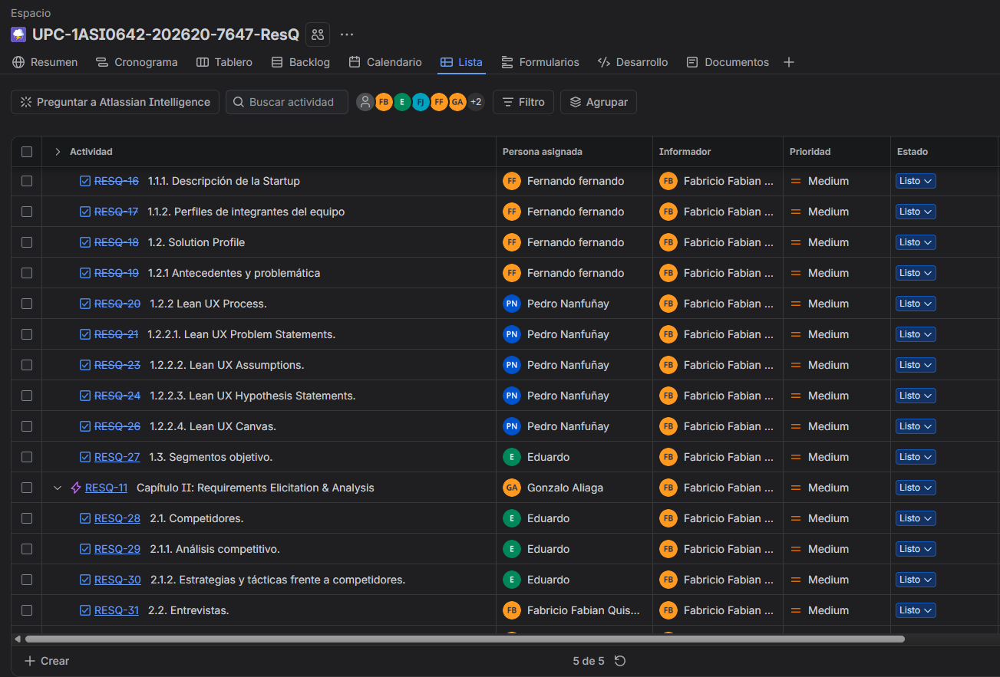
</p>

<p align="center">
  <strong>Figura 1. Distribución de actividades del equipo para la entrega AV1.</strong>
</p>

<p align="center">
  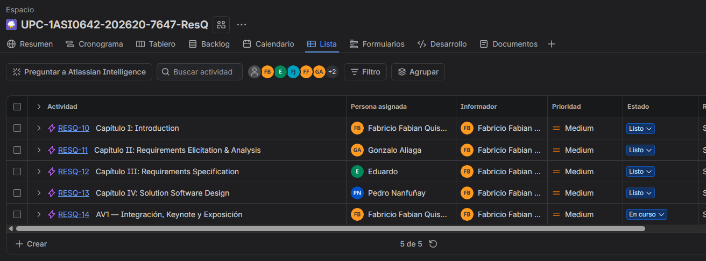
</p>

<p align="center">
  <strong>Figura 2. Distribución de actividades del equipo para la entrega AV1.</strong>
</p>

<p align="justify">
La planificación registrada en Jira permitió identificar las responsabilidades asumidas por cada integrante y verificar la cobertura del alcance correspondiente a AV1. Para el Tactical-Level Domain-Driven Design se distribuyeron los Bounded Contexts <strong>Identity and Access Management (IAM), Risk Detection, Alert & Response Management, Building, Device, Monitoring, User, Incident y Connectivity</strong>, junto con sus respectivos elementos de diseño.
</p>

### Colaboración en el Project Report

<p align="justify">
Además de la planificación registrada en Jira, la participación efectiva en la elaboración y evolución del Project Report se evidencia mediante los analíticos de colaboración y el historial de commits del repositorio de GitHub.
</p>

<p align="center">
  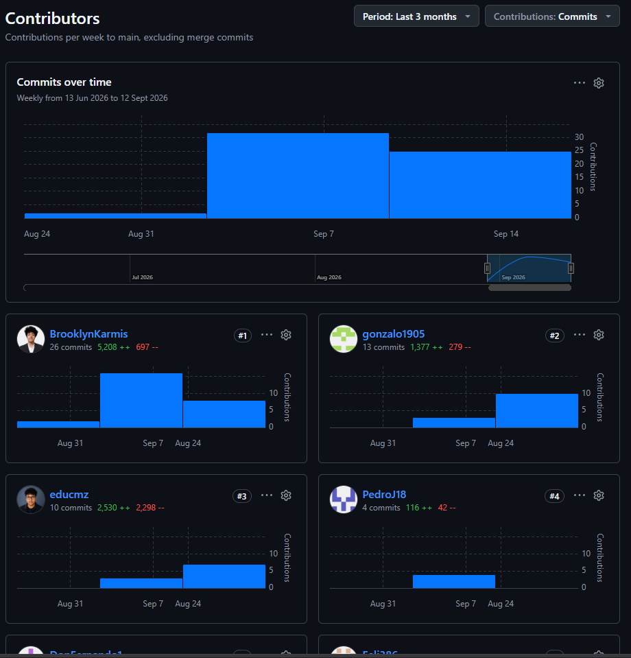
</p>

<p align="center">
  <strong>Figura 3. Analíticos de colaboración del repositorio del Project Report durante AV1.</strong>
</p>

<p align="justify">
Los analíticos del repositorio permiten observar la participación de los integrantes en la evolución del Project Report durante la entrega AV1. Esta evidencia complementa la planificación realizada en Jira y permite contrastar las responsabilidades asignadas con las contribuciones registradas en el repositorio.
</p>

<p align="center">
  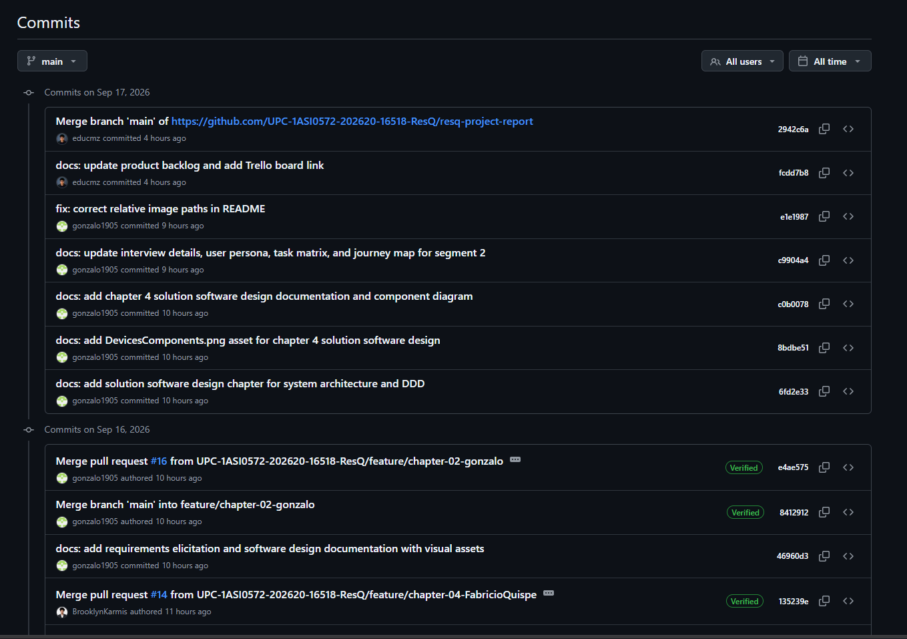
</p>

<p align="center">
  <strong>Figura 4. Historial de commits realizados durante la elaboración de AV1.</strong>
</p>

<p align="justify">
El historial de commits permite relacionar las modificaciones realizadas sobre el Project Report con sus respectivos autores y fechas. Estas contribuciones deben mantener coherencia con las modificaciones relevantes registradas en la sección <strong>Registro de Versiones del Informe</strong>.
</p>

<div style="page-break-before: always; break-before: page;"></div>

# Contenido

- [Student Outcome](#student-outcome)

- [Capítulo I: Introducción](#capítulo-i-introducción)
  - [1.1. Startup Profile](#11-startup-profile)
    - [1.1.1. Descripción de la Startup](#111-descripción-de-la-startup)
    - [1.1.2. Perfiles de integrantes del equipo](#112-perfiles-de-integrantes-del-equipo)
  - [1.2. Solution Profile](#12-solution-profile)
    - [1.2.1. Antecedentes y problemática](#121-antecedentes-y-problemática)
    - [1.2.2. Lean UX Process](#122-lean-ux-process)
      - [1.2.2.1. Lean UX Problem Statements](#1221-lean-ux-problem-statements)
      - [1.2.2.2. Lean UX Assumptions](#1222-lean-ux-assumptions)
      - [1.2.2.3. Lean UX Hypothesis Statements](#1223-lean-ux-hypothesis-statements)
      - [1.2.2.4. Lean UX Canvas](#1224-lean-ux-canvas)
  - [1.3. Segmentos objetivo](#13-segmentos-objetivo)

- [Capítulo II: Requirements Elicitation & Analysis](#capítulo-ii-requirements-elicitation--analysis)
  - [2.1. Competidores](#21-competidores)
    - [2.1.1. Análisis competitivo](#211-análisis-competitivo)
    - [2.1.2. Estrategias y tácticas frente a competidores](#212-estrategias-y-tácticas-frente-a-competidores)
  - [2.2. Entrevistas](#22-entrevistas)
    - [2.2.1. Diseño de entrevistas](#221-diseño-de-entrevistas)
    - [2.2.2. Registro de entrevistas](#222-registro-de-entrevistas)
    - [2.2.3. Análisis de entrevistas](#223-análisis-de-entrevistas)
  - [2.3. Needfinding](#23-needfinding)
    - [2.3.1. User Personas](#231-user-personas)
    - [2.3.2. User Task Matrix](#232-user-task-matrix)
    - [2.3.3. User Journey Mapping](#233-user-journey-mapping)
    - [2.3.4. Empathy Mapping](#234-empathy-mapping)
  - [2.4. Big Picture EventStorming](#24-big-picture-eventstorming)
  - [2.5. Ubiquitous Language](#25-ubiquitous-language)

- [Capítulo III: Requirements Specification](#capítulo-iii-requirements-specification)
  - [3.1. User Stories](#31-user-stories)
  - [3.2. Impact Mapping](#32-impact-mapping)
  - [3.3. Product Backlog](#33-product-backlog)

- [Capítulo IV: Solution Software Design](#capítulo-iv-solution-software-design)
  - [4.1. Strategic-Level Domain-Driven Design](#41-strategic-level-domain-driven-design)
    - [4.1.1. Design-Level EventStorming](#411-design-level-eventstorming)
      - [4.1.1.1. Candidate Context Discovery](#4111-candidate-context-discovery)
      - [4.1.1.2. Domain Message Flows Modeling](#4112-domain-message-flows-modeling)
      - [4.1.1.3. Bounded Context Canvases](#4113-bounded-context-canvases)
    - [4.1.2. Context Mapping](#412-context-mapping)
    - [4.1.3. Software Architecture](#413-software-architecture)
      - [4.1.3.1. Software Architecture System Landscape Diagram](#4131-software-architecture-system-landscape-diagram)
      - [4.1.3.2. Software Architecture Context Level Diagrams](#4132-software-architecture-context-level-diagrams)
      - [4.1.3.3. Software Architecture Container Level Diagrams](#4133-software-architecture-container-level-diagrams)
      - [4.1.3.4. Software Architecture Deployment Diagrams](#4134-software-architecture-deployment-diagrams)
  - [4.2. Tactical-Level Domain-Driven Design](#42-tactical-level-domain-driven-design)
    - [4.2.1. Bounded Context: Identity and Access Management (IAM)](#421-bounded-context-identity-and-access-management-iam)
      - [4.2.1.1. Domain Layer](#4211-domain-layer)
      - [4.2.1.2. Interface Layer](#4212-interface-layer)
      - [4.2.1.3. Application Layer](#4213-application-layer)
      - [4.2.1.4. Infrastructure Layer](#4214-infrastructure-layer)
      - [4.2.1.5. Bounded Context Software Architecture Component Level Diagrams](#4215-bounded-context-software-architecture-component-level-diagrams)
      - [4.2.1.6. Bounded Context Software Architecture Code Level Diagrams](#4216-bounded-context-software-architecture-code-level-diagrams)
        - [4.2.1.6.1. Bounded Context Domain Layer Class Diagrams](#42161-bounded-context-domain-layer-class-diagrams)
        - [4.2.1.6.2. Bounded Context Database Design Diagram](#42162-bounded-context-database-design-diagram)
    - [4.2.2. Bounded Context: Risk Detection](#422-bounded-context-risk-detection)
      - [4.2.2.1. Domain Layer](#4221-domain-layer)
      - [4.2.2.2. Interface Layer](#4222-interface-layer)
      - [4.2.2.3. Application Layer](#4223-application-layer)
      - [4.2.2.4. Infrastructure Layer](#4224-infrastructure-layer)
      - [4.2.2.5. Bounded Context Software Architecture Component Level Diagrams](#4225-bounded-context-software-architecture-component-level-diagrams)
      - [4.2.2.6. Bounded Context Software Architecture Code Level Diagrams](#4226-bounded-context-software-architecture-code-level-diagrams)
        - [4.2.2.6.1. Bounded Context Domain Layer Class Diagrams](#42261-bounded-context-domain-layer-class-diagrams)
        - [4.2.2.6.2. Bounded Context Database Design Diagram](#42262-bounded-context-database-design-diagram)
    - [4.2.3. Bounded Context: Alert & Response Management](#423-bounded-context-alert--response-management)
      - [4.2.3.1. Domain Layer](#4231-domain-layer)
      - [4.2.3.2. Interface Layer](#4232-interface-layer)
      - [4.2.3.3. Application Layer](#4233-application-layer)
      - [4.2.3.4. Infrastructure Layer](#4234-infrastructure-layer)
      - [4.2.3.5. Bounded Context Software Architecture Component Level Diagrams](#4235-bounded-context-software-architecture-component-level-diagrams)
      - [4.2.3.6. Bounded Context Software Architecture Code Level Diagrams](#4236-bounded-context-software-architecture-code-level-diagrams)
        - [4.2.3.6.1. Bounded Context Domain Layer Class Diagrams](#42361-bounded-context-domain-layer-class-diagrams)
        - [4.2.3.6.2. Bounded Context Database Design Diagram](#42362-bounded-context-database-design-diagram)
    - [4.2.4. Bounded Context: Building Management](#424-bounded-context-building-management)
      - [4.2.4.1. Domain Layer](#4241-domain-layer)
      - [4.2.4.2. Interface Layer](#4242-interface-layer)
      - [4.2.4.3. Application Layer](#4243-application-layer)
      - [4.2.4.4. Infrastructure Layer](#4244-infrastructure-layer)
      - [4.2.4.5. Bounded Context Software Architecture Component Level Diagrams](#4245-bounded-context-software-architecture-component-level-diagrams)
      - [4.2.4.6. Bounded Context Software Architecture Code Level Diagrams](#4246-bounded-context-software-architecture-code-level-diagrams)
        - [4.2.4.6.1. Bounded Context Domain Layer Class Diagrams](#42461-bounded-context-domain-layer-class-diagrams)
        - [4.2.4.6.2. Bounded Context Database Design Diagram](#42462-bounded-context-database-design-diagram)
    - [4.2.5. Bounded Context: Device Management](#425-bounded-context-device-management)
      - [4.2.5.1. Domain Layer](#4251-domain-layer)
      - [4.2.5.2. Interface Layer](#4252-interface-layer)
      - [4.2.5.3. Application Layer](#4253-application-layer)
      - [4.2.5.4. Infrastructure Layer](#4254-infrastructure-layer)
      - [4.2.5.5. Bounded Context Software Architecture Component Level Diagrams](#4255-bounded-context-software-architecture-component-level-diagrams)
      - [4.2.5.6. Bounded Context Software Architecture Code Level Diagrams](#4256-bounded-context-software-architecture-code-level-diagrams)
        - [4.2.5.6.1. Bounded Context Domain Layer Class Diagrams](#42561-bounded-context-domain-layer-class-diagrams)
        - [4.2.5.6.2. Bounded Context Database Design Diagram](#42562-bounded-context-database-design-diagram)
    - [4.2.6. Bounded Context: Monitoring](#426-bounded-context-monitoring)
      - [4.2.6.1. Domain Layer](#4261-domain-layer)
      - [4.2.6.2. Interface Layer](#4262-interface-layer)
      - [4.2.6.3. Application Layer](#4263-application-layer)
      - [4.2.6.4. Infrastructure Layer](#4264-infrastructure-layer)
      - [4.2.6.5. Bounded Context Software Architecture Component Level Diagrams](#4265-bounded-context-software-architecture-component-level-diagrams)
      - [4.2.6.6. Bounded Context Software Architecture Code Level Diagrams](#4266-bounded-context-software-architecture-code-level-diagrams)
        - [4.2.6.6.1. Bounded Context Domain Layer Class Diagrams](#42661-bounded-context-domain-layer-class-diagrams)
        - [4.2.6.6.2. Bounded Context Database Design Diagram](#42662-bounded-context-database-design-diagram)
    - [4.2.7. Bounded Context: User](#427-bounded-context-user)
      - [4.2.7.1. Domain Layer](#4271-domain-layer)
      - [4.2.7.2. Interface Layer](#4272-interface-layer)
      - [4.2.7.3. Application Layer](#4273-application-layer)
      - [4.2.7.4. Infrastructure Layer](#4274-infrastructure-layer)
      - [4.2.7.5. Bounded Context Software Architecture Component Level Diagrams](#4275-bounded-context-software-architecture-component-level-diagrams)
      - [4.2.7.6. Bounded Context Software Architecture Code Level Diagrams](#4276-bounded-context-software-architecture-code-level-diagrams)
        - [4.2.7.6.1. Bounded Context Domain Layer Class Diagrams](#42761-bounded-context-domain-layer-class-diagrams)
        - [4.2.7.6.2. Bounded Context Database Design Diagram](#42762-bounded-context-database-design-diagram)
    - [4.2.8. Bounded Context: Incident](#428-bounded-context-incident)
      - [4.2.8.1. Domain Layer](#4281-domain-layer)
      - [4.2.8.2. Interface Layer](#4282-interface-layer)
      - [4.2.8.3. Application Layer](#4283-application-layer)
      - [4.2.8.4. Infrastructure Layer](#4284-infrastructure-layer)
      - [4.2.8.5. Bounded Context Software Architecture Component Level Diagrams](#4285-bounded-context-software-architecture-component-level-diagrams)
      - [4.2.8.6. Bounded Context Software Architecture Code Level Diagrams](#4286-bounded-context-software-architecture-code-level-diagrams)
        - [4.2.8.6.1. Bounded Context Domain Layer Class Diagrams](#42861-bounded-context-domain-layer-class-diagrams)
        - [4.2.8.6.2. Bounded Context Database Design Diagram](#42862-bounded-context-database-design-diagram)
    - [4.2.9. Bounded Context: Connectivity Management](#429-bounded-context-connectivity-management)
      - [4.2.9.1. Domain Layer](#4291-domain-layer)
      - [4.2.9.2. Interface Layer](#4292-interface-layer)
      - [4.2.9.3. Application Layer](#4293-application-layer)
      - [4.2.9.4. Infrastructure Layer](#4294-infrastructure-layer)
      - [4.2.9.5. Bounded Context Software Architecture Component Level Diagrams](#4295-bounded-context-software-architecture-component-level-diagrams)
      - [4.2.9.6. Bounded Context Software Architecture Code Level Diagrams](#4296-bounded-context-software-architecture-code-level-diagrams)
        - [4.2.9.6.1. Bounded Context Domain Layer Class Diagrams](#42961-bounded-context-domain-layer-class-diagrams)
        - [4.2.9.6.2. Bounded Context Database Design Diagram](#42962-bounded-context-database-design-diagram)

- [Capítulo V: Solution UI/UX Design](#capítulo-v-solution-uiux-design)
  - [5.1. Style Guidelines](#51-style-guidelines)
    - [5.1.1. General Style Guidelines](#511-general-style-guidelines)
    - [5.1.2. Web, Mobile and IoT Style Guidelines](#512-web-mobile-and-iot-style-guidelines)
  - [5.2. Information Architecture](#52-information-architecture)
    - [5.2.1. Organization Systems](#521-organization-systems)
    - [5.2.2. Labeling Systems](#522-labeling-systems)
    - [5.2.3. SEO Tags and Meta Tags](#523-seo-tags-and-meta-tags)
    - [5.2.4. Searching Systems](#524-searching-systems)
    - [5.2.5. Navigation Systems](#525-navigation-systems)
  - [5.3. Landing Page UI Design](#53-landing-page-ui-design)
    - [5.3.1. Landing Page Wireframe](#531-landing-page-wireframe)
    - [5.3.2. Landing Page Mock-up](#532-landing-page-mock-up)
  - [5.4. Applications UX/UI Design](#54-applications-uxui-design)
    - [5.4.1. Applications Wireframes](#541-applications-wireframes)
    - [5.4.2. Applications Wireflow Diagrams](#542-applications-wireflow-diagrams)
    - [5.4.3. Applications Mock-ups](#543-applications-mock-ups)
    - [5.4.4. Applications User Flow Diagrams](#544-applications-user-flow-diagrams)
  - [5.5. Applications Prototyping](#55-applications-prototyping)
  - [5.6. IoT Device Design](#56-iot-device-design)

- [Capítulo VI: Product Implementation, Validation & Deployment](#capítulo-vi-product-implementation-validation--deployment)
  - [6.1. Software Configuration Management](#61-software-configuration-management)
    - [6.1.1. Software Development Environment Configuration](#611-software-development-environment-configuration)
  - [6.2. Landing Page, Services & Applications Implementation](#62-landing-page-services--applications-implementation)
    - [6.2.1. Sprint 1](#621-sprint-1)
      - [6.2.1.1. Sprint Planning 1](#6211-sprint-planning-1)
      - [6.2.1.4. Development Evidence for Sprint Review](#6214-development-evidence-for-sprint-review)

- [Conclusiones](#conclusiones)
  - [Conclusiones y recomendaciones](#conclusiones-y-recomendaciones)

- [Bibliografía](#bibliografía)

- [Anexos](#anexos)
  - [Anexo A. Videos de Exposiciones](#anexo-a-videos-de-exposiciones)
    - [Anexo A — AV1 — Sprint Review](#anexo-a--av1--sprint-review)

<div style="page-break-before: always; break-before: page;"></div>

# Student Outcome

<p align="justify">
El curso contribuye al cumplimiento del Student Outcome ABET:
</p>

**ABET – EAC - Student Outcome 5**

<p align="justify">
<strong>Criterio:</strong> La capacidad de funcionar efectivamente en un equipo cuyos miembros juntos proporcionan liderazgo, crean un entorno de colaboración e inclusivo, establecen objetivos, planifican tareas y cumplen objetivos.
</p>

<p align="justify">
En el siguiente cuadro se describe las acciones realizadas y enunciados de conclusiones por parte del grupo, que permiten sustentar el haber alcanzado el logro del ABET – EAC - Student Outcome 5.
</p>

| Criterio específico | Acciones realizadas | Conclusiones |
|---|---|---|
| Trabaja en equipo para proporcionar liderazgo en forma conjunta | **Sánchez Guevara, Iván Fernando**<br><br>**AV1**<br>• Tuvo a su cargo el Startup Profile y parte del Solution Profile, desarrollando la descripción de la startup, los perfiles de los integrantes, así como los antecedentes y la problemática de ResQ.<br>• Asumió el desarrollo del Context Mapping y de los diagramas de arquitectura a nivel Context, Container y Deployment, integrando en una representación arquitectónica las responsabilidades e interacciones definidas para los distintos Bounded Contexts.<br>• Desarrolló el Bounded Context Connectivity, incluyendo Domain Layer, Interface Layer, Application Layer, Infrastructure Layer y sus diagramas de diseño correspondientes.<br><br>**Nanfuñay Liza, Pedro Jesus**<br><br>**AV1**<br>• Tuvo a su cargo el proceso de Lean UX, desarrollando Lean UX Problem Statements, Assumptions, Hypothesis Statements y Lean UX Canvas como base para orientar las decisiones iniciales del equipo.<br>• Asumió el Design-Level EventStorming, incluyendo Candidate Context Discovery, Domain Message Flows Modeling y Bounded Context Canvases, contribuyendo a identificar y delimitar las responsabilidades posteriormente distribuidas entre los Bounded Contexts del sistema.<br>• Desarrolló el Bounded Context Monitoring, incluyendo sus capas y diagramas de diseño táctico.<br><br>**Chacaliaza Minaya, Eduardo Fabian**<br><br>**AV1**<br>• Tuvo a su cargo la definición de los segmentos objetivo, el análisis de competidores y las estrategias y tácticas de ResQ frente a la competencia.<br>• Desarrolló el Product Backlog, organizando y priorizando los requisitos funcionales identificados para la solución.<br>• Participó en el Strategic-Level Domain-Driven Design y asumió el desarrollo del System Landscape de la arquitectura.<br>• Desarrolló el Bounded Context Alert & Response Management, especificando sus capas y diagramas técnicos correspondientes.<br><br>**Quispe Barzola, Fabricio Fabian**<br><br>**AV1**<br>• Tuvo a su cargo el proceso de entrevistas, incluyendo su diseño, registro y análisis, proporcionando al equipo información proveniente de representantes de los segmentos objetivo.<br>• Desarrolló las User Stories y el Impact Mapping, trasladando los resultados obtenidos durante la investigación hacia la especificación de requisitos de ResQ.<br>• Desarrolló los Bounded Contexts Identity and Access Management (IAM) y Risk Detection, incluyendo Domain, Interface, Application e Infrastructure Layers, así como los diagramas de componentes, clases y base de datos correspondientes.<br><br>**Aliaga Urbina, Wilder Gonzalo**<br><br>**AV1**<br>• Tuvo a su cargo la elaboración de User Personas, User Task Matrix, User Journey Mapping y Empathy Mapping, estructurando los hallazgos obtenidos durante la investigación de usuarios.<br>• Utilizó estos artefactos para representar necesidades, tareas, frustraciones y recorridos de los segmentos objetivo, aportando información utilizada posteriormente por el equipo en la definición de la solución.<br>• Desarrolló los Bounded Contexts Building y Device, incluyendo sus capas y diagramas de diseño táctico correspondientes.<br><br>**Guerrero Vasquez, Jhon Danny**<br><br>**AV1**<br>• Participó en el proceso de Needfinding y tuvo a su cargo el Big Picture EventStorming y el Ubiquitous Language, contribuyendo a establecer una comprensión común del dominio de ResQ y de sus principales conceptos.<br>• El Big Picture EventStorming desarrollado permitió representar los eventos relevantes del dominio y apoyar posteriormente su descomposición en Bounded Contexts.<br>• Desarrolló los Bounded Contexts User e Incident, incluyendo sus capas, componentes, clases y diseño de persistencia. | Durante AV1, el equipo distribuyó responsabilidades entre sus integrantes en distintas etapas del proceso de ingeniería, abarcando Lean UX, UX Research, Requirements Specification, Strategic-Level Domain-Driven Design, Tactical-Level Domain-Driven Design y Software Architecture. Cada integrante asumió la responsabilidad de artefactos concretos cuyos resultados se relacionan con el trabajo realizado por los demás miembros. Esta organización permitió desarrollar en paralelo los Capítulos I, II, III y IV y posteriormente integrar sus resultados en una propuesta común para ResQ. |
| **Crea un entorno colaborativo e inclusivo, establece metas, planifica tareas y cumple objetivos** | **Sánchez Guevara, Iván Fernando**<br><br>**AV1**<br>• Dentro de la planificación de AV1 asumió responsabilidades relacionadas con la definición inicial de la solución, Context Mapping, Software Architecture y el Bounded Context Connectivity.<br>• Su trabajo en Context Mapping y arquitectura permitió integrar visualmente las relaciones y dependencias existentes entre elementos desarrollados por diferentes miembros del equipo.<br><br>**Nanfuñay Liza, Pedro Jesus**<br><br>**AV1**<br>• Dentro de la planificación de AV1 asumió la elaboración de los artefactos de Lean UX y Design-Level EventStorming.<br>• Los artefactos de Candidate Context Discovery, Domain Message Flows Modeling y Bounded Context Canvases proporcionaron una base común para organizar y distribuir posteriormente el diseño táctico entre los integrantes del equipo.<br>• Complementó este trabajo desarrollando el Bounded Context Monitoring dentro de la distribución acordada para el Capítulo IV.<br><br>**Chacaliaza Minaya, Eduardo Fabian**<br><br>**AV1**<br>• Dentro de la planificación de AV1 asumió responsabilidades relacionadas con segmentos objetivo, análisis competitivo, Product Backlog, Strategic-Level Domain-Driven Design y Software Architecture.<br>• La organización del Product Backlog contribuyó a estructurar y priorizar el alcance funcional identificado por el equipo.<br>• Complementó el diseño estratégico con el desarrollo del Bounded Context Alert & Response Management, manteniendo relación entre el alcance funcional y el diseño de la solución.<br><br>**Quispe Barzola, Fabricio Fabian**<br><br>**AV1**<br>• Dentro de la planificación de AV1 asumió las actividades relacionadas con entrevistas, User Stories, Impact Mapping, IAM y Risk Detection.<br>• Los resultados obtenidos en entrevistas fueron utilizados como insumo para la especificación de requisitos, permitiendo mantener trazabilidad entre investigación, necesidades identificadas y funcionalidades propuestas.<br>• El desarrollo de IAM y Risk Detection permitió continuar dicha trazabilidad desde los requisitos hasta el diseño táctico de la solución.<br><br>**Aliaga Urbina, Wilder Gonzalo**<br><br>**AV1**<br>• Dentro de la planificación de AV1 asumió los principales artefactos de Needfinding y el diseño táctico de Building y Device.<br>• Organizó los resultados de investigación en User Personas, User Task Matrix, User Journey Maps y Empathy Maps, facilitando que el equipo dispusiera de una representación compartida de los usuarios y sus necesidades.<br>• Relacionó posteriormente estos hallazgos con elementos del dominio físico e IoT mediante el desarrollo de Building y Device.<br><br>**Guerrero Vasquez, Jhon Danny**<br><br>**AV1**<br>• Dentro de la planificación de AV1 asumió actividades relacionadas con Needfinding, Big Picture EventStorming, Ubiquitous Language y los Bounded Contexts User e Incident.<br>• La elaboración del Ubiquitous Language contribuyó a establecer términos y definiciones compartidas para reducir ambigüedades durante el trabajo de los distintos integrantes.<br>• Complementó el modelado general del dominio desarrollando User e Incident dentro de la distribución establecida para el Tactical-Level Domain-Driven Design. | La planificación de AV1 permitió distribuir el alcance del entregable entre los seis integrantes, estableciendo responsabilidades relacionadas entre sí y cubriendo progresivamente la comprensión del problema, investigación de usuarios, especificación de requisitos y diseño de la solución. Los artefactos desarrollados mantienen dependencias entre distintas responsabilidades: las entrevistas alimentan el Needfinding, estos resultados contribuyen a los requisitos, y los requisitos y eventos del dominio orientan la identificación y diseño de los Bounded Contexts y la arquitectura. Esta organización permitió integrar los aportes individuales dentro de una estructura común del Project Report y avanzar hacia los objetivos establecidos para AV1. |

<div style="page-break-before: always; break-before: page;"></div>

# Capítulo I: Introducción

## 1.1. Startup Profile

### 1.1.1. Descripción de la Startup
<p align="justify">

En el contexto de las edificaciones residenciales, comerciales y empresariales, la seguridad y la gestión de emergencias constituyen aspectos fundamentales para proteger a las personas y reducir los daños en la infraestructura. Sin embargo, la coexistencia de dispositivos de detección independientes, la limitada integración entre sistemas y la necesidad de intervención humana para coordinar determinadas respuestas pueden dificultar la supervisión de riesgos y la actuación oportuna ante situaciones críticas. Frente a esta problemática surge <strong>SecurityBear</strong>, una startup fundada por estudiantes de Ingeniería de Software de la Universidad Peruana de Ciencias Aplicadas (UPC), con el propósito de desarrollar soluciones tecnológicas innovadoras que contribuyan a mejorar el monitoreo, la detección de riesgos y la gestión coordinada de emergencias en edificaciones.

</p>

<p align="justify">

Como parte de su propuesta de valor, SecurityBear desarrolla <strong>ResQ</strong>, una plataforma basada en Internet of Things (IoT) que busca integrar el monitoreo de condiciones ambientales y físicas, la identificación de situaciones de riesgo, la generación de alertas y la coordinación de mecanismos de respuesta dentro de un mismo ecosistema tecnológico. La solución propone combinar dispositivos IoT, procesamiento local mediante Edge Computing y servicios digitales para facilitar la supervisión de edificaciones, identificar las zonas afectadas y proporcionar información relevante para la toma de decisiones. Asimismo, contempla la automatización de determinadas acciones de seguridad y la continuidad de funciones críticas locales ante interrupciones de conectividad, con una arquitectura modular que permita incorporar progresivamente nuevas capacidades conforme evolucionen las necesidades de los usuarios.

</p>

<p align="justify">

SecurityBear orienta su propuesta a dos segmentos estratégicos: los propietarios y administradores de edificaciones, quienes requieren herramientas para supervisar las condiciones de seguridad de sus instalaciones, y las empresas integradoras de automatización y gestión de edificios inteligentes, que buscan complementar sus proyectos mediante tecnologías de monitoreo, detección y respuesta ante emergencias. La startup plantea un enfoque de negocio orientado a ofrecer soluciones y servicios tecnológicos adaptables a las características de cada edificación, promoviendo alianzas estratégicas con empresas especializadas en automatización e integración IoT. Este modelo busca facilitar la incorporación de ResQ a infraestructuras existentes, ampliar progresivamente su alcance comercial y establecer oportunidades de crecimiento sostenible sin depender exclusivamente de la comercialización directa de dispositivos.

</p>

<p align="justify">

Nuestra visión es posicionar a SecurityBear como una startup reconocida por el desarrollo de soluciones IoT orientadas a la seguridad y automatización de edificaciones, diferenciándose mediante la integración tecnológica, la capacidad de respuesta local y la adaptabilidad de sus soluciones. A través de la innovación continua, la colaboración con actores especializados y el desarrollo de una plataforma escalable, buscamos contribuir a la transformación digital de la gestión de emergencias, ofreciendo herramientas que permitan a las organizaciones fortalecer sus capacidades de supervisión, mejorar la coordinación de respuestas y avanzar hacia entornos más seguros y preparados.

</p>

### 1.1.2. Perfiles de integrantes del equipo

| Nombres y Apellidos | Código | Descripción | Foto |
|---|---|---|---|
| Ivan Fernando Sanchez Guevara | U202218181 | Mi nombre es Fernando Sanchez Guevara, tengo 22 años y actualmente estudio la carrera de Ingeniería de Software. Me considero una persona disciplinada, responsable y puntual al momento de desarrollar las asignaciones de trabajo. Además, me preocupo por mantener una buena coordinación con mi equipo, procurando apoyar a mis compañeros cuando presentan alguna dificultad. Gracias a mi compromiso y disposición para colaborar, he contribuido al desarrollo adecuado de diferentes proyectos grupales, buscando cumplir los objetivos establecidos y resolver los inconvenientes que puedan surgir durante el proceso. |  |
| Eduardo Fabian Chacaliza Minaya | U202324129 | Mi nombre es Eduardo Fabian Chacaliza Minaya y actualmente estudio la carrera de Ingeniería de Software. Me considero una persona responsable, organizada y comprometida con el cumplimiento de los objetivos del equipo. Tengo interés en el desarrollo de soluciones tecnológicas y en la integración de los diferentes componentes de un proyecto. Durante los trabajos grupales procuro mantener una comunicación constante con mis compañeros, colaborar en la resolución de problemas y apoyar en la integración y validación de las distintas partes del proyecto para obtener un resultado consistente y funcional. |  |
| Fabricio Fabian Quispe Barzola | U202320442 | Mi nombre es Fabricio Fabian Quispe Barzola y actualmente estudio la carrera de Ingeniería de Software. Me considero una persona responsable, organizada y comprometida con el cumplimiento de los objetivos que asumo tanto de manera individual como en equipo. Tengo interés en el desarrollo de software, el análisis de problemas y la construcción de soluciones tecnológicas que permitan responder a necesidades reales. Durante los trabajos grupales procuro mantener una comunicación constante con mis compañeros, aportar ideas, escuchar diferentes puntos de vista y colaborar en la resolución de dificultades que puedan presentarse. Asimismo, busco organizar adecuadamente mis actividades, cumplir con los plazos establecidos y contribuir a que el equipo mantenga una visión común del trabajo. Me interesa seguir fortaleciendo mis conocimientos técnicos y mis habilidades de coordinación, análisis y trabajo colaborativo a lo largo de mi formación profesional. |  |
| Pedro Jesús Nanfuñay Liza | U202215462 | Mi nombre es Pedro Jesús Nanfuñay Liza, tengo 21 años y actualmente estudio la carrera de Ingeniería de Software. Me considero una persona creativa, responsable, perseverante y siempre dispuesto a trabajar en equipo. Espero aportar de manera positiva al equipo y cumplir con los objetivos establecidos en el proyecto. |  |
| Wilder Gonzalo Aliaga Urbina | U202222001 | Mi nombre es Gonzalo Aliaga Urbina y actualmente estudio la carrera de Ingeniería de Software. Me considero una persona responsable, organizada y comprometida con el cumplimiento de los objetivos establecidos en cada proyecto. Tengo especial interés en el desarrollo de soluciones tecnológicas, la programación y la aplicación de nuevas tecnologías para resolver problemas de manera eficiente. Durante los trabajos grupales procuro mantener una comunicación constante con mis compañeros, aportar ideas, apoyar en la resolución de dificultades y colaborar en la integración de las diferentes partes del proyecto. Asimismo, busco cumplir con las tareas asignadas dentro de los plazos establecidos y contribuir de manera activa para que el equipo mantenga una buena organización y logre resultados consistentes y funcionales. |  |

## 1.2. Solution Profile<p align="justify">

La seguridad y gestión de emergencias en edificaciones constituye un desafío para propietarios, administradores y empresas encargadas de implementar soluciones de automatización. Las instalaciones residenciales, comerciales e institucionales pueden encontrarse expuestas a situaciones de riesgo, como fugas de gas, incendios y movimientos sísmicos, que requieren mecanismos de detección, supervisión y respuesta adecuados. Sin embargo, la coexistencia de dispositivos independientes, las dificultades de integración tecnológica y la dependencia de procedimientos manuales pueden limitar la capacidad de identificar oportunamente una amenaza, conocer su ubicación y coordinar las acciones correspondientes.

</p>

<p align="justify">

Frente a esta problemática, SecurityBear propone, una plataforma basada en Internet of Things (IoT), Edge Computing y servicios digitales, orientada a integrar el monitoreo de condiciones ambientales y físicas, la detección de situaciones de riesgo y la coordinación de mecanismos de alerta y respuesta. La propuesta considera las necesidades de propietarios y administradores de edificaciones, así como de empresas integradoras de automatización y gestión de edificios inteligentes, buscando facilitar la supervisión centralizada y la incorporación progresiva de tecnologías de seguridad en diferentes tipos de infraestructura.

</p>

<p align="justify">

Para comprender el problema desde una perspectiva integral, se aplica la técnica The 5 W's and 2 H's (What, When, Where, Who, Why, How y How Much), que permite identificar la naturaleza de la problemática, las personas y organizaciones involucradas, las circunstancias en las que se presenta, sus principales causas y la magnitud de sus posibles consecuencias.

</p>

What (¿Qué?)

¿Cuál es el problema?

<p align="justify">

El problema principal es la fragmentación de los sistemas de detección, monitoreo y respuesta ante emergencias en edificaciones, lo que dificulta centralizar la información sobre condiciones de riesgo y coordinar oportunamente las acciones de seguridad. En determinadas instalaciones, los sensores, alarmas y sistemas de automatización funcionan de manera independiente o presentan limitaciones de interoperabilidad, dificultando la identificación de la amenaza, su nivel de gravedad, la ubicación afectada y las acciones ejecutadas. Esta situación representa una dificultad para los propietarios y administradores que necesitan supervisar sus edificios, así como para las empresas integradoras que buscan incorporar capacidades de seguridad a infraestructuras con diferentes dispositivos y tecnologías.

</p>

¿Cuál es la relación con la persona en cuestión?

<p align="justify">

La problemática se relaciona directamente con las responsabilidades de quienes administran, supervisan o implementan sistemas tecnológicos en edificaciones. Los propietarios y administradores necesitan conocer las condiciones de seguridad de sus instalaciones, identificar situaciones de riesgo y coordinar acciones que contribuyan a proteger a los ocupantes. Por su parte, las empresas integradoras de automatización requieren soluciones compatibles y adaptables que puedan incorporar a los proyectos desarrollados para sus clientes. En ambos casos, la falta de información centralizada y de mecanismos de respuesta coordinados puede incrementar la complejidad operativa y dificultar la toma de decisiones durante una emergencia.

</p>

When (¿Cuándo?)

¿Cuándo sucede el problema?

<p align="justify">

La problemática puede manifestarse durante la operación cotidiana de una edificación y agravarse cuando ocurre una situación de emergencia. En condiciones normales, las dificultades aparecen al supervisar distintos sensores, verificar el funcionamiento de dispositivos o consultar información distribuida entre sistemas independientes. Durante un evento crítico, estas limitaciones pueden afectar la identificación del riesgo, la localización de la zona comprometida y la coordinación de respuestas. Asimismo, después de una emergencia, la ausencia de registros centralizados puede dificultar el análisis de lo ocurrido, la evaluación de las acciones ejecutadas y la identificación de oportunidades de mejora en los procedimientos de seguridad.

</p>

¿Cuándo utiliza el cliente el producto?

<p align="justify">

Se plantea que ResQ sea utilizado principalmente en tres momentos. Primero, durante la operación habitual de la edificación, cuando los responsables necesitan supervisar dispositivos IoT, consultar mediciones y verificar las condiciones de seguridad de diferentes zonas. Segundo, cuando se detecta una situación de riesgo, para identificar la amenaza, reconocer su nivel de gravedad, localizar la zona afectada y conocer las acciones de alerta o respuesta correspondientes. Finalmente, después de un incidente, para consultar registros históricos, revisar las respuestas ejecutadas y realizar actividades de seguimiento. En el caso de las empresas integradoras, la plataforma también podrá utilizarse durante los procesos de configuración, integración y mantenimiento de los sistemas instalados para sus clientes.

</p>

Where (¿Dónde?)

¿Dónde está el cliente cuando utiliza el producto?

<p align="justify">

Los propietarios, administradores y responsables de seguridad pueden encontrarse dentro de la edificación, en oficinas administrativas, centros de control o ubicaciones externas desde las cuales necesiten supervisar las instalaciones bajo su responsabilidad. Por otro lado, los profesionales de empresas integradoras pueden interactuar con la solución durante actividades de instalación, configuración, mantenimiento o supervisión técnica, tanto en las instalaciones de sus clientes como desde sus propios centros de operaciones. La propuesta de ResQ contempla el acceso a información mediante aplicaciones digitales, de acuerdo con los permisos asignados y la disponibilidad de conectividad, mientras que determinadas funciones críticas de detección y respuesta se proyectan para operar localmente.

</p>

¿A dónde se dirige?

<p align="justify">

Ante una situación de riesgo, los administradores y responsables de seguridad necesitan acceder a la información de la edificación afectada para identificar la ubicación del evento y coordinar las acciones establecidas en los protocolos correspondientes. Cuando la situación requiere presencia física, el personal autorizado puede dirigirse hacia los puntos de control o áreas de intervención definidas por los procedimientos de seguridad, siempre que las condiciones permitan hacerlo. Los ocupantes, por su parte, deben seguir los protocolos de protección y evacuación establecidos para cada tipo de emergencia y las indicaciones de los responsables competentes. ResQ busca apoyar este proceso mediante información sobre la ubicación del riesgo y los mecanismos de alerta y respuesta, sin sustituir los procedimientos oficiales de seguridad.

</p>

¿Dónde surge el problema?

<p align="justify">

El problema surge principalmente en edificaciones residenciales, comerciales, empresariales e institucionales donde existen dispositivos de detección o sistemas de automatización que no cuentan con una integración suficiente para compartir información y coordinar respuestas. Puede manifestarse en zonas específicas, como áreas de servicios, espacios comunes, ambientes técnicos o instalaciones donde se supervisan condiciones ambientales y físicas. Asimismo, se presenta en el ámbito de la integración tecnológica, cuando las empresas especializadas necesitan conectar dispositivos y plataformas de diferentes fabricantes o adaptar sus soluciones a las características particulares de cada infraestructura.

</p>

Who (¿Quiénes?)

¿Quiénes están involucrados?

<p align="justify">

Los principales involucrados son los propietarios y administradores de edificaciones, los responsables de seguridad y mantenimiento, y las empresas integradoras de automatización y gestión de edificios inteligentes. Estas últimas incluyen profesionales dedicados al diseño, instalación, integración y mantenimiento de sistemas IoT y Building Management Systems (BMS). También participan los equipos de seguridad, brigadistas y personal operativo encargado de aplicar los procedimientos de respuesta. Finalmente, los residentes, trabajadores y visitantes constituyen beneficiarios indirectos de los mecanismos de monitoreo, alerta y seguridad implementados en las instalaciones.

</p>

¿A quiénes les sucede el problema?

<p align="justify">

La problemática afecta directamente a los propietarios y administradores de edificaciones que necesitan supervisar las condiciones de seguridad de sus instalaciones y coordinar respuestas ante posibles emergencias. También afecta a las empresas integradoras de automatización, que enfrentan desafíos al incorporar tecnologías de detección y respuesta en infraestructuras donde conviven distintos sensores, sistemas y protocolos de comunicación. De manera indirecta, los ocupantes de las edificaciones pueden verse afectados cuando las limitaciones de monitoreo, detección o coordinación dificultan una respuesta adecuada frente a situaciones de riesgo.

</p>

¿Quién lo utiliza?

<p align="justify">

ResQ está orientado principalmente a dos segmentos objetivo. El primero está conformado por <strong>propietarios y administradores de edificaciones</strong>, incluyendo facility managers y responsables de seguridad, mantenimiento y operaciones que requieren supervisar edificios, zonas, dispositivos, alertas e incidentes. El segundo corresponde a <strong>empresas integradoras de automatización y gestión de edificios inteligentes</strong>, cuyos profesionales necesitan configurar dispositivos, incorporar soluciones IoT y gestionar su integración con las infraestructuras de sus clientes. Ambos segmentos interactuarán con las funcionalidades de la plataforma de acuerdo con sus responsabilidades y permisos, mientras que los ocupantes de las edificaciones serán beneficiarios de los mecanismos de advertencia y respuesta establecidos.

</p>

Why (¿Por qué?)

¿Cuál es la causa del problema?

<p align="justify">

Una de las principales causas es la utilización de sistemas de detección y seguridad que funcionan de manera independiente o que presentan dificultades para intercambiar información con otras plataformas tecnológicas. La diversidad de fabricantes, protocolos de comunicación y configuraciones puede dificultar la interoperabilidad, especialmente en edificaciones que incorporan progresivamente nuevos dispositivos. Asimismo, la dependencia de procedimientos manuales para interpretar alertas, identificar zonas afectadas y activar determinadas respuestas puede incrementar el tiempo y esfuerzo necesarios para gestionar una situación crítica. A esto se suman las posibles interrupciones de conectividad y las limitaciones para consultar registros históricos centralizados, condiciones que evidencian la necesidad de soluciones capaces de integrar monitoreo, procesamiento local y mecanismos coordinados de respuesta.

</p>

How (¿Cómo?)

¿En qué condiciones nuestros clientes usan el producto?

<p align="justify">

Los clientes utilizarían ResQ tanto en condiciones operativas habituales como durante situaciones de riesgo que requieren atención prioritaria. En el funcionamiento cotidiano, los responsables necesitan consultar información organizada, verificar el estado de los dispositivos y realizar actividades de supervisión sin procedimientos innecesariamente complejos. Durante una emergencia, las condiciones pueden incluir presión de tiempo, necesidad de coordinación y posibles interrupciones de conectividad, por lo que resulta importante disponer de alertas comprensibles, información sobre la zona afectada y mecanismos locales de respuesta. Por su parte, las empresas integradoras utilizarían la plataforma en contextos técnicos de instalación, configuración y mantenimiento, donde se requiere compatibilidad con la infraestructura existente y capacidad para adaptar la solución a diferentes proyectos.

</p>

¿Cómo nos conocieron nuestros compradores?

<p align="justify">

SecurityBear plantea establecer contacto con potenciales clientes mediante canales comerciales y alianzas estratégicas orientadas al sector de automatización y seguridad de edificaciones. Para los propietarios y administradores, se consideran la presentación de demostraciones, el contacto con administradoras de inmuebles, las recomendaciones de especialistas y los canales digitales de la startup. Para las empresas integradoras, se propone establecer relaciones comerciales mediante reuniones técnicas, alianzas de colaboración, participación en espacios especializados en IoT y automatización, y presentación de las capacidades de integración de ResQ. Estos mecanismos constituyen canales propuestos de captación y posicionamiento que deberán validarse durante la evolución del modelo de negocio.

</p>

¿Cómo prefieren nuestros consumidores acceder a nuestro producto?

<p align="justify">

De acuerdo con las necesidades identificadas para ambos segmentos, ResQ plantea una experiencia digital que facilite el acceso a información de monitoreo, gestión de dispositivos y seguimiento de incidentes. Los propietarios y administradores podrán utilizar una aplicación web para supervisar edificaciones y zonas, consultar alertas y revisar eventos registrados, con una experiencia adaptable a diferentes dimensiones de pantalla. Por su parte, las empresas integradoras requerirán herramientas que faciliten la configuración y administración de los dispositivos IoT incorporados a sus proyectos. La propuesta contempla también experiencias móviles como parte de la evolución del producto, mientras que los dispositivos físicos proporcionarán información de sensado y mecanismos locales de advertencia. La integración de estos componentes deberá permitir una experiencia coherente, considerando las funcionalidades disponibles en cada etapa de implementación.

</p>

¿Qué llevó a la persona a esa situación?

<p align="justify">

La necesidad de mejorar la seguridad de las edificaciones y gestionar de manera más eficiente los riesgos asociados a su operación motiva a propietarios y administradores a buscar herramientas de monitoreo y respuesta. Esta necesidad puede intensificarse cuando deben supervisar múltiples zonas, coordinar equipos de seguridad o trabajar con dispositivos que no comparten información de manera integrada. En el caso de las empresas integradoras, la situación surge de la necesidad de ofrecer soluciones tecnológicas adaptables a los requerimientos de sus clientes, incorporar nuevas capacidades de automatización y facilitar la interoperabilidad entre diferentes sistemas. Estas condiciones generan oportunidades para propuestas que complementen la infraestructura existente y permitan evolucionar progresivamente las capacidades de supervisión y respuesta.

</p>

How Much (¿Cuánto?)

<p align="justify">

La magnitud de los riesgos asociados a emergencias en edificaciones puede dimensionarse mediante información estadística sobre eventos registrados, personas afectadas y daños ocasionados a la infraestructura. De acuerdo con el Compendio Estadístico de la Gestión Reactiva 2024 del Instituto Nacional de Defensa Civil (INDECI), durante el periodo 2012-2023 se registraron 3,005 incendios urbanos en el departamento de Lima, asociados con 20,797 personas afectadas y damnificadas y 4,564 viviendas afectadas o destruidas. Estas cifras evidencian la relevancia de los riesgos urbanos y la necesidad de fortalecer las capacidades de prevención, preparación y respuesta ante emergencias, aunque no permiten determinar por sí solas cuántos incidentes podrían evitarse mediante una plataforma IoT.

</p>

<p align="justify">

Desde la perspectiva de los propietarios y administradores, las consecuencias de una emergencia pueden comprender daños materiales, interrupciones operativas, costos de recuperación y exposición de los ocupantes a situaciones peligrosas. Para las empresas integradoras, la fragmentación tecnológica puede representar un mayor esfuerzo de configuración, mantenimiento e integración de los diferentes componentes de una instalación. En este contexto, SecurityBear plantea que ResQ contribuya a mejorar la visibilidad de las condiciones de riesgo y la coordinación de respuestas. Su impacto deberá evaluarse mediante indicadores cuantificables, como el tiempo transcurrido entre la detección y la generación de una alerta, la disponibilidad de información de los dispositivos, la frecuencia de eventos detectados, la proporción de falsas alertas y los tiempos de atención de incidentes. Estos indicadores permitirán valorar progresivamente la efectividad de la solución sin atribuirle reducciones de daños o costos que todavía no hayan sido demostradas.

</p>

<p align="justify">

</p>

Objetivos y restricciones del alcance

<p align="justify">

A partir de la problemática identificada, el objetivo general de ResQ es proponer una solución IoT que permita integrar el monitoreo de condiciones de riesgo en edificaciones y facilitar la coordinación de mecanismos de alerta y respuesta. Para ello, se plantea centralizar la información proveniente de dispositivos instalados en diferentes zonas, identificar situaciones de riesgo según las capacidades de los sensores, proporcionar información relevante a los responsables de seguridad y registrar eventos que permitan realizar actividades posteriores de seguimiento y análisis. Asimismo, la propuesta busca ofrecer capacidades de integración y configuración que respondan a las necesidades de empresas especializadas en automatización de edificios.

</p>

<p align="justify">

El alcance de la solución se encuentra condicionado por la compatibilidad y las características técnicas de los sensores y actuadores utilizados, la infraestructura de comunicación disponible, las capacidades de procesamiento local y las restricciones de integración con sistemas existentes. La respuesta autónoma ante interrupciones de Internet dependerá de las funciones implementadas localmente y de la disponibilidad de energía y comunicación entre los componentes correspondientes. De igual manera, las acciones automatizadas deberán estar delimitadas por criterios de seguridad, condiciones de operación y mecanismos de autorización cuando corresponda. ResQ se plantea como un complemento tecnológico para la supervisión y coordinación de emergencias, sin sustituir los sistemas de protección obligatorios, las inspecciones técnicas ni los protocolos establecidos por las autoridades competentes.

</p>

### 1.2.2. Lean UX Process

#### 1.2.2.1. Lean UX Problem Statements
<p align="justify">
El estado actual de la seguridad y gestión de emergencias en edificios se ha enfocado principalmente en el uso de sistemas independientes y de propósito único; como detectores de humo, alarmas de gas o protocolos de evacuación manuales. Estos mecanismos son utilizados por administradores y responsables de seguridad de los edificios para identificar situaciones de riesgo; sin embargo, en muchos casos requieren de la intervención humana para coordinar una respuesta adecuada y reducir los posibles daños sobre las personas y la infraestructura.
</p>

<p align="justify">
Lo que las soluciones existentes no suelen resolver de manera integrada es la coordinación de la información entre la detección de una emergencia y la ejecución de una respuesta física ante ella. Esto dificulta centralizar la información obtenida, emitir alertas precisas, identificar el tipo de emergencia, ubicar la zona afectada y activar respuestas diferenciadas de acuerdo con las caracterísiticas y el nivel de gravedad del evento. Asimismo, muchos sistemas dependen de mecanismos de monitoreo o comunicación centralizados, lo que puede limitar su capacidad de respuesta cuando se pierde temporalmente la conectividad a Internet durante una emergencia.
</p>

<p align="justify">
Nuestra solución abordará esta brecha mediante una plataforma IoT capaz de monitorear variables ambientales y fisicas del edificio, procesar localmente la información obtenida de los sensores mediante Edge Computing, clasificar el tipo y grado de la emergencia y ejecutar acciones automáticas a través de actuadores (alarmas, luces de evacuación, ventilación, cierre de válvula) mientras reporta el evento y el estado del edificio en tiempo real.
</p>

<p align="justify">
Nuestro enfoque inicial estará dirigido a los propietarios y administradores de edificaciones que requieren supervisar las condiciones de seguridad de sus instalaciones para responder oportunamente ante situaciones de riesgo. La propuesta también estará orientada a responsables de seguridad, operaciones e infraestructura de empresas e instituciones que necesitan centralizar el monitoreo y coordinar respuestas en instalaciones con diferentes zonas y niveles de concurrencia.
</p>

<p align="justify">
Sabremos que hemos tenido éxito cuando los representantes de ambos segmentos utilicen la aplicación para monitorear el estado del edificio, reconocer el tipo y nivel de riesgo, ubicar la zona afectada, verificar la activación automática de respuestas adecuadas de los actuadores y consultar posteriormente los eventos registrados. Asimismo, consideraremos el interés de estos responsables por incorporar nuestra solución como complemento de sus mecanismos actuales de seguridad.
</p>

#### 1.2.2.2. Lean UX Assumptions

**Business Assumptions:**

<p align="justify">
1. Creemos que existe una demanda insatisfecha en el mercado de administración de edificios por soluciones que centralicen monitoreo y respuesta ante emergencias, actualmente cubierta parcialmente por sistemas aislados.
</p>

<p align="justify">
2. Creemos que existe una oportunidad para integrar en una única solución IoT la detección, clasificación, localización y respuesta automática ante situaciones de riesgo dentro de edificios.
</p>

<p align="justify">
3. Creemos que los propietarios y administradores de edificaciones, así como las empresas e instituciones con infraestructura propia, estarán dispuestas a adoptar una solución que complemente sus mecanismos actuales de seguridad mediante monitoreo y automatización.
</p>

<p align="justify">
4. Creemos que la capacidad de ejecutar respuestas críticas localmente, sin depender permanentemente de la conectividad a Internet, constituirá un elemento diferenciador de la propuesta frente a sistemas que requieren comunicación constante con servicios externos.
</p>

<p align="justify">
5. Creemos que un modelo de servicio orientado a edificios permitirá escalar progresivamente la solución mediante la incorporación de nuevos sensores, actuadores, zonas y dispositivos IoT según las necesidades de cada organización.
</p>

<p align="justify">
6. Creemos que los clientes estarán dispuestos a asumir un costo por una solución que contribuya al monitoreo continuo, la trazabilidad de eventos y la automatización de determinadas respuestas de seguridad.
</p>

**Business Outcome Assumptions:**

<p align="justify">
1. Creemos que demostrar una solución integrada de monitoreo y respuesta ante emergencias incrementará el interés de potenciales clientes en adoptar la plataforma frente al uso exclusivo de mecanismos independientes o manuales.
</p>

<p align="justify">
2. Creemos que al garantizar que las respuestas automáticas y del monitoreo sean las adecuadas, estas incrementarán la confiabilidad y, por consecuencia, la intención de permanencia y renovación de nuestro servicio por parte de las organizaciones, reduciendo potencialmente la tasa de cancelación.
</p>

<p align="justify">
3. Creemos que reducir el esfuerzo requerido para supervisar manualmente las condiciones de seguridad del edificio incrementará el valor percibido de la plataforma y la disposición de las organizaciones a pagar por el servicio.
</p>

<p align="justify">
4. Creemos que la disponibilidad de registros históricos sobre eventos detectados, mediciones y respuestas ejecutadas incrementará el uso recurrente de la plataforma para actividades de supervisión y seguimiento.
</p>

<p align="justify">
5. Creemos que la posibilidad de incorporar progresivamente nuevas zonas, sensores y actuadores permitirá incrementar el alcance del servicio, expandiendo nuestra solución a nuevas necesidades.
</p>

<p align="justify">
6. Creemos que una implementación satisfactoria del MVP permitirá validar el interés de potenciales clientes y justificar la evolución de la solución hacia una mayor cantidad de dispositivos, tipos de emergencia y capacidades de respuesta.
</p>

**User Assumptions:**

<p align="justify">
1. Creemos que los propietarios y administradores de edificaciones necesitan supervisar continuamente las condiciones de seguridad de las instalaciones bajo su responsabilidad.
</p>

<p align="justify">
2. Creemos que los responsables de seguridad, operaciones e infraestructura de empresas e instituciones necesitan centralizar la información proveniente de diferentes zonas de sus instalaciones.
</p>

<p align="justify">
3. Creemos que ambos segmentos necesitan identificar rápidamente qué tipo de emergencia está ocurriendo, cuál es su nivel de riesgo y dónde se ha producido.
</p>

<p align="justify">
4. Creemos que ambos segmentos necesitan conocer qué respuestas automáticas fueron ejecutadas por el sistema durante una situación de riesgo.
</p>

<p align="justify">
5. Creemos que los administradores y responsables institucionales necesitan consultar posteriormente información sobre los eventos ocurridos para realizar actividades de seguimiento y análisis.
</p>

<p align="justify">
6. Creemos que los usuarios de ambos segmentos cuentan habitualmente con acceso a dispositivos digitales y están familiarizados con aplicaciones utilizadas para tareas de supervisión o gestión.
</p>

<p align="justify">
7. Creemos que los responsables de empresas e instituciones necesitan supervisar múltiples zonas desde una visión centralizada para coordinar adecuadamente una respuesta.
</p>

<p align="justify">
8. Creemos que los responsables de ambos segmentos valorarán una solución que pueda incorporarse progresivamente a la infraestructura existente sin requerir una sustitución completa de sus mecanismos actuales de seguridad.
</p>

**User Outcome and Benefit Assumptions:**

<p align="justify">
1. Creemos que los propietarios, administradores y responsables institucionales podrán comprender con mayor rapidez el estado de sus edificaciones al contar con información de sensores y alertas centralizada en una misma plataforma.
</p>

<p align="justify">
2. Creemos que podrán tomar decisiones con mayor rapidez al conocer el tipo de emergencia, el nivel de riesgo y la zona afectada.
</p>

<p align="justify">
3. Creemos que tendrán mayor visibilidad sobre la respuesta del sistema al poder verificar qué acciones automáticas fueron ejecutadas durante cada evento.
</p>

<p align="justify">
4. Creemos que podrán realizar un mejor seguimiento de las emergencias mediante el acceso al historial de eventos, mediciones y acciones ejecutadas.
</p>

<p align="justify">
5. Creemos que los responsables de empresas e instituciones podrán coordinar mejor la respuesta ante una emergencia al disponer de información centralizada sobre las diferentes zonas de sus instalaciones.
</p>

<p align="justify">
6. Creemos que ambos segmentos podrán reducir su dependencia de la supervisión y coordinación completamente manual durante los primeros momentos de una emergencia.
</p>

<p align="justify">
7. Creemos que tendrán mayor confianza en la continuidad de la respuesta del sistema al mantenerse las acciones críticas locales aun cuando se pierda temporalmente la conexión a Internet.
</p>

**Feature Assumptions:**

<p align="justify">
1. Creemos que una funcionalidad de <strong>monitoreo del estado del edificio y sus zonas</strong> permitirá a los usuarios de ambos segmentos conocer las condiciones actuales y detectar rápidamente la existencia de una situación de riesgo.
</p>

<p align="justify">
2. Creemos que una funcionalidad de <strong>detección y clasificación local de emergencias mediante sensores y Edge Computing</strong> permitirá identificar el tipo y nivel de riesgo sin depender permanentemente de servicios externos.
</p>

<p align="justify">
3. Creemos que una funcionalidad de <strong>respuesta automática mediante actuadores</strong> permitirá ejecutar acciones de seguridad apropiadas según el tipo y nivel de riesgo detectado.
</p>

<p align="justify">
4. Creemos que una funcionalidad de <strong>alertas y señalización diferenciadas</strong> permitirá a los responsables reconocer oportunamente la existencia y gravedad de una emergencia, y facilitar la comunicación de la respuesta.
</p>

<p align="justify">
5. Creemos que una funcionalidad de <strong>identificación de la zona afectada</strong> permitirá a los responsables de seguridad localizar con mayor rapidez el origen del evento y orientar adecuadamente la respuesta.
</p>

<p align="justify">
6. Creemos que una funcionalidad de <strong>registro e historial de eventos</strong> permitirá consultar posteriormente las emergencias detectadas, las mediciones registradas y las respuestas ejecutadas por el sistema.
</p>

#### 1.2.2.3. Lean UX Hypothesis Statements

<p align="justify">
1. Creemos que lograremos incrementar el valor percibido de la plataforma y la disposición a pagar por el servicio si los propietarios, administradores y responsables institucionales logran comprender con mayor rapidez el estado de sus edificaciones y zonas mediante una funcionalidad de monitoreo centralizado.
</p>

<p align="justify">
2. Creemos que lograremos incrementar la confiabilidad percibida de la plataforma y la intención de permanencia y renovación del servicio si los usuarios de ambos segmentos pueden identificar oportunamente el tipo y nivel de riesgo y mantener la capacidad de respuesta ante una pérdida temporal de conectividad mediante una funcionalidad de detección y clasificación local basada en sensores y Edge Computing.
</p>

<p align="justify">
3. Creemos que lograremos incrementar el valor percibido de la plataforma y la disposición a pagar por el servicio si los propietarios, administradores y responsables institucionales obtienen mayor confianza y visibilidad sobre la respuesta ante una emergencia mediante la ejecución automática de acciones de seguridad apropiadas según el tipo y nivel de riesgo detectado.
</p>

<p align="justify">
4. Creemos que lograremos incrementar el interés y valor percibido de la plataforma si los responsables de ambos segmentos pueden reconocer oportunamente la existencia y naturaleza de una emergencia y coordinar una respuesta más clara mediante alertas y señalización diferenciadas.
</p>

<p align="justify">
5. Creemos que lograremos incrementar el valor percibido de la plataforma para las actividades de supervisión y respuesta si los propietarios, administradores y responsables institucionales pueden tomar decisiones con mayor rapidez al conocer la ubicación del riesgo mediante una funcionalidad de identificación de la zona afectada.
</p>

<p align="justify">
6. Creemos que lograremos incrementar el uso recurrente de la plataforma para actividades de supervisión y seguimiento si los usuarios pueden analizar posteriormente las emergencias ocurridas mediante una funcionalidad de registro e historial de eventos, mediciones y respuestas ejecutadas.
</p>
#### 1.2.2.4. Lean UX Canvas

<p align="justify">
El Lean UX Canvas sintetiza los principales elementos identificados durante el Lean UX Process, relacionando el problema de negocio, los resultados esperados, los usuarios, los beneficios, las posibles soluciones y las hipótesis planteadas.
</p>

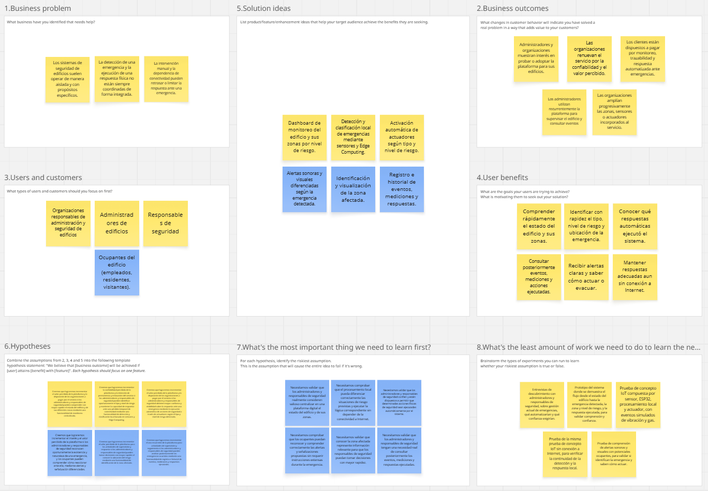

<p align="center">
  <strong>Figura 5. LeanUXCanvas-ResQ.</strong>
</p>

**Link del Canvas:** https://miro.com/app/board/uXjVHqdK0Tc=/?share_link_id=104899432918

<p align="justify">
En <strong>Business Problem</strong> se identificó que los sistemas de seguridad en edificios suelen funcionar de manera aislada y requieren intervención humana para coordinar la respuesta ante una emergencia. En <strong>Business Outcomes</strong> se definieron comportamientos esperados como el interés por adoptar la plataforma, la renovación del servicio, el uso recurrente y la disposición a pagar por sus funcionalidades.
</p>

<p align="justify">
En <strong>Users and Customers</strong> se consideró como usuarios principales a los administradores y responsables de seguridad, mientras que los ocupantes del edificio representan el segmento beneficiado por las alertas y mecanismos de evacuación. Los <strong>User Benefits</strong> se enfocan en comprender rápidamente el estado del edificio, identificar el tipo y ubicación del riesgo, conocer las respuestas ejecutadas y mantener acciones críticas aun sin conexión a Internet.
</p>

<p align="justify">
Las <strong>Solution Ideas</strong> incluyen el monitoreo por zonas, detección y clasificación local mediante Edge Computing, activación automática de actuadores, alertas diferenciadas, identificación de la zona afectada e historial de eventos. A partir de estas soluciones se formularon las hipótesis que deberán ser validadas durante el desarrollo del proyecto.
</p>

<p align="justify">
Finalmente, se identificó como principales aspectos a validar; la confianza de los usuarios en la automatización, la capacidad del sistema para clasificar correctamente los riesgos y la comprensión de las alertas por parte de los ocupantes. Para ello se llevarán a cabo entrevistas, pruebas de prototipo y pruebas de concepto con el dispositivo IoT.
</p>

## 1.3. Segmentos objetivo

<p align="justify">
Para garantizar que la solución IoT responda de manera adecuada a las necesidades de seguridad y gestión de emergencias en edificaciones, se han identificado dos segmentos principales vinculados directamente con el problema.
</p>

<p align="justify">
A continuación, se presentan sus principales características demográficas, geográficas y psicográficas, así como las necesidades que justifican su relevancia para la propuesta.
</p>

### Segmento objetivo #1: Propietarios y administradores de edificaciones

<p align="justify">
Este segmento está conformado por propietarios, administradores, facility managers y responsables de la gestión de edificios residenciales, comerciales o de uso mixto que buscan mejorar la capacidad de detección y respuesta ante situaciones de emergencia. Según el INDECI, entre 2012 y 2023 se registraron 3,005 incendios urbanos en el departamento de Lima, lo que evidencia la necesidad de contar con mecanismos de monitoreo y respuesta oportuna ante eventos críticos en edificaciones.
</p>

#### Aspectos demográficos

<p align="justify">

- **Sexo:** Masculino y femenino.

- **Rango de edad:** 30 años a más.

- **Nivel socioeconómico:** Principalmente clases A, B y C.

- **Ocupación:** Propietarios de inmuebles, administradores de edificios y responsables de mantenimiento, seguridad o gestión de instalaciones.

</p>

#### Aspectos geográficos

<p align="justify">

- **Nacionalidad:** Peruana.

- **Zona geográfica:** Principalmente zonas urbanas de Lima Metropolitana y otras ciudades con alta concentración de edificios residenciales, comerciales y empresariales.

</p>

#### Aspectos psicográficos

<p align="justify">

- **Dolor principal:** Dependencia de sistemas que se limitan a generar alertas y que requieren intervención humana para ejecutar acciones posteriores ante una emergencia.

- **Intereses:** Seguridad de los ocupantes, automatización de edificios, monitoreo remoto, prevención de riesgos y modernización de infraestructura.

- **Actitudes:** Valoran soluciones que permitan actuar rápidamente ante eventos críticos y que puedan integrarse progresivamente con la infraestructura existente.

- **Necesidades clave:** Monitoreo en tiempo real, identificación de la zona afectada, activación automática de alarmas y actuadores, registro de eventos y reducción del tiempo de respuesta ante emergencias.

</p>

### Segmento objetivo #2: Empresas integradoras de automatización y gestión de edificios inteligentes

<p align="justify">
Este segmento incluye empresas especializadas en automatización de edificios, integración IoT, Building Management Systems (BMS) y gestión técnica de infraestructura. Estas organizaciones desarrollan soluciones de automatización y gestión de edificios para sus clientes y enfrentan la necesidad de incorporar capacidades de detección, monitoreo y respuesta ante emergencias dentro de infraestructuras que utilizan distintos dispositivos y sistemas. Según la Encuesta de Transformación Digital 2022 de PAD-RTM, realizada a 404 organizaciones peruanas, el 29 % indicó utilizar tecnologías de Internet of Things (IoT), lo que evidencia la presencia de este tipo de tecnologías en el entorno empresarial y la necesidad de soluciones que puedan integrarse con ellas.
</p>

#### Aspectos demográficos y organizacionales

<p align="justify">

- **Tipo de organización:** Empresas B2B dedicadas a automatización de edificios, integración IoT, sistemas BMS y gestión técnica de infraestructura.

- **Tamaño:** Principalmente pequeñas, medianas y grandes empresas que desarrollan proyectos de automatización e integración tecnológica para organizaciones con infraestructura propia.

- **Responsables de decisión:** Gerentes de proyectos, ingenieros de automatización, responsables de integración, gerentes comerciales, responsables de innovación y directores técnicos.

- **Rango de edad de los responsables:** Aproximadamente entre 28 y 60 años.

</p>

#### Aspectos geográficos

<p align="justify">

- **Ubicación:** Principalmente Lima Metropolitana y principales ciudades del Perú donde se desarrollan proyectos de automatización, modernización e implementación de edificios inteligentes.

- **Ámbito de operación:** Edificios corporativos, campus educativos, centros de salud, instalaciones comerciales, hoteles, complejos industriales y otras infraestructuras que requieren automatización y monitoreo técnico.

</p>

#### Aspectos psicográficos

<p align="justify">

- **Dolor principal:** Dificultad para integrar funciones de detección y respuesta ante emergencias en edificios que utilizan distintos sensores, dispositivos y sistemas de automatización.

- **Intereses:** Automatización de edificios, IoT, interoperabilidad, sistemas BMS, digitalización de infraestructura, integración de sensores, escalabilidad y desarrollo de edificios inteligentes.

- **Actitudes:** Buscan soluciones modulares, confiables, escalables y fáciles de integrar con la infraestructura tecnológica que ya implementan para sus clientes.

- **Necesidades clave:** Una solución fácil de integrar con diferentes sensores y sistemas de automatización, que pueda configurarse según cada edificio, adaptarse a distintos proyectos y escalar conforme aumenten las zonas o dispositivos conectados.

</p>

<div style="page-break-before: always; break-before: page;"></div>

# Capítulo II: Requirements Elicitation & Analysis


## 2.1. Competidores

### 2.1.1. Análisis competitivo
<p align="justify">
Para poder conocer y analizar mejor a nuestros posibles competidores, realizamos el siguiente Landscape:
</p>

<div style="page-break-before: always; break-before: page;"></div>

<table style="background-color:transparent; border-collapse:collapse; width:100%; max-width:100%; margin:0 auto; table-layout:fixed; font-family:Arial,sans-serif; font-size:12px; line-height:16px; color:inherit; border:1px solid currentColor;">
  <colgroup>
    <col style="width:12%;">
    <col style="width:10%;">
    <col style="width:10%;">
    <col style="width:18%;">
    <col style="width:17%;">
    <col style="width:16%;">
    <col style="width:17%;">
  </colgroup>

  <tr style="page-break-inside: avoid; break-inside: avoid; background-color:transparent; ">
    <th colspan="7" style="background-color:transparent; color:inherit; border:1px solid currentColor; padding:0 7px; text-align:left; height:17px;">
      Competitive Analysis Landscape
    </th>
  </tr>
  <tr style="page-break-inside: avoid; break-inside: avoid; background-color:transparent; height:49px;">
    <td colspan="2" style="background-color:transparent; color:inherit; border:1px solid currentColor; padding:0 7px; vertical-align:top;">
      ¿Por qué llevar a cabo este análisis?
    </td>
    <td colspan="5" style="background-color:transparent; color:inherit; border:1px solid currentColor; padding:0 7px; vertical-align:top;">Analizar las características y propuestas de valor de competidores indirectos relacionados con el monitoreo, automatización y gestión de edificios, con el fin de identificar oportunidades de diferenciación para ResQ mediante tecnologías IoT, procesamiento Edge y automatización de respuestas ante situaciones de riesgo.  </td>
  </tr>

  <tr style="page-break-inside: avoid; break-inside: avoid; background-color:transparent; height:50px;">
    <td colspan="3" style="background-color:transparent; color:inherit; border:1px solid currentColor; padding:0 7px; vertical-align:top;">
      &nbsp;
    </td>
    <td style="background-color:transparent; color:inherit; border:1px solid currentColor; padding:0 7px; vertical-align:top;">ResQ<br>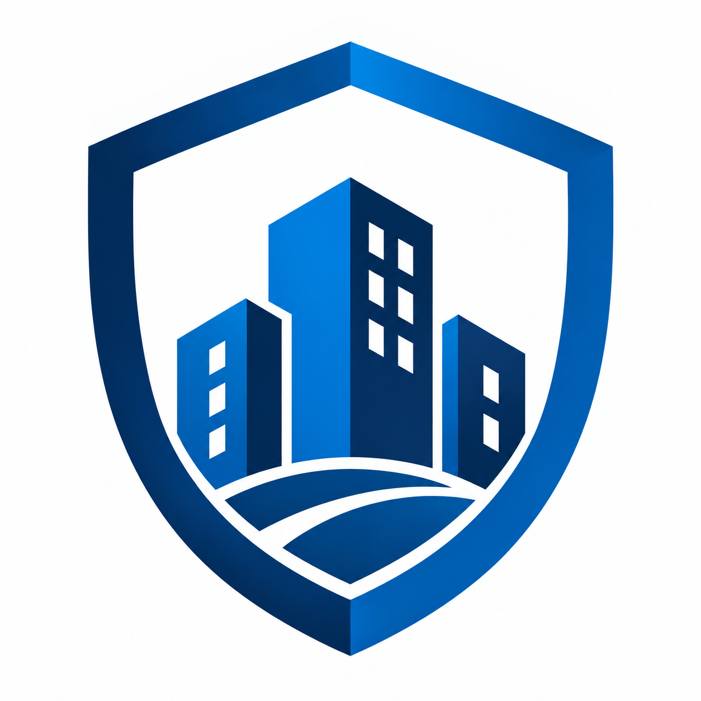</td>
    <td style="background-color:transparent; color:inherit; border:1px solid currentColor; padding:0 7px; vertical-align:top;">ProSentry<br></td>
    <td style="background-color:transparent; color:inherit; border:1px solid currentColor; padding:0 7px; vertical-align:top;">Siemens Building X<br></td>
    <td style="background-color:transparent; color:inherit; border:1px solid currentColor; padding:0 7px; vertical-align:top;">Honeywell EBI<br></td>
  </tr>

  <tr style="page-break-inside: avoid; break-inside: avoid; background-color:transparent; height:65px;">
    <td rowspan="2" style="background-color:transparent; color:inherit; border:1px solid currentColor; text-align:center; vertical-align:middle;">
      <span style="display:inline-block; writing-mode:vertical-rl; transform:rotate(180deg);">Perfil</span>
    </td>
    <td colspan="2" style="background-color:transparent; color:inherit; border:1px solid currentColor; padding:0 7px; vertical-align:top;">Overview</td>
    <td style="background-color:transparent; color:inherit; border:1px solid currentColor; padding:0 7px; vertical-align:top;">Plataforma IoT orientada al monitoreo, detección y respuesta ante riesgos en edificaciones. Integra sensores, monitoreo digital, procesamiento Edge y actuadores.</td>
    <td style="background-color:transparent; color:inherit; border:1px solid currentColor; padding:0 7px; vertical-align:top;">Plataforma IoT de monitoreo preventivo de propiedades. Detecta fugas, temperatura, humedad, fallas y otras condiciones que pueden causar daños.</td>
    <td style="background-color:transparent; color:inherit; border:1px solid currentColor; padding:0 7px; vertical-align:top;">Plataforma digital para la gestión inteligente de edificios. Centraliza operaciones, mantenimiento, energía, seguridad y protección.</td>
    <td style="background-color:transparent; color:inherit; border:1px solid currentColor; padding:0 7px; vertical-align:top;">Plataforma empresarial que integra gestión del edificio, seguridad, control de accesos, videovigilancia y protección contra incendios.</td>
  </tr>
  <tr style="page-break-inside: avoid; break-inside: avoid; background-color:transparent; height:82px;">
    <td colspan="2" style="background-color:transparent; color:inherit; border:1px solid currentColor; padding:0 7px; vertical-align:top;">
      Ventaja competitiva<br>¿Qué valor ofrece a los clientes?
    </td>
    <td style="background-color:transparent; color:inherit; border:1px solid currentColor; padding:0 7px; vertical-align:top;">Arquitectura IoT modular que integra distintos riesgos y ejecuta respuestas automáticas según sensores, zona, horario y contexto.</td>
    <td style="background-color:transparent; color:inherit; border:1px solid currentColor; padding:0 7px; vertical-align:top;">Detección temprana de riesgos de la propiedad, monitoreo continuo y control de ciertos dispositivos, como válvulas.</td>
    <td style="background-color:transparent; color:inherit; border:1px solid currentColor; padding:0 7px; vertical-align:top;">Ecosistema amplio y escalable para administrar múltiples funciones e instalaciones desde una sola plataforma.</td>
    <td style="background-color:transparent; color:inherit; border:1px solid currentColor; padding:0 7px; vertical-align:top;">Integra sistemas críticos del edificio y permite automatizar procedimientos y flujos de trabajo ante eventos.</td>
  </tr>

  <tr style="page-break-inside: avoid; break-inside: avoid; background-color:transparent; height:66px;">
    <td rowspan="2" style="background-color:transparent; color:inherit; border:1px solid currentColor; text-align:center; vertical-align:middle;">
      <span style="display:inline-block; writing-mode:vertical-rl; transform:rotate(180deg);">Perfil de Marketing</span>
    </td>
    <td colspan="2" style="background-color:transparent; color:inherit; border:1px solid currentColor; padding:0 7px; vertical-align:top;">Mercado objetivo</td>
    <td style="background-color:transparent; color:inherit; border:1px solid currentColor; padding:0 7px; vertical-align:top;">Propietarios y administradores de edificaciones, así como empresas integradoras de automatización y gestión de edificios inteligentes.</td>
    <td style="background-color:transparent; color:inherit; border:1px solid currentColor; padding:0 7px; vertical-align:top;">Propietarios, administradores y operadores de edificios residenciales y comerciales.</td>
    <td style="background-color:transparent; color:inherit; border:1px solid currentColor; padding:0 7px; vertical-align:top;">Propietarios, operadores y administradores de edificios, campus y organizaciones de diversos sectores.</td>
    <td style="background-color:transparent; color:inherit; border:1px solid currentColor; padding:0 7px; vertical-align:top;">Medianas y grandes organizaciones con edificios, campus e infraestructuras complejas.</td>
  </tr>
  <tr style="page-break-inside: avoid; break-inside: avoid; background-color:transparent; height:66px;">
    <td colspan="2" style="background-color:transparent; color:inherit; border:1px solid currentColor; padding:0 7px; vertical-align:top;">Estrategias de marketing</td>
    <td style="background-color:transparent; color:inherit; border:1px solid currentColor; padding:0 7px; vertical-align:top;">Estrategia B2B basada en demostraciones de la solución, contacto directo con administradores y organizaciones y alianzas con empresas vinculadas a automatización de edificios.</td>
    <td style="background-color:transparent; color:inherit; border:1px solid currentColor; padding:0 7px; vertical-align:top;">Estrategia B2B enfocada en reducción de daños, demostraciones, evaluaciones y casos de uso.</td>
    <td style="background-color:transparent; color:inherit; border:1px solid currentColor; padding:0 7px; vertical-align:top;">Venta consultiva B2B, contenido especializado, casos por industria y socios tecnológicos.</td>
    <td style="background-color:transparent; color:inherit; border:1px solid currentColor; padding:0 7px; vertical-align:top;">Venta empresarial mediante especialistas e integradores, demostraciones y soluciones personalizadas.</td>
  </tr>

  <tr style="page-break-inside: avoid; break-inside: avoid; background-color:transparent; height:66px;">
    <td rowspan="3" style="background-color:transparent; color:inherit; border:1px solid currentColor; text-align:center; vertical-align:middle;">
      <span style="display:inline-block; writing-mode:vertical-rl; transform:rotate(180deg);">Perfil de Producto</span>
    </td>
    <td colspan="2" style="background-color:transparent; color:inherit; border:1px solid currentColor; padding:0 7px; vertical-align:top;">Productos &amp; Servicios</td>
    <td style="background-color:transparent; color:inherit; border:1px solid currentColor; padding:0 7px; vertical-align:top;">Solución IoT compuesta por dispositivos de monitoreo, procesamiento local y actuadores, integrada con una plataforma centralizada para supervisar riesgos, generar alertas y ejecutar respuestas automáticas ante diferentes eventos en edificaciones.</td>
    <td style="background-color:transparent; color:inherit; border:1px solid currentColor; padding:0 7px; vertical-align:top;">Sensores inalámbricos para fugas de agua y gas, temperatura, humedad, puertas y otros riesgos, con plataforma de monitoreo.</td>
    <td style="background-color:transparent; color:inherit; border:1px solid currentColor; padding:0 7px; vertical-align:top;">Building X incluye aplicaciones para operaciones, seguridad, incendios, energía, análisis e integración de equipos.</td>
    <td style="background-color:transparent; color:inherit; border:1px solid currentColor; padding:0 7px; vertical-align:top;">EBI integra gestión del edificio, seguridad, videovigilancia, control de accesos, incendios y sistemas de terceros.</td>
  </tr>
  <tr style="page-break-inside: avoid; break-inside: avoid; background-color:transparent; height:49px;">
    <td colspan="2" style="background-color:transparent; color:inherit; border:1px solid currentColor; padding:0 7px; vertical-align:top;">Precios &amp; Costos</td>
    <td style="background-color:transparent; color:inherit; border:1px solid currentColor; padding:0 7px; vertical-align:top;">Modelo basado en una implementación inicial de sensores y dispositivos IoT, complementada con una suscripción recurrente para el acceso a la plataforma de monitoreo, alertas, historial e integraciones. El costo dependerá de la cantidad de dispositivos, tamaño de la propiedad y funcionalidades contratadas.</td>
    <td style="background-color:transparent; color:inherit; border:1px solid currentColor; padding:0 7px; vertical-align:top;">Sensores con un costo aproximado de US$60 a US$80 por unidad y una tarifa mensual generalmente entre US$4 y US$9 por inquilino, que incluye monitoreo, dashboard, alertas y soporte.</td>
    <td style="background-color:transparent; color:inherit; border:1px solid currentColor; padding:0 7px; vertical-align:top;">Modelo basado en suscripciones anuales a aplicaciones y APIs, con costos adicionales asociados a conectividad, dispositivos e implementación según las necesidades del proyecto.</td>
    <td style="background-color:transparent; color:inherit; border:1px solid currentColor; padding:0 7px; vertical-align:top;">Modelo empresarial basado en licencias y suscripciones según la solución contratada. Los costos dependen de la infraestructura, integraciones, implementación y servicios requeridos.</td>
  </tr>
  <tr style="page-break-inside: avoid; break-inside: avoid; background-color:transparent; height:66px;">
    <td colspan="2" style="background-color:transparent; color:inherit; border:1px solid currentColor; padding:0 7px; vertical-align:top;">
      Canales de distribución<br>(Web y/o Móvil)
    </td>
    <td style="background-color:transparent; color:inherit; border:1px solid currentColor; padding:0 7px; vertical-align:top;">Plataforma web de monitoreo con alertas y acceso móvil para responsables y administradores.</td>
    <td style="background-color:transparent; color:inherit; border:1px solid currentColor; padding:0 7px; vertical-align:top;">Plataforma accesible por web y dispositivos móviles, con notificaciones ante eventos.</td>
    <td style="background-color:transparent; color:inherit; border:1px solid currentColor; padding:0 7px; vertical-align:top;">Plataforma cloud con acceso web y herramientas móviles según la aplicación utilizada.</td>
    <td style="background-color:transparent; color:inherit; border:1px solid currentColor; padding:0 7px; vertical-align:top;">Interfaces web y acceso remoto, además de opciones de uso desde móviles y tablets.</td>
  </tr>

  <tr style="page-break-inside: avoid; break-inside: avoid; background-color:transparent; height:66px;">
    <td rowspan="4" style="background-color:transparent; color:inherit; border:1px solid currentColor; text-align:center; vertical-align:middle;">
      <span style="display:inline-block; writing-mode:vertical-rl; transform:rotate(180deg);">Análisis SWOT</span>
    </td>
    <td colspan="2" style="background-color:transparent; color:inherit; border:1px solid currentColor; padding:0 7px; vertical-align:top;">Fortalezas</td>
    <td style="background-color:transparent; color:inherit; border:1px solid currentColor; padding:0 7px; vertical-align:top;">Arquitectura modular; integración de diferentes riesgos; procesamiento Edge; respuestas automáticas locales; capacidad de integración con diferentes dispositivos IoT.</td>
    <td style="background-color:transparent; color:inherit; border:1px solid currentColor; padding:0 7px; vertical-align:top;">Solución especializada; variedad de sensores; monitoreo continuo; alertas automáticas; integraciones.</td>
    <td style="background-color:transparent; color:inherit; border:1px solid currentColor; padding:0 7px; vertical-align:top;">Marca consolidada; amplia experiencia; alta escalabilidad; gran capacidad de integración.</td>
    <td style="background-color:transparent; color:inherit; border:1px solid currentColor; padding:0 7px; vertical-align:top;">Experiencia en automatización; integración de sistemas críticos; arquitectura escalable.</td>
  </tr>
  <tr style="page-break-inside: avoid; break-inside: avoid; background-color:transparent; height:50px;">
    <td colspan="2" style="background-color:transparent; color:inherit; border:1px solid currentColor; padding:0 7px; vertical-align:top;">Debilidades</td>
    <td style="background-color:transparent; color:inherit; border:1px solid currentColor; padding:0 7px; vertical-align:top;">Necesidad de fortalecer la validación en entornos reales, demostrar escalabilidad y consolidar su posicionamiento frente a soluciones ya establecidas en el mercado.</td>
    <td style="background-color:transparent; color:inherit; border:1px solid currentColor; padding:0 7px; vertical-align:top;">Enfoque principal en mitigación de daños a la propiedad, con menor énfasis en coordinación integral de emergencias.</td>
    <td style="background-color:transparent; color:inherit; border:1px solid currentColor; padding:0 7px; vertical-align:top;">Puede implicar mayor complejidad y costo para organizaciones con necesidades específicas.</td>
    <td style="background-color:transparent; color:inherit; border:1px solid currentColor; padding:0 7px; vertical-align:top;">Requiere integración especializada e infraestructura, lo que aumenta la complejidad.</td>
  </tr>
  <tr style="page-break-inside: avoid; break-inside: avoid; background-color:transparent; height:49px;">
    <td colspan="2" style="background-color:transparent; color:inherit; border:1px solid currentColor; padding:0 7px; vertical-align:top;">Oportunidades</td>
    <td style="background-color:transparent; color:inherit; border:1px solid currentColor; padding:0 7px; vertical-align:top;">Creciente adopción de IoT y automatización en edificios; modernización de infraestructura; mayor demanda de monitoreo y respuesta ante riesgos; oportunidades de alianza con empresas integradoras.</td>
    <td style="background-color:transparent; color:inherit; border:1px solid currentColor; padding:0 7px; vertical-align:top;">Creciente demanda de monitoreo preventivo en edificaciones, adopción de sensores IoT y expansión del mercado de automatización de propiedades.</td>
    <td style="background-color:transparent; color:inherit; border:1px solid currentColor; padding:0 7px; vertical-align:top;">Mayor digitalización de edificios, IA, automatización y gestión centralizada.</td>
    <td style="background-color:transparent; color:inherit; border:1px solid currentColor; padding:0 7px; vertical-align:top;">Modernización de edificios existentes y crecimiento de IoT e integración tecnológica.</td>
  </tr>
  <tr style="page-break-inside: avoid; break-inside: avoid; background-color:transparent; height:49px;">
    <td colspan="2" style="background-color:transparent; color:inherit; border:1px solid currentColor; padding:0 7px; vertical-align:top;">Amenazas</td>
    <td style="background-color:transparent; color:inherit; border:1px solid currentColor; padding:0 7px; vertical-align:top;">Presencia de soluciones consolidadas; exigencias normativas; riesgos de ciberseguridad y rápida evolución tecnológica.</td>
    <td style="background-color:transparent; color:inherit; border:1px solid currentColor; padding:0 7px; vertical-align:top;">Aparición de soluciones IoT de menor costo y expansión de grandes plataformas.</td>
    <td style="background-color:transparent; color:inherit; border:1px solid currentColor; padding:0 7px; vertical-align:top;">Competidores especializados más ágiles y económicos, y evolución tecnológica acelerada.</td>
    <td style="background-color:transparent; color:inherit; border:1px solid currentColor; padding:0 7px; vertical-align:top;">Plataformas cloud más flexibles, soluciones de menor costo y necesidad de modernización continua.</td>
  </tr>
</table>

### 2.1.2. Estrategias y tácticas frente a competidores

<p align="justify">
Para afrontar las fortalezas de competidores indirectos como ProSentry, Siemens Building X y Honeywell EBI, ResQ buscará diferenciarse mediante una propuesta IoT modular y especializada en la detección y respuesta ante riesgos en edificaciones. Frente a plataformas consolidadas y de amplio alcance como Siemens Building X y Honeywell EBI, ResQ priorizará una solución más enfocada y adaptable, permitiendo implementar únicamente los dispositivos y funcionalidades necesarios y ampliar el sistema progresivamente según las características y riesgos de cada edificación.
</p>

<p align="justify">
Para aprovechar las debilidades identificadas en la competencia, ResQ aplicará una estrategia de respuesta contextual automatizada. Mientras que algunas soluciones se concentran principalmente en el monitoreo, mitigación de daños o gestión integral del edificio, ResQ buscará relacionar información proveniente de distintos dispositivos con factores como la zona, el horario y el tipo de evento para determinar la situación detectada y ejecutar una respuesta específica. Como táctica, se implementarán reglas configurables que permitan generar diferentes alertas y acciones automáticas según el contexto del riesgo.
</p>

<p align="justify">
Como estrategia frente a las oportunidades del mercado, ResQ aprovechará la creciente adopción de tecnologías IoT y automatización en edificaciones, así como la necesidad de mejorar la detección y respuesta ante situaciones de riesgo. La startup utilizará un modelo basado en una implementación inicial de dispositivos IoT y una suscripción recurrente para acceder a funcionalidades como monitoreo, alertas, historial e integraciones. Como tácticas comerciales, se realizarán demostraciones, pruebas piloto e implementaciones iniciales en espacios controlados, además de establecer alianzas con empresas integradoras de automatización y gestión de edificios inteligentes.
</p>

<p align="justify">
Finalmente, para afrontar amenazas como la presencia de empresas consolidadas, los riesgos de ciberseguridad, la evolución tecnológica y la dependencia de conectividad, ResQ priorizará el procesamiento Edge de eventos críticos. Esto permitirá que determinadas acciones puedan ejecutarse localmente sin depender exclusivamente de servicios en la nube, manteniendo funciones esenciales ante interrupciones temporales de conexión. Asimismo, se buscará mantener una arquitectura modular, escalable e interoperable que permita incorporar nuevos dispositivos, tecnologías y mecanismos de respuesta conforme evolucionen las necesidades de los clientes y del mercado.
</p>

## 2.2. Entrevistas

### 2.2.1. Diseño de entrevistas

<p align="justify">
Para la investigación se diseñaron entrevistas semiestructuradas diferenciadas para cada segmento objetivo. Se establecieron preguntas principales que permiten mantener una estructura común entre los entrevistados de un mismo segmento y preguntas complementarias destinadas a profundizar en sus respuestas, experiencias y comportamientos.
</p>

<p align="justify">
El diseño prioriza preguntas abiertas orientadas a conocer experiencias reales y procesos actuales, evitando inducir respuestas o presentar anticipadamente las características de la solución propuesta. De esta manera, se busca obtener información objetiva y subjetiva sobre los entrevistados, incluyendo características demográficas, background, personalidad, habilidades, objetivos, frustraciones, marcas e influencias, dispositivos de preferencia, navegadores, tecnologías y canales digitales de interacción. Asimismo, las preguntas permiten conocer las tareas, procesos y dificultades actuales relacionadas con la prevención, detección y respuesta ante emergencias.
</p>

#### Segmento objetivo #1: Propietarios y administradores de edificaciones

<p align="justify">
Las entrevistas dirigidas a este segmento buscan comprender el perfil del propietario, administrador o responsable de la edificación, las características de la infraestructura bajo su responsabilidad, las actividades que realiza actualmente, los sistemas de seguridad que utiliza y su experiencia frente a incidentes o emergencias.
</p>

**Pregunta principal 1: ¿Podría presentarse y contarnos brevemente sobre usted?**

Preguntas complementarias:

- ¿Cuál es su nombre y apellido?
- ¿Qué edad tiene?
- ¿Con qué género se identifica?
- ¿En qué distrito reside actualmente?
- ¿Cuál es su estado civil?
- ¿Cómo está conformada su familia?

**Pregunta principal 2: ¿A qué se dedica actualmente y qué responsabilidades tiene dentro de la edificación que gestiona?**

Preguntas complementarias:

- ¿Cuál es su profesión o formación?
- ¿Cuál es su cargo o función actual?
- ¿Cuánto tiempo lleva realizando estas funciones?
- ¿Cuántos años de experiencia tiene en administración, mantenimiento, operaciones o seguridad de edificaciones?
- ¿Cuáles son sus principales responsabilidades?

**Pregunta principal 3: ¿Cómo describiría su forma de trabajar y de tomar decisiones?**

Preguntas complementarias:

- ¿Cómo suele actuar cuando aparece un problema inesperado?
- ¿Prefiere prevenir los problemas o actuar cuando estos ocurren?
- ¿Qué tan importante es para usted contar con información antes de tomar una decisión?
- ¿Qué habilidades considera más importantes para desarrollar su trabajo?
- ¿Qué tan cómodo se siente utilizando nuevas herramientas tecnológicas?

**Pregunta principal 4: ¿Podría describir la edificación que administra o gestiona?**

Preguntas complementarias:

- ¿Qué tipo de edificación es?
- ¿Dónde está ubicada?
- ¿Cuántos pisos o niveles posee?
- ¿Cuántas personas aproximadamente pueden encontrarse en ella?
- ¿Qué zonas o ambientes principales contiene?
- ¿Cuáles considera que son las zonas de mayor riesgo?
- ¿Existen horarios de mayor ocupación?
- ¿Cuenta con personal de seguridad y mantenimiento?

**Pregunta principal 5: ¿Qué actividades realiza actualmente relacionadas con la seguridad de la edificación?**

Preguntas complementarias:

- ¿Realiza inspecciones o revisiones?
- ¿Revisa reportes de incidencias?
- ¿Coordina mantenimientos?
- ¿Participa en simulacros?
- ¿Supervisa equipos o sistemas de seguridad?
- ¿Atiende alertas o emergencias?
- ¿Con qué frecuencia realiza cada actividad?
- ¿Cuáles considera más importantes?
- ¿Quiénes más participan en estas actividades?

**Pregunta principal 6: ¿Qué sistemas o mecanismos de seguridad utiliza actualmente la edificación?**

Preguntas complementarias:

- ¿Qué sistemas utilizan para detectar situaciones de riesgo?
- ¿Utilizan cámaras, alarmas, detectores, sensores u otros equipos?
- ¿Cómo supervisan estos sistemas?
- ¿Se encuentran integrados entre sí o funcionan de manera independiente?
- ¿Existe algún sistema que requiera supervisión constante de una persona?

**Pregunta principal 7: Cuando se genera una alerta o se reporta una situación de riesgo, ¿qué ocurre desde ese momento hasta que el incidente queda controlado?**

Preguntas complementarias:

- ¿Cómo se detecta normalmente la situación?
- ¿Quién recibe primero la alerta?
- ¿Cómo identifican la zona afectada?
- ¿Quién verifica lo ocurrido?
- ¿Qué acciones se realizan después?
- ¿Quién toma las decisiones?
- ¿Quién tiene autorización para activar una alarma o evacuación?
- ¿Cómo se comunica la situación a las demás personas?
- ¿Cómo determinan que el incidente ha terminado?
- ¿Qué actividades realizan posteriormente?

**Pregunta principal 8: ¿Podría contarnos sobre una alerta, incidente o emergencia real que haya tenido que gestionar?**

Preguntas complementarias:

- ¿Qué ocurrió?
- ¿Cómo se enteró?
- ¿Qué hizo primero?
- ¿Quiénes intervinieron?
- ¿Qué ocurrió después?
- ¿Cuánto tiempo tardaron en identificar el problema?
- ¿Cuánto tiempo tardaron en controlarlo?
- ¿Qué salió bien?
- ¿Qué dificultades aparecieron?
- ¿Qué información le hizo falta?
- ¿Cómo terminó la situación?

**Pregunta principal 9: ¿Qué fue lo más difícil o frustrante durante esa situación?**

Preguntas complementarias:

- ¿Qué fue lo que más le preocupó?
- ¿En qué momento tuvo mayor incertidumbre?
- ¿Dependió de otras personas para obtener información?
- ¿Hubo alguna demora?
- ¿Qué considera que hubiera facilitado su trabajo?

**Pregunta principal 10: Cuando los sistemas actuales no le permiten realizar una tarea u obtener información, ¿qué hace normalmente?**

Preguntas complementarias:

- ¿Realiza llamadas telefónicas?
- ¿Utiliza WhatsApp u otra aplicación de mensajería?
- ¿Envía a una persona a verificar físicamente?
- ¿Consulta cámaras u otros sistemas?
- ¿Utiliza documentos, hojas de cálculo o registros manuales?

**Pregunta principal 11: ¿Qué información necesita conocer cuando ocurre una emergencia para poder tomar una decisión?**

Preguntas complementarias:

- ¿Necesita conocer la ubicación o zona exacta?
- ¿El tipo de riesgo?
- ¿El nivel de gravedad?
- ¿La evolución de la situación?
- ¿El estado de los sensores o equipos?
- ¿Las personas o áreas afectadas?
- ¿Quién está atendiendo el incidente?

**Pregunta principal 12: ¿Cómo recibe actualmente las alertas o comunicaciones relacionadas con la seguridad del edificio?**

Preguntas complementarias:

- ¿Utiliza llamadas telefónicas?
- ¿WhatsApp?
- ¿Correo electrónico?
- ¿SMS?
- ¿Aplicaciones móviles?
- ¿Alarmas o paneles físicos?
- ¿Qué canal considera más rápido?
- ¿Cuál considera más confiable?
- ¿Qué canal prefiere para una situación crítica?

**Pregunta principal 13: ¿Qué dispositivos y herramientas tecnológicas utiliza normalmente para realizar su trabajo?**

Preguntas complementarias:

- ¿Utiliza computadora de escritorio, laptop, smartphone o tablet?
- ¿Cuál utiliza con mayor frecuencia?
- ¿Qué dispositivo utiliza cuando se encuentra fuera del edificio?
- ¿Qué sistema operativo utiliza en su computadora?
- ¿Qué sistema operativo utiliza en su smartphone?
- ¿Qué aplicaciones o plataformas utiliza habitualmente?

**Pregunta principal 14: ¿Qué navegador web utiliza normalmente?**

Preguntas complementarias:

- ¿Cuál utiliza en su computadora?
- ¿Cuál utiliza en su smartphone?
- ¿Utiliza más de un navegador?
- ¿Alguna plataforma de trabajo requiere un navegador específico?

**Pregunta principal 15: ¿Cómo registran y consultan actualmente los incidentes ocurridos en el edificio?**

Preguntas complementarias:

- ¿Dónde se almacena la información?
- ¿Quién realiza el registro?
- ¿Qué información se registra?
- ¿Quién puede consultarla?
- ¿Cómo busca un incidente anterior?
- ¿Qué criterios utiliza para buscarlo?
- ¿Encuentra dificultades al consultar información histórica?

**Pregunta principal 16: ¿Qué reportes o indicadores relacionados con seguridad utiliza actualmente?**

Preguntas complementarias:

- ¿Revisa cantidad de incidentes?
- ¿Tiempos de respuesta?
- ¿Fallas de equipos?
- ¿Mantenimientos?
- ¿Falsas alarmas?
- ¿Incidentes por zona?
- ¿Existe algún indicador que le gustaría conocer y actualmente no tenga disponible?

**Pregunta principal 17: ¿Qué ocurre con los sistemas de seguridad cuando se pierde la conexión a Internet o el suministro eléctrico?**

Preguntas complementarias:

- ¿Los sistemas continúan funcionando localmente?
- ¿Qué funcionalidades dejan de estar disponibles?
- ¿Existe algún sistema de respaldo?
- ¿Qué funciones considera que nunca deberían depender exclusivamente de Internet?

**Pregunta principal 18: ¿Qué opinión tiene sobre la automatización de determinadas acciones frente a una emergencia?**

Preguntas complementarias:

- ¿Qué acciones considera que podrían ejecutarse automáticamente?
- ¿Qué acciones deberían requerir confirmación humana?
- ¿Qué necesitaría para confiar en una acción automática?
- ¿Considera necesario mantener mecanismos manuales de respaldo?

**Pregunta principal 19: ¿Quiénes deberían tener acceso a la información y funciones relacionadas con la seguridad del edificio?**

Preguntas complementarias:

- ¿Qué información debería poder consultar el personal de seguridad?
- ¿Qué información debería poder consultar administración?
- ¿Quién debería modificar configuraciones?
- ¿Qué información considera sensible?
- ¿Considera necesario manejar distintos niveles de acceso?

**Pregunta principal 20: Cuando se evalúa adquirir una nueva tecnología de seguridad, ¿cómo se toma la decisión?**

Preguntas complementarias:

- ¿Quién identifica la necesidad?
- ¿Quién busca y evalúa alternativas?
- ¿Quién aprueba la adquisición?
- ¿Qué importancia tienen el precio, soporte, mantenimiento, garantía e integración?
- ¿Qué dificultades existen para implementar nuevas tecnologías en el edificio?

**Pregunta principal 21: ¿Qué marcas, proveedores o soluciones relacionadas con seguridad conoce o utiliza actualmente?**

Preguntas complementarias:

- ¿Hay alguna marca o proveedor que le genere mayor confianza?
- ¿Por qué?
- ¿Quiénes influyen en sus decisiones sobre seguridad?
- ¿Considera recomendaciones de especialistas, proveedores, otros administradores o propietarios?
- ¿Las normas o regulaciones influyen en sus decisiones?

**Pregunta principal 22: ¿Qué tipos de personas considera que requieren especial atención durante una emergencia?**

Preguntas complementarias:

- ¿Existen adultos mayores, niños o visitantes?
- ¿Existen personas con movilidad reducida?
- ¿Existen personas con discapacidad visual o auditiva?
- ¿Qué dificultades podrían enfrentar durante una evacuación?
- ¿Cómo se les comunica y orienta actualmente?

**Pregunta principal 23: ¿En qué idioma prefiere utilizar los sistemas relacionados con su trabajo?**

Preguntas complementarias:

- ¿Utiliza actualmente sistemas en español o inglés?
- ¿El idioma representa alguna dificultad para el personal?

**Pregunta principal 24: ¿Qué términos utilizan habitualmente cuando gestionan alertas, incidentes o emergencias?**

Preguntas complementarias:

- ¿Qué nombre utilizan para una situación detectada?
- ¿Cómo denominan los distintos niveles o tipos de emergencia?
- ¿Qué términos utilizan para las personas, áreas y acciones involucradas?

**Pregunta principal 25: ¿Cuáles considera que son actualmente los principales problemas relacionados con la gestión de emergencias en la edificación?**

Preguntas complementarias:

- ¿Cuáles son los tres problemas más importantes?
- ¿Cuál considera que debería resolverse primero?
- ¿Cuál genera mayor impacto en las personas?
- ¿Qué resultado espera obtener al gestionar correctamente una emergencia?
- ¿Qué le generaría mayor tranquilidad?

**Pregunta principal 26: Si tuviera que resumir en una frase su principal preocupación o expectativa respecto a la gestión de emergencias, ¿cómo la expresaría?**

---

#### Segmento objetivo #2: Empresas integradoras de automatización y gestión de edificios inteligentes

<p align="justify">
Las entrevistas dirigidas a este segmento buscan comprender cómo las empresas especializadas en automatización de edificios, integración IoT y Building Management Systems (BMS) evalúan, integran y mantienen nuevas soluciones tecnológicas dentro de los proyectos que desarrollan para sus clientes.
</p>

<p align="justify">
La investigación considera distintos perfiles que participan en este proceso, como gerentes técnicos, ingenieros de proyectos e integración, responsables de innovación y responsables comerciales. De esta manera, se busca comprender tanto los criterios técnicos de interoperabilidad e implementación como los factores comerciales y organizacionales que influyen en la incorporación de una nueva tecnología al portafolio de una empresa integradora.
</p>

<p align="justify">
Las preguntas se plantean de forma abierta y semiestructurada. Las preguntas principales permiten mantener una estructura comparable entre los participantes, mientras que las preguntas complementarias se utilizan para profundizar en experiencias, comportamientos, criterios de decisión y situaciones reales mencionadas por cada entrevistado.
</p>

<p align="justify">
La entrevista prioriza conocer procesos y experiencias actuales antes de presentar la propuesta de ResQ, con el propósito de evitar inducir respuestas y obtener evidencia sobre necesidades reales del segmento.
</p>

**Pregunta principal 1: ¿Podría presentarse y contarnos brevemente sobre usted y su trayectoria profesional?**

Preguntas complementarias:

- ¿Cuál es su nombre y apellido?
- ¿Qué edad tiene?
- ¿Con qué género se identifica?
- ¿En qué distrito reside actualmente?
- ¿Cuál es su estado civil?
- ¿Cómo está conformada su familia?
- ¿Cuál es su formación profesional?
- ¿Cuántos años de experiencia tiene en automatización, IoT, BMS o integración tecnológica?
- ¿Cómo llegó a desempeñarse en este sector?

**Pregunta principal 2: ¿Cuál es su cargo actual y qué responsabilidades tiene dentro de la empresa integradora?**

Preguntas complementarias:

- ¿En qué área trabaja?
- ¿Qué decisiones dependen directamente de usted?
- ¿Participa en diseño, integración, implementación, gestión de proyectos, evaluación de proveedores o actividades comerciales?
- ¿Con qué otros perfiles o áreas trabaja habitualmente?
- ¿En qué etapas de un proyecto suele participar?

**Pregunta principal 3: ¿Cómo describiría su forma de trabajar y de tomar decisiones cuando aparece un problema técnico o comercial?**

Preguntas complementarias:

- ¿Se considera una persona analítica, práctica, preventiva u orientada a procedimientos?
- ¿Cómo actúa cuando aparece una situación que no había previsto?
- ¿Qué tan importante es disponer de información antes de tomar una decisión?
- ¿Cómo maneja situaciones donde existe presión por parte del cliente?
- ¿Qué habilidades considera fundamentales para realizar correctamente su trabajo?
- ¿Qué tan cómodo se siente evaluando o utilizando nuevas tecnologías?

**Pregunta principal 4: ¿Qué tipo de proyectos desarrolla normalmente la empresa y qué tecnologías suelen integrar?**

Preguntas complementarias:

- ¿Trabajan con edificios corporativos, hoteles, clínicas, instituciones educativas, centros comerciales, industria u otros sectores?
- ¿Implementan sistemas BMS?
- ¿Trabajan con HVAC, iluminación, energía, bombas, seguridad u otros subsistemas?
- ¿Integran sensores y dispositivos IoT?
- ¿Trabajan con sistemas existentes de diferentes fabricantes?
- ¿Los proyectos suelen involucrar un edificio o múltiples edificios y sedes?

**Pregunta principal 5: ¿Qué actividades realiza usted con mayor frecuencia dentro de estos proyectos?**

Preguntas complementarias:

- ¿Realiza levantamientos técnicos?
- ¿Diseña o revisa arquitecturas?
- ¿Configura dispositivos o plataformas?
- ¿Realiza programación o integración?
- ¿Participa en pruebas y puesta en marcha?
- ¿Realiza reuniones con clientes o proveedores?
- ¿Participa en propuestas comerciales?
- ¿Realiza documentación o capacitación?
- ¿Con qué frecuencia realiza cada una de estas actividades?
- ¿Cuáles considera más importantes para que un proyecto sea exitoso?

**Pregunta principal 6: Pensando en un proyecto reciente, ¿podría describir el proceso completo que siguieron para incorporar una tecnología nueva desde que apareció la necesidad hasta su puesta en funcionamiento?**

Preguntas complementarias:

- ¿Cómo apareció la necesidad?
- ¿Qué hicieron primero?
- ¿Realizaron un levantamiento de la infraestructura existente?
- ¿Qué información necesitaron recopilar?
- ¿Cómo evaluaron las posibles alternativas?
- ¿Quiénes participaron en la decisión?
- ¿Realizaron pruebas o pilotos antes de implementar?
- ¿Cómo fue la instalación y configuración?
- ¿Qué criterios utilizaron para aceptar finalmente la integración?
- ¿Qué ocurrió después de entregar el proyecto?
- ¿Existe una etapa posterior de soporte o ajustes?

**Pregunta principal 7: ¿En qué etapas de ese proceso suelen aparecer las mayores dificultades o incertidumbres?**

Preguntas complementarias:

- ¿Los problemas aparecen durante el levantamiento, diseño, selección de equipos, integración, pruebas o puesta en marcha?
- ¿Ha ocurrido que una tecnología se comporte de manera diferente a lo indicado por el fabricante?
- ¿Han aparecido incompatibilidades que no habían sido previstas?
- ¿Qué consecuencias generan estos problemas sobre el proyecto?
- ¿Generan horas adicionales de ingeniería?
- ¿Pueden afectar el presupuesto o el cronograma?
- ¿Cómo suele sentirse cuando estos problemas aparecen durante una implementación?
- ¿Qué situación le genera mayor preocupación?

**Pregunta principal 8: ¿Con qué tecnologías, protocolos o mecanismos de integración trabajan con mayor frecuencia?**

Preguntas complementarias:

- ¿Utilizan BACnet?
- ¿Modbus?
- ¿MQTT?
- ¿HTTP?
- ¿APIs REST?
- ¿Otros protocolos o tecnologías?
- ¿En qué situaciones utilizan cada uno?
- ¿Qué ocurre cuando un equipo utiliza un protocolo diferente?
- ¿Utilizan gateways o capas intermedias de integración?

**Pregunta principal 9: ¿Qué dificultades encuentran al integrar equipos o plataformas de diferentes fabricantes?**

Preguntas complementarias:

- ¿Los sistemas suelen ser realmente abiertos?
- ¿Han encontrado restricciones de licenciamiento?
- ¿Existen variables o funciones que no puedan accederse?
- ¿Qué ocurre cuando un sistema no cuenta con una API o protocolo utilizable?
- ¿Han tenido que desarrollar adaptadores o capas intermedias?
- ¿Qué tan frecuente es encontrar documentación incompleta?
- ¿Qué problemas generan los ecosistemas cerrados?

**Pregunta principal 10: Cuando evalúa técnicamente una nueva solución, ¿qué información y capacidades necesita encontrar para poder integrarla?**

Preguntas complementarias:

- ¿Qué importancia tiene la documentación técnica?
- ¿Necesita APIs o protocolos abiertos?
- ¿Qué espera encontrar en la documentación de una API?
- ¿Necesita ejemplos de solicitudes y respuestas?
- ¿Es importante conocer la autenticación y los posibles errores?
- ¿Necesita información sobre eventos o notificaciones?
- ¿Qué importancia tiene poder realizar pruebas antes de una implementación?
- ¿Qué importancia tienen los logs y herramientas de diagnóstico?
- ¿Qué características le hacen confiar técnicamente en una solución?
- ¿Qué características provocarían que la descarte?

**Pregunta principal 11: ¿Qué tan importante es identificar claramente de qué dispositivo, zona o edificio proviene cada medición, alerta o evento?**

Preguntas complementarias:

- ¿Ha trabajado en proyectos donde la información no estuviera correctamente asociada con una zona o dispositivo?
- ¿Qué problemas generó?
- ¿Cómo organizan normalmente dispositivos y puntos de monitoreo?
- ¿Cómo diferencian instalaciones, edificios, pisos o ambientes?
- ¿Qué información debería acompañar una alerta para que resulte útil para un operador o integrador?

**Pregunta principal 12: En proyectos de automatización y seguridad, ¿qué nivel de integración observa actualmente entre los distintos sistemas de un edificio?**

Preguntas complementarias:

- ¿El BMS, los sistemas contra incendios, CCTV, control de acceso y otros sistemas suelen funcionar de manera integrada o independiente?
- ¿Los clientes solicitan cada vez mayor centralización?
- ¿Ha participado en algún proyecto donde la separación entre sistemas generara dificultades?
- ¿Qué consecuencias tiene para los operadores utilizar diferentes plataformas?
- ¿Qué tipos de información suelen intentar centralizar?

**Pregunta principal 13: ¿Qué ocurre con las soluciones que implementan cuando se pierde temporalmente la conexión a Internet?**

Preguntas complementarias:

- ¿Qué funcionalidades deben continuar funcionando localmente?
- ¿La lectura de sensores debería continuar disponible?
- ¿Qué acciones críticas no deberían depender de Internet?
- ¿Qué ocurre con alarmas, ventilación, bombas u otros actuadores?
- ¿Qué información puede almacenarse temporalmente?
- ¿Cómo manejan la sincronización cuando se restablece la conexión?
- ¿Qué funcionalidades considera aceptable mantener únicamente en la nube?

**Pregunta principal 14: Cuando un cliente necesita una funcionalidad que su empresa no desarrolla directamente, ¿cómo deciden entre desarrollarla internamente o integrar una solución de terceros?**

Preguntas complementarias:

- ¿Qué criterios utilizan para tomar esa decisión?
- ¿Evalúan si la funcionalidad pertenece al core del negocio?
- ¿Qué ventajas encuentran en trabajar con una solución especializada?
- ¿Qué responsabilidades adicionales implica desarrollar una solución internamente?
- ¿Qué características debe tener una solución externa para que consideren integrarla?
- ¿Qué factores harían que la descarten?

**Pregunta principal 15: ¿Cómo evalúan y seleccionan nuevos fabricantes, proveedores o socios tecnológicos?**

Preguntas complementarias:

- ¿Quién identifica inicialmente una posible solución?
- ¿Quién realiza la evaluación técnica?
- ¿Quién participa en la evaluación comercial?
- ¿Realizan demostraciones, pruebas de concepto o pilotos?
- ¿Qué importancia tienen las referencias de otros proyectos?
- ¿Qué importancia tienen el precio y el modelo comercial?
- ¿Qué importancia tienen el soporte y la capacitación?
- ¿Qué importancia tiene la experiencia previa con el fabricante?
- ¿Qué importancia tiene la disponibilidad del producto y de repuestos?
- ¿Quién toma finalmente la decisión?

**Pregunta principal 16: ¿Qué factores generan confianza o desconfianza cuando trabajan con un proveedor tecnológico nuevo?**

Preguntas complementarias:

- ¿Una marca reconocida influye en la decisión?
- ¿Qué importancia tienen los casos reales de implementación?
- ¿Qué importancia tiene un piloto funcionando?
- ¿Qué tan importante es la velocidad de respuesta del soporte?
- ¿Qué sucede si un proveedor deja de brindar soporte después de la implementación?
- ¿Qué espera de la relación con un proveedor a largo plazo?
- ¿Prefieren proveedores puntuales o socios tecnológicos?
- ¿Qué riesgos asume la integradora frente a su propio cliente cuando incorpora un producto externo?

**Pregunta principal 17: ¿Qué dispositivos, herramientas y canales digitales utiliza habitualmente para realizar su trabajo?**

Preguntas complementarias:

- ¿Utiliza principalmente laptop, computadora de escritorio, smartphone o tablet?
- ¿Cuál utiliza con mayor frecuencia para actividades técnicas?
- ¿Cuál utiliza para coordinación?
- ¿Qué sistema operativo utiliza?
- ¿Qué navegador web utiliza habitualmente?
- ¿Utiliza Microsoft Teams?
- ¿WhatsApp?
- ¿Correo electrónico?
- ¿LinkedIn?
- ¿Qué herramientas técnicas utiliza, como Postman, Visual Studio Code, herramientas MQTT, software BMS o herramientas de fabricantes?

**Pregunta principal 18: Cuando necesita investigar una tecnología nueva, ¿qué fuentes, marcas o personas influyen en su decisión?**

Preguntas complementarias:

- ¿Consulta primero documentación oficial?
- ¿Utiliza GitHub, Stack Overflow, YouTube o foros especializados?
- ¿Consulta a otros ingenieros o integradores?
- ¿Influyen distribuidores o fabricantes con los que ya trabajan?
- ¿Participa en ferias o eventos del sector?
- ¿Utiliza LinkedIn para conocer nuevas tecnologías?
- ¿Qué fabricantes conoce o utiliza habitualmente?
- ¿Qué pesa más en su evaluación: la reputación de la marca, la documentación, el soporte, una demostración o una recomendación?

**Pregunta principal 19: ¿Cuáles son sus principales objetivos profesionales cuando incorpora una nueva tecnología dentro de un proyecto?**

Preguntas complementarias:

- ¿Busca principalmente confiabilidad?
- ¿Facilidad de integración?
- ¿Reducir tiempos de implementación?
- ¿Facilidad de operación para el cliente?
- ¿Facilidad de mantenimiento?
- ¿Escalabilidad?
- ¿Poder reutilizar la solución en futuros proyectos?
- ¿Qué resultado considera una implementación exitosa?

**Pregunta principal 20: ¿Cuáles son las principales frustraciones o preocupaciones que experimenta al evaluar e integrar nuevas soluciones?**

Preguntas complementarias:

- ¿Documentación incompleta?
- ¿Incompatibilidades?
- ¿Sistemas cerrados?
- ¿Problemas que aparecen únicamente durante la instalación en campo?
- ¿Dependencia excesiva del proveedor?
- ¿Falta de soporte?
- ¿Dificultad para mantener la solución después de algunos años?
- ¿Qué situación le genera mayor presión?
- ¿Qué aspecto le produce mayor satisfacción cuando una integración funciona correctamente?

**Pregunta principal 21: ¿Qué importancia tienen el mantenimiento y la evolución de una solución después de que el proyecto ya fue entregado?**

Preguntas complementarias:

- ¿Quién suele encargarse de mantener las integraciones?
- ¿Qué ocurre cuando cambian versiones de plataformas o dispositivos?
- ¿Cómo manejan actualizaciones?
- ¿Qué tan importante es mantener compatibilidad con sistemas existentes?
- ¿Qué problemas aparecen después de uno, dos o más años?
- ¿Qué espera de un proveedor durante el ciclo de vida de la solución?

**Pregunta principal 22: ¿Qué importancia tiene la escalabilidad cuando evalúan una tecnología que podría incorporarse a su portafolio?**

Preguntas complementarias:

- ¿Debe funcionar tanto en instalaciones pequeñas como grandes?
- ¿Debe soportar múltiples edificios?
- ¿Debe poder utilizarse para diferentes clientes?
- ¿Qué características técnicas evalúan para determinar si una solución puede escalar?
- ¿Qué limitaciones impedirían incorporarla en proyectos de mayor tamaño?

**Pregunta principal 23: Desde su experiencia, ¿qué cambios o necesidades observa actualmente en el mercado de automatización y edificios inteligentes?**

Preguntas complementarias:

- ¿Existe mayor interés por centralizar información?
- ¿Ha aumentado la necesidad de monitoreo remoto?
- ¿Existe mayor interés en IoT?
- ¿Qué importancia está adquiriendo la analítica?
- ¿Qué solicitan actualmente los clientes respecto a interoperabilidad?
- ¿Qué oportunidades observa para nuevas soluciones especializadas?

**Pregunta principal 24: Si pudiera mejorar un solo aspecto de las tecnologías o soluciones que actualmente integra, ¿qué cambiaría y por qué?**

Preguntas complementarias:

- ¿Mejoraría la interoperabilidad?
- ¿La documentación?
- ¿La estandarización?
- ¿El soporte?
- ¿La facilidad de configuración?
- ¿El mantenimiento?
- ¿La escalabilidad?
- ¿Qué impacto tendría esa mejora sobre su trabajo y sobre los proyectos que realizan?

**Pregunta principal 25: ¿Hay algún aspecto importante sobre automatización, IoT, integración de sistemas o relación con proveedores que considere relevante y que no hayamos abordado?**

Preguntas complementarias:

- ¿Existe algún problema recurrente que no hayamos mencionado?
- ¿Hay alguna necesidad que actualmente no esté siendo atendida?
- ¿Qué recomendaría considerar al desarrollar una solución que deba integrarse con sistemas existentes?

### 2.2.2. Registro de entrevistas

#### Segmento objetivo #1: Propietarios y administradores de edificaciones

##### Entrevista 1 — Juan Jose Meza Huanacune

| Información | Detalle |
|---|---|
| Nombres | Juan Jose |
| Apellidos | Meza Huanacune |
| Edad | 37 años |
| Género | Masculino |
| Distrito de residencia | Santiago de Surco |
| Ocupación / Cargo | Administrador de edificio residencial |
| Segmento objetivo | Propietarios y administradores de edificaciones |
| Fecha de entrevista | 08/09/26 |
| Inicio en el video | 00:00 |
| Duración | 12:47 |
| URL del video | [Entrevista a Juan Jose Meza Huanacune](https://upcedupe-my.sharepoint.com/:v:/g/personal/u202320442_upc_edu_pe/IQDFyv3V8lzPQbp3k7bGe3aBAdY0-3KDcBEdEi1Ho2acls0?nav=eyJyZWZlcnJhbEluZm8iOnsicmVmZXJyYWxBcHAiOiJPbmVEcml2ZUZvckJ1c2luZXNzIiwicmVmZXJyYWxBcHBQbGF0Zm9ybSI6IldlYiIsInJlZmVycmFsTW9kZSI6InZpZXciLCJyZWZlcnJhbFZpZXciOiJNeUZpbGVzTGlua0NvcHkifX0&e=tfOQ92) |


<p align="center">
  <strong>Figura 6. Entrevista 1 - Juan Jose Meza Huanacune.</strong>
</p>

**Resumen de la entrevista**

<p align="justify">
Juan Jose Meza Huanacune es un administrador de edificios residenciales de 37 años que reside en Santiago de Surco. Es casado y tiene dos hijos. Estudió Administración de Empresas y cuenta con aproximadamente nueve años de experiencia relacionada con la administración de condominios y edificaciones. Además de administrar un edificio residencial, brinda asesoría independiente a juntas de propietarios en asuntos administrativos y de mantenimiento.
</p>

<p align="justify">
Se describe como una persona organizada y preventiva, que prefiere anticiparse a los problemas y contar con evidencia antes de tomar decisiones importantes. Entre las habilidades que considera fundamentales se encuentran la organización, comunicación, coordinación de personal, capacidad de reacción bajo presión y conocimiento básico de herramientas tecnológicas.
</p>

<p align="justify">
Actualmente administra un edificio residencial de doce pisos ubicado en Miraflores, con 84 departamentos, dos sótanos de estacionamiento y una ocupación aproximada de entre 190 y 220 personas en momentos de mayor concurrencia. Considera como zonas críticas los sótanos, tableros eléctricos, cuarto de bombas, área de gas, ascensores y escaleras de evacuación.
</p>

<p align="justify">
Entre sus principales actividades relacionadas con seguridad se encuentran la revisión diaria de novedades e informes, coordinación de mantenimientos preventivos, simulacros, revisión de incidencias, contacto con proveedores y actualización de protocolos. Considera especialmente importantes la atención oportuna de alertas y la verificación del correcto funcionamiento de los equipos de seguridad.
</p>

<p align="justify">
El edificio utiliza CCTV, detectores de humo, central de alarma contra incendios, extintores, luces de emergencia, alarmas sonoras, control de acceso y otros sensores. Sin embargo, señala que estos sistemas no se encuentran completamente integrados, debido a que cámaras, alarmas y control de acceso operan mediante interfaces independientes.
</p>

<p align="justify">
Como experiencia relevante, relató un incidente en el que se detectó humo en uno de los sótanos. La alerta fue recibida por seguridad y posteriormente comunicada mediante llamada telefónica. Debido a que inicialmente no se conocía la ubicación exacta, el personal tuvo que realizar una verificación física mientras otro vigilante consultaba las cámaras. La identificación del origen tomó aproximadamente cinco o seis minutos. Durante ese periodo manifestó preocupación por disponer de información incompleta y por desconocer si existían personas en peligro.
</p>

<p align="justify">
Entre sus principales frustraciones se encuentra la dificultad para conocer rápidamente la ubicación exacta de una emergencia y la dependencia de llamadas y verificaciones manuales. Como alternativa ante la falta de integración, utiliza llamadas telefónicas, WhatsApp y CCTV para coordinar con el personal.
</p>

<p align="justify">
En cuanto a tecnología, utiliza principalmente una laptop Lenovo con Windows y un smartphone Samsung Galaxy con Android. Su navegador principal es Google Chrome, aunque también utiliza Microsoft Edge en algunas plataformas administrativas. Entre sus servicios y aplicaciones habituales se encuentran WhatsApp, Gmail, Google Drive, Excel, sistemas de cámaras y la plataforma del proveedor del control de acceso.
</p>

<p align="justify">
Para situaciones críticas considera conveniente recibir una notificación inmediata acompañada de una llamada cuando la gravedad lo amerite. La información que considera indispensable ante una alerta incluye el tipo de emergencia, ubicación exacta, piso o zona, hora, gravedad, evolución de la situación y responsable que se encuentra atendiendo el evento.
</p>

<p align="justify">
Los incidentes son registrados actualmente mediante un cuaderno de ocurrencias, archivos de Excel y correos electrónicos. Señala que consultar información histórica puede resultar difícil debido a la dispersión de los registros. Entre las métricas que considera útiles se encuentran la cantidad de incidentes por zona, tiempo de respuesta, falsas alarmas y equipos con mayor frecuencia de fallas.
</p>

<p align="justify">
Considera indispensable que las funciones críticas continúen operando localmente ante una pérdida de Internet. Respecto a la automatización, acepta acciones como alarmas o señalización automática cuando la detección sea confiable, pero considera que las acciones de mayor impacto deben contar con reglas claras o algún nivel de confirmación humana.
</p>

<p align="justify">
En la toma de decisiones de compra participan la administración y la junta de propietarios. Los criterios más importantes son confiabilidad, soporte técnico, garantía, mantenimiento, integración con la infraestructura existente y precio. Reconoce marcas como Hikvision y Dahua, y sus decisiones también son influenciadas por personal técnico, proveedores especializados, miembros de la junta y experiencias de otros administradores.
</p>

<p align="justify">
Finalmente, identifica como prioridades la localización rápida del problema, la reducción de verificaciones manuales y la centralización de información. Resume su principal preocupación con la siguiente frase: <strong>“Durante una emergencia, cada minuto que pasamos buscando información es un minuto que podríamos estar usando para proteger a las personas.”</strong>
</p>

---

##### Entrevista 2 — Camila Torres Vega

| Información | Detalle |
|---|---|
| Nombres | Camila |
| Apellidos | Torres Vega |
| Edad | 32 años |
| Género | Femenino |
| Distrito de residencia | San Borja |
| Ocupación / Cargo | Copropietaria y administradora de edificio de uso mixto |
| Segmento objetivo | Propietarios y administradores de edificaciones |
| Fecha de entrevista | 09/09/2026 |
| Inicio en el video | 00:00 |
| Duración | 10:23 |
| URL del video | [Camila Torres Vega](https://upcedupe-my.sharepoint.com/:v:/g/personal/u202320442_upc_edu_pe/IQAPP8zr8hl9SJxRu5hGW4HTAYU1RbWhVcaLcvTYusyyp0g?nav=eyJyZWZlcnJhbEluZm8iOnsicmVmZXJyYWxBcHAiOiJTdHJlYW1XZWJBcHAiLCJyZWZlcnJhbFZpZXciOiJTaGFyZURpYWxvZy1MaW5rIiwicmVmZXJyYWxBcHBQbGF0Zm9ybSI6IldlYiIsInJlZmVycmFsTW9kZSI6InZpZXcifX0%3D&e=LCM4my) |


<p align="center">
  <strong>Figura 7. Entrevista 2 - Camila Torres Vega.</strong>
</p>

**Resumen de la entrevista**

<p align="justify">
Camila Torres Vega tiene 32 años, reside en San Borja, es soltera y vive con su madre. Es arquitecta y se desempeña como copropietaria y administradora de un edificio de uso mixto, actividad que realiza desde hace aproximadamente seis años.
</p>

<p align="justify">
Se considera una persona práctica y analítica, con disposición para utilizar nuevas tecnologías siempre que estas simplifiquen las actividades existentes. Entre sus principales habilidades se encuentran la coordinación de proveedores, lectura de planos, planificación de mantenimiento, gestión presupuestal y utilización de herramientas digitales.
</p>

<p align="justify">
La edificación que administra se encuentra en Surquillo y posee ocho pisos. Los tres primeros corresponden a oficinas y pequeños negocios, mientras que los niveles superiores son residenciales. Aproximadamente 150 personas circulan diariamente por la infraestructura. Identifica como áreas de mayor riesgo el estacionamiento, los tableros eléctricos, la zona de gas y los locales que mantienen equipos eléctricos funcionando durante largos periodos.
</p>

<p align="justify">
Sus principales actividades relacionadas con seguridad son la coordinación de mantenimientos, revisión de reportes, supervisión de inspecciones, gestión de proveedores y recepción de información cuando ocurre un incidente. Los reportes son revisados varias veces por semana, mientras que los mantenimientos siguen calendarios mensuales o trimestrales.
</p>

<p align="justify">
Actualmente utilizan cámaras, detectores de humo, alarmas, extintores, luces de emergencia y control de acceso. Sin embargo, cada sistema utiliza interfaces diferentes, obligando al personal a consultar distintas plataformas.
</p>

<p align="justify">
Como experiencia relevante, relató una fuga de gas que fue detectada inicialmente por una residente debido al olor. El vigilante verificó físicamente la zona, posteriormente se contactó al responsable de mantenimiento, se cerró la llave correspondiente y se ventiló el área antes de la intervención de un técnico. El origen fue confirmado aproximadamente diez minutos después del primer reporte.
</p>

<p align="justify">
Durante el incidente manifestó preocupación e incertidumbre. Su principal frustración fue que la detección dependiera de que una persona percibiera el olor, considerando que el problema podría haber permanecido sin identificar durante más tiempo. La información que hubiera considerado más útil era la ubicación exacta, nivel de concentración de gas y evolución de dicha concentración.
</p>

<p align="justify">
Utiliza principalmente una MacBook Air con macOS y un iPhone con iOS. Safari es su navegador principal, aunque utiliza Google Chrome cuando alguna plataforma presenta mayor compatibilidad. Entre sus herramientas habituales se encuentran WhatsApp, Gmail, Google Drive, Notion, Excel y aplicaciones de proveedores.
</p>

<p align="justify">
Su canal preferido para emergencias sería una notificación push inmediata, acompañada por una llamada o alarma cuando la situación sea crítica. Actualmente consulta información histórica mediante correos electrónicos, documentos almacenados en Google Drive y conversaciones de WhatsApp, proceso que considera poco práctico. Para localizar incidentes considera útiles filtros por fecha, tipo, piso o zona y estado.
</p>

<p align="justify">
La edificación no mantiene actualmente indicadores automatizados, pero considera relevantes métricas como incidentes por mes, tiempos de respuesta, zonas con mayor cantidad de problemas, dispositivos con fallas y mantenimientos pendientes.
</p>

<p align="justify">
Respecto a conectividad, considera indispensable que las funciones críticas continúen operando localmente cuando no exista conexión a Internet. Se muestra favorable a automatizar alarmas, notificaciones, señalización y determinadas acciones preventivas, aunque considera necesaria la intervención humana para acciones que pudieran generar riesgos adicionales.
</p>

<p align="justify">
Los accesos a información deberían diferenciarse según los roles de administración y seguridad. En cuanto a nuevas adquisiciones, ella identifica alternativas y solicita cotizaciones antes de presentarlas a los demás propietarios. Sus criterios de decisión incluyen costo total, mantenimiento, facilidad de instalación, soporte, compatibilidad e impacto de la instalación sobre la infraestructura existente.
</p>

<p align="justify">
Reconoce marcas como Hikvision y Yale, aunque afirma valorar principalmente la calidad del soporte. Sus decisiones son influenciadas por arquitectos, ingenieros, proveedores, otros administradores y recomendaciones vinculadas con Defensa Civil.
</p>

<p align="justify">
Entre sus principales preocupaciones se encuentran la detección tardía, la fragmentación de información y la necesidad de supervisar las instalaciones cuando no se encuentra físicamente en ellas. Resume su expectativa mediante la frase: <strong>“No quiero enterarme de un problema cuando ya se convirtió en una emergencia.”</strong>
</p>

---

##### Entrevista 3 — Sebastián Abel Cosquillo Yglesias

| Información | Detalle |
|---|---|
| Nombres | Sebastián Abel |
| Apellidos | Cosquillo Yglesias |
| Edad | 30 años |
| Género | Masculino |
| Distrito de residencia | San Borja |
| Ocupación / Cargo | Facility Manager de edificio corporativo |
| Segmento objetivo | Propietarios y administradores de edificaciones |
| Fecha de entrevista | 09/09/2026 |
| Inicio en el video | 00:00 |
| Duración | 10:53 |
| URL del video | [https://upcedupe-my.sharepoint.com/:v:/g/personal/u202320442_upc_edu_pe/IQCHFYEzIcVHRr60BDIm7Ov8AXJMY7yKqx4e_W7qxFo1niI?e=SFTAed&nav=eyJyZWZlcnJhbEluZm8iOnsicmVmZXJyYWxBcHAiOiJTdHJlYW1XZWJBcHAiLCJyZWZlcnJhbFZpZXciOiJTaGFyZURpYWxvZy1MaW5rIiwicmVmZXJyYWxBcHBQbGF0Zm9ybSI6IldlYiIsInJlZmVycmFsTW9kZSI6InZpZXcifX0%3D](https://upcedupe-my.sharepoint.com/:v:/g/personal/u202320442_upc_edu_pe/IQCHFYEzIcVHRr60BDIm7Ov8AXJMY7yKqx4e_W7qxFo1niI?e=SFTAed&nav=eyJyZWZlcnJhbEluZm8iOnsicmVmZXJyYWxBcHAiOiJTdHJlYW1XZWJBcHAiLCJyZWZlcnJhbFZpZXciOiJTaGFyZURpYWxvZy1MaW5rIiwicmVmZXJyYWxBcHBQbGF0Zm9ybSI6IldlYiIsInJlZmVycmFsTW9kZSI6InZpZXcifX0%3D) |


<p align="center">
  <strong>Figura 8. Entrevista 3 - Sebastián Abel Cosquillo Yglesias.</strong>
</p>

**Resumen de la entrevista**

<p align="justify">
Sebastián Abel Cosquillo Yglesias reside en San Borja y trabaja como Facility Manager de un edificio corporativo. Es ingeniero industrial y desarrolla actividades relacionadas con operaciones, mantenimiento, infraestructura y gestión de seguridad.
</p>

<p align="justify">
Se describe como una persona metódica y orientada al cumplimiento de procedimientos. Considera necesario que las responsabilidades estén claramente establecidas y mantiene una postura cuidadosa frente a la incorporación de tecnologías nuevas, debido a que prioriza confiabilidad, soporte y continuidad operativa.
</p>

<p align="justify">
Entre sus principales habilidades identifica gestión operativa, evaluación de riesgos, planificación de mantenimiento, coordinación con proveedores y gestión de personal.
</p>

<p align="justify">
La infraestructura que gestiona corresponde a un edificio corporativo de quince pisos ubicado en San Isidro, en el cual trabajan aproximadamente 700 personas. Dispone de sistema contra incendios, CCTV, control de acceso, detectores, alarmas, rociadores, luces de emergencia y generación eléctrica de respaldo.
</p>

<p align="justify">
Entre sus actividades habituales se encuentran inspecciones, coordinación de mantenimientos, revisión de incidencias, reuniones con seguridad, simulacros y seguimiento de proveedores. Considera especialmente importante que los protocolos puedan ejecutarse correctamente incluso cuando una persona específica no se encuentre disponible.
</p>

<p align="justify">
Cuando ocurre una emergencia, la alerta llega al centro de control. Seguridad identifica inicialmente la zona mediante cámaras o verificación presencial y posteriormente se activa el protocolo y escalamiento correspondiente. Entre los actores involucrados se encuentran el centro de control, seguridad, mantenimiento, brigadistas, Facility Management y servicios externos en incidentes de mayor gravedad.
</p>

<p align="justify">
Como experiencia significativa describió una falsa alarma provocada por el funcionamiento incorrecto de un detector. La alerta generó una verificación física y posteriormente se identificó la falla del dispositivo. Considera que las falsas alarmas generan pérdida de tiempo y pueden disminuir progresivamente la confianza de los ocupantes y operadores en el sistema.
</p>

<p align="justify">
La información que considera más importante durante una situación crítica incluye ubicación, sensor que produjo el evento, tipo de riesgo, estado del dispositivo, cámaras cercanas y confirmación del personal.
</p>

<p align="justify">
Utiliza una laptop HP con Windows y un iPhone. Su navegador principal en la oficina es Microsoft Edge y utiliza Safari en su teléfono. Entre sus herramientas digitales se encuentran Outlook, Microsoft Teams, Excel, plataformas de mantenimiento, CCTV y sistemas de control de acceso.
</p>

<p align="justify">
Para emergencias considera adecuado que el centro de control reciba las alertas directamente, mientras que los responsables externos deberían recibir notificaciones móviles y llamadas según la severidad.
</p>

<p align="justify">
Identifica como uno de los principales problemas la existencia de distintos proveedores y plataformas no integradas. Actualmente esta fragmentación se resuelve mediante procedimientos y operadores que consultan diferentes pantallas.
</p>

<p align="justify">
Los incidentes son registrados mediante sistemas de gestión de mantenimiento y reportes formales. Entre sus indicadores habituales se encuentran cantidad de incidencias, disponibilidad de equipos, mantenimientos pendientes y tiempos de atención. Considera útil añadir indicadores de falsas alarmas por sensor y tendencias por zona.
</p>

<p align="justify">
Los sistemas críticos mantienen funcionamiento local ante una pérdida de Internet y disponen de UPS, baterías y generación eléctrica de respaldo. Considera viable la automatización de alertas, registro de eventos y señalización, pero exige validación adicional para acciones que puedan afectar significativamente a las personas o la infraestructura.
</p>

<p align="justify">
Los accesos se gestionan mediante roles diferenciados entre operadores, administradores y proveedores. Para una adquisición tecnológica, Facility Management realiza la propuesta, mientras que seguridad y tecnologías de información participan en la evaluación y operaciones o finanzas realizan la aprobación. Los criterios principales son confiabilidad, certificaciones, integración, soporte, disponibilidad de repuestos y costo total de propiedad.
</p>

<p align="justify">
Reconoce marcas como Honeywell, Bosch, Siemens e Hikvision. Sus decisiones son influenciadas por normativa, consultores especializados, experiencia de proveedores y casos de otras instalaciones.
</p>

<p align="justify">
Sus principales dificultades son los sistemas separados, las falsas alarmas y la dependencia de los operadores para correlacionar información. Resume su perspectiva mediante la frase: “En seguridad, automatizar es útil solamente cuando también puedes confiar en lo que estás automatizando.”
</p>

---

#### Segmento objetivo #2: Empresas integradoras de automatización y gestión de edificios inteligentes

##### Entrevista 4 — Luis Herrera Campos

| Información | Detalle |
|---|---|
| Nombres | Luis |
| Apellidos | Herrera Campos |
| Edad | 42 años |
| Género | Masculino |
| Distrito de residencia | San Borja |
| Ocupación / Cargo | Gerente técnico |
| Tipo de organización | Integradora B2B mediana especializada en automatización y Building Management Systems |
| Segmento objetivo | Empresas que integran tecnologías de automatización y gestión de edificios |
| Fecha de entrevista | 15/09/2026 |
| Inicio en el video | 00:01 |
| Duración | 17:06 |
| URL del video | [Luis Herrera Campos](https://upcedupe-my.sharepoint.com/:v:/g/personal/u202222001_upc_edu_pe/IQCNoLaQg5cCQqe-sn_Nu9KNAZiQmSfcgE85DpNm-rRCaeo?nav=eyJyZWZlcnJhbEluZm8iOnsicmVmZXJyYWxBcHAiOiJPbmVEcml2ZUZvckJ1c2luZXNzIiwicmVmZXJyYWxBcHBQbGF0Zm9ybSI6IldlYiIsInJlZmVycmFsTW9kZSI6InZpZXciLCJyZWZlcnJhbFZpZXciOiJNeUZpbGVzTGlua0NvcHkifX0&e=Pocrij) |


<p align="center">
  <strong>Figura 9. Entrevista 4 - Luis Herrera Campos.</strong>
</p>

**Resumen de la entrevista**

<p align="justify">
Luis Herrera Campos tiene 42 años, reside en San Borja, es casado y vive con su esposa y sus dos hijos. Es ingeniero electrónico, cuenta con especializaciones en automatización y control y posee aproximadamente quince años de experiencia en el sector. Inició su trayectoria como ingeniero de automatización, posteriormente asumió funciones relacionadas con gestión de proyectos y actualmente se desempeña como gerente técnico de una empresa integradora B2B especializada en automatización y Building Management Systems.
</p>

<p align="justify">
Dentro de la organización supervisa el diseño de las soluciones implementadas, las arquitecturas de integración, la selección de equipos y las actividades de puesta en marcha. También brinda soporte al equipo comercial cuando una propuesta requiere sustento técnico especializado. Considera fundamentales las habilidades relacionadas con integración de sistemas, resolución de problemas, gestión de proyectos y comunicación con perfiles técnicos, comerciales y representantes del cliente.
</p>

<p align="justify">
Se describe como una persona analítica frente a problemas técnicos. Prefiere comprender primero la causa de una falla antes de realizar modificaciones, aunque reconoce que durante una puesta en marcha también debe tomar decisiones rápidamente debido a la presión de los clientes y los plazos establecidos.
</p>

<p align="justify">
La empresa desarrolla principalmente proyectos de automatización de edificios e integra sistemas relacionados con HVAC, iluminación, energía, bombas, seguridad y plataformas BMS. Entre sus actividades más frecuentes se encuentran la coordinación y revisión técnica, que realiza prácticamente todos los días; las reuniones con clientes, varias veces por semana; y la selección de equipos durante las etapas de diseño. La puesta en marcha se realiza con menor frecuencia debido a que corresponde a una etapa específica de cada proyecto.
</p>

<p align="justify">
Considera que las actividades más importantes para asegurar el éxito de un proyecto son definir correctamente la arquitectura desde las primeras etapas y ejecutar pruebas adecuadas. Señala que un error de diseño inicial puede mantenerse durante el resto del proyecto y generar mayores dificultades posteriormente.
</p>

<p align="justify">
Como experiencia reciente describió un proyecto de modernización del sistema de gestión de un hotel que contaba con equipos pertenecientes a diferentes generaciones y necesitaba centralizar su información. El proceso comenzó mediante un levantamiento de equipos, tableros, planos, comunicaciones y protocolos existentes. Posteriormente se elaboró una arquitectura preliminar y se determinó qué dispositivos podían conservarse, cuáles requerían gateways y cuáles debían reemplazarse.
</p>

<p align="justify">
Los principales criterios utilizados para seleccionar tecnologías fueron compatibilidad, costo, disponibilidad, soporte y experiencia previa con el fabricante. Antes de realizar la implementación definitiva, el equipo ejecutó pruebas en oficina y posteriormente realizó la instalación, configuración y pruebas de campo.
</p>

<p align="justify">
Luis identifica la integración de equipos de terceros como una de las etapas con mayor incertidumbre. Señala que algunos fabricantes declaran utilizar protocolos abiertos como BACnet, pero pueden existir variables no disponibles, restricciones específicas o licencias adicionales. Estas incompatibilidades generan horas de ingeniería no consideradas inicialmente y pueden afectar el cronograma del proyecto.
</p>

<p align="justify">
Respecto a los sistemas relacionados con seguridad y emergencias, observa que el BMS, los sistemas contra incendios, CCTV y control de acceso suelen operar mediante plataformas independientes. Los clientes buscan progresivamente una mayor centralización, pero las restricciones de algunos sistemas pueden impedir una integración completa.
</p>

<p align="justify">
Considera que las funciones críticas deben seguir operando incluso ante una pérdida temporal de Internet. Alarmas, control local, ventilación, bombas y otros mecanismos esenciales deberían mantenerse localmente, mientras que reportes remotos, históricos en la nube y acceso externo pueden depender de la conectividad.
</p>

<p align="justify">
Para sus actividades utiliza principalmente una laptop y complementa la coordinación mediante smartphone. Su navegador habitual es Google Chrome. Utiliza Microsoft Teams, correo electrónico y WhatsApp, además de herramientas BMS, Postman y utilidades relacionadas con BACnet y Modbus.
</p>

<p align="justify">
Al evaluar nuevas tecnologías consulta a otros ingenieros, integradores, distribuidores y documentación de fabricantes. Reconoce marcas como Schneider Electric, Siemens, Honeywell y Johnson Controls, aunque considera que una marca conocida no determina por sí sola una decisión.
</p>

<p align="justify">
Para integrar una solución externa espera encontrar buena documentación, APIs o protocolos abiertos, soporte y evidencia real de funcionamiento. Evita soluciones cerradas que generen dependencia excesiva del proveedor.
</p>

<p align="justify">
Su principal objetivo profesional es implementar sistemas confiables que posteriormente puedan ser operados por el cliente sin depender completamente de la empresa integradora. Su mayor frustración consiste en resolver incompatibilidades que no fueron indicadas previamente en la documentación. También destaca como necesidad fundamental el mantenimiento y la interoperabilidad a largo plazo.
</p>

---

##### Entrevista 5 — Mateo Loechle Arias

| Información | Detalle |
|---|---|
| Nombres | Mateo |
| Apellidos | Loechle Arias|
| Edad | 26 años |
| Género | Masculino |
| Distrito de residencia | Jesús María |
| Ocupación / Cargo | Ingeniero de proyectos e integración IoT |
| Tipo de organización | Empresa integradora pequeña especializada en IoT, sensores, dashboards y modernización de infraestructura |
| Segmento objetivo | Empresas integradoras de automatización y gestión de edificios inteligentes |
| Fecha de entrevista | 17/09/2026 |
| Inicio en el video | 00:02 |
| Duración | 13:01 |
| URL del video | [Mateo Loechle Arias](https://upcedupe-my.sharepoint.com/personal/u202320442_upc_edu_pe/_layouts/15/stream.aspx?id=%2Fpersonal%2Fu202320442%5Fupc%5Fedu%5Fpe%2FDocuments%2FEntrevistas%20%2D%20IoT%20%2D%20Grupo%203%20%2D%2016518%2Fsegmento%202%20entrevista%205%2Emp4&referrer=StreamWebApp%2EWeb&referrerScenario=AddressBarCopied%2Eview%2E6ae1b621%2D5371%2D417a%2Db2cf%2Dcb2c48c82ce1) |


<p align="center">
  <strong>Figura 10. Entrevista 5 - Mateo Loechle Arias.</strong>
</p>

**Resumen de la entrevista**

<p align="justify">
Mateo Loechle Arias tiene 26 años, reside en Jesús María, es soltero y vive con su hermano. Es ingeniera electrónica y cuenta con aproximadamente seis años de experiencia profesional. Actualmente trabaja como ingeniera de proyectos e integración IoT dentro de una empresa integradora pequeña especializada en IoT, sensores, dashboards y modernización de infraestructura.
</p>

<p align="justify">
Participa en distintas etapas de los proyectos, desde el levantamiento inicial hasta la instalación, programación, integración y pruebas. Considera fundamentales las habilidades de investigación y resolución de problemas, además de conocimientos de redes, programación básica, electrónica y comunicación con personas que no necesariamente poseen formación técnica.
</p>

<p align="justify">
Se describe como una persona persistente al enfrentar problemas desconocidos. Procura reproducir el problema, revisar logs, realizar pruebas y descartar posibles causas hasta encontrar el origen.
</p>

<p align="justify">
Dentro de una semana habitual desarrolla levantamientos, configuración de dispositivos, programación, integración, pruebas y documentación. Considera particularmente importantes las pruebas y el levantamiento inicial, ya que información incorrecta obtenida al comienzo puede generar dificultades durante toda la implementación.
</p>

<p align="justify">
Como experiencia reciente describió un proyecto de monitoreo de diferentes áreas de un almacén mediante temperatura, humedad y estados de equipos. El proceso comenzó con un levantamiento destinado a determinar puntos de instalación, disponibilidad de alimentación, cobertura de red y variables necesarias.
</p>

<p align="justify">
Posteriormente evaluaron dispositivos de una marca con la cual no habían trabajado anteriormente. Durante las pruebas analizaron comunicación, estabilidad, frecuencia de transmisión, documentación y capacidad de integración con su broker y dashboard.
</p>

<p align="justify">
Aunque el fabricante declaraba soporte para MQTT, la estructura de los mensajes resultó limitada, por lo que fue necesario implementar una capa intermedia de transformación. Esta situación generó frustración porque añadió trabajo técnico que no había sido contemplado inicialmente.
</p>

<p align="justify">
Mateo trabaja habitualmente con MQTT, Modbus, HTTP, APIs REST y algunas integraciones BACnet. Cuando un sistema no cuenta con una API o protocolo adecuado, puede ser necesario utilizar un gateway o incluso descartar la integración si el esfuerzo requerido resulta demasiado elevado.
</p>

<p align="justify">
Al revisar una API espera encontrar autenticación, endpoints, ejemplos de solicitudes y respuestas, estructura de datos, errores y eventos disponibles. También considera fundamental identificar correctamente el dispositivo y la zona desde la cual se origina cada evento.
</p>

<p align="justify">
Cuando una necesidad no es cubierta directamente por la empresa, primero buscan soluciones existentes. Si una alternativa puede integrarse y resulta económicamente conveniente, prefieren utilizarla antes que desarrollar completamente la funcionalidad desde cero.
</p>

<p align="justify">
Para confiar técnicamente en una solución considera fundamental realizar pruebas reales. Una documentación deficiente, comportamiento inestable o restricciones que obliguen a trabajar exclusivamente con dispositivos de una misma marca pueden provocar que descarte una tecnología.
</p>

<p align="justify">
Respecto a conectividad, considera que la lectura de sensores y las acciones críticas deben seguir operando localmente cuando se pierde Internet. También valora que la información pueda almacenarse temporalmente y sincronizarse posteriormente. Los reportes o históricos pueden depender de la recuperación de conectividad.
</p>

<p align="justify">
Utiliza principalmente una laptop para actividades técnicas y un smartphone para coordinación e instalaciones. Su navegador habitual es Google Chrome. Entre sus herramientas se encuentran Visual Studio Code, Postman, herramientas MQTT, dashboards, Excel y herramientas proporcionadas por fabricantes.
</p>

<p align="justify">
Para comunicarse utiliza Microsoft Teams, WhatsApp y correo electrónico. Cuando necesita aprender una nueva tecnología consulta primero documentación oficial y después utiliza recursos como YouTube, Stack Overflow, GitHub y foros técnicos. También utiliza LinkedIn para seguir empresas relacionadas con IoT.
</p>

<p align="justify">
Ha trabajado con marcas como Schneider Electric y Siemens, aunque considera que una buena documentación puede resultar más importante que el reconocimiento de la marca cuando debe realizar personalmente la integración.
</p>

<p align="justify">
Su principal objetivo consiste en lograr una integración estable y posteriormente sencilla de mantener. Su mayor frustración es encontrar documentación incompleta. Antes de una instalación le preocupa especialmente que una solución que funcionó correctamente en laboratorio presente problemas de red, interferencias, distancias o infraestructura cuando se instala en un entorno real.
</p>

<p align="justify">
Finalmente, considera que el ecosistema actual debería utilizar estándares realmente interoperables y depender menos de plataformas cerradas.
</p>

---

##### Entrevista 6 — Juan Diego Ramírez Torres

| Información | Detalle |
|---|---|
| Nombres | Juan Diego |
| Apellidos | Ramírez Torres  |
| Edad | 32 años |
| Género | Masculino |
| Distrito de residencia | Santiago de Surco  |
| Estado civil | Soltero |
| Convivencia | Vive con su familia |
| Ocupación / Cargo | Jefe de proyecto de integración |
| Formación profesional | Ingeniero de sistemas con especialización en gestión de proyectos |
| Experiencia en el sector | 8 años |
| Tipo de organización | Empresa integradora de seguridad electrónica y automatización |
| Segmento objetivo | Empresas integradoras de automatización y gestión de edificios inteligentes |
| Fecha de entrevista | 18 de septiembre de 2026  |
| Inicio en el video | 00:00:00 |
| Duración | 05:20 aprox. |
| URL del video | [Entrevista a Juan Diego Ramírez Torres](https://upcedupe-my.sharepoint.com/:v:/g/personal/u202320442_upc_edu_pe/IQAPdSsAbUIrTaCRfwfBBJQRAc-yV4pmTw7FpMQnPNu7zAo?nav=eyJyZWZlcnJhbEluZm8iOnsicmVmZXJyYWxBcHAiOiJPbmVEcml2ZUZvckJ1c2luZXNzIiwicmVmZXJyYWxBcHBQbGF0Zm9ybSI6IldlYiIsInJlZmVycmFsTW9kZSI6InZpZXciLCJyZWZlcnJhbFZpZXciOiJNeUZpbGVzTGlua0NvcHkifX0&e=qUppVL)


<p align="center">
  <strong>Figura 11. Entrevista 6 - Juan Diego Ramírez Torres</strong>
</p>

**Resumen de la entrevista**
<p align="justify">

Juan Diego Ramírez Torres tiene 32 años, reside en Santiago de Surco, Lima, es soltero y vive con su familia. Es ingeniero de sistemas con especialización en gestión de proyectos y cuenta con aproximadamente ocho años de experiencia profesional en el sector de integración tecnológica y seguridad electrónica. Actualmente se desempeña como jefe de proyecto de integración en una empresa especializada en seguridad electrónica y automatización, donde participa en procesos de evaluación, selección, implementación y seguimiento de soluciones tecnológicas para diferentes clientes.

</p>

<p align="justify">

Dentro de sus principales responsabilidades se encuentran la coordinación de reuniones con clientes, la elaboración de cotizaciones, la validación de propuestas técnicas y el seguimiento de proyectos. Su participación comprende distintas etapas, desde la preventa y el levantamiento de necesidades hasta la implementación y el soporte posterior. Considera que las habilidades más importantes para desempeñar su cargo son la organización, el criterio técnico y comercial, la comunicación con los clientes y la capacidad para coordinar adecuadamente con los especialistas involucrados en cada proyecto.

</p>

<p align="justify">

En cuanto a su personalidad y forma de trabajo, se considera una persona analítica, que procura comprender las características de un problema antes de tomar decisiones. Cuando debe evaluar alternativas tecnológicas, suele consultar con su equipo técnico para reunir información relevante y contrastar diferentes posibilidades. Sin embargo, una vez que dispone de los elementos necesarios, busca tomar decisiones con rapidez para evitar retrasos en el desarrollo de los proyectos. Esta manera de trabajar refleja la importancia que otorga a la colaboración profesional, la evaluación técnica y la eficiencia en los procesos de implementación.

</p>

<p align="justify">

Durante la entrevista, describió como experiencia reciente un proyecto en el que un cliente requería incorporar una solución de control de acceso mediante reconocimiento facial. El proceso comenzó con el levantamiento de requisitos y la identificación de las necesidades de la organización. Posteriormente, su equipo investigó las alternativas disponibles y solicitó demostraciones a distintos proveedores. Inicialmente evaluaron cuatro soluciones, considerando aspectos como compatibilidad con la infraestructura existente, costo de adquisición y disponibilidad de soporte técnico local. Después de comparar las alternativas, seleccionaron dos opciones para continuar con una evaluación más detallada.

</p>

<p align="justify">

Como parte del proceso de selección, el equipo realizó un piloto en laboratorio para comprobar el funcionamiento de las tecnologías y su integración con los sistemas existentes. Durante esta etapa evaluaron la estabilidad, el tiempo de respuesta y las posibilidades de soporte ofrecidas por cada proveedor. Juan Diego destacó que estas pruebas permiten identificar posibles dificultades antes de comprometer una implementación definitiva frente al cliente. Asimismo, explicó que la selección de una tecnología no depende únicamente de sus características técnicas, sino también de su viabilidad económica y de la confianza que puede ofrecer el proveedor durante todo el ciclo del proyecto.

</p>

<p align="justify">

Respecto al proceso de adquisición e incorporación de tecnologías, señaló que participan tanto especialistas técnicos como responsables comerciales. Una vez que una alternativa supera las pruebas correspondientes, se prepara una propuesta económica para presentarla al cliente. Para él, una empresa integradora no debe limitarse a comercializar dispositivos o plataformas, sino que debe analizar las necesidades de cada organización, evaluar la compatibilidad de las soluciones disponibles y reducir los riesgos asociados a su implementación. Esta perspectiva resalta la importancia de contar con proveedores capaces de ofrecer información técnica suficiente, demostraciones funcionales y acompañamiento durante las distintas etapas del proyecto.

</p>

<p align="justify">

Entre sus principales criterios de evaluación se encuentran la compatibilidad, el costo, la estabilidad de funcionamiento y la disponibilidad de soporte local. Asimismo, considera importante que las tecnologías puedan validarse mediante pruebas antes de su incorporación a un proyecto real. Su preocupación principal se relaciona con evitar que una solución presente dificultades técnicas o de integración después de haber sido seleccionada y ofrecida al cliente. Por ello, valora especialmente los mecanismos que permitan comprobar su funcionamiento y disminuir la incertidumbre durante la implementación.

</p>

<p align="justify">

En relación con sus objetivos profesionales, busca desarrollar proyectos que respondan adecuadamente a los requerimientos de los clientes y que permitan incorporar tecnologías confiables y sostenibles durante su operación. Destaca que la responsabilidad de una empresa integradora no termina con la selección o venta de un producto, puesto que también comprende la implementación, la atención de dificultades y el servicio de posventa. En consecuencia, considera que la calidad del soporte y la continuidad de la relación con los proveedores son factores relevantes para garantizar resultados satisfactorios.

</p>

<p align="justify">

Finalmente, su experiencia evidencia que las empresas integradoras necesitan soluciones tecnológicas que puedan evaluarse, probarse e incorporarse a sistemas existentes sin asumir riesgos innecesarios. Los aspectos que destacó durante la entrevista, particularmente la compatibilidad, las pruebas de integración, el soporte técnico y la evaluación de alternativas, resultan relevantes para comprender las necesidades del segundo segmento objetivo de SecurityBear. Estos hallazgos permiten identificar criterios que deberán considerarse al desarrollar y validar la propuesta de ResQ como una solución orientada a complementar proyectos de automatización y gestión tecnológica de edificaciones.

</p>

<p align="justify">

En cuanto al uso de herramientas tecnológicas, Juan Diego utiliza habitualmente una laptop Lenovo ThinkPad con Windows 11 para desarrollar propuestas técnicas, revisar documentación, elaborar cotizaciones y coordinar proyectos. Asimismo, utiliza un smartphone Samsung Galaxy con sistema operativo Android para mantener comunicación con clientes, proveedores y miembros de su equipo cuando se encuentra fuera de la oficina. Su navegador principal es Google Chrome, aunque también utiliza Microsoft Edge para acceder a determinadas plataformas empresariales. Entre sus herramientas de trabajo se encuentran Microsoft Excel, Microsoft Teams, Outlook, WhatsApp y Google Drive, además de aplicaciones técnicas como Postman y plataformas de administración de dispositivos de seguridad electrónica. Prefiere utilizar una computadora para actividades de evaluación técnica y gestión documental, mientras que considera el smartphone una herramienta fundamental para la coordinación y atención de consultas durante las implementaciones.

</p>

<p align="justify">

Respecto a marcas, proveedores e influencias profesionales, Juan Diego conoce soluciones de fabricantes como Hikvision, Dahua, Bosch y Honeywell, principalmente por su presencia en proyectos de seguridad electrónica, control de acceso y automatización. Sin embargo, al evaluar nuevas alternativas, prioriza la compatibilidad con los sistemas existentes, la documentación técnica, el costo total, la garantía y la disponibilidad de soporte local por encima del reconocimiento comercial de una marca. Para informarse sobre nuevas tecnologías consulta documentación oficial de fabricantes, catálogos técnicos, demostraciones comerciales, recomendaciones de otros ingenieros y experiencias de proveedores especializados. También utiliza LinkedIn y YouTube como fuentes complementarias para conocer productos y tendencias del sector. Considera especialmente valiosas las recomendaciones de profesionales con experiencia en implementaciones reales, debido a que estas permiten identificar posibles dificultades que no siempre aparecen en las especificaciones comerciales de una solución.

</p>

### 2.2.3. Análisis de entrevistas

<p align="justify">

A partir de las seis entrevistas realizadas durante el proceso de investigación, se desarrolló un análisis de las características objetivas y subjetivas de los participantes, con el propósito de identificar patrones relacionados con sus perfiles profesionales, comportamientos, necesidades, objetivos, frustraciones y criterios de decisión. Este análisis permite comprender las principales dificultades que enfrentan los segmentos objetivo de SecurityBear en relación con la seguridad de edificaciones y la integración de soluciones tecnológicas, proporcionando información relevante para orientar el diseño y desarrollo de ResQ.

</p>

<p align="justify">

La investigación consideró dos segmentos objetivo: propietarios y administradores de edificaciones, y empresas integradoras de automatización y gestión de edificios inteligentes. Para cada segmento se realizaron tres entrevistas semiestructuradas, obteniendo una muestra total de seis participantes. Debido a que cada segmento cuenta con tres entrevistados, un participante representa aproximadamente el 33.3 % de su muestra, dos participantes representan el 66.7 % y tres participantes representan el 100 %. Los resultados se presentan mediante porcentajes descriptivos y gráficos estadísticos de barras para facilitar la identificación de las características más representativas.

</p>

<p align="justify">

Las características objetivas comprenden variables demográficas y profesionales, como edad, género, distrito de residencia, formación académica, experiencia laboral, ocupación, responsabilidades, dispositivos tecnológicos, sistemas operativos, navegadores, marcas y herramientas digitales utilizadas. Por otro lado, las características subjetivas incluyen aspectos relacionados con personalidad, habilidades, comportamientos, motivaciones, objetivos, frustraciones, necesidades, influencias, criterios de adquisición y percepciones sobre la seguridad, automatización e integración tecnológica.

</p>

<p align="justify">

La información utilizada proviene de los registros y resúmenes de entrevistas presentados en el apartado 2.2.2. Para determinar los porcentajes se contabilizó la cantidad de participantes que presentaron o mencionaron cada característica respecto del total de entrevistados de su segmento. Cuando una variable no se encontraba suficientemente documentada, se consideró como información pendiente de verificación, evitando interpretarla como una respuesta negativa. Los porcentajes tienen un propósito descriptivo dentro de la muestra investigada y no pretenden representar estadísticamente a toda la población. Su principal utilidad consiste en identificar hallazgos que servirán como fundamento para la elaboración de los User Personas y demás artefactos del proceso de Needfinding.

</p>

---

#### Segmento objetivo #1: Propietarios y administradores de edificaciones

##### Características objetivas

<p align="justify">

El análisis de las características objetivas del primer segmento se realizó considerando las entrevistas de Juan Jose Meza Huanacune, Camila Torres Vega y Sebastián Abel Cosquillo Yglesias. Los tres participantes desempeñan funciones relacionadas con la administración, operación, mantenimiento y supervisión de edificaciones, aunque poseen diferentes formaciones profesionales y responsabilidades. La muestra comprende un administrador de edificio residencial, una copropietaria y administradora de edificio de uso mixto y un Facility Manager de edificio corporativo, permitiendo observar distintos escenarios de gestión de infraestructura.

</p>

<p align="justify">

En cuanto a la edad, el 100 % de los entrevistados se encuentra dentro del rango de 30 a 39 años, con edades de 37, 32 y 30 años. Respecto al género, el 66.7 % corresponde al masculino y el 33.3 % al femenino. Asimismo, el 100 % reside en Lima Metropolitana, específicamente el 66.7 % en San Borja y el 33.3 % en Santiago de Surco. Estos resultados permiten identificar una muestra conformada por profesionales adultos que desarrollan responsabilidades de gestión y supervisión en diferentes distritos de la ciudad.

</p>

<p align="justify">

En relación con la formación académica, el 33.3 % posee estudios en Administración de Empresas, el 33.3 % en Arquitectura y el 33.3 % en Ingeniería Industrial. Esta distribución demuestra que la administración y supervisión de edificaciones puede involucrar profesionales de diferentes especialidades. Respecto a la experiencia laboral, dos participantes reportaron aproximadamente seis y nueve años de trayectoria, mientras que el tercer registro no especifica una cantidad exacta de años. En consecuencia, el 66.7 % cuenta con una trayectoria documentada de al menos seis años en actividades relacionadas con su función profesional.

</p>

<p align="justify">

Con respecto al tipo de edificación administrada, el 33.3 % corresponde a una infraestructura residencial, el 33.3 % a una edificación de uso mixto y el 33.3 % a un edificio corporativo. Aunque las características de estas instalaciones son diferentes, los tres participantes realizan actividades relacionadas con la coordinación de mantenimiento, supervisión de equipos de seguridad, revisión de incidencias, comunicación con proveedores y seguimiento de procedimientos operativos. Esta diversidad permite identificar necesidades compartidas en distintos contextos de administración de infraestructura.

</p>

<p align="justify">

Desde la perspectiva tecnológica, el 100 % utiliza habitualmente una laptop y un smartphone para desarrollar sus actividades profesionales. En cuanto al sistema operativo de sus computadoras, el 66.7 % utiliza Windows y el 33.3 % macOS. Respecto a los dispositivos móviles, el 66.7 % utiliza iPhone, mientras que el 33.3 % utiliza un smartphone Samsung Galaxy con Android. Estos resultados reflejan la utilización de diferentes ecosistemas tecnológicos para actividades administrativas, comunicación y supervisión.

</p>

<p align="justify">

En relación con los navegadores web principales, el 33.3 % utiliza Google Chrome, el 33.3 % Microsoft Edge y el 33.3 % Safari. Esta distribución equivalente indica que no existe un navegador predominante dentro de la muestra estudiada. Asimismo, el 100 % utiliza correo electrónico y Microsoft Excel como parte de sus actividades laborales, mientras que el 66.7 % menciona WhatsApp como una herramienta habitual de comunicación y coordinación. También se identificó el uso de Google Drive, Microsoft Teams, plataformas de mantenimiento, sistemas CCTV y aplicaciones proporcionadas por proveedores de seguridad.

</p>

<p align="justify">

Respecto a las marcas e influencias profesionales, el 100 % menciona Hikvision entre los fabricantes conocidos o utilizados en el entorno de seguridad de sus edificaciones. También aparecen referencias a Dahua, Yale, Bosch, Honeywell y Siemens. Sin embargo, los participantes destacan que sus decisiones tecnológicas no dependen exclusivamente de una marca, sino también de factores como confiabilidad, compatibilidad, mantenimiento, soporte técnico, recomendaciones de especialistas y costo total. Entre las principales influencias se encuentran proveedores tecnológicos, consultores especializados, profesionales de seguridad y responsables administrativos.

</p>

<p align="justify">

Para representar visualmente las características objetivas del primer segmento, se elaboró un gráfico estadístico de barras que presenta la distribución porcentual de las principales variables demográficas, profesionales y tecnológicas identificadas durante las entrevistas. La representación incluye rangos de edad, género, lugar de residencia, formación académica, tipos de edificaciones, dispositivos utilizados, sistemas operativos y navegadores principales. El objetivo es facilitar la comparación de los resultados y reconocer las características más frecuentes que servirán como referencia para la construcción del User Persona correspondiente.

</p>

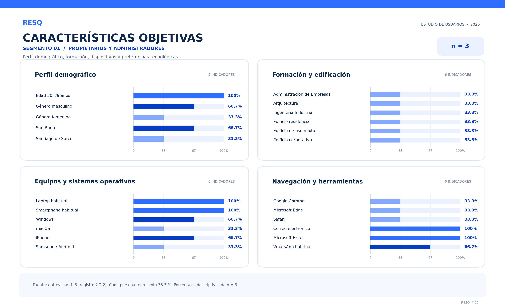

<p align="center">

<strong>Figura 12. Cuadro estadístico de características objetivas - Segmento 1.</strong>

</p>

<p align="justify">

Los resultados presentados en la Figura 12 evidencian que las características más comunes del primer segmento son la formación profesional, las responsabilidades de administración y el uso habitual de herramientas digitales. El 100 % utiliza computadoras y smartphones, aunque se observa diversidad en los sistemas operativos y navegadores. Estos hallazgos permiten reconocer la importancia de considerar una experiencia digital adaptable a diferentes dispositivos y entornos tecnológicos. Asimismo, la utilización de múltiples herramientas de comunicación y supervisión refleja la necesidad de acceder a información procedente de distintas fuentes durante las actividades de gestión de edificaciones.

</p>

##### Características subjetivas

<p align="justify">

El análisis de las características subjetivas del primer segmento permitió identificar coincidencias relacionadas con la personalidad, los comportamientos profesionales, las dificultades experimentadas y las expectativas frente a nuevas tecnologías. El 100 % de los entrevistados presenta una forma de trabajo orientada a la prevención, el análisis o el cumplimiento de procedimientos estructurados. Aunque existen diferencias individuales en sus estilos de gestión, los tres consideran fundamental disponer de información confiable antes de tomar decisiones que puedan afectar la seguridad de las personas o el funcionamiento de una edificación.

</p>

<p align="justify">

Una de las principales problemáticas compartidas corresponde a la fragmentación de los sistemas tecnológicos. El 100 % de los entrevistados describe instalaciones donde las cámaras, alarmas, detectores u otras plataformas de supervisión no se encuentran completamente integrados. Esta situación obliga a consultar diferentes interfaces, realizar llamadas, coordinar con otros trabajadores o efectuar verificaciones presenciales para comprender una situación. En consecuencia, la centralización de información representa una necesidad recurrente para facilitar las actividades de supervisión.

</p>

<p align="justify">

En cuanto a la detección y gestión de incidentes, el 100 % considera importante identificar oportunamente la ubicación o zona afectada. También se mencionan como datos relevantes el tipo de emergencia, la gravedad, el dispositivo que produjo la alerta, el estado de los equipos y las acciones ejecutadas por los responsables. Estas necesidades se encuentran relacionadas con las experiencias descritas durante las entrevistas, que incluyen la detección de humo en un sótano, una fuga de gas identificada inicialmente por una residente y una falsa alarma ocasionada por el funcionamiento incorrecto de un detector.

</p>

<p align="justify">

Respecto a las principales frustraciones, los tres participantes describen dificultades vinculadas con la fragmentación tecnológica, las verificaciones manuales o la incertidumbre durante situaciones críticas. Asimismo, el 66.7 % menciona explícitamente problemas para consultar información histórica debido a la dispersión de registros entre documentos, correos electrónicos, hojas de cálculo y conversaciones. Estos hallazgos evidencian que las dificultades relacionadas con la seguridad no se limitan al momento de una emergencia, sino que también se presentan durante las actividades de seguimiento y evaluación posterior.

</p>

<p align="justify">

En relación con la automatización, el 100 % mantiene una actitud favorable hacia la ejecución automática de determinadas acciones, como generación de alarmas, notificaciones, señalización y registro de eventos. Sin embargo, los tres participantes consideran necesario mantener condiciones adecuadas de confiabilidad y mecanismos de supervisión humana para aquellas acciones que puedan ocasionar consecuencias importantes sobre personas o infraestructura. Por tanto, la automatización es percibida como un mecanismo de apoyo a la gestión de emergencias, siempre que existan reglas claras y controles apropiados.

</p>

<p align="justify">

El 100 % considera importante que determinadas funciones críticas de seguridad puedan continuar operando localmente cuando se pierde la conexión a Internet. Esta coincidencia evidencia una preocupación compartida por la continuidad operativa de los sistemas, especialmente durante eventos que requieren atención prioritaria. Esta necesidad guarda relación con el enfoque de ResQ, que contempla capacidades de procesamiento local mediante Edge Computing para funciones específicas de detección y respuesta.

</p>

<p align="justify">

Respecto al seguimiento de incidentes, el 100 % utiliza o considera relevante disponer de registros e indicadores relacionados con la seguridad. Entre los datos identificados se encuentran la cantidad de incidentes por zona, los tiempos de respuesta, las falsas alarmas, las fallas de dispositivos, la disponibilidad de equipos y los mantenimientos pendientes. Estos resultados permiten reconocer oportunidades para mejorar la organización, visualización y consulta de información sobre las condiciones de seguridad de una edificación.

</p>

<p align="justify">

En cuanto a los objetivos y criterios de confianza, el 100 % busca desarrollar sus responsabilidades con información suficiente, reducir la incertidumbre frente a situaciones críticas y mantener condiciones adecuadas de seguridad. Asimismo, los tres participantes consideran relevantes la confiabilidad de las tecnologías, la integración con sistemas existentes y la disponibilidad de soporte o mantenimiento al evaluar nuevas soluciones. Sus decisiones también pueden estar influenciadas por juntas de propietarios, especialistas técnicos, proveedores y responsables administrativos.

</p>

<p align="justify">

Con la finalidad de visualizar las características subjetivas predominantes entre los propietarios y administradores de edificaciones, se elaboró un gráfico estadístico de barras que presenta los porcentajes correspondientes a los principales comportamientos, necesidades, dificultades y criterios de decisión identificados. Se consideran aspectos como la orientación preventiva, la necesidad de información confiable, la utilización de sistemas no integrados, la identificación de zonas afectadas, la aceptación de automatización supervisada, la continuidad operativa y las dificultades para consultar información histórica. Esta representación permite reconocer los factores más recurrentes dentro de la muestra y establecer las prioridades que deberán considerarse durante el diseño de ResQ.

</p>

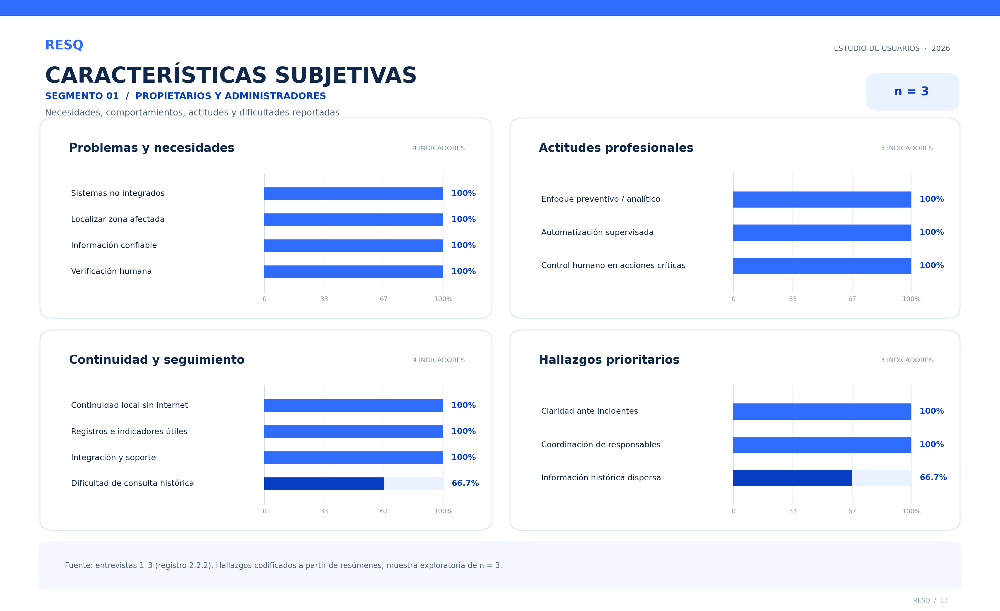

<p align="center">

<strong>Figura 13. Cuadro estadístico de características subjetivas - Segmento 1.</strong>

</p>

<p align="justify">

Los resultados de la Figura 13 muestran que la integración tecnológica, la disponibilidad de información confiable, la identificación de zonas afectadas, la continuidad de funciones críticas y la automatización supervisada constituyen necesidades compartidas por el 100 % de los entrevistados. Asimismo, las dificultades para consultar información histórica, documentadas explícitamente en el 66.7 % de los casos, evidencian oportunidades para mejorar los mecanismos de registro y seguimiento de incidentes. Estos hallazgos permiten identificar características relevantes para orientar las funcionalidades de monitoreo, alerta y gestión de información propuestas para ResQ.

</p>

##### Perfil predominante del segmento

<p align="justify">

A partir de los resultados obtenidos, el perfil predominante del primer segmento corresponde a un profesional adulto con formación académica y responsabilidades de administración, mantenimiento u operación de edificaciones. Desarrolla actividades relacionadas con la supervisión de sistemas de seguridad, coordinación de personal, revisión de incidencias y comunicación con proveedores. Utiliza habitualmente una laptop y un smartphone, complementando sus actividades mediante herramientas de comunicación, hojas de cálculo y plataformas especializadas.

</p>

<p align="justify">

Desde la perspectiva personal y profesional, presenta una orientación preventiva y analítica, procura tomar decisiones respaldadas por información confiable y considera importante mantener el control de las operaciones críticas. Sus principales objetivos son proteger a los ocupantes, supervisar las condiciones de seguridad, identificar oportunamente situaciones de riesgo y coordinar respuestas adecuadas. Entre sus frustraciones se encuentran la fragmentación de sistemas, la dependencia de verificaciones manuales, las falsas alarmas y la dificultad para acceder a información completa durante una emergencia.

</p>

<p align="justify">

Estos hallazgos servirán como fundamento para la elaboración del User Persona del primer segmento. Las características identificadas permitirán representar sus responsabilidades, conocimientos, necesidades, motivaciones, frustraciones y comportamientos tecnológicos, manteniendo coherencia con las experiencias recopiladas. Asimismo, proporcionan criterios para orientar la experiencia de usuario de ResQ hacia una supervisión clara, organizada y adaptable a distintos tipos de edificaciones.

</p>

---

#### Segmento objetivo #2: Empresas integradoras de automatización y gestión de edificios inteligentes

##### Características objetivas

<p align="justify">

El análisis de las características objetivas del segundo segmento se desarrolló considerando las entrevistas de Luis Herrera Campos, Mateo Loechle Arias y Juan Diego Ramírez Torres. Los participantes trabajan en organizaciones relacionadas con automatización, integración IoT, Building Management Systems (BMS) y seguridad electrónica. La muestra incorpora profesionales que desempeñan funciones de gerencia técnica, ingeniería de proyectos e integración, y jefatura de proyectos, permitiendo analizar diferentes responsabilidades involucradas en la selección e implementación de soluciones tecnológicas para clientes.

</p>

<p align="justify">

Respecto a la edad, el 33.3 % se encuentra entre los 20 y 29 años, el 33.3 % entre los 30 y 39 años y el 33.3 % entre los 40 y 49 años. Las edades registradas son 26, 32 y 42 años, respectivamente. En cuanto al género, los tres registros identifican a los participantes como masculinos, equivalente al 100 % de la muestra. Asimismo, el 100 % reside en Lima Metropolitana, con una distribución equivalente entre San Borja, Jesús María y Santiago de Surco, representando cada distrito el 33.3 % de los entrevistados.

</p>

<p align="justify">

En cuanto al estado civil, el 66.7 % se encuentra soltero y el 33.3 % casado. Los registros también muestran diferentes configuraciones familiares: un participante vive con su esposa e hijos, otro comparte vivienda con su hermano y el tercero reside con su familia. Estas características contribuyen a describir el contexto personal de los entrevistados, aunque las necesidades profesionales del segmento se encuentran principalmente relacionadas con sus responsabilidades técnicas y comerciales.

</p>

<p align="justify">

Respecto a la formación académica, el 66.7 % posee formación en Ingeniería Electrónica y el 33.3 % en Ingeniería de Sistemas. El 100 % cuenta con experiencia profesional vinculada con automatización, seguridad electrónica o integración tecnológica, con trayectorias de seis, ocho y quince años. Por consiguiente, los tres participantes poseen al menos seis años de experiencia y el 33.3 % supera los diez años de trayectoria profesional. Estos resultados reflejan la participación de profesionales familiarizados con procesos de evaluación técnica, implementación y gestión de proyectos.

</p>

<p align="justify">

En relación con los cargos, el 33.3 % corresponde a gerencia técnica, el 33.3 % a ingeniería de proyectos e integración IoT y el 33.3 % a jefatura de proyectos de integración. Las responsabilidades descritas incluyen levantamiento de requisitos, evaluación de alternativas tecnológicas, diseño de soluciones, selección de equipos, configuración de sistemas, programación, pruebas de integración, elaboración de cotizaciones, coordinación con clientes y seguimiento posterior a la implementación.

</p>

<p align="justify">

Desde la perspectiva tecnológica, el 66.7 % cuenta con información original documentada sobre el uso habitual de una laptop y un smartphone dentro de sus actividades profesionales. En estos mismos registros, Google Chrome aparece como navegador utilizado habitualmente. Para el 33.3 % restante no se dispone de información original suficientemente verificada sobre dispositivos y preferencias de navegación, por lo que estas características permanecen pendientes de confirmación. En consecuencia, los porcentajes reflejan la información documentada y no necesariamente las preferencias reales de todos los participantes.

</p>

<p align="justify">

En relación con las herramientas y canales de comunicación, el 66.7 % menciona explícitamente Microsoft Teams, WhatsApp y correo electrónico como medios utilizados para coordinar actividades profesionales. También se identifican herramientas técnicas como Postman, Visual Studio Code, plataformas BMS, utilidades MQTT y programas relacionados con protocolos BACnet y Modbus. Estas aplicaciones se encuentran asociadas con actividades de configuración, integración de sistemas, diagnóstico técnico y coordinación de proyectos.

</p>

<p align="justify">

Respecto a marcas e influencias profesionales, el 66.7 % menciona Schneider Electric y Siemens entre los fabricantes conocidos o utilizados. También aparecen referencias a Honeywell y Johnson Controls. Los entrevistados destacan la importancia de consultar documentación oficial, experiencias de otros integradores, recomendaciones de proveedores y demostraciones técnicas. Asimismo, el uso de LinkedIn se encuentra documentado explícitamente en uno de los registros originales, equivalente al 33.3 % de la muestra. También se identifican fuentes como GitHub, Stack Overflow, YouTube y foros técnicos especializados.

</p>

<p align="justify">

Para representar las características objetivas del segundo segmento, se elaboró un gráfico estadístico de barras que presenta la distribución porcentual de las principales variables demográficas, académicas, profesionales y tecnológicas identificadas en los registros de entrevistas. Se consideran aspectos como edad, género, distrito de residencia, formación profesional, años de experiencia, cargos desempeñados y utilización documentada de dispositivos, navegadores y canales digitales. Esta representación permite reconocer los perfiles de los participantes y establecer las características objetivas relevantes para la construcción del User Persona correspondiente a las empresas integradoras.

</p>

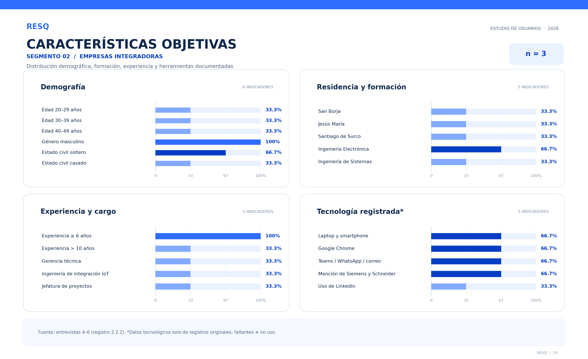

<p align="center">

<strong>Figura 14. Cuadro estadístico de características objetivas - Segmento 2.</strong>

</p>

<p align="justify">

Los resultados de la Figura 14 permiten identificar que el segundo segmento está representado por profesionales con formación en ingeniería y experiencia relacionada con automatización e integración tecnológica. Aunque existen diferencias en edad, trayectoria y cargo, el 100 % participa en actividades que requieren conocimientos técnicos o gestión de proyectos tecnológicos. La diversidad de responsabilidades demuestra que la evaluación e incorporación de nuevas soluciones involucra diferentes perfiles dentro de las organizaciones. Asimismo, la información tecnológica documentada destaca la importancia de proporcionar herramientas y recursos técnicos adecuados para los entornos profesionales de estas empresas.

</p>

##### Características subjetivas

<p align="justify">

El análisis de las características subjetivas del segundo segmento permitió identificar coincidencias relacionadas con la evaluación de tecnologías, los criterios de confianza, las dificultades de interoperabilidad y la relación con proveedores. Los tres participantes presentan una forma de trabajo analítica y orientada a reducir riesgos técnicos o comerciales antes de incorporar una solución a los proyectos desarrollados para sus clientes. Aunque sus responsabilidades son diferentes, coinciden en la importancia de realizar evaluaciones fundamentadas y comprobar el funcionamiento de las tecnologías.

</p>

<p align="justify">

La compatibilidad e integración tecnológica constituyen criterios relevantes para el 100 % de los entrevistados. Los participantes consideran fundamental verificar que una solución pueda incorporarse a la infraestructura existente y funcionar correctamente junto con los sistemas instalados. El 66.7 % describe experiencias concretas relacionadas con incompatibilidades, restricciones de protocolos o dificultades de comunicación entre dispositivos de diferentes fabricantes. Estos problemas pueden ocasionar trabajo adicional de ingeniería, modificaciones técnicas y retrasos durante los procesos de implementación.

</p>

<p align="justify">

Respecto a los mecanismos de validación, el 100 % considera importante realizar pruebas, demostraciones o pilotos antes de adoptar definitivamente una nueva tecnología. Los tres participantes describen experiencias donde la evaluación práctica permitió comprobar el comportamiento de dispositivos y sistemas. Para ellos, estas actividades ayudan a identificar posibles incompatibilidades, evaluar la estabilidad y reducir la incertidumbre antes de asumir compromisos de implementación frente a sus clientes.

</p>

<p align="justify">

En relación con la documentación técnica, el 66.7 % menciona explícitamente su importancia para facilitar la integración de soluciones. Entre los aspectos relevantes se encuentran protocolos de comunicación, APIs, ejemplos de solicitudes y respuestas, estructuras de mensajes y herramientas de diagnóstico. La ausencia de documentación suficiente o las restricciones no especificadas pueden generar dificultades durante la configuración y ejecución de pruebas, incrementando el esfuerzo requerido para integrar componentes de diferentes fabricantes.

</p>

<p align="justify">

El soporte técnico y el mantenimiento posterior representan criterios relevantes para el 100 % de los entrevistados. Los participantes destacan que las responsabilidades de una empresa integradora continúan después de seleccionar o instalar una tecnología. Por ello, consideran importante evaluar la disponibilidad de asistencia técnica, la estabilidad de funcionamiento, las posibilidades de mantenimiento y el respaldo ofrecido por el proveedor durante el ciclo de vida de la solución.

</p>

<p align="justify">

Respecto a las frustraciones profesionales, el 66.7 % describe experiencias directas relacionadas con incompatibilidades técnicas, limitaciones de fabricantes o comportamientos diferentes a los esperados. Entre las situaciones mencionadas se encuentran restricciones de integración en sistemas que utilizan BACnet, dificultades asociadas con estructuras de mensajes MQTT y la necesidad de implementar capas intermedias de transformación. Estas experiencias reflejan la importancia de contar con información técnica completa y mecanismos de validación antes de realizar una instalación definitiva.

</p>

<p align="justify">

En cuanto a la continuidad operativa, el 66.7 % menciona explícitamente que determinadas funciones críticas deberían continuar funcionando localmente cuando se pierde la conexión a Internet. Los participantes que abordaron este tema consideran importante mantener disponibles las operaciones relacionadas con detección, procesamiento local y control de determinados dispositivos, mientras que funciones de acceso remoto, reportes e históricos pueden depender de la conectividad. Esta necesidad guarda relación con la propuesta tecnológica de ResQ de incorporar capacidades de Edge Computing.

</p>

<p align="justify">

En relación con la incorporación de soluciones de terceros, el 100 % participa en actividades relacionadas con evaluación, selección o integración de tecnologías externas. Sin embargo, solamente el 33.3 % expresa explícitamente una preferencia por integrar una solución especializada existente en lugar de desarrollarla internamente, siempre que resulte compatible y económicamente conveniente. Este hallazgo permite reconocer una oportunidad para establecer relaciones de colaboración entre SecurityBear y empresas integradoras, aunque las condiciones comerciales deberán validarse posteriormente.

</p>

<p align="justify">

Respecto a las marcas e influencias, el 66.7 % señala explícitamente que el reconocimiento de un fabricante no resulta suficiente por sí solo para seleccionar una tecnología. Los participantes valoran factores adicionales como documentación, compatibilidad, resultados de pruebas, soporte y experiencia de otros profesionales. El tercer entrevistado también prioriza criterios técnicos y comerciales, aunque su registro original no permite establecer una opinión equivalente sobre la influencia de las marcas. Estos resultados evidencian que la confianza hacia una nueva solución requiere argumentos técnicos y pruebas de funcionamiento.

</p>

<p align="justify">

Finalmente, el 100 % presenta objetivos profesionales relacionados con la entrega de soluciones confiables, el cumplimiento de los requerimientos de los clientes y la reducción de riesgos de implementación. Los participantes también consideran relevante que las tecnologías puedan mantenerse después de su instalación. Sus principales motivaciones se encuentran vinculadas con la calidad del trabajo realizado, la satisfacción de los clientes, el cumplimiento de los proyectos y la capacidad de resolver problemas mediante alternativas tecnológicas adecuadas.

</p>

<p align="justify">

Con la finalidad de visualizar las características subjetivas del segundo segmento, se elaboró un gráfico estadístico de barras que presenta los porcentajes correspondientes a las principales necesidades, motivaciones, preocupaciones y criterios de decisión identificados. Se incluyen aspectos relacionados con interoperabilidad, compatibilidad, realización de pruebas, soporte técnico, mantenimiento, documentación, dificultades de integración y continuidad de funciones críticas sin conexión a Internet. El gráfico permite reconocer los factores que influyen en la evaluación y adopción de tecnologías por parte de las empresas integradoras, así como las oportunidades que debe considerar SecurityBear para presentar una propuesta tecnológica confiable y adaptable.

</p>

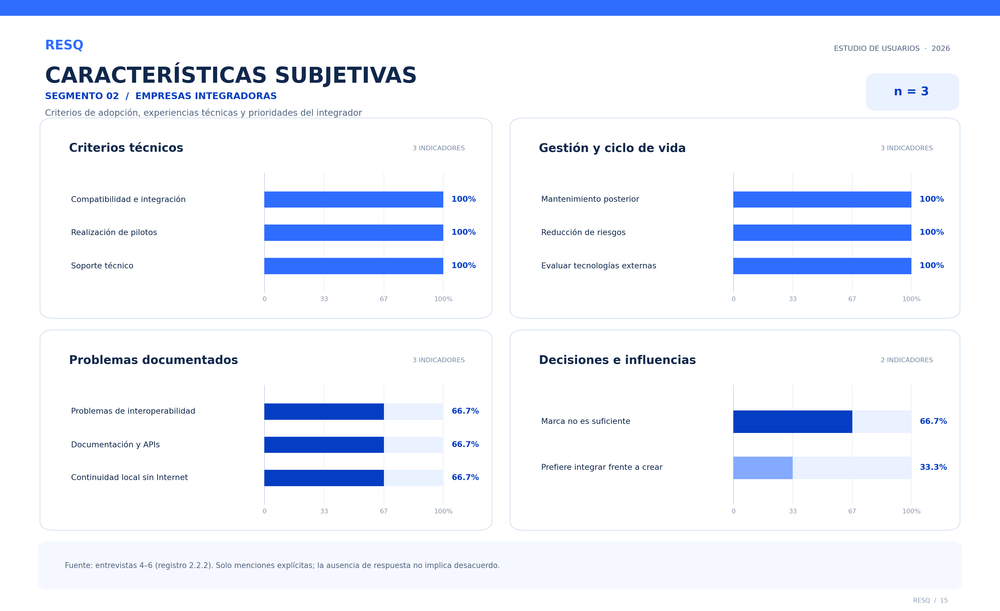

<p align="center">

<strong>Figura 15. Cuadro estadístico de características subjetivas - Segmento 2.</strong>

</p>

<p align="justify">

Los resultados presentados en la Figura 15 evidencian que la compatibilidad tecnológica, las pruebas de validación, la disponibilidad de soporte y el mantenimiento posterior constituyen criterios compartidos por el 100 % de los entrevistados. Asimismo, el 66.7 % describe dificultades concretas de interoperabilidad, destaca la importancia de la documentación técnica y considera necesario mantener determinadas funciones críticas localmente. Estos hallazgos permiten reconocer que la incorporación de nuevas soluciones depende de factores técnicos, operativos y comerciales que deben considerarse durante el diseño y posicionamiento de ResQ.

</p>

##### Perfil predominante del segmento

<p align="justify">

Los resultados permiten identificar como perfil predominante del segundo segmento a un profesional con formación en ingeniería y experiencia en automatización, integración IoT o seguridad electrónica. Participa en procesos de evaluación, selección, configuración, implementación o supervisión de tecnologías que deben incorporarse a proyectos desarrollados para clientes. Sus actividades requieren conocimientos técnicos, capacidad de análisis, resolución de problemas, gestión de proyectos y comunicación con profesionales de diferentes especialidades.

</p>

<p align="justify">

Desde una perspectiva profesional, presenta una orientación analítica y valora la posibilidad de comprobar el comportamiento de una tecnología antes de incorporarla a una infraestructura existente. Sus principales objetivos son desarrollar integraciones confiables, cumplir los requerimientos de los clientes, reducir riesgos de implementación y facilitar el mantenimiento posterior. Entre sus frustraciones se encuentran las incompatibilidades no previstas, la documentación incompleta, las restricciones tecnológicas, las dificultades detectadas tardíamente y la dependencia de proveedores con soporte insuficiente.

</p>

<p align="justify">

Estos hallazgos permitirán elaborar el User Persona correspondiente al segundo segmento, incorporando sus actividades profesionales, conocimientos tecnológicos, objetivos, motivaciones, frustraciones y criterios de adopción. Asimismo, orientarán la propuesta de ResQ hacia capacidades claramente documentadas, mecanismos de integración comprensibles, posibilidades de validación técnica y condiciones de operación apropiadas para diferentes infraestructuras.

</p>

---

#### Síntesis de los resultados

<p align="justify">

El análisis de las entrevistas permitió identificar diferencias y coincidencias entre los dos segmentos objetivo de SecurityBear. Los propietarios y administradores de edificaciones se concentran principalmente en las actividades de supervisión, prevención, detección de incidentes y coordinación de respuestas. Para este segmento, la fragmentación de sistemas representa una dificultad porque obliga a consultar diferentes plataformas, realizar verificaciones manuales y coordinar la obtención de información necesaria para tomar decisiones.

</p>

<p align="justify">

En contraste, las empresas integradoras de automatización y gestión de edificios inteligentes analizan el problema desde la perspectiva de la implementación tecnológica. Sus principales preocupaciones se relacionan con la compatibilidad, los protocolos de comunicación, la documentación técnica, la estabilidad de funcionamiento, las pruebas y la disponibilidad de soporte. Estas organizaciones necesitan incorporar soluciones a proyectos existentes sin generar dificultades técnicas innecesarias o comprometer la confiabilidad de las instalaciones.

</p>

<p align="justify">

En el primer segmento, el 100 % reportó utilizar sistemas de seguridad no completamente integrados y consideró importante identificar oportunamente las zonas afectadas durante incidentes. Asimismo, el 100 % valoró la continuidad de determinadas funciones críticas y manifestó una actitud favorable hacia la automatización bajo condiciones adecuadas de supervisión. Estos hallazgos reflejan necesidades relacionadas con monitoreo centralizado, alertas contextualizadas, registro de eventos y coordinación de acciones.

</p>

<p align="justify">

En el segundo segmento, el 100 % consideró importantes la compatibilidad tecnológica, las pruebas y el soporte de proveedores. Asimismo, el 66.7 % describió dificultades concretas relacionadas con interoperabilidad y documentación técnica. Estos resultados reflejan la necesidad de ofrecer una solución que pueda comprenderse, evaluarse e integrarse mediante procedimientos adecuados, considerando las características de la infraestructura existente y las responsabilidades que asumen las empresas integradoras frente a sus clientes.

</p>

<p align="justify">

Una coincidencia fundamental entre ambos segmentos es la importancia de la integración tecnológica, aunque sus objetivos son diferentes. Para los propietarios y administradores, la integración representa la posibilidad de acceder a información organizada y disponer de una visión más clara del estado de sus edificaciones. Para las empresas integradoras, representa la capacidad de incorporar nuevas funciones mediante protocolos, interfaces y mecanismos de configuración que permitan trabajar con diferentes dispositivos y plataformas tecnológicas.

</p>

<p align="justify">

Los resultados permiten establecer una relación entre las necesidades identificadas y la propuesta de valor de ResQ. La plataforma busca integrar el monitoreo de condiciones de riesgo, facilitar la identificación y seguimiento de alertas y coordinar mecanismos de respuesta mediante tecnologías IoT y procesamiento local. Desde la perspectiva empresarial, estas capacidades deberán responder tanto a las necesidades operativas de los propietarios y administradores como a los criterios técnicos de las organizaciones especializadas en automatización e integración tecnológica.

</p>

#### Implicaciones para el proceso de Needfinding

<p align="justify">

Los hallazgos obtenidos constituirán la base para elaborar los User Personas correspondientes a los dos segmentos objetivo. Para los propietarios y administradores se considerarán características relacionadas con supervisión de infraestructura, coordinación de personal, gestión de incidentes, necesidad de información confiable y utilización de herramientas digitales. Para las empresas integradoras se priorizarán características vinculadas con evaluación de tecnologías, interoperabilidad, documentación, realización de pruebas, relación con proveedores y mantenimiento de soluciones.

</p>

<p align="justify">

Asimismo, los resultados permitirán elaborar el User Task Matrix mediante la identificación de las tareas que cada segmento realiza actualmente, independientemente de la existencia de ResQ. Entre estas actividades se encuentran supervisar sistemas de seguridad, verificar alertas, coordinar personal, consultar registros, evaluar dispositivos, comprobar compatibilidad y realizar pruebas de integración. La frecuencia e importancia de estas tareas deberán establecerse a partir de la información recopilada durante el proceso de investigación.

</p>

<p align="justify">

Los User Journey Maps representarán los procesos actuales (As-Is) que siguen los participantes al desarrollar estas actividades, identificando sus principales dificultades, necesidades de información y oportunidades de mejora. Complementariamente, los Empathy Maps permitirán organizar los comportamientos, motivaciones, preocupaciones, percepciones y frustraciones asociadas con los User Personas, manteniendo una relación directa con los hallazgos objetivos y subjetivos obtenidos en las entrevistas.

</p>

<p align="justify">

En conclusión, el análisis de entrevistas evidencia que los propietarios y administradores de edificaciones necesitan mejorar la visibilidad de las condiciones de seguridad, la localización de incidentes y la coordinación de respuestas, mientras que las empresas integradoras requieren tecnologías confiables, interoperables y respaldadas por mecanismos adecuados de validación y soporte. Estas perspectivas complementarias proporcionan una base para orientar las decisiones de diseño de ResQ y sustentar posteriormente la definición de requisitos funcionales, experiencias de usuario y capacidades de integración, manteniendo trazabilidad entre las necesidades investigadas y los artefactos del proyecto.

</p>

## 2.3. Needfinding

<p align="justify">

El proceso de Needfinding de ResQ permite identificar las necesidades, objetivos y dificultades de sus dos segmentos objetivo. A partir de las entrevistas y el análisis competitivo se elaboran los User Personas, User Task Matrix, User Journey Maps y Empathy Maps, que servirán de base para definir los requisitos y orientar el diseño de la solución.

</p>

### 2.3.1. User Personas

<p align="justify">

Los User Personas de ResQ se construyeron a partir de las seis entrevistas y los resultados del análisis estadístico del apartado 2.2.3, complementados con los hallazgos del análisis competitivo. Se definió un arquetipo por segmento objetivo, considerando características demográficas, trayectoria profesional, personalidad, habilidades, tecnologías utilizadas, objetivos, motivaciones y frustraciones. Ambos perfiles sintetizan características de los entrevistados y no representan a una persona real específica.

</p>

#### Segmento objetivo #1: Propietarios y administradores de edificaciones — Carlos Mendoza

<p align="justify">

Carlos Mendoza, de 37 años, es administrador de un edificio residencial y cuenta con experiencia en gestión de infraestructura, seguridad y mantenimiento. Es organizado, preventivo y utiliza herramientas digitales para supervisar sus responsabilidades. Entre sus actividades habituales se encuentran revisar incidencias, coordinar personal, supervisar equipos y gestionar proveedores. Sus decisiones están influenciadas por especialistas técnicos, costos, confiabilidad y disponibilidad de soporte.

</p>

<p align="justify">

Su principal objetivo es garantizar la seguridad de los ocupantes mediante la identificación oportuna de riesgos y la coordinación de respuestas. Sin embargo, enfrenta dificultades porque las cámaras, alarmas y registros funcionan mediante sistemas independientes, obligándolo a realizar llamadas y verificaciones manuales. Necesita conocer el tipo de amenaza, la zona afectada, su gravedad y las acciones realizadas. Estas necesidades orientan las capacidades de monitoreo, alertas y gestión de incidentes propuestas para ResQ.

</p>

<p align="justify">

La Figura 16 presenta el User Persona de Carlos Mendoza, incluyendo sus características profesionales, motivaciones, objetivos, frustraciones y preferencias tecnológicas.

</p>

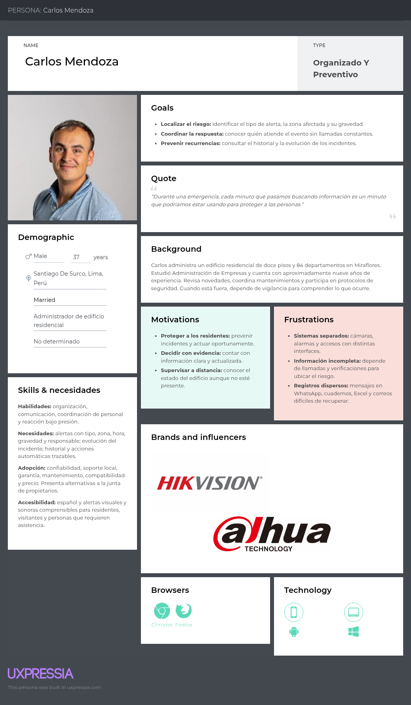

<p align="center">

<strong>Figura 16. User Persona de Carlos Mendoza.</strong>

</p>

#### Segmento objetivo #2: Empresas integradoras de automatización y gestión de edificios inteligentes — Alex Rivera

<p align="justify">

Alex Rivera, de 42 años, es un gerente técnico con experiencia en automatización, IoT y Building Management Systems (BMS). Es analítico, organizado y participa en la evaluación de proveedores, diseño de arquitecturas, integración de dispositivos y supervisión de proyectos. Utiliza herramientas técnicas y documentación de fabricantes, y valora los protocolos abiertos, la confiabilidad, las pruebas y el soporte especializado.

</p>

<p align="justify">

Su principal objetivo es incorporar soluciones tecnológicas compatibles, estables y fáciles de mantener en los proyectos de sus clientes. Sus mayores frustraciones son la documentación incompleta, las incompatibilidades entre fabricantes, los sistemas cerrados y la falta de soporte. Necesita comprobar el funcionamiento de nuevas tecnologías antes de implementarlas. Estas necesidades orientan la propuesta de ResQ hacia la interoperabilidad, configuración de dispositivos y validación técnica, capacidades que deberán desarrollarse y comprobarse progresivamente.

</p>

<p align="justify">

La Figura 17 presenta el User Persona de Alex Rivera, sintetizando sus responsabilidades, habilidades, objetivos, frustraciones y criterios de evaluación tecnológica.

</p>

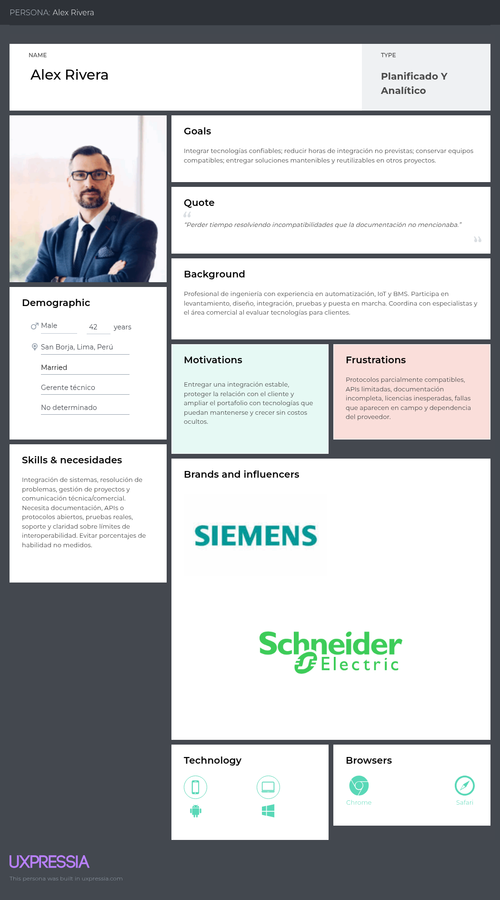

<p align="center">

<strong>Figura 17. User Persona de Alex Rivera, arquetipo del integrador.</strong>

</p>

### 2.3.2. User Task Matrix

<p align="justify">

La User Task Matrix compara las tareas que Carlos Mendoza y Alex Rivera realizan actualmente, independientemente de ResQ. Se evalúa su frecuencia e importancia mediante niveles Alto, Medio y Bajo, utilizando No aplica cuando una actividad no corresponde al perfil. Las valoraciones son estimaciones cualitativas basadas en las entrevistas y permiten identificar las actividades prioritarias de cada segmento.

</p>

<table>
<thead>
<tr>
<th rowspan="2">Tarea</th>
<th colspan="2">Carlos Mendoza</th>
<th colspan="2">Alex Rivera</th>
</tr>
<tr>
<th>Frecuencia</th>
<th>Importancia</th>
<th>Frecuencia</th>
<th>Importancia</th>
</tr>
</thead>
<tbody>
<tr>
<td>Revisar las condiciones de seguridad de una edificación</td>
<td>Alta</td>
<td>Alta</td>
<td>No aplica</td>
<td>No aplica</td>
</tr>
<tr>
<td>Verificar el funcionamiento de equipos de seguridad</td>
<td>Alta</td>
<td>Alta</td>
<td>Media</td>
<td>Alta</td>
</tr>
<tr>
<td>Identificar la ubicación y gravedad de una alerta</td>
<td>Media</td>
<td>Alta</td>
<td>No aplica</td>
<td>No aplica</td>
</tr>
<tr>
<td>Coordinar la atención de incidentes con el personal responsable</td>
<td>Media</td>
<td>Alta</td>
<td>No aplica</td>
<td>No aplica</td>
</tr>
<tr>
<td>Registrar y consultar incidentes anteriores</td>
<td>Media</td>
<td>Alta</td>
<td>No aplica</td>
<td>No aplica</td>
</tr>
<tr>
<td>Coordinar mantenimiento y soporte de sistemas instalados</td>
<td>Media</td>
<td>Alta</td>
<td>Alta</td>
<td>Alta</td>
</tr>
<tr>
<td>Evaluar tecnologías y proveedores</td>
<td>Baja</td>
<td>Media</td>
<td>Media</td>
<td>Alta</td>
</tr>
<tr>
<td>Identificar necesidades y requisitos de un cliente</td>
<td>No aplica</td>
<td>No aplica</td>
<td>Alta</td>
<td>Alta</td>
</tr>
<tr>
<td>Realizar levantamientos de infraestructura y conectividad</td>
<td>No aplica</td>
<td>No aplica</td>
<td>Media</td>
<td>Alta</td>
</tr>
<tr>
<td>Revisar documentación, protocolos y compatibilidad</td>
<td>No aplica</td>
<td>No aplica</td>
<td>Alta</td>
<td>Alta</td>
</tr>
<tr>
<td>Diseñar arquitecturas de integración</td>
<td>No aplica</td>
<td>No aplica</td>
<td>Alta</td>
<td>Alta</td>
</tr>
<tr>
<td>Realizar pruebas de concepto y pilotos</td>
<td>No aplica</td>
<td>No aplica</td>
<td>Media</td>
<td>Alta</td>
</tr>
<tr>
<td>Configurar dispositivos e integrar sistemas</td>
<td>No aplica</td>
<td>No aplica</td>
<td>Alta</td>
<td>Alta</td>
</tr>
<tr>
<td>Validar el funcionamiento de sistemas en campo</td>
<td>No aplica</td>
<td>No aplica</td>
<td>Media</td>
<td>Alta</td>
</tr>
<tr>
<td>Documentar implementaciones y capacitar clientes</td>
<td>No aplica</td>
<td>No aplica</td>
<td>Media</td>
<td>Alta</td>
</tr>
</tbody>
</table>

<p align="justify">

Para Carlos Mendoza, las tareas más frecuentes e importantes son revisar las condiciones de seguridad, verificar equipos y coordinar el mantenimiento. Aunque las emergencias ocurren con menor frecuencia, identificar y atender alertas mantiene una importancia alta por sus posibles consecuencias. Sus principales dificultades se relacionan con la fragmentación de información y la necesidad de verificaciones manuales.

</p>

<p align="justify">

Para Alex Rivera, las actividades prioritarias son revisar compatibilidad, diseñar integraciones, configurar dispositivos y evaluar tecnologías. Las pruebas y validaciones se realizan en etapas específicas de cada proyecto, pero tienen importancia alta porque permiten prevenir fallas y reducir riesgos de implementación.

</p>

<p align="justify">

Ambos perfiles coinciden en la importancia del mantenimiento y la evaluación de tecnologías, pero tienen responsabilidades diferentes. Carlos se enfoca en la operación y seguridad de las edificaciones, mientras que Alex se concentra en la integración y confiabilidad de los sistemas. Estos resultados servirán de base para los User Journey Maps As-Is, que representarán la atención de alertas y el proceso de integración tecnológica, respectivamente.

</p>

### 2.3.3. User Journey Mapping

<p align="justify">
Los User Journey Maps describen experiencias actuales planteadas en los guiones. El recorrido del primer segmento sigue la atención de una alerta; el del segundo sigue la evaluación e integración de tecnología en un proyecto de automatización. Ambos son recorridos As-Is que distinguen los canales y problemas actuales de las oportunidades propuestas para ResQ. Las emociones son interpretaciones cualitativas, no mediciones de satisfacción ni mejoras comprobadas.
</p>

**Segmento objetivo #1: Carlos Mendoza — Atención de una alerta de humo en el sótano**

<p align="justify">
El recorrido presenta a Carlos fuera del edificio cuando recibe una llamada por una alerta de humo. Su objetivo es comprender la ubicación y gravedad del problema, coordinar con el personal y seguir la atención. El punto de mayor incertidumbre aparece mientras vigilancia revisa el sótano y las cámaras sin una vista unificada.
</p>

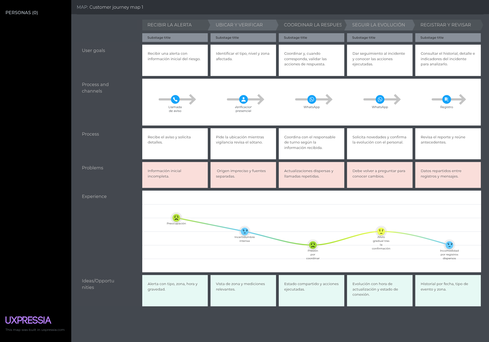

<p align="center">
  <strong>Figura 18. User Journey Map de Carlos Mendoza.</strong>
</p>

**Segmento objetivo #2: Alex Rivera — Evaluación e integración de una solución de automatización**

<p align="justify">
El Journey combina el levantamiento y modernización relatados por Luis, las pruebas de comunicación y problemas de campo descritos por Andrea, y la evaluación de proveedores y soporte explicados por Ricardo. Sus cinco etapas agrupan el recorrido completo: comprender, levantar, proponer un diseño, evaluar y probar, ajustar el diseño, implementar, poner en marcha, entregar y mantener. El diseño inicial es preliminar y se revisa a partir de los resultados del piloto.
</p>

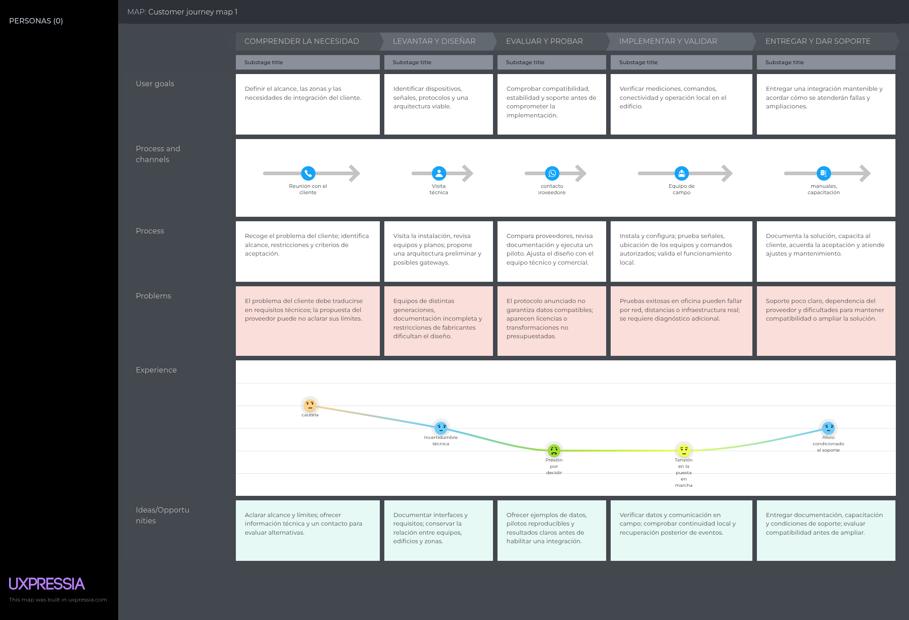

<p align="center">
  <strong>Figura 19. User Journey Map As-Is de Alex Rivera.</strong>
</p>

### 2.3.4. Empathy Mapping

<p align="justify">

Los Empathy Maps de ResQ fueron elaborados en UXPressia a partir de los User Personas y los hallazgos de las entrevistas. Para cada arquetipo, el equipo organizó sus necesidades, comportamientos, percepciones y emociones en las dimensiones de qué ve, escucha, dice, hace, piensa y siente. Asimismo, se identificaron sus principales dificultades (Pains) y beneficios esperados (Gains), con el propósito de comprender sus necesidades y orientar las decisiones de diseño de la solución.

</p>

#### Segmento objetivo #1: Carlos Mendoza — Propietarios y administradores de edificaciones

<p align="justify">

El mapa de empatía de Carlos Mendoza refleja a un administrador que necesita supervisar la seguridad de su edificio, aun cuando no se encuentra físicamente en él. Carlos ve sistemas separados, reportes dispersos y dependencia del personal para confirmar lo que ocurre. Escucha alertas, reportes de vigilancia, quejas de residentes y recomendaciones de proveedores. Dice que necesita saber qué pasó, dónde ocurrió y quién ya está atendiendo el incidente. Piensa en prevenir problemas, mantener el control y evitar decisiones apresuradas con información incompleta. Siente preocupación cuando una alerta no es clara o depende de verificaciones manuales. Sus principales dolores se relacionan con la fragmentación de información, la falta de contexto y la dificultad para consultar antecedentes. En consecuencia, espera una solución que le permita conocer el tipo de riesgo, su ubicación y el estado de la respuesta de manera clara y trazable.

</p>

<p align="justify">

La Figura 20 presenta el mapa de empatía de Carlos Mendoza, sintetizando sus percepciones, preocupaciones y expectativas como representante del primer segmento objetivo.

</p>

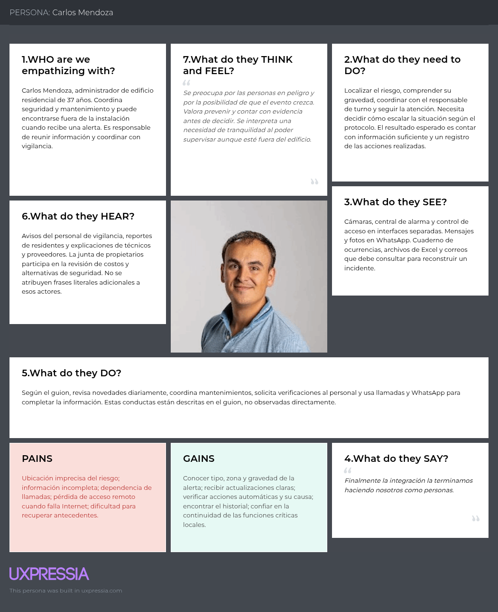

<p align="center">

<strong>Figura 20. Mapa de empatía de Carlos Mendoza.</strong>

</p>

#### Segmento objetivo #2: Alex Rivera — Empresas integradoras de automatización y gestión de edificios inteligentes

<p align="justify">

El mapa de empatía de Alex Rivera representa a un integrador que debe evaluar si una tecnología realmente puede incorporarse a la infraestructura existente de sus clientes. Alex ve proyectos con distintos fabricantes, protocolos y restricciones técnicas. Escucha requerimientos de clientes, observaciones del equipo técnico y promesas comerciales de proveedores. Dice que necesita validar compatibilidad, documentación y soporte antes de comprometer una solución. Piensa en reducir riesgos, evitar retrabajos y asegurar que la implementación sea sostenible. Siente presión cuando una tecnología parece adecuada en teoría, pero no está suficientemente validada en la práctica. Sus principales dolores son la documentación incompleta, las incompatibilidades, el trabajo adicional de integración y la falta de respaldo del proveedor. Por ello, espera una solución que ofrezca interoperabilidad, claridad técnica, pruebas de validación y condiciones de soporte adecuadas.

</p>

<p align="justify">

La Figura 21 presenta el mapa de empatía de Alex Rivera, reuniendo sus percepciones, criterios técnicos y expectativas como representante del segundo segmento objetivo.

</p>

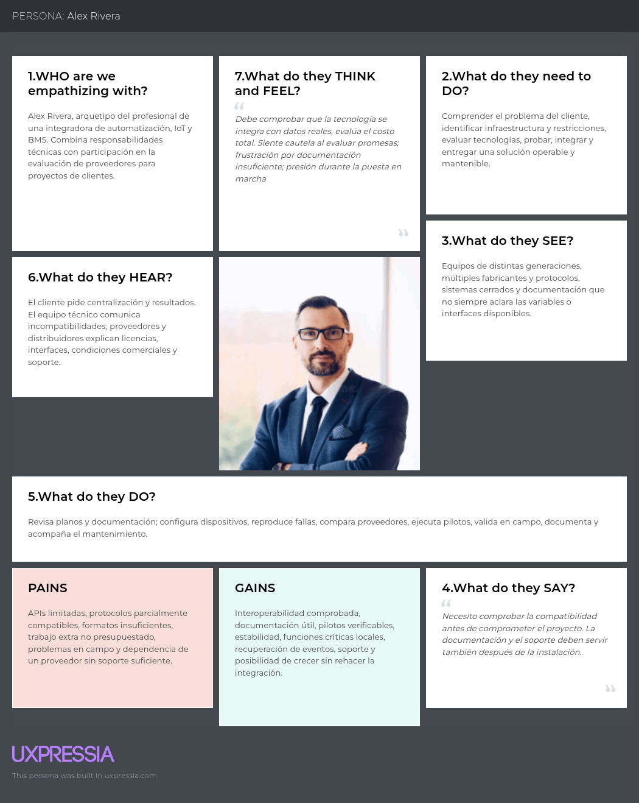

<p align="center">

<strong>Figura 21. Mapa de empatía de Alex Rivera.</strong>

</p>

<p align="justify">

En conjunto, ambos mapas muestran que la integración tecnológica y la confiabilidad son importantes para los dos segmentos, pero por razones distintas. Carlos necesita comprender lo que ocurre en su edificio y coordinar mejor la respuesta ante un riesgo. Alex necesita determinar si una tecnología puede integrarse, mantenerse y respaldarse adecuadamente dentro de un proyecto. Por ello, la claridad de la información, la validación técnica, la operación local de funciones críticas y la disponibilidad de soporte se convierten en aspectos relevantes para la propuesta de valor de ResQ.

</p>

## 2.4. Big Picture EventStorming

<p align="justify">
El Big Picture EventStorming de ResQ se desarrolló con el propósito de representar, a un nivel amplio, los principales acontecimientos que ocurren dentro del dominio relacionado con el monitoreo y la gestión de riesgos en edificaciones. Su construcción parte de los hallazgos obtenidos durante las entrevistas y de los artefactos elaborados previamente en Needfinding, permitiendo representar el comportamiento del dominio antes de profundizar en decisiones específicas de diseño o implementación.
</p>

<p align="justify">
Siguiendo el enfoque de Big Picture EventStorming, los principales acontecimientos del dominio fueron representados como Domain Events, es decir, hechos relevantes que ya ocurrieron dentro del proceso. A partir de estos eventos se identificaron siete procesos principales: preparación del entorno, monitoreo, detección y contextualización del riesgo, alertas y respuesta, gestión del incidente, continuidad ante pérdida de conectividad e integración con infraestructura existente.
</p>

<p align="justify">
Además del flujo de eventos, durante el análisis se identificaron dudas abiertas o Hotspots que requieren discusión posterior por parte del equipo, así como términos relevantes que deben mantener un significado compartido dentro del dominio.
</p>

### Vista general de los procesos

<p align="justify">
La vista general permite observar cómo se relacionan los principales procesos identificados. El flujo operacional principal comienza con la preparación del entorno, continúa con el monitoreo de la edificación, la detección y contextualización de posibles riesgos, la coordinación de alertas y respuestas y, cuando corresponde, la gestión de un incidente.
</p>

<p align="justify">
La integración con infraestructura existente permite que nuevas fuentes o dispositivos puedan incorporarse al entorno monitoreado. Por otro lado, la continuidad operativa constituye un proceso transversal que puede activarse durante el monitoreo, la detección de riesgos o la ejecución de respuestas cuando existe una interrupción de conectividad.
</p>

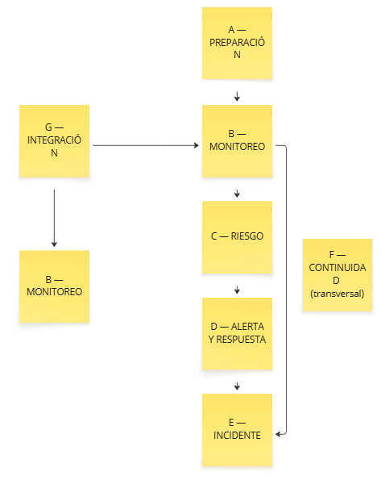

<p align="center">
  <strong>Vista general de los procesos identificados en el Big Picture EventStorming de ResQ.</strong>
</p>

### Preparación del entorno, monitoreo y detección del riesgo

<p align="justify">
El primer proceso identificado corresponde a la preparación del entorno monitoreado. Antes de iniciar la supervisión de una edificación deben haberse registrado los elementos necesarios para establecer su contexto operativo. En este flujo se identificaron los eventos <code>Building Registered</code>, <code>Zone Defined</code>, <code>Device Registered</code>, <code>Device Assigned To Zone</code>, <code>User Assigned To Building</code>, <code>Detection Rule Defined</code> y <code>Response Policy Defined</code>.
</p>

<p align="justify">
Estos acontecimientos representan la existencia previa de una edificación, sus zonas, los dispositivos asociados, los responsables de su supervisión y las reglas que posteriormente permitirán determinar cuándo existe una condición de riesgo y qué tipo de respuesta puede aplicarse.
</p>

<p align="justify">
Una vez preparado el entorno comienza el proceso de monitoreo. El evento <code>Measurement Captured</code> representa la obtención de una medición desde un dispositivo y <code>Measurement Available</code> indica que dicha información se encuentra disponible para ser considerada dentro del dominio. A partir de esta información pueden ocurrir cambios independientes en el estado de un dispositivo, una zona o la edificación, representados mediante <code>Device Status Changed</code>, <code>Zone Status Changed</code> y <code>Building Status Changed</code>.
</p>

<p align="justify">
El monitoreo proporciona la evidencia necesaria para el proceso de detección y contextualización del riesgo. Cuando se observa una situación fuera del comportamiento esperado se produce <code>Anomalous Condition Detected</code>. Esta condición no implica necesariamente la existencia inmediata de un riesgo, pero puede conducir a <code>Risk Detected</code> cuando se cumplen las condiciones de detección definidas.
</p>

<p align="justify">
Posteriormente, el riesgo puede ser contextualizado mediante <code>Risk Classified</code>, <code>Risk Level Determined</code> y <code>Risk Located</code>, permitiendo determinar qué tipo de situación fue identificada, cuál es su nivel de severidad y en qué parte de la edificación se encuentra.
</p>

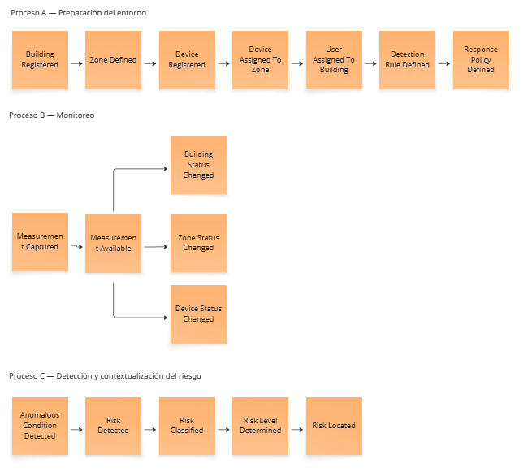

<p align="center">
  <strong>Procesos A, B y C: preparación del entorno, monitoreo y detección y contextualización del riesgo.</strong>
</p>

### Alertas, respuesta y gestión del incidente

<p align="justify">
Una vez identificado y contextualizado un riesgo, el dominio contempla los acontecimientos asociados con la comunicación y ejecución de respuestas. <code>Alert Generated</code> representa la generación de una alerta y <code>Responsible User Notified</code> indica que la información fue comunicada a una persona responsable.
</p>

<p align="justify">
El evento <code>Response Requested</code> representa la necesidad de ejecutar una determinada acción como consecuencia del riesgo identificado. Dependiendo del tipo de respuesta, esta puede ejecutarse directamente o requerir previamente autorización humana.
</p>

<p align="justify">
Cuando la acción requiere validación se produce <code>Response Authorization Requested</code>. El responsable puede generar <code>Response Authorized</code> o <code>Response Rejected</code>. Cuando la ejecución es permitida, el resultado puede ser <code>Response Executed</code> si la acción se completa satisfactoriamente o <code>Response Failed</code> si no pudo ejecutarse correctamente.
</p>

<p align="justify">
Esta bifurcación refleja uno de los hallazgos obtenidos durante la investigación: determinadas acciones pueden automatizarse, mientras que aquellas que pueden generar un impacto significativo requieren mecanismos adicionales de supervisión o autorización.
</p>

<p align="justify">
Cuando una situación requiere seguimiento se inicia el proceso de gestión del incidente. El ciclo comienza con <code>Incident Opened</code>, seguido de <code>Incident Assigned</code> y <code>Incident Acknowledged</code>, que representan la asignación y aceptación de responsabilidad sobre la situación.
</p>

<p align="justify">
Durante la atención pueden generarse uno o varios <code>Incident Updated</code> conforme cambia el estado de la situación. Finalmente, <code>Incident Resolved</code> representa la resolución del problema identificado y <code>Incident Closed</code> su cierre formal una vez finalizado el seguimiento.
</p>

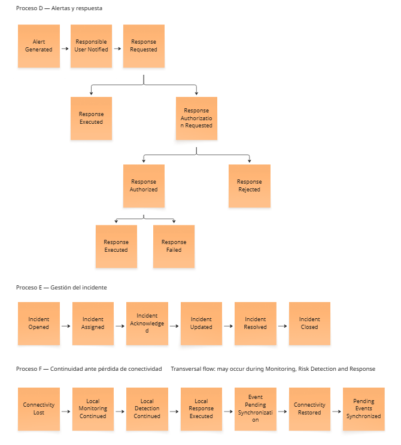

<p align="center">
  <strong>Procesos D, E y F: alertas y respuesta, gestión del incidente y continuidad operativa.</strong>
</p>

### Continuidad ante pérdida de conectividad

<p align="justify">
La continuidad operativa fue identificada como un proceso transversal debido a que una pérdida de conectividad puede producirse durante diferentes momentos de la operación de ResQ. Por esta razón, este proceso no representa una etapa posterior a la gestión del incidente, sino un escenario que puede aparecer mientras se realizan actividades de monitoreo, detección de riesgos o respuesta.
</p>

<p align="justify">
El proceso comienza con <code>Connectivity Lost</code>. Ante esta situación, las capacidades críticas deben poder continuar localmente, representadas por <code>Local Monitoring Continued</code>, <code>Local Detection Continued</code> y <code>Local Response Executed</code>.
</p>

<p align="justify">
Los acontecimientos que no pueden sincronizarse inmediatamente quedan representados mediante <code>Event Pending Synchronization</code>. Cuando se recupera la conexión ocurre <code>Connectivity Restored</code>, permitiendo posteriormente <code>Pending Events Synchronized</code>.
</p>

<p align="justify">
Este flujo permite representar la necesidad de que las funciones esenciales de ResQ no dependan permanentemente de una conexión disponible y que la información producida durante una interrupción pueda conservarse para su posterior sincronización.
</p>

### Integración con infraestructura existente

<p align="justify">
El segundo segmento objetivo evidenció la importancia de incorporar ResQ dentro de infraestructuras que pueden utilizar dispositivos, sistemas y tecnologías previamente instaladas. Por esta razón, el Big Picture EventStorming contempla también un proceso de integración.
</p>

<p align="justify">
El flujo comienza con <code>Existing Infrastructure Surveyed</code>, que representa el levantamiento del entorno tecnológico existente. Posteriormente se identifican los sistemas relevantes mediante <code>External System Identified</code> y las restricciones mediante <code>Integration Constraints Identified</code>.
</p>

<p align="justify">
Con la información obtenida puede realizarse <code>Compatibility Evaluated</code> y posteriormente <code>Integration Approach Defined</code>, donde queda determinada la forma en la que la integración será abordada.
</p>

<p align="justify">
Luego se producen <code>Integration Configured</code> e <code>Integration Tested</code>. Si las pruebas son satisfactorias, los dispositivos o fuentes externas relevantes pueden ser relacionados con el entorno monitoreado mediante <code>External Device Mapped</code>, finalizando con <code>Integration Activated</code>.
</p>

<p align="justify">
Una integración activada permite que la fuente externa participe posteriormente en el proceso normal de monitoreo.
</p>

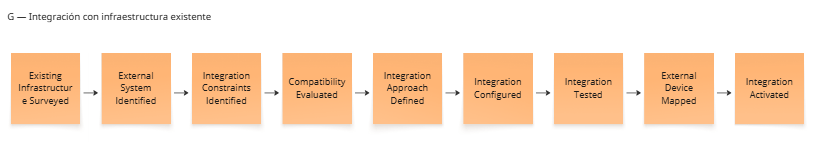

<p align="center">
  <strong>Proceso G: integración de ResQ con infraestructura tecnológica existente.</strong>
</p>

### Hotspots identificados

<p align="justify">
Durante la construcción del Big Picture EventStorming se identificaron aspectos del dominio que todavía requieren discusión o una definición más precisa. En EventStorming estos elementos se mantienen visibles como Hotspots en lugar de asumir prematuramente una solución.
</p>

<p align="justify">
Entre las principales dudas identificadas se encuentran la relación entre una condición anómala y la confirmación de un riesgo, los criterios que determinan cuándo un riesgo debe convertirse en incidente, las respuestas que pueden ejecutarse automáticamente y aquellas que requieren autorización humana.
</p>

<p align="justify">
También se identificaron incertidumbres relacionadas con el comportamiento de las integraciones bajo condiciones reales, la información que debe conservarse durante una pérdida de conectividad y el tratamiento de una fuente externa cuando pierde su asociación con una edificación o zona.
</p>

<p align="justify">
Estos Hotspots permanecerán como puntos de discusión que deberán resolverse conforme avance el análisis del dominio y se obtenga nueva evidencia.
</p>

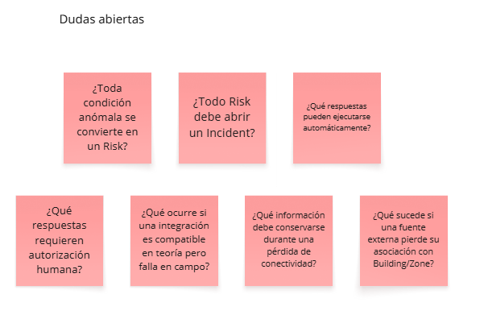

<p align="center">
  <strong>Hotspots identificados durante el Big Picture EventStorming de ResQ.</strong>
</p>

### Definiciones obtenidas durante el EventStorming

<p align="justify">
La discusión de los eventos permitió identificar términos cuyo significado debe mantenerse consistente entre los integrantes del equipo. La definición explícita de estos conceptos permite reducir interpretaciones diferentes y constituye una base para la construcción posterior del Ubiquitous Language.
</p>

<p align="justify">
Entre los principales términos identificados se encuentran <code>Measurement</code>, <code>Anomalous Condition</code>, <code>Risk</code>, <code>Risk Level</code>, <code>Alert</code>, <code>Response</code>, <code>Incident</code>, <code>Detection Rule</code>, <code>Response Policy</code>, <code>External System</code>, <code>Integration</code>, <code>Building</code>, <code>Zone</code> y <code>Responsible User</code>.
</p>

<p align="justify">
Las definiciones acordadas permiten distinguir, por ejemplo, una condición anómala de un riesgo confirmado, una alerta de una respuesta y un riesgo de un incidente. Asimismo, establecen el significado utilizado para los elementos físicos y actores que participan dentro del dominio de ResQ.
</p>

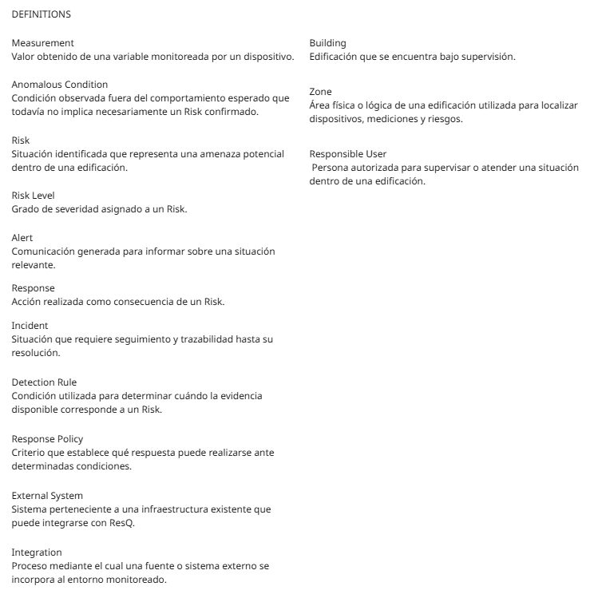

<p align="center">
  <strong>Definiciones obtenidas durante la exploración del dominio mediante Big Picture EventStorming.</strong>
</p>

### Resultado del Big Picture EventStorming

<p align="justify">
El Big Picture EventStorming permitió representar el dominio de ResQ desde una perspectiva centrada en acontecimientos relevantes y no en componentes específicos de implementación. Como resultado se obtuvo una visión común de cómo se prepara una edificación para su supervisión, cómo se generan y utilizan las mediciones, cómo se identifica y contextualiza un riesgo, cómo se coordinan las respuestas y cómo se mantiene trazabilidad mediante la gestión de incidentes.
</p>

<p align="justify">
Asimismo, el análisis permitió incorporar dos aspectos relevantes identificados durante la investigación: la continuidad de las funciones críticas ante pérdidas de conectividad y la necesidad de integrar ResQ con infraestructura tecnológica existente.
</p>

<p align="justify">
Finalmente, los Hotspots y las definiciones obtenidas durante la sesión permiten documentar las principales incertidumbres y consolidar un lenguaje compartido que será utilizado como base para la sección de Ubiquitous Language y para las posteriores actividades de diseño del dominio.
</p>

**Link del tablero de Miro:** [Big Picture EventStorming de ResQ](https://miro.com/app/board/uXjVHlZnbCs=/?share_link_id=107442553080)

## 2.5. Ubiquitous Language

<p align="justify">
El Lenguaje Ubicuo (Ubiquitous Language) es un pilar fundamental en el Diseño Guiado por el Dominio (DDD). Su objetivo es establecer un glosario estricto y compartido entre los desarrolladores, los administradores y los expertos del negocio, garantizando que no existan ambigüedades técnicas ni operativas.
</p>

| Término | Definición |
|---|---|
| Building | Infraestructura física (residencial, comercial o institucional) que se encuentra bajo el monitoreo y gestión de la plataforma ResQ. |
| Zone | Subdivisión lógica y física dentro de una Edificación (ej. pasillo, sótano, comedor) que permite localizar el origen exacto de las mediciones y los riesgos. |
| IoT Device | Hardware instalado en las Zonas. Se divide en dos tipos: Sensores (capturan variables ambientales/físicas) y Actuadores (ejecutan respuestas físicas, como alarmas o válvulas). |
| Anomalous Condition | Lectura o estado reportado por un Sensor que supera los umbrales seguros predefinidos, pero que aún requiere clasificación. |
| Risk | Amenaza confirmada y clasificada (ej. fuga de gas, sismo, incendio) que desencadena los protocolos de seguridad. Tiene asociado un Nivel (gravedad) y un Tipo. |
| Automatic Response | Acción de seguridad ejecutada de forma inmediata por los actuadores (ej. luces de evacuación, sirenas) sin necesidad de intervención humana. |
| High-Impact Action | Respuesta física que, por su potencial de generar un riesgo adicional o interrumpir operaciones, requiere obligatoriamente la Confirmación manual de un usuario humano antes de ejecutarse. |
| Incident | Registro formal e histórico de un Riesgo detectado. Agrupa toda la información relacionada: fecha, Zona afectada, respuestas ejecutadas y el estado actual de atención. |
| Authorized Manager | Usuario de la plataforma (administrador, facility manager o jefe de seguridad) con los permisos necesarios para gestionar Zonas, confirmar Acciones de Alto Impacto y cerrar Incidentes. |
| Edge Computing | Capacidad de la infraestructura local para procesar datos de los sensores y ejecutar Respuestas Automáticas de manera autónoma, garantizando la Continuidad Operativa ante la pérdida de conexión a Internet. |
| Detection/Response Rule | Configuración lógica que determina qué condiciones disparan una alerta y qué acciones específicas deben ejecutarse según el contexto, horario y tipo de Riesgo. |

<div style="page-break-before: always; break-before: page;"></div>

# Capítulo III: Requirements Specification

## 3.1. User Stories
<p align="justify">

A partir de las entrevistas, el análisis competitivo y el proceso de Needfinding, se definieron las Epics, User Stories y Technical Stories de ResQ, considerando las necesidades de los propietarios y administradores de edificaciones y las empresas integradoras de automatización y gestión de edificios inteligentes. Los requisitos abarcan el monitoreo, la detección de riesgos, la gestión de alertas e incidentes, la administración de edificaciones y dispositivos, la integración tecnológica y la gestión de suscripciones.

</p>

<p align="justify">

Las Epics agrupan funcionalidades relacionadas con los objetivos de los usuarios, mientras que las User Stories describen necesidades específicas y las Technical Stories establecen requisitos técnicos utilizando el rol Developer. Todas se presentan en una única tabla, siguiendo el formato establecido en el Project Statement. Cada historia incluye tres escenarios de aceptación mediante la estructura Given–When–Then, redactados en presente, verificables y sin depender de elementos específicos de la interfaz.

</p>

| Epic / Story ID | Título | Descripción | Criterios de Aceptación | Relacionado con (Epic ID) |
|---|---|---|---|---|
| **EP01** | **Visibilidad operativa de la edificación** | Agrupa las capacidades necesarias para que los responsables comprendan el estado actual de una edificación, sus zonas y dispositivos sin depender de múltiples fuentes de información. | — | — |
| **US01** | Consultar el estado general de una edificación | Como responsable de una edificación, deseo conocer el estado general de la infraestructura, para identificar oportunamente si existe alguna condición que requiera atención. | **AC1:** Given el usuario está autorizado para consultar una edificación, When consulta su estado actual, Then el sistema proporciona el estado vigente de la edificación e informa si existe algún riesgo activo.<br><br>**AC2:** Given no existen riesgos activos en la edificación, When se consulta su estado, Then el sistema informa que no existen condiciones de riesgo activas y proporciona la última actualización disponible.<br><br>**AC3:** Given el usuario no pertenece a la organización propietaria de la edificación, When intenta consultar su estado, Then el sistema deniega el acceso a su información. | EP01 |
| **US02** | Consultar el estado de una zona | Como responsable de una edificación, deseo conocer el estado de cada zona monitoreada, para identificar rápidamente dónde existe una condición anómala. | **AC1:** Given una edificación posee zonas monitoreadas, When el usuario consulta el estado de una zona, Then el sistema proporciona su condición actual utilizando la información disponible.<br><br>**AC2:** Given una zona presenta una condición de riesgo activa, When se consulta su estado, Then el sistema identifica dicha condición y la relaciona con la zona correspondiente.<br><br>**AC3:** Given una edificación no dispone de zonas monitoreadas, When se consulta su distribución, Then el sistema informa que todavía no existen zonas registradas. | EP01 |
| **US03** | Consultar mediciones actuales | Como responsable de una edificación, deseo consultar las mediciones actuales de los dispositivos, para comprender las condiciones de las zonas supervisadas. | **AC1:** Given un dispositivo registra una medición válida, When el responsable consulta la información disponible, Then el sistema proporciona el valor más reciente junto con su tipo de variable y momento de registro.<br><br>**AC2:** Given no existe una medición vigente para un dispositivo, When se consulta su información, Then el sistema identifica que no dispone de un valor actualizado sin presentar datos antiguos como actuales.<br><br>**AC3:** Given la última lectura del sensor es inválida o carece de unidad confiable, When el sistema presenta las mediciones, Then no muestra esa lectura como un valor actual validado. | EP01 |
| **US04** | Conocer el estado operativo de un dispositivo | Como responsable de una edificación, deseo conocer si un dispositivo se encuentra operativo, para distinguir una condición real de una posible falla del equipo. | **AC1:** Given un dispositivo registrado mantiene comunicación dentro del periodo esperado, When se consulta su estado, Then el sistema lo identifica como disponible.<br><br>**AC2:** Given un dispositivo deja de comunicar información durante el periodo establecido, When se evalúa su estado, Then el sistema identifica su falta de disponibilidad.<br><br>**AC3:** Given un dispositivo está administrativamente inactivo, When se consulta su estado, Then el sistema lo diferencia de un equipo activo con una falla de comunicación. | EP01 |
| **US05** | Supervisar remotamente una edificación | Como administrador o facility manager, deseo supervisar remotamente la infraestructura, para mantener visibilidad aun cuando no me encuentre físicamente en el edificio. | **AC1:** Given el responsable posee autorización sobre una edificación, When consulta remotamente su información, Then puede conocer sus zonas, riesgos activos y estado general.<br><br>**AC2:** Given ocurre un cambio relevante en la edificación, When la información actualizada se encuentra disponible, Then el estado consultable refleja el cambio registrado.<br><br>**AC3:** Given se pierde la comunicación del usuario con la plataforma, When solicita supervisión remota, Then el sistema no presenta información en caché como si fuera una actualización confirmada. | EP01 |
| **EP02** | **Comprensión y contextualización del riesgo** | Agrupa las capacidades destinadas a determinar qué situación de riesgo existe, dónde ocurre, qué nivel presenta y qué evidencia originó su detección. | — | — |
| **US06** | Conocer el tipo de riesgo detectado | Como responsable de seguridad, deseo conocer el tipo de riesgo detectado, para comprender qué situación está ocurriendo. | **AC1:** Given existe una condición documentada para un tipo de riesgo detectable por un sensor compatible, When se recibe una medición válida que cumple esa condición, Then el sistema clasifica la situación conforme a la capacidad verificada del sensor.<br><br>**AC2:** Given una medición no cumple ninguna regla de detección válida, When se procesa, Then el sistema no genera un riesgo clasificado sin evidencia.<br><br>**AC3:** Given el sensor no permite identificar un gas específico, When se clasifica una lectura anómala, Then el sistema informa una condición compatible con la capacidad del sensor sin afirmar una sustancia no verificada. | EP02 |
| **US07** | Conocer el nivel de riesgo | Como responsable de seguridad, deseo conocer el nivel del riesgo detectado, para determinar la urgencia con la que debe atenderse. | **AC1:** Given se detecta un riesgo, When las condiciones permiten determinar su severidad, Then el sistema asigna el nivel correspondiente.<br><br>**AC2:** Given la condición del riesgo cambia, When la nueva información modifica su nivel, Then el sistema actualiza la severidad conservando trazabilidad del cambio.<br><br>**AC3:** Given no existe una regla válida de severidad para la condición detectada, When se evalúa el evento, Then el sistema indica que el nivel no puede determinarse en lugar de asignar uno arbitrario. | EP02 |
| **US08** | Conocer la ubicación del riesgo | Como responsable de seguridad, deseo conocer la zona donde se originó el riesgo, para dirigir la respuesta hacia el lugar correcto. | **AC1:** Given un dispositivo asociado con una zona origina una detección, When el riesgo es registrado, Then el sistema lo relaciona con la edificación y zona correspondientes.<br><br>**AC2:** Given el dispositivo no posee una ubicación válida, When genera información asociada con un posible riesgo, Then el sistema identifica que la localización no puede determinarse correctamente.<br><br>**AC3:** Given el dispositivo se reasigna después de un evento, When se consulta el evento histórico, Then conserva la zona asociada en el momento de su ocurrencia. | EP02 |
| **US09** | Consultar el contexto de una detección | Como responsable de seguridad, deseo conocer qué dispositivo y mediciones originaron la detección, para contar con contexto antes de tomar una decisión. | **AC1:** Given existe un riesgo detectado, When el responsable consulta su información, Then puede conocer los dispositivos y valores relevantes utilizados para determinarlo.<br><br>**AC2:** Given distintas mediciones intervienen en la detección, When se consulta el contexto, Then el sistema conserva su relación con el mismo evento de riesgo.<br><br>**AC3:** Given no está disponible la medición que fundamentó una detección, When se consulta su contexto, Then el sistema señala la ausencia de evidencia sin inventar valores. | EP02 |
| **EP03** | **Coordinación de alertas y respuesta** | Agrupa las capacidades destinadas a comunicar situaciones de riesgo y coordinar o ejecutar las respuestas correspondientes de acuerdo con las políticas establecidas. | — | — |
| **US10** | Recibir una alerta de riesgo | Como responsable de una edificación, deseo recibir una alerta cuando se detecte una situación de riesgo, para conocer oportunamente lo ocurrido. | **AC1:** Given se detecta una condición que requiere generar una alerta, When se registra la alerta, Then esta conserva como mínimo tipo de riesgo, severidad, zona y momento de detección.<br><br>**AC2:** Given existe un responsable y un canal de notificación configurados, When se genera una alerta comunicable, Then el sistema registra o inicia su notificación sin afirmar que fue entregada hasta recibir confirmación.<br><br>**AC3:** Given no existe un destinatario válido o el canal de comunicación no está disponible, When se intenta notificar una alerta, Then el sistema registra el intento o su falla sin indicar entrega confirmada. | EP03 |
| **US11** | Ejecutar una respuesta automática autorizada | Como responsable de una edificación, deseo que determinadas respuestas se ejecuten automáticamente cuando se cumplan condiciones previamente autorizadas, para reducir el tiempo de reacción. | **AC1:** Given existe una política automática activa y una respuesta local permitida, When se cumple la condición de riesgo, Then el sistema solicita la acción al actuador correspondiente conforme a la política.<br><br>**AC2:** Given una respuesta requiere autorización humana y esta no se ha otorgado, When se detecta la condición, Then el sistema no ejecuta automáticamente esa respuesta.<br><br>**AC3:** Given el actuador asociado no está disponible, When una política ordena una respuesta, Then el sistema registra el intento y no informa una ejecución física satisfactoria sin confirmación. | EP03 |
| **US12** | Confirmar una acción de alto impacto | Como responsable autorizado, deseo confirmar las respuestas que puedan generar un impacto significativo, para mantener control humano sobre acciones sensibles. | **AC1:** Given una respuesta requiere autorización humana, When se solicita su ejecución, Then la acción permanece pendiente hasta recibir una decisión de un usuario autorizado.<br><br>**AC2:** Given el usuario autorizado rechaza la acción, When la decisión es registrada, Then la respuesta no se ejecuta y la decisión queda asociada con el incidente.<br><br>**AC3:** Given un usuario autorizado aprueba una respuesta pendiente, When registra la autorización, Then el sistema conserva la decisión y permite continuar el flujo de ejecución según la política aplicable. | EP03 |
| **US13** | Conocer las respuestas ejecutadas | Como responsable de seguridad, deseo conocer qué respuestas fueron ejecutadas, para verificar cómo actuó el sistema durante el evento. | **AC1:** Given una respuesta dispone de confirmación de ejecución, When el responsable consulta su registro, Then conoce la acción, momento y resultado confirmado.<br><br>**AC2:** Given una respuesta fue rechazada o falló, When se consulta su seguimiento, Then el sistema conserva ese estado sin presentarla como satisfactoria.<br><br>**AC3:** Given una respuesta solo fue solicitada pero no confirmada por el dispositivo, When se consulta su trazabilidad, Then el sistema informa su estado pendiente o no confirmado en lugar de declararla ejecutada. | EP03 |
| **EP04** | **Trazabilidad y seguimiento de incidentes** | Agrupa las capacidades necesarias para conocer el ciclo de vida de una situación de riesgo, las decisiones adoptadas, las respuestas ejecutadas y la información histórica resultante. | — | — |
| **US14** | Consultar el estado de un incidente | Como responsable de seguridad, deseo conocer el estado actual de un incidente, para saber si todavía requiere atención. | **AC1:** Given existe un incidente activo, When el responsable consulta su estado, Then el sistema proporciona su estado vigente y la última actualización registrada.<br><br>**AC2:** Given el incidente cambia de estado, When el cambio es registrado, Then el nuevo estado queda disponible sin eliminar la trazabilidad de estados anteriores.<br><br>**AC3:** Given el identificador consultado no corresponde a un incidente accesible, When se solicita su estado, Then el sistema indica que el incidente no está disponible. | EP04 |
| **US15** | Asignar un responsable de atención | Como responsable de seguridad, deseo identificar quién se encuentra atendiendo un incidente, para coordinar las acciones y evitar responsabilidades ambiguas. | **AC1:** Given existe un incidente que requiere atención, When un usuario autorizado asigna un responsable, Then el incidente queda asociado con dicho responsable.<br><br>**AC2:** Given cambia la persona responsable del incidente, When se registra la nueva asignación, Then el sistema conserva evidencia de la modificación realizada.<br><br>**AC3:** Given el usuario intenta asignar como responsable a una identidad no autorizada, When solicita la asignación, Then el sistema rechaza el cambio y conserva al responsable anterior. | EP04 |
| **US16** | Registrar la resolución de un incidente | Como responsable de seguridad, deseo registrar la resolución y cierre de un incidente, para conservar evidencia de cómo terminó la situación. | **AC1:** Given un incidente cumple las condiciones para resolverse, When un usuario autorizado registra su resolución, Then se conserva el resultado y momento correspondiente.<br><br>**AC2:** Given un incidente no cumple las condiciones establecidas para su cierre, When se intenta finalizarlo, Then el sistema conserva su estado y rechaza la transición inválida.<br><br>**AC3:** Given el usuario no tiene permisos para resolver o cerrar incidentes, When intenta cambiar su estado, Then el sistema no aplica el cambio ni lo registra como una resolución válida. | EP04 |
| **US17** | Consultar incidentes anteriores | Como responsable de una edificación, deseo consultar incidentes anteriores, para revisar situaciones ocurridas en la infraestructura. | **AC1:** Given existen incidentes registrados, When el responsable consulta el historial autorizado, Then el sistema proporciona los incidentes correspondientes a su ámbito de acceso.<br><br>**AC2:** Given no existen incidentes para el periodo consultado, When se realiza la consulta, Then el sistema informa que no existen resultados correspondientes.<br><br>**AC3:** Given existen incidentes en otras organizaciones, When el responsable consulta su historial, Then solo recibe los pertenecientes a su ámbito autorizado. | EP04 |
| **US18** | Buscar incidentes históricos | Como responsable de una edificación, deseo localizar incidentes mediante fecha, zona, tipo o estado, para encontrar rápidamente información histórica relevante. | **AC1:** Given existen incidentes de distintas fechas, zonas, tipos y estados, When se aplica uno de estos filtros, Then se obtienen únicamente los incidentes coincidentes.<br><br>**AC2:** Given se combinan dos o más filtros válidos, When se ejecuta la búsqueda, Then los resultados satisfacen conjuntamente los criterios seleccionados.<br><br>**AC3:** Given ningún incidente coincide con la combinación de filtros, When se completa la búsqueda, Then el sistema devuelve un resultado vacío sin incorporar incidentes que incumplan los criterios. | EP04 |
| **US19** | Consultar la secuencia de un incidente | Como responsable de una edificación, deseo consultar la secuencia de mediciones, alertas y respuestas asociadas con un incidente, para comprender cómo evolucionó. | **AC1:** Given existe información trazable asociada con un incidente, When se consulta su evolución, Then el sistema proporciona los eventos relevantes en orden temporal.<br><br>**AC2:** Given una acción o cambio se encuentra relacionado con el incidente, When se consulta su trazabilidad, Then la información conserva el momento y relación correspondientes.<br><br>**AC3:** Given un incidente contiene eventos con fechas distintas, When se consulta la secuencia, Then la información se ordena por su momento de ocurrencia y distingue los eventos con datos incompletos. | EP04 |
| **US20** | Consultar indicadores de incidentes | Como facility manager, deseo consultar indicadores como frecuencia de incidentes, falsas alarmas y tiempos de atención, para identificar tendencias que requieran acciones preventivas. | **AC1:** Given existen incidentes con información suficiente, When se calculan indicadores para un periodo determinado, Then el sistema utiliza únicamente datos correspondientes al periodo seleccionado.<br><br>**AC2:** Given no existe información suficiente para calcular un indicador, When se solicita dicho indicador, Then el sistema no presenta un resultado cuantitativo sin sustento.<br><br>**AC3:** Given un indicador necesita tiempos que no están registrados, When se solicita el reporte, Then el sistema lo identifica como no calculable en lugar de mostrar un promedio ficticio. | EP04 |
| **EP05** | **Preparación y gobierno del entorno monitoreado** | Agrupa las capacidades necesarias para preparar las edificaciones, zonas, dispositivos, reglas, usuarios y responsabilidades requeridas antes y durante la operación de ResQ. | — | — |
| **US21** | Registrar una edificación | Como administrador, deseo registrar una edificación que será monitoreada, para organizar la infraestructura gestionada por ResQ. | **AC1:** Given el administrador proporciona los datos obligatorios de una nueva edificación, When confirma su registro, Then la edificación queda disponible dentro de la organización correspondiente.<br><br>**AC2:** Given faltan datos obligatorios o estos son inválidos, When se solicita el registro, Then el sistema no crea una edificación incompleta.<br><br>**AC3:** Given ya existe una edificación con el mismo identificador único dentro de la organización, When se intenta registrarla de nuevo, Then el sistema rechaza la duplicidad. | EP05 |
| **US22** | Definir zonas de una edificación | Como administrador, deseo definir las zonas de una edificación, para localizar correctamente dispositivos y eventos. | **AC1:** Given existe una edificación registrada, When el administrador registra una zona válida, Then esta queda asociada con la edificación correspondiente.<br><br>**AC2:** Given una zona posee dispositivos o incidentes relacionados, When se modifica su información, Then sus relaciones se mantienen consistentes.<br><br>**AC3:** Given se intenta registrar una zona para una edificación inexistente o no autorizada, When se confirma la solicitud, Then el sistema rechaza la creación sin asociarla a otra edificación. | EP05 |
| **US23** | Asociar un dispositivo con una zona | Como administrador, deseo asociar cada dispositivo con su zona correspondiente, para identificar el origen de mediciones y alertas. | **AC1:** Given existe un dispositivo y una zona activa pertenecientes a la misma organización, When un administrador realiza la asignación, Then las nuevas mediciones pueden relacionarse con esa zona.<br><br>**AC2:** Given un dispositivo cambia de zona, When se registra la nueva asignación, Then las ubicaciones asociadas a eventos anteriores se mantienen como parte de su trazabilidad histórica.<br><br>**AC3:** Given una zona pertenece a otra edificación o no está activa, When se intenta asignar el dispositivo, Then el sistema rechaza la ubicación inconsistente. | EP05 |
| **US24** | Configurar una condición de detección | Como responsable autorizado, deseo configurar condiciones de detección, para adaptar la identificación de riesgos a las características de la instalación. | **AC1:** Given existe una variable monitoreada compatible, When el responsable registra una condición válida, Then esta puede utilizarse para evaluar mediciones posteriores.<br><br>**AC2:** Given una condición posee parámetros inválidos, When se intenta habilitarla, Then el sistema impide utilizarla para clasificar riesgos.<br><br>**AC3:** Given una regla utiliza unidades o umbrales incompatibles con las capacidades del sensor, When se intenta activarla, Then el sistema impide su evaluación como una condición válida. | EP05 |
| **US25** | Configurar una política de respuesta | Como responsable autorizado, deseo configurar las respuestas permitidas para cada tipo de riesgo, para establecer previamente cómo deberá actuar el sistema. | **AC1:** Given existe un tipo de riesgo configurado, When el responsable define una política válida, Then esta establece las respuestas permitidas para dicho riesgo.<br><br>**AC2:** Given una respuesta requiere autorización humana, When se configura la política, Then dicha condición se conserva antes de permitir su ejecución.<br><br>**AC3:** Given una política está deshabilitada, When ocurre una condición asociada, Then el sistema no utiliza esa política para ordenar una respuesta. | EP05 |
| **US26** | Asignar roles y responsabilidades | Como administrador, deseo asignar roles y responsabilidades a los usuarios, para limitar el acceso a información y acciones sensibles. | **AC1:** Given existe un usuario perteneciente a la organización, When el administrador le asigna un rol válido, Then sus operaciones permitidas corresponden a los permisos del rol.<br><br>**AC2:** Given un usuario carece del permiso requerido, When intenta ejecutar una operación protegida, Then el sistema rechaza la operación.<br><br>**AC3:** Given un usuario intenta otorgar permisos superiores a su propia autorización, When solicita el cambio de rol, Then el sistema rechaza una asignación no permitida. | EP05 |
| **US27** | Acceder de forma autenticada | Como usuario autorizado, deseo autenticarme antes de acceder a ResQ, para utilizar únicamente las funciones correspondientes a mis responsabilidades. | **AC1:** Given el usuario proporciona credenciales válidas, When solicita autenticarse, Then el sistema establece una identidad autenticada correspondiente al usuario.<br><br>**AC2:** Given las credenciales proporcionadas son inválidas, When se solicita autenticación, Then el sistema rechaza el acceso sin establecer una sesión autorizada.<br><br>**AC3:** Given un usuario autenticado solicita un recurso para el cual no tiene permisos, When realiza la operación, Then el sistema deniega el recurso aunque su identidad sea válida. | EP05 |
| **US44** | Actualizar información de edificaciones y zonas | Como administrador de una organización, deseo modificar la información administrativa de edificios y zonas existentes, para mantener actualizado el inventario de infraestructura. | **AC1:** Given una edificación pertenece a la organización y el usuario está autorizado, When actualiza sus datos válidos, Then se conservan los cambios sin alterar su identificador.<br><br>**AC2:** Given una zona existente tiene datos por corregir, When un administrador autorizado modifica su nombre o descripción, Then la zona conserva su relación con la edificación y los dispositivos asociados.<br><br>**AC3:** Given los datos son inválidos o pertenecen a recursos de otra organización, When se solicita la modificación, Then se rechaza el cambio y se mantiene la información previa. | EP05 |
| **US45** | Gestionar el inventario de dispositivos | Como administrador técnico, deseo registrar y actualizar los dispositivos de una organización y su estado administrativo, para mantener un inventario confiable. | **AC1:** Given existe una edificación activa y el dispositivo cumple los datos requeridos, When el administrador lo registra, Then queda identificado en el inventario de su organización.<br><br>**AC2:** Given un dispositivo registrado cambia de información o estado administrativo, When un usuario autorizado actualiza el registro, Then el sistema conserva su identificador y refleja el nuevo estado.<br><br>**AC3:** Given se intenta registrar un código duplicado o asignar el dispositivo a una ubicación no válida, When se procesa la solicitud, Then el sistema la rechaza sin crear datos inconsistentes. | EP05 |
| **US46** | Organizar espacios y dispositivos sobre un plano | Como administrador o integrador autorizado, deseo organizar espacios y ubicar dispositivos sobre el plano de un piso, para representar la distribución del entorno monitoreado. | **AC1:** Given existe un piso y el usuario tiene permisos de edición, When define un espacio válido en su plano, Then la distribución registra su ubicación dentro del piso.<br><br>**AC2:** Given un dispositivo registrado es compatible con una ubicación del piso, When el usuario lo asigna a un espacio, Then su representación mantiene correspondencia con el dispositivo y la zona definidos.<br><br>**AC3:** Given una modificación produce solapamientos inválidos o referencias inexistentes, When se intenta guardar la distribución, Then se rechaza o solicita corregir el cambio sin alterar una configuración válida. | EP05 |
| **US47** | Consultar y actualizar mi información de contacto | Como usuario autenticado, deseo consultar mi perfil y actualizar mi información de contacto, para mantener correctos los datos asociados a mi cuenta. | **AC1:** Given el usuario dispone de una sesión autorizada, When consulta su perfil, Then el sistema proporciona sus datos correspondientes sin mostrar información de otra cuenta.<br><br>**AC2:** Given el usuario proporciona correo electrónico y teléfono con formatos válidos, When solicita actualizar su información de contacto, Then se guardan los cambios en su propio perfil.<br><br>**AC3:** Given la información es inválida o un usuario intenta modificar el perfil ajeno, When realiza la solicitud, Then el sistema rechaza la operación y mantiene los datos anteriores. | EP05 |
| **EP06** | **Continuidad operativa ante pérdida de conectividad** | Agrupa las capacidades necesarias para mantener las funciones críticas de ResQ durante interrupciones de conectividad y conservar posteriormente la trazabilidad de los eventos producidos. | — | — |
| **US28** | Mantener funciones críticas sin Internet | Como responsable de una edificación, deseo que la detección y las respuestas críticas continúen funcionando cuando se pierde Internet, para mantener la capacidad de reacción ante una emergencia. | **AC1:** Given la edificación se encuentra siendo monitoreada y se pierde temporalmente la conexión a Internet, When ocurre una condición que cumple una regla de detección crítica, Then el sistema continúa detectando localmente la situación de riesgo.<br><br>**AC2:** Given existe una respuesta crítica previamente autorizada y no existe conexión a Internet, When se detecta la condición asociada con dicha respuesta, Then el sistema ejecuta la respuesta sin depender de la recuperación de Internet.<br><br>**AC3:** Given una respuesta crítica depende de un dispositivo sin energía ni respaldo, When se pierde también su alimentación, Then el sistema no informa disponibilidad local que no puede garantizarse. | EP06 |
| **US29** | Recuperar eventos producidos durante una interrupción | Como responsable de una edificación, deseo que los eventos producidos durante una interrupción de conectividad estén disponibles posteriormente, para conservar la trazabilidad de lo ocurrido. | **AC1:** Given se producen eventos durante una interrupción de conectividad, When el sistema recupera la comunicación necesaria, Then los eventos ocurridos durante la interrupción pueden incorporarse al historial correspondiente.<br><br>**AC2:** Given un evento ocurrió durante la interrupción, When posteriormente se encuentra disponible para consulta, Then conserva el momento original en el que se produjo.<br><br>**AC3:** Given un evento pendiente se transmite nuevamente después de un fallo, When el servicio receptor lo reconoce por su identificador, Then evita incorporarlo duplicado. | EP06 |
| **EP07** | **Integración de ResQ con infraestructuras existentes** | Agrupa las capacidades necesarias para que una empresa integradora pueda evaluar, probar e incorporar ResQ en proyectos que utilizan dispositivos o sistemas existentes mediante mecanismos oficialmente soportados. | — | — |
| **US30** | Conocer los mecanismos de integración compatibles | Como ingeniero de integración, deseo conocer qué mecanismos de integración soporta ResQ, para determinar si puede incorporarse a la infraestructura de mi cliente. | **AC1:** Given el integrador consulta las capacidades técnicas de ResQ, When revisa los mecanismos oficialmente soportados, Then puede identificar los protocolos o interfaces disponibles.<br><br>**AC2:** Given una tecnología no se encuentra soportada, When se consulta su compatibilidad, Then esta no se presenta como un mecanismo disponible.<br><br>**AC3:** Given la documentación enumera limitaciones o versiones específicas de integración, When el integrador revisa un mecanismo, Then puede distinguir sus condiciones de uso y compatibilidad real. | EP07 |
| **US31** | Integrar una fuente externa compatible | Como ingeniero de integración, deseo conectar a ResQ un dispositivo o sistema externo mediante un mecanismo de integración soportado, para incorporar sus mediciones sin sustituir innecesariamente la infraestructura instalada. | **AC1:** Given una fuente externa utiliza un mecanismo oficialmente soportado, When proporciona datos válidos de acuerdo con el contrato definido, Then ResQ puede recibirlos para su procesamiento.<br><br>**AC2:** Given la fuente proporciona información incompatible con el contrato definido, When ResQ la recibe, Then los datos inválidos no se consideran mediciones válidas.<br><br>**AC3:** Given una fuente externa no está autorizada para la organización, When intenta transmitir mediciones, Then ResQ rechaza su incorporación aunque el formato sea válido. | EP07 |
| **US32** | Validar una integración antes de activarla | Como ingeniero de integración, deseo comprobar que una fuente externa entrega información compatible antes de utilizarla operativamente, para detectar incompatibilidades antes de su implementación definitiva. | **AC1:** Given una integración se encuentra configurada pero todavía no está habilitada para operación, When el integrador realiza una prueba con información válida, Then el sistema permite determinar si los datos pueden interpretarse correctamente.<br><br>**AC2:** Given la prueba detecta datos incompatibles o un problema de comunicación, When se obtiene el resultado, Then la integración permanece sin habilitarse para operación normal.<br><br>**AC3:** Given una prueba de integración finaliza correctamente, When un integrador autorizado solicita su habilitación, Then se registra el resultado que respalda su activación. | EP07 |
| **US33** | Asociar dispositivos externos con su contexto | Como ingeniero de integración, deseo relacionar los dispositivos externos con el edificio y zona correspondientes, para conservar el contexto de las mediciones y eventos integrados. | **AC1:** Given existe un dispositivo externo reconocido, When el integrador lo relaciona con una zona válida, Then sus nuevas mediciones pueden vincularse con dicha ubicación.<br><br>**AC2:** Given un dispositivo externo no posee una asociación válida, When genera información, Then el sistema evita atribuirle una ubicación no confirmada.<br><br>**AC3:** Given el integrador intenta asociar un dispositivo externo a una zona ajena a su organización, When solicita el cambio, Then el sistema rechaza la asociación. | EP07 |
| **EP08** | **Evaluación y adopción de ResQ** | Agrupa las capacidades del Landing Page y de la experiencia inicial destinadas a comunicar la propuesta de valor de ResQ a los segmentos objetivo y facilitar el inicio de una relación con la solución. | — | — |
| **US34** | Comprender la propuesta de ResQ | Como visitante, deseo comprender el problema que aborda ResQ y su propuesta de solución, para determinar si resulta relevante para mis necesidades. | **AC1:** Given un visitante accede al contenido informativo de ResQ, When consulta la propuesta, Then dispone de información sobre el problema abordado, las capacidades principales y la forma general de funcionamiento.<br><br>**AC2:** Given el visitante todavía no conoce ResQ, When revisa la propuesta, Then puede distinguir el propósito de la solución frente a una alarma o sensor aislado.<br><br>**AC3:** Given una capacidad está todavía en desarrollo o simulación, When el visitante revisa la solución, Then la comunicación no la presenta como integración productiva verificada. | EP08 |
| **US35** | Conocer los beneficios para administradores | Como propietario o administrador de una edificación, deseo conocer los beneficios de ResQ aplicables a una edificación, para evaluar su utilidad dentro de mi infraestructura. | **AC1:** Given un visitante pertenece al segmento de propietarios o administradores, When consulta la información dirigida a dicho segmento, Then encuentra beneficios relacionados con monitoreo, detección, respuesta y trazabilidad.<br><br>**AC2:** Given el visitante evalúa la aplicación de ResQ, When revisa la información disponible, Then puede identificar las principales capacidades relevantes para la gestión de una edificación.<br><br>**AC3:** Given un administrador necesita evaluar la adopción, When consulta los beneficios, Then puede distinguir las funciones disponibles de las capacidades previstas para etapas futuras. | EP08 |
| **US36** | Conocer los beneficios para empresas integradoras | Como representante de una empresa integradora, deseo conocer cómo puede incorporarse ResQ a sistemas existentes, para evaluar si puede formar parte de nuestros proyectos. | **AC1:** Given el visitante pertenece a una empresa integradora, When consulta la propuesta orientada a su segmento, Then dispone de información sobre interoperabilidad, integración y aplicación de ResQ en proyectos existentes.<br><br>**AC2:** Given el integrador evalúa una posible incorporación, When revisa la propuesta, Then puede identificar a ResQ como una solución complementaria que no exige sustituir toda la infraestructura existente.<br><br>**AC3:** Given una integración depende de una versión o protocolo aún no verificado, When la empresa consulta la propuesta, Then esta no promete compatibilidad universal. | EP08 |
| **US37** | Acceder a documentación técnica de integración | Como representante técnico de una empresa integradora, deseo acceder desde el sitio web a la documentación técnica disponible, para realizar una evaluación preliminar antes de iniciar un proyecto. | **AC1:** Given existe documentación técnica publicada para integradores, When el representante accede a ella desde los recursos disponibles, Then puede consultar información sobre mecanismos soportados y requisitos principales.<br><br>**AC2:** Given una capacidad se encuentra fuera del alcance soportado, When se consulta la documentación, Then esta no se presenta como característica disponible.<br><br>**AC3:** Given la documentación de un mecanismo todavía no ha sido publicada, When el visitante busca sus detalles, Then el sitio no ofrece un enlace roto ni presenta el mecanismo como oficialmente documentado. | EP08 |
| **US38** | Solicitar una demostración o contacto | Como representante de una empresa integradora, deseo solicitar una demostración, piloto o contacto con ResQ, para evaluar una posible colaboración. | **AC1:** Given un visitante introduce datos obligatorios válidos para solicitar una demostración o contacto, When envía la solicitud, Then esta se registra y queda disponible para su atención.<br><br>**AC2:** Given la solicitud omite datos obligatorios o contiene información inválida, When se intenta enviarla, Then no se registra y se informa la necesidad de corregirla.<br><br>**AC3:** Given una solicitud válida ya fue registrada, When el representante recibe la confirmación, Then puede reconocer que la solicitud está pendiente de atención sin que esto implique una demostración ya programada. | EP08 |
| **US39** | Acceder a los productos digitales de ResQ | Como visitante, deseo acceder desde el Landing Page a los productos digitales disponibles, para continuar mi experiencia con la solución. | **AC1:** Given existe un producto digital público disponible, When el visitante selecciona su acceso desde el Landing Page, Then es dirigido al producto correspondiente.<br><br>**AC2:** Given un producto todavía no se encuentra disponible públicamente, When el visitante consulta las opciones existentes, Then no se presenta como un acceso funcional disponible.<br><br>**AC3:** Given un producto digital requiere autenticación, When el visitante selecciona un acceso disponible, Then es dirigido al mecanismo de inicio de sesión correspondiente. | EP08 |
| **EP09** | **Vigencia y administración del servicio contratado** | Agrupa las capacidades que permiten gestionar la suscripción de cada organización, consultar su vigencia, renovarla cuando corresponde y registrar su cancelación o vencimiento. | — | — |
| **US40** | Consultar el estado de la suscripción | Como administrador de una organización, deseo consultar el estado y las fechas de vigencia de la suscripción de mi organización, para conocer la situación actual de nuestro servicio ResQ. | **AC1:** Given la organización autenticada posee una suscripción, When un responsable autorizado solicita consultarla, Then el sistema proporciona estado, fecha inicial y fecha de vencimiento.<br><br>**AC2:** Given la organización no tiene una suscripción registrada, When se solicita su consulta, Then el sistema informa que no existe una suscripción para esa organización.<br><br>**AC3:** Given una persona intenta consultar la suscripción de otra organización, When realiza la solicitud, Then el sistema impide el acceso a la información ajena. | EP09 |
| **US41** | Registrar una suscripción organizacional | Como administrador de una organización, deseo registrar una suscripción para mi organización, para formalizar su vigencia dentro de ResQ. | **AC1:** Given la organización autenticada no tiene una suscripción activa y las fechas de inicio y fin son válidas, When se confirma su registro, Then el sistema crea una suscripción vinculada a la organización con estado activo.<br><br>**AC2:** Given la organización ya posee una suscripción activa, When se intenta registrar otra suscripción activa, Then el sistema rechaza la duplicación.<br><br>**AC3:** Given la fecha final no es posterior a la inicial o no está en el futuro, When se intenta crear la suscripción, Then el sistema rechaza los datos sin registrar una suscripción inválida. | EP09 |
| **US42** | Renovar una suscripción vencida | Como administrador de una organización, deseo renovar una suscripción que ha vencido, para restablecer su vigencia bajo las condiciones permitidas por ResQ. | **AC1:** Given la suscripción de la organización se encuentra en estado vencido, When un administrador autorizado proporciona una nueva fecha de fin válida, Then la suscripción recupera el estado activo y actualiza su periodo de vigencia.<br><br>**AC2:** Given la suscripción aún está activa o fue cancelada, When se solicita su renovación, Then el sistema rechaza la transición no permitida según las reglas vigentes.<br><br>**AC3:** Given la fecha de vencimiento propuesta no es futura, When se intenta renovar la suscripción, Then el sistema rechaza la solicitud sin modificar su estado. | EP09 |
| **US43** | Cancelar una suscripción activa | Como administrador de una organización, deseo cancelar la suscripción activa de mi organización, para registrar formalmente la decisión de darla de baja. | **AC1:** Given la suscripción pertenece a la organización autenticada y está activa, When un responsable autorizado solicita cancelarla, Then su estado cambia a cancelado.<br><br>**AC2:** Given la suscripción ya fue cancelada o se encuentra vencida, When se solicita cancelarla nuevamente, Then el sistema rechaza la transición de estado no permitida.<br><br>**AC3:** Given la suscripción corresponde a otra organización o no existe, When se solicita su cancelación, Then el sistema no modifica ningún registro ajeno. | EP09 |
| **TS01** | Capturar mediciones desde los Embedded Systems | Como Developer, deseo que la Embedded Application capture las mediciones de los sensores conectados, para proporcionar al procesamiento local la información necesaria para monitoreo y detección. | **AC1:** Given un sensor compatible produce una lectura válida, When la Embedded Application la captura, Then genera una medición con identificación del dispositivo, tipo de variable, valor y momento correspondiente.<br><br>**AC2:** Given la lectura obtenida es inválida, When la aplicación la procesa, Then no la comunica como una medición válida.<br><br>**AC3:** Given un sensor entrega una lectura en unidades sin calibración suficiente, When la aplicación la procesa, Then conserva la unidad de origen y no la presenta como concentración calibrada sin conversión validada. | EP01 |
| **TS02** | Recibir mediciones mediante un Edge API | Como Developer, deseo disponer de un Edge API para recibir mediciones provenientes de los dispositivos, para desacoplar la captura física del procesamiento local. | **AC1:** Given un dispositivo autorizado envía una solicitud válida, When el Edge API recibe la medición, Then responde satisfactoriamente y entrega la información al procesamiento local.<br><br>**AC2:** Given la solicitud contiene información inválida, When el Edge API la recibe, Then responde con un resultado de error y no procesa la información como medición válida.<br><br>**AC3:** Given un dispositivo no está autorizado para enviar mediciones, When realiza una solicitud al Edge API, Then el servicio la rechaza sin incorporarla al procesamiento local. | EP01 |
| **TS03** | Procesar reglas de detección localmente | Como Developer, deseo evaluar las condiciones de riesgo en el Edge, para que la detección crítica no dependa permanentemente de servicios Cloud. | **AC1:** Given existe una regla activa y una nueva medición válida, When la medición es procesada localmente, Then la condición correspondiente es evaluada sin requerir comunicación Cloud.<br><br>**AC2:** Given la condición de riesgo se cumple, When finaliza la evaluación, Then se genera el evento local necesario para continuar el flujo de detección.<br><br>**AC3:** Given una regla está desactivada o no corresponde al tipo de medición, When llega la lectura, Then el motor no genera una detección mediante esa regla. | EP02 |
| **TS04** | Ejecutar comandos de actuadores localmente | Como Developer, deseo que el Edge pueda coordinar comandos con los actuadores conectados, para ejecutar respuestas críticas sin depender permanentemente de Cloud. | **AC1:** Given una respuesta local autorizada requiere un actuador disponible, When el Edge inicia el procedimiento, Then envía el comando correspondiente y registra el intento.<br><br>**AC2:** Given el actuador comunica un fallo o no responde dentro del tiempo definido, When se verifica el intento, Then la respuesta queda registrada como fallida o no confirmada.<br><br>**AC3:** Given se emite un comando pero no existe confirmación física verificable, When se registra la respuesta, Then el sistema diferencia comando enviado de acción físicamente confirmada. | EP03 |
| **TS05** | Integrar un servicio externo de notificaciones | Como Developer, deseo disponer de un mecanismo para entregar notificaciones externas, para complementar la comunicación de alertas generadas por ResQ. | **AC1:** Given existe una alerta y un destinatario válido, When el servicio recibe la solicitud de notificación, Then intenta entregar el mensaje utilizando el canal configurado.<br><br>**AC2:** Given el proveedor externo rechaza o no puede entregar la solicitud, When se recibe el resultado, Then el sistema registra el fallo sin considerar la notificación como entregada.<br><br>**AC3:** Given una notificación ya fue aceptada por el proveedor externo, When se ejecuta un reintento por un fallo previo, Then se evita duplicar la entrega cuando exista un identificador de idempotencia disponible. | EP03 |
| **TS06** | Proveer servicios mediante RESTful API | Como Developer, deseo disponer de una RESTful API para los recursos Cloud de ResQ, para permitir que las aplicaciones digitales consuman los servicios de la plataforma. | **AC1:** Given un cliente autorizado envía una solicitud válida a un recurso disponible, When la API la procesa, Then responde utilizando el código HTTP y representación correspondientes al resultado.<br><br>**AC2:** Given una solicitud no está autorizada o contiene información inválida, When la API la procesa, Then responde mediante el resultado de error correspondiente sin ejecutar una operación no permitida.<br><br>**AC3:** Given un cliente consulta un recurso perteneciente a otra organización, When se procesa la solicitud, Then la API rechaza la divulgación de datos ajenos aunque la autenticación sea válida. | EP01 |
| **TS07** | Conservar y sincronizar eventos durante una interrupción | Como Developer, deseo conservar temporalmente los eventos que no pueden enviarse a los servicios remotos, para sincronizarlos cuando la comunicación sea restablecida. | **AC1:** Given no existe comunicación disponible con los servicios remotos, When se genera un evento que requiere sincronización, Then este queda almacenado temporalmente como pendiente.<br><br>**AC2:** Given vuelve a existir conectividad, When inicia la sincronización, Then los eventos pendientes se transmiten conservando su momento original y evitando duplicar los ya confirmados.<br><br>**AC3:** Given una interrupción produce reintentos del mismo evento, When el receptor confirma la sincronización, Then el emisor registra el evento como confirmado y evita nuevas duplicaciones. | EP06 |
| **TS08** | Proveer un mecanismo de integración externa | Como Developer, deseo exponer un mecanismo de integración basado en tecnologías soportadas, para permitir el intercambio de información con dispositivos o plataformas externas. | **AC1:** Given una fuente externa autorizada utiliza un contrato soportado, When transmite información válida, Then ResQ puede interpretarla y procesarla.<br><br>**AC2:** Given una fuente transmite información que no satisface el contrato, When el mecanismo la recibe, Then registra o devuelve el error correspondiente sin incorporar información inconsistente.<br><br>**AC3:** Given una fuente transmite datos de una organización distinta de la autorizada, When se valida el mensaje, Then el mecanismo impide atribuirlos a otra organización. | EP07 |
| **TS09** | Procesar información cuantitativa para indicadores | Como Developer, deseo calcular indicadores a partir de los incidentes registrados, para proporcionar información cuantitativa sustentada a las aplicaciones de ResQ. | **AC1:** Given existen datos válidos para un periodo determinado, When se solicita el cálculo de un indicador soportado, Then el resultado se obtiene utilizando únicamente la información aplicable.<br><br>**AC2:** Given no existen datos suficientes para realizar el cálculo, When se solicita el indicador, Then el servicio informa la ausencia de información suficiente y no genera un valor ficticio.<br><br>**AC3:** Given un indicador requiere un denominador que es cero o desconocido, When se solicita su cálculo, Then el servicio señala que no puede determinarse en vez de producir un valor inválido. | EP04 |
| **TS10** | Registrar vencimiento de suscripciones | Como Developer, deseo ofrecer una operación de vencimiento controlada por las reglas del dominio, para mantener consistente el estado de las suscripciones de ResQ. | **AC1:** Given una suscripción activa ya alcanzó su fecha final, When una operación autorizada solicita su vencimiento, Then el dominio cambia su estado a vencido.<br><br>**AC2:** Given una suscripción activa aún no alcanzó su fecha final, When se intenta marcarla como vencida, Then el dominio rechaza la operación y conserva el estado activo.<br><br>**AC3:** Given una suscripción pertenece a otra organización o no está activa, When se solicita su vencimiento, Then la API no efectúa una transición de estado no autorizada. | EP09 |
## 3.2. Impact Mapping

<p align="justify">

El Impact Mapping de ResQ relaciona los objetivos de negocio con los comportamientos esperados de sus dos User Personas: <strong>Carlos Mendoza</strong>, representante de propietarios y administradores de edificaciones, y <strong>Alex Rivera</strong>, representante de empresas integradoras de automatización y gestión de edificios inteligentes. Los Deliverables se vinculan con las User Stories definidas en el apartado 3.1, considerando las necesidades identificadas durante las entrevistas y el proceso de Needfinding.

</p>

### Business Goals

**BG01 — Validar la utilidad operativa de ResQ**

<p align="justify">

Lograr que al menos el <strong>80 % de los administradores participantes</strong> identifique correctamente el tipo, nivel y zona de un riesgo, así como el estado de la respuesta asociada, en pruebas realizadas durante las <strong>primeras 6 semanas del piloto</strong>.

</p>

**BG02 — Fomentar el uso recurrente de la plataforma**

<p align="justify">

Lograr que al menos el <strong>70 % de los administradores participantes</strong> realice actividades de supervisión o consulta de incidentes en ResQ <strong>dos o más veces por semana durante 8 semanas consecutivas</strong>, según los registros de uso del piloto.

</p>

**BG03 — Validar el interés de adopción y colaboración comercial**

<p align="justify">

Lograr que al menos el <strong>60 % de las organizaciones participantes que completen la evaluación</strong> otorgue a ResQ una valoración de <strong>4 sobre 5 o superior</strong> y manifieste interés en continuar utilizándolo o integrarlo en sus proyectos, al finalizar las <strong>primeras 12 semanas del piloto</strong>.

</p>

### Estructura del Impact Mapping

#### BG01 — Validar la utilidad operativa de ResQ

| Actor / Persona | Impact | Deliverable | User Stories |
|---|---|---|---|
| **UP01 — Carlos Mendoza** | Consulta el estado de la edificación y localiza la zona afectada antes de coordinar la atención. | Monitoreo del estado de edificios y zonas, con ubicación de riesgos. | **US01:** Como responsable de una edificación, deseo conocer el estado general de la infraestructura, para identificar oportunamente si existe alguna condición que requiera atención.<br><br>**US02:** Como responsable de una edificación, deseo conocer el estado de cada zona monitoreada, para identificar rápidamente dónde existe una condición anómala.<br><br>**US08:** Como responsable de seguridad, deseo conocer la zona donde se originó el riesgo, para dirigir la respuesta hacia el lugar correcto. |
| **UP01 — Carlos Mendoza** | Identifica el tipo y nivel de un riesgo y verifica qué alerta se produjo. | Detección contextualizada y alertas vinculadas a la zona. | **US06:** Como responsable de seguridad, deseo conocer el tipo de riesgo detectado, para comprender qué situación está ocurriendo.<br><br>**US07:** Como responsable de seguridad, deseo conocer el nivel del riesgo detectado, para determinar la urgencia con la que debe atenderse.<br><br>**US10:** Como responsable de una edificación, deseo recibir una alerta cuando se detecte una situación de riesgo, para conocer oportunamente lo ocurrido. |
| **UP01 — Carlos Mendoza** | Comprueba si una respuesta está autorizada y conoce su resultado. | Gestión de autorizaciones y trazabilidad de respuestas. | **US12:** Como responsable autorizado, deseo confirmar las respuestas que puedan generar un impacto significativo, para mantener control humano sobre acciones sensibles.<br><br>**US13:** Como responsable de seguridad, deseo conocer qué respuestas fueron ejecutadas, para verificar cómo actuó el sistema durante el evento. |
| **UP01 — Carlos Mendoza** | Verifica la continuidad de las funciones críticas durante interrupciones de Internet y consulta posteriormente los eventos registrados. | Continuidad operativa y sincronización posterior de eventos. | **US28:** Como responsable de una edificación, deseo que la detección y las respuestas críticas continúen funcionando cuando se pierde Internet, para mantener la capacidad de reacción ante una emergencia.<br><br>**US29:** Como responsable de una edificación, deseo que los eventos producidos durante una interrupción de conectividad estén disponibles posteriormente, para conservar la trazabilidad de lo ocurrido. |
| **UP02 — Alex Rivera** | Prepara la distribución de dispositivos y comprueba una integración antes de habilitarla. | Planos por piso y validación técnica de integraciones. | **US32:** Como ingeniero de integración, deseo comprobar que una fuente externa entrega información compatible antes de utilizarla operativamente, para detectar incompatibilidades antes de su implementación definitiva.<br><br>**US46:** Como administrador o integrador autorizado, deseo organizar espacios y ubicar dispositivos sobre el plano de un piso, para representar la distribución del entorno monitoreado. |

#### BG02 — Fomentar el uso recurrente de la plataforma

| Actor / Persona | Impact | Deliverable | User Stories |
|---|---|---|---|
| **UP01 — Carlos Mendoza** | Supervisa remotamente sus instalaciones y distingue mediciones actuales de dispositivos sin comunicación. | Supervisión remota, mediciones y estado de dispositivos. | **US03:** Como responsable de una edificación, deseo consultar las mediciones actuales de los dispositivos, para comprender las condiciones de las zonas supervisadas.<br><br>**US04:** Como responsable de una edificación, deseo conocer si un dispositivo se encuentra operativo, para distinguir una condición real de una posible falla del equipo.<br><br>**US05:** Como administrador o facility manager, deseo supervisar remotamente la infraestructura, para mantener visibilidad aun cuando no me encuentre físicamente en el edificio. |
| **UP01 — Carlos Mendoza** | Consulta incidentes anteriores, realiza búsquedas y revisa indicadores para identificar situaciones recurrentes. | Historial, búsqueda e indicadores de incidentes. | **US17:** Como responsable de una edificación, deseo consultar incidentes anteriores, para revisar situaciones ocurridas en la infraestructura.<br><br>**US18:** Como responsable de una edificación, deseo localizar incidentes mediante fecha, zona, tipo o estado, para encontrar rápidamente información histórica relevante.<br><br>**US20:** Como facility manager, deseo consultar indicadores como frecuencia de incidentes, falsas alarmas y tiempos de atención, para identificar tendencias que requieran acciones preventivas. |
| **UP01 — Carlos Mendoza** | Mantiene actualizada la información de sus edificios, dispositivos y perfil de contacto. | Administración de infraestructura, inventario y perfil. | **US44:** Como administrador de una organización, deseo modificar la información administrativa de edificios y zonas existentes, para mantener actualizado el inventario de infraestructura.<br><br>**US45:** Como administrador técnico, deseo registrar y actualizar los dispositivos de una organización y su estado administrativo, para mantener un inventario confiable.<br><br>**US47:** Como usuario autenticado, deseo consultar mi perfil y actualizar mi información de contacto, para mantener correctos los datos asociados a mi cuenta. |
| **UP02 — Alex Rivera** | Verifica la incorporación de dispositivos externos y mantiene su asociación con la infraestructura correspondiente. | Integración de fuentes y asociación de dispositivos externos con zonas. | **US31:** Como ingeniero de integración, deseo conectar a ResQ un dispositivo o sistema externo mediante un mecanismo de integración soportado, para incorporar sus mediciones sin sustituir innecesariamente la infraestructura instalada.<br><br>**US33:** Como ingeniero de integración, deseo relacionar los dispositivos externos con el edificio y zona correspondientes, para conservar el contexto de las mediciones y eventos integrados. |

#### BG03 — Validar el interés de adopción y colaboración comercial

| Actor / Persona | Impact | Deliverable | User Stories |
|---|---|---|---|
| **UP01 — Carlos Mendoza** | Reconoce los beneficios de ResQ y accede a sus productos digitales para evaluar su utilidad. | Landing Page orientada a administradores y acceso a los productos disponibles. | **US34:** Como visitante, deseo comprender el problema que aborda ResQ y su propuesta de solución, para determinar si resulta relevante para mis necesidades.<br><br>**US35:** Como propietario o administrador de una edificación, deseo conocer los beneficios de ResQ aplicables a una edificación, para evaluar su utilidad dentro de mi infraestructura.<br><br>**US39:** Como visitante, deseo acceder desde el Landing Page a los productos digitales disponibles, para continuar mi experiencia con la solución. |
| **UP01 — Carlos Mendoza** | Consulta la vigencia del servicio de su organización y gestiona su continuidad según las condiciones establecidas. | Registro, consulta, renovación y cancelación de suscripciones organizacionales. | **US40:** Como administrador de una organización, deseo consultar el estado y las fechas de vigencia de la suscripción de mi organización, para conocer la situación actual de nuestro servicio ResQ.<br><br>**US41:** Como administrador de una organización, deseo registrar una suscripción para mi organización, para formalizar su vigencia dentro de ResQ.<br><br>**US42:** Como administrador de una organización, deseo renovar una suscripción que ha vencido, para restablecer su vigencia bajo las condiciones permitidas por ResQ.<br><br>**US43:** Como administrador de una organización, deseo cancelar la suscripción activa de mi organización, para registrar formalmente la decisión de darla de baja. |
| **UP02 — Alex Rivera** | Evalúa la compatibilidad, documentación y beneficios de ResQ antes de solicitar una demostración o piloto. | Información técnica, propuesta para empresas integradoras y solicitud de contacto. | **US30:** Como ingeniero de integración, deseo conocer qué mecanismos de integración soporta ResQ, para determinar si puede incorporarse a la infraestructura de mi cliente.<br><br>**US36:** Como representante de una empresa integradora, deseo conocer cómo puede incorporarse ResQ a sistemas existentes, para evaluar si puede formar parte de nuestros proyectos.<br><br>**US37:** Como representante técnico de una empresa integradora, deseo acceder desde el sitio web a la documentación técnica disponible, para realizar una evaluación preliminar antes de iniciar un proyecto.<br><br>**US38:** Como representante de una empresa integradora, deseo solicitar una demostración, piloto o contacto con ResQ, para evaluar una posible colaboración. |

### Impact Mapping de ResQ

<p align="justify">

La Figura 23 representa la relación entre los Business Goals, los User Personas, los Impacts, los Deliverables y las User Stories. El mapa debe actualizarse en UXPressia con los actores y las historias vigentes antes de reemplazar la imagen del informe.

</p>

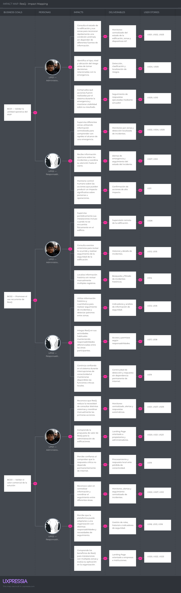

<p align="center">

<strong>Figura 23. Impact Mapping - ResQ.</strong>

</p>

### Análisis del Impact Mapping

<p align="justify">

El <strong>BG01</strong> busca validar que los administradores puedan identificar riesgos y comprender las respuestas asociadas. Carlos requiere información clara sobre el estado de la edificación y los incidentes, mientras que Alex contribuye mediante la configuración y validación técnica de las integraciones necesarias. Estas capacidades deberán comprobarse mediante pruebas controladas.

</p>

<p align="justify">

El <strong>BG02</strong> busca incorporar ResQ a las actividades habituales de supervisión y seguimiento. Carlos necesita consultar mediciones, dispositivos, incidentes e indicadores, mientras que Alex participa en la integración y mantenimiento de la información de los equipos. Estos resultados orientan las funcionalidades de monitoreo, administración y trazabilidad.

</p>

<p align="justify">

El <strong>BG03</strong> relaciona la propuesta de valor con la adopción del servicio. Carlos evalúa sus beneficios y gestiona la vigencia de la suscripción organizacional, mientras que Alex requiere información técnica y demostraciones para considerar una colaboración. La gestión de suscripciones contempla estados y vigencia, sin implicar funcionalidades de pago o facturación.

</p>

## 3.3. Product Backlog

<p align="justify">

El Product Backlog de ResQ prioriza las User Stories y Technical Stories definidas en el apartado 3.1, considerando el valor que aportan a propietarios y administradores de edificaciones y a empresas integradoras de automatización. Las historias del Landing Page se incluyen entre las primeras prioridades para considerar su desarrollo desde el primer Sprint.

</p>

<p align="justify">

El Business Value utiliza una escala de 1 a 10 y orienta el orden según el valor para el negocio. Los Story Points representan el esfuerzo relativo mediante los valores 1, 2, 3, 5 y 8. Se conservan las valoraciones previamente registradas; las asignadas a US40–US47 y TS10 son propuestas pendientes de validación por el Product Owner y el equipo. La planificación de cada Sprint también considera dependencias técnicas.

</p>

| Order | User Story ID | Title | Description | Business Value | Story Points |
|---:|---|---|---|---:|---:|
| 1 | US01 | Consultar el estado general de una edificación | Como responsable de una edificación, deseo conocer el estado general de la infraestructura, para identificar oportunamente si existe alguna condición que requiera atención. | 10 | 5 |
| 2 | US06 | Conocer el tipo de riesgo detectado | Como responsable de seguridad, deseo conocer el tipo de riesgo detectado, para comprender qué situación está ocurriendo. | 10 | 3 |
| 3 | US08 | Conocer la ubicación del riesgo | Como responsable de seguridad, deseo conocer la zona donde se originó el riesgo, para dirigir la respuesta hacia el lugar correcto. | 10 | 3 |
| 4 | US10 | Recibir una alerta de riesgo | Como responsable de una edificación, deseo recibir una alerta cuando se detecte una situación de riesgo, para conocer oportunamente lo ocurrido. | 10 | 5 |
| 5 | US11 | Ejecutar una respuesta automática autorizada | Como responsable de una edificación, deseo que determinadas respuestas se ejecuten automáticamente cuando se cumplan condiciones previamente autorizadas, para reducir el tiempo de reacción. | 10 | 8 |
| 6 | US28 | Mantener funciones críticas sin Internet | Como responsable de una edificación, deseo que la detección y las respuestas críticas continúen funcionando cuando se pierde Internet, para mantener la capacidad de reacción ante una emergencia. | 10 | 8 |
| 7 | US34 | Comprender la propuesta de ResQ | Como visitante, deseo comprender el problema que aborda ResQ y su propuesta de solución, para determinar si resulta relevante para mis necesidades. | 9 | 2 |
| 8 | US35 | Conocer los beneficios para administradores | Como propietario o administrador de una edificación, deseo conocer los beneficios de ResQ aplicables a una edificación, para evaluar su utilidad dentro de mi infraestructura. | 9 | 2 |
| 9 | US36 | Conocer los beneficios para empresas integradoras | Como representante de una empresa integradora, deseo conocer cómo puede incorporarse ResQ a sistemas existentes, para evaluar si puede formar parte de nuestros proyectos. | 9 | 2 |
| 10 | US39 | Acceder a los productos digitales de ResQ | Como visitante, deseo acceder desde el Landing Page a los productos digitales disponibles, para continuar mi experiencia con la solución. | 9 | 2 |
| 11 | US21 | Registrar una edificación | Como administrador, deseo registrar una edificación que será monitoreada, para organizar la infraestructura gestionada por ResQ. | 9 | 3 |
| 12 | US22 | Definir zonas de una edificación | Como administrador, deseo definir las zonas de una edificación, para localizar correctamente dispositivos y eventos. | 9 | 3 |
| 13 | US44 | Actualizar información de edificaciones y zonas | Como administrador de una organización, deseo modificar la información administrativa de edificios y zonas existentes, para mantener actualizado el inventario de infraestructura. | 9 | 3 |
| 14 | US23 | Asociar un dispositivo con una zona | Como administrador, deseo asociar cada dispositivo con su zona correspondiente, para identificar el origen de mediciones y alertas. | 9 | 5 |
| 15 | US45 | Gestionar el inventario de dispositivos | Como administrador técnico, deseo registrar y actualizar los dispositivos de una organización y su estado administrativo, para mantener un inventario confiable. | 9 | 5 |
| 16 | US24 | Configurar una condición de detección | Como responsable autorizado, deseo configurar condiciones de detección, para adaptar la identificación de riesgos a las características de la instalación. | 9 | 5 |
| 17 | US25 | Configurar una política de respuesta | Como responsable autorizado, deseo configurar las respuestas permitidas para cada tipo de riesgo, para establecer previamente cómo deberá actuar el sistema. | 9 | 8 |
| 18 | US07 | Conocer el nivel de riesgo | Como responsable de seguridad, deseo conocer el nivel del riesgo detectado, para determinar la urgencia con la que debe atenderse. | 9 | 3 |
| 19 | US02 | Consultar el estado de una zona | Como responsable de una edificación, deseo conocer el estado de cada zona monitoreada, para identificar rápidamente dónde existe una condición anómala. | 9 | 3 |
| 20 | US03 | Consultar mediciones actuales | Como responsable de una edificación, deseo consultar las mediciones actuales de los dispositivos, para comprender las condiciones de las zonas supervisadas. | 9 | 3 |
| 21 | TS01 | Capturar mediciones desde los Embedded Systems | Como Developer, deseo que la Embedded Application capture las mediciones de los sensores conectados, para proporcionar al procesamiento local la información necesaria para monitoreo y detección. | 9 | 5 |
| 22 | TS03 | Procesar reglas de detección localmente | Como Developer, deseo evaluar las condiciones de riesgo en el Edge, para que la detección crítica no dependa permanentemente de servicios Cloud. | 9 | 8 |
| 23 | TS04 | Ejecutar comandos de actuadores localmente | Como Developer, deseo que el Edge pueda coordinar comandos con los actuadores conectados, para ejecutar respuestas críticas sin depender permanentemente de Cloud. | 9 | 8 |
| 24 | US04 | Conocer el estado operativo de un dispositivo | Como responsable de una edificación, deseo conocer si un dispositivo se encuentra operativo, para distinguir una condición real de una posible falla del equipo. | 8 | 3 |
| 25 | US46 | Organizar espacios y dispositivos sobre un plano | Como administrador o integrador autorizado, deseo organizar espacios y ubicar dispositivos sobre el plano de un piso, para representar la distribución del entorno monitoreado. | 8 | 8 |
| 26 | US05 | Supervisar remotamente una edificación | Como administrador o facility manager, deseo supervisar remotamente la infraestructura, para mantener visibilidad aun cuando no me encuentre físicamente en el edificio. | 8 | 3 |
| 27 | US09 | Consultar el contexto de una detección | Como responsable de seguridad, deseo conocer qué dispositivo y mediciones originaron la detección, para contar con contexto antes de tomar una decisión. | 8 | 5 |
| 28 | US12 | Confirmar una acción de alto impacto | Como responsable autorizado, deseo confirmar las respuestas que puedan generar un impacto significativo, para mantener control humano sobre acciones sensibles. | 8 | 5 |
| 29 | US13 | Conocer las respuestas ejecutadas | Como responsable de seguridad, deseo conocer qué respuestas fueron ejecutadas, para verificar cómo actuó el sistema durante el evento. | 8 | 3 |
| 30 | US26 | Asignar roles y responsabilidades | Como administrador, deseo asignar roles y responsabilidades a los usuarios, para limitar el acceso a información y acciones sensibles. | 8 | 5 |
| 31 | US27 | Acceder de forma autenticada | Como usuario autorizado, deseo autenticarme antes de acceder a ResQ, para utilizar únicamente las funciones correspondientes a mis responsabilidades. | 8 | 3 |
| 32 | US29 | Recuperar eventos producidos durante una interrupción | Como responsable de una edificación, deseo que los eventos producidos durante una interrupción de conectividad estén disponibles posteriormente, para conservar la trazabilidad de lo ocurrido. | 8 | 8 |
| 33 | US30 | Conocer los mecanismos de integración compatibles | Como ingeniero de integración, deseo conocer qué mecanismos de integración soporta ResQ, para determinar si puede incorporarse a la infraestructura de mi cliente. | 8 | 3 |
| 34 | US31 | Integrar una fuente externa compatible | Como ingeniero de integración, deseo conectar a ResQ un dispositivo o sistema externo mediante un mecanismo de integración soportado, para incorporar sus mediciones sin sustituir innecesariamente la infraestructura instalada. | 8 | 8 |
| 35 | US32 | Validar una integración antes de activarla | Como ingeniero de integración, deseo comprobar que una fuente externa entrega información compatible antes de utilizarla operativamente, para detectar incompatibilidades antes de su implementación definitiva. | 8 | 5 |
| 36 | US33 | Asociar dispositivos externos con su contexto | Como ingeniero de integración, deseo relacionar los dispositivos externos con el edificio y zona correspondientes, para conservar el contexto de las mediciones y eventos integrados. | 8 | 5 |
| 37 | US37 | Acceder a documentación técnica de integración | Como representante técnico de una empresa integradora, deseo acceder desde el sitio web a la documentación técnica disponible, para realizar una evaluación preliminar antes de iniciar un proyecto. | 8 | 3 |
| 38 | US38 | Solicitar una demostración o contacto | Como representante de una empresa integradora, deseo solicitar una demostración, piloto o contacto con ResQ, para evaluar una posible colaboración. | 8 | 3 |
| 39 | US40 | Consultar el estado de la suscripción | Como administrador de una organización, deseo consultar el estado y las fechas de vigencia de la suscripción de mi organización, para conocer la situación actual de nuestro servicio ResQ. | 8 | 3 |
| 40 | US41 | Registrar una suscripción organizacional | Como administrador de una organización, deseo registrar una suscripción para mi organización, para formalizar su vigencia dentro de ResQ. | 8 | 5 |
| 41 | TS02 | Recibir mediciones mediante un Edge API | Como Developer, deseo disponer de un Edge API para recibir mediciones provenientes de los dispositivos, para desacoplar la captura física del procesamiento local. | 8 | 8 |
| 42 | TS05 | Integrar un servicio externo de notificaciones | Como Developer, deseo disponer de un mecanismo para entregar notificaciones externas, para complementar la comunicación de alertas generadas por ResQ. | 8 | 5 |
| 43 | TS06 | Proveer servicios mediante RESTful API | Como Developer, deseo disponer de una RESTful API para los recursos Cloud de ResQ, para permitir que las aplicaciones digitales consuman los servicios de la plataforma. | 8 | 8 |
| 44 | TS07 | Conservar y sincronizar eventos durante una interrupción | Como Developer, deseo conservar temporalmente los eventos que no pueden enviarse a los servicios remotos, para sincronizarlos cuando la comunicación sea restablecida. | 8 | 8 |
| 45 | TS08 | Proveer un mecanismo de integración externa | Como Developer, deseo exponer un mecanismo de integración basado en tecnologías soportadas, para permitir el intercambio de información con dispositivos o plataformas externas. | 8 | 8 |
| 46 | US14 | Consultar el estado de un incidente | Como responsable de seguridad, deseo conocer el estado actual de un incidente, para saber si todavía requiere atención. | 7 | 3 |
| 47 | US15 | Asignar un responsable de atención | Como responsable de seguridad, deseo identificar quién se encuentra atendiendo un incidente, para coordinar las acciones y evitar responsabilidades ambiguas. | 7 | 3 |
| 48 | US16 | Registrar la resolución de un incidente | Como responsable de seguridad, deseo registrar la resolución y cierre de un incidente, para conservar evidencia de cómo terminó la situación. | 7 | 3 |
| 49 | US17 | Consultar incidentes anteriores | Como responsable de una edificación, deseo consultar incidentes anteriores, para revisar situaciones ocurridas en la infraestructura. | 7 | 3 |
| 50 | US42 | Renovar una suscripción vencida | Como administrador de una organización, deseo renovar una suscripción que ha vencido, para restablecer su vigencia bajo las condiciones permitidas por ResQ. | 7 | 3 |
| 51 | TS10 | Registrar vencimiento de suscripciones | Como Developer, deseo ofrecer una operación de vencimiento controlada por las reglas del dominio, para mantener consistente el estado de las suscripciones de ResQ. | 7 | 3 |
| 52 | US47 | Consultar y actualizar mi información de contacto | Como usuario autenticado, deseo consultar mi perfil y actualizar mi información de contacto, para mantener correctos los datos asociados a mi cuenta. | 7 | 3 |
| 53 | US18 | Buscar incidentes históricos | Como responsable de una edificación, deseo localizar incidentes mediante fecha, zona, tipo o estado, para encontrar rápidamente información histórica relevante. | 6 | 5 |
| 54 | US43 | Cancelar una suscripción activa | Como administrador de una organización, deseo cancelar la suscripción activa de mi organización, para registrar formalmente la decisión de darla de baja. | 6 | 3 |
| 55 | US19 | Consultar la secuencia de un incidente | Como responsable de una edificación, deseo consultar la secuencia de mediciones, alertas y respuestas asociadas con un incidente, para comprender cómo evolucionó. | 6 | 5 |
| 56 | US20 | Consultar indicadores de incidentes | Como facility manager, deseo consultar indicadores como frecuencia de incidentes, falsas alarmas y tiempos de atención, para identificar tendencias que requieran acciones preventivas. | 5 | 8 |
| 57 | TS09 | Procesar información cuantitativa para indicadores | Como Developer, deseo calcular indicadores a partir de los incidentes registrados, para proporcionar información cuantitativa sustentada a las aplicaciones de ResQ. | 5 | 8 |

### Product Backlog en Trello

<p align="justify">

El Product Backlog se gestiona en Trello. Cada tarjeta debe reflejar el ID, título, Epic, Business Value, Story Points y los tres escenarios de aceptación definidos en el apartado 3.1. El tablero y la captura deben actualizarse para incluir las 57 historias y respetar el orden priorizado.

</p>

<p align="justify">

La Figura 24 corresponde a la evidencia del Product Backlog en Trello. Antes de la entrega deberá reemplazarse por una captura del tablero actualizado y comprobar que el enlace permita su consulta pública.

</p>

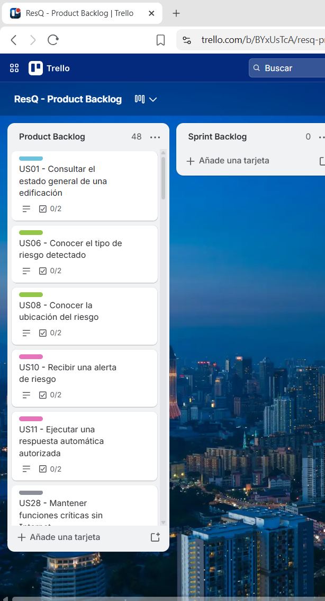

<p align="center">

<strong>Figura 24. Product Backlog - ResQ.</strong>

</p>

**Link del Product Backlog:** [ResQ - Product Backlog](https://trello.com/invite/b/6aab49b781accd44e61a7276/ATTI008620e96295fff92c9f73aa53404faf8E74AD19/resq-product-backlog)

<div style="page-break-before: always; break-before: page;"></div>

# Capítulo IV: Solution Software Design

## 4.1. Strategic-Level Domain-Driven Design

<p align="justify">
El proceso de <strong>Strategic-Level Domain-Driven Design</strong> se utilizó para definir los principales límites del dominio de ResQ y organizar la solución de acuerdo con las capacidades identificadas durante las actividades de Needfinding y Requirements.
</p>

<p align="justify">
A partir del análisis del problema, los principales escenarios operativos, las User Stories y las Technical Stories, el equipo identificó grupos de conceptos, reglas y responsabilidades relacionadas entre sí. Estas responsabilidades fueron separadas considerando su significado dentro del dominio, la propiedad de la información y de las reglas de negocio, y la necesidad de reducir el acoplamiento entre diferentes partes de la solución.
</p>

<p align="justify">
Como resultado de este proceso, el dominio de ResQ fue organizado en distintos Bounded Contexts, cada uno con responsabilidades claramente delimitadas sobre su modelo de dominio y sus reglas de negocio.
</p>

### 4.1.1. Design-Level EventStorming

<p align="justify">
Con el objetivo de profundizar el modelado del dominio de ResQ, el equipo realizó una sesión de <strong>Design-Level EventStorming</strong> tomando como referencia el Big Picture EventStorming elaborado previamente. La finalidad fue identificar con mayor detalle los actores, acciones, eventos, reglas y responsabilidades que intervienen en el funcionamiento de la solución.
</p>

<p align="justify">
Durante la sesión se utilizaron los principales elementos de EventStorming: <strong>Actors, Commands, Domain Events, Aggregates, Policies, Read Models y External Systems</strong>. Para mantener coherencia con el Ubiquitous Language previamente definido, se emplearon conceptos como <code>Building</code>, <code>Zone</code>, <code>IoT Device</code>, <code>Risk</code>, <code>Automatic Response</code>, <code>High-Impact Action</code>, <code>Incident</code> y <code>Authorized Manager</code>.
</p>

<p align="justify">
Durante la reunión se siguieron las siguientes actividades:
</p>

- **Exploración del dominio general:** Se revisó el Big Picture EventStorming y se discutieron los principales procesos que intervienen desde la preparación de la plataforma hasta la atención y cierre de una emergencia.
- **Identificación de actores y usuarios:** Se reconocieron los participantes que interactúan con el sistema, como administradores, responsables autorizados, usuarios de la plataforma y dispositivos IoT.
- **Identificación de Domain Events:** Se registraron los hechos relevantes que ocurren dentro del dominio, como `Usuario autenticado`, `Medición del sensor registrada`, `Condición anómala detectada`, `Riesgo clasificado y localizado`, `Alerta generada`, `Respuesta automática ejecutada` e `Incidente cerrado`.
- **Identificación de Commands:** Para cada evento se analizaron las acciones que lo originan, como autenticar usuarios, registrar mediciones, clasificar riesgos, generar alertas, ejecutar respuestas y gestionar incidentes.
- **Identificación de Policies y reglas del dominio:** Se incorporaron las reglas que reaccionan ante determinados eventos, especialmente las relacionadas con detección de riesgos, respuestas automáticas y acciones de alto impacto.
- **Identificación de Aggregates, Read Models y External Systems:** Se organizaron los elementos responsables de procesar los comandos, las vistas necesarias para consultar el estado del sistema y los servicios externos que participan en determinados flujos.
- **Asignación de responsabilidades:** Finalmente, se revisó qué actores y elementos del dominio participan en cada proceso, permitiendo reconocer agrupaciones de responsabilidades que posteriormente servirían para el Candidate Context Discovery.

<p align="justify">
Como resultado de la sesión se identificaron cuatro procesos principales dentro de ResQ: <strong>Acceso y Configuración</strong>, <strong>Monitoreo y Detección</strong>, <strong>Alerta y Respuesta Automática</strong> y <strong>Gestión y Seguimiento</strong>.
</p>

<p align="justify">
El flujo principal del dominio puede resumirse de la siguiente manera:
</p>

**Configuración → Medición registrada → Condición anómala detectada → Riesgo clasificado y localizado → Alerta o respuesta ejecutada → Incidente registrado → Seguimiento → Incidente cerrado**

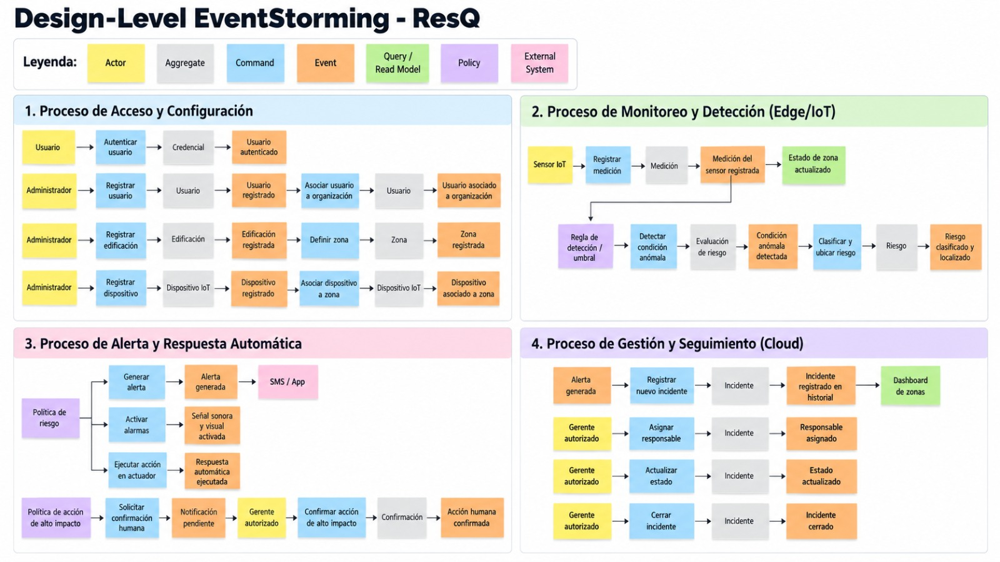

<p align="center">
  <strong>Figura 25. Design-Level_EventStorming_ResQ.</strong>
</p>

<p align="justify">
El Design-Level EventStorming permitió obtener una visión más detallada del comportamiento del dominio y reconocer con mayor claridad las responsabilidades existentes. Este resultado fue utilizado posteriormente como base para el <strong>Candidate Context Discovery</strong>, donde los elementos del EventStorm fueron agrupados para identificar los Bounded Contexts candidatos de ResQ.
</p>

#### 4.1.1.1. Candidate Context Discovery

<p align="justify">
A partir del modelo obtenido en el Design-Level EventStorming, se realizó el <strong>Candidate Context Discovery</strong> con el objetivo de identificar los límites naturales de responsabilidad dentro del dominio de ResQ y proponer los Bounded Contexts que organizarán posteriormente el diseño estratégico de la solución.
</p>

<p align="justify">
Para identificar los contextos candidatos se aplicaron principalmente las técnicas <strong>start-with-value</strong> y <strong>look-for-pivotal-events</strong>. La primera permitió reconocer las capacidades que concentran el principal valor de negocio de ResQ, mientras que la segunda permitió identificar eventos relevantes que representan cambios de responsabilidad dentro del flujo del dominio.
</p>

<p align="justify">
Mediante <strong>start-with-value</strong>, se identificaron <strong>Risk Detection</strong> y <strong>Alert & Response Management</strong> como las capacidades centrales de la solución. <code>Risk Detection</code> concentra la lógica encargada de interpretar las mediciones y determinar el tipo, nivel y ubicación de una situación de riesgo, mientras que <code>Alert &amp; Response Management</code> determina las alertas y acciones que deben ejecutarse como consecuencia del riesgo identificado.
</p>

<p align="justify">
Posteriormente, mediante <strong>look-for-pivotal-events</strong>, se analizaron eventos relevantes como:
</p>

- `Sensor measurement recorded`
- `Anomalous condition detected`
- `Risk classified and located`
- `Alert generated`
- `Automatic response executed`
- `Incident registered in history`
- `Incident closed`

<p align="justify">
Estos eventos permitieron reconocer transiciones entre las responsabilidades de monitoreo, detección, respuesta y seguimiento. En particular, <code>Risk classified and located</code> representa el cambio entre la interpretación de las condiciones monitoreadas y el inicio de las acciones de respuesta, mientras que <code>Incident registered in history</code> marca el comienzo del seguimiento formal de la situación.
</p>

<p align="justify">
Como resultado del análisis se identificaron los siguientes Candidate Bounded Contexts:
</p>

| Candidate Bounded Context | Descripción |
|---|---|
| **IAM** | Gestiona la autenticación y autorización de los usuarios de ResQ, incluyendo validación de identidad, asignación de roles y control de permisos sobre las funcionalidades protegidas. |
| **User Management** | Gestiona la información, estado y responsabilidades de los usuarios pertenecientes a una organización. |
| **Building Management** | Gestiona la información de las edificaciones y sus zonas, permitiendo mantener la estructura física que será monitoreada por ResQ. |
| **Device Management** | Gestiona los dispositivos IoT registrados en la plataforma y su asociación con una edificación o zona determinada. |
| **Monitoring** | Gestiona las mediciones y estados actuales de las zonas y dispositivos IoT para proporcionar visibilidad sobre las condiciones monitoreadas. |
| **Risk Detection** | Analiza las mediciones y aplica reglas de detección para identificar condiciones de riesgo y determinar su tipo, nivel y ubicación. |
| **Alert & Response Management** | Gestiona las alertas y respuestas derivadas de un riesgo, incluyendo señalización, acciones automáticas mediante actuadores y acciones que requieren confirmación humana. |
| **Incident Management** | Gestiona el ciclo de vida de los incidentes, incluyendo su registro, responsable, estado, evolución y cierre. |

<p align="justify">
La técnica <strong>start-with-value</strong> permitió reconocer que <code>Risk Detection</code> y <code>Alert &amp; Response Management</code> concentran el mayor valor de negocio de ResQ, debido a que representan la interpretación de una situación de riesgo y la coordinación de la respuesta correspondiente.
</p>

<p align="justify">
Por otro lado, los demás contextos fueron delimitados al identificar responsabilidades específicas dentro del dominio. <code>Monitoring</code> mantiene el estado observado de la infraestructura, <code>Incident Management</code> gestiona el seguimiento posterior de una situación, mientras que <code>IAM</code>, <code>User Management</code>, <code>Building Management</code> y <code>Device Management</code> proporcionan las capacidades necesarias para preparar y administrar el entorno en el que opera la solución.
</p>

<p align="justify">
Como parte del proceso se realizaron cambios progresivos sobre el EventStorm, comenzando con el modelo sin límites definidos, continuando con la identificación de las capacidades de mayor valor y los eventos pivotales, y finalizando con la delimitación de los ocho Candidate Bounded Contexts.
</p>

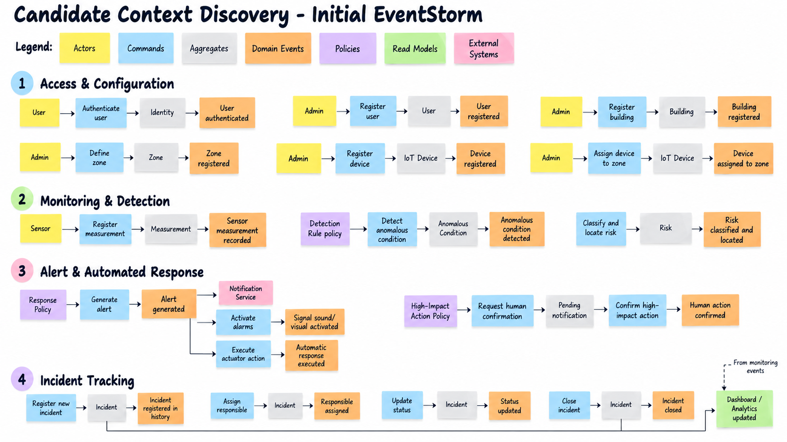

<p align="center">
  <strong>Figura 26. CandidateContextDiscovery_Initial.</strong>
</p>

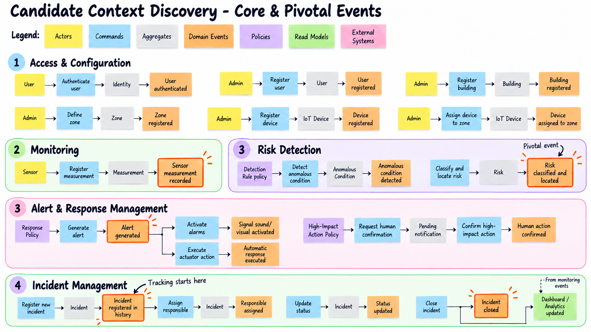

<p align="center">
  <strong>Figura 27. CandidateContextDiscovery_Core.</strong>
</p>

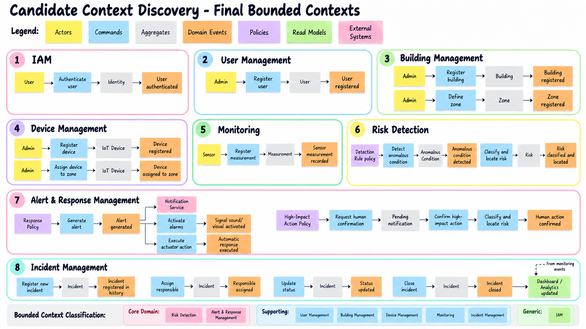

<p align="center">
  <strong>Figura 28. CandidateContextDiscovery_Final.</strong>
</p>

<p align="justify">
El resultado permitió obtener una primera descomposición del dominio en ocho contextos candidatos. Estos límites serán refinados posteriormente mediante los <strong>Bounded Context Canvases</strong> y el <strong>Context Mapping</strong>, donde se analizarán con mayor detalle sus responsabilidades, reglas de negocio y relaciones.
</p>

#### 4.1.1.2. Domain Message Flows Modeling

<p align="justify">
Luego de identificar los Candidate Bounded Contexts de ResQ, se utilizó la técnica de <strong>Domain Storytelling</strong> para representar cómo estos contextos deben colaborar frente a diferentes situaciones del negocio.
</p>

<p align="justify">
Para cada escenario se identificaron los actores involucrados, los Bounded Contexts que participan y los principales mensajes intercambiados entre ellos. Estos mensajes se representan como <strong>Commands, Events y Queries</strong>, permitiendo visualizar qué contexto solicita una acción, cuál procesa la información y qué resultado comunica posteriormente.
</p>

<p align="justify">
Se seleccionaron cuatro escenarios representativos del funcionamiento de ResQ: la configuración inicial de una edificación, la detección y respuesta automática ante un riesgo, la confirmación de una acción de alto impacto y el seguimiento de un incidente. Estos escenarios permiten observar tanto los procesos administrativos como el flujo principal de monitoreo y respuesta ante emergencias.
</p>

**Escenario 1: Configuración de una edificación monitoreada**

<p align="justify">
El primer escenario representa la preparación de la infraestructura antes de iniciar el monitoreo. Un administrador se autentica mediante <strong>IAM</strong> y la información correspondiente al usuario y su organización es gestionada por <strong>User Management</strong>.
</p>

<p align="justify">
Posteriormente, el administrador registra la edificación y define las zonas que serán monitoreadas mediante <strong>Building Management</strong>. Finalmente, los dispositivos IoT son registrados y asociados con las zonas correspondientes a través de <strong>Device Management</strong>.
</p>

<p align="justify">
Como resultado, la infraestructura queda configurada para que las mediciones futuras puedan relacionarse correctamente con un dispositivo, una zona y una edificación.
</p>

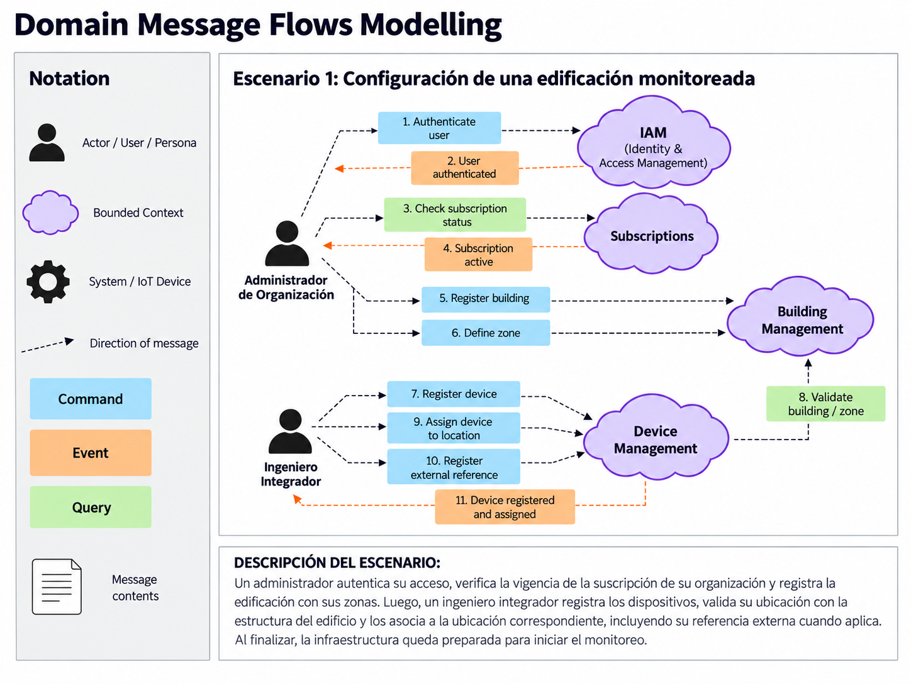

<p align="center">
  <strong>Figura 29. DomainMessageFlowsModeling_Scenario1.</strong>
</p>

**Escenario 2: Detección y respuesta automática ante un riesgo**

<p align="justify">
Este escenario representa el flujo principal de valor de ResQ. El proceso comienza cuando un dispositivo IoT genera una nueva medición y la envía a <strong>Monitoring</strong>, donde se registra y actualiza el estado observado de la zona.
</p>

<p align="justify">
La información es posteriormente evaluada por <strong>Risk Detection</strong>, que determina si existe una condición de riesgo y establece su tipo, nivel y ubicación. Cuando se confirma un riesgo, esta información es enviada a <strong>Alert & Response Management</strong>, que aplica las políticas correspondientes para generar una alerta y, cuando está permitido, ejecutar una respuesta automática.
</p>

<p align="justify">
Finalmente, los datos del riesgo y de la respuesta realizada son comunicados a <strong>Incident Management</strong>, donde se registra el incidente para permitir su posterior seguimiento.
</p>

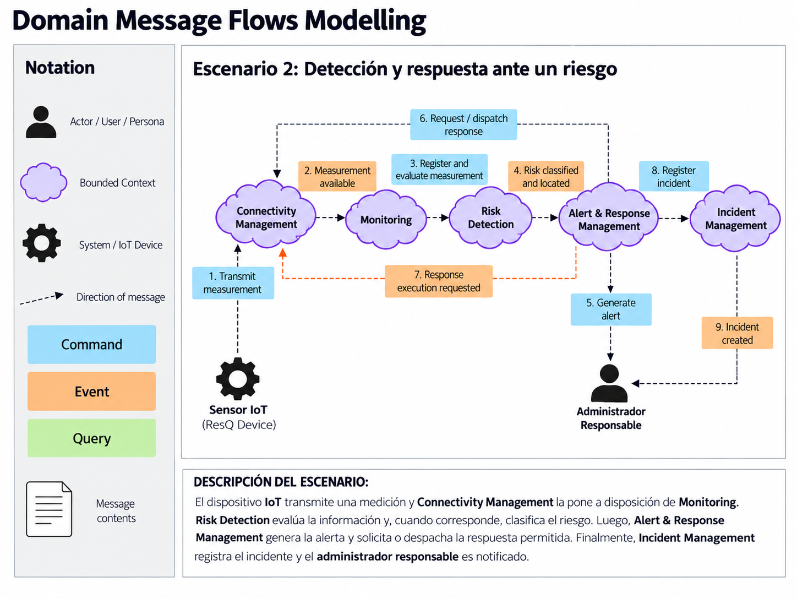

<p align="center">
  <strong>Figura 30. DomainMessageFlowsModeling_Scenario2.</strong>
</p>

**Escenario 3: Confirmación de una acción de alto impacto**

<p align="justify">
Algunas acciones de seguridad pueden requerir intervención humana debido a su posible impacto. Cuando <strong>Risk Detection</strong> identifica una situación que requiere este tipo de respuesta, <strong>Alert & Response Management</strong> solicita la confirmación de un responsable autorizado.
</p>

<p align="justify">
Antes de permitir la operación, <strong>IAM</strong> valida que el usuario posea los permisos necesarios. Una vez autorizado, el responsable puede confirmar la acción y Alert & Response Management procede con su ejecución.
</p>

<p align="justify">
La decisión tomada y la respuesta realizada son posteriormente comunicadas a <strong>Incident Management</strong>, permitiendo conservar la trazabilidad de la intervención humana. En caso de que el responsable rechace la acción, esta no se ejecuta y la decisión también puede quedar registrada.
</p>

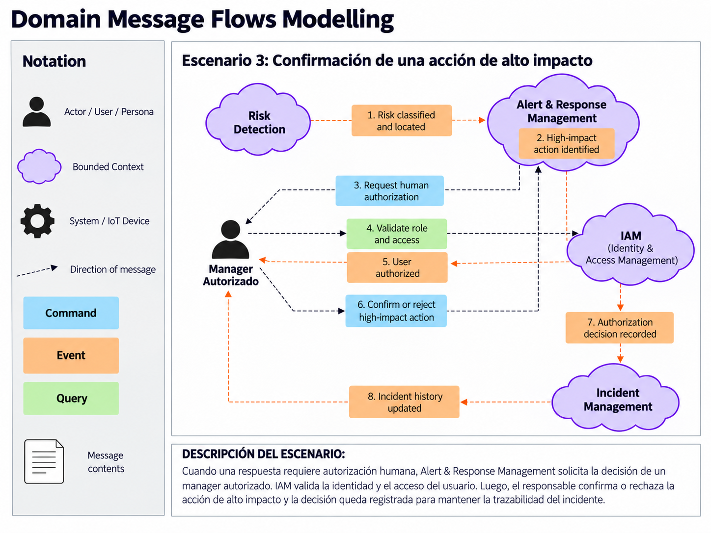

<p align="center">
  <strong>Figura 31. DomainMessageFlowsModeling_Scenario3.</strong>
</p>

**Escenario 4: Seguimiento y cierre de un incidente**

<p align="justify">
Una vez registrado un incidente, un responsable de seguridad puede consultar su información mediante <strong>Incident Management</strong>. Desde este contexto se puede conocer el riesgo asociado, las acciones realizadas y el responsable asignado.
</p>

<p align="justify">
Cuando se requiere información actualizada sobre la zona afectada, Incident Management consulta a <strong>Monitoring</strong> para obtener las condiciones actuales. A medida que evoluciona la situación, el responsable puede actualizar el estado del incidente y, cuando la emergencia ha sido controlada, solicitar su cierre.
</p>

<p align="justify">
De esta manera, Incident Management conserva la trazabilidad de los responsables, cambios de estado y acciones realizadas durante todo el ciclo de vida del incidente.
</p>

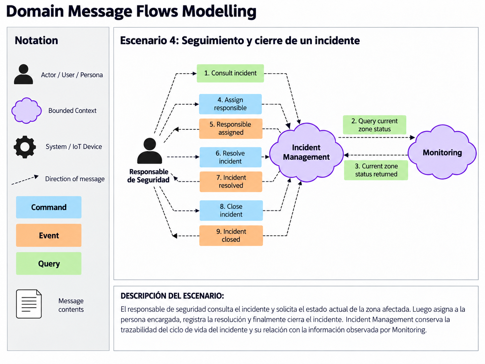

<p align="center">
  <strong>Figura 32. DomainMessageFlowsModeling_Scenario4.</strong>
</p>

#### 4.1.1.3. Bounded Context Canvases
##### *Connectivity Management.*

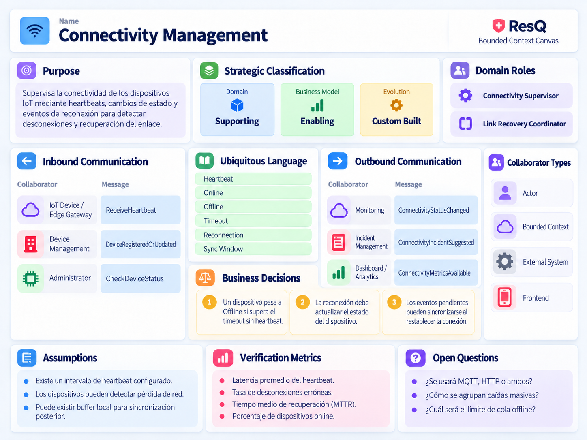

<p align="center">
  <strong>Figura 33. Entrevista 2 - Camila Torres Vega.</strong>
</p>
<p align="justify">
Luego de identificar los Candidate Bounded Contexts de ResQ, se elaboraron sus respectivos <strong>Bounded Context Canvases</strong> para detallar responsabilidades, lenguaje ubicuo, reglas de negocio, capacidades y relaciones con otros contextos.
</p>

<p align="justify">
El proceso siguió un enfoque iterativo basado en <strong>Context Overview Definition</strong>, <strong>Business Rules Distillation & Ubiquitous Language Capture</strong>, <strong>Capability Analysis</strong>, <strong>Capability Layering</strong>, <strong>Dependencies Capture</strong> y <strong>Design Critique</strong>.
</p>

<p align="justify">
Los Bounded Contexts fueron trabajados en orden de importancia, priorizando primero aquellos que concentran el mayor valor del negocio y que participan directamente en el flujo principal de ResQ.
</p>

<p align="justify">
A continuación, se presentan los Bounded Context Canvases definidos:
</p>

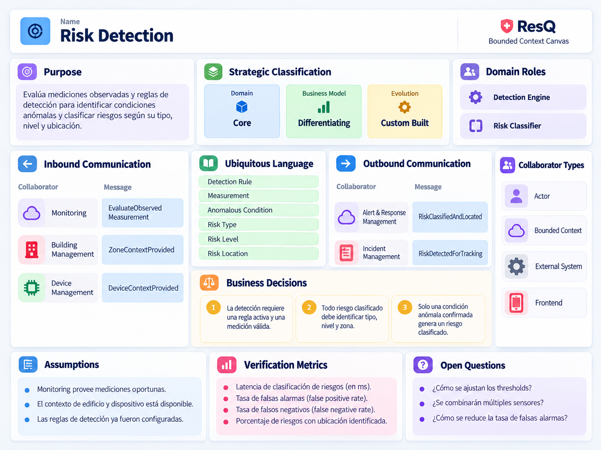

<p align="center">
  <strong>Figura 34. BoundedContextCanvases_RiskDetection.</strong>
</p>

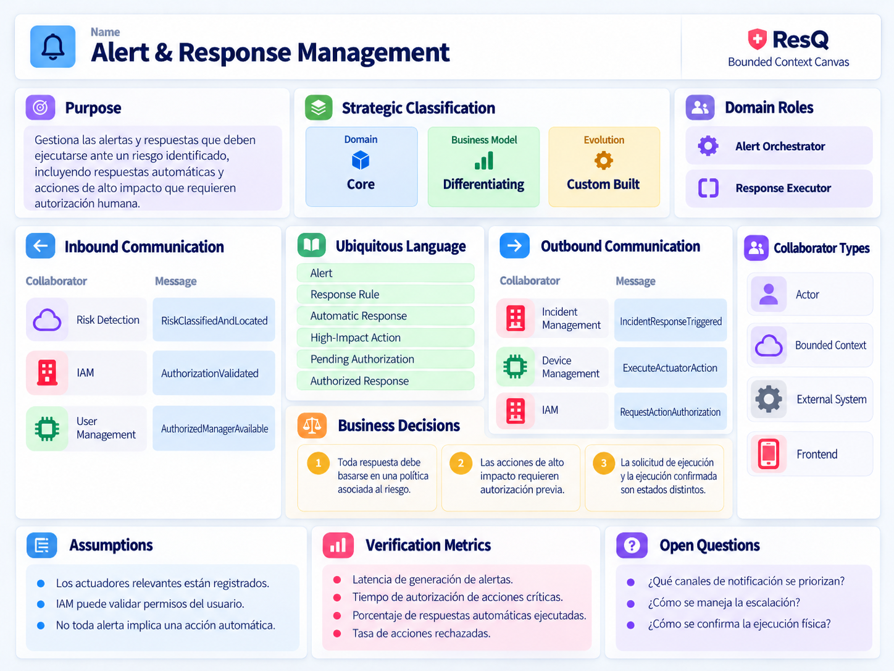

<p align="center">
  <strong>Figura 35. BoundedContextCanvases_Alert&ResponseManagement.</strong>
</p>

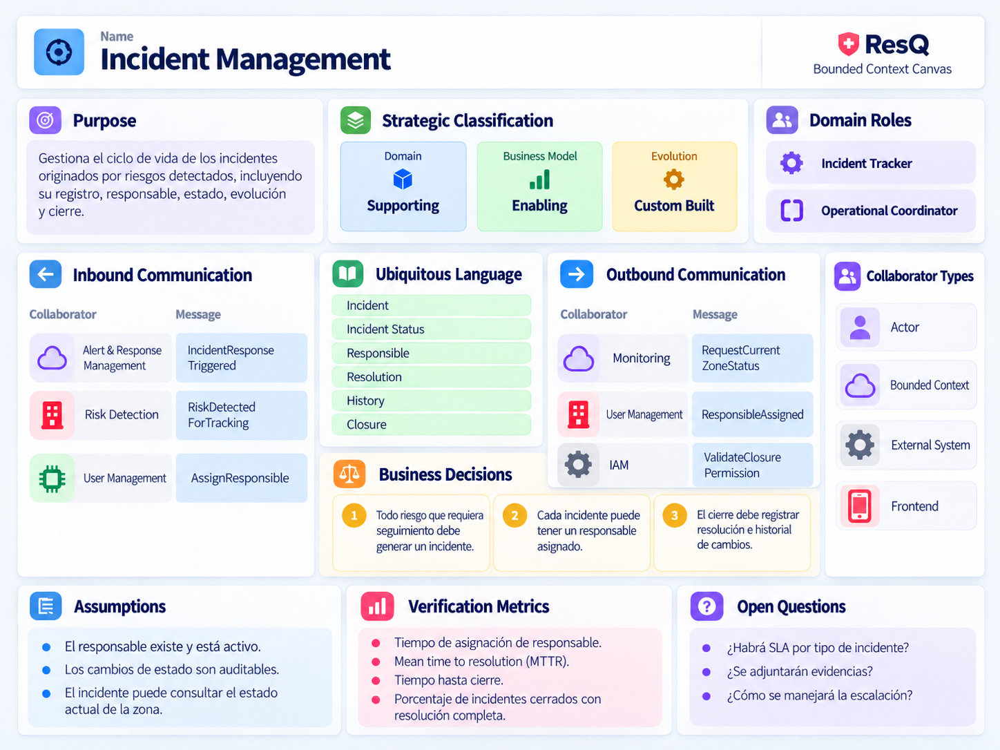

<p align="center">
  <strong>Figura 36. BoundedContextCanvases_IncidentManagement.</strong>
</p>

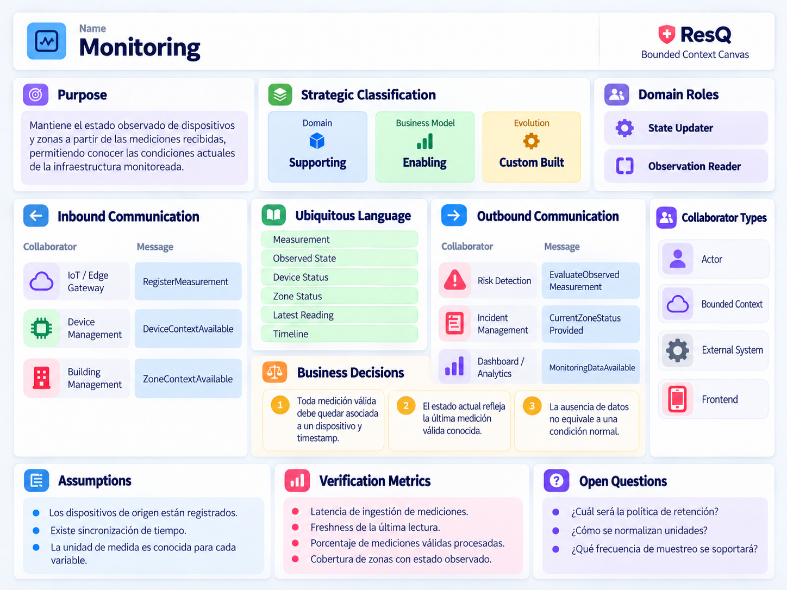

<p align="center">
  <strong>Figura 37. BoundedContextCanvases_Monitoring.</strong>
</p>

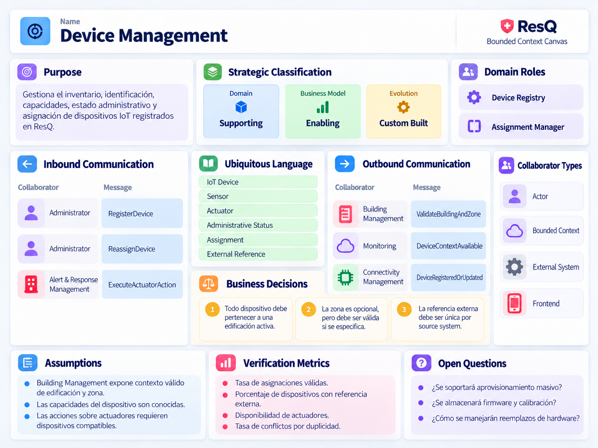

<p align="center">
  <strong>Figura 38. BoundedContextCanvases_DeviceManagement.</strong>
</p>

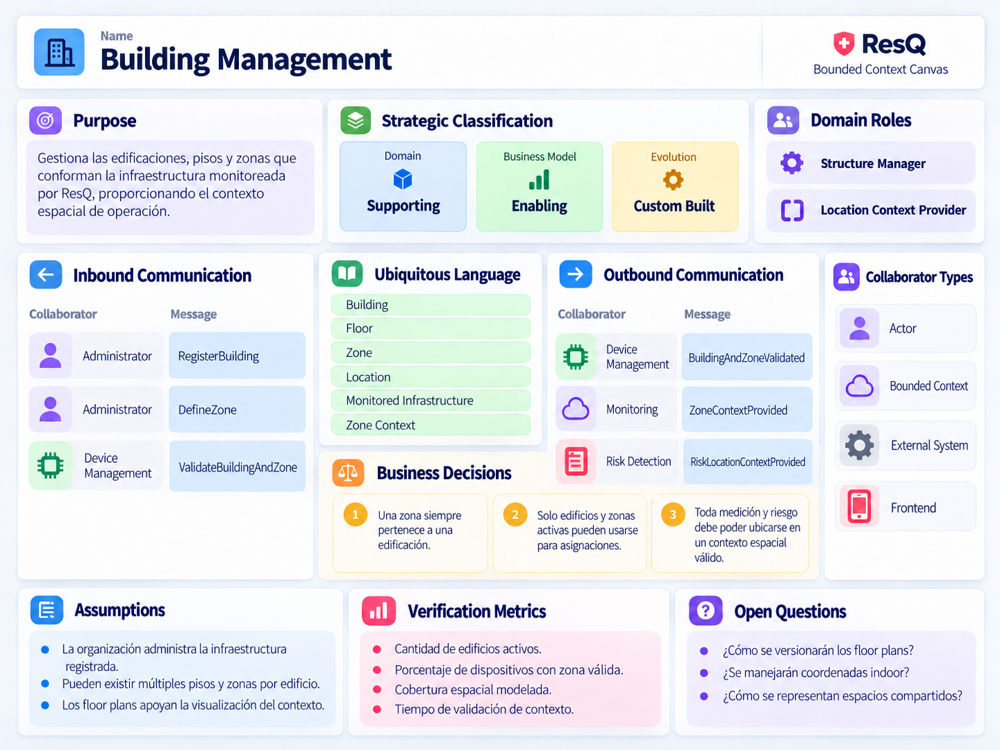

<p align="center">
  <strong>Figura 39. BoundedContextCanvases_BuildingManagement.</strong>
</p>

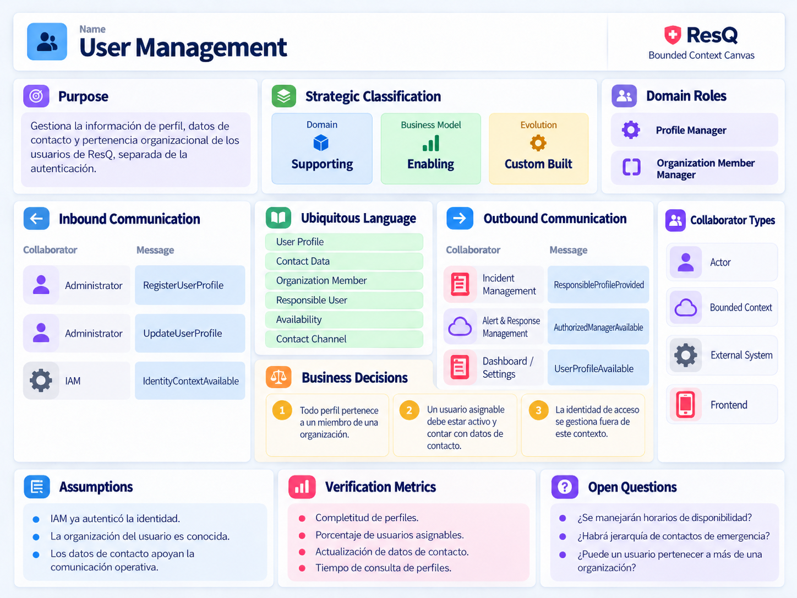

<p align="center">
  <strong>Figura 40. BoundedContextCanvases_UserManagement.</strong>
</p>

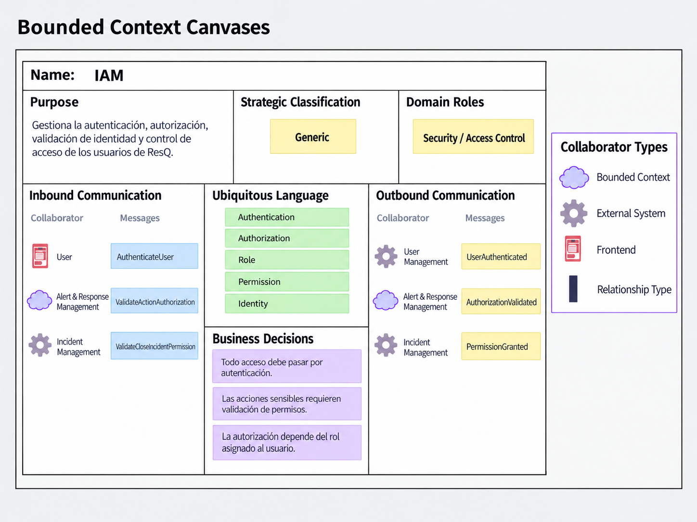

<p align="center">
  <strong>Figura 41. BoundedContextCanvases_IAM.</strong>
</p>

### 4.1.2. Context Mapping
<p align="justify">
En esta sección desarrollamos un conjunto de context maps para visualizar las relaciones entre los bounded contexts del sistema de sensores de emergencia. A partir de la información recolectada, exploramos distintas alternativas de diseño, cuestionando cómo cambiaría la estructura si reubicamos, dividimos o agrupamos capabilities. Finalmente, evaluamos cada propuesta considerando patrones como Anti-corruption Layer, Conformist, Customer/Supplier y Shared Kernel, con el fin de definir la mejor aproximación para la arquitectura del dominio. A continuación presentaremos las opciones que contemplamos y la estructura final.
</p>

**opcion 1**

<p align="justify">
En esta estructura mantenemos los cinco bounded contexts separados con relaciones claramente definidas. Las ventajas de este tipo de contexto son por un lado la clara separación de responsabilidades y por otro lado, se especifica que cada contexto se enfoca en una funcionalidad específica. Una de las principales desventajas es que hay una mayor complejidad en la sincronización entre contextos, especialmente con el alto volumen de datos de conectividad.
</p>

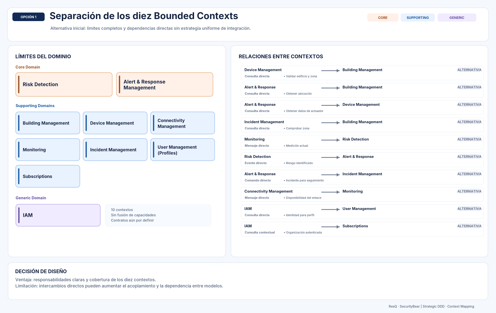

<p align="center">
  <strong>Figura 42. Mapping1 - ResQ.</strong>
</p>


**opcion 2**

<p align="justify">
Esta alternativa propone unir los contextos de Connectivity Management y Device Management en un solo bounded context. Al hacerlo, se elimina la necesidad de sincronización externa entre el inventario físico de sensores y su estado de red, manteniendo relaciones similares con los demás contextos del sistema.
</p>

<p align="justify">
Esta combinación presenta ventajas como la simplificación de la arquitectura al disminuir la cantidad de bounded contexts, permitiendo una comunicación más directa entre el alta de un dispositivo y su monitoreo de latidos.
</p>

<p align="justify">
No obstante, una desventaja es la combinación de responsabilidades distintas, ya que una parte se enfoca en transacciones de alto rendimiento (recibir miles de heartbeats por segundo) y la otra en procesos administrativos (registrar MAC addresses y zonas). Esto podría generar cuellos de botella en el servidor y el riesgo de que un solo contexto asuma demasiadas funciones.
</p>

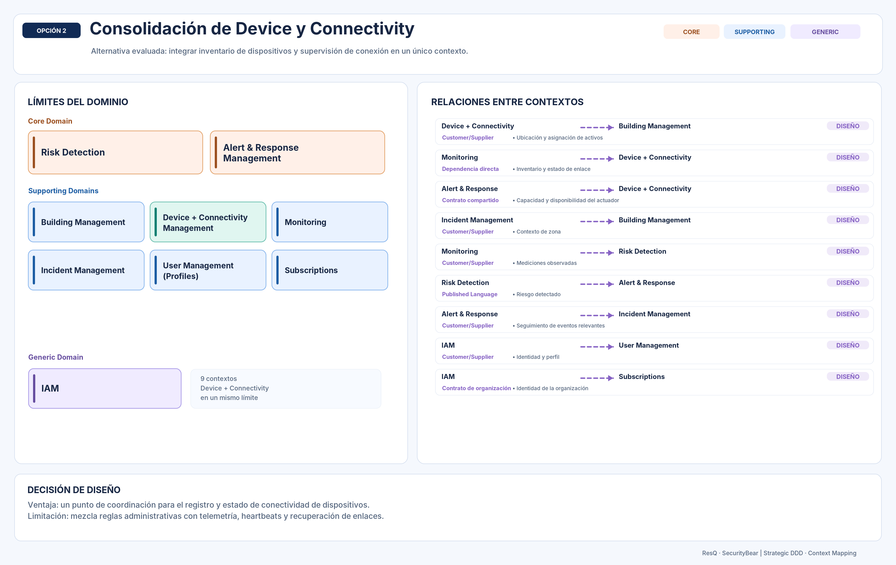

<p align="center">
  <strong>Figura 43. Mapping2 - ResQ.</strong>
</p>

**opcion 3**

<p align="justify">
Esta alternativa propone una arquitectura compuesta por cinco bounded contexts bien definidos, con relaciones claras entre ellos. La estructura busca equilibrar la separación de responsabilidades, para permitir que el sistema escale (vital para el procesamiento de redes IoT) y se mantenga con facilidad. Además, asegura tiempos de respuesta críticos ante emergencias.
</p>

* Building Management se comunica con Risk Detection y Device Management, proporcionando la información de la ubicación y zonas físicas (edificios, pisos). En ambos casos, la relación es del tipo Customer/Supplier, donde Building es el proveedor.  

* Device Management y Alert & Response Management comparten el modelo del "Sensor" y su criticidad. Por eso, tienen una relación de tipo Shared Kernel, lo que asegura que ambos usen los mismos conceptos al reportar qué aparato falló.  

* Alert & Response Management también se relaciona con Risk Detection, pero en este caso la relación es Conformist. El sistema de alertas utiliza la información del riesgo (sismo, gas), adaptándose a su estructura sin modificarla.

* Connectivity Management se conecta con Device Management mediante una Anti-corruption Layer (ACL). Esta capa traduce los miles de datos técnicos de red y latidos a un formato simple de estados operativos que Device Management pueda entender. Así, se protege el sistema central de la inmensa carga de datos técnicos de IoT.

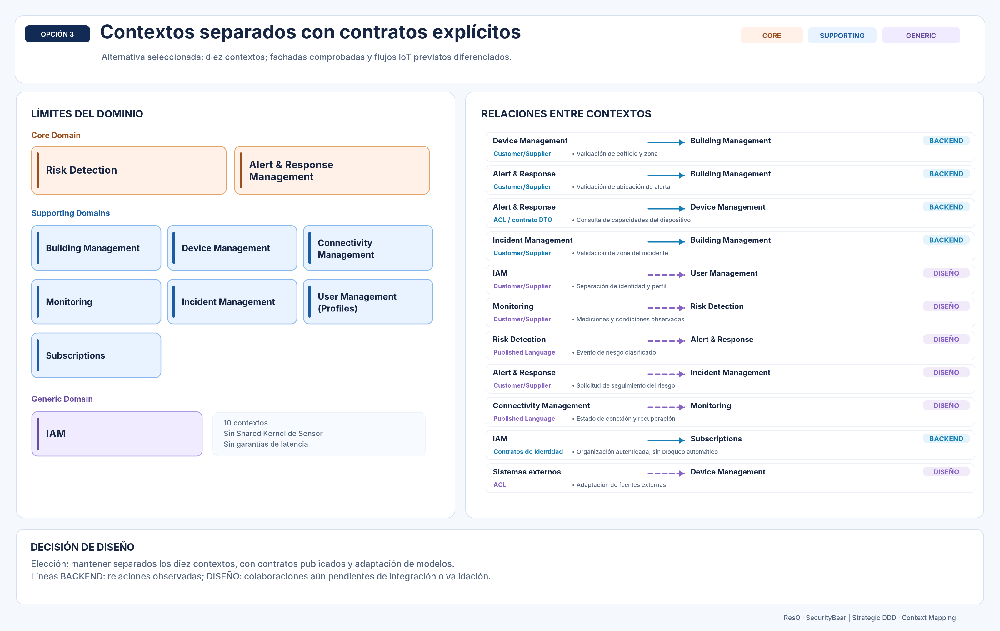

<p align="center">
  <strong>Figura 44. Mapping3 - ResQ.</strong>
</p>

**Elección**
<p align="justify">
Elegimos la opción 3, ya que proporciona el mejor equilibrio entre la separación de responsabilidades, la capacidad de procesamiento de alto rendimiento y el cumplimiento de los requisitos críticos de un sistema de emergencias.
</p>

<p align="justify">
Al definir cinco bounded contexts con relaciones claras, se facilita la evolución independiente de cada parte del sistema. Al separar la gestión de tráfico de red (Connectivity Management) mediante una Anti-corruption Layer, se aísla la carga técnica de los heartbeats constantes, evitando saturar la base de datos de los dispositivos. Asimismo, esta estructura garantiza tiempos de respuesta rápidos al procesar alertas reales de sismos o gas, brindando una plataforma robusta y confiable para la seguridad de los usuarios.
</p>


### 4.1.3. Software Architecture
<p align="justify">
La arquitectura de software de ResQ se representa mediante el modelo C4, con el propósito de describir la solución desde distintos niveles de abstracción y mostrar cómo se distribuyen sus principales responsabilidades.
</p>

<p align="justify">
Estas vistas permiten representar la relación de ResQ con sus usuarios y sistemas externos, así como los principales componentes desplegables que conforman la solución y la forma en que se comunican entre sí.
</p>

<p align="justify">
La arquitectura considera la naturaleza distribuida de ResQ, integrando aplicaciones cliente, servicios Cloud, servicios Edge y componentes IoT que colaboran para soportar las capacidades definidas para la solución.
</p>

#### 4.1.3.1. Software Architecture System Landscape Diagram

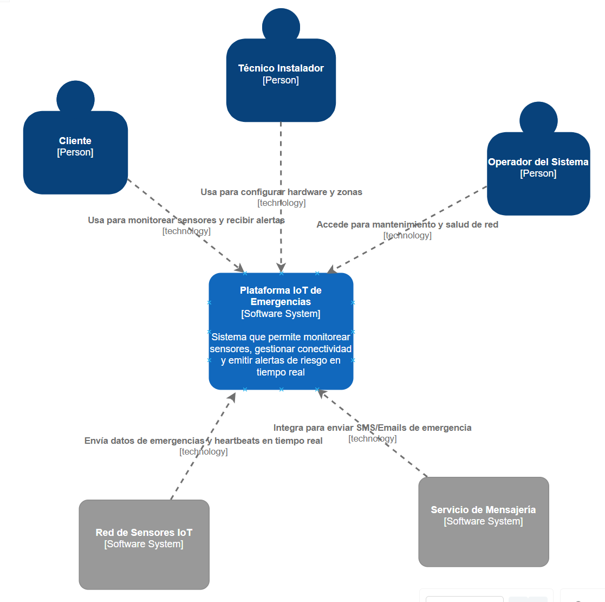

<p align="center">
  <strong>Figura 45. Diagram C4 - ResQ.</strong>
</p>


<p align="justify">
El System Landscape Diagram presenta una vista general del ecosistema de software en el que participa ResQ, mostrando las principales personas, sistemas involucrados y las relaciones existentes entre ellos.
</p>


<p align="justify">
Este diagrama permite identificar el alcance de la solución y comprender cómo los diferentes elementos del ecosistema de ResQ interactúan entre sí.
</p>

**DIAGRAM — ResQ Software Architecture System Landscape Diagram**

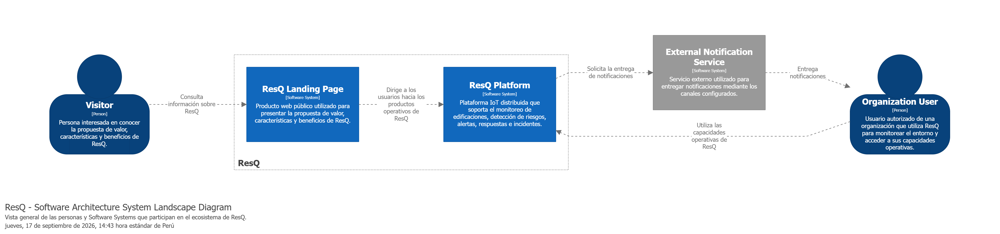

<p align="center">
  <strong>Figura 46. ResQ Software Architecture System Landscape Diagram.</strong>
</p>

### 4.1.3.2. Software Architecture Container Level Diagrams.

<p align="justify">
Este diagrama muestra que la Plataforma IoT de Emergencias está compuesta por cinco contenedores principales: una <strong>Aplicación Web (SPA)</strong> accesible desde navegadores para la gestión administrativa; una <strong>Aplicación Móvil</strong> para que clientes y técnicos reciban alertas y configuren equipos; una <strong>Cloud API</strong> que gestiona toda la lógica de negocio (usuarios, zonas, reportes); y una <strong>Edge/IoT API</strong> respaldada por un <strong>Broker MQTT</strong> encargado exclusivamente de procesar el alto volumen de datos (telemetría y <em>heartbeats</em>) provenientes de los sensores. Finalmente, el sistema utiliza bases de datos separadas: una base de datos relacional en la nube para almacenar la información estructural del sistema y una base de datos optimizada (ej. Time-Series) para el registro histórico de latidos y conectividad.
</p>

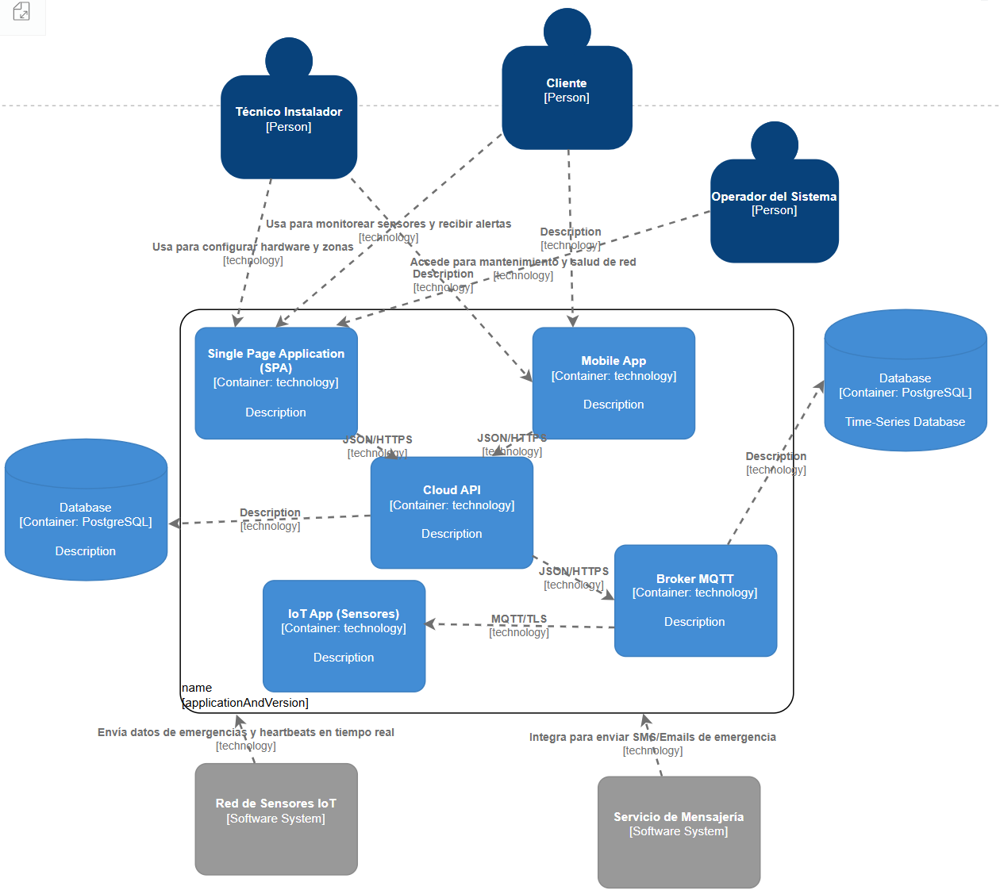

<p align="center">
  <strong>Figura 47. Diagram C4 - ResQ.</strong>
</p>

### 4.1.3.3. Software Architecture Deployment Diagrams.

<p align="justify">
Este diagrama muestra que el sistema se despliega en tres entornos principales: <strong>Microsoft Azure Cloud</strong>, <strong>Dispositivos Cliente</strong> y <strong>Edificios/Zonas Físicas</strong>. En Azure, el sistema utiliza <em>App Service</em> para alojar las aplicaciones web y la Cloud API (Spring Boot/Java o Node.js), <em>Azure Database for PostgreSQL</em> para los datos relacionales, y <em>Azure IoT Hub</em> para gestionar las comunicaciones MQTT de alto rendimiento con los dispositivos físicos. Los usuarios acceden al sistema a través de navegadores web o dispositivos Android/iOS. En cada edificio del cliente, se instalan <strong>Sensores de Emergencia</strong> (ej. detectores de gas/sismo basados en ESP32/Arduino) que envían datos de estado a un <strong>Gateway IoT</strong> local vía WiFi o Serial, el cual transmite esta información al IoT Hub en Azure. Todas las comunicaciones entre componentes utilizan protocolos seguros como HTTPS, MQTT sobre TLS y conexiones cifradas a la base de datos.
</p>

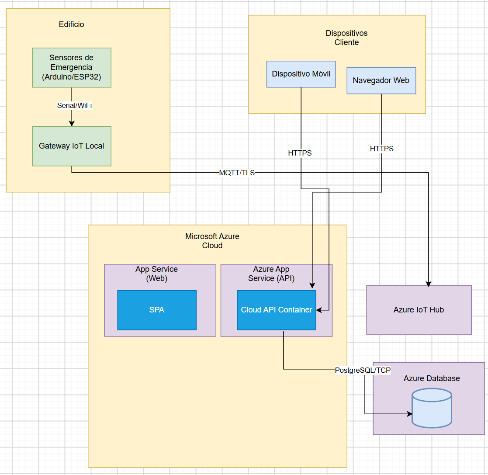

<p align="center">
  <strong>Figura 48. Diagram C4 - ResQ.</strong>
</p>
<p align="justify">
La arquitectura de software de ResQ se representa mediante el modelo C4, con el propósito de describir la solución desde distintos niveles de abstracción y mostrar cómo se distribuyen sus principales responsabilidades.
</p>

<p align="justify">
Estas vistas permiten representar la relación de ResQ con sus usuarios y sistemas externos, así como los principales componentes desplegables que conforman la solución y la forma en que se comunican entre sí.
</p>

<p align="justify">
La arquitectura considera la naturaleza distribuida de ResQ, integrando aplicaciones cliente, servicios Cloud, servicios Edge y componentes IoT que colaboran para soportar las capacidades definidas para la solución.
</p>


## 4.2. Tactical-Level Domain-Driven Design

<p align="justify">
El Tactical-Level Domain-Driven Design se utilizó para definir con mayor detalle la estructura interna de los Bounded Contexts identificados durante el diseño estratégico.
</p>

<p align="justify">
Para cada Bounded Context se modelaron los principales elementos del dominio, sus reglas de negocio, las responsabilidades de las capas de aplicación, interfaz e infraestructura, así como las abstracciones necesarias para persistencia e integración.
</p>

<p align="justify">
Este nivel de diseño permite representar de manera más precisa cómo se implementan las responsabilidades de cada contexto, manteniendo sus límites y evitando que conceptos pertenecientes a otros Bounded Contexts sean incorporados como parte de su propio modelo.
</p>

<p align="justify">
La estructura de cada Bounded Context se documenta mediante sus capas de Domain, Interface, Application e Infrastructure, complementadas con diagramas de componentes, diagramas de clases del dominio y diagramas de diseño de base de datos.
</p>

### 4.2.1. Bounded Context: Identity and Access Management (IAM)

<p align="justify">
El Bounded Context <strong>Identity and Access Management (IAM)</strong> es responsable de gestionar la identidad, la autenticación, la asignación de roles, los permisos y los mecanismos de autorización necesarios para proteger la información y las operaciones disponibles en ResQ.
</p>

<p align="justify">
Este Bounded Context atiende las necesidades de control de acceso de la plataforma, asegurando que solo las identidades autenticadas puedan interactuar con recursos protegidos y que cada operación se ejecute de acuerdo con los permisos asociados a los roles asignados al usuario.
</p>

<p align="justify">
Sus responsabilidades se derivan principalmente de los requisitos relacionados con el acceso autenticado y la autorización basada en roles. En particular, ResQ exige que los usuarios se autentiquen antes de acceder a capacidades protegidas y que las operaciones se restrinjan según los roles y permisos asignados a cada identidad.
</p>

<p align="justify">
El Bounded Context Identity and Access Management soporta principalmente <strong>US26 — Asignar roles y responsabilidades</strong>, <strong>US27 — Acceso autenticado</strong> y la restricción de autorización definida por <strong>TS06 — Proporcionar servicios mediante la API RESTful</strong>.
</p>

<p align="justify">
El Bounded Context IAM no gestiona información del perfil personal, como nombres, números de teléfono, preferencias u otra información específica del usuario. Estas responsabilidades pertenecen al <strong>Bounded Context User</strong>. IAM solo mantiene la información necesaria para identificar, autenticar y autorizar a un usuario.
</p>

<p align="justify">
Asimismo, IAM no gestiona edificios, zonas, dispositivos, mediciones, incidentes, alertas ni reglas de detección de riesgos. Solo proporciona los mecanismos de autenticación y autorización que otros Bounded Contexts pueden utilizar cuando sus operaciones requieren control de acceso.
</p>

<p align="justify">
Las principales responsabilidades de este Bounded Context son:
</p>

- Autenticar una identidad utilizando credenciales válidas.
- Rechazar los intentos de autenticación cuando las credenciales sean inválidas.
- Mantener el estado de una identidad relacionado con la autenticación.
- Asociar identidades con roles dentro de un ámbito organizacional.
- Determinar los permisos otorgados por cada rol.
- Evitar asignaciones de roles duplicadas dentro de la misma organización.
- Verificar si una identidad autenticada está autorizada para realizar una operación protegida.
- Rechazar las operaciones protegidas cuando la identidad autenticada no tenga el permiso requerido.
- Mantener el modelo de dominio de IAM independiente de la información personal gestionada por el Bounded Context User.

<p align="justify">
Los principales conceptos identificados para el Bounded Context Identity and Access Management son <strong>Identity</strong>, <strong>Role</strong>, <strong>Role Assignment</strong>, <strong>Permission</strong>, <strong>Login Identifier</strong>, <strong>Credential Hash</strong> e <strong>Identity Status</strong>.
</p>

#### Diccionario de clases

<p align="justify">
La siguiente tabla resume las principales clases e interfaces que conforman el Bounded Context Identity and Access Management.
</p>

| Clase / Interfaz | Capa | Propósito | Atributos principales | Operaciones principales | Relaciones principales |
|---|---|---|---|---|---|
| `Identity` | Domain | Representa la identidad de autenticación y autorización asociada con un usuario de ResQ. Es el Aggregate Root responsable de mantener el estado de autenticación y las asignaciones de roles. | `identityId: UUID`, `userId: UUID`, `loginIdentifier: LoginIdentifier`, `credentialHash: CredentialHash`, `status: IdentityStatus`, `roleAssignments: Set<RoleAssignment>` | `assignRole(roleId, organizationId)`, `hasRole(roleId, organizationId)`, `roleIdsFor(organizationId)`, `isActive()` | Posee `RoleAssignment`; compone `LoginIdentifier` y `CredentialHash`; utiliza `IdentityStatus`. |
| `Role` | Domain | Representa un rol de autorización con nombre y los permisos otorgados por ese rol. | `roleId: UUID`, `name: String`, `permissions: Set<Permission>` | `grants(permissionCode)`, `getPermissions()` | Compone valores `Permission`. |
| `RoleAssignment` | Domain | Representa la asignación de un rol a una identidad dentro de una organización específica. | `assignmentId: UUID`, `roleId: UUID`, `organizationId: UUID` | `matches(roleId, organizationId)` | Pertenece a `Identity`; referencia `Role` mediante `roleId`; utiliza `organizationId` como referencia externa al ámbito de autorización. |
| `LoginIdentifier` | Domain | Value Object que representa el identificador utilizado por una identidad durante la autenticación. El formato exacto se mantiene independiente del perfil personal gestionado por el Bounded Context User. | `value: String` | `value()` | Compuesto por `Identity`. |
| `CredentialHash` | Domain | Value Object que representa la forma protegida del secreto de autenticación. Las credenciales en texto plano nunca se almacenan en el modelo de dominio. | `value: String` | `value()` | Compuesto por `Identity`. |
| `Permission` | Domain | Value Object que identifica una capacidad requerida para ejecutar una operación protegida. | `code: String` | `code()`, `equals()` | Compuesto por `Role`. |
| `IdentityStatus` | Domain | Enumeración que representa si una identidad puede utilizarse actualmente para la autenticación. | `ACTIVE`, `DISABLED` | — | Utilizada por `Identity`. |
| `IdentityRepository` | Domain | Abstracción de Repository utilizada para recuperar y persistir agregados Identity sin acoplar la Domain Layer a una tecnología de persistencia. | — | `findById(identityId)`, `findByLoginIdentifier(loginIdentifier)`, `save(identity)` | Persiste y recupera agregados `Identity`. |
| `RoleRepository` | Domain | Abstracción de Repository utilizada para recuperar roles y sus permisos asociados. | — | `findById(roleId)`, `findAllByIds(roleIds)` | Recupera agregados `Role`. |
| `AuthorizationService` | Domain | Domain Service responsable de evaluar si los roles asignados a una identidad otorgan un permiso requerido dentro de un ámbito organizacional. | — | `isAuthorized(identity, roles, permissionCode, organizationId)` | Evalúa los datos de `Identity` y `Role` utilizando `permissionCode` y `organizationId`. |
| `AuthenticateCommand` | Application | Representa una solicitud para autenticar una identidad. | `loginIdentifier: String`, `credentialSecret: String` | — | Gestionado por `AuthenticateCommandHandler`. |
| `AuthenticateCommandHandler` | Application | Coordina el caso de uso de autenticación utilizando el modelo de dominio y las abstracciones de infraestructura requeridas. | Dependencias de `IdentityRepository`, `CredentialVerifier`, `AuthenticationSessionProvider` | `handle(command)` | Utiliza `IdentityRepository`, `CredentialVerifier` y `AuthenticationSessionProvider`. |
| `AssignRoleCommand` | Application | Representa una solicitud para asignar un rol válido a una identidad dentro de una organización. | `identityId: UUID`, `roleId: UUID`, `organizationId: UUID` | — | Gestionado por `AssignRoleCommandHandler`. |
| `AssignRoleCommandHandler` | Application | Coordina la asignación de roles y valida las condiciones requeridas antes de modificar el agregado Identity. | Dependencias de `IdentityRepository`, `RoleRepository`, `OrganizationMembershipValidator` | `handle(command)` | Utiliza `IdentityRepository`, `RoleRepository` y `OrganizationMembershipValidator`. |
| `CheckPermissionQuery` | Application | Representa una solicitud de autorización para una identidad, un permiso y una organización. | `identityId: UUID`, `permissionCode: String`, `organizationId: UUID` | — | Gestionada por `CheckPermissionQueryHandler`. |
| `CheckPermissionQueryHandler` | Application | Recupera la identidad y sus roles y delega la decisión de autorización a la Domain Layer. | Dependencias de `IdentityRepository`, `RoleRepository`, `AuthorizationService` | `handle(query)` | Utiliza `IdentityRepository`, `RoleRepository` y `AuthorizationService`. |
| `AuthenticationResult` | Application | Representa el resultado satisfactorio de un proceso de autenticación sin exponer información de las credenciales. | `identityId: UUID`, `sessionToken: String` | — | Devuelto por `AuthenticateCommandHandler`. |
| `CredentialVerifier` | Application | Abstracción utilizada para comparar una credencial recibida durante la autenticación con la representación protegida de la credencial almacenada. | — | `matches(rawCredential, credentialHash)` | Utilizada por `AuthenticateCommandHandler`; implementada por `CredentialHashVerifier`. |
| `AuthenticationSessionProvider` | Application | Abstracción responsable de generar la representación necesaria para mantener una sesión autenticada. | — | `createSession(identityId)` | Utilizada por `AuthenticateCommandHandler`; implementada por `AuthenticationSessionProviderAdapter`. |
| `OrganizationMembershipValidator` | Application | Abstracción utilizada para validar que el usuario objetivo pertenece a la organización en la que se asigna un rol. | — | `belongsToOrganization(userId, organizationId)` | Utilizada por `AssignRoleCommandHandler`; implementada por `OrganizationMembershipAdapter`. |
| `AuthenticationController` | Interface | Recibe solicitudes de autenticación y las delega al Command Handler correspondiente de la Application Layer. | Dependencia de `AuthenticateCommandHandler` | `authenticate(request)` | Delega a `AuthenticateCommandHandler`. |
| `RoleAssignmentController` | Interface | Recibe solicitudes autorizadas de asignación de roles y delega la operación a la Application Layer. | Dependencia de `AssignRoleCommandHandler` | `assignRole(identityId, request)` | Delega a `AssignRoleCommandHandler`. |
| `AuthorizationFilter` | Interface | Intercepta solicitudes protegidas y verifica que la identidad autenticada tenga el permiso requerido por la operación solicitada. | Dependencia de `CheckPermissionQueryHandler` | `authorize(requestContext)` | Delega las verificaciones de autorización a `CheckPermissionQueryHandler`. |
| `IdentityRepositoryAdapter` | Infrastructure | Implementa `IdentityRepository` utilizando el mecanismo de persistencia seleccionado para ResQ Cloud RESTful API. | Dependencia de persistencia | `findById()`, `findByLoginIdentifier()`, `save()` | Implementa `IdentityRepository`. |
| `RoleRepositoryAdapter` | Infrastructure | Implementa `RoleRepository` y reconstruye los roles junto con sus permisos a partir del almacenamiento persistente. | Dependencia de persistencia | `findById()`, `findAllByIds()` | Implementa `RoleRepository`. |
| `CredentialHashVerifier` | Infrastructure | Implementa la verificación de credenciales utilizando el mecanismo de seguridad adoptado por la implementación del backend. | Dependencia de biblioteca de seguridad | `matches()` | Implementa `CredentialVerifier`. |
| `AuthenticationSessionProviderAdapter` | Infrastructure | Implementa la creación de la representación de la sesión autenticada consumida por las aplicaciones cliente. | Dependencia de seguridad/sesión | `createSession()` | Implementa `AuthenticationSessionProvider`. |
| `OrganizationMembershipAdapter` | Infrastructure | Proporciona el mecanismo necesario para verificar la pertenencia a una organización sin transferir a IAM la propiedad de la información del usuario o de la organización. | Dependencia de la fuente responsable de la información sobre pertenencia a una organización | `belongsToOrganization()` | Implementa `OrganizationMembershipValidator`. |

<p align="justify">
Las relaciones entre estas clases preservan los límites del Bounded Context. <code>Identity</code> mantiene únicamente el <code>userId</code> que referencia al usuario asociado con la identidad de autenticación. El perfil de User no se duplica dentro de IAM.
</p>

<p align="justify">
Del mismo modo, <code>RoleAssignment</code> utiliza un <code>organizationId</code> para indicar el ámbito de autorización de la asignación, pero IAM no modela ni administra la organización en sí.
</p>

---

#### 4.2.1.1. Domain Layer

<p align="justify">
La <strong>Domain Layer</strong> contiene los conceptos, reglas y abstracciones de negocio que definen la gestión de identidad y acceso dentro de ResQ. Esta capa no depende de HTTP, motores de bases de datos, bibliotecas de seguridad ni frameworks de aplicación.
</p>

<p align="justify">
El principal Aggregate Root es <code>Identity</code>.
</p>

<p align="justify">
Una <code>Identity</code> representa la identidad de seguridad asociada con un usuario de ResQ. Contiene la información mínima necesaria para autenticar al usuario y determinar los roles asignados a esa identidad.
</p>

<p align="justify">
El atributo <code>userId</code> actúa únicamente como referencia externa al usuario representado en el Bounded Context User. La información personal se excluye deliberadamente del modelo de dominio de IAM.
</p>

<p align="justify">
<code>Identity</code> posee su colección de objetos <code>RoleAssignment</code>. Una asignación de rol establece que la identidad tiene un rol específico dentro de una organización.
</p>

<p align="justify">
El Aggregate Root <code>Identity</code> es responsable de proteger la consistencia de estas asignaciones. En particular, no debe asignarse el mismo rol más de una vez a la misma identidad dentro de la misma organización.
</p>

##### Identity

<p align="justify">
<strong>Categoría:</strong> Aggregate Root / Entity.
</p>

<p align="justify">
<strong>Propósito:</strong> Representar la identidad de seguridad utilizada para autenticar a un usuario de ResQ y mantener las asignaciones de roles asociadas con esa identidad.
</p>

**Atributos:**

- `identityId: UUID` — Identificador único de la identidad.
- `userId: UUID` — Referencia externa al usuario correspondiente.
- `loginIdentifier: LoginIdentifier` — Identificador utilizado durante la autenticación.
- `credentialHash: CredentialHash` — Representación protegida de la credencial de autenticación.
- `status: IdentityStatus` — Estado actual de autenticación de la identidad.
- `roleAssignments: Set<RoleAssignment>` — Roles asignados a la identidad en diferentes organizaciones.

**Operaciones:**

- `assignRole(roleId, organizationId)` — Añade una asignación de rol válida evitando duplicaciones.
- `hasRole(roleId, organizationId)` — Indica si la identidad ya tiene el rol especificado dentro de la organización.
- `roleIdsFor(organizationId)` — Obtiene los identificadores de los roles que se aplican a un ámbito organizacional.
- `isActive()` — Indica si la identidad está habilitada para la autenticación.

##### Role

<p align="justify">
<strong>Categoría:</strong> Aggregate Root / Entity.
</p>

<p align="justify">
<strong>Propósito:</strong> Representar un rol de autorización que contiene los permisos que habilitan operaciones protegidas específicas.
</p>

**Atributos:**

- `roleId: UUID`
- `name: String`
- `permissions: Set<Permission>`

**Operaciones:**

- `grants(permissionCode)` — Indica si el rol contiene el permiso solicitado.
- `getPermissions()` — Devuelve los permisos asociados con el rol.

<p align="justify">
El alcance actual requiere la asignación y evaluación de roles válidos. La creación o modificación administrativa de roles no se incluye como caso de uso porque ninguna User Story actual requiere esa capacidad.
</p>

##### RoleAssignment

<p align="justify">
<strong>Categoría:</strong> Entity perteneciente a <code>Identity</code>.
</p>

<p align="justify">
<strong>Propósito:</strong> Representar la asociación entre una identidad, un rol y la organización en la que se aplica el rol.
</p>

**Atributos:**

- `assignmentId: UUID`
- `roleId: UUID`
- `organizationId: UUID`

**Operaciones:**

- `matches(roleId, organizationId)` — Determina si la asignación corresponde a un rol y una organización específicos.

<p align="justify">
<code>organizationId</code> se trata como referencia externa. IAM no posee el ciclo de vida de la organización.
</p>

##### LoginIdentifier

<p align="justify">
<strong>Categoría:</strong> Value Object.
</p>

<p align="justify">
<strong>Propósito:</strong> Encapsular el identificador presentado durante la autenticación.
</p>

**Atributo:**

- `value: String`

<p align="justify">
El valor se mantiene independiente del perfil de User porque la identidad de autenticación y la información del perfil personal corresponden a responsabilidades diferentes.
</p>

##### CredentialHash

<p align="justify">
<strong>Categoría:</strong> Value Object.
</p>

<p align="justify">
<strong>Propósito:</strong> Representar la forma protegida de una credencial de autenticación.
</p>

**Atributo:**

- `value: String`

<p align="justify">
Las credenciales en texto plano nunca deben persistirse como parte del estado del dominio.
</p>

##### Permission

<p align="justify">
<strong>Categoría:</strong> Value Object.
</p>

<p align="justify">
<strong>Propósito:</strong> Representar una capacidad de autorización requerida para ejecutar una operación protegida.
</p>

**Atributo:**

- `code: String`

<p align="justify">
Los permisos se asocian con los roles. Por lo tanto, la autorización se determina a partir de los permisos otorgados por los roles asignados a la identidad.
</p>

##### IdentityStatus

<p align="justify">
<strong>Categoría:</strong> Enumeración.
</p>

**Valores:**

- `ACTIVE`
- `DISABLED`

<p align="justify">
Solo una identidad activa puede completar satisfactoriamente el proceso de autenticación.
</p>

##### IdentityRepository

<p align="justify">
<strong>Categoría:</strong> Repository Interface.
</p>

<p align="justify">
<strong>Propósito:</strong> Definir las operaciones de persistencia requeridas por la Domain Layer y la Application Layer sin depender de una tecnología específica de base de datos.
</p>

**Operaciones:**

- `findById(identityId)`
- `findByLoginIdentifier(loginIdentifier)`
- `save(identity)`

##### RoleRepository

<p align="justify">
<strong>Categoría:</strong> Repository Interface.
</p>

<p align="justify">
<strong>Propósito:</strong> Recuperar los roles y permisos requeridos durante la asignación de roles y la autorización.
</p>

**Operaciones:**

- `findById(roleId)`
- `findAllByIds(roleIds)`

##### AuthorizationService

<p align="justify">
<strong>Categoría:</strong> Domain Service.
</p>

<p align="justify">
<strong>Propósito:</strong> Evaluar la autorización cuando la decisión requiere información de la identidad y de uno o más roles.
</p>

**Operación:**

- `isAuthorized(identity, roles, permissionCode, organizationId)`

<p align="justify">
El servicio considera únicamente los roles asignados a la identidad dentro de la organización asociada con la operación protegida.
</p>

##### Reglas de negocio

<p align="justify">
El dominio de Identity and Access Management aplica las siguientes reglas de negocio:
</p>

1. Una identidad debe existir antes de poder autenticarse.

2. Solo una identidad con estado `ACTIVE` puede completar satisfactoriamente la autenticación.

3. La autenticación tiene éxito únicamente cuando la credencial proporcionada por el usuario corresponde a la representación protegida de la credencial almacenada para la identidad.

4. Las credenciales inválidas no deben establecer una sesión autenticada.

5. Solo puede asignarse un rol cuando tanto la identidad como el rol son válidos.

6. Antes de asignar un rol en una organización, el usuario asociado debe pertenecer a esa organización.

7. No puede asignarse el mismo rol más de una vez a la misma identidad dentro de la misma organización.

8. Una asignación de rol es válida únicamente para el ámbito organizacional asociado con la asignación.

9. Una operación protegida se autoriza únicamente cuando al menos un rol asignado a la identidad en la organización correspondiente otorga el permiso requerido.

10. Cuando no se dispone del permiso requerido, debe rechazarse la operación protegida.

<p align="justify">
Estas reglas permiten que el Bounded Context IAM implemente el acceso autenticado y basado en roles, manteniendo la información sobre perfiles de usuario, edificios, dispositivos, monitoreo, incidentes y gestión de riesgos fuera de los límites de su dominio.
</p>

---

#### 4.2.1.2. Interface Layer

<p align="justify">
La <strong>Interface Layer</strong> expone las capacidades del Bounded Context Identity and Access Management a los clientes y a otras partes de la plataforma ResQ.
</p>

<p align="justify">
Su responsabilidad es recibir solicitudes, validar su representación básica, convertirlas en Commands o Queries de la Application Layer y convertir las respuestas resultantes en la representación esperada por el cliente.
</p>

<p align="justify">
Las reglas de negocio no se implementan en esta capa.
</p>

<p align="justify">
Los principales componentes son <code>AuthenticationController</code>, <code>RoleAssignmentController</code> y <code>AuthorizationFilter</code>.
</p>

##### AuthenticationController

<p align="justify">
<code>AuthenticationController</code> recibe solicitudes de autenticación de las aplicaciones cliente de ResQ.
</p>

<p align="justify">
Su principal responsabilidad es construir un <code>AuthenticateCommand</code> utilizando los datos de autenticación recibidos del cliente y delegar su ejecución a <code>AuthenticateCommandHandler</code>.
</p>

<p align="justify">
El controlador no compara directamente las credenciales ni consulta la base de datos.
</p>

<p align="justify">
Conceptualmente, la interacción RESTful representa la creación de una sesión autenticada.
</p>

Recurso de ejemplo:

```text
POST /api/v1/auth/sessions
```

<p align="justify">
La solicitud contiene el identificador de inicio de sesión y la credencial de autenticación.
</p>

<p align="justify">
Una respuesta satisfactoria representa la identidad autenticada y la información de sesión generada por la plataforma.
</p>

<p align="justify">
Las credenciales inválidas se devuelven como un fallo de autenticación sin revelar si una credencial específica o un registro interno causó el fallo.
</p>

##### RoleAssignmentController

<p align="justify">
<code>RoleAssignmentController</code> recibe solicitudes para asociar un rol válido con una identidad dentro de una organización.
</p>

<p align="justify">
Conceptualmente, la operación se representa como la creación de un recurso de asignación de rol.
</p>

Recurso de ejemplo:

```text
POST /api/v1/iam/identities/{identityId}/role-assignments
```

<p align="justify">
La solicitud identifica:
</p>

- el rol que se debe asignar;
- la organización en la que debe aplicarse el rol.

<p align="justify">
El controlador delega la operación a <code>AssignRoleCommandHandler</code>.
</p>

<p align="justify">
El propio endpoint es una operación protegida y, por lo tanto, solo puede ejecutarse cuando quien realiza la solicitud está autenticado y tiene el permiso requerido para asignar roles.
</p>

##### AuthorizationFilter

<p align="justify">
<code>AuthorizationFilter</code> protege las operaciones de la API RESTful que requieren una identidad autenticada y autorizada.
</p>

<p align="justify">
Antes de que una solicitud protegida llegue a su controlador correspondiente, el filtro identifica:
</p>

- la identidad autenticada;
- la organización asociada con la solicitud;
- el permiso requerido por la operación protegida.

<p align="justify">
Luego crea una <code>CheckPermissionQuery</code> y delega la decisión de autorización a <code>CheckPermissionQueryHandler</code>.
</p>

<p align="justify">
Si el resultado indica que no se dispone del permiso requerido, la solicitud se rechaza antes de ejecutar la operación protegida.
</p>

<p align="justify">
Este comportamiento atiende el requisito de que las solicitudes no autorizadas no deben ejecutar operaciones protegidas.
</p>

#### 4.2.1.3. Application Layer

<p align="justify">
La Application Layer coordina los casos de uso soportados por IAM.
</p>

<p align="justify">
Esta capa orquesta objetos de dominio, repositorios y abstracciones externas, pero no contiene detalles de implementación de persistencia o criptografía específicos de la infraestructura.
</p>

<p align="justify">
Se consideran tres flujos principales de aplicación:
</p>

- Autenticación.
- Asignación de roles.
- Verificación de autorización.

##### AuthenticateCommand

<p align="justify">
<code>AuthenticateCommand</code> representa un intento de autenticación.
</p>

**Atributos:**

- `loginIdentifier: String`
- `credentialSecret: String`

<p align="justify">
La credencial en texto plano existe únicamente durante la solicitud de autenticación y nunca se almacena como parte del estado del dominio.
</p>

##### AuthenticateCommandHandler

<p align="justify">
<code>AuthenticateCommandHandler</code> coordina el proceso de autenticación.
</p>

<p align="justify">
El manejador realiza la siguiente secuencia:
</p>

1. Recibe un `AuthenticateCommand`.
2. Construye o valida el `LoginIdentifier` correspondiente.
3. Utiliza `IdentityRepository` para localizar la identidad asociada con el identificador de inicio de sesión.
4. Verifica que la identidad exista.
5. Verifica que la identidad esté activa.
6. Delega la comparación de credenciales a `CredentialVerifier`.
7. Rechaza la operación si la credencial es inválida.
8. Solicita la creación de una sesión autenticada mediante `AuthenticationSessionProvider`.
9. Devuelve un `AuthenticationResult`.

<p align="justify">
El manejador no conoce qué algoritmo de hash, formato de sesión o biblioteca de seguridad del backend se utiliza.
</p>

##### AuthenticationResult

<p align="justify">
<code>AuthenticationResult</code> representa el resultado de un proceso de autenticación satisfactorio.
</p>

**Atributos:**

- `identityId: UUID`
- `sessionToken: String`

<p align="justify">
<code>sessionToken</code> representa una credencial de sesión opaca desde el punto de vista de la Application Layer. Su implementación concreta depende del mecanismo de seguridad seleccionado para el backend.
</p>

##### AssignRoleCommand

<p align="justify">
<code>AssignRoleCommand</code> representa la asignación de un rol a una identidad en una organización específica.
</p>

**Atributos:**

- `identityId: UUID`
- `roleId: UUID`
- `organizationId: UUID`

##### AssignRoleCommandHandler

<p align="justify">
<code>AssignRoleCommandHandler</code> coordina el caso de uso de asignación de roles.
</p>

<p align="justify">
Su flujo de ejecución es:
</p>

1. Recibir el `AssignRoleCommand`.
2. Recuperar la `Identity` objetivo desde `IdentityRepository`.
3. Recuperar el `Role` solicitado desde `RoleRepository`.
4. Verificar mediante `OrganizationMembershipValidator` que el usuario referenciado por la identidad pertenezca a la organización especificada.
5. Verificar mediante el Aggregate Root `Identity` que la misma asignación de rol no exista previamente.
6. Invocar `Identity.assignRole(roleId, organizationId)`.
7. Persistir el agregado modificado mediante `IdentityRepository`.

<p align="justify">
La autorización del usuario que solicita esta operación se realiza antes de ejecutar la operación protegida mediante el mecanismo de autorización de IAM.
</p>

##### CheckPermissionQuery

<p align="justify">
<code>CheckPermissionQuery</code> representa una solicitud para determinar si una identidad puede ejecutar una operación protegida.
</p>

**Atributos:**

- `identityId: UUID`
- `permissionCode: String`
- `organizationId: UUID`

##### CheckPermissionQueryHandler

<p align="justify">
<code>CheckPermissionQueryHandler</code> coordina la verificación de autorización.
</p>

<p align="justify">
Su flujo de ejecución es:
</p>

1. Recuperar la `Identity`.
2. Rechazar la autorización cuando la identidad no exista o esté inactiva.
3. Obtener los identificadores de los roles asignados a la identidad dentro de la organización solicitada.
4. Recuperar los agregados `Role` correspondientes.
5. Delegar la evaluación a `AuthorizationService`.
6. Devolver si se otorga el permiso requerido.

<p align="justify">
Este diseño centraliza la evaluación de autorización e impide que cada Bounded Context protegido vuelva a implementar las reglas de IAM de manera independiente.
</p>

##### CredentialVerifier

<p align="justify">
<code>CredentialVerifier</code> es una abstracción de la Application Layer que evita que los casos de uso de autenticación dependan directamente de un framework criptográfico o de seguridad.
</p>

**Operación:**

- `matches(rawCredential, credentialHash)`

##### AuthenticationSessionProvider

<p align="justify">
<code>AuthenticationSessionProvider</code> es responsable de abstraer la creación de sesiones.
</p>

**Operación:**

- `createSession(identityId)`

<p align="justify">
La representación exacta de la sesión es un aspecto de implementación de la Infrastructure Layer.
</p>

##### OrganizationMembershipValidator

<p align="justify">
<code>OrganizationMembershipValidator</code> representa la dependencia requerida para verificar el criterio de aceptación según el cual solo puede asignarse un rol a un usuario que pertenezca a la organización correspondiente.
</p>

**Operación:**

- `belongsToOrganization(userId, organizationId)`

<p align="justify">
Esta validación no convierte al Bounded Context IAM en responsable de gestionar organizaciones o perfiles de usuario. Solo consume la información mínima necesaria para proteger la invariante de asignación de roles.
</p>

#### 4.2.1.4. Infrastructure Layer

<p align="justify">
La Infrastructure Layer contiene las implementaciones técnicas requeridas por el Bounded Context Identity and Access Management.
</p>

<p align="justify">
Implementa las abstracciones de repositorios y servicios definidas por la Domain Layer y la Application Layer y encapsula los detalles de persistencia, seguridad de credenciales, generación de sesiones autenticadas e integración.
</p>

<p align="justify">
Los principales componentes de infraestructura son IdentityRepositoryAdapter, RoleRepositoryAdapter, CredentialHashVerifier, AuthenticationSessionProviderAdapter y OrganizationMembershipAdapter.
</p>

##### IdentityRepositoryAdapter

<p align="justify">
<code>IdentityRepositoryAdapter</code> implementa la interfaz <code>IdentityRepository</code>.
</p>

<p align="justify">
Sus responsabilidades son:
</p>

- recuperar una `Identity` utilizando su identificador;
- recuperar una `Identity` utilizando su identificador de inicio de sesión;
- reconstruir el Aggregate `Identity` a partir de los datos persistidos;
- persistir las modificaciones de `Identity` y sus Role Assignments.

<p align="justify">
Por lo tanto, la Domain Layer es independiente de la tecnología de base de datos seleccionada para el backend de ResQ.
</p>

##### RoleRepositoryAdapter

<p align="justify">
<code>RoleRepositoryAdapter</code> implementa <code>RoleRepository</code>.
</p>

<p align="justify">
Recupera:
</p>

- la información de los roles;
- los permisos asociados con un rol;
- los múltiples roles requeridos durante la evaluación de autorización.

<p align="justify">
El adaptador reconstruye la representación de dominio de Role antes de devolverla a la Application Layer.
</p>

##### CredentialHashVerifier

<p align="justify">
<code>CredentialHashVerifier</code> implementa <code>CredentialVerifier</code>.
</p>

<p align="justify">
Su responsabilidad es comparar la credencial recibida durante la autenticación con la representación protegida de la credencial asociada con la identidad.
</p>

<p align="justify">
La comparación debe implementarse mediante el mecanismo de seguridad seleccionado para el backend.
</p>

<p align="justify">
Las credenciales de autenticación en texto plano no se persisten.
</p>

##### AuthenticationSessionProviderAdapter

<p align="justify">
<code>AuthenticationSessionProviderAdapter</code> implementa <code>AuthenticationSessionProvider</code>.
</p>

<p align="justify">
Su responsabilidad es generar la representación de sesión que permitirá que las solicitudes posteriores identifiquen una identidad autenticada.
</p>

<p align="justify">
La tecnología concreta de token o sesión permanece encapsulada en la Infrastructure Layer y no se expone como dependencia de la Domain Layer.
</p>

##### OrganizationMembershipAdapter

<p align="justify">
<code>OrganizationMembershipAdapter</code> implementa <code>OrganizationMembershipValidator</code>.
</p>

<p align="justify">
Obtiene la información mínima necesaria para determinar si el usuario asociado con una identidad pertenece a la organización en la que se solicita una asignación de rol.
</p>

<p align="justify">
IAM no persiste ni modifica el perfil completo del usuario ni el modelo de la organización.
</p>

<p align="justify">
El mecanismo final de comunicación utilizado por este adaptador debe mantener la consistencia con el Context Mapping definido para ResQ.
</p>

##### Consideraciones de persistencia

<p align="justify">
El modelo de persistencia de IAM debe mantener la integridad referencial entre los objetos que pertenecen a IAM, evitando la propiedad directa de objetos pertenecientes a otros Bounded Contexts.
</p>

<p align="justify">
Por esa razón:
</p>

- `user_id` se almacena como identificador externo y no se utiliza para reproducir el agregado User dentro de IAM.
- `organization_id` se almacena como identificador externo del ámbito de autorización.
- las relaciones entre identidades, roles, permisos y asignaciones de roles se gestionan internamente en IAM.
- las credenciales se almacenan únicamente en su representación protegida.
- las asignaciones de roles duplicadas para la misma identidad, rol y organización deben evitarse mediante una invariante de dominio y una restricción de unicidad en la persistencia.

#### 4.2.1.5. Bounded Context Software Architecture Component Level Diagrams

<p align="justify">
El Component Level Diagram del Bounded Context Identity and Access Management presenta los componentes internos que colaboran dentro del contenedor ResQ Cloud RESTful API para proporcionar capacidades de autenticación y autorización.
</p>

<p align="justify">
El diagrama debe representar los siguientes componentes principales:
</p>

- Authentication Interface Component, responsable de recibir solicitudes de autenticación.
- Role Assignment Interface Component, responsable de recibir solicitudes de asignación de roles.
- Authorization Interface Component, responsable de proteger las operaciones que requieren autorización.
- IAM Application Component, que contiene los casos de uso de autenticación, asignación de roles y autorización.
- IAM Domain Component, que contiene Identity, Role, Permission, Role Assignment y las reglas de negocio de autorización.
- IAM Persistence Component, que implementa repositorios para identidades, roles, permisos y asignaciones de roles.
- Credential Security Component, responsable de verificar las credenciales.
- Authentication Session Component, responsable de generar la representación de la sesión autenticada.
- Organization Membership Integration Component, responsable de obtener la información externa mínima necesaria para validar la pertenencia a una organización.

<p align="justify">
El flujo principal de interacción representado en el diagrama es:
</p>

```text
Client Application
        |
        v
IAM Interface Components
        |
        v
IAM Application Component
        |
        v
IAM Domain Component
        |
        +----------------------+
        |                      |
        v                      v
Persistence Component   Infrastructure Security/
                        Integration Components
        |
        v
IAM Persistence Storage
```

<p align="justify">
Las solicitudes de autenticación ingresan mediante Authentication Interface Component y son coordinadas por la Application Layer. La verificación de credenciales se delega a la Infrastructure Layer, mientras que el Aggregate Identity sigue siendo responsable de su estado de autenticación.
</p>

<p align="justify">
Las operaciones protegidas pasan por Authorization Interface Component. La Application Layer recupera la identidad y los roles involucrados, mientras que la Domain Layer evalúa si se otorga el permiso correspondiente.
</p>

<p align="justify">
Las solicitudes de asignación de roles también se procesan mediante la Application Layer y deben satisfacer tanto las reglas de autorización como la restricción de pertenencia a una organización antes de modificar el Aggregate Identity.
</p>

**DIAGRAMA — IAM Component Level Diagram**

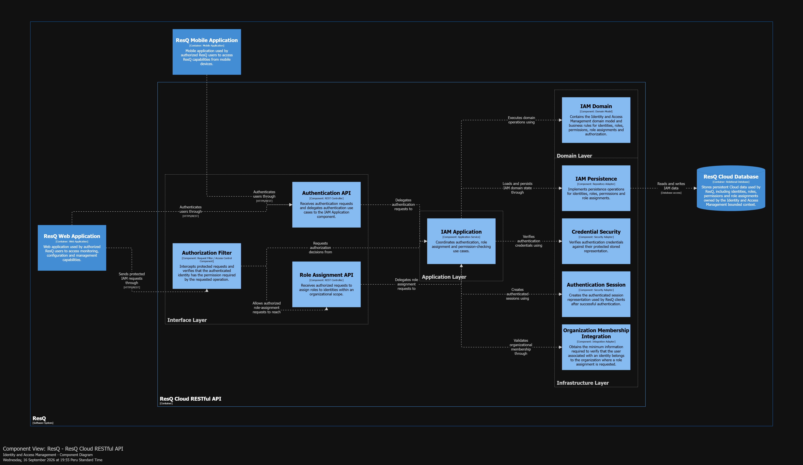

<p align="center">
  <strong>Figura 49. Identity and Access Management Component Level Diagram.</strong>
</p>

#### 4.2.1.6. Bounded Context Software Architecture Code Level Diagrams

<p align="justify">
Los Code Level Diagrams proporcionan una representación detallada de la estructura orientada a la implementación del Bounded Context Identity and Access Management.
</p>

<p align="justify">
Para IAM, este nivel se representa mediante dos diagramas complementarios:
</p>

- Domain Layer Class Diagram, que representa las clases, interfaces, enumeraciones, métodos, atributos, relaciones, direcciones y multiplicidades que conforman el modelo de dominio.
- Database Design Diagram, que representa las estructuras de persistencia requeridas para almacenar identidades, roles, permisos y asignaciones de roles.

<p align="justify">
Los dos diagramas representan perspectivas diferentes del mismo Bounded Context. El diagrama de clases describe el modelo de dominio orientado a objetos, mientras que el diagrama de base de datos describe cómo se almacena el estado persistente requerido por ese modelo.
</p>

##### 4.2.1.6.1. Bounded Context Domain Layer Class Diagrams

<p align="justify">
El Domain Layer Class Diagram representa la estructura orientada a la implementación del modelo de dominio de IAM.
</p>

<p align="justify">
El diagrama debe incluir los siguientes elementos:
</p>

**Aggregate Roots y Entities**

- `Identity`
- `Role`
- `RoleAssignment`

**Value Objects**

- `LoginIdentifier`
- `CredentialHash`
- `Permission`

**Enumeración**

- `IdentityStatus`

**Repository Interfaces**

- `IdentityRepository`
- `RoleRepository`

**Domain Service**

- `AuthorizationService`

<p align="justify">
Las principales relaciones que deben representarse son:
</p>

- `Identity` se asocia con exactamente un `LoginIdentifier`.
- `Identity` se asocia con exactamente un `CredentialHash`.
- `Identity` tiene exactamente un `IdentityStatus`.
- `Identity` contiene cero o más entidades `RoleAssignment`.
- Cada `RoleAssignment` referencia un `Role` mediante `roleId`.
- Cada `RoleAssignment` se aplica a una organización mediante `organizationId`.
- `Role` contiene cero o más Value Objects `Permission`.
- `IdentityRepository` gestiona la persistencia de `Identity`.
- `RoleRepository` recupera agregados `Role`.
- `AuthorizationService` evalúa los datos de `Identity` y `Role` utilizando `permissionCode` y `organizationId`; no depende directamente de `Permission`.

<p align="justify">
El diagrama de clases debe mostrar la visibilidad de los atributos y operaciones utilizando las convenciones UML:
</p>

- `+` para público.
- `-` para privado.
- `#` para protegido.

<p align="justify">
También debe indicar la dirección y multiplicidad de las relaciones cuando corresponda.
</p>

<p align="justify">
Una referencia conceptual de multiplicidad para el diagrama final es:
</p>

```text
Identity "1" *-- "0..*" RoleAssignment
Identity "1" *-- "1" LoginIdentifier
Identity "1" *-- "1" CredentialHash
Identity "1" --> "1" IdentityStatus

Role "1" *-- "0..*" Permission

RoleAssignment ..> Role : references by roleId
```

<p align="justify">
organizationId y userId se representan como identificadores externos en lugar de relaciones entre objetos con agregados pertenecientes a otros Bounded Contexts.
</p>

**DIAGRAMA — IAM Domain Layer Class Diagram**

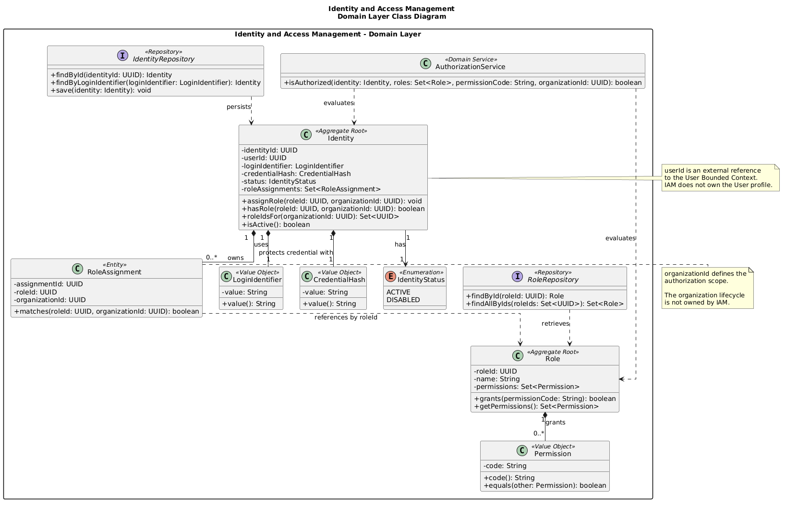

<p align="center">
  <strong>Figura 50. Identity and Access Management Domain Layer Class Diagram.</strong>
</p>

##### 4.2.1.6.2. Bounded Context Database Design Diagram

<p align="justify">
El Database Design de Identity and Access Management persiste únicamente la información que pertenece a IAM.
</p>

<p align="justify">
El modelo lógico de persistencia propuesto contiene las siguientes tablas:
</p>

###### `iam_identities`

<p align="justify">
Almacena la identidad de autenticación asociada con un usuario de ResQ.
</p>

| Columna | Tipo | Restricción | Descripción |
|---|---|---|---|
| `identity_id` | UUID | PRIMARY KEY | Identificador único de la identidad de IAM. |
| `user_id` | UUID | NOT NULL, UNIQUE | Referencia externa al usuario correspondiente. |
| `login_identifier` | VARCHAR | NOT NULL, UNIQUE | Identificador utilizado durante la autenticación. |
| `credential_hash` | VARCHAR | NOT NULL | Representación protegida de la credencial de autenticación. |
| `status` | VARCHAR | NOT NULL | Estado actual de la identidad. |

<p align="justify">
La tabla no almacena nombres, números de teléfono, preferencias ni otra información del perfil de User.
</p>

###### `iam_roles`

<p align="justify">
Almacena los roles disponibles para la autorización de IAM.
</p>

| Columna | Tipo | Restricción | Descripción |
|---|---|---|---|
| `role_id` | UUID | PRIMARY KEY | Identificador único del rol. |
| `name` | VARCHAR | NOT NULL, UNIQUE | Nombre del rol. |

<p align="justify">
El diseño actual requiere que los roles existan y puedan asignarse, pero no define una User Story para la creación o administración de roles.
</p>

###### `iam_permissions`

<p align="justify">
Almacena los permisos de autorización utilizados para proteger las operaciones de ResQ.
</p>

| Columna | Tipo | Restricción | Descripción |
|---|---|---|---|
| `code` | VARCHAR(150) | PRIMARY KEY | Código estable de permiso utilizado por las reglas de autorización y que constituye la identidad del valor Permission persistido. |

###### `iam_role_permissions`

<p align="justify">
Representa la relación de muchos a muchos entre roles y permisos.
</p>

| Columna | Tipo | Restricción | Descripción |
|---|---|---|---|
| `role_id` | UUID | PRIMARY KEY, FOREIGN KEY | Referencia `iam_roles.role_id`. |
| `permission_code` | VARCHAR(150) | PRIMARY KEY, FOREIGN KEY | Referencia `iam_permissions.code`. |

<p align="justify">
La clave primaria compuesta <code>(role_id, permission_code)</code> impide que el mismo permiso se asocie con el mismo rol más de una vez. Las claves foráneas conectan <code>role_id</code> con <code>iam_roles.role_id</code> y <code>permission_code</code> con <code>iam_permissions.code</code>.
</p>

###### `iam_role_assignments`

<p align="justify">
Almacena las asignaciones de roles realizadas a identidades dentro de una organización.
</p>

| Columna | Tipo | Restricción | Descripción |
|---|---|---|---|
| `assignment_id` | UUID | PRIMARY KEY | Identificador único de la asignación. |
| `identity_id` | UUID | NOT NULL, FOREIGN KEY | Referencia `iam_identities.identity_id`. |
| `role_id` | UUID | NOT NULL, FOREIGN KEY | Referencia `iam_roles.role_id`. |
| `organization_id` | UUID | NOT NULL | Identificador externo de la organización en la que se aplica el rol. |

<p align="justify">
Debe definirse una restricción de unicidad sobre:
</p>

`(identity_id, role_id, organization_id)`

<p align="justify">
Esta restricción complementa la invariante de dominio que impide asignaciones de roles duplicadas para la misma identidad dentro de la misma organización.
</p>

<p align="justify">
Las relaciones internas de la base de datos son:
</p>

```text
iam_identities
      |
      | 1
      |
      | 0..*
      v
iam_role_assignments
      |
      | *               *
      +-------> iam_roles --------+
                    |              |
                    | *            | *
                    |              |
                    v              |
             iam_role_permissions |
             (role_id,             |
              permission_code)     |
                    |              |
                    | *            |
                    v              |
             iam_permissions <-----+
             (code PK)
```

<p align="justify">
user_id y organization_id se tratan intencionalmente como referencias externas en lugar de claves foráneas a tablas pertenecientes a otros Bounded Contexts. Esto evita acoplar el modelo de persistencia de IAM directamente con la representación interna de la base de datos de otros contextos de dominio.
</p>

<p align="justify">
El Database Design Diagram final debe identificar:
</p>

- las tablas;
- las columnas;
- las claves primarias;
- las claves foráneas;
- las restricciones de unicidad;
- las cardinalidades;
- las relaciones entre las tablas de IAM.

**DIAGRAMA — IAM Database Design Diagram**

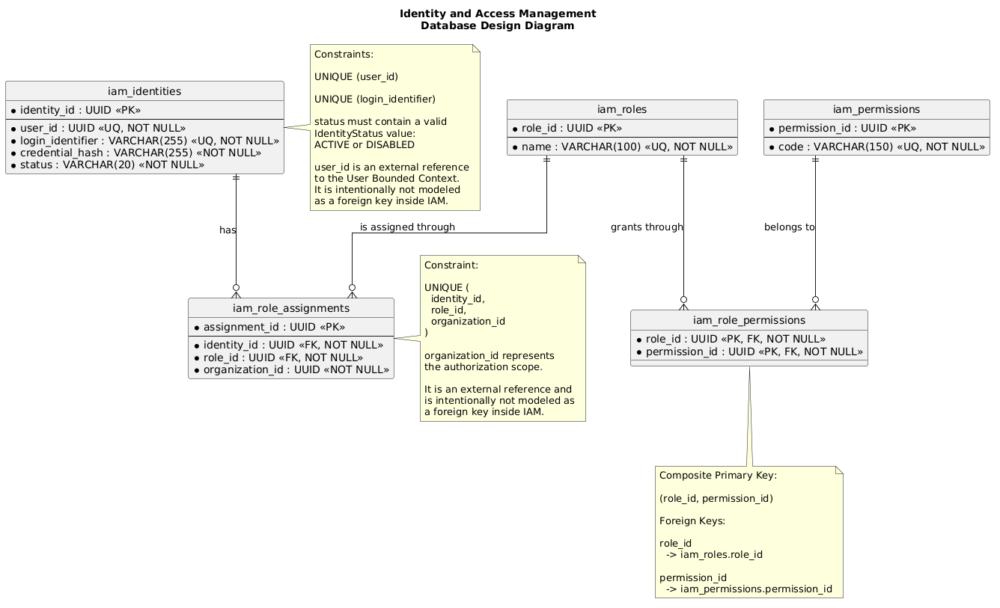

<p align="center">
  <strong>Figura 51. Identity and Access Management Database Design Diagram.</strong>
</p>

### 4.2.2. Bounded Context: Risk Detection

<p align="justify">
El Bounded Context <strong>Risk Detection</strong> es responsable de evaluar la información monitoreada mediante las reglas de detección configuradas para identificar situaciones de riesgo, determinar su tipo y severidad, preservar la evidencia que originó cada detección y mantener el contexto de ubicación necesario para comprender dónde ocurrió la condición detectada.
</p>

<p align="justify">
Este Bounded Context representa el conocimiento de dominio involucrado en transformar mediciones monitoreadas válidas en detecciones de riesgo significativas. No posee los sensores físicos que producen las mediciones, los dispositivos asociados con esos sensores, los edificios y zonas en los que se instalan los dispositivos ni las alertas y respuestas ejecutadas después de detectar un riesgo.
</p>

<p align="justify">
El Bounded Context Risk Detection soporta principalmente <strong>US06 — Conocer el tipo de riesgo detectado</strong>, <strong>US07 — Conocer el nivel de riesgo</strong>, <strong>US08 — Conocer la ubicación del riesgo</strong>, <strong>US09 — Consultar el contexto de detección</strong>, <strong>US24 — Configurar una condición de detección</strong>, <strong>US28 — Mantener funciones críticas sin Internet</strong> y <strong>TS03 — Procesar reglas de detección localmente</strong>.
</p>

<p align="justify">
Risk Detection consume mediciones válidas producidas por el flujo de monitoreo y las evalúa utilizando reglas de detección activas. Cuando se satisface una condición, el Bounded Context crea o actualiza una detección de riesgo y genera la información necesaria para que el resto de la plataforma ResQ continúe el flujo de gestión de emergencias.
</p>

<p align="justify">
Un requisito arquitectónico central de este Bounded Context es que la detección crítica debe permanecer disponible incluso cuando se interrumpe la conectividad a Internet con los servicios Cloud. Por esa razón, las reglas de detección activas requeridas para la operación crítica también deben estar disponibles en el entorno Edge, donde las mediciones pueden evaluarse localmente.
</p>

<p align="justify">
Por lo tanto, el Bounded Context participa en dos entornos principales de ejecución:
</p>

- **ResQ Cloud RESTful API**, donde los usuarios autorizados configuran reglas de detección y consultan detecciones de riesgo persistidas y sus evidencias.
- **ResQ Edge Service**, donde las reglas de detección activas están disponibles localmente y las mediciones entrantes pueden evaluarse sin depender permanentemente de la conectividad con Cloud.

<p align="justify">
Risk Detection no genera notificaciones para los usuarios, no ejecuta comandos de actuadores, no gestiona el ciclo de vida de los incidentes ni posee las colas de recuperación de conectividad. Estas responsabilidades pertenecen a otros Bounded Contexts, como Alert & Response Management, Incident y Connectivity.
</p>

<p align="justify">
Asimismo, Risk Detection no reproduce los modelos completos de Measurement, Device, Building o Zone. Solo mantiene las referencias externas y la evidencia necesarias para justificar una decisión de detección de riesgo.
</p>

<p align="justify">
Los principales conceptos identificados para el Bounded Context Risk Detection son <strong>Detection Rule</strong>, <strong>Detection Condition</strong>, <strong>Risk Detection</strong>, <strong>Detection Evidence</strong>, <strong>Risk Location</strong>, <strong>Risk Type</strong>, <strong>Severity Level</strong> y <strong>Severity Change</strong>.
</p>

#### Diccionario de clases

<p align="justify">
La siguiente tabla resume las principales clases e interfaces identificadas para el Bounded Context Risk Detection.
</p>

| Clase / Interfaz | Capa | Entorno de ejecución | Propósito | Atributos principales | Operaciones principales | Relaciones principales |
|---|---|---|---|---|---|---|
| `DetectionRule` | Domain | Cloud / Edge | Aggregate Root que representa una regla activa o inactiva utilizada para determinar si un valor monitoreado representa una condición de riesgo. | `ruleId: UUID`, `riskType: RiskType`, `severityLevel: SeverityLevel`, `condition: DetectionCondition`, `status: DetectionRuleStatus` | `updateCondition(condition)`, `activate()`, `deactivate()`, `isActive()`, `supports(variableType)` | Compone un `DetectionCondition`, un `RiskType`, un `SeverityLevel` y un `DetectionRuleStatus`. |
| `DetectionCondition` | Domain | Cloud / Edge | Value Object que define la comparación que debe realizarse sobre una variable monitoreada. | `variableType: String`, `operator: ComparisonOperator`, `threshold: Decimal` | `isValid()`, `matches(variableType, value)` | Pertenece a `DetectionRule`; utiliza `ComparisonOperator`. |
| `RiskDetection` | Domain | Cloud / Edge | Aggregate Root que representa un riesgo detectado junto con su severidad actual, ubicación, evidencia y trazabilidad de los cambios de severidad. | `riskDetectionId: UUID`, `ruleId: UUID`, `riskType: RiskType`, `currentSeverity: SeverityLevel`, `location: RiskLocation`, `detectedAt: Instant`, `evidence: List<DetectionEvidence>`, `severityChanges: List<SeverityChange>` | `addEvidence(evidence)`, `updateSeverity(newSeverity, changedAt)`, `hasSeverity(severity)` | Compone `RiskLocation`, `DetectionEvidence`, `SeverityChange`, `RiskType` y `SeverityLevel`; referencia una `DetectionRule` mediante `ruleId`. |
| `DetectionEvidence` | Domain | Cloud / Edge | Value Object que contiene la información monitoreada utilizada como evidencia para una decisión de detección de riesgo. | `measurementId: UUID`, `deviceId: UUID`, `variableType: String`, `value: Decimal`, `measuredAt: Instant` | `matchesVariable(variableType)` | Pertenece a `RiskDetection`; referencia Measurement y Device mediante identificadores externos. |
| `RiskLocation` | Domain | Cloud / Edge | Value Object que representa el contexto de ubicación conocido de una detección sin reproducir el modelo de dominio de Building. | `buildingId: UUID?`, `zoneId: UUID?`, `resolutionStatus: LocationResolutionStatus` | `isResolved()` | Pertenece a `RiskDetection`; utiliza identificadores externos de Building/Zone. |
| `SeverityChange` | Domain | Cloud | Entity perteneciente a `RiskDetection` que preserva una transición entre niveles de severidad. | `severityChangeId: UUID`, `previousSeverity: SeverityLevel`, `newSeverity: SeverityLevel`, `changedAt: Instant` | — | Pertenece a `RiskDetection`; utiliza valores `SeverityLevel`. |
| `RiskType` | Domain | Cloud / Edge | Value Object que representa el tipo de riesgo identificado por una regla de detección. | `code: String` | `code()`, `equals(other)` | Utilizado por `DetectionRule` y `RiskDetection`. |
| `SeverityLevel` | Domain | Cloud / Edge | Value Object que representa la severidad asignada a un riesgo sin imponer un catálogo fijo de severidad que no está definido por los requisitos actuales. | `code: String` | `code()`, `equals(other)` | Utilizado por `DetectionRule`, `RiskDetection` y `SeverityChange`. |
| `DetectionRuleStatus` | Domain | Cloud / Edge | Enumeración que representa si una regla de detección puede participar en la evaluación. | `ACTIVE`, `INACTIVE` | — | Utilizada por `DetectionRule`. |
| `ComparisonOperator` | Domain | Cloud / Edge | Enumeración que representa la operación de comparación realizada por una condición de detección. | `GREATER_THAN`, `GREATER_THAN_OR_EQUAL`, `LESS_THAN`, `LESS_THAN_OR_EQUAL`, `EQUAL` | — | Utilizada por `DetectionCondition`. |
| `LocationResolutionStatus` | Domain | Cloud / Edge | Enumeración que indica si la ubicación de un riesgo detectado pudo resolverse a partir del contexto disponible del dispositivo. | `RESOLVED`, `UNRESOLVED` | — | Utilizada por `RiskLocation`. |
| `DetectionRuleRepository` | Domain | Cloud / Edge | Abstracción de Repository para recuperar y persistir reglas de detección. | — | `findById(ruleId)`, `findActiveByVariableType(variableType)`, `save(rule)` | Persiste y recupera agregados `DetectionRule`. |
| `RiskDetectionRepository` | Domain | Cloud | Abstracción de Repository para detecciones de riesgo persistidas. | — | `findById(riskDetectionId)`, `save(riskDetection)` | Persiste y recupera agregados `RiskDetection`. |
| `RiskEvaluationService` | Domain | Edge | Domain Service responsable de determinar si una regla de detección activa se satisface mediante evidencia válida de detección. | — | `matches(rule, evidence)` | Evalúa `DetectionRule` utilizando `DetectionEvidence`. |
| `RiskDetectedEvent` | Domain | Edge | Domain Event producido cuando se satisface una regla de detección y una detección de riesgo debe continuar por el flujo distribuido de ResQ. | `riskDetectionId: UUID`, `ruleId: UUID`, `riskType: String`, `severity: String`, `buildingId: UUID?`, `zoneId: UUID?`, `occurredAt: Instant` | — | Generado a partir de `RiskDetection` y publicado mediante una abstracción de aplicación. |
| `ConfigureDetectionRuleCommand` | Application | Cloud | Representa la solicitud para configurar una regla de detección. | `riskTypeCode: String`, `severityCode: String`, `variableType: String`, `operator: String`, `threshold: Decimal` | — | Gestionado por `ConfigureDetectionRuleCommandHandler`. |
| `ConfigureDetectionRuleCommandHandler` | Application | Cloud | Coordina la creación o configuración de reglas de detección. | Dependencias de `DetectionRuleRepository` y `DetectionRuleDistributor` | `handle(command)` | Crea/actualiza `DetectionRule` y solicita su distribución hacia Edge. |
| `ChangeDetectionRuleStatusCommand` | Application | Cloud | Representa una solicitud para activar o desactivar una regla de detección existente. | `ruleId: UUID`, `active: boolean` | — | Gestionado por `ChangeDetectionRuleStatusCommandHandler`. |
| `ChangeDetectionRuleStatusCommandHandler` | Application | Cloud | Coordina la activación/desactivación de reglas preservando su validez. | Dependencias de `DetectionRuleRepository` y `DetectionRuleDistributor` | `handle(command)` | Modifica `DetectionRule` y distribuye el estado resultante. |
| `MeasurementReceivedEventHandler` | Application | Edge | Gestiona una medición monitoreada válida entregada a Risk Detection y coordina su evaluación local. | Dependencias de `DetectionRuleRepository`, `RiskLocationResolver`, `RiskEvaluationService`, `RiskDetectionEventPublisher` | `handle(event)` | Evalúa la evidencia de medición utilizando agregados locales activos `DetectionRule`. |
| `UpdateLocalDetectionRuleEventHandler` | Application | Edge | Aplica una actualización de regla de detección recibida desde Cloud a la réplica de la regla en Edge. | Dependencia de `DetectionRuleRepository` | `handle(event)` | Persiste la representación de `DetectionRule` en Edge. |
| `RiskDetectionReceivedEventHandler` | Application | Cloud | Procesa la información sincronizada de detección de riesgos recibida desde el flujo Edge y persiste el estado de detección correspondiente. | Dependencia de `RiskDetectionRepository` | `handle(event)` | Reconstruye o actualiza `RiskDetection`. |
| `GetRiskDetectionQuery` | Application | Cloud | Representa una solicitud de la información actual de una detección de riesgo persistida. | `riskDetectionId: UUID` | — | Gestionada por `GetRiskDetectionQueryHandler`. |
| `GetRiskDetectionQueryHandler` | Application | Cloud | Recupera una detección de riesgo persistida para los clientes de la aplicación. | Dependencia de `RiskDetectionRepository` | `handle(query)` | Lee `RiskDetection`. |
| `GetRiskDetectionEvidenceQuery` | Application | Cloud | Representa una solicitud de la evidencia asociada con una detección. | `riskDetectionId: UUID` | — | Gestionada por `GetRiskDetectionEvidenceQueryHandler`. |
| `GetRiskDetectionEvidenceQueryHandler` | Application | Cloud | Recupera la evidencia y la trazabilidad de severidad asociadas con una detección. | Dependencia de `RiskDetectionRepository` | `handle(query)` | Lee `RiskDetection`, `DetectionEvidence` y `SeverityChange`. |
| `DetectionRuleDistributor` | Application | Cloud | Abstracción utilizada para distribuir el estado de las reglas requerido por el entorno de ejecución Edge. | — | `distribute(rule)` | Implementada por `DetectionRuleDistributionAdapter`. |
| `RiskLocationResolver` | Application | Edge | Abstracción utilizada para resolver identificadores de Building y Zone a partir del dispositivo asociado con una medición. | — | `resolve(deviceId)` | Implementada por `RiskLocationIntegrationAdapter`. |
| `RiskDetectionEventPublisher` | Application | Edge | Abstracción utilizada para publicar un evento de detección de riesgo generado localmente sin acoplar la Application Layer a un intermediario de mensajes ni a un mecanismo de conectividad. | — | `publish(event)` | Implementada por `RiskDetectionEventPublisherAdapter`. |
| `DetectionRuleController` | Interface | Cloud | Recibe solicitudes REST autorizadas para configurar y activar/desactivar reglas de detección. | Dependencias de los Command Handlers de reglas de detección | `configure(request)`, `changeStatus(ruleId, request)` | Delega a los Command Handlers de la Application Layer. |
| `RiskDetectionController` | Interface | Cloud | Expone la información persistida de detección de riesgos y su evidencia a los clientes autorizados. | Dependencias de los Query Handlers de detección de riesgos | `getById(id)`, `getEvidence(id)` | Delega a los Query Handlers de la Application Layer. |
| `RiskDetectionEventConsumer` | Interface | Cloud | Recibe eventos sincronizados de detección de riesgos producidos por el flujo distribuido de Edge. | Dependencia de `RiskDetectionReceivedEventHandler` | `consume(event)` | Delega los eventos entrantes de detección a la Application Layer. |
| `MeasurementConsumer` | Interface | Edge | Recibe mediciones válidas del flujo local de monitoreo y las remite para la evaluación de reglas. | Dependencia de `MeasurementReceivedEventHandler` | `consume(measurement)` | Delega los eventos entrantes de medición a la Application Layer de Edge. |
| `DetectionRuleReplicaConsumer` | Interface | Edge | Recibe actualizaciones de reglas distribuidas desde Cloud. | Dependencia de `UpdateLocalDetectionRuleEventHandler` | `consume(ruleUpdate)` | Delega las actualizaciones de reglas a la Application Layer de Edge. |
| `DetectionRuleRepositoryAdapter` | Infrastructure | Cloud | Implementa `DetectionRuleRepository` utilizando la tecnología de persistencia Cloud seleccionada por el equipo. | Dependencia de persistencia | `findById()`, `findActiveByVariableType()`, `save()` | Implementa `DetectionRuleRepository`. |
| `RiskDetectionRepositoryAdapter` | Infrastructure | Cloud | Implementa `RiskDetectionRepository` para detecciones de riesgo, evidencias y cambios de severidad. | Dependencia de persistencia | `findById()`, `save()` | Implementa `RiskDetectionRepository`. |
| `DetectionRuleDistributionAdapter` | Infrastructure | Cloud | Implementa la distribución de reglas de detección hacia el entorno de ejecución Edge. | Dependencia de mensajería/integración | `distribute(rule)` | Implementa `DetectionRuleDistributor`. |
| `EdgeDetectionRuleRepositoryAdapter` | Infrastructure | Edge | Implementa la persistencia local de reglas de detección utilizando la pila de persistencia Edge. | Dependencia de Peewee / SQLite | `findById()`, `findActiveByVariableType()`, `save()` | Implementación Edge de `DetectionRuleRepository`. |
| `RiskLocationIntegrationAdapter` | Infrastructure | Edge | Obtiene las referencias de Building y Zone asociadas con el dispositivo sin convertir a Risk Detection en propietario de esos dominios. | Dependencia de integración | `resolve(deviceId)` | Implementa `RiskLocationResolver`. |
| `RiskDetectionEventPublisherAdapter` | Infrastructure | Edge | Publica eventos de riesgo detectados localmente hacia las etapas posteriores del flujo distribuido. | Dependencia de mensajería/conectividad | `publish(event)` | Implementa `RiskDetectionEventPublisher`. |

<p align="justify">
El diseño separa deliberadamente la propiedad de los conceptos de detección de riesgos de la información perteneciente a otros Bounded Contexts.
</p>

<p align="justify">
<code>DetectionEvidence</code> contiene <code>measurementId</code> y <code>deviceId</code> como referencias externas y como instantáneas de evidencia, pero Risk Detection no gestiona los agregados completos Measurement o Device.
</p>

<p align="justify">
<code>RiskLocation</code> mantiene <code>buildingId</code> y <code>zoneId</code> únicamente como referencias externas de ubicación. El ciclo de vida de los edificios y zonas permanece fuera de Risk Detection.
</p>

<p align="justify">
Del mismo modo, <code>RiskDetectedEvent</code> comunica que se ha detectado un riesgo, pero Risk Detection no crea alertas, no envía notificaciones, no ejecuta actuadores ni gestiona el ciclo de vida de un incidente.
</p>

---

#### 4.2.2.1. Domain Layer

<p align="justify">
La <strong>Domain Layer</strong> representa las reglas y conceptos requeridos para transformar información cuantitativa monitoreada en una detección de riesgo significativa.
</p>

<p align="justify">
La Domain Layer permanece independiente de HTTP, Flask, frameworks Cloud, SQLite, tecnologías de mensajería y servicios externos.
</p>

<p align="justify">
Los principales Aggregate Roots son <code>DetectionRule</code> y <code>RiskDetection</code>.
</p>

##### DetectionRule

<p align="justify">
<strong>Categoría:</strong> Aggregate Root.
</p>

<p align="justify">
<strong>Propósito:</strong> Representar una regla configurable que determina si una variable monitoreada satisface una condición asociada con un tipo y una severidad específicos de riesgo.
</p>

**Atributos:**

- `ruleId: UUID` — Identificador único de la regla de detección.
- `riskType: RiskType` — Tipo de riesgo representado por la regla.
- `severityLevel: SeverityLevel` — Severidad producida cuando se satisface la regla.
- `condition: DetectionCondition` — Condición cuantitativa evaluada sobre la información monitoreada.
- `status: DetectionRuleStatus` — Indica si la regla participa en la evaluación.

**Operaciones:**

- `updateCondition(condition)` — Reemplaza la condición de detección actual por una condición válida.
- `activate()` — Activa la regla únicamente cuando su configuración es válida.
- `deactivate()` — Impide que la regla participe en evaluaciones futuras.
- `isActive()` — Indica si la regla puede evaluarse actualmente.
- `supports(variableType)` — Indica si la regla se aplica a la variable monitoreada especificada.

<p align="justify">
Una regla que contiene una condición inválida no debe activarse.
</p>

##### DetectionCondition

<p align="justify">
<strong>Categoría:</strong> Value Object.
</p>

<p align="justify">
<strong>Propósito:</strong> Representar la comparación realizada sobre un valor monitoreado.
</p>

**Atributos:**

- `variableType: String`
- `operator: ComparisonOperator`
- `threshold: Decimal`

**Operaciones:**

- `isValid()` — Valida que la condición contenga la información requerida para la evaluación.
- `matches(variableType, value)` — Determina si el valor monitoreado proporcionado satisface la condición.

<p align="justify">
La condición no contiene información sobre un modelo de sensor físico. Opera utilizando la variable y el valor monitoreados para que el dominio de detección permanezca independiente de hardware específico.
</p>

##### RiskDetection

<p align="justify">
<strong>Categoría:</strong> Aggregate Root.
</p>

<p align="justify">
<strong>Propósito:</strong> Representar un riesgo detectado y preservar la información contextual requerida para explicar la detección.
</p>

**Atributos:**

- `riskDetectionId: UUID`
- `ruleId: UUID`
- `riskType: RiskType`
- `currentSeverity: SeverityLevel`
- `location: RiskLocation`
- `detectedAt: Instant`
- `evidence: List<DetectionEvidence>`
- `severityChanges: List<SeverityChange>`

**Operaciones:**

- `addEvidence(evidence)` — Añade evidencia monitoreada asociada con la misma detección.
- `updateSeverity(newSeverity, changedAt)` — Actualiza la severidad actual y preserva el valor anterior como parte del historial de cambios de severidad.
- `hasSeverity(severity)` — Indica si la detección tiene actualmente la severidad especificada.

<p align="justify">
Una Risk Detection no se convierte en un Incident. El ciclo de vida y el seguimiento operativo de Incident pertenecen al Bounded Context Incident.
</p>

##### DetectionEvidence

<p align="justify">
<strong>Categoría:</strong> Value Object.
</p>

<p align="justify">
<strong>Propósito:</strong> Preservar la información monitoreada relevante utilizada para justificar el resultado del proceso de detección.
</p>

**Atributos:**

- `measurementId: UUID`
- `deviceId: UUID`
- `variableType: String`
- `value: Decimal`
- `measuredAt: Instant`

**Operación:**

- `matchesVariable(variableType)`

<p align="justify">
El objeto mantiene los identificadores de medición y dispositivo como referencias externas. Risk Detection no modifica la Measurement o el Device de origen.
</p>

##### RiskLocation

<p align="justify">
<strong>Categoría:</strong> Value Object.
</p>

<p align="justify">
<strong>Propósito:</strong> Representar la ubicación asociada con una detección de riesgo.
</p>

**Atributos:**

- `buildingId: UUID?`
- `zoneId: UUID?`
- `resolutionStatus: LocationResolutionStatus`

**Operación:**

- `isResolved()`

<p align="justify">
Cuando el contexto disponible del dispositivo permite determinar la ubicación, el estado es <code>RESOLVED</code>.
</p>

<p align="justify">
Cuando no puede determinarse una ubicación válida, Risk Detection debe representar ese hecho explícitamente mediante <code>UNRESOLVED</code> en lugar de inventar una ubicación.
</p>

##### SeverityChange

<p align="justify">
<strong>Categoría:</strong> Entity perteneciente a <code>RiskDetection</code>.
</p>

<p align="justify">
<strong>Propósito:</strong> Preservar la trazabilidad cuando cambia la severidad asociada con una detección existente.
</p>

**Atributos:**

- `severityChangeId: UUID`
- `previousSeverity: SeverityLevel`
- `newSeverity: SeverityLevel`
- `changedAt: Instant`

<p align="justify">
Esta entidad atiende directamente el requisito de que una actualización de severidad debe preservar la trazabilidad del estado anterior.
</p>

##### RiskType

<p align="justify">
<strong>Categoría:</strong> Value Object.
</p>

<p align="justify">
<strong>Propósito:</strong> Identificar el tipo de riesgo representado por una regla y una detección.
</p>

**Atributo:**

- `code: String`

<p align="justify">
No se impone intencionalmente una enumeración cerrada de riesgos de incendio, gas, sismos u otros, porque los requisitos actuales no definen un catálogo fijo exhaustivo.
</p>

##### SeverityLevel

<p align="justify">
<strong>Categoría:</strong> Value Object.
</p>

<p align="justify">
<strong>Propósito:</strong> Representar la severidad asociada con un riesgo.
</p>

**Atributo:**

- `code: String`

<p align="justify">
El dominio no impone una enumeración fija <code>LOW/MEDIUM/HIGH</code> porque los requisitos actuales establecen la existencia de un nivel de riesgo, pero no definen una escala obligatoria de severidad.
</p>

##### DetectionRuleStatus

<p align="justify">
<strong>Categoría:</strong> Enumeración.
</p>

**Valores:**

- `ACTIVE`
- `INACTIVE`

<p align="justify">
Solo las reglas activas participan en la evaluación de mediciones.
</p>

##### ComparisonOperator

<p align="justify">
<strong>Categoría:</strong> Enumeración.
</p>

**Valores:**

- `GREATER_THAN`
- `GREATER_THAN_OR_EQUAL`
- `LESS_THAN`
- `LESS_THAN_OR_EQUAL`
- `EQUAL`

<p align="justify">
Estos operadores permiten comparar un valor cuantitativo monitoreado con un umbral configurado sin acoplar el dominio a un sensor particular.
</p>

##### LocationResolutionStatus

<p align="justify">
<strong>Categoría:</strong> Enumeración.
</p>

**Valores:**

- `RESOLVED`
- `UNRESOLVED`

##### DetectionRuleRepository

<p align="justify">
<strong>Categoría:</strong> Repository Interface.
</p>

<p align="justify">
<strong>Propósito:</strong> Proporcionar operaciones de persistencia para <code>DetectionRule</code>, manteniendo la Domain Layer independiente de las tecnologías de persistencia Cloud o Edge.
</p>

**Operaciones:**

- `findById(ruleId)`
- `findActiveByVariableType(variableType)`
- `save(rule)`

<p align="justify">
La misma abstracción puede tener diferentes implementaciones de Infrastructure para la persistencia Cloud y la persistencia SQLite de Edge.
</p>

##### RiskDetectionRepository

<p align="justify">
<strong>Categoría:</strong> Repository Interface.
</p>

<p align="justify">
<strong>Propósito:</strong> Persistir y recuperar agregados <code>RiskDetection</code> en el entorno de persistencia Cloud.
</p>

**Operaciones:**

- `findById(riskDetectionId)`
- `save(riskDetection)`

##### RiskEvaluationService

<p align="justify">
<strong>Categoría:</strong> Domain Service.
</p>

<p align="justify">
<strong>Propósito:</strong> Evaluar si un elemento válido de evidencia monitoreada satisface una regla de detección activa.
</p>

**Operación:**

- `matches(rule, evidence)`

<p align="justify">
El servicio coordina la comparación de dominio cuando la evaluación requiere tanto una <code>DetectionRule</code> como <code>DetectionEvidence</code>.
</p>

##### RiskDetectedEvent

<p align="justify">
<strong>Categoría:</strong> Domain Event.
</p>

<p align="justify">
<strong>Propósito:</strong> Representar el hecho de que se detectó localmente una condición de riesgo configurada y que debe continuar por el flujo distribuido de ResQ.
</p>

**Atributos:**

- `riskDetectionId: UUID`
- `ruleId: UUID`
- `riskType: String`
- `severity: String`
- `buildingId: UUID?`
- `zoneId: UUID?`
- `occurredAt: Instant`

<p align="justify">
El evento comunica el resultado de detección, pero no define la alerta, notificación, comando de actuador o incidente que otros Bounded Contexts pueden crear posteriormente.
</p>

##### Reglas de negocio

<p align="justify">
El dominio de Risk Detection aplica las siguientes reglas de negocio:
</p>

1. Una regla de detección debe contener una condición de detección válida antes de poder activarse.

2. Una regla de detección inactiva no debe participar en la evaluación de mediciones.

3. Una regla de detección solo puede evaluar información monitoreada correspondiente al tipo de variable definido en su condición.

4. Solo la información monitoreada válida entregada a Risk Detection puede participar en la evaluación.

5. Cuando un valor monitoreado no satisface la condición configurada, Risk Detection no debe crear una detección positiva de riesgo a partir de esa regla.

6. Cuando se satisface una regla de detección activa, la detección resultante utiliza el `RiskType` y el `SeverityLevel` definidos por esa regla.

7. Toda detección positiva de riesgo debe preservar la evidencia monitoreada relevante que originó la decisión.

8. La evidencia debe conservar el identificador de medición, el identificador de dispositivo, la variable monitoreada, el valor y el momento original de la medición.

9. Cuando múltiples mediciones relevantes participan en la evolución de la misma detección, la evidencia correspondiente debe permanecer asociada con esa detección.

10. Risk Detection debe intentar resolver el Building y la Zone asociados con el dispositivo de origen.

11. Cuando la ubicación no puede resolverse utilizando información válida, la detección debe marcarse con una ubicación no resuelta en lugar de asignarle una ubicación no verificada.

12. Cuando cambia la severidad de una detección existente, la severidad anterior, la nueva severidad y el momento del cambio deben permanecer trazables.

13. Las reglas de detección críticas requeridas para la operación local deben permanecer disponibles en el entorno Edge para que la evaluación de mediciones no dependa permanentemente de la conectividad con Cloud.

14. Una evaluación local satisfactoria de riesgo genera la información de dominio requerida para continuar el flujo distribuido de procesamiento de emergencias.

15. Risk Detection no crea Alerts, Notifications, Actuator Commands ni Incidents directamente.

16. El almacenamiento temporal y la sincronización posterior de eventos remotos durante una interrupción de Internet no pertenecen a Risk Detection; esas responsabilidades pertenecen al flujo de Connectivity.

---

#### 4.2.2.2. Interface Layer

<p align="justify">
La <strong>Interface Layer</strong> expone las capacidades de Risk Detection a clientes externos y recibe información de otras partes de la arquitectura distribuida de ResQ.
</p>

<p align="justify">
Como Risk Detection participa en la ejecución tanto en Cloud como en Edge, la Interface Layer contiene diferentes puntos de entrada según el entorno de ejecución.
</p>

<p align="justify">
La Interface Layer de Cloud expone operaciones autorizadas de configuración y consulta.
</p>

<p align="justify">
La Interface Layer de Edge recibe mediciones monitoreadas y réplicas de reglas de detección activas requeridas para la evaluación local.
</p>

<p align="justify">
Las reglas de negocio no se implementan en la Interface Layer.
</p>

##### DetectionRuleController

<p align="justify">
<strong>Entorno de ejecución:</strong> Cloud.
</p>

<p align="justify">
<code>DetectionRuleController</code> recibe solicitudes REST autorizadas relacionadas con la configuración de reglas de detección.
</p>

<p align="justify">
Sus responsabilidades incluyen:
</p>

- recibir la información requerida para configurar una regla de detección;
- validar la representación básica de la solicitud;
- crear un `ConfigureDetectionRuleCommand`;
- crear un `ChangeDetectionRuleStatusCommand`;
- delegar las operaciones a los manejadores correspondientes de la Application Layer.

Recursos conceptuales de ejemplo:

```text
POST /api/v1/risk-detection/rules
PATCH /api/v1/risk-detection/rules/{ruleId}/status
```

<p align="justify">
El controlador no determina directamente si una condición es válida ni persiste reglas directamente.
</p>

##### RiskDetectionController

<p align="justify">
<strong>Entorno de ejecución:</strong> Cloud.
</p>

<p align="justify">
<code>RiskDetectionController</code> proporciona acceso autorizado a las detecciones de riesgo persistidas y sus evidencias.
</p>

Recursos conceptuales de ejemplo:

```text
GET /api/v1/risk-detections/{riskDetectionId}
GET /api/v1/risk-detections/{riskDetectionId}/evidence
```

<p align="justify">
El controlador delega la ejecución de consultas a <code>GetRiskDetectionQueryHandler</code> y <code>GetRiskDetectionEvidenceQueryHandler</code>.
</p>

<p align="justify">
No accede directamente a la base de datos.
</p>

##### RiskDetectionEventConsumer

<p align="justify">
<strong>Entorno de ejecución:</strong> Cloud.
</p>

<p align="justify">
<code>RiskDetectionEventConsumer</code> recibe información sincronizada de detección de riesgos producida por el flujo distribuido de Edge.
</p>

<p align="justify">
Su responsabilidad es convertir una representación entrante de integración en la representación de aplicación esperada por <code>RiskDetectionReceivedEventHandler</code>.
</p>

<p align="justify">
El consumidor no implementa lógica de reintentos de sincronización porque la preservación temporal de eventos y el comportamiento de reconexión corresponden a la responsabilidad de Connectivity.
</p>

##### MeasurementConsumer

<p align="justify">
<strong>Entorno de ejecución:</strong> Edge.
</p>

<p align="justify">
<code>MeasurementConsumer</code> recibe información monitoreada válida del flujo local de procesamiento de mediciones.
</p>

<p align="justify">
Transforma la representación entrante en la información esperada por <code>MeasurementReceivedEventHandler</code>.
</p>

<p align="justify">
El consumidor no evalúa reglas de detección directamente.
</p>

##### DetectionRuleReplicaConsumer

<p align="justify">
<strong>Entorno de ejecución:</strong> Edge.
</p>

<p align="justify">
<code>DetectionRuleReplicaConsumer</code> recibe actualizaciones de reglas de detección distribuidas desde Cloud.
</p>

<p align="justify">
Delega la actualización a <code>UpdateLocalDetectionRuleEventHandler</code>, permitiendo que el entorno de ejecución Edge mantenga la información local de reglas requerida para la detección autónoma.
</p>

<p align="justify">
La Interface Layer permanece independiente de la implementación interna de persistencia utilizada para esas reglas.
</p>

#### 4.2.2.3. Application Layer

<p align="justify">
La Application Layer coordina los casos de uso de Risk Detection en los entornos de ejecución Cloud y Edge.
</p>

<p align="justify">
Utiliza objetos de la Domain Layer y abstracciones de repositorios, manteniéndose independiente de motores de bases de datos, intermediarios de mensajes, frameworks Cloud y detalles de implementación de persistencia Edge.
</p>

<p align="justify">
Las principales capacidades de aplicación son:
</p>

- configuración de reglas de detección;
- activación y desactivación de reglas de detección;
- distribución de reglas de detección hacia Edge;
- evaluación local de mediciones;
- resolución de ubicación;
- publicación de riesgos detectados localmente;
- persistencia en Cloud de detecciones sincronizadas;
- consulta de detecciones y sus evidencias.

##### ConfigureDetectionRuleCommand

<p align="justify">
<strong>Entorno de ejecución:</strong> Cloud.
</p>

<p align="justify">
Representa una solicitud para configurar una regla de detección.
</p>

**Atributos:**

- `riskTypeCode: String`
- `severityCode: String`
- `variableType: String`
- `operator: String`
- `threshold: Decimal`

##### ConfigureDetectionRuleCommandHandler

<p align="justify">
<strong>Entorno de ejecución:</strong> Cloud.
</p>

<p align="justify">
Coordina la configuración de reglas de detección.
</p>

<p align="justify">
Su flujo de ejecución es:
</p>

1. Recibir un `ConfigureDetectionRuleCommand`.
2. Construir el `RiskType` correspondiente.
3. Construir el `SeverityLevel` correspondiente.
4. Construir una `DetectionCondition`.
5. Validar la condición de detección.
6. Crear o actualizar la `DetectionRule`.
7. Persistir el agregado mediante `DetectionRuleRepository`.
8. Solicitar la distribución de la regla mediante `DetectionRuleDistributor`.

<p align="justify">
Las condiciones inválidas no deben producir una regla de detección activa.
</p>

##### ChangeDetectionRuleStatusCommand

<p align="justify">
<strong>Entorno de ejecución:</strong> Cloud.
</p>

<p align="justify">
Representa una solicitud para activar o desactivar una regla de detección.
</p>

**Atributos:**

- `ruleId: UUID`
- `active: boolean`

##### ChangeDetectionRuleStatusCommandHandler

<p align="justify">
<strong>Entorno de ejecución:</strong> Cloud.
</p>

<p align="justify">
Coordina los cambios en el estado operativo de una regla de detección.
</p>

<p align="justify">
El manejador:
</p>

1. Recupera la `DetectionRule`.
2. Cuando se solicita la activación, delega al agregado la aplicación de las condiciones de validez.
3. Activa o desactiva la regla.
4. Persiste el estado resultante de la regla.
5. Solicita la distribución del nuevo estado hacia el entorno de ejecución Edge.

<p align="justify">
El manejador no duplica la invariante de validez de la regla fuera de la Domain Layer.
</p>

##### MeasurementReceivedEventHandler

<p align="justify">
<strong>Entorno de ejecución:</strong> Edge.
</p>

<p align="justify">
Coordina la evaluación local de una medición monitoreada entrante.
</p>

<p align="justify">
Su flujo de ejecución es:
</p>

1. Recibir la representación de la medición válida desde `MeasurementConsumer`.
2. Construir la `DetectionEvidence` correspondiente.
3. Recuperar las reglas de detección activas compatibles con la variable de medición utilizando `DetectionRuleRepository`.
4. Solicitar la ubicación asociada con el `deviceId` de origen mediante `RiskLocationResolver`.
5. Evaluar cada regla aplicable mediante `RiskEvaluationService`.
6. Ignorar las reglas cuyas condiciones no se satisfagan.
7. Cuando se satisface una regla, crear o actualizar la información de dominio `RiskDetection` correspondiente.
8. Asociar la evidencia de medición con la detección.
9. Preservar los cambios de severidad cuando la severidad actual difiera de la nueva severidad.
10. Crear un `RiskDetectedEvent`.
11. Publicar el evento mediante `RiskDetectionEventPublisher`.

<p align="justify">
Este flujo está diseñado para ejecutarse localmente y, por lo tanto, no requiere una solicitud a Cloud para realizar la evaluación crítica de reglas.
</p>

##### UpdateLocalDetectionRuleEventHandler

<p align="justify">
<strong>Entorno de ejecución:</strong> Edge.
</p>

<p align="justify">
Coordina la aplicación local de una actualización de regla de detección distribuida desde Cloud.
</p>

<p align="justify">
Su flujo de ejecución es:
</p>

1. Recibir la representación distribuida de la regla de detección.
2. Reconstruir la `DetectionRule` correspondiente.
3. Persistir el estado actual de la regla mediante la implementación Edge de `DetectionRuleRepository`.

<p align="justify">
Esto permite que el entorno de ejecución Edge continúe evaluando reglas críticas incluso durante una pérdida temporal de conectividad con Cloud.
</p>

##### RiskDetectionReceivedEventHandler

<p align="justify">
<strong>Entorno de ejecución:</strong> Cloud.
</p>

<p align="justify">
Coordina la persistencia de un evento de detección de riesgo recibido desde el flujo Edge.
</p>

<p align="justify">
Sus responsabilidades son:
</p>

- Recibir la información sincronizada de detección.
- Reconstruir o actualizar la `RiskDetection` correspondiente.
- Preservar la evidencia de detección incluida en el flujo de eventos.
- Preservar la información de cambios de severidad cuando corresponda.
- Persistir el agregado resultante mediante `RiskDetectionRepository`.

<p align="justify">
El manejador no implementa colas de eventos sin conexión ni políticas de retransmisión.
</p>

##### GetRiskDetectionQuery

<p align="justify">
<strong>Entorno de ejecución:</strong> Cloud.
</p>

**Atributo:**

- `riskDetectionId: UUID`

<p align="justify">
Representa una solicitud para obtener la información actual persistida asociada con una detección de riesgo.
</p>

##### GetRiskDetectionQueryHandler

<p align="justify">
<strong>Entorno de ejecución:</strong> Cloud.
</p>

<p align="justify">
Recupera la <code>RiskDetection</code> correspondiente mediante <code>RiskDetectionRepository</code> y proporciona su representación actual de dominio a la Interface Layer.
</p>

##### GetRiskDetectionEvidenceQuery

<p align="justify">
<strong>Entorno de ejecución:</strong> Cloud.
</p>

**Atributo:**

- `riskDetectionId: UUID`

<p align="justify">
Representa una solicitud para obtener la evidencia y la trazabilidad asociadas con una detección.
</p>

##### GetRiskDetectionEvidenceQueryHandler

<p align="justify">
<strong>Entorno de ejecución:</strong> Cloud.
</p>

<p align="justify">
Recupera la <code>RiskDetection</code> correspondiente y expone:
</p>

- evidencia de medición;
- referencias al dispositivo de origen;
- tipo de riesgo actual;
- severidad actual;
- ubicación resuelta o no resuelta;
- cambios de severidad.

##### DetectionRuleDistributor

<p align="justify">
<strong>Entorno de ejecución:</strong> Cloud.
</p>

<p align="justify">
Abstracción de aplicación responsable de solicitar la distribución de la información de reglas requerida por Edge.
</p>

**Operación:**

- `distribute(rule)`

<p align="justify">
La Application Layer no depende del mecanismo de transporte utilizado para la distribución.
</p>

##### RiskLocationResolver

<p align="justify">
<strong>Entorno de ejecución:</strong> Edge.
</p>

<p align="justify">
Abstracción de aplicación utilizada para resolver la ubicación asociada con el dispositivo de origen.
</p>

**Operación:**

- `resolve(deviceId)`

<p align="justify">
Devuelve una <code>RiskLocation</code> sin transferir la propiedad de Device, Building o Zone al Bounded Context Risk Detection.
</p>

##### RiskDetectionEventPublisher

<p align="justify">
<strong>Entorno de ejecución:</strong> Edge.
</p>

<p align="justify">
Abstracción de aplicación responsable de publicar un <code>RiskDetectedEvent</code>.
</p>

**Operación:**

- `publish(event)`

<p align="justify">
La interfaz aísla la Application Layer de las tecnologías de mensajería y conectividad.
</p>

#### 4.2.2.4. Infrastructure Layer

<p align="justify">
La Infrastructure Layer contiene las implementaciones técnicas requeridas para la persistencia, la propagación distribuida de reglas, la integración de ubicación y la publicación de eventos de detección de riesgos.
</p>

<p align="justify">
Cloud y Edge utilizan diferentes implementaciones de infraestructura, manteniendo los mismos conceptos de dominio.
</p>

##### DetectionRuleRepositoryAdapter

<p align="justify">
<strong>Entorno de ejecución:</strong> Cloud.
</p>

<p align="justify">
<code>DetectionRuleRepositoryAdapter</code> implementa <code>DetectionRuleRepository</code> utilizando la tecnología de persistencia seleccionada para ResQ Cloud RESTful API.
</p>

<p align="justify">
Sus responsabilidades son:
</p>

- recuperar reglas de detección por identificador;
- recuperar reglas activas según su variable monitoreada;
- reconstruir agregados `DetectionRule`;
- persistir la configuración y el estado de las reglas de detección.

<p align="justify">
El framework de persistencia Cloud debe mantener la consistencia con la tecnología de Web Services seleccionada por el equipo.
</p>

##### RiskDetectionRepositoryAdapter

<p align="justify">
<strong>Entorno de ejecución:</strong> Cloud.
</p>

<p align="justify">
<code>RiskDetectionRepositoryAdapter</code> implementa <code>RiskDetectionRepository</code>.
</p>

<p align="justify">
Sus responsabilidades incluyen la persistencia y reconstrucción de:
</p>

- `RiskDetection`;
- `DetectionEvidence`;
- `SeverityChange`;
- severidad actual;
- referencias de ubicación resueltas o no resueltas.

##### DetectionRuleDistributionAdapter

<p align="justify">
<strong>Entorno de ejecución:</strong> Cloud.
</p>

<p align="justify">
<code>DetectionRuleDistributionAdapter</code> implementa <code>DetectionRuleDistributor</code>.
</p>

<p align="justify">
Comunica los cambios de reglas de detección hacia el entorno de ejecución Edge utilizando el mecanismo de integración seleccionado por la arquitectura general de ResQ.
</p>

<p align="justify">
Su responsabilidad se limita a entregar la representación de las reglas requerida por Edge.
</p>

<p align="justify">
El transporte exacto debe permanecer alineado con el Context Mapping final y la arquitectura de Container.
</p>

##### EdgeDetectionRuleRepositoryAdapter

<p align="justify">
<strong>Entorno de ejecución:</strong> Edge.
</p>

<p align="justify">
<code>EdgeDetectionRuleRepositoryAdapter</code> implementa <code>DetectionRuleRepository</code> utilizando la pila de persistencia Edge requerida para el proyecto.
</p>

<p align="justify">
Para la implementación de Edge Services, el enunciado del proyecto establece:
</p>

- Python como lenguaje de programación;
- Flask para Edge Services;
- Peewee ORM;
- SQLite.

<p align="justify">
Por lo tanto, el adaptador proporciona la persistencia local de las reglas de detección requeridas para la operación autónoma.
</p>

<p align="justify">
Sus responsabilidades incluyen:
</p>

- almacenar el último estado distribuido de las reglas;
- recuperar reglas locales activas por variable monitoreada;
- preservar la disponibilidad de las reglas durante una pérdida temporal de conectividad con Cloud.

##### RiskLocationIntegrationAdapter

<p align="justify">
<strong>Entorno de ejecución:</strong> Edge.
</p>

<p align="justify">
<code>RiskLocationIntegrationAdapter</code> implementa <code>RiskLocationResolver</code>.
</p>

<p align="justify">
Obtiene el contexto mínimo de ubicación del dispositivo requerido para identificar:
</p>

- `buildingId`;
- `zoneId`;
- si pudo resolverse la ubicación.

<p align="justify">
El adaptador no reproduce ni modifica los agregados Building, Zone o Device.
</p>

<p align="justify">
Su mecanismo final de integración debe mantener la consistencia con el Context Mapping definido por el equipo.
</p>

##### RiskDetectionEventPublisherAdapter

<p align="justify">
<strong>Entorno de ejecución:</strong> Edge.
</p>

<p align="justify">
<code>RiskDetectionEventPublisherAdapter</code> implementa <code>RiskDetectionEventPublisher</code>.
</p>

<p align="justify">
Publica objetos <code>RiskDetectedEvent</code> generados localmente hacia el flujo distribuido de ResQ.
</p>

<p align="justify">
El adaptador no posee:
</p>

- las políticas de reintentos de eventos;
- las colas de eventos pendientes durante una interrupción de red;
- el ciclo de vida de sincronización.

<p align="justify">
Estas responsabilidades pertenecen al mecanismo de conectividad utilizado por ResQ.
</p>

##### Consideraciones de persistencia

<p align="justify">
Risk Detection requiere diferentes responsabilidades de persistencia en Cloud y Edge.
</p>

<p align="justify">
La persistencia Cloud almacena la configuración autoritativa de reglas de detección y el historial de detección de riesgos requerido por las aplicaciones destinadas a los usuarios.
</p>

<p align="justify">
Persiste:
</p>

- reglas de detección;
- estado actual de detección;
- evidencia asociada con las detecciones;
- trazabilidad de cambios de severidad.

<p align="justify">
La persistencia Edge almacena la representación local de las reglas requerida para evaluar condiciones críticas sin conectividad permanente con Cloud.
</p>

<p align="justify">
No necesita duplicar el historial completo de detección de riesgos de Cloud.
</p>

<p align="justify">
Esta separación permite que el Bounded Context soporte la evaluación crítica local sin asignar responsabilidades de sincronización de conectividad a Risk Detection.
</p>

#### 4.2.2.5. Bounded Context Software Architecture Component Level Diagrams

<p align="justify">
El Bounded Context Risk Detection participa en más de un Container desplegable. Por esa razón, su arquitectura de Component Level se representa mediante C4 Component Diagrams separados para los entornos Cloud y Edge.
</p>

<p align="justify">
Los diagramas deben preservar los mismos límites de dominio, representando las responsabilidades desplegadas en cada Container.
</p>

##### Risk Detection — ResQ Cloud RESTful API Component Diagram

<p align="justify">
El Cloud Component Diagram representa los componentes dentro de ResQ Cloud RESTful API que participan en Risk Detection.
</p>

<p align="justify">
Los principales componentes son:
</p>

- Detection Rule API, responsable de recibir operaciones autorizadas de configuración de reglas de detección.
- Risk Detection Query API, responsable de exponer la información persistida de detección y su evidencia.
- Risk Detection Event Consumer, responsable de recibir eventos sincronizados de detección producidos por Edge.
- Risk Detection Application, responsable de coordinar los casos de uso de Cloud.
- Risk Detection Domain, que contiene el modelo de dominio utilizado por las capacidades de Cloud.
- Cloud Risk Detection Persistence, que implementa la persistencia de reglas y detecciones.
- Detection Rule Distribution, responsable de propagar los cambios de reglas hacia Edge.

<p align="justify">
Conceptualmente, el flujo principal de Cloud es:
</p>

```text
Web / Mobile Application
          |
          v
Detection Rule API / Risk Detection Query API
          |
          v
Risk Detection Application
          |
          v
Risk Detection Domain
          |
          +------------------------+
          |                        |
          v                        v
Cloud Persistence       Detection Rule Distribution
          |                        |
          v                        v
ResQ Cloud Database          Edge Runtime
```

<p align="justify">
Los eventos de detección de riesgos sincronizados desde Edge ingresan mediante Risk Detection Event Consumer, son procesados por la Application Layer y se persisten utilizando la Domain Layer y la Infrastructure Layer.
</p>

<p align="justify">
El diagrama C4 final debe mostrar la tecnología Cloud concreta una vez que el equipo seleccione oficialmente la pila de Web Services.
</p>

**DIAGRAMA — Risk Detection Cloud Component Level Diagram**

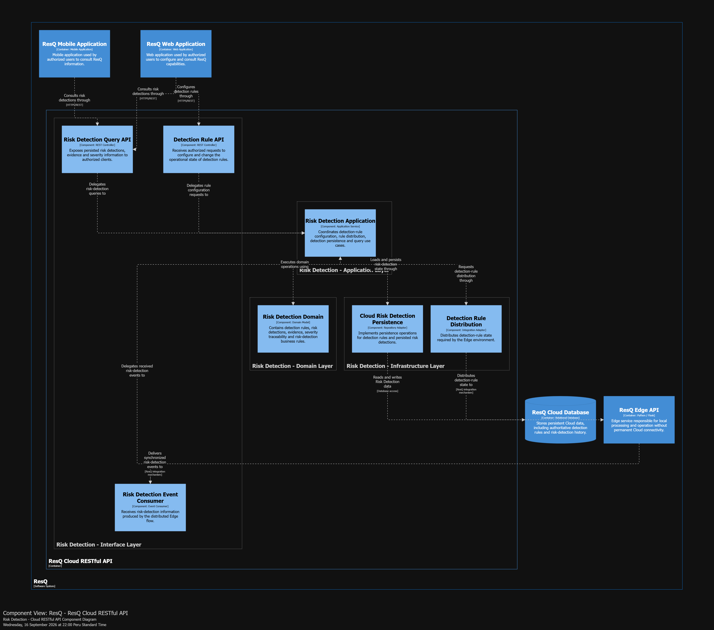

<p align="center">
  <strong>Figura 52. Risk Detection Cloud Component Level Diagram.</strong>
</p>

##### Risk Detection — ResQ Edge Service Component Diagram

<p align="justify">
El Edge Component Diagram representa los componentes responsables de la evaluación local de riesgos dentro de ResQ Edge Service.
</p>

<p align="justify">
Los principales componentes son:
</p>

- Measurement Consumer, responsable de recibir mediciones válidas disponibles localmente.
- Detection Rule Replica Consumer, responsable de recibir los estados actuales de las reglas de detección desde Cloud.
- Edge Risk Detection Application, responsable de coordinar la evaluación local.
- Risk Evaluation Domain, que contiene la lógica de dominio de reglas de detección y evaluación de riesgos.
- Local Detection Rule Persistence, responsable de almacenar réplicas locales de reglas utilizando Peewee y SQLite.
- Risk Location Integration, responsable de obtener las referencias de ubicación asociadas con un dispositivo de origen.
- Risk Detection Event Publisher, responsable de publicar el resultado de una detección local satisfactoria.

<p align="justify">
El flujo principal de ejecución local es:
</p>

```text
Local Measurement Flow
          |
          v
Measurement Consumer
          |
          v
Edge Risk Detection Application
          |
          v
Risk Evaluation Domain
      /            \
     v              v
Local Rule      Risk Location
Persistence     Integration
     |
     v
Risk Detection Event
     |
     v
Risk Detection Event Publisher
     |
     v
Distributed ResQ Flow
```

<p align="justify">
El flujo de actualización de reglas en Edge es:
</p>

```text
Cloud Rule Distribution
          |
          v
Detection Rule Replica Consumer
          |
          v
Edge Risk Detection Application
          |
          v
Local Detection Rule Persistence
```

<p align="justify">
La implementación Edge debe utilizar la tecnología establecida por el enunciado del proyecto para Edge Services: Python, Flask, Peewee ORM y SQLite.
</p>

**DIAGRAMA Risk Detection Edge Component Level Diagram**

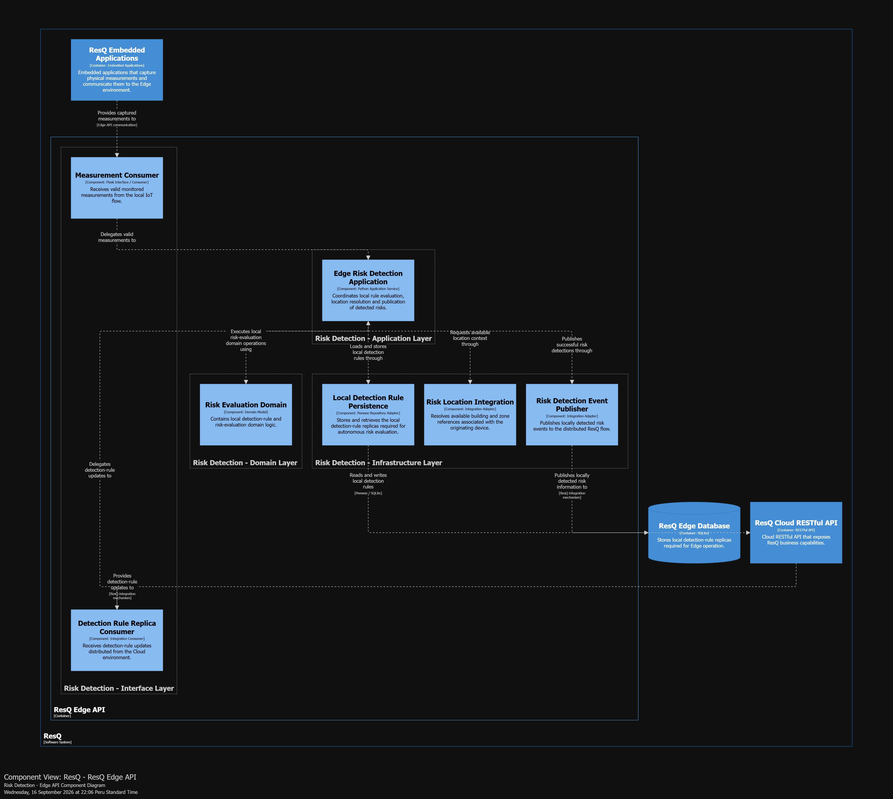

<p align="center">
  <strong>Figura 53. Risk Detection Edge Component Level Diagram.</strong>
</p>

#### 4.2.2.6. Bounded Context Software Architecture Code Level Diagrams

<p align="justify">
Los Code Level Diagrams proporcionan una representación más detallada de la estructura orientada a la implementación del Bounded Context Risk Detection.
</p>

<p align="justify">
Para Risk Detection, el Code Level se representa mediante:
</p>

- Domain Layer Class Diagram, que describe el modelo de dominio orientado a objetos, incluidos Aggregate Roots, Entities, Value Objects, enumeraciones, Domain Services, interfaces de Repository, atributos, métodos, visibilidad, relaciones y multiplicidades.
- Database Design Diagram, que describe las estructuras de persistencia relacional requeridas por las partes Cloud y Edge del Bounded Context.

<p align="justify">
Los diagramas deben mantener la consistencia con el diseño de cuatro capas descrito anteriormente.
</p>

##### 4.2.2.6.1. Bounded Context Domain Layer Class Diagrams

<p align="justify">
El Domain Layer Class Diagram representa la estructura orientada a la implementación del modelo de dominio de Risk Detection.
</p>

<p align="justify">
El diagrama debe incluir los siguientes elementos.
</p>

**Aggregate Roots**

- `DetectionRule`
- `RiskDetection`

**Entity**

- `SeverityChange`

**Value Objects**

- `DetectionCondition`
- `DetectionEvidence`
- `RiskLocation`
- `RiskType`
- `SeverityLevel`

**Enumeraciones**

- `DetectionRuleStatus`
- `ComparisonOperator`
- `LocationResolutionStatus`

**Repository Interfaces**

- `DetectionRuleRepository`
- `RiskDetectionRepository`

**Domain Service**

- `RiskEvaluationService`

**Domain Event**

- `RiskDetectedEvent`

<p align="justify">
Las principales relaciones que deben representarse son:
</p>

- `DetectionRule` compone exactamente un `DetectionCondition`.
- `DetectionRule` compone exactamente un `RiskType`.
- `DetectionRule` compone exactamente un `SeverityLevel`.
- `DetectionRule` utiliza exactamente un `DetectionRuleStatus`.
- `DetectionCondition` utiliza exactamente un `ComparisonOperator`.
- `RiskDetection` compone exactamente un `RiskType`.
- `RiskDetection` compone exactamente un `SeverityLevel` actual.
- `RiskDetection` compone exactamente un `RiskLocation`.
- `RiskDetection` posee uno o más valores `DetectionEvidence`.
- `RiskDetection` posee cero o más entidades `SeverityChange`.
- `RiskLocation` utiliza exactamente un `LocationResolutionStatus`.
- `SeverityChange` referencia un `SeverityLevel` anterior y uno nuevo.
- `RiskDetection` referencia su `DetectionRule` de origen mediante `ruleId`.
- `DetectionRuleRepository` persiste y recupera `DetectionRule`.
- `RiskDetectionRepository` persiste y recupera `RiskDetection`.
- `RiskEvaluationService` evalúa `DetectionRule` y `DetectionEvidence`.
- `RiskDetectedEvent` se produce a partir de una evaluación satisfactoria de Risk Detection.

<p align="justify">
El diagrama debe mostrar las convenciones de visibilidad UML:
</p>

- `+` para miembros públicos;
- `-` para miembros privados;
- `#` para miembros protegidos cuando corresponda.

<p align="justify">
Una referencia conceptual de multiplicidad es:
</p>

```text
DetectionRule "1" *-- "1" DetectionCondition
DetectionRule "1" *-- "1" RiskType
DetectionRule "1" *-- "1" SeverityLevel
DetectionRule "1" --> "1" DetectionRuleStatus

DetectionCondition "1" --> "1" ComparisonOperator

RiskDetection "1" *-- "1" RiskType
RiskDetection "1" *-- "1" SeverityLevel
RiskDetection "1" *-- "1" RiskLocation
RiskDetection "1" *-- "1..*" DetectionEvidence
RiskDetection "1" *-- "0..*" SeverityChange

RiskLocation "1" --> "1" LocationResolutionStatus

SeverityChange --> SeverityLevel : previous/new

RiskDetection ..> DetectionRule : references by ruleId

DetectionRuleRepository ..> DetectionRule : persists
RiskDetectionRepository ..> RiskDetection : persists

RiskEvaluationService ..> DetectionRule : evaluates
RiskEvaluationService ..> DetectionEvidence : evaluates
```

<p align="justify">
Los siguientes conceptos no deben aparecer como clases de dominio propias dentro de Risk Detection:
</p>

- Measurement
- Device
- Building
- Zone
- Alert
- Incident
- Actuator

<p align="justify">
Sus identificadores pueden aparecer como referencias externas cuando el proceso de detección los requiera.
</p>

**DIAGRAMA — Risk Detection Domain Layer Class Diagram**

 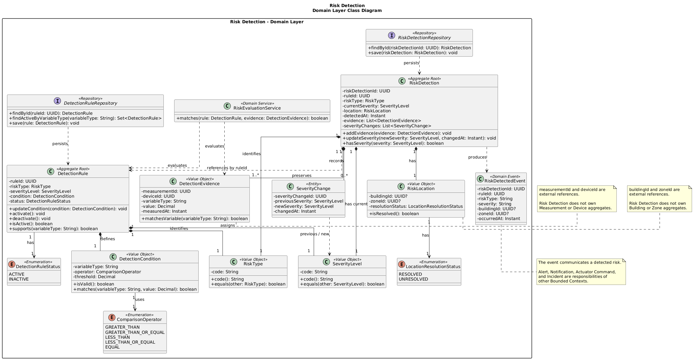

<p align="center">
  <strong>Figura 54. Risk Detection Domain Layer Class Diagram.</strong>
</p>

##### 4.2.2.6.2. Bounded Context Database Design Diagram

<p align="justify">
El Database Design de Risk Detection representa la persistencia requerida por el Bounded Context en los entornos de ejecución Cloud y Edge.
</p>

<p align="justify">
La persistencia Cloud almacena las definiciones autoritativas de reglas de detección y el historial de detección persistido.
</p>

<p align="justify">
La persistencia Edge almacena las réplicas locales de reglas de detección requeridas para la evaluación autónoma.
</p>

<p align="justify">
El modelo de persistencia evita deliberadamente crear dependencias de claves foráneas hacia tablas pertenecientes a otros Bounded Contexts.
</p>

###### Persistencia Cloud

###### `risk_detection_rules`

<p align="justify">
Almacena la configuración autoritativa de reglas de detección.
</p>

| Columna | Tipo | Restricción | Descripción |
|---|---|---|---|
| `rule_id` | UUID | PRIMARY KEY | Identificador único de la regla de detección. |
| `risk_type_code` | VARCHAR(100) | NOT NULL | Tipo de riesgo producido cuando se satisface la condición. |
| `severity_code` | VARCHAR(50) | NOT NULL | Severidad asociada con la regla. |
| `variable_type` | VARCHAR(100) | NOT NULL | Variable monitoreada evaluada por la regla. |
| `comparison_operator` | VARCHAR(40) | NOT NULL | Operador de comparación aplicado al valor monitoreado. |
| `threshold` | DECIMAL(12,4) | NOT NULL | Umbral cuantitativo utilizado por la condición. |
| `status` | VARCHAR(20) | NOT NULL | Estado actual de la regla (ACTIVE o INACTIVE). |

<p align="justify">
DetectionCondition, RiskType y SeverityLevel son Value Objects y, por lo tanto, sus valores persistentes se integran en el registro de la regla de detección en lugar de modelarse como tablas de agregados independientes.
</p>

###### `risk_detections`

<p align="justify">
Almacena las detecciones de riesgo persistidas recibidas desde el flujo distribuido de Edge.
</p>

| Columna | Tipo | Restricción | Descripción |
|---|---|---|---|
| `risk_detection_id` | UUID | PRIMARY KEY | Identificador único del riesgo detectado. |
| `rule_id` | UUID | NOT NULL, FOREIGN KEY | Referencia `risk_detection_rules.rule_id`. |
| `risk_type_code` | VARCHAR(100) | NOT NULL | Tipo de riesgo identificado en el momento de la detección. |
| `current_severity_code` | VARCHAR(50) | NOT NULL | Severidad actual de la detección. |
| `building_id` | UUID | NULL | Referencia externa a Building cuando puede resolverse la ubicación. |
| `zone_id` | UUID | NULL | Referencia externa a Zone cuando puede resolverse la ubicación. |
| `location_status` | VARCHAR(20) | NOT NULL | Indica si se resolvió la ubicación de la detección. |
| `detected_at` | TIMESTAMP | NOT NULL | Momento original de detección. |

<p align="justify">
building_id y zone_id se mantienen intencionalmente sin claves foráneas hacia tablas pertenecientes a otros Bounded Contexts.
</p>

###### `risk_detection_evidence`

<p align="justify">
Almacena la evidencia monitoreada asociada con cada detección de riesgo persistida.
</p>

| Columna | Tipo | Restricción | Descripción |
|---|---|---|---|
| `risk_detection_id` | UUID | PRIMARY KEY, FOREIGN KEY | Referencia `risk_detections.risk_detection_id`. |
| `measurement_id` | UUID | PRIMARY KEY | Identificador externo de la medición monitoreada. |
| `device_id` | UUID | NOT NULL | Identificador externo del dispositivo de origen. |
| `variable_type` | VARCHAR(100) | NOT NULL | Variable monitoreada representada por la evidencia. |
| `measured_value` | DECIMAL(12,4) | NOT NULL | Valor utilizado durante la evaluación. |
| `measured_at` | TIMESTAMP | NOT NULL | Momento original de medición. |

<p align="justify">
La clave primaria compuesta:
</p>

`(risk_detection_id, measurement_id)`

<p align="justify">
impide que la misma evidencia monitoreada se asocie más de una vez con la misma detección de riesgo.
</p>

<p align="justify">
measurement_id y device_id son referencias externas y, por lo tanto, no crean relaciones directas de propiedad en la base de datos con la persistencia de Monitoring o Device.
</p>

###### `risk_severity_changes`

<p align="justify">
Almacena las transiciones de severidad asociadas con las detecciones de riesgo persistidas.
</p>

| Columna | Tipo | Restricción | Descripción |
|---|---|---|---|
| `severity_change_id` | UUID | PRIMARY KEY | Identificador único de la entidad de cambio de severidad. |
| `risk_detection_id` | UUID | NOT NULL, FOREIGN KEY | Referencia `risk_detections.risk_detection_id`. |
| `previous_severity_code` | VARCHAR(50) | NOT NULL | Severidad anterior al cambio. |
| `new_severity_code` | VARCHAR(50) | NOT NULL | Severidad posterior al cambio. |
| `changed_at` | TIMESTAMP | NOT NULL | Momento en el que ocurrió el cambio de severidad. |

<p align="justify">
Esta tabla preserva la trazabilidad requerida cuando cambia la severidad de un riesgo.
</p>

###### Persistencia Edge

###### `edge_detection_rules`

<p align="justify">
Almacena la representación de reglas de detección requerida para la evaluación local en la base de datos SQLite de Edge.
</p>

| Columna | Tipo | Restricción | Descripción |
|---|---|---|---|
| `rule_id` | UUID | PRIMARY KEY | Identificador de la regla de detección de Cloud representada localmente. |
| `risk_type_code` | VARCHAR(100) | NOT NULL | Tipo de riesgo producido por la regla. |
| `severity_code` | VARCHAR(50) | NOT NULL | Severidad asociada con la regla. |
| `variable_type` | VARCHAR(100) | NOT NULL | Variable monitoreada evaluada localmente. |
| `comparison_operator` | VARCHAR(40) | NOT NULL | Operador de comparación utilizado por la condición local. |
| `threshold` | DECIMAL(12,4) | NOT NULL | Umbral cuantitativo utilizado para la evaluación. |
| `status` | VARCHAR(20) | NOT NULL | Estado actual de la regla local. |

<p align="justify">
Esta tabla no es una fuente independiente de propiedad de las reglas. Es la representación local de Edge requerida para que las reglas críticas puedan seguir evaluándose sin conectividad permanente con Cloud.
</p>

<p align="justify">
La implementación de persistencia Edge debe utilizar SQLite con Peewee ORM, de acuerdo con la tecnología de Edge Services requerida por el enunciado del proyecto.
</p>

<p align="justify">
Conceptualmente, las relaciones internas de Cloud son:
</p>

```text
risk_detection_rules
        |
        | 1
        |
        | 0..*
        v
risk_detections
        |
        +------------------------+
        |                        |
        | 1                      | 1
        |                        |
        | 1..*                   | 0..*
        v                        v
risk_detection_evidence    risk_severity_changes
```

<p align="justify">
El Database Design Diagram final debe distinguir claramente:
</p>

- Persistencia Cloud
  - `risk_detection_rules`
  - `risk_detections`
  - `risk_detection_evidence`
  - `risk_severity_changes`

- Edge SQLite
  - `edge_detection_rules`

<p align="justify">
El diagrama debe identificar:
</p>

- todas las tablas;
- todas las columnas;
- las claves primarias;
- las claves foráneas;
- las claves compuestas;
- las referencias externas que admiten valores nulos;
- las cardinalidades;
- los límites de persistencia de Cloud y Edge.

<p align="justify">
No debe introducirse ninguna tabla de base de datos para Alert, Incident, Device, Measurement, Building, Zone, Actuator o eventos pendientes de Connectivity dentro de los límites de persistencia de Risk Detection.
</p>

**DIAGRAMA — Risk Detection Database Design Diagram**

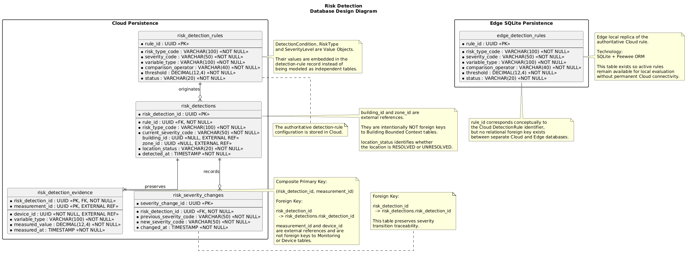

<p align="center">
  <strong>Figura 55. Risk Detection Database Design Diagram.</strong>
</p>

### 4.2.3. Bounded Context: Alert & Response Management

<p align="justify">
El Bounded Context <strong>Alert & Response Management</strong> registra las alertas tempranas que ResQ genera cuando se detecta un riesgo, conserva los intentos de notificación asociados y gestiona las acciones de respuesta solicitadas sobre los actuadores, incluida la autorización humana de las acciones de alto impacto.
</p>

<p align="justify">
Una alerta avisa de un riesgo antes de que se convierta en emergencia. La emergencia en curso se gestiona como incidente en <strong>Incident Management</strong>: una alerta no escala a incidente. En la aplicación web, una alerta corresponde a un umbral de advertencia superado; cuando la medición alcanza el umbral crítico, la alerta activa se cierra y Incident Management registra el incidente de forma independiente.
</p>


<p align="justify">
Alert & Response Management no determina si existe un riesgo: recibe la detección ya clasificada desde <strong>Risk Detection</strong>. Tampoco administra dispositivos, edificaciones, zonas, usuarios ni incidentes. Valida edificaciones y zonas mediante <strong>Building Management</strong>, valida actuadores mediante <strong>Device Management</strong> y obtiene la organización y el usuario autenticado desde <strong>IAM</strong>. Del resto de contextos solo conserva identificadores como <code>riskDetectionId</code>, <code>buildingId</code>, <code>zoneId</code>, <code>targetDeviceId</code>, <code>recipientUserId</code> y <code>decidedByUserId</code>.
</p>

<p align="justify">
Sus responsabilidades son:
</p>

- Generar una alerta a partir de una detección de riesgo, conservando su tipo, severidad, ubicación y momento de detección.
- Registrar un intento de notificación por cada destinatario de la alerta.
- Registrar las acciones de respuesta solicitadas con la alerta y el actuador sobre el que se ejecutan.
- Distinguir las acciones automáticas de las que requieren autorización humana.
- Registrar una única decisión de aprobación o rechazo por acción, tomada por un usuario autenticado.
- Consultar las alertas de una organización y las ejecuciones de respuesta de cada alerta.

#### Diccionario de clases

| Clase / Interfaz | Capa | Propósito |
|---|---|---|
| `Alert` | Domain | Aggregate Root. Alerta generada a partir de una detección de riesgo, con sus intentos de notificación. |
| `ResponseExecution` | Domain | Aggregate Root. Acción de respuesta solicitada para una alerta y su autorización. |
| `NotificationDelivery` | Domain | Entity de `Alert`. Intento de notificar la alerta a un destinatario por un canal. |
| `AlertContext` | Domain | Value Object. Instantánea del riesgo: detección, tipo, severidad, ubicación y fecha. |
| `NotificationRecipient` | Domain | Value Object. Destinatario, canal y destino de una notificación. |
| `ResponseActionSnapshot` | Domain | Value Object. Acción solicitada, actuador objetivo y modo de autorización. |
| `ResponseAuthorization` | Domain | Value Object. Decisión humana registrada sobre una ejecución. |
| `ExecutionResult` | Domain | Value Object. Resultado de una acción ejecutada; hoy solo lo maneja la aplicación web. |
| `RiskCodes`, `EnumCode` | Domain | Normalización de códigos de riesgo, severidades y enumeraciones. |
| `EAuthorizationMode`, `EAuthorizationDecision`, `EResponseExecutionStatus`, `ENotificationDeliveryStatus` | Domain | Enumeraciones del contexto. |
| `GenerateAlertCommand`, `DecideResponseAuthorizationCommand` | Domain | Comandos del contexto. |
| `GetAlertsQuery`, `GetAlertByIdQuery`, `GetResponseExecutionsByAlertIdQuery` | Domain | Consultas del contexto. |
| `IAlertRepository`, `IResponseExecutionRepository` | Domain | Contratos de persistencia de los agregados. |
| `IAlertCommandService`, `IAlertQueryService`, `IResponseExecutionCommandService`, `IResponseExecutionQueryService` | Domain | Contratos de los servicios de aplicación. |
| `AlertCommandService`, `AlertQueryService`, `ResponseExecutionCommandService`, `ResponseExecutionQueryService` | Application | Implementan los casos de uso. |
| `AlertsController` | Interface | Expone las alertas y sus ejecuciones mediante REST. |
| `IAlertsContextFacade`, `AlertsContextFacade` | Interface | Fachada para que Risk Detection genere alertas. |
| `AlertRepository`, `ResponseExecutionRepository` | Infrastructure | Implementan la persistencia con Entity Framework Core y MySQL. |

---

#### 4.2.3.1. Domain Layer

**Aggregates**

`Alert`

<p align="justify">
<strong>Descripción:</strong> Raíz del agregado que representa una alerta temprana de una organización. Conserva el contexto del riesgo que la originó y un intento de notificación por destinatario. Su generación no implica que la notificación haya sido entregada.
</p>

| Atributo | Tipo de dato | Visibilidad | Descripción |
|---|---|---|---|
| id | Guid | Private | Identificador de la alerta. |
| organizationId | Guid | Private | Organización a la que pertenece la alerta. |
| context | AlertContext | Private | Instantánea del riesgo que originó la alerta. |
| generatedAt | DateTimeOffset | Private | Fecha y hora UTC de generación. |
| deliveries | List\<NotificationDelivery\> | Private | Intentos de notificación de la alerta. |
| status | ACTIVE \| CLEARED | Private | Estado de la alerta. Lo maneja la aplicación web; el backend aún no lo persiste. |
| clearedAt | DateTimeOffset? | Private | Momento en que la alerta se cerró. Solo aplicación web. |
| clearReason | RETURNED_TO_NORMAL \| CRITICAL_THRESHOLD_REACHED | Private | Motivo de cierre: la medición volvió a la normalidad o alcanzó el umbral crítico. Solo aplicación web. |

| Método | Tipo de retorno | Descripción |
|---|---|---|
| Generate(organizationId, context, recipients) | Alert | Crea la alerta con fecha UTC actual y un `NotificationDelivery` en estado PENDING por destinatario. Rechaza una organización vacía y destinatarios repetidos para el mismo canal y destino. |

`ResponseExecution`

<p align="justify">
<strong>Descripción:</strong> Raíz del agregado que representa una acción de respuesta solicitada para una alerta, por ejemplo cerrar una válvula de gas. Es un agregado independiente de Alert porque su autorización cambia después de generada la alerta.
</p>

| Atributo | Tipo de dato | Visibilidad | Descripción |
|---|---|---|---|
| id | Guid | Private | Identificador de la ejecución. |
| organizationId | Guid | Private | Organización de la ejecución. |
| alertId | Guid | Private | Alerta que originó la acción. |
| riskDetectionId | string | Private | Detección de riesgo de origen, hasta 64 caracteres. |
| action | ResponseActionSnapshot | Private | Acción solicitada y actuador objetivo. |
| status | EResponseExecutionStatus | Private | Estado actual de la ejecución. |
| requestedAt | DateTimeOffset | Private | Fecha y hora UTC de la solicitud. |
| authorization | ResponseAuthorization? | Private | Decisión humana, cuando la acción la requiere y ya fue registrada. |
| executionRequestedAt | DateTimeOffset? | Private | Momento en que se pidió la acción al actuador. Solo aplicación web. |
| result | ExecutionResult? | Private | Resultado de la acción. Solo aplicación web. |

| Método | Tipo de retorno | Descripción |
|---|---|---|
| Request(organizationId, alertId, riskDetectionId, action) | ResponseExecution | Crea la ejecución. Una acción AUTOMATIC queda en EXECUTION_REQUESTED y una HUMAN_REQUIRED en PENDING_AUTHORIZATION. |
| DecideAuthorization(decision, decidedByUserId) | void | Registra la decisión. Solo aplica a acciones HUMAN_REQUIRED en PENDING_AUTHORIZATION y una sola vez. APPROVED pasa a AUTHORIZED y REJECTED a REJECTED. |

**Entities**

`NotificationDelivery`

<p align="justify">
<strong>Descripción:</strong> Intento de notificar una alerta a un destinatario por un canal. Pertenece a una única Alert y se crea en estado PENDING. El proveedor externo de notificaciones aún no está integrado, por lo que el backend no cambia el estado de un intento después de crearlo.
</p>

| Atributo | Tipo de dato | Visibilidad | Descripción |
|---|---|---|---|
| id | Guid | Private | Identificador del intento. |
| recipientUserId | string | Private | Usuario destinatario, hasta 64 caracteres. |
| channel | string | Private | Canal, en mayúsculas y hasta 30 caracteres; por ejemplo, PUSH. |
| destination | string | Private | Destino requerido por el canal, hasta 200 caracteres. |
| status | ENotificationDeliveryStatus | Private | Estado del intento. |
| requestedAt | DateTimeOffset | Private | Momento de la solicitud. |
| completedAt | DateTimeOffset? | Private | Momento en que terminó el intento. |
| failureReason | string? | Private | Causa del fallo, hasta 500 caracteres. |

**Value Objects**

| Value Object (`record`) | Atributos | Validación y significado |
|---|---|---|
| AlertContext | riskDetectionId: string, riskTypeCode: string, severityCode: string, buildingId: Guid?, zoneId: Guid?, detectedAt: DateTimeOffset | `riskDetectionId` obligatorio, hasta 64 caracteres. `riskTypeCode` se normaliza a mayúsculas con letras, dígitos y guion bajo, hasta 50 caracteres; por ejemplo, GAS_LEAK. `severityCode` admite Info, Warning o Critical. Una zona exige su edificación. `detectedAt` es obligatorio y no puede superar en más de 5 minutos la hora actual. |
| NotificationRecipient | recipientUserId: string, channel: string, destination: string | Datos de entrada para crear un `NotificationDelivery`. |
| ResponseActionSnapshot | actionId: Guid, actionCode: string, targetDeviceId: Guid, targetCapabilityCode: string, authorizationMode: EAuthorizationMode, critical: bool | `actionId` se genera al crearla. `actionCode` se guarda en mayúsculas, hasta 80 caracteres. `targetDeviceId` no puede ser vacío. `targetCapabilityCode` tiene hasta 80 caracteres. |
| ResponseAuthorization | authorizationId: Guid, decision: EAuthorizationDecision, decidedByUserId: string, decidedAt: DateTimeOffset | `decidedByUserId` es obligatorio; `decidedAt` es la hora UTC del registro. |
| ExecutionResult | successful: bool, resultCode: string, message: string?, completedAt: DateTimeOffset | Resultado mostrado por la aplicación web; por ejemplo, ACTUATOR_CONFIRMED. El backend aún no lo registra. |

<p align="justify">
<code>RiskCodes</code> normaliza el tipo de riesgo y la severidad. <code>EnumCode</code> convierte las enumeraciones al formato de los contratos JSON, por ejemplo <code>HumanRequired</code> a <code>HUMAN_REQUIRED</code>, y rechaza valores no definidos. Los identificadores de otros contextos se guardan como referencias: <code>riskDetectionId</code>, <code>recipientUserId</code> y <code>decidedByUserId</code> son texto porque provienen de Risk Detection e IAM con formatos propios.
</p>

**Enumerations**

| Enumeración | Valores | Significado |
|---|---|---|
| EAuthorizationMode | AUTOMATIC, HUMAN_REQUIRED | La acción se ejecuta sin intervención o requiere una decisión humana. |
| EAuthorizationDecision | APPROVED, REJECTED | Decisión registrada sobre una acción HUMAN_REQUIRED. |
| EResponseExecutionStatus | PENDING, PENDING_AUTHORIZATION, AUTHORIZED, EXECUTION_REQUESTED, SUCCEEDED, FAILED, REJECTED | Estado de una ejecución. El backend usa EXECUTION_REQUESTED, PENDING_AUTHORIZATION, AUTHORIZED y REJECTED; SUCCEEDED y FAILED los muestra la aplicación web con el resultado; PENDING no se usa. |
| ENotificationDeliveryStatus | PENDING, DELIVERED, FAILED | Estado de un intento de notificación. |

<p align="justify">
El flujo de una acción automática es <code>EXECUTION_REQUESTED</code> → <code>SUCCEEDED</code> o <code>FAILED</code>. El de una acción que requiere autorización es <code>PENDING_AUTHORIZATION</code> → <code>AUTHORIZED</code> o <code>REJECTED</code>; una acción rechazada no se ejecuta.
</p>

**Commands**

<p align="justify">
<code>organizationId</code> procede del contexto autorizado y <code>decidedByUserId</code> del usuario autenticado; el cliente no los envía.
</p>

| Command (`record`) | Datos |
|---|---|
| GenerateAlertCommand | organizationId, riskDetectionId, riskTypeCode, severityCode, buildingId?, zoneId?, detectedAt, recipients, responseActions |
| DecideResponseAuthorizationCommand | organizationId, alertId, responseExecutionId, decision, decidedByUserId |

**Queries**

| Query (`record`) | Datos | Resultado |
|---|---|---|
| GetAlertsQuery | organizationId, buildingId?, zoneId?, riskTypeCode?, from?, to? | IEnumerable\<Alert\> |
| GetAlertByIdQuery | organizationId, alertId | Alert? |
| GetResponseExecutionsByAlertIdQuery | organizationId, alertId | IEnumerable\<ResponseExecution\> |

**Services**

| Interfaz | Método | Tipo de retorno |
|---|---|---|
| IAlertCommandService | Handle(GenerateAlertCommand) | Alert? |
| IAlertQueryService | Handle(GetAlertByIdQuery) | Alert? |
| IAlertQueryService | Handle(GetAlertsQuery) | IEnumerable\<Alert\> |
| IResponseExecutionCommandService | Handle(DecideResponseAuthorizationCommand) | ResponseExecution? |
| IResponseExecutionQueryService | Handle(GetResponseExecutionsByAlertIdQuery) | IEnumerable\<ResponseExecution\> |

**Repositories**

| Interfaz | Método | Tipo de retorno |
|---|---|---|
| IAlertRepository | FindByIdAndOrganizationIdAsync(alertId, organizationId) | Alert? |
| IAlertRepository | FindAllAsync(organizationId, buildingId?, zoneId?, riskTypeCode?, from?, to?) | IEnumerable\<Alert\> |
| IResponseExecutionRepository | FindByIdAndAlertIdAsync(responseExecutionId, alertId, organizationId) | ResponseExecution? |
| IResponseExecutionRepository | FindAllByAlertIdAsync(alertId, organizationId) | IEnumerable\<ResponseExecution\> |

<p align="justify">
Ambos repositorios extienden <code>IBaseRepository</code>, que aporta <code>AddAsync</code>. Todas las consultas se restringen a la organización del solicitante.
</p>

**Reglas de negocio**

1. Una alerta conserva la detección, el tipo de riesgo, la severidad, el momento de detección y, cuando existe, la edificación y la zona. Una zona no puede indicarse sin su edificación.
2. Si la alerta indica edificación o zona, ambas deben existir y estar activas en la organización.
3. Cada destinatario genera un único intento de notificación en estado PENDING; no se repite el mismo usuario, canal y destino.
4. Cada acción de respuesta debe apuntar a un dispositivo activo de la organización que tenga la capacidad de actuación indicada.
5. Una acción AUTOMATIC se registra como EXECUTION_REQUESTED sin intervención humana.
6. Una acción HUMAN_REQUIRED queda en PENDING_AUTHORIZATION hasta que un usuario autenticado la apruebe o rechace.
7. Una ejecución admite una sola decisión; no puede decidirse una acción AUTOMATIC ni una ya decidida.
8. La aplicación web exige además que el usuario tenga permiso para autorizar respuestas críticas y que el incidente de la misma detección esté en curso y asignado a él.

---

#### 4.2.3.2. Interface Layer

**REST Controllers**

`AlertsController`

<p align="justify">
<strong>Descripción:</strong> Expone la generación y consulta de alertas y la autorización de sus ejecuciones. Todas las rutas requieren autenticación; la organización se toma del contexto de la solicitud. Las ejecuciones se exponen anidadas en su alerta.
</p>

| Método | Ruta | Descripción | Respuesta exitosa |
|---|---|---|---|
| GetAlerts() | GET /api/v1/alerts | Lista las alertas de la más reciente a la más antigua; admite buildingId, zoneId, riskTypeCode, from y to sobre generatedAt. | 200, List\<AlertResource\> |
| GetAlertById() | GET /api/v1/alerts/{alertId} | Consulta una alerta con su contexto y notificaciones. | 200, AlertResource |
| GenerateAlert() | POST /api/v1/alerts | Genera una alerta, sus notificaciones y, si se envían responseActions, una ejecución por acción. | 201, AlertResource y Location |
| GetResponseExecutionsByAlertId() | GET /api/v1/alerts/{alertId}/response-executions | Lista las ejecuciones de la alerta en el orden en que se solicitaron. | 200, List\<ResponseExecutionResource\> |
| DecideResponseAuthorization() | PUT /api/v1/alerts/{alertId}/response-executions/{responseExecutionId}/authorization | Aprueba o rechaza una ejecución HUMAN_REQUIRED pendiente. | 200, ResponseExecutionResource |

<p align="justify">
Mientras Risk Detection no genere alertas automáticamente en el backend, <code>POST /api/v1/alerts</code> es el punto de entrada para crearlas.
</p>

**Resources**

| Resource (`record`) | Contenido |
|---|---|
| GenerateAlertResource | riskDetectionId, riskTypeCode, severityCode, buildingId?, zoneId?, detectedAt, recipients?, responseActions? |
| NotificationRecipientResource | recipientUserId, channel, destination |
| RequestResponseActionResource | actionCode, targetDeviceId, targetCapabilityCode, authorizationMode, critical |
| DecideResponseAuthorizationResource | decision |
| AlertResource | alertId, organizationId, context, generatedAt, deliveries |
| AlertContextResource | riskDetectionId, riskTypeCode, severityCode, buildingId?, zoneId?, detectedAt |
| NotificationDeliveryResource | deliveryId, recipientUserId, channel, destination, status, requestedAt, completedAt?, failureReason? |
| ResponseExecutionResource | responseExecutionId, organizationId, alertId, riskDetectionId, action, status, requestedAt, authorization? |
| ResponseActionSnapshotResource | actionId, actionCode, targetDeviceId, targetCapabilityCode, authorizationMode, critical |
| ResponseAuthorizationResource | authorizationId, decision, decidedByUserId, decidedAt |

<p align="justify">
Los estados y modos viajan como códigos en mayúsculas, por ejemplo <code>PENDING_AUTHORIZATION</code>. Ejemplo de cuerpo para generar una alerta con una acción que requiere autorización:
</p>

```json
{
  "riskDetectionId": "RISK-0001",
  "riskTypeCode": "GAS_LEAK",
  "severityCode": "Warning",
  "buildingId": "{buildingId}",
  "zoneId": "{zoneId}",
  "detectedAt": "2026-10-03T15:00:00Z",
  "recipients": [
    { "recipientUserId": "1", "channel": "PUSH", "destination": "registered-mobile-device" }
  ],
  "responseActions": [
    {
      "actionCode": "CLOSE_GAS_VALVE",
      "targetDeviceId": "{deviceId}",
      "targetCapabilityCode": "gas-valve",
      "authorizationMode": "HUMAN_REQUIRED",
      "critical": true
    }
  ]
}
```

**Assemblers**

| Assembler | Responsabilidad |
|---|---|
| GenerateAlertCommandFromResourceAssembler | Construye GenerateAlertCommand con el recurso y la organización autorizada; convierte destinatarios y acciones. |
| DecideResponseAuthorizationCommandFromResourceAssembler | Construye DecideResponseAuthorizationCommand con la decisión, las rutas y el usuario autenticado. |
| AlertResourceFromEntityAssembler | Convierte Alert y sus notificaciones en AlertResource. |
| ResponseExecutionResourceFromEntityAssembler | Convierte ResponseExecution en ResponseExecutionResource. |

**Contrato de errores**

<p align="justify">
<code>AlertRequestContext</code> lee la organización y el usuario de la solicitud y traduce las excepciones del dominio a respuestas con el cuerpo <code>{ "message": "..." }</code>.
</p>

| Código HTTP | Situación |
|---|---|
| 400 | Datos inválidos: severidad, tipo de riesgo, modo o decisión no admitidos; zona sin edificación; fechas inválidas o `from` posterior a `to`; destinatarios repetidos. |
| 401 | Usuario no autenticado u organización ausente. |
| 404 | Alerta o ejecución no encontrada dentro de la organización. |
| 409 | Edificación, zona o dispositivo inexistente o inactivo; dispositivo sin la capacidad de actuación; ejecución que no requiere autorización o ya decidida. |

**Fachada de integración**

<p align="justify">
<code>AlertsContextFacade</code> implementa <code>IAlertsContextFacade.GenerateAlertAsync(organizationId, riskDetectionId, riskTypeCode, severityCode, buildingId?, zoneId?, detectedAt, recipients)</code> y devuelve el identificador de la alerta creada. Está preparada para que Risk Detection genere alertas sin pasar por REST; no recibe acciones de respuesta.
</p>

**Consumo desde la aplicación web**

<p align="justify">
La aplicación web accede a este contexto mediante <code>AlertResponseGateway</code>. Hoy opera con <code>MockAlertGateway</code>; <code>HttpAlertGateway</code> está preparado para reemplazarlo cuando se integre con el backend. El Centro de Alertas muestra el total de alertas, las activas, las cerradas y los fallos de notificación, con filtros por texto, edificación, tipo de riesgo, estado y periodo. El detalle de una alerta muestra su contexto, la evidencia de Risk Detection, las notificaciones y las respuestas automáticas. Las acciones HUMAN_REQUIRED se aprueban o rechazan desde el detalle del incidente.
</p>

| Operación del gateway web | Endpoint del backend | Estado |
|---|---|---|
| getAlerts(filters) | GET /api/v1/alerts | Coincide. |
| getAlertById(alertId) | GET /api/v1/alerts/{alertId} | Coincide; el backend no devuelve status, clearedAt ni clearReason. |
| getResponseExecutions({ riskDetectionId }) | GET /api/v1/alerts/{alertId}/response-executions | Difiere: la web filtra por detección; el backend, por alerta. |
| decideResponseAuthorization(responseExecutionId, decision) | PUT /api/v1/alerts/{alertId}/response-executions/{responseExecutionId}/authorization | Difiere: el backend requiere alertId en la ruta. |
| getResponseExecutionById(responseExecutionId) | No existe | Solo aplicación web. |

---

#### 4.2.3.3. Application Layer

`AlertCommandService`

<p align="justify">
<strong>Descripción:</strong> Implementa IAlertCommandService. Valida la ubicación y los actuadores mediante las fachadas de otros contextos y guarda la alerta y sus ejecuciones en una sola unidad de trabajo.
</p>

| Método | Descripción |
|---|---|
| Handle(GenerateAlertCommand) | Crea `AlertContext`. Si hay edificación, la valida con `IBuildingsContextFacade.ValidateAssignmentAsync`. Valida cada acción con `IDevicesContextFacade.GetDeviceCatalogEntry`: el dispositivo debe existir, estar activo y tener una capacidad de actuación con el código indicado. Genera la Alert, crea una ResponseExecution por acción y confirma con `IUnitOfWork`. |

`ResponseExecutionCommandService`

| Método | Descripción |
|---|---|
| Handle(DecideResponseAuthorizationCommand) | Recupera la ejecución por id, alerta y organización; si no existe lanza no encontrado. Aplica `DecideAuthorization` y confirma la unidad de trabajo. |

`AlertQueryService`

| Método | Descripción |
|---|---|
| Handle(GetAlertByIdQuery) | Obtiene la alerta con sus notificaciones dentro de la organización. |
| Handle(GetAlertsQuery) | Normaliza el tipo de riesgo y lista las alertas filtradas, de la más reciente a la más antigua. |

`ResponseExecutionQueryService`

| Método | Descripción |
|---|---|
| Handle(GetResponseExecutionsByAlertIdQuery) | Lista las ejecuciones de la alerta ordenadas por fecha de solicitud. |

**Dependencias de otros contextos**

| Fachada | Método | Uso |
|---|---|---|
| IBuildingsContextFacade (Building Management) | ValidateAssignmentAsync(organizationId, buildingId, zoneId?) | Comprueba que la edificación y la zona existen y están activas. |
| IDevicesContextFacade (Device Management) | GetDeviceCatalogEntry(organizationId, deviceId) | Obtiene el estado y las capacidades del actuador objetivo. |

<p align="justify">
<code>AlertContextDependencyInjection</code> registra los repositorios, los servicios de comandos y consultas y la fachada del contexto.
</p>

---

#### 4.2.3.4. Infrastructure Layer

**Persistencia de los agregados**

| Componente | Puerto implementado | Descripción |
|---|---|---|
| AlertRepository | IAlertRepository | Consulta alertas con sus notificaciones en MySQL mediante Entity Framework Core, filtradas por organización y criterios opcionales. |
| ResponseExecutionRepository | IResponseExecutionRepository | Consulta ejecuciones por alerta y organización, ordenadas por `requestedAt`. |

<p align="justify">
<code>ApplyAlertManagementConfiguration</code> configura el modelo. <code>AlertContext</code>, <code>ResponseActionSnapshot</code> y <code>ResponseAuthorization</code> se guardan como Owned Types en la tabla de su agregado. Las enumeraciones se guardan como texto con el nombre de su valor en C#, por ejemplo <code>PendingAuthorization</code>. La convención snake_case del <code>AppDbContext</code> nombra tablas y columnas.
</p>

<p align="justify">
El proveedor externo de notificaciones y la ejecución física de acciones sobre los actuadores no están implementados en esta versión.
</p>

---

#### 4.2.3.5. Bounded Context Software Architecture Component Level Diagrams


<p align="justify">
El diagrama muestra los componentes de Alert & Response Management dentro de la ResQ Cloud RESTful API. La aplicación web y la móvil consumen <code>AlertsController</code>. Los servicios de aplicación coordinan el dominio, la persistencia en MySQL y las validaciones con Building Management y Device Management. Risk Detection puede generar alertas mediante <code>AlertsContextFacade</code>.
</p>


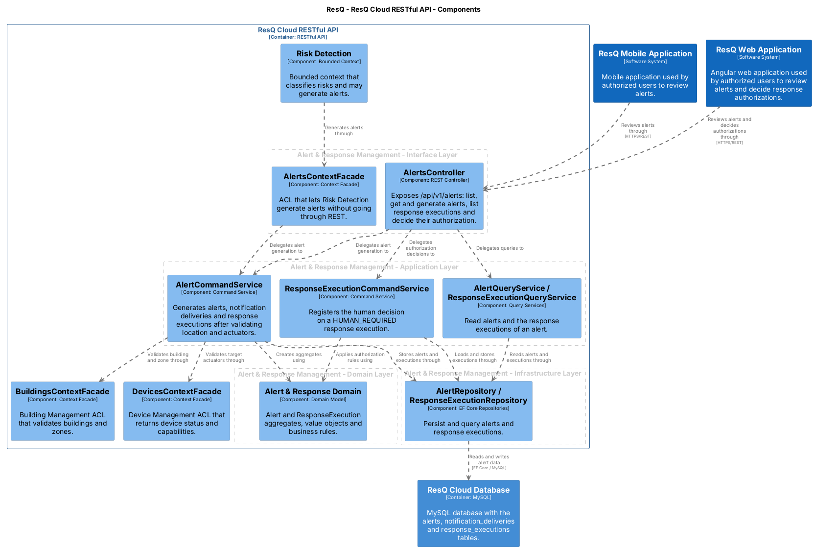


#### 4.2.3.6. Bounded Context Software Architecture Code Level Diagrams

##### 4.2.3.6.1. Bounded Context Domain Layer Class Diagrams

<p align="justify">
El diagrama muestra los dos agregados del contexto. <code>Alert</code> compone un <code>AlertContext</code> y cero o más <code>NotificationDelivery</code>. <code>ResponseExecution</code> referencia su alerta por <code>alertId</code>, compone un <code>ResponseActionSnapshot</code> y puede tener una <code>ResponseAuthorization</code>. Los atributos marcados como solo aplicación web aparecen con la nota correspondiente.
</p>

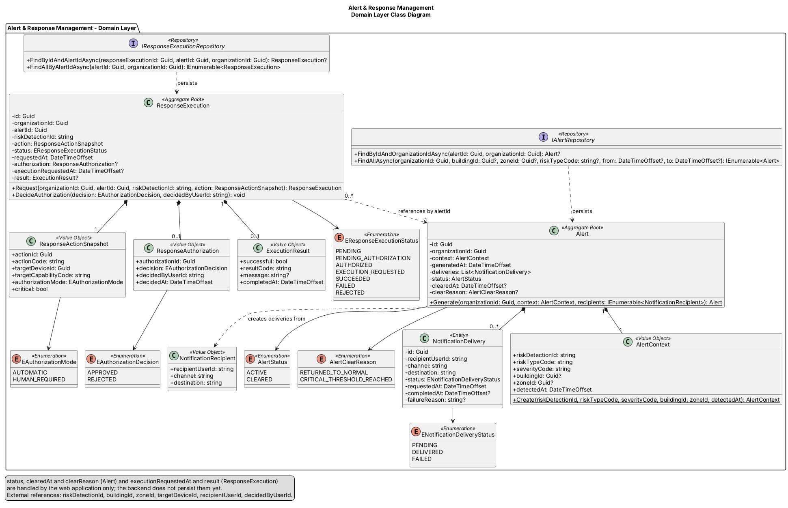


##### 4.2.3.6.2. Bounded Context Database Design Diagram

<p align="justify">
La persistencia usa tres tablas en la base de datos MySQL de la ResQ Cloud RESTful API. Los Value Objects se guardan como columnas de la tabla de su aggregate.
</p>


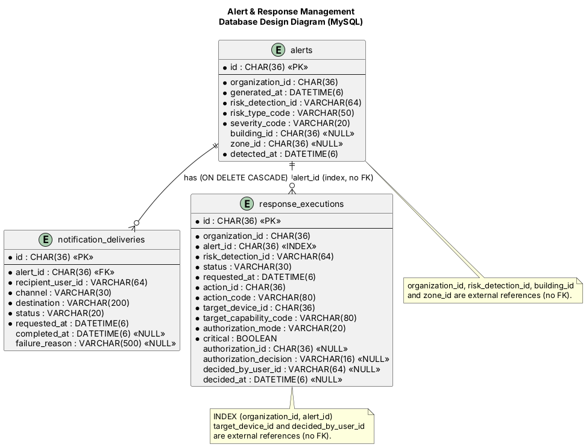


### 4.2.4. Bounded Context: Building Management

#### 4.2.4.1. Domain Layer

**Aggregates**

`Building`

<p align="justify">
Raíz del aggregate que representa una edificación de una organización. Mantiene su identificación, dirección, estado administrativo y zonas. Todas las modificaciones de una zona se realizan a través de Building.
</p>

| Atributo | Tipo de dato | Visibilidad | Descripción |
|---|---|---|---|
| id | Guid | Private | Identificador interno e inmutable de la edificación. |
| organizationId | Guid | Private | Organización a la que pertenece la edificación. |
| buildingCode | BuildingCode | Private | Código único dentro de la organización. |
| name | string | Private | Nombre de la edificación, entre 1 y 120 caracteres. |
| description | string? | Private | Descripción opcional de hasta 500 caracteres. |
| address | BuildingAddress | Private | Dirección física de la edificación. |
| administrativeStatus | LocationAdministrativeStatus | Private | Estado administrativo ACTIVE o INACTIVE. |
| zones | List\<Zone\> | Private | Zonas de la edificación; puede estar vacía al registrarse. |
| createdAt | DateTimeOffset | Private | Fecha y hora UTC de registro. |
| updatedAt | DateTimeOffset | Private | Fecha y hora UTC de la última modificación del agregado. |
| version | long | Private | Versión del agregado, incluidos los cambios en sus zonas. |

| Método | Tipo de retorno | Descripción |
|---|---|---|
| Register(...) | Building | Registra una edificación activa, inicialmente sin zonas. |
| UpdateDetails(name, description, address) | void | Actualiza los datos descriptivos y la dirección. |
| ChangeAdministrativeStatus(status) | void | Activa o desactiva administrativamente la edificación. |
| AddZone(zoneCode, name, description, floorLabel) | Zone | Agrega una zona activa a una edificación activa y verifica que su código no se repita. |
| UpdateZone(zoneId, name, description, floorLabel) | void | Modifica los datos de una zona perteneciente a la edificación. |
| ChangeZoneAdministrativeStatus(zoneId, status) | void | Cambia el estado de una zona; su activación exige una edificación activa. |
| IsAvailableForAssignment(zoneId?) | bool | Comprueba si la edificación y, cuando se indica, la zona están disponibles para asignar dispositivos. |

**Entities**

`Zone`

<p align="justify">
<strong>Descripción:</strong> Área física de una edificación, como una cocina, un almacén o una sala técnica. Tiene identidad propia y pertenece a un único Building. No contiene dispositivos, mediciones ni reglas de detección.
</p>

| Atributo | Tipo de dato | Visibilidad | Descripción |
|---|---|---|---|
| id | Guid | Private | Identificador interno e inmutable de la zona. |
| zoneCode | ZoneCode | Private | Código único dentro de la edificación. |
| name | string | Private | Nombre de la zona, entre 1 y 120 caracteres. |
| description | string? | Private | Descripción opcional de hasta 500 caracteres. |
| floorLabel | string? | Private | Referencia opcional del nivel, hasta 50 caracteres; por ejemplo, Piso 2 o Sótano 1. |
| administrativeStatus | LocationAdministrativeStatus | Private | Estado administrativo propio de la zona. |
| createdAt | DateTimeOffset | Private | Fecha y hora UTC de creación. |
| updatedAt | DateTimeOffset | Private | Fecha y hora UTC de su última modificación. |

<p align="justify">
El nivel es un dato descriptivo; esta propuesta no incorpora un agregado Floor ni una jerarquía de zonas. Zone no tiene repositorio independiente ni cambia de edificación. Si el área física se reemplaza, se registra otra zona y se desactiva la anterior para conservar sus referencias.
</p>

**Value Objects**

| Value Object (`record`) | Atributos | Validación y significado |
|---|---|---|
| BuildingCode | value: string | Entre 1 y 64 caracteres; letras ASCII, números, guion y guion bajo. Se eliminan espacios exteriores y se convierte a mayúsculas. |
| ZoneCode | value: string | Aplica la misma normalización que BuildingCode; su unicidad se limita a la edificación. |
| BuildingAddress | streetAddress: string, district: string, city: string, countryCode: string | Dirección de hasta 200 caracteres; distrito y ciudad de hasta 100; código de país de dos letras mayúsculas, por ejemplo PE. Todos los campos son obligatorios. |

<p align="justify">
Los identificadores rechazan <code>Guid.Empty</code>. Los códigos, la organización y la pertenencia de una zona son inmutables. Las propiedades públicas de records en C# utilizan PascalCase; los campos de los contratos JSON se presentan en camelCase.
</p>

**Enumerations**

| Enumeración | Valores | Significado |
|---|---|---|
| LocationAdministrativeStatus | ACTIVE, INACTIVE | Ubicación habilitada o deshabilitada administrativamente para nuevas asignaciones. |

<p align="justify">
Desactivar una edificación impide nuevas asignaciones tanto a ella como a sus zonas, pero conserva el estado propio de cada zona. Al reactivarla, solo quedan disponibles las zonas que conservan ACTIVE. No se eliminan asociaciones existentes ni se confirma ninguna acción sobre equipos físicos. Estos estados y las reglas de normalización son decisiones de diseño propuestas para desarrollar US21 y US22; no se presentan como requisitos explícitos de sus criterios de aceptación.
</p>

**Commands**

<p align="justify">
<code>organizationId</code> procede del contexto autorizado. <code>expectedVersion</code> corresponde siempre a la versión de Building, incluso al modificar una zona.
</p>

| Command (`record`) | Datos |
|---|---|
| RegisterBuildingCommand | organizationId, buildingCode, name, description?, address |
| UpdateBuildingDetailsCommand | organizationId, buildingId, name, description?, address, expectedVersion |
| ChangeBuildingAdministrativeStatusCommand | organizationId, buildingId, administrativeStatus, expectedVersion |
| AddZoneToBuildingCommand | organizationId, buildingId, zoneCode, name, description?, floorLabel?, expectedVersion |
| UpdateZoneCommand | organizationId, buildingId, zoneId, name, description?, floorLabel?, expectedVersion |
| ChangeZoneAdministrativeStatusCommand | organizationId, buildingId, zoneId, administrativeStatus, expectedVersion |

**Queries**

| Query (`record`) | Datos | Resultado |
|---|---|---|
| GetBuildingByIdQuery | organizationId, buildingId | Building? |
| GetBuildingsQuery | organizationId, administrativeStatus?, page, size | PagedResult\<Building\> |
| GetZonesByBuildingIdQuery | organizationId, buildingId, administrativeStatus?, page, size | PagedResult\<Zone\> |
| GetZoneByIdQuery | organizationId, buildingId, zoneId | Zone? |

**Services**

| Interfaz | Método | Tipo de retorno |
|---|---|---|
| IBuildingCommandService | Handle(RegisterBuildingCommand) | Building |
| IBuildingCommandService | Handle(UpdateBuildingDetailsCommand) | Building |
| IBuildingCommandService | Handle(ChangeBuildingAdministrativeStatusCommand) | Building |
| IBuildingCommandService | Handle(AddZoneToBuildingCommand) | Building |
| IBuildingCommandService | Handle(UpdateZoneCommand) | Building |
| IBuildingCommandService | Handle(ChangeZoneAdministrativeStatusCommand) | Building |
| IBuildingQueryService | Handle(GetBuildingByIdQuery) | Building? |
| IBuildingQueryService | Handle(GetBuildingsQuery) | PagedResult\<Building\> |
| IBuildingQueryService | Handle(GetZonesByBuildingIdQuery) | PagedResult\<Zone\> |
| IBuildingQueryService | Handle(GetZoneByIdQuery) | Zone? |

<p align="justify">
<code>IBuildingRepository</code> declara el contrato de persistencia del agregado. <code>BuildingReadScope</code> representa las edificaciones y zonas visibles para el solicitante; <code>BuildingFilters</code> y <code>ZoneFilters</code> contienen los filtros de consulta. Estos contratos no dependen del framework web ni de clases internas de IAM. <code>PagedResult&lt;T&gt;</code> contiene Items, Page, Size, TotalElements y TotalPages.
</p>

**Domain Events**

| Evento | Se produce cuando |
|---|---|
| BuildingRegistered | Se registra una edificación. |
| BuildingDetailsUpdated | Cambian sus datos descriptivos o dirección. |
| BuildingAdministrativeStatusChanged | Cambia el estado administrativo de la edificación. |
| ZoneAddedToBuilding | Se agrega una zona. |
| ZoneDetailsUpdated | Cambian los datos descriptivos de una zona. |
| ZoneAdministrativeStatusChanged | Cambia el estado administrativo de una zona. |

<p align="justify">
Cada cambio efectivo incrementa una vez la versión de Building y genera un evento. Repetir valores existentes no produce un cambio adicional. El mensaje de integración contiene eventId, eventType, schemaVersion, organizationId, buildingId, aggregateVersion, occurredAt y una instantánea de la edificación con sus zonas. Los cambios de zona incluyen además affectedZoneId. La aplicación conserva el mensaje mediante una outbox para informar a los consumidores sin compartir tablas.
</p>

#### 4.2.4.2. Interface Layer

**REST Controllers**

`BuildingsController`

<p align="justify">
<strong>Descripción:</strong> Expone el registro y consulta de edificaciones y zonas. Construye comandos y consultas, aplica el contrato HTTP y transforma los resultados en recursos. Las rutas anidadas expresan que cada zona pertenece a una edificación.
</p>

| Método | Ruta | Descripción | Respuesta exitosa |
|---|---|---|---|
| RegisterBuilding() | POST /api/v1/buildings | Registra una edificación. | 201, BuildingResource, Location y ETag |
| GetBuildings() | GET /api/v1/buildings | Lista edificaciones; admite administrativeStatus, page y size. | 200, BuildingPageResource |
| GetBuildingById() | GET /api/v1/buildings/{buildingId} | Consulta una edificación y sus zonas visibles. | 200, BuildingResource y ETag |
| UpdateBuildingDetails() | PUT /api/v1/buildings/{buildingId}/details | Actualiza nombre, descripción y dirección. | 200, BuildingResource y ETag |
| ChangeBuildingAdministrativeStatus() | PUT /api/v1/buildings/{buildingId}/administrative-status | Activa o desactiva la edificación. | 200, BuildingResource y ETag |
| AddZoneToBuilding() | POST /api/v1/buildings/{buildingId}/zones | Agrega una zona a la edificación. | 201, BuildingResource, Location de la zona y ETag |
| GetZonesByBuildingId() | GET /api/v1/buildings/{buildingId}/zones | Lista zonas; admite administrativeStatus, page y size. | 200, ZonePageResource |
| GetZoneById() | GET /api/v1/buildings/{buildingId}/zones/{zoneId} | Consulta una zona de la edificación indicada. | 200, ZoneResource |
| UpdateZone() | PUT /api/v1/buildings/{buildingId}/zones/{zoneId}/details | Actualiza los datos de una zona. | 200, BuildingResource y ETag |
| ChangeZoneAdministrativeStatus() | PUT /api/v1/buildings/{buildingId}/zones/{zoneId}/administrative-status | Activa o desactiva una zona. | 200, BuildingResource y ETag |

<p align="justify">
Los PUT y el POST de creación de una zona requieren <code>If-Match</code> con el ETag de Building, obtenido en GET /buildings/{buildingId}. Los comandos devuelven el agregado actualizado y su nuevo ETag; una zona no tiene versión independiente. La paginación comienza en cero, con tamaño predeterminado 20 y máximo 100, y utiliza un orden estable por createdAt e id. No se exponen operaciones DELETE.
</p>

**Resources**

| Resource (`record`) | Contenido |
|---|---|
| RegisterBuildingResource | buildingCode, name, description?, address |
| UpdateBuildingDetailsResource | name, description?, address |
| ChangeBuildingAdministrativeStatusResource | administrativeStatus |
| AddZoneToBuildingResource | zoneCode, name, description?, floorLabel? |
| UpdateZoneResource | name, description?, floorLabel? |
| ChangeZoneAdministrativeStatusResource | administrativeStatus |
| BuildingAddressResource | streetAddress, district, city, countryCode |
| BuildingResource | id, organizationId, buildingCode, name, description?, address, administrativeStatus, zones, createdAt, updatedAt, version |
| ZoneResource | id, buildingId, zoneCode, name, description?, floorLabel?, administrativeStatus, availableForAssignment, createdAt, updatedAt |
| BuildingPageResource | items: List\<BuildingResource\>, page, size, totalElements, totalPages |
| ZonePageResource | items: List\<ZoneResource\>, page, size, totalElements, totalPages |
| ErrorResource | code, message, fieldErrors?, traceId |

<p align="justify">
<code>availableForAssignment</code> se calcula con el estado de Building y Zone; no se almacena como columna. Los filtros de estado de zonas se refieren a su estado propio. Los recursos de entrada no aceptan organizationId, IDs generados, fechas ni versión como campos editables. Todas las salidas, incluidas las zonas anidadas y los totales, respetan el alcance autorizado.
</p>

**Assemblers**

| Assembler | Responsabilidad |
|---|---|
| RegisterBuildingCommandFromResourceAssembler | Construye RegisterBuildingCommand con el recurso y la organización autorizada. |
| UpdateBuildingDetailsCommandFromResourceAssembler | Construye UpdateBuildingDetailsCommand con el recurso, buildingId y versión esperada. |
| ChangeBuildingAdministrativeStatusCommandFromResourceAssembler | Construye ChangeBuildingAdministrativeStatusCommand. |
| AddZoneToBuildingCommandFromResourceAssembler | Construye AddZoneToBuildingCommand usando la versión de Building. |
| UpdateZoneCommandFromResourceAssembler | Construye UpdateZoneCommand con buildingId, zoneId y versión esperada. |
| ChangeZoneAdministrativeStatusCommandFromResourceAssembler | Construye ChangeZoneAdministrativeStatusCommand. |
| BuildingQueriesFromRequestAssembler | Convierte parámetros de ruta y consulta en las cuatro consultas del dominio. |
| BuildingResourceFromEntityAssembler | Convierte Building y las zonas visibles en BuildingResource. |
| ZoneResourceFromEntityAssembler | Convierte Zone y el estado de su Building en ZoneResource. |
| BuildingPageResourceFromPageAssembler | Construye BuildingPageResource. |
| ZonePageResourceFromPageAssembler | Construye ZonePageResource. |

**Contrato de errores**

| Código HTTP | Situación |
|---|---|
| 400 | Identificadores vacíos, campos, estados o paginación inválidos. |
| 401 | Identidad ausente o inválida. |
| 403 | Falta permiso para registrar o modificar la ubicación. |
| 404 | Edificación o zona no encontrada dentro del ámbito visible, incluida una zona que no pertenece a la edificación indicada. |
| 409 | Código duplicado; creación o activación de una zona en una edificación inactiva. |
| 412 | La versión de Building ya cambió. |
| 428 | Falta If-Match al modificar un agregado existente. |
| 503 | No puede completarse una validación de autorización obligatoria. |


**Fachada de integración**

<p align="justify">
<code>BuildingsContextFacade</code> expone <code>ValidateAssignment(organizationId, buildingId, zoneId?)</code> a contextos autorizados. Utiliza <code>IBuildingQueryService</code> para comprobar organización, existencia, pertenencia de la zona y disponibilidad administrativa. Devuelve <code>BuildingAssignmentValidation</code> con organizationId, buildingId, zoneId, buildingVersion y availableForAssignment; no entrega entidades persistentes. Una ubicación inexistente o no visible responde como no encontrada y una ubicación inactiva no se considera disponible. Device traduce la respuesta a su contrato local <code>ValidatedAssignment</code>. Esta fachada completa el componente ya representado en el diagrama.
</p>

#### 4.2.4.3. Application Layer

`BuildingCommandServiceImpl`

<p align="justify">
<strong>Descripción:</strong> Implementa IBuildingCommandService. Verifica permisos, carga el agregado, aplica sus reglas y persiste Building, sus zonas y el mensaje outbox en una transacción local.
</p>

| Método | Descripción |
|---|---|
| Handle(RegisterBuildingCommand) | Comprueba permiso de creación en la organización y código disponible; registra la edificación activa con versión 1. |
| Handle(UpdateBuildingDetailsCommand) | Verifica acceso y versión; actualiza nombre, descripción y dirección. |
| Handle(ChangeBuildingAdministrativeStatusCommand) | Cambia el estado de Building sin eliminar zonas ni modificar sus estados propios. |
| Handle(AddZoneToBuildingCommand) | Verifica acceso, versión y edificación activa; agrega una zona con código único dentro del agregado. |
| Handle(UpdateZoneCommand) | Comprueba que la zona pertenece al Building y es editable por el solicitante; actualiza sus datos descriptivos. |
| Handle(ChangeZoneAdministrativeStatusCommand) | Cambia el estado propio de la zona; exige Building activo para activarla. |

<p align="justify">
Toda modificación de Zone incrementa la versión de Building. Una escritura compara expectedVersion con la versión almacenada y revierte la transacción completa ante conflicto. Las restricciones únicas de MySQL también protegen frente a registros simultáneos. Una edificación o zona inactiva puede conservar y corregir sus datos descriptivos.
</p>

`BuildingQueryServiceImpl`

<p align="justify">
<strong>Descripción:</strong> Implementa IBuildingQueryService sin modificar datos. Aplica los filtros y el alcance de IAM antes de paginar o calcular los totales.
</p>

| Método | Descripción |
|---|---|
| Handle(GetBuildingByIdQuery) | Obtiene una edificación dentro de la organización y el alcance del solicitante. |
| Handle(GetBuildingsQuery) | Lista las edificaciones visibles por estado administrativo. |
| Handle(GetZonesByBuildingIdQuery) | Lista las zonas visibles de la edificación indicada. |
| Handle(GetZoneByIdQuery) | Obtiene una zona comprobando su edificación, organización y alcance autorizado. |

**Puertos de aplicación e integración**

| Puerto | Métodos principales | Responsabilidad |
|---|---|---|
| IBuildingAccessGateway | RequirePermission(action, organizationId, buildingId?, zoneId?); GetReadScope(organizationId): BuildingReadScope | Valida permisos de IAM para la organización y ubicación. La creación de una edificación exige permiso a nivel de organización. |
| IBuildingOutboxRepository | Append(message); FindPending(batchSize); MarkPublished(eventId); RecordFailure(eventId, nextAttemptAt) | Conserva los mensajes de integración y su estado de publicación. |
| IBuildingEventPublisher | Publish(message) | Entrega mensajes a los consumidores mediante el transporte configurado. |

<p align="justify">
<code>BuildingIntegrationEventMapper</code> construye el mensaje con la instantánea del agregado. <code>BuildingOutboxDispatcher</code> publica mensajes pendientes y reintenta los fallidos. Los consumidores deduplican por eventId y aplican únicamente versiones superiores a la conocida. Un fallo de publicación posterior al commit conserva el mensaje pendiente.
</p>

**Coordinación con Device Management**

<p align="justify">
Buildings conserva los identificadores de edificaciones y zonas, incluso cuando están inactivas. Esta entrega utiliza desactivación reversible; no incorpora retiro definitivo ni eliminación física. Devices consulta la fachada al registrar, reasignar o activar un equipo. Desactivar una ubicación bloquea futuras validaciones, pero no borra dispositivos ni altera mediciones o incidentes anteriores.
</p>

<p align="justify">
La validación describe la disponibilidad en el momento de la consulta. Si una asignación y una desactivación se ejecutan simultáneamente en servicios separados, la consulta por sí sola no garantiza atomicidad entre contextos. La integración deberá revalidar o reconciliar esa asignación ante cambios concurrentes; no se interpreta una respuesta válida como una reserva permanente. Las instantáneas históricas conservadas por Monitoring e Incident Management no se reescriben al renombrar una ubicación.
</p>

#### 4.2.4.4. Infrastructure Layer

**Persistencia del agregado**

`IBuildingRepository` / `RelationalBuildingRepository`

<p align="justify">
<strong>Descripción:</strong> IBuildingRepository define el contrato del dominio. RelationalBuildingRepository guarda el agregado y consulta sus zonas en MySQL. No se publica un repositorio de escritura independiente para Zone.
</p>

| Método del puerto | Tipo de retorno | Descripción |
|---|---|---|
| FindByIdAndOrganizationId(buildingId, organizationId) | Building? | Recupera Building con sus zonas dentro de una organización; la aplicación verifica además el alcance de acceso. |
| FindPage(organizationId, filters, readScope, page, size) | PagedResult\<Building\> | Consulta edificaciones visibles y aplica el filtro de estado. |
| FindZonesPage(organizationId, buildingId, filters, readScope, page, size) | PagedResult\<Zone\> | Consulta zonas mediante su relación con Building y aplica el alcance antes de paginar. |
| FindZoneById(organizationId, buildingId, zoneId) | Zone? | Busca una zona que pertenezca a la edificación y organización indicadas. |
| ExistsByOrganizationIdAndBuildingCode(organizationId, buildingCode) | bool | Detecta códigos de edificación repetidos. |
| Save(building, expectedVersion?) | Building | Inserta o actualiza Building y sus zonas de forma atómica, con control de versión. |

<p align="justify">
La unicidad del código de zona se verifica dentro del agregado y mediante UNIQUE(building_id, zone_code). Las consultas de zonas siempre se restringen por la organización del Building; no se acepta zoneId como prueba suficiente de acceso.
</p>

**Adaptadores**

| Componente | Puerto implementado | Descripción |
|---|---|---|
| IamBuildingAccessAdapter | IBuildingAccessGateway | Adapta los permisos y el alcance de IAM. |
| RelationalBuildingOutboxRepository | IBuildingOutboxRepository | Persiste mensajes en la misma transacción y base de datos del agregado. |
| BuildingEventPublisherAdapter | IBuildingEventPublisher | Publica mensajes mediante el transporte de integración elegido. |
| BuildingPersistenceMapper | No aplica | Convierte Building, Zone y sus value objects hacia y desde registros relacionales. |


#### 4.2.4.5. Bounded Context Software Architecture Component Level Diagrams

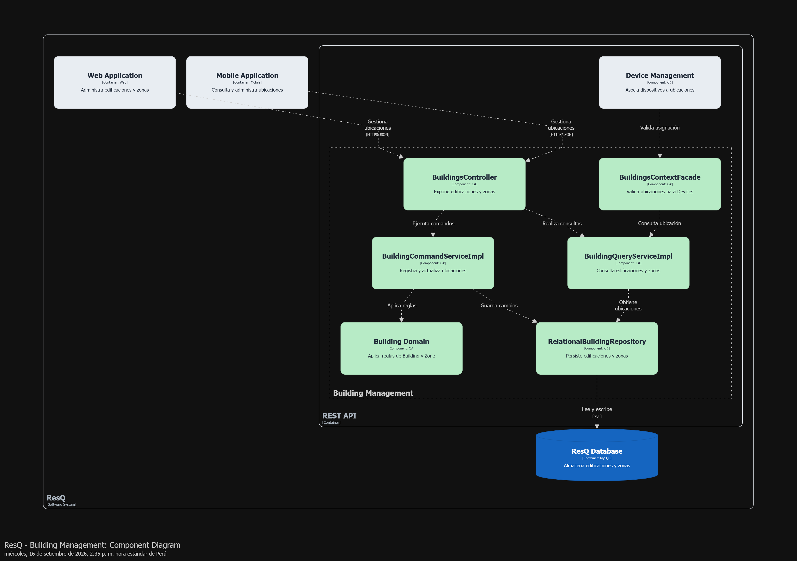

<p align="center">
  <strong>Figura 60. Diagrama de componentes de Building Management.</strong>
</p>

<p align="justify">
Web y Mobile son contenedores separados y consumen BuildingsController. Los servicios de aplicación coordinan reglas de Building y Zone y persistencia en MySQL. Device valida ubicaciones mediante BuildingsContextFacade. La vista muestra el flujo principal; los adaptadores de IAM y publicación outbox se detallan en las capas anteriores para mantener el diagrama simple.
</p>

#### 4.2.4.6. Bounded Context Software Architecture Code Level Diagrams

##### 4.2.4.6.1. Bounded Context Domain Layer Class Diagrams

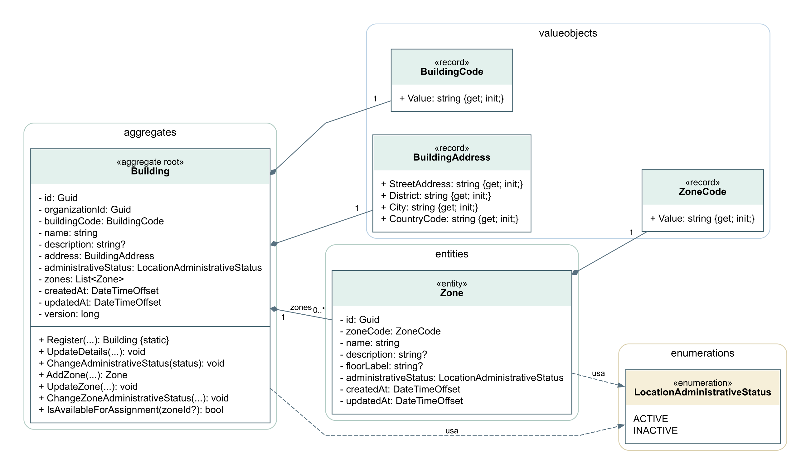

<p align="center">
  <strong>Figura 61. Diagrama UML del agregado Building.</strong>
</p>

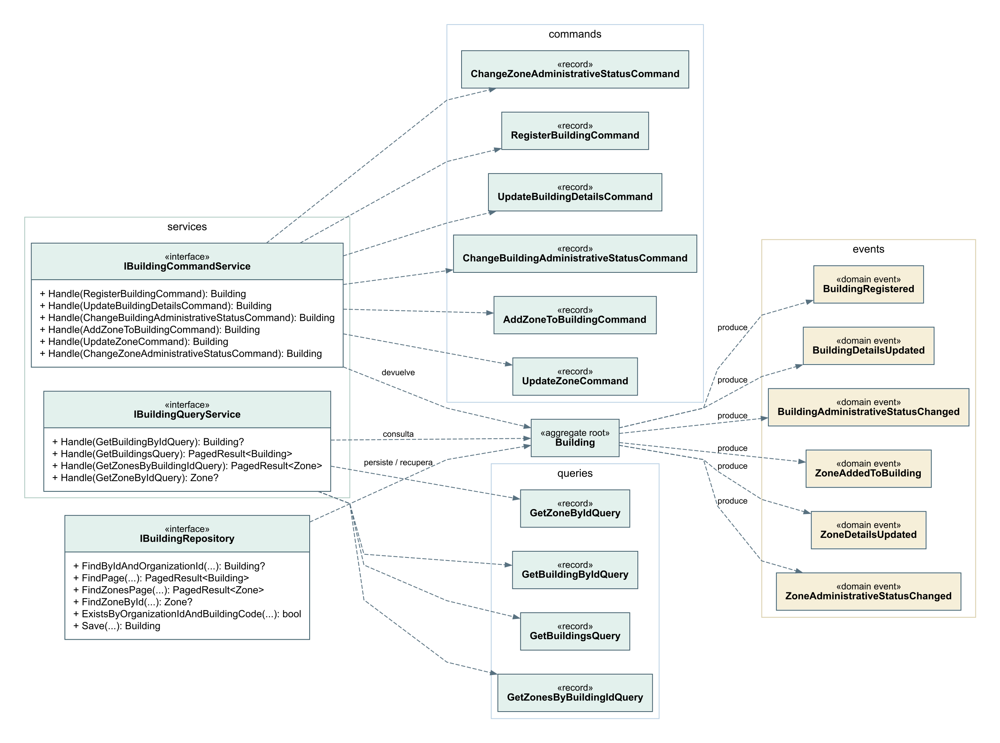

<p align="center">
  <strong>Figura 62. Diagrama UML de contratos de Building Management.</strong>
</p>

<p align="justify">
Building es la raíz y contiene cero o más zonas, cada una perteneciente a una única edificación. Los value objects encapsulan códigos y dirección; los contratos de comandos, consultas y repositorio operan sobre esa estructura. Renombrar una zona mantiene su identidad y referencias, en correspondencia con US22, AC2.
</p>

##### 4.2.4.6.2. Bounded Context Database Design Diagram

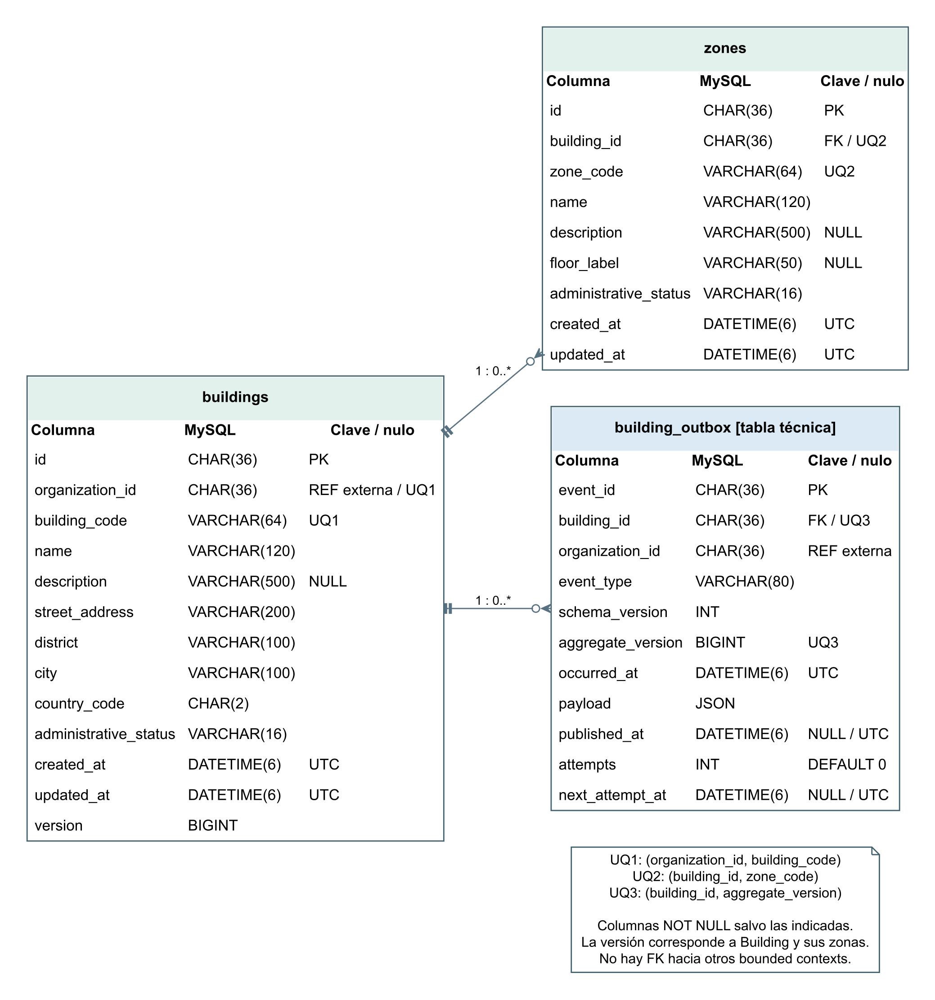

<p align="center">
  <strong>Figura 63. Diagrama relacional de Building Management.</strong>
</p>

<p align="justify">
<code>zones.building_id</code> referencia a <code>buildings.id</code>. Los códigos son únicos por organización o edificación, respectivamente. <code>building_outbox</code> conserva los mensajes de integración en la misma transacción que el agregado; es una tabla técnica. <code>organization_id</code> es una referencia externa, sin FK hacia otro bounded context. La versión de Building también controla los cambios en sus zonas.
</p>

### 4.2.5. Bounded Context: Device Management

#### 4.2.5.1. Domain Layer

**Aggregates**

`Device`

<p align="justify">
Raíz del aggregate que representa un equipo IoT registrado en una organización. Controla sus características, capacidades y asignación física. Un mismo equipo puede medir varias variables y ejecutar acciones; por ello se utiliza una colección de capacidades en lugar de exigir que sea exclusivamente sensor o actuador.
</p>

| Atributo | Tipo de dato | Visibilidad | Descripción |
|---|---|---|---|
| id | Guid | Private | Identificador interno e inmutable del dispositivo. |
| organizationId | Guid | Private | Identificador de la organización propietaria del registro; no representa al usuario que lo creó. |
| deviceCode | DeviceCode | Private | Código estable y único dentro de la organización. |
| name | string | Private | Nombre visible del equipo; obligatorio, de 1 a 120 caracteres. |
| description | string? | Private | Descripción administrativa opcional, hasta 500 caracteres. |
| specifications | DeviceSpecifications | Private | Fabricante, modelo y número de serie, cuando se conocen. |
| assignment | DeviceAssignment | Private | Edificación obligatoria y zona opcional donde está instalado. |
| externalReference | ExternalDeviceReference? | Private | Correspondencia opcional con un equipo de un sistema externo. |
| administrativeStatus | DeviceAdministrativeStatus | Private | Estado administrativo del registro. |
| capabilities | List\<DeviceCapability\> | Private | Capacidades de medición y actuación que pertenecen al agregado. |
| createdAt | DateTimeOffset | Private | Fecha y hora UTC del registro. |
| updatedAt | DateTimeOffset | Private | Fecha y hora UTC de la última modificación. |
| version | long | Private | Versión para controlar modificaciones concurrentes y ordenar eventos. |

| Método | Tipo de retorno | Descripción |
|---|---|---|
| Register(...) | Device | Crea el agregado en estado `INACTIVE` con al menos una capacidad válida. |
| UpdateDetails(name, description, specifications) | void | Modifica datos descriptivos sin alterar la identidad del equipo. |
| ReplaceCapabilities(capabilityDefinitions) | void | Sustituye las capacidades de un dispositivo inactivo; conserva el ID de las capacidades cuyo código no cambia. |
| AssignTo(assignment) | void | Cambia la edificación o zona de un dispositivo inactivo, previa validación externa de la ubicación. |
| ChangeAdministrativeStatus(status) | void | Aplica una transición válida del ciclo de vida administrativo. |

**Entities**

`DeviceCapability`

<p align="justify">
<strong>Descripción:</strong> Capacidad individual de un dispositivo. Tiene identidad propia dentro del agregado y solo se modifica a través de <code>Device</code>; no tiene repositorio ni controlador independiente.
</p>

| Atributo | Tipo de dato | Visibilidad | Descripción |
|---|---|---|---|
| id | Guid | Private | Identificador de la capacidad. |
| code | string | Private | Código estable, de 1 a 80 caracteres, único dentro del dispositivo; por ejemplo, `ambient_temperature` o `close_valve`. |
| kind | CapabilityKind | Private | `MEASUREMENT` o `ACTUATION`. |
| unit | string? | Private | Unidad de una medición, hasta 30 caracteres; no aplica a capacidades de actuación. |

<p align="justify">
Las capacidades describen lo que el equipo puede hacer. No contienen valores medidos, reglas, parámetros de ejecución, resultados de acciones ni datos de conexión. Los ejemplos de códigos son ilustrativos; no constituyen un catálogo de hardware ya seleccionado.
</p>

**Value Objects**

| Value Object (`record`) | Atributos | Validación y significado |
|---|---|---|
| DeviceCode | value: string | Entre 1 y 64 caracteres; espacios exteriores eliminados y conversión a mayúsculas. Se propone admitir letras ASCII, números, guion y guion bajo. |
| DeviceSpecifications | manufacturer: string?, model: string?, serialNumber: string? | Metadatos opcionales de hasta 100 caracteres cada uno. El número de serie no sustituye al identificador interno ni se presume único entre fabricantes. |
| DeviceAssignment | buildingId: Guid, zoneId: Guid? | Siempre exige una edificación. Si existe zona, esta debe pertenecer a esa edificación y a la misma organización. La comprobación de existencia se coordina desde Application Layer. |
| ExternalDeviceReference | sourceSystem: string, externalDeviceId: string | Ambos valores son obligatorios si se proporciona la referencia, de hasta 80 y 120 caracteres. Identifican al equipo en una instancia de integración dentro de la organización. |
| CapabilityDefinition | code: string, kind: CapabilityKind, unit: string? | Entrada inmutable para crear o reemplazar capacidades; aplica las mismas reglas que `DeviceCapability`, sin aceptar su ID desde el cliente. |

<p align="justify">
<code>sourceSystem</code> identifica una <strong>instancia</strong> de integración, por ejemplo <code>bms-campus-norte</code>, y no solo el nombre del fabricante. Se normaliza a minúsculas y admite letras ASCII, números, guion y guion bajo; <code>externalDeviceId</code> conserva mayúsculas y minúsculas y se compara exactamente tras quitar espacios exteriores. La referencia externa y <code>deviceCode</code> son inmutables en esta propuesta; sustituir físicamente el equipo requiere registrar otro <code>Device</code> y retirar el anterior.
</p>

**Enumerations**

| Enumeración | Valores | Significado |
|---|---|---|
| DeviceAdministrativeStatus | INACTIVE, ACTIVE, RETIRED | Registrado y deshabilitado administrativamente; habilitado administrativamente; retirado de manera definitiva. |
| CapabilityKind | MEASUREMENT, ACTUATION | Capacidad para producir una medición o para recibir una acción. |

<p align="justify">
El ciclo administrativo propuesto admite INACTIVE → ACTIVE, ACTIVE → INACTIVE e INACTIVE → RETIRED. RETIRED es terminal; retirar un equipo activo exige desactivarlo primero. Estos estados no equivalen a conectado/desconectado ni al resultado de una prueba de integración. Las modificaciones de ubicación o capacidades solo se permiten en INACTIVE; un equipo retirado permanece consultable y no editable.
</p>

**Commands**

<p align="justify">
Los comandos representan intenciones de modificación. <code>organizationId</code> se obtiene del contexto autorizado del solicitante. <code>expectedVersion</code> se obtiene de <code>If-Match</code> para impedir que una edición sobrescriba cambios más recientes.
</p>

| Command (`record`) | Datos |
|---|---|
| RegisterDeviceCommand | organizationId, deviceCode, name, description?, specifications, assignment, externalReference?, capabilities: List\<CapabilityDefinition\> |
| UpdateDeviceDetailsCommand | organizationId, deviceId, name, description?, specifications, expectedVersion |
| ReplaceDeviceCapabilitiesCommand | organizationId, deviceId, capabilities: List\<CapabilityDefinition\>, expectedVersion |
| AssignDeviceToLocationCommand | organizationId, deviceId, buildingId, zoneId?, expectedVersion |
| ChangeDeviceAdministrativeStatusCommand | organizationId, deviceId, administrativeStatus, expectedVersion |

**Queries**

| Query (`record`) | Datos | Resultado |
|---|---|---|
| GetDeviceByIdQuery | organizationId, deviceId | Device? |
| GetDevicesQuery | organizationId, buildingId?, zoneId?, administrativeStatus?, page, size | PagedResult\<Device\> |
| GetDeviceByExternalReferenceQuery | organizationId, sourceSystem, externalDeviceId | Device? |

**Services**

| Interfaz | Métodos | Tipo de retorno |
|---|---|---|
| IDeviceCommandService | Handle(RegisterDeviceCommand) | Device |
| IDeviceCommandService | Handle(UpdateDeviceDetailsCommand) | Device |
| IDeviceCommandService | Handle(ReplaceDeviceCapabilitiesCommand) | Device |
| IDeviceCommandService | Handle(AssignDeviceToLocationCommand) | Device |
| IDeviceCommandService | Handle(ChangeDeviceAdministrativeStatusCommand) | Device |
| IDeviceQueryService | Handle(GetDeviceByIdQuery) | Device? |
| IDeviceQueryService | Handle(GetDevicesQuery) | PagedResult\<Device\> |
| IDeviceQueryService | Handle(GetDeviceByExternalReferenceQuery) | Device? |

<p align="justify">
<code>IDeviceRepository</code> es el puerto de persistencia del agregado, declarado en el dominio. Su implementación se describe en Infrastructure Layer. Los servicios anteriores son contratos; <code>DeviceCommandServiceImpl</code> y <code>DeviceQueryServiceImpl</code> son sus implementaciones de aplicación. La separación de comandos y consultas no exige bases de datos diferentes.
</p>

<p align="justify">
Los contratos auxiliares <code>DeviceReadScope</code> y <code>DeviceFilters</code> contienen identificadores de ubicaciones autorizadas y filtros de consulta, respectivamente; no dependen de clases de IAM, del framework web ni de la infraestructura. <code>PagedResult&lt;T&gt;</code> contiene <code>Items</code>, <code>Page</code>, <code>Size</code>, <code>TotalElements</code> y <code>TotalPages</code>. Las propiedades públicas de records en C# siguen PascalCase; los nombres camelCase de las tablas de entrada y salida corresponden a su representación JSON. Los identificadores obligatorios rechazan <code>Guid.Empty</code>.
</p>

**Domain Events**

| Evento | Se produce cuando |
|---|---|
| DeviceRegistered | Se registra un dispositivo. |
| DeviceDetailsUpdated | Cambian sus datos descriptivos. |
| DeviceCapabilitiesReplaced | Cambia su conjunto de capacidades. |
| DeviceAssignedToLocation | Cambia su asignación física. |
| DeviceAdministrativeStatusChanged | Se aplica una transición administrativa. |

<p align="justify">
Los eventos se producen únicamente ante cambios efectivos. La aplicación los convierte en mensajes de integración con <code>eventId</code>, <code>eventType</code>, <code>schemaVersion</code>, <code>organizationId</code>, <code>deviceId</code>, <code>aggregateVersion</code>, <code>occurredAt</code> y una instantánea del catálogo del dispositivo. El evento de asignación incluye también la asignación anterior. La instantánea contiene metadatos, capacidades, estado y asignación; no contiene mediciones ni credenciales. Permite que Monitoring y Alert & Response Management actualicen su referencia del equipo sin acceder a las tablas de Devices.
</p>

#### 4.2.5.2. Interface Layer

**REST Controllers**

`DevicesController`

<p align="justify">
<strong>Descripción:</strong> Recibe solicitudes autenticadas, valida su forma, construye comandos o consultas y transforma los resultados en recursos REST. Las reglas del agregado permanecen en Domain Layer y la coordinación de permisos, ubicación y persistencia se ejecuta en Application Layer.
</p>

| Método | Ruta | Descripción | Respuesta exitosa |
|---|---|---|---|
| RegisterDevice() | POST /api/v1/devices | Registra el equipo con sus capacidades y ubicación inicial. | 201, DeviceResource, Location y ETag |
| GetDevices() | GET /api/v1/devices | Lista los dispositivos visibles para el solicitante; admite buildingId, zoneId, administrativeStatus, page y size. | 200, DevicePageResource |
| GetDeviceById() | GET /api/v1/devices/{deviceId} | Consulta un dispositivo de la organización autorizada. | 200, DeviceResource y ETag |
| GetDeviceByExternalReference() | GET /api/v1/devices/by-external-reference?sourceSystem=...&externalDeviceId=... | Resuelve un identificador de una integración. | 200, DeviceResource y ETag |
| UpdateDeviceDetails() | PUT /api/v1/devices/{deviceId}/details | Sustituye sus datos descriptivos. | 200, DeviceResource y ETag |
| ReplaceDeviceCapabilities() | PUT /api/v1/devices/{deviceId}/capabilities | Sustituye el conjunto de capacidades de un equipo inactivo. | 200, DeviceResource y ETag |
| AssignDeviceToLocation() | PUT /api/v1/devices/{deviceId}/assignment | Asigna o reasigna un equipo inactivo a una edificación y, opcionalmente, una zona. | 200, DeviceResource y ETag |
| ChangeDeviceAdministrativeStatus() | PUT /api/v1/devices/{deviceId}/administrative-status | Habilita, deshabilita o retira administrativamente el equipo. | 200, DeviceResource y ETag |

<p align="justify">
Las modificaciones con <code>PUT</code> requieren <code>If-Match</code> con el ETag obtenido al consultar el recurso, derivado de <code>version</code>. Se propone paginación desde cero, tamaño predeterminado 20, máximo 100 y orden estable por <code>createdAt</code> e <code>id</code>. Las consultas sin filtros tampoco devuelven dispositivos fuera del ámbito autorizado. Los dispositivos retirados siguen siendo consultables; el filtro administrativo permite excluirlos. No se expone eliminación física.
</p>

**Resources**

| Resource (`record`) | Contenido |
|---|---|
| RegisterDeviceResource | deviceCode, name, description?, specifications, assignment, externalReference?, capabilities |
| UpdateDeviceDetailsResource | name, description?, specifications |
| ReplaceDeviceCapabilitiesResource | capabilities: List\<CapabilityDefinitionResource\> |
| AssignDeviceToLocationResource | buildingId, zoneId? |
| ChangeDeviceAdministrativeStatusResource | administrativeStatus |
| DeviceSpecificationsResource | manufacturer?, model?, serialNumber? |
| DeviceAssignmentResource | buildingId, zoneId? |
| ExternalDeviceReferenceResource | sourceSystem, externalDeviceId |
| CapabilityDefinitionResource | code, kind, unit? |
| DeviceCapabilityResource | id, code, kind, unit? |
| DeviceResource | id, organizationId, deviceCode, name, description?, specifications, assignment, externalReference?, administrativeStatus, capabilities, createdAt, updatedAt, version |
| DevicePageResource | items: List\<DeviceResource\>, page, size, totalElements, totalPages |
| ErrorResource | code, message, fieldErrors?, traceId |

<p align="justify">
Los recursos de entrada no aceptan <code>organizationId</code>, IDs internos de capacidades, fechas ni versión como campos editables. La organización activa se obtiene de un contexto de acceso validado; en usuarios con varias organizaciones, IAM verifica la selección. No se exponen credenciales de equipos o integraciones.
</p>

**Assemblers**

| Assembler | Responsabilidad |
|---|---|
| RegisterDeviceCommandFromResourceAssembler | Construye RegisterDeviceCommand con el recurso y la organización autorizada. |
| UpdateDeviceDetailsCommandFromResourceAssembler | Construye UpdateDeviceDetailsCommand con el recurso, deviceId, organización y versión esperada. |
| ReplaceDeviceCapabilitiesCommandFromResourceAssembler | Construye ReplaceDeviceCapabilitiesCommand. |
| AssignDeviceToLocationCommandFromResourceAssembler | Construye AssignDeviceToLocationCommand. |
| ChangeDeviceAdministrativeStatusCommandFromResourceAssembler | Construye ChangeDeviceAdministrativeStatusCommand. |
| DeviceQueriesFromRequestAssembler | Convierte parámetros de ruta y consulta en las tres consultas del dominio. |
| DeviceResourceFromEntityAssembler | Convierte Device y sus objetos anidados en DeviceResource. |
| DevicePageResourceFromPageAssembler | Convierte una página de agregados en DevicePageResource. |

**Contrato de errores**

| Código HTTP | Situación |
|---|---|
| 400 | Campos, tipos, enumeraciones, capacidades o parámetros de paginación inválidos; falta una parte de la referencia externa. |
| 401 | Identidad ausente o inválida. |
| 403 | Solicitante autenticado sin permiso para la operación o la ubicación seleccionada. |
| 404 | Dispositivo no encontrado dentro del ámbito visible, o ubicación inexistente dentro del ámbito autorizado. |
| 409 | Código o referencia externa duplicados; transición prohibida; edición de un equipo retirado o cambio de ubicación/capacidades de un equipo activo; zona incompatible con la edificación. |
| 412 | If-Match no coincide con la versión vigente. |
| 428 | Falta If-Match en una modificación que lo requiere. |
| 503 | No puede completarse una validación obligatoria contra IAM o Buildings; no se registra el cambio. |

<p align="justify">
Las lecturas de IDs ajenos al ámbito visible responden 404 sin revelar metadatos de otras organizaciones. Los errores de infraestructura no se convierten en permisos concedidos ni en ubicaciones válidas.
</p>

**Fachada de integración**

<p align="justify">
<code>DevicesContextFacade</code> expone <code>GetDeviceCatalogEntry(organizationId, deviceId)</code> para consultas entre contextos autorizados. Devuelve <code>DeviceCatalogEntry</code> con identidad, ubicación, capacidades, estado y versión, sin entidades persistentes ni tablas compartidas. Utiliza <code>IDeviceQueryService</code>; las identidades de servicio también tienen permisos limitados. Esta fachada permite consultar el catálogo inicial o recuperar información, mientras los eventos comunican cambios posteriores.
</p>

#### 4.2.5.3. Application Layer

`DeviceCommandServiceImpl`

<p align="justify">
<strong>Descripción:</strong> Implementa IDeviceCommandService y coordina los casos de uso. Comprueba autorización y alcance, consulta Buildings cuando corresponde, carga el agregado, invoca sus métodos y guarda el resultado junto con los mensajes pendientes de integración en una misma transacción local.
</p>

| Método | Descripción |
|---|---|
| Handle(RegisterDeviceCommand) | Valida permiso sobre la edificación y zona, comprueba duplicados, verifica la ubicación, crea Device inactivo y persiste DeviceRegistered. |
| Handle(UpdateDeviceDetailsCommand) | Carga el dispositivo dentro del ámbito autorizado, verifica la versión y modifica sus datos descriptivos. |
| Handle(ReplaceDeviceCapabilitiesCommand) | Comprueba versión y estado inactivo; valida la colección completa, conserva IDs para códigos existentes y reemplaza las capacidades mediante el agregado. |
| Handle(AssignDeviceToLocationCommand) | Exige permisos tanto sobre la ubicación actual como sobre la de destino; valida la nueva relación organización–edificación–zona y cambia la asignación del equipo inactivo. |
| Handle(ChangeDeviceAdministrativeStatusCommand) | Comprueba versión y transición. Al activar, revalida la ubicación; al desactivar o retirar, conserva identidad y referencias históricas. |

<p align="justify">
La comprobación previa de duplicados mejora el mensaje al usuario, pero las restricciones únicas de la base de datos resuelven también los registros simultáneos. Una escritura usa comparación de versión; si otro proceso modificó el agregado, se revierte toda la transacción y se responde 412. La versión inicial es 1 y aumenta una vez por cambio efectivo. El estado guardado y la instantánea del evento corresponden a la misma versión.
</p>

`DeviceQueryServiceImpl`

<p align="justify">
<strong>Descripción:</strong> Implementa IDeviceQueryService sin modificar el agregado.
</p>

| Método | Descripción |
|---|---|
| Handle(GetDeviceByIdQuery) | Recupera un equipo filtrando por organización y alcance de acceso del solicitante. |
| Handle(GetDevicesQuery) | Aplica los filtros solicitados y el alcance autorizado antes de paginar y contar los resultados. |
| Handle(GetDeviceByExternalReferenceQuery) | Resuelve una referencia externa únicamente dentro de la organización y ubicaciones visibles. |

**Puertos de aplicación e integración**

| Puerto | Métodos principales | Responsabilidad |
|---|---|---|
| IBuildingContextGateway | ValidateAssignment(organizationId, buildingId, zoneId?): ValidatedAssignment | Consulta el contrato de Buildings y comprueba existencia, pertenencia y disponibilidad administrativa para la asignación. |
| IDeviceAccessGateway | RequirePermission(action, organizationId, buildingId, zoneId?); GetReadScope(organizationId): DeviceReadScope | Obtiene de IAM el permiso de operación y las restricciones de visibilidad del solicitante. |
| IOutboxRepository | Append(message); FindPending(batchSize); MarkPublished(eventId); RecordFailure(eventId, nextAttemptAt) | Almacena y gestiona mensajes de integración pendientes. |
| IIntegrationEventPublisher | Publish(message) | Entrega un mensaje al transporte de integración elegido. |

#### 4.2.5.4. Infrastructure Layer

**Persistencia del agregado**

`IDeviceRepository` / `RelationalDeviceRepository`

<p align="justify">
<strong>Descripción:</strong> IDeviceRepository define el contrato del dominio y RelationalDeviceRepository lo implementa mediante el mecanismo de persistencia relacional elegido. La infraestructura mapea los value objects a columnas, carga las capacidades y aplica transacciones, restricciones de unicidad y control de versión.
</p>

| Método del puerto | Tipo de retorno | Descripción |
|---|---|---|
| FindByIdAndOrganizationId(deviceId, organizationId) | Device? | Carga un agregado dentro de una organización; la aplicación verifica además el alcance sobre su ubicación. |
| FindByExternalReference(organizationId, sourceSystem, externalDeviceId) | Device? | Busca por referencia externa y organización. |
| FindPage(organizationId, filters, readScope, page, size) | PagedResult\<Device\> | Filtra por organización, ubicación, estado y alcance de acceso antes de paginar. |
| ExistsByOrganizationIdAndDeviceCode(organizationId, deviceCode) | bool | Detecta un código administrativo ya registrado. |
| ExistsByExternalReference(organizationId, sourceSystem, externalDeviceId) | bool | Detecta una referencia externa ya registrada. |
| Save(device, expectedVersion?) | Device | Inserta un nuevo agregado o actualiza uno existente comparando su versión; guarda sus capacidades en la misma transacción. |

<p align="justify">
El repositorio no publica un método de eliminación física del agregado. Las capacidades no tienen repositorio público: se insertan, conservan o eliminan como parte de la actualización de Device. La eliminación de una capacidad del catálogo actual no borra los datos históricos que otros contextos ya registraron con su identidad y significado.
</p>

**Adaptadores**

| Componente | Puerto implementado | Descripción |
|---|---|---|
| BuildingContextAdapter | IBuildingContextGateway | Consume la fachada o API de Buildings y traduce su respuesta a ValidatedAssignment. |
| IamDeviceAccessAdapter | IDeviceAccessGateway | Adapta el contexto de identidad y las decisiones de autorización de IAM. |
| RelationalOutboxRepository | IOutboxRepository | Persiste mensajes pendientes en la misma base de datos y transacción del agregado. |
| IntegrationEventPublisherAdapter | IIntegrationEventPublisher | Publica mensajes mediante el transporte configurado. El diseño no presupone un producto de mensajería. |
| DevicePersistenceMapper | No aplica | Convierte Device, DeviceCapability y sus value objects hacia y desde los registros relacionales. |


#### 4.2.5.5. Bounded Context Software Architecture Component Level Diagrams

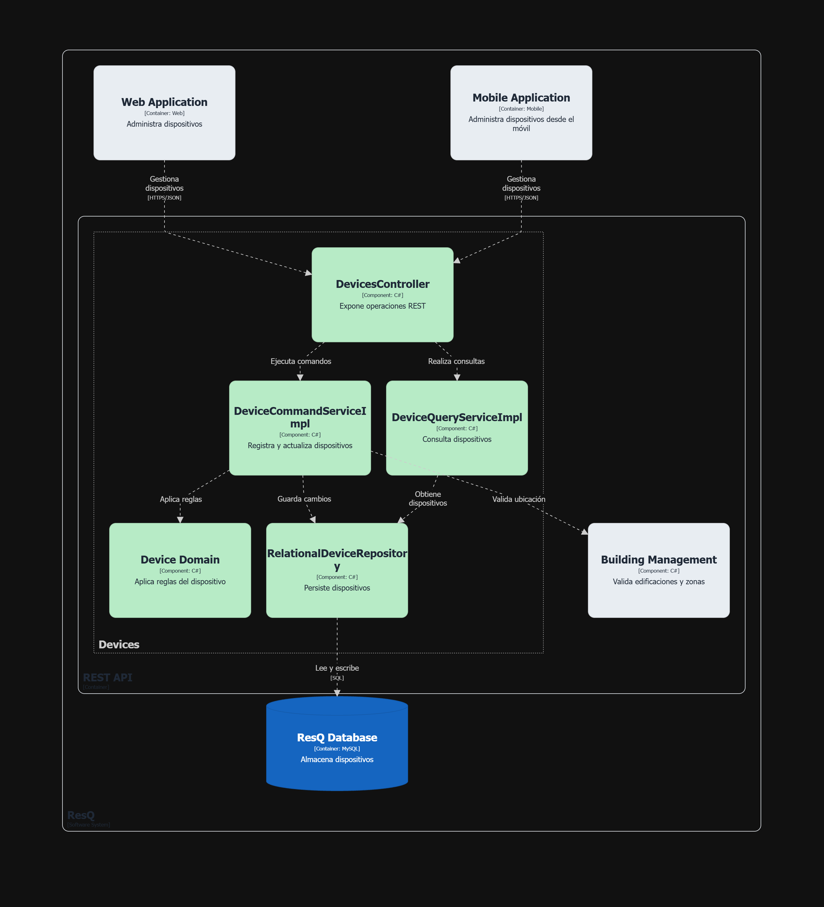

<p align="center">
  <strong>Figura 64. Diagrama de componentes de Devices.</strong>
</p>

#### 4.2.5.6. Bounded Context Software Architecture Code Level Diagrams

##### 4.2.5.6.1. Bounded Context Domain Layer Class Diagrams

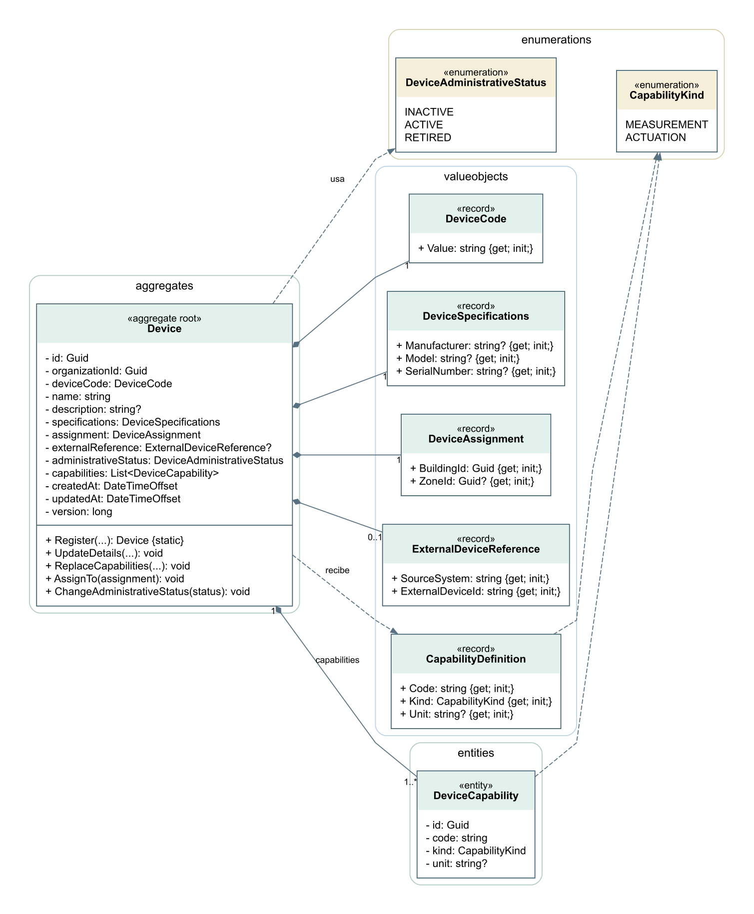

<p align="center">
  <strong>Figura 65. Diagrama UML del agregado Device.</strong>
</p>


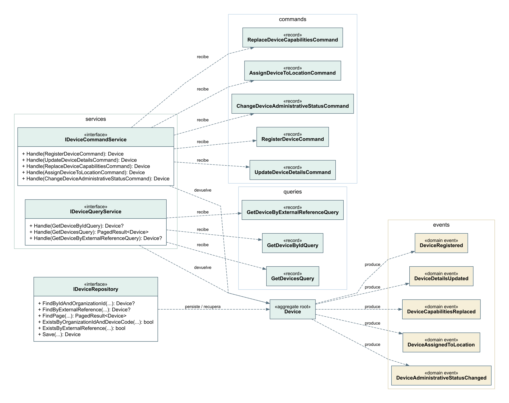

<p align="center">
  <strong>Figura 66. Diagrama UML de contratos de Devices.</strong>
</p>

##### 4.2.5.6.2. Bounded Context Database Design Diagram

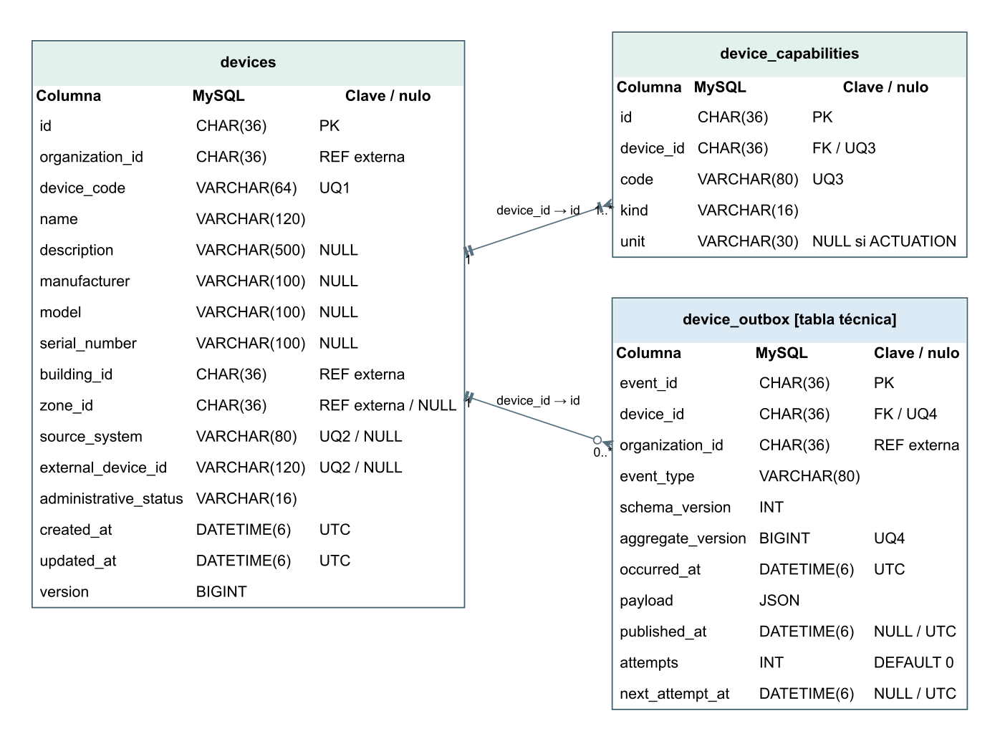

<p align="center">
  <strong>Figura 67. Diagrama relacional de Devices.</strong>
</p>

<div style="page-break-before: always; break-before: page;"></div>

### 4.2.6. Bounded Context: Monitoring

<p align="justify">
El Bounded Context <strong>Monitoring</strong> es responsable de gestionar las mediciones obtenidas desde los dispositivos IoT y mantener una representación actualizada del estado observado de las edificaciones, zonas y dispositivos monitoreados por ResQ.
</p>

<p align="justify">
Su principal propósito es proporcionar visibilidad operacional sobre la infraestructura sin asumir responsabilidades que corresponden a otros Bounded Contexts. Monitoring registra y consulta las condiciones observadas, mientras que <strong>Risk Detection</strong> interpreta estas mediciones para determinar si representan una situación de riesgo.
</p>

<p align="justify">
Este Bounded Context soporta principalmente:
</p>

- **US01 — Consultar el estado general de una edificación.**
- **US02 — Consultar el estado de una zona.**
- **US03 — Consultar mediciones actuales.**
- **US04 — Conocer el estado operativo de un dispositivo.**
- **US05 — Supervisar remotamente una edificación.**

<p align="justify">
Monitoring participa tanto en el entorno <strong>Edge</strong> como en <strong>Cloud</strong>: en Edge recibe y conserva temporalmente las mediciones provenientes de los dispositivos IoT, mientras que en Cloud almacena la información histórica, mantiene los estados operacionales y expone la información requerida por las aplicaciones Web y Mobile.
</p>

<p align="justify">
Monitoring no administra la configuración de los dispositivos, la estructura de las edificaciones, las reglas de detección, las políticas de respuesta ni el ciclo de vida de los incidentes. Para ello colabora respectivamente con <strong>Device Management</strong>, <strong>Building Management</strong>, <strong>Risk Detection</strong>, <strong>Alert & Response Management</strong> e <strong>Incident Management</strong>.
</p>

<p align="justify">
Los principales conceptos identificados para este Bounded Context son <strong>Measurement</strong>, <strong>Measurement Value</strong>, <strong>Device Monitoring State</strong>, <strong>Zone Monitoring State</strong>, <strong>Device Availability</strong>, <strong>Freshness Policy</strong> y <strong>Monitored Condition</strong>.
</p>

<p align="justify">
Las principales responsabilidades del Bounded Context <strong>Monitoring</strong> son:
</p>

- Recibir y registrar las mediciones generadas por los dispositivos IoT.
- Mantener actualizado el estado operativo de los dispositivos monitoreados.
- Mantener actualizado el estado operativo de las zonas monitoreadas.
- Asociar cada medición con el dispositivo, zona y edificación correspondientes.
- Conservar la fecha y hora original en la que se generó cada medición.
- Determinar si una medición continúa siendo vigente de acuerdo con la política de actualidad definida.
- Proporcionar el estado actual de edificaciones, zonas y dispositivos a las aplicaciones de ResQ.
- Proporcionar mediciones válidas al Bounded Context **Risk Detection** para su posterior evaluación.
- Proporcionar a **Incident Management** información actualizada sobre las condiciones de una zona cuando sea requerida para el seguimiento de un incidente.
- Actualizar las representaciones de monitoreo cuando se reciben cambios relevantes relacionados con el estado de un riesgo.
- Mantener el historial de mediciones de los sensores para su posterior consulta y análisis.
- Conservar temporalmente las mediciones en el entorno Edge cuando la comunicación con Cloud no se encuentre disponible.
- Permitir la sincronización posterior de las mediciones pendientes sin modificar el momento original en que fueron obtenidas.
- Mantener las responsabilidades de Monitoring separadas de la clasificación de riesgos, ejecución de respuestas, gestión de incidentes y administración de dispositivos o edificaciones.

#### Class Dictionary

| Class / Interface | Layer | Runtime | Purpose | Main attributes | Main operations |
|---|---|---|---|---|---|
| `Measurement` | Domain | Edge / Cloud | Representa una medición obtenida desde un dispositivo IoT. | `measurementId`, `deviceId`, `buildingId`, `zoneId`, `variableType`, `value`, `unit`, `measuredAt` | `isCurrent(referenceTime, freshnessPolicy)` |
| `MeasurementValue` | Domain | Edge / Cloud | Value Object que representa el valor cuantitativo y su unidad. | `value`, `unit` | `value()`, `unit()` |
| `DeviceMonitoringState` | Domain | Cloud | Representa el estado operacional observado de un dispositivo. | `deviceId`, `zoneId`, `availability`, `lastMeasurementAt`, `updatedAt` | `recordCommunication()`, `markUnavailable()`, `isAvailable()` |
| `ZoneMonitoringState` | Domain | Cloud | Representa el estado operacional observado de una zona. | `zoneId`, `buildingId`, `lastUpdatedAt`, `activeRiskId`, `conditionCode` | `updateObservation()`, `markRiskActive()`, `clearRisk()` |
| `DeviceAvailability` | Domain | Cloud | Enumeración del estado de disponibilidad observado. | `AVAILABLE`, `UNAVAILABLE`, `UNKNOWN` | — |
| `FreshnessPolicy` | Domain | Cloud | Value Object que determina cuándo una medición puede considerarse vigente. | `maximumAge` | `isCurrent(measuredAt, referenceTime)` |
| `MeasurementRepository` | Domain | Cloud / Edge | Abstracción para almacenar y consultar mediciones. | — | `save()`, `findLatestByDevice()`, `findLatestByZone()` |
| `DeviceMonitoringStateRepository` | Domain | Cloud | Abstracción de persistencia de estados operacionales de dispositivos. | — | `findByDeviceId()`, `save()` |
| `ZoneMonitoringStateRepository` | Domain | Cloud | Abstracción de persistencia de estados observados de zonas. | — | `findByZoneId()`, `findByBuildingId()`, `save()` |
| `MonitoringStateService` | Domain | Cloud | Coordina la actualización de estados a partir de nuevas observaciones. | — | `updateDeviceState()`, `updateZoneState()` |
| `RecordMeasurementCommand` | Application | Edge | Representa el ingreso de una nueva medición. | `deviceId`, `variableType`, `value`, `unit`, `measuredAt` | — |
| `RecordMeasurementCommandHandler` | Application | Edge | Coordina el registro local y publicación de una medición. | Dependencies | `handle()` |
| `MeasurementRecordedEvent` | Domain | Edge / Cloud | Representa el hecho de que una medición válida fue registrada. | Measurement data | — |
| `MeasurementReceivedEventHandler` | Application | Cloud | Procesa una medición proveniente del flujo Edge. | Dependencies | `handle()` |
| `RiskStateChangedEventHandler` | Application | Cloud | Actualiza la proyección de estado de una zona cuando cambia un riesgo. | Dependencies | `handle()` |
| `GetBuildingStatusQuery` | Application | Cloud | Solicita el estado actual de una edificación. | `buildingId` | — |
| `GetBuildingStatusQueryHandler` | Application | Cloud | Construye la vista operacional de una edificación. | Dependencies | `handle()` |
| `GetZoneStatusQuery` | Application | Cloud | Solicita el estado actual de una zona. | `zoneId` | — |
| `GetZoneStatusQueryHandler` | Application | Cloud | Recupera el estado observado de una zona. | Dependencies | `handle()` |
| `GetCurrentMeasurementsQuery` | Application | Cloud | Solicita las mediciones vigentes de un dispositivo o zona. | `deviceId` / `zoneId` | — |
| `GetCurrentMeasurementsQueryHandler` | Application | Cloud | Recupera mediciones y aplica la política de vigencia. | Dependencies | `handle()` |
| `GetDeviceStatusQuery` | Application | Cloud | Solicita el estado operacional de un dispositivo. | `deviceId` | — |
| `GetDeviceStatusQueryHandler` | Application | Cloud | Determina la disponibilidad observada del dispositivo. | Dependencies | `handle()` |
| `MeasurementEventPublisher` | Application | Edge | Abstracción para publicar mediciones hacia Cloud. | — | `publish()` |
| `DeviceContextResolver` | Application | Edge / Cloud | Obtiene el contexto mínimo de un dispositivo desde Device Management. | — | `resolve(deviceId)` |
| `MeasurementIngestionController` | Interface | Edge | Recibe mediciones provenientes del Embedded System. | Handler dependency | `recordMeasurement()` |
| `MonitoringQueryController` | Interface | Cloud | Expone consultas de monitoreo mediante REST. | Query handlers | `getBuildingStatus()`, `getZoneStatus()`, `getMeasurements()`, `getDeviceStatus()` |
| `MeasurementEventConsumer` | Interface | Cloud | Consume mediciones publicadas desde Edge. | Handler dependency | `consume()` |
| `RiskStateEventConsumer` | Interface | Cloud | Consume cambios relevantes provenientes de Risk Detection. | Handler dependency | `consume()` |
| `EdgeMeasurementRepositoryAdapter` | Infrastructure | Edge | Implementa almacenamiento local temporal mediante SQLite/Peewee. | SQLite / Peewee | `save()`, `findPending()` |
| `MeasurementEventPublisherAdapter` | Infrastructure | Edge | Publica mediciones hacia el flujo distribuido. | Communication dependency | `publish()` |
| `MeasurementTimeSeriesRepositoryAdapter` | Infrastructure | Cloud | Persiste mediciones longitudinales en InfluxDB. | InfluxDB | `save()`, `findLatestByDevice()`, `findLatestByZone()` |
| `MonitoringStateRepositoryAdapter` | Infrastructure | Cloud | Persiste estados operacionales en PostgreSQL. | PostgreSQL | `find()`, `save()` |
| `DeviceContextIntegrationAdapter` | Infrastructure | Edge / Cloud | Traduce información proveniente de Device Management. | Integration dependency | `resolve()` |
| `BuildingContextIntegrationAdapter` | Infrastructure | Cloud | Obtiene el contexto mínimo de edificaciones y zonas. | Integration dependency | `resolveZone()`, `resolveBuilding()` |

<p align="justify">
Monitoring conserva únicamente las referencias externas necesarias para asociar una medición con el dispositivo, zona y edificación correspondientes.
</p>

<p align="justify">
El ciclo de vida de <code>IoT Device</code>, <code>Building</code> y <code>Zone</code> continúa perteneciendo a sus respectivos Bounded Contexts.
</p>

---

#### 4.2.6.1. Domain Layer

<p align="justify">
La <strong>Domain Layer</strong> contiene los conceptos y reglas que permiten representar las mediciones y el estado operacional observado de la infraestructura.
</p>

<p align="justify">
Esta capa es independiente de HTTP, Flask, bases de datos, frameworks Cloud y mecanismos de comunicación.
</p>

<p align="justify">
Los principales Aggregate Roots son <code>Measurement</code>, <code>DeviceMonitoringState</code> y <code>ZoneMonitoringState</code>.
</p>

##### Measurement

<p align="justify">
<strong>Categoría:</strong> Aggregate Root / Entity.
</p>

<p align="justify">
<strong>Propósito:</strong> Representar una observación cuantitativa producida por un dispositivo IoT en un momento determinado.
</p>

**Atributos:**

- `measurementId: UUID`
- `deviceId: UUID`
- `buildingId: UUID`
- `zoneId: UUID`
- `variableType: String`
- `measurementValue: MeasurementValue`
- `measuredAt: Instant`
- `recordedAt: Instant`

<p align="justify">
<code>deviceId</code>, <code>buildingId</code> y <code>zoneId</code> representan referencias externas hacia otros Bounded Contexts.
</p>

**Operaciones:**

- `isCurrent(referenceTime, freshnessPolicy)`
- `belongsToDevice(deviceId)`
- `belongsToZone(zoneId)`

<p align="justify">
Una medición representa un hecho ocurrido y, por lo tanto, no debe ser modificada posteriormente para reflejar nuevos valores.
</p>

##### MeasurementValue

<p align="justify">
<strong>Categoría:</strong> Value Object.
</p>

<p align="justify">
<strong>Propósito:</strong> Representar el valor cuantitativo de una medición junto con su unidad.
</p>

**Atributos:**

- `value: Decimal`
- `unit: String`

##### DeviceMonitoringState

<p align="justify">
<strong>Categoría:</strong> Aggregate Root.
</p>

<p align="justify">
<strong>Propósito:</strong> Mantener la representación operacional de un dispositivo sin apropiarse de su configuración administrativa.
</p>

**Atributos:**

- `deviceId: UUID`
- `zoneId: UUID`
- `availability: DeviceAvailability`
- `lastMeasurementAt: Instant?`
- `updatedAt: Instant`

**Operaciones:**

- `recordCommunication(measuredAt)`
- `markUnavailable()`
- `markAvailable()`
- `isAvailable()`

##### ZoneMonitoringState

<p align="justify">
<strong>Categoría:</strong> Aggregate Root.
</p>

<p align="justify">
<strong>Propósito:</strong> Mantener una representación resumida de las condiciones observadas en una zona.
</p>

**Atributos:**

- `zoneId: UUID`
- `buildingId: UUID`
- `lastUpdatedAt: Instant`
- `activeRiskId: UUID?`
- `conditionCode: String`

**Operaciones:**

- `updateObservation(at)`
- `markRiskActive(riskDetectionId, conditionCode)`
- `clearRisk()`

<p align="justify">
<code>activeRiskId</code> constituye una referencia externa hacia Risk Detection. Monitoring no administra el riesgo.
</p>

##### DeviceAvailability

<p align="justify">
<strong>Categoría:</strong> Enumeration.
</p>

**Valores:**

- `AVAILABLE`
- `UNAVAILABLE`
- `UNKNOWN`

<p align="justify">
La disponibilidad representa el estado observado del dispositivo y no su estado administrativo dentro de Device Management.
</p>

##### FreshnessPolicy

<p align="justify">
<strong>Categoría:</strong> Value Object.
</p>

<p align="justify">
<strong>Propósito:</strong> Determinar si una medición puede presentarse como información actual.
</p>

**Atributo:**

- `maximumAge: Duration`

**Operación:**

- `isCurrent(measuredAt, referenceTime)`

<p align="justify">
Esto permite satisfacer el requerimiento de no presentar una medición antigua como si fuera vigente.
</p>

##### MeasurementRepository

<p align="justify">
<strong>Categoría:</strong> Repository Interface.
</p>

**Operaciones:**

- `save(measurement)`
- `findLatestByDevice(deviceId)`
- `findLatestByZone(zoneId)`
- `findByTimeRange(deviceId, from, to)`

##### DeviceMonitoringStateRepository

<p align="justify">
<strong>Categoría:</strong> Repository Interface.
</p>

**Operaciones:**

- `findByDeviceId(deviceId)`
- `save(deviceMonitoringState)`

##### ZoneMonitoringStateRepository

<p align="justify">
<strong>Categoría:</strong> Repository Interface.
</p>

**Operaciones:**

- `findByZoneId(zoneId)`
- `findByBuildingId(buildingId)`
- `save(zoneMonitoringState)`

##### MonitoringStateService

<p align="justify">
<strong>Categoría:</strong> Domain Service.
</p>

<p align="justify">
<strong>Propósito:</strong> Coordinar actualizaciones del estado operacional cuando estas requieren combinar una nueva observación con el estado previamente conocido.
</p>

**Operaciones:**

- `updateDeviceState(state, measurement)`
- `updateZoneState(state, measurement)`
- `evaluateAvailability(state, referenceTime, expectedCommunicationPeriod)`

##### Business Rules

<p align="justify">
El dominio Monitoring aplica las siguientes reglas:
</p>

1. Toda medición registrada debe mantener un identificador único.

2. Toda medición debe estar asociada con el dispositivo que la originó.

3. Cuando el contexto de ubicación se encuentra disponible, la medición debe conservar las referencias de la zona y edificación correspondientes.

4. Una medición conserva permanentemente el momento original en el que fue obtenida.

5. Las mediciones históricas no deben modificarse cuando un dispositivo sea posteriormente trasladado a otra zona.

6. Una medición solo puede presentarse como vigente cuando cumple la política de frescura configurada.

7. Cuando no exista una medición vigente, ResQ debe indicar que no dispone de información actual en lugar de presentar información histórica como si fuera reciente.

8. Un dispositivo se considera disponible cuando mantiene comunicación dentro del periodo esperado.

9. Cuando un dispositivo deja de comunicar información durante el periodo establecido, su estado observado debe reflejar indisponibilidad.

10. Monitoring no determina si una medición representa un riesgo.

11. La clasificación del tipo y nivel del riesgo pertenece a Risk Detection.

12. Monitoring puede conservar una referencia a un riesgo activo para construir sus vistas operacionales, pero no administra su ciclo de vida.

13. El estado de una zona debe actualizarse cuando exista nueva información operacional relevante.

14. El estado general de una edificación debe construirse a partir de la información disponible de sus zonas sin apropiarse del modelo de Building Management.

15. Solo mediciones consideradas válidas por el flujo de ingreso pueden ser incorporadas al estado operacional.

---

#### 4.2.6.2. Interface Layer

<p align="justify">
La <strong>Interface Layer</strong> permite que las aplicaciones, dispositivos y otros Bounded Contexts interactúen con las capacidades de Monitoring. Su responsabilidad es recibir solicitudes o eventos externos, transformar la información recibida al formato requerido por la Application Layer y devolver las respuestas correspondientes.
</p>

<p align="justify">
Monitoring cuenta con interfaces tanto en el entorno <strong>Edge</strong> como en <strong>Cloud</strong>, debido a que las mediciones son recibidas inicialmente cerca del dispositivo y posteriormente son almacenadas y consultadas desde los servicios centrales de ResQ.
</p>

##### MeasurementIngestionController

<p align="justify">
<strong>Runtime:</strong> Edge.
</p>

<p align="justify">
<code>MeasurementIngestionController</code> recibe las mediciones enviadas por los dispositivos IoT hacia el Edge Service.
</p>

Ejemplo conceptual:

```text
POST /edge/v1/measurements
```

<p align="justify">
La solicitud contiene información como:
</p>

- Identificador del dispositivo.
- Tipo de variable medida.
- Valor obtenido.
- Unidad de medida.
- Fecha y hora original de la medición.

<p align="justify">
El controlador transforma la información recibida en un <code>RecordMeasurementCommand</code> y delega su procesamiento a <code>RecordMeasurementCommandHandler</code>.
</p>

<p align="justify">
Este componente no determina si una medición representa una situación de riesgo, ya que dicha responsabilidad corresponde a <strong>Risk Detection</strong>.
</p>

##### MonitoringQueryController

<p align="justify">
<strong>Runtime:</strong> Cloud.
</p>

<p align="justify">
<code>MonitoringQueryController</code> expone las operaciones que permiten a las aplicaciones Web y Mobile consultar el estado actual de la infraestructura monitoreada.
</p>

Ejemplos conceptuales:

```text
GET /api/v1/monitoring/buildings/{buildingId}/status
GET /api/v1/monitoring/zones/{zoneId}/status
GET /api/v1/monitoring/devices/{deviceId}/status
GET /api/v1/monitoring/devices/{deviceId}/measurements/current
```

<p align="justify">
Estas operaciones permiten consultar:
</p>

- Estado general de una edificación.
- Estado actual de una zona.
- Disponibilidad de un dispositivo.
- Mediciones actuales.

<p align="justify">
Cada solicitud es delegada al Query Handler correspondiente dentro de la Application Layer.
</p>

##### MeasurementEventConsumer

<p align="justify">
<strong>Runtime:</strong> Cloud.
</p>

<p align="justify">
<code>MeasurementEventConsumer</code> recibe las mediciones publicadas desde el entorno Edge y las entrega a <code>MeasurementReceivedEventHandler</code>.
</p>

<p align="justify">
Su función consiste en adaptar el mensaje recibido al modelo utilizado por la Application Layer, sin implementar reglas del dominio.
</p>

##### RiskStateEventConsumer

<p align="justify">
<strong>Runtime:</strong> Cloud.
</p>

<p align="justify">
<code>RiskStateEventConsumer</code> recibe eventos relevantes provenientes de <strong>Risk Detection</strong>, como la detección o finalización de una situación de riesgo.
</p>

<p align="justify">
Estos eventos permiten actualizar la representación operacional de las zonas mostradas por Monitoring.
</p>

<p align="justify">
Monitoring únicamente conserva la información necesaria para representar el estado actual; la lógica utilizada para determinar el riesgo continúa perteneciendo a Risk Detection.
</p>

---

#### 4.2.6.3. Application Layer

<p align="justify">
La <strong>Application Layer</strong> coordina los casos de uso del Bounded Context Monitoring y conecta las interfaces externas con las reglas definidas en la Domain Layer.
</p>

<p align="justify">
Esta capa organiza principalmente los procesos de:
</p>

- Registro de mediciones.
- Publicación de mediciones desde Edge.
- Almacenamiento de mediciones en Cloud.
- Actualización del estado de dispositivos y zonas.
- Consulta del estado de edificaciones.
- Consulta del estado de zonas.
- Consulta de mediciones actuales.
- Consulta de disponibilidad de dispositivos.

##### RecordMeasurementCommand

<p align="justify">
<strong>Runtime:</strong> Edge.
</p>

<p align="justify">
Representa la solicitud de registrar una nueva medición obtenida desde un dispositivo IoT.
</p>

**Atributos:**

- `deviceId: UUID`
- `variableType: String`
- `value: Decimal`
- `unit: String`
- `measuredAt: Instant`

##### RecordMeasurementCommandHandler

<p align="justify">
<strong>Runtime:</strong> Edge.
</p>

<p align="justify">
Coordina el ingreso de una nueva medición al sistema.
</p>

<p align="justify">
El flujo principal es:
</p>

1. Recibir el `RecordMeasurementCommand`.
2. Obtener el contexto mínimo del dispositivo mediante `DeviceContextResolver`.
3. Construir el objeto `Measurement`.
4. Conservar temporalmente la medición en el entorno Edge cuando sea necesario.
5. Crear un `MeasurementRecordedEvent`.
6. Publicar el evento mediante `MeasurementEventPublisher`.

<p align="justify">
La fecha y hora original de la medición se conserva durante todo el proceso.
</p>

##### MeasurementReceivedEventHandler

<p align="justify">
<strong>Runtime:</strong> Cloud.
</p>

<p align="justify">
Procesa las mediciones provenientes del entorno Edge.
</p>

<p align="justify">
Su flujo principal es:
</p>

1. Recibir un `MeasurementRecordedEvent`.
2. Reconstruir la medición.
3. Almacenar la medición en la base de datos longitudinal.
4. Recuperar el estado operacional del dispositivo.
5. Actualizar la última comunicación del dispositivo.
6. Recuperar el estado operacional de la zona.
7. Actualizar la última observación de la zona.
8. Persistir los estados actualizados.

<p align="justify">
Una vez registrada, la medición puede ser utilizada por <strong>Risk Detection</strong> para evaluar posibles situaciones de riesgo.
</p>

##### RiskStateChangedEventHandler

<p align="justify">
<strong>Runtime:</strong> Cloud.
</p>

<p align="justify">
Procesa eventos provenientes de Risk Detection cuando cambia el estado de riesgo asociado a una zona.
</p>

<p align="justify">
Permite:
</p>

- Asociar un riesgo activo con una zona.
- Actualizar la condición mostrada en Monitoring.
- Eliminar la referencia cuando el riesgo deja de estar activo.

<p align="justify">
Este handler no determina la existencia ni severidad del riesgo.
</p>

##### GetBuildingStatusQuery

<p align="justify">
Representa una solicitud para consultar el estado actual de una edificación.
</p>

**Atributo:**

- `buildingId: UUID`

##### GetBuildingStatusQueryHandler

<p align="justify">
Construye la vista actual de una edificación utilizando los estados disponibles de sus diferentes zonas.
</p>

<p align="justify">
La respuesta puede contener:
</p>

- Última actualización.
- Zonas monitoreadas.
- Estado operacional de cada zona.
- Disponibilidad de dispositivos.
- Referencia a riesgos activos, cuando corresponda.

##### GetZoneStatusQuery

<p align="justify">
Representa una solicitud para consultar el estado de una zona.
</p>

**Atributo:**

- `zoneId: UUID`

##### GetZoneStatusQueryHandler

<p align="justify">
Recupera la información operacional disponible para la zona indicada, incluyendo su condición actual y la fecha de última actualización.
</p>

##### GetCurrentMeasurementsQuery

<p align="justify">
Permite solicitar las mediciones actuales asociadas con un dispositivo o zona.
</p>

<p align="justify">
Puede contener:
</p>

- `deviceId: UUID`, o
- `zoneId: UUID`.

##### GetCurrentMeasurementsQueryHandler

<p align="justify">
Obtiene las mediciones más recientes y utiliza <code>FreshnessPolicy</code> para determinar si pueden considerarse actuales.
</p>

<p align="justify">
Cuando la última medición supera el periodo permitido, el sistema debe indicar que no existe información vigente en lugar de presentar una medición antigua como actual.
</p>

##### GetDeviceStatusQuery

<p align="justify">
Representa una solicitud para consultar el estado operacional de un dispositivo.
</p>

**Atributo:**

- `deviceId: UUID`

##### GetDeviceStatusQueryHandler

<p align="justify">
Obtiene <code>DeviceMonitoringState</code> y devuelve información como:
</p>

- Disponibilidad.
- Última comunicación.
- Zona asociada.
- Fecha de última actualización.

##### MeasurementEventPublisher

<p align="justify">
<strong>Runtime:</strong> Edge.
</p>

<p align="justify">
Abstracción utilizada para publicar las nuevas mediciones hacia el flujo distribuido de ResQ.
</p>

**Operación:**

```text
publish(event)
```

<p align="justify">
La Application Layer no depende directamente del mecanismo de comunicación utilizado.
</p>

##### DeviceContextResolver

<p align="justify">
Permite obtener el contexto mínimo necesario del dispositivo que originó una medición.
</p>

**Operación:**

```text
resolve(deviceId)
```

<p align="justify">
La información obtenida puede incluir:
</p>

- `deviceId`.
- `buildingId`.
- `zoneId`.

<p align="justify">
Monitoring no copia ni administra el modelo completo de Device Management.
</p>

---

#### 4.2.6.4. Infrastructure Layer

<p align="justify">
La <strong>Infrastructure Layer</strong> implementa los mecanismos técnicos necesarios para almacenar, transmitir y recuperar la información utilizada por Monitoring.
</p>

<p align="justify">
Debido a que el Bounded Context maneja distintos tipos de información, se utiliza una estrategia de persistencia diferenciada:
</p>

- **InfluxDB** para las mediciones longitudinales o series temporales.
- **PostgreSQL** para los estados operacionales actuales.
- **SQLite**, mediante **Peewee ORM**, para el almacenamiento temporal utilizado por el Edge Service.

##### EdgeMeasurementRepositoryAdapter

<p align="justify">
<strong>Runtime:</strong> Edge.
</p>

<p align="justify">
Implementa el almacenamiento temporal de mediciones mediante <strong>SQLite y Peewee ORM</strong>.
</p>

<p align="justify">
Sus principales responsabilidades son:
</p>

- Almacenar mediciones pendientes.
- Conservar el timestamp original.
- Recuperar registros pendientes.
- Actualizar el estado de sincronización cuando la información haya sido enviada correctamente.

<p align="justify">
Este almacenamiento soporta el patrón <strong>store-and-forward</strong> utilizado cuando existe una interrupción temporal de la conectividad.
</p>

##### MeasurementEventPublisherAdapter

<p align="justify">
<strong>Runtime:</strong> Edge.
</p>

<p align="justify">
Implementa <code>MeasurementEventPublisher</code>.
</p>

<p align="justify">
Se encarga de transmitir las mediciones registradas hacia los servicios Cloud mediante el mecanismo de comunicación definido por la arquitectura general de ResQ.
</p>

##### MeasurementTimeSeriesRepositoryAdapter

<p align="justify">
<strong>Runtime:</strong> Cloud.
</p>

<p align="justify">
Implementa la persistencia de mediciones utilizando <strong>InfluxDB</strong>.
</p>

<p align="justify">
InfluxDB resulta apropiado para esta información debido a que las mediciones se generan continuamente y se encuentran asociadas a un instante de tiempo.
</p>

<p align="justify">
Permite realizar operaciones como:
</p>

- Registrar una medición.
- Obtener la medición más reciente de un dispositivo.
- Consultar mediciones de una zona.
- Recuperar series de mediciones dentro de un intervalo temporal.

##### MonitoringStateRepositoryAdapter

<p align="justify">
<strong>Runtime:</strong> Cloud.
</p>

<p align="justify">
Implementa la persistencia de <code>DeviceMonitoringState</code> y <code>ZoneMonitoringState</code> utilizando <strong>PostgreSQL</strong>.
</p>

<p align="justify">
PostgreSQL almacena los estados operacionales actuales que requieren consistencia y consultas frecuentes desde la aplicación.
</p>

##### DeviceContextIntegrationAdapter

<p align="justify">
Permite obtener la información necesaria desde <strong>Device Management</strong>.
</p>

<p align="justify">
Este adapter traduce el contrato externo hacia la representación que Monitoring necesita, evitando depender directamente del modelo interno de Device Management.
</p>

##### BuildingContextIntegrationAdapter

<p align="justify">
Permite obtener el contexto mínimo necesario desde <strong>Building Management</strong>, principalmente la relación entre edificaciones y zonas.
</p>

<p align="justify">
Monitoring utiliza esta información como referencia, pero no modifica ni administra estos elementos.
</p>

##### Consideraciones de persistencia

<p align="justify">
Monitoring utiliza una estrategia de persistencia políglota:
</p>

- Las **mediciones históricas** se almacenan en InfluxDB debido a su naturaleza temporal.
- Los **estados actuales de dispositivos y zonas** se almacenan en PostgreSQL.
- Las **mediciones pendientes del Edge Service** se conservan temporalmente en SQLite.

<p align="justify">
Esta separación permite utilizar el almacenamiento más adecuado según las características de cada tipo de dato.
</p>

---

#### 4.2.6.5. Bounded Context Software Architecture Component Level Diagrams

<p align="justify">
Monitoring participa tanto en el <strong>ResQ Edge Service</strong> como en el <strong>ResQ Cloud RESTful API</strong>. Por esta razón, se representan dos Component Level Diagrams.
</p>

##### Monitoring — ResQ Edge Service Component Diagram

<p align="justify">
Los principales componentes del entorno Edge son:
</p>

- **Measurement Ingestion Interface**, encargado de recibir mediciones del Embedded Application.
- **Edge Monitoring Application**, responsable de coordinar el registro y publicación de las mediciones.
- **Monitoring Domain**, que contiene los conceptos y reglas relacionados con las mediciones.
- **Local Measurement Buffer**, encargado de conservar temporalmente las mediciones utilizando SQLite y Peewee.
- **Device Context Integration**, utilizado para obtener información mínima sobre el dispositivo y su ubicación.
- **Measurement Event Publisher**, encargado de transmitir las mediciones hacia Cloud.

<p align="justify">
El flujo principal puede representarse de la siguiente manera:
</p>

```text
ESP32 / Embedded Application
            |
            v
Measurement Ingestion Interface
            |
            v
Edge Monitoring Application
            |
            v
Monitoring Domain
       /           \
      v             v
Device Context   Local SQLite Buffer
 Integration
      \             /
       \           /
            v
Measurement Event Publisher
            |
            v
ResQ Cloud
```

**DIAGRAM — Monitoring Edge Component Level Diagram**

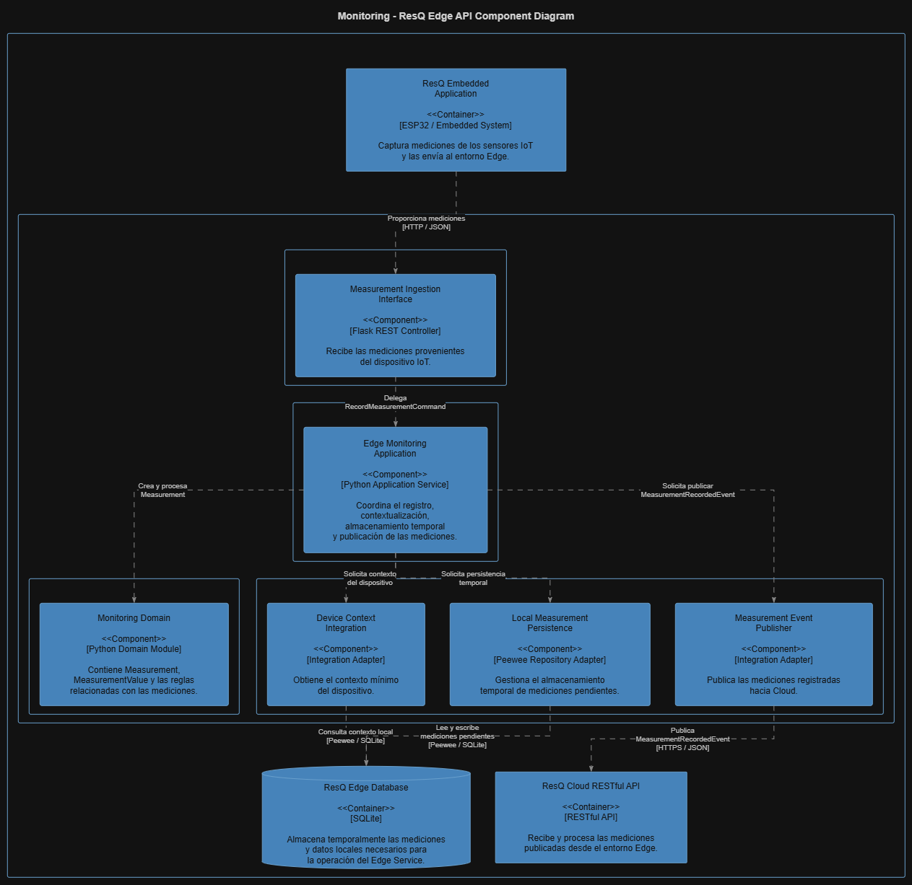

<p align="center">
  <strong>Figura 68. MonitoringEdgeComponentLevelDiagram.</strong>
</p>

##### Monitoring — ResQ Cloud RESTful API Component Diagram

<p align="justify">
Los principales componentes del entorno Cloud son:
</p>

- **Monitoring Query API**
- **Measurement Event Consumer**
- **Risk State Event Consumer**
- **Monitoring Application**
- **Monitoring Domain**
- **Time-Series Persistence**
- **Operational State Persistence**
- **Device Management Integration**
- **Building Management Integration**

<p align="justify">
El flujo principal puede representarse como:
</p>

```text
                   Web / Mobile Applications
                             |
                             v
                    Monitoring Query API
                             |
                             v
                   Monitoring Application
                             |
                             v
                     Monitoring Domain
                      /             \
                     v               v
         Operational State       Time-Series
           Persistence           Persistence
           PostgreSQL             InfluxDB


Edge Measurement Flow
        |
        v
Measurement Event Consumer
        |
        v
Monitoring Application
```

<p align="justify">
Los eventos relevantes provenientes de Risk Detection ingresan mediante <code>Risk State Event Consumer</code> para actualizar las representaciones operacionales utilizadas por Monitoring.
</p>

**DIAGRAM — Monitoring Cloud Component Level Diagram**

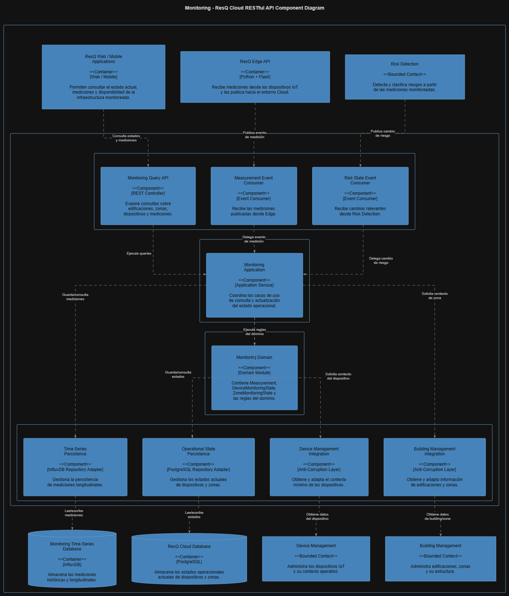

<p align="center">
  <strong>Figura 69. MonitoringCloudComponentLevelDiagram.</strong>
</p>

---

#### 4.2.6.6. Bounded Context Software Architecture Code Level Diagrams

<p align="justify">
Los <strong>Code Level Diagrams</strong> representan la estructura interna del Bounded Context Monitoring con un mayor nivel de detalle.
</p>

<p align="justify">
Para Monitoring se elaboran dos diagramas principales:
</p>

- **Domain Layer Class Diagram**, que representa las clases, Value Objects, enumeraciones, repositorios y servicios del dominio.
- **Database Design Diagram**, que representa las estructuras de persistencia utilizadas en Cloud y Edge.

---

##### 4.2.6.6.1. Bounded Context Domain Layer Class Diagrams

<p align="justify">
El Domain Layer Class Diagram debe representar los siguientes elementos.
</p>

**Aggregate Roots / Entities**

- `Measurement`
- `DeviceMonitoringState`
- `ZoneMonitoringState`

**Value Objects**

- `MeasurementValue`
- `FreshnessPolicy`

**Enumeration**

- `DeviceAvailability`

**Repository Interfaces**

- `MeasurementRepository`
- `DeviceMonitoringStateRepository`
- `ZoneMonitoringStateRepository`

**Domain Service**

- `MonitoringStateService`

<p align="justify">
Las principales relaciones son:
</p>

```text
Measurement "1" *-- "1" MeasurementValue

DeviceMonitoringState "1" --> "1" DeviceAvailability

ZoneMonitoringState "1" ..> Measurement : updated from

MeasurementRepository ..> Measurement : persists

DeviceMonitoringStateRepository ..> DeviceMonitoringState : persists

ZoneMonitoringStateRepository ..> ZoneMonitoringState : persists

MonitoringStateService ..> Measurement
MonitoringStateService ..> DeviceMonitoringState
MonitoringStateService ..> ZoneMonitoringState

FreshnessPolicy ..> Measurement : evaluates freshness
```

<p align="justify">
<code>Measurement</code> conserva como referencias externas:
</p>

```text
deviceId
buildingId
zoneId
```

<p align="justify">
Por esta razón, los siguientes conceptos no deben modelarse como Aggregates pertenecientes a Monitoring:
</p>

- `IoT Device`
- `Building`
- `Zone`
- `Risk`
- `Incident`
- `Alert`

<p align="justify">
Estos conceptos pertenecen a otros Bounded Contexts.
</p>

<p align="justify">
El diagrama debe mostrar:
</p>

- Atributos.
- Métodos.
- Visibilidad UML.
- Relaciones.
- Multiplicidades.
- Composiciones.
- Dependencias.

**DIAGRAM — Monitoring Domain Layer Class Diagram**

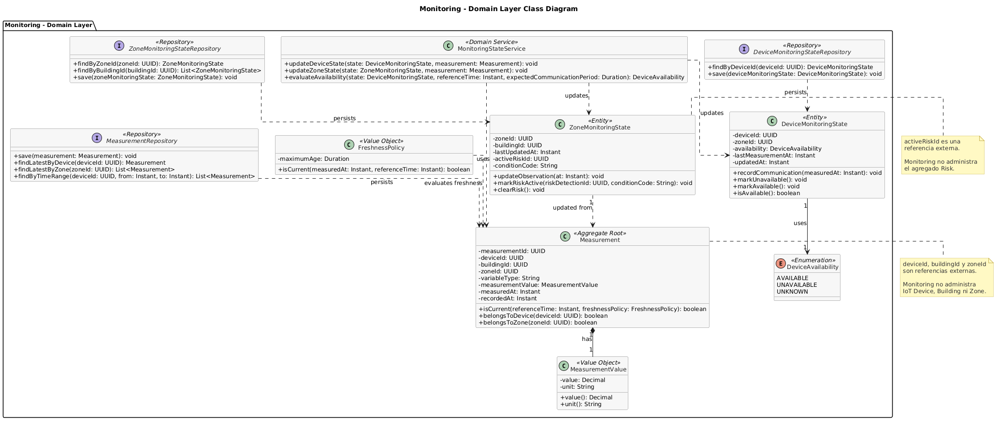

<p align="center">
  <strong>Figura 70. MonitoringDomainLayerClassDiagram.</strong>
</p>

---

##### 4.2.6.6.2. Bounded Context Database Design Diagram

<p align="justify">
El diseño de persistencia de Monitoring se divide en tres componentes:
</p>

1. **InfluxDB**, para almacenar las mediciones longitudinales.
2. **PostgreSQL**, para almacenar los estados operacionales actuales.
3. **SQLite**, para mantener el buffer temporal utilizado en Edge.

###### Cloud — InfluxDB

<p align="justify">
Las mediciones se almacenan conceptualmente en:
</p>

`monitoring_measurements`

| Elemento | Tipo | Descripción |
|---|---|---|
| `time` | Timestamp | Momento original de la medición. |
| `measurement_id` | UUID | Identificador único de la medición. |
| `device_id` | UUID | Referencia al dispositivo de origen. |
| `building_id` | UUID | Referencia externa a la edificación. |
| `zone_id` | UUID | Referencia externa a la zona. |
| `variable_type` | String | Variable observada. |
| `value` | Decimal | Valor medido. |
| `unit` | String | Unidad de medida. |

<p align="justify">
Los identificadores de dispositivo, edificación y zona se utilizan como referencias y no implican que Monitoring sea propietario de estos conceptos.
</p>

###### Cloud — PostgreSQL

###### `monitoring_device_states`

<p align="justify">
Almacena el estado operacional actual de cada dispositivo.
</p>

| Column | Type | Constraint | Description |
|---|---|---|---|
| `device_id` | UUID | PRIMARY KEY | Referencia externa al dispositivo. |
| `zone_id` | UUID | NOT NULL | Zona asociada. |
| `availability_status` | VARCHAR(20) | NOT NULL | Disponibilidad observada. |
| `last_measurement_at` | TIMESTAMP | NULL | Última medición recibida. |
| `updated_at` | TIMESTAMP | NOT NULL | Última actualización del estado. |

###### `monitoring_zone_states`

<p align="justify">
Almacena el estado operacional actual de cada zona.
</p>

| Column | Type | Constraint | Description |
|---|---|---|---|
| `zone_id` | UUID | PRIMARY KEY | Referencia externa a la zona. |
| `building_id` | UUID | NOT NULL | Referencia externa a la edificación. |
| `active_risk_id` | UUID | NULL | Referencia externa al riesgo activo. |
| `condition_code` | VARCHAR(50) | NOT NULL | Condición operacional actual. |
| `last_updated_at` | TIMESTAMP | NOT NULL | Última actualización disponible. |

<p align="justify">
<code>active_risk_id</code> no constituye una clave foránea hacia la persistencia interna de Risk Detection, evitando acoplamiento directo entre bases de datos pertenecientes a distintos Bounded Contexts.
</p>

###### Edge — SQLite

###### `edge_measurement_buffer`

<p align="justify">
Mantiene temporalmente las mediciones pendientes de envío hacia Cloud.
</p>

| Column | Type | Constraint | Description |
|---|---|---|---|
| `measurement_id` | UUID | PRIMARY KEY | Identificador de la medición. |
| `device_id` | UUID | NOT NULL | Dispositivo de origen. |
| `building_id` | UUID | NULL | Edificación asociada. |
| `zone_id` | UUID | NULL | Zona asociada. |
| `variable_type` | VARCHAR(100) | NOT NULL | Variable observada. |
| `measured_value` | DECIMAL | NOT NULL | Valor registrado. |
| `unit` | VARCHAR(50) | NOT NULL | Unidad de medida. |
| `measured_at` | DATETIME | NOT NULL | Fecha y hora original. |
| `sync_status` | VARCHAR(20) | NOT NULL | Estado de sincronización. |
| `retry_count` | INTEGER | NOT NULL | Número de intentos realizados. |

<p align="justify">
Esta tabla permite soportar el patrón <strong>store-and-forward</strong>, conservando la información cuando la comunicación con Cloud se encuentra temporalmente interrumpida.
</p>

<p align="justify">
Conceptualmente, la persistencia queda organizada de la siguiente manera:
</p>

```text
                    MONITORING

          ┌──────────── CLOUD ────────────┐
          │                               │
          │          InfluxDB             │
          │  monitoring_measurements      │
          │                               │
          │         PostgreSQL            │
          │ ┌───────────────────────────┐ │
          │ │ monitoring_device_states │ │
          │ │ monitoring_zone_states   │ │
          │ └───────────────────────────┘ │
          └───────────────────────────────┘
                          ▲
                          │
                    sincronización
                          │
          ┌──────────── EDGE ─────────────┐
          │                               │
          │       SQLite + Peewee         │
          │ edge_measurement_buffer       │
          │                               │
          └───────────────────────────────┘
```

<p align="justify">
Monitoring no debe crear tablas propias para:
</p>

- Devices.
- Buildings.
- Zones.
- Risks.
- Alerts.
- Incidents.

<p align="justify">
Estos conceptos continúan perteneciendo a sus respectivos Bounded Contexts.
</p>

**DIAGRAM — Monitoring Database Design Diagram**

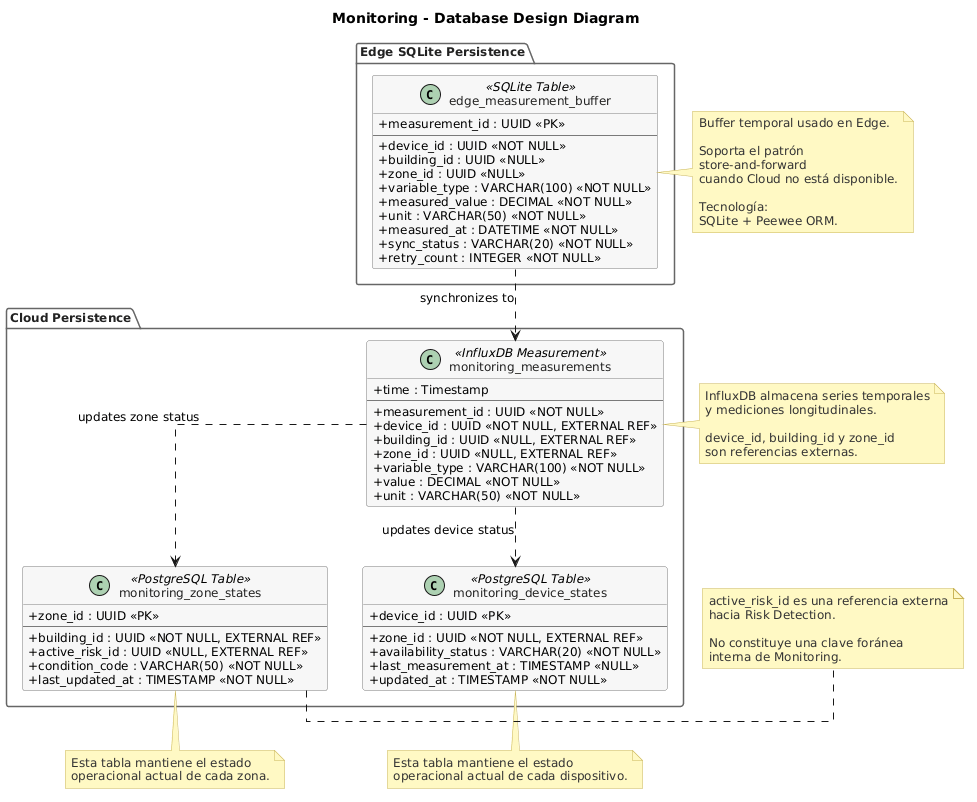

<p align="center">
  <strong>Figura 71. MonitoringDatabaseLayerClassDiagram.</strong>
</p>


### 4.2.7. Bounded Context: User

<p align="justify">
El Bounded Context User es responsable de gestionar la información del perfil personal, los datos de contacto y las preferencias de las personas que interactúan con la plataforma ResQ, ya sean administradores de edificaciones, responsables de seguridad, facility managers o usuarios integradores.
</p>

<p align="justify">
Este Bounded Context atiende las necesidades de personalización y contacto del sistema. Asegura que la plataforma disponga de la información necesaria para identificar humanamente a los usuarios, enviarles notificaciones de emergencia a través de los canales adecuados y adaptar la experiencia del sistema a sus preferencias, sin mezclar estos datos con la lógica estricta de control de acceso.
</p>

<p align="justify">
Como se definió en la arquitectura de la solución, este contexto está estrictamente separado del Bounded Context Identity and Access Management (IAM). Mientras IAM se encarga de las credenciales, hashes, roles y tokens de sesión, el contexto User gestiona nombres, números de teléfono y configuraciones personales.
</p>

##### Responsabilidades Principales

<p align="justify">
Las principales responsabilidades de este Bounded Context son:
</p>

* **Gestión de Identidad Humana:** Almacenar y gestionar la información personal básica del usuario (nombres, apellidos).
* **Canales de Comunicación:** Mantener actualizados los canales de contacto (correo electrónico, número de teléfono) necesarios para el envío de alertas y notificaciones del sistema.
* **Personalización del Sistema:** Gestionar las preferencias del usuario (ej. idioma de la interfaz, preferencias de recepción de alertas, zona horaria).
* **Integración de Datos:** Proveer información de perfil a otros contextos cuando sea necesario (por ejemplo, para que el contexto `Incident` pueda mostrar el nombre real del responsable asignado, referenciando el ID).
* **Aislamiento de Dominio:** Mantener el modelo de dominio independiente de los mecanismos de autenticación y autorización.

<p align="justify">
Los principales conceptos identificados para el Bounded Context User son <code>UserProfile</code>, <code>UserId</code>, <code>FullName</code>, <code>ContactInformation</code> y <code>UserPreferences</code>.
</p>

##### Diccionario de clases

<p align="justify">
La siguiente tabla resume las principales clases e interfaces que conforman el Bounded Context User.
</p>


| Clase / Interfaz | Capa | Propósito | Atributos principales | Operaciones principales | Relaciones principales |
| :--- | :--- | :--- | :--- | :--- | :--- |
| **UserProfile** | Domain | Representa el perfil de un usuario en ResQ. Es el Aggregate Root responsable de mantener la coherencia de la información personal y de contacto. | id: UserId, name: FullName, contactInfo: ContactInformation, preferences: UserPreferences | updateContactInfo(info), updatePreferences(prefs), changeName(name) | Compone UserId, FullName, ContactInformation, UserPreferences. |
| **UserId** | Domain | Value Object que representa el identificador único del usuario. Coincide con el identificador utilizado en IAM para correlacionar la identidad con el perfil. | value: UUID | value() | Compuesto por UserProfile. |
| **FullName** | Domain | Value Object que encapsula el nombre y apellido del usuario, asegurando que no estén vacíos. | firstName: String, lastName: String | formattedName() | Compuesto por UserProfile. |
| **ContactInformation** | Domain | Value Object que centraliza los canales de comunicación del usuario para la recepción de alertas. | email: String, phoneNumber: String | hasValidPhone() | Compuesto por UserProfile. |
| **UserPreferences** | Domain | Value Object que almacena configuraciones específicas del usuario para la plataforma. | language: String, timeZone: String, receiveSMSAlerts: Boolean | isSmsEnabled() | Compuesto por UserProfile. |
| **UserProfileRepository** | Domain | Abstracción utilizada para recuperar y persistir agregados UserProfile sin acoplarse a una base de datos específica. | — | findById(userId), save(profile) | Persiste y recupera agregados UserProfile. |
| **CreateUserProfileCommand** | Application | Representa la solicitud para inicializar un perfil de usuario, típicamente invocada tras un registro exitoso en IAM. | userId: UUID, firstName: String, lastName: String, email: String | — | Gestionado por CreateUserProfileCommandHandler. |
| **CreateUserProfileCommandHandler** | Application | Coordina la creación del perfil inicial y lo persiste en el repositorio. | Dependencia de UserProfileRepository | handle(command) | Utiliza UserProfileRepository. |
| **UpdateContactInfoCommand** | Application | Representa la solicitud para actualizar el correo o teléfono del usuario. | userId: UUID, newEmail: String, newPhone: String | — | Gestionado por UpdateContactInfoCommandHandler. |
| **UpdateContactInfoCommandHandler** | Application | Recupera el perfil, aplica los cambios en el dominio y persiste el estado actualizado. | Dependencia de UserProfileRepository | handle(command) | Utiliza UserProfileRepository. |
| **GetUserProfileQuery** | Application | Representa una solicitud de lectura para obtener los datos del perfil de un usuario. | userId: UUID | — | Gestionada por GetUserProfileQueryHandler. |
| **GetUserProfileQueryHandler** | Application | Orquesta la lectura de datos del perfil para presentarlos en las interfaces cliente. | Dependencia de UserProfileRepository o DAO | handle(query) | Recupera DTOs para la vista. |
| **UserProfileController** | Interface | Recibe solicitudes HTTP REST (GET, PUT, PATCH) para la gestión del perfil y las delega a la capa de aplicación. | Dependencias de Command/Query Handlers | getProfile(...), updateContact(...) | Delega a la Application Layer. |
| **JpaUserProfileRepository** | Infrastructure | Implementa UserProfileRepository utilizando Spring Data JPA para la persistencia en base de datos. | Dependencia de base de datos | findById(), save() | Implementa UserProfileRepository. |

---

### 4.2.7.1. Domain Layer

<p align="justify">
La Domain Layer contiene la lógica centrada en la validez de la información personal. Se asegura de que los datos de contacto tengan formatos correctos y que las preferencias se mantengan dentro de los valores soportados por el sistema (ej. zonas horarias válidas). 
</p>

<p align="justify">
El agregado principal es <code>UserProfile</code>.
</p>

<p align="justify">
Un <code>UserProfile</code> es identificado de manera única por un <code>UserId</code>, el cual hace de puente lógico directo con la identidad gestionada en el Bounded Context de IAM.
</p>

##### UserProfile

<p align="justify">
<strong>Categoría:</strong> Aggregate Root / Entity.
</p>

<p align="justify">
<strong>Propósito:</strong> Representar el perfil de un usuario en ResQ, responsabilizándose de mantener la coherencia y consistencia de la información personal, canales de comunicación y preferencias de configuración.
</p>

**Atributos / Elementos del Dominio:**

* **Value Objects:**
    * **`id`:** UserId — Identificador único del usuario correlacionado con IAM.
    * **`name`:** FullName — Objeto de valor que encapsula y valida el nombre y apellido del usuario.
    * **`contactInfo`:** ContactInformation — Centraliza y valida los canales de comunicación (correo y teléfono).
    * **`preferences`:** UserPreferences — Almacena las configuraciones de idioma, zona horaria y alertas SMS.

* **Repositories (Interfaces):**
    * **`UserProfileRepository`:** Define la abstracción necesaria para recuperar y persistir agregados `UserProfile` sin acoplarse a tecnologías específicas.

### 4.2.7.2. Interface Layer

<p align="justify">
La Interface Layer proporciona los endpoints RESTful para que las aplicaciones móviles o web de ResQ consulten y modifiquen la información del usuario logueado.
</p>

<p align="justify">
El controlador principal es <code>UserProfileController</code>.
</p>

<p align="justify">
Un <code>UserProfileController</code> recibe las solicitudes HTTP, extrae las identidades del contexto de seguridad y delega las operaciones hacia la Application Layer.
</p>

##### UserProfileController

<p align="justify">
<strong>Categoría:</strong> REST Controller / Interface.
</p>

<p align="justify">
<strong>Propósito:</strong> Exponer los servicios HTTP para la lectura del perfil propio, actualización de datos de contacto y parametrización de preferencias.
</p>

**Endpoints Principales:**

* **`GET /api/v1/users/me`:** Recupera el perfil detallado del usuario autenticado.
* **`PUT /api/v1/users/me/contact`:** Actualiza el número de teléfono y correo electrónico del usuario.
* **`PATCH /api/v1/users/me/preferences`:** Modifica las preferencias de notificaciones y visualización de la plataforma.

### 4.2.7.3. Application Layer

<p align="justify">
La Application Layer aplica el patrón CQRS a nivel lógico para separar de forma clara la lectura del perfil de las operaciones de modificación de datos.
</p>

<p align="justify">
Los componentes orquestadores se dividen según su responsabilidad de comandos o consultas.
</p>

##### Application Components

<p align="justify">
<strong>Categoría:</strong> Application Services / CQRS Handlers.
</p>

<p align="justify">
<strong>Propósito:</strong> Coordinar los casos de uso relacionados con el perfil del usuario, gestionando las transacciones y abstrayendo los accesos de lectura.
</p>

**Componentes Principales:**

* **Command Handlers (Escritura):**
    * **`CreateUserProfileCommandHandler`:** Coordina la inicialización del perfil base tras un registro exitoso en el sistema.
    * **`UpdateContactInfoCommandHandler`:** Valida la existencia del perfil, delega la actualización de datos (`updateContactInfo`) al agregado de dominio y persiste el estado modificado.

* **Query Handlers (Lectura):**
    * **`GetUserProfileQueryHandler`:** Proyecta la información recuperada directamente hacia DTOs limpios para optimizar la velocidad de carga en la interfaz de usuario.

### 4.2.7.4. Infrastructure Layer

<p align="justify">
La Infrastructure Layer maneja la persistencia de los perfiles utilizando un ORM sobre una base de datos relacional, implementando los contratos definidos por el dominio.
</p>

##### Infrastructure Components

<p align="justify">
<strong>Categoría:</strong> Infrastructure Services / Adapters.
</p>

<p align="justify">
<strong>Propósito:</strong> Proveer las herramientas técnicas concretas para el almacenamiento e integración de datos del perfil.
</p>

**Componentes de Persistencia:**

* **`JpaUserProfileRepository`:** Implementación concreta de `UserProfileRepository` utilizando Spring Data JPA para abstraer las transacciones con la base de datos.
* **`UserProfileEntity`:** Entidad de infraestructura mapeada a la tabla correspondiente en PostgreSQL. Mapea los Value Objects del dominio (como `FullName` y `ContactInformation`) a columnas de una misma tabla (patrón *Embedded*) para optimizar el rendimiento de acceso.

### 4.2.7.5. Bounded Context Software Architecture Component Level Diagrams

<p align="justify">
El diagrama representa la arquitectura interna del User Bounded Context de ResQ, aplicando una separación por capas basada en Clean Architecture y DDD.
</p>

**Interface Layer**
* User Profile Controller recibe las solicitudes HTTP relacionadas con el perfil y las preferencias del usuario.

**Application Layer**
* Profile Command Handlers gestiona operaciones de escritura.
* Profile Query Handlers se encarga de las consultas.

**Domain Layer**
* User Profile Aggregate concentra los datos y reglas de negocio del perfil.
* User Profile Repository Interface define el contrato que debe cumplir la persistencia.

**Infrastructure Layer**
* JPA User Profile Repository implementa el repositorio utilizando Spring Data JPA.

**Base de datos**
* User Database almacena perfiles, información de contacto y preferencias.

**Flujo principal**
* Las solicitudes llegan al controlador → pasan a la capa de aplicación → interactúan con el agregado y el repositorio → finalmente se persisten o consultan los datos en PostgreSQL.

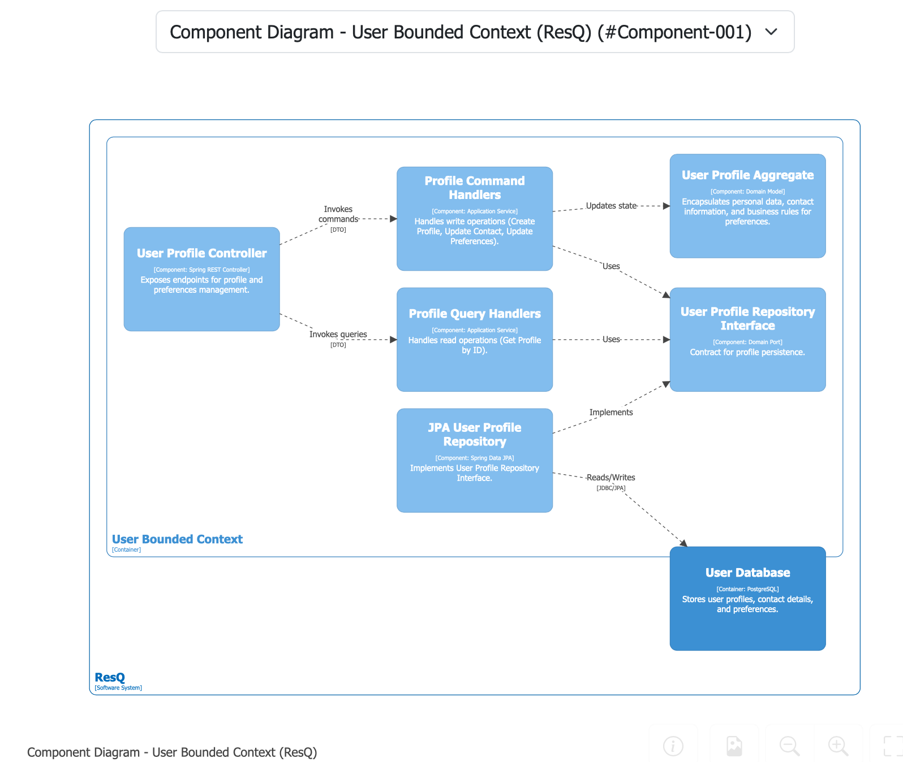

<p align="center">
  <strong>Figura 72. User Component Level Diagrams.</strong>
</p>

### 4.2.7.6. Bounded Context Software Architecture Code Level Diagrams
<p align="justify">
Esta sección detalla la estructura técnica e interna del Bounded Context. Se compone de dos representaciones visuales:
</p>

- Diagrama de Clases (Domain Layer): Modela la lógica de negocio orientada a objetos, ilustrando las entidades, Value Objects, sus atributos y las relaciones entre ellos.   

- Diagrama de Diseño de Base de Datos: Muestra el esquema de persistencia física, detallando las tablas, columnas y llaves (Entity-Relationship) utilizadas para almacenar la información del dominio.

#### 4.2.7.6.1. Bounded Context Domain Layer Class Diagrams

<p align="justify">
El diagrama representa la estructura del perfil de usuario, agrupando su identidad, nombre, información de contacto y preferencias.
<code>UserProfile</code> actúa como elemento central y contiene los diferentes <code>Value Objects</code> que representan cada aspecto del usuario.
Esta organización permite encapsular los datos y comportamientos del dominio, manteniendo una estructura modular y coherente.
</p>

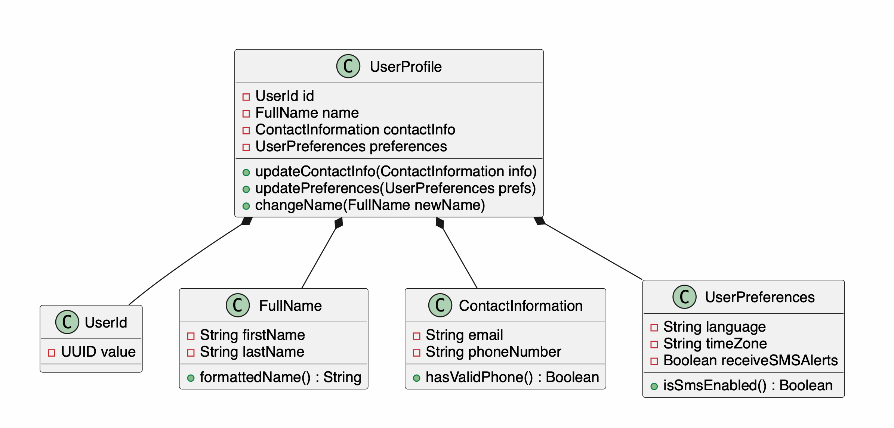

<p align="center">
  <strong>Figura 73. User Domain Layer Diagrams.</strong>
</p>

#### 4.2.7.6.2. Bounded Context Database Design Diagram

<p align="justify">
Propósito: Representa el esquema físico de persistencia (modelo relacional) diseñado para almacenar el estado de los agregados del Bounded Context <code>User</code>.
</p>

- Estructura Principal: Se centra en una tabla única denominada USER_PROFILES, la cual consolida todos los datos del perfil de un usuario.
- Estrategia de Mapeo (Embedded Pattern): Los atributos que en el dominio están encapsulados en Value Objects (FullName, ContactInformation, UserPreferences) se "aplanan" y se convierten en columnas directas dentro de la misma tabla (ej. first_name, email, pref_language). Esto optimiza las consultas al evitar joins innecesarios.
- Punto de Integración: Destaca que la llave primaria (id) está diseñada como un UUID que coincide exactamente con el identificador de identidad gestionado en el Bounded Context IAM, estableciendo el puente lógico entre la autenticación y los datos personales sin acoplar las tablas.

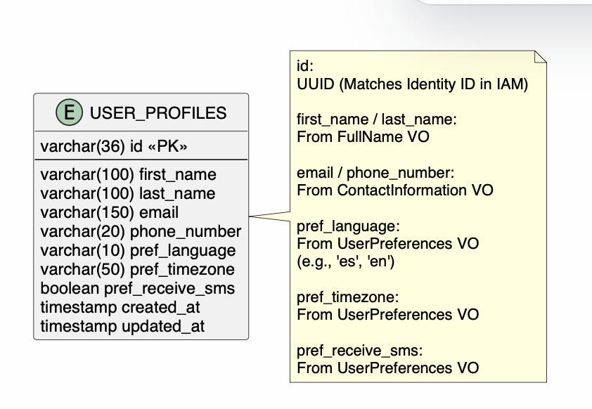

<p align="center">
  <strong>Figura 74. User Database Desing Diagram.</strong>
</p>

### 4.2.8. Bounded Context: Incident

<p align="justify">
El Bounded Context <strong>Incident</strong> es responsable de gestionar el ciclo de vida de los incidentes generados a partir de las situaciones de riesgo o emergencias (como sismos, fugas de gas o incendios) detectadas en las edificaciones monitoreadas por ResQ.
Este Bounded Context atiende las necesidades operativas y de seguimiento del sistema, asegurando que cada emergencia crítica tenga un registro formal que permita conocer su estado, asignar personal responsable para su atención, registrar su resolución y proveer un historial confiable para posteriores auditorías o cálculos de métricas de seguridad.
Sus responsabilidades se derivan principalmente de los requisitos relacionados con la trazabilidad de las emergencias y la gestión humana de las mismas una vez que la plataforma ha emitido las alertas iniciales. En particular, ResQ exige que los administradores y responsables de seguridad puedan coordinar las acciones físicas revisando y actualizando el estado de los incidentes en tiempo real.
El Bounded Context Incident soporta principalmente US14 — Consultar el estado de un incidente, US15 — Asignar un responsable de atención, US16 — Registrar la resolución de un incidente, así como las historias de consulta histórica US17 — Consultar incidentes anteriores, US18 — Buscar incidentes históricos, US19 — Consultar la secuencia de un incidente y TS09 — Procesar información cuantitativa para indicadores.
El Bounded Context Incident no gestiona la configuración física de los edificios, la creación de zonas, ni el inventario de dispositivos (sensores o actuadores). Estas responsabilidades pertenecen al Bounded Context Building / Infrastructure. Incident solo mantiene la referencia al identificador de la zona para saber dónde ocurrió la emergencia.
Asimismo, Incident no se encarga de ejecutar la lógica de procesamiento local (Edge Computing) que captura mediciones y evalúa si existe un riesgo en tiempo real; esto pertenece al Bounded Context Detection o Monitoring. Incident actúa como el registro oficial y el flujo de trabajo posterior a la confirmación de la detección.
</p>

<p align="justify">
Las principales responsabilidades de este Bounded Context son:
</p>

- Registrar automáticamente un nuevo incidente a partir de un evento de detección de riesgo.
- Mantener el estado actual del incidente (ej. activo, en progreso, resuelto, cerrado).
- Vincular el evento crítico con la zona específica de la edificación donde se originó.
- Permitir la asignación de un usuario autenticado (responsable de seguridad) para la atención de la emergencia.
- Registrar el cierre o resolución del incidente, incluyendo notas, tipificación u observaciones finales.
- Mantener un registro cronológico de los cambios de estado (event sequence) durante la emergencia.
- Proveer mecanismos de consulta filtrada y paginada del historial de incidentes para cálculos cuantitativos e indicadores.
- Evitar la modificación de un incidente una vez que este ha sido cerrado formalmente.
- Mantener el modelo de dominio independiente de los detalles de hardware de los dispositivos.

<p align="justify">
Los principales conceptos identificados para el Bounded Context Incident son <strong>Incident</strong>, <strong>IncidentId</strong>, <strong>ZoneId</strong>, <strong>RiskType RiskLevel</strong>, <strong>IncidentStatus</strong> y <strong>AttendantId</strong>.
</p>

##### Diccionario de clases

<p align="justify">
La siguiente tabla resume las principales clases e interfaces que conforman el Bounded Context Incident.
</p>


| Clase / Interfaz | Capa | Propósito | Atributos principales | Operaciones principales | Relaciones principales |
| :--- | :--- | :--- | :--- | :--- | :--- |
| **Incident** | Domain | Representa una emergencia confirmada. Es el Aggregate Root responsable de mantener el estado de la incidencia, controlar sus transiciones y registrar a los responsables. | id: IncidentId, zoneId: ZoneId, type: RiskType, level: RiskLevel, status: IncidentStatus, assignedTo: AttendantId, createdAt: LocalDateTime, resolvedAt: LocalDateTime, resolutionNotes: String | assignAttendant(attendantId), resolveIncident(notes), changeRiskLevel(newLevel) | Compone IncidentId, RiskType, RiskLevel, IncidentStatus; utiliza ZoneId y AttendantId como referencias externas. |
| **IncidentId** | Domain | Value Object que representa el identificador único de un incidente en el sistema. | value: UUID | value() | Compuesto por Incident. |
| **ZoneId** | Domain | Value Object que referencia la zona de la infraestructura donde ocurre el incidente. | value: UUID | value() | Utilizado por Incident (referencia externa). |
| **AttendantId** | Domain | Value Object que referencia al usuario (responsable de seguridad) asignado para atender el incidente. | value: UUID | value() | Utilizado por Incident (referencia externa). |
| **RiskType** | Domain | Enumeración que define la naturaleza del incidente detectado. | EARTHQUAKE, FIRE, GAS_LEAK, UNKNOWN | — | Utilizada por Incident. |
| **RiskLevel** | Domain | Enumeración que indica la severidad actual del incidente. | LOW, MEDIUM, HIGH, CRITICAL | — | Utilizada por Incident. |
| **IncidentStatus** | Domain | Enumeración que controla el flujo de vida del incidente. | ACTIVE, IN_PROGRESS, RESOLVED, CLOSED | — | Utilizada por Incident. |
| **IncidentRepository** | Domain | Abstracción de Repository utilizada para recuperar y persistir agregados Incident sin acoplar la Domain Layer a una tecnología específica. | — | findById(id), findAllByZoneId(zoneId), save(incident) | Persiste y recupera agregados Incident. |
| **CreateIncidentCommand** | Application | Representa la solicitud para iniciar un nuevo incidente tras una detección del sistema. | zoneId: UUID, type: String, level: String | — | Gestionado por CreateIncidentCommandHandler. |
| **CreateIncidentCommandHandler** | Application | Coordina la creación del incidente en base a la información de detección y lo persiste. | Dependencia de IncidentRepository y EventPublisher | handle(command) | Utiliza IncidentRepository. |
| **AssignIncidentCommand** | Application | Representa una solicitud de un usuario autorizado para tomar o asignar la responsabilidad de un incidente activo. | incidentId: UUID, attendantId: UUID | — | Gestionado por AssignIncidentCommandHandler. |
| **AssignIncidentCommandHandler** | Application | Recupera el incidente, invoca la asignación y persiste el cambio de estado. | Dependencia de IncidentRepository | handle(command) | Utiliza IncidentRepository. |
| **ResolveIncidentCommand** | Application | Representa una solicitud para cerrar un incidente, aportando un reporte o resumen de las acciones tomadas. | incidentId: UUID, resolutionNotes: String | — | Gestionado por ResolveIncidentCommandHandler. |
| **ResolveIncidentCommandHandler** | Application | Ejecuta la lógica de resolución en el dominio, validando que el incidente esté en un estado transicionable. | Dependencia de IncidentRepository | handle(command) | Utiliza IncidentRepository. |
| **GetHistoricalIncidentsQuery** | Application | Representa una solicitud de lectura para buscar incidentes cerrados bajo ciertos filtros (zona, fecha, tipo). | zoneId: UUID, startDate: Date, endDate: Date, status: String | — | Gestionada por GetHistoricalIncidentsQueryHandler. |
| **GetHistoricalIncidentsQueryHandler** | Application | Orquesta la lectura de datos históricos sin modificar el estado del sistema. | Dependencia de abstracciones de lectura/Data Access | handle(query) | Recupera DTOs para la vista. |
| **IncidentController** | Interface | Recibe solicitudes HTTP REST (asignar, resolver, consultar) y las delega al Command o Query Handler correspondiente. | Dependencias de Command/Query Handlers | assign(...), resolve(...), getIncidents(...) | Delega a la Application Layer. |
| **KafkaIncidentEventPublisher** | Infrastructure | Implementa el mecanismo de publicación de Domain Events (IncidentCreatedEvent, IncidentResolvedEvent) hacia un bus de mensajes para integración asíncrona. | Dependencia de cliente Kafka/Broker | publish(event) | Implementa la interfaz de publicación del dominio. |
| **JpaIncidentRepository** | Infrastructure | Implementa IncidentRepository utilizando JPA/Hibernate para persistir los incidentes en una base de datos relacional. | Dependencia de persistencia (Base de Datos) | findById(), save(), findAllByZoneId() | Implementa IncidentRepository. |

<p align="justify">
Las relaciones entre estas clases preservan estrictamente los límites del Bounded Context. <code>Incident</code> mantiene únicamente el zoneId para contextualizar geográficamente la emergencia, pero no almacena detalles del edificio ni la lista de sensores.
</p>

<p align="justify">
Del mismo modo, almacena el <code>AttendantId</code> para indicar quién está atendiendo el problema, pero delega la gestión de información personal, permisos y credenciales de ese empleado al Bounded Context correspondiente (User o IAM).
</p>

---

### 4.2.8.1. Domain Layer

<p align="justify">
La Domain Layer encapsula la lógica de negocio central y las reglas para la gestión de incidentes, asegurando que las transiciones de estado sean válidas y coherentes con la realidad física de la emergencia.
</p>

**Aggregate Root**
 * **`Incident`:**

<p align="justify">
Un <code>Incident</code> representa una emergencia detectada en una zona específica de la edificación. Controla su propio ciclo de vida y asegura la consistencia de sus datos.
</p>

<p align="justify">
<strong>Categoría:</strong> Aggregate Root / Entity.
</p>

<p align="justify">
<strong>Propósito:</strong> Representar la entidad principal de una emergencia dentro del sistema, gestionando sus estados, asignaciones y resoluciones bajo reglas estrictas de dominio.
</p>

**Atributos / Elementos del Dominio:**

* **Value Objects:**
    * **`incidentId`:** IncidentId — Identificador único del incidente.
    * **`zoneId`:** ZoneId — Referencia a la zona donde se originó el problema (vinculación con el contexto de Infraestructura/Edificación).
    * **`type`:** RiskType — Tipo de emergencia (e.g., EARTHQUAKE, FIRE, GAS_LEAK).
    * **`level`:** RiskLevel — Nivel de gravedad del incidente (e.g., LOW, MEDIUM, HIGH, CRITICAL).
    * **`status`:** IncidentStatus — Estado actual del incidente (e.g., ACTIVE, IN_PROGRESS, RESOLVED, CLOSED).
    * **`assignedTo`:** AttendantId — Identificador del usuario responsable de seguridad asignado a la atención.

* **Domain Events:**
    * **`IncidentCreatedEvent`:** Emitido cuando el sistema registra un nuevo incidente tras una detección crítica.
    * **`IncidentAssignedEvent`:** Emitido cuando un responsable asume o es asignado a la atención del incidente.
    * **`IncidentResolvedEvent`:** Emitido cuando se registra la solución del evento, permitiendo a otros contextos (como notificaciones o analítica) reaccionar.

* **Domain Services:**
    * **`IncidentMetricsService`:** Servicio de dominio para calcular tiempos de respuesta y resolución en base al historial.

* **Repositories (Interfaces):**
    * **`IncidentRepository`:** Define los contratos para persistir y recuperar agregados `Incident`.

### 4.2.8.2. Interface Layer

<p align="justify">
La Interface Layer define los puntos de entrada al Bounded Context, exponiendo las capacidades de ResQ hacia las aplicaciones cliente (web o móvil) mediante una API RESTful.
</p>

<p align="justify">
El controlador principal es <code>IncidentController</code>.
</p>

<p align="justify">
Un <code>IncidentController</code> maneja las peticiones HTTP relacionadas con la gestión de incidentes, validando los datos de entrada y delegando la ejecución hacia la Application Layer.
</p>

##### IncidentController

<p align="justify">
<strong>Categoría:</strong> REST Controller / Interface.
</p>

<p align="justify">
<strong>Propósito:</strong> Exponer los endpoints HTTP para la consulta, asignación y resolución de emergencias e incidentes en el sistema.
</p>

**Endpoints Principales:**

* **`GET /api/v1/incidents`:** Recupera la lista de incidentes (activos e históricos) con soporte para filtros por zona, tipo y estado.
* **`GET /api/v1/incidents/{incidentId}`:** Obtiene los detalles y el contexto de un incidente específico.
* **`PATCH /api/v1/incidents/{incidentId}/assign`:** Asigna un responsable de seguridad a un incidente activo.
* **`PATCH /api/v1/incidents/{incidentId}/resolve`:** Registra la resolución de un incidente, cambiando su estado y almacenando las observaciones finales.

**Data Transfer Objects (DTOs):**

* **`IncidentResponseDTO`:** Representación plana del incidente para la vista.
* **`AssignIncidentCommandDTO`:** Payload con los datos del responsable asignado.
* **`ResolveIncidentCommandDTO`:** Payload con el resumen o tipificación de la resolución.

### 4.2.8.3. Application Layer

<p align="justify">
La Application Layer orquesta los flujos de trabajo delegando la ejecución a los objetos del dominio. Se implementa utilizando el patrón CQRS (Command Query Responsibility Segregation) a nivel lógico para separar las operaciones de lectura y escritura.
</p>

<p align="justify">
Los manejadores se dividen según su responsabilidad en comandos y consultas.
</p>

**Application Components**
<p align="justify">
<strong>Categoría:</strong> Application Services / CQRS Handlers.
</p>

<p align="justify">
<strong>Propósito:</strong> Coordinar los casos de uso del sistema, gestionando las transacciones de escritura y abstrayendo las consultas de lectura sin alterar el estado del dominio.
</p>

**Componentes Principales:**

* **Command Handlers (Escritura):**
    * **`CreateIncidentCommandHandler`:** Orquesta la creación de un nuevo incidente (generalmente invocado por un evento asíncrono desde el contexto de Detección).
    * **`AssignIncidentCommandHandler`:** Valida los permisos y ejecuta el método de asignación en el Aggregate Root.
    * **`ResolveIncidentCommandHandler`:** Ejecuta la lógica de cierre del incidente y persiste el cambio.

* **Query Handlers (Lectura):**
    * **`GetIncidentByIdQueryHandler`:** Recupera los detalles de un incidente específico.
    * **`GetHistoricalIncidentsQueryHandler`:** Ejecuta búsquedas paginadas y filtradas para la consulta de incidentes anteriores.

### 4.2.8.4. Infrastructure Layer

<p align="justify">
La Infrastructure Layer implementa las interfaces definidas en las capas superiores, gestionando la persistencia en la base de datos y la comunicación externa con el bus de mensajes.
</p>

<p align="justify">
Los componentes se dividen en mecanismos de persistencia y adaptadores dirigidos por eventos.
</p>

#### Infrastructure Components

<p align="justify">
<strong>Categoría:</strong> Infrastructure Services / Adapters.
</p>

<p align="justify">
<strong>Propósito:</strong> Proveer las implementaciones técnicas concretas para el almacenamiento de datos y la integración asíncrona con otros sistemas.
</p>

**Componentes de Persistencia:**

* **`JpaIncidentRepository`:** Implementación de `IncidentRepository` utilizando Spring Data JPA para la gestión del ciclo de vida de los datos.
* **`IncidentEntity`:** Entidad de infraestructura mapeada directamente a las tablas de la base de datos relacional (MySQL/PostgreSQL).
* **`IncidentMapper`:** Componente encargado de transformar los datos entre `IncidentEntity` (Infraestructura) e `Incident` (Dominio) para mantener el desacoplamiento.

**Componentes de Mensajería (Event-Driven):**

* **`KafkaIncidentEventPublisher`:** Implementación encargada de publicar los *Domain Events* hacia un tópico de Apache Kafka (e.g., `resq.incident.events`), facilitando la integración asíncrona con los contextos de Notificaciones o Analítica.
* **`DetectionEventListener`:** Consumidor de Kafka que escucha activamente los eventos de riesgo crítico detectados en el Edge para instanciar automáticamente los incidentes en el sistema.

### 4.2.8.5. Bounded Context Software Architecture Component Level Diagrams

 ##### Flujo Principal de Interacción

<p align="justify">
El flujo principal del Incident Bounded Context se desarrolla de manera secuencial a través de las distintas capas de la arquitectura para garantizar el cumplimiento de las reglas de negocio y el desacoplamiento técnico:
</p>

1. **Solicitud del usuario:** El cliente (aplicación web o móvil) envía una solicitud HTTP para consultar, asignar o resolver un incidente.
2. **IncidentController:** La Interface Layer recibe la petición, valida el formato del DTO de entrada y la dirige al manejador correspondiente en la capa superior.
3. **Application Layer:** El componente de aplicación toma el control utilizando el patrón CQRS; un `IncidentCommandHandler` procesa las operaciones de escritura, mientras que un `IncidentQueryHandler` gestiona las consultas de lectura.
4. **Incident Aggregate:** En operaciones de escritura, el agregador `Incident` ejecuta la lógica de negocio central, valida las transiciones de estado y asegura la consistencia de la emergencia.
5. **Repository Interface:** La capa de aplicación utiliza la abstracción `IncidentRepository` para solicitar la persistencia o recuperación del agregado sin acoplarse a la tecnología de almacenamiento.
6. **JPA Repository:** La Infrastructure Layer, a través de `JpaIncidentRepository`, implementa dicho contrato y realiza las consultas u operaciones físicas sobre la base de datos PostgreSQL.
7. **Kafka Publisher:** Si la regla de negocio del agregador generó un cambio significativo, `KafkaIncidentEventPublisher` publica los eventos de dominio resultantes (como `IncidentCreatedEvent` o `IncidentResolvedEvent`) en el bus de mensajes.
8. **Respuesta:** El resultado del proceso se transforma de nuevo a un DTO y retorna a través del `IncidentController` hacia el cliente con el estado HTTP correspondiente.


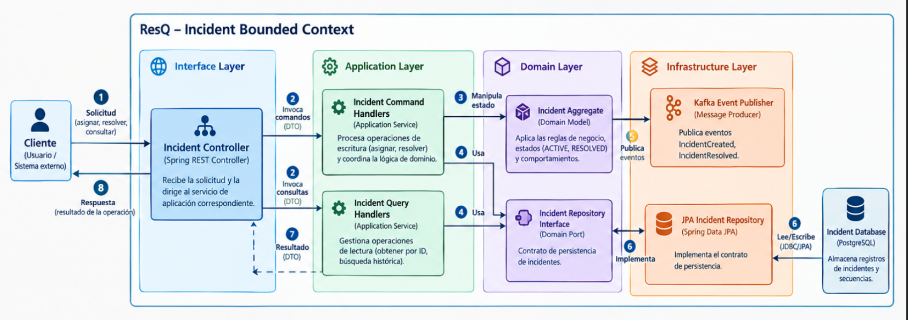

<p align="center">
  <strong>Figura 75. Flujo Process Diagram.</strong>
</p>

**Diagrama - Incident Component Level Diagram**
 
<p align="justify">
 El siguiente diagrama C4 (Nivel 3: Componentes) detalla la estructura interna del Bounded Context de Incidentes organizada en cuatro capas:
</p>

- Interface Layer: recibe y gestiona las solicitudes mediante el Incident Controller.
- Application Layer: coordina los casos de uso de incidentes, separando operaciones de escritura y consulta.
- Domain Layer: contiene las reglas de negocio mediante el Incident Aggregate y define el contrato de persistencia mediante Incident Repository Interface.
- Infrastructure Layer: implementa la persistencia con JPA Incident Repository y la comunicación mediante eventos con Kafka Event Publisher.
- Base de datos: almacena la información de los incidentes y registros relacionados.

<p align="justify">
Las relaciones entre los componentes muestran cómo las solicitudes atraviesan las diferentes capas, manteniendo una separación de responsabilidades y facilitando el mantenimiento y evolución del sistema.
</p>

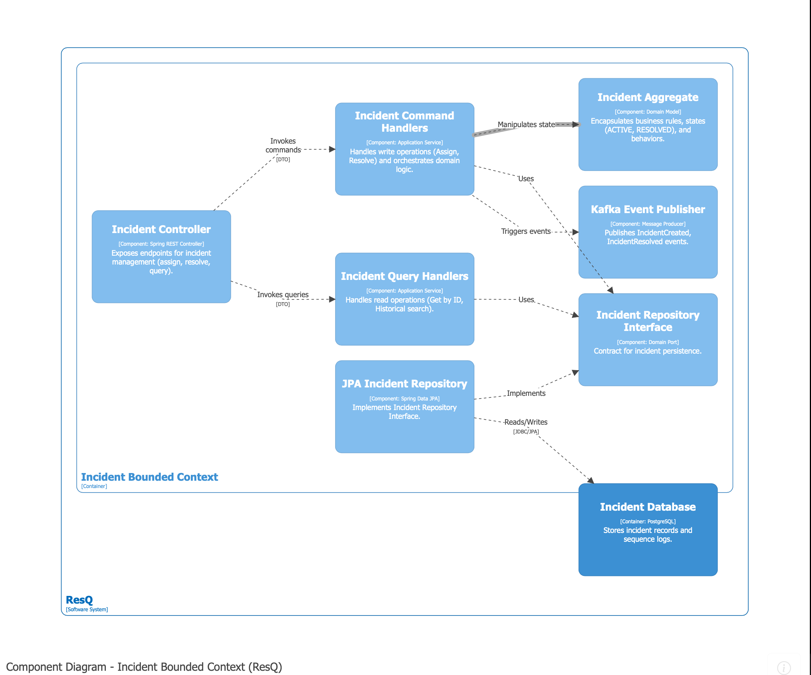

<p align="center">
  <strong>Figura 76. Incident Component Level Diagram.</strong>
</p>


### 4.2.8.6. Bounded Context Software Architecture Code Level Diagrams

<p align="justify">
Esta sección presenta los diagramas de nivel de código del Bounded Context de Incident Management de ResQ, detallando la estructura interna de sus principales elementos de software.
</p>

- Domain Layer: representa el Incident Aggregate, Value Objects, enumeraciones y reglas de negocio.
- Application Layer: muestra los servicios encargados de coordinar los casos de uso y operaciones sobre incidentes.
- Infrastructure Layer: representa los componentes de persistencia y publicación de eventos.
- Interface Layer: muestra los controladores responsables de exponer las funcionalidades del contexto.
- Relaciones: permiten visualizar las dependencias entre clases, componentes y responsabilidades, facilitando la comprensión de la implementación del Bounded Context.

#### 4.2.8.6.1. Bounded Context Domain Layer Class Diagrams

<p align="justify">
El siguiente diagrama de clases ilustra el modelo de dominio rico, destacando el Aggregate Root, sus Value Objects y métodos principales:
</p>

- Aggregate Root: Incident centraliza la información y reglas de negocio relacionadas con un incidente.
- Value Objects: IncidentId, ZoneId y AttendantId representan identificadores utilizados por el agregado.
- Enumeraciones: RiskType, RiskLevel e IncidentStatus definen el tipo de riesgo, nivel de criticidad y estado del incidente.
- Comportamientos: Incident encapsula operaciones como asignar un encargado, resolver el incidente y modificar su nivel de riesgo.
- Relaciones: el agregado mantiene referencias a sus Value Objects y utiliza las enumeraciones para controlar su     comportamiento y estado.

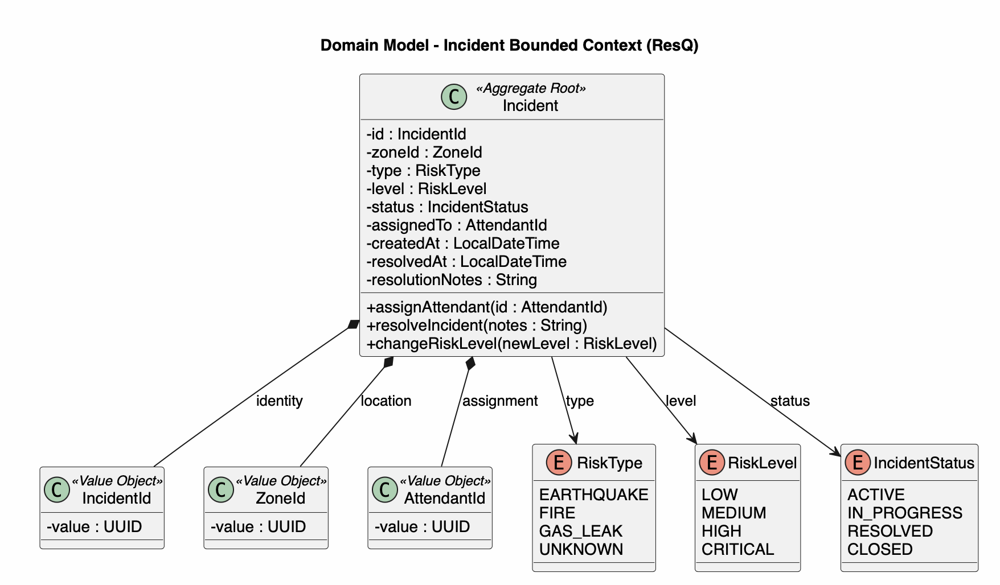

<p align="center">
  <strong>Figura 77. Incident Layar Class Diagrams.</strong>
</p>

#### 4.2.8.6.2. Bounded Context Database Design Diagram

<p align="justify">
El diseño de la base de datos refleja la persistencia del estado de los incidentes, optimizado para almacenar el histórico y soportar las consultas de indicadores y secuencias:
</p>

- INCIDENTS: almacena la información principal de los incidentes, incluyendo su tipo, nivel de riesgo, estado, zona, responsable y fechas de creación y resolución.

- INCIDENT_EVENTS_LOG: registra los eventos generados durante el ciclo de vida de cada incidente, permitiendo mantener un historial de cambios.

- Relación: cada incidente puede generar múltiples eventos registrados en INCIDENT_EVENTS_LOG.

<p align="justify">
Trazabilidad: esta estructura permite conservar una secuencia histórica de acciones y cambios asociados a cada incidente.
</p>

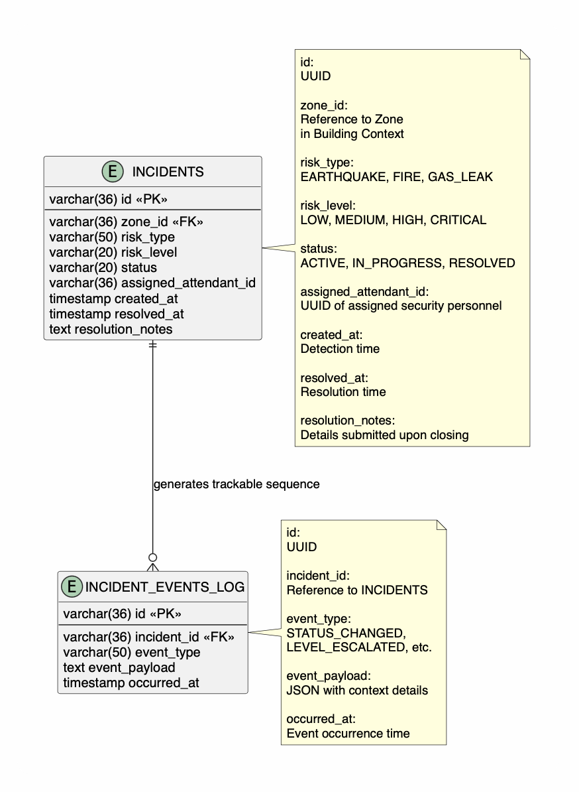

<p align="center">
  <strong>Figura 78. Incident Database Design Diagram.</strong>
</p>

### 4.2.9. Bounded Context: Connectivity Management

<p align="justify">
El Connectivity Management Bounded Context es responsable de gestionar y supervisar el estado de conexión de red de todos los sensores físicos de emergencia (sismos, fugas de gas, temperatura, etc.) en el sistema. Este contexto asegura que los dispositivos mantengan una comunicación constante mediante señales de vida (heartbeats), detectando caídas de red, gestionando reconexiones y garantizando que el sistema central sepa en tiempo real si un área está desprotegida por falta de conectividad.
</p>

#### 4.2.9.1. Domain Layer

<p align="justify">
La <strong>Domain Layer</strong> del Connectivity Management Bounded Context encapsula la lógica de negocio relacionada con la supervisión de red. En esta capa, se definen los elementos principales del dominio, como agregados, entidades, objetos de valor, comandos, consultas y eventos, que representan los conceptos clave del sistema.
</p>

**Aggregates**

1. `SensorConnection`
   * **Propósito:** Representa el estado de red y la sesión de conectividad actual de un sensor físico específico.
   * **Atributos:**
      * `sensorId`: Identificador del dispositivo IoT, representado como un objeto de valor `SensorId`.
      * `macAddress`: Dirección física del sensor en la red, representado como un objeto de valor `MacAddress`.
      * `status`: Estado operativo actual de la conexión (`ONLINE`, `OFFLINE`, `TIMEOUT`), representado como un objeto de valor `ConnectionStatus`.
      * `lastHeartbeat`: Fecha y hora del último latido recibido exitosamente.
   * **Características:**
      * Extiende `AuditableAbstractAggregateRoot`, lo que permite auditar el historial de caídas de red.
      * Gestiona la lógica para determinar si el tiempo transcurrido desde el `lastHeartbeat` excede el límite permitido, cambiando el estado a `TIMEOUT`.

**Entities**

1. `HeartbeatRecord`
   * **Propósito:** Representa un latido individual enviado por el sensor para notificar que sigue vivo.
   * **Atributos:**
      * `timestamp`: Fecha y hora exacta en la que se recibió la señal.
      * `signalStrength`: Nivel de intensidad de la red, representado como un objeto de valor `SignalStrength`.

**Value Objects**

1. `SensorId`
   * **Propósito:** Representa el identificador único de un sensor.
   * **Validaciones:** El identificador no puede ser nulo ni negativo.
2. `ConnectionStatus`
   * **Propósito:** Enumera los estados posibles de conectividad (`ONLINE`, `OFFLINE`, `TIMEOUT`).
3. `SignalStrength`
   * **Propósito:** Representa la calidad de la conexión inalámbrica.
   * **Validaciones:** Debe estar dentro de rangos realistas (ej. entre -100 dBm y 0 dBm).

**Commands**

1. `RegisterHeartbeatCommand`
   * **Propósito:** Representa la solicitud para registrar un nuevo latido.
   * **Atributos:** `sensorId`, `timestamp`, `signalStrength`.
2. `MarkSensorOfflineCommand`
   * **Propósito:** Solicitud interna para forzar el estado de un sensor a desconectado tras superar el tiempo de espera.
   * **Atributos:** `sensorId`.

**Queries**

1. `GetSensorConnectionStatusQuery`
   * **Propósito:** Recupera el estado actual de red de un sensor específico.
2. `GetAllOfflineSensorsQuery`
   * **Propósito:** Recupera una lista de todos los sensores que actualmente han perdido conexión.

**Events**

1. `ConnectionLostEvent`
   * **Propósito:** Evento crítico que se dispara cuando un sensor pasa a estado `OFFLINE` o `TIMEOUT`.
   * **Atributos:** `sensorId`, `lastHeartbeat`.
2. `HeartbeatReceivedEvent`
   * **Propósito:** Evento que se dispara cada vez que se registra un latido exitoso.

---

#### 4.2.9.2. Interface Layer

<p align="justify">
La <strong>Interface Layer</strong> del Connectivity Management Bounded Context expone los puntos de entrada al sistema a través de controladores REST. Esta capa permite la interacción con los dispositivos IoT y facilita la comunicación entre los clientes y el sistema.
</p>

**Controllers**

1. `ConnectivityController`
   * **Propósito:** Gestiona las operaciones de red de los sensores.
   * **Endpoints:**
      * `POST /api/v1/connectivity/heartbeats`: Registra un nuevo latido proveniente del dispositivo IoT.
      * `GET /api/v1/connectivity/sensors/{sensorId}/status`: Obtiene el estado actual de red de un sensor.
      * `GET /api/v1/connectivity/sensors/offline`: Lista todos los sensores sin conexión.
   * **Dependencias:**
      * `ConnectivityCommandService`: Servicio encargado de manejar los comandos relacionados con la conectividad.
      * `ConnectivityQueryService`: Servicio encargado de manejar las consultas de conectividad.

**Resources**

1. `SensorConnectionResource`
   * **Propósito:** Representa el estado de conexión expuesto a través de la API REST.
   * **Atributos:** `sensorId`, `status`, `lastHeartbeatTime`.
2. `RegisterHeartbeatResource`
   * **Propósito:** Representa los datos necesarios enviados por el dispositivo IoT para reportar su estado.
   * **Atributos:** `sensorId`, `signalStrength`.

**Transformers**

1. `SensorConnectionResourceFromEntityAssembler`
   * **Propósito:** Convierte una entidad `SensorConnection` en un recurso `SensorConnectionResource`.
   * **Método principal:** `toResourceFromEntity(SensorConnection entity)`.

---
#### 4.2.9.3. Application Layer

<p align="justify">
La <strong>Application Layer</strong> coordina las operaciones de negocio, manejando comandos y consultas, orquestando la lógica de la aplicación y garantizando que las reglas del dominio se cumplan.
</p>

**Command Services**

1. `ConnectivityCommandServiceImpl`
   * **Propósito:** Gestiona las operaciones relacionadas con el procesamiento de señales de vida y actualización de estados.
   * **Métodos principales:**
      * `handle(RegisterHeartbeatCommand command)`: Actualiza el `lastHeartbeat` del sensor. Si estaba `OFFLINE`, lo devuelve a `ONLINE`.
      * `handle(MarkSensorOfflineCommand command)`: Cambia el estado a `TIMEOUT` tras validar los tiempos de espera.
   * **Dependencias:**
      * `SensorConnectionRepository`: Persistencia de las conexiones.
      * `ExternalDeviceService`: Verifica la existencia del sensor.

**Query Services**

1. `ConnectivityQueryServiceImpl`
   * **Propósito:** Gestiona las consultas relacionadas con los estados de red.
   * **Métodos principales:**
      * `handle(GetSensorConnectionStatusQuery query)`: Recupera el estado de un sensor por su ID.

**Event Handlers**

1. `SensorTimeoutEventHandler`
   * **Propósito:** Maneja el evento de evaluación de tiempos de espera para sensores que no han reportado actividad.
   * **Método principal:** `on(EvaluateSensorTimeoutsEvent event)`: Identifica sensores desconectados y dispara el `MarkSensorOfflineCommand`.

**Outbound Services (ACL)**

1. `ExternalAlertService`
   * **Propósito:** Interactúa con el Alert & Response Management Bounded Context para disparar alarmas de desconexión.
   * **Método principal:** `triggerDisconnectionAlert(Long sensorId)`.

---

#### 4.2.9.4. Infrastructure Layer

<p align="justify">
La <strong>Infrastructure Layer</strong> proporciona las implementaciones técnicas necesarias para soportar las operaciones del sistema, incluyendo los repositorios para la persistencia de datos en la base de datos.
</p>

**Persistencia (JPA Repositories)**

1. `SensorConnectionRepository`
   * **Propósito:** Proporciona métodos para interactuar con la base de datos de conectividad.
   * **Métodos principales:**
      * `findSensorsWithLastHeartbeatBefore(LocalDateTime time)`: Recupera todos los sensores cuyo último latido fue anterior a una fecha límite, útil para detectar caídas de red.
   * **Características:**
      * Extiende `JpaRepository`, permitiendo realizar operaciones CRUD sobre la entidad `SensorConnection`.

**Relaciones entre componentes**

*   **Persistencia:** El repositorio `SensorConnectionRepository` proporciona acceso a los datos almacenados, permitiendo a las capas superiores interactuar con las entidades del dominio.
*   **Validación:** Los servicios externos (ACL) son utilizados para validar la existencia de los sensores comunicándose con el contexto correspondiente.

---

#### 4.2.9.5. Bounded Context Software Architecture Component Level Diagrams

<p align="justify">
En esta sección se presenta el diagrama de componentes del <strong>Connectivity Management Bounded Context</strong>, el cual detalla los principales módulos y sus interacciones dentro del contexto delimitado. Este diagrama sigue el enfoque del C4 Model para representar los componentes clave, como servicios de aplicación, controladores, repositorios y servicios externos, junto con sus relaciones.
</p>

<p align="justify">
El propósito de este diagrama es proporcionar una visión clara y estructurada de cómo se organizan los componentes dentro del contexto, facilitando la comprensión de su arquitectura y permitiendo identificar puntos de integración y responsabilidades.
</p>

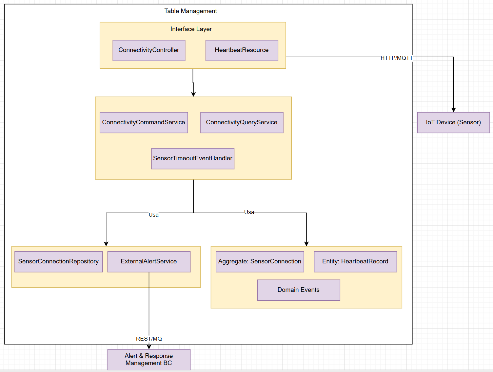

<p align="center">
  <strong>Figura 79. Connectivity Management Diagram1.</strong>
</p>
<p align="justify">
El <strong>Connectivity Management Bounded Context</strong> está compuesto por los siguientes módulos principales:
</p>

1. **Application Layer:**
   * Coordina las operaciones de negocio relacionadas con el monitoreo de conectividad y latidos (*heartbeats*).
   * Incluye servicios de comandos y consultas que interactúan con la **Domain Layer** y la **Infrastructure Layer**.
   * Maneja eventos críticos relacionados con la desconexión de sensores y evaluaciones de *timeout*.

2. **Interface Layer:**
   * Expone los puntos de entrada al sistema a través de controladores REST (ej. webhooks para los dispositivos IoT).
   * Incluye recursos y transformadores que aseguran una representación adecuada de los datos de red y su conversión entre las capas de la aplicación.

3. **Domain Layer:**
   * Encapsula la lógica de negocio relacionada con la supervisión de red.
   * Define los agregados, entidades y objetos de valor que representan los conceptos clave del dominio (como el estado de conexión y la intensidad de la señal).

4. **Infrastructure Layer:**
   * Proporciona las implementaciones técnicas necesarias para soportar las operaciones del sistema.
   * Incluye repositorios para la persistencia del estado de los sensores y componentes (ACL) que conectan la lógica de negocio con otros servicios externos de alertas.

#### 4.2.9.6. Bounded Context Software Architecture Code Level Diagrams

<p align="justify">
En este apartado se presentan los diagramas que ofrecen un mayor nivel de detalle sobre la implementación de los componentes del <strong>Connectivity Management Bounded Context</strong>. Estos diagramas están diseñados para ilustrar cómo se estructuran las clases, interfaces y relaciones dentro de las capas del contexto, proporcionando una visión técnica que facilita el desarrollo, mantenimiento y evolución del sistema.
</p>

##### 4.2.9.6.1. Bounded Context Domain Layer Class Diagrams

<p align="justify">
El diagrama de clases correspondiente a la <strong>Domain Layer</strong> del <strong>Connectivity Management Bounded Context</strong> incluye las clases principales, como agregados, entidades y objetos de valor, así como las interfaces y enumeraciones que definen el comportamiento del dominio. También se destacan las relaciones entre estos elementos, como asociaciones, composiciones y dependencias.
</p>

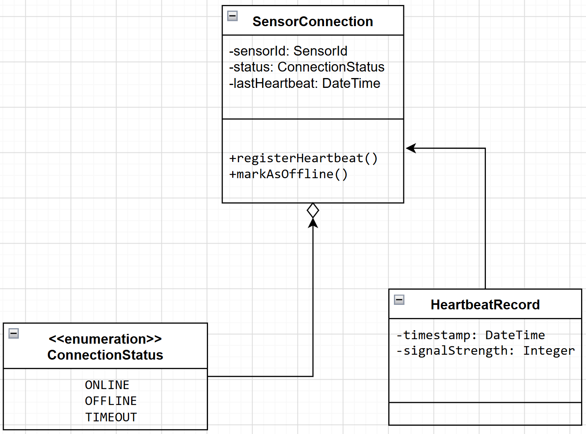

<p align="center">
  <strong>Figura 80. Connectivity Management Diagram2.</strong>
</p>

**Elementos principales del diagrama:**

1. **Aggregates:**
   * `SensorConnection`: Agregado principal que encapsula la lógica de negocio relacionada con la sesión de red del dispositivo.
     * **Atributos:** `sensorId`, `macAddress`, `status`, `lastHeartbeat`.
     * **Métodos:** `registerHeartbeat()`, `markAsOffline()`, `isTimeoutExceeded()`.

2. **Entities:**
   * `HeartbeatRecord`: Entidad que representa cada señal de vida individual enviada por el sensor.
     * **Atributos:** `timestamp`, `signalStrength`.

3. **Value Objects:**
   * `SensorId`: Representa el identificador único del hardware.
   * `MacAddress`: Representa la dirección de red física del sensor.
   * `ConnectionStatus`: Enumera los estados posibles de conectividad (`ONLINE`, `OFFLINE`, `TIMEOUT`).
   * `SignalStrength`: Representa la intensidad de la red (en dBm).

**Relaciones destacadas:**
* El agregado `SensorConnection` gestiona las relaciones y el registro transaccional con la entidad `HeartbeatRecord` (relación 1 a muchos).
* Los objetos de valor encapsulan datos inmutables y validaciones específicas de red, asegurando la consistencia en el dominio.

##### 4.2.9.6.2. Bounded Context Database Design Diagram

<p align="justify">
El diseño de la base de datos para el <strong>Connectivity Management Bounded Context</strong> refleja la estructura del dominio, asegurando que las entidades y relaciones definidas en la <strong>Domain Layer</strong> se representen de manera eficiente en el modelo relacional.
</p>

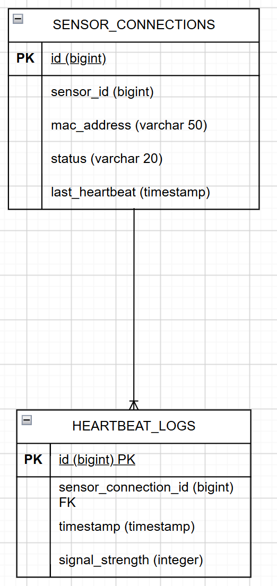

<p align="center">
  <strong>Figura 81. Connectivity Management Diagram3.</strong>
</p>

**Este diseño incluye las siguientes tablas principales:**

1. **SENSOR_CONNECTIONS:**
   * Representa la sesión operativa y el estado actual de conexión en el sistema.
   * **Atributos principales:**
     * `id`: Identificador único de la conexión (PK).
     * `sensor_id`: Identificador físico del dispositivo asociado (FK).
     * `mac_address`: Dirección de red del dispositivo.
     * `status`: Estado actual (`ONLINE`, `OFFLINE`, `TIMEOUT`).
     * `last_heartbeat`: Fecha y hora del último latido recibido.

2. **HEARTBEAT_LOGS:**
   * Representa el historial de latidos enviados por los dispositivos.
   * **Atributos principales:**
     * `id`: Identificador único del registro (PK).
     * `sensor_connection_id`: Identificador de la conexión asociada (FK).
     * `timestamp`: Fecha y hora exacta en la que se recibió la señal.
     * `signal_strength`: Intensidad de la señal de red reportada.


# Capítulo V: Solution UI/UX Design

## 5.1. Style Guidelines.

### 5.1.1. General Style Guidelines.

en este sección definiremos algunos apartados en lo visual, simbolismo y interacción que rige toda la solucion de ResQ, asegurando coherencia respecto las plataformas. Establecemos una identidad visual clara por medio de paleta de colores, tipografia, espaciado, etc unificado.

#### Brand Overview

En varios ciudades, las emergencias dentro de los edificios/locales puede ser un problema demaciado serio sino sabes que paso seria mejor seguir. La falta de información correcta sobre las medidas o protocolos que se deberian hacer para las personas en dichos momentos llegue a generar panico o realizar acciones que ponga en peligro su bienestar dando como resultado heridas fatales o personas fallecidas. *ResQ* surge como una solución a este problema: Un dispositivo IoT afiliada a una plataforma para ayudar a las personas de una vivienda, local o empresa tener una alarma antes varias emergencias con protocolos que serviran a las personas para mantenerlos seguro

A través de distintos sensores y un sistema de protocolos confiable, ResQ no solo facilita las acciones que uno debe tomar dependiendo de la emergencia sino tambien reduce la mortalidad garantizando rutas seguras para todas las personas

---

#### Brand Name

El nombre de nuestra solución, ResQ, muestra la esencia del proyecto:"Res" represe la siglas de R: Revaluando, E: Entorno y S: Seguro y Q representa Qualified mostrando que nos es solo una solucion sino es la solucion mas capacitada, el conjunto de ambos trasmite da a conocer que el producto evalua la situacion y te da indicaciones con un indice de efectividad mas del 75% con el significado de nuestro nombre

La elección de un nombre en inglés responde a su estructura sencilla pero universal que es llamativo para un gran publico, lo que permite escalar la solucion a varios casos mas complejos a futuro.

---

#### Logo

A continuación, se presenta el Logo de ResQ:


##### Color

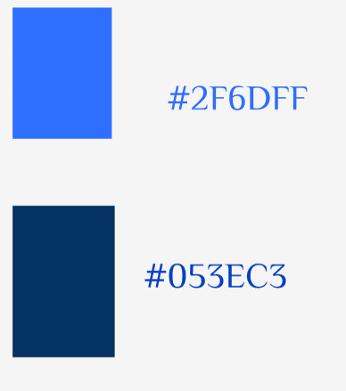

#### Body Text

La elección de una tipografía adecuada influye en la facilidad con la que el usuario puede comrpender el texto. La tipografía puede transmitir emociones y establecer un tono para el texto.

#### Tipografía 


#### Paleta de colores

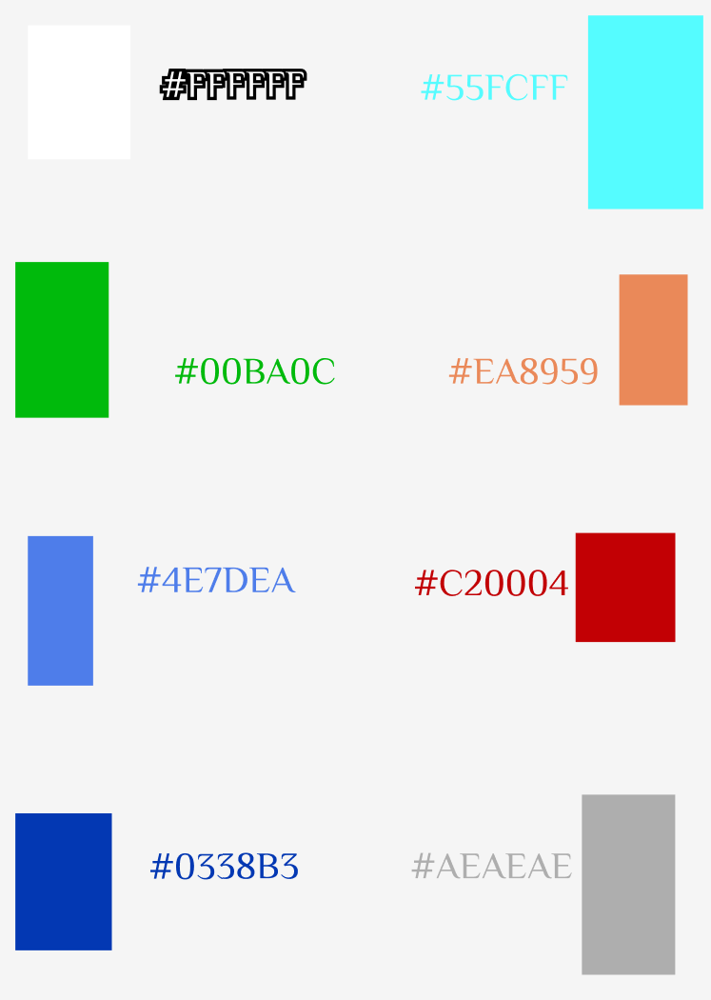

#### Botones

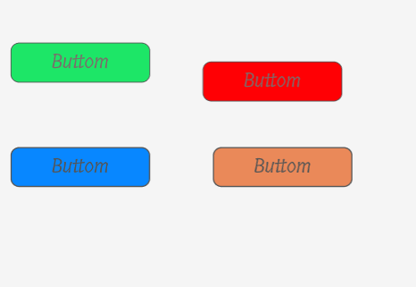

### 5.1.2. Web, Mobile and IoT Style Guidelines.
Diseñamos una interfaces Web centrada principalmente en la claridad y eficiencia,  para que la experiencia del usuario en pantallas de mayores tamaños. Tambien aplicamos una estructura responsivas, patrones de navegación y un poco de grid para asegurar que la accesibilidad y rendimiento en un entrono de escritorio

#### Colour Paletie

##### Recomended usage

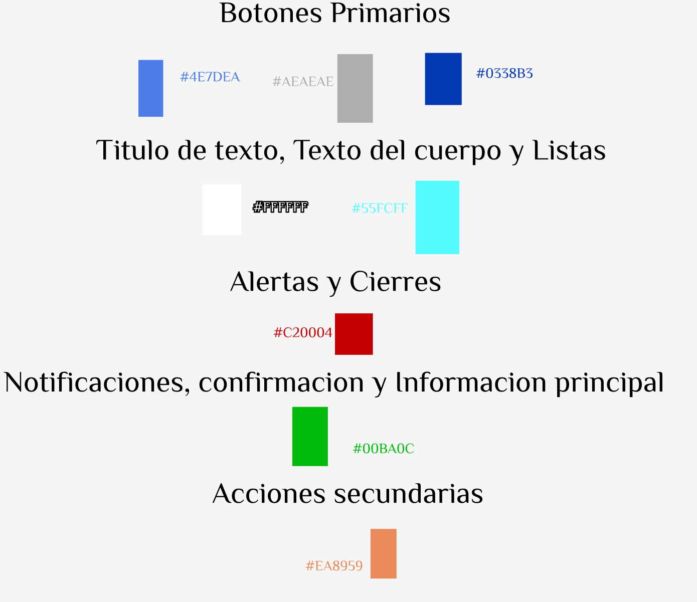

#### Tipografía 


#### Grid

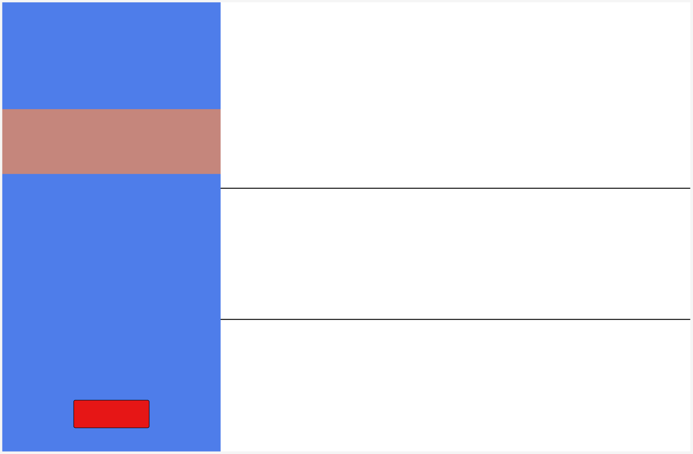

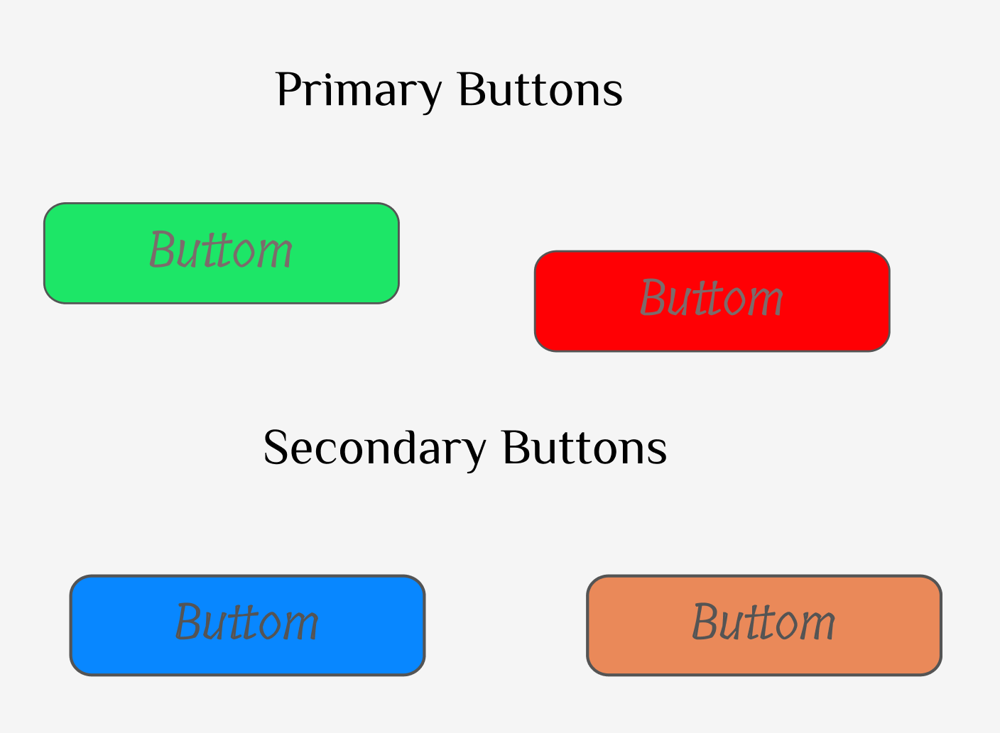

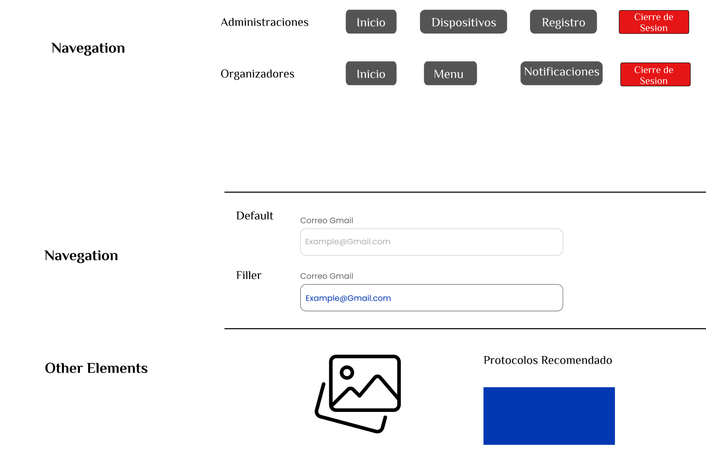

Adaptamos lo Fundamental de ResQ para dispositivos móviles optimizamos la usabilidad en el apartado táctil, la jerarquía visual y  sin olvidad la agilidad de la navegación ya que es lo fundamental, priorizamos lo intuitivo, mayor rendimiento y pasos rápidos pero suaves entre pantallas, conociendo las limitaciones y contras del formato móvil

#### Colour Paletie

##### Recomended usage


#### Tipografía 


#### Grid

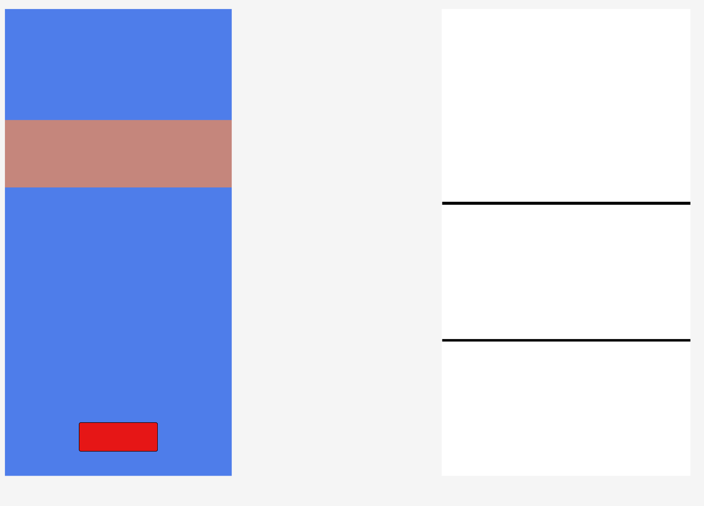


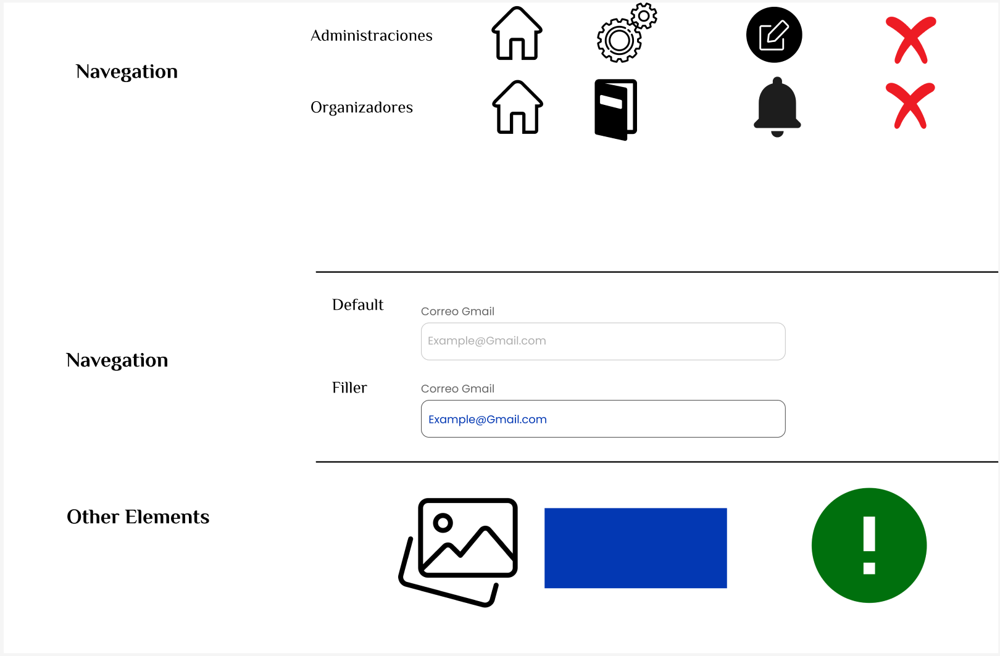

Excedemos nuestros lineamientos respecto a los dispositivos IoT para asegurar que la interfaz sea funcional y simple. Diseñamos visuales claras y compactas con código de colores efectivos y apartados visuales que faciliten la comprensión de la información

#### Colour Paletie

##### Recomended usage


#### Tipografía 


#### Grid


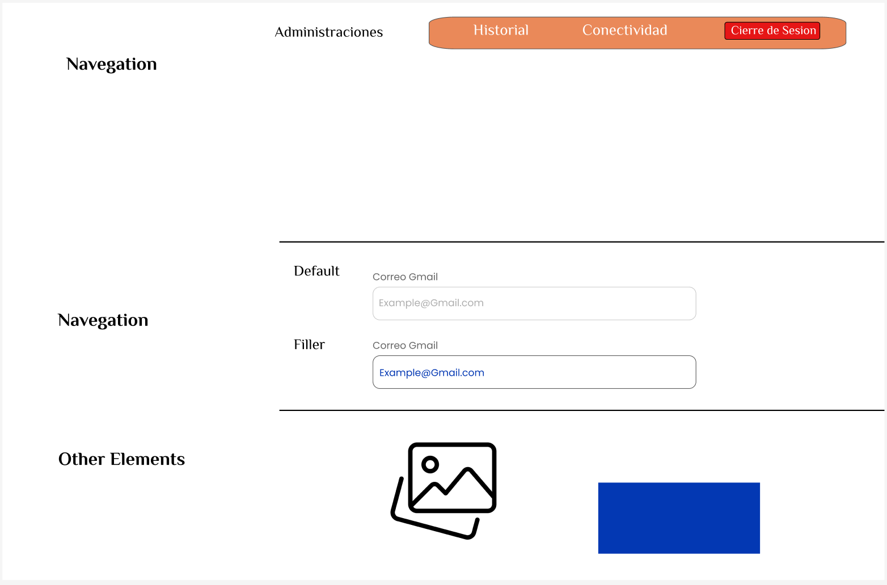

 
### 5.2. Information Architecture.

<p align="justify">
La Information Architecture de ResQ define cómo se organizan, nombran, localizan y conectan los contenidos de la Landing Page y de la Web Application. Su propósito es que cada persona pueda reconocer el objetivo de la experiencia que utiliza, encontrar la información necesaria con el menor esfuerzo posible y comprender la relación entre las áreas de monitoreo, riesgos, alertas, dispositivos, edificaciones e incidentes. Para ello, la propuesta se estructura mediante <strong>Organization Systems</strong>, <strong>Labeling Systems</strong>, <strong>SEO Tags and Meta Tags</strong>, <strong>Searching Systems</strong> y <strong>Navigation Systems</strong>, desarrollados en las subsecciones 5.2.1–5.2.5.
</p>

<p align="justify">
La Landing Page y la Web Application responden a necesidades distintas. La Landing Page presenta el problema que aborda ResQ, comunica su propuesta de valor y diferencia los beneficios relevantes para propietarios o administradores de edificaciones y para empresas integradoras de automatización y gestión de edificios inteligentes. En cambio, la Web Application organiza información operacional para usuarios autenticados que necesitan supervisar edificaciones, zonas y dispositivos, interpretar alertas y riesgos, y dar seguimiento a incidentes. Esta separación evita mezclar contenido informativo y comercial con tareas de operación que requieren contexto, permisos y atención sostenida.
</p>

<p align="justify">
En un sistema de monitoreo y gestión de emergencias, la jerarquía del contenido tiene consecuencias operativas. Por esta razón, ResQ prioriza el estado general, el tipo y nivel del riesgo, la ubicación afectada, la vigencia de las mediciones y las respuestas ejecutadas o pendientes de autorización. La información secundaria se desplaza hacia vistas de detalle, de modo que una persona responsable pueda reconocer primero aquello que requiere atención. Este criterio reduce la carga cognitiva, limita la competencia visual entre datos de diferente criticidad y favorece decisiones oportunas sin ocultar la trazabilidad necesaria para revisar un incidente.
</p>

<p align="justify">
Los sistemas de organización establecen la agrupación de contenidos; los sistemas de etiquetado mantienen términos coherentes con el Ubiquitous Language y con los Bounded Contexts; los SEO Tags and Meta Tags describen las páginas para buscadores, navegadores y vistas previas; los sistemas de búsqueda permiten localizar entidades operativas; y los sistemas de navegación conectan las tareas principales y sus vistas de detalle. En conjunto, estas decisiones permiten que visitantes y usuarios se adapten progresivamente a ResQ y comprendan cómo las áreas del producto colaboran dentro del flujo de monitoreo, detección, alerta, respuesta y seguimiento.
</p>

### 5.2.1. Organization Systems.

Para ResQ, los sistemas de organización de la información se plantean de acuerdo con las tareas que realizan los usuarios dentro de la plataforma, especialmente el monitoreo de edificios, dispositivos IoT, riesgos, incidentes y alertas. Buscamos que la información crítica pueda identificarse rápidamente durante una situación de emergencia y que las funciones administrativas permanezcan agrupadas de forma clara.

**Organización jerárquica:** <br>
La mayor parte del contenido de ResQ seguirá una organización jerárquica, partiendo de información general hacia información cada vez más específica.

En el caso del responsable o administrador de seguridad, después de autenticarse accederá a un panel principal desde el cual podrá consultar los distintos módulos del sistema. Desde ahí podrá ingresar a la gestión de edificios, zonas, dispositivos, monitoreo, detección de riesgos, incidentes y alertas. Por ejemplo, dentro de la gestión de infraestructura se podrá navegar desde un edificio hacia sus zonas y, posteriormente, consultar los dispositivos asociados a cada ubicación.

De esta forma, el usuario podrá comprender fácilmente dónde se encuentra dentro del sistema y acceder primero a una vista general antes de revisar información detallada.

**Organización secuencial:**<br>
La organización secuencial se utilizará en aquellos procesos que requieran completar una serie de pasos en un orden determinado.
- **Registro y configuración de un dispositivo IoT:**

  1. Registrar los datos generales del dispositivo.
  2. Definir sus características y capacidades.
  3. Asignarlo a un edificio y, de ser necesario, a una zona.
  4. Revisar la configuración registrada.
  5. Habilitar administrativamente el dispositivo.

<br>

- **Gestión de una situación de emergencia:**

  1. Recepción de mediciones desde los dispositivos.
  2. Evaluación del riesgo detectado.
  3. Generación de una alerta o incidente.
  4. Ejecución de acciones de respuesta.
  5. Seguimiento del incidente.
  6. Consulta del historial del evento.

Este tipo de organización permitirá guiar al usuario durante procesos que no deberían ejecutarse de manera desordenada.

**Organización matricial:**<br>
La organización matricial se aplicará principalmente en vistas de monitoreo y análisis, donde sea necesario comparar diferentes variables al mismo tiempo. Por ejemplo, en el dashboard de la solución se podrá relacionar la ubicación con el estado de los dispositivos o el nivel de riesgo.

Este tipo de presentación permitirá al responsable de seguridad comparar rápidamente diferentes zonas y detectar dónde se requiere mayor atención.

<br>

**Esquemas de categorización del contenido:**
ResQ utilizará distintos esquemas de categorización según el tipo de información presentada:

- **Por tópicos:** Toda la información estará agrupada según áreas funcionales como edificios, dispositivos, monitoreo, riesgos, incidentes, alertas y perfil.
- **Cronológico:** Se utilizará principalmente para mediciones, alertas, incidentes y registros históricos, permitiendo consultar primero los eventos más recientes y revisar posteriormente sucesos anteriores.
- **Alfabético:** Se podrá aplicar en listados extensos de edificios, zonas o dispositivos para facilitar su localización mediante el nombre o código correspondiente.
- **Según audiencia:** La información se organizará de acuerdo con los segmentos objetivo de ResQ. Los propietarios y administradores de edificaciones tendrán acceso principalmente a información relacionada con la gestión de edificios, zonas, dispositivos, monitoreo, riesgos, incidentes y alertas. Por otro lado, las empresas integradoras de automatización y gestión de edificios inteligentes accederán principalmente a información relacionada con la configuración, integración y estado de los dispositivos instalados en las edificaciones, así como con los datos necesarios para su gestión dentro de la plataforma.

### 5.2.2. Labeling Systems.

El sistema de etiquetado de ResQ utilizará palabras breves y familiares en español para representar conjuntos de información sin confundir a visitantes y usuarios. Las etiquetas conservarán el mismo significado en web y móvil; los iconos y colores complementarán el texto.

**Etiquetas para visitantes**

En la Landing Page se utilizarán Solución (funcionamiento de ResQ), Beneficios (valor para administradores), Integradores (compatibilidad con sistemas existentes) y Documentación (información técnica vinculada con Integradores). Las acciones se identificarán como Solicitar demostración e Iniciar sesión.

**Etiquetas para usuarios**

| Etiqueta | Información que representa y asociaciones |
|---|---|
| **Panel general** | Resumen de la edificación seleccionada, con acceso a Monitoreo, Alertas e Incidentes. |
| **Edificaciones** | Infraestructura registrada; cada edificación contiene Zonas. |
| **Zonas** | Áreas de una edificación; agrupan Dispositivos y permiten localizar riesgos. |
| **Dispositivos** | Sensores y actuadores de una zona; sus mediciones se consultan en Monitoreo. |
| **Monitoreo** | Mediciones y estado de dispositivos por edificación y zona. |
| **Alertas** | Avisos de riesgos detectados, vinculados con su zona y el incidente correspondiente. |
| **Incidentes** | Registros de atención que reúnen alertas, respuestas, responsable y estado. |
| **Historial** | Incidentes anteriores y secuencia de eventos de cada caso. |
| **Indicadores** | Frecuencia de incidentes, falsas alarmas y tiempos de atención. |
| **Configuración** | Condiciones de detección, políticas de respuesta y usuarios y roles. |
| **Integraciones** | Fuentes externas compatibles asociadas con dispositivos y zonas. |

**Claridad de acciones y estados**

Los botones indicarán acciones concretas: **Agregar zona**, **Asignar responsable** y **Autorizar acción**. El nivel de riesgo se representará como **Bajo**, **Medio**, **Alto** o **Crítico**; el estado del incidente, como **Activo**, **En atención**, **Resuelto** o **Cerrado**. Así se distinguirá la gravedad del riesgo de su atención. Se usará **Sin datos actualizados** cuando no existan mediciones vigentes, evitando interpretar esa ausencia como seguridad.


### 5.2.3. SEO Tags and Meta Tags

<p align="justify">
La estrategia de SEO Tags and Meta Tags de ResQ diferencia el contenido público de la Landing Page y el contenido operacional de la Web Application. El Project Statement prescribe inglés como idioma predeterminado para mensajes e interfaces; por ello, la metadata recomendada se formula en inglés, mientras que la experiencia puede ofrecer español como idioma alternativo. La Landing Page requiere descripciones orientadas a que los dos segmentos objetivo comprendan la propuesta de monitoreo, detección y respuesta ante riesgos en edificaciones. La Web Application, aunque se encuentra protegida por autenticación y no debe depender del posicionamiento orgánico de sus vistas internas, requiere títulos y descripciones precisos para mantener orientación, accesibilidad y consistencia cuando una vista se comparte dentro de un entorno autorizado.
</p>

<p align="justify">
La inspección del código evidencia que ambas experiencias son Single Page Applications desarrolladas con Angular. La Landing Page dispone actualmente de las rutas <code>/</code>, <code>/privacy</code> y <code>/terms</code>; su archivo <code>index.html</code> define un título y una descripción globales, además de metadatos Open Graph y Twitter, pero no cambia estos valores por ruta ni incorpora <code>keywords</code> o <code>author</code>. Su servicio de idioma inicia actualmente en español, salvo que exista una preferencia previa en inglés, lo cual representa una diferencia frente al idioma predeterminado indicado por el Project Statement. La Web Application, en cambio, inicia en inglés cuando no existe una preferencia almacenada, aunque mantiene un título global <code>ResQ</code> y tampoco implementa metadata dinámica por vista. Por tanto, las tablas siguientes constituyen la especificación recomendada en inglés para una futura gestión dinámica de metadata y no una afirmación de que todos estos valores ya estén implementados.
</p>

#### Landing Page

| Página/Sección | Title | Description | Keywords | Author |
|---|---|---|---|---|
| Inicio (<code>/</code>) | ResQ \| Building Risk Monitoring and Emergency Response | Discover ResQ, SecurityBear's proposal for integrated risk monitoring, early detection and coordinated emergency response in buildings. | building risk monitoring, emergency detection, alert management, incident response, SecurityBear ResQ | SecurityBear |
| Política de privacidad (<code>/privacy</code>) | Privacy Policy \| ResQ | Learn how the ResQ informational website handles visitor-submitted data, language preferences and links to external services. | ResQ privacy, contact data, website preferences, data protection | SecurityBear |
| Términos y condiciones (<code>/terms</code>) | Terms and Conditions \| ResQ | Review the terms of use for the ResQ academic website and the informational scope of its monitoring, detection and response proposal. | ResQ terms of use, website conditions, SecurityBear academic project, responsible use | SecurityBear |

#### Web Application

| Página/Vista | Title | Description | Keywords | Author |
|---|---|---|---|---|
| Inicio de sesión (<code>/login</code>) | Sign In \| ResQ | Secure access for authorized personnel who monitor buildings, devices, alerts and incidents through ResQ. | ResQ access, authentication, building monitoring, authorized users | SecurityBear |
| Dashboard (<code>/dashboard</code>) | Operational Overview \| ResQ | View monitored building status, active risks, recent alerts and conditions that require attention. | operational status, risk monitoring, active alerts, monitored buildings | SecurityBear |
| Edificaciones (<code>/buildings</code>) | Monitored Buildings \| ResQ | Manage the buildings, floors and zones used to place ResQ devices and contextualize operational events. | building management, monitored zones, connected infrastructure, floor plans | SecurityBear |
| Monitoreo (<code>/monitoring</code>) | Zone Monitoring \| ResQ | Monitor observed conditions and measurements associated with building floors, zones and devices. | zone monitoring, sensor measurements, device status, remote supervision | SecurityBear |
| Espacios (<code>/spaces</code>) | Spaces and Zones \| ResQ | Locate operational spaces and review their context, assigned devices and monitoring conditions. | monitored spaces, building zones, device location, risk context | SecurityBear |
| Dispositivos (<code>/devices</code>) | IoT Devices \| ResQ | Review the inventory, assignments, capabilities and operational status of IoT devices registered in ResQ. | IoT devices, building sensors, actuators, device management | SecurityBear |
| Alertas (<code>/alerts</code>) | Alert Center \| ResQ | Review alerts generated by risk conditions, including their location, context and associated responses. | alert management, risk detection, emergency location, automated response | SecurityBear |
| Incidentes (<code>/incidents</code>) | Incident Management \| ResQ | Track the status, assignees and resolution of incidents registered in monitored buildings. | incident management, emergency response, incident tracking, resolution | SecurityBear |
| Configuración (<code>/settings</code>) | Settings \| ResQ | Manage the preferences and parameters available to authorized ResQ users. | ResQ settings, user preferences, monitoring parameters | SecurityBear |

<p align="justify">
La implementación futura puede utilizar el Router de Angular para actualizar <code>title</code>, <code>description</code>, <code>keywords</code> y <code>author</code> al activarse cada ruta, conservando inglés como idioma predeterminado y español como alternativa seleccionable. Las vistas parametrizadas —por ejemplo, el detalle de una edificación, dispositivo, alerta o incidente— deben construir títulos a partir de identificadores o nombres ya obtenidos por la aplicación, sin exponer información sensible en metadata pública. Debido a que el alcance actual corresponde a experiencias web y no existe evidencia de una aplicación publicada en una tienda de aplicaciones, ASO no aplica a esta entrega.
</p>


### 5.2.4. Searching Systems

El sistema de búsqueda de ResQ está diseñado para que los administradores de edificios y los integradores técnicos puedan localizar rápidamente información crítica, como el historial de incidentes, el estado de las zonas y la conectividad de los dispositivos IoT. Esta herramienta es vital para el seguimiento post-emergencia y el mantenimiento del sistema.

**Sistema de búsqueda para Propietarios y Administradores (Segmento 1)**
| Nombre del filtro | Descripción |
| :--- | :--- |
| **Búsqueda por ID / Zona** | Permite ingresar el código de un incidente específico o el nombre de una zona (ej. "Sótano 1") para ver su estado actual o historial. |
| **Filtro por Tipo de Riesgo** | Despliega opciones para buscar emergencias específicas (ej. fuga de gas, incendio, sismo). |
| **Filtro por Estado del Incidente** | Permite visualizar los incidentes según su ciclo de vida: Abierto, Asignado, Resuelto o Cerrado. |
| **Rango de Fechas** | Facilita la localización de incidentes históricos ocurridos en un periodo de tiempo determinado para generar reportes. |

**Sistema de búsqueda para Integradores y Soporte Técnico (Segmento 2)**
| Nombre del filtro | Descripción |
| :--- | :--- |
| **Búsqueda de Dispositivos (MAC/ID)** | Localiza rápidamente un sensor o actuador específico dentro de la red del edificio. |
| **Estado de Conexión (Heartbeats)** | Filtra los dispositivos por su estado de red actual: *Online* u *Offline*. |

**Características adicionales del sistema de búsqueda**
*   **Búsqueda combinada:** El usuario puede combinar múltiples filtros a la vez (ej. incidentes de "Fuga de gas" en el "Sótano" durante el "Último mes") tal como se especifica en los criterios de aceptación (US18).

---

### 5.2.5. Navigation Systems

El sistema de navegación de la plataforma ResQ guiará a los usuarios a través de las distintas pantallas de monitoreo, gestión de infraestructura y atención de emergencias, proporcionando un acceso rápido en situaciones de alto estrés.

**Navegación Global**
| Nombre | Descripción |
| :--- | :--- |
| **Dashboard (Inicio)** | Panel principal que ofrece una vista general y centralizada del estado de la edificación y alertas activas en tiempo real. |
| **Perfil y Accesos** | Gestión de la cuenta del usuario y sus permisos dentro de la organización. |

**Navegación Operativa (Administradores y Seguridad)**
| Nombre | Descripción |
| :--- | :--- |
| **Monitoreo por Zonas** | Visualización en vivo de las mediciones de los sensores distribuidos en las diferentes áreas del edificio. |
| **Gestión de Incidentes** | Acceso a la lista de emergencias activas y al historial para asignar responsables, ver la evolución y cerrar casos. |
| **Reportes e Indicadores** | Sección dedicada al análisis cuantitativo: frecuencia de incidentes, falsas alarmas y tiempos de atención. |

**Navegación de Infraestructura (Integradores)**
| Nombre | Descripción |
| :--- | :--- |
| **Edificios y Zonas** | Módulo para registrar nuevas edificaciones y subdividirlas en áreas lógicas o físicas. |
| **Dispositivos IoT** | Sección para dar de alta nuevos sensores/actuadores y asociarlos a una zona específica. |

## 5.3. Landing Page UI Design

### 5.3.1. Landing Page Wireframe

En esta sección representamos una estructura funcional preliminar que organiza los principales bloques de contenido sin detalles visuales para la plataforma ResQ. Su objetivo es definir la jerarquía informativa y el flujo de navegación del visitante, estructurando la propuesta de valor, beneficios, funcionamiento y opciones de contacto sin aplicar aún la línea gráfica final.


### 5.3.2. Landing Page Mock-up

El mockup de la landing page de ResQ muestra la versión visual refinada y final del diseño. El contenido está organizado de manera clara y profesional, destacando el valor principal de ResQ: permitir a los usuarios gestionar infraestructuras, detectar riesgos con sensores IoT y responder con confianza. Las secciones detallan el funcionamiento de la plataforma en la detección y respuesta, los beneficios centrados en la seguridad y el control, las características para edificios inteligentes, y los planes adaptados para administradores o empresas integradoras. Este mockup transmite una experiencia tecnológica, segura y confiable.


## 5.4. Applications UX/UI Design

### 5.4.1. Applications Wireframes

Esta sección presenta los wireframes de la aplicación web y móvil de ResQ, organizados por sus respectivos módulos operativos. Cada wireframe representa la jerarquía de los paneles de control, listados y configuraciones antes de aplicar el estilo visual final.

**Versión Web**

* **Iniciar Sesión**


* **Panel Principal**


* **Edificios**


* **Monitoreo de Pisos**


* **Espacios**


* **Dispositivos**


* **Alertas**


* **Incidentes**


* **Configuración y Perfil**


* **Notificaciones**


**Versión Móvil**

* **Iniciar Sesión**


* **Panel Principal**


* **Edificios**


* **Monitoreo de Pisos**


* **Espacios**


* **Dispositivos**


* **Alertas**


* **Incidentes**


* **Configuración y Perfil**


* **Notificaciones**


### 5.4.2. Applications Wireflow Diagrams

Los diagramas de Wireflow desarrollados para ResQ permiten visualizar de manera gráfica la transición entre las pantallas de la aplicación, integrando el diseño estructural de la interfaz con el flujo de navegación. Estos flujos garantizan la coherencia del diseño al registrar edificios, configurar zonas y atender alertas.

**Wireflows Web**


**Wireflows Móvil**


### 5.4.3. Applications Mock-ups

Esta subsección presenta las pantallas a todo color y con alto nivel de fidelidad para los entornos web y móvil de ResQ, organizadas según el módulo operativo correspondiente.

**Versión Web**

* **Iniciar Sesión**


* **Panel Principal**


* **Edificios**


* **Monitoreo de Pisos**


* **Espacios**


* **Dispositivos**


* **Alertas**


* **Incidentes**


* **Configuración y Perfil**


* **Notificaciones**


**Versión Móvil**

* **Iniciar Sesión**


* **Panel Principal**


* **Edificios**


* **Monitoreo de Pisos**


* **Espacios**


* **Dispositivos**


* **Alertas**


* **Incidentes**


* **Configuración y Perfil**


* **Notificaciones**


### 5.4.4. Applications User Flow Diagrams

Los diagramas de flujo de usuario (implementados con mockups de alta fidelidad) permiten entender cómo los administradores interactúan con la aplicación ResQ desde una perspectiva lógica e ilustrada. Estos flujos exponen de principio a fin procesos clave como la vinculación de un nuevo edificio a la plataforma y la atención completa de una alerta crítica.

**User Flows Web**


**User Flows Móvil**


figma general: https://www.figma.com/board/6hSDnnG4ZYpIm93EouQQ26/Untitled?node-id=0-1&p=f&t=O17tbcBxcn3rT7Tr-0

## 5.5 Applications Prototyping

Pruebas del prototipo funcionable para el apartado web y mobiel

https://youtu.be/uhQxgi38vFc

<p align="justify">
La estrategia de SEO Tags and Meta Tags de ResQ diferencia el contenido público de la Landing Page y el contenido operacional de la Web Application. El Project Statement prescribe inglés como idioma predeterminado para mensajes e interfaces; por ello, la metadata recomendada se formula en inglés, mientras que la experiencia puede ofrecer español como idioma alternativo. La Landing Page requiere descripciones orientadas a que los dos segmentos objetivo comprendan la propuesta de monitoreo, detección y respuesta ante riesgos en edificaciones. La Web Application, aunque se encuentra protegida por autenticación y no debe depender del posicionamiento orgánico de sus vistas internas, requiere títulos y descripciones precisos para mantener orientación, accesibilidad y consistencia cuando una vista se comparte dentro de un entorno autorizado.
</p>

<p align="justify">
La inspección del código evidencia que ambas experiencias son Single Page Applications desarrolladas con Angular. La Landing Page dispone actualmente de las rutas <code>/</code>, <code>/privacy</code> y <code>/terms</code>; su archivo <code>index.html</code> define un título y una descripción globales, además de metadatos Open Graph y Twitter, pero no cambia estos valores por ruta ni incorpora <code>keywords</code> o <code>author</code>. Su servicio de idioma inicia actualmente en español, salvo que exista una preferencia previa en inglés, lo cual representa una diferencia frente al idioma predeterminado indicado por el Project Statement. La Web Application, en cambio, inicia en inglés cuando no existe una preferencia almacenada, aunque mantiene un título global <code>ResQ</code> y tampoco implementa metadata dinámica por vista. Por tanto, las tablas siguientes constituyen la especificación recomendada en inglés para una futura gestión dinámica de metadata y no una afirmación de que todos estos valores ya estén implementados.
</p>

#### Landing Page

| Página/Sección | Title | Description | Keywords | Author |
|---|---|---|---|---|
| Inicio (<code>/</code>) | ResQ \| Building Risk Monitoring and Emergency Response | Discover ResQ, SecurityBear's proposal for integrated risk monitoring, early detection and coordinated emergency response in buildings. | building risk monitoring, emergency detection, alert management, incident response, SecurityBear ResQ | SecurityBear |
| Política de privacidad (<code>/privacy</code>) | Privacy Policy \| ResQ | Learn how the ResQ informational website handles visitor-submitted data, language preferences and links to external services. | ResQ privacy, contact data, website preferences, data protection | SecurityBear |
| Términos y condiciones (<code>/terms</code>) | Terms and Conditions \| ResQ | Review the terms of use for the ResQ academic website and the informational scope of its monitoring, detection and response proposal. | ResQ terms of use, website conditions, SecurityBear academic project, responsible use | SecurityBear |

#### Web Application

| Página/Vista | Title | Description | Keywords | Author |
|---|---|---|---|---|
| Inicio de sesión (<code>/login</code>) | Sign In \| ResQ | Secure access for authorized personnel who monitor buildings, devices, alerts and incidents through ResQ. | ResQ access, authentication, building monitoring, authorized users | SecurityBear |
| Dashboard (<code>/dashboard</code>) | Operational Overview \| ResQ | View monitored building status, active risks, recent alerts and conditions that require attention. | operational status, risk monitoring, active alerts, monitored buildings | SecurityBear |
| Edificaciones (<code>/buildings</code>) | Monitored Buildings \| ResQ | Manage the buildings, floors and zones used to place ResQ devices and contextualize operational events. | building management, monitored zones, connected infrastructure, floor plans | SecurityBear |
| Monitoreo (<code>/monitoring</code>) | Zone Monitoring \| ResQ | Monitor observed conditions and measurements associated with building floors, zones and devices. | zone monitoring, sensor measurements, device status, remote supervision | SecurityBear |
| Espacios (<code>/spaces</code>) | Spaces and Zones \| ResQ | Locate operational spaces and review their context, assigned devices and monitoring conditions. | monitored spaces, building zones, device location, risk context | SecurityBear |
| Dispositivos (<code>/devices</code>) | IoT Devices \| ResQ | Review the inventory, assignments, capabilities and operational status of IoT devices registered in ResQ. | IoT devices, building sensors, actuators, device management | SecurityBear |
| Alertas (<code>/alerts</code>) | Alert Center \| ResQ | Review alerts generated by risk conditions, including their location, context and associated responses. | alert management, risk detection, emergency location, automated response | SecurityBear |
| Incidentes (<code>/incidents</code>) | Incident Management \| ResQ | Track the status, assignees and resolution of incidents registered in monitored buildings. | incident management, emergency response, incident tracking, resolution | SecurityBear |
| Configuración (<code>/settings</code>) | Settings \| ResQ | Manage the preferences and parameters available to authorized ResQ users. | ResQ settings, user preferences, monitoring parameters | SecurityBear |

<p align="justify">
La implementación futura puede utilizar el Router de Angular para actualizar <code>title</code>, <code>description</code>, <code>keywords</code> y <code>author</code> al activarse cada ruta, conservando inglés como idioma predeterminado y español como alternativa seleccionable. Las vistas parametrizadas —por ejemplo, el detalle de una edificación, dispositivo, alerta o incidente— deben construir títulos a partir de identificadores o nombres ya obtenidos por la aplicación, sin exponer información sensible en metadata pública. Debido a que el alcance actual corresponde a experiencias web y no existe evidencia de una aplicación publicada en una tienda de aplicaciones, ASO no aplica a esta entrega.
</p>

### 5.6. IoT Device Design

<p align="justify">
ResQ plantea una solución IoT escalable para monitorear condiciones de riesgo en edificaciones y coordinar respuestas aun cuando la conectividad con Cloud se encuentre limitada. Para el alcance de TB1 y Sprint 1, el equipo concentra esta propuesta en un MVP físico orientado a validar la integración base entre sensado, procesamiento local, visualización y alertamiento. Este alcance inicial no representa la totalidad de la solución futura: constituye una primera versión funcional y verificable sobre la cual podrán incorporarse progresivamente nuevos nodos, reglas e integraciones respaldadas por la arquitectura del Project Report.
</p>

<p align="justify">
La Information Architecture del dispositivo prioriza una secuencia breve: captar la condición, procesarla, comunicar localmente el estado y activar una advertencia cuando corresponda. Esta jerarquía reduce la carga cognitiva durante una posible emergencia y mantiene coherencia con las Style Guidelines para IoT Device Physical Interfaces: información compacta en la OLED, código cromático rojo/verde y señal audible complementaria. El color no funciona como único canal, pues la pantalla y el buzzer refuerzan la interpretación del estado.
</p>

#### MVP Device Prototype

<p align="justify">
El MVP físico actual se centra en la detección de gas o humo mediante un sensor MQ-2, el procesamiento de la lectura en un ESP32 DevKit V1, la visualización local en una pantalla OLED SSD1306 y el alertamiento mediante un buzzer activo y dos LEDs. El montaje se realiza sobre protoboard, utiliza resistencias de 220 Ω para proteger los LEDs, jumpers para interconexión y un cable USB compatible con la placa para alimentación y programación.
</p>

| Componente | Cantidad para 1 MVP | Especificación del MVP | Función dentro de ResQ |
|---|---:|---|---|
| ESP32 DevKit V1 | 1 | 30 pines | Ejecutar la lógica local, recibir la lectura del sensor y controlar la OLED, el buzzer y los LEDs |
| Sensor MQ-2 | 1 | Módulo sensor de gas/humo | Proporcionar la señal de sensado utilizada para validar la detección básica del MVP |
| Pantalla OLED | 1 | SSD1306, 0.96”, I2C, 128×64 | Mostrar localmente el estado del nodo y la información breve necesaria para interpretar la condición |
| Protoboard | 1 | MB-102, aproximadamente 830 puntos | Soportar el montaje provisional sin soldadura y facilitar ajustes durante la validación |
| Buzzer activo | 1 | 5 V | Emitir una advertencia audible cuando la lógica local determine una condición de alerta |
| LED rojo | 1 | 5 mm | Representar visualmente una condición de alerta |
| LED verde | 1 | 5 mm | Representar visualmente una condición normal u operativa |
| Resistencias | 4 | 220 Ω, 1/4 W; dos para uso y dos de repuesto | Limitar la corriente de los LEDs y disponer de repuestos para el montaje |
| Jumpers macho-macho | 1 pack | 20 cm, idealmente 20–40 unidades | Conectar los componentes y los rieles de la protoboard |
| Jumpers macho-hembra | 1 pack | 20 cm, idealmente 20–40 unidades | Conectar módulos cuando su disposición física requiera terminales hembra |
| Cable USB para ESP32 | 1 | USB-C o Micro-USB según la placa adquirida | Alimentar, programar y depurar el ESP32 durante el desarrollo del MVP |

##### Physical Design

<p align="justify">
La disposición física propuesta mantiene visibles la OLED y los LEDs, ubica el MQ-2 sin obstrucciones que limiten su exposición al ambiente y separa el área de señalización del microcontrolador. La protoboard organiza el cableado y evita contactos conductores expuestos fuera del área de montaje. La siguiente imagen es una ilustración técnica provisional generada para representar de forma visual el inventario real del MVP; deberá reemplazarse por una fotografía o mockup validado del montaje definitivo cuando el equipo lo complete.
</p>

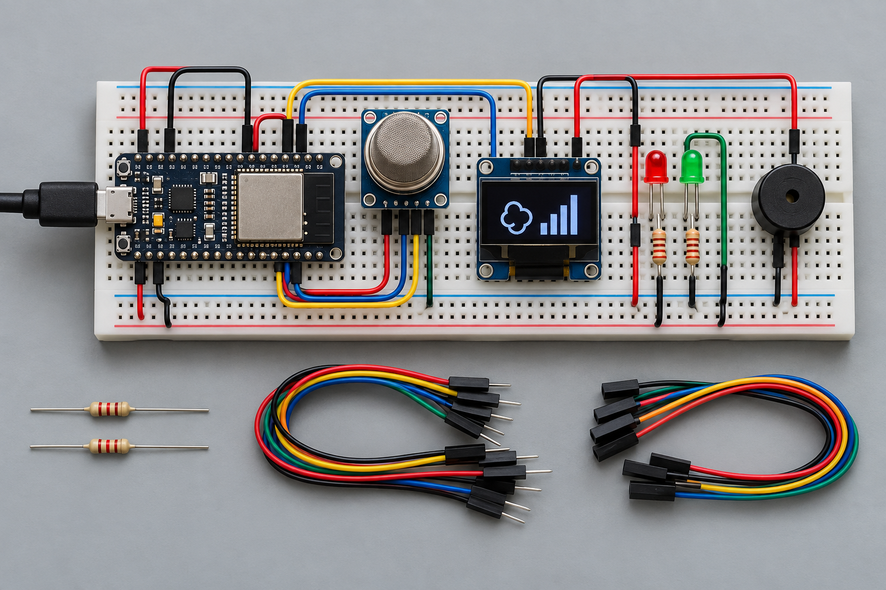

<p align="center">
  <strong>Figura 82. Diseño físico propuesto del dispositivo IoT ResQ para el MVP.</strong>
</p>

<p align="justify">
La representación incluye el ESP32, el MQ-2, la OLED, el buzzer, ambos LEDs, las resistencias, los jumpers, la protoboard y la alimentación USB. Su finalidad es comunicar la organización conceptual del MVP; no constituye evidencia de ensamblaje, calibración o prueba eléctrica.
</p>

##### Circuit Design

<p align="justify">
El circuito conceptual utiliza el ESP32 como controlador central, recibe la señal del MQ-2, comunica la OLED mediante I2C y controla el buzzer y los LEDs. Las resistencias de 220 Ω se colocan en serie con los LEDs. La alimentación inicial proviene del cable USB compatible con el ESP32. El equipo todavía debe verificar en el montaje real los GPIO, los niveles eléctricos, la distribución de tierra, el consumo del MQ-2 y cualquier etapa adicional de acondicionamiento o protección requerida por las hojas técnicas.
</p>

<p align="justify">
La siguiente ilustración provisional adopta una presentación similar a una herramienta de diseño de circuitos y evita asignar números GPIO no validados. No reemplaza la captura o exportación real que deberá obtenerse de Cirkit Designer después de comprobar el circuito físico y el firmware.
</p>

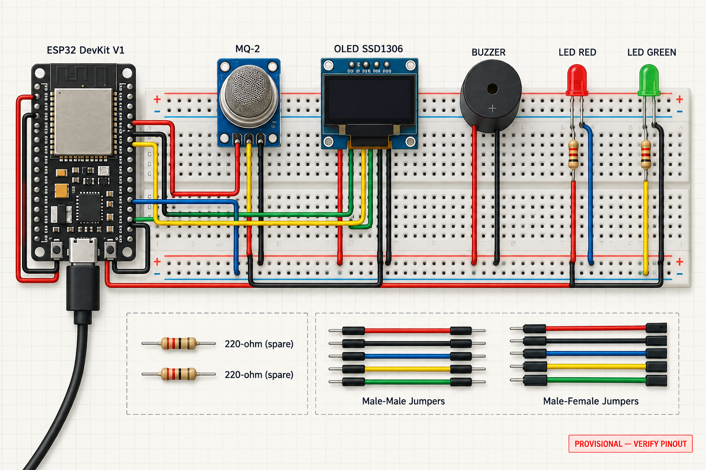

<p align="center">
  <strong>Figura 83. Diseño del circuito del dispositivo IoT ResQ para el MVP.</strong>
</p>

<p align="justify">
<strong>Validación humana requerida:</strong> antes de reemplazar la Figura 83 por la exportación definitiva de Cirkit Designer, el equipo debe verificar y documentar los GPIO reales del ESP32, los niveles de tensión, la distribución de tierra, la alimentación del MQ-2, las conexiones I2C y las protecciones del circuito.
</p>

##### MVP Interaction Flow

<p align="justify">
En el MVP, el MQ-2 produce una señal que el ESP32 captura y procesa localmente. El resultado se presenta en la OLED y se traduce a una señal visual: verde para condición normal y roja para condición de alerta. Cuando la condición configurada lo requiere, el buzzer proporciona una advertencia audible. Este flujo permite validar que sensado, procesamiento y alertamiento local pueden coordinarse en un único nodo antes de incorporar la integración distribuida prevista por ResQ.
</p>

#### Projected Evolution of the IoT Device

<p align="justify">
La evolución proyectada no consiste en presentar el MVP adquirido como la solución final, sino en incorporar este nodo dentro de la arquitectura distribuida ya definida. La Embedded Application capturará las mediciones; Monitoring las recibirá en Edge y podrá conservarlas temporalmente mediante el patrón store-and-forward; Risk Detection evaluará reglas locales; y Alert & Response Management coordinará las respuestas permitidas. Cuando exista conectividad, los servicios Cloud mantendrán el estado observable y la información histórica consumida por la Web Application.
</p>

<p align="justify">
Device Management administrará la identidad, capacidades y asignación de cada nodo; Connectivity Management supervisará su disponibilidad; e Incident Management conservará el seguimiento posterior de situaciones confirmadas. La arquitectura también prescribe Python, Flask, Peewee ORM y SQLite para los Edge Services, pero los repositorios inspeccionados no contienen todavía una implementación Edge verificable con esa pila. Del mismo modo, el protocolo entre el ESP32 y Edge no puede afirmarse como implementado. Estas capacidades pertenecen a la evolución esperada y deberán validarse mediante firmware, servicios Edge y contratos reales antes de considerarlas parte del MVP operativo.
</p>

# Capítulo VI: Product Implementation, Validation & Deployment

## 6.1. Software Configuration Management

### 6.1.1. Software Development Environment Configuration

<p align="justify">
El entorno de desarrollo de ResQ combina herramientas de coordinación, diseño, implementación, pruebas, despliegue y documentación. La selección siguiente se sustenta en el Project Report y en los archivos de configuración de los repositorios. Cuando una versión o producto no puede verificarse, se mantiene un marcador pendiente en lugar de atribuir una herramienta al equipo sin evidencia.
</p>

| Categoría | Herramienta / Producto | Propósito en ResQ | Modalidad | URL oficial |
|---|---|---|---|---|
| Project Management | Jira | Organizar y distribuir actividades del equipo; el Project Report contiene evidencia de su uso en la entrega anterior | SaaS | https://www.atlassian.com/software/jira |
| Requirements Management | Trello | Mantener el Product Backlog con User Stories, Technical Stories, Business Value, Story Points y Acceptance Criteria | SaaS | https://trello.com/ |
| Requirements Management | Miro | Elaborar el Big Picture EventStorming enlazado desde el Project Report | SaaS | https://miro.com/ |
| Product UX/UI Design | Figma | Elaborar Wireframes, Mock-ups y Prototypes para la Landing Page y las aplicaciones de ResQ | SaaS | https://www.figma.com/ |
| IoT Design | Cirkit Designer | Diseñar, verificar y exportar el circuito definitivo del MVP IoT; la Figura 83 actual es provisional y deberá reemplazarse por la exportación validada | SaaS | https://www.cirkitdesigner.com/ |
| Software Development | Git | Controlar versiones y conservar la trazabilidad de los cambios | Software local | https://git-scm.com/ |
| Software Development | GitHub | Alojar los cuatro repositorios de la organización, administrar ramas y revisar Pull Requests | SaaS | https://github.com/ |
| Software Development | Angular 22.2.0 (Web Application) / 22.2.1 (Landing Page) | Construir las dos Single Page Applications con componentes y enrutamiento | Framework web | https://angular.dev/ |
| Software Development | TypeScript 6.0.3 | Implementar la Landing Page y la Web Application con tipado estático; versión resuelta en ambos lockfiles | Lenguaje | https://www.typescriptlang.org/ |
| Software Development | npm 11.17.0 (Web Application) / 12.1.0 (Landing Page) | Administrar dependencias y ejecutar scripts de desarrollo, build y test | Gestor de paquetes local | https://www.npmjs.com/ |
| Software Development | .NET 10 | Proporcionar el runtime y SDK objetivo del backend, según <code>net10.0</code> y el Dockerfile | Runtime y SDK | https://dotnet.microsoft.com/ |
| Software Development | ASP.NET Core | Implementar la RESTful API, controladores, middleware y composición de servicios del backend | Framework web | https://learn.microsoft.com/aspnet/core/ |
| Software Development | Entity Framework Core 10.0.9 | Implementar persistencia relacional y repositorios del backend | ORM | https://learn.microsoft.com/ef/core/ |
| Software Development | MySQL / MySql.EntityFrameworkCore 10.0.9 | Persistir los agregados implementados por los Bounded Contexts del backend | Motor de base de datos / proveedor EF Core | https://www.mysql.com/ |
| Software Development | [PENDIENTE: confirmar IDE utilizado por el equipo] | Editar, ejecutar y depurar los productos de software | Software local | [PENDIENTE: añadir URL oficial] |
| Edge Services — prescrito, no implementado | Python | Implementar la lógica de los ResQ Edge Services según la pila establecida por el Project Statement y documentada en la arquitectura | Lenguaje | https://www.python.org/ |
| Edge Services — prescrito, no implementado | Flask | Exponer las interfaces locales de los ResQ Edge Services; no se encontró una implementación verificable en los repositorios actuales | Framework web | https://flask.palletsprojects.com/ |
| Edge Services — prescrito, no implementado | Peewee ORM | Administrar la persistencia local temporal y las réplicas requeridas por Monitoring, Risk Detection y Alert & Response Management en Edge | ORM | https://docs.peewee-orm.com/ |
| Edge Services — prescrito, no implementado | SQLite | Conservar mediciones, reglas y eventos pendientes durante interrupciones de conectividad mediante almacenamiento local | Motor de base de datos embebido | https://www.sqlite.org/ |
| Software Testing | Angular CLI Unit Test y Vitest 5.0.3 (Landing Page) | Ejecutar las pruebas unitarias configuradas para la Landing Page; la Web Application declara <code>ng test</code>, pero no se encontró una suite equivalente suficiente para afirmar su cobertura | Herramienta local | https://vitest.dev/ |
| Software Testing | Archivo <code>ResQ.API.http</code> | Ejecutar solicitudes manuales contra la RESTful API durante el desarrollo; no sustituye una suite automatizada | Archivo de pruebas HTTP local | https://learn.microsoft.com/aspnet/core/test/http-files |
| Software Deployment | GitHub Pages / angular-cli-ghpages 3.1.0 | Publicar la Landing Page; existe una rama <code>gh-pages</code> y configuración de despliegue en <code>angular.json</code> | Plataforma SaaS / herramienta de despliegue | https://pages.github.com/ |
| Software Deployment | Docker | Construir una imagen multi-stage del backend con SDK y runtime de .NET 10 | Plataforma de contenedores | https://www.docker.com/ |
| Software Documentation | Swagger UI / Swashbuckle.AspNetCore 9.0.6 y Microsoft.AspNetCore.OpenApi 9.0.10 | Generar y exponer documentación OpenAPI para los servicios backend | Librerías y UI local | https://swagger.io/tools/swagger-ui/ |
| Software Documentation | Markdown en GitHub | Mantener el Project Report directamente en el README general y documentar los repositorios | Formato de documentación / plataforma SaaS | https://docs.github.com/get-started/writing-on-github |

<p align="justify">
Los manifiestos de dependencias y lockfiles fijan el conjunto ejecutable de los proyectos Angular; el <code>.csproj</code> y el Dockerfile describen el runtime y las dependencias del backend; y Git conserva cada cambio junto con su rama y commit. Esta combinación favorece un entorno reproducible porque permite instalar dependencias declaradas, construir cada producto desde su configuración versionada y revisar los cambios mediante Pull Requests. Los datos pendientes deberán completarse con evidencia del equipo antes de considerar cerrada la configuración del entorno.
</p>

<p align="justify">
Existe una diferencia relevante entre la prescripción general del Project Statement y la implementación actual de la Landing Page. El enunciado propone HTML5, CSS3 y JavaScript, mientras que el repositorio <code>resq-landing-page</code> utiliza Angular y TypeScript. El equipo adoptó este stack para acelerar el desarrollo y mantener consistencia técnica con la Web Application; sin embargo, la diferencia debe conservarse documentada y no implica que el repositorio haya sido migrado o que la prescripción original deje de aplicar como criterio de evaluación.
</p>

### 6.1.2. Source Code Management.

El código fuente de ResQ se organiza en repositorios independientes dentro de la organización de GitHub del equipo, uno por cada componente de la solución que ya se encuentra en desarrollo. Los componentes Mobile Application, Edge Service y Embedded Application aún no cuentan con repositorio, por lo que se incorporarán a esta tabla cuando inicie su implementación.

| Componente          | Repositorio         | Enlace                                                                                                                                             |
|---------------------|---------------------|----------------------------------------------------------------------------------------------------------------------------------------------------|
| **Backend**         | resq-backend        | [https://github.com/UPC-1ASI0572-202620-16518-ResQ/resq-backend](https://github.com/UPC-1ASI0572-202620-16518-ResQ/resq-backend)                   |
| **Landing Page**    | resq-landing-page   | [https://github.com/UPC-1ASI0572-202620-16518-ResQ/resq-landing-page](https://github.com/UPC-1ASI0572-202620-16518-ResQ/resq-landing-page)         |
| **Web Application** | resq-frontend       | [https://github.com/UPC-1ASI0572-202620-16518-ResQ/resq-frontend](https://github.com/UPC-1ASI0572-202620-16518-ResQ/resq-frontend)                 |

**Flujo de trabajo GitFlow**

El equipo adopta el modelo de ramificación propuesto por Vincent Driessen en *"A successful Git branching model"*, adaptado a las necesidades del proyecto bajo los siguientes lineamientos:

- Una rama estable que contiene únicamente el código listo para entrega.
- Una rama de integración donde se reúne el trabajo en curso antes de pasar a la rama estable.
- Ramas independientes para el desarrollo de cada funcionalidad.
- Cada cambio que llegue a la rama estable se identifica como una nueva versión.

**Ramas definidas:**

- **Main branch:** contiene el código estable y entregable. Solo recibe cambios provenientes de *develop* mediante Pull Request, y cada uno debe ser revisado y aprobado por otro integrante del equipo.
- **Develop branch:** rama de integración donde se combinan las funcionalidades terminadas y se validan antes de publicarlas en *main*.
- **Feature branches:** cada funcionalidad o sección de trabajo se desarrolla en su propia rama (por ejemplo, `feature/chapter-06-gonzalo`), creada a partir de *develop* y fusionada nuevamente en ella mediante Pull Request.

**Nomenclatura de versiones:**

Las versiones siguen el formato `MAJOR.MINOR.PATCH`:

- **Major:** cambios significativos que rompen la compatibilidad con la versión anterior (ej. `1.0.0 -> 2.0.0`).
- **Minor:** nuevas características o mejoras compatibles (ej. `1.1.0 -> 1.2.0`).
- **Patch:** correcciones menores (ej. `1.1.3 -> 1.1.4`).

**Sufijos de versión:**

- `alpha`: versión inestable, en construcción.
- `beta`: versión funcional pero todavía no lista para publicarse.
- `rc`: versión candidata a publicación.

**Convención de commits:**

Los mensajes de commit siguen la especificación *Conventional Commits* (por ejemplo, `feat: add alerts endpoint`, `fix: correct zone validation`, `docs: update sprint evidence`), lo que mantiene un historial legible y vinculado al autor de cada cambio.

### 6.1.3. Source Code Style Guide & Conventions

<p align="justify">
Para garantizar la calidad, consistencia y mantenibilidad del código fuente de ResQ, se establecen convenciones de nomenclatura y programación aplicables a los distintos componentes de la solución. Estas convenciones permiten mantener una estructura uniforme, facilitar la comprensión del código y promover el desarrollo colaborativo entre los integrantes del equipo.
</p>

<p align="justify">
Las convenciones se basan en las tecnologías empleadas en los productos digitales de ResQ, principalmente Angular, TypeScript, HTML y SCSS para el Landing Page y la Web Application, así como C#, ASP.NET Core y Entity Framework Core para los servicios RESTful. Como referencia se consideran las guías de estilo oficiales de Angular, Google y Microsoft, junto con las configuraciones existentes en los repositorios.
</p>

#### Convenciones generales

<p align="justify">
Los componentes de ResQ seguirán las siguientes convenciones generales:
</p>

- **Idioma:** Los nombres de clases, interfaces, métodos, funciones, variables, propiedades, archivos y otros identificadores se redactarán en inglés.
- **Nombres descriptivos:** Los identificadores deberán expresar claramente la responsabilidad o el propósito del elemento, evitando abreviaturas ambiguas.
- **Consistencia:** Se respetarán las convenciones de nomenclatura correspondientes a cada lenguaje de programación.
- **Indentación:** Se utilizarán dos espacios en los proyectos Angular y cuatro espacios en el código C#, siguiendo las convenciones de formato adoptadas para cada entorno.
- **Organización:** El código se organizará de acuerdo con las responsabilidades de cada componente, promoviendo la separación de funcionalidades y la reutilización.
- **Comentarios:** Se utilizarán comentarios para explicar reglas de negocio o decisiones técnicas que no resulten evidentes a partir del código.
- **Manejo de errores:** Se implementarán mecanismos de validación y tratamiento de excepciones para mantener un comportamiento controlado frente a situaciones inesperadas.
- **Seguridad:** Se evitará incorporar credenciales y otros datos sensibles directamente en el código fuente.

<p align="justify">
La siguiente tabla resume las convenciones de nomenclatura consideradas para las tecnologías de ResQ.
</p>

| Elemento | TypeScript / Angular | C# / ASP.NET Core |
|---|---|---|
| Clases | `PascalCase` | `PascalCase` |
| Interfaces | `PascalCase` | `I` + `PascalCase` |
| Métodos | `camelCase` | `PascalCase` |
| Variables | `camelCase` | `camelCase` |
| Propiedades | `camelCase` | `PascalCase` |
| Constantes | `camelCase` o `UPPER_SNAKE_CASE`, según el propósito | `PascalCase` para constantes idiomáticas de C# |
| Archivos | `kebab-case` | Nombres descriptivos en `PascalCase` |
| Carpetas | `kebab-case` | Nombres de módulos y capas según la arquitectura |
| Campos privados | Según la convención del proyecto | `_camelCase` |

#### HTML y SCSS

<p align="justify">
Para la estructura y presentación de las interfaces web se toman como referencia las recomendaciones de Google HTML/CSS Style Guide y las convenciones establecidas por Angular.
</p>

<p align="justify">
En HTML se prioriza el uso de elementos semánticos y atributos que contribuyan a la accesibilidad. Las plantillas utilizan elementos como <code>section</code>, <code>header</code>, <code>nav</code> y <code>footer</code>, así como atributos ARIA para describir componentes interactivos.
</p>

<p align="justify">
En SCSS se emplea principalmente <code>kebab-case</code> para las clases y variables CSS personalizadas. Los estilos se organizan en archivos asociados a componentes, facilitando su mantenimiento y evitando concentrar las reglas visuales en un único archivo.
</p>

<p align="justify">
Entre las convenciones consideradas se encuentran:
</p>

- Utilizar etiquetas HTML semánticas según la responsabilidad del contenido.
- Escribir los nombres de elementos y atributos HTML en minúsculas.
- Mantener nombres descriptivos para clases y selectores.
- Emplear `kebab-case` para clases CSS.
- Utilizar variables CSS para centralizar valores reutilizables.
- Organizar los estilos según los componentes de la aplicación.
- Incorporar atributos de accesibilidad cuando corresponda.

<p align="justify">
Por ejemplo, en el Landing Page se utilizan clases como <code>hero-slide</code>, <code>benefit-card</code> y <code>site-header</code>. Asimismo, se emplean atributos como <code>aria-label</code>, <code>aria-roledescription</code> y <code>tabindex</code> para mejorar la interacción con los elementos de la interfaz.
</p>

#### TypeScript y Angular

<p align="justify">
Para el desarrollo del Landing Page y la Web Application se adoptan convenciones basadas en Google TypeScript Style Guide y Angular Style Guide.
</p>

<p align="justify">
Las clases, interfaces y tipos utilizan <code>PascalCase</code>, mientras que las variables, funciones, métodos y propiedades emplean <code>camelCase</code>. Los nombres de archivos y carpetas utilizan principalmente <code>kebab-case</code>, facilitando su identificación dentro del proyecto.
</p>

<p align="justify">
Entre las principales convenciones se consideran:
</p>

- Utilizar `PascalCase` para clases, interfaces y tipos.
- Utilizar `camelCase` para variables, funciones, métodos y propiedades.
- Utilizar nombres descriptivos para componentes y servicios.
- Mantener tipos definidos mediante las capacidades de TypeScript.
- Separar los componentes de presentación de la lógica de acceso a datos.
- Utilizar Dependency Injection para gestionar dependencias.
- Organizar las funcionalidades en módulos o directorios independientes.
- Emplear mecanismos reactivos de Angular, como Signals y RxJS, según las necesidades del componente.

<p align="justify">
En ResQ, la Web Application presenta una organización basada en funcionalidades mediante directorios como <code>alerts</code>, <code>auth</code>, <code>buildings</code>, <code>devices</code>, <code>monitoring</code> y <code>risk-detection</code>.
</p>

<p align="justify">
Además, se utilizan patrones como Gateway, Facade y Mapper para separar la comunicación con servicios externos de los modelos y componentes de presentación.
</p>

<p align="justify">
El siguiente ejemplo corresponde a la definición de configuración de la API en TypeScript:
</p>

```typescript
export interface ApiConfig {
  baseUrl: string;
  requestTimeoutMs: number;
}

export const API_CONFIG =
  new InjectionToken<ApiConfig>('RESQ_API_CONFIG');
```

<p align="justify">
Este fragmento evidencia el uso de <code>PascalCase</code> para interfaces, <code>camelCase</code> para propiedades y <code>UPPER_SNAKE_CASE</code> para tokens de configuración.
</p>

#### C# y ASP.NET Core

<p align="justify">
Para el desarrollo del Backend RESTful API se toman como referencia las convenciones oficiales de nomenclatura de Microsoft para C# y .NET.
</p>

<p align="justify">
Las clases, métodos y propiedades utilizan <code>PascalCase</code>, mientras que las variables locales y los parámetros utilizan <code>camelCase</code>. Las interfaces incorporan el prefijo <code>I</code>, seguido de un nombre en <code>PascalCase</code>.
</p>

<p align="justify">
Las principales convenciones son:
</p>

- Utilizar `PascalCase` para clases, métodos y propiedades.
- Utilizar `I` + `PascalCase` para interfaces.
- Utilizar `camelCase` para variables locales y parámetros.
- Utilizar `_camelCase` para campos privados cuando corresponda.
- Incorporar el sufijo `Async` en los métodos asíncronos.
- Utilizar nombres descriptivos para Controllers, Repositories, Services y entidades.
- Emplear tipos anulables cuando el modelo permita la ausencia de un valor.
- Mantener encapsuladas las propiedades y colecciones que representan el estado de las entidades del dominio.

<p align="justify">
El siguiente ejemplo corresponde a una interfaz Repository del Bounded Context Building Management:
</p>

```csharp
public interface IBuildingRepository : IBaseRepository<Building>
{
    Task<Building?> FindByIdAndOrganizationIdAsync(
        Guid buildingId,
        Guid organizationId
    );
}
```

<p align="justify">
Este ejemplo evidencia el uso del prefijo <code>I</code> para interfaces, <code>PascalCase</code> para métodos, <code>camelCase</code> para parámetros y el sufijo <code>Async</code> para operaciones asíncronas.
</p>

#### Organización del Backend mediante Domain-Driven Design

<p align="justify">
La organización del Backend de ResQ considera los principios de Domain-Driven Design, separando las responsabilidades mediante Bounded Contexts y capas arquitectónicas.
</p>

<p align="justify">
Entre los módulos identificados se encuentran Identity and Access Management, Building Management, Device Management, Alert Management e Incident Management.
</p>

<p align="justify">
Dentro de los módulos se utilizan las siguientes capas:
</p>

- **Domain:** Contiene entidades, Aggregates, Value Objects, interfaces Repository y reglas de negocio.
- **Application:** Coordina los casos de uso mediante Command Services, Query Services y otros servicios de aplicación.
- **Interfaces:** Expone las capacidades del sistema mediante Controllers, recursos REST y transformaciones de datos.
- **Infrastructure:** Contiene las implementaciones relacionadas con persistencia, acceso a datos y servicios externos.

<p align="justify">
Esta separación facilita el mantenimiento de los componentes y permite que las reglas de negocio se mantengan independientes de los detalles específicos de infraestructura.
</p>

#### Convenciones para RESTful API

<p align="justify">
Para los endpoints de ResQ se aplican convenciones relacionadas con el estilo arquitectónico REST, utilizando nombres de recursos en inglés y rutas que permitan identificar claramente las operaciones disponibles.
</p>

<p align="justify">
Las principales convenciones consideradas son:
</p>

- Utilizar sustantivos para representar recursos.
- Preferir nombres de recursos en plural.
- Utilizar minúsculas y `kebab-case` para los segmentos de las rutas.
- Incorporar versionamiento mediante el prefijo `/api/v1/`.
- Utilizar los métodos HTTP de acuerdo con la operación realizada.
- Emplear códigos de estado HTTP apropiados para representar los resultados.
- Documentar las operaciones mediante Swagger/OpenAPI.

<p align="justify">
Ejemplos de rutas utilizadas en el Backend:
</p>

```text
GET    /api/v1/buildings
POST   /api/v1/buildings
```

<p align="justify">
Asimismo, los Controllers utilizan atributos de ASP.NET Core como <code>ApiController</code>, <code>Route</code>, <code>Authorize</code> y <code>HttpPost</code>, junto con anotaciones de Swagger para documentar las operaciones disponibles.
</p>

#### Herramientas de formato y calidad del código

<p align="justify">
Para mantener consistencia en los proyectos Angular, ResQ utiliza archivos de configuración como <code>.editorconfig</code>, <code>.prettierrc</code> y <code>tsconfig.json</code>.
</p>

<p align="justify">
La configuración de EditorConfig establece el uso de UTF-8, indentación mediante espacios, tamaño de indentación de dos espacios y eliminación de espacios innecesarios al final de las líneas.
</p>

<p align="justify">
Por su parte, Prettier establece un ancho objetivo de 100 caracteres, preferencia por comillas simples y un parser específico para las plantillas HTML de Angular.
</p>

<p align="justify">
La siguiente tabla resume las principales herramientas y configuraciones identificadas.
</p>

| Herramienta | Aplicación en ResQ |
|---|---|
| EditorConfig | Define convenciones de indentación, codificación y espacios en los proyectos Angular. |
| Prettier | Establece reglas de formato para TypeScript, HTML y otros archivos compatibles. |
| TypeScript Compiler | Permite detectar determinados errores mediante opciones de compilación. |
| Angular CLI | Proporciona herramientas para la estructura, compilación y mantenimiento de los proyectos Angular. |
| .NET Compiler | Permite validar el código C# y aplicar las configuraciones establecidas en el proyecto. |
| Swagger/OpenAPI | Facilita la documentación de los endpoints RESTful. |

<p align="justify">
Estas herramientas contribuyen a mantener una base de código consistente. No obstante, la aplicación uniforme de las reglas requiere que los integrantes del equipo utilicen las configuraciones establecidas durante el desarrollo.
</p>

#### Convenciones de pruebas

<p align="justify">
Para la implementación de pruebas se consideran nombres descriptivos en inglés y una organización que permita relacionar las comprobaciones con las funcionalidades del sistema.
</p>

<p align="justify">
En el Landing Page se utiliza Vitest junto con las herramientas de pruebas de Angular. Los archivos de prueba emplean la extensión <code>.spec.ts</code> y estructuras como <code>describe</code>, <code>it</code> y <code>expect</code>.
</p>

<p align="justify">
En la Web Application se han identificado scripts personalizados de verificación mediante Node.js, mientras que el Backend dispone de scripts PowerShell para comprobar operaciones HTTP e interacciones entre componentes.
</p>

<p align="justify">
Como parte de las convenciones de pruebas se consideran:
</p>

- Utilizar nombres descriptivos para los casos de prueba.
- Redactar las descripciones de las pruebas en inglés.
- Mantener separados los archivos de pruebas y las responsabilidades del código evaluado.
- Verificar los resultados esperados mediante aserciones.
- Considerar escenarios positivos y negativos.
- Relacionar las pruebas con las funcionalidades y criterios de aceptación correspondientes.

<p align="justify">
Para futuras pruebas de aceptación basadas en Behavior-Driven Development se considera adoptar Gherkin, utilizando archivos <code>.feature</code> y las palabras clave <code>Feature</code>, <code>Scenario</code>, <code>Given</code>, <code>When</code> y <code>Then</code>. Esta convención todavía no se encuentra implementada en los repositorios examinados.
</p>

#### Documentación y mantenimiento

<p align="justify">
La documentación técnica de ResQ utiliza nombres descriptivos y comentarios que permiten comprender las responsabilidades de los componentes.
</p>

<p align="justify">
En el Backend se emplean comentarios XML mediante etiquetas como <code>summary</code>, <code>param</code> y <code>returns</code>, además de anotaciones Swagger/OpenAPI para documentar los servicios RESTful.
</p>

<p align="justify">
En los proyectos Angular se utilizan archivos README y documentación técnica complementaria para describir configuraciones e integraciones.
</p>

<p align="justify">
Como criterio de mantenimiento, se busca que los comentarios y la documentación técnica de código mantengan una nomenclatura consistente en inglés, mientras que las explicaciones académicas del informe se desarrollan en español, conservando los términos técnicos originales.
</p>

<p align="justify">
Asimismo, se considera la revisión continua de las convenciones de formato, organización y seguridad para identificar oportunidades de mejora durante los siguientes Sprints.
</p>

<p align="justify">
En conjunto, estas convenciones contribuyen a mantener una estructura coherente entre los componentes de ResQ, facilitan la colaboración de los integrantes del equipo y proporcionan una base para la evolución y mantenimiento de la solución IoT.
</p>

## 6.2. Landing Page, Services & Applications Implementation

### 6.2.1. Sprint 1

<p align="justify">
Sprint 1, planificado entre el 29 de septiembre y el 8 de octubre de 2026, corresponde al primer sprint formal de implementación y se centra en construir la primera versión funcional del MVP de ResQ. El incremento reúne cuatro frentes complementarios: Landing Page version 1 para comunicar la propuesta de valor; Frontend Web Application version 1 para representar flujos iniciales de monitoreo y gestión; Backend / Web Services base para soportar recursos principales; y un prototipo IoT MVP para validar sensado de gas/humo, procesamiento en ESP32, visualización local y alertamiento.
</p>

<p align="justify">
El Sprint se documenta mediante Sprint Planning 1, Aspect Leaders and Collaborators, Sprint Backlog 1, Development Evidence for Sprint Review, Testing Suite Evidence for Sprint Review, Execution Evidence for Sprint Review, Services Documentation Evidence for Sprint Review, Software Deployment Evidence for Sprint Review y Team Collaboration Insights during Sprint. Esta sección registra el avance de los productos que integran el MVP sin presentar como concluidas las integraciones Edge o extremo a extremo que todavía no cuentan con evidencia de implementación.
</p>

#### 6.2.1.1. Sprint Planning 1

<p align="justify">
La planificación de Sprint 1 relaciona el Product Backlog con un incremento conjunto y verificable orientado al MVP. La reunión se realizó al inicio del Sprint para alinear el valor esperado de la Landing Page, la Web Application, los Web Services y el prototipo IoT. La información administrativa definida por el equipo se registra en la siguiente tabla; únicamente las métricas de Story Points permanecen pendientes porque no existe evidencia suficiente de la selección formal de historias asignadas al Sprint.
</p>

| Campo | Detalle |
|---|---|
| Sprint # | Sprint 1 |
| Sprint Start Date | 2026-09-29 |
| Sprint End Date | 2026-10-08 |
| Date | 2026-09-29 |
| Time | 08:00 PM |
| Location | Virtual meeting via Discord |
| Prepared By | Quispe Barzola, Fabricio Fabian |
| Attendees | Quispe Barzola, Fabricio Fabian<br>Guerrero Vasquez, Jhon Danny<br>Aliaga Urbina, Wilder Gonzalo<br>Chacaliaza Minaya, Eduardo Fabian<br>Nanfuñay Liza, Pedro Jesús<br>Sánchez Guevara, Iván Fernando |
| Sprint 0 Review Summary / Previous Iteration Review Summary | No formal previous sprint review applies because Sprint 1 corresponds to the first implementation sprint of the project. |
| Sprint 0 Retrospective Summary / Previous Iteration Retrospective Summary | No formal previous sprint retrospective applies because Sprint 1 corresponds to the first implementation sprint of the project. |
| Sprint 1 Goal | Entregar la primera versión funcional del MVP de ResQ, de modo que los segmentos objetivo puedan comprender la propuesta mediante la Landing Page version 1 y que el equipo pueda demostrar un flujo inicial de monitoreo y respuesta mediante la Frontend Web Application version 1, los Backend / Web Services base y el prototipo IoT de gas/humo con procesamiento y alertamiento local. |
| Sprint 1 Velocity | 34 Story Points |
| Sum of Story Points | 34 Story Points |

<p align="justify">
El Sprint Goal expresa un único resultado de valor: disponer de un MVP demostrable que conecte comunicación, operación digital, servicios base y validación física local. La Landing Page comunica el problema y la propuesta de ResQ; la Web Application representa los flujos iniciales de supervisión y gestión; el backend establece servicios para los recursos que ya cuentan con implementación comprobable; y el nodo IoT valida el recorrido local desde la lectura del MQ-2 hasta la OLED, los LEDs y el buzzer. Aunque el Product Backlog contiene Story Points, no existe en el README ni en los repositorios una asignación formal de historias a Sprint 1 que permita sumar puntos o calcular Velocity sin especular.
</p>

#### 6.2.1.3. Sprint Backlog 1

<p align="justify">
El Sprint Backlog 1 de ResQ organiza las User Stories, Technical Stories y Work-items relacionados con el desarrollo de la primera versión del MVP. El Sprint comprende el período del 29 de septiembre al 8 de octubre de 2026 y tiene como objetivo proporcionar una primera experiencia funcional mediante el Landing Page, la Frontend Web Application, los Backend Web Services y el prototipo IoT orientado a la detección local de gas y humo.
</p>

<p align="justify">
La organización de las actividades toma como referencia el Sprint Goal establecido en Sprint Planning 1 y las historias identificadas en el Product Backlog. Estas se descomponen en tareas de desarrollo, integración, configuración, documentación y validación, considerando las responsabilidades de los integrantes del equipo y las necesidades técnicas de cada componente.
</p>

<p align="justify">
Para gestionar el avance del Sprint se utiliza Trello, mediante las listas Product Backlog, Sprint Backlog, In Progress, Review y Done. Esta organización permite visualizar las historias seleccionadas, las actividades en desarrollo, las funcionalidades que requieren revisión y aquellas que han completado su proceso de implementación y validación.
</p>

<p align="justify">
<strong>Sprint 1 - Trello Board:</strong> <a href="https://trello.com/b/BYxUsTcA/resq-product-backlog">ResQ - Product Backlog</a>
</p>

**Figura 84. Sprint Backlog 1 de ResQ en Trello**

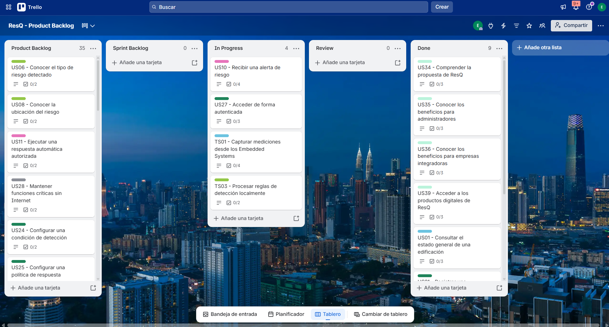

##### User Stories y Technical Stories del Sprint 1

<p align="justify">
La siguiente tabla presenta las historias relacionadas con el desarrollo del MVP durante el Sprint 1. La distribución de estados corresponde a la clasificación propuesta para el cierre de las actividades de software y la continuidad de las actividades de integración del prototipo IoT.
</p>

| Story ID | Story Title | Story Points | Status |
|---|---|---:|---|
| US34 | Comprender la propuesta de ResQ | 2 | Done |
| US35 | Conocer los beneficios para administradores | 2 | Done |
| US36 | Conocer los beneficios para empresas integradoras | 2 | Done |
| US39 | Acceder a los productos digitales de ResQ | 2 | Done |
| US01 | Consultar el estado general de una edificación | 5 | Done |
| US21 | Registrar una edificación | 3 | Done |
| US22 | Definir zonas de una edificación | 3 | Done |
| US23 | Asociar un dispositivo con una zona | 5 | Done |
| TS06 | Proveer servicios mediante RESTful API | 8 | Done |
| US10 | Recibir una alerta de riesgo | 5 | Done |
| US27 | Acceder de forma autenticada | 3 | Done |
| TS01 | Capturar mediciones desde los Embedded Systems | 5 | In Progress |
| TS03 | Procesar reglas de detección localmente | 8 | In Progress |
| **Total** | **13 historias** | **53** | **Distribución propuesta** |

<p align="justify">
Las historias relacionadas con el Landing Page comprenden las funcionalidades necesarias para comunicar la propuesta de valor de ResQ y facilitar el acceso a sus productos digitales. Las historias de la Frontend Web Application y los Backend Web Services abarcan capacidades iniciales de monitoreo, administración de edificaciones, gestión de dispositivos, autenticación y alertas.
</p>

<p align="justify">
Las Technical Stories TS01 y TS03 están relacionadas con la adquisición de mediciones del sensor MQ-2 y el procesamiento local de condiciones de riesgo. Estas actividades continúan en desarrollo y requieren completar la integración y validación física del prototipo IoT.
</p>

<p align="justify">
Las 13 historias representan 53 Story Points asociados provisionalmente al alcance identificado. Esta cifra difiere de los 34 Story Points registrados en Sprint Planning 1, por lo que deberá conciliarse con la selección formal de historias realizada por el equipo. El total de Story Points asociados no equivale automáticamente a la Sprint Velocity.
</p>

##### Work-items del Sprint 1

<p align="justify">
Los Work-items permiten descomponer las historias en actividades específicas de implementación, integración, documentación y validación. Para su organización se establece una distribución de tareas entre los cinco integrantes del equipo, buscando un equilibrio en las estimaciones de esfuerzo y considerando sus áreas de participación.
</p>

<p align="justify">
Las estimaciones se expresan en horas y representan el esfuerzo previsto para cada actividad. Los identificadores T01-T29 y las asignaciones detalladas corresponden a la planificación propuesta para su registro en Trello.
</p>

<p align="justify">
<strong>Sprint #:</strong> Sprint 1
</p>

**Landing Page**

| Story ID | Story Title | Task ID | Task Title | Task Description | Estimation (Hours) | Assigned To | Status |
|---|---|---|---|---|---:|---|---|
| US34 | Comprender la propuesta de ResQ | T01 | Implement landing page structure | Desarrollar la estructura principal y las secciones de presentación de ResQ mediante Angular. | 5 | Eduardo Chacaliaza | Done |
| US34 | Comprender la propuesta de ResQ | T02 | Implement responsive visual design | Implementar estilos SCSS, identidad visual y adaptación responsive del Landing Page. | 4 | Eduardo Chacaliaza | Done |
| US35 | Conocer los beneficios para administradores | T03 | Implement administrator benefits | Desarrollar componentes para presentar los beneficios de ResQ a administradores de edificaciones. | 4 | Eduardo Chacaliaza | Done |
| US36 | Conocer los beneficios para empresas integradoras | T04 | Implement integrator benefits | Incorporar las secciones informativas y beneficios dirigidos a empresas integradoras. | 4 | Eduardo Chacaliaza | Done |
| US39 | Acceder a los productos digitales de ResQ | T05 | Implement landing page navigation | Configurar navegación, enlaces y llamadas a la acción hacia los productos digitales. | 3 | Eduardo Chacaliaza | Done |

**Frontend Web Application**

| Story ID | Story Title | Task ID | Task Title | Task Description | Estimation (Hours) | Assigned To | Status |
|---|---|---|---|---|---:|---|---|
| US01 | Consultar el estado general de una edificación | T06 | Implement monitoring dashboard | Desarrollar la interfaz principal para visualizar el estado general de las edificaciones. | 6 | Fabricio Quispe | Done |
| US01 | Consultar el estado general de una edificación | T07 | Implement monitoring visualizations | Incorporar componentes visuales para representar información de monitoreo y estados de riesgo. | 5 | Fabricio Quispe | Done |
| US10 | Recibir una alerta de riesgo | T08 | Implement alert center | Desarrollar la interfaz para consultar y visualizar alertas de riesgo. | 5 | Fabricio Quispe | Done |
| US10 | Recibir una alerta de riesgo | T09 | Integrate alert data access | Implementar servicios y adaptadores para consultar información de alertas. | 5 | Fabricio Quispe | Done |
| US27 | Acceder de forma autenticada | T10 | Implement authentication interface | Desarrollar formularios y componentes de interfaz para el acceso de usuarios. | 7 | Eduardo Chacaliaza | Done |
| US27 | Acceder de forma autenticada | T11 | Implement session management | Incorporar mecanismos de gestión de sesión y protección de rutas. | 5 | Fabricio Quispe | Done |

**Backend RESTful API**

| Story ID | Story Title | Task ID | Task Title | Task Description | Estimation (Hours) | Assigned To | Status |
|---|---|---|---|---|---:|---|---|
| US21 | Registrar una edificación | T12 | Implement building domain model | Implementar entidades, Aggregates y Value Objects del módulo Building Management. | 6 | Gonzalo Aliaga | Done |
| US21 | Registrar una edificación | T13 | Implement building registration endpoints | Desarrollar servicios y endpoints RESTful para el registro de edificaciones. | 6 | Gonzalo Aliaga | Done |
| US22 | Definir zonas de una edificación | T14 | Implement zone management | Implementar entidades y operaciones para administrar zonas dentro de edificaciones. | 6 | Pedro Nanfuñay | Done |
| US23 | Asociar un dispositivo con una zona | T15 | Implement device management | Desarrollar servicios para administrar dispositivos y asociarlos con edificaciones o zonas. | 7 | Gonzalo Aliaga | Done |
| TS06 | Proveer servicios mediante RESTful API | T16 | Configure backend architecture | Organizar el Backend mediante Bounded Contexts y capas Domain, Application, Interfaces e Infrastructure. | 7 | Gonzalo Aliaga | Done |
| TS06 | Proveer servicios mediante RESTful API | T17 | Implement incident management services | Desarrollar los servicios RESTful relacionados con Incident Management. | 6 | Pedro Nanfuñay | Done |
| TS06 | Proveer servicios mediante RESTful API | T18 | Configure backend deployment | Preparar la configuración de despliegue del Backend mediante Docker. | 5 | Pedro Nanfuñay | Done |
| TS06 | Proveer servicios mediante RESTful API | T19 | Document RESTful endpoints | Configurar Swagger/OpenAPI para documentar las operaciones disponibles de los servicios. | 5 | Pedro Nanfuñay | Done |
| TS06 | Proveer servicios mediante RESTful API | T27 | Validate backend API operations | Ejecutar comprobaciones de integración sobre las operaciones RESTful de los principales módulos del Backend. | 5 | Pedro Nanfuñay | Done |

**IoT Prototype**

<p align="justify">
Las actividades del prototipo IoT están relacionadas con las Technical Stories TS01 y TS03, las cuales contemplan la adquisición de mediciones desde los Embedded Systems y el procesamiento local de condiciones de riesgo.
</p>

<p align="justify">
El desarrollo del prototipo considera la participación colaborativa de los cinco integrantes del equipo. Iván Fernando Sánchez asume la responsabilidad principal de la integración del dispositivo, mientras que los demás integrantes colaboran en las actividades de configuración, procesamiento, integración y validación.
</p>

<p align="justify">
Las actividades permanecen en In Progress hasta completar y verificar la implementación física del prototipo.
</p>

| Story ID | Story Title | Task ID | Task Title | Task Description | Estimation (Hours) | Assigned To | Status |
|---|---|---|---|---|---:|---|---|
| TS01 | Capturar mediciones desde los Embedded Systems | T20 | Configure IoT prototype | Preparar el entorno de desarrollo y configurar los componentes del prototipo IoT. | 3 | Iván Fernando Sánchez / Eduardo Chacaliaza | In Progress |
| TS01 | Capturar mediciones desde los Embedded Systems | T21 | Integrate MQ-2 sensor | Configurar la adquisición de mediciones del sensor MQ-2 mediante ESP32. | 3 | Iván Fernando Sánchez | In Progress |
| TS01 | Capturar mediciones desde los Embedded Systems | T22 | Validate sensor measurements | Comprobar la adquisición y consistencia de las mediciones obtenidas desde el sensor. | 3 | Iván Fernando Sánchez / Fabricio Quispe | In Progress |
| TS03 | Procesar reglas de detección localmente | T23 | Implement local risk detection | Desarrollar la lógica de evaluación de mediciones y detección local de condiciones de riesgo. | 3 | Iván Fernando Sánchez / Gonzalo Aliaga | In Progress |
| TS03 | Procesar reglas de detección localmente | T24 | Integrate OLED display | Implementar la visualización de mediciones y estados del sistema mediante una pantalla OLED. | 3 | Iván Fernando Sánchez | In Progress |
| TS03 | Procesar reglas de detección localmente | T25 | Integrate LED and buzzer alerts | Implementar la señalización visual y sonora de condiciones de riesgo mediante LEDs y buzzer. | 3 | Iván Fernando Sánchez / Pedro Nanfuñay | In Progress |
| TS03 | Procesar reglas de detección localmente | T26 | Validate local alert response | Diseñar y ejecutar pruebas para comprobar el procesamiento local y la activación de alertas. | 2 | Iván Fernando Sánchez | In Progress |

**Actividades complementarias de diseño y documentación**

<p align="justify">
Adicionalmente, el Sprint considera actividades de diseño y documentación que brindan soporte a la implementación de los diferentes componentes de ResQ. Estas tareas se registran como actividades transversales, sin atribuirlas a una User Story específica.
</p>

| Story ID | Story Title | Task ID | Task Title | Task Description | Estimation (Hours) | Assigned To | Status |
|---|---|---|---|---|---:|---|---|
| Sprint 1 | UX/UI Design | T28 | Develop Figma designs | Elaborar y mejorar los diseños de interfaces y prototipos de ResQ mediante Figma, manteniendo coherencia con las funcionalidades propuestas. | 3 | Iván Fernando Sánchez | Done |
| Sprint 1 | Technical Documentation | T29 | Prepare project documentation | Elaborar y actualizar documentación técnica y artefactos del proyecto relacionados con las funcionalidades del Sprint. | 3 | Iván Fernando Sánchez | Done |

##### Resumen de distribución de actividades

<p align="justify">
La distribución de Work-items considera las responsabilidades técnicas de los cinco integrantes del equipo y busca mantener un equilibrio en las estimaciones de esfuerzo.
</p>

| Team Member | Main Responsibility | Assigned Tasks | Estimated Hours |
|---|---|---:|---:|
| Chacaliaza Minaya, Eduardo Fabian | Landing Page, Frontend Web Application e IoT | 6 | 27 |
| Quispe Barzola, Fabricio Fabian | Frontend Web Application e IoT | 5 | 26 |
| Aliaga Urbina, Wilder Gonzalo | Backend, Web Services e IoT | 4 | 26 |
| Nanfuñay Liza, Pedro Jesús | Backend, pruebas, despliegue e IoT | 5 | 27 |
| Sánchez Guevara, Iván Fernando | IoT Prototype, UX/UI Design y documentación | 9 | 26 |
| **Total** | **Sprint 1** | **29** | **132** |

<p align="justify">
La participación de Eduardo Chacaliaza comprende el desarrollo del Landing Page y la Frontend Web Application, mientras que Fabricio Quispe contribuye a las funcionalidades de monitoreo, alertas y gestión de sesiones. Wilder Gonzalo Aliaga y Pedro Nanfuñay participan en los servicios Backend, la administración de recursos, las pruebas y el despliegue. Por su parte, Iván Fernando Sánchez participa en la elaboración de diseños mediante Figma, la documentación del proyecto y las actividades de implementación del prototipo IoT.
</p>

<p align="justify">
Adicionalmente, los cinco integrantes colaboran en las actividades relacionadas con el dispositivo IoT, incluyendo su configuración, adquisición de mediciones, procesamiento local, señalización y validación. Esta organización busca promover la participación conjunta, el intercambio de conocimientos y la distribución de responsabilidades para alcanzar el Sprint Goal establecido.
</p>

<p align="justify">
Finalmente, la organización del Sprint Backlog mediante Trello y su relación con las evidencias disponibles en GitHub permiten realizar el seguimiento de las actividades asociadas al Sprint 1. Las funcionalidades de software clasificadas como Done deberán contar con la validación correspondiente de sus Acceptance Criteria, mientras que las actividades del prototipo IoT continúan en desarrollo hasta completar su integración y comprobación física.
</p>

#### 6.2.1.4. Development Evidence for Sprint Review

<p align="justify">
La evidencia de desarrollo se obtuvo del historial Git de <code>resq-landing-page</code>, <code>resq-frontend</code> y <code>resq-backend</code>. El criterio de selección considera commits no merge realizados entre el inicio de Sprint 1, 2026-09-29, y su cierre definido, 2026-10-08, priorizando incrementos que evidencian la primera versión del MVP. La evidencia disponible fue revisada el 2026-10-06; por ello, la tabla no atribuye commits futuros a los dos días restantes del Sprint. Se excluyeron commits anteriores al 2026-09-29, incluso cuando proporcionaron bases técnicas relevantes. La columna Branch utiliza ramas remotas verificadas que contienen cada commit; el subject y el body se reproducen de forma literal, y se usa “—” cuando el commit no tiene body.
</p>

| Repository | Branch | Commit Id | Commit Message | Commit Message Body | Committed on (Date) |
|---|---|---|---|---|---|
| resq-landing-page | main | <code>4499f2eeed8099b5c7894ae23a420a96c3571952</code> | feat: ResQ landing page | — | 2026-10-04 02:05:56 -0500 |
| resq-landing-page | main | <code>afd01e2002fcd2949d17cf4f9b82844cf55b8426</code> | feat: rediseñar landing de ResQ, unificar estilos y optimizar el código | — | 2026-10-04 14:04:50 -0500 |
| resq-landing-page | main | <code>7977f58519e8b0bff42835bd081e017c006d8fcb</code> | fix: corregir assets y despliegue en GitHub Pages | — | 2026-10-04 14:20:25 -0500 |
| resq-frontend | main | <code>dc54e7ef1dba5792aa220a6f4b16039e07862223</code> | feat: build complete ResQ monitoring frontend | — | 2026-09-29 19:42:45 -0500 |
| resq-frontend | feature/devices | <code>0d1b1b8a2a321e5ae25adfe7fce9e61f53610fee</code> | feat(devices): add hardware-aware device management views | — | 2026-09-30 03:09:19 -0500 |
| resq-frontend | feature/devices | <code>dd9cd578aa541b90b45a6266aad081a5fe547d75</code> | chore(devices): Add WebP assets for device components | Add seven new device images under `public/assets/devices` for the buzzer, ESP32 devkit, LEDs, MQ2 sensor, OLED display, and ResQ MVP node to support UI/device visuals. | 2026-09-30 03:19:03 -0500 |
| resq-frontend | feature/alerts | <code>e2754769684112120e76425c308231c9b1e6bc18</code> | feat(alerts): add contextual alert center and activity details | — | 2026-09-30 05:02:43 -0500 |
| resq-frontend | refactor/frontend-backend-ready | <code>87a77548cc40cf14bf497179f655b08e3da5d487</code> | feat(frontend-backend): Add data-access facades and auth session flow | Introduces a full data-access layer across alerts, IAM/auth, users, buildings, connectivity, incidents, monitoring, and risk detection with gateway interfaces, DTOs, mappers, facades, providers, and mock/http adapters. It also wires these providers into app config, refactors login to use the new AuthSessionFacade + user profile loading, updates app shell/topbar/sidebar to consume session data (including sign-out), and adds the new sidebar brand logo asset. | 2026-09-30 10:56:13 -0500 |
| resq-frontend | feature/buildings | <code>04935d3c684c312568e296060e17004cd13c8a4e</code> | feat: dd localization and revamp operations UI | — | 2026-09-30 17:34:42 -0500 |
| resq-frontend | main | <code>2ec1133a588fabcd890101300652021c831f0fe5</code> | feat: Add risk lifecycle and auth projections | — | 2026-10-06 00:13:43 -0500 |
| resq-frontend | main | <code>c03264025b814256cb9a985f9b809594aac7cbeb</code> | fix: Refine alert/incident UX and auth roles | Improves alert and incident clarity across the UI: alert details now show clear-reason explanations, system response wording was updated, incident details now separate original critical detection from current condition, and response action cards include richer authorization/execution context. Topbar notifications were redesigned to show event labels, concise titles, and resolved locations, with matching style updates. Authorization logic now prioritizes identity-based role mapping, and mock IAM data adds a dedicated viewer identity to keep admin/viewer behavior testable with the current mock user profile. | 2026-10-06 00:56:18 -0500 |
| resq-backend | feature/buildings-management | <code>9640bd7abe9cb9f2a07c1756e8f71db19015b137</code> | feat: implement building and device management bounded contexts | — | 2026-09-30 16:50:08 -0500 |
| resq-backend | feature/incident-management | <code>c89238230e56784ff5c44f88f40eb32884e6a467</code> | feat(incident-management): add Incident Management bounded context. | — | 2026-09-30 17:49:05 -0500 |
| resq-backend | main | <code>34e57e037600ff83ba414cda742a6d6ed30b01af</code> | feat(main): add docker configuration for deploy. | — | 2026-09-30 20:04:50 -0500 |
| resq-backend | feature/alerts | <code>a8e18a4129342567f58f5e750507192ea8d84024</code> | feat: implement alert management bounded context with commands, queries, and REST controllers | — | 2026-10-03 17:05:39 -0500 |
| resq-backend | feature/alerts | <code>292e1afa294f95d490e37ee5536974cd0415af6d</code> | feat: implement core backend modules including IAM, Alert Management, Incident Management, and Building Management | — | 2026-10-05 20:13:29 -0500 |

##### Landing Page

<p align="justify">
Los commits seleccionados evidencian la implementación, el rediseño y la preparación de publicación de la Landing Page version 1 durante el rango del Sprint. El código disponible presenta una experiencia Angular con secciones de propuesta de valor, beneficios, producto, segmentos, equipo, aliados y llamado a la acción, además de vistas de privacidad y términos. La existencia de la rama <code>gh-pages</code> demuestra la generación del artefacto de publicación del componente informativo del MVP, sin que esta sección afirme métricas de disponibilidad o validación con usuarios.
</p>

##### Frontend Web Application

<p align="justify">
El historial evidencia la construcción de la Frontend Web Application version 1, la incorporación de vistas de gestión de dispositivos alineadas con el hardware del MVP, el centro contextual de alertas y la evolución de edificios y planos. También registra una capa de acceso a datos con gateways, DTOs, mappers, facades, adaptadores mock/HTTP y flujo de sesión. Los commits más recientes refinan las proyecciones del ciclo de riesgo, la claridad de alertas e incidentes y el tratamiento de roles. La auditoría interna del repositorio advierte que varias operaciones continúan simuladas o dependen de contratos backend pendientes; por ello, estos avances demuestran el incremento funcional del MVP, pero no una integración extremo a extremo finalizada.
</p>

##### Backend / Web Services

<p align="justify">
Los commits comprendidos dentro del Sprint evidencian implementaciones para Building Management, Device Management, Incident Management y Alert Management, además de un commit integrador de módulos base y una configuración Docker multi-stage para compilar y ejecutar la API sobre .NET 10. Estas capacidades proporcionan servicios iniciales para el MVP digital. Aunque el Project Report diseña Monitoring, Risk Detection, Connectivity Management y servicios Edge, no se encontró en <code>resq-backend</code> una implementación equivalente de esos componentes; por ello, no se consideran concluidos en Sprint 1.
</p>


### 6.2.1.6. Execution Evidence for Sprint Review

<p align="justify">
Durante el Sprint 1 de ResQ se desarrollaron y desplegaron las primeras versiones de los productos digitales que conforman el MVP de la solución. Las actividades de implementación estuvieron orientadas a proporcionar una experiencia inicial de interacción mediante el Landing Page, la Frontend Web Application y los Backend Web Services, así como avanzar en el diseño e integración del prototipo IoT para la detección de gas y humo.
</p>

<p align="justify">
En esta sección se presentan las evidencias de ejecución correspondientes a los componentes desarrollados durante el Sprint, considerando las principales interfaces, funcionalidades y mecanismos de interacción disponibles. Estas evidencias permiten visualizar los resultados obtenidos y contrastarlos con el Sprint Goal establecido durante la planificación.
</p>

#### Landing Page

<p align="justify">
Durante el Sprint 1 se implementó la primera versión del Landing Page de ResQ utilizando Angular, TypeScript, HTML y SCSS. Este producto digital tiene como propósito comunicar la propuesta de valor de la solución y presentar sus principales beneficios a los segmentos objetivo.
</p>

<p align="justify">
La implementación comprende una estructura de navegación que permite acceder a las distintas secciones informativas del sitio, conocer las características de ResQ y utilizar los enlaces disponibles hacia sus productos digitales.
</p>

<p align="justify">
Entre las principales características desarrolladas se encuentran:
</p>

- Presentación de la propuesta de valor de ResQ.
- Secciones informativas sobre las funcionalidades y beneficios de la solución.
- Contenido dirigido a administradores de edificaciones y empresas integradoras.
- Navegación entre las diferentes secciones del Landing Page.
- Diseño responsive para su visualización en diferentes dispositivos.
- Elementos visuales interactivos para presentar las características de la solución.

<p align="justify">
La implementación también considera una experiencia visual consistente con la identidad de ResQ, utilizando componentes reutilizables y estilos organizados mediante SCSS.
</p>

<p align="justify">
<strong>Landing Page desplegado:</strong> <a href="https://upc-1asi0572-202620-16518-resq.github.io/resq-landing-page/">ResQ - Landing Page</a>
</p>

**Figura 85. Vista principal del Landing Page de ResQ**

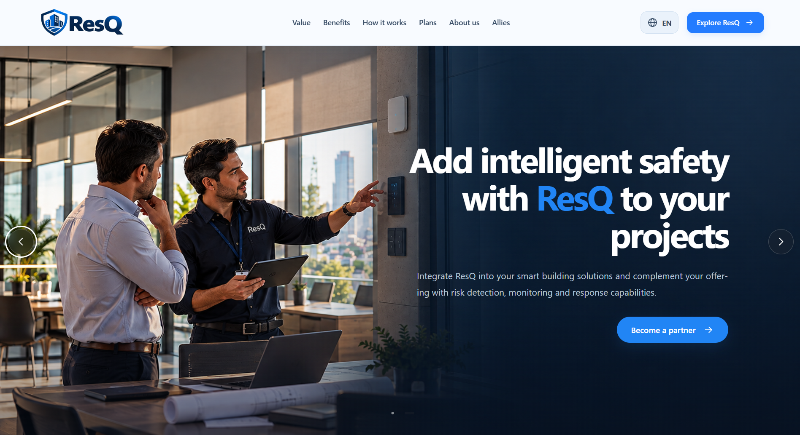

**Figura 86. Sección de beneficios del Landing Page**

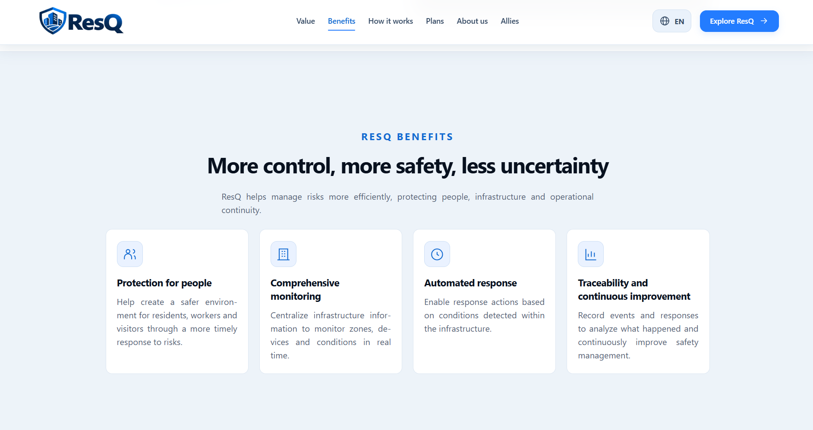

<p align="justify">
Las vistas del Landing Page evidencian la implementación de una experiencia orientada a comunicar la propuesta del producto y facilitar que los visitantes conozcan las funcionalidades ofrecidas por ResQ.
</p>

#### Frontend Web Application

<p align="justify">
La primera versión de la Frontend Web Application fue desarrollada utilizando Angular, TypeScript, Angular Material y SCSS. Su implementación permite representar los principales procesos relacionados con el monitoreo de edificaciones, la administración de dispositivos, la visualización de condiciones de riesgo y la gestión de alertas.
</p>

<p align="justify">
Durante el Sprint 1 se desarrollaron interfaces y componentes correspondientes a las funcionalidades principales del MVP, organizados mediante una arquitectura basada en features.
</p>

<p align="justify">
Entre los módulos y funcionalidades implementados se encuentran:
</p>

- **Authentication:** Interfaces para el inicio de sesión y mecanismos de gestión de sesión.
- **Dashboard:** Visualización general de información y estados asociados al monitoreo de edificaciones.
- **Building Management:** Interfaces relacionadas con la administración de edificaciones y sus zonas.
- **Device Management:** Vistas para consultar y administrar dispositivos asociados a la solución.
- **Monitoring:** Componentes destinados a representar información de supervisión y mediciones.
- **Alert Management:** Interfaz para visualizar alertas, consultar información contextual y revisar eventos de riesgo.

<p align="justify">
La aplicación utiliza componentes reutilizables y mecanismos de navegación que permiten recorrer las funcionalidades disponibles. Asimismo, incorpora abstracciones de acceso a datos mediante Facades y Gateways, contemplando adaptadores HTTP y adaptadores basados en datos simulados.
</p>

<p align="justify">
Por ello, las evidencias de visualización representan las capacidades implementadas en la interfaz, sin asumir que todas las funcionalidades se encuentran integradas completamente con dispositivos físicos o servicios externos.
</p>

<p align="justify">
<strong>Frontend Web Application desplegada:</strong> <a href="https://resq-frontend.ffaaliceht2003.workers.dev/login">ResQ - Web Application</a>
</p>

**Figura 87. Vista de inicio de sesión de ResQ**

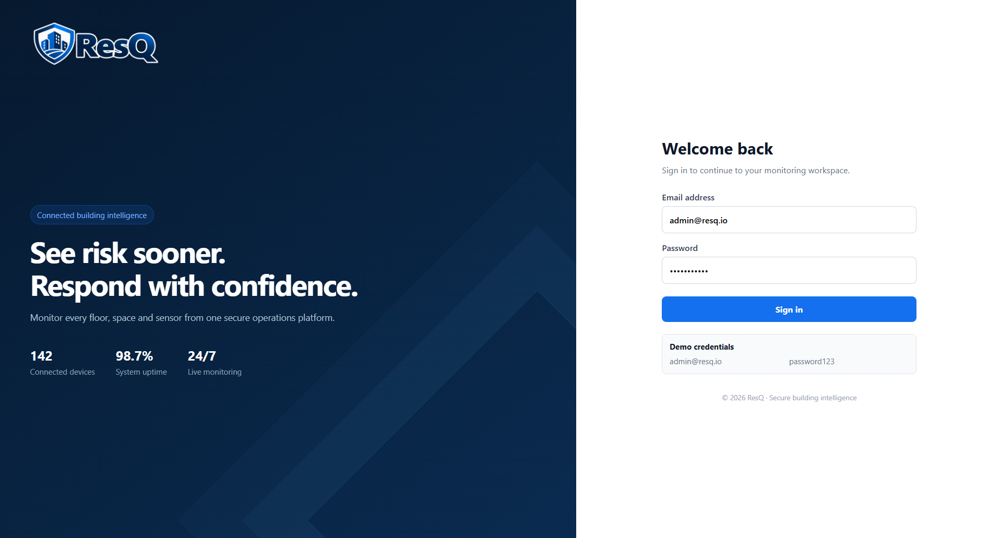

<p align="justify">
La interfaz de autenticación permite presentar el punto de acceso a las funcionalidades de la aplicación y forma parte de las capacidades relacionadas con Identity and Access Management.
</p>

**Figura 88. Dashboard principal de monitoreo**

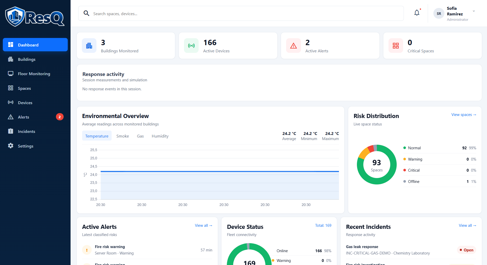

<p align="justify">
El Dashboard permite visualizar información general relacionada con las edificaciones y sus condiciones de supervisión, proporcionando una vista centralizada de los datos presentados por el sistema.
</p>

**Figura 89. Administración de edificaciones**

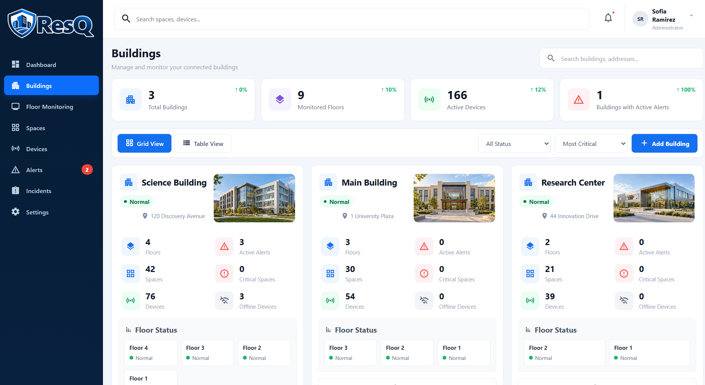

<p align="justify">
Las interfaces de Building Management permiten representar las funcionalidades relacionadas con la consulta y administración de edificaciones, así como la organización de sus zonas.
</p>

**Figura 90. Administración de dispositivos**

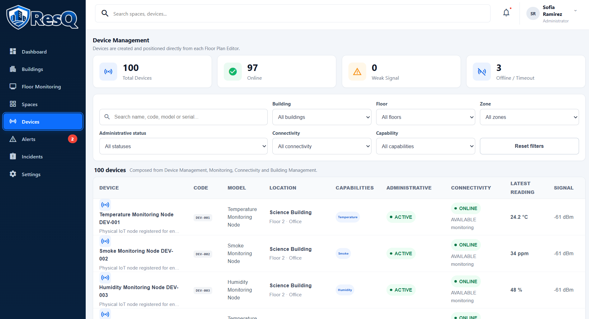

<p align="justify">
La sección de Device Management proporciona una interfaz para consultar y administrar los dispositivos considerados dentro de la solución, incluyendo su relación con las edificaciones y zonas correspondientes.
</p>

**Figura 91. Centro de alertas de ResQ**

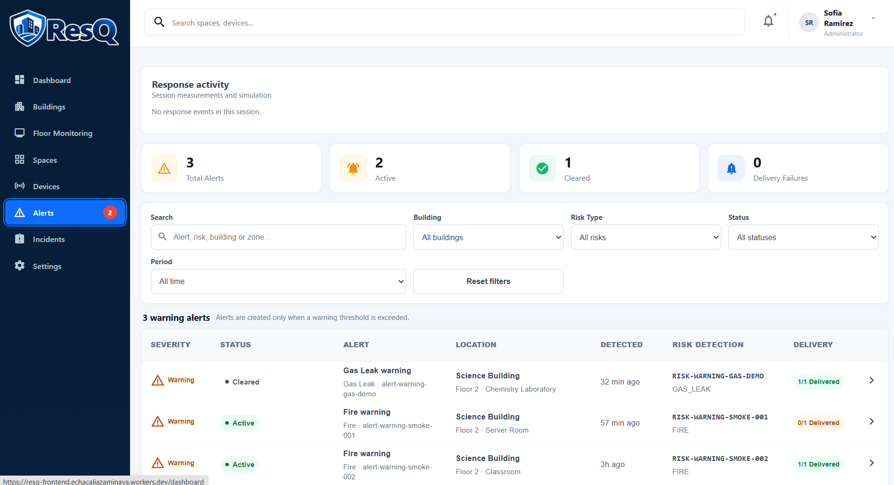

<p align="justify">
El centro de alertas permite visualizar información contextual sobre eventos y condiciones de riesgo. Esta funcionalidad constituye una de las principales capacidades de ResQ para facilitar la supervisión y el seguimiento de situaciones que requieren atención.
</p>

<p align="justify">
En conjunto, las interfaces desarrolladas permiten demostrar los principales recorridos de navegación del MVP y proporcionan una base para continuar con la integración de servicios, el procesamiento de información IoT y la validación de las funcionalidades durante los siguientes Sprints.
</p>

#### Backend Web Services

<p align="justify">
Durante el Sprint 1 se implementaron servicios RESTful utilizando C#, ASP.NET Core y Entity Framework Core, considerando MySQL como tecnología de persistencia.
</p>

<p align="justify">
El Backend se organiza mediante Bounded Contexts y capas arquitectónicas basadas en Domain-Driven Design, separando las responsabilidades de Domain, Application, Interfaces e Infrastructure.
</p>

<p align="justify">
Entre los componentes con avances de implementación se encuentran:
</p>

- **Identity and Access Management:** Servicios relacionados con autenticación, autorización y gestión de acceso.
- **Building Management:** Operaciones para registrar, consultar y administrar edificaciones y zonas.
- **Device Management:** Servicios relacionados con la administración y asociación de dispositivos.
- **Incident Management:** Operaciones relacionadas con la gestión de incidentes.
- **Alert Management:** Servicios para administrar y consultar información de alertas.

<p align="justify">
Los servicios desarrollados utilizan endpoints RESTful y mecanismos de documentación mediante Swagger/OpenAPI, facilitando la consulta de las operaciones disponibles y sus contratos de interacción.
</p>

<p align="justify">
<strong>Backend Web Services:</strong> <a href="https://resq-api-79xy.onrender.com/swagger/index.html">ResQ - Swagger UI</a>
</p>

**Figura 92. Documentación de servicios RESTful mediante Swagger**

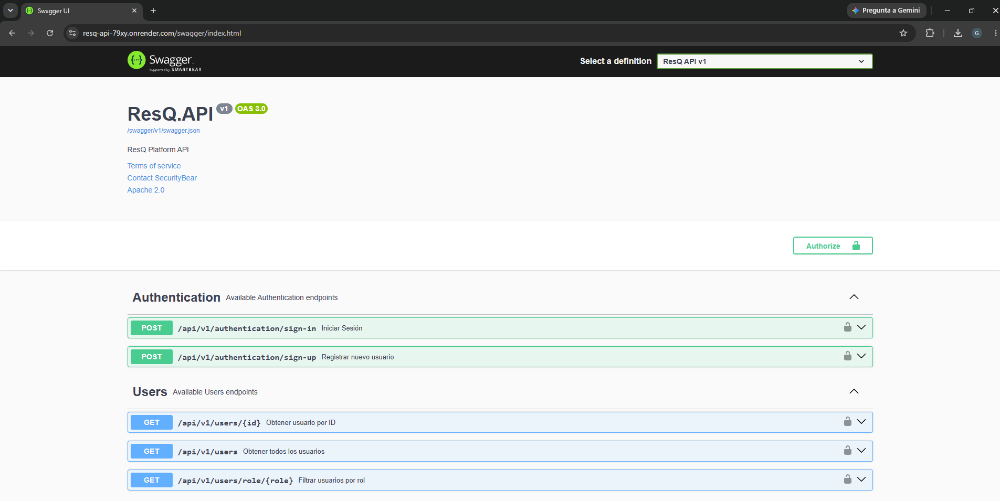

<p align="justify">
La documentación Swagger permite visualizar los endpoints expuestos por el Backend, sus métodos HTTP y las estructuras de solicitud y respuesta correspondientes.
</p>

<p align="justify">
Esta evidencia complementa las interfaces de la Web Application al mostrar los servicios disponibles para soportar las principales funcionalidades del MVP.
</p>

<p align="justify">
La disponibilidad de estos endpoints constituye un avance en la implementación de la arquitectura de ResQ. Sin embargo, la ejecución individual de los servicios no implica necesariamente que todos los flujos de integración entre Frontend, Backend y dispositivos IoT hayan sido completados.
</p>

#### IoT Prototype

<p align="justify">
Como parte del Sprint 1 de ResQ, se contempla el diseño y desarrollo de un prototipo IoT orientado a la detección local de condiciones de riesgo relacionadas con la presencia de gas y humo en edificaciones. Para ello, se propone utilizar un ESP32 como unidad principal de procesamiento, un sensor MQ-2 para la adquisición de mediciones y diferentes componentes de visualización y señalización.
</p>

<p align="justify">
El prototipo considera los siguientes componentes:
</p>

- **ESP32:** Microcontrolador encargado de recibir y procesar las mediciones del sensor, evaluar las condiciones de riesgo y controlar los dispositivos de salida.
- **Sensor MQ-2:** Componente utilizado para detectar la presencia de determinados gases combustibles y humo mediante variaciones en su señal de salida.
- **Pantalla OLED:** Dispositivo destinado a mostrar las mediciones del sensor y el estado de riesgo identificado.
- **LEDs:** Indicadores visuales que permiten diferenciar condiciones normales de situaciones de alerta.
- **Buzzer:** Actuador encargado de emitir una señal sonora cuando se identifica una condición de riesgo.

<p align="justify">
Para representar la integración de estos componentes, se utiliza la herramienta Cirkit Designer, que permite elaborar el esquema electrónico del prototipo y visualizar las conexiones entre el ESP32, el sensor MQ-2 y los dispositivos de salida.
</p>

**Figura 93. Diseño del circuito electrónico del prototipo IoT de ResQ en Cirkit Designer**

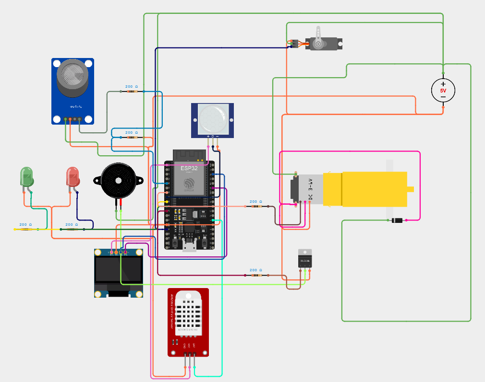

<p align="justify">
La figura presenta el diseño propuesto del circuito electrónico, mostrando la disposición de los componentes y sus conexiones. Este esquema sirve como referencia para la implementación del prototipo y la posterior comprobación de su funcionamiento.
</p>

<p align="justify">
El comportamiento esperado del sistema consiste en adquirir las mediciones del sensor MQ-2, procesarlas localmente mediante el ESP32 y determinar el estado de riesgo de acuerdo con los umbrales establecidos. En condiciones normales, el sistema deberá mostrar el estado correspondiente mediante la pantalla OLED y los indicadores visuales. Cuando se identifique una condición de riesgo, se deberá activar la señalización mediante los LEDs y el buzzer.
</p>

<p align="justify">
Estas actividades se encuentran alineadas con las Technical Stories TS01 - Capturar mediciones desde los Embedded Systems y TS03 - Procesar reglas de detección localmente, contribuyendo al cumplimiento del Sprint Goal mediante el diseño de los componentes necesarios para la detección y señalización de condiciones de riesgo.
</p>

<p align="justify">
El diseño elaborado en Cirkit Designer constituye una evidencia del avance del prototipo IoT durante el Sprint 1, al representar la integración propuesta entre el sensor MQ-2, el ESP32 y los dispositivos de visualización y alerta. Este entregable establece una base para las siguientes actividades de implementación, integración y validación del sistema, permitiendo continuar con el desarrollo progresivo de las capacidades de detección y respuesta de ResQ.
</p>

#### Video de ejecución del Sprint 1

<p align="justify">
Como complemento de las capturas presentadas, se contempla una demostración de ejecución del Sprint 1 que permita visualizar los principales recorridos de navegación y las funcionalidades implementadas en los productos digitales de ResQ.
</p>

<p align="justify">
La demostración comprende los siguientes aspectos:
</p>

1. Presentación y navegación del Landing Page.
2. Acceso a la Frontend Web Application.
3. Visualización del Dashboard de monitoreo.
4. Consulta de las interfaces de administración de edificaciones y dispositivos.
5. Visualización del centro de alertas.
6. Revisión de los endpoints disponibles mediante Swagger/OpenAPI.
7. Presentación del diseño y avance del prototipo IoT, diferenciando los componentes diseñados de aquellos cuya ejecución física ha sido verificada.

**Figura 94. Vista de presentación del video de ejecución del Sprint 1**

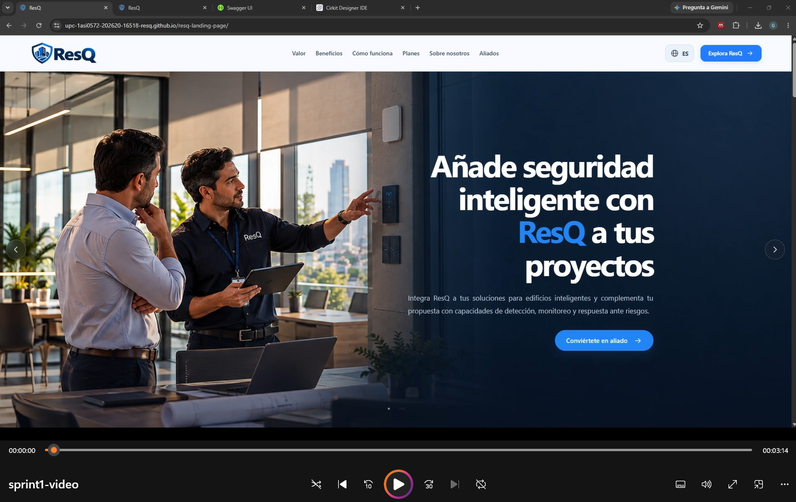

<p align="justify">
<strong>Video de ejecución del Sprint 1:</strong> <a href="https://upcedupe-my.sharepoint.com/:v:/g/personal/u202324129_upc_edu_pe/IQAQ6NruE-URQYLK_p5ANr6UAUSqoPO8b_EXK1SNzfs9sDg?nav=eyJyZWZlcnJhbEluZm8iOnsicmVmZXJyYWxBcHAiOiJPbmVEcml2ZUZvckJ1c2luZXNzIiwicmVmZXJyYWxBcHBQbGF0Zm9ybSI6IldlYiIsInJlZmVycmFsTW9kZSI6InZpZXciLCJyZWZlcnJhbFZpZXciOiJNeUZpbGVzTGlua0NvcHkifX0&e=gOMH9u">Execution Evidence - Sprint 1</a>
</p>

<p align="justify">
El video complementa las evidencias visuales presentadas en esta sección y permite revisar los resultados de implementación del Landing Page, la Frontend Web Application y los Backend Web Services, así como el avance del diseño del prototipo IoT.
</p>

<p align="justify">
En conjunto, las evidencias del Sprint 1 muestran los avances realizados en los productos digitales de ResQ y en la definición de los componentes necesarios para la detección local de condiciones de riesgo. Asimismo, permiten identificar las actividades de integración y validación que continuarán desarrollándose para completar el MVP.
</p>


#### 6.2.1.7. Services Documentation Evidence for Sprint Review.

En esta sección se presentan los avances logrados en la documentación de los Web Services desarrollados durante el Sprint, evidenciando la correcta implementación y estandarización de los endpoints mediante OpenAPI (Swagger). Se detallan las acciones disponibles (GET, POST, PUT), sus parámetros, ejemplos de respuesta y la descripción de su funcionamiento, garantizando la trazabilidad, comprensión y correcta integración entre los distintos componentes del sistema. Todos los endpoints requieren un token JWT en el header `Authorization: Bearer <token>`, salvo `sign-in` y `sign-up`, que son públicos.

Backend repository: [https://github.com/UPC-1ASI0572-202620-16518-ResQ/resq-backend](https://github.com/UPC-1ASI0572-202620-16518-ResQ/resq-backend)

| endpoint | verbo http | descripción | parámetros | request body | response body | explicación |
|---|---|---|---|---|---|---|
| /api/v1/authentication/sign-up | POST | Registra un nuevo usuario. | — | Objeto JSON con `firstName`, `lastName`, `email`, `username`, `password` y `role` (`citizen` o `volunteer`). | Datos del usuario creado (`id`, `username`). | Permite crear nuevas cuentas de usuario en la plataforma. Endpoint público. |
| /api/v1/authentication/sign-in | POST | Autentica a un usuario. | — | Objeto JSON con `username` y `password`. | Datos del usuario autenticado (`id`, `username`, `role`) y token JWT. | Permite iniciar sesión y obtener el token para acceder a los recursos protegidos. Endpoint público. |
| /api/v1/users | GET | Obtiene la lista completa de usuarios. | — | — | Lista de usuarios (`id`, `username`). | Permite visualizar todos los usuarios registrados en el sistema. |
| /api/v1/users/{id} | GET | Obtiene un usuario específico. | `id` (path) | — | Datos del usuario (`id`, `username`). | Retorna la información del usuario identificado por su ID. |
| /api/v1/users/role/{role} | GET | Lista los usuarios de un rol determinado. | `role` (path) | — | Lista de usuarios con el rol indicado. | Permite filtrar usuarios por rol (por ejemplo, ciudadano o voluntario). |
| /api/v1/profiles/me | GET | Obtiene el perfil del usuario autenticado. | Token JWT (header) | — | Perfil (`id`, `fullName`, `email`, `phoneNumber`). | Permite conocer los datos de perfil del usuario actualmente logueado. |
| /api/v1/profiles/{id} | GET | Obtiene el perfil de un usuario específico. | `id` (path) | — | Perfil (`id`, `fullName`, `email`, `phoneNumber`). | Retorna la información de contacto del perfil identificado por su ID. |
| /api/v1/profiles/contact-info | PUT | Actualiza la información de contacto del usuario autenticado. | Token JWT (header) | Objeto JSON con `email` y/o `phoneNumber`. | Perfil actualizado. | Permite modificar el correo y el teléfono del perfil propio. |
| /api/v1/subscriptions | POST | Crea una suscripción para la organización. | — | Objeto JSON con `startDate` y `endDate`. | Suscripción creada (`id`, `organizationId`, `status`, `startDate`, `endDate`). | Permite registrar la suscripción de una organización al servicio. |
| /api/v1/subscriptions | GET | Lista las suscripciones. | — | — | Lista de suscripciones. | Permite consultar las suscripciones registradas. |
| /api/v1/subscriptions/{id} | GET | Obtiene una suscripción específica. | `id` (path, GUID) | — | Datos de la suscripción. | Retorna el detalle y estado de una suscripción. |
| /api/v1/subscriptions/{id}/renew | PUT | Renueva una suscripción. | `id` (path, GUID) | Objeto JSON con `newEndDate`. | Suscripción actualizada con la nueva fecha de fin. | Extiende la vigencia de una suscripción existente. |
| /api/v1/subscriptions/{id}/cancel | PUT | Cancela una suscripción. | `id` (path, GUID) | — | Suscripción con estado cancelado. | Permite dar de baja una suscripción. |
| /api/v1/subscriptions/{id}/expire | PUT | Marca una suscripción como expirada. | `id` (path, GUID) | — | Suscripción con estado expirado. | Permite registrar el vencimiento de una suscripción. |
| /api/v1/buildings | POST | Registra una nueva edificación. | — | Objeto JSON con `buildingCode`, `name`, `description` y `address` (`streetAddress`, `district`, `city`, `countryCode`). | Edificación creada con su ID asignado. | Permite añadir edificaciones a la organización. |
| /api/v1/buildings | GET | Lista las edificaciones de forma paginada. | `administrativeStatus` (query, opcional), `page` (query, def. 0), `size` (query, def. 20) | — | Página de edificaciones (`items`, `page`, `size`, `totalElements`, `totalPages`). | Permite visualizar y filtrar las edificaciones por estado administrativo. |
| /api/v1/buildings/{buildingId} | GET | Obtiene una edificación específica. | `buildingId` (path, GUID) | — | Datos de la edificación, incluidas sus zonas. | Retorna el detalle completo de una edificación registrada. |
| /api/v1/buildings/{buildingId}/details | PUT | Actualiza los datos de una edificación. | `buildingId` (path, GUID) | Objeto JSON con `name`, `description` y/o `address`. | Edificación actualizada. | Modifica nombre, descripción o dirección de la edificación. |
| /api/v1/buildings/{buildingId}/administrative-status | PUT | Cambia el estado administrativo de una edificación. | `buildingId` (path, GUID) | Objeto JSON con `administrativeStatus`. | Edificación con el nuevo estado. | Permite activar, desactivar o archivar una edificación. |
| /api/v1/buildings/{buildingId}/zones | POST | Agrega una zona a una edificación. | `buildingId` (path, GUID) | Objeto JSON con `zoneCode`, `name`, `description` y `floorLabel`. | Zona creada con su ID asignado. | Permite subdividir la edificación en zonas monitoreables. |
| /api/v1/buildings/{buildingId}/zones | GET | Lista las zonas de una edificación de forma paginada. | `buildingId` (path, GUID), `administrativeStatus` (query, opcional), `page` (query, def. 0), `size` (query, def. 20) | — | Página de zonas (`items`, `page`, `size`, `totalElements`, `totalPages`). | Permite consultar y filtrar las zonas de una edificación. |
| /api/v1/buildings/{buildingId}/zones/{zoneId} | GET | Obtiene una zona específica. | `buildingId`, `zoneId` (path, GUID) | — | Datos de la zona. | Retorna el detalle de una zona de la edificación. |
| /api/v1/buildings/{buildingId}/zones/{zoneId}/details | PUT | Actualiza los datos de una zona. | `buildingId`, `zoneId` (path, GUID) | Objeto JSON con `name`, `description` y/o `floorLabel`. | Zona actualizada. | Modifica la información descriptiva de la zona. |
| /api/v1/buildings/{buildingId}/zones/{zoneId}/administrative-status | PUT | Cambia el estado administrativo de una zona. | `buildingId`, `zoneId` (path, GUID) | Objeto JSON con `administrativeStatus`. | Zona con el nuevo estado. | Permite activar, desactivar o archivar una zona. |
| /api/v1/devices | POST | Registra un nuevo dispositivo IoT. | — | Objeto JSON con `deviceCode`, `name`, `description`, `specifications`, `assignment` (`buildingId`, `zoneId`), `externalReference` y `capabilities`. | Dispositivo creado con su ID asignado. | Permite incorporar sensores y actuadores a una edificación o zona. |
| /api/v1/devices | GET | Lista los dispositivos de forma paginada. | `buildingId`, `zoneId`, `administrativeStatus` (query, opcionales), `page` (def. 0), `size` (def. 20) | — | Página de dispositivos. | Permite consultar y filtrar los dispositivos registrados. |
| /api/v1/devices/{deviceId} | GET | Obtiene un dispositivo específico. | `deviceId` (path, GUID) | — | Datos detallados del dispositivo y sus capacidades. | Retorna la información de un dispositivo registrado. |
| /api/v1/devices/by-external-reference | GET | Busca un dispositivo por su referencia externa. | `sourceSystem`, `externalDeviceId` (query) | — | Datos del dispositivo encontrado. | Permite que sistemas externos (p. ej. Edge/IoT) localicen un dispositivo con su propio identificador. |
| /api/v1/devices/{deviceId}/details | PUT | Actualiza los datos de un dispositivo. | `deviceId` (path, GUID) | Objeto JSON con `name`, `description` y/o `specifications`. | Dispositivo actualizado. | Modifica la información descriptiva y técnica del dispositivo. |
| /api/v1/devices/{deviceId}/capabilities | PUT | Reemplaza las capacidades de un dispositivo. | `deviceId` (path, GUID) | Objeto JSON con `capabilities` (`code`, `kind`, `unit`). | Dispositivo con las capacidades actualizadas. | Define qué magnitudes mide o qué acciones ejecuta el dispositivo. |
| /api/v1/devices/{deviceId}/assignment | PUT | Asigna el dispositivo a una edificación o zona. | `deviceId` (path, GUID) | Objeto JSON con `buildingId` y `zoneId` (opcional). | Dispositivo con la nueva asignación. | Permite reubicar un dispositivo dentro de la organización. |
| /api/v1/devices/{deviceId}/administrative-status | PUT | Cambia el estado administrativo de un dispositivo. | `deviceId` (path, GUID) | Objeto JSON con `administrativeStatus`. | Dispositivo con el nuevo estado. | Permite activar, desactivar o dar de baja un dispositivo. |
| /api/v1/incidents | POST | Registra un nuevo incidente. | — | Objeto JSON con `zoneId`, `type` y `level`. | Incidente creado (`id`, `zoneId`, `type`, `level`, `status`, `createdAt`). | Permite reportar un incidente ocurrido en una zona. |
| /api/v1/incidents | GET | Lista los incidentes. | `zoneId` (query, opcional) | — | Lista de incidentes. | Permite consultar los incidentes, opcionalmente filtrados por zona. |
| /api/v1/incidents/{id} | GET | Obtiene un incidente específico. | `id` (path, GUID) | — | Datos del incidente (`status`, `assignedTo`, `resolvedAt`, `resolutionNotes`, etc.). | Retorna el detalle y el estado actual de un incidente. |
| /api/v1/incidents/{id}/status | PUT | Cambia el estado de un incidente. | `id` (path, GUID) | Objeto JSON con `status`. | Incidente actualizado. | Permite avanzar el incidente en su ciclo de vida. |
| /api/v1/incidents/{id}/assign | PUT | Asigna un incidente a un responsable. | `id` (path, GUID) | Objeto JSON con `attendantId`. | Incidente con el responsable asignado. | Permite designar a quién atiende el incidente. |
| /api/v1/incidents/{id}/resolve | PUT | Resuelve un incidente. | `id` (path, GUID) | Objeto JSON con `resolutionNotes`. | Incidente resuelto con `resolvedAt` y notas. | Cierra el incidente dejando constancia de la resolución. |
| /api/v1/alerts | GET | Lista las alertas generadas. | `buildingId`, `zoneId`, `riskTypeCode`, `from`, `to` (query, opcionales) | — | Lista de alertas (`alertId`, `context`, `generatedAt`, `deliveries`). | Permite consultar el historial de alertas con filtros por ubicación, tipo de riesgo y rango de fechas. |
| /api/v1/alerts/{alertId} | GET | Obtiene una alerta específica. | `alertId` (path, GUID) | — | Datos de la alerta con su contexto y notificaciones. | Retorna el detalle de una alerta y el estado de sus notificaciones (`PENDING`, `DELIVERED`, `FAILED`). |
| /api/v1/alerts | POST | Genera una alerta a partir de una detección de riesgo. | — | Objeto JSON con `riskDetectionId`, `riskTypeCode`, `severityCode`, `buildingId`, `zoneId`, `detectedAt`, `recipients` y `responseActions`. | Alerta creada con sus notificaciones. | Notifica a los destinatarios y registra las acciones de respuesta solicitadas. |
| /api/v1/alerts/{alertId}/response-executions | GET | Lista las ejecuciones de respuesta de una alerta. | `alertId` (path, GUID) | — | Lista de ejecuciones de respuesta (`action`, `status`, `authorization`). | Permite ver las acciones automáticas o pendientes de autorización asociadas a la alerta. |
| /api/v1/alerts/{alertId}/response-executions/{responseExecutionId}/authorization | PUT | Aprueba o rechaza una acción de respuesta. | `alertId`, `responseExecutionId` (path, GUID) | Objeto JSON con `decision` (`APPROVED` o `REJECTED`). | Ejecución de respuesta con la autorización registrada. | Permite que una persona autorice las acciones de modo `HUMAN_REQUIRED`. |


<p align="center">
  
  <br><br>
  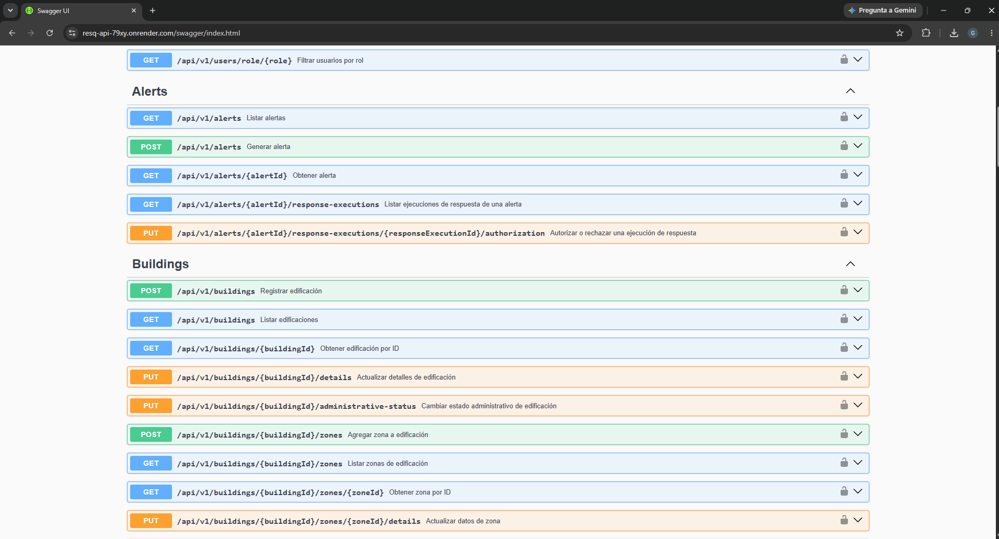
  <br><br>
  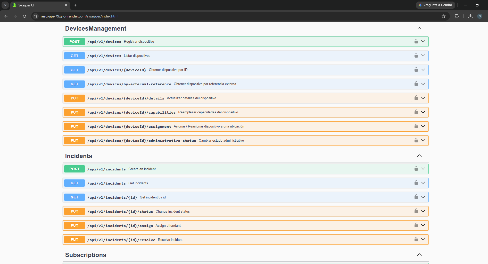
  <br><br>
  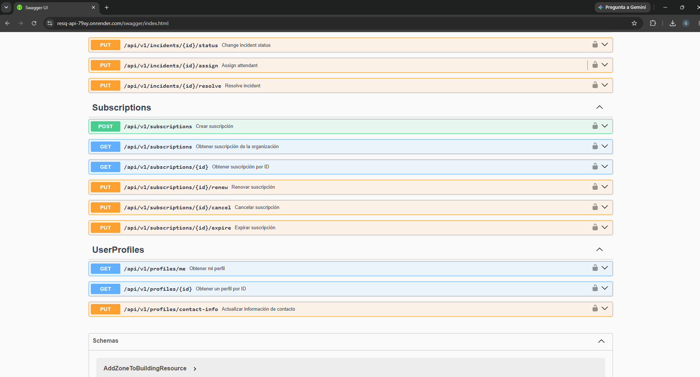
</p>

#### 6.2.1.8. Software Deployment Evidence for Sprint Review.

**Landing Page**

La Landing Page fue desplegada mediante GitHub Pages. Para ello, se creó un repositorio en GitHub y se configuró un workflow con GitHub Actions, el cual automatiza la publicación del sitio cada vez que se realizan cambios en la rama principal. Finalmente, se verificó el correcto funcionamiento del despliegue accediendo a la URL pública generada por GitHub Pages.

**Enlace de la Landing Page:**  
https://upc-1asi0572-202620-16518-resq.github.io/resq-landing-page/


**Web Application**

En esta sección se presentan las evidencias relacionadas con el despliegue de la aplicación web desarrollada como parte de la solución, incluyendo la configuración de los recursos necesarios para permitir su funcionamiento y acceso desde un entorno publicado.

Como parte de la validación del despliegue, se verificó el acceso a la aplicación a través de su URL pública y se comprobó el correcto funcionamiento de sus principales funcionalidades.

**Enlace de la aplicación web:**  

https://resq-frontend.ffaaliceht2003.workers.dev/login

**Backend**

Para el componente backend se realizó el despliegue del servicio en la plataforma Render, permitiendo que las funcionalidades y endpoints desarrollados puedan ser consumidos desde un entorno remoto.

Como parte de la validación del despliegue, se verificó el acceso a la documentación de la API mediante Swagger UI, desde donde es posible visualizar y probar los diferentes endpoints disponibles en el backend.

**Enlace del backend desplegado en Render:**

https://resq-api-79xy.onrender.com/swagger/index.html

#### 6.2.1.9. Team Collaboration Insights during Sprint

<div align="justify">

Durante el Sprint 1, el equipo desarrolló las actividades de implementación de manera colaborativa mediante GitHub, utilizando repositorios independientes para gestionar el desarrollo de los productos correspondientes al Sprint. La colaboración se realizó sobre el Landing Page, la aplicación Frontend y los Web Services, de acuerdo con las actividades de implementación desarrolladas por el equipo.

En el repositorio correspondiente al Landing Page, la información registrada en GitHub permite observar la participación de los integrantes del equipo mediante el analítico de contribuciones y el historial de commits realizados durante el desarrollo.

<p align="center">
  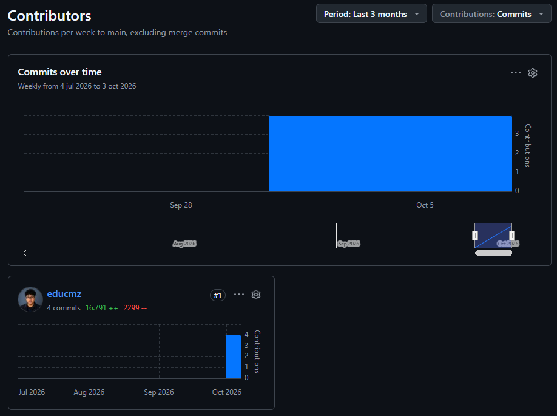
</p>

<p align="center">
  <em>Figura. Analítica de contribuciones de los integrantes en el repositorio del Landing Page durante el Sprint 1.</em>
</p>

<p align="center">
  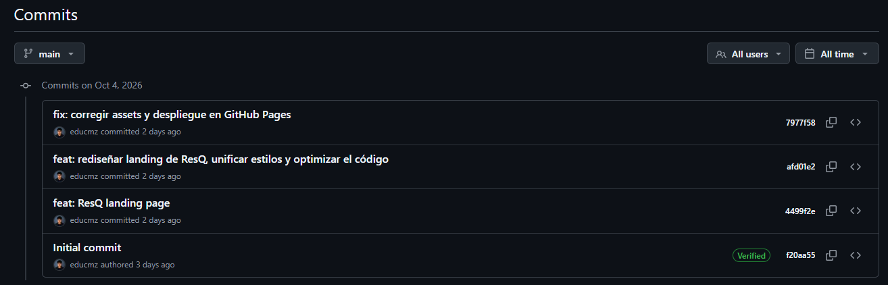
</p>

<p align="center">
  <em>Figura. Historial de commits realizados en el repositorio del Landing Page durante el Sprint 1.</em>
</p>

En el repositorio de la aplicación Frontend también se registran las contribuciones realizadas por los integrantes y la evolución de los cambios incorporados durante el Sprint.

<p align="center">
  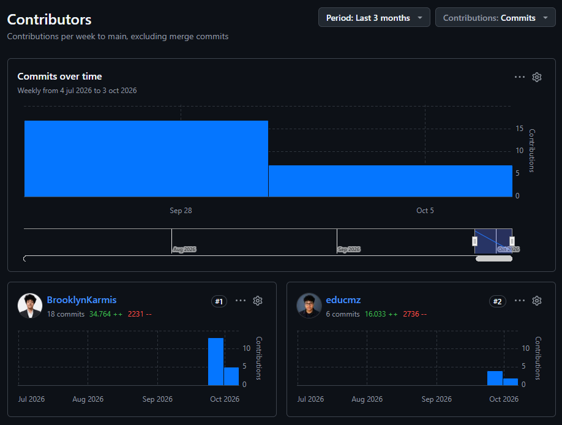
</p>

<p align="center">
  <em>Figura. Analítica de contribuciones de los integrantes en el repositorio de la aplicación Frontend durante el Sprint 1.</em>
</p>

<p align="center">
  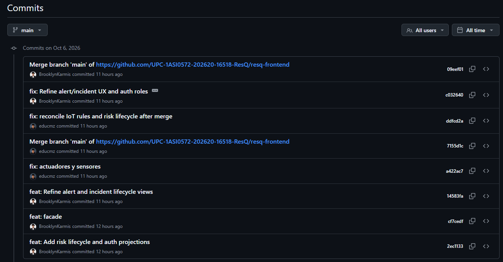
</p>

<p align="center">
  <em>Figura. Historial de commits realizados en el repositorio de la aplicación Frontend durante el Sprint 1.</em>
</p>

De manera similar, el repositorio correspondiente a los Web Services registra la actividad de los integrantes mediante sus contribuciones y commits, permitiendo realizar seguimiento al desarrollo realizado durante el Sprint.

<p align="center">
  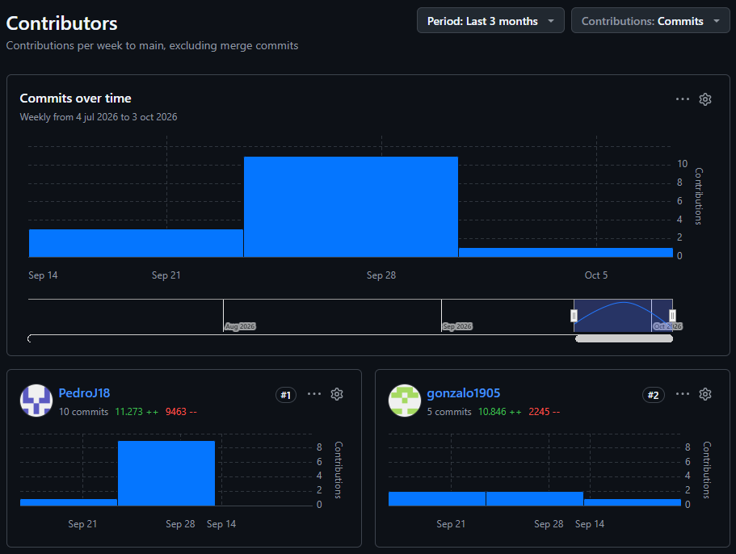
</p>

<p align="center">
  <em>Figura. Analítica de contribuciones de los integrantes en el repositorio de Web Services durante el Sprint 1.</em>
</p>

<p align="center">
  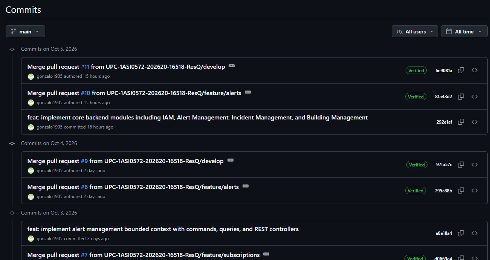
</p>

<p align="center">
  <em>Figura. Historial de commits realizados en el repositorio de Web Services durante el Sprint 1.</em>
</p>

Adicionalmente, el repositorio utilizado para la elaboración del informe mantiene su propio historial de colaboración, permitiendo observar la participación de los integrantes en la construcción y actualización de la documentación del proyecto.

<p align="center">
  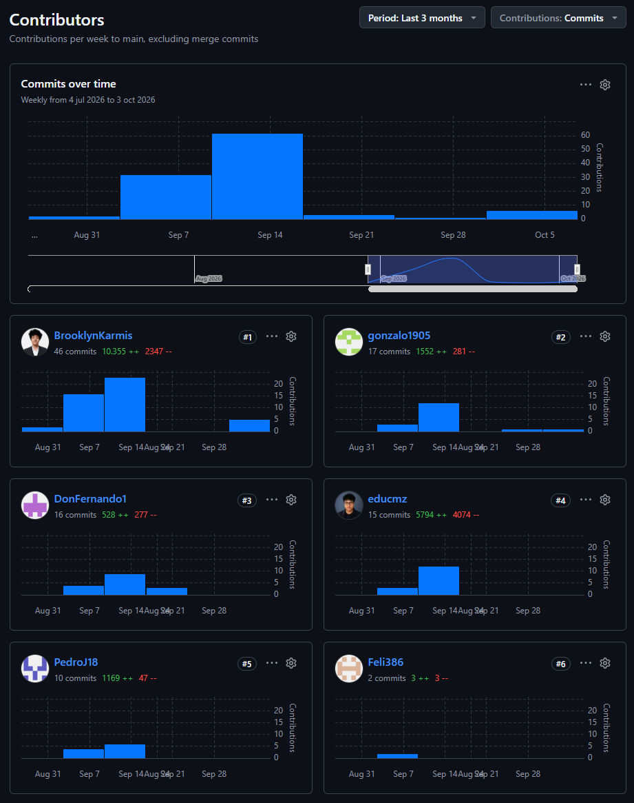
</p>

<p align="center">
  <em>Figura. Analítica de contribuciones de los integrantes en el repositorio del Report.</em>
</p>

<p align="center">
  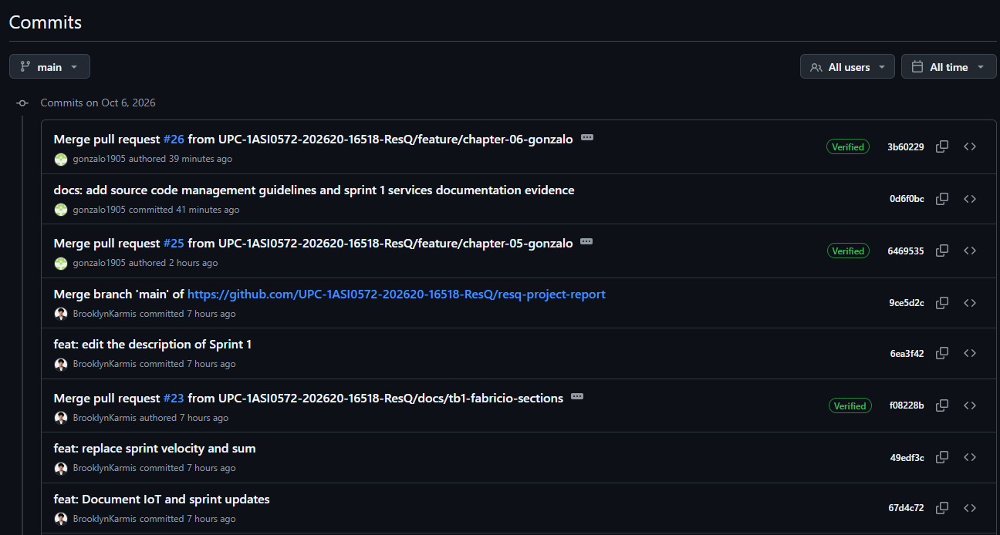
</p>

<p align="center">
  <em>Figura. Historial de commits realizados en el repositorio del Report.</em>
</p>

A partir de los analíticos de colaboración y del historial de commits, se evidencia la participación de los integrantes del equipo en las actividades desarrolladas durante el Sprint 1. Los registros de GitHub permiten realizar seguimiento a las contribuciones realizadas sobre los diferentes repositorios y observar la evolución incremental de los cambios incorporados durante el desarrollo.

El uso de repositorios independientes para el Landing Page, la aplicación Frontend y los Web Services permitió organizar el trabajo de implementación de cada producto y mantener trazabilidad sobre las modificaciones realizadas. Asimismo, el repositorio del Report permitió gestionar de manera independiente la elaboración y actualización de la documentación del proyecto.

En conjunto, estas evidencias permiten sustentar el trabajo colaborativo realizado por el equipo durante el Sprint 1 y la participación de sus integrantes en las actividades de implementación correspondientes.

</div>

## Conclusiones y recomendaciones

<p align="justify">
A partir del trabajo realizado durante AV1, se logró profundizar en la problemática asociada con la gestión de riesgos y emergencias en edificaciones y establecer una primera definición sustentada de la propuesta de ResQ. El desarrollo de los artefactos correspondientes a los Capítulos I, II, III y IV permitió mantener una relación progresiva entre la comprensión del problema, la investigación de los segmentos objetivo, la especificación de requisitos y las principales decisiones de diseño y arquitectura de la solución.
</p>

<p align="justify">
En relación con el Problem Statement definido durante el Lean UX Process, los resultados obtenidos durante las entrevistas proporcionaron evidencia sobre varios de los problemas inicialmente identificados. En el segmento de propietarios y administradores de edificaciones se observó que los sistemas relacionados con seguridad suelen encontrarse distribuidos entre diferentes plataformas, dispositivos y mecanismos de comunicación. Los tres participantes de este segmento indicaron que trabajan con diferentes sistemas o fuentes de información que no se encuentran completamente integrados, lo que puede requerir verificaciones físicas, llamadas, mensajes o la consulta de distintas interfaces antes de comprender completamente una situación de riesgo.
</p>

<p align="justify">
Asimismo, los participantes de este primer segmento destacaron la importancia de conocer rápidamente qué está ocurriendo y dónde está ocurriendo. La necesidad de identificar la ubicación del incidente estuvo presente en los tres entrevistados, junto con la necesidad de disponer de información confiable antes de tomar decisiones relacionadas con la seguridad. Estos resultados son consistentes con el problema identificado inicialmente por ResQ respecto a la fragmentación de la información y la dependencia de actividades manuales para coordinar la respuesta ante una emergencia.
</p>

<p align="justify">
La investigación también mostró que la automatización no debe entenderse como la eliminación total de la intervención humana. Los propietarios y administradores entrevistados presentaron una actitud favorable hacia la automatización de alertas, notificaciones, señalización y determinadas respuestas, pero también señalaron la necesidad de conservar mecanismos de supervisión o confirmación humana cuando una acción pueda generar consecuencias significativas sobre las personas o la infraestructura. Este hallazgo permitió reforzar la decisión de diferenciar dentro de ResQ entre respuestas automáticas previamente autorizadas y acciones de alto impacto que requieren la confirmación de un responsable autorizado.
</p>

<p align="justify">
Respecto al segundo segmento, conformado por empresas integradoras de automatización y gestión de edificios inteligentes, las entrevistas permitieron identificar necesidades diferentes pero relacionadas con la propuesta de ResQ. Los tres representantes entrevistados señalaron la integración e interoperabilidad como factores fundamentales al evaluar nuevas tecnologías. Entre los aspectos mencionados se encuentran la compatibilidad entre fabricantes, disponibilidad de APIs y protocolos, calidad de la documentación técnica, soporte del proveedor y posibilidad de realizar pruebas antes de incorporar una tecnología dentro de un proyecto.
</p>

<p align="justify">
Los participantes de este segmento también señalaron dificultades asociadas con tecnologías que presentan restricciones no identificadas inicialmente, documentación incompleta o comportamientos diferentes a los esperados durante la integración. Estas situaciones pueden generar horas adicionales de ingeniería, modificaciones de arquitectura, retrasos o mayor dependencia del proveedor. Como consecuencia, ResQ no debe plantearse únicamente como un producto funcional, sino también como una solución que pueda ser comprendida, evaluada, integrada y mantenida por empresas especializadas que trabajan con infraestructura perteneciente a diferentes fabricantes.
</p>

<p align="justify">
Los resultados obtenidos permiten contrastar varios de los assumptions definidos durante el Lean UX Process con el comportamiento y las necesidades expresadas por los representantes de los segmentos objetivo. En el primer segmento se encontró evidencia favorable a los assumptions relacionados con monitoreo centralizado, identificación del tipo y ubicación del riesgo, consulta de información histórica y continuidad de las funciones críticas. Los tres entrevistados manifestaron que las funciones esenciales de seguridad deberían continuar operando localmente cuando se pierde temporalmente la conexión a Internet.
</p>

<p align="justify">
En el segundo segmento también se encontró evidencia favorable a los assumptions relacionados con interoperabilidad, integración progresiva y evaluación técnica antes de adoptar una solución. Los tres representantes indicaron que la capacidad de integración constituye un factor fundamental y que una solución especializada puede resultar preferible frente al desarrollo interno cuando dispone de mecanismos de integración adecuados, documentación, soporte y evidencia de funcionamiento. Asimismo, parte de los entrevistados manifestó explícitamente la importancia de mantener funciones críticas localmente ante interrupciones de conectividad.
</p>

<p align="justify">
Estos hallazgos proporcionan sustento inicial para mantener Edge Computing como una de las decisiones centrales de ResQ. El procesamiento local permite plantear que la detección de determinadas condiciones de riesgo y la ejecución de respuestas críticas no dependan permanentemente de los servicios Cloud. Al mismo tiempo, la arquitectura debe permitir conservar los eventos producidos durante una interrupción y sincronizarlos posteriormente cuando se recupere la conectividad, manteniendo la trazabilidad de lo ocurrido.
</p>

<p align="justify">
Los resultados de investigación también permitieron transformar las necesidades identificadas en requisitos verificables. Las User Stories y Technical Stories definidas durante AV1 abarcan capacidades relacionadas con el monitoreo de edificaciones y zonas, consulta de mediciones, detección y contextualización de riesgos, generación de alertas, ejecución de respuestas, seguimiento de incidentes, administración de usuarios y permisos, continuidad operativa e integración con infraestructura existente. El Product Backlog permitió posteriormente priorizar estas capacidades de acuerdo con su aporte al MVP y al valor esperado para los segmentos objetivo.
</p>

<p align="justify">
De manera complementaria, el Strategic-Level Domain-Driven Design permitió identificar y organizar las responsabilidades principales del dominio, mientras que el Tactical-Level Domain-Driven Design permitió profundizar en la estructura interna de los Bounded Contexts. Como resultado de este proceso se establecieron los contextos Identity and Access Management (IAM), Risk Detection, Alert & Response Management, Building Management, Device Management, Monitoring, User, Incident y Connectivity Management, separando responsabilidades relacionadas con usuarios, dispositivos, edificaciones, monitoreo, detección, respuesta, incidentes y comunicación.
</p>

<p align="justify">
Esta separación permite plantear una arquitectura en la que la detección de riesgos, la respuesta ante emergencias y la administración de la infraestructura no dependan de un único componente monolítico. Asimismo, facilita que las capacidades relacionadas con dispositivos IoT, procesamiento Edge, servicios Cloud y aplicaciones digitales puedan evolucionar progresivamente manteniendo responsabilidades delimitadas entre los distintos elementos de la solución.
</p>

<p align="justify">
En relación con los Hypothesis Statements definidos durante Lean UX, los resultados obtenidos en AV1 todavía no permiten considerarlos completamente validados. Las entrevistas realizadas hasta este punto corresponden principalmente a actividades de investigación orientadas a comprender problemas, necesidades, comportamientos y criterios de decisión de los segmentos objetivo. Por esta razón, si bien los hallazgos proporcionan evidencia inicial favorable para determinados assumptions, todavía será necesario comprobar mediante prototipos, implementación y sesiones de validación si las funcionalidades propuestas generan los beneficios y resultados de negocio esperados.
</p>

<p align="justify">
Entre los aspectos que deberán validarse posteriormente se encuentran la capacidad de los usuarios para comprender rápidamente el estado de una edificación, identificar correctamente el tipo, nivel y ubicación de un riesgo, interpretar las alertas generadas, comprender las respuestas ejecutadas por el sistema y confiar en la automatización propuesta. Para el segmento de empresas integradoras también será necesario validar si los mecanismos de integración, la documentación técnica y el proceso de incorporación de ResQ resultan suficientemente claros y utilizables dentro de escenarios similares a los que enfrentan en proyectos reales.
</p>

<p align="justify">
Respecto a los criterios de éxito, durante AV1 se definieron métricas iniciales que deberán ser contrastadas en futuras etapas de validación. El primer Business Goal establece como referencia que al menos el 80 % de los participantes del piloto pueda identificar correctamente el tipo, nivel y zona de un riesgo, además de verificar la respuesta ejecutada por ResQ durante las primeras seis semanas del piloto. El segundo Business Goal plantea que al menos el 70 % de los participantes utilice ResQ al menos dos veces por semana para actividades de monitoreo o consulta de incidentes durante un periodo continuo de ocho semanas. Finalmente, el tercer Business Goal establece como referencia que al menos el 60 % de las administraciones u organizaciones participantes manifieste intención de continuar utilizando y pagar por el servicio, con una valoración mínima de cuatro sobre cinco al finalizar las primeras doce semanas del piloto.
</p>

<p align="justify">
Estos porcentajes deben considerarse actualmente como criterios de éxito definidos para futuras validaciones y no como resultados alcanzados. Durante AV1 todavía no se han desarrollado las Validation Interviews asociadas con los productos digitales ni existe evidencia suficiente para afirmar el cumplimiento de estas métricas. Las siguientes iteraciones deberán recopilar resultados reales y compararlos con estos valores para determinar si las hipótesis planteadas se mantienen, requieren ajustes o deben ser descartadas.
</p>

<p align="justify">
Como recomendación para las siguientes etapas, se debe mantener la trazabilidad entre los hallazgos obtenidos durante la investigación, las User Stories, las Technical Stories, el Product Backlog y las decisiones arquitectónicas. Cada funcionalidad que avance hacia implementación debería poder relacionarse con una necesidad previamente identificada y posteriormente con evidencia obtenida durante las pruebas y validaciones.
</p>

<p align="justify">
También será necesario comprobar técnicamente las decisiones relacionadas con la arquitectura IoT de ResQ. Entre las prioridades se encuentra validar la captura de información desde los sensores, el procesamiento local mediante Edge Computing, la clasificación de situaciones de riesgo, la ejecución de respuestas mediante actuadores, la conservación de eventos durante interrupciones de conectividad y la posterior sincronización con los servicios Cloud. Estas pruebas permitirán determinar si las decisiones planteadas durante el diseño pueden mantenerse bajo condiciones cercanas al funcionamiento esperado del producto.
</p>

<p align="justify">
Para las acciones que puedan producir un impacto significativo sobre personas o infraestructura, se recomienda mantener una estrategia de control humano acorde con los resultados obtenidos durante la investigación. Las respuestas automáticas deberían limitarse a acciones previamente autorizadas y técnicamente validadas, mientras que aquellas consideradas de alto impacto deberían conservar mecanismos de confirmación por parte de responsables con permisos adecuados.
</p>

<p align="justify">
En el caso del segmento de empresas integradoras, las siguientes iteraciones deben considerar no solamente el funcionamiento interno de ResQ, sino también su capacidad de integración. Será necesario validar los mecanismos y contratos de comunicación soportados, documentar adecuadamente APIs, protocolos, autenticación, estructura de datos y manejo de errores, y realizar pruebas que permitan demostrar que una fuente externa puede incorporarse sin exigir una sustitución completa de la infraestructura existente.
</p>

<p align="justify">
En relación con el Roadmap de los productos digitales, los siguientes pasos deberán concentrarse en transformar los requisitos y decisiones arquitectónicas definidos durante AV1 en experiencias e implementaciones que puedan ser evaluadas. Esto implica avanzar progresivamente en el diseño UI/UX del Landing Page y de las aplicaciones, desarrollar las capacidades priorizadas dentro del Product Backlog e implementar la comunicación entre Embedded Systems, Edge Computing, servicios Cloud y productos digitales.
</p>

<p align="justify">
A medida que se disponga de prototipos y primeras versiones funcionales, estos productos deberán presentarse a representantes de los segmentos objetivo mediante sesiones de validación. Los resultados obtenidos deberán utilizarse para revisar los Hypothesis Statements, contrastar los criterios de éxito, identificar problemas de usabilidad o comprensión, repriorizar el Product Backlog y actualizar el Roadmap según la evidencia recopilada.
</p>

<p align="justify">
Asimismo, la estrategia de evolución del producto debe considerar que el alcance de ResQ podrá ajustarse conforme se obtenga nueva información. Las funcionalidades que no demuestren aportar el beneficio esperado deberán ser revisadas, mientras que aquellas que presenten mayor valor para los segmentos podrán recibir una mayor prioridad dentro de las siguientes iteraciones. De esta manera, el Roadmap no debe considerarse una planificación inmutable, sino una guía evolutiva sustentada en evidencia obtenida durante el desarrollo y la validación.
</p>

<p align="justify">
Finalmente, el trabajo realizado durante AV1 permitió transformar una problemática inicialmente planteada a nivel conceptual en una propuesta progresivamente sustentada mediante investigación, requisitos y decisiones de diseño. Las entrevistas permitieron comprender con mayor precisión las dificultades de los propietarios y administradores de edificaciones y las condiciones bajo las cuales una empresa integradora evaluaría una solución como ResQ. A partir de estos hallazgos se establecieron requisitos, prioridades, Bounded Contexts y una arquitectura inicial que servirán como base para las siguientes etapas del proyecto.
</p>

<p align="justify">
Por tanto, AV1 no representa la validación definitiva de ResQ, sino el establecimiento de una base de conocimiento y diseño que deberá ser puesta a prueba durante las siguientes iteraciones. La implementación del MVP, las pruebas técnicas y las posteriores Validation Interviews permitirán determinar en qué medida las decisiones tomadas responden efectivamente a las necesidades identificadas y proporcionarán la evidencia necesaria para continuar, modificar o replantear las hipótesis y prioridades del producto.
</p>

<div style="page-break-before: always; break-before: page;"></div>

# Bibliografía

Instituto Nacional de Defensa Civil (INDECI). (2024). <em>Compendio Estadístico de la Gestión Reactiva 2024</em>. https://cdn.www.gob.pe/uploads/document/file/7186480/6158260-compendio-estadistico-2024.pdf

# Anexos

## Anexo A. Videos de Exposiciones

### Anexo A — AV1 — Sprint Review

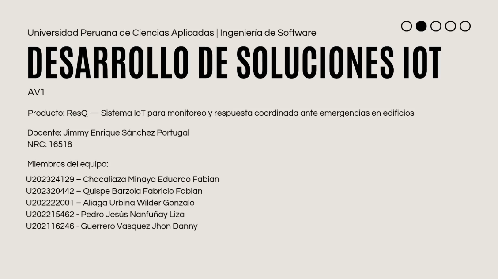

<p align="center">
  <strong>Figura 95. Video de exposición correspondiente a la entrega AV1.</strong>
</p>

**URL:** [Video exposición AV1](https://upcedupe-my.sharepoint.com/:v:/g/personal/u202320442_upc_edu_pe/IQCm8NIQa-7hSJu5uKB_dQbpAf0R6cugKBeBCTA1hMliXKs?nav=eyJyZWZlcnJhbEluZm8iOnsicmVmZXJyYWxBcHAiOiJPbmVEcml2ZUZvckJ1c2luZXNzIiwicmVmZXJyYWxBcHBQbGF0Zm9ybSI6IldlYiIsInJlZmVycmFsTW9kZSI6InZpZXciLCJyZWZlcnJhbFZpZXciOiJNeUZpbGVzTGlua0NvcHkifX0&e=3OfZUl)

<p align="justify">
<strong>Duración:</strong> 29:19
</p>