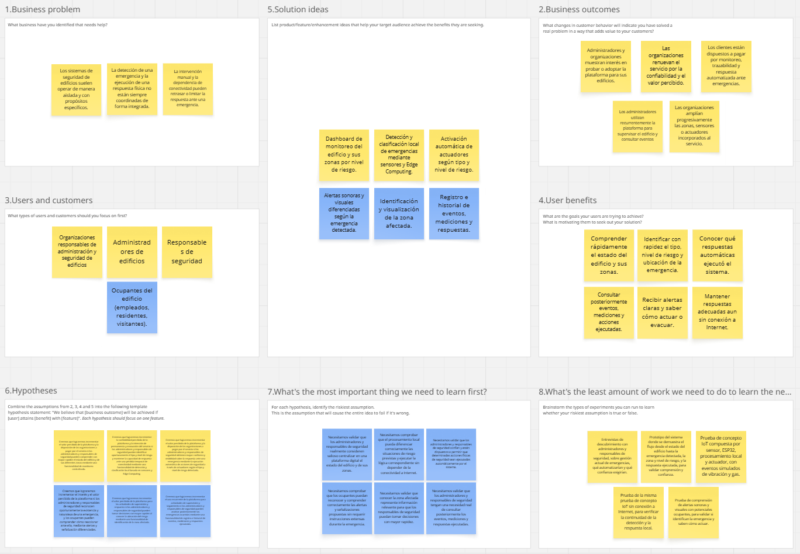

# Capítulo I: Introducción

> Imágenes del capítulo:
> `assets/images/chapter-01-introduction/`

## 1.1. Startup Profile

### 1.1.1. Descripción de la Startup
En una ciudad como Lima, caracterizada por su alta densidad de edificios y su constante vulnerabilidad ante emergencias como fugas de gas o movimientos sísmicos, la seguridad preventiva es un desafío crítico. Actualmente, la gestión de estos riesgos presenta grandes deficiencias: un simple error en la detección o el uso de múltiples alarmas desconectadas (que en el mejor de los casos solo emiten un aviso sonoro y dependen por completo de la rápida intervención humana) puede poner vidas en riesgo. Frente a esta realidad surge SecurityBear, una startup creada por estudiantes de la Facultad de Ingeniería de la Universidad Peruana de Ciencias Aplicadas (UPC). Reconocemos que, muchas veces, cuando las familias, trabajadores o empresas buscan estar verdaderamente preparados para cualquier eventualidad, se enfrentan a un mercado confuso y fragmentado. Surgen constantes dudas sobre cuántos dispositivos distintos se deben adquirir, su nivel de integración tecnológica y, sobre todo, si serán capaces de reportar un siniestro de manera automática y sin demoras.

Con nuestro sistema inteligente e integrado, centralizamos la detección de múltiples amenazas en un solo dispositivo automatizada. Utilizamos tecnología de sensores avanzados para identificar riesgos al instante, notificando a los usuarios en tiempo real y eliminando los retrasos propios de la intervención manual. Nuestro enfoque se centra en brindar tranquilidad y eficiencia, transformando la prevención de emergencias en algo accesible, seguro y capaz de actuar cuando cada segundo cuenta.

### 1.1.2. Perfiles de integrantes del equipo
| Nombres y Apellidos                  | Codigo     | Descripción                                                                                                                                                                                                                                                                                                                                                                                                                                                                                                                    | Foto |
|--------------------------------------|------------|--------------------------------------------------------------------------------------------------------------------------------------------------------------------------------------------------------------------------------------------------------------------------------------------------------------------------------------------------------------------------------------------------------------------------------------------------------------------------------------------------------------------------------|------|
|             |  |                           |      |
|            |  |                                                                                                          |    |
|         |  |                                                                                                                                                                                                                                                              |     |
| Ivan Fernando Sanchez Guevara        | U202218181 | Mi Nombre es Fernando Sanchez Guevara, tengo 22 años, actualmente estudiando la carrera de Ingeniería de Software. Me considero alguien disiplinado respecto con la puntualidad y desarrollar de la mejor manera las asignaciones de trabajo. Ademas, me preocupo por mi equipo, tratando de que no tengan ningun problema respecto al trabajo, y darles la mano para poder ayudar cuando lo necesiten. Por medio de mi compromiso, eh logrado realizar los proyectos en grupo de forma excelente y sin problemas en percanses |      |
|  |  |                          |     |

## 1.2. Solution Profile

### 1.2.1. Antecedentes y problemática
### What (¿Qué?)
- **¿Cuál es el problema?**  
La dificultad de gestionar múltiples alarmas durante emergencias, lo que ocasiona que las personas no cuenten con información clara ni oportuna sobre los protocolos y rutas de evacuación a seguir. Esto resulta en desorientación y pánico, aumentando el riesgo de que los usuarios sufran lesiones o queden atrapados al no saber cómo actuar ni adónde dirigirse durante un desastre.
- **¿Cuál es la relación con la persona en cuestión?**  
La relación con los usuarios se basa en ofrecerles una herramienta centralizada que simplifica la gestión de sensores y alertas en un solo ecosistema. Esto reduce la complejidad y proporciona información detallada, automatizada y fácil de comprender para actuar correctamente en casos de emergencia.

### When (¿Cuándo?)
- **¿Cuándo sucede el problema?**  
El problema ocurre de imprevisto antes y durante la emergencia. Principalmente al momento de intentar identificar la amenaza y seguir un protocolo de evacuación, donde la confusión y falta de indicaciones claras pueden ocasionar accidentes, obstrucción de vías de escape o el riesgo de quedar atrapado bajo los escombros.
- **¿Cuándo utiliza el cliente el producto?**  
El usuario utilizaría el sistema (SecurityBear / ResQ) en dos momentos clave: 1) En el instante crítico, para recibir una alerta temprana que identifique qué tipo de emergencia está ocurriendo (sismo, fuga de gas, incendio), y 2) Durante la evacuación, para recibir instrucciones y protocolos específicos que debe aplicar para ese caso en particular.

### Where (¿Dónde?)
- **¿Dónde está el cliente cuando utiliza el producto?**  
Desde cualquier lugar dentro de una infraestructura monitoreada, ya sea su hogar, su centro de trabajo, un centro comercial o un local.
- **¿A dónde se dirige?**  
El usuario se dirige hacia las zonas de seguridad establecidas, ya sean áreas de evacuación externas (zonas amplias y despejadas) o zonas de seguridad internas (como columnas o pilares estructurales antisísmicos).
- **¿Dónde surge el problema?**  
El problema se origina en el entorno físico afectado justo en el momento de la emergencia, agravado por la falta de un sistema unificado que guíe las decisiones en tiempo real. Surge en la brecha entre la activación de una alarma tradicional (que a lo mucho solo emite ruido) y la necesidad vital de conocer las acciones y rutas exactas que se deben tomar.

### Who (¿Quiénes?)
- **¿Quiénes están involucrados?**  
Los principales involucrados son todas las personas que se encuentren dentro de una estructura o edificio (residentes, trabajadores, visitantes), los administradores del recinto y los equipos de seguridad o brigadistas encargados de gestionar la emergencia.
- **¿A quiénes les sucede el problema?**  
El problema afecta principalmente a las personas que ocupan la edificación en el momento del siniestro, quienes sufren desorientación y exposición al peligro. También impacta a los responsables de seguridad y administradores de edificios, quienes enfrentan la dificultad de coordinar evacuaciones sin herramientas tecnológicas automatizadas.
- **¿Quién lo utiliza?**  
El sistema será utilizado por familias en edificios residenciales, trabajadores en oficinas y corporativos, así como administradores de instalaciones. Principalmente, está dirigido a personas e instituciones que valoran la prevención de riesgos y buscan una respuesta rápida, segura y guiada ante desastres.

### Why (¿Por qué?)
- **¿Cuál es la causa del problema?**  
La falta de un sistema centralizado, automatizado e inteligente para la gestión de riesgos. Actualmente, los edificios dependen de alarmas independientes y no interconectadas que solo generan ruido, dejando a los usuarios sin instrucciones claras, dependientes de la memoria humana y propensos a cometer errores fatales debido al estrés y el pánico del momento.

### How (¿Cómo?)
- **¿En qué condiciones nuestros clientes usan el producto?**  
Los clientes utilizan el sistema en condiciones de alto estrés, urgencia y posible pánico, con un tiempo de reacción muy limitado. Por ello, el producto funciona de manera automática, emitiendo alertas claras, directas y visuales/auditivas que no requieren interpretación compleja por parte del usuario.
- **¿Cómo nos conocieron nuestros compradores?**  
A través de alianzas estratégicas con constructoras y juntas de propietarios, ferias de seguridad y prevención de riesgos (Defensa Civil), marketing digital enfocado en la protección familiar y empresarial, y recomendaciones de consultores de seguridad laboral e infraestructura.
- **¿Cómo prefieren nuestros consumidores acceder a nuestro producto?**  
Mediante un sistema de hardware instalado en puntos clave del edificio (sensores inteligentes) que se sincroniza directamente con una aplicación móvil (ResQ) o un panel de control, permitiendo a los usuarios recibir notificaciones en tiempo real, conocer el estado de su entorno y revisar los protocolos preventivos desde sus smartphones.
- **¿Qué llevó a la persona a esa situación?**  
La vulnerabilidad inherente de vivir o trabajar en una ciudad con alto riesgo sísmico y fallas en infraestructuras (como fugas de gas o incendios). El profundo deseo de proteger su vida, la de su familia o la de sus empleados, sumado a la frustración de saber que los sistemas tradicionales son insuficientes para guiar a las personas cuando realmente importa.

### How much (¿Cuánto?)
El Perú se encuentra en el Cinturón de Fuego del Pacífico, lo que hace que ciudades como Lima sean altamente vulnerables a sismos de gran magnitud. Según proyecciones de Defensa Civil (INDECI), un terremoto severo en la capital podría dejar cientos de miles de damnificados debido a la alta densidad poblacional y la falta de preparación. Sumado a esto, el Cuerpo General de Bomberos atiende anualmente miles de emergencias por fugas de gas e incendios urbanos, donde una detección tardía suele escalar a tragedias irreparables. La desorientación durante los primeros minutos de un siniestro incrementa exponencialmente el riesgo de mortalidad y lesiones. SecurityBear busca reducir este impacto crítico al centralizar la detección de amenazas y eliminar la dependencia exclusiva del factor humano para dar aviso. Al optimizar los tiempos de respuesta y brindar directrices claras de evacuación a través de la tecnología, nuestra plataforma contribuye directamente a salvar vidas, mitigar daños personales y reducir las pérdidas materiales ocasionadas por la falta de una alerta temprana y coordinada.

### 1.2.2. Lean UX Process

#### 1.2.2.1. Lean UX Problem Statements
El estado actual de la seguridad y gestión de emergencias en edificios se ha enfocado principalmente en el uso de sistemas independientes y de propósito único; como detectores de humo, alarmas de gas o protocolos de evacuación manuales. Estos mecanismos son utilizados por administradores y responsables de seguridad de los edificios para identificar situaciones de riesgo; sin embargo, en muchos casos requieren de la intervención humana para coordinar una respuesta adecuada y reducir los posibles daños sobre las personas y la infraestructura.

Lo que las soluciones existentes no suelen resolver de manera integrada es la coordinación de la información entre la detección de una emergencia y la ejecución de una respuesta física ante ella. Esto dificulta centralizar la información obtenida, emitir alertas precisas, identificar el tipo de emergencia, ubicar la zona afectada y activar respuestas diferenciadas de acuerdo con las caracterísiticas y el nivel de gravedad del evento. Asimismo, muchos sistemas dependen de mecanismos de monitoreo o comunicación centralizados, lo que puede limitar su capacidad de respuesta cuando se pierde temporalmente la conectividad a Internet durante una emergencia.

Nuestra solución abordará esta brecha mediante una plataforma IoT capaz de monitorear variables ambientales y fisicas del edificio, procesar localmente la información obtenida de los sensores mediante Edge Computing, clasificar el tipo y grado de la emergencia y ejecutar acciones automáticas a través de actuadores (alarmas, luces de evacuación, ventilación, cierre de válvula) mientras reporta el evento y el estado del edificio en tiempo real.

Nuestro enfoque inicial estará dirigido a los propietarios y administradores de edificaciones que requieren supervisar las condiciones de seguridad de sus instalaciones para responder oportunamente ante situaciones de riesgo. La propuesta también estará orientada a responsables de seguridad, operaciones e infraestructura de empresas e instituciones que necesitan centralizar el monitoreo y coordinar respuestas en instalaciones con diferentes zonas y niveles de concurrencia.

Sabremos que hemos tenido éxito cuando los representantes de ambos segmentos utilicen la aplicación para monitorear el estado del edificio, reconocer el tipo y nivel de riesgo, ubicar la zona afectada, verificar la activación automática de respuestas adecuadas de los actuadores y consultar posteriormente los eventos registrados. Asimismo, consideraremos el interés de estos responsables por incorporar nuestra solución como complemento de sus mecanismos actuales de seguridad.

#### 1.2.2.2. Lean UX Assumptions

**Business Assumptions:**

1. Creemos que existe una demanda insatisfecha en el mercado de administración de edificios por soluciones que centralicen monitoreo y respuesta ante emergencias, actualmente cubierta parcialmente por sistemas aislados.
2. Creemos que existe una oportunidad para integrar en una única solución IoT la detección, clasificación, localización y respuesta automática ante situaciones de riesgo dentro de edificios.
3. Creemos que los propietarios y administradores de edificaciones, así como las empresas e instituciones con infraestructura propia, estarán dispuestas a adoptar una solución que complemente sus mecanismos actuales de seguridad mediante monitoreo y automatización.
4. Creemos que la capacidad de ejecutar respuestas críticas localmente, sin depender permanentemente de la conectividad a Internet, constituirá un elemento diferenciador de la propuesta frente a sistemas que requieren comunicación constante con servicios externos.
5. Creemos que un modelo de servicio orientado a edificios permitirá escalar progresivamente la solución mediante la incorporación de nuevos sensores, actuadores, zonas y dispositivos IoT según las necesidades de cada organización.
6. Creemos que los clientes estarán dispuestos a asumir un costo por una solución que contribuya al monitoreo continuo, la trazabilidad de eventos y la automatización de determinadas respuestas de seguridad.

**Business Outcome Assumptions:**

1. Creemos que demostrar una solución integrada de monitoreo y respuesta ante emergencias incrementará el interés de potenciales clientes en adoptar la plataforma frente al uso exclusivo de mecanismos independientes o manuales.
2. Creemos que al garantizar que las respuestas automáticas y del monitoreo sean las adecuadas, estas incrementarán la confiabilidad y por consecuencia; la intención de permanencia y renovación de nuestro servicio por parte de las organizaciones, reduciendo potencialmente la tasa de cancelación.
3. Creemos que reducir el esfuerzo requerido para supervisar manualmente las condiciones de seguridad del edificio incrementará el valor percibido de la plataforma y la disposición de las organizaciones a pagar por el servicio.
4. Creemos que la disponibilidad de registros históricos sobre eventos detectados, mediciones y respuestas ejecutadas incrementará el uso recurrente de la plataforma para actividades de supervisión y seguimiento.
5. Creemos que la posibilidad de incorporar progresivamente nuevas zonas, sensores y actuadores permitirá incrementar el alcance del servicio, expandiendo nuestra solución a nuevas necesidades.
6. Creemos que una implementación satisfactoria del MVP permitirá validar el interés de potenciales clientes y justificar la evolución de la solución hacia una mayor cantidad de dispositivos, tipos de emergencia y capacidades de respuesta.

**User Assumptions:**

1. Creemos que los propietarios y administradores de edificaciones necesitan supervisar continuamente las condiciones de seguridad de las instalaciones bajo su responsabilidad.
2. Creemos que los responsables de seguridad, operaciones e infraestructura de empresas e instituciones necesitan centralizar la información proveniente de diferentes zonas de sus instalaciones.
3. Creemos que ambos segmentos necesitan identificar rápidamente qué tipo de emergencia está ocurriendo, cuál es su nivel de riesgo y dónde se ha producido.
4. Creemos que ambos segmentos necesitan conocer qué respuestas automáticas fueron ejecutadas por el sistema durante una situación de riesgo.
5. Creemos que los administradores y responsables institucionales necesitan consultar posteriormente información sobre los eventos ocurridos para realizar actividades de seguimiento y análisis.
6. Creemos que los usuarios de ambos segmentos cuentan habitualmente con acceso a dispositivos digitales y están familiarizados con aplicaciones utilizadas para tareas de supervisión o gestión.
7. Creemos que los responsables de empresas e instituciones necesitan supervisar múltiples zonas desde una visión centralizada para coordinar adecuadamente una respuesta.
8. Creemos que los responsables de ambos segmentos valorarán una solución que pueda incorporarse progresivamente a la infraestructura existente sin requerir una sustitución completa de sus mecanismos actuales de seguridad.

**User Outcome and Benefit Assumptions:**

1. Creemos que los propietarios, administradores y responsables institucionales podrán comprender con mayor rapidez el estado de sus edificaciones al contar con información de sensores y alertas centralizada en una misma plataforma.
2. Creemos que podrán tomar decisiones con mayor rapidez al conocer el tipo de emergencia, el nivel de riesgo y la zona afectada.
3. Creemos que tendrán mayor visibilidad sobre la respuesta del sistema al poder verificar qué acciones automáticas fueron ejecutadas durante cada evento.
4. Creemos que podrán realizar un mejor seguimiento de las emergencias mediante el acceso al historial de eventos, mediciones y acciones ejecutadas.
5. Creemos que los responsables de empresas e instituciones podrán coordinar mejor la respuesta ante una emergencia al disponer de información centralizada sobre las diferentes zonas de sus instalaciones.
6. Creemos que ambos segmentos podrán reducir su dependencia de la supervisión y coordinación completamente manual durante los primeros momentos de una emergencia.
7. Creemos que tendrán mayor confianza en la continuidad de la respuesta del sistema al mantenerse las acciones críticas locales aun cuando se pierda temporalmente la conexión a Internet.

**Feature Assumptions:**

1. Creemos que una funcionalidad de **monitoreo del estado del edificio y sus zonas** permitirá a los usuarios de ambos segmentos conocer las condiciones actuales y detectar rápidamente la existencia de una situación de riesgo.
2. Creemos que una funcionalidad de **detección y clasificación local de emergencias mediante sensores y Edge Computing** permitirá identificar el tipo y nivel de riesgo sin depender permanentemente de servicios externos.
3. Creemos que una funcionalidad de **respuesta automática mediante actuadores** permitirá ejecutar acciones de seguridad apropiadas según el tipo y nivel de riesgo detectado.
4. Creemos que una funcionalidad de **alertas y señalización diferenciadas** permitirá a los responsables reconocer oportunamente la existencia y gravedad de una emergencia, y facilitar la comunicación de la respuesta.
5. Creemos que una funcionalidad de **identificación de la zona afectada** permitirá a los responsables de seguridad localizar con mayor rapidez el origen del evento y orientar adecuadamente la respuesta.
6. Creemos que una funcionalidad de **registro e historial de eventos** permitirá consultar posteriormente las emergencias detectadas, las mediciones registradas y las respuestas ejecutadas por el sistema.

#### 1.2.2.3. Lean UX Hypothesis Statements

1. Creemos que lograremos incrementar el valor percibido de la plataforma y la disposición a pagar por el servicio si los propietarios, administradores y responsables institucionales logran comprender con mayor rapidez el estado de sus edificaciones y zonas mediante una funcionalidad de monitoreo centralizado.
2. Creemos que lograremos incrementar la confiabilidad percibida de la plataforma y la intención de permanencia y renovación del servicio si los usuarios de ambos segmentos pueden identificar oportunamente el tipo y nivel de riesgo y mantener la capacidad de respuesta ante una pérdida temporal de conectividad mediante una funcionalidad de detección y clasificación local basada en sensores y Edge Computing.
3. Creemos que lograremos incrementar el valor percibido de la plataforma y la disposición a pagar por el servicio si los propietarios, administradores y responsables institucionales obtienen mayor confianza y visibilidad sobre la respuesta ante una emergencia mediante la ejecución automática de acciones de seguridad apropiadas según el tipo y nivel de riesgo detectado.
4. Creemos que lograremos incrementar el interés y valor percibido de la plataforma si los responsables de ambos segmentos pueden reconocer oportunamente la existencia y naturaleza de una emergencia y coordinar una respuesta más clara mediante alertas y señalización diferenciadas.
5. Creemos que lograremos incrementar el valor percibido de la plataforma para las actividades de supervisión y respuesta si los propietarios, administradores y responsables institucionales pueden tomar decisiones con mayor rapidez al conocer la ubicación del riesgo mediante una funcionalidad de identificación de la zona afectada.
6. Creemos que lograremos incrementar el uso recurrente de la plataforma para actividades de supervisión y seguimiento si los usuarios pueden analizar posteriormente las emergencias ocurridas mediante una funcionalidad de registro e historial de eventos, mediciones y respuestas ejecutadas.

#### 1.2.2.4. Lean UX Canvas

El Lean UX Canvas sintetiza los principales elementos identificados durante el Lean UX Process, relacionando el problema de negocio, los resultados esperados, los usuarios, los beneficios, las posibles soluciones y las hipótesis planteadas.

**Link del Canvas:** https://miro.com/app/board/uXjVHqdK0Tc=/?share_link_id=104899432918

En **Business Problem** se identificó que los sistemas de seguridad en edificios suelen funcionar de manera aislada y requieren intervención humana para coordinar la respuesta ante una emergencia. En **Business Outcomes** se definieron comportamientos esperados como el interés por adoptar la plataforma, la renovación del servicio, el uso recurrente y la disposición a pagar por sus funcionalidades.

En **Users and Customers** se consideró como usuarios principales a los administradores y responsables de seguridad, mientras que los ocupantes del edificio representan el segmento beneficiado por las alertas y mecanismos de evacuación. Los **User Benefits** se enfocan en comprender rápidamente el estado del edificio, identificar el tipo y ubicación del riesgo, conocer las respuestas ejecutadas y mantener acciones críticas aun sin conexión a Internet.

Las **Solution Ideas** incluyen el monitoreo por zonas, detección y clasificación local mediante Edge Computing, activación automática de actuadores, alertas diferenciadas, identificación de la zona afectada e historial de eventos. A partir de estas soluciones se formularon las hipótesis que deberán ser validadas durante el desarrollo del proyecto.

Finalmente, se identificó como principales aspectos a validar; la confianza de los usuarios en la automatización, la capacidad del sistema para clasificar correctamente los riesgos y la comprensión de las alertas por parte de los ocupantes. Para ello se llevarán a cabo entrevistas, pruebas de prototipo y pruebas de concepto con el dispositivo IoT.

## 1.3. Segmentos objetivo

Para garantizar que la solución IoT responda de manera adecuada a las necesidades de seguridad y gestión de emergencias en edificaciones, se han identificado dos segmentos principales vinculados directamente con el problema.

A continuación, se presentan sus principales características demográficas, geográficas y psicográficas, así como las necesidades que justifican su relevancia para la propuesta.

### Segmento objetivo #1: Propietarios y administradores de edificaciones

Este segmento está conformado por propietarios, administradores, facility managers y responsables de la gestión de edificios residenciales, comerciales o de uso mixto que buscan mejorar la capacidad de detección y respuesta ante situaciones de emergencia.

#### Aspectos demográficos

- **Sexo:** Masculino y femenino.
- **Rango de edad:** 30 años a más.
- **Nivel socioeconómico:** Principalmente clases A, B y C.
- **Ocupación:** Propietarios de inmuebles, administradores de edificios y responsables de mantenimiento, seguridad o gestión de instalaciones.

#### Aspectos geográficos

- **Nacionalidad:** Peruana.
- **Zona geográfica:** Principalmente zonas urbanas de Lima Metropolitana y otras ciudades con alta concentración de edificios residenciales, comerciales y empresariales.

#### Aspectos psicográficos

- **Dolor principal:** Dependencia de sistemas que se limitan a generar alertas y que requieren intervención humana para ejecutar acciones posteriores ante una emergencia.
- **Intereses:** Seguridad de los ocupantes, automatización de edificios, monitoreo remoto, prevención de riesgos y modernización de infraestructura.
- **Actitudes:** Valoran soluciones que permitan actuar rápidamente ante eventos críticos y que puedan integrarse progresivamente con la infraestructura existente.
- **Necesidades clave:** Monitoreo en tiempo real, identificación de la zona afectada, activación automática de alarmas y actuadores, registro de eventos y reducción del tiempo de respuesta ante emergencias.

### Segmento objetivo #2: Empresas e instituciones con infraestructura propia

Este segmento incluye empresas, universidades, colegios, clínicas, centros comerciales, hoteles, industrias e instituciones públicas o privadas que cuentan con edificaciones propias y requieren proteger a trabajadores, estudiantes, clientes, pacientes o visitantes ante situaciones como sismos, fugas de gas o incendios.

#### Aspectos demográficos y organizacionales

- **Tipo de organización:** Empresas e instituciones públicas o privadas.
- **Tamaño:** Principalmente medianas y grandes organizaciones con alta concurrencia de personas.
- **Responsables de decisión:** Jefes de seguridad, operaciones, mantenimiento, infraestructura, prevención de riesgos y administración.
- **Rango de edad de los responsables:** Aproximadamente entre 28 y 60 años.

#### Aspectos geográficos

- **Ubicación:** Principalmente zonas urbanas de Lima Metropolitana y principales ciudades del Perú.
- **Tipo de infraestructura:** Edificios corporativos, campus educativos, centros de salud, instalaciones comerciales, hoteles y complejos industriales.

#### Aspectos psicográficos

- **Dolor principal:** Dificultad para coordinar una respuesta rápida y centralizada cuando ocurre una emergencia en diferentes zonas de una instalación.
- **Intereses:** Protección de personas, continuidad operativa, cumplimiento de protocolos de seguridad, digitalización y automatización de procesos.
- **Actitudes:** Buscan soluciones confiables, escalables y capaces de integrarse con diferentes sensores y sistemas de seguridad.
- **Necesidades clave:** Detección temprana de riesgos, monitoreo por zonas, activación automática de alarmas y rutas de evacuación, centralización de información y almacenamiento del historial de incidentes.