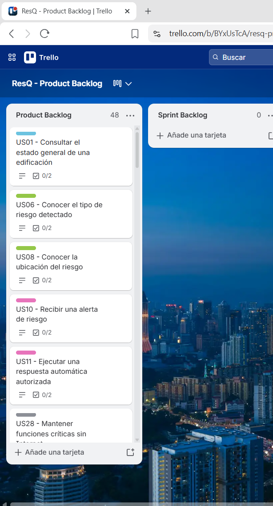

# Capítulo III: Requirements Specification

> Imágenes del capítulo:
> `assets/images/chapter-03-requirements-specification/`

## 3.1. User Stories

A partir de las necesidades identificadas durante el proceso de Requirements Elicitation & Analysis y de las funcionalidades planteadas durante el Lean UX Process, se definieron los Epics, User Stories y Technical Stories que representan los principales requisitos funcionales y técnicos de ResQ.

Las historias consideran las necesidades compartidas por propietarios y administradores de edificaciones, así como por responsables de seguridad, operaciones e infraestructura de empresas e instituciones. Entre ellas se encuentran el monitoreo centralizado, la detección y clasificación de riesgos, la identificación de la zona afectada, la generación de alertas, la ejecución y seguimiento de respuestas, la consulta de información histórica y la continuidad de las funciones críticas ante problemas de conectividad.

Asimismo, se consideran historias correspondientes al Landing Page y Technical Stories necesarias para soportar la comunicación entre las aplicaciones Web y Mobile, el RESTful API, el Edge API, los dispositivos IoT y los servicios externos utilizados por la solución.

| Epic / Story ID | Título | Descripción | Acceptance Criteria | Related Epic ID |
|---|---|---|---|---|
| EP01 | Monitoreo y detección de riesgos | Agrupa las funcionalidades relacionadas con el monitoreo de edificaciones, zonas, dispositivos y mediciones, así como la detección, clasificación y localización de situaciones de riesgo. | No aplica. Epic de agrupación funcional. | — |
| US01 | Monitorear el estado general de una edificación | Como propietario, administrador o responsable institucional, quiero conocer el estado general de la edificación, para identificar oportunamente si existe alguna situación que requiera atención. | **Scenario 1:** Given que el responsable tiene una edificación asignada, When consulta su estado actual, Then el sistema proporciona el estado general de la edificación y la condición de sus zonas monitoreadas.  **Scenario 2:** Given que existe un riesgo activo en alguna zona, When se actualiza el estado de la edificación, Then el sistema refleja la existencia del riesgo y su condición actual.  **Scenario 3:** Given que no existen riesgos activos, When se consulta el estado de la edificación, Then el sistema informa que las zonas monitoreadas se encuentran sin alertas activas. | EP01 |
| US02 | Monitorear el estado por zonas | Como responsable de una edificación, quiero conocer el estado individual de cada zona monitoreada, para identificar rápidamente dónde existe una condición anómala. | **Scenario 1:** Given que una edificación cuenta con varias zonas monitoreadas, When el responsable consulta sus estados, Then el sistema proporciona la condición correspondiente a cada zona.  **Scenario 2:** Given que una zona presenta una condición de riesgo, When el sistema procesa nuevas mediciones, Then la condición de dicha zona se actualiza de acuerdo con el evento detectado. | EP01 |
| US03 | Consultar mediciones y estado de dispositivos IoT | Como responsable de una edificación, quiero conocer las mediciones obtenidas y el estado de los dispositivos IoT, para verificar las condiciones monitoreadas y detectar posibles fallas de los equipos. | **Scenario 1:** Given que un sensor envía una medición válida, When el sistema procesa la información, Then registra el valor asociado con el dispositivo, la zona y el momento de captura.  **Scenario 2:** Given que un dispositivo deja de reportar dentro del periodo esperado, When el sistema evalúa su estado, Then identifica que el dispositivo no dispone de información reciente.  **Scenario 3:** Given que existen dispositivos asociados a una zona, When el responsable consulta su estado, Then el sistema proporciona la condición registrada de cada dispositivo. | EP01 |
| US04 | Identificar el tipo y nivel de riesgo | Como responsable de seguridad o administración, quiero conocer el tipo y nivel de riesgo detectado, para evaluar la situación y tomar decisiones con mayor rapidez. | **Scenario 1:** Given que las mediciones cumplen las condiciones configuradas para un riesgo, When el sistema procesa dichas mediciones, Then clasifica el evento según el tipo de riesgo correspondiente.  **Scenario 2:** Given que un riesgo ha sido detectado, When se evalúan las mediciones asociadas, Then el sistema determina el nivel de riesgo conforme a las reglas establecidas.  **Scenario 3:** Given que las mediciones se encuentran dentro de condiciones normales, When son evaluadas, Then el sistema no clasifica la situación como una emergencia. | EP01 |
| US05 | Identificar la zona afectada | Como responsable de una edificación, quiero conocer la ubicación del riesgo detectado, para dirigir la respuesta hacia la zona correcta sin perder tiempo en localizar el incidente. | **Scenario 1:** Given que un dispositivo asociado a una zona detecta una condición de riesgo, When se genera el evento, Then el sistema relaciona el evento con la zona correspondiente.  **Scenario 2:** Given que existe una emergencia activa, When el responsable consulta la información del evento, Then el sistema proporciona la zona en la que fue detectada.  **Scenario 3:** Given que diferentes zonas reportan eventos simultáneamente, When los eventos son procesados, Then cada evento conserva su ubicación correspondiente. | EP01 |
| US06 | Supervisar remotamente la edificación | Como propietario, administrador o responsable institucional, quiero consultar remotamente el estado de las zonas y eventos de la edificación, para mantener la supervisión aunque no me encuentre físicamente en las instalaciones. | **Scenario 1:** Given que el responsable se encuentra autenticado y dispone de conectividad, When accede desde un cliente autorizado, Then puede consultar la información disponible de las edificaciones asignadas.  **Scenario 2:** Given que se registra nueva información de monitoreo, When el responsable vuelve a consultar el estado, Then recibe la información más reciente disponible en la plataforma. | EP01 |
| EP02 | Alertas y respuesta ante emergencias | Agrupa las funcionalidades destinadas a informar sobre situaciones de riesgo y ejecutar, supervisar y controlar las respuestas asociadas a una emergencia. | No aplica. Epic de agrupación funcional. | — |
| US07 | Recibir alertas de emergencia | Como responsable de una edificación, quiero recibir alertas cuando se detecte una situación de riesgo, para conocer oportunamente qué ocurre y poder realizar el seguimiento correspondiente. | **Scenario 1:** Given que el sistema identifica una condición de emergencia, When se genera la alerta, Then esta incluye al menos el tipo de riesgo, nivel de riesgo, zona afectada y momento de detección.  **Scenario 2:** Given que existen responsables autorizados para recibir alertas, When se genera una emergencia, Then el sistema envía la notificación a los destinatarios correspondientes.  **Scenario 3:** Given que cambia el nivel de un riesgo activo, When se procesa la nueva condición, Then la información asociada con la alerta se actualiza. | EP02 |
| US08 | Activar alertas sonoras y visuales | Como responsable de seguridad, quiero que una emergencia pueda generar señales sonoras y visuales, para advertir a los ocupantes mediante más de un mecanismo de comunicación. | **Scenario 1:** Given que un evento cumple las condiciones configuradas para generar una alerta local, When se activa la respuesta correspondiente, Then el sistema acciona los mecanismos sonoros definidos para el evento.  **Scenario 2:** Given que el mismo evento requiere señalización visual, When se activa la respuesta, Then el sistema acciona los mecanismos visuales correspondientes.  **Scenario 3:** Given que el riesgo deja de cumplir las condiciones de activación, When el evento finaliza según las reglas establecidas, Then los actuadores cambian al estado definido para el cierre de la emergencia. | EP02 |
| US09 | Ejecutar respuestas automáticas mediante actuadores | Como responsable de una edificación, quiero que determinadas acciones de seguridad se ejecuten automáticamente según el riesgo detectado, para reducir el tiempo de respuesta durante los primeros momentos de una emergencia. | **Scenario 1:** Given que existe una regla de respuesta asociada con un tipo y nivel de riesgo, When el evento cumple las condiciones de la regla, Then el sistema ejecuta las acciones configuradas mediante los actuadores correspondientes.  **Scenario 2:** Given que un evento no cumple las condiciones de una regla automática, When es procesado, Then el sistema no ejecuta la acción asociada con dicha regla.  **Scenario 3:** Given que una acción automática es ejecutada, When finaliza su procesamiento, Then el sistema registra el resultado de la ejecución. | EP02 |
| US10 | Consultar las respuestas ejecutadas | Como responsable de una edificación, quiero conocer qué acciones se ejecutaron durante una emergencia, para tener visibilidad sobre la respuesta realizada por el sistema. | **Scenario 1:** Given que un incidente cuenta con acciones ejecutadas, When el responsable consulta su información, Then el sistema proporciona las acciones realizadas, su momento de ejecución y su resultado.  **Scenario 2:** Given que una acción automática no puede completarse, When el sistema registra su resultado, Then la acción queda identificada con el estado correspondiente. | EP02 |
| US11 | Validar acciones de alto impacto | Como responsable autorizado, quiero confirmar determinadas acciones antes de su ejecución cuando requieran intervención humana, para evitar respuestas automáticas que puedan generar un riesgo adicional. | **Scenario 1:** Given que una acción está configurada para requerir confirmación humana, When se detecta la condición que la solicita, Then la acción permanece pendiente y no se ejecuta automáticamente.  **Scenario 2:** Given que existe una acción pendiente de confirmación, When un responsable autorizado la confirma, Then el sistema ejecuta la acción y registra la decisión.  **Scenario 3:** Given que un usuario sin autorización intenta confirmar la acción, When realiza la solicitud, Then el sistema rechaza la operación. | EP02 |
| US12 | Realizar seguimiento del estado de un incidente | Como responsable de seguridad u operaciones, quiero conocer el estado actual y el responsable de atención de un incidente, para coordinar las acciones hasta su cierre. | **Scenario 1:** Given que existe un incidente activo, When cambia su estado de atención, Then el sistema conserva el nuevo estado y el momento del cambio.  **Scenario 2:** Given que un responsable asume la atención de un incidente, When la asignación es registrada, Then el sistema relaciona al responsable con el evento.  **Scenario 3:** Given que la emergencia ha finalizado, When un responsable autorizado registra su cierre, Then el incidente queda identificado como finalizado y conserva su información histórica. | EP02 |
| EP03 | Historial y analítica de incidentes | Agrupa las funcionalidades destinadas al almacenamiento, consulta, búsqueda y análisis cuantitativo de los eventos registrados por la plataforma. | No aplica. Epic de agrupación funcional. | — |
| US13 | Consultar el historial de incidentes | Como propietario, administrador o responsable institucional, quiero consultar los incidentes registrados anteriormente, para realizar seguimiento y analizar situaciones ocurridas en la edificación. | **Scenario 1:** Given que existen incidentes registrados, When el responsable consulta el historial, Then el sistema proporciona los eventos disponibles asociados con sus edificaciones.  **Scenario 2:** Given que un incidente ha sido cerrado, When se consulta posteriormente el historial, Then el evento continúa disponible con la información registrada durante su atención. | EP03 |
| US14 | Buscar y filtrar incidentes históricos | Como responsable de una edificación, quiero localizar incidentes utilizando diferentes criterios, para encontrar información histórica sin revisar manualmente múltiples registros. | **Scenario 1:** Given que existen incidentes históricos, When el responsable establece un rango de fechas, Then el sistema devuelve los eventos comprendidos en dicho periodo.  **Scenario 2:** Given que existen incidentes de diferentes características, When se aplican criterios de tipo de riesgo, zona o severidad, Then el sistema devuelve únicamente los eventos que cumplen dichos criterios.  **Scenario 3:** Given que ningún evento cumple los criterios establecidos, When se realiza la búsqueda, Then el sistema devuelve un resultado sin coincidencias. | EP03 |
| US15 | Consultar el detalle histórico de un incidente | Como responsable de una edificación, quiero revisar las mediciones y acciones asociadas con un incidente, para comprender cómo evolucionó y cómo respondió el sistema. | **Scenario 1:** Given que existe un incidente registrado, When el responsable consulta su detalle, Then el sistema proporciona las mediciones, clasificación, zona y acciones asociadas disponibles.  **Scenario 2:** Given que el incidente presenta cambios durante su evolución, When se consulta su información histórica, Then los registros conservan la secuencia temporal correspondiente.  **Scenario 3:** Given que una acción fue ejecutada durante el incidente, When se consulta el evento, Then el sistema permite identificar el resultado registrado de dicha acción. | EP03 |
| US16 | Consultar indicadores de seguridad | Como propietario, administrador o responsable institucional, quiero consultar indicadores obtenidos de los eventos registrados, para identificar tendencias y evaluar la gestión de seguridad de las instalaciones. | **Scenario 1:** Given que existen incidentes registrados dentro de un periodo, When el responsable solicita los indicadores, Then el sistema calcula la cantidad de eventos correspondiente al periodo seleccionado.  **Scenario 2:** Given que existen eventos asociados con distintas zonas y tipos de riesgo, When se procesan los indicadores, Then el sistema calcula su distribución utilizando la información registrada.  **Scenario 3:** Given que existen registros suficientes de detección y atención, When se solicita el análisis correspondiente, Then el sistema calcula los tiempos definidos a partir de los timestamps almacenados.  **Scenario 4:** Given que existen eventos generados por diferentes dispositivos, When se procesan los registros, Then el sistema permite identificar la recurrencia de eventos por dispositivo o zona. | EP03 |
| EP04 | Acceso, permisos y continuidad operativa | Agrupa los requisitos relacionados con acceso autorizado, diferenciación de responsabilidades y continuidad de las funciones críticas de ResQ. | No aplica. Epic de agrupación funcional. | — |
| US17 | Acceder de forma autenticada | Como responsable autorizado, quiero acceder a la plataforma mediante una identidad válida, para consultar únicamente la información asociada con mis responsabilidades. | **Scenario 1:** Given que un usuario proporciona credenciales válidas, When solicita autenticarse, Then el sistema valida su identidad y autoriza el acceso correspondiente.  **Scenario 2:** Given que las credenciales proporcionadas no son válidas, When se solicita autenticación, Then el sistema rechaza el acceso.  **Scenario 3:** Given que una identidad no dispone de una sesión válida, When solicita un recurso protegido, Then el sistema impide el acceso al recurso. | EP04 |
| US18 | Gestionar permisos según el rol | Como responsable de una organización, quiero que las capacidades de acceso estén diferenciadas según el rol del usuario, para proteger información y acciones sensibles. | **Scenario 1:** Given que un usuario posee un rol con autorización para una operación, When solicita ejecutarla, Then el sistema permite la acción.  **Scenario 2:** Given que un usuario no posee autorización para una operación, When solicita ejecutarla, Then el sistema rechaza la acción.  **Scenario 3:** Given que existen usuarios con diferentes responsabilidades, When acceden a los recursos del sistema, Then las operaciones disponibles respetan los permisos asociados con cada rol. | EP04 |
| US19 | Mantener respuestas críticas sin conexión a Internet | Como responsable de una edificación, quiero que las funciones críticas de detección y respuesta continúen localmente cuando se pierde Internet, para mantener la capacidad de reacción durante una emergencia. | **Scenario 1:** Given que el dispositivo IoT y el Edge se encuentran operativos pero no existe conexión con los servicios remotos, When se detecta localmente una condición de riesgo, Then la detección continúa siendo procesada localmente.  **Scenario 2:** Given que una regla local requiere ejecutar una respuesta crítica, When no existe conectividad externa, Then los actuadores asociados continúan pudiendo ejecutar la respuesta definida.  **Scenario 3:** Given que se generaron eventos durante una interrupción de conectividad, When la comunicación se restablece, Then la información pendiente puede incorporarse al historial de la plataforma. | EP04 |
| EP05 | Landing Page | Agrupa las funcionalidades del sitio web estático orientadas a comunicar la propuesta de valor de ResQ y conectar a los visitantes de los segmentos objetivo con los productos digitales correspondientes. | No aplica. Epic de agrupación funcional. | — |
| US20 | Conocer la propuesta de ResQ | Como visitante, quiero comprender qué problema aborda ResQ y cómo funciona la propuesta, para determinar si resulta relevante para mis necesidades de seguridad y gestión de emergencias. | **Scenario 1:** Given que un visitante accede al Landing Page, When consulta la información de la propuesta, Then encuentra una descripción del problema que ResQ busca atender y del enfoque general de la solución.  **Scenario 2:** Given que el visitante evalúa la propuesta, When consulta sus capacidades principales, Then encuentra información relacionada con monitoreo, detección, alertas, respuesta e historial de eventos. | EP05 |
| US21 | Conocer los beneficios para propietarios y administradores | Como visitante del segmento de propietarios y administradores de edificaciones, quiero conocer los beneficios de ResQ aplicables a la gestión de un edificio, para evaluar si la solución responde a mis necesidades. | **Scenario 1:** Given que un visitante pertenece al segmento de propietarios o administradores, When consulta la información dirigida a su segmento, Then encuentra beneficios relacionados con supervisión, localización de riesgos, alertas y reducción de dependencia de coordinación manual.  **Scenario 2:** Given que el visitante desea conocer el alcance de la solución, When consulta la propuesta destinada a su segmento, Then puede identificar las principales capacidades relacionadas con la gestión de una edificación. | EP05 |
| US22 | Conocer los beneficios para empresas e instituciones | Como visitante del segmento de empresas e instituciones con infraestructura propia, quiero conocer los beneficios de ResQ para instalaciones con múltiples zonas, para evaluar su aporte a la seguridad y coordinación operativa. | **Scenario 1:** Given que un visitante representa a una empresa o institución, When consulta la información destinada a su segmento, Then encuentra beneficios relacionados con monitoreo por zonas, coordinación, continuidad y centralización de información.  **Scenario 2:** Given que la organización gestiona infraestructura de alta concurrencia, When el visitante consulta el alcance de ResQ, Then puede identificar beneficios relacionados con detección y respuesta ante incidentes en diferentes zonas. | EP05 |
| US23 | Acceder al producto digital correspondiente | Como visitante, quiero acceder desde el Landing Page al producto digital correspondiente, para continuar mi experiencia con ResQ según mi segmento y dispositivo. | **Scenario 1:** Given que existe un punto de acceso a la Web Application, When el visitante selecciona la acción correspondiente, Then es dirigido al destino configurado para la aplicación web.  **Scenario 2:** Given que existe una Mobile Application disponible para distribución, When el visitante selecciona el acceso correspondiente, Then es dirigido al punto de descarga definido.  **Scenario 3:** Given que existen destinos diferenciados según el segmento o producto, When el visitante selecciona una acción, Then la redirección corresponde al destino asociado con dicha acción. | EP05 |
| EP06 | Plataforma IoT e integraciones | Agrupa las capacidades técnicas necesarias para la comunicación entre clientes, servicios de backend, Edge Computing, Embedded Systems, almacenamiento e integraciones externas. | No aplica. Epic de agrupación técnica. | — |
| TS01 | Proveer servicios mediante RESTful API | Como Developer, quiero disponer de un RESTful API para exponer los recursos de ResQ, para integrar las aplicaciones Web y Mobile con los servicios de la plataforma. | **Scenario 1:** Given que un cliente autorizado realiza una solicitud válida de un recurso existente, When el RESTful API procesa la solicitud, Then responde con un estado exitoso y los datos correspondientes.  **Scenario 2:** Given que una solicitud contiene información inválida, When el RESTful API la procesa, Then responde con un estado de error de cliente y una descripción procesable del problema.  **Scenario 3:** Given que una solicitud intenta acceder a un recurso sin autorización suficiente, When el API valida el acceso, Then rechaza la solicitud con el estado correspondiente.  **Scenario 4:** Given que el recurso solicitado no existe, When se procesa la solicitud, Then el API responde indicando que el recurso no fue encontrado. | EP06 |
| TS02 | Proveer comunicación mediante Edge API | Como Developer, quiero disponer de un Edge API para recibir información de los dispositivos y coordinar acciones locales, para desacoplar los Embedded Systems de los servicios remotos. | **Scenario 1:** Given que un dispositivo autorizado envía telemetría válida, When el Edge API recibe la solicitud, Then acepta la información y confirma su recepción.  **Scenario 2:** Given que la telemetría recibida no cumple la estructura esperada, When el Edge API la procesa, Then rechaza la solicitud sin incorporar información inválida.  **Scenario 3:** Given que una acción debe ser enviada a un dispositivo disponible, When el Edge API procesa la instrucción, Then transmite la acción al dispositivo correspondiente y registra su resultado. | EP06 |
| TS03 | Capturar información desde los Embedded Systems | Como Developer, quiero que la Embedded Application recolecte mediciones de los sensores conectados, para proporcionar información al Edge necesaria para detectar situaciones de riesgo. | **Scenario 1:** Given que un sensor se encuentra operativo, When llega el momento establecido para realizar una lectura, Then la Embedded Application obtiene la medición correspondiente.  **Scenario 2:** Given que una medición ha sido obtenida correctamente, When la aplicación prepara la información, Then la relaciona con el dispositivo y el momento de captura antes de enviarla al Edge.  **Scenario 3:** Given que un sensor no puede proporcionar una lectura válida, When la Embedded Application detecta la condición, Then evita reportar la medición como válida y registra el estado correspondiente. | EP06 |
| TS04 | Procesar localmente reglas de detección y respuesta | Como Developer, quiero procesar localmente las condiciones de riesgo y reglas de respuesta, para que las funciones críticas no dependan permanentemente de servicios Cloud. | **Scenario 1:** Given que el Edge recibe mediciones válidas, When estas cumplen una regla de detección configurada, Then el procesamiento local genera el evento correspondiente.  **Scenario 2:** Given que el evento requiere una acción automática local, When se cumple la regla de respuesta, Then el Edge solicita la ejecución de los actuadores correspondientes.  **Scenario 3:** Given que las mediciones no cumplen las condiciones de una emergencia, When son evaluadas, Then no se genera una respuesta de emergencia asociada con dicha regla. | EP06 |
| TS05 | Sincronizar eventos después de una pérdida de conectividad | Como Developer, quiero conservar temporalmente la información generada durante una interrupción de conectividad y sincronizarla al restablecerse la comunicación, para evitar la pérdida del historial de eventos. | **Scenario 1:** Given que no existe comunicación con el servicio remoto, When el Edge genera información que requiere persistencia remota, Then la información permanece disponible para sincronización posterior.  **Scenario 2:** Given que existe información pendiente de sincronización, When se restablece la conectividad, Then el sistema transmite los registros pendientes al servicio correspondiente.  **Scenario 3:** Given que un registro ya fue sincronizado correctamente, When se ejecuta nuevamente el proceso de sincronización, Then el sistema evita generar duplicados del mismo registro. | EP06 |
| TS06 | Integrar un servicio externo de notificaciones | Como Developer, quiero integrar un servicio externo que permita entregar notificaciones a los responsables, para complementar la comunicación de alertas generadas por ResQ. | **Scenario 1:** Given que existe una alerta válida y destinatarios configurados, When la plataforma envía la solicitud al servicio externo, Then procesa la respuesta del proveedor y registra el resultado del envío.  **Scenario 2:** Given que el servicio externo acepta la solicitud, When se recibe la respuesta satisfactoria, Then la plataforma registra que la notificación fue procesada correctamente.  **Scenario 3:** Given que el servicio externo devuelve un error o no se encuentra disponible, When la plataforma procesa la respuesta, Then registra el fallo sin impedir el procesamiento interno del incidente. | EP06 |
| TS07 | Procesar información cuantitativa para indicadores | Como Developer, quiero procesar los datos de eventos y mediciones mediante cálculos cuantitativos, para proporcionar los indicadores requeridos por las aplicaciones de ResQ. | **Scenario 1:** Given que existe información histórica válida, When se solicita un indicador para un periodo determinado, Then el servicio calcula el resultado utilizando únicamente los registros incluidos en dicho periodo.  **Scenario 2:** Given que se solicita una distribución por zona o tipo de riesgo, When el servicio procesa los registros, Then devuelve los valores agregados correspondientes a cada categoría.  **Scenario 3:** Given que no existen datos suficientes para calcular un indicador, When se procesa la solicitud, Then el servicio informa que no existen registros suficientes sin producir valores ficticios. | EP06 |
| TS08 | Mantener una experiencia adaptable entre dispositivos | Como Developer, quiero que las aplicaciones orientadas a los usuarios puedan utilizarse en diferentes dimensiones de dispositivo, para mantener disponibles las funciones esenciales desde computadoras y dispositivos móviles. | **Scenario 1:** Given que un usuario utiliza una dimensión de dispositivo soportada, When accede a una función principal de la aplicación, Then la información y operaciones esenciales permanecen disponibles.  **Scenario 2:** Given que un usuario utiliza la aplicación desde una computadora o dispositivo móvil soportado, When consulta el mismo recurso, Then recibe información consistente proveniente de los servicios de la plataforma.  **Scenario 3:** Given que cambia la dimensión disponible del cliente, When continúa utilizando la aplicación, Then las funciones esenciales permanecen operables sin pérdida de información funcional. | EP06 |

## 3.2. Impact Mapping

El Impact Mapping de ResQ permite relacionar los objetivos de negocio definidos para la solución con los comportamientos que se espera promover en los representantes de los segmentos objetivo y con las funcionalidades necesarias para conseguir dichos resultados.

Para su elaboración se consideraron dos User Personas: el **Administrador de edificaciones (UP01)**, representante del segmento de propietarios y administradores de edificaciones, y el **Responsable institucional de seguridad y operaciones (UP02)**, representante de empresas e instituciones con infraestructura propia.

A partir de los resultados obtenidos durante el proceso de investigación y de las hipótesis planteadas durante el Lean UX Process, se establecieron tres Business Goals medibles relacionados con la validación de la utilidad operativa de ResQ, el uso recurrente de la plataforma y la validación de su valor comercial.

### Business Goals

**BG01 — Validar la utilidad operativa del MVP**

Lograr que al menos el **80 % de los usuarios participantes del piloto** pueda identificar correctamente el tipo, nivel y zona de un riesgo, así como verificar la respuesta ejecutada por ResQ en escenarios de prueba, durante las **primeras 6 semanas del piloto**.

**BG02 — Promover el uso recurrente de ResQ**

Lograr que al menos el **70 % de los usuarios participantes del piloto** utilice ResQ al menos **dos veces por semana** para actividades de monitoreo o consulta de incidentes durante un periodo continuo de **8 semanas**.

**BG03 — Validar el valor comercial de la solución**

Lograr que al menos el **60 % de las administraciones u organizaciones participantes del piloto** manifieste una intención de continuar utilizando y pagar por el servicio, con una valoración mínima de **4 sobre 5**, al finalizar las **primeras 12 semanas del piloto**.

### Estructura del Impact Mapping

#### BG01 — Validar la utilidad operativa del MVP

| Actor / Persona | Impact | Deliverable | User Stories |
|---|---|---|---|
| **UP01 — Administrador de edificaciones** | Consulta el estado de la edificación y sus zonas para reconocer rápidamente una condición anómala sin depender de diferentes fuentes de información. | Monitoreo centralizado del estado de la edificación, zonas y dispositivos IoT. | **US01:** Como propietario, administrador o responsable institucional, quiero conocer el estado general de la edificación, para identificar oportunamente si existe alguna situación que requiera atención.  **US02:** Como responsable de una edificación, quiero conocer el estado individual de cada zona monitoreada, para identificar rápidamente dónde existe una condición anómala.  **US03:** Como responsable de una edificación, quiero conocer las mediciones obtenidas y el estado de los dispositivos IoT, para verificar las condiciones monitoreadas y detectar posibles fallas de los equipos. |
| **UP01 — Administrador de edificaciones** | Identifica el tipo, nivel y ubicación del riesgo antes de tomar decisiones relacionadas con la emergencia. | Detección, clasificación y localización de riesgos. | **US04:** Como responsable de seguridad o administración, quiero conocer el tipo y nivel de riesgo detectado, para evaluar la situación y tomar decisiones con mayor rapidez.  **US05:** Como responsable de una edificación, quiero conocer la ubicación del riesgo detectado, para dirigir la respuesta hacia la zona correcta sin perder tiempo en localizar el incidente. |
| **UP01 — Administrador de edificaciones** | Comprueba qué acciones fueron realizadas por el sistema durante la emergencia y mantiene visibilidad sobre su resultado. | Seguimiento de respuestas ejecutadas mediante actuadores. | **US09:** Como responsable de una edificación, quiero que determinadas acciones de seguridad se ejecuten automáticamente según el riesgo detectado, para reducir el tiempo de respuesta durante los primeros momentos de una emergencia.  **US10:** Como responsable de una edificación, quiero conocer qué acciones se ejecutaron durante una emergencia, para tener visibilidad sobre la respuesta realizada por el sistema. |
| **UP02 — Responsable institucional de seguridad y operaciones** | Supervisa diferentes zonas utilizando información centralizada para comprender con rapidez el alcance de una emergencia. | Monitoreo por zonas y detección localizada de incidentes. | **US02:** Como responsable de una edificación, quiero conocer el estado individual de cada zona monitoreada, para identificar rápidamente dónde existe una condición anómala.  **US04:** Como responsable de seguridad o administración, quiero conocer el tipo y nivel de riesgo detectado, para evaluar la situación y tomar decisiones con mayor rapidez.  **US05:** Como responsable de una edificación, quiero conocer la ubicación del riesgo detectado, para dirigir la respuesta hacia la zona correcta sin perder tiempo en localizar el incidente. |
| **UP02 — Responsable institucional de seguridad y operaciones** | Recibe información oportuna sobre los incidentes y coordina su atención hasta el cierre. | Alertas de emergencia y seguimiento del estado del incidente. | **US07:** Como responsable de una edificación, quiero recibir alertas cuando se detecte una situación de riesgo, para conocer oportunamente qué ocurre y poder realizar el seguimiento correspondiente.  **US12:** Como responsable de seguridad u operaciones, quiero conocer el estado actual y el responsable de atención de un incidente, para coordinar las acciones hasta su cierre. |
| **UP02 — Responsable institucional de seguridad y operaciones** | Mantiene control humano sobre las acciones que pueden producir un impacto significativo sobre personas u operaciones. | Confirmación de acciones de alto impacto. | **US11:** Como responsable autorizado, quiero confirmar determinadas acciones antes de su ejecución cuando requieran intervención humana, para evitar respuestas automáticas que puedan generar un riesgo adicional. |

#### BG02 — Promover el uso recurrente de ResQ

| Actor / Persona | Impact | Deliverable | User Stories |
|---|---|---|---|
| **UP01 — Administrador de edificaciones** | Supervisa periódicamente sus instalaciones incluso cuando no se encuentra físicamente en el edificio. | Supervisión remota de la edificación. | **US06:** Como propietario, administrador o responsable institucional, quiero consultar remotamente el estado de las zonas y eventos de la edificación, para mantener la supervisión aunque no me encuentre físicamente en las instalaciones. |
| **UP01 — Administrador de edificaciones** | Consulta eventos anteriores para revisar lo ocurrido y realizar seguimiento de la seguridad de la edificación. | Historial y detalle de incidentes. | **US13:** Como propietario, administrador o responsable institucional, quiero consultar los incidentes registrados anteriormente, para realizar seguimiento y analizar situaciones ocurridas en la edificación.  **US15:** Como responsable de una edificación, quiero revisar las mediciones y acciones asociadas con un incidente, para comprender cómo evolucionó y cómo respondió el sistema. |
| **UP01 — Administrador de edificaciones** | Localiza información histórica sin tener que revisar manualmente correos, documentos o registros separados. | Búsqueda y filtrado de incidentes históricos. | **US14:** Como responsable de una edificación, quiero localizar incidentes utilizando diferentes criterios, para encontrar información histórica sin revisar manualmente múltiples registros. |
| **UP02 — Responsable institucional de seguridad y operaciones** | Utiliza información histórica y cuantitativa para realizar seguimiento de incidentes y detectar patrones entre zonas. | Indicadores y análisis de información de seguridad. | **US16:** Como propietario, administrador o responsable institucional, quiero consultar indicadores obtenidos de los eventos registrados, para identificar tendencias y evaluar la gestión de seguridad de las instalaciones.  **US13:** Como propietario, administrador o responsable institucional, quiero consultar los incidentes registrados anteriormente, para realizar seguimiento y analizar situaciones ocurridas en la edificación. |
| **UP02 — Responsable institucional de seguridad y operaciones** | Integra ResQ a sus actividades habituales de seguimiento manteniendo responsabilidades diferenciadas entre las áreas participantes. | Acceso y permisos de acuerdo con responsabilidades. | **US17:** Como responsable autorizado, quiero acceder a la plataforma mediante una identidad válida, para consultar únicamente la información asociada con mis responsabilidades.  **US18:** Como responsable de una organización, quiero que las capacidades de acceso estén diferenciadas según el rol del usuario, para proteger información y acciones sensibles. |
| **UP02 — Responsable institucional de seguridad y operaciones** | Continúa confiando en el sistema durante interrupciones de conectividad al mantenerse disponibles las funciones críticas locales. | Continuidad de detección y respuesta sin dependencia permanente de Internet. | **US19:** Como responsable de una edificación, quiero que las funciones críticas de detección y respuesta continúen localmente cuando se pierde Internet, para mantener la capacidad de reacción durante una emergencia. |

#### BG03 — Validar el valor comercial de la solución

| Actor / Persona | Impact | Deliverable | User Stories |
|---|---|---|---|
| **UP01 — Administrador de edificaciones** | Reconoce que ResQ disminuye la necesidad de consultar diferentes sistemas y coordinar manualmente las primeras acciones ante una emergencia. | Monitoreo centralizado, alertas y respuestas automáticas. | **US01:** Como propietario, administrador o responsable institucional, quiero conocer el estado general de la edificación, para identificar oportunamente si existe alguna situación que requiera atención.  **US07:** Como responsable de una edificación, quiero recibir alertas cuando se detecte una situación de riesgo, para conocer oportunamente qué ocurre y poder realizar el seguimiento correspondiente.  **US09:** Como responsable de una edificación, quiero que determinadas acciones de seguridad se ejecuten automáticamente según el riesgo detectado, para reducir el tiempo de respuesta durante los primeros momentos de una emergencia. |
| **UP01 — Administrador de edificaciones** | Comprende la propuesta de valor de ResQ y reconoce su aplicación en la administración de edificaciones. | Landing Page orientado a propietarios y administradores. | **US20:** Como visitante, quiero comprender qué problema aborda ResQ y cómo funciona la propuesta, para determinar si resulta relevante para mis necesidades de seguridad y gestión de emergencias.  **US21:** Como visitante del segmento de propietarios y administradores de edificaciones, quiero conocer los beneficios de ResQ aplicables a la gestión de un edificio, para evaluar si la solución responde a mis necesidades.  **US23:** Como visitante, quiero acceder desde el Landing Page al producto digital correspondiente, para continuar mi experiencia con ResQ según mi segmento y dispositivo. |
| **UP01 — Administrador de edificaciones** | Percibe confianza en la continuidad del servicio al comprobar que la respuesta crítica no depende permanentemente de Internet. | Procesamiento y respuesta local ante pérdida de conectividad. | **US19:** Como responsable de una edificación, quiero que las funciones críticas de detección y respuesta continúen localmente cuando se pierde Internet, para mantener la capacidad de reacción durante una emergencia. |
| **UP02 — Responsable institucional de seguridad y operaciones** | Reconoce valor en una plataforma capaz de centralizar información y coordinar el seguimiento de incidentes entre distintas áreas. | Monitoreo, alertas y seguimiento centralizado de incidentes. | **US02:** Como responsable de una edificación, quiero conocer el estado individual de cada zona monitoreada, para identificar rápidamente dónde existe una condición anómala.  **US07:** Como responsable de una edificación, quiero recibir alertas cuando se detecte una situación de riesgo, para conocer oportunamente qué ocurre y poder realizar el seguimiento correspondiente.  **US12:** Como responsable de seguridad u operaciones, quiero conocer el estado actual y el responsable de atención de un incidente, para coordinar las acciones hasta su cierre. |
| **UP02 — Responsable institucional de seguridad y operaciones** | Percibe que la plataforma puede adaptarse a una organización con diferentes responsabilidades y necesidades de seguimiento. | Gestión de roles, historial e indicadores de seguridad. | **US18:** Como responsable de una organización, quiero que las capacidades de acceso estén diferenciadas según el rol del usuario, para proteger información y acciones sensibles.  **US13:** Como propietario, administrador o responsable institucional, quiero consultar los incidentes registrados anteriormente, para realizar seguimiento y analizar situaciones ocurridas en la edificación.  **US16:** Como propietario, administrador o responsable institucional, quiero consultar indicadores obtenidos de los eventos registrados, para identificar tendencias y evaluar la gestión de seguridad de las instalaciones. |
| **UP02 — Responsable institucional de seguridad y operaciones** | Comprende los beneficios de ResQ para instalaciones con múltiples zonas y evalúa la solución como una alternativa aplicable a su organización. | Landing Page orientado a empresas e instituciones. | **US20:** Como visitante, quiero comprender qué problema aborda ResQ y cómo funciona la propuesta, para determinar si resulta relevante para mis necesidades de seguridad y gestión de emergencias.  **US22:** Como visitante del segmento de empresas e instituciones con infraestructura propia, quiero conocer los beneficios de ResQ para instalaciones con múltiples zonas, para evaluar su aporte a la seguridad y coordinación operativa.  **US23:** Como visitante, quiero acceder desde el Landing Page al producto digital correspondiente, para continuar mi experiencia con ResQ según mi segmento y dispositivo. |

### Impact Mapping de ResQ

El siguiente artefacto representa visualmente la relación entre los Business Goals, los User Personas, los cambios de comportamiento esperados, los Deliverables y las User Stories identificadas para ResQ.

### Análisis del Impact Mapping

El primer Business Goal se encuentra orientado a comprobar que las principales capacidades operativas de ResQ aportan valor durante una situación de riesgo. Para ambos User Personas resulta fundamental poder reconocer el estado de la infraestructura, identificar la zona afectada, conocer el tipo y nivel del riesgo y disponer de visibilidad sobre las acciones ejecutadas. Por ello, sus principales Deliverables se concentran en el monitoreo, la detección, la localización, las alertas y el seguimiento de las respuestas.

El segundo Business Goal busca incorporar ResQ en las actividades habituales de supervisión y seguimiento. Para el Administrador de edificaciones, esto implica poder revisar remotamente el estado de sus instalaciones y consultar fácilmente incidentes anteriores. Para el Responsable institucional, implica además utilizar indicadores, gestionar responsabilidades diferenciadas y mantener continuidad operativa cuando existe una pérdida temporal de conectividad.

El tercer Business Goal permite relacionar las capacidades funcionales de ResQ con la validación de su propuesta de valor. En el caso de los propietarios y administradores, el valor se concentra en reducir la fragmentación de información y la dependencia de coordinación manual. Para las empresas e instituciones, se complementa con la necesidad de coordinar diferentes áreas, administrar accesos, analizar información histórica y mantener funciones críticas disponibles. El Landing Page participa en este objetivo comunicando de forma diferenciada los beneficios de la solución a cada segmento y facilitando el acceso al producto digital correspondiente.

En conjunto, el Impact Mapping mantiene trazabilidad desde los objetivos de negocio hasta las User Stories definidas en la sección anterior. De esta manera, cada funcionalidad considerada para ResQ se encuentra relacionada con un cambio de comportamiento esperado en alguno de los User Personas y con un resultado que contribuye a los objetivos establecidos para el modelo de negocio.

## 3.3. Product Backlog

El Product Backlog de ResQ organiza y prioriza las User Stories y Technical Stories definidas para los productos digitales de la solución. La priorización considera principalmente el valor que cada historia aporta al modelo de negocio, a los segmentos objetivo y a la validación de las principales hipótesis planteadas para la propuesta.

Las historias relacionadas con el Landing Page se encuentran entre los primeros elementos del backlog debido a que este producto permitirá comunicar la propuesta de valor de ResQ y apoyar la validación temprana del interés de los segmentos objetivo. Posteriormente, se priorizan las capacidades principales del producto IoT relacionadas con monitoreo, identificación de riesgos, localización de emergencias, alertas y respuesta.

Las estimaciones se expresan mediante Story Points utilizando los valores 1, 2, 3, 5 y 8. Estos valores representan el esfuerzo relativo necesario para implementar cada historia considerando su complejidad, incertidumbre e integración con los diferentes componentes de la solución.

| Order | User Story ID | Title | Description | Story Points |
|---:|---|---|---|---:|
| 1 | US20 | Conocer la propuesta de ResQ | Como visitante, quiero comprender qué problema aborda ResQ y cómo funciona la propuesta, para determinar si resulta relevante para mis necesidades de seguridad y gestión de emergencias. | 2 |
| 2 | US21 | Conocer los beneficios para propietarios y administradores | Como visitante del segmento de propietarios y administradores de edificaciones, quiero conocer los beneficios de ResQ aplicables a la gestión de un edificio, para evaluar si la solución responde a mis necesidades. | 2 |
| 3 | US22 | Conocer los beneficios para empresas e instituciones | Como visitante del segmento de empresas e instituciones con infraestructura propia, quiero conocer los beneficios de ResQ para instalaciones con múltiples zonas, para evaluar su aporte a la seguridad y coordinación operativa. | 2 |
| 4 | US23 | Acceder al producto digital correspondiente | Como visitante, quiero acceder desde el Landing Page al producto digital correspondiente, para continuar mi experiencia con ResQ según mi segmento y dispositivo. | 2 |
| 5 | US01 | Monitorear el estado general de una edificación | Como propietario, administrador o responsable institucional, quiero conocer el estado general de la edificación, para identificar oportunamente si existe alguna situación que requiera atención. | 5 |
| 6 | US04 | Identificar el tipo y nivel de riesgo | Como responsable de seguridad o administración, quiero conocer el tipo y nivel de riesgo detectado, para evaluar la situación y tomar decisiones con mayor rapidez. | 8 |
| 7 | US05 | Identificar la zona afectada | Como responsable de una edificación, quiero conocer la ubicación del riesgo detectado, para dirigir la respuesta hacia la zona correcta sin perder tiempo en localizar el incidente. | 3 |
| 8 | US07 | Recibir alertas de emergencia | Como responsable de una edificación, quiero recibir alertas cuando se detecte una situación de riesgo, para conocer oportunamente qué ocurre y poder realizar el seguimiento correspondiente. | 5 |
| 9 | US09 | Ejecutar respuestas automáticas mediante actuadores | Como responsable de una edificación, quiero que determinadas acciones de seguridad se ejecuten automáticamente según el riesgo detectado, para reducir el tiempo de respuesta durante los primeros momentos de una emergencia. | 8 |
| 10 | US10 | Consultar las respuestas ejecutadas | Como responsable de una edificación, quiero conocer qué acciones se ejecutaron durante una emergencia, para tener visibilidad sobre la respuesta realizada por el sistema. | 3 |
| 11 | US02 | Monitorear el estado por zonas | Como responsable de una edificación, quiero conocer el estado individual de cada zona monitoreada, para identificar rápidamente dónde existe una condición anómala. | 5 |
| 12 | US03 | Consultar mediciones y estado de dispositivos IoT | Como responsable de una edificación, quiero conocer las mediciones obtenidas y el estado de los dispositivos IoT, para verificar las condiciones monitoreadas y detectar posibles fallas de los equipos. | 5 |
| 13 | US08 | Activar alertas sonoras y visuales | Como responsable de seguridad, quiero que una emergencia pueda generar señales sonoras y visuales, para advertir a los ocupantes mediante más de un mecanismo de comunicación. | 5 |
| 14 | US19 | Mantener respuestas críticas sin conexión a Internet | Como responsable de una edificación, quiero que las funciones críticas de detección y respuesta continúen localmente cuando se pierde Internet, para mantener la capacidad de reacción durante una emergencia. | 8 |
| 15 | US12 | Realizar seguimiento del estado de un incidente | Como responsable de seguridad u operaciones, quiero conocer el estado actual y el responsable de atención de un incidente, para coordinar las acciones hasta su cierre. | 5 |
| 16 | US11 | Validar acciones de alto impacto | Como responsable autorizado, quiero confirmar determinadas acciones antes de su ejecución cuando requieran intervención humana, para evitar respuestas automáticas que puedan generar un riesgo adicional. | 5 |
| 17 | US06 | Supervisar remotamente la edificación | Como propietario, administrador o responsable institucional, quiero consultar remotamente el estado de las zonas y eventos de la edificación, para mantener la supervisión aunque no me encuentre físicamente en las instalaciones. | 3 |
| 18 | US13 | Consultar el historial de incidentes | Como propietario, administrador o responsable institucional, quiero consultar los incidentes registrados anteriormente, para realizar seguimiento y analizar situaciones ocurridas en la edificación. | 3 |
| 19 | US14 | Buscar y filtrar incidentes históricos | Como responsable de una edificación, quiero localizar incidentes utilizando diferentes criterios, para encontrar información histórica sin revisar manualmente múltiples registros. | 5 |
| 20 | US15 | Consultar el detalle histórico de un incidente | Como responsable de una edificación, quiero revisar las mediciones y acciones asociadas con un incidente, para comprender cómo evolucionó y cómo respondió el sistema. | 5 |
| 21 | US16 | Consultar indicadores de seguridad | Como propietario, administrador o responsable institucional, quiero consultar indicadores obtenidos de los eventos registrados, para identificar tendencias y evaluar la gestión de seguridad de las instalaciones. | 8 |
| 22 | US17 | Acceder de forma autenticada | Como responsable autorizado, quiero acceder a la plataforma mediante una identidad válida, para consultar únicamente la información asociada con mis responsabilidades. | 3 |
| 23 | US18 | Gestionar permisos según el rol | Como responsable de una organización, quiero que las capacidades de acceso estén diferenciadas según el rol del usuario, para proteger información y acciones sensibles. | 5 |
| 24 | TS04 | Procesar localmente reglas de detección y respuesta | Como Developer, quiero procesar localmente las condiciones de riesgo y reglas de respuesta, para que las funciones críticas no dependan permanentemente de servicios Cloud. | 8 |
| 25 | TS03 | Capturar información desde los Embedded Systems | Como Developer, quiero que la Embedded Application recolecte mediciones de los sensores conectados, para proporcionar información al Edge necesaria para detectar situaciones de riesgo. | 8 |
| 26 | TS02 | Proveer comunicación mediante Edge API | Como Developer, quiero disponer de un Edge API para recibir información de los dispositivos y coordinar acciones locales, para desacoplar los Embedded Systems de los servicios remotos. | 8 |
| 27 | TS01 | Proveer servicios mediante RESTful API | Como Developer, quiero disponer de un RESTful API para exponer los recursos de ResQ, para integrar las aplicaciones Web y Mobile con los servicios de la plataforma. | 8 |
| 28 | TS05 | Sincronizar eventos después de una pérdida de conectividad | Como Developer, quiero conservar temporalmente la información generada durante una interrupción de conectividad y sincronizarla al restablecerse la comunicación, para evitar la pérdida del historial de eventos. | 8 |
| 29 | TS06 | Integrar un servicio externo de notificaciones | Como Developer, quiero integrar un servicio externo que permita entregar notificaciones a los responsables, para complementar la comunicación de alertas generadas por ResQ. | 5 |
| 30 | TS07 | Procesar información cuantitativa para indicadores | Como Developer, quiero procesar los datos de eventos y mediciones mediante cálculos cuantitativos, para proporcionar los indicadores requeridos por las aplicaciones de ResQ. | 8 |
| 31 | TS08 | Mantener una experiencia adaptable entre dispositivos | Como Developer, quiero que las aplicaciones orientadas a los usuarios puedan utilizarse en diferentes dimensiones de dispositivo, para mantener disponibles las funciones esenciales desde computadoras y dispositivos móviles. | 5 |

### Product Backlog en Jira

El Product Backlog se mantiene también en Jira, donde las historias se encuentran registradas y ordenadas de acuerdo con la prioridad definida para el producto. La herramienta permitirá posteriormente seleccionar las historias correspondientes a cada Sprint y realizar el seguimiento de su evolución durante el desarrollo.

**Link del Product Backlog:** [COMPLETAR]
